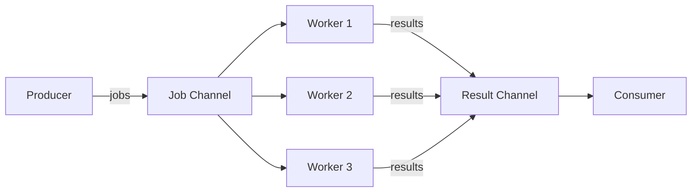
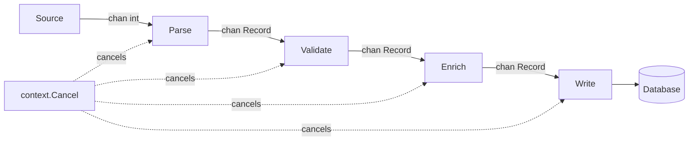
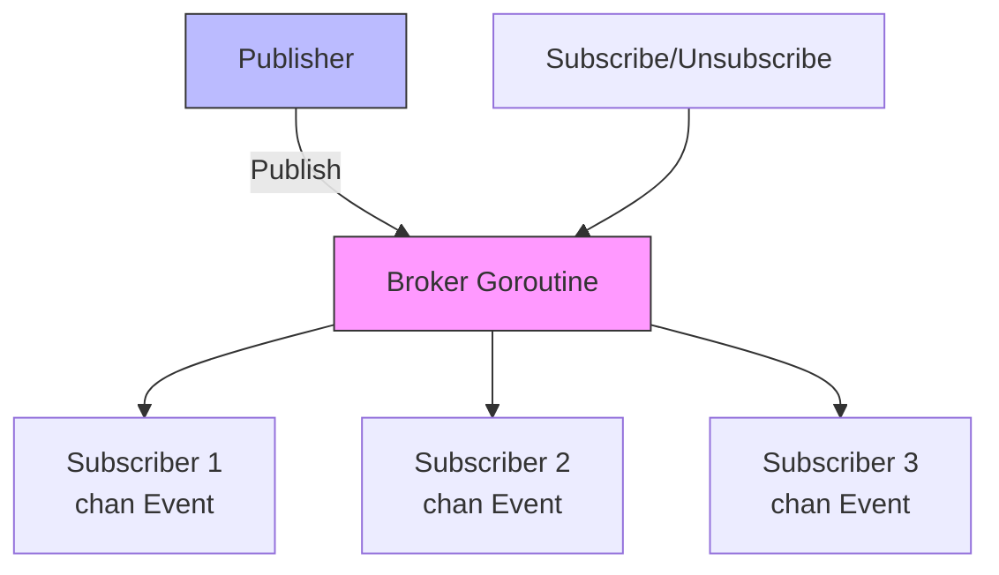

# Advanced Concurrency Patterns in Go

## What Is This?

Advanced concurrency patterns are reusable architectural blueprints for coordinating goroutines, channels, and synchronization primitives to solve real-world distributed problems. They go beyond raw goroutines and mutexes to express intent — worker pools, pipelines, pub-sub brokers, circuit breakers — in composable, safe, and production-tested designs. Mastering these patterns is the difference between writing concurrent code and designing concurrent systems.

## Why Does It Exist?

Raw goroutines and channels are primitives. In production, you face harder problems: goroutines that spawn unboundedly under load, pipelines that deadlock when one stage is slow, services that cascade-fail when a dependency goes down, and shutdown sequences that corrupt in-flight data. These patterns exist because Go's simplicity enables building complex coordination from small, composable pieces — but building them correctly requires knowing the blueprints. The Go team and the broader ecosystem (Kubernetes, Docker, Uber, Netflix) converged on these patterns after years of production failure.

## Who Uses This in Industry?

- **Google**: The Kubernetes controller-manager uses worker pool patterns with `errgroup` for reconciliation loops — thousands of objects reconciled concurrently, each with cancellation and error propagation.
- **Uber**: The `ratelimit` library and internal service mesh use token bucket rate limiters and circuit breakers to protect backend services from traffic spikes. Their Go dispatcher uses fan-out/fan-in for trip routing across microservices.
- **Netflix**: Hystrix (and its Go ports like `afex/hystrix-go`) implements the circuit breaker pattern to stop cascading failures across their streaming pipeline. Worker pools drive their transcoding infrastructure.
- **Cloudflare**: Pipeline patterns power their DNS query processing — packets enter a pipeline of decode → validate → resolve → respond stages, all connected by bounded channels for backpressure.
- **Docker / containerd**: Graceful shutdown patterns with signal handling ensure containers are cleanly terminated and in-flight operations finish before the daemon exits.

## Industry Standards and Best Practices

**Senior engineers do:**
- Bound every goroutine pool — never create N goroutines for N requests
- Always have a done/cancel channel or context in long-running goroutines
- Use `errgroup` instead of manual WaitGroup + error channels
- Design for backpressure — bounded channels, not unbounded queues
- Implement graceful shutdown in every server/worker
- Use `golang.org/x/sync/semaphore` for resource-limited concurrency
- Test concurrent code with `-race` flag always enabled in CI

**Beginners do:**
- Spawn a goroutine per request with no limit
- Forget to drain channels before shutdown
- Use `sync.Mutex` where channels communicate better
- Ignore errors from goroutines (lost in the void)
- Call `wg.Wait()` without ensuring `wg.Add()` happened before goroutines started

## Why Go's Approach Is Unique

Go's concurrency model is built on CSP (Communicating Sequential Processes) — Tony Hoare's 1978 paper. The core insight: **share memory by communicating, don't communicate by sharing**. This is the opposite of Java's `synchronized` blocks or Python's `threading.Lock`.

| Aspect | Go | Java | Python | Node.js |
|--------|----|----|--------|---------|
| Primitive | Goroutine + Channel | Thread + synchronized | Thread + GIL | Event loop (single-threaded) |
| Coordination | Channels (CSP) | Locks, Executors | Locks, Queue | async/await, Promises |
| Stack | 2KB, grows dynamically | 1MB fixed | OS thread (~8MB) | N/A |
| Scheduler | M:N (goroutines on OS threads) | 1:1 (thread per goroutine) | 1:N (GIL limits to 1 CPU) | 1:1 event loop |
| Error from goroutine | explicit channels / errgroup | Future.get() throws | Thread.join() + exception | Promise.catch() |
| Built-in cancellation | context.Context | InterruptedException | threading.Event | AbortController |

Go's tradeoff: no built-in thread pool executor (Java's `ExecutorService`), no async/await syntax. Instead: goroutines are so cheap (~2KB) that you write the pool yourself — and the patterns below are what that looks like in production.

---

## 1. Worker Pool Pattern

### Why Before How

The problem with naive Go concurrency is goroutine explosion. If you write `go process(request)` in a web handler, you get one goroutine per request. Under a traffic spike of 100,000 simultaneous requests, that's 100,000 goroutines competing for CPU and memory. Each goroutine may also hold a database connection — and if your DB has a 100-connection pool, 99,900 goroutines are blocking, waiting.

The worker pool pattern fixes this: create **N** workers at startup, feed them work through a channel. Work queues when all workers are busy instead of spawning new goroutines.



### Basic Worker Pool

```go
package main

import (
	"fmt"
	"sync"
	"time"
)

// Job represents a unit of work
type Job struct {
	ID    int
	Input string
}

// Result holds the output of a job
type Result struct {
	JobID  int
	Output string
	Err    error
}

// worker processes jobs from the jobs channel and sends results to results channel
func worker(id int, jobs <-chan Job, results chan<- Result, wg *sync.WaitGroup) {
	defer wg.Done()
	for job := range jobs {
		// Simulate processing
		time.Sleep(10 * time.Millisecond)
		results <- Result{
			JobID:  job.ID,
			Output: fmt.Sprintf("worker-%d processed job-%d: %s", id, job.ID, job.Input),
		}
	}
}

func main() {
	const numWorkers = 3
	const numJobs = 10

	jobs := make(chan Job, numJobs)
	results := make(chan Result, numJobs)

	var wg sync.WaitGroup

	// Start workers
	for i := 1; i <= numWorkers; i++ {
		wg.Add(1)
		go worker(i, jobs, results, &wg)
	}

	// Send jobs
	for i := 1; i <= numJobs; i++ {
		jobs <- Job{ID: i, Input: fmt.Sprintf("task-%d", i)}
	}
	close(jobs) // Signal no more jobs

	// Wait for all workers to finish, then close results
	go func() {
		wg.Wait()
		close(results)
	}()

	// Collect results
	for result := range results {
		if result.Err != nil {
			fmt.Printf("Job %d failed: %v\n", result.JobID, result.Err)
			continue
		}
		fmt.Println(result.Output)
	}
}
```

### Worker Pool with Error Collection

```go
package main

import (
	"errors"
	"fmt"
	"sync"
)

type Job struct {
	ID    int
	Value int
}

type Result struct {
	JobID  int
	Output int
	Err    error
}

// processJob simulates work that can fail
func processJob(job Job) (int, error) {
	if job.Value < 0 {
		return 0, fmt.Errorf("job %d: negative value %d not allowed", job.ID, job.Value)
	}
	return job.Value * 2, nil
}

// WorkerPool manages a fixed pool with error aggregation
type WorkerPool struct {
	numWorkers int
	jobs       chan Job
	results    chan Result
	wg         sync.WaitGroup
}

func NewWorkerPool(numWorkers, bufferSize int) *WorkerPool {
	return &WorkerPool{
		numWorkers: numWorkers,
		jobs:       make(chan Job, bufferSize),
		results:    make(chan Result, bufferSize),
	}
}

func (p *WorkerPool) Start() {
	for i := 0; i < p.numWorkers; i++ {
		p.wg.Add(1)
		go func(id int) {
			defer p.wg.Done()
			for job := range p.jobs {
				output, err := processJob(job)
				p.results <- Result{JobID: job.ID, Output: output, Err: err}
			}
		}(i)
	}
}

func (p *WorkerPool) Submit(job Job) {
	p.jobs <- job
}

func (p *WorkerPool) Close() {
	close(p.jobs)
}

func (p *WorkerPool) Wait() {
	p.wg.Wait()
	close(p.results)
}

func (p *WorkerPool) Results() <-chan Result {
	return p.results
}

func main() {
	pool := NewWorkerPool(3, 20)
	pool.Start()

	// Submit jobs (some will fail)
	go func() {
		values := []int{1, -2, 3, 4, -5, 6}
		for i, v := range values {
			pool.Submit(Job{ID: i + 1, Value: v})
		}
		pool.Close()
		pool.Wait()
	}()

	var errs []error
	for result := range pool.Results() {
		if result.Err != nil {
			errs = append(errs, result.Err)
			fmt.Printf("ERROR: %v\n", result.Err)
		} else {
			fmt.Printf("Job %d output: %d\n", result.JobID, result.Output)
		}
	}

	if len(errs) > 0 {
		fmt.Printf("\n%d jobs failed: %v\n", len(errs), errors.Join(errs...))
	}
}
```

### Dynamic Worker Pool (Scale Up/Down)

```go
package main

import (
	"fmt"
	"sync"
	"sync/atomic"
	"time"
)

// DynamicPool allows adding/removing workers at runtime
type DynamicPool struct {
	jobs       chan int
	quit       chan struct{}
	workerCount atomic.Int32
	mu          sync.Mutex
}

func NewDynamicPool(initialWorkers int) *DynamicPool {
	p := &DynamicPool{
		jobs: make(chan int, 100),
		quit: make(chan struct{}),
	}
	for i := 0; i < initialWorkers; i++ {
		p.addWorker()
	}
	return p
}

func (p *DynamicPool) addWorker() {
	p.workerCount.Add(1)
	id := int(p.workerCount.Load())
	go func() {
		defer p.workerCount.Add(-1)
		fmt.Printf("Worker %d started\n", id)
		for {
			select {
			case job, ok := <-p.jobs:
				if !ok {
					return
				}
				fmt.Printf("Worker %d processing job %d\n", id, job)
				time.Sleep(5 * time.Millisecond)
			case <-p.quit:
				fmt.Printf("Worker %d stopping\n", id)
				return
			}
		}
	}()
}

func (p *DynamicPool) Scale(delta int) {
	if delta > 0 {
		for i := 0; i < delta; i++ {
			p.addWorker()
		}
	} else {
		// Negative delta: signal quit to reduce worker count
		for i := 0; i > delta; i-- {
			select {
			case p.quit <- struct{}{}:
			default:
			}
		}
	}
}

func (p *DynamicPool) Submit(job int) {
	p.jobs <- job
}

func (p *DynamicPool) Workers() int {
	return int(p.workerCount.Load())
}

func main() {
	pool := NewDynamicPool(2)
	fmt.Printf("Workers: %d\n", pool.Workers())

	for i := 1; i <= 5; i++ {
		pool.Submit(i)
	}

	time.Sleep(50 * time.Millisecond)
	pool.Scale(3) // Scale up to handle load
	fmt.Printf("Workers after scale up: %d\n", pool.Workers())

	for i := 6; i <= 15; i++ {
		pool.Submit(i)
	}

	time.Sleep(100 * time.Millisecond)
	pool.Scale(-2) // Scale down
	time.Sleep(50 * time.Millisecond)
	fmt.Printf("Workers after scale down: %d\n", pool.Workers())

	close(pool.jobs)
	time.Sleep(50 * time.Millisecond)
}
```

**Common Pitfalls:**
- Closing the jobs channel before all workers have started reading from it (race on startup)
- Forgetting `wg.Add(1)` before `go func()` — if `go func()` is fast, `Wait()` returns early
- Making the results channel unbuffered when workers + receiver are in the same goroutine (deadlock)

---

## 2. Pipeline Pattern

### Why Before How

A pipeline transforms data through a series of stages. Each stage is a goroutine reading from an input channel and writing to an output channel. The key property: **stages run concurrently** — stage 2 is processing data while stage 1 is still producing it. This is the Go equivalent of Unix pipes (`cat file | grep foo | wc -l`).

Without pipelines, you process data in serial batches (read all → transform all → write all), wasting time waiting for slow I/O stages. With pipelines, slow stages naturally create backpressure through bounded channels.



### Basic Pipeline with Cancellation

```go
package main

import (
	"context"
	"fmt"
)

// gen produces numbers into a channel, respects context cancellation
func gen(ctx context.Context, nums ...int) <-chan int {
	out := make(chan int)
	go func() {
		defer close(out)
		for _, n := range nums {
			select {
			case out <- n:
			case <-ctx.Done():
				return
			}
		}
	}()
	return out
}

// sq squares each number from in
func sq(ctx context.Context, in <-chan int) <-chan int {
	out := make(chan int)
	go func() {
		defer close(out)
		for n := range in {
			select {
			case out <- n * n:
			case <-ctx.Done():
				return
			}
		}
	}()
	return out
}

// filter passes only even numbers
func filter(ctx context.Context, in <-chan int) <-chan int {
	out := make(chan int)
	go func() {
		defer close(out)
		for n := range in {
			if n%2 == 0 {
				select {
				case out <- n:
				case <-ctx.Done():
					return
				}
			}
		}
	}()
	return out
}

func main() {
	ctx, cancel := context.WithCancel(context.Background())
	defer cancel()

	// Build pipeline: generate -> square -> filter even
	c := gen(ctx, 1, 2, 3, 4, 5, 6, 7, 8)
	squared := sq(ctx, c)
	evens := filter(ctx, squared)

	for v := range evens {
		fmt.Println(v) // 4, 16, 36, 64
	}
}
```

### Production Pipeline with Bounded Channels (Backpressure)

```go
package main

import (
	"context"
	"fmt"
	"time"
)

type Record struct {
	ID    int
	Value string
}

// ingest simulates reading from an external source
func ingest(ctx context.Context) <-chan Record {
	// Bounded channel = backpressure: ingest slows if parser is behind
	out := make(chan Record, 10)
	go func() {
		defer close(out)
		for i := 1; i <= 20; i++ {
			select {
			case out <- Record{ID: i, Value: fmt.Sprintf("raw-%d", i)}:
				fmt.Printf("[ingest] produced record %d\n", i)
			case <-ctx.Done():
				fmt.Println("[ingest] cancelled")
				return
			}
			time.Sleep(5 * time.Millisecond)
		}
	}()
	return out
}

// validate checks and enriches records
func validate(ctx context.Context, in <-chan Record) <-chan Record {
	out := make(chan Record, 5)
	go func() {
		defer close(out)
		for r := range in {
			// Simulate validation work
			time.Sleep(10 * time.Millisecond)
			r.Value = "validated-" + r.Value
			select {
			case out <- r:
			case <-ctx.Done():
				return
			}
		}
	}()
	return out
}

// store simulates writing to database
func store(ctx context.Context, in <-chan Record) <-chan error {
	errc := make(chan error, 1)
	go func() {
		defer close(errc)
		for r := range in {
			select {
			case <-ctx.Done():
				errc <- ctx.Err()
				return
			default:
			}
			fmt.Printf("[store] saved record %d: %s\n", r.ID, r.Value)
		}
	}()
	return errc
}

func main() {
	ctx, cancel := context.WithTimeout(context.Background(), 200*time.Millisecond)
	defer cancel()

	// Wire up the pipeline
	records := ingest(ctx)
	validated := validate(ctx, records)
	errc := store(ctx, validated)

	// Block until store finishes or errors
	if err := <-errc; err != nil {
		fmt.Printf("Pipeline error: %v\n", err)
	} else {
		fmt.Println("Pipeline completed successfully")
	}
}
```

**Common Pitfalls:**
- Unbounded channels eliminate backpressure — a slow consumer lets the producer run ahead and consume all memory
- Not checking `ctx.Done()` in every stage — one unresponsive stage blocks cancellation of the entire pipeline
- Closing the input channel in the wrong goroutine (only the producer should close its output)

---

## 3. Fan-Out / Fan-In Pattern

### Why Before How

Fan-out distributes work from one channel to multiple goroutines — parallelizing CPU-bound or I/O-bound work. Fan-in merges multiple channels back into one — collecting results from parallel workers. Together they are the Go equivalent of parallel map-reduce.

Real use case: Uber's dispatch service fans out a single trip request to N pricing microservices simultaneously, then fans in the results to find the cheapest route.

### Fan-Out / Fan-In from Scratch

```go
package main

import (
	"context"
	"fmt"
	"sync"
	"time"
)

// fanOut distributes work from one input channel to N worker goroutines
func fanOut(ctx context.Context, in <-chan int, numWorkers int) []<-chan int {
	channels := make([]<-chan int, numWorkers)
	for i := 0; i < numWorkers; i++ {
		out := make(chan int)
		channels[i] = out
		go func(workerID int, out chan<- int) {
			defer close(out)
			for n := range in {
				// Simulate different processing times per worker
				time.Sleep(time.Duration(workerID+1) * time.Millisecond)
				select {
				case out <- n * n:
				case <-ctx.Done():
					return
				}
			}
		}(i, out)
	}
	return channels
}

// fanIn merges multiple input channels into one output channel
func fanIn(ctx context.Context, channels ...<-chan int) <-chan int {
	var wg sync.WaitGroup
	merged := make(chan int, len(channels))

	// Start a goroutine for each input channel
	output := func(c <-chan int) {
		defer wg.Done()
		for n := range c {
			select {
			case merged <- n:
			case <-ctx.Done():
				return
			}
		}
	}

	wg.Add(len(channels))
	for _, c := range channels {
		go output(c)
	}

	// Close merged when all inputs are drained
	go func() {
		wg.Wait()
		close(merged)
	}()

	return merged
}

func main() {
	ctx, cancel := context.WithCancel(context.Background())
	defer cancel()

	// Source channel
	in := make(chan int)
	go func() {
		defer close(in)
		for i := 1; i <= 10; i++ {
			in <- i
		}
	}()

	// Fan out to 3 workers
	workers := fanOut(ctx, in, 3)

	// Fan in results
	results := fanIn(ctx, workers...)

	var sum int
	for v := range results {
		sum += v
		fmt.Printf("Received: %d\n", v)
	}
	fmt.Printf("Sum of squares: %d\n", sum)
}
```

### Fan-Out / Fan-In with errgroup

```go
package main

import (
	"context"
	"fmt"
	"time"

	"golang.org/x/sync/errgroup"
)

type ServiceResult struct {
	Service string
	Price   float64
}

// callPricingService simulates a microservice call
func callPricingService(ctx context.Context, service string, tripID int) (ServiceResult, error) {
	// Simulate variable latency
	select {
	case <-time.After(time.Duration(len(service)) * time.Millisecond):
	case <-ctx.Done():
		return ServiceResult{}, ctx.Err()
	}
	return ServiceResult{
		Service: service,
		Price:   float64(tripID) * float64(len(service)) * 0.1,
	}, nil
}

// GetBestPrice fans out to N pricing services and returns the cheapest
func GetBestPrice(ctx context.Context, tripID int) (ServiceResult, error) {
	services := []string{"ServiceA", "ServiceB", "ServiceC", "ServiceD"}

	results := make(chan ServiceResult, len(services))
	g, ctx := errgroup.WithContext(ctx)

	// Fan out
	for _, svc := range services {
		svc := svc // capture loop variable
		g.Go(func() error {
			result, err := callPricingService(ctx, svc, tripID)
			if err != nil {
				return fmt.Errorf("%s: %w", svc, err)
			}
			results <- result
			return nil
		})
	}

	// Wait and close results channel
	go func() {
		_ = g.Wait()
		close(results)
	}()

	if err := g.Wait(); err != nil {
		return ServiceResult{}, err
	}

	// Fan in: find best price
	var best ServiceResult
	for r := range results {
		if best.Service == "" || r.Price < best.Price {
			best = r
		}
	}
	return best, nil
}

func main() {
	ctx, cancel := context.WithTimeout(context.Background(), 500*time.Millisecond)
	defer cancel()

	result, err := GetBestPrice(ctx, 42)
	if err != nil {
		fmt.Printf("Error: %v\n", err)
		return
	}
	fmt.Printf("Best price: $%.2f from %s\n", result.Price, result.Service)
}
```

**Common Pitfalls:**
- Fan-in goroutines that block on sending to a full merged channel — always buffer the merged channel or use select with done
- Loop variable capture in fan-out goroutines (the classic `i := i` bug — now fixed in Go 1.22+, but still a concern in earlier versions)
- Not cancelling context when an error occurs in one worker (all other workers keep running, wasting resources)

---

## 4. Pub-Sub Pattern

### Why Before How

The observer pattern with channels. Multiple subscribers register interest in a topic; a publisher sends once and all subscribers receive. This decouples producers from consumers — the publisher doesn't know who is listening or how many.

Used in: event systems, log broadcasting, cache invalidation, metrics collection. In Kubernetes, the informer/controller pattern is pub-sub: the API server publishes resource changes and many controllers subscribe.



### Thread-Safe Pub-Sub Broker

```go
package main

import (
	"fmt"
	"sync"
	"time"
)

type Event struct {
	Topic   string
	Payload any
}

type Broker struct {
	mu          sync.RWMutex
	subscribers map[string][]chan Event
	closed      bool
}

func NewBroker() *Broker {
	return &Broker{
		subscribers: make(map[string][]chan Event),
	}
}

// Subscribe returns a channel that receives events on the given topic
func (b *Broker) Subscribe(topic string, bufSize int) (<-chan Event, func()) {
	ch := make(chan Event, bufSize)
	b.mu.Lock()
	b.subscribers[topic] = append(b.subscribers[topic], ch)
	b.mu.Unlock()

	// Return unsubscribe function
	unsubscribe := func() {
		b.mu.Lock()
		defer b.mu.Unlock()
		subs := b.subscribers[topic]
		for i, s := range subs {
			if s == ch {
				b.subscribers[topic] = append(subs[:i], subs[i+1:]...)
				close(ch)
				return
			}
		}
	}
	return ch, unsubscribe
}

// Publish sends an event to all subscribers of the topic
// Non-blocking: drops events for slow subscribers
func (b *Broker) Publish(topic string, payload any) {
	b.mu.RLock()
	defer b.mu.RUnlock()

	if b.closed {
		return
	}

	event := Event{Topic: topic, Payload: payload}
	for _, ch := range b.subscribers[topic] {
		select {
		case ch <- event:
		default:
			// Drop: subscriber is too slow
			fmt.Printf("[broker] dropped event for slow subscriber on topic %s\n", topic)
		}
	}
}

// Close shuts down the broker, closing all subscriber channels
func (b *Broker) Close() {
	b.mu.Lock()
	defer b.mu.Unlock()
	if b.closed {
		return
	}
	b.closed = true
	for topic, subs := range b.subscribers {
		for _, ch := range subs {
			close(ch)
		}
		delete(b.subscribers, topic)
	}
}

func main() {
	broker := NewBroker()
	defer broker.Close()

	var wg sync.WaitGroup

	// Subscriber 1: orders topic
	orders, unsub1 := broker.Subscribe("orders", 10)
	wg.Add(1)
	go func() {
		defer wg.Done()
		defer unsub1()
		for event := range orders {
			fmt.Printf("[Sub1-orders] received: %v\n", event.Payload)
		}
	}()

	// Subscriber 2: also orders topic
	orders2, unsub2 := broker.Subscribe("orders", 10)
	wg.Add(1)
	go func() {
		defer wg.Done()
		defer unsub2()
		for event := range orders2 {
			fmt.Printf("[Sub2-orders] received: %v\n", event.Payload)
		}
	}()

	// Subscriber 3: payments topic
	payments, unsub3 := broker.Subscribe("payments", 5)
	wg.Add(1)
	go func() {
		defer wg.Done()
		defer unsub3()
		for event := range payments {
			fmt.Printf("[Sub3-payments] received: %v\n", event.Payload)
		}
	}()

	// Publish events
	broker.Publish("orders", map[string]any{"id": 1, "amount": 99.99})
	broker.Publish("payments", map[string]any{"id": "txn-001", "status": "approved"})
	broker.Publish("orders", map[string]any{"id": 2, "amount": 49.99})

	time.Sleep(50 * time.Millisecond)
}
```

### Typed Pub-Sub with Generic Topics

```go
package main

import (
	"fmt"
	"sync"
)

// TypedBroker is a generic pub-sub broker
type TypedBroker[T any] struct {
	mu   sync.RWMutex
	subs []chan T
}

func (b *TypedBroker[T]) Subscribe(bufSize int) (<-chan T, func()) {
	ch := make(chan T, bufSize)
	b.mu.Lock()
	b.subs = append(b.subs, ch)
	b.mu.Unlock()

	return ch, func() {
		b.mu.Lock()
		defer b.mu.Unlock()
		for i, s := range b.subs {
			if s == ch {
				b.subs = append(b.subs[:i], b.subs[i+1:]...)
				close(ch)
				return
			}
		}
	}
}

func (b *TypedBroker[T]) Publish(v T) {
	b.mu.RLock()
	defer b.mu.RUnlock()
	for _, ch := range b.subs {
		select {
		case ch <- v:
		default:
		}
	}
}

type OrderEvent struct {
	ID     int
	Status string
}

func main() {
	broker := &TypedBroker[OrderEvent]{}

	ch1, unsub1 := broker.Subscribe(10)
	ch2, unsub2 := broker.Subscribe(10)
	defer unsub1()
	defer unsub2()

	var wg sync.WaitGroup
	wg.Add(2)

	go func() {
		defer wg.Done()
		for e := range ch1 {
			fmt.Printf("[sub1] order %d: %s\n", e.ID, e.Status)
		}
	}()

	go func() {
		defer wg.Done()
		for e := range ch2 {
			fmt.Printf("[sub2] order %d: %s\n", e.ID, e.Status)
		}
	}()

	broker.Publish(OrderEvent{ID: 1, Status: "created"})
	broker.Publish(OrderEvent{ID: 1, Status: "shipped"})

	unsub1()
	unsub2()
	wg.Wait()
}
```

**Common Pitfalls:**
- Blocking publish: if subscriber channel is full and you block, the broker goroutine stalls and no other subscribers receive events
- Closing subscriber channels while a goroutine is still reading from them (nil channel sends panic; closed channel reads return zero values)
- RWMutex deadlock: taking a write lock inside a read-locked section

---

## 5. Circuit Breaker Pattern

### Why Before How

The circuit breaker prevents cascading failure. When service B starts failing (high latency or errors), service A should stop sending it requests — not pile up more. Without a circuit breaker, A's goroutines queue up waiting for B, exhausting A's thread/goroutine pool, causing A to fail too.

The pattern comes from electrical engineering: a breaker trips (opens) when current is too high, protecting downstream components. Netflix's Hystrix (and its Go ports) popularized this in microservices. Uber uses it in their service mesh.

**States:**
- **Closed** (healthy): requests flow through, failures are counted
- **Open** (failing): requests are rejected immediately without calling the service
- **Half-Open** (recovering): one test request is allowed; if it succeeds, the breaker closes

```go
package main

import (
	"errors"
	"fmt"
	"sync"
	"sync/atomic"
	"time"
)

type State int32

const (
	StateClosed   State = 0
	StateOpen     State = 1
	StateHalfOpen State = 2
)

var ErrCircuitOpen = errors.New("circuit breaker is open")

type CircuitBreaker struct {
	name        string
	maxFailures int32
	timeout     time.Duration

	state        atomic.Int32
	failures     atomic.Int32
	lastFailTime atomic.Int64 // unix nano
	mu           sync.Mutex
}

func NewCircuitBreaker(name string, maxFailures int, timeout time.Duration) *CircuitBreaker {
	return &CircuitBreaker{
		name:        name,
		maxFailures: int32(maxFailures),
		timeout:     timeout,
	}
}

func (cb *CircuitBreaker) currentState() State {
	s := State(cb.state.Load())
	if s == StateOpen {
		// Check if timeout has elapsed for half-open transition
		lastFail := time.Unix(0, cb.lastFailTime.Load())
		if time.Since(lastFail) > cb.timeout {
			// Attempt transition to half-open
			if cb.state.CompareAndSwap(int32(StateOpen), int32(StateHalfOpen)) {
				fmt.Printf("[%s] circuit transitioning to HALF-OPEN\n", cb.name)
			}
			return StateHalfOpen
		}
	}
	return s
}

// Execute calls the function if the circuit allows it
func (cb *CircuitBreaker) Execute(fn func() error) error {
	state := cb.currentState()

	if state == StateOpen {
		return ErrCircuitOpen
	}

	// For half-open, only allow one request through (use mutex to ensure this)
	if state == StateHalfOpen {
		cb.mu.Lock()
		if State(cb.state.Load()) != StateHalfOpen {
			cb.mu.Unlock()
			return ErrCircuitOpen
		}
		// Transition to closed optimistically while testing
		cb.mu.Unlock()
	}

	err := fn()
	if err != nil {
		cb.recordFailure()
		return err
	}

	cb.recordSuccess()
	return nil
}

func (cb *CircuitBreaker) recordFailure() {
	cb.lastFailTime.Store(time.Now().UnixNano())
	failures := cb.failures.Add(1)
	if failures >= cb.maxFailures {
		if cb.state.CompareAndSwap(int32(StateClosed), int32(StateOpen)) ||
			cb.state.CompareAndSwap(int32(StateHalfOpen), int32(StateOpen)) {
			fmt.Printf("[%s] circuit OPENED after %d failures\n", cb.name, failures)
		}
	}
}

func (cb *CircuitBreaker) recordSuccess() {
	cb.failures.Store(0)
	if cb.state.CompareAndSwap(int32(StateHalfOpen), int32(StateClosed)) {
		fmt.Printf("[%s] circuit CLOSED — service recovered\n", cb.name)
	}
}

func (cb *CircuitBreaker) State() string {
	switch State(cb.state.Load()) {
	case StateClosed:
		return "CLOSED"
	case StateOpen:
		return "OPEN"
	case StateHalfOpen:
		return "HALF-OPEN"
	default:
		return "UNKNOWN"
	}
}

// Simulate a flaky external service
var callCount int

func callExternalService() error {
	callCount++
	if callCount >= 2 && callCount <= 5 {
		return fmt.Errorf("service unavailable (call %d)", callCount)
	}
	return nil
}

func main() {
	cb := NewCircuitBreaker("payment-service", 3, 100*time.Millisecond)

	for i := 0; i < 12; i++ {
		err := cb.Execute(callExternalService)
		if err != nil {
			fmt.Printf("Request %d FAILED [state=%s]: %v\n", i+1, cb.State(), err)
		} else {
			fmt.Printf("Request %d OK [state=%s]\n", i+1, cb.State())
		}
		time.Sleep(20 * time.Millisecond)

		// After 6th call, wait for timeout to trigger half-open
		if i == 6 {
			fmt.Println("Waiting for circuit timeout...")
			time.Sleep(120 * time.Millisecond)
		}
	}
}
```

**Common Pitfalls:**
- Using a mutex around the entire `Execute` function (kills concurrency — use atomics for state, mutex only for half-open guard)
- Not resetting the failure counter on success (circuit opens on the next minor failure after recovery)
- Not implementing the half-open state (creates thrashing between open/closed under intermittent failures)

---

## 6. Rate Limiter Pattern

### Why Before How

Rate limiting prevents a single client from overwhelming a service and ensures fair resource allocation. Without it, one misbehaving client can starve all others. It's used by every public API (GitHub, Twitter, Stripe) and internally at every large company to protect databases, caches, and microservices.

The token bucket algorithm: a bucket holds N tokens. Each request consumes one token. Tokens refill at a constant rate. If the bucket is empty, the request waits or is rejected.

### Token Bucket with time/rate

```go
package main

import (
	"context"
	"fmt"
	"time"

	"golang.org/x/time/rate"
)

// RateLimiter wraps golang.org/x/time/rate.Limiter
type RateLimiter struct {
	limiter *rate.Limiter
}

// NewRateLimiter creates a limiter that allows `r` requests per second
// with a burst of `b` requests
func NewRateLimiter(r rate.Limit, b int) *RateLimiter {
	return &RateLimiter{limiter: rate.NewLimiter(r, b)}
}

// Allow returns true if the request can proceed (non-blocking)
func (rl *RateLimiter) Allow() bool {
	return rl.limiter.Allow()
}

// Wait blocks until the request can proceed or context is cancelled
func (rl *RateLimiter) Wait(ctx context.Context) error {
	return rl.limiter.Wait(ctx)
}

func main() {
	// Allow 5 requests per second, burst of 3
	limiter := NewRateLimiter(5, 3)
	ctx := context.Background()

	start := time.Now()
	for i := 0; i < 10; i++ {
		if err := limiter.Wait(ctx); err != nil {
			fmt.Printf("Request %d rejected: %v\n", i+1, err)
			continue
		}
		fmt.Printf("Request %d at %.2fs\n", i+1, time.Since(start).Seconds())
	}
}
```

### Per-Key Rate Limiter (e.g., per user/IP)

```go
package main

import (
	"context"
	"fmt"
	"sync"
	"time"

	"golang.org/x/time/rate"
)

// PerKeyLimiter maintains a separate rate limiter per key (e.g., user ID, IP)
type PerKeyLimiter struct {
	mu       sync.Mutex
	limiters map[string]*rate.Limiter
	r        rate.Limit
	b        int
}

func NewPerKeyLimiter(r rate.Limit, b int) *PerKeyLimiter {
	return &PerKeyLimiter{
		limiters: make(map[string]*rate.Limiter),
		r:        r,
		b:        b,
	}
}

func (l *PerKeyLimiter) getLimiter(key string) *rate.Limiter {
	l.mu.Lock()
	defer l.mu.Unlock()
	if lim, ok := l.limiters[key]; ok {
		return lim
	}
	lim := rate.NewLimiter(l.r, l.b)
	l.limiters[key] = lim
	return lim
}

func (l *PerKeyLimiter) Allow(key string) bool {
	return l.getLimiter(key).Allow()
}

func (l *PerKeyLimiter) Wait(ctx context.Context, key string) error {
	return l.getLimiter(key).Wait(ctx)
}

// Cleanup removes limiters that haven't been used recently
// In production, use a TTL-based eviction (e.g., with time.Now tracking)
func (l *PerKeyLimiter) Cleanup(keys []string) {
	l.mu.Lock()
	defer l.mu.Unlock()
	for _, k := range keys {
		delete(l.limiters, k)
	}
}

func main() {
	// 2 requests/sec per user, burst of 2
	limiter := NewPerKeyLimiter(2, 2)
	ctx := context.Background()

	users := []string{"alice", "bob", "alice", "alice", "bob", "charlie"}
	start := time.Now()

	var wg sync.WaitGroup
	for _, user := range users {
		user := user
		wg.Add(1)
		go func() {
			defer wg.Done()
			if err := limiter.Wait(ctx, user); err != nil {
				fmt.Printf("%s: rejected at %.2fs\n", user, time.Since(start).Seconds())
				return
			}
			fmt.Printf("%s: allowed at %.2fs\n", user, time.Since(start).Seconds())
		}()
	}
	wg.Wait()
}
```

### Manual Token Bucket (no external dependencies)

```go
package main

import (
	"fmt"
	"sync"
	"time"
)

type TokenBucket struct {
	capacity  int
	tokens    int
	refillRate int // tokens per second
	lastRefill time.Time
	mu        sync.Mutex
}

func NewTokenBucket(capacity, refillRate int) *TokenBucket {
	return &TokenBucket{
		capacity:   capacity,
		tokens:     capacity,
		refillRate: refillRate,
		lastRefill: time.Now(),
	}
}

func (tb *TokenBucket) Allow() bool {
	tb.mu.Lock()
	defer tb.mu.Unlock()

	// Refill tokens based on elapsed time
	now := time.Now()
	elapsed := now.Sub(tb.lastRefill).Seconds()
	newTokens := int(elapsed * float64(tb.refillRate))
	if newTokens > 0 {
		tb.tokens = min(tb.capacity, tb.tokens+newTokens)
		tb.lastRefill = now
	}

	if tb.tokens > 0 {
		tb.tokens--
		return true
	}
	return false
}

func min(a, b int) int {
	if a < b {
		return a
	}
	return b
}

func main() {
	bucket := NewTokenBucket(5, 2) // 5 capacity, 2 tokens/sec

	for i := 0; i < 10; i++ {
		if bucket.Allow() {
			fmt.Printf("Request %d: ALLOWED\n", i+1)
		} else {
			fmt.Printf("Request %d: RATE LIMITED\n", i+1)
		}
		time.Sleep(100 * time.Millisecond)
	}
}
```

**Common Pitfalls:**
- Not protecting the limiter map with a mutex in per-key limiters (data race on concurrent access)
- Using `Allow()` in tight loops without backoff — you'll spin-wait and burn CPU
- Not accounting for burst in the rate (a rate of 10/sec with burst 1 is very different from burst 100)

---

## 7. Semaphore Pattern

### Why Before How

A semaphore limits the number of goroutines that can execute a specific operation concurrently. Unlike a worker pool (which limits total workers), a semaphore limits concurrent access to a specific resource — like a database connection pool, a file system, or an external API that has its own concurrency limits.

Example: you have 1000 goroutines but your database allows only 50 concurrent connections. A semaphore with weight 50 ensures at most 50 goroutines talk to the database at once.

### Simple Channel-Based Semaphore

```go
package main

import (
	"fmt"
	"sync"
	"time"
)

// Semaphore using a buffered channel
type Semaphore chan struct{}

func NewSemaphore(n int) Semaphore {
	return make(Semaphore, n)
}

func (s Semaphore) Acquire() {
	s <- struct{}{} // blocks if channel is full
}

func (s Semaphore) Release() {
	<-s // frees a slot
}

func (s Semaphore) TryAcquire() bool {
	select {
	case s <- struct{}{}:
		return true
	default:
		return false
	}
}

func main() {
	const maxConcurrent = 3
	const totalWork = 10

	sem := NewSemaphore(maxConcurrent)
	var wg sync.WaitGroup

	for i := 1; i <= totalWork; i++ {
		wg.Add(1)
		go func(id int) {
			defer wg.Done()
			sem.Acquire()
			defer sem.Release()

			fmt.Printf("Worker %d: started (concurrent slots used: %d/%d)\n",
				id, len(sem), cap(sem))
			time.Sleep(50 * time.Millisecond)
			fmt.Printf("Worker %d: done\n", id)
		}(i)
	}
	wg.Wait()
}
```

### Weighted Semaphore (golang.org/x/sync/semaphore)

```go
package main

import (
	"context"
	"fmt"
	"sync"
	"time"

	"golang.org/x/sync/semaphore"
)

// DatabasePool simulates a connection pool with limited slots
type DatabasePool struct {
	sem *semaphore.Weighted
}

func NewDatabasePool(maxConnections int64) *DatabasePool {
	return &DatabasePool{
		sem: semaphore.NewWeighted(maxConnections),
	}
}

// Query acquires weight=1 connection slot, runs query, releases
func (p *DatabasePool) Query(ctx context.Context, query string) (string, error) {
	if err := p.sem.Acquire(ctx, 1); err != nil {
		return "", fmt.Errorf("failed to acquire connection: %w", err)
	}
	defer p.sem.Release(1)

	// Simulate DB query
	time.Sleep(20 * time.Millisecond)
	return fmt.Sprintf("result for: %s", query), nil
}

// BulkQuery acquires weight=3 for expensive bulk operations
func (p *DatabasePool) BulkQuery(ctx context.Context, query string) (string, error) {
	if err := p.sem.Acquire(ctx, 3); err != nil {
		return "", fmt.Errorf("failed to acquire bulk connections: %w", err)
	}
	defer p.sem.Release(3)

	time.Sleep(50 * time.Millisecond)
	return fmt.Sprintf("bulk result for: %s", query), nil
}

func main() {
	pool := NewDatabasePool(5) // max 5 connection weight
	ctx, cancel := context.WithTimeout(context.Background(), 2*time.Second)
	defer cancel()

	var wg sync.WaitGroup
	queries := []string{"SELECT 1", "SELECT 2", "SELECT 3", "SELECT 4", "SELECT 5"}

	for _, q := range queries {
		wg.Add(1)
		q := q
		go func() {
			defer wg.Done()
			result, err := pool.Query(ctx, q)
			if err != nil {
				fmt.Printf("Error: %v\n", err)
				return
			}
			fmt.Println(result)
		}()
	}

	// Also run a bulk query (uses 3 slots)
	wg.Add(1)
	go func() {
		defer wg.Done()
		result, err := pool.BulkQuery(ctx, "SELECT * FROM large_table")
		if err != nil {
			fmt.Printf("Bulk error: %v\n", err)
			return
		}
		fmt.Println(result)
	}()

	wg.Wait()
}
```

**Common Pitfalls:**
- Panic on Release without Acquire (releasing more than you acquired panics the weighted semaphore)
- Acquiring in one goroutine and releasing in another without clear ownership — leads to resource leaks
- Forgetting `defer sem.Release()` after successful `Acquire()` — goroutine exits and slot is never freed

---

## 8. errgroup and Structured Concurrency

### Why Before How

`sync.WaitGroup` has no error propagation. When a goroutine errors, you have to manually pipe errors through a channel, pick the first one, and cancel context. This boilerplate is error-prone. `errgroup` (from `golang.org/x/sync/errgroup`) wraps this pattern into a clean API.

Key properties:
1. `g.Go(fn)` starts goroutine, tracks it
2. `g.Wait()` waits for all goroutines and returns the **first non-nil error**
3. `errgroup.WithContext(ctx)` automatically cancels the context when any goroutine errors

This is "structured concurrency" — goroutines are children of a structured scope; the scope doesn't return until all children finish.

### errgroup: Parallel I/O with Cancellation on First Error

```go
package main

import (
	"context"
	"fmt"
	"time"

	"golang.org/x/sync/errgroup"
)

type Config struct {
	Database string
	Redis    string
	Secrets  string
}

// loadDatabase simulates loading DB config
func loadDatabase(ctx context.Context) (string, error) {
	select {
	case <-time.After(30 * time.Millisecond):
		return "postgresql://localhost:5432/prod", nil
	case <-ctx.Done():
		return "", ctx.Err()
	}
}

// loadRedis simulates loading Redis config (fails if instructed)
func loadRedis(ctx context.Context, shouldFail bool) (string, error) {
	select {
	case <-time.After(20 * time.Millisecond):
		if shouldFail {
			return "", fmt.Errorf("redis config not found in secret manager")
		}
		return "redis://localhost:6379", nil
	case <-ctx.Done():
		return "", ctx.Err()
	}
}

// loadSecrets simulates loading secrets
func loadSecrets(ctx context.Context) (string, error) {
	select {
	case <-time.After(50 * time.Millisecond):
		return "secret-key-abc123", nil
	case <-ctx.Done():
		return "", ctx.Err()
	}
}

// LoadConfig loads all config in parallel; cancels all on first error
func LoadConfig(ctx context.Context, redisFailure bool) (Config, error) {
	g, ctx := errgroup.WithContext(ctx)

	var cfg Config

	g.Go(func() error {
		db, err := loadDatabase(ctx)
		if err != nil {
			return fmt.Errorf("database config: %w", err)
		}
		cfg.Database = db
		return nil
	})

	g.Go(func() error {
		redis, err := loadRedis(ctx, redisFailure)
		if err != nil {
			return fmt.Errorf("redis config: %w", err)
		}
		cfg.Redis = redis
		return nil
	})

	g.Go(func() error {
		secrets, err := loadSecrets(ctx)
		if err != nil {
			return fmt.Errorf("secrets config: %w", err)
		}
		cfg.Secrets = secrets
		return nil
	})

	if err := g.Wait(); err != nil {
		return Config{}, err
	}
	return cfg, nil
}

func main() {
	ctx := context.Background()

	fmt.Println("=== Successful Load ===")
	cfg, err := LoadConfig(ctx, false)
	if err != nil {
		fmt.Printf("Config load failed: %v\n", err)
	} else {
		fmt.Printf("DB: %s\nRedis: %s\nSecrets: %s\n", cfg.Database, cfg.Redis, cfg.Secrets)
	}

	fmt.Println("\n=== Failed Load (redis error) ===")
	_, err = LoadConfig(ctx, true)
	if err != nil {
		fmt.Printf("Config load failed: %v\n", err)
	}
}
```

### errgroup with Bounded Concurrency

```go
package main

import (
	"context"
	"fmt"

	"golang.org/x/sync/errgroup"
	"golang.org/x/sync/semaphore"
)

// processURLs processes a list of URLs with bounded concurrency
func processURLs(ctx context.Context, urls []string, maxConcurrent int64) error {
	g, ctx := errgroup.WithContext(ctx)
	sem := semaphore.NewWeighted(maxConcurrent)

	for _, url := range urls {
		url := url
		if err := sem.Acquire(ctx, 1); err != nil {
			return err
		}
		g.Go(func() error {
			defer sem.Release(1)
			// Simulate fetching URL
			fmt.Printf("Fetching: %s\n", url)
			if url == "http://bad.example.com" {
				return fmt.Errorf("failed to fetch %s: connection refused", url)
			}
			return nil
		})
	}

	return g.Wait()
}

func main() {
	urls := []string{
		"http://example.com/1",
		"http://example.com/2",
		"http://bad.example.com",
		"http://example.com/4",
		"http://example.com/5",
	}

	if err := processURLs(context.Background(), urls, 3); err != nil {
		fmt.Printf("Processing failed: %v\n", err)
	}
}
```

**Common Pitfalls:**
- Accessing shared mutable state from multiple `g.Go` goroutines without synchronization — errgroup does not prevent data races
- Calling `g.Wait()` twice — it panics
- Expecting ALL errors to be collected — errgroup only returns the first error (use a custom multi-error approach if you need all)

---

## 9. Graceful Shutdown Pattern

### Why Before How

When a server receives SIGTERM (from Kubernetes, systemd, or `Ctrl+C`), it must:
1. Stop accepting new requests
2. Finish in-flight requests
3. Flush buffers and close connections
4. Exit cleanly

Without graceful shutdown: active HTTP handlers are cut off mid-response, database transactions are rolled back, message queue consumers lose their messages, and clients get connection reset errors. In Kubernetes, this is non-negotiable — pods are killed on every deployment.

### HTTP Server Graceful Shutdown

```go
package main

import (
	"context"
	"fmt"
	"net/http"
	"os"
	"os/signal"
	"sync"
	"syscall"
	"time"
)

type Server struct {
	httpServer *http.Server
	wg         sync.WaitGroup
}

func NewServer(addr string) *Server {
	s := &Server{}
	mux := http.NewServeMux()

	mux.HandleFunc("/", s.handleRequest)
	mux.HandleFunc("/health", func(w http.ResponseWriter, r *http.Request) {
		w.WriteHeader(http.StatusOK)
		_, _ = w.Write([]byte("ok"))
	})

	s.httpServer = &http.Server{
		Addr:         addr,
		Handler:      mux,
		ReadTimeout:  5 * time.Second,
		WriteTimeout: 10 * time.Second,
		IdleTimeout:  120 * time.Second,
	}
	return s
}

func (s *Server) handleRequest(w http.ResponseWriter, r *http.Request) {
	s.wg.Add(1)
	defer s.wg.Done()

	// Simulate slow handler
	select {
	case <-time.After(2 * time.Second):
		fmt.Fprintf(w, "Hello, World!")
	case <-r.Context().Done():
		http.Error(w, "Request cancelled", http.StatusServiceUnavailable)
	}
}

func (s *Server) Start() error {
	return s.httpServer.ListenAndServe()
}

func (s *Server) Shutdown(ctx context.Context) error {
	fmt.Println("[server] shutting down HTTP server...")
	if err := s.httpServer.Shutdown(ctx); err != nil {
		return fmt.Errorf("HTTP server shutdown: %w", err)
	}

	// Wait for in-flight handlers with shutdown deadline
	done := make(chan struct{})
	go func() {
		s.wg.Wait()
		close(done)
	}()

	select {
	case <-done:
		fmt.Println("[server] all in-flight requests completed")
	case <-ctx.Done():
		fmt.Println("[server] shutdown timeout: forcing exit")
		return ctx.Err()
	}
	return nil
}

func main() {
	server := NewServer(":8080")

	// Start server in background
	go func() {
		fmt.Println("[server] listening on :8080")
		if err := server.Start(); err != http.ErrServerClosed {
			fmt.Printf("[server] error: %v\n", err)
			os.Exit(1)
		}
	}()

	// Wait for shutdown signal
	quit := make(chan os.Signal, 1)
	signal.Notify(quit, syscall.SIGINT, syscall.SIGTERM)
	sig := <-quit
	fmt.Printf("[server] received signal: %v\n", sig)

	// Give server 30 seconds to finish in-flight requests
	shutdownCtx, cancel := context.WithTimeout(context.Background(), 30*time.Second)
	defer cancel()

	if err := server.Shutdown(shutdownCtx); err != nil {
		fmt.Printf("[server] shutdown error: %v\n", err)
		os.Exit(1)
	}
	fmt.Println("[server] shutdown complete")
}
```

### Worker with Graceful Shutdown (Drain Queue)

```go
package main

import (
	"context"
	"fmt"
	"os"
	"os/signal"
	"sync"
	"syscall"
	"time"
)

type MessageProcessor struct {
	queue  chan string
	wg     sync.WaitGroup
	done   chan struct{}
}

func NewMessageProcessor(queueSize int) *MessageProcessor {
	return &MessageProcessor{
		queue: make(chan string, queueSize),
		done:  make(chan struct{}),
	}
}

func (p *MessageProcessor) Start(numWorkers int) {
	for i := 0; i < numWorkers; i++ {
		p.wg.Add(1)
		go p.worker(i)
	}
}

func (p *MessageProcessor) worker(id int) {
	defer p.wg.Done()
	for {
		select {
		case msg, ok := <-p.queue:
			if !ok {
				fmt.Printf("[worker-%d] queue closed, exiting\n", id)
				return
			}
			// Process message
			time.Sleep(10 * time.Millisecond)
			fmt.Printf("[worker-%d] processed: %s\n", id, msg)
		case <-p.done:
			// Drain remaining messages before exiting
			for {
				select {
				case msg := <-p.queue:
					fmt.Printf("[worker-%d] draining: %s\n", id, msg)
				default:
					fmt.Printf("[worker-%d] drain complete, exiting\n", id)
					return
				}
			}
		}
	}
}

func (p *MessageProcessor) Enqueue(msg string) error {
	select {
	case p.queue <- msg:
		return nil
	case <-p.done:
		return fmt.Errorf("processor shutting down")
	default:
		return fmt.Errorf("queue full")
	}
}

func (p *MessageProcessor) Shutdown(ctx context.Context) error {
	fmt.Println("[processor] initiating shutdown...")
	close(p.done)

	// Wait with timeout
	finished := make(chan struct{})
	go func() {
		p.wg.Wait()
		close(finished)
	}()

	select {
	case <-finished:
		fmt.Println("[processor] shutdown complete")
		return nil
	case <-ctx.Done():
		fmt.Println("[processor] shutdown timed out")
		return ctx.Err()
	}
}

func main() {
	processor := NewMessageProcessor(50)
	processor.Start(3)

	// Enqueue some messages
	go func() {
		for i := 1; i <= 20; i++ {
			_ = processor.Enqueue(fmt.Sprintf("message-%d", i))
			time.Sleep(5 * time.Millisecond)
		}
	}()

	// Wait for signal
	quit := make(chan os.Signal, 1)
	signal.Notify(quit, syscall.SIGINT, syscall.SIGTERM)

	// Simulate signal after 50ms (for demo purposes)
	go func() {
		time.Sleep(50 * time.Millisecond)
		quit <- syscall.SIGTERM
	}()

	<-quit
	fmt.Println("Signal received, shutting down...")

	ctx, cancel := context.WithTimeout(context.Background(), 5*time.Second)
	defer cancel()
	_ = processor.Shutdown(ctx)
}
```

**Common Pitfalls:**
- Using `signal.Notify` with an unbuffered channel — if the goroutine is not ready when the signal arrives, the signal is dropped
- Not setting a shutdown timeout — `wg.Wait()` can block forever if a goroutine is stuck
- Calling `server.Shutdown()` from the same goroutine that called `server.ListenAndServe()` (deadlock) — always shut down from a separate goroutine or after the server is running
- Forgetting to drain the queue — in-flight messages are lost

---

## 10. Patterns Combined: Production Service

This example combines worker pool + pipeline + graceful shutdown + circuit breaker into a single production-quality service skeleton.

```go
package main

import (
	"context"
	"errors"
	"fmt"
	"os"
	"os/signal"
	"sync"
	"sync/atomic"
	"syscall"
	"time"
)

// ======== Circuit Breaker ========

type CBState int32

const (
	CBClosed   CBState = 0
	CBOpen     CBState = 1
	CBHalfOpen CBState = 2
)

type CB struct {
	state    atomic.Int32
	failures atomic.Int32
	lastFail atomic.Int64
	max      int32
	timeout  time.Duration
}

func NewCB(max int, timeout time.Duration) *CB {
	return &CB{max: int32(max), timeout: timeout}
}

func (c *CB) Do(fn func() error) error {
	s := CBState(c.state.Load())
	if s == CBOpen {
		if time.Since(time.Unix(0, c.lastFail.Load())) < c.timeout {
			return errors.New("circuit open")
		}
		c.state.CompareAndSwap(int32(CBOpen), int32(CBHalfOpen))
	}
	err := fn()
	if err != nil {
		c.lastFail.Store(time.Now().UnixNano())
		if c.failures.Add(1) >= c.max {
			c.state.Store(int32(CBOpen))
		}
		return err
	}
	c.failures.Store(0)
	c.state.Store(int32(CBClosed))
	return nil
}

// ======== Job / Result ========

type Request struct {
	ID      int
	Payload string
}

type Response struct {
	RequestID int
	Result    string
	Err       error
}

// ======== Downstream Client ========

type DownstreamClient struct {
	cb *CB
}

func NewDownstreamClient() *DownstreamClient {
	return &DownstreamClient{cb: NewCB(3, 500*time.Millisecond)}
}

var callN int32

func (dc *DownstreamClient) Call(ctx context.Context, payload string) (string, error) {
	var result string
	err := dc.cb.Do(func() error {
		n := atomic.AddInt32(&callN, 1)
		select {
		case <-ctx.Done():
			return ctx.Err()
		case <-time.After(10 * time.Millisecond):
		}
		// Simulate 30% failure rate
		if n%3 == 0 {
			return fmt.Errorf("downstream error on call %d", n)
		}
		result = fmt.Sprintf("enriched(%s)", payload)
		return nil
	})
	return result, err
}

// ======== Processing Pipeline ========

func processingPipeline(
	ctx context.Context,
	requests <-chan Request,
	client *DownstreamClient,
	numWorkers int,
) <-chan Response {
	results := make(chan Response, numWorkers*2)
	var wg sync.WaitGroup

	for i := 0; i < numWorkers; i++ {
		wg.Add(1)
		go func(workerID int) {
			defer wg.Done()
			for req := range requests {
				select {
				case <-ctx.Done():
					results <- Response{RequestID: req.ID, Err: ctx.Err()}
					return
				default:
				}

				result, err := client.Call(ctx, req.Payload)
				results <- Response{
					RequestID: req.ID,
					Result:    result,
					Err:       err,
				}
			}
		}(i)
	}

	go func() {
		wg.Wait()
		close(results)
	}()

	return results
}

// ======== Main Service ========

func main() {
	ctx, cancel := context.WithCancel(context.Background())
	defer cancel()

	requests := make(chan Request, 50)
	client := NewDownstreamClient()

	// Start processing pipeline
	responses := processingPipeline(ctx, requests, client, 5)

	// Collect results
	var (
		successCount int
		errorCount   int
		mu           sync.Mutex
		collectorWg  sync.WaitGroup
	)
	collectorWg.Add(1)
	go func() {
		defer collectorWg.Done()
		for resp := range responses {
			mu.Lock()
			if resp.Err != nil {
				errorCount++
				fmt.Printf("[collector] request %d FAILED: %v\n", resp.RequestID, resp.Err)
			} else {
				successCount++
				fmt.Printf("[collector] request %d OK: %s\n", resp.RequestID, resp.Result)
			}
			mu.Unlock()
		}
	}()

	// Produce requests
	go func() {
		defer close(requests)
		for i := 1; i <= 15; i++ {
			select {
			case requests <- Request{ID: i, Payload: fmt.Sprintf("data-%d", i)}:
			case <-ctx.Done():
				return
			}
			time.Sleep(5 * time.Millisecond)
		}
	}()

	// Graceful shutdown on signal
	quit := make(chan os.Signal, 1)
	signal.Notify(quit, syscall.SIGINT, syscall.SIGTERM)
	go func() {
		time.Sleep(200 * time.Millisecond) // Demo: auto-shutdown
		quit <- syscall.SIGTERM
	}()

	<-quit
	fmt.Println("\n[main] shutdown signal received")
	cancel()
	collectorWg.Wait()

	mu.Lock()
	fmt.Printf("\n[main] Results: %d success, %d errors\n", successCount, errorCount)
	mu.Unlock()
}
```

---

## Quick Reference: Pattern Selection Guide

| Problem | Pattern | Package |
|---------|---------|---------|
| Too many goroutines | Worker Pool | stdlib |
| Sequential data transformation | Pipeline | stdlib |
| Parallel work + merge results | Fan-Out / Fan-In | errgroup |
| One-to-many event distribution | Pub-Sub | stdlib |
| Protect against downstream failure | Circuit Breaker | stdlib (atomic) |
| Limit request rate | Rate Limiter | golang.org/x/time/rate |
| Limit concurrent resource access | Semaphore | golang.org/x/sync/semaphore |
| Parallel work + error propagation | errgroup | golang.org/x/sync/errgroup |
| Clean server/worker termination | Graceful Shutdown | stdlib (os/signal) |

## Testing Concurrent Code

All concurrent code must be tested with the race detector:

```bash
go test -race ./...
go run -race main.go
```

For worker pools and pipelines, use table-driven tests with multiple goroutine counts and job counts. For circuit breakers, test all three state transitions explicitly. For graceful shutdown, use `syscall.Kill(os.Getpid(), syscall.SIGTERM)` in tests.

---

*This file covers the patterns that power production Go systems at companies like Google (Kubernetes), Uber (dispatch), Netflix (streaming), Cloudflare (DNS), and Docker (containerd). Master these patterns and you can design concurrent systems, not just write concurrent code.*
