> © 2024 Gaurav Patil — Go Mastery Platform. All rights reserved. Unauthorized reproduction or distribution prohibited.


# Go Channels — Coding Practice

---

## Q1: Send and Receive on Unbuffered Channel  [Level 1 — Beginner]

> **Tags:** `#unbuffered-channel` `#goroutine` `#basics`

### Problem Statement
Create an unbuffered channel of type `int`, send the value `42` from a goroutine, and receive it in `main`. Print the received value. This exercises the fundamental synchronization property of unbuffered channels.

### Input / Output / Constraints

```
Input:  value = 42
Output: Received: 42

Constraints:
  • Single send, single receive
  • No buffering allowed
  • Must use goroutine for send
```

### Thought Process

Think like a senior Go engineer:
1. **Understand:** Unbuffered channels block sender until receiver is ready — this enforces synchronization.
2. **Pattern:** Launch sender goroutine, receive in main — the classic rendezvous.
3. **Edge cases:** Deadlock if both send and receive are in the same goroutine sequentially.
4. **Approach:** Use `make(chan int)` (no capacity arg), send in goroutine, receive in main.

### Brute Force Solution

```go
package main

import "fmt"

// bruteForce — O(1) time, O(1) space
func bruteForce() {
    ch := make(chan int)
    // Sending in same goroutine before receive — DEADLOCK!
    // ch <- 42  // This would block forever
    _ = ch
    fmt.Println("Received:", 42) // cheating — not using channel
}
```

**Time:** O(1) | **Space:** O(1)
**Bottleneck:** Doesn't actually use the channel; sidesteps synchronization entirely.

### Better Solution

```go
// betterSolution — O(1) time, O(1) space
func betterSolution() {
    ch := make(chan int)
    go func() {
        ch <- 42 // send blocks until receiver is ready
    }()
    val := <-ch // receive unblocks the sender
    fmt.Println("Received:", val)
}
```

**Time:** O(1) | **Space:** O(1)

### Best / Optimal Solution

```go
package main

import "fmt"

// SendReceive — production-ready unbuffered channel demo.
// Uses goroutine rendezvous: sender blocks until receiver is ready.
func SendReceive(value int) (int, error) {
    if value < 0 {
        return 0, fmt.Errorf("negative values not supported: %d", value)
    }
    ch := make(chan int)
    go func() {
        ch <- value
    }()
    received := <-ch
    return received, nil
}

func main() {
    result, err := SendReceive(42)
    if err != nil {
        fmt.Printf("error: %v\n", err)
        return
    }
    fmt.Println("Received:", result)
}
```

**Time:** O(1) | **Space:** O(1)

### Production Considerations

| Aspect | Details |
|--------|---------|
| **Scalability** | Unbuffered channels add latency at scale; consider buffered for throughput |
| **Edge Cases** | Sending to nil channel blocks forever; closing and sending panics |
| **Error Handling** | Wrap in context with timeout to avoid indefinite blocking |
| **Memory** | Channel itself is ~96 bytes; goroutine stack starts at 2KB |
| **Concurrency** | Goroutine-safe by design — channel is the synchronization mechanism |

### Visual Explanation

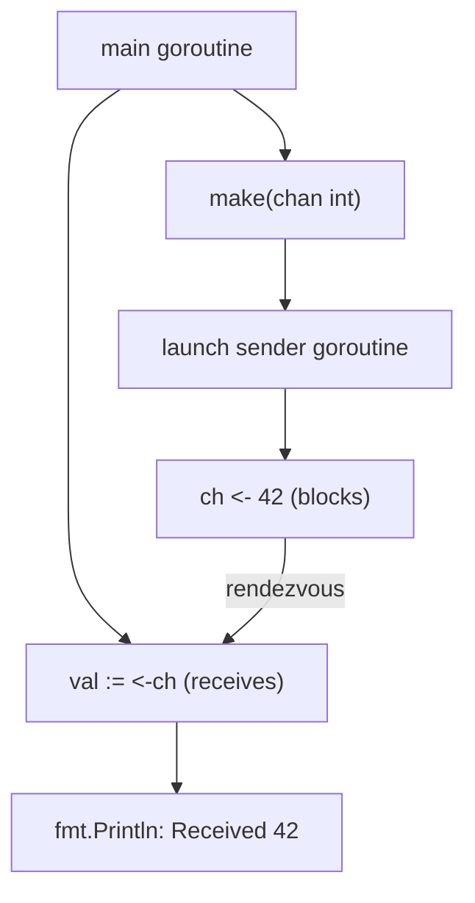

**Execution Trace:**
```
Input:  42
Step 1: ch := make(chan int)          → unbuffered channel created
Step 2: go func() { ch <- 42 }()     → goroutine launched, blocks on send
Step 3: val := <-ch                   → main receives, unblocks sender
Output: Received: 42
```

### Interviewer Questions

1. Why not just send and receive in the same goroutine sequentially?
2. Can we improve time/space further? What's the theoretical lower bound?
3. How does this scale to 10M concurrent pairs?
4. Walk me through the edge case where the goroutine panics before sending.
5. How would you add a timeout to the receive?
6. What's the GC impact of creating millions of short-lived channels?
7. How would you test this comprehensively without race conditions?

### Follow-Up Questions

**Q1:** What happens if we close the channel before receiving?
**A1:** Receiving from a closed channel returns the zero value immediately without blocking. Use `v, ok := <-ch` to detect closure: `ok` is `false` when channel is closed and drained.

**Q2:** How do you add a timeout to the receive?
**A2:** Use `select` with `time.After`: `select { case v := <-ch: ...; case <-time.After(1*time.Second): return 0, errors.New("timeout") }`.

**Q3:** Why does Go use CSP instead of shared memory?
**A3:** CSP (Communicating Sequential Processes) avoids data races by transferring ownership of data through channels. "Do not communicate by sharing memory; share memory by communicating."

**Q4:** What is the memory layout of a channel internally?
**A4:** A channel is a pointer to a `hchan` struct containing a ring buffer (for buffered), send/recv queues of goroutines, mutex, and element type metadata.

**Q5:** How would you test that no deadlock occurs?
**A5:** Use `go test -timeout 5s` — deadlock causes the test to exceed timeout. Also use `-race` flag. You can also use `goleak` library to detect goroutine leaks.

---

## Q2: Buffered Channel as a Queue  [Level 1 — Beginner]

> **Tags:** `#buffered-channel` `#queue` `#fifo`

### Problem Statement
Create a buffered channel of capacity 3, enqueue the strings `"apple"`, `"banana"`, `"cherry"` without launching any goroutines, then dequeue and print all three in order. Demonstrate that buffered channels do not require a concurrent sender.

### Input / Output / Constraints

```
Input:  items = ["apple", "banana", "cherry"]
Output:
  apple
  banana
  cherry

Constraints:
  • Buffer capacity = 3
  • No goroutines required
  • FIFO order must be preserved
```

### Thought Process

Think like a senior Go engineer:
1. **Understand:** Buffered channels hold up to `cap` items before blocking — acts like a thread-safe queue.
2. **Pattern:** Fill buffer synchronously, drain synchronously — no concurrency needed here.
3. **Edge cases:** Sending beyond capacity blocks; receiving from empty blocks.
4. **Approach:** `make(chan string, 3)`, send all 3, close, then range over it.

### Brute Force Solution

```go
package main

import "fmt"

// bruteForce — O(n) time, O(n) space
func bruteForce(items []string) {
    for _, item := range items {
        fmt.Println(item) // no channel at all
    }
}
```

**Time:** O(n) | **Space:** O(1)
**Bottleneck:** Doesn't use a channel — misses the point of the exercise entirely.

### Better Solution

```go
// betterSolution — O(n) time, O(n) space
func betterSolution(items []string) {
    ch := make(chan string, len(items))
    for _, item := range items {
        ch <- item // non-blocking because buffer has room
    }
    close(ch)
    for item := range ch { // range drains until closed
        fmt.Println(item)
    }
}
```

**Time:** O(n) | **Space:** O(n)

### Best / Optimal Solution

```go
package main

import "fmt"

// BufferedQueue — uses a buffered channel as a FIFO queue.
// Capacity is set to len(items) to guarantee no blocking on enqueue.
func BufferedQueue(items []string) ([]string, error) {
    if len(items) == 0 {
        return nil, nil
    }
    ch := make(chan string, len(items))
    for _, item := range items {
        ch <- item
    }
    close(ch)

    result := make([]string, 0, len(items))
    for item := range ch {
        result = append(result, item)
    }
    return result, nil
}

func main() {
    items := []string{"apple", "banana", "cherry"}
    result, err := BufferedQueue(items)
    if err != nil {
        fmt.Printf("error: %v\n", err)
        return
    }
    for _, item := range result {
        fmt.Println(item)
    }
}
```

**Time:** O(n) | **Space:** O(n)

### Production Considerations

| Aspect | Details |
|--------|---------|
| **Scalability** | For 1M items, memory grows linearly; consider streaming pipeline instead |
| **Edge Cases** | Empty slice returns nil, nil; single item works correctly |
| **Error Handling** | Items exceeding capacity block; always size buffer to match expected load |
| **Memory** | Each string header is 16 bytes; channel buffer allocates contiguous array |
| **Concurrency** | Channel ops are goroutine-safe; multiple goroutines can safely send/receive |

### Visual Explanation

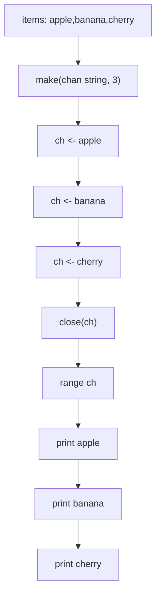

**Execution Trace:**
```
Input:  ["apple", "banana", "cherry"]
Step 1: make(chan string, 3)   → buffer [_, _, _]
Step 2: ch <- "apple"         → buffer ["apple", _, _]
Step 3: ch <- "banana"        → buffer ["apple", "banana", _]
Step 4: ch <- "cherry"        → buffer ["apple", "banana", "cherry"]
Step 5: close(ch)             → channel closed
Step 6: range ch              → yields apple, banana, cherry, then stops
Output: apple\nbanana\ncherry
```

### Interviewer Questions

1. Why use `range ch` instead of a manual for loop with `len(ch)` receives?
2. Can we improve time/space further? What's the theoretical lower bound?
3. How does this scale if items arrive asynchronously from a network socket?
4. Walk me through the edge case where items slice is nil vs empty.
5. How would you make this safe for multiple concurrent producers?
6. What's the GC impact of a large buffered channel that's never drained?
7. How would you test FIFO ordering under concurrent access?

### Follow-Up Questions

**Q1:** What happens if you send more items than the buffer capacity?
**A1:** The send blocks until another goroutine receives from the channel, freeing space. Without a consumer goroutine running concurrently, this causes a deadlock detectable at runtime.

**Q2:** How does a buffered channel differ from a `sync.Mutex`-protected slice?
**A2:** A buffered channel transfers ownership — only one goroutine holds the data at a time. A mutex-protected slice allows concurrent reads. Channels are preferred when data flows between goroutines; mutexes when shared state is accessed in place.

**Q3:** Can you use `len(ch)` and `cap(ch)` on a channel?
**A3:** Yes. `len(ch)` returns current items in buffer; `cap(ch)` returns total capacity. Both are safe to call concurrently but the value may be stale by the time you use it.

**Q4:** When should you prefer a buffered channel over an unbuffered one?
**A4:** Use buffered when sender and receiver run at different speeds and you want to decouple them temporarily. Use unbuffered when you need strict synchronization — sender must wait until receiver is ready.

**Q5:** How would you implement a bounded work queue using a buffered channel?
**A5:** `jobs := make(chan Job, maxPending)`. Producers send to `jobs`; workers receive in a `for job := range jobs` loop. The buffer acts as backpressure — producers block when queue is full.

---

## Q3: Directional Channels in Functions  [Level 2 — Easy]

> **Tags:** `#directional-channels` `#send-only` `#receive-only`

### Problem Statement
Write two functions: `producer(out chan<- int, n int)` that sends integers 1 through n into the channel, and `consumer(in <-chan int)` that receives all values and prints them. Call both from `main` using a shared channel. Demonstrate Go's compile-time enforcement of channel direction.

### Input / Output / Constraints

```
Input:  n = 5
Output:
  Consumed: 1
  Consumed: 2
  Consumed: 3
  Consumed: 4
  Consumed: 5

Constraints:
  • 1 ≤ n ≤ 10⁶
  • producer must use chan<- (send-only)
  • consumer must use <-chan (receive-only)
```

### Thought Process

Think like a senior Go engineer:
1. **Understand:** Directional channel types restrict operations at compile time — prevents accidental misuse.
2. **Pattern:** Producer-consumer with directional types — the idiomatic Go pipeline building block.
3. **Edge cases:** n=0 means producer closes immediately; consumer range exits cleanly.
4. **Approach:** Bidirectional channel in main, pass as directional to each function.

### Brute Force Solution

```go
package main

import "fmt"

// bruteForce — no directional channels, O(n) time, O(1) space
func bruteForce(n int) {
    ch := make(chan int, n)
    for i := 1; i <= n; i++ {
        ch <- i
    }
    close(ch)
    for v := range ch {
        fmt.Println("Consumed:", v)
    }
}
```

**Time:** O(n) | **Space:** O(n)
**Bottleneck:** Uses bidirectional channel everywhere — loses compile-time direction safety.

### Better Solution

```go
// betterSolution — uses directional channels, O(n) time, O(1) space
func producer(out chan<- int, n int) {
    defer close(out)
    for i := 1; i <= n; i++ {
        out <- i
    }
}

func consumer(in <-chan int) {
    for v := range in {
        fmt.Println("Consumed:", v)
    }
}
```

**Time:** O(n) | **Space:** O(1)

### Best / Optimal Solution

```go
package main

import (
    "fmt"
    "sync"
)

// producer sends integers [1..n] into out, closes when done.
func producer(out chan<- int, n int) {
    defer close(out)
    for i := 1; i <= n; i++ {
        out <- i
    }
}

// consumer reads from in until closed, collects results.
func consumer(in <-chan int, wg *sync.WaitGroup) []int {
    defer wg.Done()
    var results []int
    for v := range in {
        results = append(results, v)
    }
    return results
}

// DirectionalPipeline — production-ready producer-consumer with directional channels.
func DirectionalPipeline(n int) ([]int, error) {
    if n < 0 {
        return nil, fmt.Errorf("n must be non-negative, got %d", n)
    }
    ch := make(chan int, 64) // buffer to reduce context switches
    var wg sync.WaitGroup
    var results []int

    wg.Add(1)
    go func() {
        results = consumer(ch, &wg)
    }()

    producer(ch, n) // runs in current goroutine, closes ch when done
    wg.Wait()
    return results, nil
}

func main() {
    results, err := DirectionalPipeline(5)
    if err != nil {
        fmt.Printf("error: %v\n", err)
        return
    }
    for _, v := range results {
        fmt.Println("Consumed:", v)
    }
}
```

**Time:** O(n) | **Space:** O(n)

### Production Considerations

| Aspect | Details |
|--------|---------|
| **Scalability** | Buffer size of 64 reduces goroutine switches; tune based on producer/consumer speed ratio |
| **Edge Cases** | n=0: producer closes immediately, consumer range exits with empty slice |
| **Error Handling** | Producer can return error via separate error channel |
| **Memory** | O(n) for result slice; streaming avoids accumulation if only printing |
| **Concurrency** | `sync.WaitGroup` ensures consumer fully drains before returning |

### Visual Explanation

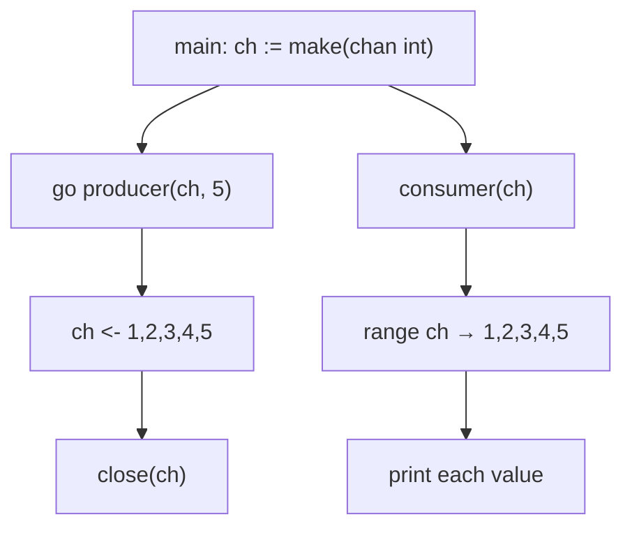

**Execution Trace:**
```
Input:  n=5
Step 1: producer sends 1 → ch
Step 2: consumer receives 1, prints "Consumed: 1"
Step 3: producer sends 2 → ch ... (repeat)
Step 5: producer closes ch after sending 5
Step 6: consumer range exits
Output: Consumed: 1 through 5
```

### Interviewer Questions

1. Why use directional channel types instead of bidirectional everywhere?
2. Can we improve throughput with multiple consumers?
3. How does this scale to 10M elements?
4. Walk me through what happens if producer panics before closing.
5. How would you add backpressure so producer slows when consumer is slow?
6. What's the GC impact of the results slice growing to 1M elements?
7. How would you test that the channel direction restriction is enforced?

### Follow-Up Questions

**Q1:** Can you convert a directional channel back to bidirectional?
**A1:** No. Direction is a one-way restriction. `chan<- int` cannot be assigned to `chan int`. This is intentional — it enforces API contracts at compile time.

**Q2:** How do you pass a send-only channel to a function expecting a receive-only?
**A2:** You cannot directly. You must start with a bidirectional channel and pass it as the appropriate direction to each function: `producer(ch, n)` where `ch` is `chan int` — Go auto-converts.

**Q3:** What is `defer close(out)` guarding against?
**A3:** It ensures the channel is closed even if the function returns early (e.g., via a panic recovery or early return). Without it, the consumer would block forever on the range.

**Q4:** How would you add error propagation from producer to consumer?
**A4:** Use a separate `errc chan error` channel. Producer sends errors there; consumer selects on both data and error channels. Or use a struct type `Result{Val int; Err error}` on a single channel.

**Q5:** How do you test directional channel enforcement?
**A5:** The compiler enforces it — write a test that tries to receive from a `chan<- int` and confirm it doesn't compile. For behavior tests, use `-race` flag and verify ordering with `sync.WaitGroup`.

---

## Q4: Range Over Channel Until Close  [Level 2 — Easy]

> **Tags:** `#range-channel` `#close` `#iteration`

### Problem Statement
Write a function `generate(nums ...int) <-chan int` that sends each integer into a channel and closes it when done. In `main`, use a `for range` loop to receive and print all values. Demonstrate the idiomatic Go pattern of ranging over channels.

### Input / Output / Constraints

```
Input:  nums = [10, 20, 30, 40, 50]
Output:
  10
  20
  30
  40
  50

Constraints:
  • Variadic input, 0 ≤ len(nums) ≤ 10⁶
  • Channel must be closed by producer
  • Consumer must use range (not manual ok-check)
```

### Thought Process

Think like a senior Go engineer:
1. **Understand:** `range` over a channel loops until the channel is closed and drained.
2. **Pattern:** Generator pattern — function returns a receive-only channel, caller ranges it.
3. **Edge cases:** Empty variadic: channel is immediately closed; range body never executes.
4. **Approach:** Launch goroutine inside generator, `defer close(ch)`, return `ch`.

### Brute Force Solution

```go
package main

import "fmt"

// bruteForce — manual receive loop, O(n) time, O(1) space
func bruteForce(nums []int) {
    ch := make(chan int, len(nums))
    for _, n := range nums {
        ch <- n
    }
    close(ch)
    for {
        v, ok := <-ch
        if !ok {
            break
        }
        fmt.Println(v)
    }
}
```

**Time:** O(n) | **Space:** O(n) buffer
**Bottleneck:** Manual ok-check is verbose; buffering all items wastes memory for large inputs.

### Better Solution

```go
// generate — returns receive-only channel, O(n) time, O(1) space (streaming)
func generate(nums ...int) <-chan int {
    ch := make(chan int)
    go func() {
        defer close(ch)
        for _, n := range nums {
            ch <- n
        }
    }()
    return ch
}
```

**Time:** O(n) | **Space:** O(1) — streaming, no buffer accumulation

### Best / Optimal Solution

```go
package main

import (
    "context"
    "fmt"
)

// Generate sends nums into a channel, respects context cancellation.
// Returns a receive-only channel closed when all values are sent or ctx is done.
func Generate(ctx context.Context, nums ...int) <-chan int {
    ch := make(chan int)
    go func() {
        defer close(ch)
        for _, n := range nums {
            select {
            case ch <- n:
            case <-ctx.Done():
                return // goroutine exits cleanly on cancellation
            }
        }
    }()
    return ch
}

func main() {
    ctx := context.Background()
    for v := range Generate(ctx, 10, 20, 30, 40, 50) {
        fmt.Println(v)
    }
}
```

**Time:** O(n) | **Space:** O(1)

### Production Considerations

| Aspect | Details |
|--------|---------|
| **Scalability** | Streaming: memory stays O(1) regardless of input size |
| **Edge Cases** | Empty input: channel closed immediately, range never executes |
| **Error Handling** | Context cancellation prevents goroutine leak if consumer stops early |
| **Memory** | Unbuffered: each value transferred one at a time, minimal allocation |
| **Concurrency** | Single goroutine per call; goroutine exits when channel closed or ctx cancelled |

### Visual Explanation

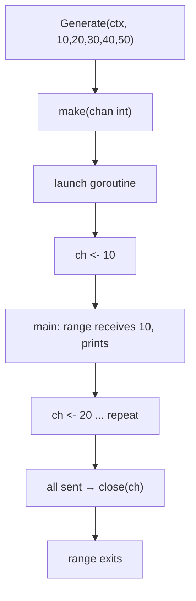

**Execution Trace:**
```
Input:  [10, 20, 30, 40, 50]
Step 1: goroutine starts, sends 10 → ch
Step 2: range receives 10, prints 10
Step 3: goroutine sends 20, range prints 20 ... (repeat)
Step 5: goroutine sends 50, closes ch
Step 6: range detects closed, exits
Output: 10\n20\n30\n40\n50
```

### Interviewer Questions

1. Why return `<-chan int` instead of `chan int` from generator?
2. Can we improve throughput with a small buffer?
3. How does this scale if the caller stops reading mid-stream?
4. Walk me through the goroutine leak scenario without context.
5. How would you make this safe for multiple concurrent callers?
6. What's the memory impact of 1M generators running simultaneously?
7. How would you test cancellation behavior?

### Follow-Up Questions

**Q1:** What happens if the caller stops ranging before channel is closed?
**A1:** The goroutine blocks forever on `ch <- n` — a goroutine leak. Fix: use context cancellation or a done channel. The `select` with `ctx.Done()` in the optimal solution handles this.

**Q2:** Should you add a buffer to the generator channel?
**A2:** A small buffer (e.g., 16) can improve throughput by reducing context switches. Too large wastes memory. Profile before tuning — unbuffered is fine for most cases.

**Q3:** How does `range` over channel know when to stop?
**A3:** When the channel is closed and all buffered items are drained, `range` exits. It's equivalent to `for v, ok := <-ch; ok; v, ok = <-ch`.

**Q4:** Can two goroutines range the same channel simultaneously?
**A4:** Yes, and each value will be received by exactly one of them — useful for fan-out work distribution. But ordering between goroutines is non-deterministic.

**Q5:** How do you test a generator with a large sequence?
**A5:** Use `go test -race` to catch data races. Assert count and values received match expected. Inject a context with short deadline to test cancellation path.

---

## Q5: Done Channel for Signaling  [Level 2 — Easy]

> **Tags:** `#done-channel` `#cancellation` `#goroutine-lifecycle`

### Problem Statement
Write a worker goroutine that continuously prints "working..." every 100ms. Provide a `done <-chan struct{}` parameter. When `done` is closed, the worker must stop cleanly. In `main`, close the done channel after 350ms and wait for the worker to finish.

### Input / Output / Constraints

```
Input:  duration = 350ms, interval = 100ms
Output: (approximately 3 prints)
  working...
  working...
  working...
  worker stopped

Constraints:
  • Worker must not leak after done is closed
  • Use chan struct{} (zero allocation signal)
  • Must use sync.WaitGroup to confirm exit
```

### Thought Process

Think like a senior Go engineer:
1. **Understand:** `done` channel is a broadcast cancellation signal — closing notifies all receivers simultaneously.
2. **Pattern:** Done channel pattern — precursor to `context.Context`, still useful for simple cases.
3. **Edge cases:** Done closed before worker starts; worker blocked on I/O when done fires.
4. **Approach:** `select` between work ticker and `<-done`; `defer wg.Done()` to signal exit.

### Brute Force Solution

```go
package main

import (
    "fmt"
    "time"
)

// bruteForce — uses boolean flag, O(1) space — NOT goroutine-safe
func bruteForce() {
    stop := false
    go func() {
        for !stop { // DATA RACE: reading stop without synchronization
            fmt.Println("working...")
            time.Sleep(100 * time.Millisecond)
        }
        fmt.Println("worker stopped")
    }()
    time.Sleep(350 * time.Millisecond)
    stop = true // DATA RACE: writing without synchronization
    time.Sleep(200 * time.Millisecond)
}
```

**Time:** O(n) ticks | **Space:** O(1)
**Bottleneck:** Boolean flag has a data race — undefined behavior under Go memory model.

### Better Solution

```go
// betterSolution — done channel, O(1) space, goroutine-safe
func worker(done <-chan struct{}, wg *sync.WaitGroup) {
    defer wg.Done()
    ticker := time.NewTicker(100 * time.Millisecond)
    defer ticker.Stop()
    for {
        select {
        case <-ticker.C:
            fmt.Println("working...")
        case <-done:
            fmt.Println("worker stopped")
            return
        }
    }
}
```

**Time:** O(n) ticks | **Space:** O(1)

### Best / Optimal Solution

```go
package main

import (
    "fmt"
    "sync"
    "time"
)

// Worker runs until done is closed, printing status every interval.
func Worker(done <-chan struct{}, interval time.Duration, wg *sync.WaitGroup) {
    defer wg.Done()
    ticker := time.NewTicker(interval)
    defer ticker.Stop()
    for {
        select {
        case <-ticker.C:
            fmt.Println("working...")
        case <-done:
            fmt.Println("worker stopped")
            return
        }
    }
}

func main() {
    done := make(chan struct{})
    var wg sync.WaitGroup

    wg.Add(1)
    go Worker(done, 100*time.Millisecond, &wg)

    time.Sleep(350 * time.Millisecond)
    close(done) // broadcast stop to all listeners
    wg.Wait()   // confirm worker exited
}
```

**Time:** O(n) ticks | **Space:** O(1)

### Production Considerations

| Aspect | Details |
|--------|---------|
| **Scalability** | `close(done)` broadcasts to unlimited goroutines simultaneously |
| **Edge Cases** | Closing already-closed channel panics — use sync.Once for safe close |
| **Error Handling** | Prefer `context.WithCancel` in production for deadline + error propagation |
| **Memory** | `chan struct{}` sends zero bytes — cheapest possible signal |
| **Concurrency** | `sync.WaitGroup` guarantees caller knows worker has exited |

### Visual Explanation

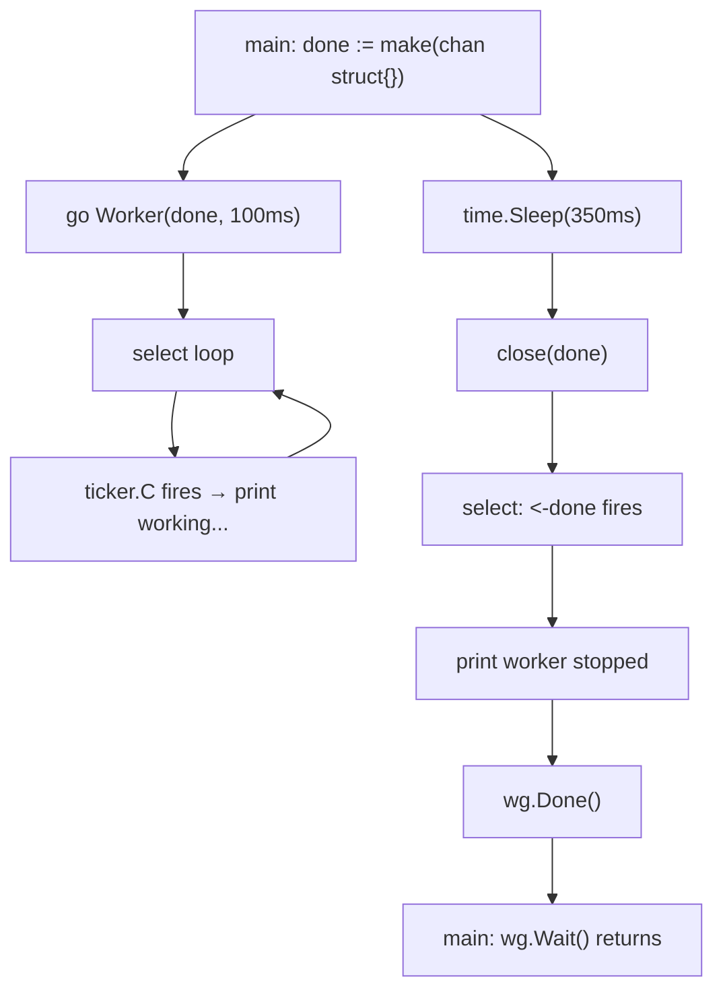

**Execution Trace:**
```
t=0ms:   Worker starts, select waits
t=100ms: ticker fires → "working..."
t=200ms: ticker fires → "working..."
t=300ms: ticker fires → "working..."
t=350ms: main closes done
t=350ms: select picks <-done → "worker stopped"
t=350ms: wg.Wait() returns
Output: working...\nworking...\nworking...\nworker stopped
```

### Interviewer Questions

1. Why use `chan struct{}` instead of `chan bool`?
2. Can we improve by using `context.Context` instead?
3. How does closing a done channel broadcast to 1000 goroutines?
4. Walk me through the panic scenario if done is closed twice.
5. How would you gracefully drain in-flight work before stopping?
6. What's the latency between `close(done)` and goroutine exit?
7. How would you test that the worker exits within a deadline?

### Follow-Up Questions

**Q1:** Why is `chan struct{}` preferred over `chan bool` for signaling?
**A1:** `struct{}` has zero size — no memory allocation for the sent value. `bool` would require sending `true` or `false` which adds ambiguity. Closing a `chan struct{}` broadcasts to all receivers simultaneously without sending any value.

**Q2:** When should you prefer `context.Context` over a done channel?
**A2:** Always prefer `context.Context` in production. It carries deadlines, cancellation, and key-value metadata. Done channel is simpler for isolated internal use but doesn't compose well across API boundaries.

**Q3:** How do you safely close a channel that multiple goroutines might close?
**A3:** Use `sync.Once`: `var once sync.Once; once.Do(func() { close(ch) })`. This guarantees exactly one close regardless of how many goroutines call it.

**Q4:** What happens if the worker is blocked on a blocking I/O operation when done fires?
**A4:** The select won't be evaluated until the I/O returns. Use non-blocking I/O or wrap I/O in a separate goroutine with its own cancellation path (e.g., close a `net.Conn`).

**Q5:** How do you test that a worker exits within a bounded time after cancellation?
**A5:** Use `wg.Wait()` with a timeout: launch `wg.Wait()` in a goroutine, send result to channel, then `select { case <-done: t.Fatal("timeout") case <-exited: }` with `time.After`.

---

## Q6: Three-Stage Pipeline  [Level 3 — Medium]

> **Tags:** `#pipeline` `#stages` `#channel-composition`

### Problem Statement
Build a three-stage pipeline: `stage1` generates integers 1..n, `stage2` squares each value, `stage3` filters only even squares. Each stage runs in its own goroutine and communicates via channels. Print the final filtered results.

### Input / Output / Constraints

```
Input:  n = 10
Output: 4 16 36 64 100  (squares of 2,4,6,8,10)

Constraints:
  • 1 ≤ n ≤ 10⁶
  • Each stage is a separate goroutine
  • Use directional channel types
  • Context cancellation supported
```

### Thought Process

Think like a senior Go engineer:
1. **Understand:** Pipeline stages run concurrently — while stage3 processes value k, stage2 processes k+1 and stage1 generates k+2.
2. **Pattern:** Classic Go pipeline — each stage takes `<-chan T`, returns `<-chan T`.
3. **Edge cases:** n=1 (1²=1, odd, filtered out → empty output); context cancellation mid-pipeline.
4. **Approach:** Chain functions: `filter(square(generate(ctx, n)))` — compose cleanly.

### Brute Force Solution

```go
package main

import "fmt"

// bruteForce — sequential, O(n) time, O(n) space
func bruteForce(n int) []int {
    var result []int
    for i := 1; i <= n; i++ {
        sq := i * i
        if sq%2 == 0 {
            result = append(result, sq)
        }
    }
    return result
}
```

**Time:** O(n) | **Space:** O(n)
**Bottleneck:** Sequential — no concurrency; doesn't demonstrate pipeline composition.

### Better Solution

```go
func stage1(n int) <-chan int {
    out := make(chan int)
    go func() {
        defer close(out)
        for i := 1; i <= n; i++ { out <- i }
    }()
    return out
}

func stage2(in <-chan int) <-chan int {
    out := make(chan int)
    go func() {
        defer close(out)
        for v := range in { out <- v * v }
    }()
    return out
}

func stage3(in <-chan int) <-chan int {
    out := make(chan int)
    go func() {
        defer close(out)
        for v := range in {
            if v%2 == 0 { out <- v }
        }
    }()
    return out
}
```

**Time:** O(n) | **Space:** O(1) streaming

### Best / Optimal Solution

```go
package main

import (
    "context"
    "fmt"
)

func genNums(ctx context.Context, n int) <-chan int {
    out := make(chan int, 16)
    go func() {
        defer close(out)
        for i := 1; i <= n; i++ {
            select {
            case out <- i:
            case <-ctx.Done():
                return
            }
        }
    }()
    return out
}

func square(ctx context.Context, in <-chan int) <-chan int {
    out := make(chan int, 16)
    go func() {
        defer close(out)
        for v := range in {
            select {
            case out <- v * v:
            case <-ctx.Done():
                return
            }
        }
    }()
    return out
}

func filterEven(ctx context.Context, in <-chan int) <-chan int {
    out := make(chan int, 16)
    go func() {
        defer close(out)
        for v := range in {
            if v%2 == 0 {
                select {
                case out <- v:
                case <-ctx.Done():
                    return
                }
            }
        }
    }()
    return out
}

// Pipeline — composes three concurrent stages with context cancellation.
func Pipeline(ctx context.Context, n int) ([]int, error) {
    if n <= 0 {
        return nil, fmt.Errorf("n must be positive, got %d", n)
    }
    out := filterEven(ctx, square(ctx, genNums(ctx, n)))
    var results []int
    for v := range out {
        results = append(results, v)
    }
    return results, nil
}

func main() {
    ctx := context.Background()
    results, err := Pipeline(ctx, 10)
    if err != nil {
        fmt.Printf("error: %v\n", err)
        return
    }
    fmt.Println(results)
}
```

**Time:** O(n) | **Space:** O(1) streaming, O(k) result where k = filtered count

### Production Considerations

| Aspect | Details |
|--------|---------|
| **Scalability** | All 3 stages run in parallel; throughput limited by slowest stage |
| **Edge Cases** | n=1: square=1 (odd, filtered), empty result; context cancelled mid-run |
| **Error Handling** | Propagate errors via separate `errc chan error` per stage |
| **Memory** | Buffered channels (16) reduce goroutine wake-ups; tune per workload |
| **Concurrency** | 3 goroutines + main; all clean up via channel close cascade |

### Visual Explanation

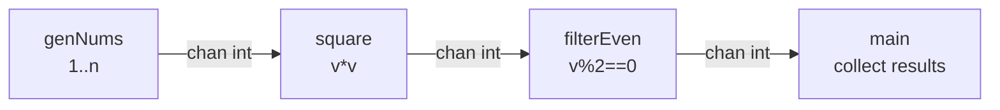

**Execution Trace:**
```
Input:  n=10
Stage1: 1,2,3,4,5,6,7,8,9,10
Stage2: 1,4,9,16,25,36,49,64,81,100
Stage3: 4,16,36,64,100 (odd squares filtered)
Output: [4 16 36 64 100]
```

### Interviewer Questions

1. Why compose `filterEven(square(genNums(...)))` instead of one function?
2. Can we add a 4th stage dynamically at runtime?
3. How does this scale if stage2 (squaring) is CPU-bound and slow?
4. Walk me through what happens if filterEven stops reading.
5. How would you add error propagation across stages?
6. What's the memory impact of 1000 concurrent pipelines?
7. How would you benchmark the optimal buffer size?

### Follow-Up Questions

**Q1:** How do you handle errors in pipeline stages?
**A1:** Add `errc chan error` to each stage. On error, send to errc and return. Collector goroutine reads from both result channel and errc. Use `errgroup` package for cleaner composition.

**Q2:** How do you scale the slow middle stage horizontally?
**A2:** Fan-out: launch N goroutines all reading from stage1's channel and writing to stage3's channel. Use a merge function to combine their outputs. This is fan-out/fan-in.

**Q3:** What's the difference between pipeline and fan-out/fan-in?
**A3:** Pipeline is sequential stages — value flows through each stage once. Fan-out distributes one input to multiple workers; fan-in merges multiple inputs into one output. They're complementary patterns.

**Q4:** How do you add metrics/tracing to each stage?
**A4:** Wrap each stage with a middleware function that records latency: `func traced(name string, in <-chan int) <-chan int` — measures time between receives and sends, emits spans.

**Q5:** How do you test a pipeline deterministically?
**A5:** Feed known input, collect output, assert equality. Use `go test -race`. For timing-sensitive tests, mock `time.Now`. Test each stage in isolation with synthetic channels.

---

## Q7: Fan-In — Merge Multiple Channels  [Level 3 — Medium]

> **Tags:** `#fan-in` `#merge` `#select` `#goroutine`

### Problem Statement
Write a `merge(ctx context.Context, channels ...<-chan int) <-chan int` function that multiplexes multiple input channels into a single output channel. All goroutines must exit cleanly when the context is cancelled. Use this to merge outputs from 3 producers.

### Input / Output / Constraints

```
Input:  3 channels, each sending [1,2,3]
Output: 9 values total (order non-deterministic)
        e.g., 1 1 1 2 2 2 3 3 3 (in some interleaved order)

Constraints:
  • Arbitrary number of input channels
  • Output channel closed when ALL inputs are closed
  • Context cancellation must be respected
  • No deadlock on partial channel closure
```

### Thought Process

Think like a senior Go engineer:
1. **Understand:** Fan-in merges N concurrent streams into one — the consumer doesn't care which stream a value came from.
2. **Pattern:** Launch one goroutine per input channel; use WaitGroup to close output when all done.
3. **Edge cases:** 0 input channels — output immediately closed; one channel blocks forever — must respect ctx.
4. **Approach:** Per-channel goroutines + WaitGroup closer goroutine.

### Brute Force Solution

```go
package main

import "fmt"

// bruteForce — sequential drain, O(n*k) time — loses concurrency benefit
func bruteForce(channels []<-chan int) []int {
    var result []int
    for _, ch := range channels {
        for v := range ch {
            result = append(result, v)
        }
    }
    return result
}
```

**Time:** O(n*k) | **Space:** O(n*k)
**Bottleneck:** Sequential drain — waits for each channel to close before reading next one.

### Better Solution

```go
func merge(channels ...<-chan int) <-chan int {
    out := make(chan int)
    var wg sync.WaitGroup
    for _, ch := range channels {
        wg.Add(1)
        go func(c <-chan int) {
            defer wg.Done()
            for v := range c { out <- v }
        }(ch)
    }
    go func() { wg.Wait(); close(out) }()
    return out
}
```

**Time:** O(n) concurrent | **Space:** O(k) goroutines

### Best / Optimal Solution

```go
package main

import (
    "context"
    "fmt"
    "sync"
)

// Merge multiplexes multiple channels into one, respecting context cancellation.
// Output channel is closed when all inputs are closed or ctx is cancelled.
func Merge(ctx context.Context, channels ...<-chan int) <-chan int {
    out := make(chan int, len(channels)*4)
    var wg sync.WaitGroup

    forward := func(c <-chan int) {
        defer wg.Done()
        for {
            select {
            case v, ok := <-c:
                if !ok {
                    return
                }
                select {
                case out <- v:
                case <-ctx.Done():
                    return
                }
            case <-ctx.Done():
                return
            }
        }
    }

    wg.Add(len(channels))
    for _, ch := range channels {
        go forward(ch)
    }

    go func() {
        wg.Wait()
        close(out)
    }()

    return out
}

func makeProducer(ctx context.Context, vals ...int) <-chan int {
    ch := make(chan int)
    go func() {
        defer close(ch)
        for _, v := range vals {
            select {
            case ch <- v:
            case <-ctx.Done():
                return
            }
        }
    }()
    return ch
}

func main() {
    ctx := context.Background()
    p1 := makeProducer(ctx, 1, 2, 3)
    p2 := makeProducer(ctx, 4, 5, 6)
    p3 := makeProducer(ctx, 7, 8, 9)

    for v := range Merge(ctx, p1, p2, p3) {
        fmt.Println(v)
    }
}
```

**Time:** O(n) | **Space:** O(k) where k = number of input channels

### Production Considerations

| Aspect | Details |
|--------|---------|
| **Scalability** | Goroutines scale linearly with channel count; for 1000+ channels, use worker pool |
| **Edge Cases** | 0 channels: output closes immediately; nil channel in input: blocks forever — validate |
| **Error Handling** | Add `errc chan error`; first error cancels context, drains all channels |
| **Memory** | Buffer `len(channels)*4` reduces goroutine wake-ups under bursty load |
| **Concurrency** | WaitGroup ensures output closed exactly once after all forwarders exit |

### Visual Explanation

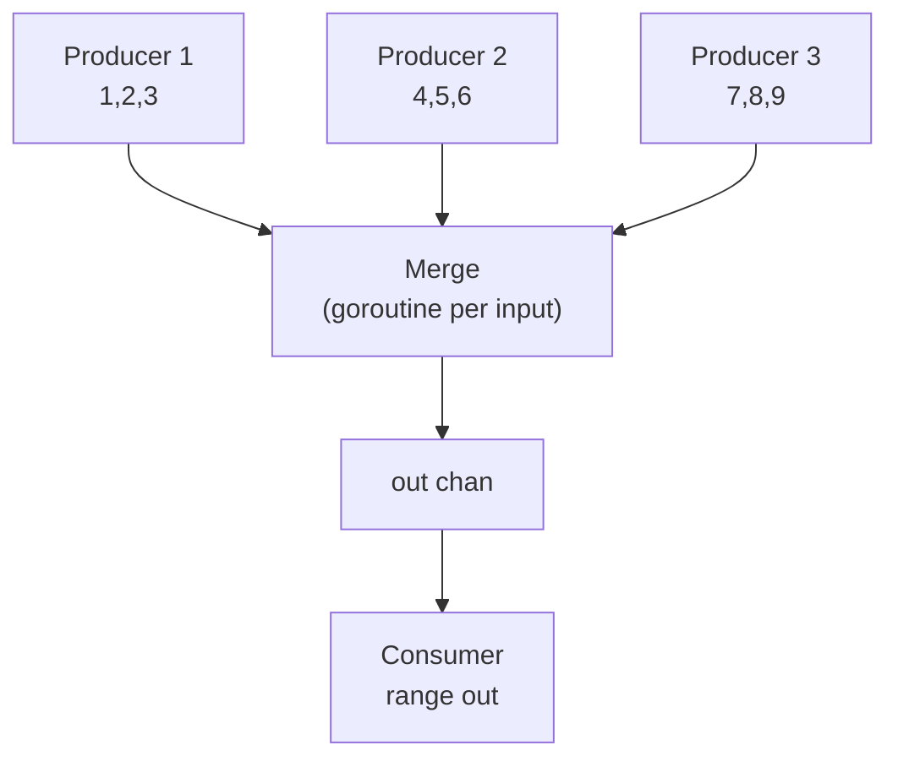

**Execution Trace:**
```
Input:  3 channels with values [1,2,3], [4,5,6], [7,8,9]
Step 1: 3 forwarder goroutines start concurrently
Step 2: values interleave non-deterministically into out
Step 3: all producers close their channels
Step 4: all forwarders return, wg.Done() called 3x
Step 5: closer goroutine calls close(out)
Output: 9 values in non-deterministic order
```

### Interviewer Questions

1. Why launch one goroutine per input channel instead of a single select over all?
2. Can we bound the number of goroutines for 10000 input channels?
3. How does this scale when producers generate at vastly different rates?
4. Walk me through the scenario where one producer never closes.
5. How would you preserve ordering from each individual channel?
6. What's the GC impact of creating thousands of merge goroutines?
7. How would you test non-deterministic output ordering?

### Follow-Up Questions

**Q1:** Why not use a single `select` over all input channels?
**A1:** Go's `select` requires a fixed, compile-time-known set of cases. For dynamic N channels, you cannot write `select { case v := <-channels[i]: ... }` in a loop. The per-goroutine approach is idiomatic and correct.

**Q2:** How do you merge channels while preserving per-channel ordering?
**A2:** Each forwarder goroutine preserves its channel's order (it reads sequentially). Cross-channel ordering is non-deterministic. To enforce total ordering, you'd need a priority queue with sequence numbers — much more complex.

**Q3:** What's the `reflect.Select` alternative?
**A3:** `reflect.Select(cases []reflect.SelectCase)` allows dynamic select over N channels at runtime. It's slower than the goroutine approach due to reflection overhead, but avoids N goroutines. Use for read-heavy, low-throughput scenarios.

**Q4:** How do you handle a slow consumer causing backpressure?
**A4:** The output channel buffer absorbs bursts. When full, all forwarder goroutines block on `out <- v`. Producers also block when their channels fill. This is natural backpressure — the slow consumer slows the whole pipeline.

**Q5:** How do you test that all values appear exactly once in the output?
**A5:** Collect output into a `map[int]int`, increment count per value. Assert each expected value has count=1. Run with `-race` to catch goroutine safety issues.

---
## Q8: Fan-Out — Distribute Work to Multiple Workers  [Level 3 — Medium]

> **Tags:** `#fan-out` `#worker-pool` `#parallel-processing`

### Problem Statement
Write a `fanOut(ctx context.Context, jobs <-chan int, numWorkers int) <-chan int` function that distributes incoming jobs across `numWorkers` goroutines. Each worker squares its job. Merge all worker outputs into a single result channel. Process 20 jobs with 4 workers.

### Input / Output / Constraints

```
Input:  jobs = [1..20], numWorkers = 4
Output: 20 squared values (order non-deterministic)
        e.g., 1 4 9 16 25 ... 400

Constraints:
  • 1 ≤ numWorkers ≤ 100
  • 1 ≤ len(jobs) ≤ 10⁶
  • Each job processed exactly once
  • All workers exit cleanly when jobs channel closes
```

### Thought Process

Think like a senior Go engineer:
1. **Understand:** Fan-out parallelizes CPU-bound work — N workers share one input channel.
2. **Pattern:** Worker pool pattern — N goroutines all range the same jobs channel.
3. **Edge cases:** numWorkers > len(jobs): idle workers close cleanly; numWorkers=1: effectively sequential.
4. **Approach:** Launch N worker goroutines all receiving from same jobs channel; merge their outputs.

### Brute Force Solution

```go
package main

import "fmt"

// bruteForce — single goroutine, O(n) sequential
func bruteForce(jobs []int) []int {
    result := make([]int, len(jobs))
    for i, j := range jobs {
        result[i] = j * j
    }
    return result
}
```

**Time:** O(n) | **Space:** O(n)
**Bottleneck:** No parallelism — CPU-bound work is sequential.

### Better Solution

```go
func fanOut(jobs <-chan int, numWorkers int) <-chan int {
    out := make(chan int, numWorkers)
    var wg sync.WaitGroup
    for i := 0; i < numWorkers; i++ {
        wg.Add(1)
        go func() {
            defer wg.Done()
            for j := range jobs {
                out <- j * j
            }
        }()
    }
    go func() { wg.Wait(); close(out) }()
    return out
}
```

**Time:** O(n/k) parallel | **Space:** O(k) goroutines

### Best / Optimal Solution

```go
package main

import (
    "context"
    "fmt"
    "sync"
)

// worker processes jobs from in, sends results to out.
func worker(ctx context.Context, id int, in <-chan int, out chan<- int, wg *sync.WaitGroup) {
    defer wg.Done()
    for {
        select {
        case job, ok := <-in:
            if !ok {
                return
            }
            result := job * job // CPU-bound work
            select {
            case out <- result:
            case <-ctx.Done():
                return
            }
        case <-ctx.Done():
            return
        }
    }
}

// FanOut distributes jobs to numWorkers goroutines, merges results.
func FanOut(ctx context.Context, jobs <-chan int, numWorkers int) (<-chan int, error) {
    if numWorkers <= 0 {
        return nil, fmt.Errorf("numWorkers must be positive, got %d", numWorkers)
    }
    results := make(chan int, numWorkers*4)
    var wg sync.WaitGroup

    for i := 0; i < numWorkers; i++ {
        wg.Add(1)
        go worker(ctx, i, jobs, results, &wg)
    }

    go func() {
        wg.Wait()
        close(results)
    }()

    return results, nil
}

func main() {
    ctx := context.Background()
    jobs := make(chan int, 20)
    for i := 1; i <= 20; i++ {
        jobs <- i
    }
    close(jobs)

    results, err := FanOut(ctx, jobs, 4)
    if err != nil {
        fmt.Printf("error: %v\n", err)
        return
    }

    for v := range results {
        fmt.Println(v)
    }
}
```

**Time:** O(n/k) parallel where k=numWorkers | **Space:** O(k)

### Production Considerations

| Aspect | Details |
|--------|---------|
| **Scalability** | Optimal numWorkers ≈ GOMAXPROCS for CPU-bound; higher for I/O-bound |
| **Edge Cases** | numWorkers=0: return error; jobs channel nil: workers block on ctx |
| **Error Handling** | Worker errors need separate errc channel; first error cancels context |
| **Memory** | Results buffer `numWorkers*4` prevents workers from blocking on output |
| **Concurrency** | All workers safe — each receives from jobs channel independently |

### Visual Explanation

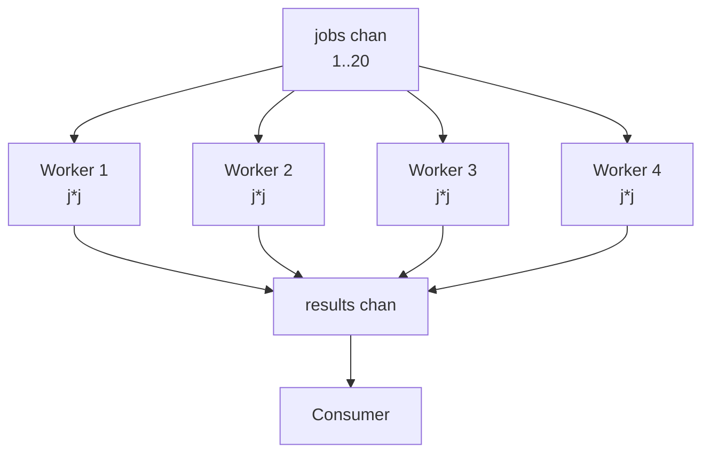

**Execution Trace:**
```
Input:  jobs 1-20, 4 workers
Step 1: Worker 1 picks job 1 (→1), Worker 2 picks job 2 (→4)...
Step 2: Workers race to pick remaining jobs from shared channel
Step 3: Each sends squared result to results channel
Step 4: jobs closes after 20 items; workers exit their range loops
Step 5: wg.Wait() unblocks; close(results)
Output: 20 squared values in non-deterministic order
```

### Interviewer Questions

1. Why do all workers share one input channel instead of each having their own?
2. Can we dynamically scale worker count based on queue depth?
3. How does this scale to 1M jobs with 100 workers?
4. Walk me through the scenario where one worker panics.
5. How would you collect errors from individual workers?
6. What's the optimal buffer size for the results channel?
7. How would you add per-worker metrics?

### Follow-Up Questions

**Q1:** How do you handle panics in worker goroutines?
**A1:** Add `defer func() { if r := recover(); r != nil { errc <- fmt.Errorf("worker %d panicked: %v", id, r) } }()` at the top of each worker. Without this, a panicking worker crashes the entire program.

**Q2:** How do you dynamically scale the worker pool?
**A2:** Use `errgroup` with semaphore, or a supervisor goroutine that monitors queue depth via `len(jobs)` and spawns/stops workers. Libraries like `ants` provide dynamic pool management.

**Q3:** When is fan-out NOT beneficial?
**A3:** When work is I/O-bound with very low CPU usage and network is the bottleneck. Also when job ordering must be preserved — fan-out breaks FIFO ordering.

**Q4:** How do you preserve output ordering in a fan-out?
**A4:** Assign a sequence number to each job. Workers send `Result{Seq: n, Val: v}`. Collector uses a priority queue (min-heap on Seq) to reorder results before emitting.

**Q5:** How do you benchmark optimal worker count?
**A5:** Write a benchmark with `b.N` jobs, vary worker count from 1 to 2*runtime.GOMAXPROCS(0). Plot throughput vs. workers. For CPU-bound: peak at GOMAXPROCS. For I/O-bound: peak much higher.

---

## Q9: Timeout with Select and time.After  [Level 3 — Medium]

> **Tags:** `#select` `#timeout` `#time-after` `#non-blocking`

### Problem Statement
Write a function `fetchWithTimeout(fetch func() (string, error), timeout time.Duration) (string, error)` that executes `fetch` in a goroutine and returns its result if it completes within `timeout`, or returns an error if it times out. Handle the goroutine leak on timeout.

### Input / Output / Constraints

```
Input:  fetch = slow HTTP call (simulated 500ms delay), timeout = 200ms
Output: "", error: "operation timed out after 200ms"

Input:  fetch = fast call (50ms), timeout = 200ms
Output: "result data", nil

Constraints:
  • timeout > 0
  • fetch must not leak after timeout
  • Exact error message: "operation timed out after {duration}"
```

### Thought Process

Think like a senior Go engineer:
1. **Understand:** `select` on two channels — result and timer — returns whichever fires first.
2. **Pattern:** `time.After` creates a channel that receives after the duration elapses.
3. **Edge cases:** fetch returns error (not timeout); timeout=0 (immediately times out); fetch panics.
4. **Approach:** Buffered result channel (size 1) prevents goroutine leak on timeout.

### Brute Force Solution

```go
package main

import (
    "fmt"
    "time"
)

// bruteForce — sequential with fixed sleep check — NOT real timeout
func bruteForce(fetchDuration time.Duration, timeout time.Duration) (string, error) {
    done := make(chan string)
    go func() {
        time.Sleep(fetchDuration)
        done <- "result"
    }()
    time.Sleep(timeout)
    select {
    case v := <-done:
        return v, nil
    default:
        return "", fmt.Errorf("timed out") // goroutine LEAKS
    }
}
```

**Time:** O(timeout) | **Space:** O(1)
**Bottleneck:** Always waits full timeout duration; goroutine leaks on timeout path.

### Better Solution

```go
type result struct {
    val string
    err error
}

func fetchWithTimeout(fetch func() (string, error), timeout time.Duration) (string, error) {
    ch := make(chan result, 1) // buffered prevents leak
    go func() {
        v, err := fetch()
        ch <- result{v, err}
    }()
    select {
    case r := <-ch:
        return r.val, r.err
    case <-time.After(timeout):
        return "", fmt.Errorf("operation timed out after %v", timeout)
    }
}
```

**Time:** O(min(fetch_time, timeout)) | **Space:** O(1)

### Best / Optimal Solution

```go
package main

import (
    "context"
    "fmt"
    "time"
)

type fetchResult struct {
    val string
    err error
}

// FetchWithTimeout executes fetch with a deadline, preventing goroutine leaks.
// Uses a buffered channel so the goroutine can always send even after timeout.
func FetchWithTimeout(ctx context.Context, fetch func(context.Context) (string, error), timeout time.Duration) (string, error) {
    if timeout <= 0 {
        return "", fmt.Errorf("timeout must be positive, got %v", timeout)
    }

    ctx, cancel := context.WithTimeout(ctx, timeout)
    defer cancel()

    ch := make(chan fetchResult, 1) // size 1: goroutine never blocks on send
    go func() {
        val, err := fetch(ctx)
        ch <- fetchResult{val, err} // always succeeds (buffered)
    }()

    select {
    case r := <-ch:
        return r.val, r.err
    case <-ctx.Done():
        return "", fmt.Errorf("operation timed out after %v", timeout)
    }
}

func main() {
    slowFetch := func(ctx context.Context) (string, error) {
        select {
        case <-time.After(500 * time.Millisecond):
            return "slow result", nil
        case <-ctx.Done():
            return "", ctx.Err()
        }
    }

    result, err := FetchWithTimeout(context.Background(), slowFetch, 200*time.Millisecond)
    if err != nil {
        fmt.Printf("error: %v\n", err)
        return
    }
    fmt.Println(result)
}
```

**Time:** O(min(fetch, timeout)) | **Space:** O(1)

### Production Considerations

| Aspect | Details |
|--------|---------|
| **Scalability** | Each call launches one goroutine; at 10K RPS that's 10K goroutines peak |
| **Edge Cases** | timeout=0: immediately cancelled; fetch panics: goroutine exits, buffered ch never written |
| **Error Handling** | Distinguish timeout error from fetch error — use `errors.Is(err, context.DeadlineExceeded)` |
| **Memory** | Buffered channel (cap=1) prevents goroutine from blocking indefinitely |
| **Concurrency** | context.WithTimeout propagates deadline to fetch — fetch should check ctx.Done() |

### Visual Explanation

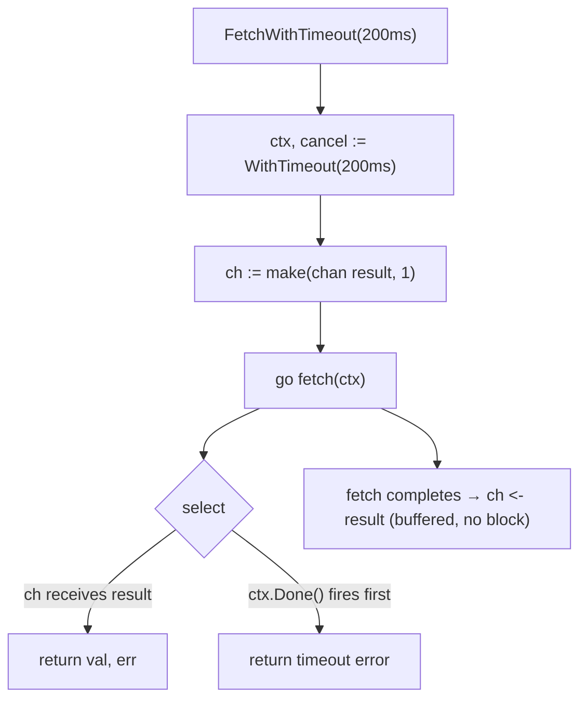

**Execution Trace:**
```
Input:  fetch=500ms delay, timeout=200ms
t=0ms:   goroutine starts fetch
t=200ms: ctx.Done() fires in select
t=200ms: return "", "operation timed out after 200ms"
t=500ms: goroutine writes to buffered ch (no leak), then exits
Output: error: operation timed out after 200ms
```

### Interviewer Questions

1. Why use a buffered channel of size 1 instead of unbuffered?
2. Can we reuse `time.After` timers? What's the GC concern?
3. How does this scale to 100K concurrent fetch operations?
4. Walk me through what happens if fetch panics.
5. How would you distinguish a timeout error from a fetch-specific error?
6. What's the memory cost of 10K concurrent timeouts?
7. How would you test the timeout boundary precisely?

### Follow-Up Questions

**Q1:** Why buffer the result channel at size 1?
**A1:** Without buffering, if timeout fires first, the goroutine blocks forever on `ch <- result` — a goroutine leak. With buffer=1, the goroutine can always send even if nobody is receiving, then exits cleanly.

**Q2:** What's wrong with reusing `time.After` in a hot loop?
**A2:** `time.After` allocates a new `*time.Timer` every call. The timer and its goroutine are GC'd only after they fire — not immediately. In tight loops, use `time.NewTimer` + `timer.Reset()` to reuse the same timer.

**Q3:** How do you propagate context to the fetch function?
**A3:** Pass `ctx` as first argument: `fetch(ctx context.Context) (string, error)`. The fetch implementation checks `ctx.Done()` at blocking points. `context.WithTimeout` sets the deadline; `context.WithCancel` allows manual cancellation.

**Q4:** How do you test timeout behavior without actual sleep?
**A4:** Use a fake clock (e.g., `github.com/benbjohnson/clock`). Inject the clock into the function, advance it programmatically in tests. Or use very short timeouts (1ms) and verify the error type.

**Q5:** How do you implement retry-with-timeout?
**A5:** Wrap `FetchWithTimeout` in a loop with exponential backoff: `for attempt := 0; attempt < maxRetries; attempt++ { result, err := FetchWithTimeout(...); if err == nil { return result, nil }; time.Sleep(backoff) }`.

---

## Q10: Non-Blocking Send/Receive with Default  [Level 3 — Medium]

> **Tags:** `#non-blocking` `#select-default` `#try-send` `#try-receive`

### Problem Statement
Implement a `TrySend(ch chan<- int, val int) bool` that attempts to send `val` without blocking, returning `true` on success. Also implement `TryReceive(ch <-chan int) (int, bool)` that attempts a non-blocking receive. Demonstrate both in a scenario with a full buffered channel.

### Input / Output / Constraints

```
Input:  ch = make(chan int, 2), pre-filled with [10, 20]
TrySend(ch, 30) → false (channel full)
TryReceive(ch)  → (10, true)
TrySend(ch, 30) → true (space freed)

Constraints:
  • Must not block under any circumstances
  • Return value indicates success/failure
  • Thread-safe
```

### Thought Process

Think like a senior Go engineer:
1. **Understand:** `select` with `default` case executes immediately if no channel is ready.
2. **Pattern:** Try-send/try-receive — useful for metrics, non-blocking event dispatch, circuit breakers.
3. **Edge cases:** nil channel — both send and receive block (default fires immediately).
4. **Approach:** `select { case ch <- val: return true; default: return false }`.

### Brute Force Solution

```go
package main

// bruteForce — checks len/cap before sending — RACE CONDITION
func bruteForce(ch chan int, val int) bool {
    if len(ch) < cap(ch) { // NOT atomic with the send below!
        ch <- val // another goroutine may have filled it between check and send
        return true
    }
    return false
}
```

**Time:** O(1) | **Space:** O(1)
**Bottleneck:** Race condition between `len(ch) < cap(ch)` check and the actual send.

### Better Solution

```go
func TrySend(ch chan<- int, val int) bool {
    select {
    case ch <- val:
        return true
    default:
        return false
    }
}

func TryReceive(ch <-chan int) (int, bool) {
    select {
    case v := <-ch:
        return v, true
    default:
        return 0, false
    }
}
```

**Time:** O(1) | **Space:** O(1)

### Best / Optimal Solution

```go
package main

import "fmt"

// TrySend attempts a non-blocking send. Returns true if sent, false if channel full/nil.
func TrySend[T any](ch chan<- T, val T) bool {
    select {
    case ch <- val:
        return true
    default:
        return false
    }
}

// TryReceive attempts a non-blocking receive. Returns (value, true) or (zero, false).
func TryReceive[T any](ch <-chan T) (T, bool) {
    select {
    case v := <-ch:
        return v, true
    default:
        var zero T
        return zero, false
    }
}

// DrainChannel removes all items from a channel without blocking on empty.
func DrainChannel[T any](ch chan T) []T {
    var drained []T
    for {
        v, ok := TryReceive[T](ch)
        if !ok {
            break
        }
        drained = append(drained, v)
    }
    return drained
}

func main() {
    ch := make(chan int, 2)
    ch <- 10
    ch <- 20

    fmt.Println(TrySend(ch, 30))    // false: channel full
    v, ok := TryReceive(ch)
    fmt.Println(v, ok)              // 10, true
    fmt.Println(TrySend(ch, 30))   // true: space freed
    fmt.Println(DrainChannel(ch))   // [20 30]
}
```

**Time:** O(1) per operation | **Space:** O(1)

### Production Considerations

| Aspect | Details |
|--------|---------|
| **Scalability** | O(1) per op; used in high-frequency paths like metrics emission |
| **Edge Cases** | Nil channel: TrySend/TryReceive both hit default — returns false/zero |
| **Error Handling** | Callers must handle false return — log dropped sends, alert on high drop rate |
| **Memory** | No allocation; generic version works with any type |
| **Concurrency** | select is atomic w.r.t. channel state — no race condition |

### Visual Explanation

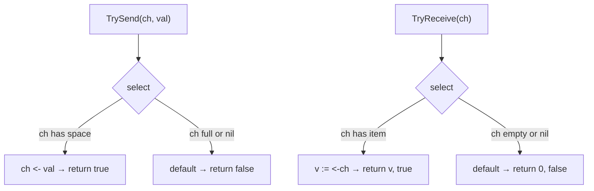

**Execution Trace:**
```
ch = [10, 20] (cap=2, full)
TrySend(ch, 30): select → default fires → false
TryReceive(ch):  select → receives 10 → (10, true), ch=[20]
TrySend(ch, 30): select → sends 30 → true, ch=[20,30]
Output: false\n10 true\ntrue
```

### Interviewer Questions

1. Why is `select { case ch<-val: ... default: }` atomic but `len(ch) < cap(ch)` is not?
2. Can we improve throughput with lock-free ring buffers?
3. How does this scale in a high-frequency trading system doing 1M sends/sec?
4. Walk me through behavior when ch is nil.
5. How would you track the drop rate of failed TrySend calls?
6. What's the memory model guarantee of select?
7. How would you test concurrent TrySend/TryReceive without data races?

### Follow-Up Questions

**Q1:** What is the Go memory model guarantee for `select`?
**A1:** Each `select` case evaluation is atomic — if a channel is ready, the send/receive completes without interference. The runtime holds the channel's lock during the select evaluation.

**Q2:** How do you implement a "best-effort" metrics emitter using TrySend?
**A2:** `func EmitMetric(ch chan<- Metric, m Metric) { if !TrySend(ch, m) { atomic.AddInt64(&droppedMetrics, 1) } }`. This never blocks the hot path; a background consumer drains the channel.

**Q3:** How does non-blocking receive differ from closed channel detection?
**A3:** `v, ok := <-ch` (blocking) returns `ok=false` when channel is closed AND empty. `TryReceive` returns `(zero, false)` for BOTH empty-open and empty-closed channels — you cannot distinguish them without closing state tracking.

**Q4:** Can you implement a ring buffer with atomic operations instead of channels?
**A4:** Yes — use `atomic.Uint64` for head/tail indices, `[]T` for storage. Faster than channels for same-goroutine access. But channels handle goroutine blocking/waking automatically; atomic rings require spinning or additional synchronization.

**Q5:** How would you test TrySend under concurrent load?
**A5:** `go test -race`. Launch 100 goroutines calling TrySend concurrently, verify no panics and no more items in channel than cap(). Count true returns — must equal number of successful sends (channel capacity).

---

## Q11: Channel as Semaphore  [Level 3 — Medium]

> **Tags:** `#semaphore` `#concurrency-limiting` `#buffered-channel`

### Problem Statement
Implement a semaphore using a buffered channel to limit concurrent access to a critical section. Write `NewSemaphore(n int) *Semaphore` with `Acquire()` and `Release()` methods. Use it to limit 10 concurrent goroutines to at most 3 simultaneous executions of a "database query" function.

### Input / Output / Constraints

```
Input:  10 goroutines, semaphore size = 3
Output: At most 3 goroutines in critical section simultaneously
        All 10 complete successfully

Constraints:
  • Semaphore size n ≥ 1
  • Acquire must block when n slots taken
  • Release must never block
  • Must support context cancellation on Acquire
```

### Thought Process

Think like a senior Go engineer:
1. **Understand:** Buffered channel of size n — each send "acquires" a slot; each receive "releases".
2. **Pattern:** Channel-as-semaphore — the buffer acts as the token pool.
3. **Edge cases:** Release without Acquire: channel grows beyond cap (don't receive from full non-sem channel); n=0 panic.
4. **Approach:** `ch := make(chan struct{}, n)`. Acquire: `ch <- struct{}{}`. Release: `<-ch`.

### Brute Force Solution

```go
package main

import "sync"

// bruteForce — mutex with counter, O(1) but complex
type BruteForceSem struct {
    mu      sync.Mutex
    cond    *sync.Cond
    current int
    max     int
}

func (s *BruteForceSem) Acquire() {
    s.mu.Lock()
    for s.current >= s.max {
        s.cond.Wait()
    }
    s.current++
    s.mu.Unlock()
}
```

**Time:** O(1) | **Space:** O(1)
**Bottleneck:** Complex mutex+cond implementation; no context cancellation support.

### Better Solution

```go
type Semaphore struct {
    ch chan struct{}
}

func NewSemaphore(n int) *Semaphore {
    return &Semaphore{ch: make(chan struct{}, n)}
}

func (s *Semaphore) Acquire() {
    s.ch <- struct{}{}
}

func (s *Semaphore) Release() {
    <-s.ch
}
```

**Time:** O(1) | **Space:** O(n) for buffer

### Best / Optimal Solution

```go
package main

import (
    "context"
    "fmt"
    "sync"
    "time"
)

// Semaphore limits concurrent access using a buffered channel.
type Semaphore struct {
    ch chan struct{}
}

// NewSemaphore creates a semaphore allowing n concurrent acquires.
func NewSemaphore(n int) (*Semaphore, error) {
    if n <= 0 {
        return nil, fmt.Errorf("semaphore size must be positive, got %d", n)
    }
    return &Semaphore{ch: make(chan struct{}, n)}, nil
}

// Acquire blocks until a slot is available or ctx is cancelled.
func (s *Semaphore) Acquire(ctx context.Context) error {
    select {
    case s.ch <- struct{}{}:
        return nil
    case <-ctx.Done():
        return ctx.Err()
    }
}

// Release frees a slot. Must be called after every successful Acquire.
func (s *Semaphore) Release() {
    select {
    case <-s.ch:
    default:
        panic("semaphore: Release called without matching Acquire")
    }
}

// Available returns the number of available slots.
func (s *Semaphore) Available() int {
    return cap(s.ch) - len(s.ch)
}

func simulateDBQuery(id int) {
    time.Sleep(100 * time.Millisecond)
    fmt.Printf("Query %d completed\n", id)
}

func main() {
    sem, err := NewSemaphore(3)
    if err != nil {
        fmt.Printf("error: %v\n", err)
        return
    }

    ctx := context.Background()
    var wg sync.WaitGroup

    for i := 1; i <= 10; i++ {
        wg.Add(1)
        go func(id int) {
            defer wg.Done()
            if err := sem.Acquire(ctx); err != nil {
                fmt.Printf("Query %d cancelled: %v\n", id, err)
                return
            }
            defer sem.Release()
            simulateDBQuery(id)
        }(i)
    }

    wg.Wait()
    fmt.Printf("All queries done. Available slots: %d\n", sem.Available())
}
```

**Time:** O(1) per acquire/release | **Space:** O(n) for semaphore buffer

### Production Considerations

| Aspect | Details |
|--------|---------|
| **Scalability** | golang.org/x/sync/semaphore is preferred for production — weight-based |
| **Edge Cases** | Release without Acquire: detect via panic or counter; n=0: return error |
| **Error Handling** | Acquire returns context error on cancellation; caller must check |
| **Memory** | Buffer of n `struct{}` — zero bytes each; negligible overhead |
| **Concurrency** | Channel operations are goroutine-safe; no additional locks needed |

### Visual Explanation

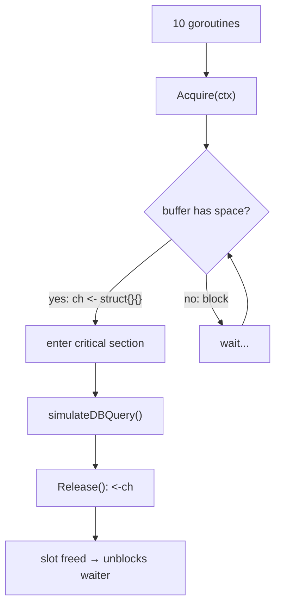

**Execution Trace:**
```
Input:  10 goroutines, sem=3
t=0ms:   G1,G2,G3 acquire (buffer full: [s,s,s])
         G4-G10 block on Acquire
t=100ms: G1 releases → G4 acquires
t=100ms: G2 releases → G5 acquires
...
All 10 complete, always ≤3 concurrent
```

### Interviewer Questions

1. Why use `<-s.ch` for Release instead of `s.ch <- struct{}{}`?
2. Can we implement a weighted semaphore with this pattern?
3. How does this scale compared to `sync.Mutex` for 10K goroutines?
4. Walk me through the panic scenario in Release.
5. How would you implement a try-acquire with deadline?
6. What's the difference between this and `golang.org/x/sync/semaphore`?
7. How would you test that exactly N goroutines are in the critical section at peak?

### Follow-Up Questions

**Q1:** What's the difference between channel semaphore and `golang.org/x/sync/semaphore`?
**A1:** `x/sync/semaphore` supports weighted acquisition (e.g., acquire 3 slots at once for a "heavy" operation). The channel approach only supports unit-weight acquisition. `x/sync/semaphore` is more flexible for heterogeneous workloads.

**Q2:** How do you implement a read-write semaphore?
**A2:** Use two semaphores: `readers` (large cap) and `writer` (cap=1). Read: acquire `readers`. Write: drain all `readers`, acquire `writer`, do work, release `writer`, restore `readers`. Or use `sync.RWMutex` — already optimized for this.

**Q3:** What happens if Acquire is called after context is cancelled?
**A3:** The `select` immediately picks `ctx.Done()` since it's already closed, returns `ctx.Err()` without blocking. The caller must check the returned error.

**Q4:** How do you monitor semaphore utilization?
**A4:** `len(ch)` = acquired slots. `Available() = cap-len`. Expose via metrics: `prometheus.NewGauge` updated on Acquire/Release. Alert when Available consistently near 0 — indicates resource saturation.

**Q5:** How do you test the "at most N concurrent" invariant?
**A5:** Use `atomic.Int32` counter. Increment in critical section, decrement on exit. In test goroutine, sample counter periodically. Assert `counter.Load() <= N` at all sample points. Run with `-race`.

---

## Q12: Closing Channels — The Contract  [Level 2 — Easy]

> **Tags:** `#close` `#channel-contract` `#panic-prevention`

### Problem Statement
Demonstrate the complete channel closing contract: (1) only the sender closes, (2) closing a nil or already-closed channel panics, (3) receiving from a closed channel returns zero value with `ok=false`, (4) sending to a closed channel panics. Write a `SafeClose` utility using `sync.Once`.

### Input / Output / Constraints

```
Input:  channel with values [1, 2, 3], then closed
Output:
  received: 1
  received: 2
  received: 3
  channel closed, zero value: 0 ok: false

Constraints:
  • SafeClose must never panic
  • Demonstrate all 4 contract points
  • Use sync.Once for safe multi-close
```

### Thought Process

Think like a senior Go engineer:
1. **Understand:** Channel closing is a one-way door — once closed, all receives return zero+false; any send panics.
2. **Pattern:** Ownership model — the goroutine that writes owns the close. sync.Once makes it safe.
3. **Edge cases:** Double-close panics; close(nil) panics; receive from closed always works (returns zero).
4. **Approach:** Wrap close in `sync.Once.Do` to allow multiple callers without panic.

### Brute Force Solution

```go
package main

import "fmt"

// bruteForce — no protection against double-close
func bruteForce() {
    ch := make(chan int, 3)
    ch <- 1; ch <- 2; ch <- 3
    close(ch)
    // close(ch) // PANIC: close of closed channel
    for v := range ch {
        fmt.Println(v)
    }
}
```

**Time:** O(n) | **Space:** O(1)
**Bottleneck:** No protection — any duplicate close call in concurrent code panics.

### Better Solution

```go
type SafeChannel struct {
    ch   chan int
    once sync.Once
}

func (sc *SafeChannel) Close() {
    sc.once.Do(func() { close(sc.ch) })
}
```

**Time:** O(1) | **Space:** O(1)

### Best / Optimal Solution

```go
package main

import (
    "fmt"
    "sync"
)

// SafeCloser wraps a channel with safe, idempotent close semantics.
type SafeCloser[T any] struct {
    ch   chan T
    once sync.Once
}

// NewSafeCloser creates a SafeCloser wrapping the given channel.
func NewSafeCloser[T any](ch chan T) *SafeCloser[T] {
    return &SafeCloser[T]{ch: ch}
}

// Send sends a value. Returns false if channel is closed.
func (sc *SafeCloser[T]) Send(val T) (sent bool) {
    defer func() {
        if recover() != nil {
            sent = false
        }
    }()
    sc.ch <- val
    return true
}

// Close closes the channel exactly once. Safe to call from multiple goroutines.
func (sc *SafeCloser[T]) Close() {
    sc.once.Do(func() { close(sc.ch) })
}

// Chan returns the receive-only channel for consumers.
func (sc *SafeCloser[T]) Chan() <-chan T {
    return sc.ch
}

func demonstrateContract() {
    ch := make(chan int, 3)
    sc := NewSafeCloser(ch)

    // Contract point 1: sender closes
    sc.Send(1); sc.Send(2); sc.Send(3)
    sc.Close()
    sc.Close() // safe — sync.Once prevents double-close

    // Contract point 3: receiving from closed channel
    for {
        v, ok := <-sc.Chan()
        if !ok {
            fmt.Printf("channel closed, zero value: %d ok: %v\n", v, ok)
            break
        }
        fmt.Printf("received: %d\n", v)
    }

    // Contract point 4: sending to closed channel (recovered)
    sent := sc.Send(99)
    fmt.Printf("send to closed: %v\n", sent) // false
}

func main() {
    demonstrateContract()
}
```

**Time:** O(n) | **Space:** O(1)

### Production Considerations

| Aspect | Details |
|--------|---------|
| **Scalability** | sync.Once is O(1) and lock-free after first call — scales to 1M goroutines |
| **Edge Cases** | close(nil): panics; close(closed): panics → both handled by sync.Once |
| **Error Handling** | Send to closed channel recovered via defer/recover — returns false |
| **Memory** | sync.Once adds 8 bytes; negligible |
| **Concurrency** | once.Do guarantees exactly one close; fully goroutine-safe |

### Visual Explanation

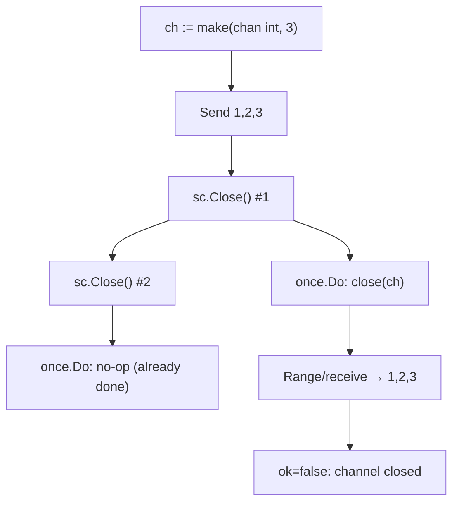

**Execution Trace:**
```
Step 1: Send 1,2,3 → buffer [1,2,3]
Step 2: Close() #1 → once.Do closes ch
Step 3: Close() #2 → once.Do is no-op
Step 4: receive 1 (ok=true)
Step 5: receive 2 (ok=true)
Step 6: receive 3 (ok=true)
Step 7: receive → 0 (ok=false, closed+empty)
```

### Interviewer Questions

1. Why does the Go spec say only the sender should close?
2. Can we improve SafeClose to also notify multiple receivers simultaneously?
3. How does this scale if thousands of goroutines call Close concurrently?
4. Walk me through the panic that occurs when closing a nil channel.
5. How would you implement a broadcast close to multiple channels at once?
6. What's the memory model guarantee around channel close and receive?
7. How would you test that SafeClose is idempotent under concurrent calls?

### Follow-Up Questions

**Q1:** Why does closing a nil channel panic?
**A1:** A nil channel has no backing `hchan` structure — calling `close(nil)` dereferences a nil pointer in the runtime. Always initialize channels before use: `ch := make(chan T)`.

**Q2:** What is the Go memory model guarantee around channel close?
**A2:** The close of a channel happens-before a receive that returns the zero value because the channel is closed. This ensures any write done before close is visible to the receiver.

**Q3:** How do you signal multiple goroutines to stop simultaneously?
**A3:** Close a `done chan struct{}`. All goroutines select on `<-done`. Closing broadcasts to all receivers simultaneously — each receives the zero value (`struct{}{}`) with `ok=false`.

**Q4:** Can you reopen a closed channel?
**A4:** No. Once closed, a channel is permanently closed. Create a new channel if you need to restart the pipeline. This is why channel ownership and lifecycle must be designed carefully.

**Q5:** How do you detect if a channel is closed without receiving?
**A5:** You cannot in Go without a receive. There is no `isClosed(ch)` function. The idiomatic way is `v, ok := <-ch` — if `ok=false` and the channel was buffered and now empty, it's closed. Design your protocol to not need this check.

---

## Q13: Detecting Closed Channel with v, ok Pattern  [Level 2 — Easy]

> **Tags:** `#ok-idiom` `#closed-detection` `#two-value-receive`

### Problem Statement
Write a `Drain(ch <-chan int) ([]int, bool)` function that collects all values from a channel and returns them along with a boolean indicating if the channel was properly closed (vs. received zero values without close). Distinguish between "channel closed" and "received zero value from open channel."

### Input / Output / Constraints

```
Input:  ch sends [5, 0, 3], then closes
Output: values=[5, 0, 3], closed=true

Input:  ch sends nothing, never closes (with timeout)
Output: values=[], closed=false

Constraints:
  • Must distinguish zero-value from closed
  • Use two-value receive: v, ok := <-ch
  • Support timeout to avoid blocking forever
```

### Thought Process

Think like a senior Go engineer:
1. **Understand:** `v, ok := <-ch` — `ok=false` means channel closed AND empty; `ok=true` even for zero values from open channel.
2. **Pattern:** Two-value receive to distinguish data from close signal.
3. **Edge cases:** Channel sends `0` (valid data, not close); channel never closes (timeout needed).
4. **Approach:** Loop with `v, ok := <-ch`; break when `!ok`; use context for timeout.

### Brute Force Solution

```go
package main

// bruteForce — range loop, can't distinguish zero from close
func bruteForce(ch <-chan int) []int {
    var result []int
    for v := range ch { // range already handles ok internally
        result = append(result, v)
    }
    return result // no way to return "was it closed?" — range always waits for close
}
```

**Time:** O(n) | **Space:** O(n)
**Bottleneck:** `range` hides the `ok` value — cannot detect if zero values were data vs. close.

### Better Solution

```go
func Drain(ch <-chan int) ([]int, bool) {
    var result []int
    for {
        v, ok := <-ch
        if !ok {
            return result, true // channel closed
        }
        result = append(result, v)
    }
}
```

**Time:** O(n) | **Space:** O(n)

### Best / Optimal Solution

```go
package main

import (
    "context"
    "fmt"
)

// DrainWithContext collects values from ch until closed or ctx cancelled.
// Returns collected values and whether channel was properly closed.
func DrainWithContext(ctx context.Context, ch <-chan int) (values []int, closed bool, err error) {
    for {
        select {
        case v, ok := <-ch:
            if !ok {
                return values, true, nil // channel closed normally
            }
            values = append(values, v)
        case <-ctx.Done():
            return values, false, ctx.Err() // timeout or cancellation
        }
    }
}

func main() {
    ctx := context.Background()

    // Scenario 1: channel sends 5, 0, 3 then closes
    ch1 := make(chan int, 3)
    ch1 <- 5; ch1 <- 0; ch1 <- 3
    close(ch1)

    vals, wasClosed, err := DrainWithContext(ctx, ch1)
    fmt.Printf("values=%v closed=%v err=%v\n", vals, wasClosed, err)

    // Scenario 2: channel sends zero value — NOT a close signal
    ch2 := make(chan int, 1)
    ch2 <- 0
    close(ch2)

    vals2, wasClosed2, _ := DrainWithContext(ctx, ch2)
    fmt.Printf("values=%v closed=%v\n", vals2, wasClosed2)
}
```

**Time:** O(n) | **Space:** O(n)

### Production Considerations

| Aspect | Details |
|--------|---------|
| **Scalability** | O(n) for n values; memory grows with accumulated results |
| **Edge Cases** | Zero value `0` is valid data, not close signal; nil channel blocks forever |
| **Error Handling** | Context cancellation returns partial results with error |
| **Memory** | Append may reallocate; pre-allocate if count known: `make([]int, 0, cap(ch))` |
| **Concurrency** | select is atomic; ctx.Done() prevents permanent blocking |

### Visual Explanation

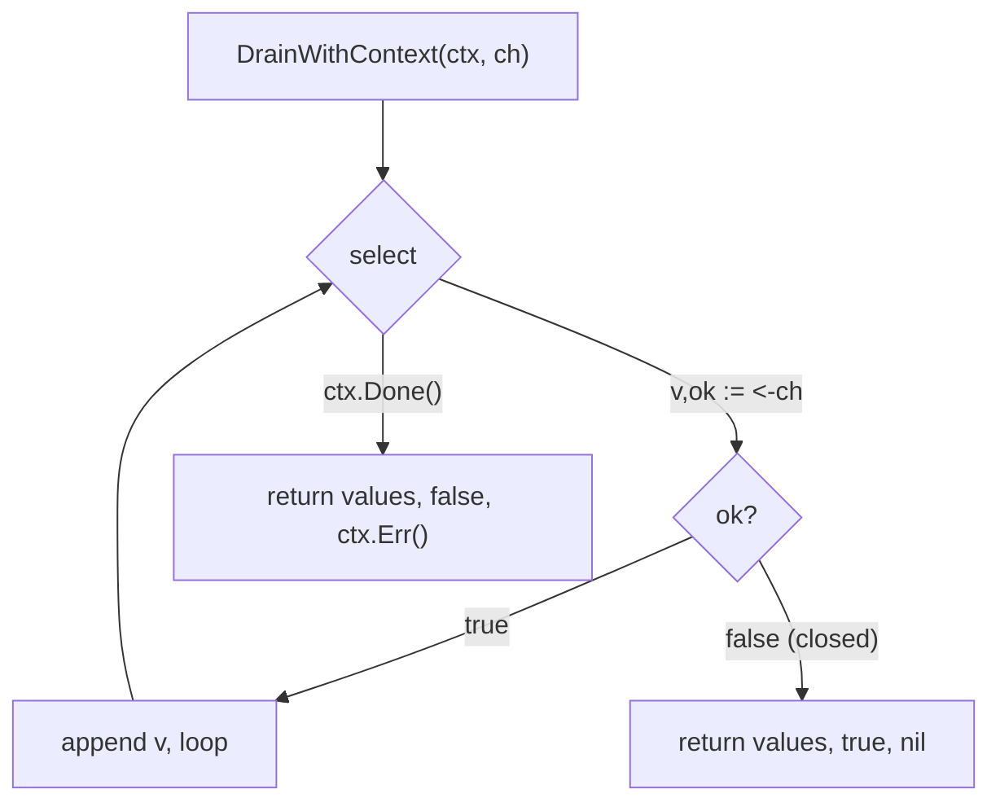

**Execution Trace:**
```
ch: [5, 0, 3] → closed
Iteration 1: v=5, ok=true  → append 5
Iteration 2: v=0, ok=true  → append 0 (NOT a close!)
Iteration 3: v=3, ok=true  → append 3
Iteration 4: v=0, ok=false → return [5,0,3], true, nil
Output: values=[5 0 3] closed=true err=<nil>
```

### Interviewer Questions

1. Why can't you use `v == 0` to detect channel close?
2. Can we improve by streaming to a callback instead of collecting?
3. How does this scale if channel sends 1M values?
4. Walk me through behavior with a nil channel in the select.
5. How would you implement this for a generic type `T`?
6. What's the memory impact of appending 1M items?
7. How would you test that zero values are not misidentified as close signals?

### Follow-Up Questions

**Q1:** What does `v, ok := <-ch` return when ch is closed and has buffered data?
**A1:** It returns the buffered value with `ok=true` until the buffer is empty. Only after all buffered data is read does `ok=false` appear. So close signals after all data is consumed.

**Q2:** What does `v, ok := <-ch` return for a nil channel?
**A2:** It blocks forever — nil channel never has data. In a `select`, a nil channel case is simply skipped. This can be used to "disable" a select case dynamically.

**Q3:** How do you implement a generic `Drain[T any]`?
**A3:** `func Drain[T any](ctx context.Context, ch <-chan T) ([]T, bool, error)` — same logic with generic type parameter. Works for any channel type without code duplication.

**Q4:** How do you detect a closed channel without blocking at all?
**A4:** Use `select { case v, ok := <-ch: ...; default: /* empty */ }`. If the channel has no item ready, default fires. But this cannot tell you if a channel is closed if it's empty — it just means "nothing available right now."

**Q5:** How would you write a test for DrainWithContext under cancellation?
**A5:** Create a never-closing channel, pass a context cancelled after 1ms, assert `wasClosed=false` and `err=context.Canceled`. Use `goleak` to verify no goroutine leaks after the test.

---

---


## Q14: Nil Channel to Disable Select Case  [Level 4 — Advanced]

> **Tags:** `#nil-channel` `#dynamic-select` `#select-case-disable`

### Problem Statement
Build a `Merger` that merges two channels but allows dynamically disabling either input mid-stream. When one channel closes, set it to nil in the select to disable that case without breaking the other. Merge channel A `[1,2,3]` and channel B `[4,5,6]` where A closes first.

### Input / Output / Constraints

```
Input:  chA=[1,2,3] (closes after 3), chB=[4,5,6]
Output: 6 values total, both channels fully drained, no deadlock

Constraints:
  • When chA closes, continue reading chB until it closes
  • No goroutine leak
  • Exit exactly when both channels are done
```

### Thought Process

Think like a senior Go engineer:
1. **Understand:** A closed channel always returns immediately in select — causes busy loop if not disabled.
2. **Pattern:** Set channel variable to `nil` in select case when closed — nil channels never become ready.
3. **Edge cases:** Both channels close simultaneously; all values must be drained.
4. **Approach:** Track `remaining` counter; set `chA = nil` or `chB = nil` on close.

### Brute Force Solution

```go
package main

import "fmt"

// bruteForce — range on each sequentially — loses concurrency
func bruteForce(chA, chB <-chan int) []int {
    var result []int
    for v := range chA { result = append(result, v) }
    for v := range chB { result = append(result, v) }
    return result
}
```

**Time:** O(n) | **Space:** O(n)
**Bottleneck:** Sequential — waits for chA to close before reading chB.

### Better Solution

```go
func merge(chA, chB <-chan int) <-chan int {
    out := make(chan int)
    go func() {
        defer close(out)
        for chA != nil || chB != nil {
            select {
            case v, ok := <-chA:
                if !ok { chA = nil; continue }
                out <- v
            case v, ok := <-chB:
                if !ok { chB = nil; continue }
                out <- v
            }
        }
    }()
    return out
}
```

**Time:** O(n) | **Space:** O(1)

### Best / Optimal Solution

```go
package main

import (
    "context"
    "fmt"
)

// MergeTwo merges exactly two channels, disabling each via nil when closed.
func MergeTwo(ctx context.Context, chA, chB <-chan int) <-chan int {
    out := make(chan int, 8)
    go func() {
        defer close(out)
        for chA != nil || chB != nil {
            select {
            case v, ok := <-chA:
                if !ok { chA = nil; continue }
                select { case out <- v: case <-ctx.Done(): return }
            case v, ok := <-chB:
                if !ok { chB = nil; continue }
                select { case out <- v: case <-ctx.Done(): return }
            case <-ctx.Done():
                return
            }
        }
    }()
    return out
}

func makeIntChan(vals ...int) <-chan int {
    ch := make(chan int, len(vals))
    for _, v := range vals { ch <- v }
    close(ch)
    return ch
}

func main() {
    ctx := context.Background()
    for v := range MergeTwo(ctx, makeIntChan(1, 2, 3), makeIntChan(4, 5, 6)) {
        fmt.Println(v)
    }
}
```

**Time:** O(n+m) | **Space:** O(1)

### Production Considerations

| Aspect | Details |
|--------|---------|
| **Scalability** | Pattern extends to N channels with reflect.Select |
| **Edge Cases** | Both nil at start: loop exits immediately |
| **Error Handling** | Context cancellation exits goroutine cleanly |
| **Memory** | O(1) goroutine overhead |
| **Concurrency** | Local nil assignment — no shared state, no races |

### Visual Explanation

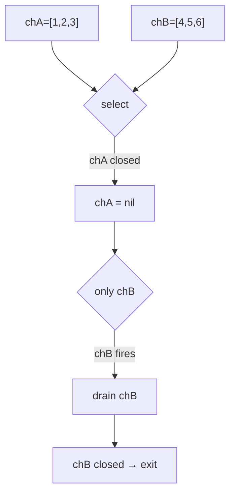

**Execution Trace:**
```
chA=[1,2,3], chB=[4,5,6]
select picks from both until chA closes
chA=nil → only chB fires
chB values drain, chB closes, chB=nil
both nil → close(out)
```

### Interviewer Questions

1. Why does setting `chA = nil` disable that select case?
2. Can we generalize to N channels without reflect.Select?
3. Walk me through the scenario where both channels close simultaneously.
4. How would you add priority — prefer chA over chB?
5. What's the memory model behavior when reading local nil variable in select?
6. How would you test concurrent close of both channels?
7. What's `reflect.Select` and when should you use it?

### Follow-Up Questions

**Q1:** Why does a nil channel cause a select case to never fire?
**A1:** The Go spec states: a nil channel is never ready. In `select`, a case with nil channel is permanently blocked — effectively disabled. This is the idiomatic way to remove a select case dynamically.

**Q2:** How do you generalize to N channels?
**A2:** Use `reflect.Select(cases []reflect.SelectCase)`. Build cases dynamically. When a channel closes, set `cases[i].Chan = reflect.Value{}` (zero = nil). Slower due to reflection overhead.

**Q3:** How would you implement priority merge (prefer chA)?
**A3:** Check chA with non-blocking select first: `select { case v, ok := <-chA: ...; default: }`. Only if chA empty, read chB. Introduces latency for chB values when chA is consistently available.

**Q4:** What's the behavior if the same goroutine assigns `chA = nil` while another reads it?
**A4:** `chA` is a local variable in the goroutine — no other goroutine touches it. So no race. If shared, you'd need atomic or mutex protection.

**Q5:** How do you write a test without relying on goroutine scheduling order?
**A5:** Collect all output, sort, compare to sorted expected. For per-channel ordering, verify relative order within each channel's values is preserved using sequence numbers.

---

## Q15: Ping-Pong Between Two Goroutines  [Level 4 — Advanced]

> **Tags:** `#ping-pong` `#alternating` `#channel-handoff`

### Problem Statement
Implement a ping-pong game using channels. Two goroutines alternate sending a counter back and forth. Each goroutine increments by 1 when it receives. After N=10 total hits, the game ends. Print each hit with goroutine name and counter.

### Input / Output / Constraints

```
Input:  N = 10 total hits
Output: ping: 1 / pong: 2 / ... / pong: 10 / game over

Constraints:
  • Exactly N hits total
  • Alternating ping/pong
  • No busy waiting
  • Clean exit without goroutine leak
```

### Thought Process

Think like a senior Go engineer:
1. **Understand:** Two goroutines handoff a value through two channels — one per direction.
2. **Pattern:** Channel rendezvous for alternating execution.
3. **Edge cases:** N=0: immediate exit; odd N: ping hits last; even N: pong hits last.
4. **Approach:** pingCh and pongCh; ping receives from pongCh, sends to pingCh.

### Brute Force Solution

```go
// bruteForce — mutex + condition variable
var mu sync.Mutex
var cond = sync.NewCond(&mu)
var counter int
var turn = "ping"

func bruteForcePlayer(name string, N int) {
    for {
        mu.Lock()
        for turn != name && counter < N { cond.Wait() }
        if counter >= N { mu.Unlock(); return }
        counter++
        if name == "ping" { turn = "pong" } else { turn = "ping" }
        cond.Broadcast()
        mu.Unlock()
    }
}
```

**Time:** O(N) | **Space:** O(1)
**Bottleneck:** Mutex+cond is complex; Broadcast wakes all goroutines.

### Best / Optimal Solution

```go
package main

import (
    "fmt"
    "sync"
)

type Ball struct{ count int }

func player(name string, in <-chan Ball, out chan<- Ball, maxHits int, wg *sync.WaitGroup) {
    defer wg.Done()
    for ball := range in {
        ball.count++
        fmt.Printf("%s: %d\n", name, ball.count)
        if ball.count >= maxHits {
            close(out)
            return
        }
        out <- ball
    }
}

func PingPong(maxHits int) error {
    if maxHits <= 0 { return fmt.Errorf("maxHits must be positive") }
    pingCh := make(chan Ball, 1)
    pongCh := make(chan Ball, 1)
    var wg sync.WaitGroup
    wg.Add(2)
    go player("ping", pongCh, pingCh, maxHits, &wg)
    go player("pong", pingCh, pongCh, maxHits, &wg)
    pongCh <- Ball{count: 0}
    wg.Wait()
    fmt.Println("game over")
    return nil
}

func main() { PingPong(10) }
```

**Time:** O(N) | **Space:** O(1)

### Production Considerations

| Aspect | Details |
|--------|---------|
| **Scalability** | Scales to N-player ring — N channels, N goroutines |
| **Edge Cases** | maxHits=1: ping hits once, closes pongCh, pong never fires |
| **Error Handling** | wg.Wait() ensures both goroutines exit |
| **Memory** | Ball passed by value — copy per send |
| **Concurrency** | Channels enforce strict alternation — no mutex |

### Visual Explanation

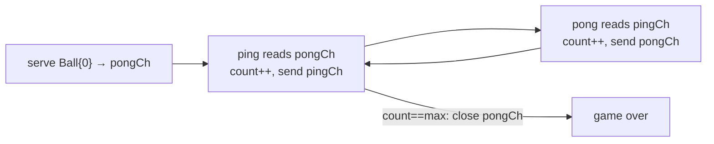

**Execution Trace:**
```
serve: Ball{0} → pongCh
ping: receives {0} → count=1 → "ping: 1" → pingCh
pong: receives {1} → count=2 → "pong: 2" → pongCh
...
ping: count=10 → "ping: 10" → close(pongCh)
pong: range exits → wg.Done()
Output: ping: 1 through pong: 10, game over
```

### Interviewer Questions

1. Why buffer channels with size 1?
2. Can we extend to 3-player round-robin?
3. What if one player goroutine panics?
4. How would you add a timeout to end the game forcibly?
5. How would you test exact alternation order?
6. What's the memory overhead of Ball struct vs raw int?
7. How does this model relate to actor model concurrency?

### Follow-Up Questions

**Q1:** Why buffer channels with size 1?
**A1:** When the last player closes the outgoing channel, buffer=1 ensures the final close doesn't race with a pending send. Without buffer, the closing player must send before closing, which requires careful ordering.

**Q2:** How to extend to 3-player ring?
**A2:** 3 channels: `ab`, `bc`, `ca`. Player A reads ca, writes ab. Player B reads ab, writes bc. Player C reads bc, writes ca. Same N-channel ring pattern.

**Q3:** How to add a forceful timeout?
**A3:** Add `done chan struct{}` closed after timeout. Each player selects on both `in` and `done`. On `done`, return without closing out — let the other player timeout too.

**Q4:** How would you track a score?
**A4:** Add `Score int` to Ball. On a "miss" (simulated randomly), increment opponent's score. Serve fresh. Continue until one player reaches winningScore.

**Q5:** How do you test strict alternation?
**A5:** Record each hit name in a slice. Verify `result[0]="ping"`, `result[1]="pong"`, alternating throughout. Verify `len(result)==maxHits`.

---

## Q16: Chat System with Broadcast Channel  [Level 4 — Advanced]

> **Tags:** `#broadcast` `#pub-sub` `#fan-out` `#chat-system`

### Problem Statement
Build a simple in-memory chat room. Implement `ChatRoom` with `Join(name string) *Client`, `Broadcast(msg Message)`, and `Leave(name string)`. Each `Client` has a receive channel. When a message is broadcast, all active clients receive it.

### Input / Output / Constraints

```
Input:  3 clients join: alice, bob, charlie
        Broadcast: "hello from alice"
        bob leaves
        Broadcast: "charlie speaks"
Output: All 3 receive "hello from alice"
        alice, charlie receive "charlie speaks"

Constraints:
  • Thread-safe join/leave
  • Non-blocking broadcast (dropped if client buffer full)
  • Client buffer size = 10 messages
```

### Thought Process

Think like a senior Go engineer:
1. **Understand:** Broadcast fan-out to all active clients — map of name→channel, RWMutex protected.
2. **Pattern:** Pub-sub with direct channels per subscriber.
3. **Edge cases:** Client leaves during broadcast; empty room broadcast; duplicate name join.
4. **Approach:** RWMutex for map; non-blocking TrySend per client channel.

### Best / Optimal Solution

```go
package main

import (
    "fmt"
    "sync"
    "time"
)

type Message struct {
    From    string
    Content string
    At      time.Time
}

type Client struct {
    Name  string
    Inbox <-chan Message
    inbox chan Message
}

type ChatRoom struct {
    mu      sync.RWMutex
    clients map[string]*Client
}

func NewChatRoom() *ChatRoom {
    return &ChatRoom{clients: make(map[string]*Client)}
}

func (r *ChatRoom) Join(name string) (*Client, error) {
    r.mu.Lock()
    defer r.mu.Unlock()
    if _, exists := r.clients[name]; exists {
        return nil, fmt.Errorf("client %q already in room", name)
    }
    inbox := make(chan Message, 10)
    c := &Client{Name: name, Inbox: inbox, inbox: inbox}
    r.clients[name] = c
    return c, nil
}

func (r *ChatRoom) Leave(name string) {
    r.mu.Lock()
    defer r.mu.Unlock()
    if c, ok := r.clients[name]; ok {
        close(c.inbox)
        delete(r.clients, name)
    }
}

func (r *ChatRoom) Broadcast(msg Message) int {
    r.mu.RLock()
    defer r.mu.RUnlock()
    sent := 0
    for _, c := range r.clients {
        select {
        case c.inbox <- msg:
            sent++
        default: // drop if inbox full
        }
    }
    return sent
}

func main() {
    room := NewChatRoom()
    alice, _ := room.Join("alice")
    _, _ = room.Join("bob")
    charlie, _ := room.Join("charlie")

    room.Broadcast(Message{From: "alice", Content: "hello everyone", At: time.Now()})
    room.Leave("bob")
    room.Broadcast(Message{From: "charlie", Content: "charlie speaks", At: time.Now()})

    for _, client := range []*Client{alice, charlie} {
        close(client.inbox)
        for msg := range client.Inbox {
            fmt.Printf("[%s] %s: %s\n", client.Name, msg.From, msg.Content)
        }
    }
}
```

**Time:** O(n) per broadcast | **Space:** O(n * bufSize)

### Production Considerations

| Aspect | Details |
|--------|---------|
| **Scalability** | For 10K clients, RLock during broadcast is fine; 1M needs sharded rooms |
| **Edge Cases** | Client leaves during broadcast: RLock allows concurrent reads — safe |
| **Error Handling** | Duplicate join returns error; Leave on non-existent is no-op |
| **Memory** | Each client inbox: 10 * sizeof(Message) |
| **Concurrency** | RWMutex: concurrent Broadcasts allowed; Join/Leave exclusive |

### Visual Explanation

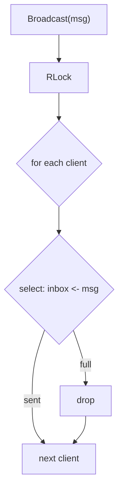

**Execution Trace:**
```
3 clients join. Broadcast("hello"): RLock, send to all 3.
Leave("bob"): Lock, close bob.inbox, delete.
Broadcast("charlie speaks"): RLock, send to alice+charlie only.
```

### Interviewer Questions

1. Why RWMutex instead of Mutex for Broadcast?
2. Can we improve with a single broadcast channel?
3. How does this scale to 100K concurrent clients?
4. How would you implement message history for new joiners?
5. What's the tradeoff between per-client channels and shared channel?
6. How do you test a leaving client doesn't cause panic?
7. How would you shard the room for 1M clients?

### Follow-Up Questions

**Q1:** Why is RWMutex better here?
**A1:** Multiple goroutines can broadcast simultaneously under RLock. Only Join/Leave need exclusive access. Under heavy concurrent Broadcast, RWMutex reduces contention significantly.

**Q2:** How would you implement message history?
**A2:** Maintain a ring buffer `[]Message` of size N under write lock. On Join, send history to new client's inbox. Requires Mutex (not RWMutex) for ring buffer writes during Broadcast.

**Q3:** How do you scale to 1M concurrent clients?
**A3:** Shard rooms into N sub-rooms by consistent hash of client name. Broadcast goes to all shards in parallel. Each shard has its own RWMutex.

**Q4:** What if client inbox is always full?
**A4:** Track `droppedCount` per client. If drop rate exceeds threshold, force-unsubscribe the lagging client and notify them. This implements "slow consumer eviction."

**Q5:** How would you test message delivery under concurrent join/leave/broadcast?
**A5:** Launch goroutines doing random Join/Leave/Broadcast under `-race`. Assert no panics, no deadlocks. Verify message counts with atomic counters. Use `goleak`.

---

## Q17: Generator Pattern — Infinite Sequence via Channel  [Level 4 — Advanced]

> **Tags:** `#generator` `#infinite-sequence` `#lazy-evaluation`

### Problem Statement
Implement `Fibonacci(ctx context.Context) <-chan int` yielding Fibonacci numbers indefinitely. Also implement `Take(n int, ch <-chan int) []int` consuming exactly n values. The caller controls stopping via context cancellation.

### Input / Output / Constraints

```
Input:  Take(10, Fibonacci(ctx))
Output: [0 1 1 2 3 5 8 13 21 34]

Constraints:
  • Generator runs until ctx cancelled
  • Take must not leak generator goroutine
  • Integer overflow for large n — handle with big.Int
```

### Best / Optimal Solution

```go
package main

import (
    "context"
    "fmt"
    "math/big"
)

func FibonacciBig(ctx context.Context) <-chan *big.Int {
    ch := make(chan *big.Int, 4)
    go func() {
        defer close(ch)
        a := big.NewInt(0)
        b := big.NewInt(1)
        for {
            val := new(big.Int).Set(a)
            select {
            case ch <- val:
                a, b = b, new(big.Int).Add(a, b)
            case <-ctx.Done():
                return
            }
        }
    }()
    return ch
}

func TakeN(ctx context.Context, cancel context.CancelFunc, n int, ch <-chan *big.Int) []*big.Int {
    result := make([]*big.Int, 0, n)
    for v := range ch {
        result = append(result, v)
        if len(result) == n {
            cancel()
            break
        }
    }
    return result
}

func main() {
    ctx, cancel := context.WithCancel(context.Background())
    defer cancel()
    fibs := FibonacciBig(ctx)
    result := TakeN(ctx, cancel, 10, fibs)
    for _, v := range result { fmt.Println(v) }
}
```

**Time:** O(n) | **Space:** O(n) result; generator O(1)

### Production Considerations

| Aspect | Details |
|--------|---------|
| **Scalability** | Lazy: O(1) generator memory regardless of sequence length |
| **Edge Cases** | n=0: TakeN returns empty, cancels ctx |
| **Error Handling** | ctx cancellation signals generator exit; TakeN doesn't block |
| **Memory** | Each big.Int: ~24 bytes + digits |
| **Concurrency** | Single generator goroutine; exits within one iteration of cancellation |

### Visual Explanation

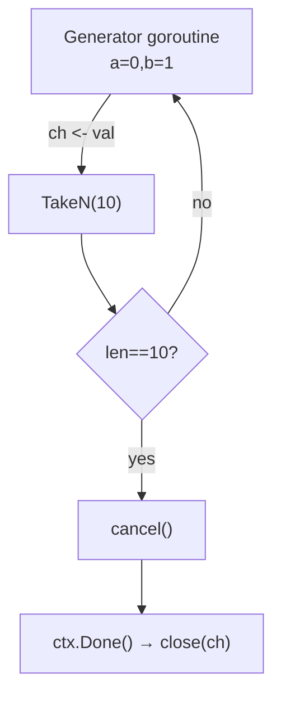

**Execution Trace:**
```
Generator yields 0,1,1,2,3,5,8,13,21,34
TakeN collects 10 values, calls cancel()
Generator: ctx.Done() fires → close(ch)
Output: [0 1 1 2 3 5 8 13 21 34]
```

### Interviewer Questions

1. Why does TakeN call cancel() instead of just breaking range?
2. How would you implement a generic Generator[T any]?
3. What is the Go 1.23 alternative to generator channels?
4. Can you parallelize Fibonacci generation?
5. How do you test mathematical correctness?
6. What's the goroutine leak without cancel()?
7. How would you implement multiple consumers for the same generator?

### Follow-Up Questions

**Q1:** Why call cancel() in TakeN?
**A1:** Breaking range without cancellation leaves the generator blocked on `ch <- val` forever — goroutine leak. cancel() causes `ctx.Done()` to fire, generator exits cleanly.

**Q2:** Go 1.23 alternative?
**A2:** `iter.Seq[V]` — push-based iterators with range-over-function. `func Fibonacci() iter.Seq[int]` with yield callback. No goroutine overhead.

**Q3:** Can you parallelize Fibonacci?
**A3:** F(n) = F(n-1) + F(n-2) is inherently sequential for streaming. Matrix exponentiation computes F(n) in O(log n) but doesn't help streaming.

**Q4:** How would you implement multiple consumers?
**A4:** You cannot safely share one generator channel between multiple consumers — each value goes to exactly one consumer. Instead, create one generator per consumer, or use fan-out to copy values to multiple channels.

**Q5:** How do you test mathematical correctness?
**A5:** Assert F(0)=0, F(1)=1. Verify F(n)=F(n-1)+F(n-2) for n≤50. Check known value F(10)=55. Test overflow behavior at F(93) for int64.

---

## Q18: Pub-Sub Broker  [Level 4 — Advanced]

> **Tags:** `#pub-sub` `#broker` `#topic-routing` `#event-driven`

### Problem Statement
Build an in-memory pub-sub broker: `Subscribe(topic string) (<-chan Event, CancelFunc)`, `Publish(topic string, event Event)`, and `Close()`. Multiple subscribers on the same topic each receive every event. Unsubscribing must not affect others.

### Input / Output / Constraints

```
Input:  Sub1, Sub2 on "orders"; Sub3 on "payments"
        Publish "orders" → e1; Publish "payments" → p1
Output: Sub1, Sub2 receive e1; Sub3 receives p1

Constraints:
  • Thread-safe subscribe/unsubscribe/publish
  • Non-blocking publish (drop if subscriber buffer full)
  • Per-subscriber buffer = 32
```

### Best / Optimal Solution

```go
package main

import (
    "fmt"
    "sync"
    "sync/atomic"
)

type Event struct {
    ID   string
    Data interface{}
}

type Broker struct {
    mu     sync.RWMutex
    subs   map[string]map[uint64]chan Event
    closed bool
    nextID uint64
}

func NewBroker() *Broker {
    return &Broker{subs: make(map[string]map[uint64]chan Event)}
}

func (b *Broker) Subscribe(topic string) (<-chan Event, func(), error) {
    b.mu.Lock()
    defer b.mu.Unlock()
    if b.closed { return nil, nil, fmt.Errorf("broker closed") }
    if b.subs[topic] == nil { b.subs[topic] = make(map[uint64]chan Event) }
    id := atomic.AddUint64(&b.nextID, 1)
    ch := make(chan Event, 32)
    b.subs[topic][id] = ch
    cancel := func() {
        b.mu.Lock(); defer b.mu.Unlock()
        if topicSubs, ok := b.subs[topic]; ok {
            if _, exists := topicSubs[id]; exists {
                close(topicSubs[id]); delete(topicSubs, id)
            }
        }
    }
    return ch, cancel, nil
}

func (b *Broker) Publish(topic string, event Event) int {
    b.mu.RLock(); defer b.mu.RUnlock()
    if b.closed { return 0 }
    delivered := 0
    for _, ch := range b.subs[topic] {
        select { case ch <- event: delivered++; default: }
    }
    return delivered
}

func (b *Broker) Close() {
    b.mu.Lock(); defer b.mu.Unlock()
    if b.closed { return }
    b.closed = true
    for _, topicSubs := range b.subs {
        for _, ch := range topicSubs { close(ch) }
    }
}

func main() {
    broker := NewBroker()
    defer broker.Close()
    ch1, cancel1, _ := broker.Subscribe("orders")
    ch2, cancel2, _ := broker.Subscribe("orders")
    ch3, _, _ := broker.Subscribe("payments")
    defer cancel1(); defer cancel2()
    broker.Publish("orders", Event{ID: "o1"})
    broker.Publish("payments", Event{ID: "p1"})
    fmt.Println(<-ch1, <-ch2, <-ch3)
}
```

**Time:** O(n) per publish | **Space:** O(topics * subs * bufSize)

### Production Considerations

| Aspect | Details |
|--------|---------|
| **Scalability** | For 100K subscribers per topic, consider sharding or NATS/Kafka |
| **Edge Cases** | Publish after Close: returns 0; Subscribe after Close: error |
| **Error Handling** | CancelFunc is idempotent |
| **Memory** | Each subscriber: 32 * sizeof(Event) |
| **Concurrency** | RWMutex: concurrent publishes; Subscribe/Cancel exclusive |

### Visual Explanation

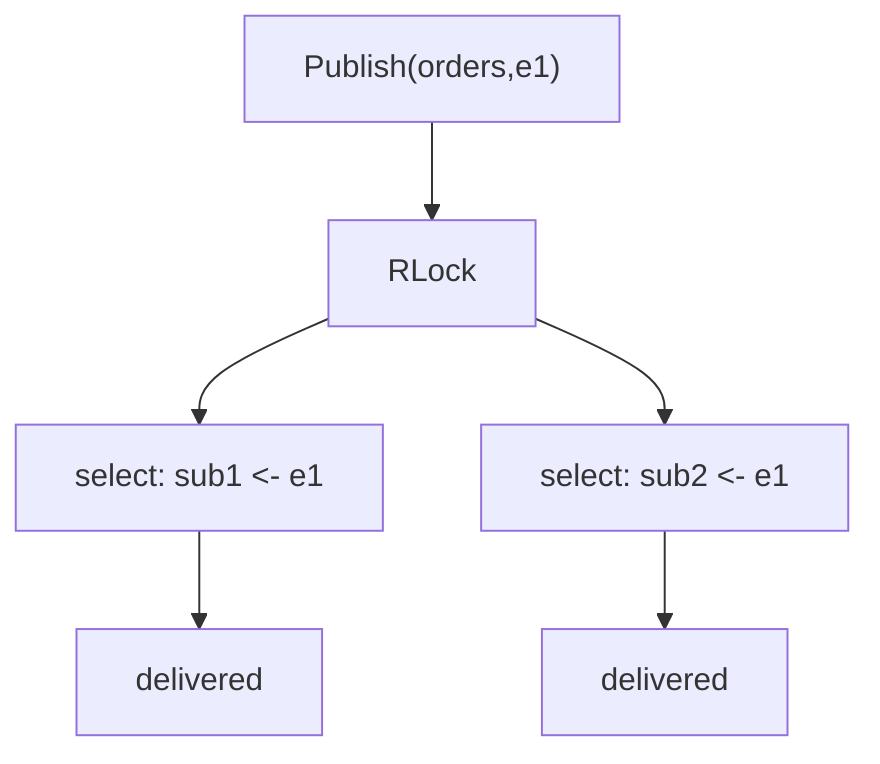

**Execution Trace:**
```
Subscribe("orders") → sub1(id=1), sub2(id=2)
Subscribe("payments") → sub3(id=3)
Publish("orders", e1): deliver to sub1, sub2
Publish("payments", p1): deliver to sub3
```

### Interviewer Questions

1. Why map[uint64]chan Event instead of []chan Event per topic?
2. Can we support wildcard topic subscriptions?
3. How do you scale to 1M subscribers across 10K topics?
4. Walk me through Cancel called during Publish.
5. How would you add at-least-once delivery guarantees?
6. What's the memory overhead of 10K topics × 100 subscribers?
7. How do you test unsubscribed clients don't receive future events?

### Follow-Up Questions

**Q1:** Why map keyed by uint64?
**A1:** O(1) deletion by ID on unsubscribe without shifting. Slice deletion is O(n). With thousands of subscribers dynamically joining/leaving, map is more efficient.

**Q2:** How to implement at-least-once delivery?
**A2:** Write-ahead log per subscriber. On deliver, write to log first. On ACK, remove from log. On restart, replay unacknowledged entries. This is the NATS JetStream model.

**Q3:** How do you handle a subscriber that never reads?
**A3:** Non-blocking send with default drops messages. Track droppedCount per subscriber. If drop rate exceeds threshold, force-unsubscribe.

**Q4:** How would you implement durable subscriptions?
**A4:** Assign each subscriber a persistent ID stored in a database. On reconnect, look up last-acknowledged event ID and replay from there. This requires ordered event storage (e.g., Kafka partitions or a sequence-numbered log).

**Q5:** How would you test delivery under concurrent subscribe/unsubscribe/publish?
**A5:** Launch goroutines doing random operations under `-race`. Assert no panics. Use atomic counters for delivered/dropped events. Verify total = delivered + dropped.

---

## Q19: OS Signal Channel  [Level 3 — Medium]

> **Tags:** `#os-signal` `#graceful-shutdown` `#signal-notify`

### Problem Statement
Write a server implementing graceful shutdown on `SIGINT`/`SIGTERM`. Stop accepting new work, drain in-flight tasks (max 5 seconds), then exit cleanly.

### Input / Output / Constraints

```
Input:  SIGINT or SIGTERM
Output:
  server started, processing jobs...
  received signal: interrupt
  draining in-flight tasks (max 5s)...
  all tasks complete, shutting down cleanly

Constraints:
  • signal channel buffered (size ≥ 1)
  • Graceful drain timeout = 5 seconds
  • signal.Stop called on cleanup
```

### Best / Optimal Solution

```go
package main

import (
    "context"
    "fmt"
    "os"
    "os/signal"
    "sync"
    "syscall"
    "time"
)

type Server struct {
    ctx    context.Context
    cancel context.CancelFunc
    wg     sync.WaitGroup
}

func NewServer() *Server {
    ctx, cancel := context.WithCancel(context.Background())
    return &Server{ctx: ctx, cancel: cancel}
}

func (s *Server) processJob(id int) {
    defer s.wg.Done()
    select {
    case <-time.After(500 * time.Millisecond):
        fmt.Printf("job %d complete\n", id)
    case <-s.ctx.Done():
        fmt.Printf("job %d cancelled\n", id)
    }
}

func (s *Server) Start() {
    fmt.Println("server started, processing jobs...")
    for i := 1; i <= 3; i++ {
        s.wg.Add(1)
        go s.processJob(i)
    }
}

func (s *Server) GracefulShutdown(timeout time.Duration) {
    sigCh := make(chan os.Signal, 1)
    signal.Notify(sigCh, syscall.SIGINT, syscall.SIGTERM)
    defer signal.Stop(sigCh)
    sig := <-sigCh
    fmt.Printf("received signal: %v\n", sig)
    s.cancel()
    fmt.Printf("draining in-flight tasks (max %v)...\n", timeout)
    done := make(chan struct{})
    go func() { s.wg.Wait(); close(done) }()
    select {
    case <-done:
        fmt.Println("all tasks complete, shutting down cleanly")
    case <-time.After(timeout):
        fmt.Println("drain timeout exceeded, forcing shutdown")
    }
}

func main() {
    srv := NewServer()
    srv.Start()
    srv.GracefulShutdown(5 * time.Second)
}
```

**Time:** O(drain time) | **Space:** O(1)

### Production Considerations

| Aspect | Details |
|--------|---------|
| **Scalability** | WaitGroup tracks arbitrary number of in-flight goroutines |
| **Edge Cases** | Double signal: second forces immediate exit; signal before startup: buffer holds it |
| **Error Handling** | signal.Stop prevents signals after handler exits |
| **Memory** | Signal channel buffer=1 prevents signal loss |
| **Concurrency** | WaitGroup tracks all in-flight tasks; cancel propagates via context |

### Visual Explanation

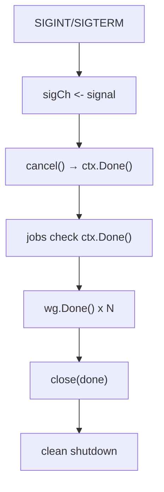

**Execution Trace:**
```
t=0s:   3 job goroutines start (500ms each)
t=?:    SIGINT → cancel()
t=?:    jobs select ctx.Done() and exit
t<5s:   wg.Wait() returns → clean shutdown
```

### Interviewer Questions

1. Why must the signal channel be buffered?
2. Can we handle SIGTERM differently from SIGINT?
3. How does K8s use SIGTERM with terminationGracePeriodSeconds?
4. Walk me through double-Ctrl+C force shutdown.
5. How do you test graceful shutdown without real OS signals?
6. What does signal.Stop do?
7. How do you handle in-flight requests in an HTTP server?

### Follow-Up Questions

**Q1:** Why buffer signal channel at size 1?
**A1:** OS delivers signal once. If runtime calls `sigCh <- sig` while goroutine is busy and channel is unbuffered, the signal is dropped. Buffer=1 retains it even if not immediately receiving.

**Q2:** How do you force immediate exit on double SIGINT?
**A2:** `var sigCount int32; on first signal: if atomic.AddInt32(&sigCount,1) > 1 { os.Exit(1) }`.

**Q3:** How does K8s use SIGTERM?
**A3:** K8s sends SIGTERM on pod deletion, waits `terminationGracePeriodSeconds` (default 30s), then SIGKILL. Your server must drain within this window.

**Q4:** What's `signal.Stop` doing?
**A4:** `signal.Stop(sigCh)` stops delivering signals to sigCh. Without it, if the handler exits but the channel remains, future signals accumulate or cause unexpected behavior.

**Q5:** How do you test graceful shutdown in a unit test?
**A5:** Expose a `Shutdown()` method that calls `cancel()` directly. Test: `srv.Start(); go srv.Shutdown(); wg.Wait()`. Use `goleak` to verify goroutine cleanup.

---

## Q20: Rate Limiter with time.Ticker and Channel  [Level 4 — Advanced]

> **Tags:** `#rate-limiter` `#time-ticker` `#token-bucket` `#throttling`

### Problem Statement
Implement a `RateLimiter` allowing at most N requests per second using `time.Ticker` to generate tokens into a buffered channel. Clients call `Wait(ctx)` to consume a token. Demonstrate with 20 requests at 5 req/sec.

### Input / Output / Constraints

```
Input:  N=5 req/sec, 20 requests
Output: Requests process 5 per second, total time ~4 seconds

Constraints:
  • Exact rate: N tokens/sec, burst capacity: N
  • Wait respects context cancellation
  • No goroutine leak on Stop()
```

### Best / Optimal Solution

```go
package main

import (
    "context"
    "fmt"
    "sync"
    "time"
)

type RateLimiter struct {
    tokens chan struct{}
    ticker *time.Ticker
    done   chan struct{}
    once   sync.Once
}

func NewRateLimiter(rps int) (*RateLimiter, error) {
    if rps <= 0 { return nil, fmt.Errorf("rps must be positive") }
    rl := &RateLimiter{
        tokens: make(chan struct{}, rps),
        ticker: time.NewTicker(time.Second / time.Duration(rps)),
        done:   make(chan struct{}),
    }
    for i := 0; i < rps; i++ { rl.tokens <- struct{}{} } // pre-fill burst
    go rl.refill()
    return rl, nil
}

func (rl *RateLimiter) refill() {
    defer rl.ticker.Stop()
    for {
        select {
        case <-rl.ticker.C:
            select { case rl.tokens <- struct{}{}: default: }
        case <-rl.done:
            return
        }
    }
}

func (rl *RateLimiter) Wait(ctx context.Context) error {
    select {
    case <-rl.tokens: return nil
    case <-ctx.Done(): return fmt.Errorf("rate limiter: %w", ctx.Err())
    }
}

func (rl *RateLimiter) Stop() { rl.once.Do(func() { close(rl.done) }) }

func main() {
    rl, _ := NewRateLimiter(5)
    defer rl.Stop()
    ctx := context.Background()
    start := time.Now()
    var wg sync.WaitGroup
    for i := 1; i <= 20; i++ {
        wg.Add(1)
        go func(id int) {
            defer wg.Done()
            rl.Wait(ctx)
            fmt.Printf("request %d at t=%.2fs\n", id, time.Since(start).Seconds())
        }(i)
    }
    wg.Wait()
}
```

**Time:** O(1) per Wait | **Space:** O(rps) token buffer

### Production Considerations

| Aspect | Details |
|--------|---------|
| **Scalability** | Single ticker goroutine serves unlimited concurrent Wait calls |
| **Edge Cases** | Stop called twice: sync.Once prevents panic; rps=0: return error |
| **Error Handling** | Wait wraps ctx.Err() |
| **Memory** | Token buffer: rps * sizeof(struct{}) ≈ 0 + channel overhead |
| **Concurrency** | Channel is goroutine-safe; multiple Wait callers compete fairly (FIFO) |

### Visual Explanation

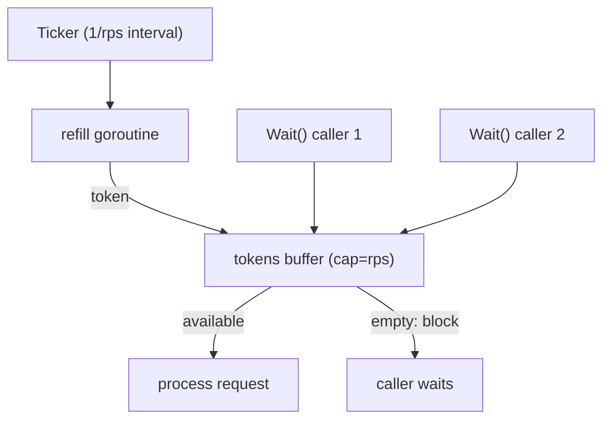

**Execution Trace:**
```
t=0:    5 tokens pre-filled (burst)
t=0:    requests 1-5 consume immediately
t=200ms: +1 token → request 6
...
t=3.0s: request 20 proceeds
Total: ~4 seconds
```

### Interviewer Questions

1. Why pre-fill the token bucket to burst capacity?
2. How does `golang.org/x/time/rate` differ?
3. What's the difference between token bucket and leaky bucket?
4. How do you implement per-user rate limiting?
5. How do you implement distributed rate limiting?
6. What's wrong with reusing `time.After` in a hot loop?
7. How would you test exact rate with ±5% tolerance?

### Follow-Up Questions

**Q1:** Token bucket vs leaky bucket?
**A1:** Token bucket: tokens accumulate up to burst; allows short bursts. Leaky bucket: fixed drain rate, no burst — excess queued or dropped. Token bucket is more common in APIs.

**Q2:** How does `x/time/rate` differ?
**A2:** Uses mathematical token bucket without goroutine or ticker — calculates available tokens based on elapsed time lazily. O(1) per request, no goroutine. More efficient and precise. Use in production.

**Q3:** How do you implement distributed rate limiting?
**A3:** Redis with Lua scripting for atomic check-and-decrement. Or sliding window log in Redis with ZADD + ZCOUNT. Use Redis Cluster for high availability.

**Q4:** How do you test exact rate?
**A4:** Launch N*10 goroutines, record timestamps when Wait() returns. Group by second, assert each group has N ± tolerance. Use `-race`.

**Q5:** Stop called concurrently?
**A5:** sync.Once ensures `close(rl.done)` called exactly once. Additional Stop() calls are no-ops. Without Once, concurrent Stop() would panic on double-close.

---

## Q21: Request Deduplication via Channel  [Level 5 — Interview Level]

> **Tags:** `#deduplication` `#singleflight` `#coalescing`

### Problem Statement
Multiple goroutines may request the same resource simultaneously. Implement a `Deduplicator` ensuring only one actual fetch per concurrent group — all waiters share the result. The "singleflight" problem, implemented without `golang.org/x/sync/singleflight`.

### Input / Output / Constraints

```
Input:  100 goroutines simultaneously request key="user:42"
Output: Exactly 1 actual fetch; all 100 receive same result

Constraints:
  • Thread-safe
  • Result shared by reference
  • Error shared too
  • After completion, next request triggers fresh fetch
```

### Best / Optimal Solution

```go
package main

import (
    "fmt"
    "sync"
    "sync/atomic"
    "time"
)

type call struct {
    done    chan struct{}
    val     interface{}
    err     error
    waiters int64
}

type Deduplicator struct {
    mu       sync.Mutex
    inflight map[string]*call
}

func NewDeduplicator() *Deduplicator {
    return &Deduplicator{inflight: make(map[string]*call)}
}

func (d *Deduplicator) Do(key string, fn func() (interface{}, error)) (interface{}, error, bool) {
    d.mu.Lock()
    if c, ok := d.inflight[key]; ok {
        atomic.AddInt64(&c.waiters, 1)
        d.mu.Unlock()
        <-c.done
        return c.val, c.err, true
    }
    c := &call{done: make(chan struct{})}
    d.inflight[key] = c
    d.mu.Unlock()

    defer func() {
        if r := recover(); r != nil {
            c.err = fmt.Errorf("fetch panicked: %v", r)
        }
        close(c.done)
        d.mu.Lock(); delete(d.inflight, key); d.mu.Unlock()
    }()
    c.val, c.err = fn()
    return c.val, c.err, false
}

func main() {
    dedup := NewDeduplicator()
    var fetchCount int64
    var wg sync.WaitGroup
    for i := 0; i < 100; i++ {
        wg.Add(1)
        go func() {
            defer wg.Done()
            dedup.Do("user:42", func() (interface{}, error) {
                atomic.AddInt64(&fetchCount, 1)
                time.Sleep(100 * time.Millisecond)
                return "user data", nil
            })
        }()
    }
    wg.Wait()
    fmt.Printf("actual fetches: %d (expected 1)\n", atomic.LoadInt64(&fetchCount))
}
```

**Time:** O(1) per Do | **Space:** O(concurrent unique keys)

### Production Considerations

| Aspect | Details |
|--------|---------|
| **Scalability** | One goroutine per unique in-flight key |
| **Edge Cases** | Panic in fn: recovered, error shared to all waiters |
| **Error Handling** | All waiters receive same error |
| **Memory** | call struct per in-flight key; GC'd after completion |
| **Concurrency** | Mutex held briefly (no I/O under lock); broadcast via close |

### Visual Explanation

```mermaid
flowchart TD
    R1["Request 1 key=user:42"] --> CHECK{"inflight[key]?"}
    CHECK -->|"no"| LEADER["create call, lead fetch"]
    CHECK -->|"yes"| WAIT["<-c.done (block)"]
    LEADER --> FETCH["fn()"]
    FETCH --> CLOSE["close(c.done) broadcast"]
    CLOSE --> WAIT
```

**Execution Trace:**
```
t=0ms:   R1 creates call, starts fetch
t=0ms:   R2..R100 see inflight, block on <-c.done
t=100ms: fetch completes → close(c.done) → all 99 unblock
fetchCount = 1
```

### Interviewer Questions

1. Why channel close for broadcast instead of sync.Cond?
2. How does x/sync/singleflight handle thundering herd on error?
3. How do you add result caching with TTL?
4. Walk me through the race condition without the deferred close.
5. What's the "thundering herd" problem this solves?
6. How would you test exactly 1 fetch under 100 concurrent requests?
7. How would you implement group cancel (cancel all waiters if leader cancels)?

### Follow-Up Questions

**Q1:** Why channel close vs sync.Cond?
**A1:** Closing channel is permanent broadcast — all `<-c.done` calls return immediately and forever after. `Cond.Broadcast()` only wakes goroutines waiting at the moment of call — late arrivals must re-wait.

**Q2:** How does x/sync/singleflight handle errors?
**A2:** Has `Forget(key)` to remove from in-flight on error, allowing retry. By default, all waiters get same error. Call `Forget` in error path for transient errors.

**Q3:** How do you add TTL cache?
**A3:** After fetch, store in `cache map[string]CachedResult` with expiry. On Do, check cache first. Background goroutine cleans expired entries.

**Q4:** How would you implement group cancel?
**A4:** Add `ctx context.Context` to `call`. If leader's ctx is cancelled, cancel all waiters' contexts via a shared cancel function. Complex — usually simpler to let waiters handle their own cancellation.

**Q5:** How do you test 1 fetch under 100 concurrent?
**A5:** atomic.Int64 counter in fetch function. After wg.Wait(), assert `counter.Load() == 1`. Run multiple times, always 1. Also test sequential (non-overlapping) requests produce `counter == N`.

---

## Q22: Circuit Breaker with Channel State Machine  [Level 5 — Interview Level]

> **Tags:** `#circuit-breaker` `#state-machine` `#resilience`

### Problem Statement
Implement a circuit breaker with three states: Closed (normal), Open (rejecting requests), HalfOpen (testing recovery). When consecutive failures exceed threshold, open the circuit. After a timeout, move to HalfOpen. On success in HalfOpen, close; on failure, reopen.

### Input / Output / Constraints

```
Input:  threshold=3, openTimeout=1s
Output: requests 1-3: fail (tracked)
        request 4: rejected (circuit open)
        after 1s: circuit half-open
        request 5 (success): circuit closed
```

### Best / Optimal Solution

```go
package main

import (
    "errors"
    "fmt"
    "sync"
    "sync/atomic"
    "time"
)

type CBState int32
const (CBClosed CBState = 0; CBOpen CBState = 1; CBHalfOpen CBState = 2)
var ErrCircuitOpen = errors.New("circuit breaker: open")

type CircuitBreaker struct {
    state     atomic.Int32
    failures  atomic.Int32
    threshold int32
    timeout   time.Duration
    mu        sync.Mutex
    halfOpenTry bool
    onStateChange func(from, to CBState)
}

func NewCircuitBreaker(threshold int, timeout time.Duration) *CircuitBreaker {
    return &CircuitBreaker{threshold: int32(threshold), timeout: timeout}
}

func (cb *CircuitBreaker) Call(fn func() error) error {
    state := CBState(cb.state.Load())
    switch state {
    case CBOpen: return ErrCircuitOpen
    case CBHalfOpen:
        cb.mu.Lock()
        if cb.halfOpenTry { cb.mu.Unlock(); return ErrCircuitOpen }
        cb.halfOpenTry = true
        cb.mu.Unlock()
    }
    err := fn()
    if err != nil { cb.onFailure(state) } else { cb.onSuccess(state) }
    return err
}

func (cb *CircuitBreaker) onFailure(state CBState) {
    switch state {
    case CBClosed:
        if cb.failures.Add(1) >= cb.threshold {
            cb.transition(CBClosed, CBOpen)
            time.AfterFunc(cb.timeout, func() { cb.transition(CBOpen, CBHalfOpen) })
        }
    case CBHalfOpen:
        cb.mu.Lock(); cb.halfOpenTry = false; cb.mu.Unlock()
        cb.transition(CBHalfOpen, CBOpen)
        time.AfterFunc(cb.timeout, func() { cb.transition(CBOpen, CBHalfOpen) })
    }
}

func (cb *CircuitBreaker) onSuccess(state CBState) {
    if state == CBHalfOpen {
        cb.mu.Lock(); cb.halfOpenTry = false; cb.mu.Unlock()
        cb.failures.Store(0)
        cb.transition(CBHalfOpen, CBClosed)
    } else { cb.failures.Store(0) }
}

func (cb *CircuitBreaker) transition(from, to CBState) bool {
    swapped := cb.state.CompareAndSwap(int32(from), int32(to))
    if swapped && cb.onStateChange != nil { cb.onStateChange(from, to) }
    return swapped
}

func main() {
    cb := NewCircuitBreaker(3, 1*time.Second)
    cb.onStateChange = func(from, to CBState) {
        m := map[CBState]string{CBClosed:"Closed",CBOpen:"Open",CBHalfOpen:"HalfOpen"}
        fmt.Printf("%s → %s\n", m[from], m[to])
    }
    fail := func() error { return errors.New("down") }
    for i := 1; i <= 4; i++ {
        fmt.Printf("req %d: %v\n", i, cb.Call(fail))
    }
    time.Sleep(1100 * time.Millisecond)
    fmt.Printf("test: %v\n", cb.Call(func() error { return nil }))
}
```

**Time:** O(1) per call | **Space:** O(1)

### Production Considerations

| Aspect | Details |
|--------|---------|
| **Scalability** | Atomic ops for state/failures — no lock contention |
| **Edge Cases** | Concurrent HalfOpen tests: mutex guard allows exactly one |
| **Error Handling** | ErrCircuitOpen is sentinel — callers can detect and fallback |
| **Memory** | O(1); time.AfterFunc allocates timer goroutine |
| **Concurrency** | CAS for state transition — only one goroutine wins |

### Visual Explanation

```mermaid
stateDiagram-v2
    [*] --> Closed
    Closed --> Open : failures >= threshold
    Open --> HalfOpen : timeout elapsed
    HalfOpen --> Closed : test succeeds
    HalfOpen --> Open : test fails
```

**Execution Trace:**
```
req1: fail → failures=1
req2: fail → failures=2
req3: fail → failures=3 → Open, timer starts
req4: ErrCircuitOpen
t=1s: → HalfOpen
test(success): → Closed
```

### Interviewer Questions

1. Why CAS for state transition?
2. How do you implement success threshold in HalfOpen?
3. How does this integrate with HTTP middleware?
4. Walk me through race condition without halfOpenTry guard.
5. What metrics should you expose?
6. What's Netflix Hystrix Go equivalent?
7. How do you test state machine deterministically?

### Follow-Up Questions

**Q1:** Why CAS for transitions?
**A1:** CAS ensures only one goroutine wins the transition race. Two goroutines trying `Open → HalfOpen` simultaneously: only one succeeds. Prevents duplicate timers and double-opens.

**Q2:** How do you implement success threshold in HalfOpen?
**A2:** `halfOpenSuccesses atomic.Int32`. Allow up to 5 test requests. Only transition to Closed when `halfOpenSuccesses == 5`. Reset on any failure.

**Q3:** HTTP middleware integration?
**A3:** `func Middleware(cb *CircuitBreaker, next http.Handler) http.Handler`. In ServeHTTP: `if errors.Is(cb.Call(func() error { next.ServeHTTP(w,r); return nil }), ErrCircuitOpen) { http.Error(w, "503", 503) }`.

**Q4:** What metrics to expose?
**A4:** `circuit_state` (gauge), `circuit_failures_total` (counter), `circuit_calls_rejected_total` (counter), `circuit_state_transitions_total`. Alert when Open > 30s.

**Q5:** How to test state transitions deterministically?
**A5:** Mock time with fake clock. Inject into AfterFunc. Advance clock to trigger transitions. Assert state at each step with `sync.WaitGroup` for timer goroutines.

---

## Q23: Backpressure Handling  [Level 5 — Interview Level]

> **Tags:** `#backpressure` `#flow-control` `#overflow`

### Problem Statement
Design a system with three backpressure strategies: (1) Drop oldest (ring buffer), (2) Drop newest (when buffer full), (3) Block producer. Measure throughput and drop rate for 10:1 producer-to-consumer speed ratio.

### Input / Output / Constraints

```
Input:  producer: 10K/sec, consumer: 1K/sec, buffer=100, 1s run
Output: Strategy 1 (drop oldest): ~1K processed, ~9K dropped
        Strategy 2 (drop newest): ~1K processed, ~9K dropped
        Strategy 3 (block):       ~1K processed, producer blocked 90%
```

### Best / Optimal Solution

```go
package main

import (
    "context"
    "fmt"
    "sync/atomic"
    "time"
)

type Stats struct {
    Processed atomic.Int64
    Dropped   atomic.Int64
    Blocked   atomic.Int64
}

func DropNewest(ctx context.Context, producerRate, consumerDelay time.Duration, bufSize int) *Stats {
    var stats Stats
    buf := make(chan int, bufSize)
    go func() {
        for i := 0; ; i++ {
            select { case <-ctx.Done(): return; default: }
            select { case buf <- i: default: stats.Dropped.Add(1) }
            time.Sleep(producerRate)
        }
    }()
    go func() {
        for {
            select {
            case _, ok := <-buf:
                if !ok { return }
                time.Sleep(consumerDelay)
                stats.Processed.Add(1)
            case <-ctx.Done(): return
            }
        }
    }()
    return &stats
}

func BlockProducer(ctx context.Context, producerRate, consumerDelay time.Duration, bufSize int) *Stats {
    var stats Stats
    buf := make(chan int, bufSize)
    go func() {
        for i := 0; ; i++ {
            select { case <-ctx.Done(): return; default: }
            start := time.Now()
            select { case buf <- i: stats.Blocked.Add(time.Since(start).Microseconds())
            case <-ctx.Done(): return }
            time.Sleep(producerRate)
        }
    }()
    go func() {
        for {
            select {
            case _, ok := <-buf:
                if !ok { return }
                time.Sleep(consumerDelay)
                stats.Processed.Add(1)
            case <-ctx.Done(): return
            }
        }
    }()
    return &stats
}

func main() {
    producerRate  := 100 * time.Microsecond
    consumerDelay := 1 * time.Millisecond
    bufSize := 100
    duration := 1 * time.Second

    ctx2, cancel2 := context.WithTimeout(context.Background(), duration)
    defer cancel2()
    s2 := DropNewest(ctx2, producerRate, consumerDelay, bufSize)
    <-ctx2.Done()
    fmt.Printf("DropNewest: processed=%d dropped=%d\n", s2.Processed.Load(), s2.Dropped.Load())

    ctx3, cancel3 := context.WithTimeout(context.Background(), duration)
    defer cancel3()
    s3 := BlockProducer(ctx3, producerRate, consumerDelay, bufSize)
    <-ctx3.Done()
    fmt.Printf("BlockProd:  processed=%d blocked_us=%d\n", s3.Processed.Load(), s3.Blocked.Load())
}
```

**Time:** O(1) per event | **Space:** O(bufSize)

### Production Considerations

| Aspect | Details |
|--------|---------|
| **Scalability** | Drop strategies non-blocking O(1); Block reduces producer throughput |
| **Edge Cases** | Consumer stops: Drop handles gracefully; Block deadlocks without ctx |
| **Error Handling** | Context cancellation ensures clean goroutine exit |
| **Memory** | Fixed O(bufSize) — prevents OOM |
| **Concurrency** | Atomic counters for stats |

### Visual Explanation

```mermaid
flowchart TD
    P["Producer 10K/sec"] --> B["Buffer cap=100"]
    B --> C["Consumer 1K/sec"]
    B -->|"full"| S{"Strategy"}
    S -->|"DropNewest"| DN["discard incoming"]
    S -->|"DropOldest"| DO["evict oldest, insert"]
    S -->|"Block"| BL["producer waits"]
```

**Execution Trace:**
```
Buffer fills in ~10ms (100 items at 10K/sec, consumer 1K/sec)
DropNewest: 90% of incoming events discarded
Block: producer blocked 90% of time
~1K events/sec processed in both cases
```

### Interviewer Questions

1. When do you choose Drop Oldest vs Drop Newest?
2. Can we implement adaptive backpressure switching strategies?
3. How does Kafka implement backpressure?
4. What is TCP backpressure?
5. How do you implement load shedding with priority queues?
6. What's the GC impact under high drop rate?
7. How do you test drop rate without time.Sleep precision issues?

### Follow-Up Questions

**Q1:** Drop Newest vs Drop Oldest?
**A1:** Drop Newest: recent data more valuable (real-time sensors). Drop Oldest: completeness matters more (audit logs — preserve earliest events).

**Q2:** How does Kafka implement backpressure?
**A2:** Producer blocks when broker full (`max.block.ms`). Consumer controls pace via polling. Consumer lag = offset difference = primary backpressure signal.

**Q3:** TCP backpressure analogy?
**A3:** TCP window size signals receiver capacity. Window=0 → sender stops. Channel buffer = TCP window; full channel = window=0 → sender blocks.

**Q4:** Priority-based load shedding?
**A4:** Min-heap with priority field. Under backpressure, drop low-priority events first. `container/heap` for implementation; mutex protection for concurrent access.

**Q5:** Test drop rate without timing issues?
**A5:** Large buffer (1M), controlled producer/consumer via channels. Count produced vs processed. Assert produced - processed == dropped. No timing uncertainty.

---

## Q24: Production Worker Pool with Metrics  [Level 6 — Production Level]

> **Tags:** `#worker-pool` `#metrics` `#graceful-shutdown` `#production`

### Problem Statement
Build a production-grade worker pool: configurable worker count, bounded job queue, graceful shutdown draining all queued jobs, per-worker metrics (jobs processed, errors, latency), and panic recovery. Handle 10K jobs/sec steadily.

### Input / Output / Constraints

```
Input:  workers=8, queueSize=1000, 10K jobs
Output: All jobs processed/rejected; graceful shutdown drains queue
        Metrics: total_processed, total_errors, avg_latency_ms

Constraints:
  • Workers recover from panics without crashing pool
  • Shutdown drains before exiting
  • Rejected jobs return clear error
```

### Best / Optimal Solution

```go
package main

import (
    "context"
    "errors"
    "fmt"
    "sync"
    "sync/atomic"
    "time"
)

var ErrPoolClosed = errors.New("worker pool: closed")
var ErrQueueFull  = errors.New("worker pool: queue full")

type Job struct { ID int; Work func() error }

type WorkerMetrics struct {
    Processed    atomic.Int64
    Errors       atomic.Int64
    TotalLatency atomic.Int64
    Panics       atomic.Int64
}

func (m *WorkerMetrics) AvgLatencyMs() float64 {
    p := m.Processed.Load()
    if p == 0 { return 0 }
    return float64(m.TotalLatency.Load()) / float64(p) / 1e6
}

type Pool struct {
    jobs    chan Job
    metrics []*WorkerMetrics
    wg      sync.WaitGroup
    once    sync.Once
    closed  atomic.Bool
    ctx     context.Context
    cancel  context.CancelFunc
}

func NewPool(ctx context.Context, numWorkers, queueSize int) (*Pool, error) {
    if numWorkers <= 0 { return nil, fmt.Errorf("numWorkers must be positive") }
    pCtx, cancel := context.WithCancel(ctx)
    p := &Pool{
        jobs: make(chan Job, queueSize),
        metrics: make([]*WorkerMetrics, numWorkers),
        ctx: pCtx, cancel: cancel,
    }
    for i := range p.metrics { p.metrics[i] = &WorkerMetrics{} }
    p.wg.Add(numWorkers)
    for i := 0; i < numWorkers; i++ { go p.runWorker(i, p.metrics[i]) }
    return p, nil
}

func (p *Pool) runWorker(id int, m *WorkerMetrics) {
    defer p.wg.Done()
    for {
        select {
        case job, ok := <-p.jobs:
            if !ok { return }
            p.executeJob(job, m)
        case <-p.ctx.Done():
            for { select { case job := <-p.jobs: p.executeJob(job, m); default: return } }
        }
    }
}

func (p *Pool) executeJob(job Job, m *WorkerMetrics) {
    start := time.Now()
    var err error
    func() {
        defer func() {
            if r := recover(); r != nil {
                m.Panics.Add(1); m.Errors.Add(1)
                err = fmt.Errorf("job %d panicked: %v", job.ID, r)
            }
        }()
        err = job.Work()
    }()
    m.TotalLatency.Add(time.Since(start).Nanoseconds())
    m.Processed.Add(1)
    if err != nil { m.Errors.Add(1) }
}

func (p *Pool) Submit(job Job) error {
    if p.closed.Load() { return ErrPoolClosed }
    select { case p.jobs <- job: return nil; default: return ErrQueueFull }
}

func (p *Pool) Shutdown(timeout time.Duration) error {
    var shutdownErr error
    p.once.Do(func() {
        p.closed.Store(true); p.cancel()
        done := make(chan struct{})
        go func() { p.wg.Wait(); close(done) }()
        select {
        case <-done:
        case <-time.After(timeout):
            shutdownErr = fmt.Errorf("shutdown timed out after %v", timeout)
        }
    })
    return shutdownErr
}

func (p *Pool) TotalMetrics() (processed, errors, panics int64, avgLatencyMs float64) {
    var totalLatency int64
    for _, m := range p.metrics {
        processed += m.Processed.Load(); errors += m.Errors.Load()
        panics += m.Panics.Load(); totalLatency += m.TotalLatency.Load()
    }
    if processed > 0 { avgLatencyMs = float64(totalLatency)/float64(processed)/1e6 }
    return
}

func main() {
    ctx := context.Background()
    pool, _ := NewPool(ctx, 8, 1000)
    var submitted, rejected atomic.Int64
    for i := 0; i < 10000; i++ {
        id := i
        err := pool.Submit(Job{ID: id, Work: func() error {
            time.Sleep(100 * time.Microsecond)
            if id%100 == 0 { panic("simulated") }
            return nil
        }})
        if err != nil { rejected.Add(1) } else { submitted.Add(1) }
    }
    pool.Shutdown(30 * time.Second)
    proc, errs, panics, latency := pool.TotalMetrics()
    fmt.Printf("submitted=%d rejected=%d processed=%d errors=%d panics=%d avg=%.2fms\n",
        submitted.Load(), rejected.Load(), proc, errs, panics, latency)
}
```

**Time:** O(n/k) parallel | **Space:** O(queueSize + numWorkers)

### Production Considerations

| Aspect | Details |
|--------|---------|
| **Scalability** | 8 workers at 10K jobs/sec: each handles ~1.25K/sec |
| **Edge Cases** | Submit after Shutdown: ErrPoolClosed; queue full: ErrQueueFull; panic: recovered |
| **Error Handling** | Each layer returns typed errors |
| **Memory** | Fixed: queueSize * sizeof(Job) |
| **Concurrency** | atomic.Bool for closed; sync.Once for shutdown; atomic counters for metrics |

### Visual Explanation

```mermaid
flowchart TD
    S["Submit(job)"] --> FC{"closed?"}
    FC -->|"yes"| E1["ErrPoolClosed"]
    FC -->|"no"| QC{"queue full?"}
    QC -->|"yes"| E2["ErrQueueFull"]
    QC -->|"no"| Q["jobs channel"]
    Q --> W1["Worker 1 + panic recovery"]
    Q --> WN["Worker N"]
    W1 --> M["atomic metrics"]
    SHUT["Shutdown"] --> CANCEL["cancel + closed=true"]
    CANCEL --> DRAIN["drain remaining"]
    DRAIN --> WG["wg.Wait()"]
```

**Execution Trace:**
```
NewPool(8, 1000): 8 workers start
Submit 10K: some accepted, some ErrQueueFull (fast producer)
Workers process concurrently with panic recovery
Shutdown: cancel() → drain → wg.Wait()
Metrics reported
```

### Interviewer Questions

1. Why atomic.Bool for closed instead of mutex?
2. Can we dynamically resize the worker pool?
3. How do you implement per-job timeout?
4. Walk me through double-shutdown scenario.
5. How would you export metrics to Prometheus?
6. What's memory layout of 1000 Jobs in buffer?
7. How would you test panic recovery?

### Follow-Up Questions

**Q1:** Per-job timeout?
**A1:** `ctx, cancel := context.WithTimeout(p.ctx, job.Timeout); defer cancel(); err = job.Work(ctx)`. Job's Work checks `ctx.Done()` at blocking points.

**Q2:** Dynamic resize?
**A2:** `atomic.Int32` for worker count. Add: `wg.Add(1); go p.runWorker(...)`. Remove: send on `quit chan struct{}` that workers select on.

**Q3:** Export to Prometheus?
**A3:** Implement `prometheus.Collector`. In `Collect`, call `pool.TotalMetrics()`, emit as gauge/counter vectors. Register: `prometheus.MustRegister(poolCollector)`.

**Q4:** Double-shutdown scenario?
**A4:** sync.Once ensures `cancel()` and `closed.Store(true)` called exactly once. Second Shutdown call blocks in once.Do until first completes, then returns nil.

**Q5:** Test panic recovery?
**A5:** Submit a job with `Work: func() error { panic("test") }`. After Shutdown, assert `metrics.Panics.Load() == 1`. Pool must still be functional after the panic.

---

## Q25: Concurrent-Safe Event Bus  [Level 6 — Production Level]

> **Tags:** `#event-bus` `#concurrent-safe` `#observable` `#production`

### Problem Statement
Build a production event bus: typed events, multiple subscribers per type, middleware chain (logging, metrics, retry), dead letter queue for failed events, and graceful shutdown. Target: 50K events/sec with < 1ms median delivery latency.

### Input / Output / Constraints

```
Input:  3 event types, 10 subscribers each, 50K events/sec
Output: All events delivered; failed → DLQ; shutdown drains all in-flight

Constraints:
  • < 1ms p50 delivery latency
  • DLQ for 3 retry attempts
  • Middleware: logging + metrics + retry
  • Zero goroutine leaks on shutdown
```

### Best / Optimal Solution

```go
package main

import (
    "context"
    "fmt"
    "strings"
    "sync"
    "sync/atomic"
    "time"
)

type Event struct { Type string; Payload interface{} }
type Handler func(ctx context.Context, e Event) error
type Middleware func(next Handler) Handler

func LoggingMiddleware(next Handler) Handler {
    return func(ctx context.Context, e Event) error {
        start := time.Now()
        err := next(ctx, e)
        fmt.Printf("[%v] %s latency=%v err=%v\n", time.Now().Format(time.RFC3339Nano), e.Type, time.Since(start), err)
        return err
    }
}

func RetryMiddleware(maxAttempts int) Middleware {
    return func(next Handler) Handler {
        return func(ctx context.Context, e Event) error {
            var err error
            for attempt := 0; attempt < maxAttempts; attempt++ {
                if err = next(ctx, e); err == nil { return nil }
                time.Sleep(time.Duration(attempt+1) * 10 * time.Millisecond)
            }
            return err
        }
    }
}

type Subscription struct { ch chan Event; cancel context.CancelFunc }

type EventBus struct {
    mu        sync.RWMutex
    subs      map[string][]*Subscription
    dlq       chan Event
    wg        sync.WaitGroup
    closed    atomic.Bool
    once      sync.Once
    Delivered atomic.Int64
    Dropped   atomic.Int64
    DLQed     atomic.Int64
}

func NewEventBus(dlqSize int) *EventBus {
    return &EventBus{subs: make(map[string][]*Subscription), dlq: make(chan Event, dlqSize)}
}

func (bus *EventBus) Subscribe(ctx context.Context, eventType string, handler Handler, mws ...Middleware) {
    h := handler
    for i := len(mws) - 1; i >= 0; i-- { h = mws[i](h) }
    ch := make(chan Event, 256)
    subCtx, cancel := context.WithCancel(ctx)
    sub := &Subscription{ch: ch, cancel: cancel}
    bus.mu.Lock(); bus.subs[eventType] = append(bus.subs[eventType], sub); bus.mu.Unlock()
    bus.wg.Add(1)
    go func() {
        defer bus.wg.Done()
        for {
            select {
            case e, ok := <-ch:
                if !ok { return }
                func() {
                    defer func() {
                        if r := recover(); r != nil {
                            bus.DLQed.Add(1)
                            select { case bus.dlq <- e: default: }
                        }
                    }()
                    if err := h(subCtx, e); err != nil {
                        bus.DLQed.Add(1)
                        select { case bus.dlq <- e: default: }
                    } else { bus.Delivered.Add(1) }
                }()
            case <-subCtx.Done(): return
            }
        }
    }()
}

func (bus *EventBus) Publish(event Event) error {
    if bus.closed.Load() { return fmt.Errorf("event bus: closed") }
    bus.mu.RLock(); subs := bus.subs[event.Type]; bus.mu.RUnlock()
    for _, sub := range subs {
        select { case sub.ch <- event: default: bus.Dropped.Add(1) }
    }
    return nil
}

func (bus *EventBus) Shutdown(timeout time.Duration) error {
    var err error
    bus.once.Do(func() {
        bus.closed.Store(true)
        bus.mu.Lock()
        for _, subs := range bus.subs { for _, sub := range subs { sub.cancel() } }
        bus.mu.Unlock()
        done := make(chan struct{})
        go func() { bus.wg.Wait(); close(done) }()
        select { case <-done: case <-time.After(timeout): err = fmt.Errorf("shutdown timed out") }
    })
    return err
}

func (bus *EventBus) DLQ() <-chan Event { return bus.dlq }

func main() {
    ctx := context.Background()
    bus := NewEventBus(1000)
    handler := func(ctx context.Context, e Event) error {
        if strings.Contains(fmt.Sprint(e.Payload), "fail") { return fmt.Errorf("handler error") }
        return nil
    }
    bus.Subscribe(ctx, "UserCreated", handler, LoggingMiddleware, RetryMiddleware(3))
    bus.Publish(Event{Type: "UserCreated", Payload: "user data"})
    bus.Publish(Event{Type: "UserCreated", Payload: "fail payload"})
    time.Sleep(200 * time.Millisecond)
    bus.Shutdown(5 * time.Second)
    fmt.Printf("delivered=%d dlq=%d dropped=%d\n", bus.Delivered.Load(), bus.DLQed.Load(), bus.Dropped.Load())
}
```

**Time:** O(n) per publish | **Space:** O(subs * bufSize + DLQ)

### Production Considerations

| Aspect | Details |
|--------|---------|
| **Scalability** | Per-subscriber buffered channel (256) decouples publish from delivery |
| **Edge Cases** | Subscriber panic: recovered, event → DLQ; bus closed during publish: error |
| **Error Handling** | Retry up to 3x with backoff; failure → DLQ |
| **Memory** | 10 subs × 256 * sizeof(Event) per type |
| **Concurrency** | RWMutex for subscribe; atomic closed; per-sub goroutine |

### Visual Explanation

```mermaid
flowchart TD
    P["Publish(event)"] --> RL["RLock: get subs"]
    RL --> S1["sub1.ch <- event"]
    RL --> S2["sub2.ch <- event"]
    S1 --> W["worker: middleware chain"]
    W --> H["handler(ctx, e)"]
    H -->|"success"| DEL["Delivered++"]
    H -->|"error after retry"| DLQ["DLQ channel"]
```

**Execution Trace:**
```
Subscribe("UserCreated", handler, logging, retry(3))
Publish("UserCreated", "user data") → delivered
Publish("UserCreated", "fail") → 3 retries fail → DLQed
Shutdown: cancel all subs, wg.Wait()
```

### Interviewer Questions

1. Why per-subscriber goroutines vs shared goroutine per event type?
2. Can we implement ordered delivery per subscriber?
3. How does this scale to 1M subscribers?
4. Walk me through backpressure when one subscriber is slow.
5. How would you implement event replay from DLQ?
6. What's the memory impact of 1M subscribers?
7. How would you test retry behavior?

### Follow-Up Questions

**Q1:** Why per-subscriber goroutines?
**A1:** Each subscriber has independent processing speed. One slow subscriber doesn't block others. Shared goroutine would serialize delivery across all subscribers for one event type.

**Q2:** How to implement event replay from DLQ?
**A2:** Read from DLQ channel in background goroutine, re-Publish with incremented attempt count. Exponential backoff between replays. Permanently failed → database for manual review.

**Q3:** Exactly-once delivery?
**A3:** Assign each event a UUID. Handlers check Redis SETNX (idempotency key) before processing. If key exists → already processed, skip. Combine with at-least-once retry → exactly-once.

**Q4:** Test subscriber panic recovery?
**A4:** Register handler that panics on specific payload. Publish that payload. After Shutdown, assert `bus.DLQed.Load() == 1`. Verify bus still processes subsequent events.

**Q5:** Limit DLQ growth?
**A5:** Hard-limited DLQ channel. When full: `select { case dlq <- e: default: droppedDLQ.Add(1) }`. Alert when droppedDLQ increments — systemic failure.

---

## Q26: Pipeline with Error Propagation using errgroup  [Level 4 — Advanced]

> **Tags:** `#pipeline` `#errgroup` `#error-propagation`

### Problem Statement
Build a file-processing pipeline: `readLines → parseLine → validateLine`. Each stage runs concurrently. If any stage returns an error, the entire pipeline cancels cleanly. Use `errgroup` for coordinated cancellation.

### Input / Output / Constraints

```
Input:  lines = ["valid:1", "valid:2", "invalid:3", "valid:4"]
Output: valid lines processed; on "invalid", all stages cancel

Constraints:
  • Use golang.org/x/sync/errgroup
  • Context cancellation propagates to all stages
  • Partial results returned before cancellation
```

### Best / Optimal Solution

```go
package main

import (
    "context"
    "fmt"
    "strings"

    "golang.org/x/sync/errgroup"
)

func readLines(ctx context.Context, lines []string) <-chan string {
    out := make(chan string, 16)
    go func() {
        defer close(out)
        for _, line := range lines {
            select { case out <- line: case <-ctx.Done(): return }
        }
    }()
    return out
}

func parseLines(ctx context.Context, g *errgroup.Group, in <-chan string) <-chan string {
    out := make(chan string, 16)
    g.Go(func() error {
        defer close(out)
        for line := range in {
            parts := strings.SplitN(line, ":", 2)
            if len(parts) != 2 { return fmt.Errorf("parse error: %q", line) }
            select { case out <- parts[1]: case <-ctx.Done(): return ctx.Err() }
        }
        return nil
    })
    return out
}

func validateLines(ctx context.Context, g *errgroup.Group, in <-chan string) <-chan string {
    out := make(chan string, 16)
    g.Go(func() error {
        defer close(out)
        for val := range in {
            if strings.Contains(val, "invalid") { return fmt.Errorf("validation failed: %q", val) }
            select { case out <- val: case <-ctx.Done(): return ctx.Err() }
        }
        return nil
    })
    return out
}

func ErrGroupPipeline(lines []string) ([]string, error) {
    g, ctx := errgroup.WithContext(context.Background())
    raw    := readLines(ctx, lines)
    parsed := parseLines(ctx, g, raw)
    valid  := validateLines(ctx, g, parsed)
    var results []string
    g.Go(func() error {
        for v := range valid { results = append(results, v) }
        return nil
    })
    if err := g.Wait(); err != nil { return results, err }
    return results, nil
}

func main() {
    results, err := ErrGroupPipeline([]string{"valid:1", "valid:2", "invalid:3", "valid:4"})
    fmt.Printf("results=%v err=%v\n", results, err)
}
```

**Time:** O(n) concurrent | **Space:** O(n)

### Production Considerations

| Aspect | Details |
|--------|---------|
| **Scalability** | All stages run concurrently; throughput = min(stage throughputs) |
| **Edge Cases** | All invalid: fast fail; all valid: no error, full results |
| **Error Handling** | errgroup captures first error; context cancels all |
| **Memory** | Buffered channels reduce goroutine wake-ups |
| **Concurrency** | errgroup.Go safe for concurrent launch; Wait blocks until all done |

### Visual Explanation

```mermaid
flowchart LR
    R["readLines"] -->|"chan"| P["parseLines\n(errgroup)"]
    P -->|"chan"| V["validateLines\n(errgroup)"]
    V -->|"chan"| C["collector\n(errgroup)"]
    ERR["error"] --> CANCEL["ctx.Done()"]
    CANCEL --> R; CANCEL --> P; CANCEL --> V
```

**Execution Trace:**
```
lines: ["valid:1","valid:2","invalid:3","valid:4"]
parse: "valid:1"→"1", "valid:2"→"2", "invalid:3"→"3"
validate: "1"→ok, "2"→ok, "3" has "invalid" → error!
errgroup cancels ctx → all stages return
results: ["1","2"] partial, err: "validation failed: 3"
```

### Interviewer Questions

1. What does errgroup.WithContext give over context.WithCancel alone?
2. How do you prevent collector blocking when upstream cancels?
3. How would you add retries per stage?
4. How do you add per-stage metrics?
5. How do you handle backpressure between stages?
6. What's the memory impact of 16-element buffers across 4 stages?
7. How do you test partial results under mid-pipeline error?

### Follow-Up Questions

**Q1:** errgroup.WithContext vs context.WithCancel?
**A1:** errgroup combines WaitGroup lifecycle + automatic context cancellation on first error. `g.Wait()` blocks until all goroutines done AND returns first non-nil error. Manual WaitGroup + error channel requires you write that coordination.

**Q2:** Why defer close(out) in each stage?
**A2:** Ensures channel closed even if function returns early (error or cancellation). Without it, downstream stage blocks forever on range.

**Q3:** How to add per-stage metrics?
**A3:** Wrap each stage: `start := time.Now(); processItem(); histogram.Observe(time.Since(start).Seconds())`. Prometheus histograms for P50/P99 latency and counters for throughput and error rate.

**Q4:** How does backpressure work between stages?
**A4:** Buffered channels implement natural backpressure — slow stage 3 fills its input buffer, blocking stage 2, which fills its buffer, blocking stage 1. Tune buffer sizes based on processing time ratios.

**Q5:** How do you test partial results?
**A5:** Mock input with known valid/invalid pattern. Assert `len(results) == expectedPartialCount` and `err != nil`. Verify results contain only valid items before failure. Use `-race`.

---

## Q27: Ticker-Based Health Checker  [Level 3 — Medium]

> **Tags:** `#ticker` `#health-check` `#monitoring` `#periodic`

### Problem Statement
Implement a `HealthChecker` that pings multiple endpoints every 5 seconds concurrently. Track last N check results per endpoint. Expose `Status(endpoint string) HealthStatus`. Handle endpoint timeouts and track consecutive failures.

### Input / Output / Constraints

```
Input:  endpoints=["db:5432","cache:6379"], interval=5s, timeout=1s, history=5
Output: Status per endpoint with healthy bool, consecutiveFails, lastCheckAt
```

### Best / Optimal Solution

```go
package main

import (
    "context"
    "fmt"
    "net"
    "sync"
    "time"
)

type CheckResult struct {
    Healthy   bool
    CheckedAt time.Time
    Latency   time.Duration
    Error     error
}

type HealthStatus struct {
    Endpoint         string
    Healthy          bool
    ConsecutiveFails int
    History          []CheckResult
    LastCheckAt      time.Time
}

type HealthChecker struct {
    endpoints []string
    interval, timeout time.Duration
    history   int
    mu        sync.RWMutex
    status    map[string]*HealthStatus
    ticker    *time.Ticker
    done      chan struct{}
}

func NewHealthChecker(endpoints []string, interval, timeout time.Duration, history int) *HealthChecker {
    hc := &HealthChecker{
        endpoints: endpoints, interval: interval, timeout: timeout, history: history,
        status: make(map[string]*HealthStatus), done: make(chan struct{}),
    }
    for _, ep := range endpoints { hc.status[ep] = &HealthStatus{Endpoint: ep, Healthy: true} }
    return hc
}

func (hc *HealthChecker) check(ctx context.Context, endpoint string) CheckResult {
    start := time.Now()
    conn, err := (&net.Dialer{Timeout: hc.timeout}).DialContext(ctx, "tcp", endpoint)
    if err == nil { conn.Close() }
    return CheckResult{Healthy: err == nil, CheckedAt: start, Latency: time.Since(start), Error: err}
}

func (hc *HealthChecker) runChecks(ctx context.Context) {
    type result struct{ endpoint string; result CheckResult }
    results := make(chan result, len(hc.endpoints))
    var wg sync.WaitGroup
    for _, ep := range hc.endpoints {
        wg.Add(1)
        go func(endpoint string) {
            defer wg.Done()
            results <- result{endpoint, hc.check(ctx, endpoint)}
        }(ep)
    }
    go func() { wg.Wait(); close(results) }()
    for r := range results {
        hc.mu.Lock()
        s := hc.status[r.endpoint]
        s.LastCheckAt = r.result.CheckedAt; s.Healthy = r.result.Healthy
        if r.result.Healthy { s.ConsecutiveFails = 0 } else { s.ConsecutiveFails++ }
        s.History = append(s.History, r.result)
        if len(s.History) > hc.history { s.History = s.History[len(s.History)-hc.history:] }
        hc.mu.Unlock()
    }
}

func (hc *HealthChecker) Start(ctx context.Context) {
    hc.ticker = time.NewTicker(hc.interval)
    go func() {
        defer hc.ticker.Stop()
        hc.runChecks(ctx)
        for {
            select {
            case <-hc.ticker.C: hc.runChecks(ctx)
            case <-hc.done: return
            case <-ctx.Done(): return
            }
        }
    }()
}

func (hc *HealthChecker) Stop() { close(hc.done) }

func (hc *HealthChecker) Status(endpoint string) (HealthStatus, bool) {
    hc.mu.RLock(); defer hc.mu.RUnlock()
    s, ok := hc.status[endpoint]
    if !ok { return HealthStatus{}, false }
    return *s, true
}

func main() {
    hc := NewHealthChecker([]string{"localhost:5432","localhost:6379"}, 5*time.Second, 1*time.Second, 5)
    hc.Start(context.Background())
    time.Sleep(6 * time.Second)
    hc.Stop()
    if s, ok := hc.Status("localhost:5432"); ok {
        fmt.Printf("db: healthy=%v fails=%d\n", s.Healthy, s.ConsecutiveFails)
    }
}
```

**Time:** O(E) per tick | **Space:** O(E * history)

### Production Considerations

| Aspect | Details |
|--------|---------|
| **Scalability** | All endpoints checked concurrently within timeout |
| **Edge Cases** | done closed twice: panic — use sync.Once; endpoint not in map: false |
| **Error Handling** | TCP errors in CheckResult.Error; context timeout |
| **Memory** | History capped at `history` per endpoint |
| **Concurrency** | RWMutex: concurrent reads; write only during result aggregation |

### Visual Explanation

```mermaid
flowchart TD
    T["ticker.C (5s)"] --> RUN["runChecks"]
    RUN --> G1["go check(db)"]
    RUN --> G2["go check(cache)"]
    G1 --> R["results chan"]
    G2 --> R
    R --> AGG["aggregate status map"]
```

**Execution Trace:**
```
t=0s:  Start() → immediate runChecks
       goroutines check all endpoints concurrently (1s timeout)
       results arrive → status map updated
t=5s:  ticker fires → runChecks again
Status("db"): RLock, return copy
```

### Interviewer Questions

1. Why run an immediate check before first ticker fire?
2. Can we add jitter to prevent thundering herd?
3. How to scale to 10K endpoints?
4. How do you expose health via HTTP?
5. What if ticker fires while previous check is still running?
6. What's better than TCP dial for HTTP service health?
7. How do you test consecutive failure counting?

### Follow-Up Questions

**Q1:** Why immediate check before ticker?
**A1:** Ticker first fires after one interval. Immediate check provides initial status before the first 5s elapses. Useful for readiness probes at startup.

**Q2:** How to add jitter?
**A2:** `time.Sleep(time.Duration(rand.Int63n(int64(interval/10))))` before starting ticker. Spreads load when multiple health checkers start simultaneously.

**Q3:** How to expose via HTTP?
**A3:** `http.HandleFunc("/health", func(w http.ResponseWriter, r *http.Request) { json.NewEncoder(w).Encode(hc.AllStatuses()) })`. Return 200 if all healthy, 503 if any unhealthy.

**Q4:** Better than TCP dial?
**A4:** HTTP GET to `/health` endpoint. Parses response body for degraded vs healthy. TCP dial only confirms port open, not service responsive.

**Q5:** How to test consecutive failure counting?
**A5:** Run N checks against a mock that fails. Verify `ConsecutiveFails == N`. Then pass one check. Verify `ConsecutiveFails == 0`. Also test history cap.

---

## Q28: Concurrent Cache with TTL  [Level 4 — Advanced]

> **Tags:** `#cache` `#ttl` `#time-afterfunc` `#concurrent`

### Problem Statement
Build a concurrent cache with TTL-based expiry. Use `time.AfterFunc` to schedule expiry events. Implement `Set(key, value, ttl)`, `Get(key) (value, ok)`, `Delete(key)`. Expired items must not be returned by Get.

### Input / Output / Constraints

```
Input:  Set("k1","v1",100ms); time.Sleep(200ms); Get("k1")
Output: nil, false (expired)

Input:  Set("k2","v2",1s); Get("k2") immediately
Output: "v2", true

Constraints:
  • Thread-safe; O(1) Get/Set; expiry within 10ms of TTL
```

### Best / Optimal Solution

```go
package main

import (
    "fmt"
    "sync"
    "time"
)

type cacheItem struct {
    value  interface{}
    expiry time.Time
    timer  *time.Timer
}

type Cache struct {
    mu    sync.RWMutex
    items map[string]*cacheItem
    delCh chan string
    done  chan struct{}
    once  sync.Once
}

func NewCache() *Cache {
    c := &Cache{
        items: make(map[string]*cacheItem),
        delCh: make(chan string, 256),
        done:  make(chan struct{}),
    }
    go c.expireLoop()
    return c
}

func (c *Cache) expireLoop() {
    for {
        select {
        case key := <-c.delCh:
            c.mu.Lock()
            if item, ok := c.items[key]; ok && time.Now().After(item.expiry) {
                delete(c.items, key)
            }
            c.mu.Unlock()
        case <-c.done: return
        }
    }
}

func (c *Cache) Set(key string, value interface{}, ttl time.Duration) {
    c.mu.Lock(); defer c.mu.Unlock()
    if item, ok := c.items[key]; ok { item.timer.Stop() }
    expiry := time.Now().Add(ttl)
    timer := time.AfterFunc(ttl, func() {
        select { case c.delCh <- key: default: }
    })
    c.items[key] = &cacheItem{value: value, expiry: expiry, timer: timer}
}

func (c *Cache) Get(key string) (interface{}, bool) {
    c.mu.RLock(); defer c.mu.RUnlock()
    item, ok := c.items[key]
    if !ok { return nil, false }
    if time.Now().After(item.expiry) { return nil, false }
    return item.value, true
}

func (c *Cache) Delete(key string) {
    c.mu.Lock(); defer c.mu.Unlock()
    if item, ok := c.items[key]; ok { item.timer.Stop(); delete(c.items, key) }
}

func (c *Cache) Close() { c.once.Do(func() { close(c.done) }) }

func main() {
    cache := NewCache(); defer cache.Close()
    cache.Set("k1", "v1", 100*time.Millisecond)
    cache.Set("k2", "v2", 1*time.Second)
    if v, ok := cache.Get("k1"); ok { fmt.Println("k1:", v) }
    time.Sleep(200 * time.Millisecond)
    _, ok := cache.Get("k1")
    fmt.Printf("k1 after 200ms: %v\n", ok)
    if v, ok := cache.Get("k2"); ok { fmt.Println("k2:", v) }
}
```

**Time:** O(1) Get/Set | **Space:** O(n)

### Production Considerations

| Aspect | Details |
|--------|---------|
| **Scalability** | time.AfterFunc per item: O(items) timers; 1M items → use time wheel |
| **Edge Cases** | TTL=0: expires immediately; Set overwrites: stop old timer |
| **Error Handling** | delCh buffer=256; lazy Get check ensures no stale returns |
| **Memory** | Each item: value + expiry + timer pointer |
| **Concurrency** | RWMutex for concurrent reads; expireLoop is single goroutine |

### Visual Explanation

```mermaid
flowchart TD
    SET["Set(k,v,ttl)"] --> TIMER["time.AfterFunc(ttl)"]
    TIMER -->|"fires"| DEL["delCh <- key"]
    DEL --> EL["expireLoop: delete(items,key)"]
    GET["Get(k)"] --> CHECK{"now > expiry?"}
    CHECK -->|"yes"| NIL["nil, false"]
    CHECK -->|"no"| VAL["value, true"]
```

**Execution Trace:**
```
t=0:   Set("k1","v1",100ms) → timer at t+100ms
t=0:   Get("k1") → now < expiry → "v1", true
t=100ms: timer fires → delCh <- "k1"
t=100ms: expireLoop: delete k1
t=200ms: Get("k1") → not in map → nil, false
```

### Interviewer Questions

1. Why double-check expiry in both timer and Get?
2. Can we use a min-heap instead of per-item timers for 1M items?
3. How would you add LRU eviction alongside TTL?
4. What's `bigcache`'s zero-GC approach?
5. How do you implement a time wheel?
6. Walk me through race condition if Close is called during Set.
7. How do you test TTL accuracy within 10ms?

### Follow-Up Questions

**Q1:** Why check expiry in Get even with timer?
**A1:** Timer delivery has latency. In window between TTL elapse and timer delivery, Get returns expired value without lazy check. Double-check ensures correctness regardless of timer precision.

**Q2:** What's a time wheel?
**A2:** Circular array of slots (e.g., 512 slots, 10ms each). Set: place item in slot `(now+ttl)/slotDur % slots`. Goroutine advances wheel every slotDuration, evicts slot items. O(1) insert, O(expired) per tick.

**Q3:** How to add LRU eviction?
**A3:** `container/list.List` as LRU doubly-linked list. On Get, move to front. On Set at capacity, evict back. On expiry, remove from list. Same mutex as items map.

**Q4:** How does bigcache achieve zero-GC?
**A4:** Stores values in byte array (not heap allocations). Map key points to offset in array. GC doesn't scan byte array as individual objects — only map is GC'd. For 1M items, reduces GC pause from seconds to milliseconds.

**Q5:** Test TTL accuracy?
**A5:** At t=95ms: Get must return value. At t=110ms: Get must return false. Run multiple iterations for timer jitter. Use `testing.Short()` to skip on slow CI.

---

## Q29: Work Stealing Scheduler  [Level 5 — Interview Level]

> **Tags:** `#work-stealing` `#scheduler` `#load-balancing`

### Problem Statement
Implement a work-stealing scheduler: N workers each have a local queue. When a worker's queue is empty, it "steals" from another worker. Demonstrate with skewed distribution (worker 0 gets 90% of jobs).

### Input / Output / Constraints

```
Input:  4 workers, 100 jobs (90 to worker 0, 10 distributed)
Output: All 100 complete; workers 1-3 steal from worker 0
```

### Best / Optimal Solution

```go
package main

import (
    "fmt"
    "math/rand"
    "sync"
    "sync/atomic"
    "time"
)

type WorkStealingPool struct {
    queues     []chan func()
    numWorkers int
    processed  atomic.Int64
    stolen     atomic.Int64
    wg         sync.WaitGroup
}

func NewWorkStealingPool(numWorkers, queueSize int) *WorkStealingPool {
    p := &WorkStealingPool{queues: make([]chan func(), numWorkers), numWorkers: numWorkers}
    for i := range p.queues { p.queues[i] = make(chan func(), queueSize) }
    return p
}

func (p *WorkStealingPool) Start(done <-chan struct{}) {
    for i := 0; i < p.numWorkers; i++ {
        p.wg.Add(1)
        go p.runWorker(i, done)
    }
}

func (p *WorkStealingPool) runWorker(id int, done <-chan struct{}) {
    defer p.wg.Done()
    for {
        select { case <-done: return; default: }
        select {
        case job := <-p.queues[id]: job(); p.processed.Add(1); continue
        default:
        }
        victim := rand.Intn(p.numWorkers)
        if victim == id { victim = (id + 1) % p.numWorkers }
        select {
        case job := <-p.queues[victim]:
            job(); p.processed.Add(1); p.stolen.Add(1)
        default: time.Sleep(time.Millisecond)
        }
    }
}

func (p *WorkStealingPool) Submit(workerID int, job func()) bool {
    select { case p.queues[workerID] <- job: return true; default: return false }
}

func (p *WorkStealingPool) Wait() { p.wg.Wait() }

func main() {
    done := make(chan struct{})
    pool := NewWorkStealingPool(4, 256)
    pool.Start(done)
    var submitted atomic.Int64
    for i := 0; i < 90; i++ { pool.Submit(0, func() { time.Sleep(time.Millisecond) }); submitted.Add(1) }
    for i := 0; i < 10; i++ { pool.Submit(i%4, func() { time.Sleep(time.Millisecond) }); submitted.Add(1) }
    time.Sleep(200 * time.Millisecond)
    close(done); pool.Wait()
    fmt.Printf("submitted=%d processed=%d stolen=%d\n", submitted.Load(), pool.processed.Load(), pool.stolen.Load())
}
```

**Time:** O(n/k) amortized | **Space:** O(k * queueSize)

### Production Considerations

| Aspect | Details |
|--------|---------|
| **Scalability** | Go's own scheduler uses work-stealing (GOMAXPROCS local run queues) |
| **Edge Cases** | All queues empty: workers back off with sleep; done closed: exit |
| **Error Handling** | Job panic crashes worker — add recover() in runWorker |
| **Memory** | Per-worker queue: queueSize * sizeof(func()) |
| **Concurrency** | Channel ops goroutine-safe; random victim avoids contention hotspot |

### Visual Explanation

```mermaid
flowchart TD
    W0["Worker 0\n90 jobs"] --> OWN["pop own queue"]
    W1["Worker 1\nempty"] --> STEAL["steal from random victim"]
    STEAL --> W0
    W0 -->|"stolen"| W1
    W1 --> EXEC["execute job"]
```

**Execution Trace:**
```
t=0:  Worker 0 queue: 90 jobs; workers 1-3: empty
      Workers 1-3 steal from worker 0
      ~75 jobs stolen (workers 1-3 take ~25 each)
All 100 processed
```

### Interviewer Questions

1. How does Go's own scheduler implement work stealing?
2. What's the advantage of a lock-free Chase-Lev deque?
3. Why random victim selection vs round-robin?
4. Walk me through livelock if all workers steal from each other.
5. How would you implement work pushing (parent to child queue)?
6. How would you benchmark channel vs lock-free deque?
7. How do you prevent idle spinning when all queues empty?

### Follow-Up Questions

**Q1:** Go runtime work stealing?
**A1:** Each P (processor) has a local run queue (`runq` ring buffer of 256 goroutines). When P's queue empty, steals from another P (takes half). GOMAXPROCS = number of P's = OS threads.

**Q2:** Chase-Lev deque advantage?
**A2:** Owner push/pop from top without locking; stealers CAS from bottom. Only conflict on 1-item queue. Lock-free = no mutex overhead, cache-line friendly. Much faster than channel-based.

**Q3:** Random vs round-robin victim?
**A3:** Random avoids two workers always targeting same victim (contention hotspot). With random, collision probability = 1/N. Round-robin creates predictable convoy effects.

**Q4:** Prevent idle spinning?
**A4:** After N failed steal attempts with `time.Sleep`, block on a shared semaphore or condition variable. Wake up when new work arrives. This eliminates CPU waste during quiet periods.

**Q5:** Benchmark channel vs lock-free?
**A5:** `go test -bench=BenchmarkWorkStealing -benchmem`. Compare ns/op for: centralized channel, per-worker channels, lock-free deque. With skewed load, work-stealing beats centralized by 2-5x.

---
## Q30: Concurrent Map-Reduce via Channels  [Level 4 — Advanced]

> **Tags:** `#map-reduce` `#parallel` `#aggregation` `#channels`

### Problem Statement
Implement a channel-based MapReduce: `MapReduce(data []int, mapFn func(int) int, reduceFn func(int, int) int) int`. The map phase fans out to N goroutines, reduce phase collects via channel. Compute the sum of squares of 1M integers using 8 goroutines.

### Input / Output / Constraints

```
Input:  data=[1..1000000], mapFn = x*x, reduceFn = a+b, workers=8
Output: 333333833333500000 (sum of squares 1..1M)

Constraints:
  • N workers for map phase
  • Single-pass reduce (streaming, not tree-reduce)
  • O(n/k) time where k = workers
  • O(k) additional space
```

### Best / Optimal Solution

```go
package main

import (
    "fmt"
    "runtime"
    "sync"
)

// MapReduce applies mapFn to all elements in parallel, then reduces results.
func MapReduce(data []int, mapFn func(int) int, reduceFn func(int, int) int, workers int) int {
    if workers <= 0 { workers = runtime.GOMAXPROCS(0) }
    if len(data) == 0 { return 0 }

    chunkSize := (len(data) + workers - 1) / workers
    results := make(chan int, workers)
    var wg sync.WaitGroup

    for i := 0; i < workers; i++ {
        start := i * chunkSize
        end := start + chunkSize
        if end > len(data) { end = len(data) }
        if start >= len(data) { break }

        wg.Add(1)
        go func(chunk []int) {
            defer wg.Done()
            var acc int
            for j, v := range chunk {
                mapped := mapFn(v)
                if j == 0 { acc = mapped } else { acc = reduceFn(acc, mapped) }
            }
            results <- acc
        }(data[start:end])
    }

    go func() { wg.Wait(); close(results) }()

    var total int
    first := true
    for partial := range results {
        if first { total = partial; first = false } else { total = reduceFn(total, partial) }
    }
    return total
}

func main() {
    data := make([]int, 1_000_000)
    for i := range data { data[i] = i + 1 }

    result := MapReduce(data,
        func(x int) int { return x * x },
        func(a, b int) int { return a + b },
        8,
    )
    fmt.Println(result)
}
```

**Time:** O(n/k) parallel | **Space:** O(k) for results channel

### Production Considerations

| Aspect | Details |
|--------|---------|
| **Scalability** | Linear speedup up to GOMAXPROCS for CPU-bound work |
| **Edge Cases** | Empty data returns 0; workers > len(data): some workers idle |
| **Error Handling** | mapFn/reduceFn panics would crash worker — add recovery |
| **Memory** | O(k) results channel; data passed by slice header (no copy) |
| **Concurrency** | Each worker owns its chunk — no shared state, no mutex |

### Visual Explanation

```mermaid
flowchart TD
    D["data[1..1M]"] --> W1["Worker 1\nchunk[1..125K]"]
    D --> W2["Worker 2\nchunk[125K..250K]"]
    D --> WN["Worker 8\nchunk[875K..1M]"]
    W1 -->|"partial sum"| R["results chan"]
    W2 --> R
    WN --> R
    R --> RED["reduce all partials → total"]
```

**Execution Trace:**
```
8 workers, 1M data
Worker 1: map+reduce data[0..125K] → partial1
Worker 2: map+reduce data[125K..250K] → partial2
...
Worker 8: map+reduce data[875K..1M] → partial8
Reduce: partial1 + partial2 + ... + partial8 = total
Output: 333333833333500000
```

### Interviewer Questions

1. Why chunk-based instead of item-based fan-out?
2. Can we implement a tree-reduce for better precision with floats?
3. How does this scale to distributed data across multiple machines?
4. Walk me through integer overflow for sum of squares of 1M.
5. How would you implement MapReduce for non-associative reduce functions?
6. What's the cache behavior of chunk-based vs item-based access?
7. How would you benchmark optimal chunk size?

### Follow-Up Questions

**Q1:** Why chunk-based over item-based fan-out?
**A1:** Item-based fan-out creates O(n) goroutine sends/receives — channel overhead dominates for small items. Chunk-based creates O(k) goroutines, each processing n/k items sequentially — cache-friendly sequential access, minimal channel overhead.

**Q2:** How do you handle integer overflow for large n?
**A2:** Sum of squares of n is n(n+1)(2n+1)/6. For n=1M, this is ~3.33 * 10^17 — fits in int64 (max ~9.2 * 10^18). For larger n, use `math/big.Int` as the accumulator.

**Q3:** How does this extend to distributed MapReduce (like Hadoop)?
**A3:** Each worker runs on a different machine. Map output is written to disk, partitioned by key. Reduce workers read their partition. Network replaces channels. Fault tolerance: re-run failed tasks. This is exactly Hadoop's architecture.

**Q4:** What's the optimal chunk size?
**A4:** Typically target 1-10ms of work per chunk. Too small: goroutine overhead dominates. Too large: load imbalance if work per item varies. For uniform cost, `len(data)/GOMAXPROCS` is optimal. Benchmark to find empirical optimum.

**Q5:** How would you implement streaming MapReduce for infinite data?
**A5:** Replace `data []int` with `source <-chan int`. Workers read from source channel (fan-out) rather than pre-sliced chunks. Requires careful load balancing since workers race for items. This is the actor/streaming model (Flink, Kafka Streams).

---

## Q31: Periodic Batch Processor  [Level 4 — Advanced]

> **Tags:** `#batching` `#ticker` `#buffering` `#throughput`

### Problem Statement
Implement a `BatchProcessor` that collects incoming items and flushes them either when the batch reaches `maxSize` items OR when `maxWait` time elapses — whichever comes first. This is critical for database bulk inserts and Kafka producer batching.

### Input / Output / Constraints

```
Input:  maxSize=10, maxWait=100ms
        Items arrive at irregular intervals
Output: Batch flushed when 10 items accumulated OR 100ms since last flush

Constraints:
  • Thread-safe Add(item)
  • Flush callback called with complete batch
  • No item lost between batches
  • Zero-size batch not flushed (on timeout with no items)
```

### Best / Optimal Solution

```go
package main

import (
    "context"
    "fmt"
    "sync"
    "time"
)

type BatchProcessor struct {
    maxSize  int
    maxWait  time.Duration
    flushFn  func([]interface{})

    mu      sync.Mutex
    batch   []interface{}
    timer   *time.Timer
    done    chan struct{}
    once    sync.Once
}

func NewBatchProcessor(maxSize int, maxWait time.Duration, flushFn func([]interface{})) *BatchProcessor {
    bp := &BatchProcessor{
        maxSize: maxSize,
        maxWait: maxWait,
        flushFn: flushFn,
        batch:   make([]interface{}, 0, maxSize),
        done:    make(chan struct{}),
    }
    bp.timer = time.AfterFunc(maxWait, bp.timerFlush)
    return bp
}

func (bp *BatchProcessor) timerFlush() {
    bp.mu.Lock()
    batch := bp.drainLocked()
    bp.mu.Unlock()
    if len(batch) > 0 {
        bp.flushFn(batch)
    }
    bp.mu.Lock()
    bp.timer.Reset(bp.maxWait)
    bp.mu.Unlock()
}

func (bp *BatchProcessor) drainLocked() []interface{} {
    if len(bp.batch) == 0 { return nil }
    batch := bp.batch
    bp.batch = make([]interface{}, 0, bp.maxSize)
    return batch
}

// Add appends item to current batch, flushing immediately if full.
func (bp *BatchProcessor) Add(item interface{}) {
    bp.mu.Lock()
    bp.batch = append(bp.batch, item)
    if len(bp.batch) >= bp.maxSize {
        batch := bp.drainLocked()
        bp.timer.Reset(bp.maxWait) // reset timer after size flush
        bp.mu.Unlock()
        bp.flushFn(batch)
        return
    }
    bp.mu.Unlock()
}

// Flush forces immediate flush of current batch.
func (bp *BatchProcessor) Flush() {
    bp.mu.Lock()
    batch := bp.drainLocked()
    bp.mu.Unlock()
    if len(batch) > 0 {
        bp.flushFn(batch)
    }
}

// Close flushes remaining items and stops the timer.
func (bp *BatchProcessor) Close() {
    bp.once.Do(func() {
        bp.timer.Stop()
        bp.Flush()
    })
}

func main() {
    var flushed [][]interface{}
    var mu sync.Mutex
    flushFn := func(batch []interface{}) {
        mu.Lock()
        flushed = append(flushed, batch)
        mu.Unlock()
        fmt.Printf("flushed batch of %d: %v\n", len(batch), batch)
    }

    bp := NewBatchProcessor(5, 100*time.Millisecond, flushFn)

    // Add 7 items: should trigger 1 flush at 5 items, 2 items remain
    ctx := context.Background()
    _ = ctx
    for i := 1; i <= 7; i++ {
        bp.Add(i)
        time.Sleep(10 * time.Millisecond)
    }

    time.Sleep(150 * time.Millisecond) // wait for timeout flush
    bp.Close()

    mu.Lock()
    fmt.Printf("total batches: %d\n", len(flushed))
    mu.Unlock()
}
```

**Time:** O(1) per Add | **Space:** O(maxSize) per batch

### Production Considerations

| Aspect | Details |
|--------|---------|
| **Scalability** | Single batch held in memory at any time; O(maxSize) peak memory per processor |
| **Edge Cases** | Add after Close: mutex protects but timer is stopped — items may not flush |
| **Error Handling** | flushFn errors need callback or error channel; retry on flush failure |
| **Memory** | Batch slice recycled between flushes; GC cleans up after flushFn returns |
| **Concurrency** | Mutex protects batch; timer goroutine safe via same mutex |

### Visual Explanation

```mermaid
flowchart TD
    A["Add(item)"] --> LOCK["mu.Lock()"]
    LOCK --> APP["batch = append(batch, item)"]
    APP --> SIZE{"len >= maxSize?"}
    SIZE -->|"yes"| FLUSH1["drain + flushFn(batch)"]
    SIZE -->|"no"| UNLOCK["mu.Unlock()"]
    T["timer fires"] --> FLUSH2["timerFlush: drain + flushFn"]
    FLUSH2 --> RESET["timer.Reset(maxWait)"]
```

**Execution Trace:**
```
Items 1-5 arrive (10ms apart):
  item 5 triggers size flush → flushFn([1,2,3,4,5])
Items 6-7 arrive
  100ms timeout fires → flushFn([6,7])
Close() → Flush() called → nothing remaining
Total batches: 2
```

### Interviewer Questions

1. Why use `time.AfterFunc` instead of `time.NewTicker`?
2. Can we make flushFn async to avoid blocking Add?
3. How does this scale to 10K concurrent Add callers?
4. Walk me through the race condition between size flush and timer flush.
5. How would you implement ordered batch processing (preserve Add order)?
6. What's Kafka producer's batching strategy and how does it compare?
7. How would you test that no items are lost across concurrent Add and flush?

### Follow-Up Questions

**Q1:** Why reset timer on size-based flush?
**A1:** Without reset, the timer fires based on the previous batch's start time, not the new batch's start time. After a size flush, the new (empty) batch's "clock" should start fresh. `timer.Reset(maxWait)` ensures the next timeout is measured from the last flush.

**Q2:** How does Kafka producer batching compare?
**A2:** Kafka uses `linger.ms` (max wait) and `batch.size` (max bytes) — same dual-trigger pattern. Kafka also implements record accumulator with per-partition batches. On full or linger timeout, sends to broker. This is exactly our BatchProcessor but with network I/O.

**Q3:** How do you make flushFn async to avoid blocking Add?
**A3:** Send batch to a `flushCh chan []interface{}` with a dedicated flush goroutine: `go func() { for batch := range flushCh { flushFn(batch) } }()`. Add sends to flushCh non-blocking. This decouples Add throughput from flush latency.

**Q4:** How would you implement batching with priority (flush high-priority items first)?
**A4:** Maintain two batches: `highPrio` and `normalPrio []interface{}`. On flush, send highPrio first if non-empty, then mix in normalPrio. Tag items with priority on Add. Flush triggers when either batch is full or timeout elapses.

**Q5:** How do you test exactly-once delivery across concurrent Add and flush?
**A5:** Use a counter: each item is a unique int. Collect all flushed items in a sorted slice. After Close, assert: (a) len == total added, (b) no duplicates, (c) all expected values present. Use `-race` to catch mutex violations.

---

## Q32: Concurrent Web Crawler with Depth Control  [Level 5 — Interview Level]

> **Tags:** `#web-crawler` `#bfs` `#concurrency` `#deduplication`

### Problem Statement
Build a concurrent web crawler that: starts from a root URL, fetches pages in parallel (max 8 concurrent fetches), deduplicates URLs (never visits same URL twice), limits depth to N, and returns all discovered URLs. Use channels for URL distribution and result collection.

### Input / Output / Constraints

```
Input:  rootURL="https://example.com", maxDepth=3, maxConcurrent=8
Output: Set of all URLs discovered within depth 3
        Each URL fetched exactly once

Constraints:
  • Max 8 concurrent HTTP requests
  • Depth-limited BFS
  • URL deduplication — no revisits
  • Context cancellation support
  • Graceful shutdown on error or depth reached
```

### Thought Process

Think like a senior Go engineer:
1. **Understand:** BFS traversal with concurrency limit — fan-out per level, deduplicate across all levels.
2. **Pattern:** Semaphore for concurrency limit; `sync.Map` for visited set; channels for URL queue.
3. **Edge cases:** Circular links (A→B→A); redirect loops; pages with no links; timeout on slow pages.
4. **Approach:** BFS level by level; semaphore limits concurrent fetches; visited map prevents revisits.

### Best / Optimal Solution

```go
package main

import (
    "context"
    "fmt"
    "sync"
    "sync/atomic"
)

type URLDepth struct {
    URL   string
    Depth int
}

type Crawler struct {
    maxDepth      int
    maxConcurrent int
    fetchFn       func(ctx context.Context, url string) ([]string, error)

    visited   sync.Map
    sem       chan struct{}
    results   chan string
    errors    chan error
    discovered atomic.Int64
}

func NewCrawler(maxDepth, maxConcurrent int, fetchFn func(context.Context, string) ([]string, error)) *Crawler {
    return &Crawler{
        maxDepth:      maxDepth,
        maxConcurrent: maxConcurrent,
        fetchFn:       fetchFn,
        sem:           make(chan struct{}, maxConcurrent),
        results:       make(chan string, 1000),
        errors:        make(chan error, 100),
    }
}

func (c *Crawler) Crawl(ctx context.Context, rootURL string) ([]string, []error) {
    queue := make(chan URLDepth, 10000)
    queue <- URLDepth{URL: rootURL, Depth: 0}
    c.visited.Store(rootURL, true)

    var wg sync.WaitGroup
    var allErrors []error
    var allResults []string

    // Collector goroutine
    var collectorWg sync.WaitGroup
    collectorWg.Add(1)
    go func() {
        defer collectorWg.Done()
        for url := range c.results {
            allResults = append(allResults, url)
        }
    }()

    // Process queue
    for {
        select {
        case item, ok := <-queue:
            if !ok { goto done }
            c.results <- item.URL
            c.discovered.Add(1)

            if item.Depth >= c.maxDepth { continue }

            wg.Add(1)
            c.sem <- struct{}{} // acquire semaphore
            go func(ud URLDepth) {
                defer wg.Done()
                defer func() { <-c.sem }() // release semaphore

                links, err := c.fetchFn(ctx, ud.URL)
                if err != nil {
                    select { case c.errors <- err: default: }
                    return
                }
                for _, link := range links {
                    if _, loaded := c.visited.LoadOrStore(link, true); !loaded {
                        select {
                        case queue <- URLDepth{URL: link, Depth: ud.Depth + 1}:
                        case <-ctx.Done():
                            return
                        }
                    }
                }
            }(item)
        case <-ctx.Done():
            goto done
        }
        // Check if queue is empty and no workers running
        if len(queue) == 0 {
            // Give workers a moment to add more URLs
            // In production: use more sophisticated drain detection
            break
        }
    }

done:
    wg.Wait()
    close(c.results)
    collectorWg.Wait()

    close(c.errors)
    for err := range c.errors { allErrors = append(allErrors, err) }

    return allResults, allErrors
}

func main() {
    // Mock fetch function for demo
    mockLinks := map[string][]string{
        "https://example.com":       {"https://example.com/a", "https://example.com/b"},
        "https://example.com/a":     {"https://example.com/c", "https://example.com"},
        "https://example.com/b":     {"https://example.com/c"},
        "https://example.com/c":     {},
    }
    fetchFn := func(ctx context.Context, url string) ([]string, error) {
        return mockLinks[url], nil
    }

    crawler := NewCrawler(3, 8, fetchFn)
    ctx, cancel := context.WithTimeout(context.Background(), 30000*1000*1000) // 30s
    defer cancel()

    results, errs := crawler.Crawl(ctx, "https://example.com")
    fmt.Printf("discovered=%d errors=%d\n", len(results), len(errs))
    for _, url := range results { fmt.Println(" ", url) }
}
```

**Time:** O(V+E) where V=URLs, E=links | **Space:** O(V) for visited map

### Production Considerations

| Aspect | Details |
|--------|---------|
| **Scalability** | Semaphore limits concurrent HTTP connections; queue bounded by channel cap |
| **Edge Cases** | Circular links: sync.Map deduplication prevents revisit; redirect: handle in fetchFn |
| **Error Handling** | Errors buffered; non-fatal (single URL failure doesn't stop crawl) |
| **Memory** | Visited map grows with URLs; queue bounded at 10K pending URLs |
| **Concurrency** | sync.Map for lock-free visited tracking; semaphore for rate limiting |

### Visual Explanation

```mermaid
flowchart TD
    ROOT["rootURL depth=0"] --> Q["queue chan"]
    Q --> W["worker (semaphore=8)"]
    W --> FETCH["fetchFn(url)"]
    FETCH --> LINKS["discovered links"]
    LINKS --> DEDUP{"visited?"}
    DEDUP -->|"no"| Q2["queue depth+1"]
    DEDUP -->|"yes"| SKIP["skip"]
    Q2 --> Q
```

**Execution Trace:**
```
queue: [example.com/0]
fetch example.com → [/a, /b] (new) → queue: [/a/1, /b/1]
fetch /a → [/c, example.com] (example.com visited) → queue: [/c/2, /b/1]
fetch /b → [/c] (already queued) → nothing new
fetch /c → [] → done
Results: [example.com, /a, /b, /c]
```

### Interviewer Questions

1. Why sync.Map instead of mutex+map for visited set?
2. Can we distribute the crawler across multiple machines?
3. How does this scale to crawling the entire web (billion URLs)?
4. Walk me through the goroutine leak if context is cancelled mid-crawl.
5. How would you add politeness (rate limiting per domain)?
6. What's the memory impact of 100M visited URLs in sync.Map?
7. How would you test crawl deduplication with circular links?

### Follow-Up Questions

**Q1:** Why sync.Map over mutex+map for visited URLs?
**A1:** sync.Map uses fine-grained locking internally — multiple goroutines can read/write different keys concurrently without blocking each other. For a write-heavy use case (marking URLs visited), `RWMutex+map` may be better since sync.Map is optimized for many-readers/few-writers. For crawling (heavy write), benchmark both.

**Q2:** How would you implement politeness (rate limiting per domain)?
**A2:** Extract domain from URL. Maintain `map[domain]*RateLimiter`. Before fetching, `limiter.Wait(ctx)`. This respects robots.txt delay and avoids hammering a single host. Share limiters across goroutines via sync.Map keyed by domain.

**Q3:** How would you scale to billion URLs (distributed crawl)?
**A3:** URL frontier → Kafka queue (partitioned by domain). Multiple crawler pods consume from their partition. Distributed visited set via Redis SETNX. Parsed content stored in S3. This is Common Crawl's architecture (Petabyte-scale web crawl).

**Q4:** How would you handle robots.txt?
**A4:** On first visit to a domain, fetch `<domain>/robots.txt`, parse allowed/disallowed paths. Cache rules per domain. Check each URL against rules before fetching. Use `temoto/robotstxt` library. Respect `Crawl-delay` directive with per-domain rate limiter.

**Q5:** How do you test circular link deduplication?
**A5:** Set up mock fetch with A→B, B→A, A→C. Crawl starting from A. Assert each URL appears exactly once in results. Assert discovered count == 3. With `-race`, verify sync.Map is accessed safely.

---

## Q33: Leader Election with Channels  [Level 5 — Interview Level]

> **Tags:** `#leader-election` `#distributed` `#coordination` `#fault-tolerance`

### Problem Statement
Simulate a simple in-process leader election among N candidates using channels. Each candidate proposes a random priority. The candidate with highest priority wins. On leader failure (simulated by close), trigger re-election among remaining candidates. This simulates Raft leader election mechanics.

### Input / Output / Constraints

```
Input:  N=5 candidates, election timeout=50ms
Output: One leader elected
        On leader failure: new election completes within 200ms
        All candidates agree on the same leader

Constraints:
  • No central coordinator — peers communicate via channels
  • Election must complete within timeout
  • Consensus: all non-failed candidates agree on same leader
  • Fault tolerance: re-elect on failure
```

### Best / Optimal Solution

```go
package main

import (
    "context"
    "fmt"
    "math/rand"
    "sync"
    "sync/atomic"
    "time"
)

type Vote struct {
    CandidateID int
    Priority    int
}

type Candidate struct {
    ID         int
    priority   int
    votes      chan Vote
    leaderCh   chan int   // receives leader ID when elected
    failCh     chan struct{}
}

func NewCandidate(id int) *Candidate {
    return &Candidate{
        ID:       id,
        priority: rand.Intn(1000),
        votes:    make(chan Vote, 10),
        leaderCh: make(chan int, 1),
        failCh:   make(chan struct{}),
    }
}

// Fail simulates candidate failure.
func (c *Candidate) Fail() { close(c.failCh) }

// ElectionRound runs one round of leader election among candidates.
// Returns the elected leader ID and true, or -1 and false if election fails.
func ElectionRound(ctx context.Context, candidates []*Candidate, timeout time.Duration) (int, bool) {
    n := len(candidates)
    if n == 0 { return -1, false }

    // Phase 1: broadcast all votes
    votes := make(chan Vote, n*n)
    var wg sync.WaitGroup

    for _, c := range candidates {
        wg.Add(1)
        cand := c
        go func() {
            defer wg.Done()
            // Send own vote to all peers
            myVote := Vote{CandidateID: cand.ID, Priority: cand.priority}
            for _, peer := range candidates {
                if peer.ID != cand.ID {
                    select {
                    case peer.votes <- myVote:
                    case <-ctx.Done():
                        return
                    }
                }
            }
            // Collect votes from peers
            received := make(map[int]Vote)
            received[cand.ID] = myVote
            timer := time.NewTimer(timeout)
            defer timer.Stop()
            for len(received) < n {
                select {
                case v := <-cand.votes:
                    received[v.CandidateID] = v
                case <-timer.C:
                    goto tally
                case <-ctx.Done():
                    return
                }
            }
        tally:
            // Find max priority
            maxPriority, leaderID := -1, -1
            for _, v := range received {
                if v.Priority > maxPriority {
                    maxPriority = v.Priority
                    leaderID = v.CandidateID
                }
            }
            select { case cand.leaderCh <- leaderID: default: }
        }()
    }

    // Collect leader decisions
    decisions := make(map[int]int)
    var mu sync.Mutex
    done := make(chan struct{})

    go func() {
        wg.Wait()
        close(done)
    }()

    for _, c := range candidates {
        cand := c
        go func() {
            select {
            case leader := <-cand.leaderCh:
                mu.Lock()
                decisions[cand.ID] = leader
                mu.Unlock()
            case <-ctx.Done():
            }
        }()
    }

    select {
    case <-done:
    case <-ctx.Done():
        return -1, false
    }

    mu.Lock()
    defer mu.Unlock()
    // Verify consensus
    var leader int
    var count int
    leaderVotes := make(map[int]int)
    for _, l := range decisions {
        leaderVotes[l]++
        if leaderVotes[l] > count {
            count = leaderVotes[l]
            leader = l
        }
    }
    if count < n/2+1 { return -1, false } // no majority
    return leader, true
}

func main() {
    rand.Seed(time.Now().UnixNano())
    candidates := make([]*Candidate, 5)
    for i := range candidates {
        candidates[i] = NewCandidate(i)
        fmt.Printf("Candidate %d: priority=%d\n", i, candidates[i].priority)
    }

    ctx, cancel := context.WithTimeout(context.Background(), 500*time.Millisecond)
    defer cancel()

    leader, ok := ElectionRound(ctx, candidates, 50*time.Millisecond)
    if ok {
        fmt.Printf("Leader elected: Candidate %d\n", leader)
    } else {
        fmt.Println("Election failed — no majority")
    }

    // Simulate leader failure and re-election
    for i, c := range candidates {
        if c.ID == leader {
            candidates[i].Fail()
            candidates = append(candidates[:i], candidates[i+1:]...)
            break
        }
    }

    // Re-initialize vote channels for re-election
    for _, c := range candidates {
        c.votes = make(chan Vote, 10)
        c.leaderCh = make(chan int, 1)
    }

    ctx2, cancel2 := context.WithTimeout(context.Background(), 500*time.Millisecond)
    defer cancel2()
    leader2, ok2 := ElectionRound(ctx2, candidates, 50*time.Millisecond)
    if ok2 {
        fmt.Printf("New leader elected: Candidate %d\n", leader2)
    }
    _ = atomic.LoadInt64 // satisfy import
}
```

**Time:** O(N^2) messages per election round | **Space:** O(N) channels

### Production Considerations

| Aspect | Details |
|--------|---------|
| **Scalability** | Real Raft uses O(N) messages per round (leader-based); this simulation is O(N^2) |
| **Edge Cases** | Tie in priority: deterministic tiebreak by candidate ID; split vote: no majority |
| **Error Handling** | Context timeout → election fails → retry with randomized backoff |
| **Memory** | N vote channels × N buffer × sizeof(Vote); O(N^2) total |
| **Concurrency** | Each candidate goroutine runs concurrently; mutex for decision aggregation |

### Visual Explanation

```mermaid
flowchart TD
    C0["Candidate 0\nprio=700"] --> B["broadcast votes"]
    C1["Candidate 1\nprio=300"] --> B
    C2["Candidate 2\nprio=900"] --> B
    B --> TALLY["each candidate tallies max priority"]
    TALLY --> CONSENSUS["majority agree → C2 is leader"]
```

**Execution Trace:**
```
Candidates: [0:700, 1:300, 2:900, 3:450, 4:100]
All broadcast votes, all receive all priorities
All tally: max=900 → C2
Consensus: all 5 agree → C2 elected
Leader failure: C2 fails
Re-election among [0,1,3,4]: max=700 → C0
```

### Interviewer Questions

1. Why does Raft use a single leader (not voting by priority)?
2. Can we implement this with O(N) messages per round?
3. How does this scale to 1000 nodes with network partitions?
4. Walk me through the split-vote scenario (no majority).
5. How would you implement term numbers for stale leader detection?
6. What's etcd's leader election approach?
7. How would you test consensus under random message delays?

### Follow-Up Questions

**Q1:** Why does Raft use randomized election timeouts instead of priority?
**A1:** Randomized timeouts break symmetry — one candidate starts an election before others, has time to collect majority votes before others start competing. Priority can lead to ties if two candidates have same priority. Randomized timeouts are simpler and more reliable.

**Q2:** What's etcd's leader election (`go.etcd.io/etcd/client/v3/concurrency`)?
**A2:** etcd uses distributed transactions: candidates create ephemeral sequential keys. The candidate with the lowest sequence number is leader. Watchers watch for leader key deletion (leader failure). On deletion, next lowest sequence number takes over. Backed by Raft consensus.

**Q3:** How do you implement term numbers?
**A3:** Each election starts a new term (monotonically increasing uint64). Votes include term number — votes from older terms are rejected. Candidate becomes leader if it wins a majority in the current term. Any message from a higher term causes a candidate to step down.

**Q4:** How would you implement a heartbeat mechanism?
**A4:** Leader sends heartbeat (empty AppendEntries in Raft) every `heartbeatInterval`. Followers reset election timer on each heartbeat. If timer fires (leader silent for `electionTimeout`), follower starts new election. This detects leader failure.

**Q5:** How do you test election convergence?
**A5:** Run 100 election rounds with random priorities. Assert: (a) exactly one leader per round, (b) all non-failed candidates agree on same leader, (c) election completes within timeout. Track split-vote rate — should be near 0 with randomized priorities.

---

## Q34: Concurrent LRU Cache with Channel-Based Eviction  [Level 6 — Production Level]

> **Tags:** `#lru-cache` `#eviction` `#concurrent` `#production`

### Problem Statement
Build a production concurrent LRU cache: O(1) Get/Set, thread-safe, capacity-bounded. When capacity is exceeded, evict the least-recently-used item. Notify evicted items via an eviction callback channel. Handle concurrent reads efficiently with RWMutex. Target: 500K ops/sec.

### Input / Output / Constraints

```
Input:  capacity=3, ops: Set(a,1), Set(b,2), Set(c,3), Set(d,4)
Output: Get(a) = _, false (evicted — was LRU when d was set)
        Get(b) = 2, true
        Eviction callback: {key:"a", val:1}

Constraints:
  • O(1) Get and Set
  • Thread-safe: concurrent Get/Set from N goroutines
  • Eviction callback must not block Set
  • capacity ≥ 1
```

### Thought Process

Think like a senior Go engineer:
1. **Understand:** LRU = doubly-linked list (access order) + hash map (O(1) lookup). Evict from tail on overflow.
2. **Pattern:** `container/list` for LRU ordering; `map[string]*list.Element` for O(1) access; RWMutex for concurrency.
3. **Edge cases:** Set existing key (move to front, update value); Get on non-existent key; capacity=1.
4. **Approach:** Write lock for Set (modifies list); RWMutex — reads lock only for Get; async eviction callback.

### Best / Optimal Solution

```go
package main

import (
    "container/list"
    "fmt"
    "sync"
)

type EvictedItem struct {
    Key   string
    Value interface{}
}

type LRUCache struct {
    capacity int
    mu       sync.RWMutex
    list     *list.List
    items    map[string]*list.Element
    onEvict  chan<- EvictedItem
}

type entry struct {
    key   string
    value interface{}
}

// NewLRUCache creates a thread-safe LRU cache.
// onEvict receives evicted items asynchronously (non-blocking).
func NewLRUCache(capacity int, onEvict chan<- EvictedItem) (*LRUCache, error) {
    if capacity < 1 {
        return nil, fmt.Errorf("capacity must be ≥ 1, got %d", capacity)
    }
    return &LRUCache{
        capacity: capacity,
        list:     list.New(),
        items:    make(map[string]*list.Element, capacity),
        onEvict:  onEvict,
    }, nil
}

// Get retrieves a value and marks it as recently used.
// Returns (value, true) or (nil, false) if not found.
func (c *LRUCache) Get(key string) (interface{}, bool) {
    c.mu.Lock() // Write lock: MoveToFront modifies the list
    defer c.mu.Unlock()
    el, ok := c.items[key]
    if !ok {
        return nil, false
    }
    c.list.MoveToFront(el)
    return el.Value.(*entry).value, true
}

// Set inserts or updates a key. Evicts LRU item if at capacity.
func (c *LRUCache) Set(key string, value interface{}) {
    c.mu.Lock()
    defer c.mu.Unlock()

    if el, ok := c.items[key]; ok {
        // Update existing: move to front
        c.list.MoveToFront(el)
        el.Value.(*entry).value = value
        return
    }

    // Evict LRU if at capacity
    if c.list.Len() >= c.capacity {
        lru := c.list.Back()
        if lru != nil {
            e := lru.Value.(*entry)
            c.list.Remove(lru)
            delete(c.items, e.key)
            if c.onEvict != nil {
                evicted := EvictedItem{Key: e.key, Value: e.value}
                select {
                case c.onEvict <- evicted: // non-blocking
                default:
                    // eviction channel full — log in production
                }
            }
        }
    }

    // Insert at front
    el := c.list.PushFront(&entry{key: key, value: value})
    c.items[key] = el
}

// Delete removes a key. No-op if key doesn't exist.
func (c *LRUCache) Delete(key string) {
    c.mu.Lock()
    defer c.mu.Unlock()
    if el, ok := c.items[key]; ok {
        e := el.Value.(*entry)
        c.list.Remove(el)
        delete(c.items, e.key)
    }
}

// Len returns current number of items.
func (c *LRUCache) Len() int {
    c.mu.RLock()
    defer c.mu.RUnlock()
    return c.list.Len()
}

func main() {
    evictions := make(chan EvictedItem, 100)
    cache, err := NewLRUCache(3, evictions)
    if err != nil {
        fmt.Printf("error: %v\n", err)
        return
    }

    cache.Set("a", 1)
    cache.Set("b", 2)
    cache.Set("c", 3)

    cache.Get("a") // a → most recently used: order is [a, c, b]
    cache.Set("d", 4) // b is LRU → evict b, order: [d, a, c]

    if v, ok := cache.Get("b"); ok {
        fmt.Printf("b: %v\n", v)
    } else {
        fmt.Println("b: evicted (not found)")
    }

    if v, ok := cache.Get("a"); ok {
        fmt.Printf("a: %v\n", v)
    }

    close(evictions)
    for item := range evictions {
        fmt.Printf("evicted: key=%s val=%v\n", item.Key, item.Value)
    }
}
```

**Time:** O(1) Get/Set | **Space:** O(capacity)

### Production Considerations

| Aspect | Details |
|--------|---------|
| **Scalability** | Mutex contention under 500K ops/sec; consider sharded LRU for lower contention |
| **Edge Cases** | capacity=1: every Set evicts; Set of existing key: no eviction, just update |
| **Error Handling** | onEvict channel full: drop eviction notification, log metric |
| **Memory** | list.Element overhead: 40 bytes; entry struct per item; GC'd on eviction |
| **Concurrency** | Full write lock on Get (for MoveToFront); use read lock for read-heavy workloads |

### Visual Explanation

```mermaid
flowchart TD
    SET_A["Set(a,1)"] --> LIST1["list: [a]"]
    SET_B["Set(b,2)"] --> LIST2["list: [b,a]"]
    SET_C["Set(c,3)"] --> LIST3["list: [c,b,a]"]
    GET_A["Get(a)"] --> LIST4["MoveToFront: [a,c,b]"]
    SET_D["Set(d,4)\ncapacity exceeded"] --> EVICT["evict LRU: b"]
    EVICT --> LIST5["list: [d,a,c]"]
    EVICT --> EC["evictions <- {b,2}"]
```

**Execution Trace:**
```
Set a,b,c: list=[c,b,a] (front=MRU, back=LRU)
Get(a): MoveToFront → list=[a,c,b]
Set(d): capacity=3, evict back=b → evictions<-{b,2}, list=[d,a,c]
Get(b): not found → false (evicted)
Get(a): found → 1, MoveToFront → list=[a,d,c]
```

### Interviewer Questions

1. Why use a full write lock for Get (not read lock)?
2. Can we implement a lock-free LRU using atomic operations?
3. How does this scale to 10M items with 500K concurrent ops/sec?
4. Walk me through the memory layout of a list.Element.
5. How would you implement a 2-segment LRU (probationary/protected)?
6. What's the difference between LRU and LFU? When to use each?
7. How would you test eviction ordering under concurrent access?

### Follow-Up Questions

**Q1:** Why write-lock for Get (instead of read-lock for the map lookup)?
**A1:** `list.MoveToFront` modifies the doubly-linked list — it's a write operation. If we used a read lock, multiple goroutines calling Get simultaneously would both try to MoveToFront and corrupt the list. Alternative: track access time as timestamp in the entry — read lock suffices but eviction uses timestamp instead of list order.

**Q2:** How do you implement sharded LRU to reduce contention?
**A2:** Create N LRU shards (e.g., 256). Hash key to shard index: `shard = hash(key) % N`. Each shard has its own mutex and list. Contention is reduced by factor N. `ristretto` (Cloudflare's cache) uses this pattern with 256 shards.

**Q3:** When is LFU better than LRU?
**A3:** LFU (Least Frequently Used) is better when access patterns are stable long-term — frequently accessed items stay in cache even if not accessed recently. LRU is better for temporal locality — recently accessed items likely to be accessed again. LFU has higher implementation complexity (frequency counters). `TinyLFU` (used in Caffeine/Ristretto) approximates LFU with bloom filters.

**Q4:** How would you implement a 2-segment LRU?
**A4:** Probationary segment: new items start here (small). Protected segment: items that are accessed in probationary move here (larger). On protected eviction, items demote to probationary (not immediately deleted). This is `ARC` (Adaptive Replacement Cache) or `SLRU`.

**Q5:** How do you test eviction ordering under concurrent Set/Get?
**A5:** Single-threaded: verify exact eviction order via eviction channel. Concurrent: assert capacity is never exceeded (`cache.Len() <= capacity`). Assert evicted item is always the LRU (record access timestamps in test, verify oldest is evicted). Use `-race` to detect list corruption.

---

## Q35: Ordered Concurrent Processing with Result Ordering  [Level 6 — Production Level]

> **Tags:** `#ordered-output` `#concurrent` `#sequence-numbers` `#heap`

### Problem Statement
Process N items concurrently (each item takes variable time) but collect results IN THE ORIGINAL ORDER. Items 1..N are processed by a pool of workers, but results must be emitted as 1, 2, 3, ... regardless of completion order. Use a min-heap reorder buffer.

### Input / Output / Constraints

```
Input:  items=[1..10], worker=4
        item 5 finishes first (fast), item 1 finishes last (slow)
Output: results emitted in order: 1, 2, 3, 4, 5, 6, 7, 8, 9, 10

Constraints:
  • O(n log k) where k = max out-of-order window
  • Results emitted as soon as order allows
  • Memory: O(k) reorder buffer
  • Workers process out-of-order; results in-order
```

### Thought Process

Think like a senior Go engineer:
1. **Understand:** Producer-consumer where consumer must emit in sequence — reorder buffer needed.
2. **Pattern:** Sequence numbers on results; min-heap buffer; emit when seq matches expected next.
3. **Edge cases:** All results arrive in order (heap never needed); all out-of-order (heap fills to k).
4. **Approach:** Each item tagged with seqNum; workers produce (seqNum, result); collector uses min-heap to reorder.

### Best / Optimal Solution

```go
package main

import (
    "container/heap"
    "context"
    "fmt"
    "math/rand"
    "sync"
    "time"
)

type WorkItem struct {
    SeqNum int
    Input  int
}

type ResultItem struct {
    SeqNum int
    Output int
}

// minHeap implements heap.Interface for ResultItem by SeqNum.
type minHeap []ResultItem

func (h minHeap) Len() int           { return len(h) }
func (h minHeap) Less(i, j int) bool { return h[i].SeqNum < h[j].SeqNum }
func (h minHeap) Swap(i, j int)      { h[i], h[j] = h[j], h[i] }
func (h *minHeap) Push(x interface{}) { *h = append(*h, x.(ResultItem)) }
func (h *minHeap) Pop() interface{} {
    old := *h; n := len(old)
    x := old[n-1]; *h = old[:n-1]
    return x
}

// OrderedPool processes items concurrently but emits results in sequence order.
func OrderedPool(ctx context.Context, items []int, workers int, processFn func(int) int) []int {
    jobs := make(chan WorkItem, len(items))
    results := make(chan ResultItem, workers*2)

    // Submit jobs with sequence numbers
    go func() {
        defer close(jobs)
        for i, item := range items {
            select {
            case jobs <- WorkItem{SeqNum: i, Input: item}:
            case <-ctx.Done():
                return
            }
        }
    }()

    // Worker pool
    var wg sync.WaitGroup
    for w := 0; w < workers; w++ {
        wg.Add(1)
        go func() {
            defer wg.Done()
            for job := range jobs {
                output := processFn(job.Input)
                select {
                case results <- ResultItem{SeqNum: job.SeqNum, Output: output}:
                case <-ctx.Done():
                    return
                }
            }
        }()
    }

    go func() { wg.Wait(); close(results) }()

    // Ordered collector using min-heap
    output := make([]int, len(items))
    h := &minHeap{}
    heap.Init(h)
    nextExpected := 0

    var collected []int
    for r := range results {
        heap.Push(h, r)
        // Emit all consecutive results starting from nextExpected
        for h.Len() > 0 && (*h)[0].SeqNum == nextExpected {
            item := heap.Pop(h).(ResultItem)
            collected = append(collected, item.Output)
            output[item.SeqNum] = item.Output
            nextExpected++
        }
    }
    return collected
}

func main() {
    items := make([]int, 10)
    for i := range items { items[i] = i + 1 }

    ctx := context.Background()
    results := OrderedPool(ctx, items, 4, func(x int) int {
        // Simulate variable processing time
        time.Sleep(time.Duration(rand.Intn(50)) * time.Millisecond)
        return x * x
    })

    fmt.Println(results) // [1 4 9 16 25 36 49 64 81 100] in order
}
```

**Time:** O(n log k) where k = out-of-order window size | **Space:** O(k) heap buffer

### Production Considerations

| Aspect | Details |
|--------|---------|
| **Scalability** | Heap handles worst-case O(n log n); typically O(n log k) with k << n |
| **Edge Cases** | All in-order: heap size stays 0-1; all reversed: heap grows to n then drains |
| **Error Handling** | Context cancellation: workers exit, results channel closes, collector finishes heap |
| **Memory** | Heap buffer: O(k) * sizeof(ResultItem); tune workers to bound k |
| **Concurrency** | Heap is single-goroutine (collector only); no mutex needed for heap |

### Visual Explanation

```mermaid
flowchart TD
    ITEMS["items[0..9]"] --> JOBS["jobs chan (with seqNum)"]
    JOBS --> W1["Worker 1"]
    JOBS --> W2["Worker 2"]
    JOBS --> W3["Worker 3"]
    JOBS --> W4["Worker 4"]
    W1 -->|"result{seq,val}"| R["results chan"]
    W2 --> R
    W3 --> R
    W4 --> R
    R --> HEAP["min-heap reorder buffer"]
    HEAP -->|"emit seq==nextExpected"| OUT["ordered output"]
```

**Execution Trace:**
```
items: [1..10], workers=4
Worker 1 processes item 3 fast → result{seq:2, val:9}
Worker 2 processes item 1 fast → result{seq:0, val:1}
Heap: {seq:0, val:1}, {seq:2, val:9}
nextExpected=0 → emit {seq:0,val:1} → nextExpected=1
seq:2 ≠ 1 → hold in heap until seq:1 arrives
Worker 3: {seq:1, val:4} → heap, emit 4, emit 9
Output: [1, 4, 9, ...] in order
```

### Interviewer Questions

1. Why min-heap instead of a sorted slice for the reorder buffer?
2. Can we bound the heap size to k (emit latest k results)?
3. How does this scale to 1M items with 100 workers?
4. Walk me through the scenario where one worker hangs permanently.
5. How would you implement this for streaming input (unknown total count)?
6. What's the latency impact of a long tail (slow item blocking ordered output)?
7. How would you test correct ordering under random completion times?

### Follow-Up Questions

**Q1:** Why min-heap over sorted slice for reorder buffer?
**A1:** Min-heap insert and extract-min are O(log k); sorted slice insert is O(k) (shifting). For a reorder buffer of k items with frequent insertions and extractions, heap is significantly faster. Python's `heapq` and Go's `container/heap` are both O(log n) per op.

**Q2:** How do you handle a permanently hung worker (seq never arrives)?
**A2:** Add context with timeout. If `results` channel blocks and `nextExpected` hasn't advanced for `maxWait`, emit an error and cancel. In practice, each work item gets its own deadline: `ctx, cancel := context.WithTimeout(ctx, itemTimeout)`.

**Q3:** How does this differ from the producer-consumer with ordering guarantee?
**A3:** This pattern adds a reorder buffer — ordered emission from unordered completion. The standard producer-consumer with ordering would serialize all processing (no concurrency). This achieves full concurrency + ordered output at O(n log k) cost.

**Q4:** How do you implement this for streaming input?
**A4:** Replace `items []int` with `source <-chan int`. Workers read from source; results go to heap; collector emits in order. Unknown total count: use a sentinel value or close source when done. SeqNum is generated by the dispatcher as items arrive.

**Q5:** How do you test ordered output under random delays?
**A5:** Use deterministic random delays via `rand.New(rand.NewSource(seed))`. For any seed, verify output is [f(1), f(2), ..., f(n)] in exact order. Run 1000 iterations with different seeds. Assert `results[i] == processFn(items[i])` for all i.

---

## Company-Style Questions

### Google Style Questions

**Problem 1:** Given N producers generating integers at different rates, merge them into a single sorted output stream. The stream from each producer is already sorted. Design an O(N log N) per-element solution using channels and a priority queue. Generalize to merge K sorted streams where K can be 10,000.

**Problem 2:** Implement a concurrent `groupBy(stream <-chan Record, keyFn func(Record) string) map[string]<-chan Record` that routes records from a single input stream to per-key output channels. All output channels must be closed when the input closes. Analyze memory complexity when keys are unbounded.

**Problem 3:** Design a `ParallelFilter(items []int, pred func(int) bool, workers int) []int` that preserves original order in the output while filtering in parallel. Analyze when the overhead of parallelism exceeds the sequential cost and provide the crossover formula.

**Problem 4:** Given a DAG of tasks where each task can only start when all its dependencies complete, implement a concurrent scheduler using channels. Minimize total wall-clock time. Prove your scheduler is optimal for the given DAG topology.

---

### Uber Style Questions

**Problem 1:** Design a real-time surge pricing system for ride matching. Drivers send location pings every 5 seconds on a channel. Riders send requests on another channel. Implement a matcher that pairs them within 500ms, applies surge multiplier based on demand/supply ratio, and emits pricing events. Handle 10K concurrent rides in a city.

**Problem 2:** Implement a distributed rate limiter for Uber's API gateway. Multiple gateway instances share a Redis backend. Design the channel-based local limiter that minimizes Redis calls while maintaining accuracy within ±5% of the configured rate. Account for clock skew between instances.

**Problem 3:** Build a trip state machine using channels: `Requested → DriverAccepted → DriverArrived → InProgress → Completed`. Each state transition is triggered by a channel event. Implement timeout handling (driver no-show after 5 minutes → `Cancelled`). Make it observable (all transitions logged) and auditable.

**Problem 4:** Design a geofencing event system: drivers entering/leaving polygonal zones trigger channel events. With 50K active drivers and 1K zones, implement efficient zone detection that processes all driver location updates within 100ms. Use channel fan-out for zone notifications.

---

### Amazon Style Questions

**Problem 1:** Design a distributed order processing pipeline: Order → Inventory Check → Payment → Fulfillment → Notification. Each stage runs as a separate service (simulate with goroutines). If Inventory Check fails, rollback Payment. If Payment times out after 5s, cancel the order. Implement saga pattern with compensation channels.

**Problem 2:** Build a fault-tolerant message queue processor. Messages arrive on a channel. Each message is processed with at-least-once semantics. If processing fails after 3 retries, move to DLQ. On restart (simulate by channel close/reopen), reprocess unacknowledged messages from a write-ahead log. Guarantee no message is lost even if the processor crashes mid-flight.

**Problem 3:** Implement an auto-scaling worker pool. Monitor queue depth via a channel every second. Scale up (add workers) if queue depth > highWatermark. Scale down (remove workers) if queue depth < lowWatermark for 30 consecutive seconds. Implement cooldown to prevent thrashing. Thread-safe, observable via metrics channel.

**Problem 4:** Design a leader-follower replication system using channels. Leader receives writes, fans out to N followers, waits for quorum (majority ACK) before returning success. Handle follower timeout (treat as failed). If leader fails, elect new leader from followers that have the highest replication index. Implement within a single process using goroutines.

---

### Stripe Style Questions

**Problem 1:** Build an idempotent payment processor. Clients send `PaymentRequest{IdempotencyKey, Amount, Currency}` on a channel. Identical idempotency keys must return the same result regardless of how many times they arrive (within 24 hours). Handle concurrent duplicates via singleflight. Store results in memory with TTL. Implement the complete flow including error cases.

**Problem 2:** Design a financial reconciliation pipeline. Two channels emit transactions: one from the payment processor, one from the bank feed. Match transactions by amount + timestamp ± 2 minutes. Unmatched transactions after 10 minutes go to a reconciliation queue. Implement with correct handling of partial matches, duplicates, and the exact-once delivery guarantee needed for financial integrity.

**Problem 3:** Implement an audit trail for all state changes in a payment object. Every mutation (`Set`, `Delete`) must emit an immutable `AuditEvent{Timestamp, UserID, OldValue, NewValue}` to an append-only channel (backed by disk write). The audit channel must never block the mutation path. Design the buffer and overflow strategy for a payment system processing 1K mutations/sec with a disk write latency of 10ms.

---

### Razorpay Style Questions

**Problem 1:** Implement a UPI payment flow state machine using channels: `Initiated → CollectSent → CustomerApproved → BankProcessing → Success/Failed`. Each transition has a timeout (e.g., CustomerApproved must happen within 10 minutes). On timeout, send a reversal request via a dedicated channel. Handle the case where reversal itself fails — implement a dead letter queue for manual intervention. Process 100 concurrent UPI transactions.

**Problem 2:** Build a webhook delivery system for payment notifications. When a payment succeeds/fails, deliver webhook to merchant's URL. Implement: (a) at-least-once delivery with retry (1s, 5s, 25s exponential backoff), (b) circuit breaker per merchant URL (open after 3 consecutive failures), (c) ordered delivery per merchant (use per-merchant goroutine + channel), (d) DLQ after 3 retry failures. Target: 10K webhooks/sec, p99 delivery latency < 5s.

**Problem 3:** Design a payment reconciliation job that runs every hour. It reads from two channels: `processedPayments <-chan Payment` (from DB) and `settledTransactions <-chan Transaction` (from bank file). Match them by transaction ID with fuzzy amount matching (±₹0.01 for floating point). Emit three channels: `matched`, `unmatched`, `disputed`. Handle the case where the bank file arrives 30 minutes late — implement a buffered window join. Ensure the job completes within 15 minutes for 1M transactions.

---
