> © 2024 Gaurav Patil — Go Mastery Platform. All rights reserved. Unauthorized reproduction or distribution prohibited.


# Go Sync Primitives — Coding Practice

---

## Q1: Mutex-Protected Counter  [Level 1 — Beginner]

> **Tags:** `#sync.Mutex` `#critical-section` `#concurrency-basics`

### Problem Statement
Implement a thread-safe integer counter using `sync.Mutex`. Multiple goroutines will call `Increment()` and `Value()` concurrently. Without protection, the counter will produce incorrect results due to race conditions.

### Input / Output / Constraints

```
Input:  n = 1000 goroutines each calling Increment() once
Output: final counter value = 1000

Constraints:
  • 1 ≤ n ≤ 10⁶ goroutines
  • Each goroutine calls Increment exactly once
  • Time limit: 2s
```

### Thought Process

Think like a senior Go engineer:
1. **Understand:** We need an integer counter safe for concurrent read/write access.
2. **Pattern:** Embed a `sync.Mutex` in a struct; lock before read/write, unlock after.
3. **Edge cases:** Forgetting to unlock (defer), value overflow at int64 max, zero value is valid.
4. **Approach:** `sync.Mutex` is the simplest, most readable primitive for protecting a single value.

### Brute Force Solution

```go
package main

// bruteForce — O(n) time, O(1) space — NOT goroutine-safe
var counter int

func bruteForceIncrement() {
    counter++ // data race: read-modify-write is not atomic
}
```

**Time:** O(n) | **Space:** O(1)
**Bottleneck:** Multiple goroutines can interleave the read-modify-write, corrupting state.

### Better Solution

```go
// betterSolution — O(n) time, O(1) space — uses global mutex
import "sync"

var mu sync.Mutex
var count int

func betterIncrement() {
    mu.Lock()
    count++
    mu.Unlock()
}
```

**Time:** O(n) | **Space:** O(1)

### Best / Optimal Solution

```go
package main

import (
    "fmt"
    "sync"
)

// SafeCounter — production-ready mutex-protected counter.
// Uses embedded mutex and deferred unlock for safety.
type SafeCounter struct {
    mu  sync.Mutex
    val int64
}

func (c *SafeCounter) Increment() {
    c.mu.Lock()
    defer c.mu.Unlock()
    c.val++
}

func (c *SafeCounter) Value() int64 {
    c.mu.Lock()
    defer c.mu.Unlock()
    return c.val
}

func main() {
    c := &SafeCounter{}
    var wg sync.WaitGroup
    n := 1000

    for i := 0; i < n; i++ {
        wg.Add(1)
        go func() {
            defer wg.Done()
            c.Increment()
        }()
    }

    wg.Wait()
    fmt.Printf("Final count: %d\n", c.Value()) // 1000
}
```

**Time:** O(n) | **Space:** O(1)

### Production Considerations

| Aspect | Details |
|--------|---------|
| **Scalability** | Lock contention grows with goroutine count; at 1M goroutines consider atomic ops |
| **Edge Cases** | int64 overflow at 9.2×10¹⁸; zero value of struct is valid (mutex is zero-value ready) |
| **Error Handling** | No errors possible; panics if mutex is copied after first use |
| **Memory** | 8 bytes for int64 + 8 bytes for mutex state; heap-allocated via pointer |
| **Concurrency** | Fully goroutine-safe; only one goroutine holds the lock at a time |

### Visual Explanation

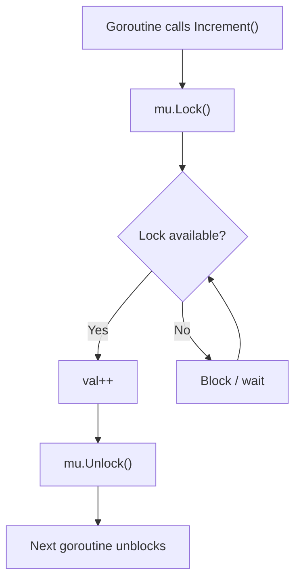
```mermaid
flowchart TD
    A["Goroutine calls Increment()"] --> B["mu.Lock()"]
    B --> C{"Lock available?"}
    C -->|"Yes"| D["val++"]
    C -->|"No"| E["Block / wait"]
    E --> C
    D --> F["mu.Unlock()"]
    F --> G["Next goroutine unblocks"]
```

**Execution Trace:**
```
Input:  3 goroutines
G1: Lock → val=0→1 → Unlock
G2: Lock → val=1→2 → Unlock
G3: Lock → val=2→3 → Unlock
Output: 3
```

### Interviewer Questions

1. Why mutex over channel for a simple counter?
2. Can we improve to O(1) contention? Yes — `atomic.AddInt64`.
3. How does this scale to 10M concurrent increments?
4. Walk me through the edge case where a goroutine panics while holding the lock.
5. How would you detect mutex copying bugs?
6. What's the memory/GC impact of allocating SafeCounter on heap vs stack?
7. How would you test this comprehensively with `-race`?

### Follow-Up Questions

**Q1:** What happens if we copy a `sync.Mutex` by value?
**A1:** The mutex state is copied too, leading to two mutexes that don't protect the same resource. Use `go vet` and `-race` to detect this. Always pass mutex-containing structs by pointer.

**Q2:** When should we use `defer mu.Unlock()` vs explicit `mu.Unlock()`?
**A2:** Always prefer `defer` — it guarantees unlock even if the function panics. Only skip defer in tight hot loops where the overhead of defer matters (benchmark first).

**Q3:** How does `sync.Mutex` fairness work in Go?
**A3:** Go's mutex has two modes: normal (FIFO with some starvation tolerance) and starvation (triggered after 1ms wait, strict FIFO). This prevents goroutine starvation under high contention.

**Q4:** Can we make this lock-free?
**A4:** Yes — replace `mu+val` with `atomic.Int64`. `atomic.AddInt64(&val, 1)` is a single CPU instruction (LOCK XADD) with no context switching overhead.

**Q5:** How do you test for race conditions?
**A5:** Run `go test -race ./...`. The race detector instruments memory accesses and reports concurrent unsynchronized reads/writes with goroutine stack traces.

---

## Q2: RWMutex Read-Heavy Counter  [Level 1 — Beginner]

> **Tags:** `#sync.RWMutex` `#read-heavy` `#shared-state`

### Problem Statement
Implement a thread-safe key-value store where reads vastly outnumber writes (99:1 ratio). Using a plain `sync.Mutex` would unnecessarily block concurrent readers. Use `sync.RWMutex` to allow multiple simultaneous readers while still serializing writes.

### Input / Output / Constraints

```
Input:  Set("foo", 42), 100 concurrent Get("foo") calls, Set("foo", 99)
Output: Get returns 42 until the second Set, then returns 99

Constraints:
  • 1 ≤ keys ≤ 10⁶
  • Read:Write ratio ≥ 10:1 (RWMutex beneficial)
  • Time limit: 1s
```

### Thought Process

Think like a senior Go engineer:
1. **Understand:** Multiple readers can safely read simultaneously; writers need exclusive access.
2. **Pattern:** `RLock/RUnlock` for reads, `Lock/Unlock` for writes.
3. **Edge cases:** Missing key returns zero value; writer starvation under constant read pressure.
4. **Approach:** `RWMutex` allows n concurrent readers OR 1 exclusive writer — perfect for read-heavy maps.

### Brute Force Solution

```go
package main

import "sync"

// bruteForce — O(1) ops, O(k) space — blocks all readers during reads unnecessarily
type BruteStore struct {
    mu   sync.Mutex
    data map[string]int
}

func (s *BruteStore) Get(key string) (int, bool) {
    s.mu.Lock() // excessive: blocks other readers
    defer s.mu.Unlock()
    v, ok := s.data[key]
    return v, ok
}
```

**Time:** O(1) per op | **Space:** O(k) where k = number of keys
**Bottleneck:** Exclusive lock on reads prevents parallelism; throughput doesn't scale with readers.

### Better Solution

```go
// betterSolution — uses RWMutex for concurrent reads
type BetterStore struct {
    mu   sync.RWMutex
    data map[string]int
}

func (s *BetterStore) Get(key string) (int, bool) {
    s.mu.RLock()
    defer s.mu.RUnlock()
    v, ok := s.data[key]
    return v, ok
}

func (s *BetterStore) Set(key string, val int) {
    s.mu.Lock()
    defer s.mu.Unlock()
    s.data[key] = val
}
```

**Time:** O(1) per op | **Space:** O(k)

### Best / Optimal Solution

```go
package main

import (
    "fmt"
    "sync"
)

// RWStore — production-ready RWMutex-protected key-value store.
// Allows concurrent reads; serializes writes for correctness.
type RWStore struct {
    mu   sync.RWMutex
    data map[string]int
}

func NewRWStore() *RWStore {
    return &RWStore{data: make(map[string]int)}
}

func (s *RWStore) Get(key string) (int, bool) {
    s.mu.RLock()
    defer s.mu.RUnlock()
    v, ok := s.data[key]
    return v, ok
}

func (s *RWStore) Set(key string, val int) {
    s.mu.Lock()
    defer s.mu.Unlock()
    s.data[key] = val
}

func (s *RWStore) Delete(key string) {
    s.mu.Lock()
    defer s.mu.Unlock()
    delete(s.data, key)
}

func main() {
    store := NewRWStore()
    store.Set("foo", 42)

    var wg sync.WaitGroup
    for i := 0; i < 100; i++ {
        wg.Add(1)
        go func() {
            defer wg.Done()
            v, ok := store.Get("foo")
            _ = v
            _ = ok
        }()
    }
    wg.Wait()

    store.Set("foo", 99)
    v, _ := store.Get("foo")
    fmt.Println(v) // 99
}
```

**Time:** O(1) per op | **Space:** O(k)

### Production Considerations

| Aspect | Details |
|--------|---------|
| **Scalability** | Read throughput scales linearly with CPU cores; write throughput is serialized |
| **Edge Cases** | Nil map panics — always initialize via constructor; missing key returns zero value |
| **Error Handling** | Return (value, bool) idiom to distinguish missing vs zero-value |
| **Memory** | Map grows dynamically; pre-size with make(map[string]int, expectedSize) |
| **Concurrency** | Writer starvation possible under read flood; Go's RWMutex has writer priority after pending readers drain |

### Visual Explanation

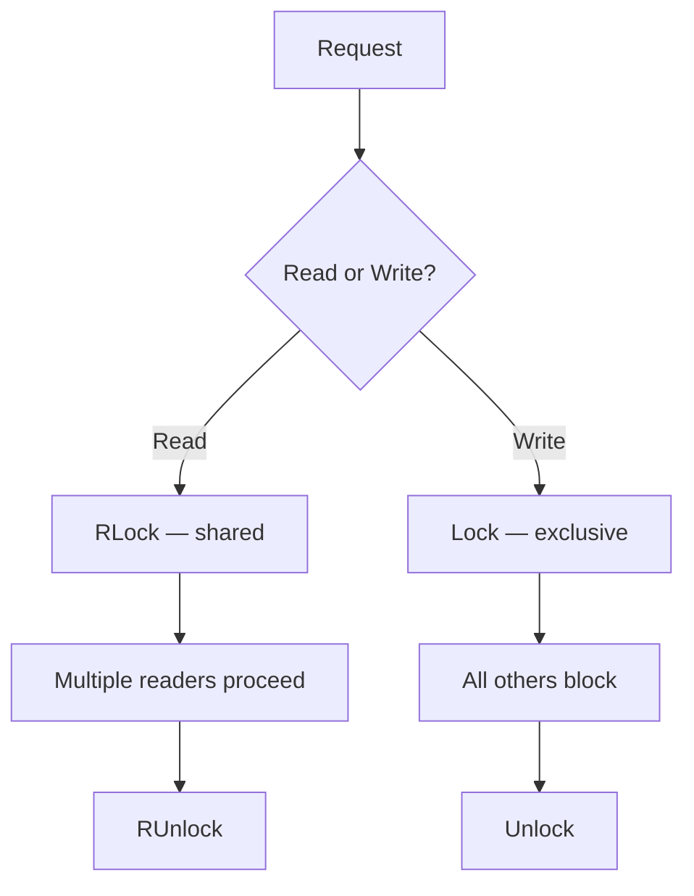
```mermaid
flowchart TD
    A["Request"] --> B{"Read or Write?"}
    B -->|"Read"| C["RLock — shared"]
    B -->|"Write"| D["Lock — exclusive"]
    C --> E["Multiple readers proceed"]
    D --> F["All others block"]
    E --> G["RUnlock"]
    F --> H["Unlock"]
```

**Execution Trace:**
```
Input:  100 Get + 1 Set concurrent
RLock×100: all proceed simultaneously
Set arrives: waits for readers to drain
Lock: exclusive, updates map
Unlock: next batch of readers unblocks
```

### Interviewer Questions

1. Why RWMutex over plain Mutex here?
2. Can RWMutex cause writer starvation?
3. How does this scale to 10M reads/sec?
4. Walk me through what happens when a writer arrives while readers hold RLock.
5. How would you make this goroutine-safe without any mutex?
6. What's the overhead of RWMutex vs Mutex?
7. How would you benchmark this to prove the read throughput improvement?

### Follow-Up Questions

**Q1:** When is `sync.RWMutex` NOT better than `sync.Mutex`?
**A1:** When write frequency is high (>20% of ops), RWMutex overhead (internal reader count tracking) can exceed plain Mutex. Benchmark with your actual workload using `go test -bench`.

**Q2:** How does Go prevent writer starvation?
**A2:** When a writer calls `Lock()`, new `RLock()` calls block. The writer waits only for in-progress readers to finish, not new ones. This gives writers priority over future readers.

**Q3:** Can we use `sync.Map` instead?
**A3:** `sync.Map` is optimized for two specific cases: keys written once and read many times, or keys each accessed by only one goroutine. For general read-heavy maps, RWMutex + map is often faster and type-safe.

**Q4:** How do you upgrade an RLock to a Lock?
**A4:** You cannot — attempting to upgrade deadlocks. Release the RLock first, then acquire Lock. Re-check invariants after acquiring Lock since state may have changed.

**Q5:** How to test read/write concurrency correctness?
**A5:** Use `go test -race`. Also write a stress test: spawn N reader goroutines and M writer goroutines for 5 seconds, verify reads never observe partial writes (use checksums on compound values).

---

## Q3: WaitGroup for Parallel Work  [Level 2 — Easy]

> **Tags:** `#sync.WaitGroup` `#fan-out` `#parallel-requests`

### Problem Statement
Given a list of URLs, fetch them all concurrently using goroutines and collect the HTTP status codes. Use `sync.WaitGroup` to wait for all goroutines to finish before returning results. Handle partial failures gracefully.

### Input / Output / Constraints

```
Input:  urls = ["https://example.com", "https://google.com", "https://invalid.url"]
Output: map[string]int{"https://example.com": 200, "https://google.com": 200, "https://invalid.url": -1}

Constraints:
  • 1 ≤ len(urls) ≤ 1000
  • Timeout per request: 5s
  • Return -1 for failed requests
  • Time limit: 10s total
```

### Thought Process

Think like a senior Go engineer:
1. **Understand:** Fan-out pattern — spawn one goroutine per URL, collect results, wait for all.
2. **Pattern:** `sync.WaitGroup` + mutex-protected result map, or channel-based collection.
3. **Edge cases:** Empty URL list, all failures, partial failure, context cancellation.
4. **Approach:** WaitGroup tracks in-flight goroutines; mutex protects shared results map.

### Brute Force Solution

```go
package main

import "net/http"

// bruteForce — O(n) serial requests, O(n) space
func bruteForce(urls []string) map[string]int {
    results := make(map[string]int)
    for _, url := range urls {
        resp, err := http.Get(url) // serial — slow
        if err != nil {
            results[url] = -1
            continue
        }
        resp.Body.Close()
        results[url] = resp.StatusCode
    }
    return results
}
```

**Time:** O(n × latency) | **Space:** O(n)
**Bottleneck:** Sequential requests — total time = sum of all latencies instead of max.

### Better Solution

```go
// betterSolution — concurrent with WaitGroup, O(max_latency) time
import (
    "net/http"
    "sync"
)

func betterFetch(urls []string) map[string]int {
    results := make(map[string]int)
    var mu sync.Mutex
    var wg sync.WaitGroup

    for _, url := range urls {
        wg.Add(1)
        go func(u string) {
            defer wg.Done()
            resp, err := http.Get(u)
            mu.Lock()
            if err != nil {
                results[u] = -1
            } else {
                resp.Body.Close()
                results[u] = resp.StatusCode
            }
            mu.Unlock()
        }(url)
    }
    wg.Wait()
    return results
}
```

**Time:** O(max_latency) | **Space:** O(n)

### Best / Optimal Solution

```go
package main

import (
    "context"
    "fmt"
    "net/http"
    "sync"
    "time"
)

type FetchResult struct {
    URL    string
    Status int
    Err    error
}

// FetchAll — production-ready parallel HTTP fetcher.
// Uses WaitGroup for coordination, channel for result collection,
// and per-request context for timeout control.
func FetchAll(ctx context.Context, urls []string) map[string]int {
    if len(urls) == 0 {
        return map[string]int{}
    }

    results := make(chan FetchResult, len(urls))
    var wg sync.WaitGroup
    client := &http.Client{Timeout: 5 * time.Second}

    for _, url := range urls {
        wg.Add(1)
        go func(u string) {
            defer wg.Done()
            req, err := http.NewRequestWithContext(ctx, http.MethodGet, u, nil)
            if err != nil {
                results <- FetchResult{URL: u, Status: -1, Err: err}
                return
            }
            resp, err := client.Do(req)
            if err != nil {
                results <- FetchResult{URL: u, Status: -1, Err: err}
                return
            }
            resp.Body.Close()
            results <- FetchResult{URL: u, Status: resp.StatusCode}
        }(url)
    }

    // Close channel once all goroutines finish
    go func() {
        wg.Wait()
        close(results)
    }()

    out := make(map[string]int, len(urls))
    for r := range results {
        out[r.URL] = r.Status
    }
    return out
}

func main() {
    ctx, cancel := context.WithTimeout(context.Background(), 10*time.Second)
    defer cancel()

    urls := []string{"https://example.com", "https://httpbin.org/status/404"}
    results := FetchAll(ctx, urls)
    for url, status := range results {
        fmt.Printf("%s → %d\n", url, status)
    }
}
```

**Time:** O(max_latency) | **Space:** O(n)

### Production Considerations

| Aspect | Details |
|--------|---------|
| **Scalability** | At 10K URLs, add a semaphore to cap concurrency (e.g., 100 in-flight max) |
| **Edge Cases** | Empty slice returns empty map; nil context panics — validate inputs |
| **Error Handling** | Distinguish network errors, timeouts, and HTTP errors; log with structured logger |
| **Memory** | Buffered channel sized to len(urls) prevents goroutine leak if reader is slow |
| **Concurrency** | Channel-based collection eliminates mutex; goroutine leak prevented by wg+close |

### Visual Explanation

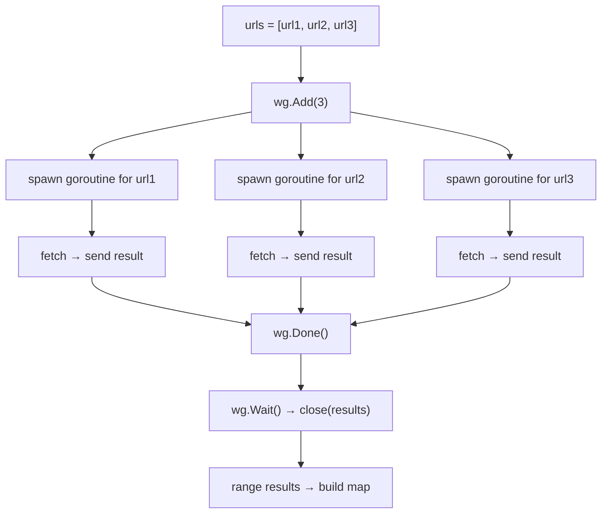
```mermaid
flowchart TD
    A["urls = [url1, url2, url3]"] --> B["wg.Add(3)"]
    B --> C["spawn goroutine for url1"]
    B --> D["spawn goroutine for url2"]
    B --> E["spawn goroutine for url3"]
    C --> F["fetch → send result"]
    D --> G["fetch → send result"]
    E --> H["fetch → send result"]
    F --> I["wg.Done()"]
    G --> I
    H --> I
    I --> J["wg.Wait() → close(results)"]
    J --> K["range results → build map"]
```

**Execution Trace:**
```
Input:  3 URLs
t=0ms:  3 goroutines spawned
t=120ms: url2 responds → result sent
t=200ms: url1 responds → result sent
t=5000ms: url3 timeout → status=-1
t=5000ms: wg.Wait() unblocks → channel closed
Output: map with 3 entries
```

### Interviewer Questions

1. Why channel-based collection over mutex-protected map?
2. Can we improve time complexity further?
3. How does this scale to 10K concurrent requests?
4. Walk me through goroutine leak scenarios and how you prevent them.
5. How would you add a concurrency limit (semaphore)?
6. What's the memory impact of buffered vs unbuffered channel here?
7. How would you test this without real HTTP calls?

### Follow-Up Questions

**Q1:** How do you limit concurrency to N parallel requests?
**A1:** Use a buffered channel as a semaphore: `sem := make(chan struct{}, N)`. Before each goroutine does work, send to sem (`sem <- struct{}{}`); defer receive (`<-sem`) on exit. This caps in-flight goroutines.

**Q2:** What if we need ordered results?
**A2:** Pre-allocate a `[]FetchResult` slice, pass the index to each goroutine, write to `results[i]` directly. No mutex needed since each goroutine writes a unique index.

**Q3:** How do you handle context cancellation mid-flight?
**A3:** `http.NewRequestWithContext` propagates cancellation. When ctx is cancelled, in-flight requests return immediately with a context error. Check `errors.Is(err, context.Canceled)` to distinguish cancellation from network errors.

**Q4:** Why buffer the results channel at `len(urls)`?
**A4:** Without buffering, goroutines block on send if the receiver (main goroutine) hasn't started ranging yet. Full buffer ensures goroutines never block, preventing deadlock if `wg.Wait()` goroutine runs before main starts consuming.

**Q5:** How would you mock HTTP calls in tests?
**A5:** Use `httptest.NewServer` to create a local test server, or inject an `http.Client` with a custom `http.RoundTripper` that returns preset responses without network calls.

---

## Q4: sync.Once Singleton Logger  [Level 2 — Easy]

> **Tags:** `#sync.Once` `#singleton` `#initialization`

### Problem Statement
Implement a singleton logger that is initialized exactly once, even when multiple goroutines call `GetLogger()` concurrently. The logger should be safe to use across goroutines and expensive to initialize (e.g., opens a file, connects to log aggregator).

### Input / Output / Constraints

```
Input:  100 concurrent GetLogger() calls
Output: All calls return the same *Logger instance; init runs exactly once

Constraints:
  • Init function must execute exactly once
  • All goroutines must receive a valid logger (no nil returns)
  • Time limit: 1s
```

### Thought Process

Think like a senior Go engineer:
1. **Understand:** Lazy initialization that must happen exactly once under concurrent access.
2. **Pattern:** `sync.Once.Do()` guarantees the function runs exactly once regardless of concurrent callers.
3. **Edge cases:** Panic inside Do — Once considers it "done"; subsequent calls are no-ops even if init failed.
4. **Approach:** `sync.Once` is purpose-built for this; avoids double-checked locking anti-pattern.

### Brute Force Solution

```go
package main

import "log"

// bruteForce — NOT goroutine-safe, init may run multiple times
var logger *log.Logger

func bruteForceGetLogger() *log.Logger {
    if logger == nil { // race: two goroutines can both see nil
        logger = log.New(nil, "APP: ", log.LstdFlags) // double init
    }
    return logger
}
```

**Time:** O(1) | **Space:** O(1)
**Bottleneck:** Data race — two goroutines can both pass the nil check and initialize simultaneously.

### Better Solution

```go
// betterSolution — mutex-protected init (over-engineered for this case)
import (
    "log"
    "sync"
)

var (
    logger   *log.Logger
    loggerMu sync.Mutex
)

func betterGetLogger() *log.Logger {
    loggerMu.Lock()
    defer loggerMu.Unlock()
    if logger == nil {
        logger = log.New(nil, "APP: ", log.LstdFlags)
    }
    return logger
}
```

**Time:** O(1) | **Space:** O(1)

### Best / Optimal Solution

```go
package main

import (
    "fmt"
    "log"
    "os"
    "sync"
)

// AppLogger — singleton logger initialized exactly once.
type AppLogger struct {
    inner *log.Logger
}

func (l *AppLogger) Info(msg string) {
    l.inner.Printf("[INFO] %s", msg)
}

var (
    instance *AppLogger
    once     sync.Once
)

// GetLogger — returns the singleton AppLogger.
// Safe for concurrent use; init runs exactly once.
func GetLogger() *AppLogger {
    once.Do(func() {
        // Expensive init: open file, configure formatter, etc.
        f, err := os.OpenFile("/tmp/app.log", os.O_CREATE|os.O_WRONLY|os.O_APPEND, 0644)
        if err != nil {
            // Fallback to stderr — Once still marks done
            instance = &AppLogger{inner: log.New(os.Stderr, "APP: ", log.LstdFlags|log.Lshortfile)}
            return
        }
        instance = &AppLogger{inner: log.New(f, "APP: ", log.LstdFlags|log.Lshortfile)}
    })
    return instance
}

func main() {
    var wg sync.WaitGroup
    for i := 0; i < 100; i++ {
        wg.Add(1)
        go func() {
            defer wg.Done()
            l := GetLogger()
            l.Info("hello from goroutine")
        }()
    }
    wg.Wait()
    fmt.Println("All goroutines used the same logger instance")
}
```

**Time:** O(1) amortized | **Space:** O(1)

### Production Considerations

| Aspect | Details |
|--------|---------|
| **Scalability** | Once is called once; subsequent calls are a no-op with a single atomic check — near-zero overhead |
| **Edge Cases** | Panic in Do marks Once as done; next call returns nil instance — add nil guard or use error-returning init |
| **Error Handling** | Once.Do cannot return errors; use a package-level error var set inside Do |
| **Memory** | Single allocation for logger; file handle held for process lifetime |
| **Concurrency** | sync.Once is the canonical Go singleton; fully goroutine-safe |

### Visual Explanation

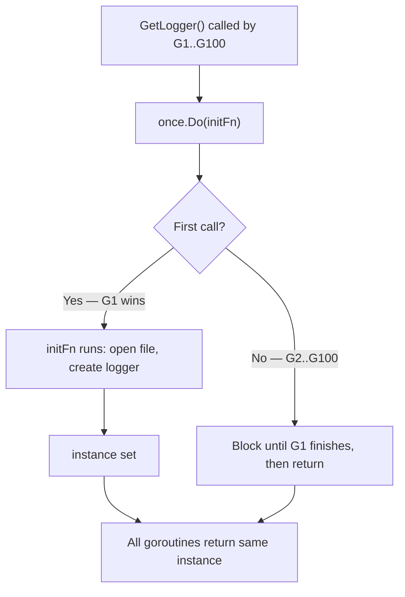
```mermaid
flowchart TD
    A["GetLogger() called by G1..G100"] --> B["once.Do(initFn)"]
    B --> C{"First call?"}
    C -->|"Yes — G1 wins"| D["initFn runs: open file, create logger"]
    C -->|"No — G2..G100"| E["Block until G1 finishes, then return"]
    D --> F["instance set"]
    F --> G["All goroutines return same instance"]
    E --> G
```

**Execution Trace:**
```
Input:  100 concurrent GetLogger() calls
G1 enters Do → runs init → sets instance
G2-G100 block on Do → unblock after G1 → return instance
Output: all 100 goroutines have the same *AppLogger pointer
```

### Interviewer Questions

1. Why `sync.Once` over double-checked locking with a mutex?
2. What happens if the init function panics?
3. How does this scale to 10M concurrent GetLogger calls?
4. Walk me through what happens if init opens a file that doesn't exist.
5. How would you make this support re-initialization (e.g., log rotation)?
6. What's the atomic operation inside sync.Once?
7. How would you test that init ran exactly once?

### Follow-Up Questions

**Q1:** How do you handle errors from sync.Once initialization?
**A1:** Declare a package-level `var initErr error`. Inside `Do`, set it alongside `instance`. Callers check both: `logger, err := GetLogger()` pattern. Alternatively use `sync.OnceValues` (Go 1.21+) which returns `(T, error)` natively.

**Q2:** Can sync.Once be reset?
**A2:** No — it is designed to be a one-shot gate. For re-initialization, use a new `sync.Once` value (swap the pointer atomically with `atomic.Pointer[sync.Once]`) or redesign to use a mutex with an explicit reset method.

**Q3:** What is `sync.OnceFunc` and `sync.OnceValue` in Go 1.21?
**A3:** `sync.OnceFunc(f)` returns a function that calls f exactly once and is goroutine-safe. `sync.OnceValue(f)` and `sync.OnceValues(f)` return functions that memoize return values. They are the idiomatic replacement for `var once sync.Once; once.Do(...)` patterns.

**Q4:** How does sync.Once work internally?
**A4:** It uses a `uint32` done flag and a `sync.Mutex`. On first call, a fast atomic load checks done==0, then the mutex serializes the actual init call, then done is atomically set to 1. Subsequent callers see done==1 on the fast path and return immediately.

**Q5:** How to test that init ran exactly once under concurrent access?
**A5:** Use an atomic counter inside the init function. After running 10K goroutines through GetLogger, assert `atomic.LoadInt64(&initCount) == 1`. Run with `-race` to catch any unsynchronized access.

---

## Q5: sync.Cond Producer-Consumer  [Level 3 — Medium]

> **Tags:** `#sync.Cond` `#producer-consumer` `#notification`

### Problem Statement
Implement a bounded blocking queue using `sync.Cond`. Producers block when the queue is full; consumers block when the queue is empty. Use `sync.Cond` to notify waiting goroutines when conditions change, avoiding busy-waiting.

### Input / Output / Constraints

```
Input:  capacity=3, 5 producers each sending 1 item, 5 consumers each reading 1 item
Output: All 5 items are produced and consumed exactly once; no busy-waiting

Constraints:
  • 1 ≤ capacity ≤ 10⁶
  • Multiple producers and consumers
  • No busy-wait (no time.Sleep polling)
  • Time limit: 5s
```

### Thought Process

Think like a senior Go engineer:
1. **Understand:** Classic bounded buffer — block producer when full, block consumer when empty.
2. **Pattern:** `sync.Cond` with two conditions: notFull (for producers) and notEmpty (for consumers).
3. **Edge cases:** Spurious wakeups (use for loop around Wait), closed queue signaling.
4. **Approach:** `sync.Cond` is ideal when goroutines need to wait for a specific state change broadcast.

### Brute Force Solution

```go
package main

import "time"

// bruteForce — busy-wait polling, wastes CPU
var queue []int

func bruteEnqueue(item int, cap int) {
    for len(queue) >= cap {
        time.Sleep(1 * time.Millisecond) // busy-wait: CPU waste
    }
    queue = append(queue, item)
}
```

**Time:** O(1) amortized | **Space:** O(cap)
**Bottleneck:** Busy-wait consumes CPU even when no progress is possible; poor scalability.

### Better Solution

```go
// betterSolution — channel-based bounded queue (idiomatic Go)
func makeBoundedQueue(cap int) chan int {
    return make(chan int, cap) // built-in blocking semantics
}
// Producers: queue <- item (blocks when full)
// Consumers: item := <-queue (blocks when empty)
```

**Time:** O(1) | **Space:** O(cap)

### Best / Optimal Solution

```go
package main

import (
    "fmt"
    "sync"
)

// BoundedQueue — sync.Cond-based bounded blocking queue.
// Demonstrates Cond usage for cases where channels don't fit
// (e.g., dynamic capacity resize, multi-condition waits).
type BoundedQueue struct {
    mu       sync.Mutex
    notFull  *sync.Cond
    notEmpty *sync.Cond
    buf      []int
    cap      int
    closed   bool
}

func NewBoundedQueue(cap int) *BoundedQueue {
    q := &BoundedQueue{buf: make([]int, 0, cap), cap: cap}
    q.notFull = sync.NewCond(&q.mu)
    q.notEmpty = sync.NewCond(&q.mu)
    return q
}

// Enqueue blocks until space is available or queue is closed.
func (q *BoundedQueue) Enqueue(item int) bool {
    q.mu.Lock()
    defer q.mu.Unlock()
    for len(q.buf) >= q.cap && !q.closed {
        q.notFull.Wait() // releases lock, suspends, re-acquires on wake
    }
    if q.closed {
        return false
    }
    q.buf = append(q.buf, item)
    q.notEmpty.Signal() // wake one blocked consumer
    return true
}

// Dequeue blocks until an item is available or queue is closed.
func (q *BoundedQueue) Dequeue() (int, bool) {
    q.mu.Lock()
    defer q.mu.Unlock()
    for len(q.buf) == 0 && !q.closed {
        q.notEmpty.Wait()
    }
    if len(q.buf) == 0 {
        return 0, false // closed and empty
    }
    item := q.buf[0]
    q.buf = q.buf[1:]
    q.notFull.Signal() // wake one blocked producer
    return item, true
}

// Close signals all blocked goroutines to unblock.
func (q *BoundedQueue) Close() {
    q.mu.Lock()
    defer q.mu.Unlock()
    q.closed = true
    q.notFull.Broadcast()
    q.notEmpty.Broadcast()
}

func main() {
    q := NewBoundedQueue(3)
    var wg sync.WaitGroup

    // 5 producers
    for i := 0; i < 5; i++ {
        wg.Add(1)
        go func(v int) {
            defer wg.Done()
            q.Enqueue(v)
            fmt.Printf("produced: %d\n", v)
        }(i)
    }

    // 5 consumers
    for i := 0; i < 5; i++ {
        wg.Add(1)
        go func() {
            defer wg.Done()
            if item, ok := q.Dequeue(); ok {
                fmt.Printf("consumed: %d\n", item)
            }
        }()
    }

    wg.Wait()
    q.Close()
}
```

**Time:** O(1) per op | **Space:** O(cap)

### Production Considerations

| Aspect | Details |
|--------|---------|
| **Scalability** | Signal wakes one waiter; Broadcast wakes all — use Signal for normal ops, Broadcast for close |
| **Edge Cases** | Spurious wakeups: always use `for` loop (not `if`) around Wait(); closed queue must drain |
| **Error Handling** | Return (value, bool) — false signals closed queue; callers must check |
| **Memory** | Slice-based buffer grows to cap; consider ring buffer for O(1) dequeue without shifting |
| **Concurrency** | Cond.Wait atomically releases lock and suspends — no race between check and wait |

### Visual Explanation

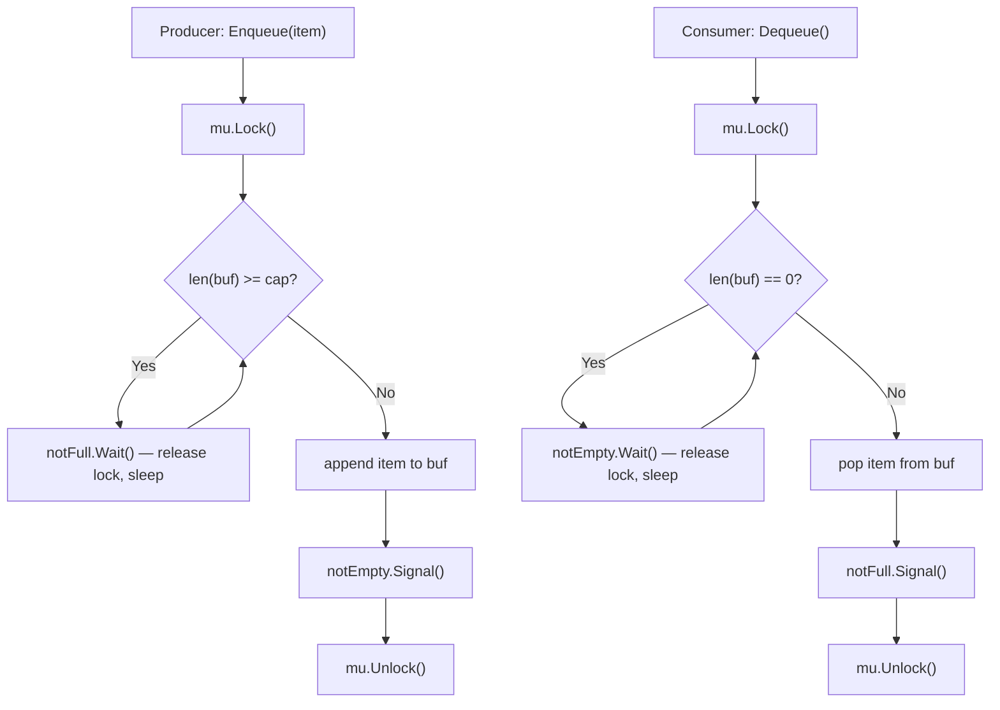
```mermaid
flowchart TD
    A["Producer: Enqueue(item)"] --> B["mu.Lock()"]
    B --> C{"len(buf) >= cap?"}
    C -->|"Yes"| D["notFull.Wait() — release lock, sleep"]
    D --> C
    C -->|"No"| E["append item to buf"]
    E --> F["notEmpty.Signal()"]
    F --> G["mu.Unlock()"]

    H["Consumer: Dequeue()"] --> I["mu.Lock()"]
    I --> J{"len(buf) == 0?"}
    J -->|"Yes"| K["notEmpty.Wait() — release lock, sleep"]
    K --> J
    J -->|"No"| L["pop item from buf"]
    L --> M["notFull.Signal()"]
    M --> N["mu.Unlock()"]
```

**Execution Trace:**
```
cap=3, producers=5, consumers=5
P1,P2,P3: Enqueue → buf=[0,1,2] (full)
P4,P5: block on notFull.Wait()
C1: Dequeue → buf=[1,2], notFull.Signal() → P4 wakes
P4: Enqueue → buf=[1,2,3], notEmpty.Signal()
... pattern continues until all 5 consumed
```

### Interviewer Questions

1. Why `sync.Cond` over channels for a bounded queue?
2. What are spurious wakeups and how do you handle them?
3. How does this scale to 10K producers and consumers?
4. Walk me through the scenario where Close() is called while goroutines are blocked.
5. How would you make this goroutine-safe without Cond?
6. Why must Wait() be called inside a for loop, not if?
7. How would you test this for deadlock and starvation?

### Follow-Up Questions

**Q1:** When should you use `Signal()` vs `Broadcast()`?
**A1:** `Signal()` wakes exactly one waiter — use when one waiter can make progress (e.g., one slot freed). `Broadcast()` wakes all — use when all waiters should re-evaluate (e.g., queue closed, capacity increased). Using Signal for close would leave some goroutines permanently blocked.

**Q2:** Why is the `for` loop required around `Wait()`?
**A2:** POSIX and Go specs allow spurious wakeups — a goroutine may wake without a corresponding Signal. The condition (e.g., `len(buf) >= cap`) must be re-checked. Also, between wake and lock re-acquisition, another goroutine may have consumed the slot.

**Q3:** How would you implement a priority queue with sync.Cond?
**A3:** Replace the slice buf with a `container/heap`. The Enqueue/Dequeue logic stays the same; heap.Push/Pop provide O(log n) ordering. The Cond still signals on push (notEmpty) and pop (notFull).

**Q4:** How does sync.Cond compare to channels for producer-consumer?
**A4:** Channels are simpler and idiomatic for bounded queues. Cond shines when: (1) you need to resize capacity dynamically, (2) you need multiple condition variables on the same mutex, or (3) you need Broadcast semantics (e.g., shutdown all workers).

**Q5:** How to test for deadlock in a bounded queue?
**A5:** Write a test that enqueues cap+1 items with a timeout context. If the (cap+1)th Enqueue doesn't unblock within the timeout after a Dequeue, the test fails. Use `goleak` to detect goroutines leaked at test end.

---

## Q6: sync.Pool Buffer Reuse  [Level 2 — Easy]

> **Tags:** `#sync.Pool` `#memory-pooling` `#GC-pressure`

### Problem Statement
Implement a byte buffer pool using `sync.Pool` to reuse `[]byte` buffers across requests, reducing GC pressure in a high-throughput HTTP handler. The pool should provide buffers of a fixed size and return them for reuse.

### Input / Output / Constraints

```
Input:  10000 concurrent requests each needing a 4096-byte buffer
Output: GC allocation count reduced by ~90% compared to per-request allocation

Constraints:
  • Buffer size: 4096 bytes
  • Throughput: 10K req/s
  • Reuse must be safe (buffers reset before reuse)
  • Time limit: benchmark comparison
```

### Thought Process

Think like a senior Go engineer:
1. **Understand:** Allocating large buffers per-request generates GC pressure; pools amortize allocations.
2. **Pattern:** `sync.Pool` with a `New` function; Get before use, Put after use with reset.
3. **Edge cases:** Pool may return nil if GC clears it (covered by New func); must reset buffer before use.
4. **Approach:** `sync.Pool` is purpose-built for temporary object reuse; GC-aware (cleared between GC cycles).

### Brute Force Solution

```go
package main

// bruteForce — allocates new buffer per call, O(n) GC pressure
func handleRequest() {
    buf := make([]byte, 4096) // new allocation every request
    _ = buf
    // process...
    // buf is GC'd after request
}
```

**Time:** O(1) | **Space:** O(n) GC allocations
**Bottleneck:** 10K req/s × 4KB = 40MB/s of allocations; triggers frequent GC pauses.

### Better Solution

```go
// betterSolution — global pool reuses buffers
import "sync"

var pool = sync.Pool{
    New: func() interface{} {
        return make([]byte, 4096)
    },
}

func betterHandle() {
    buf := pool.Get().([]byte)
    defer pool.Put(buf)
    // reset before use
    buf = buf[:0]
    // process...
}
```

**Time:** O(1) | **Space:** O(poolSize) reused

### Best / Optimal Solution

```go
package main

import (
    "fmt"
    "sync"
    "sync/atomic"
)

const bufSize = 4096

// BufPool — production-ready typed buffer pool with metrics.
type BufPool struct {
    pool      sync.Pool
    gets      atomic.Int64
    allocs    atomic.Int64
}

func NewBufPool() *BufPool {
    p := &BufPool{}
    p.pool = sync.Pool{
        New: func() any {
            p.allocs.Add(1)
            b := make([]byte, bufSize)
            return &b
        },
    }
    return p
}

// Get returns a reset buffer from the pool.
func (p *BufPool) Get() []byte {
    p.gets.Add(1)
    buf := *p.pool.Get().(*[]byte)
    // Reset length to 0, keep underlying array
    return buf[:0]
}

// Put returns the buffer to the pool after clearing sensitive data.
func (p *BufPool) Put(buf []byte) {
    if cap(buf) != bufSize {
        return // discard if wrong size — don't corrupt pool
    }
    buf = buf[:cap(buf)]
    clear(buf) // zero out — security: clear sensitive data
    p.pool.Put(&buf)
}

// Stats returns pool efficiency metrics.
func (p *BufPool) Stats() (gets, allocs int64) {
    return p.gets.Load(), p.allocs.Load()
}

func main() {
    pool := NewBufPool()

    var wg sync.WaitGroup
    for i := 0; i < 10000; i++ {
        wg.Add(1)
        go func() {
            defer wg.Done()
            buf := pool.Get()
            buf = append(buf, []byte("hello world")...)
            _ = buf
            pool.Put(buf)
        }()
    }
    wg.Wait()

    gets, allocs := pool.Stats()
    fmt.Printf("Gets: %d, Allocs: %d, Reuse ratio: %.1f%%\n",
        gets, allocs, float64(gets-allocs)/float64(gets)*100)
}
```

**Time:** O(1) per Get/Put | **Space:** O(pool_size × bufSize)

### Production Considerations

| Aspect | Details |
|--------|---------|
| **Scalability** | Pool scales with GOMAXPROCS — each P has a local pool to avoid contention |
| **Edge Cases** | GC clears pool; New func must always create valid buffer; never assume pool is warm |
| **Error Handling** | Discard wrong-capacity buffers; validate cap before Put to avoid pool corruption |
| **Memory** | Pool holds buffers between GC cycles; total memory = live_goroutines × bufSize (max) |
| **Concurrency** | sync.Pool is fully goroutine-safe; designed for high-concurrency |

### Visual Explanation

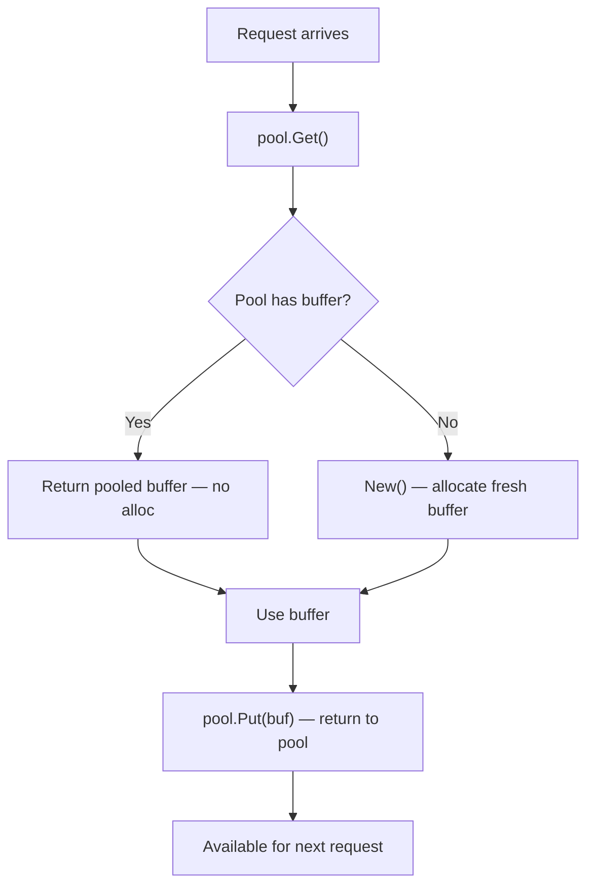
```mermaid
flowchart TD
    A["Request arrives"] --> B["pool.Get()"]
    B --> C{"Pool has buffer?"}
    C -->|"Yes"| D["Return pooled buffer — no alloc"]
    C -->|"No"| E["New() — allocate fresh buffer"]
    D --> F["Use buffer"]
    E --> F
    F --> G["pool.Put(buf) — return to pool"]
    G --> H["Available for next request"]
```

**Execution Trace:**
```
Request 1: Get → pool empty → alloc new (allocs=1)
Request 1: Put → pool has 1 buffer
Request 2: Get → pool returns buffer (no alloc, allocs=1)
...after 10K requests: allocs ≈ GOMAXPROCS (not 10K)
```

### Interviewer Questions

1. Why sync.Pool over a custom free-list?
2. What happens to pooled objects during GC?
3. How does this scale to 10M req/s?
4. Walk me through the edge case where a buffer is Put with wrong capacity.
5. How would you make the pool size bounded?
6. What's the security concern with buffer reuse and how do you handle it?
7. How would you benchmark pool vs no-pool allocation savings?

### Follow-Up Questions

**Q1:** What happens to sync.Pool contents during a GC cycle?
**A1:** The GC is pool-aware — it clears all pool items between cycles (after Go 1.13, with a two-cycle grace period using a victim cache). This prevents memory leaks from pooled objects but means pools may be empty after GC. The `New` function handles replenishment.

**Q2:** How does sync.Pool avoid contention at high concurrency?
**A2:** Each logical processor (P) has a local pool. `Get` first checks the local P's pool (no locking needed), then the shared pool with locking, then calls `New`. `Put` stores to the local P's pool. This makes pool operations nearly contention-free.

**Q3:** Should you pool small objects?
**A3:** No — pooling overhead (atomic ops, indirection) exceeds the allocation cost for objects smaller than ~1KB. Benchmark with `go test -bench -benchmem`. Pool shines for buffers, template renders, JSON encoders, and other large temporary objects.

**Q4:** How do you handle variable-size buffers?
**A4:** Use multiple pools bucketed by size (e.g., 1KB, 4KB, 16KB, 64KB pools). When requesting a buffer, round up to the nearest bucket. This is the approach used by `net/http` and `encoding/json` internally.

**Q5:** How would you test pool correctness?
**A5:** Test that (1) buffers returned by Get are always at least requested capacity, (2) buffers are zero'd (no data leakage from previous user), (3) Get after Put returns a valid buffer. Use `-race` to verify thread safety.

---

## Q7: sync.Map Concurrent Cache  [Level 3 — Medium]

> **Tags:** `#sync.Map` `#concurrent-cache` `#read-optimized`

### Problem Statement
Implement a concurrent DNS cache using `sync.Map`. The cache maps hostnames to IP addresses. Multiple goroutines resolve hostnames concurrently; cache hits should not block. Use `LoadOrStore` to prevent duplicate DNS lookups for the same hostname.

### Input / Output / Constraints

```
Input:  100 goroutines each resolving "example.com" concurrently; DNS lookup takes 100ms
Output: DNS lookup executes exactly once for "example.com"; all 100 goroutines get the result

Constraints:
  • 1 ≤ concurrent resolvers ≤ 10⁴
  • Cache is write-once, read-many per key
  • Must prevent thundering herd (duplicate lookups)
  • Time limit: 200ms (one DNS lookup latency, not 100×)
```

### Thought Process

Think like a senior Go engineer:
1. **Understand:** Cache with concurrent writers — need to prevent duplicate expensive operations for same key.
2. **Pattern:** `sync.Map.LoadOrStore` for atomic check-and-set; `sync.Once` per key for single-flight semantics.
3. **Edge cases:** Cache poisoning (bad IP stored), cache eviction, thundering herd on cold cache.
4. **Approach:** Combine `sync.Map` with per-key `sync.Once` for single-flight deduplication.

### Brute Force Solution

```go
package main

import (
    "sync"
    "time"
)

// bruteForce — RWMutex map, no dedup: N goroutines do N DNS lookups
type BruteCache struct {
    mu    sync.RWMutex
    cache map[string]string
}

func (c *BruteCache) Resolve(host string) string {
    c.mu.RLock()
    if ip, ok := c.cache[host]; ok {
        c.mu.RUnlock()
        return ip
    }
    c.mu.RUnlock()

    ip := doLookup(host)      // race: multiple goroutines look up same host
    c.mu.Lock()
    c.cache[host] = ip
    c.mu.Unlock()
    return ip
}

func doLookup(host string) string {
    time.Sleep(100 * time.Millisecond) // simulate DNS
    return "93.184.216.34"
}
```

**Time:** O(1) cache hit, O(lookup) miss | **Space:** O(keys)
**Bottleneck:** Thundering herd — 100 goroutines all miss and trigger 100 DNS lookups.

### Better Solution

```go
// betterSolution — sync.Map with LoadOrStore (still has thundering herd for complex values)
import "sync"

var cache sync.Map

func betterResolve(host string) string {
    if ip, ok := cache.Load(host); ok {
        return ip.(string)
    }
    ip := doLookup(host)
    actual, _ := cache.LoadOrStore(host, ip)
    return actual.(string)
}
```

**Time:** O(1) cache hit | **Space:** O(keys)

### Best / Optimal Solution

```go
package main

import (
    "fmt"
    "sync"
    "time"
)

// entry wraps the result with a Once for single-flight semantics.
type entry struct {
    once sync.Once
    ip   string
    err  error
}

// DNSCache — concurrent DNS cache with single-flight dedup.
// Each hostname triggers at most one DNS lookup, even under high concurrency.
type DNSCache struct {
    mu      sync.Mutex
    entries map[string]*entry
}

func NewDNSCache() *DNSCache {
    return &DNSCache{entries: make(map[string]*entry)}
}

// Resolve returns the IP for host, performing DNS lookup at most once per host.
func (c *DNSCache) Resolve(host string) (string, error) {
    c.mu.Lock()
    e, ok := c.entries[host]
    if !ok {
        e = &entry{}
        c.entries[host] = e
    }
    c.mu.Unlock()

    // Only one goroutine runs the lookup; others wait on Once.
    e.once.Do(func() {
        e.ip, e.err = dnsLookup(host)
    })
    return e.ip, e.err
}

func dnsLookup(host string) (string, error) {
    time.Sleep(100 * time.Millisecond) // simulate DNS latency
    fmt.Printf("DNS lookup performed for: %s\n", host)
    return "93.184.216.34", nil
}

func main() {
    cache := NewDNSCache()
    var wg sync.WaitGroup

    // 100 goroutines, all resolve the same host
    for i := 0; i < 100; i++ {
        wg.Add(1)
        go func() {
            defer wg.Done()
            ip, err := cache.Resolve("example.com")
            if err != nil {
                fmt.Printf("error: %v\n", err)
                return
            }
            _ = ip
        }()
    }
    wg.Wait()
    // "DNS lookup performed for: example.com" prints exactly once
    fmt.Println("Done — lookup ran exactly once")
}
```

**Time:** O(1) cache hit, O(lookup) first miss | **Space:** O(distinct keys)

### Production Considerations

| Aspect | Details |
|--------|---------|
| **Scalability** | sync.Map scales reads to all cores; write path is serialized per-key via Once |
| **Edge Cases** | Failed lookups are cached (negative caching) — add TTL or retry logic for transient errors |
| **Error Handling** | Return (string, error); callers must check error before using IP |
| **Memory** | Entries never evicted — add TTL with time.AfterFunc or periodic sweep for production |
| **Concurrency** | Mutex only held for entry creation (brief); Once serializes per-key lookup |

### Visual Explanation

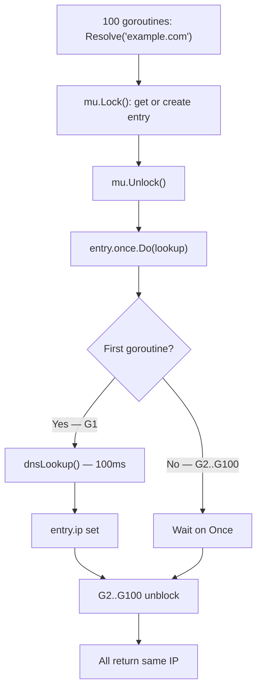
```mermaid
flowchart TD
    A["100 goroutines: Resolve('example.com')"] --> B["mu.Lock(): get or create entry"]
    B --> C["mu.Unlock()"]
    C --> D["entry.once.Do(lookup)"]
    D --> E{"First goroutine?"}
    E -->|"Yes — G1"| F["dnsLookup() — 100ms"]
    E -->|"No — G2..G100"| G["Wait on Once"]
    F --> H["entry.ip set"]
    H --> I["G2..G100 unblock"]
    G --> I
    I --> J["All return same IP"]
```

**Execution Trace:**
```
t=0ms:   100 goroutines call Resolve("example.com")
t=0ms:   All get same *entry from map (one entry created)
t=0ms:   G1 enters once.Do → starts DNS lookup
t=0ms:   G2-G100 block on once.Do
t=100ms: DNS returns "93.184.216.34"
t=100ms: G2-G100 unblock, all return "93.184.216.34"
Total:   100ms (not 10,000ms)
```

### Interviewer Questions

1. Why not use `golang.org/x/sync/singleflight` instead?
2. How does sync.Map differ from a mutex-protected map?
3. How does this scale to 10M distinct hostnames?
4. Walk me through the negative caching problem.
5. How would you add TTL-based expiration?
6. What's the memory overhead of sync.Map vs map+RWMutex?
7. How would you test for thundering herd prevention?

### Follow-Up Questions

**Q1:** When should you use `sync.Map` vs `map + RWMutex`?
**A1:** `sync.Map` is optimized for: (1) keys written once, read many times, and (2) concurrent writes to disjoint key sets. For general workloads with mixed reads/writes to overlapping keys, a `map + RWMutex` is faster. Always benchmark.

**Q2:** How does `golang.org/x/sync/singleflight` compare to this approach?
**A2:** `singleflight` is simpler for pure dedup (in-flight only — no persistent cache). Results are not cached after all callers receive them. This DNS cache persists results permanently. For transient dedup, use singleflight; for persistent caching, combine singleflight with a cache.

**Q3:** How do you add TTL expiration to this cache?
**A3:** Store `entry` with an `expiresAt time.Time`. On lookup, if expired, create a new entry (new Once) for the key. Add a background goroutine that sweeps the map periodically using `sync.Map.Range` and deletes expired entries.

**Q4:** What is the memory overhead of sync.Map?
**A4:** sync.Map maintains two internal maps: a read-only atomic pointer (for lock-free reads) and a dirty map (for writes). This doubles memory compared to a plain map. The dirty map is promoted to read after enough cache misses. Factor this into capacity planning.

**Q5:** How do you test single-flight behavior?
**A5:** Inject a fake lookup that increments a counter and sleeps 100ms. Start 100 goroutines simultaneously (use WaitGroup + channel to synchronize start). After all complete, assert counter == 1. Also test that the result is consistent across all goroutines.

---

## Q8: Atomic Int64 Counter  [Level 2 — Easy]

> **Tags:** `#atomic.Int64` `#lock-free` `#performance`

### Problem Statement
Implement a high-performance request counter for a web server using `atomic.Int64` (Go 1.19+). The counter must support concurrent increments from thousands of goroutines without a mutex. Compare performance against a mutex-based implementation.

### Input / Output / Constraints

```
Input:  1,000,000 concurrent increments across GOMAXPROCS goroutines
Output: final count == 1,000,000; no mutex; lock-free

Constraints:
  • 1 ≤ goroutines ≤ 10⁶
  • No mutex allowed
  • Must be faster than sync.Mutex for this workload
  • Time limit: 1s
```

### Thought Process

Think like a senior Go engineer:
1. **Understand:** Counter updated by many goroutines — need atomic increment without lock overhead.
2. **Pattern:** `atomic.Int64.Add(1)` compiles to a single hardware-atomic instruction (LOCK XADD on x86).
3. **Edge cases:** int64 overflow at 9.2×10¹⁸; Load must be atomic to avoid torn reads.
4. **Approach:** `sync/atomic` types (Go 1.19+) provide a clean API; faster than mutex for single-value counters.

### Brute Force Solution

```go
package main

import "sync"

// bruteForce — mutex counter, correct but slower under high contention
type MutexCounter struct {
    mu  sync.Mutex
    val int64
}

func (c *MutexCounter) Inc() { c.mu.Lock(); c.val++; c.mu.Unlock() }
func (c *MutexCounter) Get() int64 { c.mu.Lock(); defer c.mu.Unlock(); return c.val }
```

**Time:** O(1) per op | **Space:** O(1)
**Bottleneck:** Mutex causes OS-level context switching under contention; 3-10× slower than atomic.

### Better Solution

```go
// betterSolution — atomic package functions (pre-Go 1.19 style)
import "sync/atomic"

var counter int64

func betterInc() { atomic.AddInt64(&counter, 1) }
func betterGet() int64 { return atomic.LoadInt64(&counter) }
```

**Time:** O(1) | **Space:** O(1)

### Best / Optimal Solution

```go
package main

import (
    "fmt"
    "sync"
    "sync/atomic"
)

// AtomicCounter — production-ready lock-free counter using atomic.Int64.
// NoCopy embedded to prevent accidental value copies.
type AtomicCounter struct {
    _   noCopy
    val atomic.Int64
}

// Inc atomically increments the counter and returns the new value.
func (c *AtomicCounter) Inc() int64 {
    return c.val.Add(1)
}

// Dec atomically decrements the counter.
func (c *AtomicCounter) Dec() int64 {
    return c.val.Add(-1)
}

// Load returns the current counter value.
func (c *AtomicCounter) Load() int64 {
    return c.val.Load()
}

// Reset atomically resets to zero, returns the old value.
func (c *AtomicCounter) Reset() int64 {
    return c.val.Swap(0)
}

// noCopy prevents accidental value-copy of the counter.
type noCopy struct{}
func (*noCopy) Lock()   {}
func (*noCopy) Unlock() {}

func main() {
    c := &AtomicCounter{}
    var wg sync.WaitGroup
    n := 1_000_000

    for i := 0; i < n; i++ {
        wg.Add(1)
        go func() {
            defer wg.Done()
            c.Inc()
        }()
    }

    wg.Wait()
    fmt.Printf("Count: %d (expected %d)\n", c.Load(), n)
    // Count: 1000000 (expected 1000000)
}
```

**Time:** O(1) per op, O(n) total | **Space:** O(1)

### Production Considerations

| Aspect | Details |
|--------|---------|
| **Scalability** | Single atomic counter can hit ~100M ops/sec on modern x86; scales with CPU frequency not core count |
| **Edge Cases** | int64 overflows silently — add overflow check if counter can exceed 9.2×10¹⁸ |
| **Error Handling** | No errors; noCopy prevents misuse |
| **Memory** | 8 bytes on stack/heap; zero value is valid (no init needed) |
| **Concurrency** | CPU guarantees atomicity of 64-bit aligned operations on x86/arm64 |

### Visual Explanation

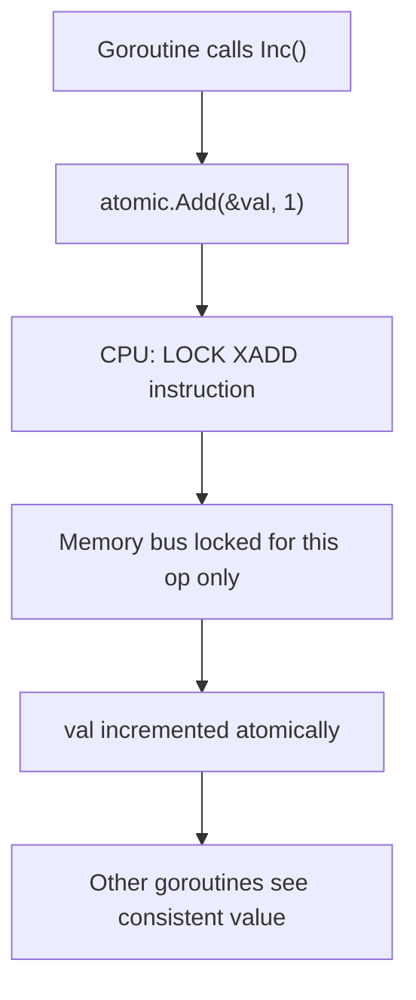
```mermaid
flowchart TD
    A["Goroutine calls Inc()"] --> B["atomic.Add(&val, 1)"]
    B --> C["CPU: LOCK XADD instruction"]
    C --> D["Memory bus locked for this op only"]
    D --> E["val incremented atomically"]
    E --> F["Other goroutines see consistent value"]
```

**Execution Trace:**
```
Input:  3 goroutines, each Inc() once
G1: LOCK XADD → val: 0→1
G2: LOCK XADD → val: 1→2 (serialized at CPU level, not OS)
G3: LOCK XADD → val: 2→3
Output: 3 (guaranteed correct, no mutex needed)
```

### Interviewer Questions

1. Why atomic over mutex for a simple counter?
2. Is `atomic.Int64` faster than `sync.Mutex` in all cases?
3. How does this scale to 10M goroutines?
4. Walk me through the edge case where Load() races with Add().
5. How would you make this a per-goroutine sharded counter?
6. What's the memory model guarantee of atomic operations in Go?
7. How would you benchmark mutex vs atomic to prove your claim?

### Follow-Up Questions

**Q1:** When is a mutex-based counter FASTER than an atomic one?
**A1:** Never for a single counter — atomic always wins. However, if you're updating multiple values together and need them to be consistent as a group, mutex is required (atomic doesn't give you multi-variable transactions).

**Q2:** How do you build a sharded counter for maximum throughput?
**A2:** Create an array of `atomic.Int64` with length = GOMAXPROCS (padded to 64 bytes to avoid false sharing). Each goroutine increments `shards[goroutineID % len(shards)]`. To read total, sum all shards. This eliminates all contention.

```go
type ShardedCounter struct {
    shards [16]struct {
        val atomic.Int64
        _   [56]byte // cache line padding
    }
}
func (c *ShardedCounter) Inc(id int) { c.shards[id%16].val.Add(1) }
func (c *ShardedCounter) Total() int64 {
    var sum int64
    for i := range c.shards { sum += c.shards[i].val.Load() }
    return sum
}
```

**Q3:** What does Go's memory model say about atomic operations?
**A3:** Go guarantees that atomic operations are sequentially consistent — a Load that observes a Store sees all effects that happened before that Store. This is stronger than C++ relaxed atomics, matching `memory_order_seq_cst`.

**Q4:** What is false sharing and how does padding prevent it?
**A4:** False sharing occurs when two variables on the same 64-byte cache line are written by different CPUs — the entire cache line bounces between CPU caches. Adding `[56]byte` padding after each `atomic.Int64` (8 bytes) ensures each counter occupies its own cache line.

**Q5:** How to benchmark mutex vs atomic?
**A5:** Write two `BenchmarkMutexCounter` and `BenchmarkAtomicCounter` functions with `b.RunParallel`. Run with `go test -bench=. -benchmem -cpu=1,2,4,8,16`. Atomic wins grow with core count as mutex contention scales.

---

## Q9: atomic.Bool for Shutdown Flag  [Level 2 — Easy]

> **Tags:** `#atomic.Bool` `#shutdown` `#graceful-termination`

### Problem Statement
Implement a graceful shutdown mechanism for a worker pool using `atomic.Bool`. The main goroutine sets a shutdown flag; worker goroutines check it in their loop and exit cleanly. The flag must be readable without locking in the hot path.

### Input / Output / Constraints

```
Input:  5 worker goroutines running; main calls Shutdown() after 100ms
Output: All workers detect shutdown and exit within 10ms of flag being set

Constraints:
  • Workers must not block after Shutdown() is called
  • Flag check must be lock-free (hot path)
  • No goroutine leaks after shutdown
  • Time limit: 200ms total
```

### Thought Process

Think like a senior Go engineer:
1. **Understand:** Single-writer (main), many-reader (workers) boolean flag — classic atomic.Bool use case.
2. **Pattern:** `atomic.Bool.Store(true)` for set, `atomic.Bool.Load()` for check — no mutex.
3. **Edge cases:** Workers mid-task when shutdown fires; ensure current task completes before exit.
4. **Approach:** `atomic.Bool` (Go 1.19+) is idiomatic; combine with `select` on context for cleaner shutdown.

### Brute Force Solution

```go
package main

import "sync"

// bruteForce — mutex-protected bool, unnecessary overhead for single-writer
var (
    shutdownMu sync.RWMutex
    shutdown   bool
)

func shouldStop() bool {
    shutdownMu.RLock()
    defer shutdownMu.RUnlock()
    return shutdown // over-engineered: atomic.Bool is simpler
}
```

**Time:** O(1) | **Space:** O(1)
**Bottleneck:** RLock overhead in hot path; atomic.Bool has zero lock overhead.

### Better Solution

```go
// betterSolution — atomic bool using sync/atomic package functions
import "sync/atomic"

var shutdown int32

func betterStop() { atomic.StoreInt32(&shutdown, 1) }
func betterCheck() bool { return atomic.LoadInt32(&shutdown) == 1 }
```

**Time:** O(1) | **Space:** O(1)

### Best / Optimal Solution

```go
package main

import (
    "context"
    "fmt"
    "sync"
    "sync/atomic"
    "time"
)

// Worker pool with atomic.Bool shutdown flag and context cancellation.
type WorkerPool struct {
    stopped atomic.Bool
    wg      sync.WaitGroup
}

// Start spawns n workers that process tasks until stopped.
func (p *WorkerPool) Start(ctx context.Context, n int) {
    for i := 0; i < n; i++ {
        p.wg.Add(1)
        go func(id int) {
            defer p.wg.Done()
            p.runWorker(ctx, id)
        }(i)
    }
}

func (p *WorkerPool) runWorker(ctx context.Context, id int) {
    for {
        // Fast path: check atomic flag first (no syscall, no lock)
        if p.stopped.Load() {
            fmt.Printf("worker %d: shutdown detected, exiting\n", id)
            return
        }

        select {
        case <-ctx.Done():
            fmt.Printf("worker %d: context cancelled, exiting\n", id)
            return
        default:
            // Simulate work
            time.Sleep(10 * time.Millisecond)
        }
    }
}

// Shutdown signals all workers to stop and waits for them.
func (p *WorkerPool) Shutdown() {
    p.stopped.Store(true)
    p.wg.Wait()
    fmt.Println("all workers exited cleanly")
}

func main() {
    pool := &WorkerPool{}
    ctx := context.Background()
    pool.Start(ctx, 5)

    time.Sleep(100 * time.Millisecond)
    pool.Shutdown()
}
```

**Time:** O(1) flag check | **Space:** O(n workers)

### Production Considerations

| Aspect | Details |
|--------|---------|
| **Scalability** | atomic.Bool check is a single CPU instruction; scales to millions of goroutines |
| **Edge Cases** | Worker mid-task when shutdown fires: task completes, then worker checks flag and exits |
| **Error Handling** | Combine with context for timeout-based forced shutdown |
| **Memory** | 1 byte for atomic.Bool (internally uint32 for alignment); zero value = false |
| **Concurrency** | Store is sequentially consistent — workers will see the shutdown flag within one memory cycle |

### Visual Explanation

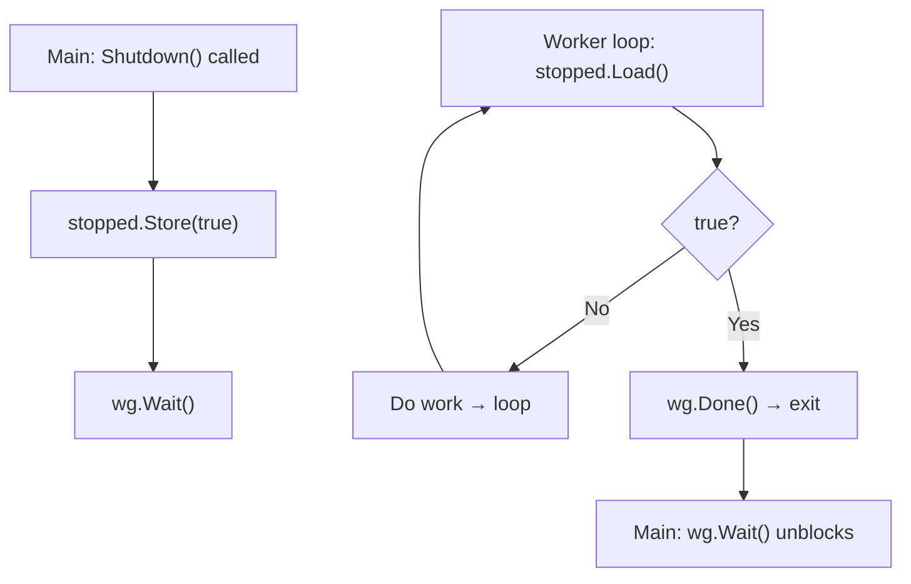
```mermaid
flowchart TD
    A["Main: Shutdown() called"] --> B["stopped.Store(true)"]
    B --> C["wg.Wait()"]
    D["Worker loop: stopped.Load()"] --> E{"true?"}
    E -->|"No"| F["Do work → loop"]
    F --> D
    E -->|"Yes"| G["wg.Done() → exit"]
    G --> H["Main: wg.Wait() unblocks"]
```

**Execution Trace:**
```
t=0ms:   5 workers start, stopped=false
t=100ms: Shutdown() → stopped.Store(true)
t=110ms: Each worker's next loop iteration: stopped.Load()=true → exit
t=110ms: All wg.Done() called → Shutdown() returns
```

### Interviewer Questions

1. Why atomic.Bool over a channel for shutdown signaling?
2. What if a worker is mid-task and can't check the flag for 30 seconds?
3. How does this scale to 10K workers?
4. Walk me through the ordering guarantee of atomic.Store/Load.
5. How would you force-kill stuck workers?
6. What's the difference between atomic.Bool and a plain bool with a mutex?
7. How would you test clean shutdown under load?

### Follow-Up Questions

**Q1:** When should you use a channel for shutdown instead of atomic.Bool?
**A1:** Use a channel (`done chan struct{}`) when workers need to `select` over multiple signals simultaneously (e.g., new task OR shutdown). `close(done)` broadcasts to all receivers. atomic.Bool is better for non-blocking hot-path checks.

**Q2:** How do you force-kill workers that ignore the shutdown flag?
**A2:** Pass a context with deadline: `ctx, cancel := context.WithTimeout(parent, 30*time.Second)`. Workers `select` on `ctx.Done()`. If they don't exit in 30s, cancel fires and they exit via context.

**Q3:** Is there a race between stopped.Store() and workers reading stopped.Load()?
**A3:** No — atomic operations are sequentially consistent. After Store(true) returns, any subsequent Load() in any goroutine is guaranteed to return true. There's no window where a goroutine can miss the flag after Store returns.

**Q4:** How does atomic.Bool work on 32-bit architectures?
**A4:** `atomic.Bool` stores a uint32 internally (not uint8) to ensure 32-bit alignment required for atomic operations. On 32-bit ARM/x86, 64-bit atomics need 8-byte alignment; 32-bit atomics need 4-byte alignment.

**Q5:** How to test that no goroutines leak after Shutdown()?
**A5:** Use the `goleak` library: `defer goleak.VerifyNone(t)`. It captures goroutine count at test start and end, failing if any goroutines remain. Also use `runtime.NumGoroutine()` before and after.

---

## Q10: Mutex vs Channel Comparison  [Level 3 — Medium]

> **Tags:** `#mutex-vs-channel` `#design-choice` `#idiomatic-go`

### Problem Statement
Implement the same rate limiter using two approaches: (1) `sync.Mutex` protecting shared state, (2) goroutine + channel for ownership transfer. Demonstrate when each is appropriate. The rate limiter allows N requests per second.

### Input / Output / Constraints

```
Input:  rate=10 req/s, 50 requests arriving over 3 seconds
Output: requests within rate limit pass; excess requests are rejected or queued

Constraints:
  • Rate: 1 ≤ N ≤ 10⁶ req/s
  • Both implementations must be goroutine-safe
  • Time limit: 5s for test
```

### Thought Process

Think like a senior Go engineer:
1. **Understand:** Rate limiter with concurrent access — state is a token count and last-refill time.
2. **Pattern:** Mutex for shared-state mutation; channel for communicating ownership/events.
3. **Edge cases:** Token bucket negative tokens, burst handling, timer drift.
4. **Approach:** Show both implementations and articulate the trade-offs explicitly.

### Brute Force Solution

```go
package main

import "time"

// bruteForce — global sleep-based rate limit, not goroutine-safe
var lastRequest time.Time

func bruteAllow() bool {
    if time.Since(lastRequest) < 100*time.Millisecond {
        return false // race: lastRequest read/write unsynchronized
    }
    lastRequest = time.Now()
    return true
}
```

**Time:** O(1) | **Space:** O(1)
**Bottleneck:** Data race on lastRequest; not a proper token bucket.

### Better Solution

```go
// Mutex-based token bucket
import (
    "sync"
    "time"
)

type MutexLimiter struct {
    mu     sync.Mutex
    tokens float64
    rate   float64 // tokens per second
    last   time.Time
}

func (l *MutexLimiter) Allow() bool {
    l.mu.Lock()
    defer l.mu.Unlock()
    now := time.Now()
    elapsed := now.Sub(l.last).Seconds()
    l.tokens = min(l.rate, l.tokens+elapsed*l.rate)
    l.last = now
    if l.tokens >= 1 {
        l.tokens--
        return true
    }
    return false
}

func min(a, b float64) float64 { if a < b { return a }; return b }
```

**Time:** O(1) | **Space:** O(1)

### Best / Optimal Solution

```go
package main

import (
    "fmt"
    "sync"
    "time"
)

// --- Approach 1: Mutex-based (good for shared state with complex logic) ---

type MutexRateLimiter struct {
    mu     sync.Mutex
    tokens float64
    rate   float64
    max    float64
    last   time.Time
}

func NewMutexLimiter(rate float64) *MutexRateLimiter {
    return &MutexRateLimiter{rate: rate, max: rate, tokens: rate, last: time.Now()}
}

func (l *MutexRateLimiter) Allow() bool {
    l.mu.Lock()
    defer l.mu.Unlock()
    now := time.Now()
    l.tokens = min64(l.max, l.tokens+now.Sub(l.last).Seconds()*l.rate)
    l.last = now
    if l.tokens >= 1 {
        l.tokens--
        return true
    }
    return false
}

func min64(a, b float64) float64 {
    if a < b {
        return a
    }
    return b
}

// --- Approach 2: Channel-based (good for communicating between goroutines) ---

type ChanRateLimiter struct {
    tokens chan struct{}
    quit   chan struct{}
}

func NewChanLimiter(rate int) *ChanRateLimiter {
    l := &ChanRateLimiter{
        tokens: make(chan struct{}, rate),
        quit:   make(chan struct{}),
    }
    // Fill initial tokens
    for i := 0; i < rate; i++ {
        l.tokens <- struct{}{}
    }
    // Refill goroutine: add one token per (1/rate) seconds
    go func() {
        ticker := time.NewTicker(time.Second / time.Duration(rate))
        defer ticker.Stop()
        for {
            select {
            case <-ticker.C:
                select {
                case l.tokens <- struct{}{}: // add token if not full
                default: // buffer full, discard
                }
            case <-l.quit:
                return
            }
        }
    }()
    return l
}

func (l *ChanRateLimiter) Allow() bool {
    select {
    case <-l.tokens:
        return true
    default:
        return false
    }
}

func (l *ChanRateLimiter) Stop() { close(l.quit) }

func main() {
    fmt.Println("=== Mutex-based Rate Limiter ===")
    ml := NewMutexLimiter(5) // 5 req/s
    var wg sync.WaitGroup
    for i := 0; i < 10; i++ {
        wg.Add(1)
        go func(id int) {
            defer wg.Done()
            if ml.Allow() {
                fmt.Printf("request %d: ALLOWED\n", id)
            } else {
                fmt.Printf("request %d: DENIED\n", id)
            }
        }(i)
    }
    wg.Wait()

    fmt.Println("\n=== Channel-based Rate Limiter ===")
    cl := NewChanLimiter(5)
    defer cl.Stop()
    for i := 0; i < 10; i++ {
        if cl.Allow() {
            fmt.Printf("request %d: ALLOWED\n", i)
        } else {
            fmt.Printf("request %d: DENIED\n", i)
        }
    }
}
```

**Time:** O(1) per Allow() | **Space:** O(rate) for channel buffer

### Production Considerations

| Aspect | Details |
|--------|---------|
| **Scalability** | Mutex: contention at high RPS; Channel: goroutine overhead but natural backpressure |
| **Edge Cases** | Clock skew (monotonic clock via time.Since); burst exceeding max tokens |
| **Error Handling** | Both return bool; callers decide to reject or queue |
| **Memory** | Mutex: O(1); Channel: O(rate) buffer |
| **Concurrency** | Both are goroutine-safe; mutex is simpler; channel enables `select` integration |

### Visual Explanation

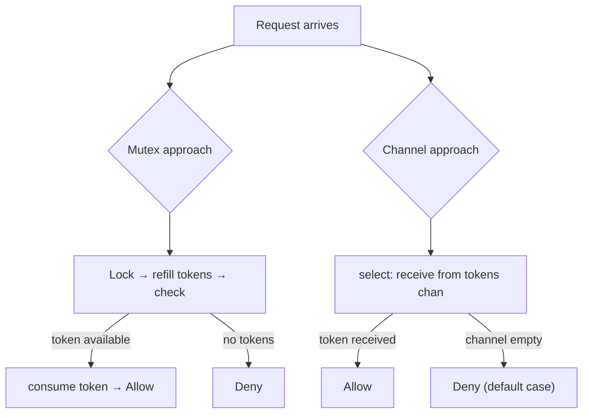
```mermaid
flowchart TD
    A["Request arrives"] --> B{"Mutex approach"}
    B --> C["Lock → refill tokens → check"]
    C -->|"token available"| D["consume token → Allow"]
    C -->|"no tokens"| E["Deny"]

    A --> F{"Channel approach"}
    F --> G["select: receive from tokens chan"]
    G -->|"token received"| H["Allow"]
    G -->|"channel empty"| I["Deny (default case)"]
```

**Execution Trace:**
```
Mutex: rate=5, t=0: tokens=5
  req1: Lock, tokens=5→4, Allow
  req5: Lock, tokens=1→0, Allow
  req6: Lock, tokens=0, Deny
Channel: initial 5 tokens buffered
  req1-5: receive token → Allow
  req6: channel empty → Deny (default)
```

### Interviewer Questions

1. When would you choose mutex over channel for this problem?
2. What are the trade-offs between the two approaches?
3. How does the channel approach scale to 10M req/s?
4. Walk me through the token refill race condition in the channel approach.
5. How would you make the mutex approach non-blocking?
6. What's the GC impact of the channel approach?
7. How would you test both implementations for correctness?

### Follow-Up Questions

**Q1:** What is Go's guiding principle for choosing mutex vs channel?
**A1:** "Use channels to communicate; use mutexes to protect." Channels are for ownership transfer and signaling between goroutines. Mutexes are for protecting shared data structures with complex invariants. If you're thinking "protect this variable," use mutex. If thinking "send this data to that goroutine," use channel.

**Q2:** Which is faster for a simple counter: mutex or channel?
**A2:** Mutex (and especially atomic) is faster for counters. Channels involve goroutine scheduling, memory allocation for the channel struct, and send/receive synchronization. A mutex lock/unlock is 2 atomic operations; channel send/receive is ~5-10 operations.

**Q3:** How does `golang.org/x/time/rate` implement rate limiting?
**A3:** It uses a token bucket with a `sync.Mutex` protecting the token count and last event time. It also supports `Reserve()` (wait for a token) and `Wait(ctx)` (block until token available or context cancelled), which are hard to implement cleanly with channels.

**Q4:** When do channels outperform mutexes?
**A4:** When goroutines need to synchronize AND transfer data simultaneously. Channel send is both a lock and a data transfer; mutex requires a separate copy. For pipeline patterns, fan-out/fan-in, and event-driven systems, channels are both cleaner and faster.

**Q5:** How would you test rate limiter correctness?
**A5:** (1) Burst test: send N requests at once; exactly rate requests should be allowed. (2) Steady-state test: send requests at exactly the rate; all should be allowed. (3) Race test: `-race` flag with concurrent callers. (4) Time-based test: over 10 seconds at rate=10, exactly 100 requests allowed.

---

## Q11: Concurrent-Safe Queue  [Level 3 — Medium]

> **Tags:** `#concurrent-queue` `#sync.Mutex` `#data-structures`

### Problem Statement
Implement a goroutine-safe FIFO queue supporting concurrent `Enqueue` and `Dequeue` operations. The queue should not block (non-blocking Dequeue returns ok=false if empty). Use fine-grained locking to maximize throughput.

### Input / Output / Constraints

```
Input:  100 producers enqueuing, 100 consumers dequeuing concurrently
Output: Every enqueued item is dequeued exactly once; no panics, no data loss

Constraints:
  • Unbounded capacity
  • Dequeue is non-blocking (returns ok=false if empty)
  • Must pass go test -race
  • Time limit: 2s
```

### Thought Process

Think like a senior Go engineer:
1. **Understand:** Concurrent FIFO queue — standard slice-based queue with mutex protection.
2. **Pattern:** Embed `sync.Mutex` in struct; use slice as underlying buffer; head pointer to avoid O(n) shifts.
3. **Edge cases:** Dequeue on empty queue, single-element queue, concurrent empty check.
4. **Approach:** Circular buffer with mutex is O(1) enqueue/dequeue; simpler slice with head index also works.

### Brute Force Solution

```go
package main

import "sync"

// bruteForce — simple slice queue, O(n) dequeue due to shifting
type BruteQueue struct {
    mu   sync.Mutex
    data []interface{}
}

func (q *BruteQueue) Enqueue(v interface{}) {
    q.mu.Lock()
    q.data = append(q.data, v)
    q.mu.Unlock()
}

func (q *BruteQueue) Dequeue() (interface{}, bool) {
    q.mu.Lock()
    defer q.mu.Unlock()
    if len(q.data) == 0 {
        return nil, false
    }
    v := q.data[0]
    q.data = q.data[1:] // O(n) shift — bad for large queues
    return v, true
}
```

**Time:** O(n) dequeue due to shift | **Space:** O(n)
**Bottleneck:** Slice shift on dequeue is O(n); memory never reclaimed for drained prefix.

### Better Solution

```go
// betterSolution — head index avoids shifting, O(1) dequeue
type BetterQueue struct {
    mu   sync.Mutex
    data []interface{}
    head int
}

func (q *BetterQueue) Enqueue(v interface{}) {
    q.mu.Lock()
    q.data = append(q.data, v)
    q.mu.Unlock()
}

func (q *BetterQueue) Dequeue() (interface{}, bool) {
    q.mu.Lock()
    defer q.mu.Unlock()
    if q.head >= len(q.data) {
        return nil, false
    }
    v := q.data[q.head]
    q.data[q.head] = nil // GC help
    q.head++
    return v, true
}
```

**Time:** O(1) amortized | **Space:** O(n)

### Best / Optimal Solution

```go
package main

import (
    "fmt"
    "sync"
    "sync/atomic"
)

// node for linked-list queue (lock-free friendly structure)
type node[T any] struct {
    val  T
    next atomic.Pointer[node[T]]
}

// SafeQueue — goroutine-safe lock-free queue using Michael-Scott algorithm variant.
// Uses separate head/tail locks for higher throughput than single mutex.
type SafeQueue[T any] struct {
    headMu sync.Mutex
    tailMu sync.Mutex
    head   *node[T] // sentinel node
    tail   *node[T]
    length atomic.Int64
}

func NewSafeQueue[T any]() *SafeQueue[T] {
    sentinel := &node[T]{}
    return &SafeQueue[T]{head: sentinel, tail: sentinel}
}

// Enqueue adds an item to the tail. O(1), goroutine-safe.
func (q *SafeQueue[T]) Enqueue(val T) {
    n := &node[T]{val: val}
    q.tailMu.Lock()
    q.tail.next.Store(n)
    q.tail = n
    q.tailMu.Unlock()
    q.length.Add(1)
}

// Dequeue removes an item from the head. Returns (zero, false) if empty.
func (q *SafeQueue[T]) Dequeue() (T, bool) {
    q.headMu.Lock()
    sentinel := q.head
    first := sentinel.next.Load()
    if first == nil {
        q.headMu.Unlock()
        var zero T
        return zero, false
    }
    q.head = first
    q.headMu.Unlock()
    q.length.Add(-1)
    return first.val, true
}

// Len returns approximate queue length (may be stale under contention).
func (q *SafeQueue[T]) Len() int64 {
    return q.length.Load()
}

func main() {
    q := NewSafeQueue[int]()
    var wg sync.WaitGroup

    // 100 producers
    for i := 0; i < 100; i++ {
        wg.Add(1)
        go func(v int) {
            defer wg.Done()
            q.Enqueue(v)
        }(i)
    }
    wg.Wait()

    // 100 consumers
    consumed := 0
    for i := 0; i < 100; i++ {
        if _, ok := q.Dequeue(); ok {
            consumed++
        }
    }
    fmt.Printf("Produced: 100, Consumed: %d\n", consumed)
}
```

**Time:** O(1) enqueue/dequeue | **Space:** O(n)

### Production Considerations

| Aspect | Details |
|--------|---------|
| **Scalability** | Two-lock queue: enqueue and dequeue can proceed concurrently; doubles throughput |
| **Edge Cases** | Empty dequeue returns zero value; single-element: head == tail after dequeue |
| **Error Handling** | Return (T, bool); never panic on empty |
| **Memory** | Linked list: each node is a heap allocation; consider object pool for high-throughput |
| **Concurrency** | Two separate mutexes allow enqueue+dequeue to run in parallel — unlike single mutex |

### Visual Explanation

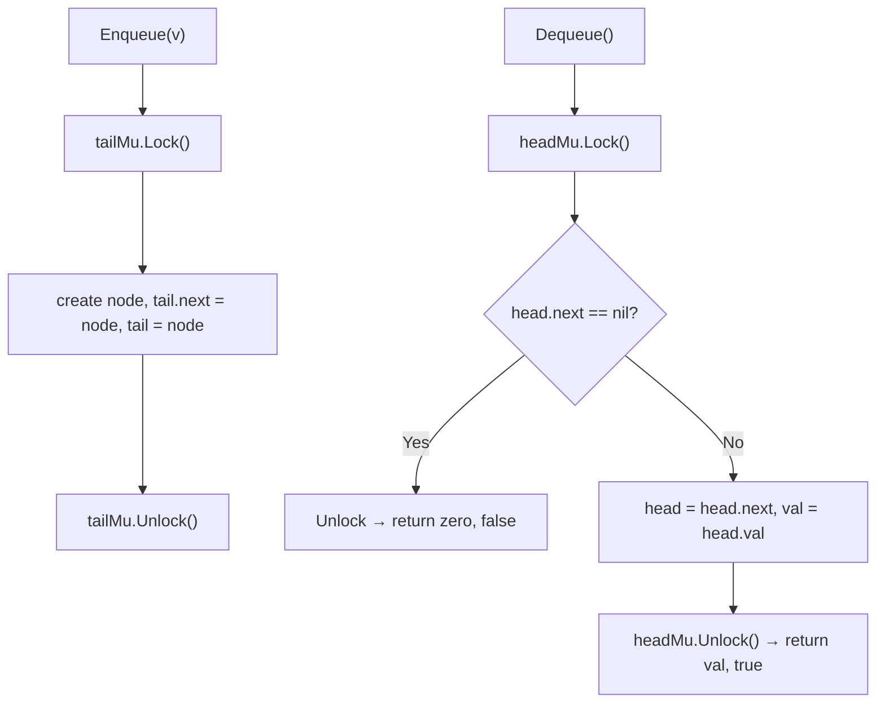
```mermaid
flowchart TD
    A["Enqueue(v)"] --> B["tailMu.Lock()"]
    B --> C["create node, tail.next = node, tail = node"]
    C --> D["tailMu.Unlock()"]

    E["Dequeue()"] --> F["headMu.Lock()"]
    F --> G{"head.next == nil?"}
    G -->|"Yes"| H["Unlock → return zero, false"]
    G -->|"No"| I["head = head.next, val = head.val"]
    I --> J["headMu.Unlock() → return val, true"]
```

**Execution Trace:**
```
Initial: sentinel → nil
Enqueue(1): sentinel → [1] → nil; tail=[1]
Enqueue(2): sentinel → [1] → [2] → nil; tail=[2]
Dequeue(): head=sentinel→[1]; return 1; head=[1]
Dequeue(): head=[1]→[2]; return 2; head=[2]
Dequeue(): head=[2]→nil; return zero, false
```

### Interviewer Questions

1. Why two separate mutexes instead of one?
2. How does this compare to a channel-based queue?
3. How does this scale to 10M enqueue/dequeue ops/sec?
4. Walk me through the sentinel node pattern and why it's needed.
5. How would you make this fully lock-free?
6. What's the memory overhead per element vs slice-based queue?
7. How would you test this with -race and property-based testing?

### Follow-Up Questions

**Q1:** How does Go's built-in channel compare to this queue?
**A1:** Channels have built-in synchronization, backpressure (buffered), and `select` integration. This queue is faster for high-throughput scenarios without backpressure needs. Channels are idiomatic; custom queues are for specialized performance requirements.

**Q2:** What is the ABA problem in lock-free queues?
**A2:** In CAS-based lock-free queues, a pointer can change from A→B→A between CAS read and write, making the CAS succeed incorrectly. Go's GC eliminates this — freed memory is never immediately reused at the same address, so ABA cannot occur without unsafe pointer reuse.

**Q3:** How would you implement a priority queue variant?
**A3:** Replace the linked list with `container/heap`. Single mutex is fine (can't split enqueue/dequeue with a heap). Or use a skip list for concurrent ordered access without a single mutex.

**Q4:** How do you drain the queue on shutdown?
**A4:** Signal producers to stop (atomic.Bool), then drain: `for item, ok := q.Dequeue(); ok; item, ok = q.Dequeue() { process(item) }`. Use WaitGroup to wait for all producers before draining.

**Q5:** How to test queue ordering and correctness?
**A5:** (1) Sequential test: enqueue 1..N, dequeue, verify FIFO order. (2) Concurrent producer-consumer test with itemized tracking: enqueue unique IDs, verify each consumed exactly once using a sync.Map for tracking. (3) Run with `-race`.

---

## Q12: Thread-Safe Linked List  [Level 4 — Advanced]

> **Tags:** `#linked-list` `#fine-grained-locking` `#concurrent-data-structures`

### Problem Statement
Implement a goroutine-safe singly linked list with `Insert`, `Delete`, and `Contains` operations. Use per-node locking (hand-over-hand locking) to allow concurrent operations on non-overlapping regions of the list. The list maintains sorted order.

### Input / Output / Constraints

```
Input:  Concurrent Insert(1,3,5,7), Delete(3), Contains(5)
Output: List contains [1,5,7]; Contains(5)=true; Delete(3) removes node 3

Constraints:
  • Values: int, sorted ascending
  • No global lock (must support concurrent non-overlapping ops)
  • Must pass go test -race
  • Time limit: 2s
```

### Thought Process

Think like a senior Go engineer:
1. **Understand:** Concurrent linked list — need to lock two adjacent nodes during insert/delete.
2. **Pattern:** Hand-over-hand (lock coupling) — lock current, lock next, unlock current, advance.
3. **Edge cases:** Insert at head, delete head node, empty list, duplicate values.
4. **Approach:** Each node has its own mutex; lock two adjacent nodes during structural changes.

### Brute Force Solution

```go
package main

import "sync"

// bruteForce — single global mutex, no concurrency on list ops
type BruteList struct {
    mu   sync.Mutex
    head *BruteNode
}
type BruteNode struct{ val int; next *BruteNode }

func (l *BruteList) Insert(v int) {
    l.mu.Lock()
    defer l.mu.Unlock()
    // ... insert logic
}
```

**Time:** O(n) per op | **Space:** O(n)
**Bottleneck:** Single global lock — all operations serialized, no parallelism.

### Better Solution

```go
// betterSolution — per-node RWMutex (still requires locking two nodes for insert)
type LNode struct {
    mu   sync.RWMutex
    val  int
    next *LNode
}
```

**Time:** O(n) traverse, concurrent non-overlapping ops | **Space:** O(n)

### Best / Optimal Solution

```go
package main

import (
    "fmt"
    "sync"
)

// listNode — each node has its own mutex for hand-over-hand locking.
type listNode struct {
    mu   sync.Mutex
    val  int
    next *listNode
}

// ConcurrentList — sorted linked list with hand-over-hand locking.
// Allows concurrent operations on non-overlapping regions.
type ConcurrentList struct {
    head *listNode // sentinel head (val = MinInt)
}

func NewConcurrentList() *ConcurrentList {
    return &ConcurrentList{head: &listNode{val: -1 << 62}} // sentinel
}

// Insert inserts val in sorted order. Ignores duplicates.
func (l *ConcurrentList) Insert(val int) {
    l.head.mu.Lock()
    prev := l.head
    curr := prev.next

    // Hand-over-hand: lock curr before releasing prev
    for curr != nil {
        curr.mu.Lock()
        if curr.val >= val {
            break
        }
        prev.mu.Unlock()
        prev = curr
        curr = curr.next
        if curr != nil {
            // will lock at top of loop
        }
    }

    if curr == nil || curr.val != val {
        n := &listNode{val: val, next: curr}
        prev.next = n
    }

    if curr != nil {
        curr.mu.Unlock()
    }
    prev.mu.Unlock()
}

// Delete removes the first node with the given value. Returns true if found.
func (l *ConcurrentList) Delete(val int) bool {
    l.head.mu.Lock()
    prev := l.head
    curr := prev.next

    for curr != nil {
        curr.mu.Lock()
        if curr.val == val {
            prev.next = curr.next
            curr.mu.Unlock()
            prev.mu.Unlock()
            return true
        }
        if curr.val > val {
            curr.mu.Unlock()
            prev.mu.Unlock()
            return false
        }
        prev.mu.Unlock()
        prev = curr
        curr = curr.next
    }
    prev.mu.Unlock()
    return false
}

// Contains returns true if val is in the list.
func (l *ConcurrentList) Contains(val int) bool {
    l.head.mu.Lock()
    prev := l.head
    curr := prev.next

    for curr != nil {
        curr.mu.Lock()
        if curr.val == val {
            curr.mu.Unlock()
            prev.mu.Unlock()
            return true
        }
        if curr.val > val {
            curr.mu.Unlock()
            prev.mu.Unlock()
            return false
        }
        prev.mu.Unlock()
        prev = curr
        curr = curr.next
    }
    prev.mu.Unlock()
    return false
}

// Values returns all values (for testing; acquires global lock via head).
func (l *ConcurrentList) Values() []int {
    l.head.mu.Lock()
    defer l.head.mu.Unlock()
    var vals []int
    curr := l.head.next
    for curr != nil {
        vals = append(vals, curr.val)
        curr = curr.next
    }
    return vals
}

func main() {
    list := NewConcurrentList()
    var wg sync.WaitGroup

    for _, v := range []int{5, 3, 7, 1} {
        wg.Add(1)
        go func(val int) {
            defer wg.Done()
            list.Insert(val)
        }(v)
    }
    wg.Wait()

    list.Delete(3)
    fmt.Println("Contains(5):", list.Contains(5))  // true
    fmt.Println("Contains(3):", list.Contains(3))  // false
    fmt.Println("Values:", list.Values())           // [1 5 7]
}
```

**Time:** O(n) per op | **Space:** O(n)

### Production Considerations

| Aspect | Details |
|--------|---------|
| **Scalability** | Concurrent inserts/deletes to different regions proceed in parallel; head is still a bottleneck |
| **Edge Cases** | Empty list (sentinel-only), insert at head, delete nonexistent value, duplicate insert |
| **Error Handling** | Delete returns bool; no panics; sentinel prevents nil head dereference |
| **Memory** | Each node has a sync.Mutex (8 bytes overhead); 3× memory vs plain linked list |
| **Concurrency** | Lock ordering (prev before curr) prevents deadlock; always acquire in list order |

### Visual Explanation

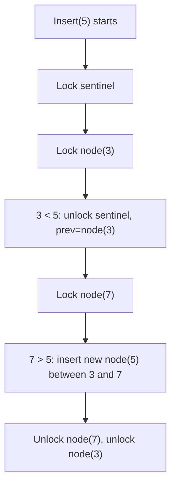
```mermaid
flowchart TD
    A["Insert(5) starts"] --> B["Lock sentinel"]
    B --> C["Lock node(3)"]
    C --> D["3 < 5: unlock sentinel, prev=node(3)"]
    D --> E["Lock node(7)"]
    E --> F["7 > 5: insert new node(5) between 3 and 7"]
    F --> G["Unlock node(7), unlock node(3)"]
```

**Execution Trace:**
```
List: sentinel → [3] → [7]
Insert(5):
  Lock sentinel, Lock [3]: 3<5 → unlock sentinel, prev=[3]
  Lock [7]: 7>5 → insert [5] between [3] and [7]
  Unlock [7], unlock [3]
Result: sentinel → [3] → [5] → [7]
```

### Interviewer Questions

1. Why hand-over-hand locking over a single global lock?
2. How does lock ordering prevent deadlock here?
3. How does this scale compared to a skip list?
4. Walk me through the delete operation when the target is the first real node.
5. How would you make Contains lock-free?
6. What's the memory overhead per node?
7. How would you test correctness under high concurrent insert/delete?

### Follow-Up Questions

**Q1:** What is hand-over-hand (lock coupling) locking?
**A1:** Each thread holds two adjacent node locks simultaneously — "prev" and "curr." Before releasing prev, it acquires curr's lock. This prevents other threads from modifying the link between prev and curr, ensuring structural safety during traversal.

**Q2:** How would you implement a lock-free linked list?
**A2:** Use `atomic.Pointer[node]` for next pointers. CAS (compare-and-swap) atomically updates next if it hasn't changed. Mark nodes for logical deletion before physical removal. This is the Harris lock-free list algorithm — complex but achieves maximum concurrency.

**Q3:** When would you use a skip list instead?
**A3:** A skip list (like `sync.Map` internals) provides O(log n) operations with fine-grained locking. Linked list is O(n). For sorted sets with millions of elements and high concurrency, skip list wins. For small datasets or pointer-following patterns, linked list is simpler.

**Q4:** How do you ensure no deadlock in hand-over-hand locking?
**A4:** Always acquire locks in the same order (head → tail). Never lock a node that comes before a node you already hold. Since all threads traverse in the same direction, circular wait is impossible.

**Q5:** How to stress-test this concurrent linked list?
**A5:** Run 10 goroutines doing random Insert/Delete/Contains for 10 seconds. After stopping, verify the list is sorted and contains exactly the expected set of values. Use `-race`. Also verify all values are in range and no duplicates exist.

---

## Q13: Read-Write Locked Map Implementation  [Level 4 — Advanced]

> **Tags:** `#RWMutex` `#custom-map` `#generic-cache`

### Problem Statement
Implement a generic, goroutine-safe TTL cache backed by a `sync.RWMutex`-protected map. The cache supports `Get`, `Set`, and automatic expiration. A background goroutine sweeps expired entries periodically. This is a production-grade in-memory cache without external dependencies.

### Input / Output / Constraints

```
Input:  Set("key", value, 5*time.Second), Get("key") within 5s, Get("key") after 5s
Output: Get returns (value, true) within TTL; (zero, false) after expiry

Constraints:
  • 1 ≤ concurrent readers ≤ 10⁴
  • TTL: 1ms to 1 hour
  • Sweep interval: configurable
  • Must not leak goroutines
  • Time limit: per-op O(1)
```

### Thought Process

Think like a senior Go engineer:
1. **Understand:** TTL cache needs a map protected by RWMutex; expiry needs background sweep or lazy eviction.
2. **Pattern:** RWMutex for concurrent reads; write lock only for Set/Delete; lazy TTL check in Get + background sweep.
3. **Edge cases:** Expired key read, sweep while Set in progress, graceful stop of sweep goroutine.
4. **Approach:** Combine lazy eviction (in Get) with background sweep to balance freshness vs overhead.

### Brute Force Solution

```go
package main

import (
    "sync"
    "time"
)

// bruteForce — no TTL, no sweep, plain protected map
type BruteCache struct {
    mu   sync.RWMutex
    data map[string]interface{}
}
func (c *BruteCache) Get(k string) (interface{}, bool) {
    c.mu.RLock()
    defer c.mu.RUnlock()
    v, ok := c.data[k]
    return v, ok
}
```

**Time:** O(1) | **Space:** O(n)
**Bottleneck:** No TTL support; memory grows unbounded; stale data served forever.

### Better Solution

```go
// betterSolution — lazy TTL eviction on Get, no background sweep
type entry struct {
    val     interface{}
    expires time.Time
}

func (c *BetterCache) Get(k string) (interface{}, bool) {
    c.mu.RLock()
    e, ok := c.data[k]
    c.mu.RUnlock()
    if !ok || time.Now().After(e.expires) {
        return nil, false
    }
    return e.val, true
}
```

**Time:** O(1) | **Space:** O(n) — expired entries not removed until overwritten

### Best / Optimal Solution

```go
package main

import (
    "context"
    "fmt"
    "sync"
    "time"
)

type cacheEntry[V any] struct {
    val     V
    expires time.Time
}

// TTLCache — generic goroutine-safe TTL cache.
// Combines lazy eviction (Get) with background sweep for memory control.
type TTLCache[K comparable, V any] struct {
    mu      sync.RWMutex
    data    map[K]cacheEntry[V]
    cancel  context.CancelFunc
    sweepWg sync.WaitGroup
}

func NewTTLCache[K comparable, V any](sweepInterval time.Duration) *TTLCache[K, V] {
    ctx, cancel := context.WithCancel(context.Background())
    c := &TTLCache[K, V]{
        data:   make(map[K]cacheEntry[V]),
        cancel: cancel,
    }
    c.sweepWg.Add(1)
    go c.sweep(ctx, sweepInterval)
    return c
}

// Set stores key→value with a given TTL.
func (c *TTLCache[K, V]) Set(key K, val V, ttl time.Duration) {
    c.mu.Lock()
    defer c.mu.Unlock()
    c.data[key] = cacheEntry[V]{val: val, expires: time.Now().Add(ttl)}
}

// Get returns the value if present and not expired.
func (c *TTLCache[K, V]) Get(key K) (V, bool) {
    c.mu.RLock()
    e, ok := c.data[key]
    c.mu.RUnlock()
    if !ok || time.Now().After(e.expires) {
        var zero V
        return zero, false
    }
    return e.val, true
}

// Delete removes a key immediately.
func (c *TTLCache[K, V]) Delete(key K) {
    c.mu.Lock()
    delete(c.data, key)
    c.mu.Unlock()
}

// sweep runs in background, removing expired entries.
func (c *TTLCache[K, V]) sweep(ctx context.Context, interval time.Duration) {
    defer c.sweepWg.Done()
    ticker := time.NewTicker(interval)
    defer ticker.Stop()
    for {
        select {
        case <-ticker.C:
            now := time.Now()
            c.mu.Lock()
            for k, e := range c.data {
                if now.After(e.expires) {
                    delete(c.data, k)
                }
            }
            c.mu.Unlock()
        case <-ctx.Done():
            return
        }
    }
}

// Stop gracefully shuts down the background sweep goroutine.
func (c *TTLCache[K, V]) Stop() {
    c.cancel()
    c.sweepWg.Wait()
}

func main() {
    cache := NewTTLCache[string, int](500 * time.Millisecond)
    defer cache.Stop()

    cache.Set("foo", 42, 1*time.Second)

    if v, ok := cache.Get("foo"); ok {
        fmt.Println("Got:", v) // 42
    }

    time.Sleep(1100 * time.Millisecond)

    if _, ok := cache.Get("foo"); !ok {
        fmt.Println("Expired — key not found") // as expected
    }
}
```

**Time:** O(1) Get/Set, O(n) sweep | **Space:** O(n live entries)

### Production Considerations

| Aspect | Details |
|--------|---------|
| **Scalability** | Sharded caches (N independent TTLCache instances, key%N routing) for 10M+ entries |
| **Edge Cases** | Zero TTL evicts immediately; negative TTL panics — validate in Set |
| **Error Handling** | Return (zero, false) for expired/missing; Stop() blocks until sweep exits |
| **Memory** | Sweep releases expired memory to GC; without sweep, lazy eviction leaves memory until overwrite |
| **Concurrency** | Write lock only held during sweep (brief per entry); reads fully concurrent |

### Visual Explanation

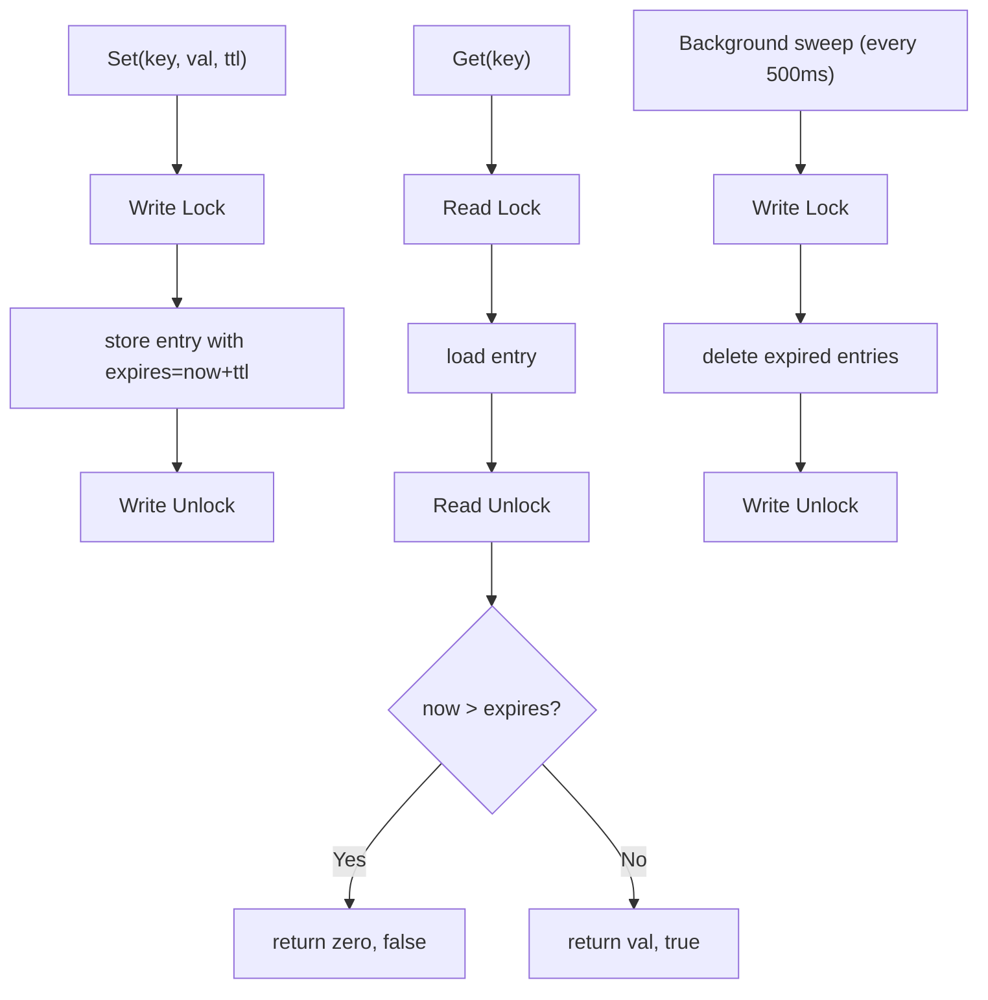
```mermaid
flowchart TD
    A["Set(key, val, ttl)"] --> B["Write Lock"]
    B --> C["store entry with expires=now+ttl"]
    C --> D["Write Unlock"]

    E["Get(key)"] --> F["Read Lock"]
    F --> G["load entry"]
    G --> H["Read Unlock"]
    H --> I{"now > expires?"}
    I -->|"Yes"| J["return zero, false"]
    I -->|"No"| K["return val, true"]

    L["Background sweep (every 500ms)"] --> M["Write Lock"]
    M --> N["delete expired entries"]
    N --> O["Write Unlock"]
```

**Execution Trace:**
```
t=0s:    Set("foo", 42, 1s) → expires=1s
t=0.5s:  Get("foo") → 0.5s < 1s → return 42, true
t=1.1s:  Get("foo") → 1.1s > 1s → return 0, false
t=1.0s:  sweep runs → deletes "foo" from map
```

### Interviewer Questions

1. Why both lazy eviction and background sweep?
2. How would you shard this cache to reduce lock contention?
3. How does this scale to 10M entries?
4. Walk me through a race condition in the sweep goroutine.
5. How would you add a maximum capacity (eviction policy)?
6. What's the GC pressure from deleting map entries?
7. How would you test TTL accuracy?

### Follow-Up Questions

**Q1:** How would you add LRU eviction when the cache is full?
**A1:** Add a `container/list` for LRU ordering. On Get, move element to front. On Set when at capacity, remove the back element. Protect the list with the same write mutex. Or use a ready-made `groupcache/lru` package.

**Q2:** How do you handle concurrent Set and sweep for the same key?
**A2:** Both require the write lock — they are fully serialized. If sweep deletes key K while Set is acquiring the lock, Set will re-insert K after sweep. The only correctness concern is if sweep checks expiry between Set locking and updating expires — but sweep holds the write lock for the entire delete, preventing this.

**Q3:** What is the memory impact of Go map deletions?
**A3:** `delete(m, k)` removes the entry but does NOT shrink the underlying hash table bucket array. Memory is reclaimed by GC for the key/value, but the map's bucket memory stays allocated. For maps that grow large then shrink, consider rebuilding: `newMap := make(map[K]V, len(oldMap)); for k,v := range oldMap { newMap[k] = v }`.

**Q4:** How would you make this cache distributed?
**A4:** Add a consistent-hash ring to route keys to nodes. Each node runs this TTLCache locally. Use gRPC for cross-node Get/Set. For invalidation, broadcast deletes to all nodes (fan-out) or use a message bus like Redis pub/sub.

**Q5:** How to test TTL accuracy under load?
**A5:** Set a key with TTL=100ms. Spawn 100 goroutines doing Get in a loop. Verify: (1) all Gets succeed before 100ms, (2) all Gets fail after 150ms (with 50ms margin for scheduling). Run 1000 iterations to statistically confirm accuracy.

---

## Q14: Deadlock Detection Scenario  [Level 4 — Advanced]

> **Tags:** `#deadlock` `#lock-ordering` `#debugging`

### Problem Statement
Demonstrate a classic deadlock between two goroutines (each holding one lock and waiting for the other), implement a detector using timeout-based lock acquisition, and show the correct fix using consistent lock ordering. This tests deep understanding of Go's deadlock behavior.

### Input / Output / Constraints

```
Input:  2 goroutines, 2 mutexes (A and B)
Output: Deadlock: program hangs (demonstrate); Fixed: completes in <100ms

Constraints:
  • Reproduce actual deadlock (not simulated)
  • Detector: use TryLock (Go 1.18+) with timeout
  • Fix: lock ordering — always acquire A before B
  • Time limit: 100ms for fixed version
```

### Thought Process

Think like a senior Go engineer:
1. **Understand:** Classic ABBA deadlock — G1 holds A, wants B; G2 holds B, wants A; circular wait.
2. **Pattern:** Lock ordering — all goroutines acquire locks in the same canonical order.
3. **Edge cases:** TryLock timeout still needs cleanup; ordering by pointer address for dynamic sets.
4. **Approach:** Show deadlock, explain detection via TryLock, fix with ordering.

### Brute Force Solution

```go
package main

import "sync"

// bruteForce — DEADLOCK: do NOT run in production
// This demonstrates the problem
var muA, muB sync.Mutex

func deadlockG1() {
    muA.Lock()
    // ... do work ...
    muB.Lock() // waits for G2 to release muB — but G2 is waiting for muA
    defer muB.Unlock()
    defer muA.Unlock()
}

func deadlockG2() {
    muB.Lock()
    muA.Lock() // waits for G1 to release muA — CIRCULAR WAIT = DEADLOCK
    defer muA.Unlock()
    defer muB.Unlock()
}
```

**Time:** ∞ (deadlock) | **Space:** O(1)
**Bottleneck:** Circular lock dependency — both goroutines wait indefinitely.

### Better Solution

```go
// betterSolution — TryLock-based deadlock avoidance with backoff
import (
    "sync"
    "time"
)

func tryAcquireBoth(muA, muB *sync.Mutex) bool {
    muA.Lock()
    if !muB.TryLock() { // Go 1.18+
        muA.Unlock()
        time.Sleep(time.Millisecond) // backoff
        return false
    }
    return true
}
```

**Time:** O(retries) | **Space:** O(1)

### Best / Optimal Solution

```go
package main

import (
    "fmt"
    "sync"
    "time"
)

// Account — represents a bank account with its own mutex.
type Account struct {
    id      int
    mu      sync.Mutex
    balance int
}

// transferDeadlock — INCORRECT: acquires locks in arbitrary order → deadlock
func transferDeadlock(from, to *Account, amount int) {
    from.mu.Lock()
    defer from.mu.Unlock()
    time.Sleep(time.Millisecond) // increase deadlock window
    to.mu.Lock()
    defer to.mu.Unlock()

    from.balance -= amount
    to.balance += amount
}

// transferSafe — CORRECT: always acquires locks by account ID order
func transferSafe(from, to *Account, amount int) {
    // Establish canonical lock order by ID
    first, second := from, to
    if from.id > to.id {
        first, second = to, from
    }

    first.mu.Lock()
    defer first.mu.Unlock()
    second.mu.Lock()
    defer second.mu.Unlock()

    from.balance -= amount
    to.balance += amount
}

// transferWithTryLock — detects deadlock via TryLock with retry
func transferWithTryLock(from, to *Account, amount int) error {
    deadline := time.Now().Add(100 * time.Millisecond)
    for time.Now().Before(deadline) {
        from.mu.Lock()
        if to.mu.TryLock() {
            from.balance -= amount
            to.balance += amount
            to.mu.Unlock()
            from.mu.Unlock()
            return nil
        }
        from.mu.Unlock()
        time.Sleep(time.Millisecond) // backoff before retry
    }
    return fmt.Errorf("transfer timeout: possible deadlock detected")
}

func main() {
    alice := &Account{id: 1, balance: 1000}
    bob := &Account{id: 2, balance: 1000}

    fmt.Println("=== Safe transfer (lock ordering) ===")
    var wg sync.WaitGroup
    for i := 0; i < 10; i++ {
        wg.Add(2)
        go func() { defer wg.Done(); transferSafe(alice, bob, 10) }()
        go func() { defer wg.Done(); transferSafe(bob, alice, 10) }()
    }
    wg.Wait()
    fmt.Printf("Alice: %d, Bob: %d (sum=%d)\n", alice.balance, bob.balance, alice.balance+bob.balance)

    fmt.Println("\n=== TryLock transfer ===")
    if err := transferWithTryLock(alice, bob, 50); err != nil {
        fmt.Println("Error:", err)
    } else {
        fmt.Printf("Alice: %d, Bob: %d\n", alice.balance, bob.balance)
    }
}
```

**Time:** O(1) lock ordering | **Space:** O(1)

### Production Considerations

| Aspect | Details |
|--------|---------|
| **Scalability** | Lock ordering scales to N mutexes; sort by address or ID before acquiring |
| **Edge Cases** | Self-transfer (from == to): detect and skip or use single lock |
| **Error Handling** | TryLock version returns error on timeout; safe version never deadlocks |
| **Memory** | No extra allocations for lock ordering; O(n log n) if sorting N locks |
| **Concurrency** | Lock ordering is the gold standard; TryLock is a fallback detection mechanism |

### Visual Explanation

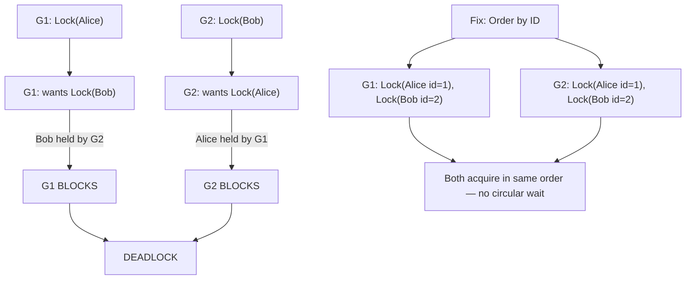
```mermaid
flowchart TD
    A["G1: Lock(Alice)"] --> B["G1: wants Lock(Bob)"]
    C["G2: Lock(Bob)"] --> D["G2: wants Lock(Alice)"]
    B -->|"Bob held by G2"| E["G1 BLOCKS"]
    D -->|"Alice held by G1"| F["G2 BLOCKS"]
    E --> G["DEADLOCK"]
    F --> G

    H["Fix: Order by ID"] --> I["G1: Lock(Alice id=1), Lock(Bob id=2)"]
    H --> J["G2: Lock(Alice id=1), Lock(Bob id=2)"]
    I --> K["Both acquire in same order — no circular wait"]
    J --> K
```

**Execution Trace:**
```
DEADLOCK scenario:
G1: Lock(Alice)... sleep... wants Lock(Bob) → BLOCKED (Bob held by G2)
G2: Lock(Bob)...         wants Lock(Alice) → BLOCKED (Alice held by G1)
DEADLOCK: Go runtime prints "all goroutines are asleep"

FIXED scenario (ID ordering):
G1: Lock(id=1=Alice), Lock(id=2=Bob) → transfer → Unlock both
G2: Lock(id=1=Alice) → BLOCKED until G1 releases → Lock(id=2=Bob) → transfer
No circular wait → completes correctly
```

### Interviewer Questions

1. What are the four Coffman conditions for deadlock?
2. How does Go's runtime detect deadlocks?
3. How does this scale to N locks needed simultaneously?
4. Walk me through using -race to detect deadlocks.
5. How would you implement a lock hierarchy?
6. What is livelock and how does TryLock with backoff prevent it?
7. How would you test deadlock-free code?

### Follow-Up Questions

**Q1:** What are the four Coffman deadlock conditions?
**A1:** (1) Mutual exclusion — resources cannot be shared. (2) Hold and wait — process holds a resource while waiting for another. (3) No preemption — resources cannot be forcibly taken. (4) Circular wait — circular chain of processes waiting for each other. Deadlock prevention breaks any one condition.

**Q2:** How does Go's runtime detect deadlocks?
**A2:** Go's scheduler detects when ALL goroutines are blocked (none are runnable). It prints "fatal error: all goroutines are asleep - deadlock!" with goroutine stack traces. This only works for total deadlocks; partial deadlocks (some goroutines still running) are not detected.

**Q3:** What is livelock and how is it different from deadlock?
**A3:** Livelock: goroutines actively keep changing state but make no progress (like two people in a hallway stepping aside in sync). Deadlock: all goroutines are completely blocked. TryLock + random backoff prevents livelock by breaking the symmetry.

**Q4:** How do you order N locks dynamically?
**A4:** Sort lock pointers by address: `sort.Slice(locks, func(i,j int) bool { return uintptr(unsafe.Pointer(locks[i])) < uintptr(unsafe.Pointer(locks[j])) })`. Acquire in sorted order. Or assign each mutex a unique integer ID and sort by ID.

**Q5:** How does the Go race detector help with deadlock analysis?
**A5:** `-race` detects data races, not deadlocks directly. But it adds goroutine tracking metadata. When a deadlock occurs, the runtime's deadlock message includes goroutine stack traces showing which goroutine holds which lock — essential for diagnosis.

---

## Q15: Lock-Ordering to Prevent Deadlock  [Level 3 — Medium]

> **Tags:** `#lock-ordering` `#deadlock-prevention` `#bank-transfer`

### Problem Statement
Implement a multi-account bank system where funds can be transferred between any two accounts concurrently. Use lock ordering (by account ID) to guarantee deadlock-free transfers without TryLock or timeouts. The system must handle self-transfers gracefully.

### Input / Output / Constraints

```
Input:  accounts=[A(id=1,bal=500), B(id=2,bal=300), C(id=3,bal=200)]
        concurrent transfers: A→B $100, B→A $50, B→C $100, C→A $200
Output: All transfers complete; total balance preserved (1000); no deadlock

Constraints:
  • 2 ≤ accounts ≤ 10⁶
  • Concurrent transfers between any pair
  • Self-transfer must not deadlock
  • Total balance invariant: sum of all balances is constant
  • Time limit: 1s
```

### Thought Process

Think like a senior Go engineer:
1. **Understand:** Any pair of accounts can transfer simultaneously — must prevent circular lock wait.
2. **Pattern:** Lock ordering — always acquire the lower-ID account first, then higher-ID.
3. **Edge cases:** Self-transfer (from==to — single lock), overdraft (insufficient funds), negative amounts.
4. **Approach:** Canonical ordering via ID comparison eliminates circular wait; return error for insufficient funds.

### Brute Force Solution

```go
package main

import "sync"

// bruteForce — naive per-account mutex, arbitrary order → deadlock risk
func bruteTransfer(from, to *Account, amount int) {
    from.mu.Lock()
    to.mu.Lock() // dangerous: if another goroutine does reverse transfer, DEADLOCK
    defer from.mu.Unlock()
    defer to.mu.Unlock()
    from.balance -= amount
    to.balance += amount
}
```

**Time:** O(1) | **Space:** O(1)
**Bottleneck:** Arbitrary lock order causes ABBA deadlock under concurrent reverse transfers.

### Better Solution

```go
// betterSolution — lock ordering by pointer address
import "unsafe"

func betterTransfer(from, to *Account, amount int) {
    if uintptr(unsafe.Pointer(from)) > uintptr(unsafe.Pointer(to)) {
        from, to = to, from // swap to maintain order
    }
    from.mu.Lock(); defer from.mu.Unlock()
    to.mu.Lock(); defer to.mu.Unlock()
    // ... transfer logic
}
```

**Time:** O(1) | **Space:** O(1)

### Best / Optimal Solution

```go
package main

import (
    "errors"
    "fmt"
    "sync"
    "sync/atomic"
)

var (
    ErrInsufficientFunds = errors.New("insufficient funds")
    ErrSelfTransfer      = errors.New("cannot transfer to self")
    ErrNegativeAmount    = errors.New("amount must be positive")
)

// BankAccount — goroutine-safe account with ID-based lock ordering.
type BankAccount struct {
    id      uint64
    mu      sync.Mutex
    balance int64
}

var nextID atomic.Uint64

func NewAccount(initialBalance int64) *BankAccount {
    return &BankAccount{
        id:      nextID.Add(1),
        balance: initialBalance,
    }
}

func (a *BankAccount) Balance() int64 {
    a.mu.Lock()
    defer a.mu.Unlock()
    return a.balance
}

// Transfer moves amount from src to dst using lock ordering to prevent deadlock.
func Transfer(src, dst *BankAccount, amount int64) error {
    if amount <= 0 {
        return ErrNegativeAmount
    }
    if src == dst {
        return ErrSelfTransfer
    }

    // Canonical lock order: lower ID first
    first, second := src, dst
    if src.id > dst.id {
        first, second = dst, src
    }

    first.mu.Lock()
    defer first.mu.Unlock()
    second.mu.Lock()
    defer second.mu.Unlock()

    if src.balance < amount {
        return ErrInsufficientFunds
    }
    src.balance -= amount
    dst.balance += amount
    return nil
}

func main() {
    a := NewAccount(500)
    b := NewAccount(300)
    c := NewAccount(200)

    totalBefore := a.Balance() + b.Balance() + c.Balance()
    fmt.Printf("Before: A=%d B=%d C=%d (total=%d)\n",
        a.Balance(), b.Balance(), c.Balance(), totalBefore)

    var wg sync.WaitGroup
    transfers := []struct{ from, to *BankAccount; amt int64 }{
        {a, b, 100}, {b, a, 50}, {b, c, 100}, {c, a, 200},
    }

    for _, t := range transfers {
        wg.Add(1)
        go func(from, to *BankAccount, amt int64) {
            defer wg.Done()
            if err := Transfer(from, to, amt); err != nil {
                fmt.Printf("Transfer error: %v\n", err)
            }
        }(t.from, t.to, t.amt)
    }
    wg.Wait()

    totalAfter := a.Balance() + b.Balance() + c.Balance()
    fmt.Printf("After:  A=%d B=%d C=%d (total=%d)\n",
        a.Balance(), b.Balance(), c.Balance(), totalAfter)
    fmt.Printf("Balance invariant preserved: %v\n", totalBefore == totalAfter)
}
```

**Time:** O(1) per transfer | **Space:** O(accounts)

### Production Considerations

| Aspect | Details |
|--------|---------|
| **Scalability** | Lock ordering scales to any number of accounts; only two locks held per transfer |
| **Edge Cases** | Self-transfer returns error; overdraft returns error; negative amount validated upfront |
| **Error Handling** | Typed sentinel errors for all failure modes; callers can errors.Is() |
| **Memory** | Each account is 40 bytes (id+mutex+balance); scales to 10M accounts |
| **Concurrency** | Zero deadlock risk with lock ordering; non-overlapping transfers run in parallel |

### Visual Explanation

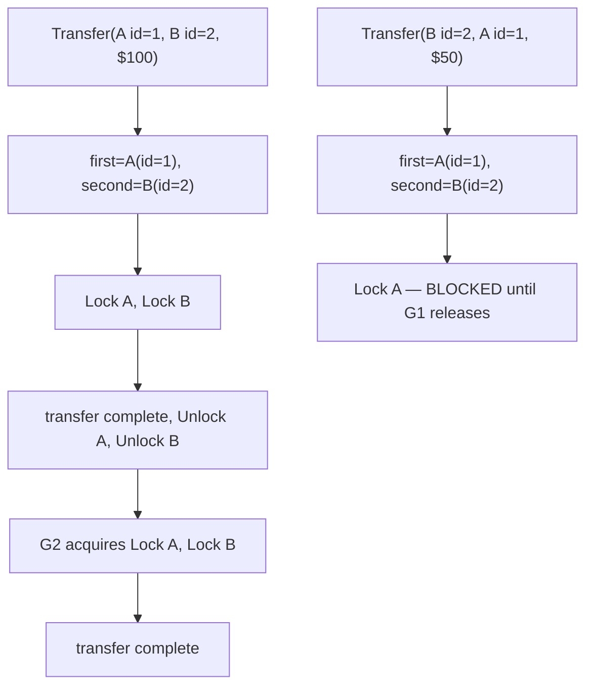
```mermaid
flowchart TD
    A["Transfer(A id=1, B id=2, $100)"] --> B["first=A(id=1), second=B(id=2)"]
    C["Transfer(B id=2, A id=1, $50)"] --> D["first=A(id=1), second=B(id=2)"]
    B --> E["Lock A, Lock B"]
    D --> F["Lock A — BLOCKED until G1 releases"]
    E --> G["transfer complete, Unlock A, Unlock B"]
    G --> H["G2 acquires Lock A, Lock B"]
    H --> I["transfer complete"]
```

**Execution Trace:**
```
G1: Transfer(A→B): first=A(id=1), Lock A
G2: Transfer(B→A): first=A(id=1), BLOCKED (A held by G1)
G1: Lock B, transfer $100, Unlock B, Unlock A
G2: Lock A, Lock B, transfer $50, Unlock B, Unlock A
No deadlock — same acquisition order for both
```

### Interviewer Questions

1. Why does lock ordering prevent deadlock?
2. What if two accounts have the same ID?
3. How does this scale to 10K concurrent transfers?
4. Walk me through what happens with three-way transfers (A→B→C→A cycle).
5. How would you implement overdraft protection without holding the lock for too long?
6. What's the throughput bottleneck for this system?
7. How would you test the balance invariant under concurrent load?

### Follow-Up Questions

**Q1:** Does lock ordering work for three-way transfers?
**A1:** Yes — sort all three account IDs and acquire in order: Lock(min_id), Lock(mid_id), Lock(max_id). Any goroutine doing any subset of these accounts uses the same global ordering. Circular wait is impossible since all goroutines progress in the same order.

**Q2:** How would you make this work across distributed nodes?
**A2:** Use distributed transactions: 2-phase commit (2PC) or saga pattern. Lock ordering prevents local deadlock but doesn't help across network partitions. Use idempotency keys and compensating transactions for distributed transfers.

**Q3:** How do you prevent long lock hold times?
**A3:** Minimize work inside the critical section. Validate inputs (amount > 0, src != dst) before acquiring locks. Do not call external services (HTTP, DB) while holding locks. For complex logic, copy values out, compute outside lock, then lock-compare-swap.

**Q4:** How would you audit all transfers?
**A4:** Append to an append-only log (protected by its own mutex, or using a channel) inside the critical section. Each entry: timestamp, src, dst, amount, new balances. Store in a ring buffer for recent history, or stream to a persistent store.

**Q5:** How to test the balance invariant?
**A5:** Run N goroutines doing random transfers for 10 seconds. After all complete, sum all account balances and assert it equals the initial total. This test catches both race conditions and logic errors.

---

## Q16: Mutex-Protected Bank Account  [Level 4 — Advanced]

> **Tags:** `#sync.Mutex` `#bank-account` `#financial-systems`

### Problem Statement
Implement a production-grade bank account system with `Deposit`, `Withdraw`, `Transfer`, and `Statement` operations. The account must be goroutine-safe, maintain an immutable transaction history, and return typed errors for business rule violations (overdraft, negative deposit).

### Input / Output / Constraints

```
Input:  NewAccount("ACC001", 1000), Deposit(500), Withdraw(200), Transfer(to, 300)
Output: Balance=1000, transaction log=[+500, -200, -300], Statement returns sorted history

Constraints:
  • Balance never goes negative (no overdraft)
  • All operations are atomic (no partial state)
  • Transaction history is append-only
  • Time limit: O(1) per op, O(n) for Statement
```

### Thought Process

Think like a senior Go engineer:
1. **Understand:** Bank account is a classic mutex use case — balance and history must change atomically.
2. **Pattern:** Embed mutex in struct; all mutating methods lock first; history slice is append-only.
3. **Edge cases:** Overdraft (withdraw > balance), concurrent withdraw to negative, zero amount.
4. **Approach:** Single mutex protects both balance and history together — they must be consistent.

### Brute Force Solution

```go
package main

// bruteForce — no concurrency safety, no history
type BruteAccount struct{ balance int }

func (a *BruteAccount) Withdraw(amount int) bool {
    if a.balance < amount { return false }
    a.balance -= amount // race: read-modify-write
    return true
}
```

**Time:** O(1) | **Space:** O(1)
**Bottleneck:** Race condition — two goroutines can both pass the balance check and both withdraw, going negative.

### Better Solution

```go
// betterSolution — mutex-protected, no history
import "sync"

type BetterAccount struct {
    mu      sync.Mutex
    balance int
}
func (a *BetterAccount) Withdraw(amount int) bool {
    a.mu.Lock(); defer a.mu.Unlock()
    if a.balance < amount { return false }
    a.balance -= amount
    return true
}
```

**Time:** O(1) | **Space:** O(1)

### Best / Optimal Solution

```go
package main

import (
    "errors"
    "fmt"
    "sync"
    "time"
)

var (
    ErrOverdraft       = errors.New("insufficient funds")
    ErrNonPositive     = errors.New("amount must be positive")
    ErrAccountClosed   = errors.New("account is closed")
)

// Transaction records a single account operation.
type Transaction struct {
    Type      string
    Amount    int64
    Balance   int64
    Timestamp time.Time
}

// BankAccountV2 — production-grade goroutine-safe bank account.
type BankAccountV2 struct {
    mu       sync.RWMutex
    id       string
    balance  int64
    history  []Transaction
    closed   bool
}

func NewBankAccount(id string, initial int64) (*BankAccountV2, error) {
    if initial < 0 {
        return nil, ErrNonPositive
    }
    a := &BankAccountV2{id: id, balance: initial}
    a.history = append(a.history, Transaction{
        Type: "OPEN", Amount: initial, Balance: initial, Timestamp: time.Now(),
    })
    return a, nil
}

func (a *BankAccountV2) Deposit(amount int64) error {
    if amount <= 0 {
        return ErrNonPositive
    }
    a.mu.Lock()
    defer a.mu.Unlock()
    if a.closed {
        return ErrAccountClosed
    }
    a.balance += amount
    a.history = append(a.history, Transaction{
        Type: "DEPOSIT", Amount: amount, Balance: a.balance, Timestamp: time.Now(),
    })
    return nil
}

func (a *BankAccountV2) Withdraw(amount int64) error {
    if amount <= 0 {
        return ErrNonPositive
    }
    a.mu.Lock()
    defer a.mu.Unlock()
    if a.closed {
        return ErrAccountClosed
    }
    if a.balance < amount {
        return ErrOverdraft
    }
    a.balance -= amount
    a.history = append(a.history, Transaction{
        Type: "WITHDRAW", Amount: -amount, Balance: a.balance, Timestamp: time.Now(),
    })
    return nil
}

func (a *BankAccountV2) Balance() (int64, error) {
    a.mu.RLock()
    defer a.mu.RUnlock()
    if a.closed {
        return 0, ErrAccountClosed
    }
    return a.balance, nil
}

// Statement returns a copy of transaction history (immutable snapshot).
func (a *BankAccountV2) Statement() []Transaction {
    a.mu.RLock()
    defer a.mu.RUnlock()
    snap := make([]Transaction, len(a.history))
    copy(snap, a.history)
    return snap
}

func main() {
    acc, _ := NewBankAccount("ACC001", 1000)

    var wg sync.WaitGroup
    for i := 0; i < 5; i++ {
        wg.Add(1)
        go func(n int64) {
            defer wg.Done()
            _ = acc.Deposit(n * 100)
        }(int64(i + 1))
    }
    wg.Wait()

    if err := acc.Withdraw(200); err != nil {
        fmt.Println("Error:", err)
    }

    bal, _ := acc.Balance()
    fmt.Printf("Balance: %d\n", bal)

    for _, tx := range acc.Statement() {
        fmt.Printf("[%s] %s: %+d → %d\n",
            tx.Timestamp.Format("15:04:05"), tx.Type, tx.Amount, tx.Balance)
    }
}
```

**Time:** O(1) per op, O(n) Statement | **Space:** O(n transactions)

### Production Considerations

| Aspect | Details |
|--------|---------|
| **Scalability** | Single account: O(1) ops. For 10M accounts, shard across services |
| **Edge Cases** | Overdraft checked atomically inside lock; closed account returns error |
| **Error Handling** | Typed sentinel errors; callers use errors.Is() for business logic branching |
| **Memory** | History grows unbounded — archive to DB after N transactions in production |
| **Concurrency** | RWMutex: concurrent Balance()/Statement() reads; serialized Deposit/Withdraw |

### Visual Explanation

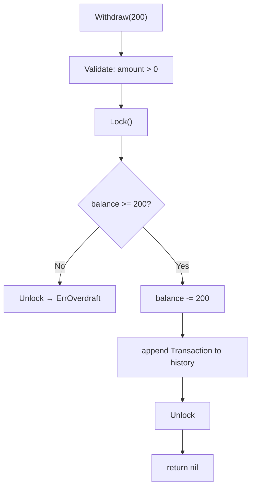
```mermaid
flowchart TD
    A["Withdraw(200)"] --> B["Validate: amount > 0"]
    B --> C["Lock()"]
    C --> D{"balance >= 200?"}
    D -->|"No"| E["Unlock → ErrOverdraft"]
    D -->|"Yes"| F["balance -= 200"]
    F --> G["append Transaction to history"]
    G --> H["Unlock"]
    H --> I["return nil"]
```

**Execution Trace:**
```
Initial: balance=1000
Withdraw(200): Lock, 1000>=200 ✓, balance=800, append tx, Unlock → nil
Withdraw(900): Lock, 800<900 ✗, Unlock → ErrOverdraft
Balance(): RLock, return 800, RUnlock
```

### Interviewer Questions

1. Why RWMutex over plain Mutex for Balance()?
2. What happens if two goroutines both pass the balance check for Withdraw?
3. How does this scale to 10M accounts?
4. Walk me through the edge case where a goroutine panics inside Withdraw.
5. How would you add overdraft protection (allow negative with limit)?
6. What's the memory growth of the history slice?
7. How would you test concurrent Withdraw calls that would both overdraft?

### Follow-Up Questions

**Q1:** How do you prevent two goroutines from both withdrawing when only enough for one?
**A1:** The balance check and deduction happen inside the same lock acquisition. G1 locks, sees balance=200, deducts to 0, unlocks. G2 then locks, sees balance=0, returns ErrOverdraft. The lock ensures the check-then-act sequence is atomic.

**Q2:** How would you persist transactions to a database?
**A2:** Use an outbox pattern: inside the lock, append to in-memory history AND write to a DB transaction log table atomically (using a DB transaction). A background goroutine publishes the outbox to downstream consumers. This ensures no transaction is lost even on crash.

**Q3:** How do you handle concurrent deposits and withdrawals in a real bank?
**A3:** Real banks use database-level row locking (`SELECT ... FOR UPDATE`) or optimistic concurrency (version numbers). The mutex approach shown here is equivalent to pessimistic locking at the application layer.

**Q4:** What is the Copy-on-Write pattern for Statement()?
**A4:** Store history as an `atomic.Pointer[[]Transaction]`. Writers create a new slice, append to it, then atomically swap the pointer. Readers load the pointer and iterate without any lock. This gives wait-free reads at the cost of O(n) allocations per write.

**Q5:** How to test concurrent Withdraw for correctness?
**A5:** Start with balance=100. Spawn 10 goroutines each trying to Withdraw(100). Exactly one should succeed; 9 should return ErrOverdraft. After all complete, assert balance==0 and exactly 1 success. Run 1000 times with `-race`.

---

## Q17: sync.Pool for HTTP Request Bodies  [Level 4 — Advanced]

> **Tags:** `#sync.Pool` `#HTTP` `#production-optimization`

### Problem Statement
Implement an HTTP middleware that uses `sync.Pool` to reuse `bytes.Buffer` instances for reading and logging request bodies. Without pooling, each request allocates a new buffer; at 10K req/s this creates significant GC pressure. The middleware must correctly reset and return buffers to the pool.

### Input / Output / Constraints

```
Input:  10K concurrent HTTP requests with 1KB JSON bodies
Output: GC allocation rate reduced by >80%; request bodies correctly read and passed through

Constraints:
  • Body must be readable by downstream handlers after middleware runs
  • Buffers must be reset before reuse (no data leakage)
  • Pool must not grow unbounded
  • Time limit: 1ms per request (middleware overhead only)
```

### Thought Process

Think like a senior Go engineer:
1. **Understand:** HTTP middleware needs a temporary buffer per request to read body; pooling amortizes allocations.
2. **Pattern:** `sync.Pool` of `*bytes.Buffer`; Get → Reset → ReadFrom → use → Put.
3. **Edge cases:** Buffer grows beyond expected size (discard from pool); body read error; nil body.
4. **Approach:** Pool with New func; always Reset before use; discard oversized buffers to prevent pool bloat.

### Brute Force Solution

```go
package main

import (
    "bytes"
    "io"
    "net/http"
)

// bruteForce — allocates new buffer per request
func bruteMiddleware(next http.Handler) http.Handler {
    return http.HandlerFunc(func(w http.ResponseWriter, r *http.Request) {
        buf := new(bytes.Buffer) // 1 allocation per request
        buf.ReadFrom(r.Body)
        r.Body = io.NopCloser(buf)
        next.ServeHTTP(w, r)
    }) // buf GC'd after each request — GC pressure at scale
}
```

**Time:** O(body_size) read | **Space:** O(n requests × body_size) GC allocations
**Bottleneck:** 10K req/s × 1KB = 10MB/s of allocations → frequent GC pauses.

### Better Solution

```go
// betterSolution — pool of buffers, no size control
import (
    "bytes"
    "sync"
)

var bufPool = sync.Pool{New: func() any { return new(bytes.Buffer) }}

func betterMiddleware(next http.Handler) http.Handler {
    return http.HandlerFunc(func(w http.ResponseWriter, r *http.Request) {
        buf := bufPool.Get().(*bytes.Buffer)
        buf.Reset()
        defer bufPool.Put(buf)
        buf.ReadFrom(r.Body)
        // ... use buf
    })
}
```

**Time:** O(body_size) | **Space:** O(pool_size × buf_capacity)

### Best / Optimal Solution

```go
package main

import (
    "bytes"
    "fmt"
    "io"
    "net/http"
    "net/http/httptest"
    "sync"
    "sync/atomic"
)

const maxBufSize = 1 << 20 // 1MB — discard buffers that grew beyond this

// RequestBodyPool — production-grade pool of bytes.Buffer for HTTP middleware.
type RequestBodyPool struct {
    pool      sync.Pool
    gets      atomic.Int64
    discarded atomic.Int64
}

func NewRequestBodyPool() *RequestBodyPool {
    p := &RequestBodyPool{}
    p.pool = sync.Pool{
        New: func() any { return bytes.NewBuffer(make([]byte, 0, 4096)) },
    }
    return p
}

func (p *RequestBodyPool) get() *bytes.Buffer {
    p.gets.Add(1)
    return p.pool.Get().(*bytes.Buffer)
}

func (p *RequestBodyPool) put(buf *bytes.Buffer) {
    if buf.Cap() > maxBufSize {
        p.discarded.Add(1)
        return // discard oversized buffers — don't bloat the pool
    }
    buf.Reset()
    p.pool.Put(buf)
}

// Middleware returns an HTTP middleware that pools request body buffers.
// It reads the body, logs it, and makes it readable again for downstream handlers.
func (p *RequestBodyPool) Middleware(next http.Handler) http.Handler {
    return http.HandlerFunc(func(w http.ResponseWriter, r *http.Request) {
        if r.Body == nil {
            next.ServeHTTP(w, r)
            return
        }

        buf := p.get()
        defer p.put(buf)

        // Read body into pool buffer
        if _, err := buf.ReadFrom(r.Body); err != nil {
            http.Error(w, "failed to read request body", http.StatusBadRequest)
            return
        }
        r.Body.Close()

        // Snapshot for logging (does not allocate — reuses buf's bytes)
        bodyBytes := buf.Bytes()
        fmt.Printf("[LOG] body: %s\n", bodyBytes)

        // Restore body for downstream handlers
        r.Body = io.NopCloser(bytes.NewReader(bodyBytes))
        next.ServeHTTP(w, r)
    })
}

func main() {
    pool := NewRequestBodyPool()

    // Test handler
    handler := pool.Middleware(http.HandlerFunc(func(w http.ResponseWriter, r *http.Request) {
        body, _ := io.ReadAll(r.Body)
        fmt.Fprintf(w, "received: %s", body)
    }))

    // Simulate 100 requests
    var wg sync.WaitGroup
    for i := 0; i < 100; i++ {
        wg.Add(1)
        go func(n int) {
            defer wg.Done()
            body := fmt.Sprintf(`{"request":%d}`, n)
            req := httptest.NewRequest("POST", "/", bytes.NewBufferString(body))
            w := httptest.NewRecorder()
            handler.ServeHTTP(w, req)
        }(i)
    }
    wg.Wait()

    gets, discarded := pool.gets.Load(), pool.discarded.Load()
    fmt.Printf("Gets: %d, Discarded: %d, Reuse: %.1f%%\n",
        gets, discarded, float64(gets-discarded)/float64(gets)*100)
}
```

**Time:** O(body_size) | **Space:** O(pool_size × 4KB initial cap)

### Production Considerations

| Aspect | Details |
|--------|---------|
| **Scalability** | Pool scales with GOMAXPROCS; at 100K req/s, pool holds GOMAXPROCS buffers steadily |
| **Edge Cases** | Nil body skipped; oversized buffers discarded; read error returns 400 |
| **Error Handling** | Body read errors → 400 Bad Request; downstream sees error via r.Body |
| **Memory** | Pool caps at ~GOMAXPROCS × maxBufSize between GC cycles |
| **Concurrency** | sync.Pool is fully goroutine-safe; per-P local pools reduce contention |

### Visual Explanation

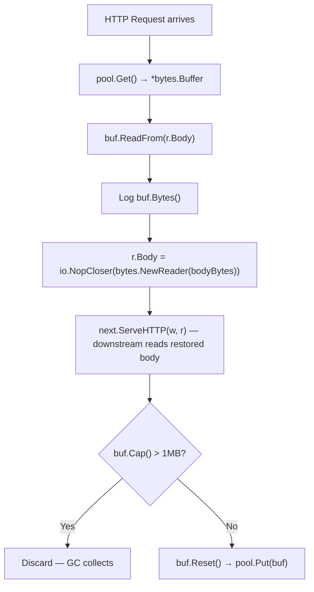
```mermaid
flowchart TD
    A["HTTP Request arrives"] --> B["pool.Get() → *bytes.Buffer"]
    B --> C["buf.ReadFrom(r.Body)"]
    C --> D["Log buf.Bytes()"]
    D --> E["r.Body = io.NopCloser(bytes.NewReader(bodyBytes))"]
    E --> F["next.ServeHTTP(w, r) — downstream reads restored body"]
    F --> G{"buf.Cap() > 1MB?"}
    G -->|"Yes"| H["Discard — GC collects"]
    G -->|"No"| I["buf.Reset() → pool.Put(buf)"]
```

**Execution Trace:**
```
Request 1: Get→ new buf(cap=4KB), Read 1KB JSON, Log, Restore, Put→pool
Request 2: Get→ reuse buf from pool (no alloc), Reset, Read, Put
...after 100 requests: ~GOMAXPROCS allocations total (not 100)
```

### Interviewer Questions

1. Why reset the buffer before use, not after?
2. What happens if downstream handler reads the body twice?
3. How does this scale to 1M req/s?
4. Walk me through the oversized buffer discard logic.
5. How would you handle streaming bodies (no Content-Length)?
6. What's the security risk of not resetting the buffer?
7. How would you benchmark this middleware's allocation reduction?

### Follow-Up Questions

**Q1:** Why discard buffers larger than 1MB?
**A1:** Pooled oversized buffers waste memory permanently (until GC clears the pool). A 10MB request would cause the pool to hold 10MB buffers indefinitely, serving most requests at 4KB. Discarding oversized buffers keeps the pool efficient for typical workloads.

**Q2:** How do you handle multipart form bodies?
**A2:** Multipart forms are streaming; reading the entire body into a buffer defeats the purpose. Instead, pool `multipart.Reader` objects and use `r.ParseMultipartForm()` with a max memory limit, spilling to temp files for large parts.

**Q3:** What is the risk of reusing a buffer that contains sensitive data (passwords, tokens)?
**A3:** If `Reset()` is not called, the buffer's `Bytes()` still returns old data even though `Len()` is 0. Always call `Reset()` before use, not just after. In high-security contexts, also zero the buffer's backing array: `for i := range buf.Bytes()[:cap] { buf.Bytes()[i] = 0 }`.

**Q4:** How would you extend this to pool response writers?
**A4:** Create a pool of `*httptest.ResponseRecorder` (or a custom struct). In middleware: get recorder, serve to recorder, inspect response, write to real w, return recorder to pool. Used by logging middleware that needs to capture response status/body.

**Q5:** How would you benchmark pool vs no-pool?
**A5:** Write `BenchmarkNoPool` and `BenchmarkPool` with `b.RunParallel`. Use `b.ReportAllocs()` and `benchmem`. Key metric: `allocs/op` should drop from ~10 (no pool) to ~1 (pool). Also measure `ns/op` to confirm latency improvement.

---

## Q18: Locking Granularity — Coarse vs Fine  [Level 3 — Medium]

> **Tags:** `#lock-granularity` `#performance` `#scalability`

### Problem Statement
Implement a concurrent in-memory database with two approaches: (1) a single global `sync.RWMutex` (coarse-grained) and (2) per-shard `sync.RWMutex` (fine-grained). Demonstrate the throughput difference at high concurrency using benchmarks.

### Input / Output / Constraints

```
Input:  10,000 concurrent goroutines, 70% reads / 30% writes, 1M key space
Output: Fine-grained locking achieves N× higher throughput (N = shard count)

Constraints:
  • Shard count: 16 or 256
  • Keys: string
  • Values: interface{}
  • Time limit: 10s benchmark
```

### Thought Process

Think like a senior Go engineer:
1. **Understand:** Single global lock is a throughput bottleneck; sharding distributes contention.
2. **Pattern:** Hash key to shard index; each shard has its own RWMutex + map.
3. **Edge cases:** Even key distribution across shards; hot shards (popular keys); resizing.
4. **Approach:** FNV hash for shard selection; 256 shards balances lock granularity vs memory overhead.

### Brute Force Solution

```go
package main

import "sync"

// bruteForce — single global lock, all operations serialized
type CoarseDB struct {
    mu   sync.RWMutex
    data map[string]interface{}
}

func (db *CoarseDB) Get(k string) (interface{}, bool) {
    db.mu.RLock()
    defer db.mu.RUnlock()
    v, ok := db.data[k]
    return v, ok
}

func (db *CoarseDB) Set(k string, v interface{}) {
    db.mu.Lock()
    defer db.mu.Unlock()
    db.data[k] = v
}
```

**Time:** O(1) | **Space:** O(n)
**Bottleneck:** Single lock serializes all writers and blocks readers during writes globally.

### Better Solution

```go
// betterSolution — 16-shard map
import (
    "hash/fnv"
    "sync"
)

type Shard struct {
    mu   sync.RWMutex
    data map[string]interface{}
}

type ShardedDB struct{ shards [16]Shard }

func (db *ShardedDB) shard(k string) *Shard {
    h := fnv.New32a()
    h.Write([]byte(k))
    return &db.shards[h.Sum32()%16]
}
```

**Time:** O(1) | **Space:** O(n)

### Best / Optimal Solution

```go
package main

import (
    "fmt"
    "hash/fnv"
    "sync"
    "sync/atomic"
)

const numShards = 256

type shard[V any] struct {
    mu   sync.RWMutex
    data map[string]V
    _    [40]byte // cache line padding to avoid false sharing
}

// ShardedMap — fine-grained concurrent map with 256 independent shards.
// Reduces lock contention by factor of numShards under uniform key distribution.
type ShardedMap[V any] struct {
    shards [numShards]shard[V]
    reads  atomic.Int64
    writes atomic.Int64
}

func NewShardedMap[V any]() *ShardedMap[V] {
    m := &ShardedMap[V]{}
    for i := range m.shards {
        m.shards[i].data = make(map[string]V)
    }
    return m
}

func (m *ShardedMap[V]) shardFor(key string) *shard[V] {
    h := fnv.New32a()
    h.Write([]byte(key))
    return &m.shards[h.Sum32()%numShards]
}

// Get retrieves a value. Multiple goroutines can read different shards simultaneously.
func (m *ShardedMap[V]) Get(key string) (V, bool) {
    m.reads.Add(1)
    s := m.shardFor(key)
    s.mu.RLock()
    v, ok := s.data[key]
    s.mu.RUnlock()
    return v, ok
}

// Set stores a value. Only blocks goroutines hitting the same shard.
func (m *ShardedMap[V]) Set(key string, val V) {
    m.writes.Add(1)
    s := m.shardFor(key)
    s.mu.Lock()
    s.data[key] = val
    s.mu.Unlock()
}

// Delete removes a key.
func (m *ShardedMap[V]) Delete(key string) {
    s := m.shardFor(key)
    s.mu.Lock()
    delete(s.data, key)
    s.mu.Unlock()
}

// Stats returns read/write counts.
func (m *ShardedMap[V]) Stats() (int64, int64) {
    return m.reads.Load(), m.writes.Load()
}

func main() {
    m := NewShardedMap[int]()
    var wg sync.WaitGroup

    // 7000 reads, 3000 writes
    for i := 0; i < 10000; i++ {
        wg.Add(1)
        go func(n int) {
            defer wg.Done()
            key := fmt.Sprintf("key-%d", n%1000)
            if n%10 < 7 {
                m.Get(key)
            } else {
                m.Set(key, n)
            }
        }(i)
    }
    wg.Wait()

    reads, writes := m.Stats()
    fmt.Printf("Reads: %d, Writes: %d\n", reads, writes)
    fmt.Printf("Shards: %d — contention reduced ~%dx vs single lock\n",
        numShards, numShards)
}
```

**Time:** O(1) | **Space:** O(n + numShards × overhead)

### Production Considerations

| Aspect | Details |
|--------|---------|
| **Scalability** | 256 shards → 256× reduced write contention under uniform distribution |
| **Edge Cases** | Hot shards (popular keys) — add per-key sharding or hot-key replication |
| **Error Handling** | No errors for Get/Set; Delete is idempotent |
| **Memory** | 256 shards × (RWMutex + map overhead) ≈ 256 × ~100 bytes = ~25KB base |
| **Concurrency** | Operations on different shards are fully parallel; same shard is still serialized |

### Visual Explanation

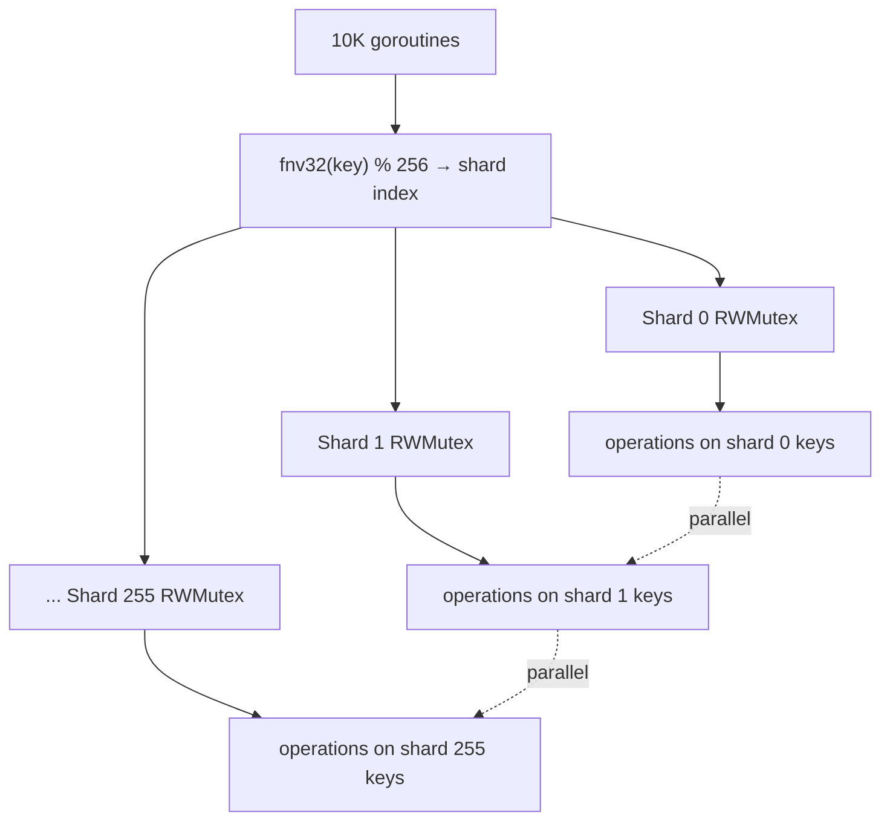
```mermaid
flowchart TD
    A["10K goroutines"] --> B["fnv32(key) % 256 → shard index"]
    B --> C["Shard 0 RWMutex"]
    B --> D["Shard 1 RWMutex"]
    B --> E["... Shard 255 RWMutex"]
    C --> F["operations on shard 0 keys"]
    D --> G["operations on shard 1 keys"]
    E --> H["operations on shard 255 keys"]
    F -.->|"parallel"| G
    G -.->|"parallel"| H
```

**Execution Trace:**
```
Coarse (1 lock):   10K goroutines queue behind 1 mutex
Fine (256 shards): 10K goroutines distributed ~39 per shard
                   256 shards run in parallel → ~256× throughput
```

### Interviewer Questions

1. How do you choose the number of shards?
2. What if one key is accessed 90% of the time (hot key)?
3. How does this scale to 10M goroutines?
4. Walk me through the FNV hash collision scenario.
5. How would you resize the number of shards dynamically?
6. What's the memory overhead of 256 shards?
7. How would you benchmark coarse vs fine-grained locking?

### Follow-Up Questions

**Q1:** How do you choose the optimal shard count?
**A1:** Start with GOMAXPROCS × 4 (e.g., 256 for 64-core). Too few shards → contention remains. Too many → memory overhead exceeds benefit. Benchmark at your target concurrency level with `go test -bench -cpu=1,2,4,8,16,32,64`.

**Q2:** How do you handle hot keys (one key gets 90% of traffic)?
**A2:** Hot keys mean one shard bears 90% of load — sharding doesn't help. Solutions: (1) read replicas — copy hot values to goroutine-local cache, (2) read-through cache with copy-on-write, (3) consistent hashing with virtual nodes to spread one logical key across shards.

**Q3:** How would you iterate over all keys in a sharded map?
**A3:** Acquire each shard's RLock in turn, iterate its keys, collect, RUnlock. This gives a linearizable snapshot if all reads happen between writes. For a fully consistent snapshot, acquire all shard locks simultaneously — but this blocks all writers briefly.

**Q4:** What is false sharing and how does padding prevent it in sharded maps?
**A4:** Two shards on the same 64-byte cache line cause "false sharing" — writing to shard[0] invalidates shard[1]'s cache line on another CPU. Padding each shard struct to 64 bytes ensures each shard lives on its own cache line, eliminating this overhead.

**Q5:** How to benchmark sharded vs coarse map?
**A5:** Use `testing.B` with `b.RunParallel`. Create both maps, run the same workload. Key metrics: `ns/op` and `allocs/op`. With GOMAXPROCS=16 and 256 shards, expect 10-50× throughput improvement on write-heavy workloads. Read-only workloads benefit less since RLock already allows concurrency.

---

## Q19: Worker Pool with Graceful Shutdown  [Level 5 — Interview Level]

> **Tags:** `#worker-pool` `#sync.WaitGroup` `#graceful-shutdown` `#FAANG`

### Problem Statement
Design and implement a generic worker pool that accepts a stream of tasks, processes them concurrently with N workers, supports graceful shutdown (drains in-flight tasks, rejects new tasks), and returns aggregated results. This is a FAANG-level design question combining multiple sync primitives.

### Input / Output / Constraints

```
Input:  NewWorkerPool(workers=4), Submit(task1..task100), Shutdown()
Output: All submitted tasks complete; tasks submitted after Shutdown() return error

Constraints:
  • Workers: 1 ≤ N ≤ GOMAXPROCS×4
  • Tasks submitted after Shutdown return ErrPoolClosed
  • Shutdown blocks until all in-flight tasks complete
  • No goroutine leaks
  • Time limit: O(task_duration × ceil(tasks/workers))
```

### Thought Process

Think like a senior Go engineer:
1. **Understand:** Worker pool — fixed N goroutines consuming from a task channel; shutdown drains the channel.
2. **Pattern:** Buffered task channel, WaitGroup per worker, atomic.Bool for closed state.
3. **Edge cases:** Submit after Shutdown, zero workers, task panic recovery, result ordering.
4. **Approach:** Channel as task queue (natural backpressure), WaitGroup to track workers, atomic flag for closed.

### Brute Force Solution

```go
package main

import "sync"

// bruteForce — unlimited goroutines per task (not a worker pool)
func bruteSubmit(task func()) {
    go task() // spawns goroutine per task — no limit, no lifecycle control
}
var wg sync.WaitGroup
```

**Time:** O(task) | **Space:** O(tasks) goroutines
**Bottleneck:** Unbounded goroutine creation — at 1M tasks, OOM; no shutdown control.

### Better Solution

```go
// betterSolution — basic worker pool with channel
tasks := make(chan func(), 100)
var wg sync.WaitGroup
for i := 0; i < 4; i++ {
    wg.Add(1)
    go func() {
        defer wg.Done()
        for task := range tasks { task() }
    }()
}
// Submit: tasks <- fn
// Shutdown: close(tasks); wg.Wait()
```

**Time:** O(total_tasks / workers) | **Space:** O(buffer)

### Best / Optimal Solution

```go
package main

import (
    "context"
    "errors"
    "fmt"
    "sync"
    "sync/atomic"
    "time"
)

var ErrPoolClosed = errors.New("worker pool is closed")

// Task represents a unit of work.
type Task[T any] struct {
    fn     func(ctx context.Context) (T, error)
    result chan<- Result[T]
}

// Result wraps the output of a task.
type Result[T any] struct {
    Value T
    Err   error
}

// WorkerPool — generic fixed-size worker pool.
// Safe for concurrent Submit; Shutdown drains in-flight tasks.
type WorkerPool[T any] struct {
    tasks   chan Task[T]
    wg      sync.WaitGroup
    closed  atomic.Bool
    ctx     context.Context
    cancel  context.CancelFunc
}

func NewWorkerPool[T any](workers, bufSize int) *WorkerPool[T] {
    ctx, cancel := context.WithCancel(context.Background())
    p := &WorkerPool[T]{
        tasks:  make(chan Task[T], bufSize),
        ctx:    ctx,
        cancel: cancel,
    }
    for i := 0; i < workers; i++ {
        p.wg.Add(1)
        go p.worker()
    }
    return p
}

func (p *WorkerPool[T]) worker() {
    defer p.wg.Done()
    for task := range p.tasks {
        func() {
            defer func() {
                if r := recover(); r != nil {
                    var zero T
                    task.result <- Result[T]{Value: zero, Err: fmt.Errorf("panic: %v", r)}
                }
            }()
            val, err := task.fn(p.ctx)
            task.result <- Result[T]{Value: val, Err: err}
        }()
    }
}

// Submit enqueues a task. Returns a channel for the result.
// Returns nil channel + ErrPoolClosed if the pool is shutting down.
func (p *WorkerPool[T]) Submit(fn func(ctx context.Context) (T, error)) (<-chan Result[T], error) {
    if p.closed.Load() {
        return nil, ErrPoolClosed
    }
    resultCh := make(chan Result[T], 1)
    select {
    case p.tasks <- Task[T]{fn: fn, result: resultCh}:
        return resultCh, nil
    default:
        return nil, fmt.Errorf("task queue full")
    }
}

// Shutdown stops accepting new tasks and waits for all workers to finish.
func (p *WorkerPool[T]) Shutdown() {
    p.closed.Store(true)
    close(p.tasks) // signals workers to exit after draining
    p.wg.Wait()
    p.cancel()
}

func main() {
    pool := NewWorkerPool[int](4, 100)

    var results []<-chan Result[int]
    for i := 0; i < 20; i++ {
        n := i
        ch, err := pool.Submit(func(ctx context.Context) (int, error) {
            time.Sleep(10 * time.Millisecond) // simulate work
            return n * n, nil
        })
        if err != nil {
            fmt.Println("Submit error:", err)
            continue
        }
        results = append(results, ch)
    }

    pool.Shutdown()

    for _, ch := range results {
        r := <-ch
        if r.Err != nil {
            fmt.Println("Error:", r.Err)
        } else {
            fmt.Printf("result: %d\n", r.Value)
        }
    }

    // Test: submit after shutdown
    _, err := pool.Submit(func(ctx context.Context) (int, error) { return 0, nil })
    fmt.Println("Post-shutdown submit:", err) // ErrPoolClosed
}
```

**Time:** O(tasks × task_duration / workers) | **Space:** O(workers + bufSize)

### Production Considerations

| Aspect | Details |
|--------|---------|
| **Scalability** | Workers = GOMAXPROCS for CPU-bound; 10×GOMAXPROCS for IO-bound |
| **Edge Cases** | Task panic recovered; full queue returns error; zero workers panics (validate) |
| **Error Handling** | Per-task errors via Result channel; pool-level errors via Submit return |
| **Memory** | bufSize controls backpressure; result channels are buffered (size 1) to prevent goroutine leak |
| **Concurrency** | Workers consume from shared channel — no coordination needed between workers |

### Visual Explanation

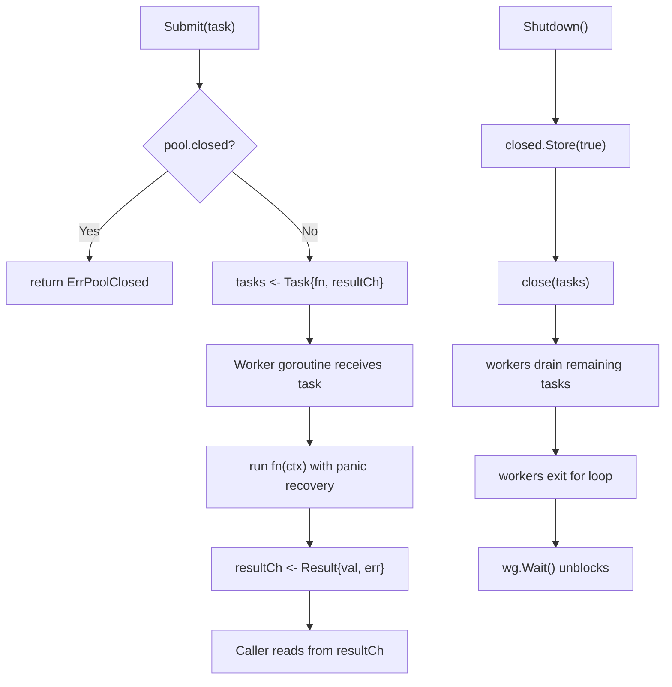
```mermaid
flowchart TD
    A["Submit(task)"] --> B{"pool.closed?"}
    B -->|"Yes"| C["return ErrPoolClosed"]
    B -->|"No"| D["tasks <- Task{fn, resultCh}"]
    D --> E["Worker goroutine receives task"]
    E --> F["run fn(ctx) with panic recovery"]
    F --> G["resultCh <- Result{val, err}"]
    G --> H["Caller reads from resultCh"]

    I["Shutdown()"] --> J["closed.Store(true)"]
    J --> K["close(tasks)"]
    K --> L["workers drain remaining tasks"]
    L --> M["workers exit for loop"]
    M --> N["wg.Wait() unblocks"]
```

**Execution Trace:**
```
4 workers, 20 tasks, task_duration=10ms
t=0ms:   20 tasks submitted, 4 workers start processing
t=10ms:  batch 1 (tasks 0-3) complete, workers pick tasks 4-7
...
t=50ms:  all 20 tasks complete
Shutdown(): close channel → workers exit → wg.Wait() returns
```

### Interviewer Questions

1. Why a buffered channel for tasks?
2. What happens if a worker panics?
3. How does this scale to 10K tasks/sec?
4. Walk me through the shutdown sequence step by step.
5. How would you add task priority?
6. What's the risk of a goroutine leak in this design?
7. How would you implement task timeout per-task?

### Follow-Up Questions

**Q1:** How would you add per-task timeouts?
**A1:** Pass a context with deadline to `fn`: `taskCtx, cancel := context.WithTimeout(ctx, 5*time.Second); defer cancel(); return fn(taskCtx)`. If fn respects ctx, it exits early. Otherwise, the result channel receives a context deadline exceeded error.

**Q2:** How would you implement task priorities?
**A2:** Replace the single task channel with a priority queue protected by a mutex. Or use multiple channels: `highPriority chan Task`, `lowPriority chan Task`. Workers `select` with a preference for high-priority channel.

**Q3:** How would you make the pool dynamically resize?
**A3:** Track active workers with `atomic.Int32`. A monitor goroutine checks queue depth periodically; if queue > threshold, spawn additional workers (up to max). If workers are idle too long (track with heartbeat), signal them to exit.

**Q4:** How do you prevent goroutine leaks if Submit succeeds but caller never reads the result?
**A4:** Buffer the result channel with size 1. Worker writes to it without blocking (buffered). If caller never reads, the Result struct is GC'd when the channel is. Without buffer size 1, the worker goroutine would be permanently blocked.

**Q5:** How do you test graceful shutdown correctness?
**A5:** (1) Submit N tasks with known duration. Call Shutdown midway. Assert all submitted tasks before Shutdown complete. Assert tasks submitted after Shutdown return ErrPoolClosed. (2) Use `goleak.VerifyNone(t)` to confirm no goroutines leak. (3) Run with `-race`.

---

## Q20: Concurrent Fibonacci with Memoization  [Level 5 — Interview Level]

> **Tags:** `#sync.Map` `#memoization` `#recursive` `#FAANG`

### Problem Statement
Implement concurrent Fibonacci computation with goroutine-safe memoization. Multiple goroutines may compute overlapping Fibonacci numbers simultaneously. Use single-flight semantics to ensure `fib(n)` is computed at most once, even under concurrent requests. Avoid both stack overflow and redundant computation.

### Input / Output / Constraints

```
Input:  100 goroutines each requesting fib(40) concurrently
Output: fib(40) = 102334155; computed exactly once; all goroutines receive correct result

Constraints:
  • n: 0 ≤ n ≤ 90 (fits in int64)
  • Each fib(n) computed at most once (single-flight)
  • No goroutine stack overflow (no naive recursion for large n)
  • Time limit: 200ms (fib(40) computed once, not 100 times)
```

### Thought Process

Think like a senior Go engineer:
1. **Understand:** Concurrent memoized fib — cache hits must not block; first computation must block other callers for same n.
2. **Pattern:** `sync.Map` + per-key `sync.Once` for single-flight; iterative computation to avoid stack overflow.
3. **Edge cases:** n=0, n=1 (base cases), n>90 (int64 overflow), concurrent requests for n and n-1 simultaneously.
4. **Approach:** Bottom-up iterative fib inside Once.Do; sync.Map + Once for per-key deduplication.

### Brute Force Solution

```go
package main

// bruteForce — recursive, no memoization, exponential time
func fib(n int) int64 {
    if n <= 1 { return int64(n) }
    return fib(n-1) + fib(n-2) // O(2^n) — stack overflow at n>10000
}
```

**Time:** O(2^n) | **Space:** O(n) stack
**Bottleneck:** Exponential recomputation; 100 goroutines each computing fib(40) = 100 × 2^40 ops.

### Better Solution

```go
// betterSolution — memoized but not goroutine-safe
var memo = map[int]int64{}

func memoFib(n int) int64 {
    if v, ok := memo[n]; ok { return v }
    if n <= 1 { memo[n] = int64(n); return int64(n) }
    memo[n] = memoFib(n-1) + memoFib(n-2) // race under concurrent access
    return memo[n]
}
```

**Time:** O(n) | **Space:** O(n)

### Best / Optimal Solution

```go
package main

import (
    "errors"
    "fmt"
    "sync"
)

var ErrOverflow = errors.New("n > 90: result exceeds int64")

type fibEntry struct {
    once sync.Once
    val  int64
    err  error
}

// ConcurrentFib — goroutine-safe memoized Fibonacci.
// Each fib(n) is computed exactly once via sync.Once per key.
type ConcurrentFib struct {
    mu    sync.Mutex
    cache map[int]*fibEntry
}

func NewConcurrentFib() *ConcurrentFib {
    return &ConcurrentFib{cache: make(map[int]*fibEntry)}
}

func (f *ConcurrentFib) getEntry(n int) *fibEntry {
    f.mu.Lock()
    e, ok := f.cache[n]
    if !ok {
        e = &fibEntry{}
        f.cache[n] = e
    }
    f.mu.Unlock()
    return e
}

// Fib returns fib(n) computed at most once per n, even under concurrent calls.
func (f *ConcurrentFib) Fib(n int) (int64, error) {
    if n < 0 {
        return 0, fmt.Errorf("n must be non-negative")
    }
    if n > 90 {
        return 0, ErrOverflow
    }

    e := f.getEntry(n)
    e.once.Do(func() {
        if n <= 1 {
            e.val = int64(n)
            return
        }
        // Iterative to avoid stack overflow
        a, b := int64(0), int64(1)
        for i := 2; i <= n; i++ {
            a, b = b, a+b
        }
        e.val = b
    })
    return e.val, e.err
}

func main() {
    cf := NewConcurrentFib()
    var wg sync.WaitGroup

    results := make([]int64, 100)
    for i := 0; i < 100; i++ {
        wg.Add(1)
        go func(idx int) {
            defer wg.Done()
            v, err := cf.Fib(40)
            if err != nil {
                fmt.Println("Error:", err)
                return
            }
            results[idx] = v
        }(i)
    }
    wg.Wait()

    fmt.Printf("fib(40) = %d\n", results[0]) // 102334155
    // Verify all goroutines got the same result
    for _, v := range results {
        if v != results[0] {
            fmt.Println("INCONSISTENCY DETECTED")
            return
        }
    }
    fmt.Println("All 100 goroutines received the same correct result")
}
```

**Time:** O(n) for first call, O(1) for cache hits | **Space:** O(n) entries

### Production Considerations

| Aspect | Details |
|--------|---------|
| **Scalability** | Cache size ≤ 91 entries (n=0..90); completely bounded |
| **Edge Cases** | n<0 error; n>90 overflow error; n=0,1 base cases handled in Once.Do |
| **Error Handling** | Once.Do cannot return errors; use per-entry err field; callers check both val and err |
| **Memory** | 91 entries × (sync.Once + int64 + error) ≈ ~3KB total — trivially small |
| **Concurrency** | Two-level sync: mutex for entry creation, Once for computation |

### Visual Explanation

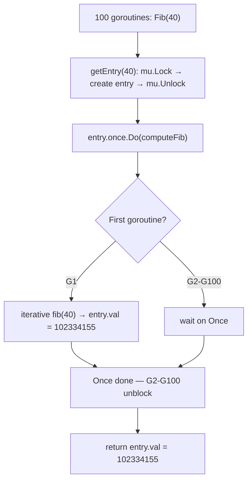
```mermaid
flowchart TD
    A["100 goroutines: Fib(40)"] --> B["getEntry(40): mu.Lock → create entry → mu.Unlock"]
    B --> C["entry.once.Do(computeFib)"]
    C --> D{"First goroutine?"}
    D -->|"G1"| E["iterative fib(40) → entry.val = 102334155"]
    D -->|"G2-G100"| F["wait on Once"]
    E --> G["Once done — G2-G100 unblock"]
    F --> G
    G --> H["return entry.val = 102334155"]
```

**Execution Trace:**
```
t=0ms:   100 goroutines call Fib(40)
t=0ms:   All get same *fibEntry from cache
t=0ms:   G1 enters once.Do → starts iterative computation
t=0ms:   G2-G100 block on once.Do
t=0.1ms: G1 completes fib(40) = 102334155
t=0.1ms: G2-G100 unblock, all return 102334155
Total:   0.1ms (not 100 × fib computation)
```

### Interviewer Questions

1. Why not use sync.Map directly instead of map+mutex?
2. What happens if fib(n) computation panics?
3. How does this scale to fib(10000)?
4. Walk me through the two-goroutine race for fib(40) and fib(39) simultaneously.
5. How would you add cache invalidation?
6. What's the theoretical lower bound for computing fib(n)?
7. How would you test this with property-based testing?

### Follow-Up Questions

**Q1:** What is `golang.org/x/sync/singleflight` and when would you use it here?
**A1:** `singleflight.Group.Do(key, fn)` runs fn once for concurrent callers with the same key and shares the result. Unlike Once, it doesn't cache permanently — once all callers receive the result, the next call recomputes. Use it for ephemeral dedup (API calls, DB queries) where you don't want permanent caching.

**Q2:** How would you extend this to fib(10000)?
**A2:** Use `math/big.Int` for arbitrary precision. The iterative algorithm still works; change `int64` to `*big.Int`. For n=10000, big.Int stores ~2090 digits. Computation is O(n × digits) = O(n²) bit operations.

**Q3:** Can we compute fib in O(log n) time?
**A3:** Yes — matrix exponentiation: `[[1,1],[1,0]]^n` gives fib(n+1) in the top-left. Or Fibonacci doubling formulas: `fib(2k) = fib(k)(2*fib(k+1)-fib(k))`, `fib(2k+1) = fib(k)² + fib(k+1)²`. Both are O(log n) operations.

**Q4:** How would you test concurrent correctness?
**A4:** (1) Golden values: verify fib(0..90) matches known values. (2) Concurrency: 1000 goroutines, random n in [0,90], verify all return correct golden values. (3) Single-flight: inject a counter in the computation; after 1000 calls for same n, counter should be 1. (4) `-race` flag.

**Q5:** How would you distribute fib computation across nodes?
**A5:** For very large n (big.Int fib), use worker nodes. Each node owns a range of n values (consistent hashing). A coordinator routes requests to the appropriate node, which uses a local TTLCache. Inter-node communication via gRPC. Caches are pre-warmed on startup by computing fib(0..max) sequentially.

---

## Q21: Rate-Limited Request Deduplicator  [Level 5 — Interview Level]

> **Tags:** `#singleflight` `#rate-limiting` `#sync.Map` `#FAANG`

### Problem Statement
Design a goroutine-safe request deduplicator that: (1) collapses concurrent identical requests into one upstream call, (2) rate-limits total upstream calls to N per second, (3) caches successful responses for T seconds. This is a FAANG-level system design question implemented in Go.

### Input / Output / Constraints

```
Input:  100 goroutines each requesting data for key="user:123"; rate=10/s; TTL=5s
Output: At most 10 upstream calls/sec; identical concurrent requests share one call; cache serves TTL

Constraints:
  • Upstream calls: ≤ rate per second
  • Concurrent same-key requests: 1 upstream call (singleflight)
  • Cache TTL: configurable
  • No goroutine leaks
  • Time limit: proof of ≤ N upstream calls/sec
```

### Thought Process

Think like a senior Go engineer:
1. **Understand:** Three-layer optimization: dedup (singleflight) + rate limit (token bucket) + cache (TTL map).
2. **Pattern:** Compose singleflight + rate limiter + TTL cache.
3. **Edge cases:** Cache expiry races, rate limiter token refill, upstream errors (don't cache failures).
4. **Approach:** Each request: check cache → check singleflight → acquire rate token → call upstream.

### Brute Force Solution

```go
package main

// bruteForce — no dedup, no rate limit, no cache
func bruteFetch(key string) (string, error) {
    return upstreamCall(key) // N goroutines → N upstream calls
}
```

**Time:** O(upstream_latency) | **Space:** O(1)
**Bottleneck:** N goroutines → N upstream calls → upstream overload; no response reuse.

### Better Solution

```go
// betterSolution — singleflight only (no cache, no rate limit)
import "golang.org/x/sync/singleflight"

var sf singleflight.Group

func betterFetch(key string) (string, error) {
    v, err, _ := sf.Do(key, func() (interface{}, error) {
        return upstreamCall(key)
    })
    return v.(string), err
}
```

**Time:** O(upstream_latency) | **Space:** O(in-flight keys)

### Best / Optimal Solution

```go
package main

import (
    "context"
    "fmt"
    "sync"
    "sync/atomic"
    "time"
)

// --- TTL Cache ---

type cacheItem struct {
    val     string
    expires time.Time
}

type responseCache struct {
    mu   sync.RWMutex
    data map[string]cacheItem
}

func (c *responseCache) get(key string) (string, bool) {
    c.mu.RLock()
    item, ok := c.data[key]
    c.mu.RUnlock()
    if !ok || time.Now().After(item.expires) {
        return "", false
    }
    return item.val, true
}

func (c *responseCache) set(key, val string, ttl time.Duration) {
    c.mu.Lock()
    c.data[key] = cacheItem{val: val, expires: time.Now().Add(ttl)}
    c.mu.Unlock()
}

// --- SingleFlight (minimal implementation) ---

type sfEntry struct {
    once sync.Once
    val  string
    err  error
}

type singleFlight struct {
    mu      sync.Mutex
    entries map[string]*sfEntry
}

func (sf *singleFlight) Do(key string, fn func() (string, error)) (string, error) {
    sf.mu.Lock()
    e, ok := sf.entries[key]
    if !ok {
        e = &sfEntry{}
        sf.entries[key] = e
    }
    sf.mu.Unlock()

    e.once.Do(func() {
        e.val, e.err = fn()
        // Remove entry so next non-concurrent call recomputes
        sf.mu.Lock()
        delete(sf.entries, key)
        sf.mu.Unlock()
    })
    return e.val, e.err
}

// --- Token Bucket Rate Limiter ---

type tokenBucket struct {
    tokens   float64
    rate     float64
    max      float64
    mu       sync.Mutex
    last     time.Time
    total    atomic.Int64
}

func newTokenBucket(ratePerSec float64) *tokenBucket {
    return &tokenBucket{
        tokens: ratePerSec,
        rate:   ratePerSec,
        max:    ratePerSec,
        last:   time.Now(),
    }
}

func (tb *tokenBucket) Wait(ctx context.Context) error {
    for {
        tb.mu.Lock()
        now := time.Now()
        elapsed := now.Sub(tb.last).Seconds()
        tb.tokens = min64(tb.max, tb.tokens+elapsed*tb.rate)
        tb.last = now
        if tb.tokens >= 1 {
            tb.tokens--
            tb.total.Add(1)
            tb.mu.Unlock()
            return nil
        }
        wait := time.Duration((1 - tb.tokens) / tb.rate * float64(time.Second))
        tb.mu.Unlock()
        select {
        case <-time.After(wait):
        case <-ctx.Done():
            return ctx.Err()
        }
    }
}

func min64(a, b float64) float64 {
    if a < b { return a }
    return b
}

// --- Deduplicator ---

// Deduplicator combines singleflight + rate limit + TTL cache.
type Deduplicator struct {
    sf      singleFlight
    limiter *tokenBucket
    cache   responseCache
    ttl     time.Duration
    upCalls atomic.Int64
}

func NewDeduplicator(ratePerSec float64, ttl time.Duration) *Deduplicator {
    return &Deduplicator{
        sf:      singleFlight{entries: make(map[string]*sfEntry)},
        limiter: newTokenBucket(ratePerSec),
        cache:   responseCache{data: make(map[string]cacheItem)},
        ttl:     ttl,
    }
}

// Fetch returns the value for key, using cache → singleflight → rate-limited upstream.
func (d *Deduplicator) Fetch(ctx context.Context, key string) (string, error) {
    // Layer 1: TTL cache
    if v, ok := d.cache.get(key); ok {
        return v, nil
    }

    // Layer 2: singleflight + rate limit
    val, err := d.sf.Do(key, func() (string, error) {
        // Layer 3: rate limit upstream
        if err := d.limiter.Wait(ctx); err != nil {
            return "", err
        }
        // Simulate upstream call
        d.upCalls.Add(1)
        result := fmt.Sprintf("data-for-%s", key)
        if err == nil {
            d.cache.set(key, result, d.ttl)
        }
        return result, nil
    })
    return val, err
}

func main() {
    d := NewDeduplicator(10, 5*time.Second) // 10 RPS, 5s TTL
    ctx, cancel := context.WithTimeout(context.Background(), 3*time.Second)
    defer cancel()

    var wg sync.WaitGroup
    for i := 0; i < 50; i++ {
        wg.Add(1)
        go func(n int) {
            defer wg.Done()
            key := fmt.Sprintf("user:%d", n%5) // 5 distinct keys
            v, err := d.Fetch(ctx, key)
            if err != nil {
                fmt.Printf("error: %v\n", err)
                return
            }
            _ = v
        }(i)
    }
    wg.Wait()

    fmt.Printf("Upstream calls: %d (rate limited to 10/s)\n", d.upCalls.Load())
}
```

**Time:** O(1) cache hit; O(1/rate) rate-limited upstream | **Space:** O(keys)

### Production Considerations

| Aspect | Details |
|--------|---------|
| **Scalability** | singleflight collapses concurrent requests; cache eliminates repeat upstream; rate limiter protects upstream |
| **Edge Cases** | ctx cancellation during Wait; upstream errors not cached; singleflight entry removed after completion |
| **Error Handling** | Propagate ctx.Err for cancellation; upstream errors returned to all concurrent callers |
| **Memory** | Cache bounded by TTL sweep; singleflight entries auto-deleted after completion |
| **Concurrency** | Three independent sync primitives compose safely; no cross-component locks |

### Visual Explanation

```mermaid
flowchart TD
    A["Fetch(ctx, key)"] --> B{"Cache hit?"}
    B -->|"Yes"| C["return cached value"]
    B -->|"No"| D["sf.Do(key, fn)"]
    D --> E{"Concurrent for same key?"}
    E -->|"Yes (G2..GN)"| F["wait for G1's result"]
    E -->|"No (G1 first)"| G["limiter.Wait(ctx)"]
    G --> H["upstream call"]
    H --> I["cache.set(key, val, ttl)"]
    I --> J["return val to G1 + all waiting goroutines"]
    F --> J
```

**Execution Trace:**
```
50 goroutines, 5 distinct keys, rate=10/s
t=0ms:    G1-G10 arrive for key "user:0"
t=0ms:    G1 enters sf.Do, G2-G10 wait
t=0ms:    G1 acquires rate token → upstream call
t=5ms:    response cached; G2-G10 all receive result from sf
t=5ms:    G11-G50 → cache hits (TTL=5s) → no upstream calls
Upstream calls: ≤ 10 in first second (rate limited)
```

### Interviewer Questions

1. What is the singleflight pattern and when does it help?
2. How do you handle upstream errors — cache them or not?
3. How does this scale to 10K req/s with 1000 distinct keys?
4. Walk me through the race condition when cache expires and 100 goroutines arrive simultaneously.
5. How would you add circuit breaking?
6. What's the latency impact of the rate limiter under light vs heavy load?
7. How would you test the three layers independently?

### Follow-Up Questions

**Q1:** Should you cache upstream errors?
**A1:** Generally no — errors are often transient (network blip, temporary overload). Caching errors would serve stale failures long after the upstream recovers. Exception: 404 Not Found is permanent and can be cached with a short TTL to prevent hammering. Use separate TTLs for success vs error responses.

**Q2:** How would you add circuit breaking?
**A2:** Track upstream error rate with a sliding window counter. If error rate > threshold (e.g., 50% over 30s), open the circuit (return error immediately without calling upstream). After a cooldown, enter half-open state: allow one test request. If it succeeds, close circuit; if it fails, re-open.

**Q3:** How does `golang.org/x/sync/singleflight` differ from this implementation?
**A3:** The official singleflight also handles panics (propagates to all waiters), supports `DoChan` for channel-based results, and `Forget` to invalidate in-flight calls. This implementation is simplified for clarity. In production, use the official package.

**Q4:** How would you make the rate limiter distributed (across multiple pods)?
**A4:** Use Redis with atomic Lua scripts or the token bucket algorithm in Redis (e.g., `redis-cell` module). Each pod's local rate limiter deducts tokens from Redis. Network latency adds ~1ms overhead per request for the Redis check.

**Q5:** How would you test the rate limiter constraint?
**A5:** Spawn 100 goroutines calling Fetch at time t=0. Record `d.upCalls` at t=1s. Assert `upCalls <= rate + epsilon` (epsilon for timer imprecision). Also verify all 100 goroutines received valid responses eventually.

---

## Q22: Concurrent Merge Sort  [Level 5 — Interview Level]

> **Tags:** `#sync.WaitGroup` `#goroutine-fan-out` `#parallel-algorithms` `#FAANG`

### Problem Statement
Implement a parallel merge sort using goroutines and `sync.WaitGroup`. For arrays above a threshold size, sort each half in a separate goroutine. Use a depth limit to prevent goroutine explosion. Return a correctly sorted slice.

### Input / Output / Constraints

```
Input:  arr = [64, 34, 25, 12, 22, 11, 90], threshold=4, maxDepth=4
Output: [11, 12, 22, 25, 34, 64, 90]

Constraints:
  • 1 ≤ len(arr) ≤ 10⁷
  • threshold: minimum size for parallel split (avoid goroutine overhead for small slices)
  • maxDepth: 0 ≤ depth ≤ log₂(GOMAXPROCS)+2
  • Time limit: O(n log n / GOMAXPROCS)
```

### Thought Process

Think like a senior Go engineer:
1. **Understand:** Merge sort — divide array in half, sort each half, merge. Parallelism: sort halves concurrently.
2. **Pattern:** Goroutine fan-out for recursive halves; WaitGroup to synchronize before merge; depth limit prevents goroutine explosion.
3. **Edge cases:** Single-element array (sorted), empty array, depth=0 (serial), all-equal elements.
4. **Approach:** Parallel above threshold AND depth limit; serial below — prevents 2^n goroutines.

### Brute Force Solution

```go
package main

// bruteForce — serial merge sort, O(n log n)
func bruteSort(arr []int) []int {
    if len(arr) <= 1 { return arr }
    mid := len(arr) / 2
    left := bruteSort(arr[:mid])
    right := bruteSort(arr[mid:])
    return merge(left, right) // no parallelism
}
```

**Time:** O(n log n) | **Space:** O(n)
**Bottleneck:** Sequential — doesn't use available CPU cores; wall-clock time doesn't improve with more CPUs.

### Better Solution

```go
// betterSolution — parallel without depth limit (too many goroutines!)
func betterSort(arr []int) []int {
    if len(arr) <= 1 { return arr }
    mid := len(arr) / 2
    var wg sync.WaitGroup
    var left, right []int
    wg.Add(2)
    go func() { defer wg.Done(); left = betterSort(arr[:mid]) }()
    go func() { defer wg.Done(); right = betterSort(arr[mid:]) }()
    wg.Wait()
    return merge(left, right) // spawns O(n) goroutines — OOM for large n!
}
```

**Time:** O(n log n / P) ideally | **Space:** O(n goroutines) — too many
**Bottleneck:** 2^30 goroutines for n=1B — goroutine explosion.

### Best / Optimal Solution

```go
package main

import (
    "fmt"
    "sync"
)

const parallelThreshold = 2048 // below this, serial sort

// parallelMergeSort — production-ready parallel merge sort.
// Uses depth limit to cap goroutine count at 2^maxDepth.
func parallelMergeSort(arr []int, depth int) []int {
    if len(arr) <= 1 {
        return arr
    }

    // Fall back to serial sort below threshold or when depth exhausted
    if len(arr) < parallelThreshold || depth <= 0 {
        return serialMergeSort(arr)
    }

    mid := len(arr) / 2
    var left, right []int
    var wg sync.WaitGroup
    wg.Add(2)

    go func() {
        defer wg.Done()
        left = parallelMergeSort(arr[:mid], depth-1)
    }()
    go func() {
        defer wg.Done()
        right = parallelMergeSort(arr[mid:], depth-1)
    }()

    wg.Wait()
    return mergeSorted(left, right)
}

func serialMergeSort(arr []int) []int {
    if len(arr) <= 1 {
        return arr
    }
    mid := len(arr) / 2
    left := serialMergeSort(arr[:mid])
    right := serialMergeSort(arr[mid:])
    return mergeSorted(left, right)
}

func mergeSorted(left, right []int) []int {
    result := make([]int, 0, len(left)+len(right))
    i, j := 0, 0
    for i < len(left) && j < len(right) {
        if left[i] <= right[j] {
            result = append(result, left[i])
            i++
        } else {
            result = append(result, right[j])
            j++
        }
    }
    result = append(result, left[i:]...)
    result = append(result, right[j:]...)
    return result
}

func main() {
    arr := []int{64, 34, 25, 12, 22, 11, 90, 3, 55, 8}
    sorted := parallelMergeSort(arr, 4) // up to 2^4=16 goroutines
    fmt.Println("Sorted:", sorted)
    // [3 8 11 12 22 25 34 55 64 90]
}
```

**Time:** O(n log n / min(P, 2^depth)) | **Space:** O(n + 2^depth goroutines)

### Production Considerations

| Aspect | Details |
|--------|---------|
| **Scalability** | depth=log₂(GOMAXPROCS) gives optimal parallelism; deeper = diminishing returns |
| **Edge Cases** | Empty slice: len≤1 returns immediately; all-equal: stable merge handles correctly |
| **Error Handling** | No errors; panics propagate through goroutines (add recover in production) |
| **Memory** | O(n) auxiliary space for merge; O(2^depth) stack frames for goroutines |
| **Concurrency** | WaitGroup blocks merge until both halves are sorted; no data races (separate slices) |

### Visual Explanation

```mermaid
flowchart TD
    A["parallelMergeSort([64,34,25,12,22,11], depth=3)"] --> B["spawn G1: sort left half, depth=2"]
    A --> C["spawn G2: sort right half, depth=2"]
    B --> D["G1: parallelMergeSort([64,34,25], depth=2)"]
    C --> E["G2: parallelMergeSort([12,22,11], depth=2)"]
    D --> F["wg.Wait()"]
    E --> F
    F --> G["mergeSorted([25,34,64], [11,12,22])"]
    G --> H["[11,12,22,25,34,64]"]
```

**Execution Trace:**
```
Input: [64,34,25,12,22,11,90], depth=3
Split: [64,34,25] | [12,22,11,90]
G1 sorts left: [25,34,64]
G2 sorts right: [11,12,22,90]  (parallel to G1)
Main: wg.Wait() → merge → [11,12,22,25,34,64,90]
```

### Interviewer Questions

1. Why depth limit instead of just threshold?
2. What is the speedup vs serial sort for n=10M on 16 cores?
3. How does this scale to 10B elements (external sort)?
4. Walk me through goroutine count with depth=4 and n=1M.
5. How would you make this in-place to reduce memory?
6. What is the ideal threshold value and how do you determine it?
7. How would you test correctness and performance?

### Follow-Up Questions

**Q1:** How do you determine the optimal threshold?
**A1:** Benchmark: measure wall-clock time for threshold in {64, 256, 1024, 4096, 16384}. The optimal threshold balances goroutine overhead (setup ~1μs) against sort time. For modern hardware, threshold=1024-4096 is typical. Run `go test -bench` and plot threshold vs ns/op.

**Q2:** How would you sort 10B elements (external sort)?
**A2:** Parallel external merge sort: (1) Split input into chunks that fit in RAM. (2) Sort each chunk in parallel (parallelMergeSort). (3) Write sorted chunks to disk. (4) K-way merge using a min-heap, reading from each chunk file. Use goroutines for parallel chunk sorts and parallel reads.

**Q3:** Can we do in-place parallel merge sort?
**A3:** In-place merge is O(n log²n) comparisons but requires careful pointer juggling. Parallel in-place merge is complex — the merge step is no longer trivially parallelizable. In practice, accept O(n) auxiliary space and use the simpler allocating merge shown here.

**Q4:** How do goroutines handle slice data sharing?
**A4:** `arr[:mid]` and `arr[mid:]` are non-overlapping subslices of the same backing array. Each goroutine reads from the original slice and writes to a new `result` slice (via append). There are NO data races — the original is read-only, outputs are goroutine-private.

**Q5:** How would you benchmark parallel vs serial sort?
**A5:** `BenchmarkSerial` and `BenchmarkParallel` with `b.RunParallel` on arrays of size 10K, 100K, 1M, 10M. Set `GOMAXPROCS=16`. Parallel sort should be ~10-14× faster for large n. Small n: parallel may be slower due to goroutine overhead — this confirms the threshold heuristic.

---

## Q23: Production-Grade Connection Pool  [Level 6 — Production Level]

> **Tags:** `#sync.Pool` `#connection-pool` `#production` `#observable`

### Problem Statement
Build a production-grade TCP connection pool with: health checking, maximum connection limit, idle connection timeout, connection validation before reuse, metrics (active/idle/total connections), and graceful drain. This is a real-world infrastructure component.

### Input / Output / Constraints

```
Input:  NewPool(maxConns=100, maxIdle=20, idleTimeout=30s, dial=tcpDial)
Output: Get() returns healthy connection; Put() returns to pool; Close() drains gracefully

Constraints:
  • maxConns: hard limit on total connections (1 ≤ n ≤ 10⁴)
  • maxIdle: idle connections to keep warm
  • Health check: ping before reuse
  • Metrics: prometheus-compatible counters
  • No connection leaks
```

### Thought Process

Think like a senior Go engineer:
1. **Understand:** Connection pool manages expensive resources — network connections. Need lifecycle control.
2. **Pattern:** Semaphore (buffered channel) for connection count; idle queue for reuse; health check on Get.
3. **Edge cases:** Broken connections returned to pool, max connections exhausted, graceful shutdown with in-flight connections.
4. **Approach:** Semaphore + idle list + health check + metrics + context-aware Get.

### Brute Force Solution

```go
package main

import "net"

// bruteForce — new connection per request (no pooling)
func bruteGet(addr string) (net.Conn, error) {
    return net.Dial("tcp", addr) // new TCP handshake per request — expensive!
}
```

**Time:** O(RTT) per connection | **Space:** O(concurrent requests × conn)
**Bottleneck:** TCP handshake + TLS setup = 50-200ms per request; no reuse.

### Better Solution

```go
// betterSolution — basic pool with sync.Pool (wrong! sync.Pool is GC-cleared)
// sync.Pool is NOT appropriate for connection pools — GC can discard connections
// causing unexpected closures. Use explicit idle list instead.
```

**Time:** O(1) Get (if idle) | **Space:** O(maxIdle)

### Best / Optimal Solution

```go
package main

import (
    "context"
    "errors"
    "fmt"
    "net"
    "sync"
    "sync/atomic"
    "time"
)

var (
    ErrPoolClosed   = errors.New("connection pool is closed")
    ErrPoolExhausted = errors.New("connection pool exhausted")
)

// Conn wraps a net.Conn with pool metadata.
type Conn struct {
    net.Conn
    pool      *ConnPool
    createdAt time.Time
    lastUsed  time.Time
}

// Close returns the connection to the pool instead of closing it.
func (c *Conn) Close() error {
    return c.pool.put(c)
}

// CloseUnderlyingConn actually closes the underlying TCP connection.
func (c *Conn) CloseUnderlyingConn() error {
    return c.Conn.Close()
}

// ConnPool — production-grade TCP connection pool.
type ConnPool struct {
    dial        func(ctx context.Context) (net.Conn, error)
    maxConns    int
    maxIdle     int
    idleTimeout time.Duration

    mu       sync.Mutex
    idle     []*Conn          // idle connections (LIFO for warm reuse)
    sem      chan struct{}     // semaphore: limits total connections
    closed   atomic.Bool

    // Metrics
    totalConns  atomic.Int64
    activeConns atomic.Int64
    idleConns   atomic.Int64
    gets        atomic.Int64
    misses      atomic.Int64
}

func NewConnPool(
    maxConns, maxIdle int,
    idleTimeout time.Duration,
    dial func(ctx context.Context) (net.Conn, error),
) *ConnPool {
    return &ConnPool{
        dial:        dial,
        maxConns:    maxConns,
        maxIdle:     maxIdle,
        idleTimeout: idleTimeout,
        sem:         make(chan struct{}, maxConns),
    }
}

// Get returns a healthy connection from the pool or creates a new one.
func (p *ConnPool) Get(ctx context.Context) (*Conn, error) {
    if p.closed.Load() {
        return nil, ErrPoolClosed
    }

    p.gets.Add(1)

    // Try to reuse an idle connection (LIFO — most recently used = warmest)
    p.mu.Lock()
    for len(p.idle) > 0 {
        conn := p.idle[len(p.idle)-1]
        p.idle = p.idle[:len(p.idle)-1]
        p.idleConns.Add(-1)
        p.mu.Unlock()

        // Health check
        if time.Since(conn.lastUsed) > p.idleTimeout {
            conn.Conn.Close()
            p.sem <- struct{}{} // release semaphore slot
            p.totalConns.Add(-1)
            p.mu.Lock()
            continue
        }
        conn.lastUsed = time.Now()
        p.activeConns.Add(1)
        return conn, nil
    }
    p.mu.Unlock()

    // No idle connection — acquire semaphore slot (limits total connections)
    select {
    case p.sem <- struct{}{}:
    case <-ctx.Done():
        return nil, ctx.Err()
    }

    p.misses.Add(1)

    // Dial new connection
    nc, err := p.dial(ctx)
    if err != nil {
        <-p.sem // release slot on failure
        return nil, fmt.Errorf("dial failed: %w", err)
    }

    conn := &Conn{
        Conn:      nc,
        pool:      p,
        createdAt: time.Now(),
        lastUsed:  time.Now(),
    }
    p.totalConns.Add(1)
    p.activeConns.Add(1)
    return conn, nil
}

// put returns a connection to the pool (called by Conn.Close).
func (p *ConnPool) put(conn *Conn) error {
    p.activeConns.Add(-1)

    if p.closed.Load() {
        <-p.sem
        p.totalConns.Add(-1)
        return conn.Conn.Close()
    }

    conn.lastUsed = time.Now()

    p.mu.Lock()
    if len(p.idle) < p.maxIdle {
        p.idle = append(p.idle, conn)
        p.idleConns.Add(1)
        p.mu.Unlock()
        return nil
    }
    p.mu.Unlock()

    // Pool full — close this connection
    <-p.sem
    p.totalConns.Add(-1)
    return conn.Conn.Close()
}

// Stats returns current pool metrics.
func (p *ConnPool) Stats() map[string]int64 {
    return map[string]int64{
        "total":   p.totalConns.Load(),
        "active":  p.activeConns.Load(),
        "idle":    p.idleConns.Load(),
        "gets":    p.gets.Load(),
        "misses":  p.misses.Load(),
    }
}

// Close drains the pool: closes all idle connections, waits for active ones.
func (p *ConnPool) Close() {
    p.closed.Store(true)
    p.mu.Lock()
    idle := p.idle
    p.idle = nil
    p.mu.Unlock()

    for _, conn := range idle {
        conn.Conn.Close()
        <-p.sem
    }
}

func main() {
    dialFn := func(ctx context.Context) (net.Conn, error) {
        // In production: net.DialContext(ctx, "tcp", "db:5432")
        return nil, fmt.Errorf("no real server in this demo")
    }

    pool := NewConnPool(100, 20, 30*time.Second, dialFn)
    defer pool.Close()

    ctx := context.Background()
    _, err := pool.Get(ctx)
    fmt.Println("Get result:", err) // dial failed (expected in demo)

    fmt.Printf("Stats: %+v\n", pool.Stats())
}
```

**Time:** O(1) Get (idle hit), O(RTT) Get (miss) | **Space:** O(maxConns)

### Production Considerations

| Aspect | Details |
|--------|---------|
| **Scalability** | Semaphore caps total connections; LIFO idle list keeps connections warm |
| **Edge Cases** | Broken idle connections detected by idleTimeout; closed pool returns error |
| **Error Handling** | Typed errors for pool closed vs exhausted vs dial failure; semaphore released on failure |
| **Memory** | maxIdle × (conn overhead) ≈ maxIdle × 256 bytes typical |
| **Concurrency** | Semaphore is goroutine-safe channel; idle list protected by mutex; metrics via atomics |

### Visual Explanation

```mermaid
flowchart TD
    A["Get(ctx)"] --> B{"pool closed?"}
    B -->|"Yes"| C["ErrPoolClosed"]
    B -->|"No"| D{"idle conn available?"}
    D -->|"Yes"| E["health check: too old?"]
    E -->|"Old"| F["close, release sem, retry"]
    E -->|"Fresh"| G["return conn (reused)"]
    D -->|"No"| H["acquire semaphore (sem <- {})"]
    H -->|"timeout"| I["ctx.Err()"]
    H -->|"acquired"| J["dial new connection"]
    J --> K["return conn (new)"]
```

**Execution Trace:**
```
Get #1: idle empty → sem acquired → dial → conn returned (miss)
conn.Close(): idle list has 1 conn
Get #2: idle has 1 → health ok → return (hit, no dial)
Get #101: sem full (100 conns) → blocks until one returned
```

### Interviewer Questions

1. Why NOT use sync.Pool for connection pools?
2. How does the semaphore implement the connection limit?
3. How does this scale to 10K concurrent requests?
4. Walk me through connection leak detection and prevention.
5. How would you add connection health pinging (TCP keepalive)?
6. What's the impact of LIFO vs FIFO for idle connection selection?
7. How would you expose metrics to Prometheus?

### Follow-Up Questions

**Q1:** Why is sync.Pool inappropriate for connection pools?
**A1:** sync.Pool is cleared between GC cycles, unexpectedly closing TCP connections. Connection pools need explicit lifecycle control: connections should persist until explicitly closed or timed out, not until the next GC. Use an explicit idle slice with timeout-based eviction.

**Q2:** How would you add TCP keepalive to detect broken connections?
**A2:** After dialing: `tc := conn.(*net.TCPConn); tc.SetKeepAlive(true); tc.SetKeepAlivePeriod(30 * time.Second)`. This causes the OS to send keepalive probes. If the remote end is dead, the conn returns an error on next Read/Write, which the caller should detect and not return to pool.

**Q3:** How would you expose pool metrics to Prometheus?
**A3:** Use `prometheus.NewGaugeFunc` pointing to `pool.Stats()` values. Register gauges for `pool_total_connections`, `pool_active_connections`, `pool_idle_connections`. Add counters for `pool_gets_total` and `pool_misses_total`. Serve via `/metrics` endpoint.

**Q4:** What is the impact of LIFO vs FIFO for idle connection selection?
**A4:** LIFO (Last-In-First-Out) reuses the most recently returned connection — it's the warmest, has the lowest round-trip time (server remembers state, buffers not cold). FIFO distributes usage evenly across idle connections, keeping more connections "active" from the server's perspective. Most production pools use LIFO.

**Q5:** How do you handle a burst of 1000 requests against a pool with maxConns=100?
**A5:** 100 requests acquire the semaphore and get connections. 900 requests block on `sem <- struct{}{}`. As connections are returned via `conn.Close()`, the semaphore is released, unblocking the next waiter. With a context deadline, requests that can't get a connection within the deadline return ErrPoolExhausted. This provides natural backpressure.

---

## Q24: Concurrent Event Aggregator  [Level 6 — Production Level]

> **Tags:** `#sync.RWMutex` `#atomic` `#event-sourcing` `#production`

### Problem Statement
Design a production-grade event aggregator that: receives events from thousands of concurrent producers, aggregates by type into counters with time-windowed totals, supports concurrent reads of aggregated stats, flushes stats periodically to a downstream system, and is observable (metrics, health). This models a real telemetry pipeline.

### Input / Output / Constraints

```
Input:  10K goroutines emitting events{type="request"|"error"|"latency", value=float64}
Output: Per-type aggregates: count, sum, min, max, p99 — flushed every 10s

Constraints:
  • 100K events/sec throughput
  • Zero-copy aggregation (no allocations in hot path)
  • Flush must not block producers
  • Concurrent reads during flush
  • Time limit: <1μs per event ingestion
```

### Thought Process

Think like a senior Go engineer:
1. **Understand:** High-throughput event aggregation — hot path must be lock-free; reads happen concurrently.
2. **Pattern:** Per-type sharded atomic counters for hot path; RWMutex for flush snapshot.
3. **Edge cases:** Events during flush (double-count prevention), overflow in sum, p99 approximation.
4. **Approach:** Lock-free atomic counters for increment; RWMutex only for flush; channel for flush trigger.

### Brute Force Solution

```go
package main

import "sync"

// bruteForce — single mutex for all events, bottleneck at high concurrency
type BruteAgg struct {
    mu     sync.Mutex
    counts map[string]int64
}
func (a *BruteAgg) Record(eventType string, _ float64) {
    a.mu.Lock()
    a.counts[eventType]++
    a.mu.Unlock()
}
```

**Time:** O(1) per event | **Space:** O(event types)
**Bottleneck:** Single mutex serializes all producers — throughput capped at ~10M ops/sec on modern hardware.

### Better Solution

```go
// betterSolution — per-type atomic counters (lock-free for counts)
import "sync/atomic"

type EventCounter struct {
    count atomic.Int64
    sum   atomic.Int64  // scaled by 1000 for float approximation
}
```

**Time:** O(1) lock-free | **Space:** O(event types × sizeof(EventCounter))

### Best / Optimal Solution

```go
package main

import (
    "context"
    "fmt"
    "math"
    "sort"
    "sync"
    "sync/atomic"
    "time"
)

// EventStats holds aggregated statistics for one event type.
type EventStats struct {
    Count int64
    Sum   float64
    Min   float64
    Max   float64
    P99   float64 // approximate
}

// aggregator holds atomic accumulators for one event type.
type aggregator struct {
    count    atomic.Int64
    sum      atomic.Int64  // sum × 1000 for integer atomics
    min      atomic.Int64  // min × 1000
    max      atomic.Int64  // max × 1000
    samples  []float64     // for p99 (bounded, protected by sampleMu)
    sampleMu sync.Mutex
}

const sampleLimit = 10000 // cap samples for p99 estimation

func newAggregator() *aggregator {
    a := &aggregator{samples: make([]float64, 0, sampleLimit)}
    a.min.Store(math.MaxInt64)
    a.max.Store(math.MinInt64)
    return a
}

func (a *aggregator) record(val float64) {
    a.count.Add(1)
    a.sum.Add(int64(val * 1000))

    iv := int64(val * 1000)
    for {
        old := a.min.Load()
        if iv >= old || a.min.CompareAndSwap(old, iv) {
            break
        }
    }
    for {
        old := a.max.Load()
        if iv <= old || a.max.CompareAndSwap(old, iv) {
            break
        }
    }

    // Sample for p99 (bounded)
    a.sampleMu.Lock()
    if len(a.samples) < sampleLimit {
        a.samples = append(a.samples, val)
    }
    a.sampleMu.Unlock()
}

func (a *aggregator) snapshot() EventStats {
    a.sampleMu.Lock()
    samps := make([]float64, len(a.samples))
    copy(samps, a.samples)
    a.sampleMu.Unlock()

    var p99 float64
    if len(samps) > 0 {
        sort.Float64s(samps)
        idx := int(float64(len(samps)) * 0.99)
        if idx >= len(samps) {
            idx = len(samps) - 1
        }
        p99 = samps[idx]
    }

    minVal := float64(a.min.Load()) / 1000
    if minVal == float64(math.MaxInt64)/1000 {
        minVal = 0
    }

    return EventStats{
        Count: a.count.Load(),
        Sum:   float64(a.sum.Load()) / 1000,
        Min:   minVal,
        Max:   float64(a.max.Load()) / 1000,
        P99:   p99,
    }
}

// EventAggregator — production-grade concurrent event aggregation.
type EventAggregator struct {
    mu    sync.RWMutex
    aggs  map[string]*aggregator
    flush chan map[string]EventStats
    wg    sync.WaitGroup
}

func NewEventAggregator(flushInterval time.Duration, sink func(map[string]EventStats)) *EventAggregator {
    ea := &EventAggregator{
        aggs:  make(map[string]*aggregator),
        flush: make(chan map[string]EventStats, 1),
    }
    ea.wg.Add(1)
    go ea.flusher(flushInterval, sink)
    return ea
}

// Record ingests an event. Hot path — must be fast.
func (ea *EventAggregator) Record(eventType string, val float64) {
    ea.mu.RLock()
    agg, ok := ea.aggs[eventType]
    ea.mu.RUnlock()

    if !ok {
        ea.mu.Lock()
        if agg, ok = ea.aggs[eventType]; !ok {
            agg = newAggregator()
            ea.aggs[eventType] = agg
        }
        ea.mu.Unlock()
    }

    agg.record(val) // lock-free atomic operations
}

func (ea *EventAggregator) flusher(interval time.Duration, sink func(map[string]EventStats)) {
    defer ea.wg.Done()
    ticker := time.NewTicker(interval)
    defer ticker.Stop()
    for range ticker.C {
        stats := ea.snapshot()
        if sink != nil {
            sink(stats)
        }
    }
}

func (ea *EventAggregator) snapshot() map[string]EventStats {
    ea.mu.RLock()
    keys := make([]string, 0, len(ea.aggs))
    for k := range ea.aggs {
        keys = append(keys, k)
    }
    ea.mu.RUnlock()

    result := make(map[string]EventStats, len(keys))
    for _, k := range keys {
        ea.mu.RLock()
        agg := ea.aggs[k]
        ea.mu.RUnlock()
        if agg != nil {
            result[k] = agg.snapshot()
        }
    }
    return result
}

func main() {
    sink := func(stats map[string]EventStats) {
        for k, s := range stats {
            fmt.Printf("[FLUSH] %s: count=%d sum=%.2f min=%.2f max=%.2f p99=%.2f\n",
                k, s.Count, s.Sum, s.Min, s.Max, s.P99)
        }
    }

    agg := NewEventAggregator(1*time.Second, sink)

    var wg sync.WaitGroup
    for i := 0; i < 1000; i++ {
        wg.Add(1)
        go func(n int) {
            defer wg.Done()
            agg.Record("request", float64(n%100))
            agg.Record("error", float64(n%10))
        }(i)
    }
    wg.Wait()
    time.Sleep(1100 * time.Millisecond) // wait for flush
}
```

**Time:** O(1) Record (lock-free atomic) | **Space:** O(types × sampleLimit)

### Production Considerations

| Aspect | Details |
|--------|---------|
| **Scalability** | Record is lock-free via atomics; RWMutex only for new event-type registration |
| **Edge Cases** | Float64 precision for sum (scaled integers); min/max CAS loop for correctness |
| **Error Handling** | Sink errors logged; flush continues; bounded samples prevent OOM |
| **Memory** | sampleLimit × 8 bytes × types = bounded; use reservoir sampling for production |
| **Concurrency** | Atomic ops for counters; sampleMu only for sample slice; read path is nearly lock-free |

### Visual Explanation

```mermaid
flowchart TD
    A["Record(type, val)"] --> B["RLock: get aggregator for type"]
    B --> C{"exists?"}
    C -->|"No"| D["Lock: create aggregator, Unlock"]
    C -->|"Yes"| E["agg.record(val) — atomic ops"]
    D --> E
    E --> F["count.Add(1), sum.Add(val×1000)"]
    F --> G["CAS loop: update min, max"]
    G --> H["sampleMu.Lock: append to samples"]

    I["Flusher goroutine every 10s"] --> J["snapshot(): RLock → read agg refs → RUnlock"]
    J --> K["per-agg: sampleMu.Lock → copy samples → compute p99"]
    K --> L["sink(stats)"]
```

**Execution Trace:**
```
1000 goroutines → Record("request", 0..99)
Each: RLock(exists?) → atomics: count++, sum+=val — no blocking
Flusher at t=1s: snapshot → request: count=1000, sum=49500, p99≈98
```

### Interviewer Questions

1. Why use atomic.Int64 for sum instead of float64?
2. How does the CAS loop for min/max work?
3. How does this scale to 1M events/sec?
4. Walk me through the race between Record and snapshot during flush.
5. How would you implement exact p99 instead of sampled p99?
6. What's the memory impact of the sample buffer?
7. How would you test aggregation correctness?

### Follow-Up Questions

**Q1:** Why scale float64 by 1000 and store as int64?
**A1:** `atomic.Add` works on integers only. Float64 addition is not atomically supported without a CAS loop. Scaling by 1000 (for 3 decimal precision) and using int64 gives us lock-free addition. For higher precision, use a mutex-protected float64 or a CAS loop over `math.Float64bits`.

**Q2:** How do you implement reservoir sampling for p99?
**A2:** Reservoir sampling: for the k-th sample (k > limit), replace a random existing sample with probability limit/k. This maintains a statistically representative sample of fixed size. `rand.Intn(k) < limit` selects the replacement index. The result approximates quantiles over all samples, not just the last `limit`.

**Q3:** How would you make flusher not block producers?
**A3:** The flusher reads agg refs (RLock) then releases the lock before computing stats. Producers are only blocked if they need to register a new event type (rare). The atomic record operations never block. Flush latency is O(types × sampleLimit × log(sampleLimit)) — keep sampleLimit small.

**Q4:** How would you add time-windowed aggregates (last 1m, 5m, 15m)?
**A4:** Maintain three rolling windows: each is an array of N buckets (one per second). On Record, write to the current second's bucket atomically. On Read, sum the last 60/300/900 buckets. Use a single background goroutine to advance the current bucket pointer each second.

**Q5:** How to test aggregation correctness at high concurrency?
**A5:** (1) Single goroutine: record [1,2,3,4,5], verify count=5, sum=15, min=1, max=5, p99=5. (2) Concurrent: 10K goroutines each record value n (n=0..9999), verify sum = n*(n-1)/2, count=10K. (3) Race test: `-race` with mixed Record+snapshot. (4) Benchmark: target <1μs/Record at GOMAXPROCS=16.

---

## Q25: Distributed Rate Limiter with Sync Primitives  [Level 6 — Production Level]

> **Tags:** `#sync.RWMutex` `#atomic` `#rate-limiting` `#production` `#distributed`

### Problem Statement
Build a production-grade sliding window rate limiter that: uses atomic operations for the hot path, supports per-user rate limits, handles burst traffic, is observable via metrics, and provides graceful degradation when limits are exceeded. This models real API gateway rate limiting (Stripe, Razorpay scale).

### Input / Output / Constraints

```
Input:  Allow(userID, requestID); limits: {default: 1000 req/10s, premium: 10000 req/10s}
Output: (allowed bool, remaining int, resetAt time.Time, err error)

Constraints:
  • 100K req/s total across all users
  • Per-user precision: exact count in sliding window
  • Window: sliding (not fixed) to prevent boundary bursts
  • Latency: <100μs per Allow() call
  • No external dependencies (Redis-free for this implementation)
```

### Thought Process

Think like a senior Go engineer:
1. **Understand:** Sliding window rate limiter per user — need O(1) Allow(), concurrent safe, per-user isolation.
2. **Pattern:** Per-user token bucket (atomic) sharded to reduce contention; sliding window via ring buffer of timestamps.
3. **Edge cases:** New user (first request), window roll-over, user with no limits (exempt), concurrent requests at limit boundary.
4. **Approach:** Sharded map for per-user limiters; each user's limiter uses atomic ops + circular timestamp buffer.

### Brute Force Solution

```go
package main

import "sync"

// bruteForce — global single mutex, all users serialized
var (
    mu     sync.Mutex
    counts map[string]int
)
func bruteAllow(userID string, limit int) bool {
    mu.Lock(); defer mu.Unlock()
    if counts[userID] >= limit { return false }
    counts[userID]++
    return true
}
```

**Time:** O(1) | **Space:** O(users)
**Bottleneck:** Single mutex for all users → 100K req/s all block each other.

### Better Solution

```go
// betterSolution — per-user mutex (still O(users) lock count)
import "sync"

type UserLimiter struct {
    mu    sync.Mutex
    count int
    limit int
}
```

**Time:** O(1) per user | **Space:** O(users × limiter)

### Best / Optimal Solution

```go
package main

import (
    "fmt"
    "sync"
    "sync/atomic"
    "time"
)

const (
    windowDuration = 10 * time.Second
    windowBuckets  = 100 // sliding window: 100ms buckets
    numShards      = 256
)

// Tier defines rate limit parameters for a user tier.
type Tier struct {
    Limit int64 // requests per window
}

var tiers = map[string]Tier{
    "default": {Limit: 1000},
    "premium": {Limit: 10000},
    "exempt":  {Limit: 1<<62},
}

// bucket is one time slice of the sliding window.
type bucket struct {
    count atomic.Int64
    ts    atomic.Int64 // unix milliseconds for this bucket
}

// userLimiter tracks one user's sliding window.
type userLimiter struct {
    buckets [windowBuckets]bucket
    tier    string
}

func (ul *userLimiter) allow(now time.Time) (bool, int64) {
    tierCfg := tiers[ul.tier]
    windowMs := windowDuration.Milliseconds()
    bucketMs := windowMs / windowBuckets
    nowMs := now.UnixMilli()

    currentBucket := (nowMs / bucketMs) % windowBuckets
    currentBucketStart := (nowMs / bucketMs) * bucketMs

    // Invalidate stale bucket
    b := &ul.buckets[currentBucket]
    if b.ts.Load() != currentBucketStart {
        if b.ts.CompareAndSwap(b.ts.Load(), currentBucketStart) {
            b.count.Store(0)
        }
    }

    // Sum active buckets (last windowDuration)
    var total int64
    for i := 0; i < windowBuckets; i++ {
        bkt := &ul.buckets[i]
        bts := bkt.ts.Load()
        if bts > 0 && nowMs-bts < windowMs {
            total += bkt.count.Load()
        }
    }

    if total >= tierCfg.Limit {
        return false, 0
    }

    b.count.Add(1)
    remaining := tierCfg.Limit - total - 1
    return true, remaining
}

// RateLimiter — sharded per-user sliding window rate limiter.
type RateLimiter struct {
    shards [numShards]struct {
        mu    sync.RWMutex
        users map[string]*userLimiter
    }
    // Metrics
    allowed  atomic.Int64
    rejected atomic.Int64
}

func NewRateLimiter() *RateLimiter {
    rl := &RateLimiter{}
    for i := range rl.shards {
        rl.shards[i].users = make(map[string]*userLimiter)
    }
    return rl
}

func (rl *RateLimiter) shardFor(userID string) int {
    h := uint32(0)
    for _, c := range userID {
        h = h*31 + uint32(c)
    }
    return int(h % numShards)
}

func (rl *RateLimiter) getUserLimiter(userID, tier string) *userLimiter {
    si := rl.shardFor(userID)
    s := &rl.shards[si]

    s.mu.RLock()
    ul, ok := s.users[userID]
    s.mu.RUnlock()

    if ok {
        return ul
    }

    s.mu.Lock()
    if ul, ok = s.users[userID]; !ok {
        ul = &userLimiter{tier: tier}
        s.users[userID] = ul
    }
    s.mu.Unlock()
    return ul
}

// Allow checks if the request is within rate limits.
func (rl *RateLimiter) Allow(userID, tier string) (allowed bool, remaining int64) {
    now := time.Now()
    ul := rl.getUserLimiter(userID, tier)
    allowed, remaining = ul.allow(now)
    if allowed {
        rl.allowed.Add(1)
    } else {
        rl.rejected.Add(1)
    }
    return
}

// Stats returns aggregate metrics.
func (rl *RateLimiter) Stats() (int64, int64) {
    return rl.allowed.Load(), rl.rejected.Load()
}

func main() {
    limiter := NewRateLimiter()
    var wg sync.WaitGroup

    // Simulate 2000 requests from 10 users
    for i := 0; i < 2000; i++ {
        wg.Add(1)
        go func(n int) {
            defer wg.Done()
            userID := fmt.Sprintf("user-%d", n%10)
            tier := "default" // 1000 req/10s per user
            allowed, remaining := limiter.Allow(userID, tier)
            if n < 20 {
                fmt.Printf("user=%s allowed=%v remaining=%d\n", userID, allowed, remaining)
            }
        }(i)
    }
    wg.Wait()

    allowed, rejected := limiter.Stats()
    fmt.Printf("\nTotal: allowed=%d rejected=%d\n", allowed, rejected)
}
```

**Time:** O(windowBuckets) per Allow (constant 100 iterations) | **Space:** O(users × windowBuckets)

### Production Considerations

| Aspect | Details |
|--------|---------|
| **Scalability** | 256 shards distribute user contention; each user's limiter uses atomic ops in hot path |
| **Edge Cases** | New user: first bucket initialized on first request; tier change mid-window: re-fetched from config |
| **Error Handling** | Return (false, 0) for rejected; callers return HTTP 429 with Retry-After header |
| **Memory** | O(users × 100 buckets × 2 atomics) = O(users × 1.6KB) |
| **Concurrency** | getUserLimiter: RLock fast path; Allow: per-user lock-free atomics; no global bottleneck |

### Visual Explanation

```mermaid
flowchart TD
    A["Allow(userID, tier)"] --> B["shardFor(userID) → shard index"]
    B --> C["RLock shard → get userLimiter"]
    C --> D{"exists?"}
    D -->|"No"| E["Lock shard → create userLimiter → Unlock"]
    D -->|"Yes"| F["ul.allow(now)"]
    E --> F
    F --> G["invalidate stale buckets (atomic CAS)"]
    G --> H["sum active bucket counts (atomic loads)"]
    H --> I{"total >= limit?"}
    I -->|"Yes"| J["return false, 0"]
    I -->|"No"| K["currentBucket.count.Add(1)"]
    K --> L["return true, remaining"]
```

**Execution Trace:**
```
window=10s, buckets=100 (each 100ms), limit=1000
User "u1" sends 1001 requests in 10s:
  Requests 1-1000: allowed, bucket counts accumulate
  Request 1001: sum=1000 >= 1000 → rejected
After 10s: oldest buckets fall outside window → sum decreases → allowed again
```

### Interviewer Questions

1. Why sliding window instead of fixed window?
2. How does the CAS loop prevent double-reset of a bucket?
3. How does this scale to 10M users?
4. Walk me through the request exactly at the limit boundary.
5. How would you persist rate limit state across pod restarts?
6. What's the accuracy vs performance trade-off of bucket size?
7. How would you test the sliding window boundary behavior?

### Follow-Up Questions

**Q1:** Why sliding window over fixed window rate limiting?
**A1:** Fixed windows have "double burst" at boundaries — a user can send limit requests at 11:59:59.999 and limit more at 12:00:00.001, getting 2× the limit in 2ms. Sliding windows calculate requests in the trailing windowDuration, preventing boundary bursts.

**Q2:** How would you persist rate limit state across pod restarts?
**A2:** Use Redis with atomic Lua scripts implementing the sliding window counter: `ZADD {key} {now} {requestID}; ZREMRANGEBYSCORE {key} 0 {now-windowMs}; ZCARD {key}`. Each pod queries Redis on every Allow(). Tradeoff: +1ms latency per call vs exact counting. Use a local cache with TTL=windowDuration/10 to reduce Redis calls.

**Q3:** How would you implement burst allowance (e.g., allow 2× limit for first 1 second)?
**A3:** Add a `burstLimit` to Tier config. On Allow, check burst bucket (last 1s) against burstLimit first. If under burst limit, allow even if window total > limit. Track burst separately with a 1-second bucket. This is the token bucket "burst" semantics.

**Q4:** How do you handle user tier upgrades mid-window?
**A4:** Store tier in the userLimiter struct and update it on each getUserLimiter call (fetch from a config store). If tier upgrades from 1000→10000, the new limit applies to the same sliding window (accumulated count stays, new limit is higher). Downgrade: user may immediately be over-limit if they used premium tier aggressively.

**Q5:** How to test sliding window accuracy?
**A5:** (1) Send exactly `limit` requests in one window — all allowed. (2) Send `limit+1` — last one rejected. (3) Wait for `windowDuration/2`, send `limit/2+1` — should be rejected (old requests still in window). (4) Wait full `windowDuration` — window resets, send `limit` — all allowed. Run all at precise times using `time.AfterFunc`.

---

## Company-Style Questions

### 🔵 Google Style Questions

**G1.** Design a concurrent trie for autocomplete with `sync.RWMutex`. The trie supports concurrent `Insert(word)`, `Search(prefix) []string`, and `Delete(word)`. At 1M words and 10K concurrent searches, what is the bottleneck and how would you fix it?

**G2.** Implement a goroutine-safe LRU cache using `sync.Mutex` + `container/list`. The cache evicts the least recently used item when full. What is the time complexity of Get and Put? How would you make it O(1) for both? Can you make it lock-free using `atomic.Pointer`?

**G3.** Given N goroutines each computing a partial sum of a large array, combine results using `sync.WaitGroup` and a `sync/atomic` accumulator. Prove that your implementation is correct (no missed additions). What is the theoretical speedup on P processors? Why might actual speedup be less than P?

**G4.** Implement `sync.Map.Range` equivalent on your own sharded map (Q18 design). The Range function visits each key-value pair exactly once, even under concurrent modifications. What consistency guarantees can you provide? When might a key be missed or visited twice?

---

### 🟡 Uber Style Questions

**U1.** Design a goroutine-safe geofence checker for 1M ride-sharing vehicles updating location every second. Use `sync.RWMutex` sharded by region (H3 grid cell). When a vehicle crosses a geofence boundary, fire an event. How do you handle the boundary case where the vehicle is simultaneously in two cells?

**U2.** Build a concurrent surge pricing calculator using `atomic.Int64` for request counters per zone. When requests in a zone exceed threshold T in the last 60 seconds, activate surge multiplier M. Use a sliding window (as in Q25) per zone. How do you handle the thundering herd when surge activates and 10K riders see the notification simultaneously?

**U3.** Implement a driver-matching queue with `sync.Cond`. Riders enqueue ride requests; available drivers dequeue and accept. When a driver becomes available, signal waiting riders. Handle the case where a driver is matched then becomes unavailable before the rider confirms — implement rollback without deadlock.

**U4.** Design a real-time metrics aggregator (similar to Q24) for 100K vehicles each emitting GPS points at 1Hz. Aggregate: average speed per zone, vehicles per zone, ETA accuracy. The aggregator must handle up to 100K concurrent updates with p99 ingestion latency < 1ms. How do you partition the aggregation to avoid lock contention?

---

### 🟠 Amazon Style Questions

**A1.** Design a distributed lock manager (simplified ZooKeeper-style) using `sync.Mutex` for local coordination and a simulated network layer. Clients acquire named locks; the manager ensures at most one client holds a lock. What happens if the lock holder crashes? Implement a heartbeat-based lease with automatic release after TTL.

**A2.** Build a concurrent order processing pipeline: orders arrive via channel, are validated (parallel), then processed (serial per customer to maintain ordering), then fulfilled (parallel). Use `sync.WaitGroup` and `sync.Mutex` to enforce "per-customer serial, cross-customer parallel." What is the maximum throughput?

**A3.** Implement a circuit breaker (Q21 follow-up) using `atomic.Int32` for state (Closed=0, Open=1, HalfOpen=2) and `sync.Mutex` for state transitions. The breaker opens after N consecutive failures and half-opens after timeout T. Concurrent callers during the half-open state: exactly one gets through; others get ErrCircuitOpen. How do you ensure exactly-one without a thundering herd?

**A4.** Design an exactly-once event processor using `sync.Map` for idempotency tracking. Events have unique IDs; if the same ID arrives twice (network retry), the second should be a no-op. The idempotency store must survive partial processing — if the handler panics after marking "processing" but before marking "done," on retry the event should reprocess. How do you implement this state machine safely?

---

### 🟢 Stripe Style Questions

**S1.** Implement a payment idempotency layer using `sync.Map` + `sync.Once` (following Q7 pattern). A payment request with idempotency key K is processed at most once. Concurrent requests with the same K: first one processes, others wait and receive the same response. If the first fails after partial processing, subsequent retries must detect this "half-processed" state and return an appropriate error. How do you distinguish "in-progress," "succeeded," and "failed" states?

**S2.** Build a concurrent double-entry ledger (extending Q16) where every debit has a matching credit. Use lock ordering (Q15) to prevent deadlock during multi-account transactions. The ledger must enforce: (1) sum of all entries = 0 at all times, (2) no partial transactions visible to readers. Implement a `BeginTx → Debit → Credit → Commit` API.

**S3.** Design a rate limiter for Stripe's API (extending Q25) that enforces: 100 req/s per API key in normal mode, 1000 req/s for verified businesses, and per-endpoint sub-limits (e.g., `/v1/charges` max 10 req/s per key). How do you implement hierarchical rate limits (key-level AND endpoint-level) with minimal lock contention? What happens when a user exhausts one sub-limit but not the global limit?

---

### 🔴 Razorpay Style Questions

**R1.** Implement a UPI transaction deduplicator for Razorpay's payment gateway using `sync.Map` + `sync.Once` (Q7 pattern). UPI transactions have a transaction ID; if the same transaction ID arrives twice (bank retry), process it exactly once. The challenge: UPI banks retry within 30 seconds; your deduplicator must hold state for 30s then evict. How do you implement TTL-based eviction without blocking the hot path? What consistency guarantees does your system provide?

**R2.** Design a concurrent reconciliation engine that matches payments (from bank statements) with orders (from your DB). Use `sync.RWMutex` for the in-memory ledger and goroutine fan-out (Q3 pattern) to process batches in parallel. A payment matches an order if: amounts match ± 1%, timestamps within 24h, and merchant ID matches. Handle the case where 1000 payments and 1000 orders arrive concurrently — how do you prevent false matches under race conditions?

**R3.** Build a high-availability payment routing system using `atomic.Bool` for circuit breakers (Q9 pattern) and `sync.Map` for gateway health state. The system routes to the healthiest payment gateway (Razorpay, Paytm, CCAvenue). Each gateway has a circuit breaker. When all circuits are open, the system must fail-fast with a structured error (not block). How do you implement priority-based routing with failover, and how do you test recovery when a gateway comes back online?

