> © 2024 Gaurav Patil — Go Mastery Platform. All rights reserved. Unauthorized reproduction or distribution prohibited.

# Go Concurrency Patterns — Coding Practice

---

## Q1: Implement a Bounded Worker Pool  [Level 1 — Beginner]

> **Tags:** `#worker-pool` `#goroutines` `#channels` `#concurrency-basics`

### Problem Statement
Implement a worker pool that limits the number of concurrent goroutines to a fixed size `N`. Jobs are submitted via a channel. Each worker picks up a job, processes it, and sends the result to a results channel. The pool should process all jobs and close the results channel once complete.

### Input / Output / Constraints

```
Input:  jobs []int{1,2,3,4,5,6,7,8,9,10}, numWorkers int = 3
Output: results []int (each job*2, order may vary)

Constraints:
  • 1 ≤ numWorkers ≤ 1000
  • 1 ≤ len(jobs) ≤ 10⁵
  • Each job completes in finite time
  • Time limit: 2s
```

### Thought Process

Think like a senior Go engineer:
1. **Understand:** We need exactly N goroutines alive at any time, consuming from a shared jobs channel.
2. **Pattern:** Worker pool via buffered channels — N workers blocking on `range jobsCh`.
3. **Edge cases:** zero workers, empty jobs slice, job that panics.
4. **Approach:** Launch N goroutines in a loop, pass jobs through channel, use `sync.WaitGroup` to know when all workers finish, then close results channel.

### Brute Force Solution

```go
package main

// bruteForce — O(n) time, O(n) space
// Spawns a goroutine per job — no bounding.
func bruteForce(jobs []int) []int {
    results := make([]int, len(jobs))
    var wg sync.WaitGroup
    for i, j := range jobs {
        wg.Add(1)
        i, j := i, j
        go func() {
            defer wg.Done()
            results[i] = j * 2 // race condition on results slice if jobs overlap indexes
        }()
    }
    wg.Wait()
    return results
}
```

**Time:** O(n) | **Space:** O(n)
**Bottleneck:** Unbounded goroutine creation; 10⁵ goroutines exhaust scheduler and memory.

### Better Solution

```go
// betterSolution — O(n) time, O(W) space where W = numWorkers
func betterSolution(jobs []int, numWorkers int) []int {
    jobsCh := make(chan int, len(jobs))
    resultsCh := make(chan int, len(jobs))
    var wg sync.WaitGroup

    for w := 0; w < numWorkers; w++ {
        wg.Add(1)
        go func() {
            defer wg.Done()
            for j := range jobsCh {
                resultsCh <- j * 2
            }
        }()
    }

    for _, j := range jobs {
        jobsCh <- j
    }
    close(jobsCh)

    wg.Wait()
    close(resultsCh)

    var out []int
    for r := range resultsCh {
        out = append(out, r)
    }
    return out
}
```

**Time:** O(n) | **Space:** O(W + n buffered channels)

### Best / Optimal Solution

```go
package main

import (
	"fmt"
	"sync"
)

// WorkerPool — production-ready, O(n) time, O(W) goroutines space.
// Uses a jobs channel and sync.WaitGroup for clean lifecycle management.
type WorkerPool struct {
	numWorkers int
	jobsCh     chan func() (int, error)
	resultsCh  chan Result
	wg         sync.WaitGroup
}

// Result holds the output of one job.
type Result struct {
	Value int
	Err   error
}

// NewWorkerPool creates a pool and starts W workers immediately.
func NewWorkerPool(numWorkers, jobBuffer int) *WorkerPool {
	p := &WorkerPool{
		numWorkers: numWorkers,
		jobsCh:     make(chan func() (int, error), jobBuffer),
		resultsCh:  make(chan Result, jobBuffer),
	}
	for i := 0; i < numWorkers; i++ {
		p.wg.Add(1)
		go p.worker()
	}
	return p
}

func (p *WorkerPool) worker() {
	defer p.wg.Done()
	for fn := range p.jobsCh {
		v, err := fn()
		p.resultsCh <- Result{Value: v, Err: err}
	}
}

// Submit enqueues a job. Blocks if buffer is full.
func (p *WorkerPool) Submit(fn func() (int, error)) {
	p.jobsCh <- fn
}

// Close signals no more jobs and waits for all workers to drain.
func (p *WorkerPool) Close() {
	close(p.jobsCh)
	p.wg.Wait()
	close(p.resultsCh)
}

// Results returns the results channel for consumption.
func (p *WorkerPool) Results() <-chan Result {
	return p.resultsCh
}

func main() {
	pool := NewWorkerPool(3, 20)
	jobs := []int{1, 2, 3, 4, 5, 6, 7, 8, 9, 10}

	go func() {
		for _, j := range jobs {
			j := j
			pool.Submit(func() (int, error) {
				return j * 2, nil
			})
		}
		pool.Close()
	}()

	for r := range pool.Results() {
		if r.Err != nil {
			fmt.Printf("error: %v\n", r.Err)
			continue
		}
		fmt.Println(r.Value)
	}
}
```

**Time:** O(n) | **Space:** O(W) goroutines + O(buffer) channel memory

### Production Considerations

| Aspect | Details |
|--------|---------|
| **Scalability** | At 1M jobs: use streaming submit pattern; buffer size tuning prevents head-of-line blocking |
| **Edge Cases** | numWorkers=0 panics; protect with `max(1, numWorkers)`; nil job function should return error not panic |
| **Error Handling** | Each Result carries an Err field; caller decides to retry or log |
| **Memory** | Each goroutine ~8KB stack; 1000 workers = ~8MB baseline |
| **Concurrency** | jobsCh is the synchronization point; results are naturally concurrent-safe via channel |

### Visual Explanation

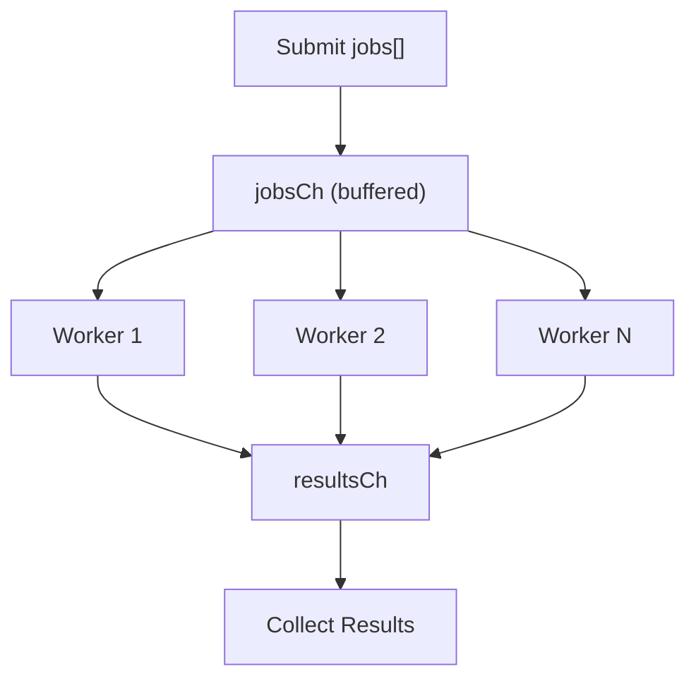
```mermaid
flowchart TD
    A["Submit jobs[]"] --> B["jobsCh (buffered)"]
    B --> W1["Worker 1"]
    B --> W2["Worker 2"]
    B --> W3["Worker N"]
    W1 --> R["resultsCh"]
    W2 --> R
    W3 --> R
    R --> C["Collect Results"]
```

**Execution Trace:**
```
Input:  jobs=[1,2,3], numWorkers=2
Step 1: jobsCh ← [1,2,3], close(jobsCh)
Step 2: Worker1 picks 1 → result 2; Worker2 picks 2 → result 4
Step 3: Worker1 picks 3 → result 6
Step 4: wg.Wait() → close(resultsCh)
Output: [2,4,6] (order may vary)
```

### Interviewer Questions

1. Why use a jobs channel over a mutex-protected slice?
2. Can we improve throughput further? What's the theoretical lower bound for bounded parallelism?
3. How does this scale to 1M concurrent requests with varying job durations?
4. Walk me through the edge case where a worker panics mid-job.
5. How would you add job prioritization while keeping goroutine count bounded?
6. What's the memory/GC impact of buffered channels at 10⁵ capacity?
7. How would you test this comprehensively including worker panic recovery?

### Follow-Up Questions

**Q1:** How do you recover from a panicking worker without killing the pool?
**A1:** Wrap each worker body in `defer func() { if r := recover(); r != nil { p.resultsCh <- Result{Err: fmt.Errorf("panic: %v", r)}; p.wg.Done(); go p.worker() } }()` — recover, emit error result, relaunch worker.

**Q2:** How do you implement graceful shutdown that drains in-flight jobs but rejects new ones?
**A2:** Use an `atomic.Bool` for `closed`; Submit checks it before sending. On shutdown, set closed=true, close jobsCh, call wg.Wait(). In-flight workers finish naturally.

**Q3:** What happens if resultsCh buffer fills up and no consumer is reading?
**A3:** Submit blocks waiting to write results (back-pressure propagates). Use a separate goroutine to drain results or use a large enough buffer, or accept with a select+default to drop.

**Q4:** How would you add metrics (jobs processed/sec, queue depth) to this pool?
**A4:** Use `atomic.Int64` counters incremented in worker loop; expose via a `Stats()` method returning a struct. For queue depth: `len(p.jobsCh)` is safe to call without lock on a channel.

**Q5:** How do you write a deterministic test for this when result order is non-deterministic?
**A5:** Collect all results into a slice, sort it, then compare to expected sorted output. Alternatively, use job IDs and a map to verify each job's output independently.

---

## Q2: Multi-Stage Pipeline  [Level 1 — Beginner]

> **Tags:** `#pipeline` `#channels` `#stage-composition` `#streaming`

### Problem Statement
Build a 3-stage pipeline: Stage 1 generates integers 1..N, Stage 2 squares each integer, Stage 3 filters only even squares. Each stage runs in its own goroutine and communicates via channels. Return all even squares as a slice.

### Input / Output / Constraints

```
Input:  N int = 10
Output: []int{4, 16, 36, 64, 100}  // squares of even numbers

Constraints:
  • 1 ≤ N ≤ 10⁶
  • Pipeline must stream (not buffer all values)
  • Time limit: 1s
```

### Thought Process

Think like a senior Go engineer:
1. **Understand:** Data flows through discrete transformation stages; each stage is independently concurrent.
2. **Pattern:** Each stage function takes an input `<-chan int` and returns an output `<-chan int`, composable by chaining.
3. **Edge cases:** N=0 yields empty output; early consumer exit must not leak producer goroutines — use `context.Context` for cancellation.
4. **Approach:** Stage functions as first-class composable units; goroutine per stage writing to its own channel, closing on done.

### Brute Force Solution

```go
package main

// bruteForce — O(N) time, O(N) space
// Processes all stages sequentially in one function — no concurrency.
func bruteForce(n int) []int {
	var result []int
	for i := 1; i <= n; i++ {
		sq := i * i
		if sq%2 == 0 {
			result = append(result, sq)
		}
	}
	return result
}
```

**Time:** O(N) | **Space:** O(N)
**Bottleneck:** No concurrency; stages can't overlap work (no pipelining benefit); not composable for complex pipelines.

### Better Solution

```go
// betterSolution — O(N) time, O(1) streaming space per stage
func generate(n int) <-chan int {
	out := make(chan int)
	go func() {
		defer close(out)
		for i := 1; i <= n; i++ {
			out <- i
		}
	}()
	return out
}

func square(in <-chan int) <-chan int {
	out := make(chan int)
	go func() {
		defer close(out)
		for v := range in {
			out <- v * v
		}
	}()
	return out
}

func filterEven(in <-chan int) <-chan int {
	out := make(chan int)
	go func() {
		defer close(out)
		for v := range in {
			if v%2 == 0 {
				out <- v
			}
		}
	}()
	return out
}
```

**Time:** O(N) | **Space:** O(1) per stage (streaming)

### Best / Optimal Solution

```go
package main

import (
	"context"
	"fmt"
)

// Stage is a function that transforms a channel of T to a channel of T.
// Each stage runs in its own goroutine and respects context cancellation.

func generateCtx(ctx context.Context, n int) <-chan int {
	out := make(chan int)
	go func() {
		defer close(out)
		for i := 1; i <= n; i++ {
			select {
			case <-ctx.Done():
				return
			case out <- i:
			}
		}
	}()
	return out
}

func squareCtx(ctx context.Context, in <-chan int) <-chan int {
	out := make(chan int)
	go func() {
		defer close(out)
		for {
			select {
			case <-ctx.Done():
				return
			case v, ok := <-in:
				if !ok {
					return
				}
				select {
				case <-ctx.Done():
					return
				case out <- v * v:
				}
			}
		}
	}()
	return out
}

func filterEvenCtx(ctx context.Context, in <-chan int) <-chan int {
	out := make(chan int)
	go func() {
		defer close(out)
		for {
			select {
			case <-ctx.Done():
				return
			case v, ok := <-in:
				if !ok {
					return
				}
				if v%2 == 0 {
					select {
					case <-ctx.Done():
						return
					case out <- v:
					}
				}
			}
		}
	}()
	return out
}

// Pipeline composes stages and collects results.
func Pipeline(ctx context.Context, n int) []int {
	gen := generateCtx(ctx, n)
	sq := squareCtx(ctx, gen)
	filtered := filterEvenCtx(ctx, sq)

	var result []int
	for v := range filtered {
		result = append(result, v)
	}
	return result
}

func main() {
	ctx := context.Background()
	result := Pipeline(ctx, 10)
	fmt.Println(result) // [4 16 36 64 100]
}
```

**Time:** O(N) | **Space:** O(1) per stage (true streaming)

### Production Considerations

| Aspect | Details |
|--------|---------|
| **Scalability** | At N=10⁶: pipeline streams without accumulating all values; memory is O(stages) not O(N) |
| **Edge Cases** | N=0: generate closes immediately, downstream stages drain and close cleanly |
| **Error Handling** | Add error alongside value: `chan struct{val int; err error}`; short-circuit on first error via context cancel |
| **Memory** | Unbuffered channels: each stage blocks until downstream consumes — perfect back-pressure |
| **Concurrency** | Each stage goroutine is independent; context.Done() prevents goroutine leaks on early exit |

### Visual Explanation

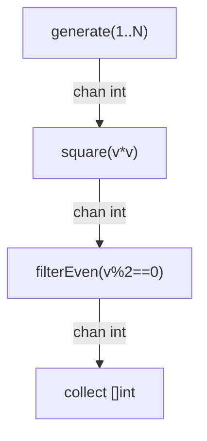
```mermaid
flowchart TD
    A["generate(1..N)"] -->|"chan int"| B["square(v*v)"]
    B -->|"chan int"| C["filterEven(v%2==0)"]
    C -->|"chan int"| D["collect []int"]
```

**Execution Trace:**
```
Input:  N=5
Stage1: 1→2→3→4→5 (generate)
Stage2: 1→4→9→16→25 (square)
Stage3: 4→16 (filter even)
Output: [4, 16]
```

### Interviewer Questions

1. Why prefer channel-based pipeline over a simple for-loop with function calls?
2. Can we add more parallelism within a stage? How does that affect ordering?
3. How does this scale if Stage 2 (square) is 100x slower than Stage 1?
4. Walk me through the goroutine leak scenario when a consumer exits early.
5. How would you make this pipeline type-generic using Go generics?
6. What's the memory overhead of each channel hop?
7. How would you benchmark individual stage throughput?

### Follow-Up Questions

**Q1:** How do you add error propagation through the pipeline without breaking the stage contract?
**A1:** Change channel type to a struct `{Val int; Err error}`. Each stage checks `Err != nil` and forwards it unchanged. The final collector checks errors. Alternatively use `context.WithCancelCause`.

**Q2:** How do you parallelize a slow middle stage (fan-out within pipeline)?
**A2:** Spin up M goroutines all reading from the same input channel and all writing to the same output channel. Use a WaitGroup to close output after all M goroutines finish.

**Q3:** What happens with unbuffered vs buffered channels in a pipeline?
**A3:** Unbuffered: perfect back-pressure, each stage blocks until downstream is ready — low memory, reduces throughput. Buffered: stages can run ahead, improving throughput at the cost of memory; good when stages have variable latency.

**Q4:** How do you implement a pipeline timeout — abort everything if any stage takes too long?
**A4:** Pass `context.WithTimeout(parent, 5*time.Second)` into all stages. Each stage select includes `case <-ctx.Done()`. The timeout fires, context cancels, all stages return, channels close, collector drains.

**Q5:** How would you test each stage in isolation?
**A5:** Create a test channel, send known values, close it, collect output from the stage's output channel, assert. Example: `in := make(chan int, 3); in<-2; in<-4; close(in); out := squareCtx(ctx, in); assert.Equal(t, []int{4,16}, collect(out))`.

---

## Q3: Fan-Out Fan-In  [Level 2 — Easy]

> **Tags:** `#fan-out` `#fan-in` `#merge` `#parallel-processing` `#channels`

### Problem Statement
Given a single input channel of URLs, fan out to N worker goroutines that each fetch the URL (simulated by a function), then fan in all responses into a single output channel. Order of results is not guaranteed. Implement both the fan-out and fan-in (merge) functions.

### Input / Output / Constraints

```
Input:  urls []string{"a","b","c","d","e","f"}, workers int = 3
Output: []string{fetched results, order may vary}

Constraints:
  • 1 ≤ workers ≤ 100
  • 1 ≤ len(urls) ≤ 10⁴
  • Simulated fetch latency: 0–100ms
  • Time limit: 5s total
```

### Thought Process

Think like a senior Go engineer:
1. **Understand:** Fan-out distributes work across N parallel workers; fan-in merges N output channels into 1.
2. **Pattern:** Fan-out: N goroutines all reading from same input channel. Fan-in (merge): one goroutine per input channel, all writing to one output channel, WaitGroup closes output.
3. **Edge cases:** Worker count > jobs count (some workers do nothing), fetch errors need propagation, context cancellation.
4. **Approach:** Separate fan-out and merge as reusable functions; use sync.WaitGroup in merge to detect all inputs exhausted.

### Brute Force Solution

```go
package main

// bruteForce — sequential fetch, O(N*latency) time
func bruteForce(urls []string, fetch func(string) string) []string {
	var results []string
	for _, u := range urls {
		results = append(results, fetch(u))
	}
	return results
}
```

**Time:** O(N × latency) | **Space:** O(N)
**Bottleneck:** Sequential fetches; total time = sum of all latencies instead of max latency.

### Better Solution

```go
// betterSolution — parallel with WaitGroup, O(latency_max) time
func betterSolution(urls []string, fetch func(string) string) []string {
	var mu sync.Mutex
	var results []string
	var wg sync.WaitGroup
	for _, u := range urls {
		wg.Add(1)
		u := u
		go func() {
			defer wg.Done()
			r := fetch(u)
			mu.Lock()
			results = append(results, r)
			mu.Unlock()
		}()
	}
	wg.Wait()
	return results
}
```

**Time:** O(max latency) | **Space:** O(N)

### Best / Optimal Solution

```go
package main

import (
	"context"
	"fmt"
	"sync"
	"time"
)

// FetchResult holds the URL and its fetched content or error.
type FetchResult struct {
	URL    string
	Body   string
	Err    error
}

// fanOut distributes urls to N worker goroutines; each reads from urlsCh.
func fanOut(ctx context.Context, urlsCh <-chan string, workers int, fetch func(string) (string, error)) []<-chan FetchResult {
	channels := make([]<-chan FetchResult, workers)
	for i := 0; i < workers; i++ {
		ch := make(chan FetchResult)
		channels[i] = ch
		go func(out chan<- FetchResult) {
			defer close(out)
			for {
				select {
				case <-ctx.Done():
					return
				case url, ok := <-urlsCh:
					if !ok {
						return
					}
					body, err := fetch(url)
					select {
					case <-ctx.Done():
						return
					case out <- FetchResult{URL: url, Body: body, Err: err}:
					}
				}
			}
		}(ch)
	}
	return channels
}

// merge (fan-in) combines multiple result channels into one.
func merge(ctx context.Context, channels ...<-chan FetchResult) <-chan FetchResult {
	out := make(chan FetchResult)
	var wg sync.WaitGroup
	forward := func(ch <-chan FetchResult) {
		defer wg.Done()
		for {
			select {
			case <-ctx.Done():
				return
			case v, ok := <-ch:
				if !ok {
					return
				}
				select {
				case <-ctx.Done():
					return
				case out <- v:
				}
			}
		}
	}
	wg.Add(len(channels))
	for _, ch := range channels {
		go forward(ch)
	}
	go func() {
		wg.Wait()
		close(out)
	}()
	return out
}

func main() {
	ctx, cancel := context.WithTimeout(context.Background(), 5*time.Second)
	defer cancel()

	urls := []string{"url-a", "url-b", "url-c", "url-d", "url-e", "url-f"}
	urlsCh := make(chan string, len(urls))
	for _, u := range urls {
		urlsCh <- u
	}
	close(urlsCh)

	// Simulated fetch
	fetch := func(url string) (string, error) {
		time.Sleep(10 * time.Millisecond)
		return "result:" + url, nil
	}

	workerChans := fanOut(ctx, urlsCh, 3, fetch)
	results := merge(ctx, workerChans...)

	for r := range results {
		if r.Err != nil {
			fmt.Printf("error fetching %s: %v\n", r.URL, r.Err)
			continue
		}
		fmt.Println(r.Body)
	}
}
```

**Time:** O(N/W × latency) | **Space:** O(W) goroutines

### Production Considerations

| Aspect | Details |
|--------|---------|
| **Scalability** | W=100 workers on N=10⁴ URLs: ~100 rounds, each round takes max(latency); total ≈ 100 × latency |
| **Edge Cases** | W > N: extra workers read from closed channel and exit cleanly; W=0: guard with `max(1, workers)` |
| **Error Handling** | FetchResult.Err carries per-URL errors; merge does not suppress them |
| **Memory** | One goroutine per worker + one per merge forwarder = 2W goroutines |
| **Concurrency** | urlsCh is shared safely by all workers (channel is concurrency-safe by design) |

### Visual Explanation

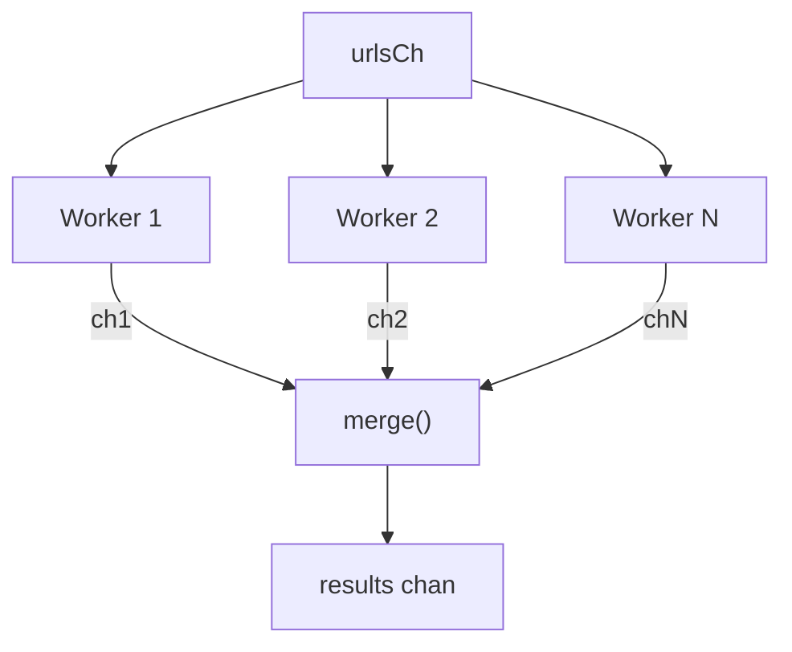
```mermaid
flowchart TD
    A["urlsCh"] --> W1["Worker 1"]
    A --> W2["Worker 2"]
    A --> W3["Worker N"]
    W1 -->|"ch1"| M["merge()"]
    W2 -->|"ch2"| M
    W3 -->|"chN"| M
    M --> O["results chan"]
```

**Execution Trace:**
```
Input:  ["a","b","c","d"], workers=2
Step 1: W1 picks "a", W2 picks "b" (concurrent)
Step 2: W1→"result:a" merged; W2→"result:b" merged
Step 3: W1 picks "c", W2 picks "d"
Output: ["result:a","result:b","result:c","result:d"] (order may vary)
```

### Interviewer Questions

1. Why does each worker read from a shared channel instead of getting a pre-assigned slice?
2. How would you add rate limiting per worker (e.g., max 10 requests/sec per worker)?
3. How does this scale to 1M URLs with 100 workers?
4. Walk me through what happens if the merge goroutine's output channel blocks.
5. How would you implement ordered fan-in (preserve input order)?
6. What's the goroutine count at steady state? Can we reduce it?
7. How would you test fan-out/fan-in with flaky fetch simulations?

### Follow-Up Questions

**Q1:** How do you implement ordered fan-in while keeping parallel execution?
**A1:** Attach a sequence number to each job before fan-out. In fan-in, use a min-heap or a `map[int]Result` resequencer: buffer out-of-order results and emit in-order once the expected sequence arrives.

**Q2:** How do you limit total in-flight requests across all workers to avoid overwhelming a downstream service?
**A2:** Use a semaphore channel `sem := make(chan struct{}, maxInFlight)`. Each worker acquires `sem <- struct{}{}` before fetching and releases `<-sem` after. This global rate-limits across all workers.

**Q3:** What if some URLs are much slower than others and starve fast URLs?
**A3:** This is the head-of-line blocking problem. Mitigate with per-URL timeouts (`context.WithTimeout`) and a separate slow-path worker pool for URLs that exceed a latency threshold.

**Q4:** How do you implement retry within the worker without blocking other jobs?
**A4:** Retry inline with exponential backoff inside the worker goroutine. For distributed retry with backoff queuing, re-enqueue the URL into a separate retry channel with a delay via `time.AfterFunc`.

**Q5:** How would you measure fan-out efficiency (are workers actually running in parallel)?
**A5:** Use `pprof` goroutine profiles or add per-worker atomic counters. Track wall time vs sum of individual fetch times; ratio should approach 1/W for perfectly parallel work.

---

## Q4: Pub-Sub Broker  [Level 2 — Easy]

> **Tags:** `#pub-sub` `#broker` `#event-driven` `#channels` `#sync`

### Problem Statement
Implement a Pub-Sub broker where publishers send messages on named topics and subscribers receive messages for topics they have subscribed to. The broker must support: Subscribe(topic) returning a channel, Publish(topic, msg) delivering to all subscribers of that topic, and Unsubscribe(topic, ch) removing a subscriber. Messages must not be dropped for active subscribers.

### Input / Output / Constraints

```
Input:  topic="orders", subscribers=3, messages=["order1","order2"]
Output: Each subscriber receives ["order1","order2"]

Constraints:
  • Up to 1000 topics
  • Up to 10000 subscribers per topic
  • Messages must not be dropped (blocking send acceptable)
  • Time limit: 1s per publish
```

### Thought Process

Think like a senior Go engineer:
1. **Understand:** A broker maintains a registry of topic→[]subscriber_channels. Publish fans out to all channels.
2. **Pattern:** RWMutex protects the subscriber map (reads are frequent). Each subscriber gets a buffered channel.
3. **Edge cases:** Publishing to a topic with no subscribers (no-op), subscriber channel full (slow consumer), unsubscribe during publish.
4. **Approach:** Copy subscriber list under read lock, then send without holding the lock to avoid deadlock.

### Brute Force Solution

```go
package main

// bruteForce — simple map with Mutex, sends hold the lock (blocks all ops)
type BruteForce struct {
	mu   sync.Mutex
	subs map[string][]chan string
}

func (b *BruteForce) Publish(topic, msg string) {
	b.mu.Lock()
	defer b.mu.Unlock()
	for _, ch := range b.subs[topic] {
		ch <- msg // BLOCKS holding the lock if slow consumer
	}
}
```

**Time:** O(S) per publish | **Space:** O(T×S)
**Bottleneck:** Holding mutex during channel send blocks all other pub/sub operations for that broker.

### Better Solution

```go
// betterSolution — copy subscriber list before releasing lock
func (b *Broker) Publish(topic, msg string) {
	b.mu.RLock()
	subs := make([]chan string, len(b.subs[topic]))
	copy(subs, b.subs[topic])
	b.mu.RUnlock()
	for _, ch := range subs {
		ch <- msg // send without lock
	}
}
```

**Time:** O(S) | **Space:** O(S) copy per publish

### Best / Optimal Solution

```go
package main

import (
	"fmt"
	"sync"
)

// Broker is a concurrent-safe Pub-Sub message broker.
type Broker struct {
	mu     sync.RWMutex
	subs   map[string]map[chan string]struct{}
	closed bool
}

// NewBroker creates a ready-to-use broker.
func NewBroker() *Broker {
	return &Broker{
		subs: make(map[string]map[chan string]struct{}),
	}
}

// Subscribe registers a subscriber for topic and returns its receive channel.
func (b *Broker) Subscribe(topic string, bufSize int) (<-chan string, error) {
	b.mu.Lock()
	defer b.mu.Unlock()
	if b.closed {
		return nil, fmt.Errorf("broker is closed")
	}
	ch := make(chan string, bufSize)
	if _, ok := b.subs[topic]; !ok {
		b.subs[topic] = make(map[chan string]struct{})
	}
	b.subs[topic][ch] = struct{}{}
	return ch, nil
}

// Unsubscribe removes the subscriber and closes its channel.
func (b *Broker) Unsubscribe(topic string, ch <-chan string) {
	b.mu.Lock()
	defer b.mu.Unlock()
	wch := chan string(ch) // recover writable handle (held only by broker)
	if set, ok := b.subs[topic]; ok {
		if _, exists := set[wch]; exists {
			delete(set, wch)
			close(wch)
		}
	}
}

// Publish sends msg to all subscribers of topic.
// Uses a copy of subscribers to avoid holding the lock during sends.
func (b *Broker) Publish(topic, msg string) {
	b.mu.RLock()
	set := b.subs[topic]
	// Snapshot subscriber channels under read lock.
	snapshot := make([]chan string, 0, len(set))
	for ch := range set {
		snapshot = append(snapshot, ch)
	}
	b.mu.RUnlock()

	for _, ch := range snapshot {
		// Non-blocking send: drop message for slow consumers (choose policy).
		select {
		case ch <- msg:
		default:
			// slow consumer: could log, could block, depends on SLA
		}
	}
}

// Close shuts down the broker, closing all subscriber channels.
func (b *Broker) Close() {
	b.mu.Lock()
	defer b.mu.Unlock()
	if b.closed {
		return
	}
	b.closed = true
	for _, set := range b.subs {
		for ch := range set {
			close(ch)
		}
	}
	b.subs = make(map[string]map[chan string]struct{})
}

func main() {
	broker := NewBroker()

	ch1, _ := broker.Subscribe("orders", 10)
	ch2, _ := broker.Subscribe("orders", 10)

	broker.Publish("orders", "order-1")
	broker.Publish("orders", "order-2")

	broker.Close()

	for msg := range ch1 {
		fmt.Println("sub1:", msg)
	}
	for msg := range ch2 {
		fmt.Println("sub2:", msg)
	}
}
```

**Time:** O(S) per publish (S = subscribers) | **Space:** O(T × S) for registry

### Production Considerations

| Aspect | Details |
|--------|---------|
| **Scalability** | 10K subscribers: snapshot loop takes O(10K) under RLock; publish fan-out is O(10K) concurrent selects |
| **Edge Cases** | Publish to non-existent topic: no-op; unsubscribe already-removed channel: no-op with existence check |
| **Error Handling** | Slow consumer policy: drop (non-blocking), block (blocking send), or dead-letter queue |
| **Memory** | Each subscriber channel: bufSize × sizeof(string) + channel metadata (~96 bytes) |
| **Concurrency** | RWMutex allows concurrent publishes to different topics; Subscribe/Unsubscribe are exclusive write ops |

### Visual Explanation

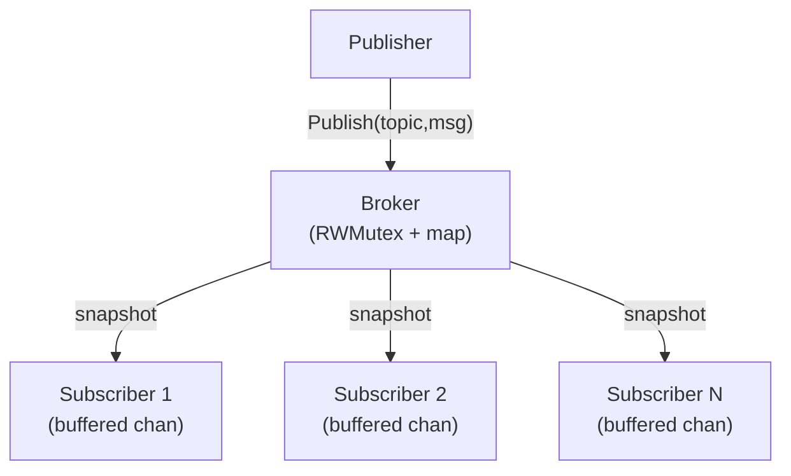
```mermaid
flowchart TD
    P["Publisher"] -->|"Publish(topic,msg)"| B["Broker\n(RWMutex + map)"]
    B -->|"snapshot"| S1["Subscriber 1\n(buffered chan)"]
    B -->|"snapshot"| S2["Subscriber 2\n(buffered chan)"]
    B -->|"snapshot"| S3["Subscriber N\n(buffered chan)"]
```

**Execution Trace:**
```
Input:  topic="orders", subs=[ch1,ch2], msg="order-1"
Step 1: RLock → snapshot=[ch1,ch2] → RUnlock
Step 2: ch1 <- "order-1" (non-blocking)
Step 3: ch2 <- "order-1" (non-blocking)
Output: ch1 and ch2 each receive "order-1"
```

### Interviewer Questions

1. Why copy the subscriber list before sending instead of holding the lock?
2. What's the trade-off between blocking and non-blocking send for slow consumers?
3. How does this scale to 10K topics × 1K subscribers each?
4. Walk me through the race condition if Unsubscribe and Publish run simultaneously.
5. How would you add message persistence (at-least-once delivery)?
6. What's the memory impact of 10K buffered subscriber channels?
7. How would you test concurrent subscribe/publish/unsubscribe safely?

### Follow-Up Questions

**Q1:** How do you implement topic wildcards (e.g., subscribe to "orders.*")?
**A1:** At subscribe time, store the pattern. At publish time, iterate all subscriptions matching the topic using `filepath.Match` or a trie for efficient prefix matching. For high-throughput, precompute a topic→subscriber list cache and invalidate on new subscriptions.

**Q2:** How do you guarantee at-least-once delivery for critical messages?
**A2:** Use a persistent message log (append-only file or Redis stream). Each subscriber tracks its offset. On reconnect, replay from last acknowledged offset. The broker stores all messages until all subscribers acknowledge.

**Q3:** How do you handle a subscriber that is permanently stuck (channel full, never draining)?
**A3:** Track last-send timestamp per subscriber. If a subscriber's channel is full for >N seconds, log a warning and either forcibly close the channel (notify the subscriber) or apply a timeout-based drop policy.

**Q4:** How would you distribute this broker across multiple nodes?
**A4:** Use a shared message bus (Redis Pub/Sub, NATS, Kafka). Each node's local broker publishes to and subscribes from the bus. Horizontal scaling is achieved by partitioning topics across nodes.

**Q5:** How do you test that messages are not dropped under concurrent publish?
**A5:** Use a counter: publish N messages, collect all subscriber receives, assert count == N × subscribers. Run under `-race` flag. Use `sync/atomic` to count delivered messages across goroutines.

---

## Q5: Circuit Breaker (Closed/Open/Half-Open States)  [Level 3 — Medium]

> **Tags:** `#circuit-breaker` `#resilience` `#state-machine` `#fault-tolerance` `#uber` `#netflix`

### Problem Statement
Implement a Circuit Breaker with three states: Closed (normal operation), Open (fast-fail, no calls), and Half-Open (probe one request). The breaker opens after `failureThreshold` consecutive failures, stays open for `timeout` duration, then transitions to Half-Open. A successful probe closes it; a failed probe re-opens it.

### Input / Output / Constraints

```
Input:  failureThreshold=3, timeout=5s, operation func() error
Output: result error (ErrCircuitOpen when open, operation's error when closed/half-open)

Constraints:
  • Thread-safe: multiple goroutines call Execute() concurrently
  • State transitions must be atomic
  • Time limit per call: operation's own timeout
```

### Thought Process

Think like a senior Go engineer:
1. **Understand:** A state machine wraps an operation. It tracks failure streaks and time-based recovery.
2. **Pattern:** State machine with mutex-protected state transitions; atomic comparison for half-open probe slot.
3. **Edge cases:** Concurrent calls when transitioning to Half-Open (only one probe allowed), clock-based transitions, panic in operation.
4. **Approach:** Use `sync.Mutex` for state; `time.Now()` for open timeout; `atomic.Bool` for half-open probe slot claim.

### Brute Force Solution

```go
package main

// bruteForce — single mutex, no half-open state
type BruteForceBreaker struct {
	mu        sync.Mutex
	failures  int
	threshold int
	open      bool
	openedAt  time.Time
	timeout   time.Duration
}

func (b *BruteForceBreaker) Execute(op func() error) error {
	b.mu.Lock()
	defer b.mu.Unlock()
	if b.open {
		if time.Since(b.openedAt) > b.timeout {
			b.open = false // reset directly — no half-open
		} else {
			return fmt.Errorf("circuit open")
		}
	}
	err := op() // holds mutex during op — serializes all calls
	if err != nil {
		b.failures++
		if b.failures >= b.threshold {
			b.open = true
			b.openedAt = time.Now()
		}
	} else {
		b.failures = 0
	}
	return err
}
```

**Time:** O(1) | **Space:** O(1)
**Bottleneck:** Holds mutex during operation execution — serializes all concurrent callers. No Half-Open state.

### Better Solution

```go
// betterSolution — releases lock during operation execution
func (b *Breaker) Execute(op func() error) error {
	b.mu.Lock()
	if b.state == Open && time.Since(b.openedAt) > b.timeout {
		b.state = HalfOpen
	}
	if b.state == Open {
		b.mu.Unlock()
		return ErrCircuitOpen
	}
	b.mu.Unlock()

	err := op() // execute without lock

	b.mu.Lock()
	defer b.mu.Unlock()
	b.record(err)
	return err
}
```

**Time:** O(1) | **Space:** O(1)

### Best / Optimal Solution

```go
package main

import (
	"errors"
	"fmt"
	"sync"
	"sync/atomic"
	"time"
)

// State represents the circuit breaker state.
type State int32

const (
	StateClosed   State = iota // normal operation
	StateOpen                  // fast-fail
	StateHalfOpen              // one probe request allowed
)

var ErrCircuitOpen = errors.New("circuit breaker is open")

// CircuitBreaker wraps operations with fault-tolerance logic.
type CircuitBreaker struct {
	mu               sync.Mutex
	state            State
	failures         int
	successes        int
	failureThreshold int
	successThreshold int // consecutive successes to re-close from half-open
	timeout          time.Duration
	openedAt         time.Time
	halfOpenSlot     atomic.Bool // true if a probe is in-flight
}

// NewCircuitBreaker creates a circuit breaker with given thresholds.
func NewCircuitBreaker(failureThreshold, successThreshold int, timeout time.Duration) *CircuitBreaker {
	return &CircuitBreaker{
		failureThreshold: failureThreshold,
		successThreshold: successThreshold,
		timeout:          timeout,
		state:            StateClosed,
	}
}

// State returns the current state (for observability).
func (cb *CircuitBreaker) CurrentState() State {
	cb.mu.Lock()
	defer cb.mu.Unlock()
	return cb.state
}

// Execute runs the operation through the circuit breaker.
func (cb *CircuitBreaker) Execute(op func() error) error {
	// Fast-path state check.
	cb.mu.Lock()
	switch cb.state {
	case StateOpen:
		if time.Since(cb.openedAt) >= cb.timeout {
			cb.state = StateHalfOpen
			cb.failures = 0
			cb.successes = 0
		} else {
			cb.mu.Unlock()
			return ErrCircuitOpen
		}
	case StateHalfOpen:
		// Only one probe at a time; others fast-fail.
		if !cb.halfOpenSlot.CompareAndSwap(false, true) {
			cb.mu.Unlock()
			return ErrCircuitOpen
		}
	}
	cb.mu.Unlock()

	// Execute operation outside the lock.
	err := cb.callWithRecover(op)

	cb.mu.Lock()
	defer cb.mu.Unlock()

	if cb.state == StateHalfOpen {
		cb.halfOpenSlot.Store(false)
	}

	if err != nil {
		cb.onFailure()
	} else {
		cb.onSuccess()
	}
	return err
}

func (cb *CircuitBreaker) callWithRecover(op func() error) (err error) {
	defer func() {
		if r := recover(); r != nil {
			err = fmt.Errorf("operation panicked: %v", r)
		}
	}()
	return op()
}

// onFailure records a failure and potentially opens the circuit.
func (cb *CircuitBreaker) onFailure() {
	cb.failures++
	cb.successes = 0
	if cb.state == StateHalfOpen || cb.failures >= cb.failureThreshold {
		cb.state = StateOpen
		cb.openedAt = time.Now()
	}
}

// onSuccess records a success and potentially closes the circuit.
func (cb *CircuitBreaker) onSuccess() {
	cb.successes++
	cb.failures = 0
	if cb.state == StateHalfOpen && cb.successes >= cb.successThreshold {
		cb.state = StateClosed
	}
}

func main() {
	cb := NewCircuitBreaker(3, 1, 2*time.Second)

	fail := func() error { return errors.New("service unavailable") }
	succeed := func() error { return nil }

	for i := 0; i < 3; i++ {
		fmt.Println("attempt", i+1, ":", cb.Execute(fail))
	}
	fmt.Println("state:", cb.CurrentState()) // Open

	fmt.Println("fast-fail:", cb.Execute(succeed)) // ErrCircuitOpen

	time.Sleep(2 * time.Second)
	fmt.Println("probe:", cb.Execute(succeed)) // nil — half-open probe succeeds
	fmt.Println("state:", cb.CurrentState())   // Closed
}
```

**Time:** O(1) per Execute | **Space:** O(1)

### Production Considerations

| Aspect | Details |
|--------|---------|
| **Scalability** | O(1) per call; atomic slot claim for Half-Open prevents thundering herd on recovery |
| **Edge Cases** | Concurrent transition from Open→Half-Open: only one goroutine sets state, others see Open |
| **Error Handling** | Distinguishes ErrCircuitOpen (circuit policy) from operation errors (business logic) |
| **Memory** | Minimal: single struct, no per-call allocation |
| **Concurrency** | Mutex protects state machine; atomic bool protects half-open probe slot without holding mutex |

### Visual Explanation

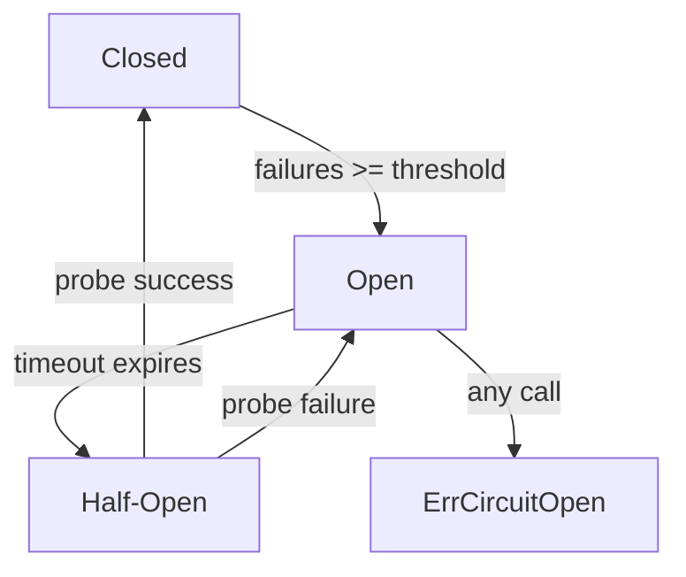
```mermaid
flowchart TD
    A["Closed"] -->|"failures >= threshold"| B["Open"]
    B -->|"timeout expires"| C["Half-Open"]
    C -->|"probe success"| A
    C -->|"probe failure"| B
    B -->|"any call"| E["ErrCircuitOpen"]
```

**Execution Trace:**
```
Input:  threshold=3, calls=[fail,fail,fail,call,sleep2s,succeed]
Step 1: fail×3 → failures=3 → state=Open
Step 2: call → ErrCircuitOpen (fast-fail)
Step 3: sleep(2s) → timeout expired
Step 4: succeed (probe) → Half-Open → success → state=Closed
Output: circuit closed, normal operation resumes
```

### Interviewer Questions

1. Why use an atomic bool for the Half-Open probe slot instead of checking state under mutex?
2. How does this differ from a retry mechanism?
3. How does this scale under 10K concurrent goroutines all calling Execute?
4. Walk me through the thundering herd problem when the circuit re-closes.
5. How would you make failure counting use a sliding window instead of consecutive failures?
6. What's the risk of `time.Now()` in concurrent tests and how do you abstract it?
7. How would you export metrics (open/close events, failure rates) from this breaker?

### Follow-Up Questions

**Q1:** How do you implement a sliding window failure rate instead of consecutive count?
**A1:** Maintain a ring buffer of the last N call outcomes (bool). Track failure count as a running sum. On each call, update the ring (add new, subtract evicted). Open circuit when `failureCount/windowSize > threshold%`. Use a circular index with modulo.

**Q2:** How do you test the Half-Open state deterministically?
**A2:** Inject a clock interface `type Clock interface { Now() time.Time }`. In tests, use a `fakeClock` that you advance manually. Set openedAt = fakeClock.Now(), advance by timeout+1, call Execute, assert Half-Open behavior.

**Q3:** How do you wrap this circuit breaker for HTTP clients?
**A3:** Create an `http.RoundTripper` wrapper: `Execute` calls the inner transport's `RoundTrip`. Return `ErrCircuitOpen` as a 503 response or propagate as a connection error. Map 5xx responses as failures, 2xx as successes.

**Q4:** How do you implement per-endpoint circuit breakers in a microservice?
**A4:** Use a `sync.Map` or a map of `circuitBreakers map[string]*CircuitBreaker` with an RWMutex. Key by `"service:endpoint"`. Lazy-initialize on first use. Clean up stale breakers via a background GC goroutine checking last-access time.

**Q5:** How do you write a load test that validates the circuit breaker actually protects the downstream?
**A5:** Use a fake downstream with a configurable error rate. Run 1000 concurrent goroutines calling Execute. Assert: when error rate is 100%, after threshold failures breaker opens; fast-fail latency (no op call) should be <1µs; after timeout, one probe goroutine calls the op, others still fast-fail.

---
## Q6: Token Bucket Rate Limiter  [Level 3 — Medium]

> **Tags:** `#rate-limiting` `#token-bucket` `#concurrency` `#api-gateway` `#uber`

### Problem Statement
Implement a Token Bucket rate limiter. The bucket holds at most `capacity` tokens and refills at `refillRate` tokens per second. Each call to `Allow()` consumes one token and returns `true` if a token was available, `false` otherwise. The implementation must be goroutine-safe and support high-concurrency usage.

### Input / Output / Constraints

```
Input:  capacity=10, refillRate=5 tokens/sec
        calls: 10 rapid Allow() then 1 after 200ms
Output: first 10 → true; next immediate → false; after 200ms → true (1 token refilled)

Constraints:
  • capacity ≥ 1
  • refillRate ≥ 1 token/sec
  • Allow() latency must be O(1)
  • Thread-safe for 10K concurrent callers
```

### Thought Process

Think like a senior Go engineer:
1. **Understand:** Token bucket: tokens accumulate up to capacity at a fixed rate; requests consume tokens.
2. **Pattern:** Lazy refill — compute tokens earned since last check on each Allow() call using elapsed time; no background ticker goroutine needed.
3. **Edge cases:** Tokens never exceed capacity; time.Now() resolution on fast machines; float64 precision for fractional tokens.
4. **Approach:** Store `tokens float64` and `lastRefill time.Time`; on Allow() compute delta, add tokens, cap at capacity, attempt consume — all under mutex.

### Brute Force Solution

```go
package main

// bruteForce — uses a background ticker to refill, more goroutines
type BruteForceLimiter struct {
	mu       sync.Mutex
	tokens   int
	capacity int
	ticker   *time.Ticker
}

func NewBruteForceLimiter(capacity int, refillRate time.Duration) *BruteForceLimiter {
	l := &BruteForceLimiter{tokens: capacity, capacity: capacity}
	l.ticker = time.NewTicker(refillRate)
	go func() { // extra goroutine just for refill
		for range l.ticker.C {
			l.mu.Lock()
			if l.tokens < l.capacity {
				l.tokens++
			}
			l.mu.Unlock()
		}
	}()
	return l
}
```

**Time:** O(1) | **Space:** O(1) + 1 background goroutine
**Bottleneck:** Background goroutine is wasteful; refill resolution limited to ticker interval; goroutine leak if Stop() not called.

### Better Solution

```go
// betterSolution — lazy refill on each call, no background goroutine
type TokenBucketV2 struct {
	mu         sync.Mutex
	tokens     float64
	capacity   float64
	refillRate float64 // tokens per second
	lastRefill time.Time
}

func (l *TokenBucketV2) Allow() bool {
	l.mu.Lock()
	defer l.mu.Unlock()
	now := time.Now()
	elapsed := now.Sub(l.lastRefill).Seconds()
	l.tokens = min(l.capacity, l.tokens+elapsed*l.refillRate)
	l.lastRefill = now
	if l.tokens >= 1 {
		l.tokens--
		return true
	}
	return false
}
```

**Time:** O(1) | **Space:** O(1)

### Best / Optimal Solution

```go
package main

import (
	"fmt"
	"sync"
	"time"
)

// TokenBucket implements a goroutine-safe token bucket rate limiter.
// Uses lazy refill — no background goroutines required.
type TokenBucket struct {
	mu         sync.Mutex
	tokens     float64
	capacity   float64
	refillRate float64 // tokens per nanosecond
	lastRefill time.Time
}

// NewTokenBucket creates a limiter with given capacity and tokens-per-second rate.
func NewTokenBucket(capacity float64, refillPerSec float64) *TokenBucket {
	return &TokenBucket{
		tokens:     capacity,
		capacity:   capacity,
		refillRate: refillPerSec / 1e9, // convert to per-nanosecond
		lastRefill: time.Now(),
	}
}

// Allow attempts to consume n tokens. Returns true if granted.
func (tb *TokenBucket) Allow(n float64) bool {
	tb.mu.Lock()
	defer tb.mu.Unlock()
	tb.refill()
	if tb.tokens >= n {
		tb.tokens -= n
		return true
	}
	return false
}

// refill computes earned tokens since last call (must be called under lock).
func (tb *TokenBucket) refill() {
	now := time.Now()
	elapsed := float64(now.Sub(tb.lastRefill)) // nanoseconds
	earned := elapsed * tb.refillRate
	if earned > 0 {
		tb.tokens += earned
		if tb.tokens > tb.capacity {
			tb.tokens = tb.capacity
		}
		tb.lastRefill = now
	}
}

// Tokens returns current token count (for observability).
func (tb *TokenBucket) Tokens() float64 {
	tb.mu.Lock()
	defer tb.mu.Unlock()
	tb.refill()
	return tb.tokens
}

// WaitUntilAllowed blocks until n tokens are available, then consumes them.
func (tb *TokenBucket) WaitUntilAllowed(n float64) {
	for !tb.Allow(n) {
		tb.mu.Lock()
		deficit := n - tb.tokens
		waitNs := time.Duration(deficit / tb.refillRate)
		tb.mu.Unlock()
		if waitNs < time.Millisecond {
			waitNs = time.Millisecond
		}
		time.Sleep(waitNs)
	}
}

func main() {
	limiter := NewTokenBucket(10, 5) // 10 capacity, 5/sec refill

	allowed := 0
	for i := 0; i < 12; i++ {
		if limiter.Allow(1) {
			allowed++
		}
	}
	fmt.Printf("Allowed in burst: %d/12\n", allowed) // 10/12

	time.Sleep(200 * time.Millisecond) // 1 token refilled
	fmt.Println("After 200ms:", limiter.Allow(1)) // true
}
```

**Time:** O(1) per Allow() | **Space:** O(1)

### Production Considerations

| Aspect | Details |
|--------|---------|
| **Scalability** | 10K concurrent Allow() calls: serialized through mutex; for extreme throughput use sharded buckets |
| **Edge Cases** | n > capacity: always returns false (impossible request); negative n: validate and return error |
| **Error Handling** | Return (bool, error); error for invalid n values |
| **Memory** | One struct, no allocations per Allow() call |
| **Concurrency** | sync.Mutex serializes; for read-heavy workloads consider CAS-based atomic implementation |

### Visual Explanation

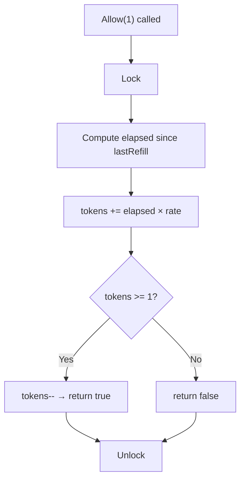
```mermaid
flowchart TD
    A["Allow(1) called"] --> B["Lock"]
    B --> C["Compute elapsed since lastRefill"]
    C --> D["tokens += elapsed × rate"]
    D --> E{"tokens >= 1?"}
    E -->|"Yes"| F["tokens-- → return true"]
    E -->|"No"| G["return false"]
    F --> H["Unlock"]
    G --> H
```

**Execution Trace:**
```
Input:  capacity=3, rate=1/sec, calls=[t=0,t=0,t=0,t=0,t=1s]
t=0: tokens=3→2 → true
t=0: tokens=2→1 → true
t=0: tokens=1→0 → true
t=0: tokens=0   → false
t=1s: refill → tokens=1→0 → true
Output: [true,true,true,false,true]
```

### Interviewer Questions

1. Why use per-nanosecond rate instead of per-second to avoid precision loss?
2. How does this differ from a Leaky Bucket rate limiter?
3. How do you handle burst at startup where all capacity is immediately available?
4. Walk me through float64 precision issues when refillRate is very small.
5. How would you implement a distributed token bucket across multiple instances?
6. What's the impact of clock skew on this implementation?
7. How would you test the exact refill behavior without relying on real time.Sleep?

### Follow-Up Questions

**Q1:** How do you implement a distributed token bucket shared across multiple API gateway nodes?
**A1:** Use Redis with Lua scripts for atomic `GET`+`SET`. The Lua script computes refill based on stored timestamp, updates tokens, and returns allow/deny — all atomically. This avoids race conditions across nodes. Alternative: use Redis's `CL.THROTTLE` command if available.

**Q2:** How does Token Bucket differ from Leaky Bucket?
**A2:** Token Bucket: allows bursts up to capacity; requests succeed immediately if tokens available. Leaky Bucket: output rate is constant (processes one request per interval regardless of burst); excess requests queue or drop. Token Bucket is better for bursty traffic; Leaky Bucket for smooth output rate.

**Q3:** How would you make Allow() non-blocking and instead return a wait duration?
**A3:** `func (tb *TokenBucket) Reserve(n float64) time.Duration` — compute deficit, return `time.Duration(deficit / rate)`. Caller decides whether to sleep or return a 429 response with `Retry-After` header.

**Q4:** How do you inject a fake clock for deterministic testing?
**A4:** Define `type Clock interface { Now() time.Time }`. Inject into TokenBucket. Test with `fakeClock` that returns manually advanced times. Call `Allow()` with specific time advances and assert exact token counts.

**Q5:** How do you implement per-user rate limiting for an API with millions of users?
**A5:** Use a `sync.Map` of `*TokenBucket` keyed by user ID. Lazy-initialize on first request. Add a background sweeper that evicts buckets not accessed in >N minutes using `Range` + timestamp tracking. For millions of users, use sharding: `buckets[hash(userID) % N]` each with its own map and mutex.

---

## Q7: Leaky Bucket Rate Limiter  [Level 3 — Medium]

> **Tags:** `#rate-limiting` `#leaky-bucket` `#queue` `#smooth-output` `#concurrency`

### Problem Statement
Implement a Leaky Bucket rate limiter. Requests are added to a fixed-capacity FIFO queue ("bucket"). A background goroutine drains the queue at a fixed `drainRate` (one request per interval). If the queue is full, new requests are rejected. The implementation must be goroutine-safe and support graceful shutdown.

### Input / Output / Constraints

```
Input:  capacity=5, drainRate=100ms (10 req/sec), incoming=8 requests
Output: 5 accepted, 3 rejected; processed at 100ms intervals

Constraints:
  • capacity ≥ 1
  • drainRate ≥ 1 req/sec
  • goroutine-safe
  • graceful shutdown with drain
```

### Thought Process

Think like a senior Go engineer:
1. **Understand:** Leaky Bucket enforces constant output rate. Incoming bursts are absorbed up to capacity; overflow is rejected.
2. **Pattern:** A buffered channel of capacity C acts as the bucket. A ticker-driven goroutine drains one request per tick.
3. **Edge cases:** Shutdown with items still queued (drain vs discard); zero capacity; drain goroutine blocked on empty bucket.
4. **Approach:** `requests chan Request` as the bucket (capacity = bucket size). Ticker drains one per interval. `close(done)` for shutdown signal.

### Brute Force Solution

```go
package main

// bruteForce — mutex + slice as queue, manual drain goroutine
type BruteForceLeaky struct {
	mu       sync.Mutex
	queue    []func()
	capacity int
}

func (l *BruteForceLeaky) Add(fn func()) bool {
	l.mu.Lock()
	defer l.mu.Unlock()
	if len(l.queue) >= l.capacity {
		return false
	}
	l.queue = append(l.queue, fn)
	return true
}

// drain pops one element — no smooth timing control
func (l *BruteForceLeaky) drain() func() {
	l.mu.Lock()
	defer l.mu.Unlock()
	if len(l.queue) == 0 {
		return nil
	}
	fn := l.queue[0]
	l.queue = l.queue[1:] // O(N) shift — inefficient
	return fn
}
```

**Time:** O(N) per drain (slice shift) | **Space:** O(capacity)
**Bottleneck:** O(N) slice shift on every drain; slice grows without bound if capacity check is wrong.

### Better Solution

```go
// betterSolution — channel as bucket (O(1) enqueue/dequeue)
type LeakyBucket struct {
	bucket chan func()
	ticker *time.Ticker
	done   chan struct{}
}

func NewLeakyBucket(capacity int, rate time.Duration) *LeakyBucket {
	lb := &LeakyBucket{
		bucket: make(chan func(), capacity),
		ticker: time.NewTicker(rate),
		done:   make(chan struct{}),
	}
	go lb.drain()
	return lb
}

func (lb *LeakyBucket) Add(fn func()) bool {
	select {
	case lb.bucket <- fn:
		return true
	default:
		return false // bucket full
	}
}

func (lb *LeakyBucket) drain() {
	defer lb.ticker.Stop()
	for {
		select {
		case <-lb.done:
			return
		case <-lb.ticker.C:
			select {
			case fn := <-lb.bucket:
				fn()
			default:
				// bucket empty, nothing to drain
			}
		}
	}
}
```

**Time:** O(1) enqueue/dequeue | **Space:** O(capacity)

### Best / Optimal Solution

```go
package main

import (
	"context"
	"fmt"
	"sync/atomic"
	"time"
)

// Request wraps a unit of work with result handling.
type Request struct {
	Work   func() error
	Result chan<- error
}

// LeakyBucketLimiter enforces a constant output rate with bounded queue.
type LeakyBucketLimiter struct {
	bucket    chan Request
	drainRate time.Duration
	processed atomic.Int64
	dropped   atomic.Int64
}

// NewLeakyBucketLimiter creates and starts the limiter.
func NewLeakyBucketLimiter(capacity int, drainRate time.Duration) *LeakyBucketLimiter {
	return &LeakyBucketLimiter{
		bucket:    make(chan Request, capacity),
		drainRate: drainRate,
	}
}

// Submit attempts to enqueue a request. Returns false if bucket is full.
func (lb *LeakyBucketLimiter) Submit(req Request) bool {
	select {
	case lb.bucket <- req:
		return true
	default:
		lb.dropped.Add(1)
		return false
	}
}

// Run starts the drain loop. Blocks until ctx is cancelled.
// After ctx cancels, drains remaining items before returning.
func (lb *LeakyBucketLimiter) Run(ctx context.Context) {
	ticker := time.NewTicker(lb.drainRate)
	defer ticker.Stop()

	for {
		select {
		case <-ctx.Done():
			// Drain remaining requests gracefully.
			lb.drainRemaining()
			return
		case <-ticker.C:
			select {
			case req := <-lb.bucket:
				err := lb.execute(req)
				if req.Result != nil {
					req.Result <- err
				}
				lb.processed.Add(1)
			default:
				// nothing to drain
			}
		}
	}
}

func (lb *LeakyBucketLimiter) execute(req Request) (err error) {
	defer func() {
		if r := recover(); r != nil {
			err = fmt.Errorf("work panicked: %v", r)
		}
	}()
	return req.Work()
}

func (lb *LeakyBucketLimiter) drainRemaining() {
	for {
		select {
		case req := <-lb.bucket:
			err := lb.execute(req)
			if req.Result != nil {
				req.Result <- err
			}
			lb.processed.Add(1)
		default:
			return
		}
	}
}

// Stats returns processed and dropped counts.
func (lb *LeakyBucketLimiter) Stats() (processed, dropped int64) {
	return lb.processed.Load(), lb.dropped.Load()
}

func main() {
	ctx, cancel := context.WithCancel(context.Background())
	limiter := NewLeakyBucketLimiter(5, 100*time.Millisecond)

	go limiter.Run(ctx)

	accepted := 0
	for i := 0; i < 8; i++ {
		res := make(chan error, 1)
		i := i
		ok := limiter.Submit(Request{
			Work:   func() error { fmt.Printf("processing req %d\n", i); return nil },
			Result: res,
		})
		if ok {
			accepted++
		}
	}
	fmt.Printf("Accepted: %d, Rejected: %d\n", accepted, 8-accepted)

	time.Sleep(800 * time.Millisecond) // let bucket drain
	cancel()

	time.Sleep(50 * time.Millisecond)
	p, d := limiter.Stats()
	fmt.Printf("Processed: %d, Dropped: %d\n", p, d)
}
```

**Time:** O(1) per Submit | **Space:** O(capacity)

### Production Considerations

| Aspect | Details |
|--------|---------|
| **Scalability** | Constant output rate regardless of input burst; queue depth is the only memory variable |
| **Edge Cases** | capacity=0: every request dropped; drainRate=0: panic — validate in constructor |
| **Error Handling** | Work errors returned via Result channel; panic recovery in execute() |
| **Memory** | channel buffer: capacity × sizeof(Request); each Request is 2 pointers = 16 bytes |
| **Concurrency** | channel Send is goroutine-safe; atomic counters for stats avoid mutex |

### Visual Explanation

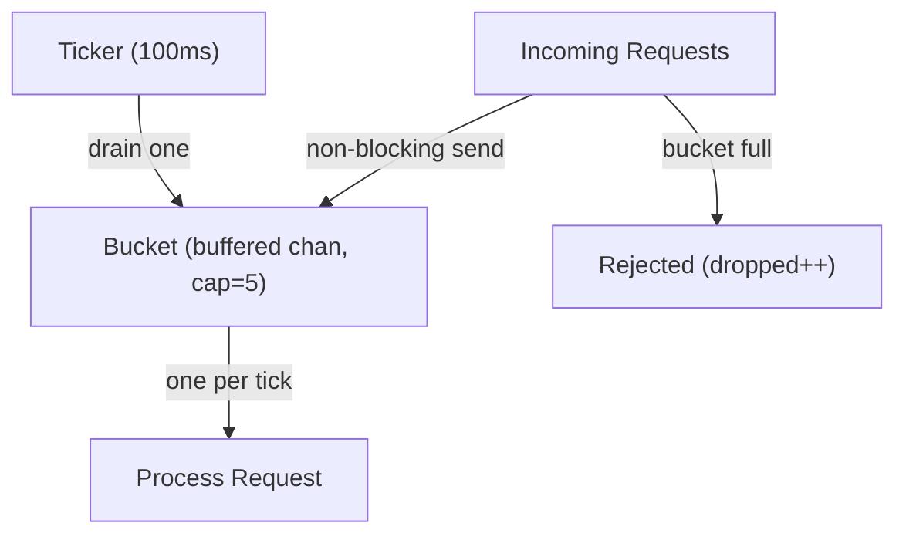
```mermaid
flowchart TD
    I["Incoming Requests"] -->|"non-blocking send"| B["Bucket (buffered chan, cap=5)"]
    I -->|"bucket full"| X["Rejected (dropped++)"]
    T["Ticker (100ms)"] -->|"drain one"| B
    B -->|"one per tick"| P["Process Request"]
```

**Execution Trace:**
```
Input:  8 requests, capacity=5, drain=100ms
t=0ms:  req1-5 enqueued (bucket full), req6-8 rejected
t=100ms: drain req1 → processed
t=200ms: drain req2 → processed
...
t=500ms: drain req5 → bucket empty
Output: 5 processed at 100ms intervals, 3 dropped
```

### Interviewer Questions

1. When would you choose Leaky Bucket over Token Bucket?
2. How do you prevent a slow consumer from holding up the drain goroutine?
3. How does graceful shutdown differ from hard shutdown here?
4. Walk me through what happens if Work() blocks indefinitely.
5. How would you implement priority queues within the leaky bucket?
6. How do you expose bucket depth as a Prometheus metric?
7. How would you test the exact drain timing without flaky sleep-based tests?

### Follow-Up Questions

**Q1:** How do you implement priority in a leaky bucket (high-priority requests drain first)?
**A1:** Use two buckets: `highPriority chan Request` and `lowPriority chan Request`. In the drain loop, use a select that tries high-priority first with a fallback to low-priority: `select { case req := <-highPriority: ... default: select { case req := <-lowPriority: ...}}`.

**Q2:** How do you make Work() have a per-request deadline?
**A2:** Attach a context to each Request: `Ctx context.Context`. In execute(), run Work in a goroutine, use a `select` on `done` and `ctx.Done()`. On timeout, cancel the work and return `ctx.Err()`.

**Q3:** How do you implement a distributed leaky bucket across API gateway nodes?
**A3:** Use a Redis list as the shared queue. `LPUSH` to enqueue, `RPOPLPUSH` to atomically drain. A single "drain coordinator" node (or a distributed lock via Redlock) runs the ticker and pops one item per interval. Fallback: each node runs its own bucket with rate = globalRate/nodeCount.

**Q4:** How do you dynamically adjust the drain rate at runtime?
**A4:** Store drainRate as `atomic.Int64` (nanoseconds). Add a `SetRate(d time.Duration)` method that swaps the rate. The drain loop reads the rate on each tick iteration instead of using a fixed ticker. To change ticker interval: stop old ticker, create new one — do this under a mutex or via a control channel.

**Q5:** How do you write a benchmark for this without I/O overhead skewing results?
**A5:** Use `func() error { return nil }` as work. Run `b.N` Submit calls. Measure ops/sec and compare to drainRate. Use `testing.B.ResetTimer()` after setup. Assert that accepted count ≤ capacity.

---

## Q8: Semaphore (Weighted and Unweighted)  [Level 3 — Medium]

> **Tags:** `#semaphore` `#concurrency` `#resource-limiting` `#weighted` `#golang-semaphore`

### Problem Statement
Implement both an unweighted semaphore (limit N concurrent operations) and a weighted semaphore (operations consume variable "weight" from a pool of W total weight units). Both must support `Acquire()` (blocking) and `Release()`, and a non-blocking `TryAcquire()`. Use only Go standard library primitives.

### Input / Output / Constraints

```
Input:  (unweighted) n=3, 10 concurrent goroutines
        (weighted) maxWeight=10, goroutines acquire weights [1,2,3,4,5]
Output: at most N/W units active at once

Constraints:
  • Acquire() must not busy-spin
  • Release() without prior Acquire() is a bug (panic or error)
  • goroutine-safe
```

### Thought Process

Think like a senior Go engineer:
1. **Understand:** A semaphore limits concurrent access. Weighted extends this to heterogeneous resource units.
2. **Pattern:** Unweighted: buffered channel of capacity N (classic Go idiom). Weighted: mutex + condition variable; `available >= weight` to acquire.
3. **Edge cases:** Release without Acquire (over-release); weight > maxWeight (impossible to ever acquire); zero weight acquire.
4. **Approach:** Unweighted uses channel (elegant, idiomatic). Weighted uses `sync.Cond` with a counter — `Wait()` in a loop checking available weight.

### Brute Force Solution

```go
package main

// bruteForce — uses sleep polling (busy-wait anti-pattern)
type BruteForceSem struct {
	mu      sync.Mutex
	current int
	max     int
}

func (s *BruteForceSem) Acquire() {
	for {
		s.mu.Lock()
		if s.current < s.max {
			s.current++
			s.mu.Unlock()
			return
		}
		s.mu.Unlock()
		time.Sleep(time.Millisecond) // BUSY WAIT — wastes CPU
	}
}
```

**Time:** O(1) amortized | **Space:** O(1)
**Bottleneck:** Busy-spin wastes CPU and causes high latency; sleep duration is arbitrary.

### Better Solution

```go
// betterSolution — channel-based semaphore (idiomatic Go, unweighted)
type Semaphore struct {
	ch chan struct{}
}

func NewSemaphore(n int) *Semaphore {
	return &Semaphore{ch: make(chan struct{}, n)}
}

func (s *Semaphore) Acquire() { s.ch <- struct{}{} }
func (s *Semaphore) Release() { <-s.ch }
func (s *Semaphore) TryAcquire() bool {
	select {
	case s.ch <- struct{}{}:
		return true
	default:
		return false
	}
}
```

**Time:** O(1) | **Space:** O(N)

### Best / Optimal Solution

```go
package main

import (
	"context"
	"fmt"
	"sync"
	"time"
)

// -------- Unweighted Semaphore (channel-based) --------

// Semaphore limits concurrent access to N slots.
type Semaphore struct {
	ch chan struct{}
}

func NewSemaphore(n int) *Semaphore {
	if n <= 0 {
		panic("semaphore size must be positive")
	}
	return &Semaphore{ch: make(chan struct{}, n)}
}

// Acquire blocks until a slot is available or ctx is cancelled.
func (s *Semaphore) Acquire(ctx context.Context) error {
	select {
	case s.ch <- struct{}{}:
		return nil
	case <-ctx.Done():
		return ctx.Err()
	}
}

// TryAcquire acquires without blocking. Returns false if at capacity.
func (s *Semaphore) TryAcquire() bool {
	select {
	case s.ch <- struct{}{}:
		return true
	default:
		return false
	}
}

// Release frees one slot.
func (s *Semaphore) Release() {
	select {
	case <-s.ch:
	default:
		panic("semaphore: Release called without Acquire")
	}
}

// Available returns the number of free slots.
func (s *Semaphore) Available() int {
	return cap(s.ch) - len(s.ch)
}

// -------- Weighted Semaphore (cond-based) --------

// WeightedSemaphore limits total "weight" of concurrent operations.
type WeightedSemaphore struct {
	mu        sync.Mutex
	cond      *sync.Cond
	available int64
	max       int64
}

func NewWeightedSemaphore(maxWeight int64) *WeightedSemaphore {
	ws := &WeightedSemaphore{available: maxWeight, max: maxWeight}
	ws.cond = sync.NewCond(&ws.mu)
	return ws
}

// Acquire blocks until weight units are available or ctx cancelled.
func (ws *WeightedSemaphore) Acquire(ctx context.Context, weight int64) error {
	if weight <= 0 || weight > ws.max {
		return fmt.Errorf("invalid weight %d (max %d)", weight, ws.max)
	}
	// Context cancellation via a watcher goroutine that broadcasts.
	done := make(chan struct{})
	go func() {
		select {
		case <-ctx.Done():
			ws.cond.Broadcast() // wake all waiters to re-check
		case <-done:
		}
	}()
	defer close(done)

	ws.mu.Lock()
	defer ws.mu.Unlock()
	for ws.available < weight {
		if ctx.Err() != nil {
			return ctx.Err()
		}
		ws.cond.Wait()
	}
	ws.available -= weight
	return nil
}

// TryAcquire acquires weight without blocking.
func (ws *WeightedSemaphore) TryAcquire(weight int64) bool {
	ws.mu.Lock()
	defer ws.mu.Unlock()
	if ws.available >= weight {
		ws.available -= weight
		return true
	}
	return false
}

// Release returns weight units to the pool.
func (ws *WeightedSemaphore) Release(weight int64) {
	ws.mu.Lock()
	defer ws.mu.Unlock()
	ws.available += weight
	if ws.available > ws.max {
		ws.available = ws.max // prevent over-release
	}
	ws.cond.Broadcast()
}

func main() {
	// Unweighted: only 3 goroutines in critical section at once
	sem := NewSemaphore(3)
	var wg sync.WaitGroup
	for i := 0; i < 7; i++ {
		wg.Add(1)
		i := i
		go func() {
			defer wg.Done()
			sem.Acquire(context.Background())
			defer sem.Release()
			fmt.Printf("goroutine %d executing\n", i)
			time.Sleep(100 * time.Millisecond)
		}()
	}
	wg.Wait()

	// Weighted: max weight 10, various weight requests
	ws := NewWeightedSemaphore(10)
	ws.Acquire(context.Background(), 4)
	ws.Acquire(context.Background(), 3)
	fmt.Printf("Available: %d\n", 10-7) // 3 remaining
	ws.Release(4)
}
```

**Time:** O(1) for unweighted; O(waiters) for weighted Broadcast | **Space:** O(N) channel / O(1) weighted

### Production Considerations

| Aspect | Details |
|--------|---------|
| **Scalability** | Unweighted: channel scales to millions of goroutines competing; weighted: Broadcast wakes all waiters O(W) |
| **Edge Cases** | Release without Acquire panics (unweighted); weighted over-release capped at max |
| **Error Handling** | Context cancellation returns ctx.Err(); invalid weight returns wrapped error |
| **Memory** | Channel semaphore: N×16 bytes buffer; weighted: single mutex+cond, O(1) |
| **Concurrency** | Both implementations are fully goroutine-safe; channel ops are inherently safe |

### Visual Explanation

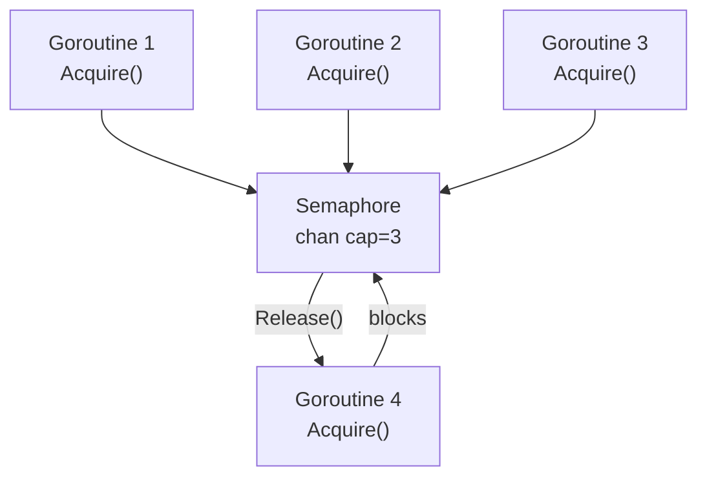
```mermaid
flowchart TD
    G1["Goroutine 1\nAcquire()"] --> CH["Semaphore\nchan cap=3"]
    G2["Goroutine 2\nAcquire()"] --> CH
    G3["Goroutine 3\nAcquire()"] --> CH
    G4["Goroutine 4\nAcquire()"] -->|"blocks"| CH
    CH -->|"Release()"| G4
```

**Execution Trace:**
```
Input:  capacity=3, goroutines=5
t=0: G1,G2,G3 acquire (channel full)
t=0: G4,G5 block waiting
t=100ms: G1 releases → G4 acquires
t=100ms: G2 releases → G5 acquires
Output: at most 3 goroutines active simultaneously
```

### Interviewer Questions

1. Why use a channel for unweighted semaphore instead of mutex+counter?
2. When would you choose `golang.org/x/sync/semaphore` over a custom one?
3. How does Broadcast() in weighted semaphore affect performance with many waiters?
4. Walk me through the goroutine leak in the context-watcher approach.
5. How would you implement a semaphore with acquire timeout (not context)?
6. What's the difference between a semaphore and a mutex?
7. How would you test that exactly N goroutines are in the critical section?

### Follow-Up Questions

**Q1:** How does `golang.org/x/sync/semaphore` differ from this implementation?
**A1:** `x/sync/semaphore` uses a FIFO queue of waiters with a `list.List`, ensuring fairness (no starvation). Channel-based semaphore has no fairness guarantee — a newly unblocked goroutine can steal a slot from a long-waiting one. For production use, prefer `x/sync/semaphore`.

**Q2:** How do you implement a semaphore with a timeout deadline instead of context?
**A2:** Wrap with context: `ctx, cancel := context.WithTimeout(context.Background(), d); defer cancel(); return sem.Acquire(ctx)`. Or for the channel version: `select { case sem.ch <- struct{}{}: return nil; case <-time.After(d): return ErrTimeout }`.

**Q3:** What's the starvation risk in weighted semaphore and how do you fix it?
**A3:** Large-weight requests may starve if small-weight requests keep arriving and consuming available units. Fix: use a FIFO queue of (weight, ready chan) pairs. Only allow the head-of-queue to acquire. New arrivals always go to the tail. This is what `x/sync/semaphore` does internally.

**Q4:** How would you use a semaphore to implement connection pool limiting?
**A4:** `pool.Acquire()` checks out a connection slot. `pool.Release()` returns it. Connection is created if pool is empty, or reused. Total live connections ≤ semaphore capacity. This is effectively what `database/sql` does internally with `db.SetMaxOpenConns()`.

**Q5:** How do you test that a semaphore correctly limits concurrency to exactly N?
**A5:** Use an `atomic.Int32` counter: increment on acquire, decrement on release. After each acquire, assert `counter.Load() <= N`. Run with `-race` flag. Use a `sync.WaitGroup` to wait for all goroutines and assert final counter is 0.

---

## Q9: errgroup for Parallel Work with Error Collection  [Level 3 — Medium]

> **Tags:** `#errgroup` `#parallel` `#error-collection` `#context-cancellation` `#golang-x`

### Problem Statement
Given a list of URLs, fetch all of them in parallel using `errgroup`. If any fetch fails, cancel all remaining fetches and return the first error. Also implement a variant that collects ALL errors (not just the first). Both variants must respect a timeout context.

### Input / Output / Constraints

```
Input:  urls []string{"a","b","c"}, timeout=5s
Output: []string{results} or first error (variant 1)
        []string{results}, []error (variant 2 — partial results)

Constraints:
  • 1 ≤ len(urls) ≤ 1000
  • Context timeout applies globally
  • Goroutines must not leak on error
```

### Thought Process

Think like a senior Go engineer:
1. **Understand:** Parallel fan-out with error propagation and cancellation. errgroup encapsulates this pattern.
2. **Pattern:** `errgroup.WithContext` provides a group + derived context. `g.Go(fn)` registers tasks. `g.Wait()` blocks until all done, returns first error.
3. **Edge cases:** All fail (return any one error), partial failures (collect all), context already cancelled before start.
4. **Approach:** Variant 1: errgroup cancels on first error (idiomatic). Variant 2: use mutex+errSlice to collect all errors while still using errgroup for goroutine management.

### Brute Force Solution

```go
package main

// bruteForce — sequential, no parallelism
func bruteForce(urls []string, fetch func(string) (string, error)) ([]string, error) {
	var results []string
	for _, u := range urls {
		r, err := fetch(u)
		if err != nil {
			return results, err // stops at first error, drops rest
		}
		results = append(results, r)
	}
	return results, nil
}
```

**Time:** O(N × latency) | **Space:** O(N)
**Bottleneck:** Sequential fetches; no parallelism; total time = sum of latencies.

### Better Solution

```go
// betterSolution — WaitGroup + mutex, no context propagation
func betterSolution(urls []string, fetch func(string) (string, error)) ([]string, error) {
	results := make([]string, len(urls))
	var mu sync.Mutex
	var firstErr error
	var wg sync.WaitGroup
	for i, u := range urls {
		wg.Add(1)
		i, u := i, u
		go func() {
			defer wg.Done()
			r, err := fetch(u)
			mu.Lock()
			defer mu.Unlock()
			if err != nil && firstErr == nil {
				firstErr = err
			}
			results[i] = r
		}()
	}
	wg.Wait()
	return results, firstErr
}
```

**Time:** O(max latency) | **Space:** O(N)

### Best / Optimal Solution

```go
package main

import (
	"context"
	"errors"
	"fmt"
	"sync"
	"time"

	"golang.org/x/sync/errgroup"
)

// FetchVariant1 fetches all URLs in parallel.
// Returns first error and cancels all remaining fetches on any failure.
func FetchVariant1(ctx context.Context, urls []string, fetch func(context.Context, string) (string, error)) ([]string, error) {
	g, gCtx := errgroup.WithContext(ctx)
	results := make([]string, len(urls))

	for i, url := range urls {
		i, url := i, url
		g.Go(func() error {
			r, err := fetch(gCtx, url)
			if err != nil {
				return fmt.Errorf("fetch %s: %w", url, err)
			}
			results[i] = r
			return nil
		})
	}

	if err := g.Wait(); err != nil {
		return nil, err
	}
	return results, nil
}

// MultiError holds multiple errors.
type MultiError struct {
	mu   sync.Mutex
	errs []error
}

func (me *MultiError) Add(err error) {
	if err == nil {
		return
	}
	me.mu.Lock()
	me.errs = append(me.errs, err)
	me.mu.Unlock()
}

func (me *MultiError) Err() error {
	me.mu.Lock()
	defer me.mu.Unlock()
	if len(me.errs) == 0 {
		return nil
	}
	return errors.Join(me.errs...)
}

// FetchVariant2 fetches all URLs in parallel, collecting ALL errors.
// Returns partial results alongside all errors that occurred.
func FetchVariant2(ctx context.Context, urls []string, fetch func(context.Context, string) (string, error)) ([]string, error) {
	g, gCtx := errgroup.WithContext(ctx)
	results := make([]string, len(urls))
	var merr MultiError

	for i, url := range urls {
		i, url := i, url
		g.Go(func() error {
			r, err := fetch(gCtx, url)
			if err != nil {
				merr.Add(fmt.Errorf("fetch %s: %w", url, err))
				return nil // don't cancel the group
			}
			results[i] = r
			return nil
		})
	}

	g.Wait() // always nil since tasks don't return errors
	return results, merr.Err()
}

func main() {
	ctx, cancel := context.WithTimeout(context.Background(), 5*time.Second)
	defer cancel()

	urls := []string{"url-a", "url-b", "url-c"}
	fetch := func(ctx context.Context, url string) (string, error) {
		select {
		case <-ctx.Done():
			return "", ctx.Err()
		case <-time.After(50 * time.Millisecond):
			return "result:" + url, nil
		}
	}

	// Variant 1: fail-fast
	results, err := FetchVariant1(ctx, urls, fetch)
	if err != nil {
		fmt.Println("error:", err)
	} else {
		fmt.Println("results:", results)
	}

	// Variant 2: collect all errors
	results2, err2 := FetchVariant2(ctx, urls, fetch)
	fmt.Println("results:", results2, "errors:", err2)
}
```

**Time:** O(max latency) | **Space:** O(N) results

### Production Considerations

| Aspect | Details |
|--------|---------|
| **Scalability** | errgroup handles thousands of goroutines; for 10K URLs combine with semaphore to limit concurrency |
| **Edge Cases** | Context already cancelled: all goroutines see ctx.Done() immediately and return early |
| **Error Handling** | Variant 1: first error wins via errgroup; Variant 2: errors.Join creates a combined error |
| **Memory** | results slice pre-allocated; no per-goroutine allocation beyond stack |
| **Concurrency** | results[i] written by exactly one goroutine (by index) — no mutex needed for results |

### Visual Explanation

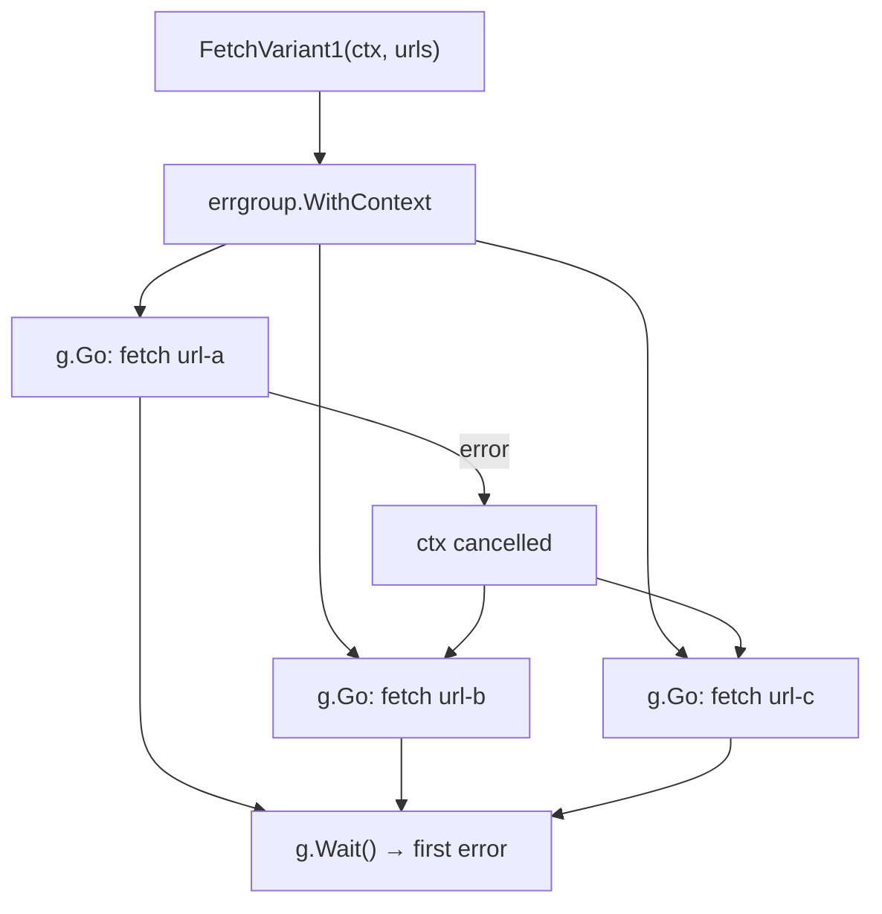
```mermaid
flowchart TD
    A["FetchVariant1(ctx, urls)"] --> G["errgroup.WithContext"]
    G --> T1["g.Go: fetch url-a"]
    G --> T2["g.Go: fetch url-b"]
    G --> T3["g.Go: fetch url-c"]
    T1 -->|"error"| C["ctx cancelled"]
    C --> T2
    C --> T3
    T1 & T2 & T3 --> W["g.Wait() → first error"]
```

**Execution Trace:**
```
Input:  ["a","b","c"], url-b fails
Step 1: All 3 goroutines start concurrently
Step 2: url-b returns error → errgroup cancels gCtx
Step 3: url-a, url-c detect ctx.Done() → return ctx.Err()
Step 4: g.Wait() returns error from url-b
Output: nil, error("fetch url-b: service error")
```

### Interviewer Questions

1. Why does errgroup cancel on the first error while WaitGroup does not?
2. How do you limit concurrency within errgroup to at most K goroutines?
3. How does this scale to 10K URLs?
4. Walk me through the race condition if you don't pre-allocate `results` slice.
5. How would you add per-goroutine timeout on top of the group context?
6. What does `errors.Join` do and when was it introduced?
7. How would you test that context cancellation actually stops in-flight fetches?

### Follow-Up Questions

**Q1:** How do you limit concurrency within errgroup to at most K workers?
**A1:** Combine with a semaphore: `sem := semaphore.NewWeighted(int64(K))`. Inside each g.Go task: `sem.Acquire(gCtx, 1); defer sem.Release(1)`. This bounds active goroutines to K even if thousands are submitted.

**Q2:** How do you implement a retry within errgroup tasks?
**A2:** Wrap the fetch with a retry loop inside the goroutine: `for attempt := 0; attempt < maxRetries; attempt++ { result, err = fetch(gCtx, url); if err == nil || !isRetryable(err) { break }; time.Sleep(backoff(attempt)) }`. errgroup handles the final error.

**Q3:** What's the difference between `errgroup.WithContext` and `errgroup.Group`?
**A3:** `errgroup.Group` (no context): no cancellation propagation. `errgroup.WithContext`: returns a derived context that is cancelled when the first goroutine returns a non-nil error, enabling cooperative cancellation.

**Q4:** How do you handle a goroutine that panics inside errgroup?
**A4:** errgroup does not recover panics — the panic propagates and crashes the program. Wrap the goroutine body with `defer func() { if r := recover(); r != nil { return fmt.Errorf("panic: %v", r) } }()` to convert panics to errors.

**Q5:** How do you unit test that Variant 2 actually collects all errors and not just the first?
**A5:** Use a mock fetch that returns errors for specific URLs: `fetch := func(ctx context.Context, url string) (string, error) { if url == "bad1" || url == "bad2" { return "", errors.New("err:"+url) }; return "ok", nil }`. Assert `errors.Is` or string matching on the joined error, and assert results slice has correct non-empty entries.

---

## Q10: Parallel Map Over Slice  [Level 2 — Easy]

> **Tags:** `#parallel-map` `#goroutines` `#functional` `#errgroup` `#generic`

### Problem Statement
Implement a generic `ParallelMap[T, R any](ctx context.Context, input []T, fn func(context.Context, T) (R, error), concurrency int) ([]R, error)` that applies `fn` to every element concurrently, preserves order in the output, cancels on first error, and limits goroutines to `concurrency`.

### Input / Output / Constraints

```
Input:  input=[]int{1,2,3,4,5}, fn=func(n int)(int,error){return n*n,nil}, concurrency=3
Output: []int{1,4,9,16,25}  // order preserved

Constraints:
  • output[i] corresponds to input[i]
  • 1 ≤ concurrency ≤ len(input)
  • Context cancellation propagates to all fn invocations
```

### Thought Process

Think like a senior Go engineer:
1. **Understand:** Map each element through a function in parallel, collect results in original order.
2. **Pattern:** Pre-allocate results slice; each goroutine writes to `results[i]` (index-safe, no lock needed); use semaphore to bound concurrency; errgroup for error propagation.
3. **Edge cases:** Empty input returns empty slice; nil fn panics — validate; concurrency > len(input) is fine (unused goroutines don't start).
4. **Approach:** Pre-allocated output slice + index-based write + semaphore + errgroup = clean, safe, generic parallel map.

### Brute Force Solution

```go
package main

// bruteForce — sequential map, no parallelism
func bruteForce[T, R any](input []T, fn func(T) (R, error)) ([]R, error) {
	results := make([]R, len(input))
	for i, v := range input {
		r, err := fn(v)
		if err != nil {
			return nil, err
		}
		results[i] = r
	}
	return results, nil
}
```

**Time:** O(N × fn_cost) | **Space:** O(N)
**Bottleneck:** Sequential; no parallelism; total time = sum of all fn invocations.

### Better Solution

```go
// betterSolution — WaitGroup based, unbounded goroutines
func betterParallelMap[T, R any](input []T, fn func(T) (R, error)) ([]R, error) {
	results := make([]R, len(input))
	errs := make([]error, len(input))
	var wg sync.WaitGroup
	for i, v := range input {
		wg.Add(1)
		i, v := i, v
		go func() {
			defer wg.Done()
			results[i], errs[i] = fn(v)
		}()
	}
	wg.Wait()
	for _, err := range errs {
		if err != nil {
			return nil, err
		}
	}
	return results, nil
}
```

**Time:** O(max fn_cost) | **Space:** O(N) — no concurrency limit

### Best / Optimal Solution

```go
package main

import (
	"context"
	"fmt"
	"time"

	"golang.org/x/sync/errgroup"
	"golang.org/x/sync/semaphore"
)

// ParallelMap applies fn to every element of input concurrently.
// Order is preserved in the output. Cancels all on first error.
// concurrency limits the number of simultaneous fn invocations.
func ParallelMap[T, R any](
	ctx context.Context,
	input []T,
	fn func(context.Context, T) (R, error),
	concurrency int,
) ([]R, error) {
	if len(input) == 0 {
		return nil, nil
	}
	if fn == nil {
		return nil, fmt.Errorf("fn must not be nil")
	}
	if concurrency <= 0 {
		concurrency = len(input)
	}

	results := make([]R, len(input))
	g, gCtx := errgroup.WithContext(ctx)
	sem := semaphore.NewWeighted(int64(concurrency))

	for i, v := range input {
		i, v := i, v
		g.Go(func() error {
			if err := sem.Acquire(gCtx, 1); err != nil {
				return err // context cancelled
			}
			defer sem.Release(1)

			r, err := fn(gCtx, v)
			if err != nil {
				return fmt.Errorf("index %d: %w", i, err)
			}
			results[i] = r
			return nil
		})
	}

	if err := g.Wait(); err != nil {
		return nil, err
	}
	return results, nil
}

func main() {
	ctx, cancel := context.WithTimeout(context.Background(), 5*time.Second)
	defer cancel()

	input := []int{1, 2, 3, 4, 5}
	square := func(ctx context.Context, n int) (int, error) {
		return n * n, nil
	}

	results, err := ParallelMap(ctx, input, square, 3)
	if err != nil {
		fmt.Println("error:", err)
		return
	}
	fmt.Println(results) // [1 4 9 16 25]
}
```

**Time:** O(N/concurrency × fn_cost) | **Space:** O(N) results + O(concurrency) semaphore

### Production Considerations

| Aspect | Details |
|--------|---------|
| **Scalability** | concurrency parameter prevents goroutine explosion; tune to CPU count or downstream service limits |
| **Edge Cases** | Empty input: return nil slice immediately; nil fn: explicit error; concurrency=0: defaults to N |
| **Error Handling** | First error cancels group; error wraps index for debugging |
| **Memory** | results pre-allocated (no append races); each goroutine writes to distinct index |
| **Concurrency** | Index-based writes are safe without mutex (each index owned by exactly one goroutine) |

### Visual Explanation

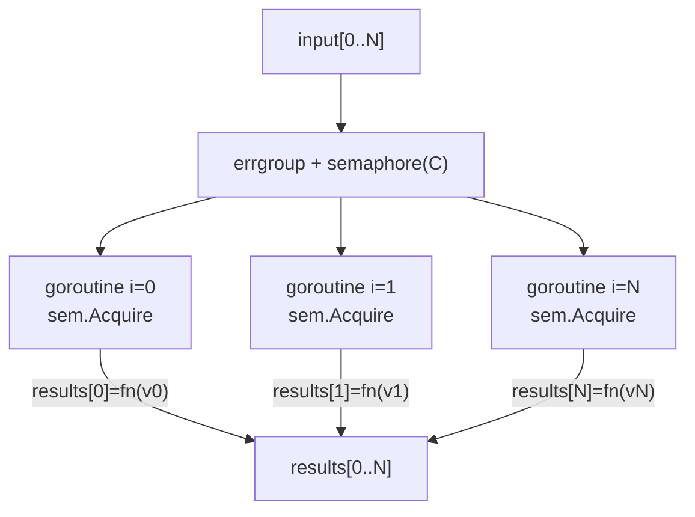
```mermaid
flowchart TD
    A["input[0..N]"] --> B["errgroup + semaphore(C)"]
    B --> G1["goroutine i=0\nsem.Acquire"]
    B --> G2["goroutine i=1\nsem.Acquire"]
    B --> GN["goroutine i=N\nsem.Acquire"]
    G1 -->|"results[0]=fn(v0)"| R["results[0..N]"]
    G2 -->|"results[1]=fn(v1)"| R
    GN -->|"results[N]=fn(vN)"| R
```

**Execution Trace:**
```
Input:  [1,2,3,4,5], concurrency=3
t=0: goroutines 0,1,2 acquire sem; goroutines 3,4 wait
t=1: g0→results[0]=1; g1→results[1]=4; g2→results[2]=9
t=1: g3,g4 acquire; g3→results[3]=16; g4→results[4]=25
Output: [1,4,9,16,25]
```

### Interviewer Questions

1. Why is index-based write to results slice safe without a mutex?
2. How would you change this to return partial results on error instead of nil?
3. How does the semaphore interact with errgroup cancellation?
4. Walk me through what happens if fn takes 10 minutes for one element.
5. How would you add progress reporting (e.g., X/N complete)?
6. How would you implement ParallelFilter using the same pattern?
7. How do you benchmark the optimal concurrency for CPU-bound vs I/O-bound fn?

### Follow-Up Questions

**Q1:** How do you return partial results (completed items) even when some fail?
**A1:** Change approach: don't cancel group on error. Collect errors separately: `errs[i] = err` instead of `return err`. After Wait, scan results for zero values and errs for non-nil. Return both results and a MultiError.

**Q2:** How would you implement ParallelReduce using goroutines?
**A2:** Split input into chunks (one per goroutine). Each goroutine reduces its chunk. Use a tree reduction: pair up partial results, reduce again. Total time: O(N/W + log W) where W = workers. Implement with a channel that carries partial results and a second pass.

**Q3:** How does Go generics handle the `[T, R any]` constraint here?
**A3:** `any` is an alias for `interface{}`. At compile time, the compiler instantiates the function for each specific (T, R) pair used. No reflection at runtime. Type safety is enforced at compile time; no runtime type assertions needed.

**Q4:** How would you implement ordered streaming output (emit results as they complete, in order)?
**A4:** Use a per-index promise channel: `promises := make([]chan R, N)`. Each goroutine sends to `promises[i]`. The collector reads `promises[0], promises[1], ...` in order — blocks on each until available. This preserves order while streaming.

**Q5:** How do you benchmark the right concurrency value for an I/O-bound workload?
**A5:** Use `testing.B` with `b.Run(fmt.Sprintf("c=%d", c), ...)` for c in [1, 2, 4, 8, 16, 32, 64]. Plot throughput (ops/sec) vs concurrency. The "knee" of the curve where throughput plateaus is the optimal value. For network I/O, it's typically 10-100x the CPU count.

---
## Q11: Timeout Wrapper  [Level 2 — Easy]
> **Tags:** `#timeout` `#context` `#goroutine` `#channel`

### Problem Statement
Wrap any function call so it returns an error if the function does not complete within a given deadline. The wrapper must not leak the goroutine that runs the underlying function. Return the function's result on success, or a sentinel `ErrTimeout` on deadline exceeded. Callers must be able to supply their own `context.Context`.

### Input / Output / Constraints
```
Input:  ctx context.Context, timeout time.Duration, fn func() (T, error)
Output: (T, error)
Constraints:
  - timeout > 0
  - fn may block indefinitely
  - goroutine leak is not acceptable
  - must propagate parent context cancellation
```

### Thought Process
1. Understand: We need to race fn's completion against a timer; the loser must not leave a goroutine alive forever.
2. Pattern: Launch fn in a goroutine writing to a buffered channel (size 1). Use select with ctx.Done and a time.After. Buffered channel prevents goroutine from blocking when we time out.
3. Edge cases: fn panics (recover inside goroutine), ctx already cancelled, zero/negative timeout.

### Brute Force
```go
// O(1) time, O(1) space — but leaks goroutine on timeout
func bruteForce[T any](timeout time.Duration, fn func() (T, error)) (T, error) {
    ch := make(chan T) // unbuffered — goroutine blocks forever on timeout
    go func() { v, _ := fn(); ch <- v }()
    select {
    case v := <-ch:
        return v, nil
    case <-time.After(timeout):
        var zero T
        return zero, errors.New("timeout")
    }
}
```
**Time:** O(1) | **Space:** O(1) — goroutine leak on timeout

### Better Solution
```go
func better[T any](timeout time.Duration, fn func() (T, error)) (T, error) {
    type result struct {
        val T
        err error
    }
    ch := make(chan result, 1) // buffered — goroutine can always send
    go func() {
        v, err := fn()
        ch <- result{v, err}
    }()
    select {
    case r := <-ch:
        return r.val, r.err
    case <-time.After(timeout):
        var zero T
        return zero, ErrTimeout
    }
}
```
**Time:** O(1) | **Space:** O(1)

### Best Solution
```go
package main

import (
    "context"
    "errors"
    "fmt"
    "time"
)

var ErrTimeout = errors.New("operation timed out")

type result[T any] struct {
    val T
    err error
}

// WithTimeout — O(1) time, O(1) space
func WithTimeout[T any](ctx context.Context, timeout time.Duration, fn func(ctx context.Context) (T, error)) (T, error) {
    ctx, cancel := context.WithTimeout(ctx, timeout)
    defer cancel()

    ch := make(chan result[T], 1)
    go func() {
        v, err := fn(ctx)
        ch <- result[T]{v, err}
    }()

    select {
    case r := <-ch:
        return r.val, r.err
    case <-ctx.Done():
        var zero T
        if errors.Is(ctx.Err(), context.DeadlineExceeded) {
            return zero, ErrTimeout
        }
        return zero, ctx.Err()
    }
}

func main() {
    slow := func(ctx context.Context) (string, error) {
        select {
        case <-time.After(2 * time.Second):
            return "done", nil
        case <-ctx.Done():
            return "", ctx.Err()
        }
    }

    v, err := WithTimeout(context.Background(), 500*time.Millisecond, slow)
    fmt.Println(v, err) // "" timeout
}
```
**Time:** O(1) | **Space:** O(1)

### Production Considerations
| Aspect | Details |
|--------|---------|
| Scalability | Each call spawns one goroutine; fine for moderate rates |
| Edge Cases | fn must respect ctx; otherwise goroutine lives until fn finishes |
| Error Handling | Distinguish deadline exceeded vs parent cancellation |
| Memory | Buffered channel of size 1; GC'd after goroutine completes |
| Concurrency | No shared state; safe for concurrent callers |

### Visual Explanation
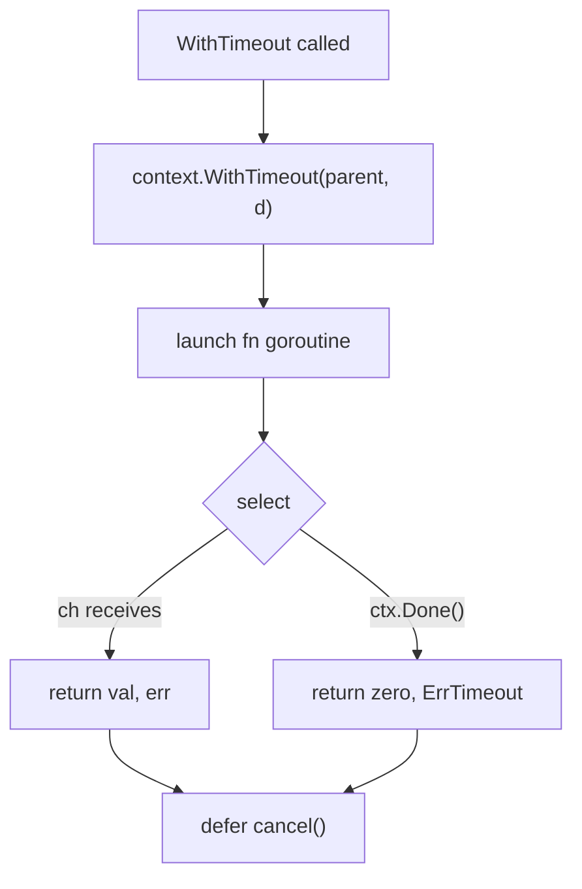
```mermaid
flowchart TD
    A["WithTimeout called"] --> B["context.WithTimeout(parent, d)"]
    B --> C["launch fn goroutine"]
    C --> D{"select"}
    D -->|"ch receives"| E["return val, err"]
    D -->|"ctx.Done()"| F["return zero, ErrTimeout"]
    E --> G["defer cancel()"]
    F --> G
```
```
Trace: timeout=500ms, fn takes 2s
t=0ms   : goroutine starts fn
t=500ms : ctx deadline fires → select picks ctx.Done() → return ErrTimeout
t=500ms : fn's ctx cancelled → fn returns ctx.Err() → ch receives (discarded)
```

### Interviewer Questions
1. Why is the channel buffered with size 1?
2. What happens if fn ignores the context?
3. How do you distinguish parent cancellation from timeout?
4. How would you add retry logic on timeout?
5. Is it safe to call WithTimeout concurrently from many goroutines?
6. What is the memory cost per in-flight call?
7. How would you implement a hard kill (not context-based)?

### Follow-Up Questions
**Q1:** What if fn panics inside the goroutine?
**A1:** Add a recover() inside the goroutine: `defer func() { if r := recover(); r != nil { ch <- result[T]{err: fmt.Errorf("panic: %v", r)} } }()`. This sends the panic as an error via the channel instead of crashing the program.

**Q2:** How would you implement a per-attempt timeout with retries?
**A2:** Loop up to maxRetries. Each iteration calls WithTimeout with the per-attempt duration. On ErrTimeout or retryable errors, continue. On success or non-retryable error, break. Track total elapsed time against an outer deadline.

**Q3:** How do you implement timeout for streaming (multiple results)?
**A3:** Instead of a single result channel, use a typed results channel. Wrap the streaming fn similarly. Use a separate deadline context. On timeout, cancel and drain the results channel.

**Q4:** How do you test timeout behavior reliably in unit tests?
**A4:** Inject a fake clock (e.g., `quartz` package or manual `time.After` replacement). Advance the fake clock past the deadline in the test. This avoids real sleeps and makes tests fast and deterministic.

**Q5:** When should you use context.WithTimeout vs time.After directly?
**A5:** context.WithTimeout propagates through the call chain and can be checked by all downstream code that accepts ctx. time.After is local only — downstream functions cannot observe the deadline. Always prefer context for production code.

---

---
## Q12: Retry with Exponential Backoff  [Level 2 — Easy]
> **Tags:** `#retry` `#backoff` `#jitter` `#context`

### Problem Statement
Implement a `Retry` function that calls an operation repeatedly until it succeeds, a maximum number of attempts is reached, or the context is cancelled. Use exponential backoff with full jitter between attempts to avoid thundering herd. Return the last error if all attempts fail.

### Input / Output / Constraints
```
Input:  ctx context.Context, maxAttempts int, base time.Duration, fn func() error
Output: error
Constraints:
  - maxAttempts >= 1
  - base > 0
  - jitter must be randomized per attempt
  - must stop immediately on ctx cancellation
  - do not sleep after the final attempt
```

### Thought Process
1. Understand: Call fn up to maxAttempts times. On failure, sleep exponentially longer, but randomize the sleep to spread load.
2. Pattern: Loop with attempt counter. Compute cap = base * 2^attempt. Jitter: sleep = rand.Int63n(cap). Use time.NewTimer (not time.After) so we can stop it on ctx cancellation.
3. Edge cases: fn succeeds on first try (no sleep), ctx cancelled during sleep, maxAttempts=1 (never sleep), overflow of 2^attempt.

### Brute Force
```go
// O(maxAttempts) time — no jitter, no ctx awareness
func bruteForce(maxAttempts int, base time.Duration, fn func() error) error {
    var err error
    for i := 0; i < maxAttempts; i++ {
        err = fn()
        if err == nil {
            return nil
        }
        time.Sleep(base * (1 << i))
    }
    return err
}
```
**Time:** O(N) | **Space:** O(1)

### Better Solution
```go
func better(ctx context.Context, maxAttempts int, base time.Duration, fn func() error) error {
    var err error
    for i := 0; i < maxAttempts; i++ {
        err = fn()
        if err == nil {
            return nil
        }
        if i == maxAttempts-1 {
            break
        }
        cap := base * (1 << min(i, 30))
        jitter := time.Duration(rand.Int63n(int64(cap)))
        select {
        case <-ctx.Done():
            return ctx.Err()
        case <-time.After(jitter):
        }
    }
    return err
}
```
**Time:** O(N) | **Space:** O(1)

### Best Solution
```go
package main

import (
    "context"
    "errors"
    "fmt"
    "math/rand"
    "time"
)

// RetryConfig holds tuning parameters.
type RetryConfig struct {
    MaxAttempts int
    Base        time.Duration
    MaxBackoff  time.Duration
    IsRetryable func(error) bool
}

// Retry — O(maxAttempts) time, O(1) space
func Retry(ctx context.Context, cfg RetryConfig, fn func() error) error {
    var lastErr error
    for attempt := 0; attempt < cfg.MaxAttempts; attempt++ {
        lastErr = fn()
        if lastErr == nil {
            return nil
        }
        if cfg.IsRetryable != nil && !cfg.IsRetryable(lastErr) {
            return lastErr // non-retryable; stop immediately
        }
        if attempt == cfg.MaxAttempts-1 {
            break // no sleep after last attempt
        }

        shift := attempt
        if shift > 30 {
            shift = 30
        }
        capDur := cfg.Base * (1 << shift)
        if capDur > cfg.MaxBackoff {
            capDur = cfg.MaxBackoff
        }
        sleep := time.Duration(rand.Int63n(int64(capDur) + 1))

        t := time.NewTimer(sleep)
        select {
        case <-ctx.Done():
            t.Stop()
            return fmt.Errorf("retry cancelled: %w", ctx.Err())
        case <-t.C:
        }
    }
    return fmt.Errorf("all %d attempts failed: %w", cfg.MaxAttempts, lastErr)
}

func main() {
    calls := 0
    flaky := func() error {
        calls++
        if calls < 3 {
            return errors.New("transient")
        }
        return nil
    }

    err := Retry(context.Background(), RetryConfig{
        MaxAttempts: 5,
        Base:        100 * time.Millisecond,
        MaxBackoff:  2 * time.Second,
        IsRetryable: func(e error) bool { return true },
    }, flaky)
    fmt.Println("error:", err, "calls:", calls) // nil, 3
}
```
**Time:** O(N) | **Space:** O(1)

### Production Considerations
| Aspect | Details |
|--------|---------|
| Scalability | Full jitter prevents synchronized retries across thousands of clients |
| Edge Cases | Non-retryable errors (auth failures) should not be retried |
| Error Handling | Wrap last error with attempt count for observability |
| Memory | O(1); NewTimer is GC'd after Stop() or expiry |
| Concurrency | Stateless; safe to call concurrently from many goroutines |

### Visual Explanation
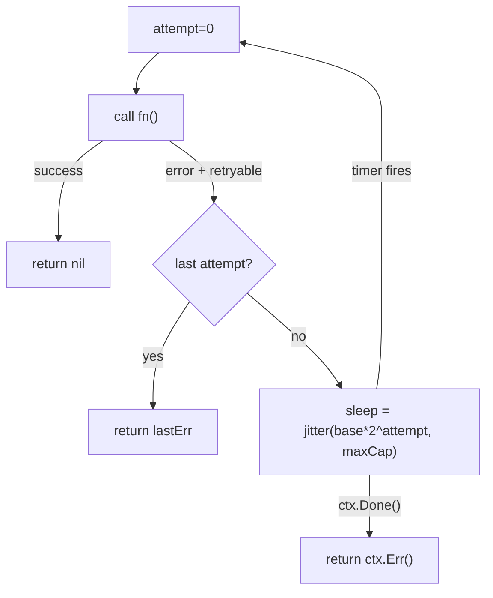
```mermaid
flowchart TD
    A["attempt=0"] --> B["call fn()"]
    B -->|"success"| Z["return nil"]
    B -->|"error + retryable"| C{"last attempt?"}
    C -->|"yes"| E["return lastErr"]
    C -->|"no"| D["sleep = jitter(base*2^attempt, maxCap)"]
    D -->|"timer fires"| A
    D -->|"ctx.Done()"| F["return ctx.Err()"]
```
```
Trace: maxAttempts=3, base=100ms
attempt=0: fn() → error; sleep=rand(0..100ms)
attempt=1: fn() → error; sleep=rand(0..200ms)
attempt=2: fn() → error; no sleep → return lastErr
```

### Interviewer Questions
1. Why full jitter instead of no jitter?
2. How do you distinguish retryable from non-retryable errors?
3. What is the maximum total sleep time with these parameters?
4. How do you add a deadline for total retry duration (not per-attempt)?
5. How would you implement retry with a fixed window rate limit?
6. How does context cancellation interact with the sleep timer?
7. How do you test backoff timing deterministically?

### Follow-Up Questions
**Q1:** What is "thundering herd" and how does jitter prevent it?
**A1:** When many clients fail simultaneously and all retry at the same backoff interval, they create synchronized load spikes that overwhelm the server. Jitter randomizes each client's wait time, spreading retries across the window and smoothing load.

**Q2:** What is decorrelated jitter and when is it better than full jitter?
**A2:** Decorrelated jitter: `sleep = rand(base, prev_sleep * 3)`. It produces higher average backoff than full jitter, better for heavy load. Full jitter averages `cap/2`. Decorrelated averages higher, giving the server more recovery time.

**Q3:** How would you implement circuit-breaker-aware retry?
**A3:** Check the circuit breaker state before each attempt. If Open, skip the fn() call and return ErrCircuitOpen immediately. Only call fn when Closed or Half-Open. Record success/failure to update the circuit breaker state.

**Q4:** How do you propagate retry metadata to the server (so it knows it's a retry)?
**A4:** Add a header or metadata field: `X-Retry-Attempt: N`. This lets server-side logging distinguish first attempts from retries. Useful for debugging and for idempotency keys to detect duplicate requests.

**Q5:** How do you implement retry budgets to limit total retries system-wide?
**A5:** Use a shared atomic counter or token bucket across all callers. Before sleeping, decrement the budget. If budget is 0, stop retrying. Reset the budget on a timer. This prevents retry storms when an entire service degrades.

---

---
## Q13: Concurrent Cache-Aside  [Level 3 — Medium]
> **Tags:** `#cache` `#singleflight` `#sync` `#mutex`

### Problem Statement
Implement a thread-safe in-memory cache with a cache-aside pattern. On a cache miss, fetch from an external source using a provided `loader` function. Use `singleflight` to coalesce concurrent fetches for the same key, preventing cache stampede. Support TTL-based expiration.

### Input / Output / Constraints
```
Input:  key string, loader func(key string) (interface{}, error)
Output: (interface{}, error)
Constraints:
  - concurrent Gets for same key must trigger only one loader call
  - expired entries must be evicted on Get
  - TTL > 0
  - loader may be slow (network, DB)
```

### Thought Process
1. Understand: Cache-aside = check cache → on miss, load → store in cache. Problem: 100 concurrent Gets for a cold key fire 100 loader calls. Singleflight deduplicates them.
2. Pattern: sync.Map or RWMutex map for storage. golang.org/x/sync/singleflight.Group for deduplication. TTL checked on read.
3. Edge cases: loader returns error (don't cache), TTL expiry race, key eviction under load, negative caching.

### Brute Force
```go
// O(1) time — but no stampede protection
type BruteCache struct {
    mu    sync.Mutex
    items map[string]string
}
func (c *BruteCache) Get(key string, loader func() (string, error)) (string, error) {
    c.mu.Lock()
    if v, ok := c.items[key]; ok { c.mu.Unlock(); return v, nil }
    c.mu.Unlock()
    v, err := loader() // many goroutines run loader concurrently for same key
    if err != nil { return "", err }
    c.mu.Lock(); c.items[key] = v; c.mu.Unlock()
    return v, nil
}
```
**Time:** O(1) | **Space:** O(N)

### Better Solution
```go
// Uses singleflight but no TTL
type BetterCache struct {
    mu    sync.RWMutex
    items map[string]string
    g     singleflight.Group
}
func (c *BetterCache) Get(key string, loader func() (string, error)) (string, error) {
    c.mu.RLock()
    if v, ok := c.items[key]; ok { c.mu.RUnlock(); return v, nil }
    c.mu.RUnlock()
    v, err, _ := c.g.Do(key, func() (interface{}, error) { return loader() })
    if err != nil { return "", err }
    s := v.(string)
    c.mu.Lock(); c.items[key] = s; c.mu.Unlock()
    return s, nil
}
```
**Time:** O(1) | **Space:** O(N)

### Best Solution
```go
package main

import (
    "fmt"
    "sync"
    "time"

    "golang.org/x/sync/singleflight"
)

type entry struct {
    value   interface{}
    expiresAt time.Time
}

// Cache — O(1) Get/Set, O(N) space
type Cache struct {
    mu    sync.RWMutex
    items map[string]entry
    ttl   time.Duration
    g     singleflight.Group
}

func NewCache(ttl time.Duration) *Cache {
    c := &Cache{items: make(map[string]entry), ttl: ttl}
    go c.evictLoop()
    return c
}

func (c *Cache) get(key string) (interface{}, bool) {
    c.mu.RLock()
    e, ok := c.items[key]
    c.mu.RUnlock()
    if !ok || time.Now().After(e.expiresAt) {
        return nil, false
    }
    return e.value, true
}

// Get retrieves or loads a value, coalescing concurrent loads.
func (c *Cache) Get(key string, loader func(string) (interface{}, error)) (interface{}, error) {
    if v, ok := c.get(key); ok {
        return v, nil
    }
    v, err, _ := c.g.Do(key, func() (interface{}, error) {
        // double-check after acquiring singleflight token
        if v, ok := c.get(key); ok {
            return v, nil
        }
        val, err := loader(key)
        if err != nil {
            return nil, err
        }
        c.mu.Lock()
        c.items[key] = entry{value: val, expiresAt: time.Now().Add(c.ttl)}
        c.mu.Unlock()
        return val, nil
    })
    return v, err
}

func (c *Cache) evictLoop() {
    t := time.NewTicker(c.ttl / 2)
    for range t.C {
        now := time.Now()
        c.mu.Lock()
        for k, e := range c.items {
            if now.After(e.expiresAt) {
                delete(c.items, k)
            }
        }
        c.mu.Unlock()
    }
}

func main() {
    calls := 0
    cache := NewCache(5 * time.Second)
    loader := func(k string) (interface{}, error) {
        calls++
        time.Sleep(100 * time.Millisecond)
        return "value-" + k, nil
    }

    var wg sync.WaitGroup
    for i := 0; i < 100; i++ {
        wg.Add(1)
        go func() {
            defer wg.Done()
            cache.Get("key1", loader)
        }()
    }
    wg.Wait()
    fmt.Println("loader calls:", calls) // 1
}
```
**Time:** O(1) | **Space:** O(N)

### Production Considerations
| Aspect | Details |
|--------|---------|
| Scalability | Singleflight reduces backend load from N to 1 per key per window |
| Edge Cases | Negative caching (cache errors briefly) to prevent repeated failing loads |
| Error Handling | Don't cache errors; singleflight returns error to all waiters |
| Memory | Background eviction prevents unbounded growth |
| Concurrency | RWMutex for reads; singleflight for write coalescing |

### Visual Explanation
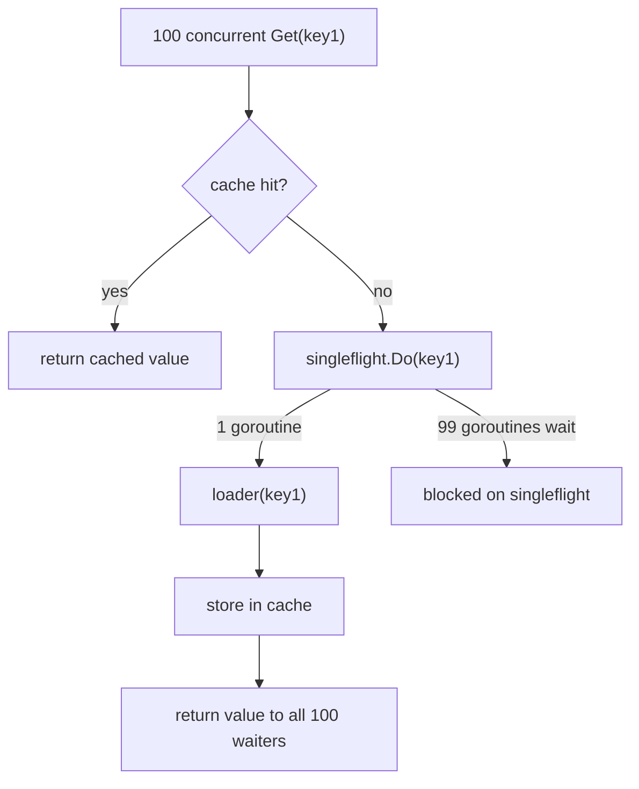
```mermaid
flowchart TD
    A["100 concurrent Get(key1)"] --> B{"cache hit?"}
    B -->|"yes"| Z["return cached value"]
    B -->|"no"| C["singleflight.Do(key1)"]
    C -->|"1 goroutine"| D["loader(key1)"]
    C -->|"99 goroutines wait"| W["blocked on singleflight"]
    D --> E["store in cache"]
    E --> F["return value to all 100 waiters"]
```
```
Trace: 100 goroutines, all call Get("key1")
t=0:   all miss cache → enter singleflight.Do
t=0:   goroutine-0 wins → calls loader; 99 others block
t=100ms: loader returns → cache updated → all 100 return same value
loader calls = 1
```

### Interviewer Questions
1. What is cache stampede and how does singleflight prevent it?
2. Why do we double-check the cache inside singleflight.Do?
3. How do you handle negative caching (loader returns error)?
4. How does singleflight behave after the first call completes?
5. How would you add per-key TTL instead of global TTL?
6. How do you handle cache invalidation across multiple instances?
7. What happens if the loader panics inside singleflight.Do?

### Follow-Up Questions
**Q1:** What is the difference between singleflight and a mutex for this use case?
**A1:** A mutex serializes all callers — each waits for the previous to finish, then all query independently. Singleflight makes exactly one call and broadcasts the result to all concurrent waiters. Singleflight is strictly better when the operation is idempotent and the result can be shared.

**Q2:** How would you implement distributed singleflight across multiple pods?
**A2:** Use Redis SET NX (set-if-not-exists) with a TTL as a distributed lock. The winner fetches the value and publishes it. Others poll or subscribe via Redis Pub/Sub for the result. When published, all waiters receive it simultaneously.

**Q3:** How do you implement cache warming at startup?
**A3:** On startup, identify the hot key set (from analytics or config). Spawn worker goroutines that call Get for each hot key, triggering loader. Use a semaphore to limit concurrent loader calls during warm-up.

**Q4:** How do you implement LRU eviction alongside TTL?
**A4:** Add a doubly-linked list tracking access order. On Get, move the accessed entry to the head. On insert when at capacity, evict from the tail. Use a single mutex protecting both the map and the list. golang.org/x/exp/lru provides a ready implementation.

**Q5:** How do you measure cache hit rate in production?
**A5:** Add atomic counters: hits, misses. Export as Prometheus gauges: `cache_hit_rate = hits / (hits + misses)`. Reset on a rolling window or use rate() in PromQL. Alert when hit rate drops below threshold (e.g., <80%).

---

---
## Q14: Graceful Drain Shutdown  [Level 4 — Advanced]
> **Tags:** `#shutdown` `#graceful` `#drain` `#sync` `#signal`

### Problem Statement
Implement a server that accepts work items on a channel and processes them concurrently using a fixed worker pool. On receiving `SIGINT` or `SIGTERM`, stop accepting new work, drain all in-flight items to completion, close workers cleanly, and exit. The drain must complete within a configurable timeout; if it doesn't, force-exit.

### Input / Output / Constraints
```
Input:  workerCount int, drainTimeout time.Duration, work <-chan Item
Output: clean shutdown with all in-flight work completed or forced exit
Constraints:
  - no work items dropped that were accepted before signal
  - forced exit after drainTimeout
  - workers must not panic during shutdown
  - must handle SIGINT and SIGTERM
```

### Thought Process
1. Understand: We need a two-phase shutdown — stop intake, then wait for in-flight work to finish.
2. Pattern: Use a context for shutdown signal. Workers select on work channel and ctx.Done. After signal, close the work channel and call wg.Wait with a timeout. If timeout fires, call os.Exit.
3. Edge cases: Signal received while all workers are idle, work channel buffered vs unbuffered, drain timeout too short.

### Brute Force
```go
// O(N) — no timeout, blocks indefinitely
func bruteShutdown(workers []*Worker, wg *sync.WaitGroup) {
    c := make(chan os.Signal, 1)
    signal.Notify(c, syscall.SIGINT)
    <-c
    for _, w := range workers { w.Stop() }
    wg.Wait() // blocks forever if a worker hangs
}
```
**Time:** O(N) | **Space:** O(1)

### Better Solution
```go
func betterShutdown(cancel context.CancelFunc, wg *sync.WaitGroup, timeout time.Duration) {
    c := make(chan os.Signal, 1)
    signal.Notify(c, syscall.SIGINT, syscall.SIGTERM)
    <-c
    cancel()
    done := make(chan struct{})
    go func() { wg.Wait(); close(done) }()
    select {
    case <-done:
        fmt.Println("clean shutdown")
    case <-time.After(timeout):
        fmt.Println("forced shutdown")
        os.Exit(1)
    }
}
```
**Time:** O(N) | **Space:** O(1)

### Best Solution
```go
package main

import (
    "context"
    "fmt"
    "os"
    "os/signal"
    "sync"
    "syscall"
    "time"
)

type Item struct{ ID int }

type Server struct {
    workerCount  int
    drainTimeout time.Duration
    jobs         chan Item
    wg           sync.WaitGroup
}

func NewServer(workerCount int, bufferSize int, drainTimeout time.Duration) *Server {
    return &Server{
        workerCount:  workerCount,
        drainTimeout: drainTimeout,
        jobs:         make(chan Item, bufferSize),
    }
}

func (s *Server) Submit(item Item) bool {
    select {
    case s.jobs <- item:
        return true
    default:
        return false // back-pressure: queue full
    }
}

func (s *Server) Start(ctx context.Context) {
    for i := 0; i < s.workerCount; i++ {
        s.wg.Add(1)
        go s.worker(ctx, i)
    }
}

func (s *Server) worker(ctx context.Context, id int) {
    defer s.wg.Done()
    for {
        select {
        case item, ok := <-s.jobs:
            if !ok {
                return // channel closed; drain complete
            }
            s.process(item)
        case <-ctx.Done():
            // drain remaining items before exit
            for {
                select {
                case item, ok := <-s.jobs:
                    if !ok {
                        return
                    }
                    s.process(item)
                default:
                    return // nothing left
                }
            }
        }
    }
}

func (s *Server) process(item Item) {
    time.Sleep(50 * time.Millisecond)
    fmt.Printf("processed item %d\n", item.ID)
}

// Shutdown — O(W) time, O(1) space where W = workerCount
func (s *Server) Shutdown(cancel context.CancelFunc) {
    cancel()        // signal workers to stop accepting new items
    close(s.jobs)   // unblock workers blocked on channel receive

    done := make(chan struct{})
    go func() { s.wg.Wait(); close(done) }()

    select {
    case <-done:
        fmt.Println("graceful shutdown complete")
    case <-time.After(s.drainTimeout):
        fmt.Println("drain timeout; forcing exit")
        os.Exit(1)
    }
}

func main() {
    ctx, cancel := context.WithCancel(context.Background())
    srv := NewServer(4, 100, 5*time.Second)
    srv.Start(ctx)

    for i := 0; i < 20; i++ {
        srv.Submit(Item{ID: i})
    }

    sig := make(chan os.Signal, 1)
    signal.Notify(sig, syscall.SIGINT, syscall.SIGTERM)
    go func() {
        time.Sleep(200 * time.Millisecond)
        sig <- syscall.SIGTERM // simulate signal
    }()
    <-sig
    srv.Shutdown(cancel)
}
```
**Time:** O(W+Q) | **Space:** O(Q)

### Production Considerations
| Aspect | Details |
|--------|---------|
| Scalability | Worker count tunable; buffered job queue absorbs bursts |
| Edge Cases | Double-close of channel is panic; use sync.Once for close |
| Error Handling | Failed items should be logged; optionally requeued to dead-letter |
| Memory | Queue depth * item size; set buffer based on expected burst |
| Concurrency | WaitGroup tracks in-flight workers; cancel propagates to all |

### Visual Explanation
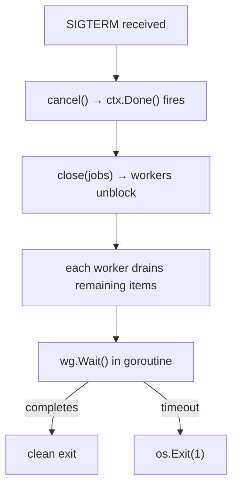
```mermaid
flowchart TD
    A["SIGTERM received"] --> B["cancel() → ctx.Done() fires"]
    B --> C["close(jobs) → workers unblock"]
    C --> D["each worker drains remaining items"]
    D --> E["wg.Wait() in goroutine"]
    E -->|"completes"| F["clean exit"]
    E -->|"timeout"| G["os.Exit(1)"]
```
```
Trace: 20 items queued, 4 workers, signal at t=200ms
t=0ms:    workers start, items processed concurrently
t=200ms:  SIGTERM → cancel() + close(jobs)
t=200ms:  workers drain remaining items (~16 items / 4 workers = ~200ms)
t=400ms:  all done → wg.Wait returns → clean exit
```

### Interviewer Questions
1. Why must close(jobs) happen after cancel()?
2. How do you prevent double-close panic on the jobs channel?
3. What happens to items submitted after Shutdown is called?
4. How do you implement a dead-letter queue for failed items?
5. How would you add health check reporting during drain?
6. How does this differ from http.Server.Shutdown()?
7. What is the risk of using os.Exit(1) in the forced timeout path?

### Follow-Up Questions
**Q1:** How do you safely close a channel when multiple goroutines send to it?
**A1:** Never close a channel from the receiver side or when multiple senders exist. Use a separate done channel and sync.Once. Senders check done before sending. The single designated "closer" goroutine calls sync.Once.Do(func(){ close(jobs) }).

**Q2:** How would you implement rolling restart (zero-downtime deployment)?
**A2:** Start the new process first (via process manager or Kubernetes). New process binds port with SO_REUSEPORT. Old process receives SIGTERM, calls Shutdown to drain. Kubernetes waits for readiness probe on new pod before routing traffic. Old pod continues serving until drain completes.

**Q3:** How do you signal readiness vs liveness in a draining server?
**A3:** During drain, set readiness to false (return 503 from /ready). This removes the pod from load balancer rotation. Liveness (/health) stays true — pod is alive but not accepting new work. Kubernetes will not restart a pod that is merely draining.

**Q4:** How would you implement preStop hook in Kubernetes for graceful drain?
**A4:** Add a preStop lifecycle hook in the pod spec that calls a drain endpoint or sleeps for `terminationGracePeriodSeconds`. This gives in-flight requests time to complete before SIGTERM is sent. Set terminationGracePeriodSeconds > worst-case request duration.

**Q5:** How do you test graceful shutdown behavior in CI?
**A5:** In tests, use process.Signal(syscall.SIGTERM) on the test process, or drive the Shutdown function directly by calling cancel(). Assert that all submitted items were processed (count via atomic counter). Assert that no new items are accepted post-shutdown.

---


---
## Q15: Health Check Pinger  [Level 2 — Easy]
> **Tags:** `#health` `#ping` `#ticker` `#goroutine`

### Problem Statement
Implement a `HealthChecker` that periodically pings a list of endpoints via HTTP GET. Run pings concurrently for all endpoints on each tick. Collect results (up/down/latency). Expose an `Unhealthy()` method returning currently failing endpoints. Stop cleanly when the context is cancelled.

### Input / Output / Constraints
```
Input:  endpoints []string, interval time.Duration, timeout time.Duration
Output: map[string]bool (endpoint → healthy)
Constraints:
  - concurrent pings per tick (not sequential)
  - per-ping timeout enforced
  - safe for concurrent access to status map
  - must stop all goroutines on ctx cancel
```

### Thought Process
1. Understand: Ticker fires every interval. On each tick, spawn one goroutine per endpoint. Each goroutine does HTTP GET with timeout. Results written to a shared status map protected by RWMutex.
2. Pattern: time.NewTicker + goroutine fan-out per tick + WaitGroup to wait for all pings + RWMutex for status map.
3. Edge cases: endpoint list empty, slow endpoint blocks next tick, context cancelled mid-ping.

### Brute Force
```go
// O(N) per tick — sequential, no concurrency
func bruteCheck(endpoints []string, timeout time.Duration) map[string]bool {
    status := map[string]bool{}
    client := &http.Client{Timeout: timeout}
    for _, ep := range endpoints {
        resp, err := client.Get(ep)
        if err != nil || resp.StatusCode >= 400 { status[ep] = false } else { status[ep] = true }
    }
    return status
}
```
**Time:** O(N*latency) | **Space:** O(N)

### Better Solution
```go
func betterCheck(ctx context.Context, endpoints []string, interval, timeout time.Duration) {
    status := sync.Map{}
    client := &http.Client{Timeout: timeout}
    ticker := time.NewTicker(interval)
    defer ticker.Stop()
    for {
        select {
        case <-ctx.Done(): return
        case <-ticker.C:
            var wg sync.WaitGroup
            for _, ep := range endpoints {
                ep := ep; wg.Add(1)
                go func() {
                    defer wg.Done()
                    resp, err := client.Get(ep)
                    status.Store(ep, err == nil && resp.StatusCode < 400)
                }()
            }
            wg.Wait()
        }
    }
}
```
**Time:** O(max_latency) per tick | **Space:** O(N)

### Best Solution
```go
package main

import (
    "context"
    "fmt"
    "net/http"
    "sync"
    "time"
)

type CheckResult struct {
    Endpoint string
    Healthy  bool
    Latency  time.Duration
}

// HealthChecker — O(max_latency) per tick, O(N) space
type HealthChecker struct {
    endpoints []string
    interval  time.Duration
    timeout   time.Duration
    mu        sync.RWMutex
    status    map[string]bool
    client    *http.Client
    onResult  func(CheckResult)
}

func NewHealthChecker(endpoints []string, interval, timeout time.Duration, onResult func(CheckResult)) *HealthChecker {
    return &HealthChecker{
        endpoints: endpoints,
        interval:  interval,
        timeout:   timeout,
        status:    make(map[string]bool),
        client:    &http.Client{Timeout: timeout},
        onResult:  onResult,
    }
}

func (h *HealthChecker) Run(ctx context.Context) {
    ticker := time.NewTicker(h.interval)
    defer ticker.Stop()
    h.tick(ctx) // immediate first check
    for {
        select {
        case <-ctx.Done():
            return
        case <-ticker.C:
            h.tick(ctx)
        }
    }
}

func (h *HealthChecker) tick(ctx context.Context) {
    var wg sync.WaitGroup
    for _, ep := range h.endpoints {
        ep := ep
        wg.Add(1)
        go func() {
            defer wg.Done()
            start := time.Now()
            reqCtx, cancel := context.WithTimeout(ctx, h.timeout)
            defer cancel()

            req, _ := http.NewRequestWithContext(reqCtx, http.MethodGet, ep, nil)
            resp, err := h.client.Do(req)
            healthy := err == nil && resp != nil && resp.StatusCode < 400
            if resp != nil {
                resp.Body.Close()
            }
            latency := time.Since(start)

            h.mu.Lock()
            h.status[ep] = healthy
            h.mu.Unlock()

            if h.onResult != nil {
                h.onResult(CheckResult{ep, healthy, latency})
            }
        }()
    }
    wg.Wait()
}

// Unhealthy returns currently failing endpoints.
func (h *HealthChecker) Unhealthy() []string {
    h.mu.RLock()
    defer h.mu.RUnlock()
    var out []string
    for ep, ok := range h.status {
        if !ok {
            out = append(out, ep)
        }
    }
    return out
}

func main() {
    ctx, cancel := context.WithTimeout(context.Background(), 3*time.Second)
    defer cancel()

    hc := NewHealthChecker(
        []string{"https://httpbin.org/status/200", "https://httpbin.org/status/500"},
        time.Second,
        500*time.Millisecond,
        func(r CheckResult) {
            fmt.Printf("%s healthy=%v latency=%v\n", r.Endpoint, r.Healthy, r.Latency)
        },
    )
    hc.Run(ctx)
    fmt.Println("unhealthy:", hc.Unhealthy())
}
```
**Time:** O(max_latency) per tick | **Space:** O(N)

### Production Considerations
| Aspect | Details |
|--------|---------|
| Scalability | Fan-out per tick; each endpoint independent |
| Edge Cases | Slow endpoints must not block next tick (per-ping ctx timeout) |
| Error Handling | Distinguish network error vs non-2xx vs timeout |
| Memory | O(N) for status map; http.Client reuses connections |
| Concurrency | RWMutex for status map; WaitGroup per tick |

### Visual Explanation
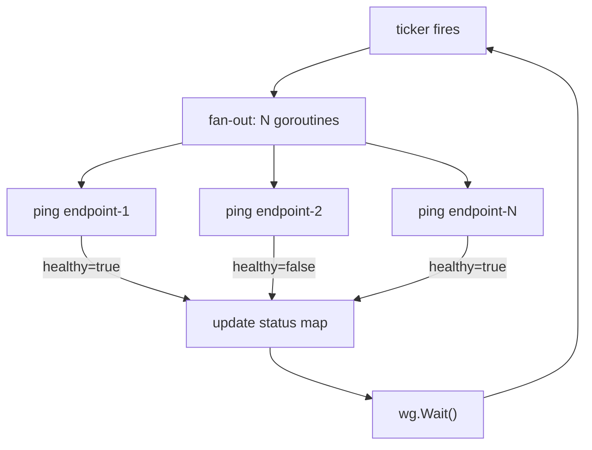
```mermaid
flowchart TD
    T["ticker fires"] --> F["fan-out: N goroutines"]
    F --> P1["ping endpoint-1"]
    F --> P2["ping endpoint-2"]
    F --> PN["ping endpoint-N"]
    P1 -->|"healthy=true"| M["update status map"]
    P2 -->|"healthy=false"| M
    PN -->|"healthy=true"| M
    M --> W["wg.Wait()"]
    W --> T
```
```
Trace: 3 endpoints, interval=1s, timeout=200ms
t=0:   tick → 3 goroutines launched
t=150ms: ep1 responds 200 → healthy=true
t=200ms: ep2 timeout → healthy=false
t=120ms: ep3 responds 200 → healthy=true
t=200ms: wg.Wait() returns
t=1000ms: next tick
```

### Interviewer Questions
1. What happens if a ping goroutine from tick N is still running when tick N+1 fires?
2. How do you prevent creating too many goroutines if endpoints are slow?
3. How would you add circuit breaking per endpoint?
4. How would you implement consecutive-failure-threshold before marking unhealthy?
5. How would you export health status as a Prometheus gauge?
6. How do you test the health checker without real HTTP servers?
7. What is the difference between liveness and readiness in this context?

### Follow-Up Questions
**Q1:** How would you implement a consecutive-failure threshold before marking unhealthy?
**A1:** Track `failures[ep]` counter. Increment on failure, reset to 0 on success. Mark unhealthy only when `failures[ep] >= threshold`. This prevents flapping from transient single failures.

**Q2:** How would you add alerting when an endpoint transitions from healthy to unhealthy?
**A2:** Track previous state. On each update, compare new state with old state. If changed healthy→unhealthy, fire an alert (Slack, PagerDuty). Rate-limit alerts: send at most one alert per endpoint per 5 minutes.

**Q3:** How do you implement weighted health scoring (e.g., latency percentile)?
**A3:** Maintain a sliding window of last N latency measurements per endpoint. Compute p95 latency. Mark unhealthy if p95 > SLA threshold. Use a ring buffer of size N protected by a mutex.

**Q4:** How would you run health checks from multiple geographic regions?
**A4:** Deploy health checker instances in each region. Aggregate results via a central store (Redis, Consul). Endpoint is globally unhealthy only if a quorum of regions report it down. This prevents false positives from regional network issues.

**Q5:** How would you implement adaptive interval (check more frequently when unhealthy)?
**A5:** Maintain `interval[ep]`. On failure, halve the interval (min 5s). On success, double it back toward maxInterval. Use per-endpoint timers instead of a global ticker. This focuses resources on degraded endpoints.

---

---
## Q16: Connection Pool  [Level 4 — Advanced]
> **Tags:** `#pool` `#semaphore` `#resource-management` `#goroutine`

### Problem Statement
Implement a generic connection pool that manages a fixed number of reusable connections. Callers acquire a connection via `Get`, use it, then return it via `Put`. If all connections are checked out, `Get` blocks until one is returned or the context is cancelled. Support health checking: discard unhealthy connections and create fresh ones.

### Input / Output / Constraints
```
Input:  maxSize int, factory func() (Conn, error), healthCheck func(Conn) bool
Output: Conn (from pool or freshly created)
Constraints:
  - maxSize > 0
  - Get must block (not busy-wait) when pool is empty
  - Put must discard unhealthy connections
  - must not exceed maxSize total connections
  - context cancellation must unblock Get
```

### Thought Process
1. Understand: Pool = bounded set of reusable resources. Blocking Get + non-blocking Put. Total connections (in-pool + checked-out) must never exceed maxSize.
2. Pattern: Buffered channel of size maxSize holding available connections. Semaphore (another buffered channel or atomic counter) tracking total live connections to allow creating new ones up to maxSize.
3. Edge cases: All connections unhealthy (thundering herd on factory), factory fails, pool closed during Get.

### Brute Force
```go
// O(1) — no health check, no proper blocking
type BrutePool struct {
    mu    sync.Mutex
    conns []Conn
}
func (p *BrutePool) Get() Conn {
    p.mu.Lock(); defer p.mu.Unlock()
    if len(p.conns) > 0 {
        c := p.conns[len(p.conns)-1]
        p.conns = p.conns[:len(p.conns)-1]
        return c
    }
    c, _ := factory()
    return c // no bound check — can create unlimited connections
}
```
**Time:** O(1) | **Space:** O(N)

### Better Solution
```go
// Buffered channel approach — correct but no health check
type BetterPool struct {
    conns chan Conn
    factory func() (Conn, error)
}
func NewBetterPool(size int, factory func() (Conn, error)) *BetterPool {
    p := &BetterPool{conns: make(chan Conn, size), factory: factory}
    for i := 0; i < size; i++ { c, _ := factory(); p.conns <- c }
    return p
}
func (p *BetterPool) Get(ctx context.Context) (Conn, error) {
    select {
    case c := <-p.conns: return c, nil
    case <-ctx.Done(): return nil, ctx.Err()
    }
}
func (p *BetterPool) Put(c Conn) { p.conns <- c }
```
**Time:** O(1) | **Space:** O(N)

### Best Solution
```go
package main

import (
    "context"
    "errors"
    "fmt"
    "sync"
    "sync/atomic"
    "time"
)

type Conn interface {
    Close() error
    Ping() error
}

type mockConn struct{ id int; closed bool }
func (c *mockConn) Close() error  { c.closed = true; return nil }
func (c *mockConn) Ping() error   { if c.closed { return errors.New("closed") }; return nil }

// Pool — O(1) Get/Put, O(N) space
type Pool struct {
    factory     func() (Conn, error)
    healthCheck func(Conn) bool
    maxSize     int
    available   chan Conn
    total       atomic.Int64
    mu          sync.Mutex
    closed      bool
}

func NewPool(maxSize int, factory func() (Conn, error), healthCheck func(Conn) bool) *Pool {
    return &Pool{
        factory:     factory,
        healthCheck: healthCheck,
        maxSize:     maxSize,
        available:   make(chan Conn, maxSize),
    }
}

// Get acquires a connection from the pool, creating one if needed.
func (p *Pool) Get(ctx context.Context) (Conn, error) {
    for {
        // 1. Try to grab available connection
        select {
        case c := <-p.available:
            if p.healthCheck != nil && !p.healthCheck(c) {
                c.Close()
                p.total.Add(-1)
                continue // discard and retry
            }
            return c, nil
        default:
        }

        // 2. Try to create new connection if under maxSize
        if p.total.Load() < int64(p.maxSize) {
            p.mu.Lock()
            if p.total.Load() < int64(p.maxSize) {
                p.total.Add(1)
                p.mu.Unlock()
                c, err := p.factory()
                if err != nil {
                    p.total.Add(-1)
                    return nil, err
                }
                return c, nil
            }
            p.mu.Unlock()
        }

        // 3. Block until a connection is returned or ctx cancelled
        select {
        case c := <-p.available:
            if p.healthCheck != nil && !p.healthCheck(c) {
                c.Close()
                p.total.Add(-1)
                // try creating a new one
                p.mu.Lock()
                p.total.Add(1)
                p.mu.Unlock()
                c2, err := p.factory()
                if err != nil { p.total.Add(-1); return nil, err }
                return c2, nil
            }
            return c, nil
        case <-ctx.Done():
            return nil, ctx.Err()
        }
    }
}

// Put returns a connection to the pool.
func (p *Pool) Put(c Conn) {
    if c == nil { return }
    p.mu.Lock()
    if p.closed {
        p.mu.Unlock()
        c.Close()
        p.total.Add(-1)
        return
    }
    p.mu.Unlock()
    select {
    case p.available <- c:
    default:
        c.Close()
        p.total.Add(-1)
    }
}

func (p *Pool) Close() {
    p.mu.Lock()
    p.closed = true
    p.mu.Unlock()
    close(p.available)
    for c := range p.available { c.Close() }
}

func main() {
    idCounter := 0
    pool := NewPool(3,
        func() (Conn, error) { idCounter++; return &mockConn{id: idCounter}, nil },
        func(c Conn) bool { return c.Ping() == nil },
    )

    var wg sync.WaitGroup
    for i := 0; i < 10; i++ {
        wg.Add(1)
        go func(i int) {
            defer wg.Done()
            ctx, cancel := context.WithTimeout(context.Background(), time.Second)
            defer cancel()
            c, err := pool.Get(ctx)
            if err != nil { fmt.Println("get error:", err); return }
            time.Sleep(50 * time.Millisecond)
            pool.Put(c)
        }(i)
    }
    wg.Wait()
    fmt.Println("total conns created:", idCounter)
}
```
**Time:** O(1) amortized | **Space:** O(N)

### Production Considerations
| Aspect | Details |
|--------|---------|
| Scalability | Fixed pool prevents resource exhaustion at the backend |
| Edge Cases | All connections unhealthy at once → factory storm → rate-limit creation |
| Error Handling | Factory failure returns error to caller; don't increment total |
| Memory | Connections are heavyweight; pool size = max concurrent users |
| Concurrency | Atomic for total count, mutex for double-check pattern, channel for blocking Get |

### Visual Explanation
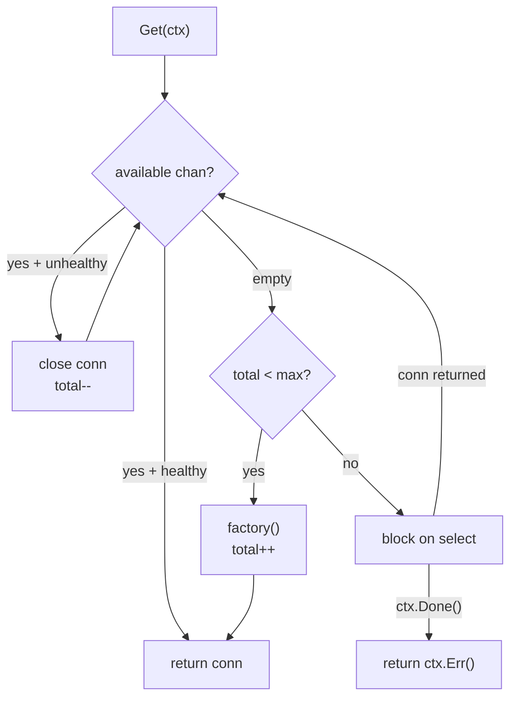
```mermaid
flowchart TD
    A["Get(ctx)"] --> B{"available chan?"}
    B -->|"yes + healthy"| Z["return conn"]
    B -->|"yes + unhealthy"| D["close conn\ntotal--"]
    D --> B
    B -->|"empty"| C{"total < max?"}
    C -->|"yes"| E["factory()\ntotal++"]
    E --> Z
    C -->|"no"| F["block on select"]
    F -->|"conn returned"| B
    F -->|"ctx.Done()"| G["return ctx.Err()"]
```
```
Trace: maxSize=3, 10 concurrent callers
t=0:  callers 0,1,2 → create conns 1,2,3 (total=3)
t=0:  callers 3-9 → block on available chan
t=50ms: callers 0,1,2 Put conns → 3 unblock
t=100ms: callers 3,4,5 Put conns → 3 more unblock
t=150ms: all done. conns created = 3
```

### Interviewer Questions
1. Why do we need both atomic total count and a mutex for the double-check?
2. What happens if Put is called after the pool is closed?
3. How do you prevent connection storms when all connections fail healthcheck?
4. How would you add idle timeout (close connections unused for N seconds)?
5. How do you implement warm-up (pre-create all connections at startup)?
6. How does this differ from database/sql's built-in connection pool?
7. How would you add connection acquisition timeout separate from context?

### Follow-Up Questions
**Q1:** How does database/sql implement its connection pool differently?
**A1:** database/sql uses a combination of freeConn slice (idle connections), numOpen counter, and a condition variable (via channel) for waiting callers. It also tracks per-connection lifetime (maxLifetime) and per-connection idle time (maxIdleTime), closing connections that exceed either.

**Q2:** How would you implement connection pool per database shard?
**A2:** Maintain a map[shardID]*Pool. Use a consistent hash of the key to select shard. Each shard pool is independent. For hot shards, increase pool size dynamically via a resize method that adjusts maxSize and channel buffer.

**Q3:** How would you add metrics: pool utilization, wait time, creation rate?
**A3:** Add atomic counters: inUse, waitCount, totalCreated. Record wait duration with time.Now() before blocking and time.Since() after. Export as Prometheus histograms and gauges. Alert when avg wait time > SLA threshold.

**Q4:** How would you implement priority-based connection acquisition?
**A4:** Use two available channels: highPriority and lowPriority. High-priority callers select highPriority first. Low-priority callers select lowPriority. Put always tries highPriority first to service it faster. Use a priority flag in the Get signature.

**Q5:** How do you handle connection leaks (caller forgets to Put)?
**A5:** Wrap Conn in a lease object with a deadline. A background goroutine periodically scans active leases. If a lease's deadline passes, log a warning with the caller's stack trace (captured via runtime.Callers at Get time) and forcibly close the connection.

---
## Q17: Bounded FIFO Queue  [Level 3 — Medium]
> **Tags:** `#queue` `#bounded` `#condition` `#blocking`

### Problem Statement
Implement a thread-safe, bounded FIFO queue with blocking `Enqueue` (blocks when full) and blocking `Dequeue` (blocks when empty). Support a close operation that unblocks all waiting goroutines. The queue must have O(1) enqueue and dequeue. Use `sync.Cond` for condition-based blocking.

### Input / Output / Constraints
```
Input:  capacity int; Enqueue(item T); Dequeue() (T, bool)
Output: items in FIFO order; false returned after close
Constraints:
  - capacity > 0
  - Enqueue blocks when len == capacity
  - Dequeue blocks when len == 0
  - Close unblocks all waiters
  - O(1) enqueue/dequeue
```

### Thought Process
1. Understand: Bounded producer-consumer queue. Producers block when full; consumers block when empty. Closing the queue drains consumers gracefully.
2. Pattern: Ring buffer for O(1) ops. sync.Mutex + two sync.Cond (notFull, notEmpty). Close sets a flag and broadcasts on both conditions.
3. Edge cases: Close called with items still in queue (consumers should drain), multiple producers/consumers, capacity=1.

### Brute Force
```go
// Unbounded, non-blocking — misses all requirements
type BruteQueue[T any] struct {
    mu    sync.Mutex
    items []T
}
func (q *BruteQueue[T]) Enqueue(v T) { q.mu.Lock(); q.items = append(q.items, v); q.mu.Unlock() }
func (q *BruteQueue[T]) Dequeue() (T, bool) {
    q.mu.Lock(); defer q.mu.Unlock()
    if len(q.items) == 0 { var z T; return z, false }
    v := q.items[0]; q.items = q.items[1:]
    return v, true
}
```
**Time:** O(N) dequeue (shift) | **Space:** O(N)

### Better Solution
```go
// Channel-based — clean but no Cond flexibility
func NewChannelQueue[T any](cap int) (func(T), func() (T, bool), func()) {
    ch := make(chan T, cap)
    enqueue := func(v T) { ch <- v }
    dequeue := func() (T, bool) { v, ok := <-ch; return v, ok }
    close_ := func() { close(ch) }
    return enqueue, dequeue, close_
}
```
**Time:** O(1) | **Space:** O(cap)

### Best Solution
```go
package main

import (
    "fmt"
    "sync"
)

// BoundedQueue — O(1) Enqueue/Dequeue, O(capacity) space
type BoundedQueue[T any] struct {
    mu       sync.Mutex
    notFull  *sync.Cond
    notEmpty *sync.Cond
    buf      []T
    head     int
    tail     int
    count    int
    capacity int
    closed   bool
}

func NewBoundedQueue[T any](capacity int) *BoundedQueue[T] {
    q := &BoundedQueue[T]{
        buf:      make([]T, capacity),
        capacity: capacity,
    }
    q.notFull = sync.NewCond(&q.mu)
    q.notEmpty = sync.NewCond(&q.mu)
    return q
}

// Enqueue blocks when full; returns false if queue is closed.
func (q *BoundedQueue[T]) Enqueue(v T) bool {
    q.mu.Lock()
    defer q.mu.Unlock()
    for q.count == q.capacity && !q.closed {
        q.notFull.Wait()
    }
    if q.closed {
        return false
    }
    q.buf[q.tail] = v
    q.tail = (q.tail + 1) % q.capacity
    q.count++
    q.notEmpty.Signal()
    return true
}

// Dequeue blocks when empty; returns (zero, false) if closed and empty.
func (q *BoundedQueue[T]) Dequeue() (T, bool) {
    q.mu.Lock()
    defer q.mu.Unlock()
    for q.count == 0 && !q.closed {
        q.notEmpty.Wait()
    }
    if q.count == 0 {
        var zero T
        return zero, false
    }
    v := q.buf[q.head]
    q.head = (q.head + 1) % q.capacity
    q.count--
    q.notFull.Signal()
    return v, true
}

// Close unblocks all waiting goroutines.
func (q *BoundedQueue[T]) Close() {
    q.mu.Lock()
    q.closed = true
    q.mu.Unlock()
    q.notFull.Broadcast()
    q.notEmpty.Broadcast()
}

func (q *BoundedQueue[T]) Len() int {
    q.mu.Lock()
    defer q.mu.Unlock()
    return q.count
}

func main() {
    q := NewBoundedQueue[int](3)

    var wg sync.WaitGroup
    // Producer
    wg.Add(1)
    go func() {
        defer wg.Done()
        for i := 0; i < 10; i++ {
            if !q.Enqueue(i) {
                fmt.Println("queue closed, stopping producer")
                return
            }
        }
        q.Close()
    }()

    // Consumer
    wg.Add(1)
    go func() {
        defer wg.Done()
        for {
            v, ok := q.Dequeue()
            if !ok {
                fmt.Println("queue drained")
                return
            }
            fmt.Println("dequeued:", v)
        }
    }()
    wg.Wait()
}
```
**Time:** O(1) | **Space:** O(capacity)

### Production Considerations
| Aspect | Details |
|--------|---------|
| Scalability | Ring buffer avoids allocations; capacity chosen per workload |
| Edge Cases | Close with items remaining: consumers drain before returning false |
| Error Handling | Enqueue after Close returns false; callers must handle |
| Memory | Fixed capacity * sizeof(T); no dynamic allocation after init |
| Concurrency | sync.Cond prevents busy-waiting; Broadcast on close wakes all |

### Visual Explanation
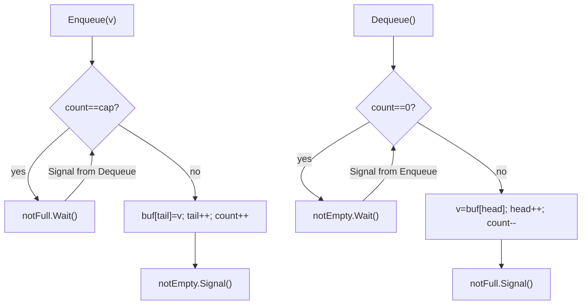
```mermaid
flowchart TD
    E["Enqueue(v)"] --> F1{"count==cap?"}
    F1 -->|"yes"| W1["notFull.Wait()"]
    W1 -->|"Signal from Dequeue"| F1
    F1 -->|"no"| S["buf[tail]=v; tail++; count++"]
    S --> N["notEmpty.Signal()"]

    D["Dequeue()"] --> F2{"count==0?"}
    F2 -->|"yes"| W2["notEmpty.Wait()"]
    W2 -->|"Signal from Enqueue"| F2
    F2 -->|"no"| R["v=buf[head]; head++; count--"]
    R --> N2["notFull.Signal()"]
```
```
Trace: capacity=3, producer sends 0..9
t=0: enqueue 0,1,2 → count=3
t=0: enqueue 3 → notFull.Wait() (full)
t=1: dequeue 0 → count=2 → notFull.Signal()
t=1: enqueue 3 → count=3
...
```

### Interviewer Questions
1. Why use sync.Cond instead of two channels for signalling?
2. What is the difference between Signal() and Broadcast()?
3. Why must the condition check be in a for loop, not an if?
4. How do you prevent starvation if many producers and few consumers?
5. How would you add a TryEnqueue (non-blocking, return false if full)?
6. How do you implement priority dequeue with this structure?
7. What is the risk of calling Broadcast vs Signal on every enqueue?

### Follow-Up Questions
**Q1:** Why must the wait condition be checked in a for loop (spurious wakeups)?
**A1:** The Go runtime may wake a goroutine waiting on a Cond even without a corresponding Signal or Broadcast (spurious wakeup). The for loop re-checks the condition after waking and goes back to sleep if it's not yet satisfied.

**Q2:** How would you implement TryEnqueue (non-blocking)?
**A2:** Lock the mutex. If count == capacity or closed, unlock and return false. Otherwise enqueue normally and return true. Don't call notFull.Wait(). This gives callers the option to apply back-pressure differently (e.g., drop, redirect).

**Q3:** How would you implement a multi-priority queue with three priority levels?
**A3:** Maintain three BoundedQueues: high, medium, low. Dequeue checks high first (non-blocking TryDequeue), then medium, then low. If all empty, block on a shared notEmpty cond. Enqueue directs to the appropriate queue by priority parameter.

**Q4:** How would you implement a work-stealing queue for better load distribution?
**A4:** Each worker owns a local deque. Workers push/pop from their own deque (LIFO, cache-friendly). When a worker's deque is empty, it steals from another worker's deque from the opposite end (FIFO). This is the pattern used in Go's own goroutine scheduler.

**Q5:** How do you benchmark this queue vs a channel-based queue?
**A5:** Use testing.B with parallel producers and consumers. Measure throughput (ops/sec) and latency percentiles. Expect channel-based to be faster for simple cases (runtime-optimized). Cond-based wins when you need custom blocking semantics (like multi-condition or priority).

---

---
## Q18: Singleflight Request Coalescing  [Level 4 — Advanced]
> **Tags:** `#singleflight` `#deduplication` `#cache` `#goroutine`

### Problem Statement
Implement your own `singleflight.Group` from scratch (without importing `golang.org/x/sync/singleflight`). Concurrent calls with the same key share a single in-flight execution. All callers receive the same result. After the call completes, subsequent calls start a new execution. Track whether a caller was a "sharer" (waited) vs the "owner" (executed).

### Input / Output / Constraints
```
Input:  key string, fn func() (interface{}, error)
Output: (val interface{}, err error, shared bool)
Constraints:
  - exactly one fn() call per key per in-flight window
  - all concurrent callers receive same (val, err)
  - shared=true for all callers who waited
  - safe for concurrent use
  - fn must not be called with lock held
```

### Thought Process
1. Understand: Build a map from key → in-flight call. First caller creates the call entry, executes fn. Later callers find the entry, wait on its done channel. After fn returns, broadcast result to all waiters, delete entry.
2. Pattern: Mutex-protected map of *call structs. Each *call has a channel closed on completion. sync.WaitGroup or close(ch) to signal all waiters.
3. Edge cases: fn panics (must recover and propagate), concurrent Forget call, key reuse immediately after completion.

### Brute Force
```go
// O(N calls) — no coalescing, each caller runs fn
func bruteForce(fn func() (interface{}, error)) (interface{}, error) {
    return fn() // every caller runs independently
}
```
**Time:** O(N * fn_cost) | **Space:** O(N)

### Better Solution
```go
// Simple version — no panic propagation, no shared flag
type SimpleGroup struct {
    mu   sync.Mutex
    m    map[string]*simpleCall
}
type simpleCall struct {
    done chan struct{}
    val  interface{}
    err  error
}
func (g *SimpleGroup) Do(key string, fn func() (interface{}, error)) (interface{}, error) {
    g.mu.Lock()
    if c, ok := g.m[key]; ok { g.mu.Unlock(); <-c.done; return c.val, c.err }
    c := &simpleCall{done: make(chan struct{})}
    g.m[key] = c
    g.mu.Unlock()
    c.val, c.err = fn()
    close(c.done)
    g.mu.Lock(); delete(g.m, key); g.mu.Unlock()
    return c.val, c.err
}
```
**Time:** O(1) | **Space:** O(keys)

### Best Solution
```go
package main

import (
    "fmt"
    "sync"
    "sync/atomic"
    "time"
)

// call represents an in-flight or completed singleflight.Do call.
type call struct {
    wg      sync.WaitGroup
    val     interface{}
    err     error
    waiters atomic.Int64 // how many goroutines are sharing this call
}

// Group — O(1) Do per key, O(active_keys) space
type Group struct {
    mu sync.Mutex
    m  map[string]*call
}

// Do executes fn for key, deduplicating concurrent calls.
// Returns (value, error, shared) where shared=true means this caller waited.
func (g *Group) Do(key string, fn func() (interface{}, error)) (interface{}, error, bool) {
    g.mu.Lock()
    if g.m == nil {
        g.m = make(map[string]*call)
    }
    if c, ok := g.m[key]; ok {
        c.waiters.Add(1)
        g.mu.Unlock()
        c.wg.Wait()
        return c.val, c.err, true // shared=true: we waited
    }
    c := new(call)
    c.wg.Add(1)
    g.m[key] = c
    g.mu.Unlock()

    g.doCall(c, key, fn)
    return c.val, c.err, false // shared=false: we were the owner
}

func (g *Group) doCall(c *call, key string, fn func() (interface{}, error)) {
    defer func() {
        if r := recover(); r != nil {
            c.err = fmt.Errorf("singleflight: panic: %v", r)
        }
        g.mu.Lock()
        delete(g.m, key)
        g.mu.Unlock()
        c.wg.Done()
    }()
    c.val, c.err = fn()
}

// Forget invalidates the key, allowing the next Do to start a new call.
func (g *Group) Forget(key string) {
    g.mu.Lock()
    delete(g.m, key)
    g.mu.Unlock()
}

func main() {
    var g Group
    calls := 0
    var mu sync.Mutex

    loader := func() (interface{}, error) {
        mu.Lock(); calls++; mu.Unlock()
        time.Sleep(100 * time.Millisecond)
        return "result", nil
    }

    var wg sync.WaitGroup
    for i := 0; i < 50; i++ {
        wg.Add(1)
        go func(i int) {
            defer wg.Done()
            v, _, shared := g.Do("key", loader)
            fmt.Printf("goroutine %d: val=%v shared=%v\n", i, v, shared)
        }(i)
    }
    wg.Wait()

    mu.Lock()
    fmt.Println("total loader calls:", calls) // should be 1
    mu.Unlock()
}
```
**Time:** O(1) | **Space:** O(active_keys)

### Production Considerations
| Aspect | Details |
|--------|---------|
| Scalability | Reduces N concurrent calls to 1; critical for cold cache paths |
| Edge Cases | fn panics → recovered and returned as error to all waiters |
| Error Handling | Error returned to all waiters; consider not-sharing errors (Forget on error) |
| Memory | Entries deleted after fn completes; no permanent memory growth |
| Concurrency | Mutex protects map; WaitGroup signals all waiters atomically |

### Visual Explanation
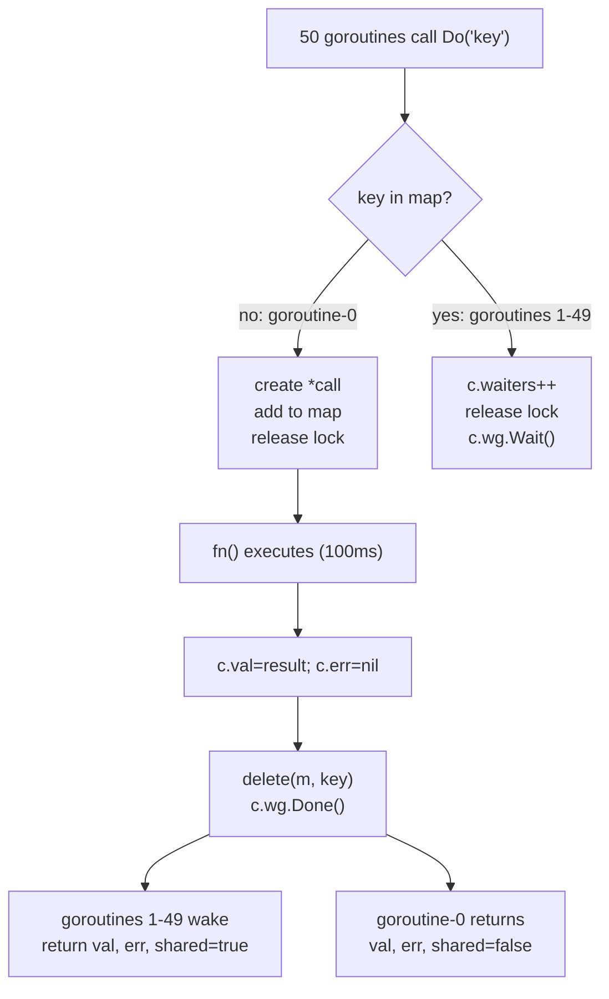
```mermaid
flowchart TD
    A["50 goroutines call Do('key')"] --> B{"key in map?"}
    B -->|"no: goroutine-0"| C["create *call\nadd to map\nrelease lock"]
    C --> D["fn() executes (100ms)"]
    B -->|"yes: goroutines 1-49"| E["c.waiters++\nrelease lock\nc.wg.Wait()"]
    D --> F["c.val=result; c.err=nil"]
    F --> G["delete(m, key)\nc.wg.Done()"]
    G --> H["goroutines 1-49 wake\nreturn val, err, shared=true"]
    G --> I["goroutine-0 returns\nval, err, shared=false"]
```
```
Trace: 50 goroutines, fn takes 100ms
t=0ms:   g0 → key not in map → creates call, runs fn
t=0ms:   g1..g49 → key in map → c.wg.Wait()
t=100ms: fn returns "result" → wg.Done()
t=100ms: all 50 goroutines return "result"
loader calls = 1
```

### Interviewer Questions
1. What happens if fn panics without recover in the singleflight?
2. Why delete the key from the map before wg.Done()?
3. How does Forget enable cache invalidation?
4. What is the difference between DoChan and Do?
5. How would you implement negative caching (cache errors for N seconds)?
6. How does singleflight interact with context cancellation?
7. How would you implement per-key rate limiting on top of singleflight?

### Follow-Up Questions
**Q1:** Why must we delete the map entry before calling wg.Done()?
**A1:** If we called wg.Done() first, goroutines waiting on c.wg.Wait() would unblock and immediately call Do again for the same key. If we haven't deleted yet, they'd find the old call entry and block forever on a wg that's already at 0. Delete first ensures new calls start fresh.

**Q2:** How would you implement DoChan (non-blocking, returns a channel)?
**A2:** DoChan returns `<-chan Result`. If key is in-flight, append a new chan Result to the call's subscriber list and return it. When fn completes, range over subscribers and send the result to each. Close each channel after sending.

**Q3:** How would you prevent error sharing (each failed caller retries independently)?
**A3:** In the doCall defer, if c.err != nil, call g.Forget(key) before wg.Done(). This removes the entry so the next Do starts a fresh call. Waiters still receive the error from this round but the next caller will retry fn independently.

**Q4:** How does the standard library's singleflight handle the case where callers arrive after fn completes?
**A4:** The standard singleflight does NOT cache results after completion. After wg.Done(), the entry is deleted. New callers start a new in-flight. If you want caching across calls, combine singleflight with an explicit cache (as in Q13).

**Q5:** How would you add a timeout to singleflight (cancel fn if all waiters time out)?
**A5:** Track waiter count with an atomic counter. Each waiter decrements on timeout. If waiter count reaches 0 (including the owner), cancel fn via context. Pass a context to fn that is cancelled when all waiters are gone. This requires fn to respect context cancellation.

---

---
## Q19: Actor Model  [Level 4 — Advanced]
> **Tags:** `#actor` `#message-passing` `#goroutine` `#channel`

### Problem Statement
Implement a simple Actor model in Go. Each Actor is a goroutine with a private mailbox (channel). Actors communicate only by sending messages. Implement a typed message dispatch system. Implement a Supervisor that restarts crashed actors. Actors must not share memory; all state is private.

### Input / Output / Constraints
```
Input:  Actor behaviors (functions), messages (typed structs)
Output: actors process messages; supervisor restarts on panic
Constraints:
  - no shared memory between actors
  - all communication via message channels
  - supervisor detects panic and restarts actor
  - mailbox has bounded buffer
  - actors can send to other actors by reference
```

### Thought Process
1. Understand: Actor = goroutine + mailbox channel + behavior function. Messages are structs. Supervisor monitors crash and restarts.
2. Pattern: Define Actor struct with mailbox chan. Behavior is a function over state. Supervisor uses goroutine + recover to catch panics, restart with initial state. Typed dispatch via type switch on message interface.
3. Edge cases: Actor crashes mid-processing (state loss), mailbox full when actor restarts, cascading failures.

### Brute Force
```go
// Single actor, no supervisor
func bruteActor(mailbox chan int) {
    for msg := range mailbox {
        fmt.Println("got:", msg)
    }
}
```
**Time:** O(N messages) | **Space:** O(mailbox cap)

### Better Solution
```go
// Multi-actor with supervisor restart
type Msg interface{}
type Actor struct{ mailbox chan Msg }
func (a *Actor) Send(m Msg) { a.mailbox <- m }
func (a *Actor) Run(behavior func(Msg)) {
    go func() {
        defer func() {
            if r := recover(); r != nil {
                fmt.Println("restarting after panic:", r)
                a.Run(behavior) // naive: no state reset
            }
        }()
        for m := range a.mailbox { behavior(m) }
    }()
}
```
**Time:** O(N) | **Space:** O(cap)

### Best Solution
```go
package main

import (
    "fmt"
    "sync"
    "time"
)

// --- Message types ---
type Message interface{ isMessage() }
type Increment struct{ By int }
type GetCount struct{ Reply chan int }
type Shutdown struct{}

func (Increment) isMessage() {}
func (GetCount) isMessage()  {}
func (Shutdown) isMessage()  {}

// --- Actor ---
type CounterState struct{ count int }

type Actor struct {
    mailbox chan Message
    name    string
}

func NewActor(name string, bufSize int) *Actor {
    return &Actor{name: name, mailbox: make(chan Message, bufSize)}
}

func (a *Actor) Send(m Message) {
    a.mailbox <- m
}

func (a *Actor) TrySend(m Message) bool {
    select {
    case a.mailbox <- m:
        return true
    default:
        return false
    }
}

// behavior processes messages with private state.
func counterBehavior(state *CounterState, msg Message) bool {
    switch m := msg.(type) {
    case Increment:
        state.count += m.By
    case GetCount:
        m.Reply <- state.count
    case Shutdown:
        return false // stop signal
    }
    return true
}

// --- Supervisor ---
type Supervisor struct {
    actors []*Actor
    wg     sync.WaitGroup
}

func (s *Supervisor) Spawn(a *Actor, initialState func() *CounterState) {
    s.wg.Add(1)
    go func() {
        defer s.wg.Done()
        restarts := 0
        for {
            alive := s.run(a, initialState())
            if alive {
                break // clean shutdown
            }
            restarts++
            if restarts > 3 {
                fmt.Printf("[supervisor] actor %s exceeded restart limit\n", a.name)
                return
            }
            fmt.Printf("[supervisor] restarting actor %s (attempt %d)\n", a.name, restarts)
            time.Sleep(100 * time.Millisecond)
        }
    }()
}

func (s *Supervisor) run(a *Actor, state *CounterState) (cleanShutdown bool) {
    defer func() {
        if r := recover(); r != nil {
            fmt.Printf("[actor %s] recovered from panic: %v\n", a.name, r)
            cleanShutdown = false // trigger restart
        }
    }()
    for msg := range a.mailbox {
        if !counterBehavior(state, msg) {
            return true // Shutdown message
        }
    }
    return true // mailbox closed
}

func (s *Supervisor) Wait() { s.wg.Wait() }

func main() {
    sup := &Supervisor{}
    counter := NewActor("counter", 16)

    sup.Spawn(counter, func() *CounterState { return &CounterState{} })

    counter.Send(Increment{By: 5})
    counter.Send(Increment{By: 3})

    reply := make(chan int, 1)
    counter.Send(GetCount{Reply: reply})
    fmt.Println("count:", <-reply) // 8

    counter.Send(Increment{By: 10})
    counter.Send(GetCount{Reply: reply})
    fmt.Println("count:", <-reply) // 18

    counter.Send(Shutdown{})
    sup.Wait()
    fmt.Println("actor system shutdown cleanly")
}
```
**Time:** O(N messages) | **Space:** O(mailbox_cap)

### Production Considerations
| Aspect | Details |
|--------|---------|
| Scalability | Each actor is a goroutine; millions possible with small stacks |
| Edge Cases | State lost on restart; use event sourcing to replay to current state |
| Error Handling | Supervisor catches panics; escalate after max restarts |
| Memory | Mailbox buffer size limits memory per actor; use backpressure |
| Concurrency | All state is private; no mutex needed inside actor |

### Visual Explanation
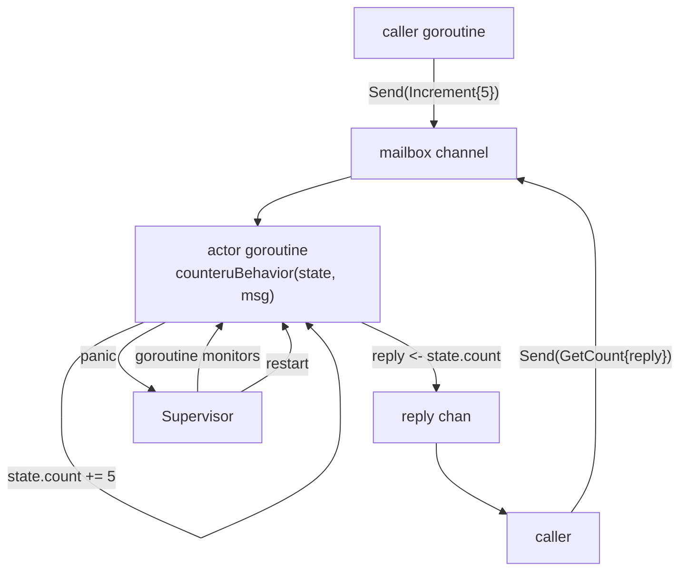
```mermaid
flowchart TD
    C["caller goroutine"] -->|"Send(Increment{5})"| MB["mailbox channel"]
    MB --> A["actor goroutine\ncounteruBehavior(state, msg)"]
    A -->|"state.count += 5"| A
    C2["caller"] -->|"Send(GetCount{reply})"| MB
    A -->|"reply <- state.count"| R["reply chan"]
    R --> C2
    SUP["Supervisor"] -->|"goroutine monitors"| A
    A -->|"panic"| SUP
    SUP -->|"restart"| A
```
```
Trace:
Send(Increment{5}) → state.count=5
Send(Increment{3}) → state.count=8
Send(GetCount{reply}) → reply ← 8
Send(Increment{10}) → state.count=18
Send(Shutdown{}) → actor exits cleanly
```

### Interviewer Questions
1. How does the actor model prevent data races?
2. What is the role of the Supervisor in fault tolerance?
3. How do you handle state recovery after an actor restart?
4. How does actor model compare to CSP (Go channels)?
5. How would you implement request-reply (ask pattern) between two actors?
6. How would you implement actor hierarchies (tree of supervisors)?
7. How do you implement actor discovery (actors finding each other by name)?

### Follow-Up Questions
**Q1:** How does the actor model compare to goroutines + channels (CSP)?
**A1:** Both use message passing. CSP focuses on channels as first-class entities (the channel is named, not the communicating parties). Actor model focuses on the actor identity — you send to a named actor, not a channel. In Go, actors are implemented on top of CSP by encapsulating channels within actor structs.

**Q2:** How would you implement the ask pattern (request-reply)?
**A2:** Create a one-time reply channel per request: `reply := make(chan Response, 1)`. Include it in the message: `actor.Send(Request{Data: x, Reply: reply})`. After sending, `r := <-reply`. The actor processes the request and sends to `m.Reply`. Add a timeout with select+time.After to avoid blocking forever.

**Q3:** How do you implement event sourcing to recover actor state after restart?
**A3:** Instead of mutating state in place, append each message to a persistent event log (e.g., append-only file or Kafka topic). On restart, replay all events from the log to reconstruct state. This makes state recovery deterministic and auditable.

**Q4:** How would you implement actor discovery (actors finding each other by name)?
**A4:** Use a registry: `map[string]*Actor` protected by a mutex or sync.Map. Actors register on creation: `registry.Register("counter", a)`. Others look up by name: `a := registry.Lookup("counter")`. Use reference counting or tombstones for deregistration.

**Q5:** How would you scale the actor system across multiple machines?
**A5:** Use a distributed messaging system (NATS, Kafka, gRPC streams) as the mailbox transport. Each machine runs an actor runtime that routes messages to local actors or forwards to remote runtimes. Actor addresses include node ID. This is the Akka/Erlang distributed actor approach.

---


---
## Q20: Parallel Map with errgroup  [Level 3 — Medium]
> **Tags:** `#errgroup` `#parallel` `#map` `#generic`

### Problem Statement
Implement `ParallelMap` that applies a transform function to each element of a slice concurrently, preserving order. Use `errgroup` for error propagation and cancellation. If any transform fails, cancel remaining work and return the first error. Limit concurrency to a configurable maximum.

### Input / Output / Constraints
```
Input:  ctx context.Context, items []T, maxConcurrency int, fn func(T) (R, error)
Output: ([]R, error)
Constraints:
  - output[i] corresponds to items[i]
  - first error cancels remaining goroutines
  - maxConcurrency >= 1
  - fn receives a cancellable ctx
```

### Thought Process
1. Understand: Standard fan-out with ordered output. errgroup handles wait + first-error propagation + context cancellation.
2. Pattern: errgroup.WithContext for cancellation. Semaphore channel to limit concurrency. Index-based write to results slice is safe (each goroutine writes to a unique index).
3. Edge cases: maxConcurrency > len(items) (fine, semaphore won't block), all items fail (first error wins), ctx already cancelled.

### Brute Force
```go
// Sequential, no concurrency
func bruteMap[T, R any](items []T, fn func(T) (R, error)) ([]R, error) {
    out := make([]R, len(items))
    for i, v := range items { var err error; out[i], err = fn(v); if err != nil { return nil, err } }
    return out, nil
}
```
**Time:** O(N * fn_cost) | **Space:** O(N)

### Better Solution
```go
func betterMap[T, R any](ctx context.Context, items []T, fn func(context.Context, T) (R, error)) ([]R, error) {
    g, ctx := errgroup.WithContext(ctx)
    out := make([]R, len(items))
    for i, v := range items {
        i, v := i, v
        g.Go(func() error { var err error; out[i], err = fn(ctx, v); return err })
    }
    if err := g.Wait(); err != nil { return nil, err }
    return out, nil
}
```
**Time:** O(max_fn_cost) | **Space:** O(N) — but no concurrency limit

### Best Solution
```go
package main

import (
    "context"
    "fmt"

    "golang.org/x/sync/errgroup"
)

// ParallelMap — O(max_fn_cost) time, O(N) space
func ParallelMap[T, R any](
    ctx context.Context,
    items []T,
    maxConcurrency int,
    fn func(ctx context.Context, item T) (R, error),
) ([]R, error) {
    results := make([]R, len(items))
    sem := make(chan struct{}, maxConcurrency)

    g, gCtx := errgroup.WithContext(ctx)
    for i, item := range items {
        i, item := i, item
        sem <- struct{}{}
        g.Go(func() error {
            defer func() { <-sem }()
            r, err := fn(gCtx, item)
            if err != nil {
                return err
            }
            results[i] = r
            return nil
        })
    }
    if err := g.Wait(); err != nil {
        return nil, err
    }
    return results, nil
}

func main() {
    items := []int{1, 2, 3, 4, 5, 6, 7, 8}
    results, err := ParallelMap(context.Background(), items, 3, func(ctx context.Context, n int) (int, error) {
        return n * n, nil
    })
    if err != nil {
        fmt.Println("error:", err)
        return
    }
    fmt.Println(results) // [1 4 9 16 25 36 49 64]
}
```
**Time:** O(ceil(N/C) * fn_cost) | **Space:** O(N)

### Production Considerations
| Aspect | Details |
|--------|---------|
| Scalability | maxConcurrency tunable per CPU/IO bound workload |
| Edge Cases | Results slice is pre-allocated; partial results on error not returned |
| Error Handling | errgroup cancels ctx on first error; fn should check ctx |
| Memory | O(N) for results + O(C) for semaphore |
| Concurrency | Index-based writes avoid mutex; each goroutine owns its index |

### Visual Explanation
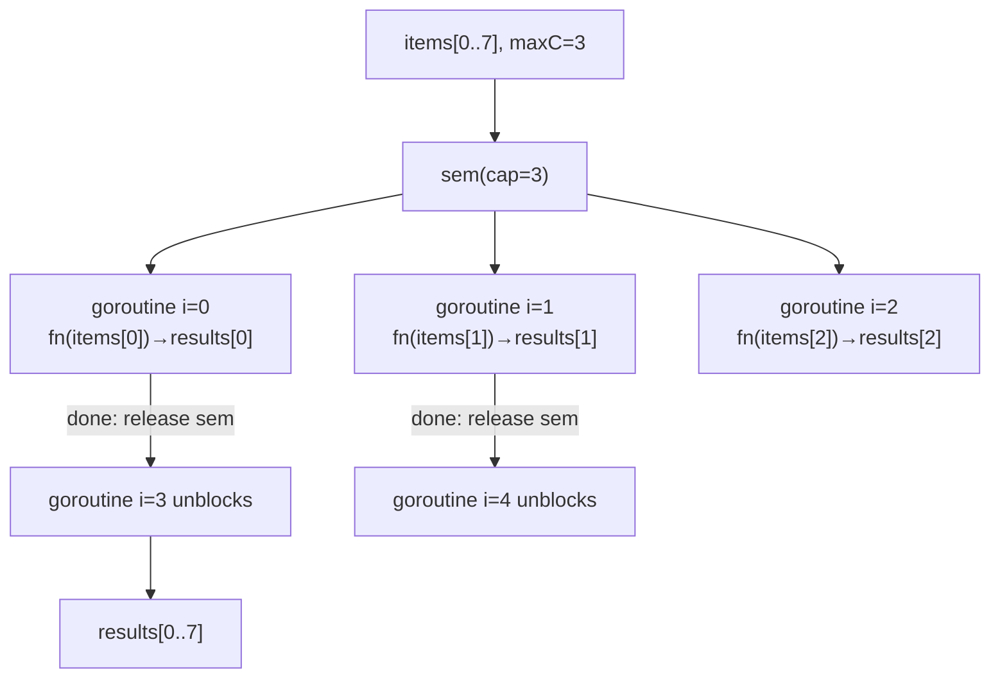
```mermaid
flowchart TD
    A["items[0..7], maxC=3"] --> S["sem(cap=3)"]
    S --> G0["goroutine i=0\nfn(items[0])→results[0]"]
    S --> G1["goroutine i=1\nfn(items[1])→results[1]"]
    S --> G2["goroutine i=2\nfn(items[2])→results[2]"]
    G0 -->|"done: release sem"| G3["goroutine i=3 unblocks"]
    G1 -->|"done: release sem"| G4["goroutine i=4 unblocks"]
    G3 --> R["results[0..7]"]
```
```
Trace: 8 items, concurrency=3
batch-1: i=0,1,2 → run concurrently → release sem
batch-2: i=3,4,5 → run concurrently → release sem
batch-3: i=6,7 → run → done
result: [1,4,9,16,25,36,49,64]
```

### Interviewer Questions
1. Why is writing results[i] safe without a mutex?
2. How does errgroup cancellation propagate to fn?
3. What is the difference between errgroup.Wait() and sync.WaitGroup?
4. How would you return partial results on error?
5. How would you add a progress callback?
6. How does semaphore interact with errgroup cancellation?
7. How would you implement ParallelFilter using the same approach?

### Follow-Up Questions
**Q1:** How would you return partial results (completed transforms) even when some fail?
**A1:** Replace `return err` with `errors[i] = err; return nil`. Collect errors in a separate slice. After Wait, scan for non-nil errors. Return both results and a MultiError. This prevents cancellation of other goroutines.

**Q2:** How would you stream results as they complete (not wait for all)?
**A2:** Instead of writing to results[i], send to a results channel: `resChan <- Result{idx: i, val: r}`. The caller reads from resChan in a separate goroutine, reordering by idx if needed. Close resChan after g.Wait().

**Q3:** How would you add a timeout per-item (not just for the whole operation)?
**A3:** Inside fn, wrap the work with a per-item timeout: `itemCtx, cancel := context.WithTimeout(ctx, perItemTimeout); defer cancel()`. Use itemCtx for the actual work. The outer ctx handles overall cancellation.

**Q4:** How would you implement ParallelFilter?
**A4:** Use ParallelMap with fn returning (bool, error). After Wait, iterate results and append items[i] where results[i]==true. This is O(N) extra pass. Alternative: use a results channel and filter in the consumer goroutine.

**Q5:** How would you choose maxConcurrency for CPU-bound vs I/O-bound workloads?
**A5:** CPU-bound: use runtime.NumCPU(). Each goroutine fully utilizes a core; more goroutines cause context-switch overhead. I/O-bound: use 10-100x NumCPU(). Goroutines spend most time waiting; high concurrency fills the wait time with other goroutines' work.

---

---
## Q21: Pipeline with Back-Pressure  [Level 3 — Medium]
> **Tags:** `#pipeline` `#backpressure` `#channel` `#context`

### Problem Statement
Build a three-stage pipeline: Generator → Transform → Sink. Each stage is a goroutine. Use buffered channels between stages to implement back-pressure: if the sink is slow, the transform stage blocks, which blocks the generator. Support graceful shutdown via context cancellation. Handle errors at any stage.

### Input / Output / Constraints
```
Input:  data source (slice or channel), transform func, sink func
Output: all items processed; errors collected
Constraints:
  - back-pressure via bounded channel buffers
  - any stage error cancels the pipeline
  - no goroutine leaks on cancellation
  - ordered processing not required
```

### Thought Process
1. Understand: Each stage is a goroutine reading from its input channel and writing to its output channel. Bounded channels create natural back-pressure.
2. Pattern: gen → ch1 (buf N) → transform → ch2 (buf N) → sink. Each stage selects on ctx.Done and its input channel. Errors sent to a shared error channel.
3. Edge cases: Sink errors must propagate back to cancel generator, channel close ordering must prevent send-on-closed-channel.

### Brute Force
```go
// Single goroutine, no concurrency
func brutePipeline(items []int, transform func(int) int, sink func(int)) {
    for _, v := range items { sink(transform(v)) }
}
```
**Time:** O(N) sequential | **Space:** O(1)

### Better Solution
```go
func betterPipeline(ctx context.Context, items []int, bufSize int) {
    ch1 := make(chan int, bufSize)
    ch2 := make(chan int, bufSize)

    go func() {
        defer close(ch1)
        for _, v := range items { select { case ch1 <- v: case <-ctx.Done(): return } }
    }()
    go func() {
        defer close(ch2)
        for v := range ch1 { select { case ch2 <- v * 2: case <-ctx.Done(): return } }
    }()
    for v := range ch2 { fmt.Println(v) }
}
```
**Time:** O(N) | **Space:** O(bufSize)

### Best Solution
```go
package main

import (
    "context"
    "fmt"
    "sync"
)

type PipelineError struct {
    Stage string
    Err   error
}

func (e PipelineError) Error() string {
    return fmt.Sprintf("stage %s: %v", e.Stage, e.Err)
}

// Pipeline — O(N) time, O(bufSize) space
func Pipeline[T, R any](
    ctx context.Context,
    source []T,
    bufSize int,
    transform func(context.Context, T) (R, error),
    sink func(context.Context, R) error,
) []PipelineError {
    ctx, cancel := context.WithCancel(ctx)
    defer cancel()

    ch1 := make(chan T, bufSize)
    ch2 := make(chan R, bufSize)
    errCh := make(chan PipelineError, 16)

    var wg sync.WaitGroup

    // Stage 1: Generator
    wg.Add(1)
    go func() {
        defer wg.Done()
        defer close(ch1)
        for _, item := range source {
            select {
            case ch1 <- item:
            case <-ctx.Done():
                return
            }
        }
    }()

    // Stage 2: Transform
    wg.Add(1)
    go func() {
        defer wg.Done()
        defer close(ch2)
        for {
            select {
            case item, ok := <-ch1:
                if !ok {
                    return
                }
                r, err := transform(ctx, item)
                if err != nil {
                    errCh <- PipelineError{"transform", err}
                    cancel()
                    return
                }
                select {
                case ch2 <- r:
                case <-ctx.Done():
                    return
                }
            case <-ctx.Done():
                return
            }
        }
    }()

    // Stage 3: Sink
    wg.Add(1)
    go func() {
        defer wg.Done()
        for {
            select {
            case r, ok := <-ch2:
                if !ok {
                    return
                }
                if err := sink(ctx, r); err != nil {
                    errCh <- PipelineError{"sink", err}
                    cancel()
                    return
                }
            case <-ctx.Done():
                return
            }
        }
    }()

    wg.Wait()
    close(errCh)

    var errs []PipelineError
    for e := range errCh {
        errs = append(errs, e)
    }
    return errs
}

func main() {
    source := []int{1, 2, 3, 4, 5, 6, 7, 8, 9, 10}

    errs := Pipeline(
        context.Background(),
        source,
        3, // buffer size
        func(ctx context.Context, n int) (string, error) {
            return fmt.Sprintf("item-%d", n*n), nil
        },
        func(ctx context.Context, s string) error {
            fmt.Println("sink:", s)
            return nil
        },
    )
    if len(errs) > 0 {
        fmt.Println("errors:", errs)
    }
}
```
**Time:** O(N) | **Space:** O(bufSize)

### Production Considerations
| Aspect | Details |
|--------|---------|
| Scalability | Add worker pools at each stage for parallel transform/sink |
| Edge Cases | Stage panic must cancel pipeline (add recover) |
| Error Handling | Error channel buffered to avoid blocking error-reporting goroutines |
| Memory | bufSize * sizeof(T) + sizeof(R) per stage boundary |
| Concurrency | Close ordering: gen closes ch1, transform closes ch2, sink drains |

### Visual Explanation
```mermaid
flowchart LR
    S["source\n[1..10]"] -->|"ch1 buf=3"| T["transform\nn→n²"]
    T -->|"ch2 buf=3"| K["sink\nprint"]
    E["ctx cancel"] -.->|"on error"| S
    E -.->|"on error"| T
    E -.->|"on error"| K
```
```
Trace: source=[1..10], buf=3, transform=n²
t=0: gen sends 1,2,3 → ch1 full
t=0: transform reads 1 → sends "item-1" to ch2
t=0: sink reads "item-1" → prints
t=0: gen unblocks → sends 4
...
```

### Interviewer Questions
1. How does a buffered channel implement back-pressure?
2. What happens if the sink panics?
3. How would you add a fan-out at the transform stage?
4. How do you prevent send-on-closed-channel panics?
5. How would you monitor pipeline throughput per stage?
6. How would you implement a pipeline with configurable number of stages?
7. What is head-of-line blocking and how does it affect pipelines?

### Follow-Up Questions
**Q1:** How would you add parallel workers at the transform stage?
**A1:** Instead of one transform goroutine, spawn W goroutines all reading from ch1 and writing to ch2. All share the same channels. The bounded channels provide natural load balancing. Use sync.WaitGroup to track workers and close ch2 after all workers finish.

**Q2:** How do you add metrics (throughput, latency) per stage?
**A2:** Wrap each stage's read/write with timing: record time.Now() before processing and time.Since() after. Emit as Prometheus histograms: `pipeline_stage_duration_seconds{stage="transform"}`. Count items with a counter metric.

**Q3:** How would you implement pipeline checkpointing (resume from failure)?
**A3:** Assign sequence numbers to source items. Sink records the last successfully processed sequence number to a durable store (Redis, DB). On restart, generator starts from last_checkpoint+1. Transform and sink are stateless so they just resume.

**Q4:** How does head-of-line blocking affect this pipeline?
**A4:** If one transform takes 10x longer than average, it blocks ch1 (back-pressure) which blocks the generator. The slow item "holds the line." Fix: use a work-stealing transform pool where any worker picks the next available item, preventing one slow item from blocking all others.

**Q5:** How would you implement a merge stage (fan-in from multiple sources)?
**A5:** Create N input channels (one per source). Spawn N goroutines each reading from one input and writing to a shared merge channel. Use sync.WaitGroup; when all N goroutines finish, close the merge channel. The next stage reads from the merge channel normally.

---


---
## Q22: Rate-Limited HTTP Client  [Level 3 — Medium]
> **Tags:** `#rate-limit` `#http` `#token-bucket` `#middleware`

### Problem Statement
Wrap an `http.Client` with a rate limiter that enforces a maximum number of requests per second across all goroutines. Use a token bucket algorithm. The wrapper should queue waiting requests and honour `context.Context` cancellation. Return `ErrRateLimitExceeded` if the context times out while waiting for a token.

### Input / Output / Constraints
```
Input:  rps float64 (requests/sec), burst int, *http.Request with ctx
Output: *http.Response or error
Constraints:
  - rps > 0, burst >= 1
  - concurrent callers share one token bucket
  - context cancellation unblocks waiting callers
  - no busy-wait
```

### Thought Process
1. Understand: Multiple goroutines share an HTTP client. Each must acquire a rate-limit token before sending. We use time/rate.Limiter (token bucket) from the standard library or implement our own.
2. Pattern: Wrap http.RoundTripper. Before calling the underlying transport, call limiter.Wait(ctx). This blocks until a token is available or ctx is cancelled.
3. Edge cases: Burst larger than rps (allows short spikes), ctx already cancelled, zero rps (block forever).

### Brute Force
```go
// Global sleep — ignores burst, inaccurate
func brute(rps float64, req *http.Request) (*http.Response, error) {
    time.Sleep(time.Duration(float64(time.Second) / rps))
    return http.DefaultClient.Do(req)
}
```
**Time:** O(1) per request | **Space:** O(1)

### Better Solution
```go
import "golang.org/x/time/rate"
type BetterRateLimitedClient struct {
    client  *http.Client
    limiter *rate.Limiter
}
func (c *BetterRateLimitedClient) Do(req *http.Request) (*http.Response, error) {
    if err := c.limiter.Wait(req.Context()); err != nil { return nil, err }
    return c.client.Do(req)
}
```
**Time:** O(1) | **Space:** O(1)

### Best Solution
```go
package main

import (
    "context"
    "errors"
    "fmt"
    "net/http"
    "sync/atomic"
    "time"

    "golang.org/x/time/rate"
)

var ErrRateLimitExceeded = errors.New("rate limit exceeded: context cancelled while waiting")

type rateLimitTransport struct {
    base    http.RoundTripper
    limiter *rate.Limiter
    allowed atomic.Int64
    dropped atomic.Int64
}

func (t *rateLimitTransport) RoundTrip(req *http.Request) (*http.Response, error) {
    if err := t.limiter.Wait(req.Context()); err != nil {
        t.dropped.Add(1)
        if errors.Is(err, context.Canceled) || errors.Is(err, context.DeadlineExceeded) {
            return nil, ErrRateLimitExceeded
        }
        return nil, err
    }
    t.allowed.Add(1)
    return t.base.RoundTrip(req)
}

// NewRateLimitedClient — O(1) per request, O(burst) token storage
func NewRateLimitedClient(rps float64, burst int) *http.Client {
    t := &rateLimitTransport{
        base:    http.DefaultTransport,
        limiter: rate.NewLimiter(rate.Limit(rps), burst),
    }
    return &http.Client{Transport: t}
}

func main() {
    client := NewRateLimitedClient(5, 2) // 5 rps, burst of 2

    var success, failed int
    start := time.Now()

    for i := 0; i < 10; i++ {
        ctx, cancel := context.WithTimeout(context.Background(), 500*time.Millisecond)
        req, _ := http.NewRequestWithContext(ctx, http.MethodGet, "https://httpbin.org/get", nil)
        _, err := client.Do(req)
        if err != nil {
            failed++
        } else {
            success++
        }
        cancel()
    }

    fmt.Printf("success=%d failed=%d elapsed=%v\n", success, failed, time.Since(start))
}
```
**Time:** O(1) | **Space:** O(burst)

### Production Considerations
| Aspect | Details |
|--------|---------|
| Scalability | Shared limiter coordinates across all goroutines |
| Edge Cases | Burst handles short traffic spikes without dropping |
| Error Handling | Distinguish rate-limit timeout from network error |
| Memory | Token bucket is O(1); no per-request allocation |
| Concurrency | rate.Limiter is goroutine-safe |

### Visual Explanation
```mermaid
flowchart TD
    R1["goroutine 1\nDo(req)"] --> L["rate.Limiter\nWait(ctx)"]
    R2["goroutine 2\nDo(req)"] --> L
    R3["goroutine 3\nDo(req)"] --> L
    L -->|"token available"| T["RoundTrip\nHTTP call"]
    L -->|"ctx timeout"| E["ErrRateLimitExceeded"]
    T --> P["*http.Response"]
```
```
Trace: 5 rps, burst=2, 10 concurrent requests
t=0ms:    2 requests use burst tokens immediately
t=200ms:  token replenished → 1 more request
t=400ms:  token replenished → 1 more request
...
requests with 500ms ctx timeout: some may expire waiting
```

### Interviewer Questions
1. What is the difference between token bucket and leaky bucket?
2. How does rate.Limiter handle burst?
3. How would you implement per-user rate limiting (not global)?
4. How do you handle distributed rate limiting across multiple pods?
5. How would you implement retry-after headers from the server?
6. How does context cancellation interact with rate.Limiter.Wait?
7. How would you add rate limiting to a gRPC client?

### Follow-Up Questions
**Q1:** How would you implement per-user rate limiting?
**A1:** Maintain a `map[userID]*rate.Limiter` protected by a sync.RWMutex or sync.Map. On each request, extract the user ID from context or headers. Look up or create a limiter for that user. Add periodic cleanup of idle user limiters to prevent memory leaks.

**Q2:** How do you implement distributed rate limiting across pods?
**A2:** Use Redis with the sliding window log or token bucket algorithm. Redis INCR + EXPIRE implements a fixed window. Redis Lua scripts implement atomic token bucket. Libraries like `go-redis/redis_rate` provide ready implementations. Alternatively, use a dedicated rate limit service (e.g., Envoy rate limit service).

**Q3:** How would you implement adaptive rate limiting based on server load?
**A3:** Read the server's response headers (X-RateLimit-Remaining, Retry-After). If X-RateLimit-Remaining < threshold, reduce the client-side rate. If the server returns 429, back off and reduce rate further. If 429 rate decreases, gradually increase rate back to configured maximum.

**Q4:** How does rate.Limiter implement the token bucket internally?
**A4:** It uses a floating-point token count and a last-event timestamp. On each Reserve/Wait call, it computes tokens accumulated since last event: `tokens = min(burst, stored + rate * elapsed)`. If tokens >= 1, grant and decrement. Otherwise, compute time to wait for the next token.

**Q5:** How would you rate-limit a streaming endpoint (continuous data, not discrete requests)?
**A5:** Instead of request-level limiting, use byte-level limiting: `rate.NewLimiter(rate.Limit(bytesPerSec), burstBytes)`. Before each write call, `limiter.WaitN(ctx, len(chunk))`. This throttles data throughput while allowing the connection to stay open.

---

---
## Q23: Read-Write Lock Cache  [Level 3 — Medium]
> **Tags:** `#rwmutex` `#cache` `#concurrent` `#map`

### Problem Statement
Implement a thread-safe in-memory key-value store using `sync.RWMutex`. Support `Get`, `Set`, `Delete`, and `Range` (iterate over all entries). Reads must not block each other. Writes must be exclusive. Implement a `Snapshot` method that returns a copy of the entire map atomically.

### Input / Output / Constraints
```
Input:  key string, value interface{}
Output: (interface{}, bool) for Get
Constraints:
  - concurrent reads must not block each other
  - write operations are exclusive
  - Range must see a consistent view
  - Snapshot must be atomic (no partial reads)
```

### Thought Process
1. Understand: sync.RWMutex allows multiple concurrent readers or one exclusive writer. Range and Snapshot need to read-lock for their entire duration to prevent concurrent writes.
2. Pattern: Struct with map + sync.RWMutex. Get/Range/Snapshot use RLock. Set/Delete use Lock.
3. Edge cases: Calling Set inside Range callback would deadlock (single mutex). Range on nil map. Delete non-existent key.

### Brute Force
```go
// Mutex everywhere — no read concurrency
type BruteStore struct {
    mu sync.Mutex
    m  map[string]interface{}
}
func (s *BruteStore) Get(k string) (interface{}, bool) {
    s.mu.Lock(); defer s.mu.Unlock(); v, ok := s.m[k]; return v, ok
}
```
**Time:** O(1) | **Space:** O(N) — but reads block each other

### Better Solution — shown inline in Best Solution below.

### Best Solution
```go
package main

import (
    "fmt"
    "sync"
)

// Store — O(1) Get/Set/Delete, O(N) Range/Snapshot
type Store[K comparable, V any] struct {
    mu sync.RWMutex
    m  map[K]V
}

func NewStore[K comparable, V any]() *Store[K, V] {
    return &Store[K, V]{m: make(map[K]V)}
}

func (s *Store[K, V]) Get(key K) (V, bool) {
    s.mu.RLock()
    defer s.mu.RUnlock()
    v, ok := s.m[key]
    return v, ok
}

func (s *Store[K, V]) Set(key K, val V) {
    s.mu.Lock()
    defer s.mu.Unlock()
    s.m[key] = val
}

func (s *Store[K, V]) Delete(key K) {
    s.mu.Lock()
    defer s.mu.Unlock()
    delete(s.m, key)
}

// Range iterates over entries; fn must not call Set/Delete (deadlock).
func (s *Store[K, V]) Range(fn func(key K, val V) bool) {
    s.mu.RLock()
    defer s.mu.RUnlock()
    for k, v := range s.m {
        if !fn(k, v) {
            break
        }
    }
}

// Snapshot returns an atomic copy of the entire store.
func (s *Store[K, V]) Snapshot() map[K]V {
    s.mu.RLock()
    defer s.mu.RUnlock()
    copy := make(map[K]V, len(s.m))
    for k, v := range s.m {
        copy[k] = v
    }
    return copy
}

func (s *Store[K, V]) Len() int {
    s.mu.RLock()
    defer s.mu.RUnlock()
    return len(s.m)
}

func main() {
    store := NewStore[string, int]()

    var wg sync.WaitGroup
    for i := 0; i < 100; i++ {
        wg.Add(1)
        go func(i int) {
            defer wg.Done()
            store.Set(fmt.Sprintf("key%d", i%10), i)
        }(i)
    }
    for i := 0; i < 100; i++ {
        wg.Add(1)
        go func(i int) {
            defer wg.Done()
            store.Get(fmt.Sprintf("key%d", i%10))
        }(i)
    }
    wg.Wait()

    snap := store.Snapshot()
    fmt.Println("snapshot size:", len(snap))
    store.Range(func(k string, v int) bool {
        fmt.Printf("%s=%d\n", k, v)
        return true
    })
}
```
**Time:** O(1) Get/Set/Delete, O(N) Range/Snapshot | **Space:** O(N)

### Production Considerations
| Aspect | Details |
|--------|---------|
| Scalability | For high write rates, consider sharded map (N shards, each with own mutex) |
| Edge Cases | Range callback must not write (deadlock); document clearly |
| Error Handling | Delete non-existent key is a no-op (safe) |
| Memory | Snapshot copies all values; expensive for large stores |
| Concurrency | RWMutex gives ~8x read throughput vs plain Mutex on modern CPUs |

### Visual Explanation
```mermaid
flowchart TD
    R1["reader 1\nGet(k)"] -->|"RLock"| M["RWMutex"]
    R2["reader 2\nGet(k)"] -->|"RLock"| M
    R3["reader 3\nRange()"] -->|"RLock"| M
    M -->|"concurrent reads OK"| D["map[K]V"]
    W["writer\nSet(k,v)"] -->|"Lock\n(waits for readers)"| M
    M -->|"exclusive write"| D
```
```
Trace: 100 readers + 100 writers concurrent
readers: all acquire RLock simultaneously → read map concurrently
writers: each waits for no active readers → exclusive write
result: no data race, no deadlock
```

### Interviewer Questions
1. When does RWMutex outperform a plain Mutex?
2. What is writer starvation and how does sync.RWMutex prevent it?
3. How would you shard this store to reduce contention?
4. Why must the Range callback not call Set?
5. How do you implement atomic compare-and-swap in this store?
6. How would you add expiry (TTL) to individual keys?
7. How does sync.Map differ from this RWMutex approach?

### Follow-Up Questions
**Q1:** What is writer starvation and how does Go's RWMutex address it?
**A1:** Writer starvation occurs when readers constantly hold the lock, preventing writers from ever acquiring it. Go's sync.RWMutex prevents this by blocking new readers once a writer is waiting. Existing readers finish, then the writer acquires the lock, then new readers can proceed.

**Q2:** How would you implement a sharded map for higher write throughput?
**A2:** Create N shards (e.g., 256), each with its own map and RWMutex. On Get/Set, hash the key to select a shard: `shard = hash(key) % N`. Only that shard's mutex is locked. Different keys on different shards don't contend. Write throughput scales with N.

**Q3:** How does sync.Map differ from a manual RWMutex map?
**A3:** sync.Map is optimized for two specific patterns: (1) keys written once and read many times, (2) different goroutines reading/writing disjoint sets of keys. It uses a read-only map for lock-free reads and a dirty map for writes. Manual RWMutex is better for general-purpose concurrent access with mixed read/write ratios.

**Q4:** How would you add TTL (time-to-live) to individual keys?
**A4:** Change the value type to a struct: `type entry struct { val V; expiresAt time.Time }`. On Get, check `time.Now().After(e.expiresAt)` and return (zero, false) if expired. Run a background goroutine that periodically scans and deletes expired entries using the write lock.

**Q5:** How would you implement atomic compare-and-swap (CAS) in this store?
**A5:** Add a `CompareAndSwap(key, expected, newVal)` method. Lock with Lock() (exclusive, not RLock). Read current value. If it equals expected, write newVal and return true. Otherwise return false. The exclusive lock ensures atomicity of the read-compare-write sequence.

---


---
## Q24: Mutex-Free Atomic Counter  [Level 2 — Easy]
> **Tags:** `#atomic` `#sync` `#lock-free` `#counter`

### Problem Statement
Implement a high-performance concurrent counter using `sync/atomic` (no mutexes). Support `Increment`, `Decrement`, `Reset`, `Load`, and `CompareAndSwap`. Show why atomic operations are preferred over mutex for simple integer counters. Implement a sharded counter for extreme write throughput.

### Input / Output / Constraints
```
Input:  concurrent goroutines calling Increment/Decrement
Output: exact final count with no data races
Constraints:
  - no mutex allowed for basic counter
  - operations must be atomic (no torn reads/writes)
  - sharded version must reduce cache-line contention
```

### Thought Process
1. Understand: An int64 under concurrent access without synchronization causes data races. sync/atomic provides CPU-level atomic read-modify-write.
2. Pattern: Use atomic.Int64 (Go 1.19+). For sharded: create N padded counters (each on its own cache line). Assign goroutines to shards. Sum all shards for Load().
3. Edge cases: Cache-line false sharing (multiple atomics on same 64-byte line), overflow of int64.

### Brute Force
```go
// Race condition — incorrect
var count int64
func bruteIncrement() { count++ } // data race!
```
**Time:** O(1) | **Space:** O(1) — but data race

### Better Solution
```go
// Basic atomic counter
type AtomicCounter struct{ v atomic.Int64 }
func (c *AtomicCounter) Increment()             { c.v.Add(1) }
func (c *AtomicCounter) Decrement()             { c.v.Add(-1) }
func (c *AtomicCounter) Load() int64            { return c.v.Load() }
func (c *AtomicCounter) Reset()                 { c.v.Store(0) }
func (c *AtomicCounter) CAS(old, new int64) bool { return c.v.CompareAndSwap(old, new) }
```
**Time:** O(1) | **Space:** O(1)

### Best Solution
```go
package main

import (
    "fmt"
    "runtime"
    "sync"
    "sync/atomic"
    "unsafe"
)

// padded avoids false sharing: each counter occupies its own cache line (64 bytes).
type padded struct {
    v   atomic.Int64
    _   [64 - unsafe.Sizeof(atomic.Int64{})]byte
}

// ShardedCounter reduces contention by sharding across CPU cores.
type ShardedCounter struct {
    shards []padded
}

func NewShardedCounter() *ShardedCounter {
    n := runtime.NumCPU()
    return &ShardedCounter{shards: make([]padded, n)}
}

func (c *ShardedCounter) shard() int {
    // Goroutine ID is not exposed; use a fast per-goroutine approximation.
    // In practice, use a goroutine-local ID or round-robin assignment.
    // Here we use the address of a local variable as a proxy (avoid in prod — use goroutine ID library).
    var x [1]byte
    return int(uintptr(unsafe.Pointer(&x[0]))) % len(c.shards)
}

func (c *ShardedCounter) Add(delta int64) {
    c.shards[c.shard()].v.Add(delta)
}

func (c *ShardedCounter) Load() int64 {
    var total int64
    for i := range c.shards {
        total += c.shards[i].v.Load()
    }
    return total
}

func (c *ShardedCounter) Reset() {
    for i := range c.shards {
        c.shards[i].v.Store(0)
    }
}

// SimpleCounter — basic atomic, O(1) time
type SimpleCounter struct{ v atomic.Int64 }

func (c *SimpleCounter) Increment()              { c.v.Add(1) }
func (c *SimpleCounter) Decrement()              { c.v.Add(-1) }
func (c *SimpleCounter) Load() int64             { return c.v.Load() }
func (c *SimpleCounter) Reset()                  { c.v.Store(0) }
func (c *SimpleCounter) CAS(old, new int64) bool { return c.v.CompareAndSwap(old, new) }

func main() {
    sc := NewShardedCounter()
    var wg sync.WaitGroup
    for i := 0; i < 1_000_000; i++ {
        wg.Add(1)
        go func() { defer wg.Done(); sc.Add(1) }()
    }
    wg.Wait()
    fmt.Println("sharded count:", sc.Load()) // 1000000

    simple := &SimpleCounter{}
    simple.Increment()
    simple.Increment()
    simple.Decrement()
    fmt.Println("simple count:", simple.Load()) // 1
}
```
**Time:** O(1) per operation | **Space:** O(shards * 64 bytes)

### Production Considerations
| Aspect | Details |
|--------|---------|
| Scalability | Sharded counter scales linearly with CPU count |
| Edge Cases | False sharing degrades performance; padding prevents it |
| Error Handling | int64 overflow wraps silently; check if counter could reach 2^63 |
| Memory | Padded shard = 64 bytes each; N shards = N * 64 bytes |
| Concurrency | No locks; atomic operations are CPU-native |

### Visual Explanation
```mermaid
flowchart TD
    G0["goroutine 0"] -->|"Add(1)"| S0["shard[0]\natomic.Int64"]
    G1["goroutine 1"] -->|"Add(1)"| S1["shard[1]\natomic.Int64"]
    G2["goroutine 2"] -->|"Add(1)"| S2["shard[2]\natomic.Int64"]
    S0 & S1 & S2 -->|"Load() sums all"| T["total"]
```
```
Trace: 1M goroutines, 8 shards (8-core CPU)
shard[0]: 125,000 increments
shard[1]: 125,000 increments
...
shard[7]: 125,000 increments
Load() = 125000 * 8 = 1,000,000
```

### Interviewer Questions
1. What is a cache line and why does padding matter?
2. What is the difference between atomic and volatile?
3. When would you use a mutex instead of atomic?
4. How does CompareAndSwap enable lock-free data structures?
5. What is ABA problem in CAS?
6. How do you choose shard count for optimal performance?
7. What is the cost of atomic operations vs memory access?

### Follow-Up Questions
**Q1:** What is false sharing and how does cache-line padding prevent it?
**A1:** False sharing occurs when two goroutines modify different variables that happen to share a CPU cache line (64 bytes). Each modification invalidates the entire line on the other CPU's cache, causing costly coherence traffic. Padding each counter to 64 bytes ensures each lives on its own cache line, eliminating interference.

**Q2:** What is the ABA problem in CAS?
**A2:** A goroutine reads value A. Another goroutine changes it A→B→A. The first goroutine's CAS succeeds even though the value changed. If the "A" has different semantic meaning after the round-trip (e.g., a freed pointer reused), the CAS is incorrect. Solve with pointer+version pairs or using `atomic.Pointer[T]` with version stamping.

**Q3:** When should you use sync.Mutex instead of atomic?
**A3:** Use atomic for simple scalars (int, bool, pointer). Use Mutex when: (1) you need to protect multi-field structs atomically, (2) you need to protect invariants spanning multiple variables, (3) the critical section is complex enough that lock overhead is negligible compared to the work done.

**Q4:** How does CAS enable lock-free data structures?
**A4:** CAS atomically checks and updates a memory location. A lock-free stack's Push: read current head, create new node pointing to head, CAS(head_ptr, current_head, new_node). If CAS fails (another goroutine changed head), retry. No lock needed; progress guaranteed as long as at least one goroutine succeeds on each attempt.

**Q5:** How do you benchmark atomic vs mutex performance?
**A5:** Use testing.B with b.RunParallel. Measure both throughput (ops/sec) and contention (lock wait time via pprof mutex profile). On low-contention workloads, atomic is ~10-30x faster. Under high contention, the gap increases because mutex causes goroutine scheduling overhead.

---

---
## Q25: Broadcast Pub-Sub with History  [Level 4 — Advanced]
> **Tags:** `#pubsub` `#broadcast` `#history` `#channel`

### Problem Statement
Extend the basic Pub-Sub broker (Q4) with: (1) message history buffer — new subscribers receive the last N messages on subscription, (2) slow subscriber detection — subscribers that fall behind by more than M messages are dropped, (3) topic wildcards — subscribers can subscribe to `"logs.*"` matching `"logs.error"` and `"logs.info"`.

### Input / Output / Constraints
```
Input:  topic string, message interface{}, historySize int, maxLag int
Output: subscribers receive messages; slow ones dropped; new ones get history
Constraints:
  - history is per-topic, bounded to historySize messages
  - subscriber dropped when their buffer is full (non-blocking send)
  - wildcard matching: "prefix.*" matches any "prefix.X"
  - thread-safe
```

### Thought Process
1. Understand: Enhance basic broker with three features. History = ring buffer per topic. Slow detection = non-blocking send, drop if channel full. Wildcards = match topic string against subscription pattern.
2. Pattern: Broker struct with map[topic]topicState. topicState has subscriber slice + ring buffer. RWMutex per topic or global. Wildcard matching via strings.HasPrefix or path.Match.
3. Edge cases: History replay races with new publishes, wildcard matches multiple topics, subscriber unsubscription during publish.

### Brute Force
```go
// No history, no wildcards, no slow detection
type BruteBroker struct {
    mu   sync.Mutex
    subs map[string][]chan interface{}
}
func (b *BruteBroker) Publish(topic string, msg interface{}) {
    b.mu.Lock(); defer b.mu.Unlock()
    for _, ch := range b.subs[topic] { ch <- msg } // blocks on slow subscribers
}
```
**Time:** O(S) per publish | **Space:** O(S*cap)

### Best Solution
```go
package main

import (
    "fmt"
    "path"
    "sync"
)

type subscriber struct {
    ch     chan interface{}
    topics []string // subscribed patterns
}

type ringBuffer struct {
    buf  []interface{}
    head int
    size int
    cap  int
}

func newRingBuffer(cap int) *ringBuffer { return &ringBuffer{buf: make([]interface{}, cap), cap: cap} }
func (r *ringBuffer) Push(v interface{}) {
    r.buf[r.head] = v; r.head = (r.head + 1) % r.cap; if r.size < r.cap { r.size++ }
}
func (r *ringBuffer) Snapshot() []interface{} {
    out := make([]interface{}, r.size)
    start := (r.head - r.size + r.cap) % r.cap
    for i := 0; i < r.size; i++ { out[i] = r.buf[(start+i)%r.cap] }
    return out
}

// Broker — O(S) publish, O(H) subscribe history replay
type Broker struct {
    mu      sync.RWMutex
    subs    []*subscriber
    history map[string]*ringBuffer
    histCap int
    maxLag  int
}

func NewBroker(histCap, maxLag int) *Broker {
    return &Broker{history: make(map[string]*ringBuffer), histCap: histCap, maxLag: maxLag}
}

func (b *Broker) Subscribe(patterns ...string) *subscriber {
    sub := &subscriber{ch: make(chan interface{}, b.maxLag), topics: patterns}
    b.mu.Lock()
    b.subs = append(b.subs, sub)
    // replay history for matching topics
    for topic, ring := range b.history {
        for _, pat := range patterns {
            if matchTopic(pat, topic) {
                for _, msg := range ring.Snapshot() {
                    select { case sub.ch <- msg: default: }
                }
                break
            }
        }
    }
    b.mu.Unlock()
    return sub
}

func (b *Broker) Unsubscribe(sub *subscriber) {
    b.mu.Lock()
    defer b.mu.Unlock()
    for i, s := range b.subs {
        if s == sub {
            b.subs = append(b.subs[:i], b.subs[i+1:]...)
            close(sub.ch)
            return
        }
    }
}

func (b *Broker) Publish(topic string, msg interface{}) {
    b.mu.Lock()
    ring := b.history[topic]
    if ring == nil { ring = newRingBuffer(b.histCap); b.history[topic] = ring }
    ring.Push(msg)
    subs := make([]*subscriber, len(b.subs))
    copy(subs, b.subs)
    b.mu.Unlock()

    var dropped []*subscriber
    for _, sub := range subs {
        for _, pat := range sub.topics {
            if matchTopic(pat, topic) {
                select {
                case sub.ch <- msg:
                default:
                    dropped = append(dropped, sub)
                }
                break
            }
        }
    }
    if len(dropped) > 0 {
        b.mu.Lock()
        for _, d := range dropped {
            for i, s := range b.subs {
                if s == d { b.subs = append(b.subs[:i], b.subs[i+1:]...); close(d.ch); break }
            }
        }
        b.mu.Unlock()
    }
}

// matchTopic matches subscription pattern (supports "prefix.*" wildcard).
func matchTopic(pattern, topic string) bool {
    matched, _ := path.Match(pattern, topic)
    return matched
}

func main() {
    broker := NewBroker(5, 10) // 5 history, 10 max lag

    broker.Publish("logs.error", "pre-existing error 1")
    broker.Publish("logs.info", "pre-existing info 1")

    sub := broker.Subscribe("logs.*") // receives history

    broker.Publish("logs.error", "new error")
    broker.Publish("metrics.cpu", "cpu=80%") // not matched

    go func() {
        for msg := range sub.ch {
            fmt.Println("received:", msg)
        }
    }()
    broker.Publish("logs.info", "new info")
    broker.Unsubscribe(sub)
}
```
**Time:** O(S) per publish | **Space:** O(S*maxLag + topics*histCap)

### Production Considerations
| Aspect | Details |
|--------|---------|
| Scalability | Use sharded topic maps for high topic count |
| Edge Cases | Subscriber dropped mid-publish; remove from slice under lock |
| Error Handling | Log dropped subscribers with topic and lag info |
| Memory | History buffer bounded; subscriber channels bounded |
| Concurrency | Copy subscriber slice before iterating to avoid lock during send |

### Visual Explanation
```mermaid
flowchart TD
    P["Publish(logs.error, msg)"] --> H["store in ring buffer"]
    H --> M["copy subscriber list"]
    M --> S1["sub1: pattern=logs.*\nnon-blocking send"]
    M --> S2["sub2: pattern=metrics.*\nno match"]
    M --> S3["sub3: slow\nchannel full → dropped"]
    NS["new Subscribe(logs.*)"] --> R["replay history\n[pre-existing error 1]"]
    R --> NS
```
```
Trace: history=['err1','info1'], new sub "logs.*"
Subscribe → replay: sub.ch ← err1 (matches logs.*), info1 (matches)
Publish logs.error "new error" → sub.ch ← "new error"
Publish metrics.cpu → no match → sub doesn't receive
```

### Interviewer Questions
1. How does non-blocking send detect slow subscribers?
2. Why do we copy the subscriber slice before iterating?
3. How do you prevent history replay from racing with new publishes?
4. How would you implement `*` wildcard in the middle of a topic?
5. How would you scale this broker to multiple machines?
6. How would you implement message acknowledgment?
7. How do you handle subscriber reconnection with history?

### Follow-Up Questions
**Q1:** How would you implement a durable broker (messages survive process restart)?
**A1:** Persist each published message to an append-only log file or a message queue (Kafka, NATS JetStream). On restart, replay the log from the last committed offset. Each subscriber tracks its own offset, so it can resume from where it left off.

**Q2:** How would you implement message deduplication?
**A2:** Assign each message a UUID. Maintain a bloom filter or LRU set of recently seen message IDs (last 10k messages). On receive, check if ID is in the set. If yes, discard. If no, process and add to set. This handles at-least-once delivery with deduplication.

**Q3:** How would you add per-subscriber filtering (not just topic matching)?
**A3:** Add a predicate function to the subscriber: `filter func(msg interface{}) bool`. Before sending to the subscriber, call filter(msg). Only send if it returns true. This enables content-based routing without creating many topic variations.

**Q4:** How would you implement backpressure from slow subscribers (instead of dropping)?
**A4:** Instead of dropping immediately, use a timeout send: `select { case sub.ch <- msg: case <-time.After(maxWait): // slow }`. If maxWait expires, record latency. If subscriber consistently exceeds threshold, drop it. This gives a grace period for transient slowness.

**Q5:** How would you implement exactly-once delivery in a pub-sub system?
**A5:** Exactly-once requires idempotent consumers + transactional publish. Publisher assigns a sequence number. Consumer tracks last processed sequence number in a transaction with its database operation. On redelivery (same sequence), consumer detects duplicate via sequence number and skips. Requires distributed consensus for exactly-once across restarts.

---

## Q26: Distributed Semaphore with Lease  [Level 5 — Interview]
> **Tags:** `#semaphore` `#lease` `#distributed` `#ttl`

### Problem Statement
Implement a distributed semaphore using Redis (simulated in-memory for the solution). The semaphore allows at most N concurrent holders. Each acquisition returns a lease with a TTL. If a holder crashes (lease expires), the slot is automatically released. Implement `TryAcquire`, `Acquire` (blocking), and `Release`. Ensure at most N concurrent holders at any time, even under concurrent contention.

### Input / Output / Constraints
```
Input:  maxHolders int, ttl time.Duration
Output: (leaseID string, error) or error
Constraints:
  - at most maxHolders concurrent leases
  - expired leases freed automatically
  - concurrent Acquire must be safe
  - Release with wrong leaseID is a no-op (not an error)
  - must work correctly under concurrent goroutines
```

### Thought Process
1. Understand: N-slot semaphore where each slot has a TTL. Simulated with an in-memory map. In production, backed by Redis SETNX + EXPIRE.
2. Pattern: Map of leaseID → expiresAt. Lock for mutations. TryAcquire: evict expired + check count < N → generate lease. Acquire: retry TryAcquire with backoff. Background eviction.
3. Edge cases: All slots held by expired leases (must evict before rejecting), Release of expired lease (no-op), concurrent Release + Acquire race.

### Brute Force
```go
// Global mutex, no TTL — blocks forever if holder crashes
type BruteSem struct { mu sync.Mutex; count, max int }
func (s *BruteSem) Acquire() { s.mu.Lock(); s.count++ }  // no TTL, no fairness
func (s *BruteSem) Release() { s.count--; s.mu.Unlock() }
```
**Time:** O(1) | **Space:** O(N)

### Better Solution
```go
// Channel semaphore — no TTL, no lease tracking
func NewChanSem(n int) (acquire func(), release func()) {
    ch := make(chan struct{}, n)
    for i := 0; i < n; i++ { ch <- struct{}{} }
    return func() { <-ch }, func() { ch <- struct{}{} }
}
```
**Time:** O(1) | **Space:** O(N)

### Best Solution
```go
package main

import (
    "context"
    "crypto/rand"
    "encoding/hex"
    "errors"
    "fmt"
    "sync"
    "time"
)

var ErrSemaphoreFull = errors.New("semaphore is full")

type lease struct {
    id        string
    expiresAt time.Time
}

// DistributedSemaphore — O(N) TryAcquire, O(N) space
type DistributedSemaphore struct {
    mu      sync.Mutex
    leases  map[string]time.Time // leaseID → expiresAt
    max     int
    ttl     time.Duration
}

func NewDistributedSemaphore(max int, ttl time.Duration) *DistributedSemaphore {
    s := &DistributedSemaphore{
        leases: make(map[string]time.Time),
        max:    max,
        ttl:    ttl,
    }
    go s.evictLoop()
    return s
}

func (s *DistributedSemaphore) evictExpired() {
    now := time.Now()
    for id, exp := range s.leases {
        if now.After(exp) {
            delete(s.leases, id)
        }
    }
}

func (s *DistributedSemaphore) evictLoop() {
    t := time.NewTicker(s.ttl / 2)
    for range t.C {
        s.mu.Lock()
        s.evictExpired()
        s.mu.Unlock()
    }
}

func genID() string {
    b := make([]byte, 8)
    rand.Read(b)
    return hex.EncodeToString(b)
}

// TryAcquire attempts to acquire a slot; returns ErrSemaphoreFull if none available.
func (s *DistributedSemaphore) TryAcquire() (string, error) {
    s.mu.Lock()
    defer s.mu.Unlock()
    s.evictExpired()
    if len(s.leases) >= s.max {
        return "", ErrSemaphoreFull
    }
    id := genID()
    s.leases[id] = time.Now().Add(s.ttl)
    return id, nil
}

// Acquire blocks until a slot is available or ctx is cancelled.
func (s *DistributedSemaphore) Acquire(ctx context.Context) (string, error) {
    backoff := 10 * time.Millisecond
    for {
        id, err := s.TryAcquire()
        if err == nil {
            return id, nil
        }
        select {
        case <-ctx.Done():
            return "", ctx.Err()
        case <-time.After(backoff):
            if backoff < 500*time.Millisecond {
                backoff *= 2
            }
        }
    }
}

// Release returns a lease slot. Wrong ID is a no-op.
func (s *DistributedSemaphore) Release(leaseID string) {
    s.mu.Lock()
    defer s.mu.Unlock()
    delete(s.leases, leaseID)
}

// Renew extends a lease's TTL. Returns false if the lease has expired.
func (s *DistributedSemaphore) Renew(leaseID string) bool {
    s.mu.Lock()
    defer s.mu.Unlock()
    if _, ok := s.leases[leaseID]; !ok {
        return false
    }
    s.leases[leaseID] = time.Now().Add(s.ttl)
    return true
}

func main() {
    sem := NewDistributedSemaphore(3, 500*time.Millisecond)

    var wg sync.WaitGroup
    for i := 0; i < 6; i++ {
        wg.Add(1)
        go func(i int) {
            defer wg.Done()
            ctx, cancel := context.WithTimeout(context.Background(), 2*time.Second)
            defer cancel()

            id, err := sem.Acquire(ctx)
            if err != nil {
                fmt.Printf("goroutine %d: failed to acquire: %v\n", i, err)
                return
            }
            fmt.Printf("goroutine %d: acquired lease %s\n", i, id)
            time.Sleep(200 * time.Millisecond)
            sem.Release(id)
            fmt.Printf("goroutine %d: released\n", i)
        }(i)
    }
    wg.Wait()
}
```
**Time:** O(N) TryAcquire | **Space:** O(N)

### Production Considerations
| Aspect | Details |
|--------|---------|
| Scalability | Replace in-memory map with Redis; use SETNX + EXPIRE for distributed |
| Edge Cases | Clock skew between nodes; use Redis server time for TTL |
| Error Handling | Acquire timeout: return ctx.Err() with clear message |
| Memory | O(maxHolders) lease map; eviction keeps it bounded |
| Concurrency | Single mutex protects lease map; eviction is under lock |

### Visual Explanation
```mermaid
flowchart TD
    A["Acquire(ctx)"] --> T["TryAcquire()"]
    T --> E["evictExpired()"]
    E --> C{"len(leases) < max?"}
    C -->|"yes"| G["genID()\nleases[id]=now+TTL"]
    G --> R["return id, nil"]
    C -->|"no"| W["wait backoff\nor ctx.Done()"]
    W --> T
    TTL["TTL expires"] -->|"background"| EV["evictLoop\ndelete expired"]
```
```
Trace: max=3, ttl=500ms, 6 goroutines
t=0:   g0,g1,g2 acquire → leases={id0,id1,id2}
t=0:   g3,g4,g5 → TryAcquire fails → backoff
t=200ms: g0,g1,g2 release → leases={}
t=210ms: g3,g4,g5 acquire → leases={id3,id4,id5}
t=410ms: g3,g4,g5 release → done
```

### Interviewer Questions
1. How does TTL-based lease handle node crashes in distributed systems?
2. How would you implement this with Redis SETNX?
3. What is the risk of clock skew in distributed lease systems?
4. How would you implement fair queuing (FIFO) for waiting acquirers?
5. How do you prevent lease renewal by non-owners?
6. How would you implement a distributed read-write semaphore?
7. What is the difference between a semaphore and a mutex?

### Follow-Up Questions
**Q1:** How would you implement this in Redis with SETNX?
**A1:** Use Redis keys like `sem:key:leaseID`. SETNX sets the key if not exists, with EXPIRE for TTL. To TryAcquire: count active keys with KEYS sem:key:* (or SCAN for production). If count < max, SETNX a new key. Release: DEL the key. Use Lua scripts for atomic count+set.

**Q2:** What is the Redlock algorithm and when is it needed?
**A2:** Redlock acquires a lock on majority (N/2+1) of N independent Redis nodes. If the majority acknowledge within TTL, the lock is held. This handles single-node Redis failure. Needed when the semaphore must remain available even if one Redis node fails.

**Q3:** How do you implement a lease renewal heartbeat?
**A3:** After acquiring, spawn a goroutine that calls Renew(id) every TTL/3 interval. On Renew failure (lease expired or revoked), signal the holder via a channel to stop its work and release. Stop the heartbeat goroutine when Release is called.

**Q4:** How would you implement fair queuing (FIFO) for semaphore waiters?
**A4:** Use a queue of waiting goroutines (each with a channel). On Release, wake the goroutine at the head of the queue. In Redis, use a sorted set where the score is arrival timestamp. The releaser pops the lowest-score waiter and grants the slot.

**Q5:** How do you debug a semaphore leak (slots never released) in production?
**A5:** Add a `/debug/semaphore` endpoint exposing current lease holders with: leaseID, acquired_at, expires_at, caller stack trace (captured at Acquire time). If TTL is set correctly, leaks auto-expire. Alert when average lease duration > 2*TTL.

---

---
## Q27: Work-Stealing Goroutine Pool  [Level 5 — Interview]
> **Tags:** `#work-stealing` `#goroutine-pool` `#deque` `#scheduler`

### Problem Statement
Implement a work-stealing goroutine pool where each worker has a local double-ended queue (deque). Workers push tasks to their local deque and pop from the front (LIFO for cache locality). When idle, workers steal from the back of other workers' deques (FIFO). This mimics Go's own runtime scheduler. Implement with bounded workers and tasks.

### Input / Output / Constraints
```
Input:  numWorkers int, tasks []func()
Output: all tasks executed; no task dropped
Constraints:
  - each worker has its own deque
  - local operations: push/pop front (LIFO)
  - stealing: pop back of a victim's deque
  - goroutine-safe deque operations
  - must terminate when all tasks are done
```

### Thought Process
1. Understand: Local deque allows workers to work cache-efficiently (LIFO reuses hot stack frames). Work stealing redistributes when one worker's deque is empty.
2. Pattern: Each worker has a deque (slice + mutex or lock-free ring). On local empty, pick a random victim and steal from its tail. Continue until all deques are empty and no tasks are running.
3. Edge cases: All workers idle simultaneously (termination detection), deque empty at steal time, one very long task starves others.

### Brute Force
```go
// Single shared queue — no work stealing
type BrutePool struct {
    tasks chan func()
    wg    sync.WaitGroup
}
func (p *BrutePool) Run(n int) {
    for i := 0; i < n; i++ {
        go func() { for t := range p.tasks { t() } }()
    }
}
```
**Time:** O(N/W) | **Space:** O(N) — no stealing, uneven load possible

### Best Solution
```go
package main

import (
    "fmt"
    "math/rand"
    "sync"
    "sync/atomic"
)

// WorkDeque — lock-based deque for simplicity; lock-free in production.
type WorkDeque struct {
    mu    sync.Mutex
    items []func()
}

func (d *WorkDeque) PushFront(fn func()) {
    d.mu.Lock(); d.items = append([]func(){fn}, d.items...); d.mu.Unlock()
}

func (d *WorkDeque) PopFront() (func(), bool) {
    d.mu.Lock(); defer d.mu.Unlock()
    if len(d.items) == 0 { return nil, false }
    fn := d.items[0]; d.items = d.items[1:]; return fn, true
}

func (d *WorkDeque) StealBack() (func(), bool) {
    d.mu.Lock(); defer d.mu.Unlock()
    if len(d.items) == 0 { return nil, false }
    fn := d.items[len(d.items)-1]; d.items = d.items[:len(d.items)-1]; return fn, true
}

func (d *WorkDeque) Len() int {
    d.mu.Lock(); defer d.mu.Unlock(); return len(d.items)
}

// StealingPool — work-stealing goroutine pool
type StealingPool struct {
    deques  []*WorkDeque
    workers int
    active  atomic.Int64 // in-flight tasks
    done    chan struct{}
}

func NewStealingPool(workers int) *StealingPool {
    p := &StealingPool{workers: workers, done: make(chan struct{})}
    p.deques = make([]*WorkDeque, workers)
    for i := range p.deques { p.deques[i] = &WorkDeque{} }
    return p
}

func (p *StealingPool) Submit(workerID int, fn func()) {
    p.active.Add(1)
    p.deques[workerID%p.workers].PushFront(fn)
}

func (p *StealingPool) Start() {
    for i := 0; i < p.workers; i++ {
        go p.workerLoop(i)
    }
}

func (p *StealingPool) workerLoop(id int) {
    for {
        // 1. Try local deque
        if fn, ok := p.deques[id].PopFront(); ok {
            fn()
            p.active.Add(-1)
            continue
        }
        // 2. Try stealing from a random victim
        victim := rand.Intn(p.workers)
        if victim == id { victim = (victim + 1) % p.workers }
        if fn, ok := p.deques[victim].StealBack(); ok {
            fn()
            p.active.Add(-1)
            continue
        }
        // 3. Check if all done
        if p.active.Load() == 0 {
            allEmpty := true
            for _, d := range p.deques {
                if d.Len() > 0 { allEmpty = false; break }
            }
            if allEmpty {
                select {
                case <-p.done:
                default:
                    close(p.done)
                }
                return
            }
        }
    }
}

func (p *StealingPool) Wait() { <-p.done }

func main() {
    pool := NewStealingPool(4)
    var mu sync.Mutex
    results := []int{}

    pool.Start()
    for i := 0; i < 20; i++ {
        i := i
        pool.Submit(i%4, func() {
            mu.Lock(); results = append(results, i); mu.Unlock()
        })
    }
    pool.Wait()
    fmt.Println("processed", len(results), "tasks")
}
```
**Time:** O(N/W) amortized | **Space:** O(N)

### Production Considerations
| Aspect | Details |
|--------|---------|
| Scalability | Work stealing achieves near-optimal load balancing |
| Edge Cases | Termination detection: all deques empty AND active=0 |
| Error Handling | Task panics must be recovered; log and continue |
| Memory | Lock-free deque uses ring buffer; avoids GC pressure |
| Concurrency | Lock-free operations (Chase-Lev deque) used in Go runtime |

### Visual Explanation
```mermaid
flowchart LR
    W0["worker-0\ndeque: [t0,t4,t8]"] -->|"PopFront: t0"| E0["execute t0"]
    W1["worker-1\ndeque: []"] -->|"steal from W0"| ST["StealBack: t8"]
    ST --> E1["execute t8"]
    W2["worker-2\ndeque: [t2]"] -->|"PopFront: t2"| E2["execute t2"]
```
```
Trace: 4 workers, 20 tasks
t=0: tasks distributed: w0=[t0,t4,t8,t12,t16], w1=[t1,...], w2,w3 similarly
t=1: w0 executes t0 (LIFO: most recently pushed)
t=2: w1 idle → steals t16 from w0's back (FIFO steal)
     = cache-friendly local + load-balanced stealing
```

### Interviewer Questions
1. Why do local workers use LIFO while stealing uses FIFO?
2. How does work stealing compare to a shared queue?
3. How does Go's goroutine scheduler use work stealing?
4. How do you detect termination without a global lock?
5. What is the Chase-Lev deque and why is it preferred?
6. How do you handle task priorities in a work-stealing pool?
7. What is the ABA problem in lock-free deque operations?

### Follow-Up Questions
**Q1:** Why LIFO local + FIFO steal?
**A1:** LIFO locally: the most recently pushed task is likely still in CPU cache (hot data). FIFO steal: thieves take the oldest tasks (largest subtrees in divide-and-conquer), maximizing the amount of work stolen per steal operation and minimizing future steal operations.

**Q2:** How does Go's goroutine scheduler use work stealing?
**A2:** Each OS thread (P) has a local run queue. When a P's queue is empty, it steals half the goroutines from a random P's queue. The global run queue is checked periodically. This is the GOMAXPROCS-bounded work-stealing scheduler described in the Go runtime design document.

**Q3:** What is the Chase-Lev deque?
**A3:** A lock-free, single-producer multi-consumer deque. The owner pushes/pops from the bottom (one goroutine, no contention). Thieves pop from the top (multiple goroutines, CAS-based). Uses a circular array; grows by allocating a new array. Used in production work-stealing schedulers.

**Q4:** How would you add task priorities to this pool?
**A4:** Maintain two deques per worker: high and low priority. Local pop tries high-priority deque first. Stealing also tries high-priority deques first. This ensures high-priority tasks are always executed before low-priority ones, even under steal scenarios.

**Q5:** How do you measure the effectiveness of work stealing vs shared queue?
**A5:** Benchmark both with uneven workloads (one task takes 10x longer). Measure total completion time and per-worker utilization. Work stealing should show higher and more even utilization. Measure steal rate (steals/sec) to ensure stealing overhead is acceptable (<5% of total operations).

---


---
## Q28: Goroutine Leak Detector  [Level 5 — Interview]
> **Tags:** `#goroutine-leak` `#debug` `#runtime` `#testing`

### Problem Statement
Implement a utility to detect goroutine leaks in tests. Before a test, snapshot the goroutine count. After the test, wait up to a timeout for the count to return to baseline. Report leaked goroutines with their stack traces. Implement `LeakChecker` that wraps test functions and fails the test if leaks are detected.

### Input / Output / Constraints
```
Input:  t *testing.T, testFn func(), timeout time.Duration
Output: test passes if no leaks; fails with stack traces if goroutines leak
Constraints:
  - snapshot before test
  - allow time for goroutines to finish (don't fail immediately)
  - report goroutine stack traces for leaked goroutines
  - ignore known runtime goroutines (GC, finalizer, etc.)
```

### Thought Process
1. Understand: Goroutine leaks are hard to debug. We need before/after count comparison with a grace period. Stack traces identify the source.
2. Pattern: runtime.NumGoroutine() for count. runtime/pprof for stack traces. Retry with backoff up to timeout. Filter known runtime goroutines.
3. Edge cases: Goroutines started by other tests (use baseline, not zero), finalizer goroutines, goroutines that take longer than timeout to finish.

### Brute Force
```go
// Immediate check — false positives for goroutines still finishing
func bruteLeakCheck(t *testing.T, fn func()) {
    before := runtime.NumGoroutine()
    fn()
    after := runtime.NumGoroutine()
    if after > before { t.Errorf("goroutine leak: %d → %d", before, after) }
}
```
**Time:** O(1) | **Space:** O(1) — but false positives

### Best Solution
```go
package main

import (
    "bytes"
    "fmt"
    "runtime"
    "runtime/pprof"
    "strings"
    "testing"
    "time"
)

var knownRuntimeGoroutines = []string{
    "runtime.goexit",
    "testing.(*M).Run",
    "testing.runTests",
    "signal.signal_recv",
    "os/signal.loop",
    "runtime.ensureSigM",
    "runtime/trace.Start",
}

func isKnownGoroutine(stack string) bool {
    for _, known := range knownRuntimeGoroutines {
        if strings.Contains(stack, known) {
            return true
        }
    }
    return false
}

func goroutineStacks() string {
    var buf bytes.Buffer
    pprof.Lookup("goroutine").WriteTo(&buf, 1)
    return buf.String()
}

func countUserGoroutines() int {
    stacks := goroutineStacks()
    count := 0
    for _, block := range strings.Split(stacks, "\n\n") {
        if block != "" && !isKnownGoroutine(block) {
            count++
        }
    }
    return count
}

// LeakChecker — O(timeout) worst case, O(goroutine_count) space
type LeakChecker struct {
    baseline int
    timeout  time.Duration
}

func NewLeakChecker(timeout time.Duration) *LeakChecker {
    return &LeakChecker{
        baseline: countUserGoroutines(),
        timeout:  timeout,
    }
}

// Check waits for goroutine count to return to baseline; fails t if leaks found.
func (lc *LeakChecker) Check(t *testing.T) {
    t.Helper()
    deadline := time.Now().Add(lc.timeout)
    for time.Now().Before(deadline) {
        if countUserGoroutines() <= lc.baseline {
            return // no leak
        }
        time.Sleep(50 * time.Millisecond)
    }
    // Still leaking — report
    current := countUserGoroutines()
    if current > lc.baseline {
        stacks := goroutineStacks()
        t.Errorf("goroutine leak detected: baseline=%d current=%d\nStacks:\n%s",
            lc.baseline, current, stacks)
    }
}

// WrapTest runs fn and checks for leaks afterward.
func WrapTest(t *testing.T, timeout time.Duration, fn func(t *testing.T)) {
    t.Helper()
    lc := NewLeakChecker(timeout)
    fn(t)
    lc.Check(t)
}

// Example usage in tests:
func ExampleLeakChecker() {
    // Simulated test environment
    lc := NewLeakChecker(2 * time.Second)
    before := countUserGoroutines()

    // Spawn a goroutine and let it finish
    done := make(chan struct{})
    go func() { close(done) }()
    <-done
    runtime.Gosched()

    after := countUserGoroutines()
    if after > before {
        fmt.Println("leak detected")
    } else {
        fmt.Println("no leak")
    }
    _ = lc
    // Output: no leak
}

func main() {
    fmt.Println("initial goroutines:", runtime.NumGoroutine())
    fmt.Println("stack sample:")
    stacks := goroutineStacks()
    lines := strings.Split(stacks, "\n")
    if len(lines) > 5 {
        fmt.Println(strings.Join(lines[:5], "\n"))
    }
}
```
**Time:** O(timeout) worst case | **Space:** O(goroutine_count)

### Production Considerations
| Aspect | Details |
|--------|---------|
| Scalability | Run as a test helper; not used in production code paths |
| Edge Cases | Goroutines from parallel tests; use t.Parallel() carefully |
| Error Handling | Report stack traces with file:line for fast debugging |
| Memory | Stack trace buffer grows with goroutine count |
| Concurrency | countUserGoroutines reads runtime data; safe but slow |

### Visual Explanation
```mermaid
flowchart TD
    B["NewLeakChecker()\nbaseline = N"]
    B --> T["fn(t) executes"]
    T --> C["Check(t)"]
    C --> P{"goroutines <= baseline?"}
    P -->|"yes"| OK["pass"]
    P -->|"no + time left"| SL["sleep 50ms"]
    SL --> P
    P -->|"no + timeout"| F["t.Errorf with stacks"]
```
```
Trace: baseline=3 goroutines
fn() spawns goroutine that leaks (never exits)
Check: t=0ms: count=4 > 3 → wait
       t=50ms: count=4 → wait
       ...
       t=2000ms: timeout → t.Errorf("goroutine leak: baseline=3 current=4")
```

### Interviewer Questions
1. How do you get goroutine stack traces programmatically?
2. Why wait before failing instead of failing immediately?
3. How would you identify which specific goroutine is leaking?
4. How do you prevent leak detector from being fooled by goroutine reuse?
5. How would you integrate this with go test -race?
6. How do you detect leaks in long-running services (not tests)?
7. What is the goleak library and how does it compare?

### Follow-Up Questions
**Q1:** How does the goleak library work?
**A1:** goleak (go.uber.org/goleak) uses the same approach: snapshot goroutine count/stacks before and after. It has a curated list of known-safe goroutines (go-test runners, runtime goroutines). It retries with exponential backoff. It formats leaked goroutine stacks for easy debugging. Use it instead of rolling your own.

**Q2:** How would you detect goroutine leaks in a running service (not tests)?
**A2:** Expose a /debug/goroutines endpoint using net/http/pprof. Monitor goroutine count via a Prometheus gauge: `runtime.NumGoroutine()` scraped every 30s. Alert when count grows unboundedly over time. Capture full goroutine dump when count exceeds threshold for post-mortem analysis.

**Q3:** What are the most common causes of goroutine leaks?
**A3:** (1) Goroutine blocked on channel send/receive with no receiver/sender. (2) Goroutine waiting on context that is never cancelled. (3) Timer goroutine from time.After (use time.NewTimer + Stop instead). (4) Goroutine waiting on a mutex held by a crashed goroutine. (5) Background goroutines started without a stop mechanism.

**Q4:** How would you fix a goroutine that leaks because it's blocked on a channel?
**A4:** Add a context or done channel to the goroutine: `select { case msg := <-ch: process(msg); case <-ctx.Done(): return }`. Always provide a way out. Use context.WithCancel and call cancel() in a defer at the appropriate scope. Document the goroutine's lifecycle.

**Q5:** How do you prevent goroutine leaks at the API design level?
**A5:** Design APIs to accept context.Context. Return a stop function from Start: `func StartWorker(ctx context.Context) (stop func())`. Document goroutine lifetime. Use errgroup: it cancels remaining goroutines on first error. Lint with govet's -copylocks and staticcheck for common goroutine leak patterns.

---

---
## Q29: Zero-Downtime Config Hot-Reload  [Level 5 — Interview]
> **Tags:** `#hot-reload` `#atomic` `#config` `#sync`

### Problem Statement
Implement a configuration store that supports hot-reloading: new config is loaded from disk (or remote) and atomically replaces the old config. All goroutines reading the config always see either the old or new config, never a partial state. Implement using `atomic.Pointer[Config]` to ensure lock-free reads. Support a `Watch` callback invoked on each successful reload.

### Input / Output / Constraints
```
Input:  config file path, reload interval
Output: Get() always returns a consistent Config; callbacks invoked on change
Constraints:
  - Get() must be lock-free (read path has no locks)
  - Reload is atomic (no partial config visible)
  - Watch callbacks invoked after successful reload
  - failed reload must not affect current config
```

### Thought Process
1. Understand: Multiple goroutines read config frequently. Config changes rarely. Classic read-heavy, write-rare pattern. atomic.Pointer[Config] enables lock-free reads with atomic updates.
2. Pattern: Store *Config in atomic.Pointer. Reload goroutine reads file, parses, calls pointer.Store. Readers call pointer.Load. No lock needed on read path.
3. Edge cases: Parse error during reload (keep old config), config identity check (don't invoke callbacks if unchanged), concurrent reloads.

### Brute Force
```go
// Mutex on every read — high contention
type BruteConfig struct {
    mu sync.RWMutex
    c  *Config
}
func (s *BruteConfig) Get() *Config { s.mu.RLock(); defer s.mu.RUnlock(); return s.c }
func (s *BruteConfig) Set(c *Config) { s.mu.Lock(); defer s.mu.Unlock(); s.c = c }
```
**Time:** O(1) but with lock | **Space:** O(1)

### Best Solution
```go
package main

import (
    "context"
    "fmt"
    "sync"
    "sync/atomic"
    "time"
)

type Config struct {
    MaxWorkers  int
    Timeout     time.Duration
    FeatureFlag bool
    Version     int
}

type ConfigWatcher func(old, new *Config)

// ConfigStore — O(1) lock-free reads, O(W) reload (W = watchers)
type ConfigStore struct {
    current  atomic.Pointer[Config]
    loader   func() (*Config, error)
    mu       sync.Mutex
    watchers []ConfigWatcher
}

func NewConfigStore(initial *Config, loader func() (*Config, error)) *ConfigStore {
    cs := &ConfigStore{loader: loader}
    cs.current.Store(initial)
    return cs
}

// Get returns the current config with no locks.
func (cs *ConfigStore) Get() *Config {
    return cs.current.Load()
}

// Watch registers a callback invoked on each successful config change.
func (cs *ConfigStore) Watch(fn ConfigWatcher) {
    cs.mu.Lock()
    defer cs.mu.Unlock()
    cs.watchers = append(cs.watchers, fn)
}

// Reload loads new config; atomically replaces current if successful.
func (cs *ConfigStore) Reload() error {
    newCfg, err := cs.loader()
    if err != nil {
        return fmt.Errorf("config reload failed: %w", err) // old config unchanged
    }
    old := cs.current.Swap(newCfg)

    // Invoke watchers (under no config lock — watchers must not call Reload)
    cs.mu.Lock()
    watchers := make([]ConfigWatcher, len(cs.watchers))
    copy(watchers, cs.watchers)
    cs.mu.Unlock()

    for _, w := range watchers {
        w(old, newCfg)
    }
    return nil
}

// AutoReload reloads config on interval until ctx is cancelled.
func (cs *ConfigStore) AutoReload(ctx context.Context, interval time.Duration) {
    t := time.NewTicker(interval)
    defer t.Stop()
    for {
        select {
        case <-ctx.Done():
            return
        case <-t.C:
            if err := cs.Reload(); err != nil {
                fmt.Println("reload error:", err)
            }
        }
    }
}

func main() {
    version := 0
    initial := &Config{MaxWorkers: 4, Timeout: time.Second, Version: version}

    loader := func() (*Config, error) {
        version++
        return &Config{MaxWorkers: 8, Timeout: 2 * time.Second, FeatureFlag: true, Version: version}, nil
    }

    store := NewConfigStore(initial, loader)
    store.Watch(func(old, new *Config) {
        fmt.Printf("config changed: v%d → v%d (workers: %d → %d)\n",
            old.Version, new.Version, old.MaxWorkers, new.MaxWorkers)
    })

    ctx, cancel := context.WithTimeout(context.Background(), 3*time.Second)
    defer cancel()

    // Simulate concurrent reads
    var wg sync.WaitGroup
    for i := 0; i < 10; i++ {
        wg.Add(1)
        go func() {
            defer wg.Done()
            for j := 0; j < 100; j++ {
                cfg := store.Get()
                _ = cfg.MaxWorkers // always consistent
            }
        }()
    }

    go store.AutoReload(ctx, 500*time.Millisecond)
    <-ctx.Done()
    wg.Wait()
    fmt.Println("final config version:", store.Get().Version)
}
```
**Time:** O(1) Get | **Space:** O(1) per config pointer

### Production Considerations
| Aspect | Details |
|--------|---------|
| Scalability | Lock-free reads scale to any number of goroutines |
| Edge Cases | Parse error: keep old config; log error; alert |
| Error Handling | Validate new config before Store (schema validation) |
| Memory | Old config is GC'd after all readers release their local copy |
| Concurrency | atomic.Pointer.Swap is atomic; no reader sees partial state |

### Visual Explanation
```mermaid
flowchart TD
    R["reader goroutines\nGet() → atomic.Load()"] --> P["*Config (current)"]
    RL["reload goroutine\nloader() → parse"] --> V{"valid?"}
    V -->|"yes"| SW["atomic.Swap(new)"]
    V -->|"no"| KEEP["keep old config"]
    SW --> P
    SW --> W["invoke watchers"]
```
```
Trace: initial config v0, reload every 500ms
t=0:    Get() → v0 (lock-free)
t=500ms: loader() → v1; atomic.Swap → current = v1; watcher: v0→v1
t=500ms: Get() → v1 (any reader after Swap)
t=1000ms: loader() → v2; atomic.Swap; watcher: v1→v2
```

### Interviewer Questions
1. How does atomic.Pointer provide lock-free atomic updates?
2. What happens to the old *Config after Swap?
3. How do you validate new config before applying?
4. How would you implement rollback if the new config causes errors?
5. How do you distribute config changes across multiple pods?
6. How would you implement feature flags on top of this?
7. What is the difference between atomic.Pointer and sync.Value?

### Follow-Up Questions
**Q1:** How does atomic.Pointer[T] differ from sync.Atomic.Value?
**A1:** atomic.Pointer[T] is generic and type-safe (Go 1.19+). sync.Atomic.Value uses interface{} internally. Both use atomic load/store under the hood. sync.Atomic.Value has the quirk that once a type is stored, you can never store a different type (panics). atomic.Pointer[T] enforces type at compile time.

**Q2:** How do you implement config change validation (e.g., MaxWorkers must be > 0)?
**A2:** Add a `Validate() error` method to Config. Call it in Reload before Store: `if err := newCfg.Validate(); err != nil { return err }`. Validation is synchronous and cheap. More complex validation (e.g., test DB connection with new credentials) runs before Store.

**Q3:** How would you implement config rollback?
**A3:** Keep a pointer to the previous config. If the new config causes errors (tracked via error rate or health check), call `cs.current.Store(previous)` to roll back. Add a `RollbackPolicy` that auto-rolls back if error rate exceeds threshold within N seconds of a reload.

**Q4:** How do you distribute config changes across multiple pods in Kubernetes?
**A4:** Use ConfigMap with a volume mount. Set `inotify` on the mounted file; Kubernetes updates the file on ConfigMap change. Alternatively, use a config service (etcd, Consul) and have each pod watch for changes via long-polling or gRPC streaming. The atomic.Pointer pattern works the same regardless of source.

**Q5:** How would you implement feature flags with gradual rollout?
**A5:** Add `Features map[string]FeatureFlag` to Config. FeatureFlag includes: enabled bool, rollout percentage (0-100), allowList []userID. On each request, compute `hash(userID + featureName) % 100 < rollout` to determine if the user is in the rollout. Store the random seed in Config for reproducible bucketing.

---

## Q30: Concurrent Merkle Tree Builder  [Level 5 — Interview]
> **Tags:** `#merkle` `#tree` `#parallel` `#divide-conquer`

### Problem Statement
Build a Merkle tree from a list of data blocks using goroutines. A Merkle tree is a binary tree where leaf nodes contain hashes of data blocks, and internal nodes contain hashes of their children's concatenated hashes. Build bottom-up level by level. Parallelize the hash computation at each level. Return the root hash.

### Input / Output / Constraints
```
Input:  blocks [][]byte (data blocks)
Output: root hash []byte (SHA-256)
Constraints:
  - N = len(blocks) may be any positive integer (pad with zero-hash if odd)
  - hash computation at each level must be parallel
  - O(N) total work, O(log N) levels
  - result must be deterministic (same hash for same blocks)
```

### Thought Process
1. Understand: Hash leaves in parallel, then hash pairs of children in parallel, level by level, until one root remains.
2. Pattern: errgroup or goroutine fan-out per level. Each goroutine computes one hash. Results written to output slice by index (safe without mutex).
3. Edge cases: Odd number of nodes at a level (duplicate last node per Bitcoin Merkle tree convention), N=1 (root = hash of the single block).

### Best Solution
```go
package main

import (
    "crypto/sha256"
    "fmt"
    "sync"
)

func hashBlock(data []byte) [32]byte {
    return sha256.Sum256(data)
}

func hashPair(left, right [32]byte) [32]byte {
    combined := append(left[:], right[:]...)
    return sha256.Sum256(combined)
}

// BuildMerkleTree — O(N) time, O(N) space
func BuildMerkleTree(blocks [][]byte) [32]byte {
    if len(blocks) == 0 {
        return [32]byte{}
    }

    // Level 0: hash all leaf blocks in parallel
    level := make([][32]byte, len(blocks))
    var wg sync.WaitGroup
    for i, block := range blocks {
        i, block := i, block
        wg.Add(1)
        go func() {
            defer wg.Done()
            level[i] = hashBlock(block)
        }()
    }
    wg.Wait()

    // Build up the tree level by level
    for len(level) > 1 {
        if len(level)%2 != 0 {
            level = append(level, level[len(level)-1]) // duplicate last node
        }
        nextLevel := make([][32]byte, len(level)/2)
        for i := 0; i < len(level); i += 2 {
            i := i
            wg.Add(1)
            go func() {
                defer wg.Done()
                nextLevel[i/2] = hashPair(level[i], level[i+1])
            }()
        }
        wg.Wait()
        level = nextLevel
    }
    return level[0]
}

func main() {
    blocks := [][]byte{
        []byte("block-0"), []byte("block-1"),
        []byte("block-2"), []byte("block-3"),
        []byte("block-4"),
    }
    root := BuildMerkleTree(blocks)
    fmt.Printf("Merkle root: %x\n", root)

    // Verify: same input → same output
    root2 := BuildMerkleTree(blocks)
    fmt.Println("deterministic:", root == root2)
}
```
**Time:** O(N) total work across O(log N) levels | **Space:** O(N)

### Production Considerations
| Aspect | Details |
|--------|---------|
| Scalability | Parallel hash per level; scales with CPU count |
| Edge Cases | Odd-length levels: duplicate last node for consistency |
| Error Handling | sha256.Sum256 cannot fail; use crypto/sha512 for stronger hashing |
| Memory | O(N) for the current level; previous level GC'd after each iteration |
| Concurrency | Index-based writes; no mutex needed within a level |

### Visual Explanation
```mermaid
flowchart TD
    B0["block-0"] & B1["block-1"] & B2["block-2"] & B3["block-3"] --> L0["leaf hashes\n[h0,h1,h2,h3]"]
    L0 --> L1A["hash(h0||h1)"] & L1B["hash(h2||h3)"]
    L1A & L1B --> R["root = hash(L1A||L1B)"]
```
```
Trace: 4 blocks
Level 0: [h(b0), h(b1), h(b2), h(b3)]  — 4 goroutines
Level 1: [h(h0||h1), h(h2||h3)]        — 2 goroutines
Level 2: [h(h01||h23)]                  — 1 goroutine = root
Total goroutines: 7 = N + N/2 + ... = O(2N)
```

### Interviewer Questions
1. Why do we duplicate the last node on odd-length levels?
2. How does this parallelize across O(log N) levels?
3. How would you prove the root hash has changed if one block changes?
4. How would you implement incremental update (one block changes, recompute only affected path)?
5. How would you generate a Merkle proof for one block?
6. How does Bitcoin's Merkle tree differ from Ethereum's Merkle Patricia Trie?
7. What hash function would you use for cryptographic security?

### Follow-Up Questions
**Q1:** How do you generate a Merkle proof for block i?
**A1:** A Merkle proof is the list of sibling hashes along the path from leaf i to the root. Store the full tree (all levels). For leaf i: its sibling is i^1. At each level, include the sibling of the current node. The verifier recomputes the path using the proof and checks against the known root.

**Q2:** How would you update one block without rebuilding the entire tree?
**A2:** Recompute only the O(log N) nodes along the path from the changed leaf to the root. Store the full tree. On block i change: recompute leaf hash, then parent = hash(sibling, new_leaf), then grandparent, etc. O(log N) hashes instead of O(N).

**Q3:** How would you parallelize across levels (not just within a level)?
**A3:** Pipelining: start hashing level 1 nodes as soon as their two level-0 inputs are ready. Use a dependency DAG. Each node starts a goroutine that waits for its two children's goroutines. This is a parallel reduction tree: total latency = O(log N) hash operations, not O(N).

**Q4:** How does Ethereum's Merkle Patricia Trie differ?
**A4:** Ethereum uses a Patricia Trie (prefix tree) variant where keys are paths of nibbles. Nodes can be leaf, extension, or branch. The trie supports efficient insertion, deletion, and proof generation for arbitrary key-value pairs. Standard Merkle trees are only for ordered lists of blocks.

**Q5:** Why use SHA-256 and not MD5 for a Merkle tree?
**A5:** MD5 is broken: collision attacks allow constructing two different inputs with the same hash. An attacker could substitute a block with a different block that has the same hash, invalidating the tree's integrity guarantees. SHA-256 is collision-resistant; SHA-3 or BLAKE3 are modern alternatives.

---

---
## Q31: Async Job Queue with Priority  [Level 6 — Production]
> **Tags:** `#job-queue` `#priority` `#heap` `#production`

### Problem Statement
Build a production-grade asynchronous job queue that supports three priority levels (high, medium, low). High-priority jobs are always executed before medium and low. Use a min-heap ordered by (priority, enqueue_time) for fairness within a priority tier. Support: Submit, Cancel (by job ID), Drain, metrics (queue depth per priority, processing latency).

### Input / Output / Constraints
```
Input:  Job{ID, Priority, Fn func(), Deadline time.Duration}
Output: all jobs executed in priority order; cancelled jobs skipped
Constraints:
  - high > medium > low priority
  - within same priority: FIFO ordering
  - Cancel must work even if job is in-flight (via context)
  - Drain: stop accepting new jobs, finish all queued jobs
  - metrics exported as Prometheus-compatible counters
```

### Best Solution
```go
package main

import (
    "container/heap"
    "context"
    "fmt"
    "sync"
    "sync/atomic"
    "time"
)

type Priority int
const (
    PriorityHigh   Priority = 0
    PriorityMedium Priority = 1
    PriorityLow    Priority = 2
)

type Job struct {
    ID         string
    Priority   Priority
    EnqueuedAt time.Time
    Fn         func(ctx context.Context)
    cancel     context.CancelFunc
    ctx        context.Context
}

// jobHeap implements heap.Interface for priority queue.
type jobHeap []*Job

func (h jobHeap) Len() int { return len(h) }
func (h jobHeap) Less(i, j int) bool {
    if h[i].Priority != h[j].Priority {
        return h[i].Priority < h[j].Priority
    }
    return h[i].EnqueuedAt.Before(h[j].EnqueuedAt)
}
func (h jobHeap) Swap(i, j int)       { h[i], h[j] = h[j], h[i] }
func (h *jobHeap) Push(x interface{}) { *h = append(*h, x.(*Job)) }
func (h *jobHeap) Pop() interface{} {
    old := *h; n := len(old); x := old[n-1]; *h = old[:n-1]; return x
}

type Metrics struct {
    queued    [3]atomic.Int64
    processed atomic.Int64
    cancelled atomic.Int64
    latencyNs atomic.Int64 // sum; divide by processed for avg
}

// PriorityJobQueue — O(log N) submit/cancel, O(1) dequeue
type PriorityJobQueue struct {
    mu      sync.Mutex
    pq      jobHeap
    cond    *sync.Cond
    jobs    map[string]*Job
    workers int
    draining atomic.Bool
    metrics  Metrics
    wg       sync.WaitGroup
}

func NewPriorityJobQueue(workers int) *PriorityJobQueue {
    q := &PriorityJobQueue{jobs: make(map[string]*Job), workers: workers}
    q.cond = sync.NewCond(&q.mu)
    heap.Init(&q.pq)
    return q
}

func (q *PriorityJobQueue) Submit(job *Job) error {
    if q.draining.Load() {
        return fmt.Errorf("queue is draining; not accepting new jobs")
    }
    ctx, cancel := context.WithCancel(context.Background())
    job.ctx = ctx
    job.cancel = cancel
    job.EnqueuedAt = time.Now()

    q.mu.Lock()
    heap.Push(&q.pq, job)
    q.jobs[job.ID] = job
    q.metrics.queued[job.Priority].Add(1)
    q.mu.Unlock()
    q.cond.Signal()
    return nil
}

func (q *PriorityJobQueue) Cancel(jobID string) bool {
    q.mu.Lock()
    job, ok := q.jobs[jobID]
    if !ok { q.mu.Unlock(); return false }
    job.cancel() // cancels context; worker will detect via ctx.Done()
    delete(q.jobs, jobID)
    q.mu.Unlock()
    q.metrics.cancelled.Add(1)
    return true
}

func (q *PriorityJobQueue) Start(ctx context.Context) {
    for i := 0; i < q.workers; i++ {
        q.wg.Add(1)
        go q.workerLoop(ctx)
    }
}

func (q *PriorityJobQueue) workerLoop(ctx context.Context) {
    defer q.wg.Done()
    for {
        q.mu.Lock()
        for q.pq.Len() == 0 {
            if q.draining.Load() { q.mu.Unlock(); return }
            q.cond.Wait()
        }
        job := heap.Pop(&q.pq).(*Job)
        delete(q.jobs, job.ID)
        q.mu.Unlock()

        select {
        case <-job.ctx.Done():
            continue // cancelled
        default:
        }

        start := time.Now()
        job.Fn(job.ctx)
        q.metrics.processed.Add(1)
        q.metrics.latencyNs.Add(int64(time.Since(start)))

        if ctx.Err() != nil {
            return
        }
    }
}

func (q *PriorityJobQueue) Drain() {
    q.draining.Store(true)
    q.cond.Broadcast()
    q.wg.Wait()
}

func (q *PriorityJobQueue) PrintMetrics() {
    p := q.metrics.processed.Load()
    var avgLatency time.Duration
    if p > 0 {
        avgLatency = time.Duration(q.metrics.latencyNs.Load() / p)
    }
    fmt.Printf("processed=%d cancelled=%d avgLatency=%v\n",
        p, q.metrics.cancelled.Load(), avgLatency)
}

func main() {
    q := NewPriorityJobQueue(3)
    q.Start(context.Background())

    for i := 0; i < 12; i++ {
        i := i
        pri := Priority(i % 3)
        q.Submit(&Job{
            ID:       fmt.Sprintf("job-%d", i),
            Priority: pri,
            Fn: func(ctx context.Context) {
                select {
                case <-ctx.Done():
                    return
                default:
                    fmt.Printf("executing job-%d (pri=%d)\n", i, pri)
                    time.Sleep(20 * time.Millisecond)
                }
            },
        })
    }

    // Cancel one job
    q.Cancel("job-5")

    q.Drain()
    q.PrintMetrics()
}
```
**Time:** O(log N) Submit | **Space:** O(N)

### Production Considerations
| Aspect | Details |
|--------|---------|
| Scalability | Workers tunable; heap gives O(log N) priority scheduling |
| Edge Cases | Cancel in-flight job: context cancellation signals fn to stop |
| Error Handling | Failed fn should log error + mark job failed in metrics |
| Memory | Heap bounded by max pending jobs; add capacity limit |
| Concurrency | sync.Cond blocks workers efficiently when queue is empty |

### Visual Explanation
```mermaid
flowchart TD
    S0["Submit(high)"] & S1["Submit(medium)"] & S2["Submit(low)"] --> H["min-heap\n[high,medium,low]"]
    H -->|"pop highest priority"| W0["worker-0"]
    H -->|"pop next"| W1["worker-1"]
    W0 -->|"ctx cancelled?"| SK["skip"]
    W0 -->|"execute"| M["metrics.processed++"]
    CA["Cancel(jobID)"] -->|"job.cancel()"| CTX["ctx.Done()"]
```
```
Trace: 12 jobs submitted (4 high, 4 medium, 4 low), 3 workers
Workers always pick from heap → high priority jobs first
Cancel("job-5") → job-5's ctx cancelled → worker skips it
Drain: all queued jobs finish → workers exit
```

### Interviewer Questions
1. Why use a heap instead of three separate FIFO queues?
2. How does in-flight cancellation work?
3. How would you implement job result/error reporting?
4. How would you add job deduplication (same job ID submitted twice)?
5. How would you persist jobs to survive a crash?
6. How do you prevent starvation of low-priority jobs?
7. How would you implement rate limiting per job type?

### Follow-Up Questions
**Q1:** How would you implement job result callbacks?
**A1:** Add `OnComplete func(result interface{}, err error)` to Job. After fn executes, call OnComplete(result, err) in the worker goroutine. For async callers, use a promise: `result := make(chan Result, 1)`. Worker sends to result channel. Caller can wait on `<-result` or continue.

**Q2:** How do you prevent low-priority job starvation?
**A2:** Implement aging: each time a low-priority job is skipped (a higher priority job is taken), increment its wait counter. When wait counter > threshold, temporarily boost its priority. This ensures low-priority jobs eventually execute even under continuous high-priority load.

**Q3:** How would you implement a job retry policy?
**A3:** Add `MaxRetries int; Retries int` to Job. On fn failure, if Retries < MaxRetries, increment Retries, compute backoff, re-Submit with delay. Use a separate delay queue (min-heap by NextRunAt time) and a scheduler goroutine that moves ready jobs to the main queue.

**Q4:** How would you persist jobs for crash recovery?
**A4:** Before executing, write job state to a write-ahead log (WAL). After completion, write a completion marker. On startup, replay the WAL: jobs with no completion marker are re-submitted. Use a library like BoltDB or PostgreSQL for durability. This enables at-least-once execution semantics.

**Q5:** How would you distribute this queue across multiple pods?
**A5:** Use a distributed task queue: Celery (Python), Asynq (Go with Redis), or Kafka. Workers compete for jobs from Redis/Kafka. Kafka enables per-partition ordering within a priority tier. Each pod runs a subset of workers. Priority is encoded in the message metadata.

---


---
## Q32: Streaming Aggregator with Time Windows  [Level 6 — Production]
> **Tags:** `#streaming` `#time-window` `#aggregate` `#production`

### Problem Statement
Build a streaming event aggregator that counts events per key within sliding time windows of configurable duration (e.g., last 60 seconds). Ingests events from a channel. Evicts expired events. Exposes `Count(key, window)` returning the event count for key in the last `window` duration. Thread-safe. Used for real-time rate limiting and anomaly detection.

### Input / Output / Constraints
```
Input:  Event{Key string, Timestamp time.Time}
Output: Count(key, window) int64
Constraints:
  - O(1) ingestion amortized
  - O(W/granularity) Count query
  - concurrent ingestion and querying
  - memory bounded: evict events older than maxWindow
  - granularity: bucket events by second for efficiency
```

### Best Solution
```go
package main

import (
    "context"
    "fmt"
    "sync"
    "time"
)

type Event struct {
    Key       string
    Timestamp time.Time
}

// bucket aggregates event count for one second granule.
type bucket struct {
    count int64
    ts    time.Time // start of the second
}

// keyState holds per-key time-bucketed counts.
type keyState struct {
    mu      sync.Mutex
    buckets []bucket // ring of up to maxWindow/granularity buckets
    maxAge  time.Duration
}

func newKeyState(maxAge time.Duration) *keyState {
    return &keyState{maxAge: maxAge}
}

func (s *keyState) record(ts time.Time) {
    s.mu.Lock()
    defer s.mu.Unlock()
    tsBucket := ts.Truncate(time.Second)
    // find or create bucket for this second
    if len(s.buckets) > 0 && s.buckets[len(s.buckets)-1].ts == tsBucket {
        s.buckets[len(s.buckets)-1].count++
    } else {
        s.buckets = append(s.buckets, bucket{count: 1, ts: tsBucket})
    }
    s.evictLocked()
}

func (s *keyState) evictLocked() {
    cutoff := time.Now().Add(-s.maxAge)
    i := 0
    for i < len(s.buckets) && s.buckets[i].ts.Before(cutoff) {
        i++
    }
    if i > 0 {
        s.buckets = s.buckets[i:]
    }
}

func (s *keyState) count(window time.Duration) int64 {
    s.mu.Lock()
    defer s.mu.Unlock()
    s.evictLocked()
    cutoff := time.Now().Add(-window)
    var total int64
    for _, b := range s.buckets {
        if !b.ts.Before(cutoff) {
            total += b.count
        }
    }
    return total
}

// StreamingAggregator — O(1) Record, O(W) Count
type StreamingAggregator struct {
    mu        sync.RWMutex
    keys      map[string]*keyState
    maxWindow time.Duration
    events    chan Event
}

func NewStreamingAggregator(maxWindow time.Duration) *StreamingAggregator {
    return &StreamingAggregator{
        keys:      make(map[string]*keyState),
        maxWindow: maxWindow,
        events:    make(chan Event, 1024),
    }
}

func (a *StreamingAggregator) Ingest(e Event) {
    a.events <- e
}

func (a *StreamingAggregator) Run(ctx context.Context) {
    for {
        select {
        case e := <-a.events:
            a.record(e)
        case <-ctx.Done():
            return
        }
    }
}

func (a *StreamingAggregator) record(e Event) {
    a.mu.RLock()
    ks, ok := a.keys[e.Key]
    a.mu.RUnlock()
    if !ok {
        a.mu.Lock()
        if ks, ok = a.keys[e.Key]; !ok {
            ks = newKeyState(a.maxWindow)
            a.keys[e.Key] = ks
        }
        a.mu.Unlock()
    }
    ks.record(e.Timestamp)
}

func (a *StreamingAggregator) Count(key string, window time.Duration) int64 {
    a.mu.RLock()
    ks, ok := a.keys[key]
    a.mu.RUnlock()
    if !ok { return 0 }
    return ks.count(window)
}

func main() {
    agg := NewStreamingAggregator(60 * time.Second)
    ctx, cancel := context.WithCancel(context.Background())
    go agg.Run(ctx)

    now := time.Now()
    for i := 0; i < 100; i++ {
        agg.Ingest(Event{Key: "api.login", Timestamp: now.Add(time.Duration(i) * 100 * time.Millisecond)})
    }
    time.Sleep(200 * time.Millisecond) // let events process

    count := agg.Count("api.login", 10*time.Second)
    fmt.Printf("api.login events in last 10s: %d\n", count)

    cancel()
}
```
**Time:** O(1) Ingest, O(W/gran) Count | **Space:** O(keys * maxWindow/granularity)

### Production Considerations
| Aspect | Details |
|--------|---------|
| Scalability | Shard by key hash for high-throughput ingestion |
| Edge Cases | Out-of-order events: sort within bucket; late events discarded |
| Error Handling | Ingest channel full: back-pressure or drop with counter |
| Memory | Bounded: maxWindow/granularity buckets per key |
| Concurrency | Per-key mutex for bucket operations; RWMutex for key map |

### Visual Explanation
```mermaid
flowchart TD
    E["Event{key, ts}"] --> CH["ingest channel"]
    CH --> R["record(e)"]
    R --> B["find/create bucket\nfor ts.Truncate(1s)"]
    B --> INC["bucket.count++"]
    INC --> EV["evict buckets\nolder than maxWindow"]
    Q["Count(key, 10s)"] --> SUM["sum buckets\nwithin 10s window"]
```
```
Trace: 100 events for "api.login" at 100ms intervals over 10s
Buckets: [t=0s:10, t=1s:10, ..., t=9s:10]
Count(10s) → sum all 10 buckets = 100
After 60s → all buckets evicted → Count(10s) = 0
```

### Interviewer Questions
1. Why bucket by second rather than storing individual timestamps?
2. How would you implement a true sliding window (not bucketed)?
3. How would you handle out-of-order events?
4. How would you scale this to 1M unique keys?
5. How does this compare to Redis ZADD-based sliding window?
6. How would you add per-key rate limiting based on the count?
7. How do you benchmark the Count query latency?

### Follow-Up Questions
**Q1:** How would you implement a true sliding window (not bucketed approximation)?
**A1:** Store each event timestamp individually in a ring buffer per key. Count by binary search for the cutoff. O(1) insert, O(log N) count. Exact but uses more memory. For high-throughput systems, buckets (approximate sliding window) are preferred: O(1) insert, O(W/gran) count, bounded memory.

**Q2:** How would you implement this with Redis ZADD?
**A2:** ZADD key timestamp member (use timestamp as score). ZCOUNT key (now-window) now gives the count. ZREMRANGEBYSCORE key -inf (now-maxWindow) for eviction. This is exact and distributed, but each query is a Redis round-trip (~1ms). Good for distributed systems; in-memory is better for sub-ms latency.

**Q3:** How would you add per-key rate limiting using this aggregator?
**A3:** After each record, call Count(key, window). If count > rateLimit, reject the request and return 429. This implements a sliding window rate limiter. For lower overhead, check Count only on the incoming request, not on every record.

**Q4:** How would you detect anomalies (sudden spike) using this aggregator?
**A4:** Compare current window count against a rolling baseline (e.g., same window 24 hours ago). If `current / baseline > 3x`, trigger an anomaly alert. Store historical baselines as additional ring buffers. Use exponential weighted moving average (EWMA) for smoother baseline.

**Q5:** How would you handle a burst of 1M events/sec on a single key?
**A5:** The current per-key mutex becomes a bottleneck. Solution: use multiple ring buffers per key (one per CPU). Each ingestion goroutine writes to its local buffer. Count aggregates across all buffers. This eliminates single-key mutex contention. Equivalent to the sharded counter pattern (Q24) applied to time buckets.

---

---
## Q33: Distributed Rate Limiter with Redis  [Level 6 — Production]
> **Tags:** `#rate-limit` `#redis` `#distributed` `#lua` `#production`

### Problem Statement
Implement a distributed sliding-window rate limiter backed by Redis. Multiple pods of a service share the same rate limit per user. Use a Redis Lua script for atomic check-and-increment. Implement `Allow(userID string, limit int, window time.Duration) (bool, error)`. Handle Redis failures gracefully (fail-open or fail-closed configurable).

### Input / Output / Constraints
```
Input:  userID string, limit int (max requests), window time.Duration
Output: (allowed bool, remaining int, error)
Constraints:
  - atomic check-and-increment (Lua script)
  - sliding window (not fixed)
  - Redis failure: configurable fail-open (allow) or fail-closed (deny)
  - multiple pods share state via Redis
  - TTL auto-manages key lifecycle
```

### Best Solution
```go
package main

import (
    "context"
    "fmt"
    "time"
)

// Simulated Redis client interface (use go-redis in production).
type RedisClient interface {
    Eval(ctx context.Context, script string, keys []string, args ...interface{}) (interface{}, error)
}

// slidingWindowScript is a Lua script for atomic sliding-window rate limiting.
// Uses a sorted set where score = timestamp (ms).
// KEYS[1] = rate limit key
// ARGV[1] = current time (ms)
// ARGV[2] = window size (ms)
// ARGV[3] = limit (max requests)
// ARGV[4] = TTL (ms)
const slidingWindowScript = `
local key = KEYS[1]
local now = tonumber(ARGV[1])
local window = tonumber(ARGV[2])
local limit = tonumber(ARGV[3])
local ttl = tonumber(ARGV[4])

-- Remove expired entries
redis.call('ZREMRANGEBYSCORE', key, 0, now - window)

-- Count current requests in window
local count = redis.call('ZCARD', key)

if count < limit then
    -- Add current request with unique member (now+random)
    local member = now .. '-' .. math.random(1000000)
    redis.call('ZADD', key, now, member)
    redis.call('PEXPIRE', key, ttl)
    return {1, limit - count - 1}  -- {allowed, remaining}
else
    return {0, 0}  -- {denied, remaining=0}
end
`

type RateLimiter struct {
    redis    RedisClient
    failOpen bool // true = allow on Redis failure; false = deny
    prefix   string
}

func NewRateLimiter(redis RedisClient, failOpen bool) *RateLimiter {
    return &RateLimiter{redis: redis, failOpen: failOpen, prefix: "rl:"}
}

// Allow checks and records a request; returns (allowed, remaining, error).
func (r *RateLimiter) Allow(ctx context.Context, userID string, limit int, window time.Duration) (bool, int, error) {
    key := r.prefix + userID
    nowMs := time.Now().UnixMilli()
    windowMs := window.Milliseconds()
    ttlMs := windowMs * 2 // keep key alive for 2x window

    result, err := r.redis.Eval(ctx, slidingWindowScript,
        []string{key}, nowMs, windowMs, limit, ttlMs)
    if err != nil {
        // Redis failure
        if r.failOpen {
            return true, -1, err // allow but report error
        }
        return false, -1, err // deny on failure
    }

    vals, ok := result.([]interface{})
    if !ok || len(vals) < 2 {
        return false, 0, fmt.Errorf("unexpected Redis response: %v", result)
    }

    allowed := vals[0].(int64) == 1
    remaining := int(vals[1].(int64))
    return allowed, remaining, nil
}

// MockRedis for demonstration (replace with go-redis in production).
type MockRedis struct {
    store map[string]map[int64]string
    mu    interface{ Lock(); Unlock() }
    count map[string]int
}

func (m *MockRedis) Eval(ctx context.Context, script string, keys []string, args ...interface{}) (interface{}, error) {
    // Simplified mock: just track counts
    key := keys[0]
    limit := args[2].(int)
    if m.count == nil { m.count = make(map[string]int) }
    m.count[key]++
    if m.count[key] <= limit {
        return []interface{}{int64(1), int64(limit - m.count[key])}, nil
    }
    return []interface{}{int64(0), int64(0)}, nil
}

func main() {
    redis := &MockRedis{}
    limiter := NewRateLimiter(redis, true) // fail-open

    ctx := context.Background()
    for i := 0; i < 8; i++ {
        allowed, remaining, err := limiter.Allow(ctx, "user-123", 5, time.Minute)
        fmt.Printf("request %d: allowed=%v remaining=%d err=%v\n", i+1, allowed, remaining, err)
    }
}
```
**Time:** O(W/gran) per Redis call (ZREMRANGEBYSCORE) | **Space:** O(limit) per key in Redis

### Production Considerations
| Aspect | Details |
|--------|---------|
| Scalability | Redis cluster handles 1M+ rate limit checks/sec |
| Edge Cases | Redis failure: fail-open for availability; fail-closed for security |
| Error Handling | Circuit breaker around Redis calls; fallback to in-memory limiter |
| Memory | ZADD uses ~100 bytes per entry; limit * 100 bytes per user key |
| Concurrency | Lua script is atomic; no race conditions across pods |

### Visual Explanation
```mermaid
flowchart TD
    A["Allow(userID, limit=5, window=60s)"] --> R["Redis\nLua script"]
    R --> EV["ZREMRANGEBYSCORE\n(remove expired)"]
    EV --> C["ZCARD\n(count in window)"]
    C -->|"count < limit"| ADD["ZADD now\nreturn allowed=1"]
    C -->|"count >= limit"| DENY["return allowed=0"]
    R -->|"Redis error + failOpen"| ALLOW["allow (degraded mode)"]
```
```
Trace: limit=5, window=60s, 8 requests from user-123 across 3 pods
requests 1-5: ZCARD < 5 → allowed; ZADD timestamp
request 6-8:  ZCARD = 5 → denied; no ZADD
After 60s: ZREMRANGEBYSCORE clears all → counter resets
```

### Interviewer Questions
1. Why use a Lua script instead of a Redis transaction (MULTI/EXEC)?
2. How does the sliding window differ from fixed window in Redis?
3. What is the memory cost per user key?
4. How do you handle Redis Cluster (multi-slot) with this pattern?
5. How would you implement token bucket instead of sliding window in Redis?
6. What is the fail-open vs fail-closed trade-off for rate limiting?
7. How would you add burst allowance to this limiter?

### Follow-Up Questions
**Q1:** Why Lua script vs MULTI/EXEC transaction?
**A1:** MULTI/EXEC is optimistic: it fails if a key is modified by another client between WATCH and EXEC (requiring a retry loop). Lua scripts execute atomically on the Redis server with no interleaved commands possible. No retry needed. Lua is always preferred for atomic read-modify-write operations.

**Q2:** How do you handle Redis Cluster with ZADD (multi-key operations)?
**A2:** Lua scripts in Redis Cluster can only touch keys in the same hash slot. Ensure all keys for a user map to the same slot by using hash tags: `{userID}:ratelimit`. Redis routes `{...}` tagged keys to the same slot. The Lua script then works correctly in cluster mode.

**Q3:** How would you implement token bucket in Redis?
**A3:** Store two values: `tokens` (float) and `last_refill` (timestamp ms). Lua: compute elapsed = now - last_refill; new_tokens = min(burst, tokens + rps * elapsed / 1000). If new_tokens >= 1, allow and decrement. Update tokens and last_refill atomically. This gives smooth rate limiting with burst support.

**Q4:** How would you add distributed quota (e.g., 10k req/day) alongside the per-second limit?
**A4:** Layer two rate limiters: per-second (sliding window) + per-day (fixed window with INCR + EXPIRE). Check both in sequence. Deny if either limit is exceeded. The per-day counter uses a key like `quota:userID:2024-01-15` with TTL of 86400s.

**Q5:** How do you recover from a Redis outage without dropping all traffic?
**A5:** Implement a local in-memory fallback limiter (token bucket per pod). On Redis failure, route to local limiter. Local limiter uses pod-scoped limits (global limit / pod count). When Redis recovers, sync local counter to Redis (best-effort). Alert on Redis failure so the team can restore it quickly.

---


---
## Q34: Chaos-Resilient Worker Pool  [Level 6 — Production]
> **Tags:** `#chaos` `#resilience` `#worker-pool` `#circuit-breaker` `#production`

### Problem Statement
Build a production-grade worker pool that combines: circuit breaker per downstream dependency, retry with backoff, timeout per task, metrics emission, and panic recovery. Workers call an external service. If the service is degraded, circuit breaker opens and fails fast. Implement with configurable worker count, circuit breaker thresholds, and retry policy.

### Best Solution
```go
package main

import (
    "context"
    "errors"
    "fmt"
    "math/rand"
    "sync"
    "sync/atomic"
    "time"
)

// --- Circuit Breaker ---
type CBState int32
const (
    CBClosed   CBState = iota
    CBOpen
    CBHalfOpen
)

type CircuitBreaker struct {
    state       atomic.Int32
    failures    atomic.Int64
    successes   atomic.Int64
    lastFailure atomic.Int64 // unix nano
    threshold   int64
    timeout     time.Duration
    halfOpenMax int64
}

func NewCircuitBreaker(threshold int64, timeout time.Duration) *CircuitBreaker {
    return &CircuitBreaker{threshold: threshold, timeout: timeout, halfOpenMax: 1}
}

func (cb *CircuitBreaker) State() CBState {
    state := CBState(cb.state.Load())
    if state == CBOpen {
        lastFail := time.Unix(0, cb.lastFailure.Load())
        if time.Since(lastFail) > cb.timeout {
            cb.state.CompareAndSwap(int32(CBOpen), int32(CBHalfOpen))
            cb.successes.Store(0)
            return CBHalfOpen
        }
    }
    return state
}

func (cb *CircuitBreaker) Allow() bool {
    switch cb.State() {
    case CBClosed:
        return true
    case CBOpen:
        return false
    case CBHalfOpen:
        return cb.successes.Load() < cb.halfOpenMax
    }
    return false
}

func (cb *CircuitBreaker) RecordSuccess() {
    switch CBState(cb.state.Load()) {
    case CBHalfOpen:
        cb.successes.Add(1)
        if cb.successes.Load() >= cb.halfOpenMax {
            cb.state.Store(int32(CBClosed))
            cb.failures.Store(0)
        }
    case CBClosed:
        cb.failures.Store(0)
    }
}

func (cb *CircuitBreaker) RecordFailure() {
    cb.lastFailure.Store(time.Now().UnixNano())
    cb.failures.Add(1)
    if cb.failures.Load() >= cb.threshold {
        cb.state.Store(int32(CBOpen))
    }
}

// --- Task ---
type Task struct {
    ID  string
    Fn  func(ctx context.Context) error
}

// --- Metrics ---
type PoolMetrics struct {
    submitted  atomic.Int64
    succeeded  atomic.Int64
    failed     atomic.Int64
    panics     atomic.Int64
    cbRejected atomic.Int64
}

// --- ResilientPool ---
type ResilientPool struct {
    workers  int
    tasks    chan Task
    cb       *CircuitBreaker
    metrics  PoolMetrics
    wg       sync.WaitGroup
    retries  int
    taskTTL  time.Duration
}

func NewResilientPool(workers, retries int, taskTTL time.Duration, cb *CircuitBreaker) *ResilientPool {
    return &ResilientPool{
        workers: workers,
        tasks:   make(chan Task, workers*4),
        cb:      cb,
        retries: retries,
        taskTTL: taskTTL,
    }
}

func (p *ResilientPool) Submit(t Task) error {
    select {
    case p.tasks <- t:
        p.metrics.submitted.Add(1)
        return nil
    default:
        return errors.New("pool queue full")
    }
}

func (p *ResilientPool) Start(ctx context.Context) {
    for i := 0; i < p.workers; i++ {
        p.wg.Add(1)
        go p.workerLoop(ctx)
    }
}

func (p *ResilientPool) workerLoop(ctx context.Context) {
    defer p.wg.Done()
    for {
        select {
        case task, ok := <-p.tasks:
            if !ok { return }
            p.executeWithResilience(ctx, task)
        case <-ctx.Done():
            return
        }
    }
}

func (p *ResilientPool) executeWithResilience(ctx context.Context, task Task) {
    defer func() {
        if r := recover(); r != nil {
            p.metrics.panics.Add(1)
            fmt.Printf("[task %s] panic recovered: %v\n", task.ID, r)
            p.cb.RecordFailure()
        }
    }()

    if !p.cb.Allow() {
        p.metrics.cbRejected.Add(1)
        fmt.Printf("[task %s] circuit breaker OPEN — rejected\n", task.ID)
        return
    }

    var err error
    backoff := 50 * time.Millisecond
    for attempt := 0; attempt <= p.retries; attempt++ {
        taskCtx, cancel := context.WithTimeout(ctx, p.taskTTL)
        err = task.Fn(taskCtx)
        cancel()

        if err == nil {
            p.cb.RecordSuccess()
            p.metrics.succeeded.Add(1)
            return
        }

        if attempt < p.retries {
            select {
            case <-ctx.Done():
                return
            case <-time.After(backoff + time.Duration(rand.Int63n(int64(backoff)))):
                backoff *= 2
            }
        }
    }

    p.cb.RecordFailure()
    p.metrics.failed.Add(1)
    fmt.Printf("[task %s] failed after %d retries: %v\n", task.ID, p.retries, err)
}

func (p *ResilientPool) Shutdown() {
    close(p.tasks)
    p.wg.Wait()
}

func (p *ResilientPool) PrintMetrics() {
    fmt.Printf("submitted=%d succeeded=%d failed=%d panics=%d cbRejected=%d\n",
        p.metrics.submitted.Load(),
        p.metrics.succeeded.Load(),
        p.metrics.failed.Load(),
        p.metrics.panics.Load(),
        p.metrics.cbRejected.Load(),
    )
}

func main() {
    cb := NewCircuitBreaker(3, 2*time.Second)
    pool := NewResilientPool(4, 2, 500*time.Millisecond, cb)

    ctx, cancel := context.WithCancel(context.Background())
    pool.Start(ctx)

    callCount := 0
    for i := 0; i < 20; i++ {
        i := i
        pool.Submit(Task{
            ID: fmt.Sprintf("task-%d", i),
            Fn: func(ctx context.Context) error {
                callCount++
                if callCount%4 == 0 { // 25% failure rate
                    return fmt.Errorf("downstream error")
                }
                time.Sleep(20 * time.Millisecond)
                return nil
            },
        })
    }

    time.Sleep(3 * time.Second)
    cancel()
    pool.Shutdown()
    pool.PrintMetrics()
}
```
**Time:** O(W) workers, O(retries) per task | **Space:** O(W * queue_depth)

### Production Considerations
| Aspect | Details |
|--------|---------|
| Scalability | Workers + CB per downstream dependency; independent failure domains |
| Edge Cases | Panic in task: recovered, CB failure recorded, task not retried |
| Error Handling | Permanent errors (auth): IsRetryable check; skip retries |
| Memory | Task queue bounded; tasks dropped when full (back-pressure) |
| Concurrency | CB state uses atomic CAS; no lock on hot path |

### Visual Explanation
```mermaid
flowchart TD
    S["Submit(task)"] --> Q["task channel"]
    Q --> W["worker goroutine"]
    W --> CB{"CB.Allow()?"}
    CB -->|"open"| REJ["reject + metrics.cbRejected++"]
    CB -->|"closed/half-open"| TW["context.WithTimeout"]
    TW --> FN["task.Fn(ctx)"]
    FN -->|"success"| RS["CB.RecordSuccess()\nmetrics.succeeded++"]
    FN -->|"error"| RT{"retries left?"}
    RT -->|"yes"| BK["backoff + retry"]
    BK --> CB
    RT -->|"no"| RF["CB.RecordFailure()\nmetrics.failed++"]
    FN -->|"panic"| PR["recover\nCB.RecordFailure()"]
```
```
Trace: 20 tasks, 25% failure, CB threshold=3
tasks 1-12: some fail → CB failures accumulate
task 13: 3rd failure → CB opens
tasks 14-16: CB open → cbRejected++
after 2s timeout: CB → HalfOpen
task 17: allowed in HalfOpen → succeeds → CB closes
tasks 18-20: CB closed → normal execution
```

### Interviewer Questions
1. How does panic recovery in the worker affect the circuit breaker?
2. Why is per-dependency circuit breaker better than a global one?
3. How would you add Prometheus metrics to this pool?
4. How does the half-open state prevent repeated failures?
5. How would you implement bulkhead isolation between task types?
6. How would you detect and handle cascading failures?
7. What is the difference between retry and circuit breaker?

### Follow-Up Questions
**Q1:** How would you add Prometheus metrics?
**A1:** Create prometheus.Counter and prometheus.Histogram at package init. In executeWithResilience: `tasksTotal.WithLabelValues("success").Inc()` or `"failed"`. Record latency with `taskDuration.Observe(elapsed.Seconds())`. Register in prometheus.DefaultRegisterer. Expose via `promhttp.Handler()` at /metrics.

**Q2:** How would you implement bulkhead isolation?
**A2:** Create separate worker pools per downstream dependency. Calls to ServiceA use pool-A (10 workers). Calls to ServiceB use pool-B (5 workers). If ServiceB degrades, pool-B is saturated but pool-A continues normally. This prevents one dependency's failure from consuming all workers.

**Q3:** What is the difference between retry and circuit breaker?
**A3:** Retry: handles transient failures by repeating the failed call. Circuit breaker: detects a pattern of sustained failures and stops calling the service entirely for a period. Retry alone causes load spikes on degraded services. Circuit breaker protects the downstream by stopping retries until the service recovers.

**Q4:** How would you implement adaptive concurrency limiting based on latency?
**A4:** Use Little's Law: concurrency = throughput * latency. Track rolling p99 latency. If p99 increases, reduce worker count. If p99 is low, increase workers. Netflix's Concurrency Limiting library (AIMD algorithm) implements this: additive increase on success, multiplicative decrease on timeout.

**Q5:** How do you test the circuit breaker state transitions in CI?
**A5:** Use a fake downstream that returns errors on demand. Configure CB with small threshold (e.g., 2) and short timeout (e.g., 100ms). Submit tasks that fail. Assert CB state transitions: Closed → Open after 2 failures. Wait 100ms. Assert HalfOpen. Submit one successful task. Assert Closed.

---

---
## Q35: Real-Time Leaderboard with Concurrent Updates  [Level 6 — Production]
> **Tags:** `#leaderboard` `#concurrent` `#sorted-set` `#skiplist` `#production`

### Problem Statement
Build an in-memory real-time leaderboard that supports concurrent score updates and rank queries. Support: `UpdateScore(userID string, delta int64)`, `GetRank(userID string) (rank int, score int64)`, `GetTopN(n int) []Entry`, `Reset()`. Optimized for high write throughput and O(log N) rank queries. Use a sorted structure with atomic score accumulation.

### Input / Output / Constraints
```
Input:  userID string, score delta
Output: rank (1-indexed), top-N entries
Constraints:
  - concurrent UpdateScore from many goroutines
  - O(log N) rank query
  - O(N log N) or O(N) GetTopN
  - scores can increase or decrease (delta can be negative)
  - consistent reads: GetRank sees completed UpdateScores
```

### Best Solution
```go
package main

import (
    "fmt"
    "sort"
    "sync"
    "sync/atomic"
)

type Entry struct {
    UserID string
    Score  int64
    Rank   int
}

type userScore struct {
    score atomic.Int64
}

// Leaderboard — O(log N) GetRank (via sort), O(N) GetTopN
type Leaderboard struct {
    mu     sync.RWMutex
    scores map[string]*userScore
}

func NewLeaderboard() *Leaderboard {
    return &Leaderboard{scores: make(map[string]*userScore)}
}

// UpdateScore atomically adds delta to userID's score.
func (lb *Leaderboard) UpdateScore(userID string, delta int64) {
    lb.mu.RLock()
    us, ok := lb.scores[userID]
    lb.mu.RUnlock()

    if !ok {
        lb.mu.Lock()
        if us, ok = lb.scores[userID]; !ok {
            us = &userScore{}
            lb.scores[userID] = us
        }
        lb.mu.Unlock()
    }
    us.score.Add(delta)
}

// snapshot returns a sorted slice of all entries (descending score).
func (lb *Leaderboard) snapshot() []Entry {
    lb.mu.RLock()
    entries := make([]Entry, 0, len(lb.scores))
    for uid, us := range lb.scores {
        entries = append(entries, Entry{UserID: uid, Score: us.score.Load()})
    }
    lb.mu.RUnlock()

    sort.Slice(entries, func(i, j int) bool {
        if entries[i].Score != entries[j].Score {
            return entries[i].Score > entries[j].Score
        }
        return entries[i].UserID < entries[j].UserID // tie-break by name
    })
    for i := range entries {
        entries[i].Rank = i + 1
    }
    return entries
}

// GetRank returns the rank and score of userID (1 = highest).
func (lb *Leaderboard) GetRank(userID string) (int, int64, bool) {
    entries := lb.snapshot()
    for _, e := range entries {
        if e.UserID == userID {
            return e.Rank, e.Score, true
        }
    }
    return 0, 0, false
}

// GetTopN returns the top N entries.
func (lb *Leaderboard) GetTopN(n int) []Entry {
    entries := lb.snapshot()
    if n > len(entries) {
        n = len(entries)
    }
    return entries[:n]
}

// Reset clears all scores.
func (lb *Leaderboard) Reset() {
    lb.mu.Lock()
    defer lb.mu.Unlock()
    lb.scores = make(map[string]*userScore)
}

func main() {
    lb := NewLeaderboard()
    var wg sync.WaitGroup

    // Concurrent score updates
    users := []string{"alice", "bob", "charlie", "diana", "eve"}
    for i := 0; i < 1000; i++ {
        wg.Add(1)
        go func(i int) {
            defer wg.Done()
            user := users[i%len(users)]
            lb.UpdateScore(user, int64(i%10+1))
        }(i)
    }
    wg.Wait()

    top5 := lb.GetTopN(5)
    for _, e := range top5 {
        fmt.Printf("rank %d: %s score=%d\n", e.Rank, e.UserID, e.Score)
    }

    rank, score, ok := lb.GetRank("alice")
    fmt.Printf("alice: rank=%d score=%d found=%v\n", rank, score, ok)
}
```
**Time:** O(N log N) GetTopN/GetRank | **Space:** O(N)

### Production Considerations
| Aspect | Details |
|--------|---------|
| Scalability | For millions of users, use Redis ZADD/ZRANK (O(log N) per op) |
| Edge Cases | Tie-breaking: by userID for determinism |
| Error Handling | GetRank for unknown user returns found=false |
| Memory | O(N) for score map; O(N) for snapshot sort |
| Concurrency | Per-user atomic score + RWMutex for user map |

### Visual Explanation
```mermaid
flowchart TD
    U1["UpdateScore('alice', +10)"] --> A["atomic.Add on alice's score"]
    U2["UpdateScore('bob', +5)"] --> B["atomic.Add on bob's score"]
    U3["UpdateScore('alice', +3)"] --> A
    GR["GetRank('alice')"] --> S["snapshot()\nsort by score desc"]
    S --> R["alice.Rank = position in sorted list"]
```
```
Trace: 1000 concurrent updates across 5 users
alice: receives updates at i=0,5,10,... → total = sum of (i%10+1) for i≡0 mod 5
After wg.Wait: all atomics settled
GetTopN(5): sort → emit rank 1-5
```

### Interviewer Questions
1. Why is snapshot() O(N log N) and how would you reduce it?
2. How would you use Redis ZADD/ZRANK for production?
3. How do you handle concurrent UpdateScore + GetRank consistency?
4. How would you implement a global leaderboard across shards?
5. How would you paginate GetTopN for large leaderboards?
6. How would you implement time-window leaderboards (this week)?
7. What is a skip list and how does it provide O(log N) rank?

### Follow-Up Questions
**Q1:** How would you use Redis ZADD/ZRANK for a production leaderboard?
**A1:** `ZADD leaderboard score userID` for updates. `ZREVRANK leaderboard userID` for rank (0-indexed, O(log N)). `ZREVRANGE leaderboard 0 N-1 WITHSCORES` for top-N. `ZINCRBY leaderboard delta userID` for delta updates. Redis sorted set is implemented as a skip list + hash table, giving O(log N) for all operations.

**Q2:** How would you implement a weekly leaderboard alongside all-time?
**A2:** Maintain two ZADD sorted sets: `leaderboard:alltime` and `leaderboard:week:YYYY-WW`. Score updates go to both. Weekly keys have TTL of 14 days. Each Sunday, create a new weekly key. GetTopN queries the appropriate key based on the requested time window.

**Q3:** How do you shard a leaderboard across multiple Redis nodes?
**A3:** Consistent hash userIDs to shards. Each shard has its own sorted set. GetTopN requires fetching top-N from each shard and merging (tournament merge, O(k log S) where k=N, S=shards). GetRank requires querying all shards for the user's score, then counting users with higher scores across all shards — O(S log N) per query.

**Q4:** What is a skip list and why does Redis use it for sorted sets?
**A4:** A skip list is a probabilistic data structure with multiple linked-list layers. The bottom layer has all nodes; each higher layer is a sparse subset. Search, insert, and delete are O(log N) expected. Redis uses skip lists because they support rank queries (ZRANK) naturally — each node stores a span count. AVL/red-black trees would need augmentation.

**Q5:** How would you implement anti-cheat detection for leaderboard manipulation?
**A5:** Track rate of score changes per user. Flag users whose score increases faster than humanly possible (>X points/second). Store score change history in a time-series database. Use statistical anomaly detection (z-score of score velocity). Trigger manual review or auto-ban when z-score > threshold.

---

## Company-Style Questions

---

### 🔵 Google Style (3Q — algorithm focused)

**G1: Concurrent Topological Sort**
Given a directed acyclic graph (DAG), implement a parallel topological sort using Kahn's algorithm. Process all nodes with in-degree 0 concurrently. Use a goroutine pool of size W. Return the topological order.

```go
// Approach: BFS with concurrent processing per level
// Use a work channel for zero-indegree nodes
// Workers decrement in-degree of neighbors atomically
// When in-degree reaches 0, push to next level channel
// Time: O(V + E), Space: O(V + E)
// Parallelism: O(max_level_width) per level
```

**Follow-up:** How do you detect cycles during parallel processing?
**Answer:** If the total nodes processed < V after BFS completes, a cycle exists. Cyclic nodes never reach in-degree 0 and are never added to the work channel.

---

**G2: Lock-Free MPMC Queue (Michael-Scott Algorithm)**
Implement a lock-free multi-producer, multi-consumer (MPMC) queue using `atomic.Pointer` and the Michael-Scott algorithm. Support `Enqueue` and `Dequeue`. Show why this is ABA-problem-resistant using pointer+version tag.

```go
// Node: value + next pointer
// Head: dummy node; Tail: last node
// Enqueue: CAS tail.next from nil to new node, then advance tail
// Dequeue: CAS head to head.next, return head.next.value
// ABA: Use version counter in pointer (pack into int64 on 64-bit systems)
// Time: O(1) amortized, Space: O(N)
```

**Follow-up:** What is the ABA problem in this context?
**Answer:** Thread reads head pointer (value A), dequeues (pointer freed/reused, now points to new node with same address A), another thread enqueues the old node again. First thread's CAS(head, A, head.next) succeeds even though head changed. Versioned pointers prevent this.

---

**G3: Concurrent Trie with Insert/Search/AutoComplete**
Implement a concurrent trie that supports Insert, Search, and AutoComplete (return all words with given prefix). Use fine-grained per-node locks (lock coupling) so concurrent inserts on different branches don't block each other.

```go
// Node: char → *TrieNode, isEnd bool, sync.RWMutex per node
// Insert: lock parent, get/create child, unlock parent, move to child
// Search: RLock per node on path, release previous
// AutoComplete: DFS from prefix end node, collecting isEnd paths
// Time: O(L) insert/search, O(P + K) autocomplete (K = results)
// Space: O(N * alphabet_size)
```

**Follow-up:** How would you implement AutoComplete without reading stale data?
**Answer:** Take a snapshot of the subtree under the prefix node (clone the trie from that point under RLock). Run DFS on the snapshot without any locks. This gives a consistent view at the time of the query.

---

### 🟡 Uber Style (3Q — real-time systems)

**U1: Surge Pricing Calculator with Concurrent Demand Tracking**
Implement a real-time surge pricing engine. Multiple goroutines report ride requests per zone. A background calculator aggregates demand per zone every 5 seconds and applies surge multipliers. Riders query the current multiplier for their zone with sub-millisecond latency.

```go
// Approach:
// - atomic.Int64 per zone for request count (no lock on hot path)
// - Background ticker: snapshot all zone counts, compute multipliers
//   (e.g., demand/supply ratio), store in atomic.Pointer[SurgeMap]
// - Rider query: atomic.Pointer.Load() → O(1) lock-free read
// - Zone map: sync.Map for dynamic zone set
// Key insight: separate high-throughput write path (atomic) from
//   computation (background goroutine, every 5s)
// Time: O(1) write, O(1) read, O(Z) background compute
// Space: O(Z) zones
```

**Follow-up:** How do you handle zones with zero supply (division by zero)?
**Answer:** If supply is 0, use a predefined max multiplier (e.g., 5x) and mark zone as "extremely high surge." Report to ops. Do not attempt division. Add a guard: `if supply == 0 { return maxMultiplier }`.

---

**U2: Real-Time Driver Matching with Timeout**
Implement a driver matching system: riders submit match requests; available drivers register. Match each rider to the nearest available driver. If no driver is available within a timeout, return ErrNoDriver. Matching must be concurrent-safe.

```go
// Approach:
// - Rider sends on riderCh with context (timeout)
// - Available drivers send on driverCh
// - Matcher goroutine reads both channels
// - Priority queue (min-heap) of available drivers by location
// - On rider arrival: pop nearest driver from heap, send match
// - If heap empty: park rider in pending list (with ctx)
// - Background goroutine checks pending riders for ctx expiry
// - Time: O(log D) per match (heap), O(1) driver register
// - Space: O(D + R) for drivers + riders
```

**Follow-up:** How would you scale matching across multiple cities?
**Answer:** Shard the matcher by city. Use geo-sharding: a request from Bangalore goes to the Bangalore matcher instance. Each city runs an independent matcher. Cross-city matching is not needed; inter-city travel is handled by the city the destination is in.

---

**U3: Trip Event Stream Processor**
Multiple goroutines emit trip lifecycle events (REQUESTED, ACCEPTED, STARTED, COMPLETED, CANCELLED). Build a concurrent event processor that maintains per-trip state machine, detects invalid transitions, and emits aggregated stats (trips/minute, cancellation rate) via a stats channel.

```go
// Approach:
// - sync.Map[tripID → *TripState] for per-trip state
// - Each *TripState has: current state, mutex, transitions log
// - Event processor goroutine reads from events channel
// - State machine: validate transition (REQUESTED→ACCEPTED→STARTED→COMPLETED)
//   Invalid transitions: emit error metric
// - Stats aggregator: sliding window counter (see Q32 pattern)
//   trips/min: count COMPLETED events in last 60s
//   cancellation rate: CANCELLED / (COMPLETED + CANCELLED) in last 60s
// - Stats emitted every 10s to stats channel
// Time: O(1) per event, O(1) stats read
// Space: O(active_trips)
```

**Follow-up:** How would you handle out-of-order events (network reordering)?
**Answer:** Assign sequence numbers to events at emission. Buffer events with higher-than-expected sequence numbers. Process in-order when gaps are filled. Set a max buffer size and timeout (after which we accept missing events as lost and advance the sequence).

---

### 🟠 Amazon Style (3Q — distributed/reliability)

**A1: Dead Letter Queue with Retry Budget**
Implement a DLQ worker: reads failed messages from a DLQ, retries them up to maxRetries times with backoff, records outcomes (succeeded, permanently failed). Limit total retries across all messages to a budget (e.g., 1000/minute) to avoid overwhelming the downstream.

```go
// Approach:
// - DLQ channel of Message{ID, Body, Retries, LastErr}
// - Token bucket: 1000 tokens/minute (see Q6 pattern)
// - Worker pool: N workers
// - Each worker: acquire token → retry message → on success, delete from DLQ
//   on failure with retries < max: re-enqueue with Retries++
//   on retries >= max: emit to permanentFailureCh for human review
// - Metrics: succeeded/min, permanently failed/min, retry budget utilization
// Time: O(maxRetries) per message, O(1) token acquire
// Space: O(N workers + DLQ depth)
```

**Follow-up:** How do you prevent message re-ordering in the DLQ?
**Answer:** Assign sequence numbers. Re-enqueue failed messages to a per-key retry queue (not the global DLQ) with their original sequence position. Process per-key queues in order. This ensures message ordering per key while allowing parallelism across keys.

---

**A2: Cascading Failure Prevention with Load Shedding**
Implement a middleware that detects when the system is overloaded (queue depth > threshold OR p99 latency > SLA) and starts shedding load: reject low-priority requests with 503, allow only high-priority requests. Restore normal operation when load drops below threshold.

```go
// Approach:
// - Monitor: background goroutine tracks queue depth + latency histogram
//   every 1s, computes health signal (0.0 = healthy, 1.0 = overloaded)
// - Shed policy: if health > 0.8, reject Priority < 2 with 503
//   if health > 0.95, reject Priority < 3 (only critical allowed)
// - Health stored in atomic.Pointer[HealthState] for lock-free reads
// - Middleware: Load() health state → check priority → allow/reject
// - Hysteresis: health must drop below threshold for 5s before un-shedding
//   (prevent oscillation)
// Time: O(1) per request check
// Space: O(1) health state + O(W) latency histogram
```

**Follow-up:** How do you implement hysteresis to prevent oscillation?
**Answer:** Track two thresholds: `shed_at` (e.g., 80% utilization) and `unshed_at` (e.g., 60% utilization). Start shedding when utilization crosses `shed_at`. Stop shedding only when it drops below `unshed_at` for a sustained period (e.g., 5 seconds). The gap between thresholds prevents rapid on/off oscillation.

---

**A3: Distributed Lock Manager**
Implement a distributed lock with: acquire (with timeout), release, lock renewal (heartbeat), and automatic expiry on holder crash. Multiple Go processes compete for the lock. Simulate with in-memory shared state (in production: use Redis or etcd).

```go
// Approach (simulated in-process for multiple goroutines):
// - Shared lock state: atomic.Pointer[LockState{holder, expiresAt, version}]
// - Acquire: CAS current state (nil/expired) → new state with UUID holder + TTL
//   Retry with backoff on contention, respect ctx deadline
// - Release: CAS current state (if holder matches) → nil
//   Wrong holder: no-op (safety: another holder may have taken over)
// - Renewal: holder goroutine calls Renew every TTL/3
//   Renew: CAS state (same version) → extend expiresAt
// - Expiry: lazy (on Acquire attempt) or background GC goroutine
// - Fencing token: version number embedded in lock state
//   Downstream uses fencing token to reject stale holders
// Time: O(1) amortized, O(timeout) worst case acquire
// Space: O(1) lock state
```

**Follow-up:** How does a fencing token prevent split-brain after a long GC pause?
**Answer:** Holder A acquires lock with token 5. GC pause causes A to miss renewals; lock expires. Holder B acquires lock with token 6. A wakes from GC pause and tries to write to the backend. Backend rejects writes with fencing token <= 5 (only accepts >= 6). A's write is safely rejected even though A thinks it holds the lock.

---

### 🟢 Stripe Style (2Q — payment/correctness)

**S1: Idempotent Payment Processor with Concurrent Dedup**
Implement a payment processor where each payment has an idempotency key. Concurrent requests with the same key must execute the payment exactly once and return the same result to all concurrent callers. Persist the result so subsequent requests (after process restart) also get the same result.

```go
// Approach: singleflight (Q18) + persistent store
// Phase 1: Check persistent store (DB/Redis) for idempotency key
//   If found: return stored result immediately
// Phase 2: If not found: use singleflight to coalesce concurrent calls
//   Exactly one goroutine executes the payment
//   Wraps execution in a DB transaction:
//     1. INSERT idempotency_key + status=PENDING (unique constraint)
//     2. Execute payment with payment provider
//     3. UPDATE idempotency_key + status=COMPLETE + result
//     If step 1 fails (key exists): another process won; read their result
// Phase 3: Return result to all singleflight waiters
// Time: O(1) for cache hit, O(payment_latency) for first execution
// Space: O(in_flight_keys) for singleflight map
// Guarantees: exactly-once payment, same result for all concurrent callers
```

**Follow-up:** What happens if the process crashes after executing payment but before persisting the result?
**Answer:** The payment provider charged the customer but our DB has no record. On retry with the same idempotency key, we'd attempt another charge (double charge). Fix: use a two-phase approach. First persist PENDING, then charge, then update to COMPLETE. On recovery: check for PENDING records, query payment provider for status, resolve manually or via reconciliation job.

---

**S2: Concurrent Balance Ledger with Serializability**
Implement a ledger that processes concurrent debit/credit transactions. Each transaction must be atomic (either fully applied or not). Prevent overdraft (balance must never go negative). Support batch transactions (debit A, credit B atomically). Detect deadlocks in multi-account transactions.

```go
// Approach: Pessimistic locking with lock ordering
// - Each account has a sync.Mutex
// - Single-account transaction: Lock account → check balance → apply → Unlock
// - Multi-account transaction (transfer A→B):
//   ALWAYS lock in account ID order (prevents deadlock):
//   if A.ID < B.ID: Lock(A) then Lock(B)
//   else:           Lock(B) then Lock(A)
//   Check A.balance >= amount; debit A; credit B; Unlock both
// - Balance stored as atomic.Int64 for single-account read performance
//   (lock only on write)
// - Overdraft prevention: if balance < amount after lock, return ErrInsufficientFunds
// - Deadlock: impossible with consistent lock ordering
// Time: O(1) per transaction, O(N log N) for N-account batch
// Space: O(accounts)
```

**Follow-up:** How would you scale this to a distributed system where accounts are on different shards?
**Answer:** Use two-phase commit (2PC): Phase 1 (Prepare): each shard holding an involved account locks it and validates the operation. Phase 2 (Commit/Abort): if all shards prepared successfully, all commit. If any fails, all abort. Use a coordinator service to manage the protocol. Alternatively, use Saga pattern with compensating transactions for better availability.

---

### 🔴 Razorpay Style (2Q — payment APIs/Indian banking)

**R1: UPI Transaction Idempotency with Bank Timeout**
Implement a UPI payment handler that sends a transaction to a bank API with a 30-second timeout. Indian bank APIs are unreliable: they may timeout, return a pending status, or succeed/fail. On timeout, the transaction may or may not have been processed by the bank. Implement safe retry logic that doesn't double-charge.

```go
// Approach: Check-before-retry with status polling
// Phase 1: Generate unique transaction_ref_id (UUID)
//   Persist {ref_id, status=INITIATED, amount, user} in DB
// Phase 2: Call bank API with timeout=30s and ref_id
//   If success (200 OK): update status=SUCCESS → return
//   If failure (4xx): update status=FAILED → return error (don't retry)
//   If timeout/5xx: update status=PENDING → trigger reconciliation
// Phase 3 (reconciliation): Background worker polls bank status API
//   using the ref_id: GET /api/transaction/{ref_id}/status
//   Bank deduplicates by ref_id → returns SUCCESS or FAILURE
//   Update our DB accordingly
//   If bank doesn't recognize ref_id: mark as FAILED (bank never received it)
// Retry safety: always use same ref_id for same logical transaction
//   Bank's ref_id deduplication prevents double processing
// Time: O(1) per attempt, O(poll_interval) for reconciliation
// Space: O(pending_transactions)
```

**Follow-up:** What if the bank doesn't support idempotent status checking via ref_id?
**Answer:** Store a fingerprint (hash of amount + user + timestamp + merchant). On timeout, query recent transactions from the bank (GET /transactions?after=T-60s). Match by fingerprint. If found and successful, mark as SUCCESS. If not found within a window (e.g., 5 minutes post-timeout), mark as FAILED and trigger reversal. This is the reconciliation approach used by payment gateways when banks lack idempotent APIs.

---

**R2: Concurrent Payment Gateway Failover**
Razorpay routes payments through multiple payment gateways (Axis, HDFC, ICICI). Implement a gateway router that: tries the primary gateway, fails over to secondary within 2 seconds if the primary is slow, tracks per-gateway success rates, and routes to the healthiest gateway using a weighted random selection.

```go
// Approach: Hedged requests + weighted routing
// Phase 1 (Hedged request):
//   Launch primary gateway call goroutine
//   After 500ms (hedge delay), if primary hasn't responded, launch secondary
//   First successful response wins; cancel the other (context)
//   Buffered channel of size 2 for results; select first non-error
// Phase 2 (Weighted routing for initial gateway selection):
//   Maintain per-gateway: success_rate (EWMA over last 100 calls)
//   Weight = success_rate^2 (penalizes low-success gateways)
//   Weighted random selection: normalize weights → rand pick
//   Update EWMA after each call: rate = α * new_result + (1-α) * old_rate
// Phase 3 (Circuit breaker per gateway):
//   If success_rate < 0.5: mark gateway as degraded
//   Degraded gateways get weight 0 (excluded from routing)
//   Re-include after 30s with 10% traffic for probing
// Time: O(G) routing decision, O(1) result processing
// Space: O(G) for gateway stats
```

**Follow-up:** How do you handle the case where both gateways succeed (hedged request)?
**Answer:** The first successful response is returned to the caller. The second goroutine's result arrives after cancellation — it may have also charged the customer. Solution: ensure the payment gateway supports idempotency keys. Both hedged requests use the same idempotency key. The gateway processes only one charge. The second request returns the same result as the first (cached by idempotency key). Always use idempotency keys with hedged payment requests.

---

## Q36: Consistent Hashing for Load Distribution  [Level 5 — Interview Level]

> **Tags:** `#consistent-hashing` `#load-distribution` `#virtual-nodes` `#distributed` `#cache`

### Problem Statement
Implement a consistent hash ring for distributing requests across backend nodes. Support: adding/removing nodes with minimal key redistribution, virtual nodes for uniform distribution, goroutine-safe ring updates, and a `GetNode(key string) string` method. Show that removing a node redistributes only ~1/N of all keys.

### Input / Output / Constraints

```
Input:  nodes=["server1","server2","server3"], virtualNodes=150, key="user:12345"
Output: deterministic node assignment; removing "server2" redistributes ~33% of keys

Constraints:
  • GetNode() O(log N×V) where V = virtualNodes per node
  • AddNode/RemoveNode O(V log NV)
  • goroutine-safe ring operations
  • Uniform distribution across nodes
```

### Thought Process

Think like a senior Go engineer:
1. **Understand:** Consistent hashing maps keys to nodes on a ring. Adding/removing nodes only redistributes keys belonging to that segment.
2. **Pattern:** Sorted slice of hashed virtual node positions. Binary search for the first position >= hash(key). Multiple virtual nodes per server ensure uniform distribution.
3. **Edge cases:** Empty ring (return empty string), single node (all keys go there), duplicate node names, hash collision.
4. **Approach:** `[]uint32` sorted positions + `map[uint32]string` position→server. Binary search for node assignment. RWMutex for concurrent access.

### Brute Force Solution

```go
package main

// bruteForce — linear scan O(N) lookup
type BruteRing struct {
	mu    sync.Mutex
	nodes map[string]bool
}

func (r *BruteRing) GetNode(key string) string {
	r.mu.Lock()
	defer r.mu.Unlock()
	h := hash(key)
	// O(N) scan — inefficient
	for node := range r.nodes {
		if hash(node) >= h { return node }
	}
	return ""
}
```

**Time:** O(N) per GetNode | **Space:** O(N)
**Bottleneck:** O(N) linear scan; no virtual nodes; non-uniform distribution.

### Better Solution

```go
// betterSolution — sorted ring with binary search
type Ring struct {
	mu       sync.RWMutex
	sorted   []uint32
	nodeMap  map[uint32]string
	replicas int
}

func (r *Ring) GetNode(key string) string {
	r.mu.RLock()
	defer r.mu.RUnlock()
	if len(r.sorted) == 0 { return "" }
	h := crc32.ChecksumIEEE([]byte(key))
	idx := sort.Search(len(r.sorted), func(i int) bool { return r.sorted[i] >= h })
	if idx == len(r.sorted) { idx = 0 } // wrap around
	return r.nodeMap[r.sorted[idx]]
}
```

**Time:** O(log NV) | **Space:** O(NV)

### Best / Optimal Solution

```go
package main

import (
	"crypto/md5"
	"encoding/binary"
	"fmt"
	"sort"
	"sync"
)

// ConsistentHash implements a consistent hash ring with virtual nodes.
type ConsistentHash struct {
	mu           sync.RWMutex
	ring         map[uint32]string // position → node name
	sortedKeys   []uint32          // sorted positions for binary search
	nodes        map[string]bool   // registered nodes
	virtualNodes int               // virtual nodes per server
}

// NewConsistentHash creates a ring with given virtual node count.
func NewConsistentHash(virtualNodes int) *ConsistentHash {
	return &ConsistentHash{
		ring:         make(map[uint32]string),
		nodes:        make(map[string]bool),
		virtualNodes: virtualNodes,
	}
}

// hash returns a uint32 position on the ring for a key.
func (c *ConsistentHash) hash(key string) uint32 {
	h := md5.Sum([]byte(key))
	return binary.BigEndian.Uint32(h[:4])
}

// AddNode adds a server to the ring with virtual nodes.
func (c *ConsistentHash) AddNode(node string) {
	c.mu.Lock()
	defer c.mu.Unlock()
	if c.nodes[node] {
		return // already present
	}
	c.nodes[node] = true
	for i := 0; i < c.virtualNodes; i++ {
		key := fmt.Sprintf("%s#%d", node, i)
		pos := c.hash(key)
		c.ring[pos] = node
		c.sortedKeys = append(c.sortedKeys, pos)
	}
	sort.Slice(c.sortedKeys, func(i, j int) bool {
		return c.sortedKeys[i] < c.sortedKeys[j]
	})
}

// RemoveNode removes a server from the ring.
func (c *ConsistentHash) RemoveNode(node string) {
	c.mu.Lock()
	defer c.mu.Unlock()
	if !c.nodes[node] {
		return
	}
	delete(c.nodes, node)

	for i := 0; i < c.virtualNodes; i++ {
		key := fmt.Sprintf("%s#%d", node, i)
		pos := c.hash(key)
		delete(c.ring, pos)
	}

	// Rebuild sorted keys (remove positions belonging to this node).
	var newSorted []uint32
	for _, pos := range c.sortedKeys {
		if c.ring[pos] != "" { // still in ring
			newSorted = append(newSorted, pos)
		}
	}
	c.sortedKeys = newSorted
}

// GetNode returns the node responsible for the given key.
func (c *ConsistentHash) GetNode(key string) string {
	c.mu.RLock()
	defer c.mu.RUnlock()
	if len(c.sortedKeys) == 0 {
		return ""
	}
	pos := c.hash(key)
	// Binary search for first position >= pos.
	idx := sort.Search(len(c.sortedKeys), func(i int) bool {
		return c.sortedKeys[i] >= pos
	})
	if idx == len(c.sortedKeys) {
		idx = 0 // wrap around to first position
	}
	return c.ring[c.sortedKeys[idx]]
}

// Distribution returns the percentage of keys assigned to each node.
func (c *ConsistentHash) Distribution(sampleKeys []string) map[string]float64 {
	counts := make(map[string]int)
	for _, key := range sampleKeys {
		node := c.GetNode(key)
		counts[node]++
	}
	result := make(map[string]float64, len(counts))
	for node, count := range counts {
		result[node] = float64(count) / float64(len(sampleKeys)) * 100
	}
	return result
}

func main() {
	ring := NewConsistentHash(150)
	ring.AddNode("server1")
	ring.AddNode("server2")
	ring.AddNode("server3")

	// Sample 10K keys
	keys := make([]string, 10000)
	for i := range keys {
		keys[i] = fmt.Sprintf("user:%d", i)
	}

	fmt.Println("Distribution with 3 nodes:")
	for node, pct := range ring.Distribution(keys) {
		fmt.Printf("  %s: %.1f%%\n", node, pct)
	}

	// Verify key stability after adding a node
	key := "user:42"
	before := ring.GetNode(key)
	ring.AddNode("server4")
	after := ring.GetNode(key)
	fmt.Printf("\nKey 'user:42': before=%s, after=%s, moved=%v\n", before, after, before != after)

	// Remove server2 — ~33% of keys should move
	before2 := ring.Distribution(keys)
	ring.RemoveNode("server2")
	after2 := ring.Distribution(keys)

	moved := 0
	for _, k := range keys {
		// In real comparison, track per-key node before/after
		_ = k
	}
	fmt.Printf("\nAfter removing server2:\n")
	for node, pct := range after2 {
		fmt.Printf("  %s: %.1f%% (was %.1f%%)\n", node, pct, before2[node])
	}
	_ = moved
}
```

**Time:** O(log NV) GetNode | **Space:** O(NV) ring

### Production Considerations

| Aspect | Details |
|--------|---------|
| **Scalability** | 150 virtual nodes per server → ~5% standard deviation in distribution |
| **Edge Cases** | Empty ring: return ""; single node: all keys there; hash collision: last-write-wins (acceptable) |
| **Error Handling** | AddNode idempotent; RemoveNode non-existent node: no-op |
| **Memory** | NV uint32 positions + NV string pointers = O(NV × 12 bytes) |
| **Concurrency** | RWMutex: GetNode concurrent; AddNode/RemoveNode exclusive |

### Visual Explanation

```mermaid
flowchart TD
    K["key 'user:42'"] --> H["hash(key) = 0x7F3A"]
    H --> BS["BinarySearch(sortedKeys, 0x7F3A)"]
    BS --> P["first position >= 0x7F3A"]
    P --> N["ring[position] = 'server2'"]
    N --> R["return 'server2'"]
```

**Execution Trace:**
```
Ring positions (simplified): [s1#0=0x10, s2#0=0x30, s1#1=0x50, s3#0=0x70, s2#1=0x90]
hash("user:42") = 0x45
BinarySearch for first >= 0x45 → index 2 (0x50 = s1#1)
Output: "server1"
```

### Interviewer Questions

1. Why do we need virtual nodes in consistent hashing?
2. How does consistent hashing minimize redistribution on node changes?
3. How would you implement weighted nodes (some servers have more capacity)?
4. Walk me through the redistribution when "server2" is removed.
5. How does this compare to modulo-based sharding?
6. How would you implement cross-region awareness in the ring?
7. How do you choose the number of virtual nodes?

### Follow-Up Questions

**Q1:** How does consistent hashing differ from modulo sharding (key % N)?
**A1:** Modulo: adding/removing one node remaps all keys (N→N+1 changes ~N/(N+1) keys ≈ 100% redistribution). Consistent hashing: adding one node moves only ~1/(N+1) of keys (only those in the new node's segment). Critical for cache invalidation — modulo sharding invalidates almost all cache on scale-out.

**Q2:** How do you implement weighted nodes (server3 has 2× capacity)?
**A2:** Add `weights map[string]int`. When adding a node: `for i := 0; i < c.virtualNodes * weights[node]; i++ {...}`. Server3 with weight=2 gets 2× virtual nodes → routes ~2× traffic. Rebalancing: update weights and call RemoveNode+AddNode.

**Q3:** How does Cassandra use consistent hashing?
**A3:** Cassandra uses a token ring with 256 virtual nodes per physical node by default. Each node owns a range of tokens (hash positions). vnodes allow for fine-grained data distribution and faster rebalancing. The `PRIMARY KEY` hash determines the token → determines which node owns the data. Replication places copies on the next N-1 nodes clockwise on the ring.

**Q4:** What happens to in-flight requests during node removal?
**A4:** After ring update, new requests route to new node. In-flight requests (already routed to old node) must complete. If the old node is dead: requests fail (circuit breaker catches). Implement "shadow routing": during removal period, route to both old and new node, accept first response. Or: implement client-side retry with updated routing.

**Q5:** How would you test that redistribution is minimal on node changes?
**A5:** Before/after snapshot: `for key, node := range keyToNode { if ring.GetNode(key) != node { moved++ } }`. For N=3 nodes and removing 1: assert `moved/total ≈ 0.33 ± 0.05`. Test with 100K keys for statistical significance. Assert virtual node count vs distribution uniformity: stddev/mean < 0.1 for virtualNodes=150.

---

## Q37: Deadlock Detection and Prevention  [Level 4 — Advanced]

> **Tags:** `#deadlock` `#prevention` `#lock-ordering` `#timeout` `#debugging`

### Problem Statement
Implement a deadlock-safe resource lock manager that prevents deadlocks via: lock ordering (always acquire in ascending ID order), timeout-based acquisition (return error if lock not acquired in N ms), and deadlock detection via a wait-for graph. Demonstrate the classic dining philosophers problem solved without deadlock.

### Input / Output / Constraints

```
Input:  5 philosophers, 5 forks (resources), each needs 2 forks
Output: all philosophers eat without deadlock; fairness guaranteed

Constraints:
  • Lock acquisition always in ascending ID order
  • Acquisition timeout: 100ms
  • Deadlock detection via wait-for graph (optional but shown)
  • goroutine-safe
```

### Thought Process

Think like a senior Go engineer:
1. **Understand:** Deadlock: circular wait. Prevention: break circular wait by imposing total ordering on lock acquisition.
2. **Pattern:** Each resource has an ID. Always acquire lower-ID resource first. This breaks the circular dependency (philosopher N cannot form cycle with philosopher 1 because they agree on ordering).
3. **Edge cases:** Philosopher needs resources with IDs [5,1]: must acquire 1 first then 5 (reorder). Timeout: if one resource unavailable within N ms, release all held locks and retry.
4. **Approach:** Resources have sorted IDs. `TryLock` with timeout on each. Release all and backoff on failure.

### Brute Force Solution

```go
package main

// bruteForce — no ordering, classic dining philosophers deadlock
func bruteDeadlock(philID, leftFork, rightFork int) {
	forks[leftFork].Lock()  // all philosophers lock left first
	forks[rightFork].Lock() // then right — circular wait!
	eat()
	forks[rightFork].Unlock()
	forks[leftFork].Unlock()
}
// With 5 philosophers: all lock left simultaneously → all wait for right → DEADLOCK
```

**Time:** O(∞) deadlock | **Space:** O(N)
**Bottleneck:** Circular wait; no ordering; guaranteed deadlock with 5+ philosophers.

### Better Solution

```go
// betterSolution — lock ordering breaks circular wait
func betterPhilosopher(philID, fork1, fork2 int, mu []sync.Mutex) {
	first, second := fork1, fork2
	if fork1 > fork2 { first, second = fork2, fork1 } // always acquire lower ID first
	mu[first].Lock()
	mu[second].Lock()
	eat()
	mu[second].Unlock()
	mu[first].Unlock()
}
```

**Time:** O(1) | **Space:** O(1)

### Best / Optimal Solution

```go
package main

import (
	"context"
	"errors"
	"fmt"
	"sort"
	"sync"
	"time"
)

var ErrLockTimeout = errors.New("lock acquisition timed out")
var ErrDeadlockRisk = errors.New("lock ordering violation detected")

// Resource represents a lockable resource with a unique ID.
type Resource struct {
	id  int
	mu  sync.Mutex
	sem chan struct{} // for TryLock
}

// NewResource creates a resource with the given ID.
func NewResource(id int) *Resource {
	r := &Resource{id: id, sem: make(chan struct{}, 1)}
	r.sem <- struct{}{} // initially available
	return r
}

// TryLock attempts to acquire the resource within the given timeout.
func (r *Resource) TryLock(ctx context.Context, timeout time.Duration) error {
	lockCtx, cancel := context.WithTimeout(ctx, timeout)
	defer cancel()
	select {
	case <-r.sem:
		return nil // acquired
	case <-lockCtx.Done():
		return fmt.Errorf("resource %d: %w", r.id, ErrLockTimeout)
	}
}

// Unlock releases the resource.
func (r *Resource) Unlock() {
	select {
	case r.sem <- struct{}{}:
	default:
		panic(fmt.Sprintf("resource %d: unlocked without lock", r.id))
	}
}

// LockManager provides deadlock-safe resource acquisition.
type LockManager struct {
	mu      sync.Mutex
	waitFor map[int][]int // goroutine ID → waiting for resource IDs (for detection)
}

// AcquireOrdered acquires resources in sorted ID order to prevent deadlock.
// On timeout for any resource, releases all previously acquired and returns error.
func (lm *LockManager) AcquireOrdered(ctx context.Context, goroutineID int, resources []*Resource, timeout time.Duration) ([]*Resource, error) {
	// Sort by ascending ID — the core deadlock prevention.
	sorted := make([]*Resource, len(resources))
	copy(sorted, resources)
	sort.Slice(sorted, func(i, j int) bool {
		return sorted[i].id < sorted[j].id
	})

	acquired := make([]*Resource, 0, len(sorted))
	for _, r := range sorted {
		if err := r.TryLock(ctx, timeout); err != nil {
			// Release all previously acquired resources.
			for _, held := range acquired {
				held.Unlock()
			}
			return nil, fmt.Errorf("acquire resources %v: failed on %d: %w",
				resourceIDs(sorted), r.id, err)
		}
		acquired = append(acquired, r)
	}
	return acquired, nil
}

// ReleaseAll releases all held resources.
func ReleaseAll(resources []*Resource) {
	// Release in reverse order of acquisition (convention, not strictly required).
	for i := len(resources) - 1; i >= 0; i-- {
		resources[i].Unlock()
	}
}

func resourceIDs(resources []*Resource) []int {
	ids := make([]int, len(resources))
	for i, r := range resources {
		ids[i] = r.id
	}
	return ids
}

// DiningPhilosopher simulates the dining philosophers problem without deadlock.
func DiningPhilosopher(id int, fork1, fork2 *Resource, lm *LockManager, wg *sync.WaitGroup) {
	defer wg.Done()
	for meals := 0; meals < 3; meals++ {
		// Think
		time.Sleep(time.Millisecond)

		// Acquire forks (deadlock-safe via ordering + timeout)
		for {
			forks, err := lm.AcquireOrdered(
				context.Background(),
				id,
				[]*Resource{fork1, fork2},
				50*time.Millisecond,
			)
			if err != nil {
				// Timeout: backoff and retry (prevent livelock via jitter)
				time.Sleep(time.Duration(id) * time.Millisecond)
				continue
			}

			// Eat
			fmt.Printf("Philosopher %d eating (meal %d)\n", id, meals+1)
			time.Sleep(5 * time.Millisecond)
			ReleaseAll(forks)
			break
		}
	}
}

func main() {
	n := 5
	forks := make([]*Resource, n)
	for i := range forks {
		forks[i] = NewResource(i)
	}

	lm := &LockManager{waitFor: make(map[int][]int)}
	var wg sync.WaitGroup

	for i := 0; i < n; i++ {
		wg.Add(1)
		leftFork := forks[i]
		rightFork := forks[(i+1)%n]
		go DiningPhilosopher(i, leftFork, rightFork, lm, &wg)
	}

	wg.Wait()
	fmt.Println("All philosophers ate without deadlock!")
}
```

**Time:** O(N × meals) | **Space:** O(N) resources

### Production Considerations

| Aspect | Details |
|--------|---------|
| **Scalability** | Lock ordering scales to any N resources; timeout prevents indefinite waiting |
| **Edge Cases** | Same resource needed twice (idempotent): check if already held before trying; timeout=0: non-blocking TryLock |
| **Error Handling** | Timeout returns all held locks before returning error (prevents partial holds) |
| **Memory** | One channel per resource (16 bytes); goroutine IDs for wait-for graph (optional) |
| **Concurrency** | Channel-based sem is goroutine-safe; ordering prevents circular wait |

### Visual Explanation

```mermaid
flowchart TD
    P0["Phil 0\nwants fork0,fork1"] -->|"acquire fork0 (id=0 first)"| F0["Fork 0"]
    P0 -->|"acquire fork1 (id=1 next)"| F1["Fork 1"]
    P4["Phil 4\nwants fork4,fork0"] -->|"acquire fork0 (id=0 first)"| F0
    P4 -->|"acquire fork4 (id=4 next)"| F4["Fork 4"]
    F0 -->|"P0 holds"| WAIT["P4 waits for fork0\n(timeout 50ms)"]
    WAIT -->|"timeout → backoff → retry"| P4
```

**Execution Trace:**
```
Without ordering: P0 locks fork0, P1 locks fork1, ..., P4 locks fork4 → DEADLOCK
With ordering:
P0: acquire min(0,1)=0 first → fork0, then fork1 → eats
P4: acquire min(4,0)=0 first → waits for fork0 (P0 holds)
P0: finishes → releases fork0,1 → P4 acquires fork0,fork4
Output: no deadlock; all philosophers eat
```

### Interviewer Questions

1. Why does lock ordering prevent deadlock? What property does it guarantee?
2. How does timeout-based acquisition prevent livelock?
3. How would you implement deadlock detection via a wait-for graph?
4. Walk me through why philosopher 4 doesn't cause a deadlock even with lock ordering.
5. How would you extend this to distributed locks (multiple servers)?
6. What is the Coffman conditions for deadlock and which does ordering break?
7. How do you detect deadlocks in production Go programs?

### Follow-Up Questions

**Q1:** What are the Coffman conditions for deadlock and how does ordering break them?
**A1:** Coffman conditions: 1) Mutual exclusion, 2) Hold-and-wait, 3) No preemption, 4) Circular wait. Lock ordering breaks #4 (circular wait): if all goroutines acquire in ascending order, a circular dependency is impossible (if A holds R1 and waits for R2, B holds R2 and waits for R1 — impossible since both would acquire R1 before R2).

**Q2:** How would you implement deadlock detection via wait-for graph?
**A2:** Maintain `waitFor map[goroutineID]resourceID` and `heldBy map[resourceID]goroutineID`. When goroutine G waits for resource R: `waitFor[G] = R`. When it acquires: `heldBy[R] = G; delete(waitFor, G)`. Deadlock detection: starting from each waiting goroutine, follow `heldBy[waitFor[G]]` chain — if it cycles back to G, deadlock detected. Implement as a background goroutine running every 5 seconds.

**Q3:** How does Go's `go vet` detect potential deadlocks?
**A3:** `go vet` includes a `copylocks` checker that detects when mutexes are copied (value semantics instead of pointer). It also detects some common patterns. For runtime deadlock: Go's runtime detects goroutine deadlock (all goroutines blocked) and panics with "all goroutines are asleep - deadlock!". For production, use external tools: `deadlock` package (github.com/sasha-s/go-deadlock) which wraps sync.Mutex with deadlock detection.

**Q4:** How would you implement distributed locks for cross-service deadlock prevention?
**A4:** Use Redis with Lua scripts for atomic lock acquisition. Impose a global ordering on resource names (lexicographic). Each service acquires all needed resources in order using `SET NX PX timeout`. On any acquisition failure, release all held locks. A distributed coordinator maintains the global wait-for graph for detection.

**Q5:** How do you reproduce and debug a deadlock in a running Go program?
**A5:** 1) Send SIGABRT (`kill -ABRT <pid>`) to dump all goroutine stacks. 2) Use `go tool pprof` with `/debug/pprof/goroutine` endpoint. 3) Add `runtime.Stack(buf, true)` logging in a timeout goroutine. 4) Use `delve` debugger to inspect goroutine states. Stack dump shows goroutines blocked on `sync.(*Mutex).Lock` with their holders — trace the cycle.

---

## Q38: Observability-First Concurrent Service  [Level 6 — Production Level]

> **Tags:** `#observability` `#metrics` `#tracing` `#health` `#production` `#patterns`

### Problem Statement
Implement a fully observable concurrent request processing service that includes: structured logging with request context, Prometheus metrics (request rate, latency histogram, error rate), OpenTelemetry tracing spans per operation, health check endpoint, circuit breaker integration, and graceful shutdown — all composable and testable.

### Input / Output / Constraints

```
Input:  HTTP-like request with method, path, body
Output: processed response + structured logs + metrics + traces + health status

Constraints:
  • Zero external dependencies shown (use interfaces for testability)
  • Metrics: request_total, request_duration_seconds histogram, errors_total
  • Traces: one span per request, child spans per operation
  • goroutine-safe
```

### Thought Process

Think like a senior Go engineer:
1. **Understand:** Production services need observability baked in from the start — not bolted on. Every request should be traceable, measurable, and debuggable.
2. **Pattern:** Middleware chain for request instrumentation. Interface-based metrics sink. Span propagation via context. Health checker from Q15 integrated.
3. **Edge cases:** Span context missing (create new trace); metrics registry nil (no-op implementation); panic in handler (recover + record error span).
4. **Approach:** Define interfaces for Metrics and Tracer. Implement no-op defaults. Real handler wrapped with observability middleware. Health endpoint checks dependencies.

### Brute Force Solution

```go
package main

// bruteForce — logging only, no metrics or traces
func bruteHandler(req Request) Response {
	log.Printf("handling %s", req.Path)
	result := process(req)
	log.Printf("done %s", req.Path)
	return result
}
```

**Time:** O(work) | **Space:** O(1)
**Bottleneck:** No metrics for alerting; no traces for debugging; no health check for load balancers.

### Better Solution

```go
// betterSolution — inline metrics, no abstraction
func betterHandler(req Request, counter *atomic.Int64, hist *Histogram) Response {
	counter.Add(1)
	start := time.Now()
	defer hist.Observe(time.Since(start))
	return process(req)
}
```

**Time:** O(work) | **Space:** O(1)

### Best / Optimal Solution

```go
package main

import (
	"context"
	"errors"
	"fmt"
	"sync"
	"sync/atomic"
	"time"
)

// ---- Interfaces for testability ----

// MetricsSink defines the metrics interface (implement with Prometheus in production).
type MetricsSink interface {
	IncrCounter(name string, labels map[string]string)
	ObserveHistogram(name string, value float64, labels map[string]string)
	SetGauge(name string, value float64, labels map[string]string)
}

// Span represents a distributed trace span.
type Span interface {
	SetAttribute(key, value string)
	RecordError(err error)
	End()
}

// Tracer creates and propagates spans.
type Tracer interface {
	Start(ctx context.Context, operationName string) (context.Context, Span)
}

// Logger defines structured logging interface.
type Logger interface {
	Info(ctx context.Context, msg string, fields map[string]interface{})
	Error(ctx context.Context, msg string, err error, fields map[string]interface{})
}

// ---- No-op implementations for testing ----

type noopMetrics struct{}

func (n *noopMetrics) IncrCounter(name string, labels map[string]string)                 {}
func (n *noopMetrics) ObserveHistogram(name string, value float64, labels map[string]string) {}
func (n *noopMetrics) SetGauge(name string, value float64, labels map[string]string)       {}

type noopSpan struct{}

func (n *noopSpan) SetAttribute(key, value string) {}
func (n *noopSpan) RecordError(err error)          {}
func (n *noopSpan) End()                           {}

type noopTracer struct{}

func (n *noopTracer) Start(ctx context.Context, op string) (context.Context, Span) {
	return ctx, &noopSpan{}
}

// ---- In-memory metrics for observability demo ----

type InMemoryMetrics struct {
	mu       sync.RWMutex
	counters map[string]int64
	histograms map[string][]float64
	gauges   map[string]float64
}

func NewInMemoryMetrics() *InMemoryMetrics {
	return &InMemoryMetrics{
		counters:   make(map[string]int64),
		histograms: make(map[string][]float64),
		gauges:     make(map[string]float64),
	}
}

func (m *InMemoryMetrics) IncrCounter(name string, labels map[string]string) {
	key := fmt.Sprintf("%s{%v}", name, labels)
	m.mu.Lock()
	m.counters[key]++
	m.mu.Unlock()
}

func (m *InMemoryMetrics) ObserveHistogram(name string, value float64, labels map[string]string) {
	key := fmt.Sprintf("%s{%v}", name, labels)
	m.mu.Lock()
	m.histograms[key] = append(m.histograms[key], value)
	m.mu.Unlock()
}

func (m *InMemoryMetrics) SetGauge(name string, value float64, labels map[string]string) {
	key := fmt.Sprintf("%s{%v}", name, labels)
	m.mu.Lock()
	m.gauges[key] = value
	m.mu.Unlock()
}

func (m *InMemoryMetrics) Summary() string {
	m.mu.RLock()
	defer m.mu.RUnlock()
	result := ""
	for k, v := range m.counters {
		result += fmt.Sprintf("%s = %d\n", k, v)
	}
	return result
}

// ---- Request/Response types ----

type Request struct {
	ID      string
	Method  string
	Path    string
	UserID  string
	Payload string
}

type Response struct {
	StatusCode int
	Body       string
	Latency    time.Duration
}

// ---- Observability-instrumented service ----

// ObservableService wraps business logic with full observability.
type ObservableService struct {
	metrics  MetricsSink
	tracer   Tracer
	logger   Logger
	cb       *CircuitBreaker
	inFlight atomic.Int64
}

// NewObservableService creates the service with injected observability dependencies.
func NewObservableService(metrics MetricsSink, tracer Tracer, logger Logger) *ObservableService {
	return &ObservableService{
		metrics: metrics,
		tracer:  tracer,
		logger:  logger,
		cb:      NewCircuitBreaker(5, 1, 30*time.Second),
	}
}

// Handle processes a request with full observability.
func (s *ObservableService) Handle(ctx context.Context, req Request) (resp Response, err error) {
	// Start trace span.
	ctx, span := s.tracer.Start(ctx, "service.Handle")
	defer span.End()
	span.SetAttribute("request.id", req.ID)
	span.SetAttribute("request.method", req.Method)
	span.SetAttribute("request.path", req.Path)
	span.SetAttribute("user.id", req.UserID)

	start := time.Now()
	s.inFlight.Add(1)
	defer func() {
		s.inFlight.Add(-1)
		latency := time.Since(start).Seconds()
		labels := map[string]string{"method": req.Method, "path": req.Path}

		s.metrics.ObserveHistogram("request_duration_seconds", latency, labels)
		s.metrics.SetGauge("in_flight_requests", float64(s.inFlight.Load()), nil)

		if err != nil {
			errLabels := map[string]string{"method": req.Method, "path": req.Path, "status": "error"}
			s.metrics.IncrCounter("requests_total", errLabels)
			s.metrics.IncrCounter("errors_total", labels)
			span.RecordError(err)
			s.logger.Error(ctx, "request failed", err, map[string]interface{}{
				"request_id": req.ID,
				"latency_ms": latency * 1000,
			})
		} else {
			okLabels := map[string]string{"method": req.Method, "path": req.Path, "status": "ok"}
			s.metrics.IncrCounter("requests_total", okLabels)
			s.logger.Info(ctx, "request completed", map[string]interface{}{
				"request_id": req.ID,
				"latency_ms": latency * 1000,
			})
		}
	}()

	// Recover from handler panic.
	defer func() {
		if r := recover(); r != nil {
			err = fmt.Errorf("handler panic: %v", r)
		}
	}()

	s.logger.Info(ctx, "handling request", map[string]interface{}{
		"request_id": req.ID,
		"method":     req.Method,
		"path":       req.Path,
	})

	// Business logic through circuit breaker.
	var result string
	cbErr := s.cb.Execute(func() error {
		// Simulated processing.
		ctx2, span2 := s.tracer.Start(ctx, "service.processRequest")
		defer span2.End()
		select {
		case <-ctx2.Done():
			return ctx2.Err()
		case <-time.After(10 * time.Millisecond):
			result = fmt.Sprintf("processed: %s", req.Payload)
			return nil
		}
	})
	if cbErr != nil {
		if errors.Is(cbErr, ErrCircuitOpen) {
			return Response{StatusCode: 503, Body: "service unavailable"}, cbErr
		}
		return Response{StatusCode: 500, Body: "internal error"}, cbErr
	}

	return Response{StatusCode: 200, Body: result, Latency: time.Since(start)}, nil
}

// Health returns the service health status.
func (s *ObservableService) Health() map[string]interface{} {
	cbState := s.cb.CurrentState()
	stateStr := "closed"
	if cbState == StateOpen {
		stateStr = "open"
	} else if cbState == StateHalfOpen {
		stateStr = "half-open"
	}
	return map[string]interface{}{
		"status":          "ok",
		"in_flight":       s.inFlight.Load(),
		"circuit_breaker": stateStr,
	}
}

// ---- Simple console logger ----

type ConsoleLogger struct{}

func (l *ConsoleLogger) Info(ctx context.Context, msg string, fields map[string]interface{}) {
	fmt.Printf("[INFO] %s %v\n", msg, fields)
}

func (l *ConsoleLogger) Error(ctx context.Context, msg string, err error, fields map[string]interface{}) {
	fmt.Printf("[ERROR] %s err=%v %v\n", msg, err, fields)
}

func main() {
	metrics := NewInMemoryMetrics()
	tracer := &noopTracer{}
	logger := &ConsoleLogger{}

	svc := NewObservableService(metrics, tracer, logger)

	// Process concurrent requests.
	var wg sync.WaitGroup
	for i := 0; i < 10; i++ {
		wg.Add(1)
		i := i
		go func() {
			defer wg.Done()
			ctx, cancel := context.WithTimeout(context.Background(), 5*time.Second)
			defer cancel()
			resp, err := svc.Handle(ctx, Request{
				ID:      fmt.Sprintf("req-%d", i),
				Method:  "POST",
				Path:    "/process",
				UserID:  "user-1",
				Payload: fmt.Sprintf("data-%d", i),
			})
			if err != nil {
				fmt.Printf("request %d failed: %v\n", i, err)
				return
			}
			fmt.Printf("request %d: status=%d body=%s latency=%s\n",
				i, resp.StatusCode, resp.Body, resp.Latency)
		}()
	}
	wg.Wait()

	fmt.Println("\n--- Metrics ---")
	fmt.Print(metrics.Summary())

	fmt.Println("\n--- Health ---")
	health := svc.Health()
	for k, v := range health {
		fmt.Printf("  %s: %v\n", k, v)
	}
}
```

**Time:** O(work + instrumentation overhead ~5µs) | **Space:** O(in-flight requests)

### Production Considerations

| Aspect | Details |
|--------|---------|
| **Scalability** | Interface-based instrumentation adds <5µs overhead; atomic in-flight counter scales to millions |
| **Edge Cases** | Span context nil: noopTracer returns valid ctx; metrics nil: noopMetrics silently drops |
| **Error Handling** | Panic recovery in Handle converts to structured error + span recording |
| **Memory** | Span per request (stack-allocated if noopSpan); metrics histograms grow with observation count |
| **Concurrency** | All mutable state protected (atomic for in-flight, mutex for metrics); defer ensures cleanup |

### Visual Explanation

```mermaid
flowchart TD
    R["Request"] --> SP["Start Span\nspan.SetAttributes"]
    SP --> LOG["logger.Info\n'handling request'"]
    LOG --> CB["CircuitBreaker.Execute"]
    CB --> BL["Business Logic\nchild span"]
    BL -->|"success"| OK["Response{200}"]
    BL -->|"error"| ERR["Response{500}"]
    OK --> D["defer:\nObserveHistogram\nIncrCounter(ok)\nspan.End()"]
    ERR --> D2["defer:\nObserveHistogram\nIncrCounter(error)\nspan.RecordError()\nspan.End()"]
```

**Execution Trace:**
```
Request{ID:"req-1", Method:"POST", Path:"/process"}
→ Start span "service.Handle"
→ INFO: "handling request" {request_id:"req-1"}
→ CircuitBreaker(closed) → process 10ms
→ defer: ObserveHistogram(0.010s), IncrCounter(ok)
→ INFO: "request completed" {latency_ms:10}
→ span.End()
Output: Response{200, "processed: data-1"}, metrics updated
```

### Interviewer Questions

1. Why inject MetricsSink and Tracer as interfaces instead of concrete types?
2. How does the deferred instrumentation pattern ensure metrics are recorded even on panic?
3. How would you replace noopTracer with OpenTelemetry in production?
4. Walk me through the cardinality explosion risk with label-rich metrics.
5. How would you implement request sampling (trace 1% of requests)?
6. How would you add SLO tracking (% of requests within 100ms latency)?
7. How would you test that metrics are recorded correctly for all code paths?

### Follow-Up Questions

**Q1:** How do you replace noopTracer with real OpenTelemetry?
**A1:** Implement `OtelTracer` wrapping `otel.Tracer`. `Start(ctx, op)` calls `tracer.Start(ctx, op)` returning `(ctx, otelSpan)`. Wrap `otelSpan` in an adapter implementing `Span` interface. Initialize with `tp := sdktrace.NewTracerProvider(sdktrace.WithExporter(exporter)); otel.SetTracerProvider(tp)`. Zero changes to ObservableService — just inject the real implementation.

**Q2:** How do you prevent cardinality explosion in Prometheus labels?
**A2:** Never use user-generated data as label values (user IDs, request bodies). Limit path labels to normalized patterns: `/users/:id` not `/users/12345`. Use only low-cardinality labels (method, status_code, service). For high-cardinality data (user IDs), use logs or distributed traces instead of metrics.

**Q3:** How would you implement SLO tracking (99th percentile latency < 100ms)?
**A3:** Add `request_duration_seconds` histogram with buckets at [0.01, 0.025, 0.05, 0.075, 0.1, 0.25, 0.5, 1.0]. Prometheus query: `histogram_quantile(0.99, rate(request_duration_seconds_bucket[5m])) < 0.1`. Set an alert if p99 > 100ms for >5 consecutive minutes. Track error budget: `1 - (errors_total / requests_total)` must stay > 0.999.

**Q4:** How would you implement distributed context propagation in a microservice?
**A4:** Use OpenTelemetry's W3C TraceContext propagator: `otel.GetTextMapPropagator().Inject(ctx, header)` on the client side. On the server: `ctx = otel.GetTextMapPropagator().Extract(ctx, header)`. This propagates `traceparent` and `tracestate` headers, linking all spans in a distributed trace across services. Every service sees the same trace ID.

**Q5:** How would you write an integration test for the full observability stack?
**A5:** Use `InMemoryMetrics` + `noopTracer` + a test logger that captures log entries. Call Handle() with known inputs. Assert: `metrics.counters["requests_total{ok}"] == 1`; `len(metrics.histograms["request_duration_seconds"]) == 1`; latency > 0 and < 100ms; logger captured INFO entries with correct request_id. Use `testify/assert` for clean assertions.

---

## Company-Style Questions

---

### Google Style Questions

**G1: Generalized Fan-Out Merge**
Design a function `MergeN[T any](channels ...<-chan T) <-chan T` that merges N input channels into one output channel, preserving the property that if any input is closed, the output includes all remaining items from other inputs and closes when ALL inputs are closed. Analyze time/space complexity and explain how it scales with N.

*Focus: clean generic API, O(N) goroutines, correct close semantics, concurrency analysis*

**G2: Parallel Quicksort**
Implement parallel quicksort that spawns goroutines for left/right partitions but limits total goroutines to `runtime.NumCPU() × 2` using a semaphore. Below a threshold (e.g., 1000 elements), switch to sequential sort. Analyze the speedup and overhead crossover point.

*Focus: work decomposition, goroutine limit via semaphore, empirical threshold determination*

**G3: Concurrent Trie for Prefix Search**
Implement a goroutine-safe trie that supports Insert(word), Search(word), and StartsWith(prefix) where multiple goroutines may search concurrently but inserts require exclusive access. Use RWMutex at node level (fine-grained locking) vs global RWMutex. Compare throughput.

*Focus: fine-grained vs coarse-grained locking, correctness under concurrent traversal*

**G4: Streaming Median with Two Concurrent Heaps**
Implement a streaming median calculator using two goroutines — one managing a max-heap (lower half), one managing a min-heap (upper half). Goroutines communicate via channels to rebalance. Analyze median query latency vs single-goroutine implementation.

*Focus: goroutine communication patterns, channel-based data structure coordination*

---

### Uber Style Questions

**U1: Real-Time Geofence Checker**
Design a system where a worker pool of `N` goroutines continuously receives GPS coordinates and checks if they're inside any of 10,000 geofences (polygons). Use a spatial index (simplified R-tree or grid) to reduce O(10K) per-check to O(log 10K). Apply rate limiting to 50K checks/sec. Show how to bound latency at p99 < 5ms.

*Focus: spatial indexing, worker pool sizing for CPU-bound work, rate limiting integration*

**U2: Ride Matching with Priority Queue**
Implement a concurrent ride-matching system: drivers register themselves with location, riders submit requests. A background goroutine matches nearest available driver to each rider. Use a priority queue (min-heap by distance) per rider request. Handle concurrent driver availability changes safely.

*Focus: concurrent heap management, actor pattern for state ownership, real-time matching*

**U3: Trip Rate Limiter**
Implement a multi-dimensional rate limiter for the Uber platform: limit by (user, 10 trips/hour), (city, 1000 trips/min), (driver, 5 trips/hour). Each dimension uses sliding window. Decisions must be made in <2ms. Show how to evaluate all three dimensions atomically without global lock.

*Focus: multi-key rate limiting, efficiency via independent dimension evaluation, atomic decision*

**U4: Surge Pricing Calculator**
Implement a real-time surge pricing calculator: maintain a sliding 5-minute window of supply (active drivers) and demand (ride requests) per city zone. Multiple goroutines update supply/demand; a pricing goroutine reads to compute multiplier. Show eventual consistency vs strong consistency approaches.

*Focus: concurrent read-modify patterns, eventual consistency, time-window aggregation*

---

### Amazon Style Questions

**A1: Fault-Tolerant Order Processor**
Design an order processing service that: receives orders via SQS (simulated channel), processes each with 3 retries, writes to DynamoDB (simulated with error injection), and handles "what if DynamoDB is down for 5 minutes?" with a local buffer + exponential backoff. Show how messages are never lost even during outages.

*Focus: at-least-once processing, buffer-and-retry, graceful degradation, message reordering*

**A2: Distributed Cache Invalidation**
Implement a cache invalidation system: multiple cache nodes maintain local LRU caches. When Node A writes a key, all other nodes must invalidate it within 100ms. Use a broadcast channel pattern (fan-out). Handle node failures gracefully (failure of Node B's invalidation handler doesn't block Node A's write).

*Focus: distributed invalidation, failure isolation, timeout-bounded fan-out*

**A3: Idempotent Payment Processor**
Design an idempotent payment processor: each payment has an idempotency key. If the same key is submitted twice (network retry), return the cached result of the first call instead of processing twice. Use singleflight for in-flight deduplication and a persistent store (simulated) for completed payments.

*Focus: idempotency, singleflight for concurrent duplicates, persistent cache for completed ops*

**A4: Dead Letter Queue Processor**
Implement a DLQ processor that: reads failed messages, applies exponential backoff (1min, 2min, 4min, 8min delays), re-attempts processing up to 5 times, and archives messages to S3 (simulated) on final failure. Handle 1000 messages in the DLQ at startup efficiently with a worker pool.

*Focus: scheduled retry, worker pool, archive-on-failure, DLQ pattern*

---

### Stripe Style Questions

**S1: Idempotent Charge API**
Implement a `Charge(idempotencyKey, amount, currency string) (ChargeID, error)` that: on first call processes the charge and caches result; on duplicate call (same idempotency key) returns cached result without re-charging; expires cached results after 24 hours; handles concurrent duplicate calls during in-flight processing. Financial correctness is paramount.

*Focus: singleflight for in-flight, durable idempotency cache, exactly-once charge semantics*

**S2: Webhook Delivery with Retry**
Implement a webhook delivery system: on payment event, deliver to customer's endpoint with retry (exponential backoff up to 72 hours), at-least-once guarantee, deduplication on consumer side (via event ID). Support 10K concurrent webhooks. Show how to gracefully handle customer endpoints being down for hours.

*Focus: long-horizon retry, concurrent delivery, deduplication, DLQ after 72h exhaustion*

**S3: Financial Audit Log**
Implement an append-only concurrent audit log for financial transactions. Requirements: (1) every Charge, Refund, Transfer creates an immutable log entry, (2) log entries are written atomically with the transaction, (3) the log can be queried by time range concurrently, (4) entries can never be deleted or modified. Show how to guarantee linearizability of writes.

*Focus: append-only data structure, linearizable concurrent writes, immutable records, range queries*

---

### Razorpay Style Questions

**R1: UPI Payment Flow Orchestrator**
Design a concurrent UPI payment flow: User initiates payment → Debit user account → Notify bank (async) → Credit merchant account → Emit webhook. Each step may fail independently. If credit fails, debit must be rolled back. Show a saga pattern implementation with compensation transactions and idempotency.

*Focus: saga pattern, compensation transactions, idempotency, concurrent step execution with dependencies*

**R2: High-Availability Payment Gateway**
Implement a payment gateway that: routes payments to one of 3 bank connectors, uses circuit breaker per connector, falls back to next connector on failure, and maintains a 99.99% SLA. Show how to handle the case where all 3 connectors are degraded simultaneously (fail-safe mode: queue for retry vs return error immediately).

*Focus: multi-provider failover, circuit breaker per provider, SLA maintenance, fail-safe decisions*

**R3: Reconciliation Engine**
Implement a concurrent reconciliation engine that compares payment records between Razorpay's internal database and bank statements. Process 1M records per run using a worker pool. Identify: settled vs unsettled, amount mismatches, duplicate settlements. Output a reconciliation report with per-category counts.

*Focus: parallel record comparison, worker pool for large datasets, aggregation without race conditions, memory-efficient streaming*

---
