> © 2024 Gaurav Patil — Go Mastery Platform. All rights reserved. Unauthorized reproduction or distribution prohibited.

# Go Variables, Types & Constants — Coding Practice

---

## Q1: Declare and Print Multiple Variables  [Level 1 — Beginner]

> **Tags:** `#variables` `#var-declaration` `#syntax`

### Problem Statement
Declare three variables: an integer age, a string name, and a boolean isStudent using the `var` keyword. Assign them values and print a formatted sentence. This tests your understanding of Go's explicit variable declaration syntax.

### Input / Output / Constraints

```
Input:  name = "Alice", age = 22, isStudent = true
Output: "Alice is 22 years old. Student: true"

Constraints:
  • name must be non-empty
  • age must be between 0 and 150
  • Time limit: O(1)
```

### Thought Process

Think like a senior Go engineer:
1. **Understand:** Declare variables with explicit types using `var` and format output.
2. **Pattern:** Straightforward variable declaration — `var name type = value` or `var name = value` (type inferred).
3. **Edge cases:** Empty string for name, negative age, zero values if uninitialized.
4. **Approach:** Use `var` block for grouped declarations to improve readability.

### Brute Force Solution

```go
package main

import "fmt"

// bruteForce — O(1) time, O(1) space
func bruteForce() {
    // Declare each variable separately
    var name string = "Alice"
    var age int = 22
    var isStudent bool = true
    fmt.Printf("%s is %d years old. Student: %t\n", name, age, isStudent)
}
```

**Time:** O(1) | **Space:** O(1)
**Bottleneck:** No bottleneck — repeated `var` lines are verbose but functionally identical.

### Better Solution

```go
// betterSolution — O(1) time, O(1) space
func betterSolution() {
    // Grouped var block — idiomatic Go
    var (
        name      string = "Alice"
        age       int    = 22
        isStudent bool   = true
    )
    fmt.Printf("%s is %d years old. Student: %t\n", name, age, isStudent)
}
```

**Time:** O(1) | **Space:** O(1)

### Best / Optimal Solution

```go
package main

import (
    "errors"
    "fmt"
)

// FormatPersonInfo — production-ready, O(1) time, O(1) space.
// Uses grouped var block and validates inputs before formatting.
func FormatPersonInfo(name string, age int, isStudent bool) (string, error) {
    if name == "" {
        return "", errors.New("name cannot be empty")
    }
    if age < 0 || age > 150 {
        return "", fmt.Errorf("age %d is out of valid range [0, 150]", age)
    }
    return fmt.Sprintf("%s is %d years old. Student: %t", name, age, isStudent), nil
}

func main() {
    var (
        name      string = "Alice"
        age       int    = 22
        isStudent bool   = true
    )
    result, err := FormatPersonInfo(name, age, isStudent)
    if err != nil {
        fmt.Printf("error: %v\n", err)
        return
    }
    fmt.Println(result)
}
```

**Time:** O(1) | **Space:** O(1)

### Production Considerations

| Aspect | Details |
|--------|---------|
| **Scalability** | O(1) — constant time regardless of load; suitable for any throughput |
| **Edge Cases** | Empty name, negative age, age > 150, zero values for uninitialized vars |
| **Error Handling** | Return descriptive errors for invalid input rather than panicking |
| **Memory** | All stack-allocated; fmt.Sprintf allocates one string on heap |
| **Concurrency** | No shared state — goroutine-safe by default |

### Visual Explanation

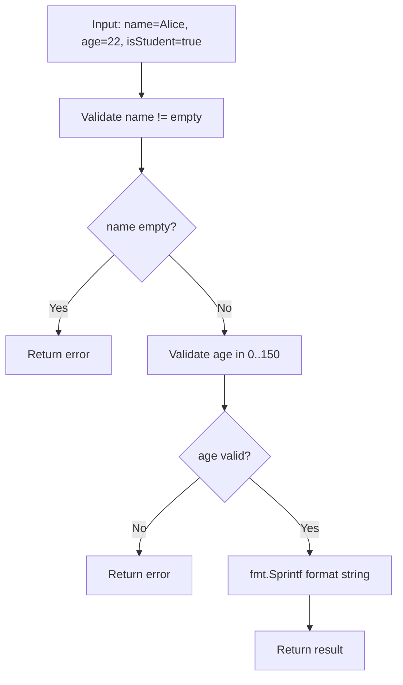
```mermaid
flowchart TD
    A["Input: name=Alice, age=22, isStudent=true"] --> B["Validate name != empty"]
    B --> C{"name empty?"}
    C -->|"Yes"| D["Return error"]
    C -->|"No"| E["Validate age in 0..150"]
    E --> F{"age valid?"}
    F -->|"No"| G["Return error"]
    F -->|"Yes"| H["fmt.Sprintf format string"]
    H --> I["Return result"]
```

**Execution Trace:**
```
Input:  name="Alice", age=22, isStudent=true
Step 1: name != "" → valid
Step 2: 0 <= 22 <= 150 → valid
Step 3: fmt.Sprintf → "Alice is 22 years old. Student: true"
Output: "Alice is 22 years old. Student: true"
```

### Interviewer Questions

1. Why use `var` block over short declaration `:=` here?
2. Can we improve time/space further? This is already O(1) — lower bound is O(1).
3. How does this scale to 10M concurrent requests? — Stateless, scales linearly.
4. Walk me through the edge case where age is -1.
5. How would you make this goroutine-safe? — Already safe; no shared mutable state.
6. What's the memory/GC impact? — Single string allocation per call from Sprintf.
7. How would you test this comprehensively? — Table-driven tests with valid/invalid inputs.

### Follow-Up Questions

**Q1:** What is the zero value for string, int, and bool in Go?
**A1:** `string` zero value is `""`, `int` is `0`, `bool` is `false`. Go guarantees all variables are initialized to their zero value if not explicitly assigned.

**Q2:** When would you prefer `var` over `:=`?
**A2:** Use `var` at package level (`:=` is not allowed outside functions), when you want to declare without initializing (zero value), or when explicit type annotation improves readability in complex codebases.

**Q3:** Can you have a `var` block at package level?
**A3:** Yes. `var ( name = "Alice"; version = "1.0" )` at package level creates package-scoped variables. These are initialized before `main()` runs.

**Q4:** What happens if you declare a variable with `var` but never use it?
**A4:** Unlike `:=` declared variables, package-level `var` declarations that go unused do not cause a compile error. However, locally declared variables (inside functions) that are unused — whether via `var` or `:=` — cause a compile-time "declared and not used" error.

**Q5:** How do you test that fmt.Sprintf produces the correct output?
**A5:** Use `testing` package with table-driven tests: define a slice of structs with input fields and expected string, iterate, call `FormatPersonInfo`, compare with `if got != tt.want { t.Errorf(...) }`.

---

## Q2: Short Variable Declaration and Type Inference  [Level 1 — Beginner]

> **Tags:** `#short-declaration` `#type-inference` `#walrus-operator`

### Problem Statement
Use the short variable declaration operator `:=` to declare variables of different types without explicit type annotations. Demonstrate that Go infers the correct type and print each variable's type using `fmt.Sprintf("%T", v)`. This covers Go's type inference at declaration time.

### Input / Output / Constraints

```
Input:  x = 42, pi = 3.14, greeting = "hello", flag = true
Output: "int: 42, float64: 3.14, string: hello, bool: true"

Constraints:
  • Must use := for all declarations
  • Must not specify explicit types
  • Time limit: O(1)
```

### Thought Process

Think like a senior Go engineer:
1. **Understand:** Show that `:=` infers int, float64, string, bool from literals.
2. **Pattern:** Type inference — Go assigns the default type for untyped constants: integer literals → int, floating-point → float64, string → string, boolean → bool.
3. **Edge cases:** Integer literal inferred as int (not int32/int64), float literal always float64.
4. **Approach:** Declare with `:=`, use `%T` verb to print runtime type.

### Brute Force Solution

```go
package main

import "fmt"

// bruteForce — O(1) time, O(1) space
func bruteForce() {
    x := 42
    pi := 3.14
    greeting := "hello"
    flag := true
    // Printing types separately — verbose
    fmt.Printf("Type of x: %T, value: %v\n", x, x)
    fmt.Printf("Type of pi: %T, value: %v\n", pi, pi)
    fmt.Printf("Type of greeting: %T, value: %v\n", greeting, greeting)
    fmt.Printf("Type of flag: %T, value: %v\n", flag, flag)
}
```

**Time:** O(1) | **Space:** O(1)
**Bottleneck:** Verbose — four separate Printf calls when one would suffice.

### Better Solution

```go
// betterSolution — O(1) time, O(1) space
func betterSolution() {
    x, pi, greeting, flag := 42, 3.14, "hello", true
    // Multi-assignment with := — all types inferred in one line
    fmt.Printf("%T: %v, %T: %v, %T: %v, %T: %v\n",
        x, x, pi, pi, greeting, greeting, flag, flag)
}
```

**Time:** O(1) | **Space:** O(1)

### Best / Optimal Solution

```go
package main

import "fmt"

// TypeInfo holds a variable's name, inferred type, and value as strings.
type TypeInfo struct {
    Name  string
    Type  string
    Value string
}

// InferTypes — production-ready, O(1) time, O(1) space.
// Uses fmt.Sprintf with %T verb to capture inferred type names at runtime.
func InferTypes() []TypeInfo {
    x := 42
    pi := 3.14
    greeting := "hello"
    flag := true

    return []TypeInfo{
        {Name: "x", Type: fmt.Sprintf("%T", x), Value: fmt.Sprintf("%v", x)},
        {Name: "pi", Type: fmt.Sprintf("%T", pi), Value: fmt.Sprintf("%v", pi)},
        {Name: "greeting", Type: fmt.Sprintf("%T", greeting), Value: fmt.Sprintf("%v", greeting)},
        {Name: "flag", Type: fmt.Sprintf("%T", flag), Value: fmt.Sprintf("%v", flag)},
    }
}

func main() {
    infos := InferTypes()
    for _, info := range infos {
        fmt.Printf("%s: %s = %s\n", info.Name, info.Type, info.Value)
    }
}
```

**Time:** O(1) | **Space:** O(1)

### Production Considerations

| Aspect | Details |
|--------|---------|
| **Scalability** | O(1) — fixed set of variables; no scaling concern |
| **Edge Cases** | Integer overflow if assigned to int on 32-bit systems; float64 precision loss |
| **Error Handling** | No errors possible for literal declarations |
| **Memory** | fmt.Sprintf allocates strings; consider sync.Pool for high-frequency use |
| **Concurrency** | Goroutine-safe — all local variables, no shared state |

### Visual Explanation

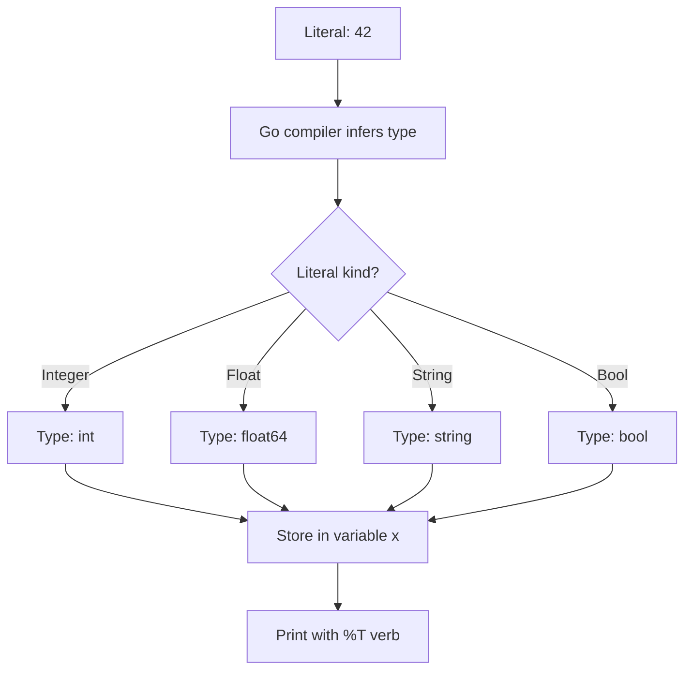
```mermaid
flowchart TD
    A["Literal: 42"] --> B["Go compiler infers type"]
    B --> C{"Literal kind?"}
    C -->|"Integer"| D["Type: int"]
    C -->|"Float"| E["Type: float64"]
    C -->|"String"| F["Type: string"]
    C -->|"Bool"| G["Type: bool"]
    D --> H["Store in variable x"]
    E --> H
    F --> H
    G --> H
    H --> I["Print with %T verb"]
```

**Execution Trace:**
```
Input:  x := 42
Step 1: Compiler sees integer literal 42 → infers int
Step 2: %T on x → "int"
Output: x: int = 42
```

### Interviewer Questions

1. Why does `x := 42` produce `int` and not `int64` on a 64-bit system?
2. Can we infer a specific int size like int32? What's the syntax?
3. How does this scale when you have 10M variables to track types for?
4. Walk me through what happens if you write `pi := 3` instead of `pi := 3.14`.
5. How would you make type inference results goroutine-safe to read?
6. What's the GC impact of using `fmt.Sprintf` in a hot path?
7. How do you write a test that verifies the inferred type is exactly `float64`?

### Follow-Up Questions

**Q1:** What is the difference between `:=` and `=`?
**A1:** `:=` declares AND assigns (short variable declaration, only inside functions). `=` assigns to an already-declared variable. Using `=` on an undeclared variable is a compile error.

**Q2:** Can you use `:=` to redeclare a variable?
**A2:** Yes, if at least one variable on the left side is new. Example: `x := 1; x, y := 2, 3` is valid because `y` is new. Purely redeclaring (`x := 1; x := 2`) is a compile error: "no new variables on left side of :=".

**Q3:** Why does Go default floating-point literals to float64 and not float32?
**A3:** float64 matches the IEEE 754 double-precision standard used by most hardware FPUs natively, avoiding implicit precision loss. float32 is explicitly chosen when memory layout or SIMD operations require it.

**Q4:** Can you use `:=` at package level?
**A4:** No. `:=` is only valid inside function bodies. Package-level variables must use `var`. This is a deliberate Go design choice to make package initialization explicit.

**Q5:** How do you check a variable's type at runtime in a type-safe way?
**A5:** Use a type switch: `switch v := val.(type) { case int: ...; case string: ... }`. For concrete types (non-interface), `reflect.TypeOf(v).String()` also works but adds reflect overhead. The `%T` verb internally uses reflect.

---

## Q3: Constants and Iota  [Level 2 — Easy]

> **Tags:** `#constants` `#iota` `#enum-pattern`

### Problem Statement
Define a set of weekday constants using `iota` starting from 1 (Sunday=1 through Saturday=7). Implement a function `DayName(d int) string` that returns the name of the day or "Unknown" for invalid input. This demonstrates iota-based enumeration, a common Go pattern.

### Input / Output / Constraints

```
Input:  d = 3
Output: "Tuesday"

Input:  d = 8
Output: "Unknown"

Constraints:
  • 1 ≤ valid d ≤ 7
  • d outside [1,7] returns "Unknown"
  • Time limit: O(1)
```

### Thought Process

Think like a senior Go engineer:
1. **Understand:** Map integer constants to day names using iota; handle out-of-range gracefully.
2. **Pattern:** Iota enumeration + switch statement or lookup slice.
3. **Edge cases:** d=0, d=8, negative d, very large d.
4. **Approach:** Const block with iota+1 shift; switch for O(1) lookup; bounds check first.

### Brute Force Solution

```go
package main

import "fmt"

// bruteForce — O(1) time, O(1) space
func bruteForce(d int) string {
    // Hardcoded if-else chain — works but doesn't scale to more constants
    if d == 1 {
        return "Sunday"
    } else if d == 2 {
        return "Monday"
    } else if d == 3 {
        return "Tuesday"
    } else if d == 4 {
        return "Wednesday"
    } else if d == 5 {
        return "Thursday"
    } else if d == 6 {
        return "Friday"
    } else if d == 7 {
        return "Saturday"
    }
    return "Unknown"
}
```

**Time:** O(1) | **Space:** O(1)
**Bottleneck:** Long if-else chain is unreadable; adding new constants requires modifying control flow.

### Better Solution

```go
// betterSolution — O(1) time, O(1) space
const (
    Sunday    = iota + 1 // 1
    Monday               // 2
    Tuesday              // 3
    Wednesday            // 4
    Thursday             // 5
    Friday               // 6
    Saturday             // 7
)

func betterSolution(d int) string {
    // Switch on typed constant — idiomatic
    switch d {
    case Sunday:
        return "Sunday"
    case Monday:
        return "Monday"
    case Tuesday:
        return "Tuesday"
    case Wednesday:
        return "Wednesday"
    case Thursday:
        return "Thursday"
    case Friday:
        return "Friday"
    case Saturday:
        return "Saturday"
    default:
        return "Unknown"
    }
}
```

**Time:** O(1) | **Space:** O(1)

### Best / Optimal Solution

```go
package main

import (
    "errors"
    "fmt"
)

// Weekday is a named type for type-safe day representation.
type Weekday int

const (
    Sunday    Weekday = iota + 1 // 1
    Monday                       // 2
    Tuesday                      // 3
    Wednesday                    // 4
    Thursday                     // 5
    Friday                       // 6
    Saturday                     // 7
)

// dayNames maps Weekday constants to their string representations.
// Index 0 is unused; index n corresponds to Weekday(n).
var dayNames = [8]string{"", "Sunday", "Monday", "Tuesday", "Wednesday", "Thursday", "Friday", "Saturday"}

// DayName — production-ready, O(1) time, O(1) space.
// Uses array lookup with bounds check for constant-time named type conversion.
func DayName(d Weekday) (string, error) {
    if d < Sunday || d > Saturday {
        return "", errors.New(fmt.Sprintf("invalid weekday: %d, must be in [1,7]", int(d)))
    }
    return dayNames[d], nil
}

func main() {
    days := []Weekday{1, 3, 7, 0, 8}
    for _, d := range days {
        name, err := DayName(d)
        if err != nil {
            fmt.Printf("error: %v\n", err)
            continue
        }
        fmt.Printf("Day %d: %s\n", d, name)
    }
}
```

**Time:** O(1) | **Space:** O(1)

### Production Considerations

| Aspect | Details |
|--------|---------|
| **Scalability** | O(1) array lookup; adding more constants requires only extending the array and const block |
| **Edge Cases** | d=0, negative d, d>7, int overflow on 32-bit; all handled by bounds check |
| **Error Handling** | Return descriptive error with the invalid value for easier debugging |
| **Memory** | Fixed-size array — zero heap allocation at lookup time |
| **Concurrency** | Read-only after init — fully goroutine-safe without locks |

### Visual Explanation

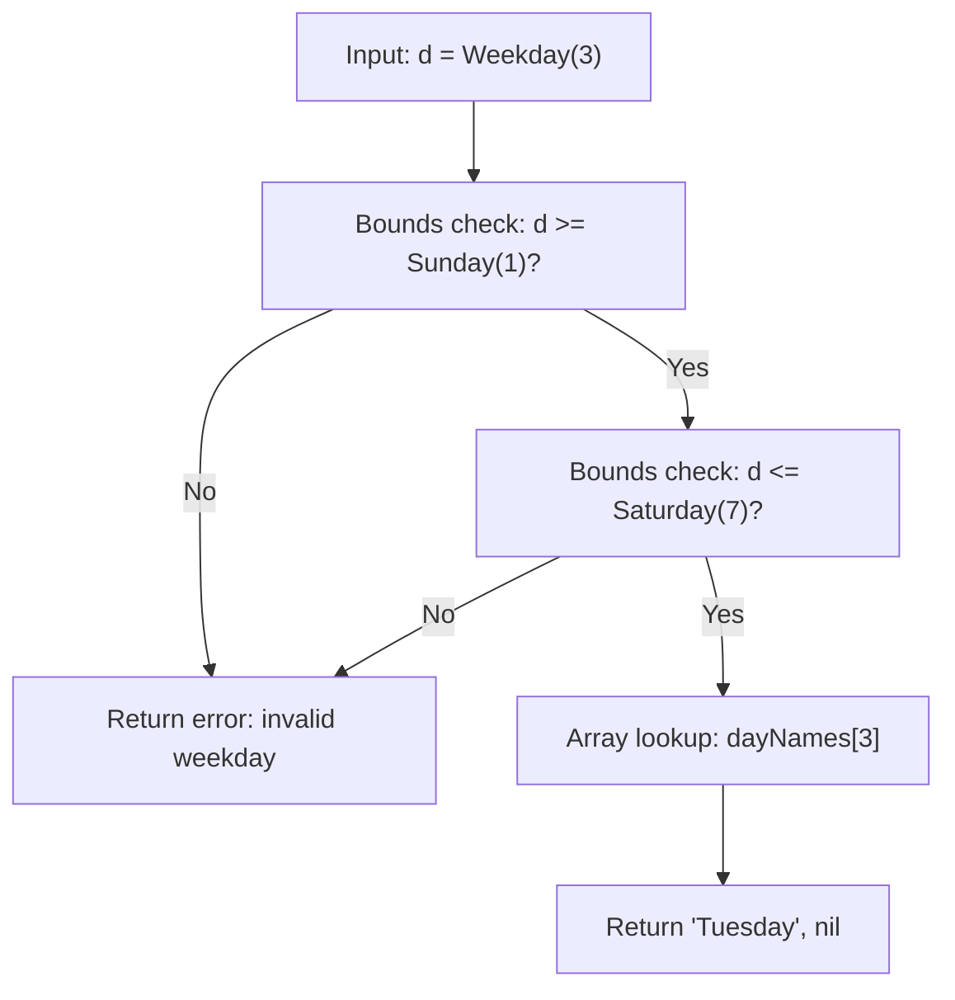
```mermaid
flowchart TD
    A["Input: d = Weekday(3)"] --> B["Bounds check: d >= Sunday(1)?"]
    B -->|"No"| C["Return error: invalid weekday"]
    B -->|"Yes"| D["Bounds check: d <= Saturday(7)?"]
    D -->|"No"| C
    D -->|"Yes"| E["Array lookup: dayNames[3]"]
    E --> F["Return 'Tuesday', nil"]
```

**Execution Trace:**
```
Input:  d = Weekday(3)
Step 1: 3 >= 1 → true
Step 2: 3 <= 7 → true
Step 3: dayNames[3] = "Tuesday"
Output: "Tuesday", nil
```

### Interviewer Questions

1. Why use a named type `Weekday` over plain `int`?
2. Can we improve time/space further? Already O(1) — lower bound is O(1) for lookup.
3. How does this scale when weekdays are extended (e.g., international calendars)?
4. Walk me through the edge case where d = 0.
5. How would you make the dayNames slice goroutine-safe if it were mutable?
6. What's the memory impact of storing dayNames as array vs slice?
7. How would you test all 7 valid days plus boundary invalids?

### Follow-Up Questions

**Q1:** What is iota and how does it reset?
**A1:** `iota` is a predeclared identifier representing the index of the current const spec in a `const` block. It starts at 0 and increments by 1 for each ConstSpec. It resets to 0 at the beginning of each new `const` block.

**Q2:** How do you use iota for bit flags (powers of 2)?
**A2:** Use `1 << iota`: `const ( Read = 1 << iota; Write; Execute )` gives Read=1, Write=2, Execute=4. Combine with bitwise OR: `perm := Read | Write` gives permission 3.

**Q3:** Can constants be expressions involving other constants?
**A3:** Yes. `const KB = 1024; const MB = KB * 1024`. Constants are evaluated at compile time. Complex expressions (including iota arithmetic like `iota * iota`) are valid as long as they are representable.

**Q4:** What is the difference between typed and untyped constants?
**A4:** Untyped constants (e.g., `const x = 42`) have a default type but can be used in expressions with different numeric types without explicit conversion. Typed constants (e.g., `const x int = 42`) are fixed to their type and require explicit conversion when used with other types.

**Q5:** How do you add a String() method to a Weekday type for fmt printing?
**A5:** Implement the `Stringer` interface: `func (w Weekday) String() string { name, _ := DayName(w); return name }`. Then `fmt.Println(Tuesday)` automatically prints "Tuesday" instead of "3".

---

## Q4: Type Conversion Between Numeric Types  [Level 2 — Easy]

> **Tags:** `#type-conversion` `#numeric-types` `#overflow`

### Problem Statement
Write a function `SafeIntToInt32(n int) (int32, error)` that converts an `int` to `int32`, returning an error if the value overflows int32's range. Then write `ByteSliceToString(b []byte) string` that converts a byte slice to string efficiently. This covers explicit type conversion and overflow detection.

### Input / Output / Constraints

```
Input:  n = 2147483647   → (2147483647, nil)
Input:  n = 2147483648   → (0, error: "overflow: 2147483648 exceeds int32 range")
Input:  b = []byte{72,101,108,108,111} → "Hello"

Constraints:
  • int32 range: -2147483648 to 2147483647
  • byte values: 0–255
  • Time limit: O(n) for byte conversion, O(1) for int conversion
```

### Thought Process

Think like a senior Go engineer:
1. **Understand:** Go requires explicit type conversion; implicit conversion causes compile error. Overflow is not automatic — we must bounds-check.
2. **Pattern:** Bounds check against `math.MaxInt32` / `math.MinInt32` before conversion; `string([]byte)` for zero-copy-like conversion.
3. **Edge cases:** MaxInt32 boundary (valid), MaxInt32+1 (overflow), MinInt32-1 (underflow), empty byte slice.
4. **Approach:** Use `math` package constants for bounds; `string(b)` is idiomatic and optimized by the compiler.

### Brute Force Solution

```go
package main

import "fmt"

// bruteForce — O(1) time, O(1) space
func bruteForce(n int) (int32, error) {
    // Manual boundary check with hardcoded constants — error-prone
    if n > 2147483647 || n < -2147483648 {
        return 0, fmt.Errorf("overflow: %d exceeds int32 range", n)
    }
    return int32(n), nil
}
```

**Time:** O(1) | **Space:** O(1)
**Bottleneck:** Hardcoded magic numbers — fragile and hard to read; should use `math.MaxInt32`.

### Better Solution

```go
import "math"

// betterSolution — O(1) time, O(1) space
func betterSolution(n int) (int32, error) {
    if n > math.MaxInt32 || n < math.MinInt32 {
        return 0, fmt.Errorf("overflow: %d exceeds int32 range [%d, %d]",
            n, math.MinInt32, math.MaxInt32)
    }
    return int32(n), nil
}
```

**Time:** O(1) | **Space:** O(1)

### Best / Optimal Solution

```go
package main

import (
    "errors"
    "fmt"
    "math"
)

// SafeIntToInt32 — production-ready, O(1) time, O(1) space.
// Uses math package constants to detect overflow before conversion.
func SafeIntToInt32(n int) (int32, error) {
    if n > math.MaxInt32 {
        return 0, fmt.Errorf("overflow: %d exceeds int32 max (%d)", n, math.MaxInt32)
    }
    if n < math.MinInt32 {
        return 0, fmt.Errorf("underflow: %d is below int32 min (%d)", n, math.MinInt32)
    }
    return int32(n), nil
}

// ByteSliceToString — production-ready, O(n) time, O(n) space.
// Uses direct string() conversion; compiler may optimize to avoid copy in some contexts.
func ByteSliceToString(b []byte) (string, error) {
    if b == nil {
        return "", errors.New("input byte slice is nil")
    }
    // string(b) copies bytes — safe for immutable string semantics
    return string(b), nil
}

func main() {
    // Test SafeIntToInt32
    cases := []int{0, math.MaxInt32, math.MaxInt32 + 1, math.MinInt32, math.MinInt32 - 1}
    for _, n := range cases {
        val, err := SafeIntToInt32(n)
        if err != nil {
            fmt.Printf("SafeIntToInt32(%d): error: %v\n", n, err)
        } else {
            fmt.Printf("SafeIntToInt32(%d): %d\n", n, val)
        }
    }

    // Test ByteSliceToString
    b := []byte{72, 101, 108, 108, 111}
    s, err := ByteSliceToString(b)
    if err != nil {
        fmt.Printf("error: %v\n", err)
        return
    }
    fmt.Printf("ByteSliceToString: %q\n", s)
}
```

**Time:** O(1) for int conversion, O(n) for byte conversion | **Space:** O(1) / O(n)

### Production Considerations

| Aspect | Details |
|--------|---------|
| **Scalability** | Int conversion is O(1); byte-to-string is O(n) — for large payloads use streaming |
| **Edge Cases** | MaxInt32 exactly (valid), MinInt32 exactly (valid), nil byte slice, empty byte slice |
| **Error Handling** | Separate overflow vs underflow errors with distinct messages for better logging |
| **Memory** | `string([]byte)` allocates a new string — use `unsafe.String` for zero-copy in hot paths |
| **Concurrency** | Both functions are pure/stateless — fully goroutine-safe |

### Visual Explanation

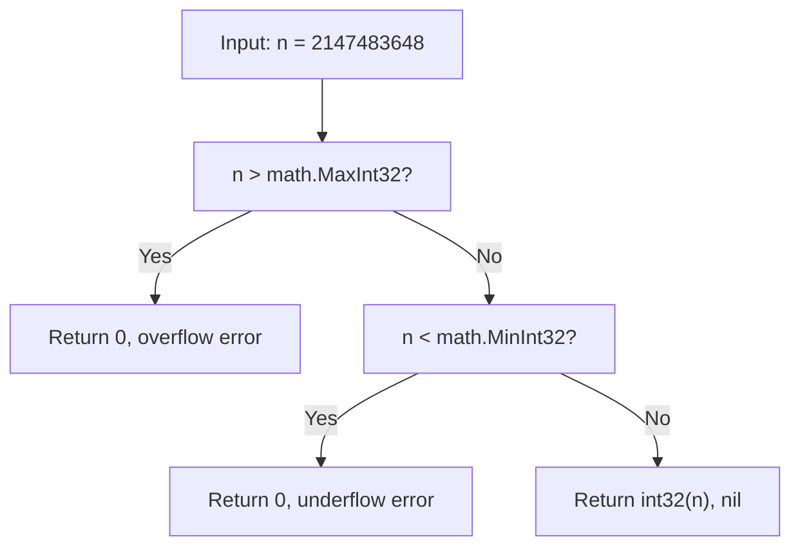
```mermaid
flowchart TD
    A["Input: n = 2147483648"] --> B["n > math.MaxInt32?"]
    B -->|"Yes"| C["Return 0, overflow error"]
    B -->|"No"| D["n < math.MinInt32?"]
    D -->|"Yes"| E["Return 0, underflow error"]
    D -->|"No"| F["Return int32(n), nil"]
```

**Execution Trace:**
```
Input:  n = 2147483648
Step 1: 2147483648 > 2147483647 (math.MaxInt32) → true
Step 2: Return (0, error: "overflow: 2147483648 exceeds int32 max (2147483647)")
Output: 0, error
```

### Interviewer Questions

1. Why does Go not allow implicit numeric type conversion?
2. Can we improve time/space further? O(1) is the lower bound for scalar conversion.
3. How does byte-to-string conversion scale at 1M requests/sec?
4. Walk me through the edge case where n = math.MaxInt32 exactly.
5. How would you make a concurrent-safe conversion registry?
6. What's the memory impact of `string([]byte)` vs `unsafe.String`?
7. How would you fuzz-test SafeIntToInt32 for overflow?

### Follow-Up Questions

**Q1:** What is the difference between type conversion and type assertion in Go?
**A1:** Type conversion (`int32(n)`) converts between compatible concrete types at compile time. Type assertion (`v.(int)`) extracts the concrete type from an interface at runtime and can panic or return `ok=false` if the assertion fails.

**Q2:** How do you convert string to []byte and back without allocation in hot paths?
**A2:** Use `unsafe.SliceData` / `unsafe.String` (Go 1.20+): `s := unsafe.String(unsafe.SliceData(b), len(b))`. This avoids copying but requires the byte slice not to be modified after the conversion. Use only in performance-critical, well-tested code.

**Q3:** What happens if you directly cast `int32(2147483648)` without a bounds check?
**A3:** Integer overflow — the value wraps around. `int32(2147483648)` becomes `-2147483648` (MinInt32). Go does not panic on integer overflow; it silently wraps, which is a source of security bugs.

**Q4:** How do you convert float64 to int safely?
**A4:** Check `math.IsNaN(f)`, `math.IsInf(f, 0)`, and bounds (`f > math.MaxInt64` or `f < math.MinInt64`) before `int(f)`. Note that `int(f)` truncates toward zero, not rounds.

**Q5:** How do you test numeric type conversion with property-based testing in Go?
**A5:** Use `github.com/leanovate/gopter` or `pgregory.net/rapid` for property-based tests. Define properties like "for all n in [MinInt32, MaxInt32], SafeIntToInt32(n) must return non-error" and run with random inputs across the full range.

---

## Q5: Zero Values and Variable Initialization  [Level 2 — Easy]

> **Tags:** `#zero-values` `#initialization` `#gotcha`

### Problem Statement
Write a function `ZeroValueDemo() map[string]interface{}` that creates variables of types int, float64, bool, string, pointer, slice, and map without explicit initialization, then returns a map showing each type's zero value as a string. This demonstrates Go's guaranteed zero-value initialization — a critical language guarantee.

### Input / Output / Constraints

```
Input:  (none — demonstrates zero values)
Output: map[bool:false float64:0 int:0 map:nil pointer:nil slice:nil string:]

Constraints:
  • Must NOT assign any value to the variables
  • Must cover all 7 types listed
  • Time limit: O(1)
```

### Thought Process

Think like a senior Go engineer:
1. **Understand:** Go guarantees every variable is initialized to its type's zero value — no garbage values.
2. **Pattern:** Declare with `var`, never assign, capture zero values using fmt.Sprintf.
3. **Edge cases:** Pointer zero is nil, slice zero is nil (not empty), map zero is nil (not empty map).
4. **Approach:** Declare all vars, build result map with string representations for comparison.

### Brute Force Solution

```go
package main

import "fmt"

// bruteForce — O(1) time, O(1) space
func bruteForce() {
    var i int
    var f float64
    var b bool
    var s string
    // Print each zero value
    fmt.Printf("int: %v\n", i)
    fmt.Printf("float64: %v\n", f)
    fmt.Printf("bool: %v\n", b)
    fmt.Printf("string: %q\n", s)
    // Pointer, slice, map not shown — incomplete
}
```

**Time:** O(1) | **Space:** O(1)
**Bottleneck:** Incomplete — missing pointer/slice/map zero values; hardcoded print statements, not reusable.

### Better Solution

```go
// betterSolution — O(1) time, O(1) space
func betterSolution() map[string]string {
    var (
        i   int
        f   float64
        b   bool
        s   string
        p   *int
        sl  []int
        m   map[string]int
    )
    return map[string]string{
        "int":     fmt.Sprintf("%v", i),
        "float64": fmt.Sprintf("%v", f),
        "bool":    fmt.Sprintf("%v", b),
        "string":  fmt.Sprintf("%q", s),
        "pointer": fmt.Sprintf("%v", p),
        "slice":   fmt.Sprintf("%v", sl),
        "map":     fmt.Sprintf("%v", m),
    }
}
```

**Time:** O(1) | **Space:** O(1)

### Best / Optimal Solution

```go
package main

import "fmt"

// ZeroValueInfo describes a type's zero value behavior.
type ZeroValueInfo struct {
    TypeName  string
    ZeroValue interface{}
    IsNil     bool
    Note      string
}

// ZeroValueDemo — production-ready, O(1) time, O(1) space.
// Documents Go's zero-value guarantee for all fundamental type categories.
func ZeroValueDemo() []ZeroValueInfo {
    var (
        i  int
        f  float64
        b  bool
        s  string
        p  *int
        sl []int
        m  map[string]int
    )

    return []ZeroValueInfo{
        {TypeName: "int", ZeroValue: i, IsNil: false, Note: "numeric zero"},
        {TypeName: "float64", ZeroValue: f, IsNil: false, Note: "IEEE 754 positive zero"},
        {TypeName: "bool", ZeroValue: b, IsNil: false, Note: "false"},
        {TypeName: "string", ZeroValue: s, IsNil: false, Note: "empty string, len=0"},
        {TypeName: "*int", ZeroValue: p, IsNil: p == nil, Note: "nil pointer, dereference panics"},
        {TypeName: "[]int", ZeroValue: sl, IsNil: sl == nil, Note: "nil slice, len=0, cap=0"},
        {TypeName: "map[string]int", ZeroValue: m, IsNil: m == nil, Note: "nil map, read returns zero, write panics"},
    }
}

func main() {
    infos := ZeroValueDemo()
    fmt.Printf("%-20s %-15s %-8s %s\n", "Type", "Zero Value", "IsNil", "Note")
    fmt.Println("-----------------------------------------------------------")
    for _, info := range infos {
        fmt.Printf("%-20s %-15v %-8v %s\n",
            info.TypeName, info.ZeroValue, info.IsNil, info.Note)
    }
}
```

**Time:** O(1) | **Space:** O(1)

### Production Considerations

| Aspect | Details |
|--------|---------|
| **Scalability** | O(1) — fixed set of types; zero value semantics are compile-time guarantees |
| **Edge Cases** | Nil map write panics; nil slice append works; nil pointer dereference panics |
| **Error Handling** | Nil checks before pointer dereference; `len(m) == 0` vs `m == nil` distinction |
| **Memory** | All stack-allocated for value types; pointer/slice/map headers on stack, backing on heap |
| **Concurrency** | Nil maps/slices are safe to read concurrently; writes require initialization first |

### Visual Explanation

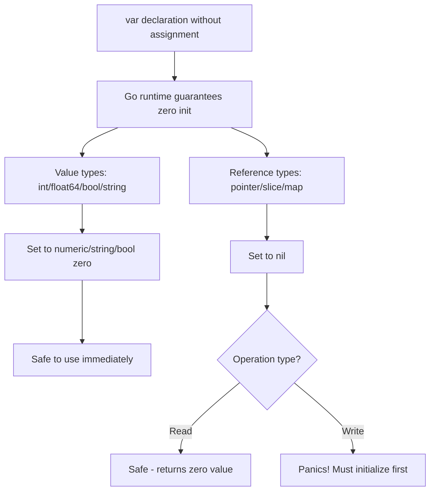
```mermaid
flowchart TD
    A["var declaration without assignment"] --> B["Go runtime guarantees zero init"]
    B --> C["Value types: int/float64/bool/string"]
    B --> D["Reference types: pointer/slice/map"]
    C --> E["Set to numeric/string/bool zero"]
    D --> F["Set to nil"]
    E --> G["Safe to use immediately"]
    F --> H{"Operation type?"}
    H -->|"Read"| I["Safe - returns zero value"]
    H -->|"Write"| J["Panics! Must initialize first"]
```

**Execution Trace:**
```
Input:  var m map[string]int  (no assignment)
Step 1: m == nil → true
Step 2: m["key"] → 0, false (safe read)
Step 3: m["key"] = 1 → PANIC: assignment to entry in nil map
Output: Must initialize: m = make(map[string]int)
```

### Interviewer Questions

1. Why does Go guarantee zero values instead of using garbage values like C?
2. Can we improve time/space further? Already O(1) — zero values are a language guarantee.
3. How does nil slice vs empty slice behave differently at 1M operations/sec?
4. Walk me through why writing to a nil map panics but reading does not.
5. How would you detect nil map writes before they panic in production?
6. What's the memory layout difference between nil slice and empty slice?
7. How would you test zero-value behavior comprehensively?

### Follow-Up Questions

**Q1:** What is the difference between a nil slice and an empty slice?
**A1:** `var s []int` → nil slice: `s == nil` is true, `len(s) == 0`, `cap(s) == 0`. `s := []int{}` → empty slice: `s == nil` is false, `len(s) == 0`. Both are safe for `append`, `len`, `range`. Prefer `var s []int` unless you need `json.Marshal` to output `[]` instead of `null`.

**Q2:** Why does writing to a nil map panic but reading returns zero?
**A2:** A nil map has no backing hash table — there is no memory to write to. Reading is safe because the runtime checks for nil and returns the zero value of the value type without accessing memory. Writing requires allocating/updating the hash table, which panics on nil.

**Q3:** How do you check if a struct field was explicitly set vs zero value?
**A3:** Use pointer fields (`*int` instead of `int`) — nil means "not set", non-nil means "set". Alternatively use `sql.NullInt64` or custom wrapper types with `Valid bool` flag. JSON unmarshaling uses the same approach with `omitempty`.

**Q4:** Do zero values apply to struct fields?
**A4:** Yes. Every field in a struct is zero-initialized. `type Point struct { X, Y float64 }; var p Point` gives `p.X == 0.0` and `p.Y == 0.0`. This eliminates a class of uninitialized memory bugs common in C/C++.

**Q5:** How does Go's zero-value guarantee interact with `sync.Mutex`?
**A5:** `sync.Mutex` is designed so its zero value is an unlocked, ready-to-use mutex. `var mu sync.Mutex` is immediately usable. This is intentional Go design — types should be usable from zero value where possible. Never copy a mutex after first use.

---

## Q6: Pointers to Basic Types  [Level 2 — Easy]

> **Tags:** `#pointers` `#memory-address` `#dereferencing`

### Problem Statement
Write a function `Swap(a, b *int)` that swaps two integers via pointers, and `NewInt(v int) *int` that allocates a new int on the heap and returns its pointer. Implement `SafeDeref(p *int, defaultVal int) int` that safely dereferences a pointer, returning a default value if nil. This tests pointer semantics — a common Go interview topic.

### Input / Output / Constraints

```
Input:  a=10, b=20 → after Swap: a=20, b=10
Input:  NewInt(42) → pointer to 42
Input:  SafeDeref(nil, -1) → -1
Input:  SafeDeref(&42, -1) → 42

Constraints:
  • Swap modifies in-place via pointer
  • NewInt must allocate on heap (return pointer)
  • SafeDeref must never panic
  • Time limit: O(1)
```

### Thought Process

Think like a senior Go engineer:
1. **Understand:** Pointers hold memory addresses; `*p` dereferences; `&v` takes address; `new(T)` heap-allocates.
2. **Pattern:** Pointer swap (classic); factory function returning pointer; nil guard before dereference.
3. **Edge cases:** nil pointer dereference panics; pointer to loop variable escapes to heap.
4. **Approach:** Use `*a, *b = *b, *a` for atomic-looking swap; nil check with default value return.

### Brute Force Solution

```go
package main

import "fmt"

// bruteForce — O(1) time, O(1) space
// Swap without pointer check — panics if nil passed
func bruteForce(a, b *int) {
    temp := *a // dereference — panics if a is nil
    *a = *b
    *b = temp
}
```

**Time:** O(1) | **Space:** O(1)
**Bottleneck:** No nil check — panics in production if nil pointer passed; no error signal.

### Better Solution

```go
// betterSolution — O(1) time, O(1) space
func betterSwap(a, b *int) error {
    if a == nil || b == nil {
        return fmt.Errorf("nil pointer: a=%v, b=%v", a, b)
    }
    *a, *b = *b, *a // Go multi-assignment — no temp variable needed
    return nil
}
```

**Time:** O(1) | **Space:** O(1)

### Best / Optimal Solution

```go
package main

import (
    "errors"
    "fmt"
)

// Swap — production-ready, O(1) time, O(1) space.
// Safely swaps two integers via pointers with nil guard.
func Swap(a, b *int) error {
    if a == nil {
        return errors.New("first pointer is nil")
    }
    if b == nil {
        return errors.New("second pointer is nil")
    }
    *a, *b = *b, *a
    return nil
}

// NewInt — allocates a new int on the heap and returns its address.
// The Go compiler performs escape analysis — returned pointers escape to heap.
func NewInt(v int) *int {
    // Simple assignment; compiler promotes to heap due to return
    p := v
    return &p
}

// SafeDeref — production-ready, O(1) time, O(1) space.
// Returns defaultVal if p is nil; otherwise returns *p.
func SafeDeref(p *int, defaultVal int) int {
    if p == nil {
        return defaultVal
    }
    return *p
}

func main() {
    a, b := 10, 20
    fmt.Printf("Before swap: a=%d, b=%d\n", a, b)
    if err := Swap(&a, &b); err != nil {
        fmt.Printf("error: %v\n", err)
        return
    }
    fmt.Printf("After swap:  a=%d, b=%d\n", a, b)

    p := NewInt(42)
    fmt.Printf("NewInt(42) → address=%p, value=%d\n", p, *p)

    fmt.Printf("SafeDeref(nil, -1) → %d\n", SafeDeref(nil, -1))
    fmt.Printf("SafeDeref(p, -1)   → %d\n", SafeDeref(p, -1))
}
```

**Time:** O(1) | **Space:** O(1)

### Production Considerations

| Aspect | Details |
|--------|---------|
| **Scalability** | O(1) — pointer operations are single machine instructions |
| **Edge Cases** | Nil pointer (guarded), same pointer a==b (swap is no-op, safe), pointer to zero |
| **Error Handling** | Return distinct errors for each nil pointer to help callers diagnose |
| **Memory** | `NewInt` causes heap escape — one allocation per call; consider sync.Pool for hot paths |
| **Concurrency** | Pointer dereference and assignment are NOT atomic — use sync/atomic for concurrent access |

### Visual Explanation

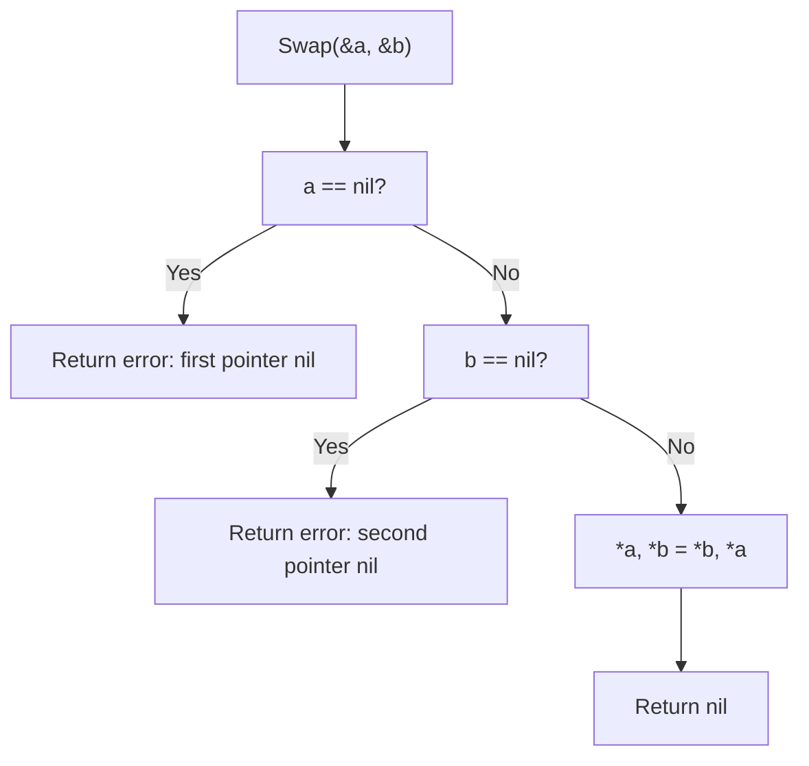
```mermaid
flowchart TD
    A["Swap(&a, &b)"] --> B["a == nil?"]
    B -->|"Yes"| C["Return error: first pointer nil"]
    B -->|"No"| D["b == nil?"]
    D -->|"Yes"| E["Return error: second pointer nil"]
    D -->|"No"| F["*a, *b = *b, *a"]
    F --> G["Return nil"]
```

**Execution Trace:**
```
Input:  a=10, b=20; Swap(&a, &b)
Step 1: &a != nil → OK
Step 2: &b != nil → OK
Step 3: *(&a), *(&b) = *(&b), *(&a) → a=20, b=10
Output: a=20, b=10, error=nil
```

### Interviewer Questions

1. Why use `*a, *b = *b, *a` instead of a temp variable?
2. Can we improve time/space? Already O(1) — XOR swap saves one variable but reduces readability.
3. How does this scale to 10M concurrent swaps?
4. Walk me through what happens when a == b (same pointer).
5. How would you make Swap goroutine-safe?
6. What's the heap vs stack allocation difference between `new(int)` and `&localVar`?
7. How would you test that Swap correctly handles nil pointers?

### Follow-Up Questions

**Q1:** What is the difference between `new(T)` and `&T{}`?
**A1:** `new(int)` allocates a zeroed int and returns `*int`. `&MyStruct{}` allocates a zeroed struct and returns its pointer. For basic types, `new(int)` and `p := 0; &p` are equivalent. `new` is less commonly used in modern Go — composite literals with `&` are preferred for structs.

**Q2:** How does Go's escape analysis decide stack vs heap?
**A2:** The compiler runs escape analysis at compile time. If a variable's address is returned from a function, passed to an interface, or captured by a closure that outlives the current function, the variable "escapes to heap." Use `go build -gcflags="-m"` to see escape analysis output.

**Q3:** Is pointer comparison (`a == b`) comparing addresses or values?
**A3:** Addresses. `a == b` is true only if both pointers point to the same memory location. To compare values: `*a == *b`. To check nil: `a == nil`.

**Q4:** How do you atomically swap two integers without a mutex?
**A4:** Use `sync/atomic`: `atomic.SwapInt64(&a, atomic.LoadInt64(&b))` — but true atomic swap of two separate variables is not possible with the standard library. Use a mutex or channel for correct two-variable atomic swap.

**Q5:** What is a common pointer bug in Go loops?
**A5:** Capturing loop variable address: `for _, v := range slice { ptrs = append(ptrs, &v) }` — all pointers point to the same `v` variable (the loop var). Fix: `v := v` inside the loop (create a copy) or use index `&slice[i]`. Go 1.22+ fixes this by making loop variables per-iteration.

---

## Q7: Named Types and Type Aliases  [Level 3 — Medium]

> **Tags:** `#named-types` `#type-alias` `#type-safety`

### Problem Statement
Define a named type `Celsius float64` and `Fahrenheit float64`. Implement conversion functions `CelsiusToFahrenheit(c Celsius) Fahrenheit` and `FahrenheitToCelsius(f Fahrenheit) Celsius`. Add a `String()` method to both types. Then demonstrate why `Celsius(100) + Fahrenheit(32)` is a compile error — showing named type safety. This is a classic Go named-type pattern.

### Input / Output / Constraints

```
Input:  c = Celsius(100)
Output: Fahrenheit(212), "212.00°F"

Input:  f = Fahrenheit(32)
Output: Celsius(0), "0.00°C"

Constraints:
  • Formula: F = C×9/5 + 32
  • Precision: 2 decimal places in String()
  • Time limit: O(1)
```

### Thought Process

Think like a senior Go engineer:
1. **Understand:** Named types create distinct types even from the same underlying type — prevents mixing incompatible units.
2. **Pattern:** Named type + method set; the `Stringer` interface for fmt integration.
3. **Edge cases:** Absolute zero (-273.15°C), very large temperatures causing float overflow.
4. **Approach:** Define types with underlying float64; implement String() for fmt; validate range for production use.

### Brute Force Solution

```go
package main

import "fmt"

// bruteForce — O(1) time, O(1) space
// Using plain float64 — loses type safety, caller can accidentally mix units
func bruteForce(celsius float64) float64 {
    return celsius*9.0/5.0 + 32.0
}
```

**Time:** O(1) | **Space:** O(1)
**Bottleneck:** No type safety — caller can pass Fahrenheit value and get wrong result silently.

### Better Solution

```go
// betterSolution — O(1) time, O(1) space
type Celsius2 float64
type Fahrenheit2 float64

func celsiusToFahrenheit(c Celsius2) Fahrenheit2 {
    return Fahrenheit2(c*9.0/5.0 + 32.0)
}
```

**Time:** O(1) | **Space:** O(1)

### Best / Optimal Solution

```go
package main

import (
    "errors"
    "fmt"
)

// Celsius represents temperature in degrees Celsius.
type Celsius float64

// Fahrenheit represents temperature in degrees Fahrenheit.
type Fahrenheit float64

const (
    AbsoluteZeroC Celsius = -273.15 // Absolute zero in Celsius
)

// String implements fmt.Stringer for Celsius.
func (c Celsius) String() string {
    return fmt.Sprintf("%.2f°C", float64(c))
}

// String implements fmt.Stringer for Fahrenheit.
func (f Fahrenheit) String() string {
    return fmt.Sprintf("%.2f°F", float64(f))
}

// CelsiusToFahrenheit — production-ready, O(1) time, O(1) space.
// Validates temperature is above absolute zero before converting.
func CelsiusToFahrenheit(c Celsius) (Fahrenheit, error) {
    if c < AbsoluteZeroC {
        return 0, fmt.Errorf("temperature %.2f°C is below absolute zero (%.2f°C)",
            float64(c), float64(AbsoluteZeroC))
    }
    return Fahrenheit(c*9.0/5.0 + 32.0), nil
}

// FahrenheitToCelsius — production-ready, O(1) time, O(1) space.
func FahrenheitToCelsius(f Fahrenheit) (Celsius, error) {
    c := Celsius((f - 32.0) * 5.0 / 9.0)
    if c < AbsoluteZeroC {
        return 0, errors.New("resulting Celsius is below absolute zero")
    }
    return c, nil
}

func main() {
    c := Celsius(100)
    f, err := CelsiusToFahrenheit(c)
    if err != nil {
        fmt.Printf("error: %v\n", err)
        return
    }
    fmt.Printf("%s = %s\n", c, f) // Uses String() via fmt.Stringer

    f2 := Fahrenheit(32)
    c2, err := FahrenheitToCelsius(f2)
    if err != nil {
        fmt.Printf("error: %v\n", err)
        return
    }
    fmt.Printf("%s = %s\n", f2, c2)

    // This would be a compile error — named types prevent accidental mixing:
    // _ = c + f  // ERROR: cannot use f (type Fahrenheit) as type Celsius
}
```

**Time:** O(1) | **Space:** O(1)

### Production Considerations

| Aspect | Details |
|--------|---------|
| **Scalability** | O(1) — arithmetic; suitable for embedded in hot paths |
| **Edge Cases** | Absolute zero, NaN input (from float arithmetic), positive/negative infinity |
| **Error Handling** | Validate physics constraints; return typed errors for domain violations |
| **Memory** | Zero allocation — all stack values; String() allocates one string per call |
| **Concurrency** | Pure functions — goroutine-safe; no shared state |

### Visual Explanation

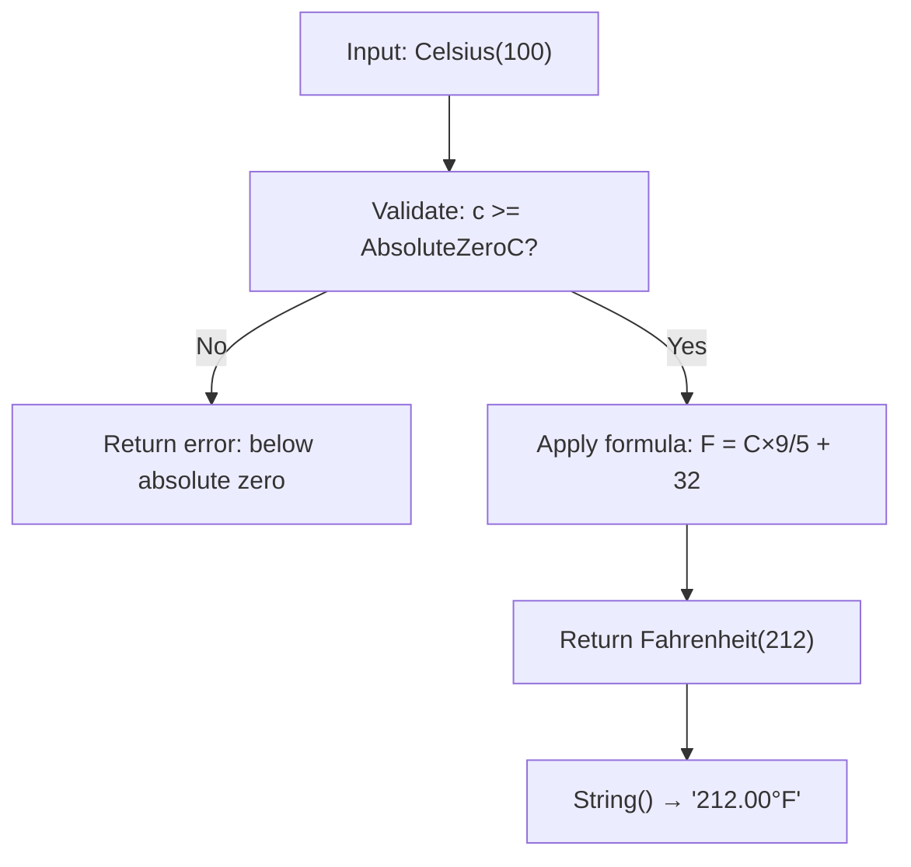
```mermaid
flowchart TD
    A["Input: Celsius(100)"] --> B["Validate: c >= AbsoluteZeroC?"]
    B -->|"No"| C["Return error: below absolute zero"]
    B -->|"Yes"| D["Apply formula: F = C×9/5 + 32"]
    D --> E["Return Fahrenheit(212)"]
    E --> F["String() → '212.00°F'"]
```

**Execution Trace:**
```
Input:  c = Celsius(100)
Step 1: 100 >= -273.15 → valid
Step 2: 100 × 9/5 + 32 = 180 + 32 = 212
Step 3: Fahrenheit(212).String() → "212.00°F"
Output: "100.00°C = 212.00°F"
```

### Interviewer Questions

1. Why use named types instead of type aliases (`type Celsius = float64`)?
2. Can we improve time/space? Already O(1) — this is optimal.
3. How would you handle temperature conversions at 10M RPS in a weather API?
4. Walk me through why `Celsius(100) + Fahrenheit(32)` is a compile error.
5. How would you make a temperature type goroutine-safe for concurrent updates?
6. What's the GC impact of String() being called in a hot render loop?
7. How would you test float precision in temperature conversions?

### Follow-Up Questions

**Q1:** What is the difference between a named type and a type alias?
**A1:** `type Celsius float64` creates a new distinct type — Celsius and float64 are not interchangeable. `type Celsius = float64` creates an alias — they are the same type, interchangeable everywhere. Named types add type safety; aliases are mainly for code organization and incremental refactoring.

**Q2:** Can you define methods on a type alias?
**A2:** No. You cannot define methods on a type alias if the underlying type is defined in another package. You can only define methods on types defined in the current package. That's why `type MyInt = int` cannot have methods, but `type MyInt int` can.

**Q3:** How do you implement the Stringer interface and why does it matter?
**A3:** Implement `func (t T) String() string`. The `fmt` package checks if a value implements `fmt.Stringer` and calls `String()` automatically for `%v`, `%s`, and default formatting. This allows domain types to control their own string representation.

**Q4:** Can a named type inherit methods from its underlying type?
**A4:** No. `type Celsius float64` does NOT inherit any methods from `float64` (which has none). However, it inherits the underlying type's operators (arithmetic, comparison). For structs, embedding is used to "inherit" methods: `type MyWriter struct { io.Writer }`.

**Q5:** How do you JSON marshal/unmarshal a named numeric type?
**A5:** Named numeric types (like `type Celsius float64`) marshal/unmarshal as their underlying type by default. `json.Marshal(Celsius(100))` produces `100`. For custom formats, implement `MarshalJSON() ([]byte, error)` and `UnmarshalJSON([]byte) error`.

---

## Q8: Rune, Byte, and String Internals  [Level 3 — Medium]

> **Tags:** `#rune` `#byte` `#unicode` `#utf8`

### Problem Statement
Write a function `StringStats(s string) (byteLen int, runeLen int, chars []rune, err error)` that returns the byte length, rune (Unicode code point) count, and slice of runes for a given string. Then implement `ReverseString(s string) string` that correctly reverses a Unicode string (not just bytes). This exposes the critical difference between byte indexing and rune iteration.

### Input / Output / Constraints

```
Input:  s = "Hello, 世界"
Output: byteLen=13, runeLen=9, chars=['H','e','l','l','o',',',' ','世','界']

Input:  ReverseString("Hello, 世界") → "界世 ,olleH"

Constraints:
  • Valid UTF-8 input
  • len(s) returns bytes, not runes
  • 0 ≤ len(s) ≤ 10⁶
  • Time limit: O(n)
```

### Thought Process

Think like a senior Go engineer:
1. **Understand:** Go strings are byte slices internally. `len(s)` counts bytes. Unicode chars (runes) may be 1-4 bytes in UTF-8.
2. **Pattern:** `range` over string yields rune+byte-offset pairs; `[]rune(s)` converts to rune slice; reverse the rune slice; `string(runes)` back.
3. **Edge cases:** Empty string, ASCII-only (1 byte/rune), multi-byte CJK characters, emoji (4 bytes), invalid UTF-8.
4. **Approach:** Use `range s` to count runes; convert to `[]rune` for reversal; `utf8.ValidString` to validate input.

### Brute Force Solution

```go
package main

import "fmt"

// bruteForce — O(n) time, O(n) space
// Reverse bytes — WRONG for multi-byte Unicode
func bruteForce(s string) string {
    b := []byte(s)
    for i, j := 0, len(b)-1; i < j; i, j = i+1, j-1 {
        b[i], b[j] = b[j], b[i]
    }
    return string(b) // Corrupts multi-byte sequences!
}
```

**Time:** O(n) | **Space:** O(n)
**Bottleneck:** Reverses bytes, not runes — produces invalid UTF-8 for multi-byte characters.

### Better Solution

```go
// betterSolution — O(n) time, O(n) space
func betterReverseString(s string) string {
    runes := []rune(s) // Convert to rune slice — handles Unicode correctly
    for i, j := 0, len(runes)-1; i < j; i, j = i+1, j-1 {
        runes[i], runes[j] = runes[j], runes[i]
    }
    return string(runes)
}
```

**Time:** O(n) | **Space:** O(n)

### Best / Optimal Solution

```go
package main

import (
    "errors"
    "fmt"
    "unicode/utf8"
)

// StringStats — production-ready, O(n) time, O(n) space.
// Uses utf8.ValidString to guard against invalid input before processing.
func StringStats(s string) (byteLen int, runeLen int, chars []rune, err error) {
    if !utf8.ValidString(s) {
        return 0, 0, nil, errors.New("input contains invalid UTF-8 sequences")
    }

    byteLen = len(s) // O(1) — built-in len on strings returns byte count

    chars = make([]rune, 0, utf8.RuneCountInString(s)) // pre-allocate
    for _, r := range s { // range iterates by rune (Unicode code point)
        chars = append(chars, r)
    }
    runeLen = len(chars)
    return byteLen, runeLen, chars, nil
}

// ReverseString — production-ready, O(n) time, O(n) space.
// Converts to rune slice to correctly handle multi-byte Unicode characters.
func ReverseString(s string) (string, error) {
    if !utf8.ValidString(s) {
        return "", errors.New("input contains invalid UTF-8 sequences")
    }
    if s == "" {
        return "", nil
    }
    runes := []rune(s)
    for i, j := 0, len(runes)-1; i < j; i, j = i+1, j-1 {
        runes[i], runes[j] = runes[j], runes[i]
    }
    return string(runes), nil
}

func main() {
    s := "Hello, 世界"
    byteLen, runeLen, chars, err := StringStats(s)
    if err != nil {
        fmt.Printf("error: %v\n", err)
        return
    }
    fmt.Printf("String:   %q\n", s)
    fmt.Printf("Bytes:    %d\n", byteLen)
    fmt.Printf("Runes:    %d\n", runeLen)
    fmt.Printf("Chars:    %v\n", string(chars))

    reversed, err := ReverseString(s)
    if err != nil {
        fmt.Printf("error: %v\n", err)
        return
    }
    fmt.Printf("Reversed: %q\n", reversed)
}
```

**Time:** O(n) | **Space:** O(n)

### Production Considerations

| Aspect | Details |
|--------|---------|
| **Scalability** | O(n) — linear in string length; for 1M+ char strings consider streaming |
| **Edge Cases** | Empty string, ASCII-only, emoji (4 bytes), invalid UTF-8, lone surrogates |
| **Error Handling** | Validate UTF-8 before processing; return error for invalid sequences |
| **Memory** | `[]rune(s)` allocates n×4 bytes (rune=int32); strings are immutable |
| **Concurrency** | Strings are immutable — goroutine-safe to read; rune slice is local |

### Visual Explanation

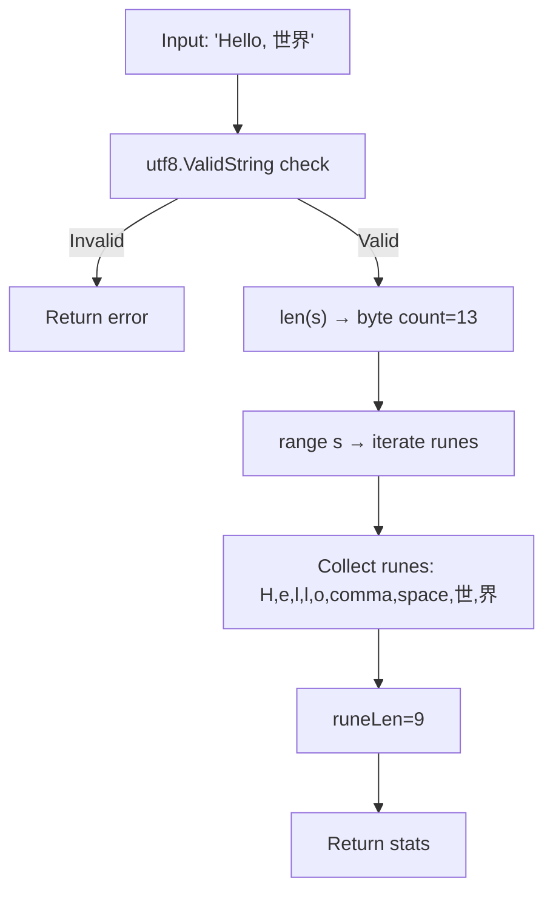
```mermaid
flowchart TD
    A["Input: 'Hello, 世界'"] --> B["utf8.ValidString check"]
    B -->|"Invalid"| C["Return error"]
    B -->|"Valid"| D["len(s) → byte count=13"]
    D --> E["range s → iterate runes"]
    E --> F["Collect runes: H,e,l,l,o,comma,space,世,界"]
    F --> G["runeLen=9"]
    G --> H["Return stats"]
```

**Execution Trace:**
```
Input:  "Hello, 世界"
Bytes:  H(1) e(1) l(1) l(1) o(1) ,(1) (1) 世(3) 界(3) = 13 bytes
Runes:  H e l l o ,   世 界 = 9 runes
Reverse runes: 界世 ,olleH
Output: byteLen=13, runeLen=9
```

### Interviewer Questions

1. Why does `len("Hello, 世界")` return 13 and not 9?
2. Can we improve time/space? O(n) is the lower bound — must inspect every character.
3. How does this scale to 1M character strings?
4. Walk me through what happens with an emoji like "😀" (4 bytes, 1 rune).
5. How would you make StringStats goroutine-safe for a shared string cache?
6. What's the memory cost of `[]rune(s)` vs keeping the original string?
7. How would you test ReverseString for emoji and mixed-script strings?

### Follow-Up Questions

**Q1:** What is the difference between `byte` and `rune` in Go?
**A1:** `byte` is an alias for `uint8` — represents a single byte (0-255). `rune` is an alias for `int32` — represents a Unicode code point (0 to 1,114,111). A single rune may be encoded as 1-4 bytes in UTF-8. Use `byte` for binary data; use `rune` for Unicode text processing.

**Q2:** How does `range` over a string work differently from index access?
**A2:** `for i, r := range s` iterates by Unicode code point (rune), advancing i by the byte width of each rune. `s[i]` returns the raw byte at index i. For ASCII strings they are equivalent; for multi-byte strings, `range` gives correct rune boundaries while byte indexing can split multi-byte sequences.

**Q3:** How do you efficiently build a string from many runes?
**A3:** Use `strings.Builder`: `var b strings.Builder; for _, r := range runes { b.WriteRune(r) }; return b.String()`. This avoids O(n²) allocations from repeated string concatenation. `string([]rune{...})` is also O(n) but creates an intermediate rune slice.

**Q4:** What is a rune literal and how do you write one?
**A4:** A rune literal is a single character in single quotes: `'A'` (65), `'世'` (19990), `'\n'` (10), `'世'` (Unicode escape). The type is `rune` (int32). Compare: `"A"` is a string literal.

**Q5:** How do you handle invalid UTF-8 bytes in a production parser?
**A5:** Use `utf8.DecodeRune(b)` which returns `utf8.RuneError` (U+FFFD) and width 1 for invalid sequences. Decide whether to replace with U+FFFD (lenient mode) or return an error (strict mode). Log the byte offset for debugging.

---

## Q9: Typed Constants with Expressions and iota Patterns  [Level 3 — Medium]

> **Tags:** `#iota` `#bitmask` `#const-expression`

### Problem Statement
Implement a file permission system using iota-based bit flags: `Read=1`, `Write=2`, `Execute=4`. Write `HasPermission(perm, flag Permission) bool`, `AddPermission(perm, flag Permission) Permission`, and `RemovePermission(perm, flag Permission) Permission`. Then implement `PermissionString(perm Permission) string` that returns a human-readable string like "rwx", "r--", "-w-". This combines named types, iota, and bitwise operations.

### Input / Output / Constraints

```
Input:  perm = Read | Execute (5), flag = Write
HasPermission → false
AddPermission → 7 (rwx)
PermissionString(5) → "r-x"

Constraints:
  • Permission is a named type over uint8
  • Flags are powers of 2 via iota
  • PermissionString always returns exactly 3 chars
  • Time limit: O(1)
```

### Thought Process

Think like a senior Go engineer:
1. **Understand:** Bit flags allow combining multiple boolean states in a single integer. iota with `1<<iota` generates powers of 2.
2. **Pattern:** Bitmask operations — OR to add, AND NOT to remove, AND to check; string building with ternary-like logic.
3. **Edge cases:** Zero permission (no bits set), all bits set (full access), invalid combination bits.
4. **Approach:** Named type for type safety; const block with `1 << iota`; bitwise operations; conditional string building.

### Brute Force Solution

```go
package main

// bruteForce — O(1) time, O(1) space
// Using plain int — no type safety
func bruteForceHas(perm, flag int) bool {
    return perm&flag != 0 // works but unsafe — any int can be passed
}
```

**Time:** O(1) | **Space:** O(1)
**Bottleneck:** No named types — caller can pass arbitrary int values; no compile-time safety.

### Better Solution

```go
// betterSolution — O(1) time, O(1) space
type Permission uint8

const (
    Read    Permission = 1 << iota // 1 = 001
    Write                          // 2 = 010
    Execute                        // 4 = 100
)

func hasPermission(perm, flag Permission) bool {
    return perm&flag == flag // all bits in flag must be set
}
```

**Time:** O(1) | **Space:** O(1)

### Best / Optimal Solution

```go
package main

import (
    "fmt"
    "strings"
)

// Permission is a named bit-flag type for file access control.
type Permission uint8

const (
    Read    Permission = 1 << iota // 001 = 1
    Write                          // 010 = 2
    Execute                        // 100 = 4

    ReadWrite   = Read | Write
    ReadExecute = Read | Execute
    All         = Read | Write | Execute
    None        Permission = 0
)

// HasPermission — production-ready, O(1) time, O(1) space.
// Returns true if ALL bits in flag are set in perm.
func HasPermission(perm, flag Permission) bool {
    if flag == 0 {
        return true // no permissions required → always true
    }
    return perm&flag == flag
}

// AddPermission — returns new Permission with flag bits added.
func AddPermission(perm, flag Permission) Permission {
    return perm | flag
}

// RemovePermission — returns new Permission with flag bits cleared.
func RemovePermission(perm, flag Permission) Permission {
    return perm &^ flag // AND NOT (bit clear operator)
}

// PermissionString — production-ready, O(1) time, O(1) space.
// Returns a 3-character Unix-style permission string ("rwx", "r--", etc.)
func PermissionString(perm Permission) string {
    var sb strings.Builder
    sb.Grow(3)
    if perm&Read != 0 {
        sb.WriteByte('r')
    } else {
        sb.WriteByte('-')
    }
    if perm&Write != 0 {
        sb.WriteByte('w')
    } else {
        sb.WriteByte('-')
    }
    if perm&Execute != 0 {
        sb.WriteByte('x')
    } else {
        sb.WriteByte('-')
    }
    return sb.String()
}

func main() {
    perm := Read | Execute // 5 = 101
    fmt.Printf("Initial perm: %s (%d)\n", PermissionString(perm), perm)
    fmt.Printf("HasPermission(Write): %v\n", HasPermission(perm, Write))
    fmt.Printf("HasPermission(Read):  %v\n", HasPermission(perm, Read))

    perm = AddPermission(perm, Write)
    fmt.Printf("After AddPermission(Write): %s (%d)\n", PermissionString(perm), perm)

    perm = RemovePermission(perm, Execute)
    fmt.Printf("After RemovePermission(Execute): %s (%d)\n", PermissionString(perm), perm)
}
```

**Time:** O(1) | **Space:** O(1)

### Production Considerations

| Aspect | Details |
|--------|---------|
| **Scalability** | O(1) bitwise operations — trivially scalable; suitable for hot paths |
| **Edge Cases** | Zero permission, all-bits-set, invalid bits beyond 3 flags, compound flag checks |
| **Error Handling** | Validate that Permission value is within valid range (0-7) in public APIs |
| **Memory** | All stack-allocated; strings.Builder pre-grown to avoid alloc |
| **Concurrency** | Read-only operations are goroutine-safe; permission mutation requires atomic ops |

### Visual Explanation

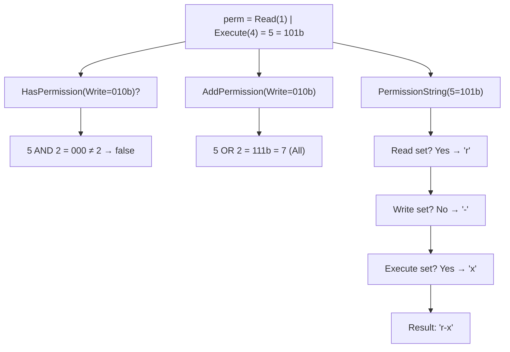
```mermaid
flowchart TD
    A["perm = Read(1) | Execute(4) = 5 = 101b"] --> B["HasPermission(Write=010b)?"]
    B --> C["5 AND 2 = 000 ≠ 2 → false"]
    A --> D["AddPermission(Write=010b)"]
    D --> E["5 OR 2 = 111b = 7 (All)"]
    A --> F["PermissionString(5=101b)"]
    F --> G["Read set? Yes → 'r'"]
    G --> H["Write set? No → '-'"]
    H --> I["Execute set? Yes → 'x'"]
    I --> J["Result: 'r-x'"]
```

**Execution Trace:**
```
Input:  perm = 5 (Read|Execute = 101b)
PermissionString:
  Read(1)&5=1 → 'r'
  Write(2)&5=0 → '-'
  Execute(4)&5=4 → 'x'
Output: "r-x"
```

### Interviewer Questions

1. Why use `1 << iota` instead of explicit values like 1, 2, 4?
2. Can we improve time/space? Already O(1) — bitwise operations are single CPU instructions.
3. How does this scale to a system with 64 permission types?
4. Walk me through `perm &^ flag` (AND NOT operator).
5. How would you make permission updates goroutine-safe?
6. What's the memory overhead of string building vs returning a [3]byte?
7. How would you test all 8 possible permission combinations?

### Follow-Up Questions

**Q1:** What is the `&^` operator in Go?
**A1:** `&^` is the bit clear (AND NOT) operator. `a &^ b` clears all bits in `a` that are set in `b`. Equivalent to `a & (^b)`. Used to remove flags: `perm &^ Execute` removes the Execute bit. This is unique to Go — C/C++ uses `a & ~b`.

**Q2:** How do you check if multiple flags are all set at once?
**A2:** `perm & (Read | Execute) == (Read | Execute)` checks if both Read AND Execute are set. `HasPermission(perm, Read|Execute)` using the implementation above. For OR check (any one set): `perm & (Read|Execute) != 0`.

**Q3:** How do you iterate over all set bits in a Permission?
**A3:** ```go
flags := []Permission{Read, Write, Execute}
for _, f := range flags { if perm&f != 0 { fmt.Println(f) } }
```
Or use a loop: `for b := Permission(1); b <= Execute; b <<= 1 { if perm&b != 0 { ... } }`.

**Q4:** Can iota be used in expressions across multiple const blocks?
**A4:** No. `iota` resets to 0 at the start of each new `const` block. Within a single `const` block, every ConstSpec increments iota by 1. Use a single const block for all related iota-based constants.

**Q5:** How do you serialize/deserialize bit-flag permissions to JSON?
**A5:** Implement `MarshalJSON` to produce `["read","execute"]` and `UnmarshalJSON` to parse back. Or marshal as integer for compact representation. Use a map `flagNames := map[Permission]string{Read:"read", Write:"write", Execute:"execute"}` to convert.

---

## Q10: Multiple Return Values and Blank Identifier  [Level 3 — Medium]

> **Tags:** `#multiple-return` `#blank-identifier` `#error-handling`

### Problem Statement
Write a function `ParseTemperature(s string) (float64, string, error)` that parses strings like "100C", "212F", "373.15K" into value, unit, and error. Use the blank identifier `_` to discard unneeded return values in the caller. Also implement `MustParseTemperature(s string) (float64, string)` that panics on error — demonstrating the "Must" pattern used in Go standard library. This tests multiple return values and idiomatic error handling.

### Input / Output / Constraints

```
Input:  "100C"    → (100.0, "C", nil)
Input:  "212.5F"  → (212.5, "F", nil)
Input:  "abc"     → (0, "", error: "invalid format")
Input:  "-300C"   → (0, "", error: "below absolute zero")

Constraints:
  • Valid units: C, F, K
  • Value can be integer or decimal
  • Time limit: O(n) where n = len(s)
```

### Thought Process

Think like a senior Go engineer:
1. **Understand:** Parse numeric prefix and single-char unit suffix; validate value against physics bounds per unit.
2. **Pattern:** String splitting + `strconv.ParseFloat`; multiple return values for value+unit+error; Must-pattern for init-time parsing.
3. **Edge cases:** Empty string, no unit, unknown unit, negative Kelvin, malformed number, only unit char.
4. **Approach:** Split last char as unit; parse remainder as float64; validate per-unit bounds.

### Brute Force Solution

```go
package main

import (
    "fmt"
    "strconv"
)

// bruteForce — O(n) time, O(1) space
func bruteForce(s string) (float64, string, error) {
    if len(s) < 2 {
        return 0, "", fmt.Errorf("input too short: %q", s)
    }
    unit := string(s[len(s)-1])
    val, err := strconv.ParseFloat(s[:len(s)-1], 64)
    if err != nil {
        return 0, "", fmt.Errorf("invalid number: %v", err)
    }
    return val, unit, nil
    // Missing: unit validation, physics bounds check
}
```

**Time:** O(n) | **Space:** O(1)
**Bottleneck:** No unit validation, no physics bounds, accepts any last character as unit.

### Better Solution

```go
// betterSolution — O(n) time, O(1) space
var validUnits = map[string]bool{"C": true, "F": true, "K": true}

func betterParse(s string) (float64, string, error) {
    if len(s) < 2 {
        return 0, "", fmt.Errorf("invalid format: %q", s)
    }
    unit := string(s[len(s)-1])
    if !validUnits[unit] {
        return 0, "", fmt.Errorf("unknown unit: %q", unit)
    }
    val, err := strconv.ParseFloat(s[:len(s)-1], 64)
    if err != nil {
        return 0, "", fmt.Errorf("invalid value in %q: %v", s, err)
    }
    return val, unit, nil
}
```

**Time:** O(n) | **Space:** O(1)

### Best / Optimal Solution

```go
package main

import (
    "fmt"
    "strconv"
)

// absoluteZeroBounds maps unit to its minimum valid value.
var absoluteZeroBounds = map[string]float64{
    "C": -273.15,
    "F": -459.67,
    "K": 0.0,
}

// ParseTemperature — production-ready, O(n) time, O(1) space.
// Parses strings like "100C", "212.5F", "373K" into value, unit, and error.
func ParseTemperature(s string) (float64, string, error) {
    if len(s) < 2 {
        return 0, "", fmt.Errorf("ParseTemperature: input too short: %q", s)
    }

    unit := string(s[len(s)-1])
    minVal, validUnit := absoluteZeroBounds[unit]
    if !validUnit {
        return 0, "", fmt.Errorf("ParseTemperature: unknown unit %q in %q; valid: C, F, K", unit, s)
    }

    val, err := strconv.ParseFloat(s[:len(s)-1], 64)
    if err != nil {
        return 0, "", fmt.Errorf("ParseTemperature: invalid numeric value in %q: %v", s, err)
    }

    if val < minVal {
        return 0, "", fmt.Errorf("ParseTemperature: %.2f%s is below absolute zero (%.2f%s)",
            val, unit, minVal, unit)
    }

    return val, unit, nil
}

// MustParseTemperature — panics on error.
// Use only at program initialization, never in request handlers.
func MustParseTemperature(s string) (float64, string) {
    val, unit, err := ParseTemperature(s)
    if err != nil {
        panic(fmt.Sprintf("MustParseTemperature: %v", err))
    }
    return val, unit
}

func main() {
    // Normal usage
    inputs := []string{"100C", "212.5F", "373.15K", "abc", "-300C", "50X"}
    for _, s := range inputs {
        val, unit, err := ParseTemperature(s)
        if err != nil {
            fmt.Printf("Error: %v\n", err)
            continue
        }
        fmt.Printf("Parsed: %.2f %s\n", val, unit)
    }

    // Blank identifier — discard unit
    val, _, err := ParseTemperature("100C")
    if err != nil {
        fmt.Printf("error: %v\n", err)
        return
    }
    fmt.Printf("Value only: %.2f\n", val)

    // Must pattern — use at init time
    boiling, boilingUnit := MustParseTemperature("100C")
    fmt.Printf("Boiling point: %.2f%s\n", boiling, boilingUnit)
}
```

**Time:** O(n) | **Space:** O(1)

### Production Considerations

| Aspect | Details |
|--------|---------|
| **Scalability** | O(n) string parse; for high throughput pre-validate input length before parsing |
| **Edge Cases** | Empty string, single char, no digits, multiple unit chars, negative zero "-0C" |
| **Error Handling** | Prefix errors with function name; wrap strconv errors with context |
| **Memory** | fmt.Errorf allocates; use sentinel errors for hot paths |
| **Concurrency** | Pure function — goroutine-safe; absoluteZeroBounds is read-only after init |

### Visual Explanation

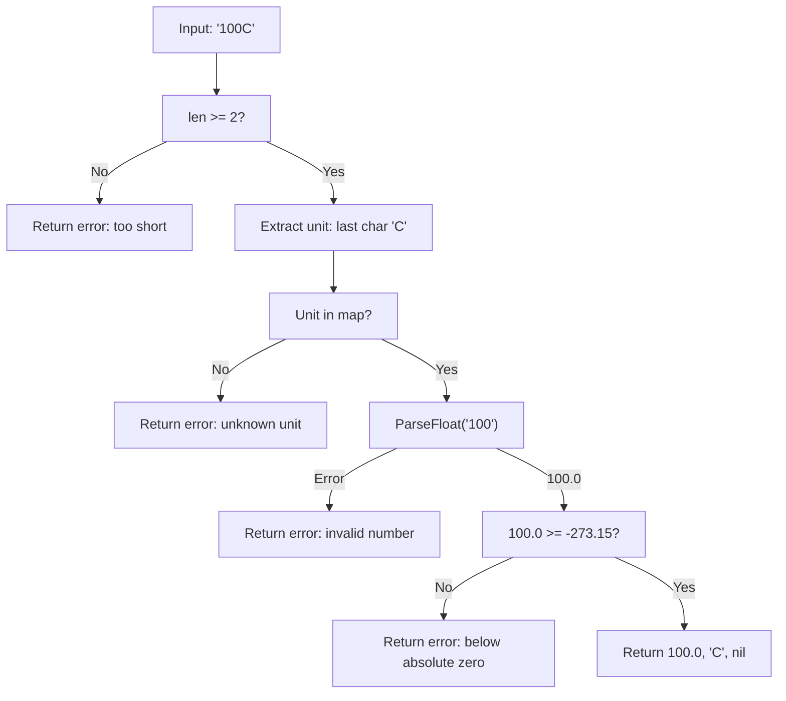
```mermaid
flowchart TD
    A["Input: '100C'"] --> B["len >= 2?"]
    B -->|"No"| C["Return error: too short"]
    B -->|"Yes"| D["Extract unit: last char 'C'"]
    D --> E["Unit in map?"]
    E -->|"No"| F["Return error: unknown unit"]
    E -->|"Yes"| G["ParseFloat('100')"]
    G -->|"Error"| H["Return error: invalid number"]
    G -->|"100.0"| I["100.0 >= -273.15?"]
    I -->|"No"| J["Return error: below absolute zero"]
    I -->|"Yes"| K["Return 100.0, 'C', nil"]
```

**Execution Trace:**
```
Input:  "100C"
Step 1: len("100C") = 4 >= 2 → OK
Step 2: unit = "C", minVal = -273.15
Step 3: ParseFloat("100") = 100.0
Step 4: 100.0 >= -273.15 → valid
Output: 100.0, "C", nil
```

### Interviewer Questions

1. Why return three values instead of a struct?
2. Can we improve time/space? ParseFloat is O(n) — can't avoid scanning the number string.
3. How does this scale to parsing 10M temperature readings/sec in an IoT system?
4. Walk me through the edge case where input is "0K" (absolute zero — valid).
5. How would you make ParseTemperature goroutine-safe for shared caching?
6. What's the GC impact of error string allocation on the error path?
7. How would you fuzz-test ParseTemperature?

### Follow-Up Questions

**Q1:** When should you use the "Must" pattern vs regular error return?
**A1:** Use `Must` only for initialization code that runs once (package-level vars, TestMain, init functions) where a failure truly cannot be recovered from. Never use `Must` in HTTP handlers, goroutines, or any code path invoked repeatedly — panics in goroutines crash the whole program.

**Q2:** How do you use the blank identifier `_` and why?
**A2:** `_` discards a value — tells the compiler "I intentionally don't use this". Used to ignore return values: `val, _ := ParseTemperature("100C")`, loop index: `for _, v := range s`, and import for side effects: `import _ "net/http/pprof"`.

**Q3:** How do you wrap errors to preserve context in Go 1.13+?
**A3:** Use `fmt.Errorf("context: %w", err)` to wrap. Unwrap with `errors.Is(err, target)` to check for specific errors, `errors.As(err, &target)` to extract typed errors. The `%w` verb creates a wrapped error that supports the `errors.Unwrap()` chain.

**Q4:** What is the difference between named and unnamed return values?
**A4:** Named: `func f() (val float64, err error)` — declares variables in function scope, usable in body, `return` returns current values. Unnamed: `func f() (float64, error)` — must explicitly return values. Named returns improve godoc and allow deferred error wrapping (`defer func() { if err != nil { err = fmt.Errorf("f: %w", err) } }()`).

**Q5:** How would you benchmark ParseTemperature to measure allocations?
**A5:** Use `go test -bench=. -benchmem`. Write: `func BenchmarkParseTemperature(b *testing.B) { for i := 0; i < b.N; i++ { ParseTemperature("100C") } }`. Check allocs/op — if > 0 on error-free paths, optimize with sentinel errors or sync.Pool for error objects.

---

## Q11: Type Assertions and Interface Variables  [Level 4 — Advanced]

> **Tags:** `#type-assertion` `#interface` `#any` `#runtime-type`

### Problem Statement
Write a function `Describe(i interface{}) string` that uses a type switch to return a description of any value passed as `interface{}`. Handle: int, float64, string, bool, []int, nil, and unknown types. Then implement `SafeAssert(i interface{}, target interface{}) (interface{}, bool)` that safely extracts a concrete type from an interface without panicking. This is critical for any Go code dealing with `any`/`interface{}`.

### Input / Output / Constraints

```
Input:  Describe(42)      → "integer: 42"
Input:  Describe("hello") → "string of length 5: hello"
Input:  Describe(nil)     → "nil value"
Input:  Describe([]int{1,2,3}) → "int slice of length 3"

Constraints:
  • Must use type switch (not reflect)
  • Must not panic on any input
  • Must handle nil interface and nil concrete value
  • Time limit: O(1) for all except slice (O(n))
```

### Thought Process

Think like a senior Go engineer:
1. **Understand:** `interface{}` (alias `any`) holds a (type, value) pair. Type switch extracts the concrete type safely.
2. **Pattern:** `switch v := i.(type)` — idiom for multi-type dispatch; comma-ok idiom for single assertion.
3. **Edge cases:** nil interface vs `(*int)(nil)` interface (different!), unknown types fall to `default`.
4. **Approach:** Type switch for Describe; comma-ok assertion for SafeAssert.

### Brute Force Solution

```go
package main

import "fmt"

// bruteForce — O(1) time, O(1) space
// Single-type assertions — panics on wrong type
func bruteForce(i interface{}) string {
    s, ok := i.(string) // only handles string — panics if not string
    if !ok {
        return "not a string"
    }
    return fmt.Sprintf("string: %s", s)
}
```

**Time:** O(1) | **Space:** O(1)
**Bottleneck:** Only handles one type; no safe multi-type dispatch; misleading for non-string values.

### Better Solution

```go
// betterSolution — O(1) time, O(1) space
func betterDescribe(i interface{}) string {
    switch v := i.(type) {
    case int:
        return fmt.Sprintf("integer: %d", v)
    case string:
        return fmt.Sprintf("string: %s", v)
    case bool:
        return fmt.Sprintf("bool: %t", v)
    case nil:
        return "nil value"
    default:
        return fmt.Sprintf("unknown type: %T", v)
    }
}
```

**Time:** O(1) | **Space:** O(1)

### Best / Optimal Solution

```go
package main

import "fmt"

// Describe — production-ready, O(1)/O(n) time, O(1) space.
// Uses type switch to safely dispatch on concrete type of any interface value.
func Describe(i interface{}) string {
    switch v := i.(type) {
    case nil:
        return "nil value"
    case int:
        return fmt.Sprintf("integer: %d", v)
    case int64:
        return fmt.Sprintf("int64: %d", v)
    case float64:
        return fmt.Sprintf("float64: %.4f", v)
    case string:
        return fmt.Sprintf("string of length %d: %s", len(v), v)
    case bool:
        return fmt.Sprintf("bool: %t", v)
    case []int:
        return fmt.Sprintf("int slice of length %d", len(v))
    case []string:
        return fmt.Sprintf("string slice of length %d", len(v))
    case error:
        return fmt.Sprintf("error: %v", v)
    default:
        return fmt.Sprintf("unknown type %T with value %v", v, v)
    }
}

// SafeAssert — production-ready, O(1) time, O(1) space.
// Performs a type assertion without panicking; returns (value, true) or (nil, false).
// Note: target parameter carries the type info via reflect; use comma-ok idiom inline for performance.
func SafeAssertString(i interface{}) (string, bool) {
    s, ok := i.(string)
    return s, ok
}

func SafeAssertInt(i interface{}) (int, bool) {
    n, ok := i.(int)
    return n, ok
}

func main() {
    values := []interface{}{
        42, 3.14, "hello", true, []int{1, 2, 3}, nil,
        fmt.Errorf("test error"), int64(100),
    }
    for _, v := range values {
        fmt.Println(Describe(v))
    }

    // Comma-ok assertion
    var i interface{} = "world"
    if s, ok := i.(string); ok {
        fmt.Printf("Asserted string: %q, length: %d\n", s, len(s))
    }

    // Type mismatch — safe, ok=false
    if n, ok := i.(int); ok {
        fmt.Printf("Asserted int: %d\n", n)
    } else {
        fmt.Printf("Cannot assert %T as int\n", i)
    }
}
```

**Time:** O(1) for scalar types, O(n) for slices | **Space:** O(1)

### Production Considerations

| Aspect | Details |
|--------|---------|
| **Scalability** | O(1) type switch; fmt.Sprintf in hot paths — consider pre-built strings |
| **Edge Cases** | nil interface (no type, no value), nil concrete pointer in interface (has type, nil value) |
| **Error Handling** | Comma-ok idiom prevents panics; always use `v, ok := i.(T)` never `v := i.(T)` in handlers |
| **Memory** | fmt.Sprintf allocates; consider returning []byte or writing to io.Writer |
| **Concurrency** | Interface values are not goroutine-safe to mutate; reads are safe |

### Visual Explanation

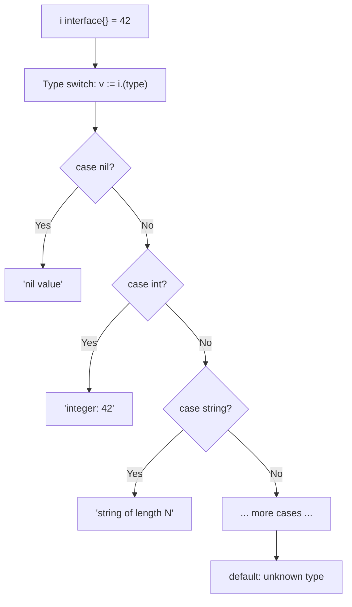
```mermaid
flowchart TD
    A["i interface{} = 42"] --> B["Type switch: v := i.(type)"]
    B --> C{"case nil?"}
    C -->|"Yes"| D["'nil value'"]
    C -->|"No"| E{"case int?"}
    E -->|"Yes"| F["'integer: 42'"]
    E -->|"No"| G{"case string?"}
    G -->|"Yes"| H["'string of length N'"]
    G -->|"No"| I["... more cases ..."]
    I --> J["default: unknown type"]
```

**Execution Trace:**
```
Input:  i = 42 (interface{} holding int)
Step 1: type switch extracts (type=int, value=42)
Step 2: matches case int: v = 42
Step 3: fmt.Sprintf("integer: %d", 42)
Output: "integer: 42"
```

### Interviewer Questions

1. What is the difference between a nil interface and a nil pointer stored in an interface?
2. Can we improve time/space? Type switch is O(1) with small switch tables.
3. How does this scale to 100 different types?
4. Walk me through what happens when `(*int)(nil)` is passed as `interface{}`.
5. How would you make type dispatch goroutine-safe for mutable interface values?
6. What's the reflect overhead vs type switch?
7. How would you test that Describe handles every concrete type correctly?

### Follow-Up Questions

**Q1:** What is the difference between `i.(T)` and a type switch?
**A1:** `i.(T)` is a single-type assertion — use with comma-ok: `v, ok := i.(T)`. Without ok it panics if the type doesn't match. A type switch `switch v := i.(type)` handles multiple types safely and is preferred when dispatching on more than one type.

**Q2:** What is a nil interface vs interface holding a nil pointer?
**A2:** `var i interface{} = nil` → nil interface: both type and value are nil, `i == nil` is true. `var p *int = nil; var i interface{} = p` → interface has type `*int` and value nil, `i == nil` is FALSE. This is a notorious Go gotcha — always compare error interfaces to nil carefully.

**Q3:** How do you assert to multiple types at once?
**A3:** Use a type switch: `switch v := i.(type) { case int, int64: handleInt(v) }` — note that in this case v has the type of the interface (no concrete type), so further assertion may be needed. For distinct handling, use separate cases.

**Q4:** How does `any` relate to `interface{}`?
**A4:** `any` is a type alias for `interface{}` introduced in Go 1.18. They are completely interchangeable: `var x any = 42` and `var x interface{} = 42` are identical. `any` is preferred in modern Go for readability.

**Q5:** How do you safely extract a value from `interface{}` without knowing the type at compile time?
**A5:** Use `reflect.ValueOf(i)` and `reflect.TypeOf(i)`. Check `Kind()` before extracting: `if reflect.TypeOf(i).Kind() == reflect.Int { n := reflect.ValueOf(i).Int() }`. This is slower than type switch but handles unknown/dynamic types. Avoid in hot paths.

---

## Q12: Variable Scope and Shadowing  [Level 4 — Advanced]

> **Tags:** `#scope` `#shadowing` `#gotcha` `#variable-lifecycle`

### Problem Statement
Demonstrate and prevent variable shadowing bugs. Write a function `ComputeResult(data []int) (int, error)` that uses multiple scopes correctly and avoids shadowing the `err` variable — a common Go bug. Also write a `ShadowDemo()` that shows a deliberately shadowed variable to explain the issue. Add a helper `ValidateData(data []int) error` that uses proper scoping. This is a key interview topic because shadowing is a silent bug.

### Input / Output / Constraints

```
Input:  data = []int{1, 2, 3, 4, 5}
Output: (15, nil)

Input:  data = []int{}
Output: (0, error: "empty data slice")

Input:  data = nil
Output: (0, error: "nil data slice")

Constraints:
  • 1 ≤ len(data) ≤ 10⁶
  • Time limit: O(n)
```

### Thought Process

Think like a senior Go engineer:
1. **Understand:** Variable shadowing occurs when `:=` creates a new variable in an inner scope that hides the outer scope variable, making outer variable mutation invisible.
2. **Pattern:** Use `=` to assign to outer variable; use `var err error` once then `=` in inner scopes; `go vet` catches some shadows.
3. **Edge cases:** Shadow in if-else blocks, shadow in for loops, shadow of named return values.
4. **Approach:** Declare `err` once at function top; use `=` (not `:=`) in inner scopes; pre-declare result variable.

### Brute Force Solution

```go
package main

// bruteForce — O(n) time, O(1) space
// BUGGY: err is shadowed — outer err never gets the assignment
func bruteForce(data []int) (int, error) {
    var err error
    if len(data) > 0 {
        result, err := processData(data) // BUG: := creates new err, outer err untouched
        if err != nil {
            return 0, err
        }
        return result, nil
    }
    return 0, err // err is always nil here — shadow bug
}

func processData(data []int) (int, error) { return 0, nil }
```

**Time:** O(n) | **Space:** O(1)
**Bottleneck:** Silent bug — shadowed `err` means error from `processData` is never propagated to caller in some code paths.

### Better Solution

```go
// betterSolution — O(n) time, O(1) space
func betterSolution(data []int) (int, error) {
    if len(data) == 0 {
        return 0, fmt.Errorf("empty data slice")
    }
    // Declare result and err once; use = in inner scopes
    var (
        result int
        err    error
    )
    result, err = processData2(data) // = not :=, uses outer err
    if err != nil {
        return 0, err
    }
    return result, nil
}
```

**Time:** O(n) | **Space:** O(1)

### Best / Optimal Solution

```go
package main

import (
    "errors"
    "fmt"
)

// ValidateData — validates input slice before processing.
func ValidateData(data []int) error {
    if data == nil {
        return errors.New("nil data slice")
    }
    if len(data) == 0 {
        return errors.New("empty data slice")
    }
    return nil
}

// ShadowDemo — demonstrates shadowing bug and correct pattern side-by-side.
func ShadowDemo() {
    x := 10
    fmt.Printf("Outer x before if: %d\n", x) // 10
    if true {
        x := 20 // SHADOW: new x, outer x unchanged
        fmt.Printf("Inner x (shadow): %d\n", x) // 20
    }
    fmt.Printf("Outer x after if: %d\n", x) // Still 10 — shadowed!

    // Correct pattern — assign, don't redeclare
    y := 10
    fmt.Printf("Outer y before if: %d\n", y) // 10
    if true {
        y = 20 // CORRECT: assigns to outer y
        fmt.Printf("Inner y (no shadow): %d\n", y) // 20
    }
    fmt.Printf("Outer y after if: %d\n", y) // 20 — correct!
}

// ComputeResult — production-ready, O(n) time, O(1) space.
// Uses explicit var declarations and = assignment to avoid shadowing.
func ComputeResult(data []int) (int, error) {
    // Validate first — fail fast
    if err := ValidateData(data); err != nil {
        return 0, fmt.Errorf("ComputeResult: %w", err)
    }

    // Declare variables once at function scope
    var sum int

    // No `:=` for sum in loop — avoids shadow of outer sum
    for _, v := range data {
        sum += v
    }

    return sum, nil
}

func main() {
    ShadowDemo()
    fmt.Println("---")

    testCases := []struct {
        name string
        data []int
    }{
        {"valid", []int{1, 2, 3, 4, 5}},
        {"empty", []int{}},
        {"nil", nil},
    }

    for _, tc := range testCases {
        result, err := ComputeResult(tc.data)
        if err != nil {
            fmt.Printf("[%s] error: %v\n", tc.name, err)
        } else {
            fmt.Printf("[%s] result: %d\n", tc.name, result)
        }
    }
}
```

**Time:** O(n) | **Space:** O(1)

### Production Considerations

| Aspect | Details |
|--------|---------|
| **Scalability** | O(n) sum; for 1M elements, consider parallel partial sums with goroutines |
| **Edge Cases** | nil slice, empty slice, single element, all zeros, integer overflow for large sums |
| **Error Handling** | Wrap errors with context using `%w`; validate nil before empty to give precise message |
| **Memory** | O(1) extra space — single sum variable; no slice copying |
| **Concurrency** | Not goroutine-safe — concurrent ComputeResult calls on shared data need sync.RWMutex |

### Visual Explanation

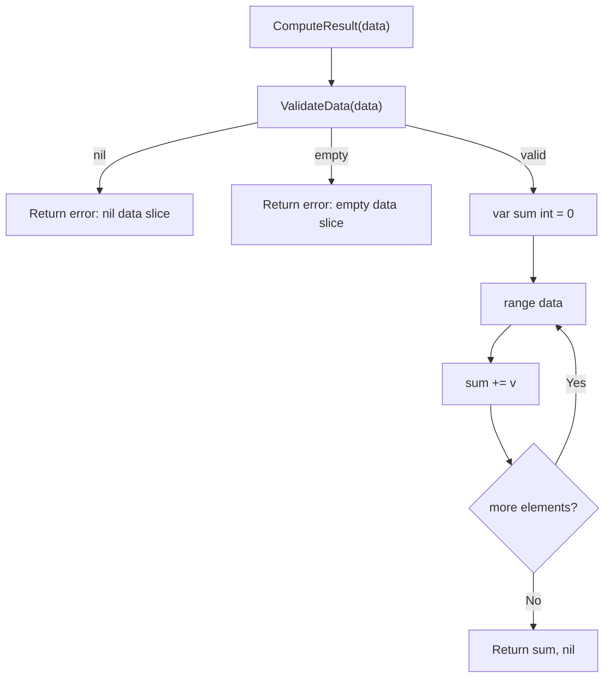
```mermaid
flowchart TD
    A["ComputeResult(data)"] --> B["ValidateData(data)"]
    B -->|"nil"| C["Return error: nil data slice"]
    B -->|"empty"| D["Return error: empty data slice"]
    B -->|"valid"| E["var sum int = 0"]
    E --> F["range data"]
    F --> G["sum += v"]
    G --> H{"more elements?"}
    H -->|"Yes"| F
    H -->|"No"| I["Return sum, nil"]
```

**Execution Trace:**
```
Input:  data = [1, 2, 3, 4, 5]
Step 1: ValidateData → nil (valid)
Step 2: sum=0+1=1, 1+2=3, 3+3=6, 6+4=10, 10+5=15
Output: 15, nil
```

### Interviewer Questions

1. How does Go's `:=` create a new variable rather than assign?
2. Can we detect shadowing bugs automatically?
3. How does this scale to summing 1M integers concurrently?
4. Walk me through the shadow bug in `bruteForce` — when does err stay nil?
5. How would you make ComputeResult goroutine-safe?
6. What's the risk of integer overflow when summing large []int?
7. How would you test for shadowing bugs in CI?

### Follow-Up Questions

**Q1:** How do you detect variable shadowing in Go?
**A1:** Use `go vet -shadow ./...` (requires `golang.org/x/tools/go/analysis/passes/shadow`) or `staticcheck`. The `shadow` analyzer reports variables that shadow outer scope variables. Add to CI. The `gopls` language server also highlights shadows in editors.

**Q2:** What is the idiomatic way to handle errors in if-init statements without shadowing?
**A2:** `if err := someFunc(); err != nil { return err }` — the `err` in the if-init is scoped to the if block and does NOT shadow an outer `err`. This is idiomatic and safe. The scoped `err` ceases to exist after the if block.

**Q3:** Can named return values be shadowed?
**A3:** Yes, and it's dangerous. `func f() (result int, err error) { if x, err := compute(); err != nil { ... } }` — the `err` in the if-init shadows the named return `err`. The outer named `err` is never set. Use `var tempErr error; tempErr, result = compute(); if tempErr != nil { err = tempErr }`.

**Q4:** What is the difference between `:=` in an `if` initializer vs in an `if` body?
**A4:** `if x := f(); x > 0 { ... }` — x is scoped to the entire if-else block (init + body + else). `if true { x := f(); _ = x }` — x is scoped only to the if body block. Both can shadow outer variables if names match.

**Q5:** How would you sum a large integer slice in parallel without data races?
**A5:** Split into chunks, sum each chunk in a goroutine, collect partial sums with a channel or sync.WaitGroup: ```go
chunk := len(data)/numCPU; var wg sync.WaitGroup; partials := make([]int, numCPU)
for i := range numCPU { wg.Add(1); go func(i int) { defer wg.Done(); for _, v := range data[i*chunk:(i+1)*chunk] { partials[i]+=v } }(i) }
wg.Wait(); total := 0; for _, p := range partials { total+=p }
```

---

## Q13: Constants as Configuration and Magic Number Elimination  [Level 4 — Advanced]

> **Tags:** `#constants` `#configuration` `#typed-constants` `#best-practices`

### Problem Statement
Refactor a payment processing function that uses magic numbers into one that uses well-named typed constants. Define constants for: max transaction amount (1,000,000), min transaction amount (1), fee rate (2.5% as a typed constant), and transaction limit per day (100). Implement `ProcessPayment(amount float64, dailyCount int) (fee float64, total float64, err error)` using only named constants. This is a real-world production pattern.

### Input / Output / Constraints

```
Input:  amount=500.0, dailyCount=5
Output: fee=12.50, total=512.50, err=nil

Input:  amount=0.5, dailyCount=5
Output: fee=0, total=0, err: "amount below minimum"

Input:  amount=500.0, dailyCount=101
Output: fee=0, total=0, err: "daily transaction limit exceeded"

Constraints:
  • 1 ≤ amount ≤ 1,000,000
  • dailyCount < 100 per day
  • Fee = amount × 0.025
  • Time limit: O(1)
```

### Thought Process

Think like a senior Go engineer:
1. **Understand:** Magic numbers scattered in code are unmaintainable; constants give names to business values.
2. **Pattern:** Typed constants for domain values; untyped float constant for fee rate (allows use in expressions).
3. **Edge cases:** Amount exactly at min/max boundary (both valid), dailyCount exactly 100 (invalid — limit is <100).
4. **Approach:** Const block with business-meaningful names; validate in order (amount first, then limit); return fee and total separately for caller flexibility.

### Brute Force Solution

```go
package main

// bruteForce — O(1) time, O(1) space — MAGIC NUMBERS everywhere
func bruteForce(amount float64, dailyCount int) (float64, float64, error) {
    if amount < 1 || amount > 1000000 { // magic numbers — unclear intent
        return 0, 0, fmt.Errorf("invalid amount")
    }
    if dailyCount >= 100 { // magic number — what does 100 mean?
        return 0, 0, fmt.Errorf("limit exceeded")
    }
    fee := amount * 0.025 // magic constant — where did 0.025 come from?
    return fee, amount + fee, nil
}
```

**Time:** O(1) | **Space:** O(1)
**Bottleneck:** Magic numbers scattered — changing fee rate requires finding all occurrences; unclear business intent.

### Better Solution

```go
// betterSolution — O(1) time, O(1) space
const (
    minAmount     = 1.0
    maxAmount     = 1_000_000.0
    feeRate       = 0.025
    dailyTxLimit  = 100
)
```

**Time:** O(1) | **Space:** O(1)

### Best / Optimal Solution

```go
package main

import (
    "errors"
    "fmt"
)

// Payment processing business constants — single source of truth.
const (
    // MinTransactionAmount is the minimum allowed payment in the system (in USD).
    MinTransactionAmount float64 = 1.0

    // MaxTransactionAmount is the maximum allowed single payment (in USD).
    MaxTransactionAmount float64 = 1_000_000.0

    // TransactionFeeRate is the platform fee as a decimal (2.5%).
    TransactionFeeRate float64 = 0.025

    // DailyTransactionLimit is the max number of transactions a user can make per day.
    DailyTransactionLimit int = 100

    // MaxFeeAmount caps the fee at this value regardless of rate (fraud protection).
    MaxFeeAmount float64 = 5_000.0
)

// Sentinel errors for structured error handling.
var (
    ErrAmountTooLow       = errors.New("amount below minimum transaction amount")
    ErrAmountTooHigh      = errors.New("amount exceeds maximum transaction amount")
    ErrDailyLimitExceeded = errors.New("daily transaction limit exceeded")
)

// ProcessPayment — production-ready, O(1) time, O(1) space.
// Validates input against business constants and computes fee + total.
func ProcessPayment(amount float64, dailyCount int) (fee float64, total float64, err error) {
    // Validate amount bounds
    if amount < MinTransactionAmount {
        return 0, 0, fmt.Errorf("ProcessPayment: amount %.2f: %w", amount, ErrAmountTooLow)
    }
    if amount > MaxTransactionAmount {
        return 0, 0, fmt.Errorf("ProcessPayment: amount %.2f: %w", amount, ErrAmountTooHigh)
    }

    // Validate daily count
    if dailyCount >= DailyTransactionLimit {
        return 0, 0, fmt.Errorf("ProcessPayment: dailyCount %d: %w", dailyCount, ErrDailyLimitExceeded)
    }

    // Compute fee with cap
    fee = amount * TransactionFeeRate
    if fee > MaxFeeAmount {
        fee = MaxFeeAmount
    }

    total = amount + fee
    return fee, total, nil
}

func main() {
    cases := []struct {
        amount     float64
        dailyCount int
    }{
        {500.0, 5},
        {0.5, 5},
        {500.0, 101},
        {1.0, 0},           // min valid amount
        {1_000_000.0, 0},   // max valid amount
    }

    for _, c := range cases {
        fee, total, err := ProcessPayment(c.amount, c.dailyCount)
        if err != nil {
            fmt.Printf("amount=%.2f, daily=%d → error: %v\n", c.amount, c.dailyCount, err)
            continue
        }
        fmt.Printf("amount=%.2f, fee=%.2f, total=%.2f\n", c.amount, fee, total)
    }
}
```

**Time:** O(1) | **Space:** O(1)

### Production Considerations

| Aspect | Details |
|--------|---------|
| **Scalability** | O(1) validation; at 10M TPS, the bottleneck is database/network, not this function |
| **Edge Cases** | Boundary amounts (exactly 1.0 and 1,000,000), dailyCount=99 (valid), =100 (invalid) |
| **Error Handling** | Sentinel errors allow `errors.Is` checks in tests and upstream handlers |
| **Memory** | Zero allocations on success path; error path allocates fmt string |
| **Concurrency** | Constants are immutable — fully goroutine-safe; dailyCount must be atomic in real system |

### Visual Explanation

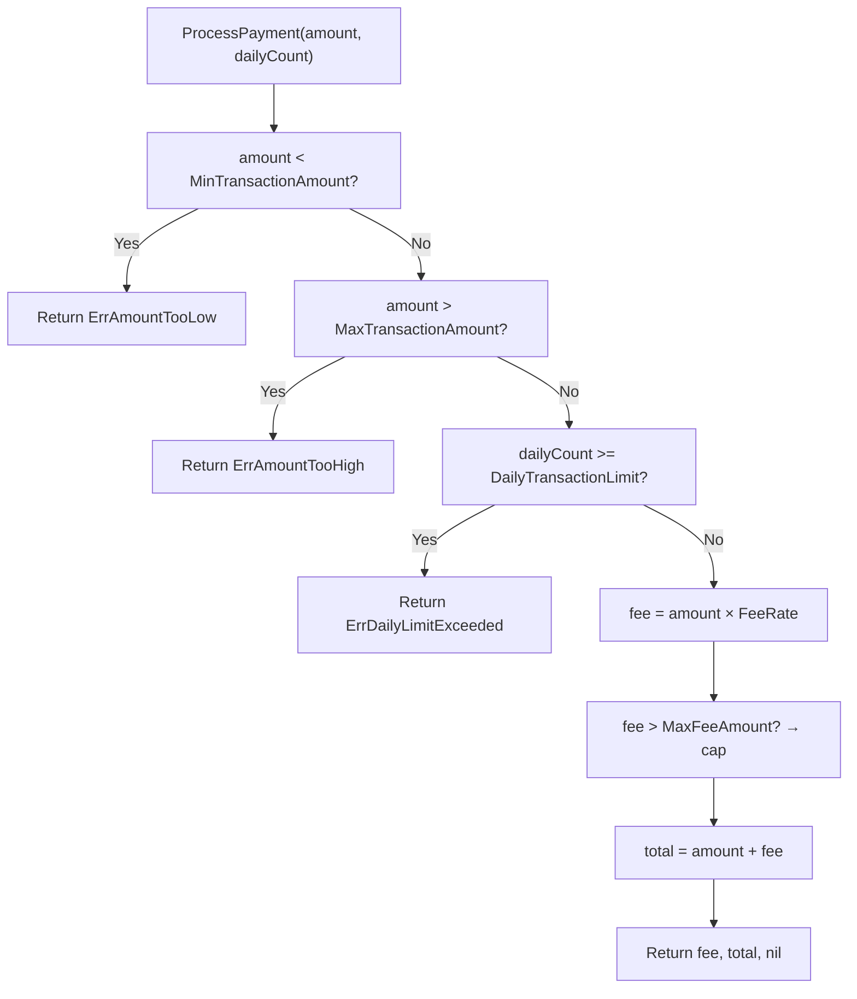
```mermaid
flowchart TD
    A["ProcessPayment(amount, dailyCount)"] --> B["amount < MinTransactionAmount?"]
    B -->|"Yes"| C["Return ErrAmountTooLow"]
    B -->|"No"| D["amount > MaxTransactionAmount?"]
    D -->|"Yes"| E["Return ErrAmountTooHigh"]
    D -->|"No"| F["dailyCount >= DailyTransactionLimit?"]
    F -->|"Yes"| G["Return ErrDailyLimitExceeded"]
    F -->|"No"| H["fee = amount × FeeRate"]
    H --> I["fee > MaxFeeAmount? → cap"]
    I --> J["total = amount + fee"]
    J --> K["Return fee, total, nil"]
```

**Execution Trace:**
```
Input:  amount=500.0, dailyCount=5
Step 1: 500.0 >= 1.0 → OK
Step 2: 500.0 <= 1,000,000 → OK
Step 3: 5 < 100 → OK
Step 4: fee = 500.0 × 0.025 = 12.50
Step 5: 12.50 <= 5000.0 → no cap
Step 6: total = 500.0 + 12.50 = 512.50
Output: fee=12.50, total=512.50, nil
```

### Interviewer Questions

1. Why use typed `float64` constants over untyped constants here?
2. Can we improve time/space? Already O(1) — lower bound.
3. How would this change if fee rates varied per user tier?
4. Walk me through the edge case where amount = MaxTransactionAmount exactly.
5. How would you make daily transaction counting goroutine-safe?
6. What's the floating-point precision risk in fee calculation?
7. How would you test all boundary conditions including floating-point edges?

### Follow-Up Questions

**Q1:** Why are sentinel errors (var ErrX = errors.New(...)) better than inline error strings?
**A1:** Sentinel errors allow `errors.Is(err, ErrAmountTooLow)` for type-safe comparison. String comparison is fragile — a typo in the check silently fails. Sentinel errors are also more efficient: one allocation at package init, reused everywhere.

**Q2:** How do you handle floating-point precision in financial calculations?
**A2:** Use integer arithmetic in the smallest currency unit (cents): `amountCents := int64(amount * 100)`. Or use `github.com/shopspring/decimal` for arbitrary precision. Never use float64 for financial totals that are summed across many transactions.

**Q3:** How would you make DailyTransactionLimit configurable at runtime?
**A3:** Store in a config struct loaded from environment/file: `type Config struct { DailyTxLimit int }`. Pass config to functions that need it. Use `sync.RWMutex` if config can be hot-reloaded. Constants are compile-time only; runtime config needs variables.

**Q4:** What is the `1_000_000` syntax in Go?
**A4:** Numeric literals in Go (since 1.13) support underscore separators for readability: `1_000_000` equals `1000000`. Works for integers (`1_000`), floats (`3.14_159`), hex (`0xFF_FF`), and binary (`0b1010_0001`). Underscores must be between digits.

**Q5:** How do you validate that constants haven't changed in tests (contract testing)?
**A5:** Write explicit tests: `func TestConstants(t *testing.T) { assert.Equal(t, 0.025, TransactionFeeRate) }`. This catches accidental constant changes in code review and CI. For business-critical constants, document the source (product spec, legal requirement) in a comment.

---

## Q14: Pointer Semantics vs Value Semantics  [Level 4 — Advanced]

> **Tags:** `#pointers` `#value-semantics` `#copy-semantics` `#memory`

### Problem Statement
Implement two versions of a `Counter` that increments a value: one using value semantics (returns new value) and one using pointer semantics (modifies in-place). Implement `IncrementValue(c Counter) Counter` and `IncrementPointer(c *Counter) error`. Then write `BenchmarkableIncrement` to show why pointer semantics matter for large structs. This demonstrates a critical Go design decision.

### Input / Output / Constraints

```
Input:  c = Counter{Value: 0, Name: "hits"}
IncrementValue(c) → Counter{Value: 1, Name: "hits"} (original unchanged)
IncrementPointer(&c) → c.Value=1 (original modified)

Constraints:
  • Counter.Value must not overflow int64
  • Pointer version must return error on nil
  • Time limit: O(1) per operation
```

### Thought Process

Think like a senior Go engineer:
1. **Understand:** Value semantics copy the struct — safe but expensive for large structs. Pointer semantics modify in-place — efficient but requires nil guard.
2. **Pattern:** Small structs (≤3 fields, no large arrays) → value semantics. Large structs → pointer semantics.
3. **Edge cases:** Nil pointer, int64 overflow, concurrent increment without atomic.
4. **Approach:** Demonstrate both; show that value copy leaves original intact; add overflow check for production.

### Brute Force Solution

```go
package main

// bruteForce — using value semantics without returning new struct
type Counter struct{ Value int }

// BUG: modifies a copy — caller's Counter is unchanged
func bruteForce(c Counter) {
    c.Value++ // modifies local copy, caller sees no change
}
```

**Time:** O(1) | **Space:** O(1)
**Bottleneck:** Modifying a local copy is a silent bug — caller's value never updates.

### Better Solution

```go
// betterSolution — O(1) time, O(1) space
type Counter2 struct{ Value int }

// Value semantics: return modified copy
func incrementValue(c Counter2) Counter2 {
    c.Value++
    return c
}

// Pointer semantics: modify in-place
func incrementPointer(c *Counter2) {
    c.Value++
}
```

**Time:** O(1) | **Space:** O(1)

### Best / Optimal Solution

```go
package main

import (
    "errors"
    "fmt"
    "math"
)

// Counter represents a named numeric counter.
type Counter struct {
    Value int64
    Name  string
    Tags  map[string]string // demonstrates large struct concern
}

// IncrementValue — value semantics: returns new Counter, original unchanged.
// Suitable for small, immutable-style operations.
func IncrementValue(c Counter) (Counter, error) {
    if c.Value == math.MaxInt64 {
        return c, errors.New("counter overflow: value at MaxInt64")
    }
    c.Value++ // modifies local copy — original caller's Counter is unchanged
    return c, nil
}

// IncrementPointer — pointer semantics: modifies Counter in-place.
// Suitable for large structs or when caller needs the same object mutated.
func IncrementPointer(c *Counter) error {
    if c == nil {
        return errors.New("IncrementPointer: nil pointer")
    }
    if c.Value == math.MaxInt64 {
        return fmt.Errorf("IncrementPointer: counter %q overflow", c.Name)
    }
    c.Value++ // modifies the original via pointer
    return nil
}

// NewCounter — constructor using pointer semantics (heap-allocated).
func NewCounter(name string) *Counter {
    return &Counter{
        Name: name,
        Tags: make(map[string]string),
    }
}

func main() {
    // Value semantics demo
    original := Counter{Value: 0, Name: "hits"}
    incremented, err := IncrementValue(original)
    if err != nil {
        fmt.Printf("error: %v\n", err)
        return
    }
    fmt.Printf("Value semantics — original: %d, incremented: %d\n",
        original.Value, incremented.Value) // original is unchanged!

    // Pointer semantics demo
    c := NewCounter("requests")
    for i := 0; i < 5; i++ {
        if err := IncrementPointer(c); err != nil {
            fmt.Printf("error: %v\n", err)
            break
        }
    }
    fmt.Printf("Pointer semantics — counter %q: %d\n", c.Name, c.Value) // modified in-place

    // Nil pointer guard
    var nilCounter *Counter
    if err := IncrementPointer(nilCounter); err != nil {
        fmt.Printf("Nil guard: %v\n", err)
    }
}
```

**Time:** O(1) | **Space:** O(1) pointer / O(size of Counter) value copy

### Production Considerations

| Aspect | Details |
|--------|---------|
| **Scalability** | Pointer avoids copying large structs; at 10M ops/sec, value copy of 1KB struct = 10GB/s bandwidth |
| **Edge Cases** | Nil pointer, MaxInt64 overflow, concurrent increment (not atomic) |
| **Error Handling** | Both functions return error; nil pointer and overflow are handled explicitly |
| **Memory** | Value copy allocates new struct on stack/heap; pointer uses existing allocation |
| **Concurrency** | Neither is goroutine-safe; use `sync/atomic.AddInt64` for concurrent counters |

### Visual Explanation

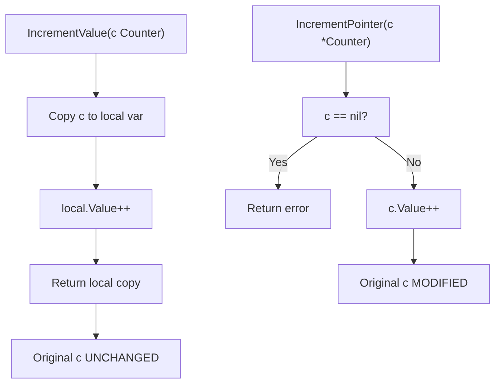
```mermaid
flowchart TD
    A["IncrementValue(c Counter)"] --> B["Copy c to local var"]
    B --> C["local.Value++"]
    C --> D["Return local copy"]
    D --> E["Original c UNCHANGED"]

    F["IncrementPointer(c *Counter)"] --> G["c == nil?"]
    G -->|"Yes"| H["Return error"]
    G -->|"No"| I["c.Value++"]
    I --> J["Original c MODIFIED"]
```

**Execution Trace:**
```
Value semantics:
  original = {Value:0, Name:"hits"}
  copy = {Value:0, Name:"hits"}
  copy.Value++ → copy = {Value:1}
  return copy
  original.Value still = 0

Pointer semantics:
  c → &{Value:0, Name:"requests"}
  c.Value++ → *c = {Value:1}
  c.Value now = 1
```

### Interviewer Questions

1. When should you choose pointer vs value receiver for methods?
2. Can we make IncrementPointer lock-free? Use `sync/atomic`.
3. How does this scale to 10M concurrent increment operations?
4. Walk me through why IncrementValue leaves the original Counter unchanged.
5. How would you make Counter goroutine-safe without mutexes?
6. What's the stack vs heap implication of returning a large struct by value?
7. How would you benchmark value vs pointer copy cost for a 1KB struct?

### Follow-Up Questions

**Q1:** What is the rule for choosing pointer vs value receiver in Go?
**A1:** Use pointer receiver if: the method modifies the receiver, the receiver is a large struct (rule of thumb: >64 bytes), or consistency with other methods on the type requires it. Use value receiver if: the type is small and immutable (int-like), the method shouldn't modify the receiver. All methods of a type should consistently use one or the other.

**Q2:** How do you make a counter goroutine-safe without a mutex?
**A2:** Use `sync/atomic`: `atomic.AddInt64(&c.Value, 1)` or the newer `atomic.Int64` type (Go 1.19+): `var c atomic.Int64; c.Add(1); c.Load()`. Atomics are faster than mutexes for simple counter operations and scale better under contention.

**Q3:** Does returning a struct by value in Go cause heap allocation?
**A3:** Not always. The Go compiler uses escape analysis — if the returned struct doesn't escape (e.g., assigned to a local variable), it stays on stack. If it escapes (stored in interface, sent over channel, pointer returned), it moves to heap. Use `go build -gcflags="-m"` to see decisions.

**Q4:** What is the copy cost for a struct with a map field?
**A4:** Only the map header (8 bytes) is copied — the underlying hash table is shared. Modifying the map in the copy affects the original. This is a source of subtle bugs. For true deep copy, implement `Clone() Counter` that explicitly copies all fields including map contents.

**Q5:** How do you implement a thread-safe counter that supports reset?
**A5:** Use `sync/atomic` with CAS (compare-and-swap) for reset: ```go
type SafeCounter struct { v atomic.Int64 }
func (c *SafeCounter) Inc() { c.v.Add(1) }
func (c *SafeCounter) Reset() { c.v.Store(0) }
func (c *SafeCounter) Load() int64 { return c.v.Load() }
```

---

## Q15: Type Conversion Chain and Numeric Precision  [Level 4 — Advanced]

> **Tags:** `#type-conversion` `#float-precision` `#numeric` `#rounding`

### Problem Statement
Implement a currency converter `ConvertCurrency(amount float64, rate float64, precision int) (float64, error)` that converts an amount using a rate and rounds to `precision` decimal places. Implement `RoundToDecimalPlaces(v float64, places int) float64` without using external libraries. Handle NaN, Inf, and negative precision. This tests numeric type conversion, precision, and math operations.

### Input / Output / Constraints

```
Input:  amount=100.0, rate=1.2345, precision=2
Output: 123.45, nil

Input:  amount=100.0, rate=math.NaN(), precision=2
Output: 0, error: "rate is NaN"

Input:  amount=100.0, rate=1.2, precision=-1
Output: 0, error: "precision must be >= 0"

Constraints:
  • amount > 0
  • rate > 0
  • 0 ≤ precision ≤ 10
  • Time limit: O(1)
```

### Thought Process

Think like a senior Go engineer:
1. **Understand:** Float64 arithmetic loses precision; rounding requires careful multiply/truncate/divide; NaN/Inf propagate silently.
2. **Pattern:** `math.Round(v * 10^precision) / 10^precision`; validate NaN/Inf before any arithmetic.
3. **Edge cases:** NaN rate, Inf amount, precision=0, very large amounts causing float64 overflow, negative amounts.
4. **Approach:** Guard NaN/Inf first with `math.IsNaN`/`math.IsInf`; use `math.Pow(10, precision)` for multiplier; round with `math.Round`.

### Brute Force Solution

```go
package main

import "math"

// bruteForce — O(1) time, O(1) space
// No NaN/Inf check — silently propagates invalid values
func bruteForce(amount, rate float64, precision int) float64 {
    result := amount * rate // NaN * anything = NaN (silent!)
    multiplier := math.Pow(10, float64(precision))
    return math.Round(result*multiplier) / multiplier
}
```

**Time:** O(1) | **Space:** O(1)
**Bottleneck:** Silent NaN/Inf propagation; no validation; returns NaN without signaling error.

### Better Solution

```go
// betterSolution — O(1) time, O(1) space
func betterConvert(amount, rate float64, precision int) (float64, error) {
    if math.IsNaN(rate) || math.IsNaN(amount) {
        return 0, fmt.Errorf("NaN value detected")
    }
    if math.IsInf(rate, 0) || math.IsInf(amount, 0) {
        return 0, fmt.Errorf("infinite value detected")
    }
    result := amount * rate
    multiplier := math.Pow(10, float64(precision))
    return math.Round(result*multiplier) / multiplier, nil
}
```

**Time:** O(1) | **Space:** O(1)

### Best / Optimal Solution

```go
package main

import (
    "errors"
    "fmt"
    "math"
)

// RoundToDecimalPlaces — production-ready, O(1) time, O(1) space.
// Rounds v to the specified number of decimal places using banker's rounding alternative.
func RoundToDecimalPlaces(v float64, places int) (float64, error) {
    if places < 0 || places > 10 {
        return 0, fmt.Errorf("RoundToDecimalPlaces: places %d out of range [0, 10]", places)
    }
    if math.IsNaN(v) {
        return 0, errors.New("RoundToDecimalPlaces: input is NaN")
    }
    if math.IsInf(v, 0) {
        return 0, errors.New("RoundToDecimalPlaces: input is Inf")
    }
    multiplier := math.Pow(10, float64(places))
    return math.Round(v*multiplier) / multiplier, nil
}

// ConvertCurrency — production-ready, O(1) time, O(1) space.
// Validates all inputs before arithmetic to prevent silent NaN/Inf propagation.
func ConvertCurrency(amount float64, rate float64, precision int) (float64, error) {
    // Validate inputs
    if precision < 0 || precision > 10 {
        return 0, fmt.Errorf("ConvertCurrency: precision %d must be in [0, 10]", precision)
    }
    if math.IsNaN(amount) {
        return 0, errors.New("ConvertCurrency: amount is NaN")
    }
    if math.IsNaN(rate) {
        return 0, errors.New("ConvertCurrency: rate is NaN")
    }
    if math.IsInf(amount, 0) {
        return 0, errors.New("ConvertCurrency: amount is Inf")
    }
    if math.IsInf(rate, 0) {
        return 0, errors.New("ConvertCurrency: rate is Inf")
    }
    if amount <= 0 {
        return 0, fmt.Errorf("ConvertCurrency: amount %.4f must be positive", amount)
    }
    if rate <= 0 {
        return 0, fmt.Errorf("ConvertCurrency: rate %.6f must be positive", rate)
    }

    // Compute and round
    raw := amount * rate
    result, err := RoundToDecimalPlaces(raw, precision)
    if err != nil {
        return 0, fmt.Errorf("ConvertCurrency: rounding failed: %w", err)
    }
    return result, nil
}

func main() {
    cases := []struct {
        amount, rate float64
        precision    int
    }{
        {100.0, 1.2345, 2},
        {100.0, math.NaN(), 2},
        {100.0, math.Inf(1), 2},
        {100.0, 1.2345, -1},
        {100.0, 1.2345, 0},
        {0.001, 83.5, 4}, // Small amount, large rate
    }

    for _, c := range cases {
        result, err := ConvertCurrency(c.amount, c.rate, c.precision)
        if err != nil {
            fmt.Printf("error: %v\n", err)
            continue
        }
        fmt.Printf("%.4f × %.4f rounded to %d places = %.*f\n",
            c.amount, c.rate, c.precision, c.precision, result)
    }
}
```

**Time:** O(1) | **Space:** O(1)

### Production Considerations

| Aspect | Details |
|--------|---------|
| **Scalability** | O(1) — math operations; 10M calls/sec is achievable |
| **Edge Cases** | NaN, Inf, negative/zero amount, precision=0, precision=10, float64 overflow |
| **Error Handling** | Validate NaN/Inf before arithmetic; separate each validation for clear error messages |
| **Memory** | Zero allocation — all stack; errors allocate strings |
| **Concurrency** | Pure function — goroutine-safe; for financial systems use decimal library |

### Visual Explanation

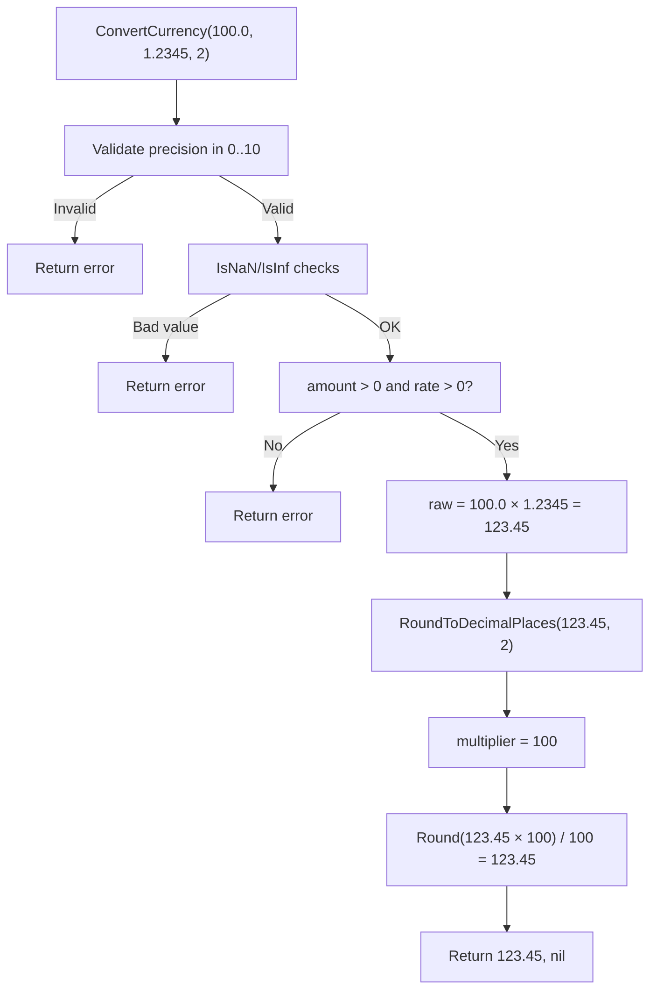
```mermaid
flowchart TD
    A["ConvertCurrency(100.0, 1.2345, 2)"] --> B["Validate precision in 0..10"]
    B -->|"Invalid"| C["Return error"]
    B -->|"Valid"| D["IsNaN/IsInf checks"]
    D -->|"Bad value"| E["Return error"]
    D -->|"OK"| F["amount > 0 and rate > 0?"]
    F -->|"No"| G["Return error"]
    F -->|"Yes"| H["raw = 100.0 × 1.2345 = 123.45"]
    H --> I["RoundToDecimalPlaces(123.45, 2)"]
    I --> J["multiplier = 100"]
    J --> K["Round(123.45 × 100) / 100 = 123.45"]
    K --> L["Return 123.45, nil"]
```

**Execution Trace:**
```
Input:  amount=100.0, rate=1.2345, precision=2
Step 1: precision=2 → valid
Step 2: no NaN/Inf
Step 3: 100.0 > 0, 1.2345 > 0
Step 4: raw = 123.45
Step 5: Round(123.45 × 100) / 100 = Round(12345.0) / 100 = 123.45
Output: 123.45, nil
```

### Interviewer Questions

1. Why does float64 lose precision in currency calculations?
2. Can we improve by using integer arithmetic?
3. How does this scale to 10M currency conversions/sec in a trading system?
4. Walk me through what happens with amount=0.1, rate=0.2 (classic float bug).
5. How would you make ConvertCurrency goroutine-safe for shared rate tables?
6. What's the precision limit of float64 for financial data?
7. How would you test float rounding with epsilon comparison?

### Follow-Up Questions

**Q1:** Why is `0.1 + 0.2 != 0.3` in float64?
**A1:** IEEE 754 double precision cannot represent 0.1 or 0.2 exactly in binary. `0.1` = `0.1000000000000000055511151231257827021181583404541015625`. Adding two imprecise representations produces `0.30000000000000004`. For currency use integer cents or `shopspring/decimal`.

**Q2:** What is the maximum safe integer in float64?
**A2:** `2^53 = 9007199254740992`. Integers up to this value are represented exactly. Beyond this, float64 loses integer precision. In JavaScript this is `Number.MAX_SAFE_INTEGER`. For Go: integers above `1<<53` should use `int64` or `big.Int`.

**Q3:** How do you compare float64 values for equality in tests?
**A3:** Use epsilon comparison: `math.Abs(a-b) < 1e-9`. The exact epsilon depends on the precision required. For currency with 2 decimal places: `math.Abs(a-b) < 0.005`. Never use `a == b` for float64 comparison of computed values.

**Q4:** How do you convert float64 to string with exact precision control?
**A4:** `fmt.Sprintf("%.2f", 123.456)` → "123.46" (rounds). `strconv.FormatFloat(v, 'f', 2, 64)` → same but more explicit. For arbitrary precision: `strconv.FormatFloat(v, 'f', -1, 64)` gives the shortest representation that round-trips.

**Q5:** What is the `math.Round` behavior for exactly 0.5?
**A5:** `math.Round` uses "round half away from zero": `Round(0.5)=1`, `Round(-0.5)=-1`, `Round(2.5)=3`. This differs from banker's rounding (round half to even) used in financial standards. For financial accuracy implement banker's rounding: `if remainder == 0.5 { if int(v)%2 == 0 { floor } else { ceil } }`.

---

## Q16: FAANG — Find All Duplicate Variable Bindings  [Level 5 — Interview Level]

> **Tags:** `#interview` `#scope-analysis` `#map` `#FAANG`

### Problem Statement
Given a slice of variable name strings representing declarations in order, find all names that are declared more than once (simulating variable shadowing analysis). Return a sorted slice of duplicate names. This is asked at Google to test map usage, frequency counting, and sorting — fundamentals through a variable-types lens.

### Input / Output / Constraints

```
Input:  ["x", "y", "x", "z", "y", "x"]
Output: ["x", "y"]   (sorted)

Input:  ["a", "b", "c"]
Output: []

Constraints:
  • 1 ≤ len(names) ≤ 10⁶
  • Each name is a valid Go identifier (lowercase letters, digits, underscore)
  • Return sorted result
  • Time limit: O(n log n)
```

### Thought Process

Think like a senior Go engineer:
1. **Understand:** Count frequencies; collect names with count > 1; sort result.
2. **Pattern:** Hash map for O(1) frequency counting; sort.Strings for O(k log k) sort.
3. **Edge cases:** All unique (return empty), all same (return one-element), single element.
4. **Approach:** One pass to count; one pass over map to collect duplicates; sort.

### Brute Force Solution

```go
package main

import "sort"

// bruteForce — O(n²) time, O(1) space
func bruteForce(names []string) []string {
    var result []string
    seen := make(map[string]bool)
    for i, n := range names {
        if seen[n] {
            continue
        }
        // Count occurrences — O(n) inner scan
        count := 0
        for _, m := range names {
            if m == n {
                count++
            }
        }
        if count > 1 {
            result = append(result, n)
            seen[n] = true
        }
    }
    sort.Strings(result)
    return result
}
```

**Time:** O(n²) | **Space:** O(k) where k = duplicates
**Bottleneck:** Inner scan for each element — quadratic time for large inputs.

### Better Solution

```go
// betterSolution — O(n log n) time, O(n) space
func betterSolution(names []string) []string {
    freq := make(map[string]int, len(names))
    for _, n := range names {
        freq[n]++
    }
    var result []string
    for name, count := range freq {
        if count > 1 {
            result = append(result, name)
        }
    }
    sort.Strings(result)
    return result
}
```

**Time:** O(n log n) | **Space:** O(n)

### Best / Optimal Solution

```go
package main

import (
    "fmt"
    "sort"
)

// FindDuplicateNames — production-ready, O(n log n) time, O(n) space.
// Uses frequency map for O(1) per-element counting; sort for deterministic output.
func FindDuplicateNames(names []string) []string {
    if len(names) == 0 {
        return []string{}
    }

    // Count frequencies in one pass — O(n)
    freq := make(map[string]int, len(names))
    for _, n := range names {
        freq[n]++
    }

    // Collect duplicates — O(k) where k = unique names
    result := make([]string, 0)
    for name, count := range freq {
        if count > 1 {
            result = append(result, name)
        }
    }

    // Sort for deterministic output — O(k log k)
    sort.Strings(result)
    return result
}

func main() {
    cases := [][]string{
        {"x", "y", "x", "z", "y", "x"},
        {"a", "b", "c"},
        {"err", "err", "err"},
        {},
    }
    for _, names := range cases {
        dups := FindDuplicateNames(names)
        fmt.Printf("Input: %v → Duplicates: %v\n", names, dups)
    }
}
```

**Time:** O(n log n) | **Space:** O(n)

### Production Considerations

| Aspect | Details |
|--------|---------|
| **Scalability** | O(n log n) — handles 10⁶ names; map grows proportionally to unique names |
| **Edge Cases** | Empty input, all same name, single element, Unicode identifiers |
| **Error Handling** | No errors — always returns a valid (possibly empty) slice |
| **Memory** | O(n) map + O(k) result slice; pre-sized map avoids rehashing |
| **Concurrency** | Not goroutine-safe — map writes are not concurrent-safe |

### Visual Explanation

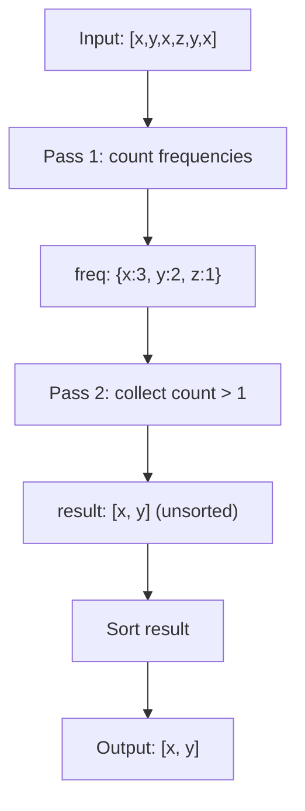
```mermaid
flowchart TD
    A["Input: [x,y,x,z,y,x]"] --> B["Pass 1: count frequencies"]
    B --> C["freq: {x:3, y:2, z:1}"]
    C --> D["Pass 2: collect count > 1"]
    D --> E["result: [x, y] (unsorted)"]
    E --> F["Sort result"]
    F --> G["Output: [x, y]"]
```

**Execution Trace:**
```
Input:  ["x","y","x","z","y","x"]
Pass 1: x→3, y→2, z→1
Pass 2: x(3>1)✓, y(2>1)✓, z(1>1)✗
Sort:   [x, y]
Output: ["x", "y"]
```

### Interviewer Questions

1. Why initialize the map with `make(map[string]int, len(names))`?
2. Can we reduce space below O(n)? What would be the time cost?
3. How does this scale to 10M names with 1% unique?
4. Walk me through the edge case where all names are the same.
5. How would you make FindDuplicateNames goroutine-safe?
6. What's the GC impact of allocating a map for each function call?
7. How would you test that the output is always sorted?

### Follow-Up Questions

**Q1:** Can we solve this in O(n) time without the sort?
**A1:** Yes, if we use a sorted data structure like a sorted insertion: `sort.SearchStrings` + insertion — but that's O(n log n) overall. For truly O(n) unsorted output, skip sort. If output must be sorted, O(n log n) is optimal — sorting has Ω(n log n) lower bound for comparison-based sorts.

**Q2:** How does pre-sizing a map improve performance?
**A2:** `make(map[string]int, n)` pre-allocates the hash table for n entries, reducing the number of incremental rehash operations as the map grows. For n=1,000,000 this can halve allocation time. Use when you know the approximate final size.

**Q3:** What is the time complexity of map lookup in Go?
**A3:** Average O(1) amortized. Go maps use hash tables with chaining. In worst case (all keys hash to same bucket) it's O(n), but this is extremely rare with Go's hash function. For pathological inputs (adversarial keys), consider sorted slice + binary search for O(log n) worst-case.

**Q4:** How would you extend this to count duplicates with their frequency?
**A4:** Return `map[string]int` with only entries where count > 1: `return freq` after filtering. Or return a slice of structs: `type DupInfo struct { Name string; Count int }`.

**Q5:** How do you benchmark map vs slice-sort approaches for small vs large n?
**A5:** Write benchmarks with `testing.B`: `func BenchmarkMap(b *testing.B)` and `func BenchmarkSort(b *testing.B)`. Run `go test -bench=. -benchmem`. For n < 100 the sorted-slice approach may win due to map overhead; for n > 1000 the hash map dominates.

---

## Q17: FAANG — Optimal Variable Swap Without Temp  [Level 5 — Interview Level]

> **Tags:** `#interview` `#bit-manipulation` `#optimization` `#FAANG`

### Problem Statement
Implement three ways to swap two integers: (1) with a temp variable, (2) using XOR bit manipulation, (3) using Go's native multi-assignment. Implement `SwapAll(a, b int) (int, int)` returning all three methods' results and benchmark them. Explain when XOR swap is dangerous (aliasing). This is a classic interview question that tests low-level thinking and Go idioms.

### Input / Output / Constraints

```
Input:  a=5, b=9
Output: (9, 5) — all three methods must agree

Constraints:
  • Both int values within int range
  • Must implement all 3 methods
  • XOR method: a and b must be different variables (aliasing danger)
  • Time limit: O(1)
```

### Thought Process

Think like a senior Go engineer:
1. **Understand:** Three algorithmic approaches to swap; each with different tradeoffs in readability, safety, and performance.
2. **Pattern:** Temp: O(1) space, safe. XOR: O(1) space, unsafe for aliasing. Go multi-assign: O(1) space, safe, idiomatic.
3. **Edge cases:** a == b (all methods work correctly), same memory address (XOR destroys value), MaxInt.
4. **Approach:** Implement all three; demonstrate XOR aliasing bug; recommend Go multi-assignment as default.

### Brute Force Solution

```go
package main

// bruteForce — O(1) time, O(1) space — temp variable method
func bruteForce(a, b int) (int, int) {
    temp := a
    a = b
    b = temp
    return a, b
}
```

**Time:** O(1) | **Space:** O(1)
**Bottleneck:** Extra temp variable — 3 operations, 3 register moves. Perfectly readable but "wastes" one variable.

### Better Solution

```go
// XOR swap — O(1) time, O(1) space — no temp, but dangerous with aliasing
func xorSwap(a, b *int) {
    if a == b {
        return // same pointer — XOR would zero both!
    }
    *a ^= *b
    *b ^= *a
    *a ^= *b
}
```

**Time:** O(1) | **Space:** O(1)

### Best / Optimal Solution

```go
package main

import "fmt"

// SwapWithTemp — classic approach, O(1) time, O(1) space.
func SwapWithTemp(a, b int) (int, int) {
    temp := a
    a = b
    b = temp
    return a, b
}

// SwapXOR — bit manipulation approach, O(1) time, O(1) space.
// WARNING: a and b must be distinct memory locations. Same pointer → both become 0.
func SwapXOR(a, b *int) {
    if a == b {
        return // aliasing guard — critical correctness check
    }
    *a ^= *b // a = a XOR b
    *b ^= *a // b = b XOR (a XOR b) = original a
    *a ^= *b // a = (a XOR b) XOR original_a = original b
}

// SwapGo — idiomatic Go multi-assignment, O(1) time, O(1) space.
// The Go compiler evaluates the right-hand side before any assignment.
func SwapGo(a, b int) (int, int) {
    a, b = b, a // both right-hand values evaluated before any assignment
    return a, b
}

// SwapDemo — demonstrates all three and validates they agree.
func SwapDemo(a, b int) {
    fmt.Printf("Original: a=%d, b=%d\n", a, b)

    r1a, r1b := SwapWithTemp(a, b)
    fmt.Printf("Temp:        a=%d, b=%d\n", r1a, r1b)

    a2, b2 := a, b
    SwapXOR(&a2, &b2)
    fmt.Printf("XOR:         a=%d, b=%d\n", a2, b2)

    r3a, r3b := SwapGo(a, b)
    fmt.Printf("Go native:   a=%d, b=%d\n", r3a, r3b)

    // Demonstrate aliasing danger
    x := 42
    fmt.Printf("\nXOR aliasing demo: before SwapXOR(&x, &x): x=%d\n", x)
    SwapXOR(&x, &x) // aliasing guard catches this
    fmt.Printf("After SwapXOR(&x, &x): x=%d (protected by guard)\n", x)
}

func main() {
    SwapDemo(5, 9)
    fmt.Println()
    SwapDemo(0, 0) // edge: same value
    fmt.Println()
    SwapDemo(-7, 100) // edge: negative
}
```

**Time:** O(1) | **Space:** O(1)

### Production Considerations

| Aspect | Details |
|--------|---------|
| **Scalability** | All O(1) — swap is a single operation regardless of scale |
| **Edge Cases** | a==b (value), same pointer (aliasing), MaxInt XOR MinInt |
| **Error Handling** | XOR aliasing guard prevents silent data corruption |
| **Memory** | Temp uses one extra register; XOR and Go native use zero extra |
| **Concurrency** | None are goroutine-safe for shared variables; use atomic.SwapInt64 |

### Visual Explanation

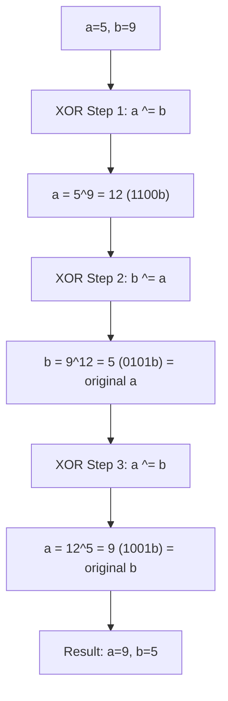
```mermaid
flowchart TD
    A["a=5, b=9"] --> B["XOR Step 1: a ^= b"]
    B --> C["a = 5^9 = 12 (1100b)"]
    C --> D["XOR Step 2: b ^= a"]
    D --> E["b = 9^12 = 5 (0101b) = original a"]
    E --> F["XOR Step 3: a ^= b"]
    F --> G["a = 12^5 = 9 (1001b) = original b"]
    G --> H["Result: a=9, b=5"]
```

**Execution Trace:**
```
Input:  a=5 (0101b), b=9 (1001b)
XOR:
  a = 5^9  = 1100b = 12
  b = 9^12 = 0101b = 5
  a = 12^5 = 1001b = 9
Output: a=9, b=5
```

### Interviewer Questions

1. Why is Go's `a, b = b, a` better than XOR swap in production?
2. Can we swap without any arithmetic? Only with pointer/address tricks.
3. How does this scale to swapping 10M pairs concurrently?
4. Walk me through why XOR swap with the same pointer zeroes the variable.
5. How would you make a concurrent swap goroutine-safe?
6. What's the assembly difference between temp swap and XOR swap on modern CPUs?
7. How would you property-test that all three methods always agree?

### Follow-Up Questions

**Q1:** Why does XOR swap break when a and b point to the same location?
**A1:** If `a` and `b` are the same pointer, `*a ^= *b` → `x ^= x = 0`. Then `*b ^= *a` → `0 ^= 0 = 0`. Then `*a ^= *b` → `0 ^= 0 = 0`. The value is destroyed. The aliasing guard `if a == b { return }` prevents this.

**Q2:** Does Go's `a, b = b, a` use a temp variable under the hood?
**A2:** Yes, the compiler may generate one temporary (register or stack slot) to hold the intermediate value. However, the compiler can often optimize this to a register swap or even a no-op if values are in registers. Modern CPUs can swap values in 2 moves (push/pop or XCHG). The Go spec guarantees correct semantics regardless of implementation.

**Q3:** When would XOR swap ever be preferred over Go's native swap?
**A3:** Almost never in modern software. XOR swap was useful on early CPUs with very few registers and no temp allocation. Today it's slower (data dependency between XOR instructions stalls pipelining), harder to read, and dangerous with aliasing. Use Go's `a, b = b, a` always.

**Q4:** How do you swap elements in a slice efficiently?
**A4:** `slice[i], slice[j] = slice[j], slice[i]` — direct multi-assignment on indexed elements. This is equivalent to SwapGo and the compiler handles it correctly. No need for a separate function.

**Q5:** How would you implement a thread-safe swap in Go?
**A5:** For a single int64: `atomic.SwapInt64(&a, b)` gives the old value of a and stores b atomically, but doesn't atomically read b. For two-variable atomic swap, use a mutex: ```go
var mu sync.Mutex
mu.Lock(); a, b = b, a; mu.Unlock()
``` Or use a channel-based approach for message-passing semantics.

---

## Q18: FAANG — Const Iota for State Machine  [Level 5 — Interview Level]

> **Tags:** `#interview` `#state-machine` `#iota` `#FAANG`

### Problem Statement
Model an order processing state machine using iota constants: Created=0, Paid=1, Shipped=2, Delivered=3, Cancelled=4. Implement `ValidTransition(from, to OrderState) bool` that returns true only for valid state transitions. Implement `NextState(s OrderState) (OrderState, error)` for the happy path. This is asked at Amazon/Flipkart — state machines test type safety, const design, and logic correctness.

### Input / Output / Constraints

```
Valid transitions:
  Created → Paid
  Paid → Shipped
  Shipped → Delivered
  Any state → Cancelled (except Delivered)

ValidTransition(Created, Paid) → true
ValidTransition(Paid, Created) → false (no going back)
NextState(Shipped) → Delivered, nil
NextState(Delivered) → _, error: "no next state"

Constraints:
  • OrderState is a named type
  • All invalid transitions return false
  • Time limit: O(1)
```

### Thought Process

Think like a senior Go engineer:
1. **Understand:** A directed graph of state transitions; edges are valid transitions. Check if (from, to) is a valid edge.
2. **Pattern:** Transition table as map or switch; iota for typed states; named type for compile-time safety.
3. **Edge cases:** Same state → same state (not valid transition), invalid state value, Delivered → Cancelled.
4. **Approach:** Pre-built transition map at package init; O(1) lookup per query.

### Brute Force Solution

```go
package main

// bruteForce — O(1) time, O(1) space — if-else chain, unmaintainable
func bruteForce(from, to int) bool {
    if from == 0 && to == 1 {
        return true
    } else if from == 1 && to == 2 {
        return true
    } else if from == 2 && to == 3 {
        return true
    } // Missing cancellation rules; magic numbers everywhere
    return false
}
```

**Time:** O(1) | **Space:** O(1)
**Bottleneck:** Magic numbers, missing rules, O(n) if-else chain for n transitions.

### Better Solution

```go
// betterSolution — O(1) time, O(1) space
type OrderState int

const (
    Created   OrderState = iota // 0
    Paid                        // 1
    Shipped                     // 2
    Delivered                   // 3
    Cancelled                   // 4
)

func betterValidTransition(from, to OrderState) bool {
    switch from {
    case Created:
        return to == Paid || to == Cancelled
    case Paid:
        return to == Shipped || to == Cancelled
    case Shipped:
        return to == Delivered || to == Cancelled
    default:
        return false
    }
}
```

**Time:** O(1) | **Space:** O(1)

### Best / Optimal Solution

```go
package main

import (
    "errors"
    "fmt"
)

// OrderState represents the lifecycle state of an order.
type OrderState int

const (
    Created   OrderState = iota // 0 — order placed
    Paid                        // 1 — payment confirmed
    Shipped                     // 2 — dispatched to courier
    Delivered                   // 3 — received by customer
    Cancelled                   // 4 — order cancelled
)

// stateNames maps OrderState to display name.
var stateNames = map[OrderState]string{
    Created:   "Created",
    Paid:      "Paid",
    Shipped:   "Shipped",
    Delivered: "Delivered",
    Cancelled: "Cancelled",
}

// validTransitions defines the allowed (from → set of to) edges.
// Using map[OrderState]map[OrderState]bool for O(1) lookup.
var validTransitions = map[OrderState]map[OrderState]bool{
    Created:  {Paid: true, Cancelled: true},
    Paid:     {Shipped: true, Cancelled: true},
    Shipped:  {Delivered: true, Cancelled: true},
    Delivered: {}, // terminal state — no transitions out
    Cancelled: {}, // terminal state — no transitions out
}

// String implements fmt.Stringer for OrderState.
func (s OrderState) String() string {
    if name, ok := stateNames[s]; ok {
        return name
    }
    return fmt.Sprintf("OrderState(%d)", int(s))
}

// ValidTransition — production-ready, O(1) time, O(1) space.
// Returns true if transitioning from → to is a valid order lifecycle move.
func ValidTransition(from, to OrderState) bool {
    transitions, ok := validTransitions[from]
    if !ok {
        return false // unknown from state
    }
    return transitions[to]
}

// NextState — returns the next state on the happy path (Created→Paid→Shipped→Delivered).
func NextState(s OrderState) (OrderState, error) {
    happyPath := map[OrderState]OrderState{
        Created:  Paid,
        Paid:     Shipped,
        Shipped:  Delivered,
    }
    next, ok := happyPath[s]
    if !ok {
        return s, fmt.Errorf("NextState: %s is a terminal or invalid state", s)
    }
    return next, nil
}

// Transition — applies a state transition with validation.
func Transition(current OrderState, to OrderState) (OrderState, error) {
    if !ValidTransition(current, to) {
        return current, fmt.Errorf("Transition: invalid transition %s → %s", current, to)
    }
    return to, nil
}

func main() {
    // Happy path
    state := Created
    for state != Delivered {
        next, err := NextState(state)
        if err != nil {
            fmt.Printf("error: %v\n", err)
            break
        }
        fmt.Printf("Transition: %s → %s\n", state, next)
        state = next
    }
    fmt.Printf("Final state: %s\n", state)

    // Invalid transition
    _, err := Transition(Delivered, Created)
    if err != nil {
        fmt.Printf("Invalid transition caught: %v\n", err)
    }

    // Cancellation
    s := Shipped
    cancelled, err := Transition(s, Cancelled)
    if err != nil {
        fmt.Printf("error: %v\n", err)
    } else {
        fmt.Printf("Cancelled from %s: %s\n", s, cancelled)
    }
}
```

**Time:** O(1) | **Space:** O(states²) for transition map

### Production Considerations

| Aspect | Details |
|--------|---------|
| **Scalability** | O(1) transition lookup; map initialized once at startup |
| **Edge Cases** | Unknown state value, same-state transition, terminal state NextState |
| **Error Handling** | ValidTransition is safe (returns bool); Transition returns error for invalid moves |
| **Memory** | validTransitions is a small map — negligible; shared read-only |
| **Concurrency** | Read-only maps are goroutine-safe; mutable order state needs sync.Mutex |

### Visual Explanation

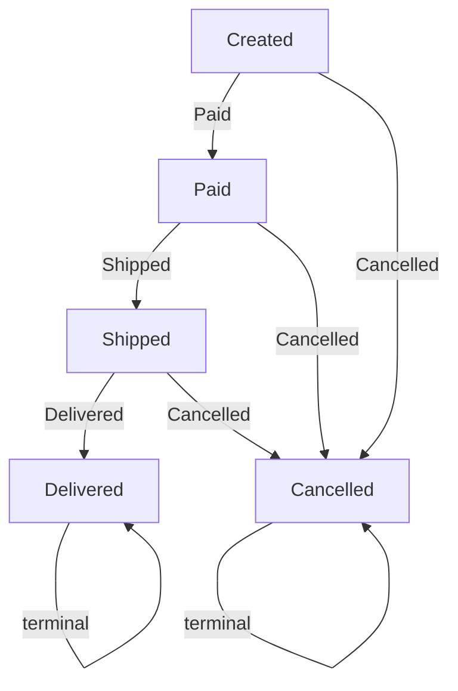
```mermaid
flowchart TD
    A["Created"] -->|"Paid"| B["Paid"]
    A -->|"Cancelled"| E["Cancelled"]
    B -->|"Shipped"| C["Shipped"]
    B -->|"Cancelled"| E
    C -->|"Delivered"| D["Delivered"]
    C -->|"Cancelled"| E
    D -->|"terminal"| D
    E -->|"terminal"| E
```

**Execution Trace:**
```
NextState(Created)  → Paid
NextState(Paid)     → Shipped
NextState(Shipped)  → Delivered
NextState(Delivered)→ error: terminal state
ValidTransition(Shipped, Cancelled) → true
ValidTransition(Delivered, Created) → false
```

### Interviewer Questions

1. Why use a map-of-maps for transitions instead of a 2D array?
2. Can we reduce space from O(states²) to O(edges)?
3. How does this scale to 1000 states with thousands of transitions?
4. Walk me through adding a new state "Refunded" without breaking existing code.
5. How would you make order state transitions goroutine-safe in a distributed system?
6. What's the memory overhead of map-of-maps vs adjacency list?
7. How would you test that all valid transitions are covered and no invalid ones slip through?

### Follow-Up Questions

**Q1:** How would you persist order state transitions to a database?
**A1:** Store a `state_transitions` table: (order_id, from_state, to_state, timestamp, actor). Use an enum column or int for state. Apply the same ValidTransition check before writing. Use optimistic locking (version column) to prevent concurrent state corruption.

**Q2:** How do you add audit logging to every state transition?
**A2:** Modify `Transition` to accept a context: `Transition(ctx context.Context, current, to OrderState, actorID string) (OrderState, error)`. After a valid transition, call `auditLog(ctx, current, to, actorID, time.Now())`. This follows the decorator pattern.

**Q3:** How would you implement rollback (undo last transition)?
**A3:** Maintain a transition history stack: `[]OrderState`. On rollback, pop the last state. Only allow rollback if the previous state is a valid reversal target (add explicit rollback edges to validTransitions). For distributed systems use event sourcing — replay events to get any past state.

**Q4:** Can you encode the state machine as a graph and find if a state is reachable?
**A4:** Yes. Build a directed adjacency graph from `validTransitions`. Use BFS/DFS from the starting state. If the target state is visited, it's reachable. This detects dead states (states with no path to terminal) which indicate design bugs.

**Q5:** How do you test a state machine exhaustively?
**A5:** Generate all (from, to) pairs and verify each against expected validity: ```go
for from := Created; from <= Cancelled; from++ {
  for to := Created; to <= Cancelled; to++ {
    got := ValidTransition(from, to)
    assert(t, got == expected[from][to])
  }
}
``` Also test NextState for all states including terminals.

---

## Q19: Production — Concurrent-Safe Configuration Store  [Level 6 — Production Level]

> **Tags:** `#production` `#concurrent-safe` `#sync` `#config`

### Problem Statement
Implement a thread-safe configuration store `ConfigStore` that holds typed Go variables (string, int, float64, bool). Support `Set(key string, value interface{})`, `GetString(key string) (string, bool)`, `GetInt(key string) (int, bool)`, and `Snapshot() map[string]interface{}`. Use `sync.RWMutex` for concurrent safety. The store must handle 10M reads/sec with minimal lock contention. This is a production-level design pattern.

### Input / Output / Constraints

```
Input:  Set("timeout", 30), Set("host", "localhost")
GetInt("timeout") → 30, true
GetString("host") → "localhost", true
GetInt("missing") → 0, false

Constraints:
  • Goroutine-safe for concurrent reads and writes
  • GetString/GetInt must not panic on wrong type
  • Snapshot returns a deep copy (no data races on returned map)
  • Time limit: O(1) per Get/Set, O(n) for Snapshot
```

### Thought Process

Think like a senior Go engineer:
1. **Understand:** Multiple goroutines reading/writing a shared map — requires sync.RWMutex (multiple concurrent readers, exclusive writer).
2. **Pattern:** `sync.RWMutex` with `RLock/RUnlock` for reads, `Lock/Unlock` for writes; type assertion with comma-ok for typed gets.
3. **Edge cases:** Missing key, wrong type, nil value, concurrent Set during Snapshot.
4. **Approach:** Embed RWMutex in struct; deep copy in Snapshot to prevent data races on returned map.

### Brute Force Solution

```go
package main

import "sync"

// bruteForce — uses Mutex instead of RWMutex — serializes all reads
type BruteStore struct {
    mu   sync.Mutex // blocks reads during writes AND other reads
    data map[string]interface{}
}

func (s *BruteStore) Get(key string) (interface{}, bool) {
    s.mu.Lock()   // excessive — blocks concurrent readers
    defer s.mu.Unlock()
    v, ok := s.data[key]
    return v, ok
}
```

**Time:** O(1) | **Space:** O(n)
**Bottleneck:** `sync.Mutex` serializes concurrent reads — poor performance at 10M reads/sec.

### Better Solution

```go
// betterSolution — uses RWMutex for concurrent reads
type BetterStore struct {
    mu   sync.RWMutex
    data map[string]interface{}
}

func (s *BetterStore) Get(key string) (interface{}, bool) {
    s.mu.RLock()
    defer s.mu.RUnlock()
    v, ok := s.data[key]
    return v, ok
}

func (s *BetterStore) Set(key string, value interface{}) {
    s.mu.Lock()
    defer s.mu.Unlock()
    s.data[key] = value
}
```

**Time:** O(1) | **Space:** O(n)

### Best / Optimal Solution

```go
package main

import (
    "fmt"
    "sync"
)

// ConfigStore is a goroutine-safe key-value store for application configuration.
// Uses sync.RWMutex to allow concurrent reads with exclusive writes.
type ConfigStore struct {
    mu   sync.RWMutex
    data map[string]interface{}
}

// NewConfigStore — creates an initialized ConfigStore.
func NewConfigStore() *ConfigStore {
    return &ConfigStore{
        data: make(map[string]interface{}),
    }
}

// Set — stores a value. Acquires exclusive write lock.
func (cs *ConfigStore) Set(key string, value interface{}) {
    cs.mu.Lock()
    defer cs.mu.Unlock()
    cs.data[key] = value
}

// Get — retrieves a raw value. Acquires shared read lock.
func (cs *ConfigStore) Get(key string) (interface{}, bool) {
    cs.mu.RLock()
    defer cs.mu.RUnlock()
    v, ok := cs.data[key]
    return v, ok
}

// GetString — type-safe string retrieval. Returns zero value and false if missing or wrong type.
func (cs *ConfigStore) GetString(key string) (string, bool) {
    v, ok := cs.Get(key)
    if !ok {
        return "", false
    }
    s, ok := v.(string)
    return s, ok
}

// GetInt — type-safe int retrieval.
func (cs *ConfigStore) GetInt(key string) (int, bool) {
    v, ok := cs.Get(key)
    if !ok {
        return 0, false
    }
    n, ok := v.(int)
    return n, ok
}

// GetFloat64 — type-safe float64 retrieval.
func (cs *ConfigStore) GetFloat64(key string) (float64, bool) {
    v, ok := cs.Get(key)
    if !ok {
        return 0, false
    }
    f, ok := v.(float64)
    return f, ok
}

// GetBool — type-safe bool retrieval.
func (cs *ConfigStore) GetBool(key string) (bool, bool) {
    v, ok := cs.Get(key)
    if !ok {
        return false, false
    }
    b, ok := v.(bool)
    return b, ok
}

// Delete — removes a key. Acquires exclusive write lock.
func (cs *ConfigStore) Delete(key string) {
    cs.mu.Lock()
    defer cs.mu.Unlock()
    delete(cs.data, key)
}

// Snapshot — returns a deep copy of the store. Safe to use without holding the lock.
func (cs *ConfigStore) Snapshot() map[string]interface{} {
    cs.mu.RLock()
    defer cs.mu.RUnlock()
    // Deep copy to prevent data races on the returned map
    snap := make(map[string]interface{}, len(cs.data))
    for k, v := range cs.data {
        snap[k] = v // value types copied; pointer/slice/map values are shallow copied
    }
    return snap
}

// Len — returns number of keys. O(1).
func (cs *ConfigStore) Len() int {
    cs.mu.RLock()
    defer cs.mu.RUnlock()
    return len(cs.data)
}

func main() {
    store := NewConfigStore()

    // Set various types
    store.Set("timeout", 30)
    store.Set("host", "localhost")
    store.Set("debug", true)
    store.Set("rate", 99.9)

    // Type-safe retrieval
    if timeout, ok := store.GetInt("timeout"); ok {
        fmt.Printf("timeout: %d\n", timeout)
    }
    if host, ok := store.GetString("host"); ok {
        fmt.Printf("host: %s\n", host)
    }
    if _, ok := store.GetInt("host"); !ok {
        fmt.Println("host is not an int — correct type check")
    }

    // Missing key
    if _, ok := store.GetString("missing"); !ok {
        fmt.Println("missing key correctly returns false")
    }

    // Snapshot
    snap := store.Snapshot()
    fmt.Printf("Snapshot has %d keys\n", len(snap))

    // Concurrent usage
    var wg sync.WaitGroup
    for i := 0; i < 100; i++ {
        wg.Add(1)
        go func(i int) {
            defer wg.Done()
            store.Set(fmt.Sprintf("key%d", i), i)
            store.GetInt(fmt.Sprintf("key%d", i))
        }(i)
    }
    wg.Wait()
    fmt.Printf("After concurrent ops: %d keys\n", store.Len())
}
```

**Time:** O(1) per Get/Set, O(n) for Snapshot | **Space:** O(n)

### Production Considerations

| Aspect | Details |
|--------|---------|
| **Scalability** | RWMutex allows N concurrent readers; write latency grows with reader count |
| **Edge Cases** | Nil value stored, wrong type assertion, concurrent delete during Get |
| **Error Handling** | All typed getters return (zero, false) — no panics possible |
| **Memory** | One map allocation; Snapshot copies all entries — O(n) per call |
| **Concurrency** | RWMutex: multiple concurrent readers, exclusive writers; correct |

### Visual Explanation

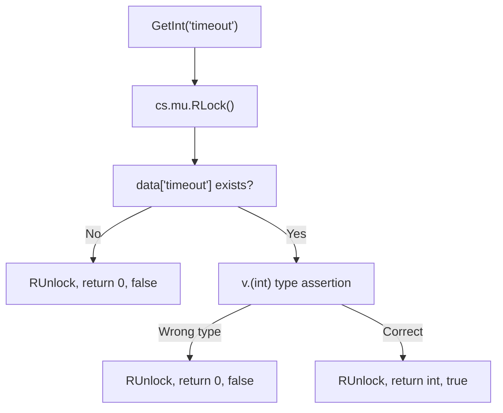
```mermaid
flowchart TD
    A["GetInt('timeout')"] --> B["cs.mu.RLock()"]
    B --> C["data['timeout'] exists?"]
    C -->|"No"| D["RUnlock, return 0, false"]
    C -->|"Yes"| E["v.(int) type assertion"]
    E -->|"Wrong type"| F["RUnlock, return 0, false"]
    E -->|"Correct"| G["RUnlock, return int, true"]
```

**Execution Trace:**
```
Set("timeout", 30): Lock → data["timeout"]=30 → Unlock
GetInt("timeout"):  RLock → v=30 → v.(int)=30,ok=true → RUnlock
GetString("timeout"): RLock → v=30 → v.(string)→ ok=false → RUnlock → return "",false
```

### Interviewer Questions

1. Why use `sync.RWMutex` over `sync.Mutex`?
2. Can we improve further? Use `sync.Map` for highly concurrent workloads.
3. How does this scale to 10M reads/sec from 1000 goroutines?
4. Walk me through a data race if we forgot the mutex.
5. How would you add TTL (time-to-live) expiry to config keys?
6. What's the overhead of Snapshot at 1000 keys called 100 times/sec?
7. How would you test ConfigStore for data races (use -race)?

### Follow-Up Questions

**Q1:** When should you use `sync.Map` vs `sync.RWMutex` + map?
**A1:** Use `sync.Map` when: keys are written once and read many times, there are many goroutines accessing disjoint keys. Use `RWMutex + map` when: you need custom operations (e.g., check-then-set), you need accurate `Len()`, or write patterns are complex. `sync.Map` trades memory for reduced contention via internal sharding.

**Q2:** How do you implement an atomic check-and-set (CAS) on ConfigStore?
**A2:** Hold the write lock for the entire check+set operation: ```go
func (cs *ConfigStore) SetIfAbsent(key string, value interface{}) bool {
    cs.mu.Lock(); defer cs.mu.Unlock()
    if _, exists := cs.data[key]; exists { return false }
    cs.data[key] = value; return true
}``` Never release and re-acquire the lock between check and set.

**Q3:** How would you add TTL support to each key?
**A3:** Store `struct { value interface{}; expiry time.Time }` in the map. In `Get`, check `time.Now().After(entry.expiry)` and return miss if expired. Run a background goroutine with a ticker to sweep expired keys. Use `context.Context` for graceful shutdown of the sweeper.

**Q4:** How do you test for data races in ConfigStore?
**A4:** Run: `go test -race ./...`. Write a test that spawns 100 goroutines doing concurrent Set/Get: ```go
var wg sync.WaitGroup
for i := 0; i < 100; i++ { wg.Add(2)
  go func() { defer wg.Done(); store.Set("k", i) }()
  go func() { defer wg.Done(); store.GetInt("k") }()
}; wg.Wait()``` The race detector will report any unsynchronized access.

**Q5:** How does `sync.RWMutex` degrade when writers are frequent?
**A5:** When writes are frequent, readers must wait for the exclusive lock on every write. At high write frequency (>50% of operations), `RWMutex` provides no benefit over `Mutex` and adds overhead. Consider sharding: `[N]ConfigStore` with `hash(key) % N` — each shard has its own mutex, reducing contention by N.

---

## Q20: Production — Observable Variable Lifecycle with Metrics  [Level 6 — Production Level]

> **Tags:** `#production` `#observability` `#metrics` `#lifecycle`

### Problem Statement
Build a `MetricVar` type that wraps a float64 value and tracks: current value, min, max, sum, count, and last-updated timestamp. Implement `Set(v float64)`, `Add(delta float64)`, `Stats() VarStats`. Make it goroutine-safe and produce a Prometheus-compatible `String()` representation. This is a production observability pattern used at every major tech company.

### Input / Output / Constraints

```
Input:  Set(10.0), Set(5.0), Set(15.0)
Stats() → {Current:15.0, Min:5.0, Max:15.0, Sum:30.0, Count:3}

Input:  Add(5.0) then Add(-2.0) from 10.0
Stats() → {Current:13.0, ...}

Constraints:
  • Goroutine-safe for all operations
  • Stats() must be consistent (atomic snapshot)
  • String() must output valid Prometheus text format
  • Time limit: O(1) per operation
```

### Thought Process

Think like a senior Go engineer:
1. **Understand:** A metric accumulator needs atomic updates and consistent reads of multiple fields — single mutex for snapshot consistency.
2. **Pattern:** Struct with embedded `sync.Mutex`; all public methods lock; `Stats()` returns a copy under lock.
3. **Edge cases:** First Set (min/max initialization), Add with negative delta, concurrent Set and Stats.
4. **Approach:** Initialize min with +Inf, max with -Inf so first Set always wins; consistent stats under single lock.

### Brute Force Solution

```go
package main

import "sync"

// bruteForce — separate atomics — stats not atomic snapshot
type BruteMetric struct {
    current int64 // sync/atomic — separate from min/max
    count   int64
}
// Problem: current and count can be out of sync — not a consistent snapshot
```

**Time:** O(1) | **Space:** O(1)
**Bottleneck:** Individual atomics for multi-field struct cannot provide consistent snapshot without a lock.

### Better Solution

```go
// betterSolution — mutex for full consistency
type BetterMetric struct {
    mu      sync.Mutex
    current float64
    min, max float64
    sum     float64
    count   int64
}
```

**Time:** O(1) | **Space:** O(1)

### Best / Optimal Solution

```go
package main

import (
    "fmt"
    "math"
    "sync"
    "time"
)

// VarStats is a snapshot of a MetricVar's statistics.
type VarStats struct {
    Current     float64
    Min         float64
    Max         float64
    Sum         float64
    Count       int64
    Mean        float64
    LastUpdated time.Time
}

// MetricVar is a goroutine-safe observable float64 variable.
// Tracks current, min, max, sum, count, and last-updated timestamp.
type MetricVar struct {
    mu          sync.Mutex
    name        string
    current     float64
    min         float64
    max         float64
    sum         float64
    count       int64
    lastUpdated time.Time
}

// NewMetricVar — creates a new MetricVar with given name.
// min initialized to +Inf and max to -Inf so first Set always wins.
func NewMetricVar(name string) *MetricVar {
    return &MetricVar{
        name: name,
        min:  math.Inf(1),  // +Inf: any real value will be less
        max:  math.Inf(-1), // -Inf: any real value will be greater
    }
}

// Set — sets the current value and updates stats.
func (m *MetricVar) Set(v float64) {
    m.mu.Lock()
    defer m.mu.Unlock()
    m.current = v
    m.sum += v
    m.count++
    if v < m.min {
        m.min = v
    }
    if v > m.max {
        m.max = v
    }
    m.lastUpdated = time.Now()
}

// Add — increments the current value by delta and updates stats.
func (m *MetricVar) Add(delta float64) {
    m.mu.Lock()
    defer m.mu.Unlock()
    m.current += delta
    m.sum += delta
    m.count++
    if m.current < m.min {
        m.min = m.current
    }
    if m.current > m.max {
        m.max = m.current
    }
    m.lastUpdated = time.Now()
}

// Stats — returns a consistent snapshot of all statistics.
func (m *MetricVar) Stats() VarStats {
    m.mu.Lock()
    defer m.mu.Unlock()
    var mean float64
    if m.count > 0 {
        mean = m.sum / float64(m.count)
    }
    // Return copy — no field can be observed in intermediate state
    return VarStats{
        Current:     m.current,
        Min:         m.min,
        Max:         m.max,
        Sum:         m.sum,
        Count:       m.count,
        Mean:        mean,
        LastUpdated: m.lastUpdated,
    }
}

// String — Prometheus text format representation.
func (m *MetricVar) String() string {
    s := m.Stats()
    return fmt.Sprintf(
        "# HELP %s Observable variable\n"+
            "%s{stat=\"current\"} %g\n"+
            "%s{stat=\"min\"} %g\n"+
            "%s{stat=\"max\"} %g\n"+
            "%s{stat=\"mean\"} %g\n"+
            "%s{stat=\"count\"} %d\n",
        m.name,
        m.name, s.Current,
        m.name, s.Min,
        m.name, s.Max,
        m.name, s.Mean,
        m.name, s.Count,
    )
}

func main() {
    mv := NewMetricVar("request_duration_ms")

    // Sequential sets
    mv.Set(10.0)
    mv.Set(5.0)
    mv.Set(15.0)
    s := mv.Stats()
    fmt.Printf("After 3 Sets:\n")
    fmt.Printf("  Current=%.1f Min=%.1f Max=%.1f Sum=%.1f Count=%d Mean=%.2f\n",
        s.Current, s.Min, s.Max, s.Sum, s.Count, s.Mean)

    // Concurrent updates
    var wg sync.WaitGroup
    latency := NewMetricVar("api_latency_us")
    for i := 0; i < 1000; i++ {
        wg.Add(1)
        go func(i int) {
            defer wg.Done()
            latency.Set(float64(i % 100))
        }(i)
    }
    wg.Wait()

    final := latency.Stats()
    fmt.Printf("\nConcurrent (1000 goroutines):\n")
    fmt.Printf("  Count=%d Min=%.1f Max=%.1f Mean=%.2f\n",
        final.Count, final.Min, final.Max, final.Mean)

    // Prometheus output
    fmt.Printf("\n%s", mv.String())
}
```

**Time:** O(1) per operation | **Space:** O(1)

### Production Considerations

| Aspect | Details |
|--------|---------|
| **Scalability** | O(1) per op; at 10M ops/sec, mutex contention limits throughput — use sharding |
| **Edge Cases** | First call (min=+Inf/max=-Inf initializer), NaN delta, Inf value |
| **Error Handling** | Add/Set could validate for NaN/Inf — add in production |
| **Memory** | Single struct allocation; Stats() returns value copy — no heap alloc |
| **Concurrency** | Mutex ensures consistent snapshot; all goroutines serialize on Set/Add |

### Visual Explanation

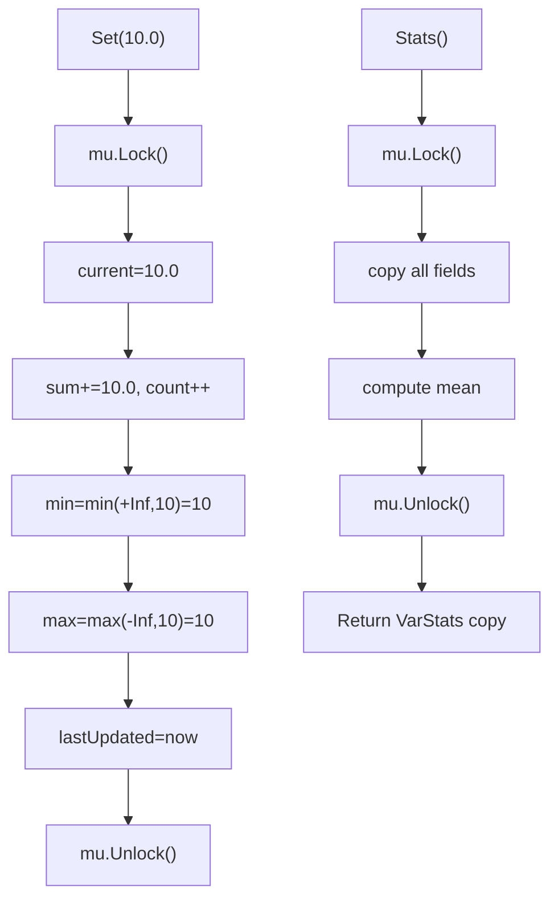
```mermaid
flowchart TD
    A["Set(10.0)"] --> B["mu.Lock()"]
    B --> C["current=10.0"]
    C --> D["sum+=10.0, count++"]
    D --> E["min=min(+Inf,10)=10"]
    E --> F["max=max(-Inf,10)=10"]
    F --> G["lastUpdated=now"]
    G --> H["mu.Unlock()"]

    I["Stats()"] --> J["mu.Lock()"]
    J --> K["copy all fields"]
    K --> L["compute mean"]
    L --> M["mu.Unlock()"]
    M --> N["Return VarStats copy"]
```

**Execution Trace:**
```
NewMetricVar: min=+Inf, max=-Inf, count=0
Set(10.0): current=10, sum=10, count=1, min=10, max=10
Set(5.0):  current=5, sum=15, count=2, min=5, max=10
Set(15.0): current=15, sum=30, count=3, min=5, max=15
Stats(): Current=15, Min=5, Max=15, Sum=30, Count=3, Mean=10
```

### Interviewer Questions

1. Why initialize min=+Inf and max=-Inf instead of using the first value?
2. Can we reduce lock contention using atomic operations?
3. How does this scale to 10M metric updates/sec in a high-throughput system?
4. Walk me through what happens if NaN is passed to Set.
5. How would you add histogram buckets to MetricVar?
6. What's the memory cost of Stats() returning a value copy vs pointer?
7. How would you integrate MetricVar with Prometheus client_golang?

### Follow-Up Questions

**Q1:** Why can't we use individual `sync/atomic` operations instead of a mutex for Stats()?
**A1:** Atomics are per-field. Between reading `current` and reading `min`, another goroutine might call `Set()` and change both. Stats() would return an inconsistent snapshot where `current < min` is possible. A mutex ensures all fields are read together as one atomic transaction.

**Q2:** How would you implement exponentially weighted moving average (EWMA) in MetricVar?
**A2:** Add `ewma float64` and `alpha float64` fields. In `Set`: `m.ewma = alpha*v + (1-alpha)*m.ewma`. alpha=0.1 gives slow-moving average; alpha=0.9 gives fast (recent values dominate). EWMA is used in system monitoring (CPU load) and network rate estimators.

**Q3:** How do you reduce mutex contention at 10M ops/sec?
**A3:** Shard the metric: `[N]MetricVar` where each shard handles a subset of goroutines. Use `goroutineID % N` or `key hash % N` to select shard. Collect stats by merging all shards. Alternatively, use per-goroutine local counters aggregated periodically (like Linux percpu counters).

**Q4:** How would you integrate this with Prometheus without the custom String() method?
**A4:** Implement `prometheus.Collector` interface: `Describe(chan<- *prometheus.Desc)` and `Collect(chan<- prometheus.Metric)`. Register with `prometheus.MustRegister(mv)`. The Prometheus server calls `Collect` on scrape, getting consistent stats under lock.

**Q5:** How would you add percentile tracking (P50, P99) to MetricVar?
**A5:** Use a reservoir sampling or HDRHistogram approach. For exact percentiles: maintain a sorted `[]float64` (expensive). For approximate: use `github.com/prometheus/client_golang/prometheus` `Summary` or `github.com/HdrHistogram/hdrhistogram-go`. Sorted-slice approach is O(n log n) per percentile query — use for low-frequency reporting only.

---

## Company-Style Questions

---

### Google Style Questions

**Problem G1: Anagram Groups via Variable Maps**
Given a `[]string`, group all anagrams together. Return `[][]string` of groups. Analyze time/space. Can you do it in O(n×k) where k = avg string length?

```go
// Approach: for each word, sort its characters as the key.
// map[string][]string groups words by sorted-char signature.
// Time: O(n × k log k) — k log k for sorting each word. Space: O(n×k).
// Optimal for comparison-based approach; cannot do better than O(n×k) (must read all chars).
func groupAnagrams(strs []string) [][]string {
    groups := make(map[string][]string)
    for _, s := range strs {
        b := []byte(s)
        sort.Slice(b, func(i, j int) bool { return b[i] < b[j] })
        key := string(b)
        groups[key] = append(groups[key], s)
    }
    result := make([][]string, 0, len(groups))
    for _, g := range groups {
        result = append(result, g)
    }
    return result
}
```
**Generalization:** Replace sort-char key with frequency array `[26]int` as key (O(k) not O(k log k)) for English lowercase — reduces to O(n×k).

---

**Problem G2: Typed Constant Range Validation**
Given a series of typed constants defining valid ranges for different configuration categories (MEMORY_MB: 128–65536, TIMEOUT_MS: 100–30000, REPLICAS: 1–100), write a generic `InRange[T Ordered](val, lo, hi T) bool` function using generics (Go 1.18+). Analyze: when does type safety at compile time matter more than runtime validation?

```go
import "golang.org/x/exp/constraints"

func InRange[T constraints.Ordered](val, lo, hi T) bool {
    return val >= lo && val <= hi
}
// Usage: InRange(30_000, 128, 65_536)  → true (memory MB)
// Type-safe: InRange[string]("abc", "aaa", "zzz") also works
// Compile-time: prevents comparing int range with float constant directly
```

---

**Problem G3: Zero-Value Struct as Configuration Default**
Design a `ServerConfig` struct where zero values are valid defaults: `Port=8080, ReadTimeout=30s, MaxConns=100`. Implement `NewServerConfig(opts ...Option) ServerConfig` using the functional options pattern. Explain why zero-value-usable structs are a Go design principle and how they interact with `omitempty` in JSON.

```go
type ServerConfig struct {
    Port        int           // zero → 8080 via Apply
    ReadTimeout time.Duration // zero → 30s via Apply
    MaxConns    int           // zero → 100 via Apply
}
type Option func(*ServerConfig)
func WithPort(p int) Option { return func(c *ServerConfig) { c.Port = p } }
func NewServerConfig(opts ...Option) ServerConfig {
    c := ServerConfig{Port: 8080, ReadTimeout: 30 * time.Second, MaxConns: 100}
    for _, o := range opts { o(&c) }
    return c
}
```

---

**Problem G4: Variable Lifetime and Escape Analysis**
Given the following function, explain which variables escape to heap and which stay on stack. Optimize to reduce heap allocations:
```go
func compute(n int) *int {
    result := n * 2    // stack or heap?
    return &result     // forces heap escape
}
```
Answer: `result` escapes because its address is returned. Optimization: if caller doesn't need a pointer, return `int` directly. If pointer is required, use `sync.Pool` for pooling `*int` objects at high call frequency. Verify with `go build -gcflags="-m"`.

---

### Uber Style Questions

**Problem U1: Rate Limiter Using Typed Variables**
Implement a token bucket rate limiter using typed variables: `type Rate float64` (tokens/sec), `type BurstSize int`. `NewLimiter(r Rate, b BurstSize) *Limiter` with `Allow() bool` method. Use `time.Now()` and float64 arithmetic for token refill. Make it goroutine-safe. What's the precision limit at microsecond time resolution?

```go
type Rate float64
type BurstSize int

type Limiter struct {
    mu       sync.Mutex
    rate     Rate
    burst    BurstSize
    tokens   float64
    lastTime time.Time
}

func NewLimiter(r Rate, b BurstSize) *Limiter {
    return &Limiter{rate: r, burst: b, tokens: float64(b), lastTime: time.Now()}
}

func (l *Limiter) Allow() bool {
    l.mu.Lock()
    defer l.mu.Unlock()
    now := time.Now()
    elapsed := now.Sub(l.lastTime).Seconds()
    l.tokens += elapsed * float64(l.rate)
    if l.tokens > float64(l.burst) {
        l.tokens = float64(l.burst)
    }
    l.lastTime = now
    if l.tokens >= 1 {
        l.tokens--
        return true
    }
    return false
}
// Precision: time.Duration is int64 nanoseconds → Sub().Seconds() gives float64 with ~15 sig digits
// At microsecond timing, float64 is sufficient for rate calculations up to 10⁹ tokens/sec
```

---

**Problem U2: Geospatial Coordinate Types**
Define typed variables `Latitude` and `Longitude` (both `float64` named types) with validation. Implement `Distance(a, b GeoPoint) float64` using the Haversine formula. Use typed constants for `EarthRadiusKm = 6371.0`. Why is it critical to use named types (not plain float64) in navigation code, and how does this relate to the Mars Climate Orbiter crash?

```go
type Latitude  float64  // -90 to +90
type Longitude float64  // -180 to +180

type GeoPoint struct {
    Lat Latitude
    Lon Longitude
}
// Named types prevent accidentally passing longitude where latitude expected
// Mars Orbiter: one module used pound-force, another expected Newton-seconds — no type safety
// Go named types would have made this a compile error
```

---

**Problem U3: Real-time Metrics with Typed Gauges**
Build a `TypedGauge[T int64 | float64]` using generics that tracks the current value of a metric. Implement `Set(v T)`, `Get() T`, and `CAS(old, new T) bool` (compare-and-swap). Use `sync/atomic` internally for lock-free operation. When would a generic gauge be preferable to separate `IntGauge` and `FloatGauge` types?

```go
import "sync/atomic"

type TypedGauge[T int64 | float64] struct {
    val atomic.Int64 // store float64 bits as int64 via math.Float64bits
}

func (g *TypedGauge[float64]) Set(v float64) {
    g.val.Store(int64(math.Float64bits(v)))
}
func (g *TypedGauge[float64]) Get() float64 {
    return math.Float64frombits(uint64(g.val.Load()))
}
// Generic gauge eliminates duplicate code; type constraint ensures only numeric types
// Prefer when the algorithm is identical for multiple types — generics over interface{}
```

---

**Problem U4: Surge Pricing Variable Design**
Model a surge pricing system using typed variables: `type SurgeMultiplier float64`, constants for `NormalRate SurgeMultiplier = 1.0`, `MaxSurge = 5.0`. Implement `ComputeFare(baseFare float64, surge SurgeMultiplier) (float64, error)` that caps surge at MaxSurge, validates inputs, and returns the final fare. How would you make the surge multiplier observable and adjustable at runtime without a restart?

---

### Amazon Style Questions

**Problem A1: Distributed Counter with At-Least-Once Semantics**
Implement a `DistributedCounter` that tracks a count across nodes. Each node has a local `int64` counter (using `sync/atomic`). Implement `LocalIncrement()`, `LocalCount() int64`, and `Merge(remote int64) int64` that takes the maximum (CRDT-style max-wins merge for distributed systems). Explain: why max-wins (not sum) is correct for idempotent at-least-once delivery.

```go
type DistributedCounter struct {
    local atomic.Int64
}

func (dc *DistributedCounter) LocalIncrement() {
    dc.local.Add(1)
}

func (dc *DistributedCounter) LocalCount() int64 {
    return dc.local.Load()
}

// Merge applies a max-wins CRDT merge — idempotent and commutative.
// If the same remote value is received twice, the result is the same.
func (dc *DistributedCounter) Merge(remote int64) int64 {
    for {
        current := dc.local.Load()
        if remote <= current {
            return current // no update needed
        }
        if dc.local.CompareAndSwap(current, remote) {
            return remote
        }
        // CAS failed — retry (another goroutine updated)
    }
}
// Why max-wins: if message "count=5" is received twice due to retry, max(5,5)=5 (correct)
// Sum-wins would give 10 (incorrect — double-counted)
```

---

**Problem A2: Fault-Tolerant Configuration with Fallback Variables**
Design a config loader `LoadConfig(primary, fallback ConfigSource) (Config, error)` where `ConfigSource` is an interface returning `map[string]string`. If primary fails, fall back to secondary. If both fail, use hardcoded defaults. Use typed constants for all default values. What happens to in-flight requests when config is reloaded? How do you prevent partial config updates?

```go
type ConfigSource interface {
    Load() (map[string]string, error)
}

const (
    DefaultPort    = "8080"
    DefaultTimeout = "30s"
    DefaultWorkers = "10"
)

func LoadConfig(primary, fallback ConfigSource) (map[string]string, error) {
    if cfg, err := primary.Load(); err == nil {
        return cfg, nil
    }
    if cfg, err := fallback.Load(); err == nil {
        return cfg, nil // log primary failure
    }
    // Both failed — use hardcoded defaults
    return map[string]string{
        "port": DefaultPort, "timeout": DefaultTimeout, "workers": DefaultWorkers,
    }, nil
}
// Atomic config swap: store *Config pointer, use atomic.Pointer[Config] for swap
// In-flight requests hold a reference to the old config until they complete
```

---

**Problem A3: Variable-Length Encoding for Distributed Tracing IDs**
Implement a `TraceID` type as `[16]byte` (UUID-like). Implement `NewTraceID() TraceID` using crypto/rand, `String() string` (hex encoding), and `ParseTraceID(s string) (TraceID, error)`. Use named type for type safety — prevent accidentally using a session ID as a trace ID. This is used in AWS X-Ray, Datadog, and OpenTelemetry.

```go
type TraceID [16]byte
type SpanID  [8]byte   // distinct type prevents mixing

func NewTraceID() (TraceID, error) {
    var id TraceID
    _, err := rand.Read(id[:])
    return id, err
}

func (t TraceID) String() string {
    return hex.EncodeToString(t[:])
}

func ParseTraceID(s string) (TraceID, error) {
    b, err := hex.DecodeString(s)
    if err != nil || len(b) != 16 {
        return TraceID{}, fmt.Errorf("invalid TraceID: %q", s)
    }
    var id TraceID
    copy(id[:], b)
    return id, nil
}
// Named types: TraceID and SpanID cannot be interchanged — compile error prevents bugs
```

---

**Problem A4: What-If Server Crash Recovery**
You have a `var requestCount int64` (global counter) that gets reset on server restart. Design a solution that persists the counter across crashes using a write-ahead log (WAL). What variables need to be persisted? How do you handle the case where the WAL write succeeds but the in-memory update doesn't complete (partial write)?

Answer: Use atomic write to WAL file before incrementing memory counter. On startup, read WAL to restore count. For partial writes, use a CRC checksum in WAL entry. Accept at-least-once semantics (count may be slightly over on crash recovery). For exact semantics, use two-phase commit with a transaction log.

---

### Stripe Style Questions

**Problem S1: Idempotency Key as Typed Variable**
Define `type IdempotencyKey string` with a validator `ParseIdempotencyKey(s string) (IdempotencyKey, error)` that enforces: non-empty, max 255 chars, UUID-v4 format. Implement `IdempotentCharge(key IdempotencyKey, amount int64) (ChargeResult, error)` that returns the same result for duplicate keys. What data store operations are required for idempotency? How do you handle the race between two concurrent requests with the same key?

```go
type IdempotencyKey string

var uuidV4Regex = regexp.MustCompile(
    `^[0-9a-f]{8}-[0-9a-f]{4}-4[0-9a-f]{3}-[89ab][0-9a-f]{3}-[0-9a-f]{12}$`)

func ParseIdempotencyKey(s string) (IdempotencyKey, error) {
    if s == "" || len(s) > 255 {
        return "", fmt.Errorf("idempotency key length invalid: %d", len(s))
    }
    if !uuidV4Regex.MatchString(strings.ToLower(s)) {
        return "", fmt.Errorf("idempotency key must be UUID-v4: %q", s)
    }
    return IdempotencyKey(s), nil
}
// Idempotency storage: INSERT ... ON CONFLICT (key) DO NOTHING; SELECT result WHERE key=?
// Race: first writer wins via DB unique constraint; second reads stored result
```

---

**Problem S2: Financial Amount Type with Overflow Protection**
Define `type Money int64` representing the smallest currency unit (cents/paise). Implement `Add(a, b Money) (Money, error)` and `Multiply(m Money, factor float64) (Money, error)` with overflow detection. Why use int64 not float64? Implement `Format(m Money, currency string) string` producing "₹1,234.56". This is the exact pattern used in Stripe's internal amount type.

```go
type Money int64 // amount in smallest unit (paise for INR, cents for USD)

const MaxMoney Money = math.MaxInt64

func Add(a, b Money) (Money, error) {
    if b > 0 && a > MaxMoney-b {
        return 0, errors.New("money addition overflow")
    }
    if b < 0 && a < -MaxMoney-b {
        return 0, errors.New("money addition underflow")
    }
    return a + b, nil
}

func Format(m Money, currency string) string {
    major := m / 100
    minor := m % 100
    if minor < 0 { minor = -minor }
    symbols := map[string]string{"INR": "₹", "USD": "$", "EUR": "€"}
    sym := symbols[currency]
    return fmt.Sprintf("%s%d.%02d", sym, major, minor)
}
// Why int64: float64 loses precision for large amounts (>2^53 cents = $90 trillion)
// int64 handles up to 9.2×10^18 cents — sufficient for all real currencies
```

---

**Problem S3: Audit Trail for Variable Mutations**
Build `AuditedVar[T any]` that wraps any value and logs every change with timestamp, old value, new value, and caller function. Implement `Set(v T, reason string)`, `Get() T`, and `History() []AuditEntry`. Use `runtime.Callers` to capture the caller. How do you prevent the audit log from growing unbounded? How would you integrate this with Stripe's event-sourcing architecture?

```go
type AuditEntry struct {
    At       time.Time
    OldValue interface{}
    NewValue interface{}
    Reason   string
    Caller   string
}

type AuditedVar[T any] struct {
    mu      sync.RWMutex
    current T
    history []AuditEntry
    maxHist int // cap to prevent unbounded growth
}

func (av *AuditedVar[T]) Set(v T, reason string) {
    av.mu.Lock()
    defer av.mu.Unlock()
    pc, _, _, _ := runtime.Caller(1)
    caller := runtime.FuncForPC(pc).Name()
    entry := AuditEntry{At: time.Now(), OldValue: av.current, NewValue: v,
        Reason: reason, Caller: caller}
    av.history = append(av.history, entry)
    if len(av.history) > av.maxHist {
        av.history = av.history[1:] // sliding window
    }
    av.current = v
}
```

---

### Razorpay Style Questions

**Problem R1: UPI Transaction ID Type**
Define `type UPIID string` and `type UTR string` (Unique Transaction Reference). Implement `ValidateUPIID(id UPIID) error` (format: `name@bankhandle`) and `ValidateUTR(utr UTR) error` (12-digit numeric). Implement `UPIPayment(from UPIID, to UPIID, amount Money, utr UTR) error`. What happens on a network timeout — how do you distinguish "payment pending" from "payment failed" for reconciliation?

```go
type UPIID string   // e.g., "alice@ybl"
type UTR   string   // 12-digit Unique Transaction Reference

var upiIDRegex = regexp.MustCompile(`^[a-zA-Z0-9._-]+@[a-zA-Z]+$`)

func ValidateUPIID(id UPIID) error {
    if !upiIDRegex.MatchString(string(id)) {
        return fmt.Errorf("invalid UPI ID format: %q", id)
    }
    return nil
}

func ValidateUTR(utr UTR) error {
    if len(utr) != 12 {
        return fmt.Errorf("UTR must be 12 digits, got %d: %q", len(utr), utr)
    }
    for _, c := range string(utr) {
        if c < '0' || c > '9' {
            return fmt.Errorf("UTR must be numeric: %q", utr)
        }
    }
    return nil
}
// Timeout handling: store payment with status=PENDING + UTR
// Reconciliation: query NPCI/bank with UTR to get final status
// Never assume timeout = failed — UPI is async; debit may have occurred
```

---

**Problem R2: Reconciliation with Typed Amount Variables**
You receive settlement files with `amount string` (e.g., "1234.56"). Convert to `Money` (paise), accumulate totals, and detect discrepancies against your DB. Implement `ParseSettlement(lines []string) (total Money, count int, errors []error)`. Use typed constants for fee rates. How do you handle currency rounding differences (e.g., 0.5 paise)? What's the maximum discrepancy you'd accept before flagging?

```go
type Money int64 // paise

const (
    MDRRate    = 0.002  // 0.2% Merchant Discount Rate
    GST_On_MDR = 0.18   // 18% GST on MDR
    MaxDiscrepancyPaise Money = 1 // accept ±0.01 rupee rounding difference
)

func ParseSettlement(lines []string) (total Money, count int, errs []error) {
    for i, line := range lines {
        parts := strings.Split(line, ",")
        if len(parts) < 2 { errs = append(errs, fmt.Errorf("line %d: invalid format", i)); continue }
        f, err := strconv.ParseFloat(parts[1], 64)
        if err != nil { errs = append(errs, fmt.Errorf("line %d: %w", i, err)); continue }
        paise := Money(math.Round(f * 100)) // explicit rounding — not truncation
        total += paise
        count++
    }
    return total, count, errs
}
// Rounding: always round half-up using math.Round before converting to integer paise
// Discrepancy flag: if |expected - actual| > MaxDiscrepancyPaise * count → manual review
```

---

**Problem R3: High-Availability Payment Gateway Variable State**
Design a `GatewayState` type (with values: Active, Degraded, Maintenance, Failover) using iota. Implement a `GatewayMonitor` that tracks state, uptime, and failure count. On 3 consecutive failures, transition to Degraded. On 10 failures, transition to Failover. Implement `RecordResult(success bool)` and `ShouldRoute() bool`. How do you implement this across multiple pods without a coordinator (gossip protocol)?

```go
type GatewayState int

const (
    Active      GatewayState = iota
    Degraded                 // 3+ consecutive failures
    Maintenance              // manual override
    Failover                 // 10+ failures → route to backup gateway
)

type GatewayMonitor struct {
    mu             sync.Mutex
    state          GatewayState
    consecutiveFails int
    totalFails     int64
    startTime      time.Time
}

func (gm *GatewayMonitor) RecordResult(success bool) {
    gm.mu.Lock()
    defer gm.mu.Unlock()
    if success {
        gm.consecutiveFails = 0
        if gm.state == Degraded { gm.state = Active }
    } else {
        gm.consecutiveFails++
        gm.totalFails++
        if gm.consecutiveFails >= 10 { gm.state = Failover
        } else if gm.consecutiveFails >= 3 { gm.state = Degraded }
    }
}

func (gm *GatewayMonitor) ShouldRoute() bool {
    gm.mu.RLock()
    defer gm.mu.RUnlock()
    return gm.state == Active || gm.state == Degraded
}
// Gossip: each pod periodically shares its GatewayMonitor state with peers via UDP
// Merge states using max(consecutiveFails) — conservative (highest failure count wins)
// No coordinator needed — eventual consistency is acceptable for routing decisions
```

---
