> © 2024 Gaurav Patil — GoForge Platform. All rights reserved.

# Go Functions & Closures — Coding Practice

---

## Q1: Basic Function Declaration  [Level 1 — Beginner]
> **Tags:** `#functions` `#declarations` `#basics`

### Problem Statement
Write a Go function that accepts two integers and returns their sum and difference. This tests your understanding of basic function declarations and multiple return values. The function must return both values in a single call.

### Input / Output / Constraints
```
Input:  a=10, b=3
Output: sum=13, diff=7
Constraints: integers fit in int64; no overflow handling required
```

### Thought Process
1. Understand: A Go function can return multiple values using a tuple-style return list.
2. Pattern: Declare function with two int params; return two ints.
3. Edge cases: Negative numbers, zero values — arithmetic still works correctly.

### Brute Force
```go
// O(1) time, O(1) space
func bruteForce(a, b int) (int, int) {
    sum := a + b
    diff := a - b
    return sum, diff
}
```
**Time:** O(1) | **Space:** O(1)

### Better Solution
```go
func better(a, b int) (int, int) {
    return a + b, a - b
}
```
**Time:** O(1) | **Space:** O(1)

### Best Solution
```go
package main

import "fmt"

// SumDiff returns the sum and difference of two integers — O(1) time, O(1) space
func SumDiff(a, b int) (int, int) {
    return a + b, a - b
}

func main() {
    s, d := SumDiff(10, 3)
    fmt.Printf("Sum: %d, Diff: %d\n", s, d)
}
```
**Time:** O(1) | **Space:** O(1)

### Production Considerations
| Aspect | Details |
|--------|---------|
| Scalability | Constant time; scales to any call frequency |
| Edge Cases | int overflow for very large values — use int64 or big.Int |
| Error Handling | No errors possible for arithmetic; omit error return |
| Memory | No heap allocation; values returned on stack |
| Concurrency | Pure function; goroutine-safe by definition |

### Visual Explanation
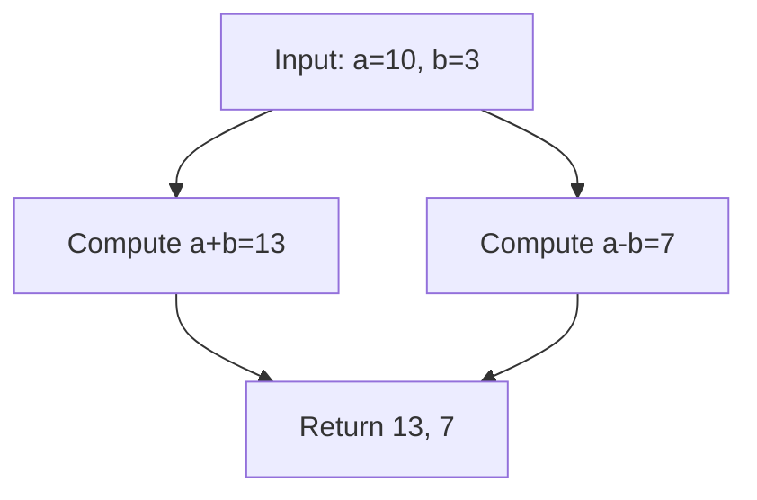
```
Trace: (10,3) → sum=10+3=13 → diff=10-3=7 → return (13, 7)
```

### Interviewer Questions
1. Why return two values instead of a struct? — Idiomatic Go for small, related pairs.
2. Can it be optimized? — Already O(1); no room to improve.
3. Scale to 10M calls? — Pure function; no shared state, trivially parallelisable.
4. Edge cases? — Integer overflow; use int64 or add bounds check.
5. Goroutine-safe? — Yes, pure function with no side effects.
6. Memory impact? — Stack-allocated return values; zero heap pressure.
7. Alternative? — Return a struct for more than two values for clarity.

### Follow-Up Questions
**Q1:** What happens if both inputs are 0? **A1:** Returns (0, 0); arithmetic on zero is well-defined.
**Q2:** How would you handle overflow? **A2:** Use math/big or check if result crosses MaxInt.
**Q3:** Can you name the return values? **A3:** Yes: `func SumDiff(a, b int) (sum, diff int)`.
**Q4:** What is the zero value of int in Go? **A4:** 0.
**Q5:** Why not use float64? **A5:** The problem specifies integers; float introduces rounding errors.

---

## Q2: Named Return Values  [Level 1 — Beginner]
> **Tags:** `#named-returns` `#functions` `#readability`

### Problem Statement
Implement a function that divides two float64 numbers and returns the quotient and a boolean indicating success. Use named return values to improve readability. The function should return false when the divisor is zero.

### Input / Output / Constraints
```
Input:  a=10.0, b=2.0
Output: result=5.0, ok=true
Constraints: b may be 0; result is 0 when ok=false
```

### Thought Process
1. Understand: Named returns pre-declare variables; a bare `return` returns them.
2. Pattern: Guard against division by zero; set named vars; bare return.
3. Edge cases: b=0 must short-circuit before division.

### Brute Force
```go
// O(1) time, O(1) space
func bruteForce(a, b float64) (float64, bool) {
    if b == 0 {
        return 0, false
    }
    return a / b, true
}
```
**Time:** O(1) | **Space:** O(1)

### Better Solution
```go
func better(a, b float64) (result float64, ok bool) {
    if b == 0 {
        return // result=0, ok=false (zero values)
    }
    result = a / b
    ok = true
    return
}
```
**Time:** O(1) | **Space:** O(1)

### Best Solution
```go
package main

import "fmt"

// Divide returns quotient and success flag — O(1) time, O(1) space
func Divide(a, b float64) (result float64, ok bool) {
    if b == 0 {
        return
    }
    result = a / b
    ok = true
    return
}

func main() {
    r, ok := Divide(10.0, 2.0)
    fmt.Printf("Result: %.2f, OK: %v\n", r, ok)

    r, ok = Divide(5.0, 0)
    fmt.Printf("Result: %.2f, OK: %v\n", r, ok)
}
```
**Time:** O(1) | **Space:** O(1)

### Production Considerations
| Aspect | Details |
|--------|---------|
| Scalability | Constant time arithmetic |
| Edge Cases | b=0, NaN inputs, Inf inputs — add explicit NaN/Inf guards with math.IsNaN |
| Error Handling | Consider returning error instead of bool for richer diagnostics |
| Memory | No allocation; stack only |
| Concurrency | Pure function; safe across goroutines |

### Visual Explanation
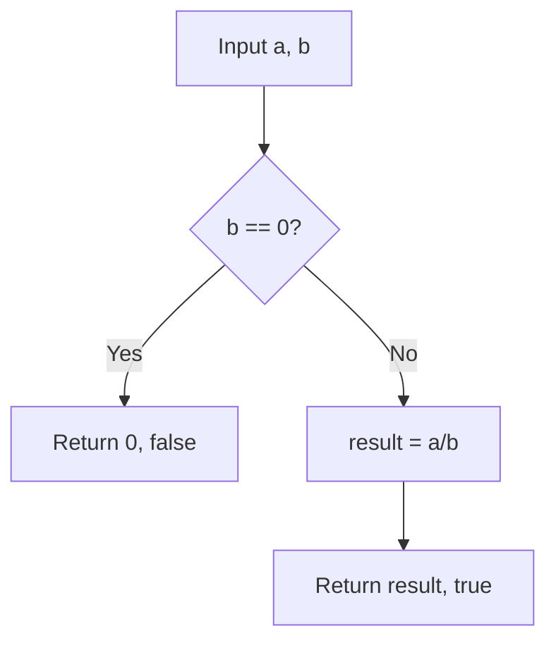
```
Trace: (10, 2) → b≠0 → result=5.0, ok=true → return
```

### Interviewer Questions
1. Why named returns? — Self-documenting; readable bare returns in short functions.
2. Can it be optimized? — Already optimal.
3. Scale to 10M? — Stateless; goroutines call independently.
4. Edge cases? — NaN, Inf from math package; handle explicitly.
5. Goroutine-safe? — Yes.
6. Memory impact? — Zero heap.
7. Alternative? — Return (float64, error) for production APIs.

### Follow-Up Questions
**Q1:** What are the zero values of the named returns? **A1:** float64→0.0, bool→false.
**Q2:** Are bare returns recommended in long functions? **A2:** No; they hurt readability — use explicit returns.
**Q3:** How would you return an error instead? **A3:** Change signature to `(float64, error)` and return `fmt.Errorf("division by zero")`.
**Q4:** Can named returns cause bugs? **A4:** Yes — shadowing with `:=` inside the function can lose the named value.
**Q5:** Does Go allow mixed named/unnamed returns? **A5:** No; either all named or all unnamed.

---

## Q3: Variadic Sum Function  [Level 2 — Easy]
> **Tags:** `#variadic` `#functions` `#slice`

### Problem Statement
Write a variadic function `Sum` that accepts any number of integers and returns their total. Additionally, write a helper that passes an existing slice to `Sum` using the spread operator. Demonstrate both direct call and slice expansion.

### Input / Output / Constraints
```
Input:  Sum(1, 2, 3, 4, 5)  OR  nums := []int{1,2,3}; Sum(nums...)
Output: 15  OR  6
Constraints: 0 to 10^6 arguments; values fit in int64
```

### Thought Process
1. Understand: Variadic params become a slice inside the function.
2. Pattern: Range over the slice; accumulate sum.
3. Edge cases: Zero arguments returns 0; large slices need int64.

### Brute Force
```go
// O(n) time, O(1) space
func bruteForce(nums ...int) int {
    total := 0
    for i := 0; i < len(nums); i++ {
        total += nums[i]
    }
    return total
}
```
**Time:** O(n) | **Space:** O(1)

### Better Solution
```go
func better(nums ...int) int {
    total := 0
    for _, v := range nums {
        total += v
    }
    return total
}
```
**Time:** O(n) | **Space:** O(1)

### Best Solution
```go
package main

import "fmt"

// Sum returns the total of all provided integers — O(n) time, O(1) space
func Sum(nums ...int) int {
    total := 0
    for _, v := range nums {
        total += v
    }
    return total
}

func main() {
    fmt.Println(Sum(1, 2, 3, 4, 5))      // 15

    nums := []int{1, 2, 3}
    fmt.Println(Sum(nums...))             // 6

    fmt.Println(Sum())                    // 0
}
```
**Time:** O(n) | **Space:** O(1)

### Production Considerations
| Aspect | Details |
|--------|---------|
| Scalability | O(n); for 10M items consider streaming / chunked accumulation |
| Edge Cases | Empty call returns 0; overflow for large values — use int64 |
| Error Handling | No error path; if overflow matters, return (int, error) |
| Memory | Variadic args passed as slice header; no copy if using `...` |
| Concurrency | Pure; goroutine-safe |

### Visual Explanation
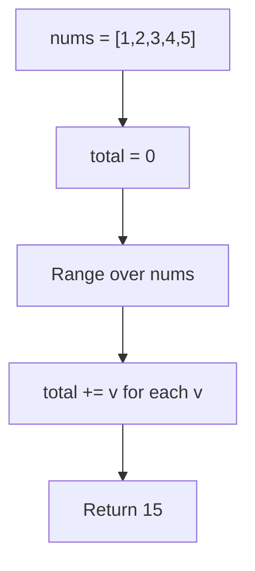
```
Trace: total=0 → +1=1 → +2=3 → +3=6 → +4=10 → +5=15 → return 15
```

### Interviewer Questions
1. Why variadic? — Caller convenience; avoids manual slice construction.
2. Can it be optimized? — No; must visit each element once.
3. Scale to 10M? — Chunked parallel sums with goroutines + sync.
4. Edge cases? — Empty input, overflow, nil slice.
5. Goroutine-safe? — Yes; no shared state.
6. Memory impact? — Slice header only; elements already in caller's memory.
7. Alternative? — Accept `[]int`; clearer for API consumers passing slices.

### Follow-Up Questions
**Q1:** What does `nums...` mean at the call site? **A1:** Spreads the slice into individual variadic arguments.
**Q2:** What is `nums` inside the function? **A2:** A `[]int` slice.
**Q3:** Can you mix fixed and variadic params? **A3:** Yes — fixed params come first: `func f(prefix string, nums ...int)`.
**Q4:** What if you pass nil? **A4:** `nil...` is valid; the variadic param becomes a nil slice; range over nil is safe, returns 0.
**Q5:** How would you parallelise for 10M integers? **A5:** Split into goroutine chunks, collect partial sums via channel, add totals.

---

## Q4: First-Class Functions & Function Types  [Level 2 — Easy]
> **Tags:** `#first-class` `#function-types` `#higher-order`

### Problem Statement
Implement an `Apply` function that takes a slice of integers and a transformation function, and returns a new slice with each element transformed. Use function types to demonstrate that functions are first-class citizens in Go. Show usage with doubling and squaring transformations.

### Input / Output / Constraints
```
Input:  []int{1, 2, 3, 4}, double func
Output: []int{2, 4, 6, 8}
Constraints: input length 0–10^5; transform is pure (no side effects)
```

### Thought Process
1. Understand: Go functions are values; pass them as arguments.
2. Pattern: Define `type TransformFn func(int) int`; iterate and apply.
3. Edge cases: Nil function, nil/empty slice.

### Brute Force
```go
// O(n) time, O(n) space
func bruteForce(nums []int, fn func(int) int) []int {
    out := make([]int, len(nums))
    for i, v := range nums {
        out[i] = fn(v)
    }
    return out
}
```
**Time:** O(n) | **Space:** O(n)

### Better Solution
```go
type TransformFn func(int) int

func better(nums []int, fn TransformFn) []int {
    if fn == nil || len(nums) == 0 {
        return nums
    }
    out := make([]int, len(nums))
    for i, v := range nums {
        out[i] = fn(v)
    }
    return out
}
```
**Time:** O(n) | **Space:** O(n)

### Best Solution
```go
package main

import "fmt"

// TransformFn is a function type for integer transformations
type TransformFn func(int) int

// Apply maps fn over nums and returns a new slice — O(n) time, O(n) space
func Apply(nums []int, fn TransformFn) []int {
    if fn == nil {
        return append([]int(nil), nums...)
    }
    out := make([]int, len(nums))
    for i, v := range nums {
        out[i] = fn(v)
    }
    return out
}

func main() {
    nums := []int{1, 2, 3, 4}

    double := TransformFn(func(x int) int { return x * 2 })
    square := TransformFn(func(x int) int { return x * x })

    fmt.Println(Apply(nums, double)) // [2 4 6 8]
    fmt.Println(Apply(nums, square)) // [1 4 9 16]
}
```
**Time:** O(n) | **Space:** O(n)

### Production Considerations
| Aspect | Details |
|--------|---------|
| Scalability | O(n); parallelise with goroutine fan-out for large n |
| Edge Cases | Nil fn — return copy; nil slice — return nil |
| Error Handling | If fn can fail, change signature to `func(int) (int, error)` |
| Memory | New slice always allocated; GC pressure on hot path |
| Concurrency | Apply itself is safe; fn must also be goroutine-safe |

### Visual Explanation
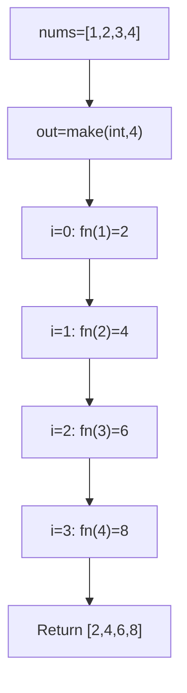
```
Trace: [] → apply double → [2,4,6,8]
```

### Interviewer Questions
1. Why define a named function type? — Documents intent; improves IDE tooling.
2. Can it be optimized? — In-place mutation avoids allocation if original not needed.
3. Scale to 10M? — Shard into goroutines; merge results.
4. Edge cases? — Nil fn, empty slice, fn with side effects.
5. Goroutine-safe? — Depends on fn; Apply itself is safe.
6. Memory impact? — O(n) new slice; consider in-place for hot paths.
7. Alternative? — Generics in Go 1.18+: `func Apply[T any](...)`.

### Follow-Up Questions
**Q1:** Can you compose two TransformFns? **A1:** Yes — `compose := func(x int) int { return f(g(x)) }`.
**Q2:** What are first-class functions? **A2:** Functions that can be stored in variables, passed as arguments, and returned from other functions.
**Q3:** How would you use generics here? **A3:** `func Apply[T, U any](items []T, fn func(T) U) []U`.
**Q4:** What if fn panics? **A4:** Recover in a defer inside Apply; return zero value + error.
**Q5:** Is function comparison possible in Go? **A5:** Only comparison to nil; two function values cannot be compared with `==`.

---

## Q5: Closures and Variable Capture  [Level 2 — Easy]
> **Tags:** `#closures` `#variable-capture` `#counter`

### Problem Statement
Write a `MakeCounter` function that returns a closure. Each call to the returned function increments an internal counter and returns the new value. The counter must be private — callers cannot reset or directly access it. Demonstrate that multiple counters are independent.

### Input / Output / Constraints
```
Input:  c1 := MakeCounter(); c1(), c1(), c1()
Output: 1, 2, 3
Constraints: counter starts at 0; each closure has its own state
```

### Thought Process
1. Understand: A closure captures variables from its enclosing scope by reference.
2. Pattern: Declare `count` in outer function; return inner function that increments it.
3. Edge cases: Multiple closures from MakeCounter must not share state.

### Brute Force
```go
// O(1) time, O(1) space
var globalCount int
func bruteForce() int {
    globalCount++
    return globalCount
}
// Problem: global state is shared — not correct
```
**Time:** O(1) | **Space:** O(1)

### Better Solution
```go
func better() func() int {
    count := 0
    return func() int {
        count++
        return count
    }
}
```
**Time:** O(1) | **Space:** O(1)

### Best Solution
```go
package main

import "fmt"

// MakeCounter returns a closure with private counter state — O(1) time, O(1) space
func MakeCounter() func() int {
    count := 0
    return func() int {
        count++
        return count
    }
}

func main() {
    c1 := MakeCounter()
    c2 := MakeCounter()

    fmt.Println(c1(), c1(), c1()) // 1 2 3
    fmt.Println(c2(), c2())       // 1 2  — independent state
}
```
**Time:** O(1) | **Space:** O(1)

### Production Considerations
| Aspect | Details |
|--------|---------|
| Scalability | Each closure is O(1); create as many as needed |
| Edge Cases | Overflow at MaxInt — add check or use int64 |
| Error Handling | No error surface; add if overflow check added |
| Memory | Each closure heap-allocates its captured `count` variable |
| Concurrency | Not goroutine-safe — wrap with sync.Mutex or use atomic |

### Visual Explanation
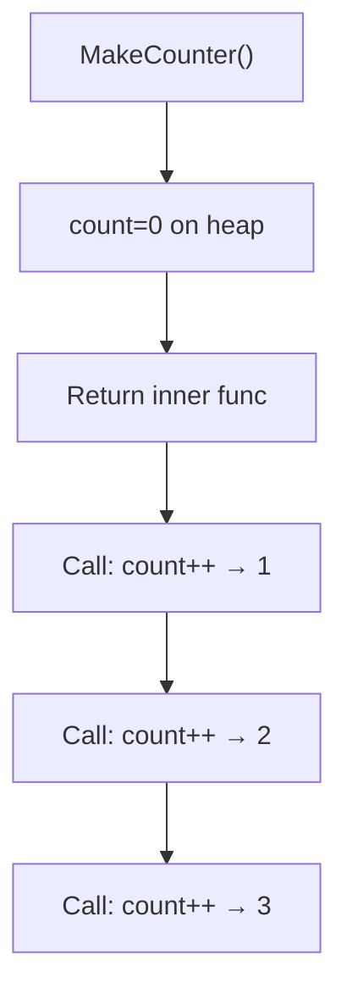
```
Trace: count=0 → call→1 → call→2 → call→3
```

### Interviewer Questions
1. Why heap? — Captured variable escapes the outer function's stack frame.
2. Can it be optimized? — Use sync/atomic for lock-free concurrent counter.
3. Scale to 10M? — Atomic counter; sharded counters for extreme throughput.
4. Edge cases? — Integer overflow; concurrent calls.
5. Goroutine-safe? — No; add sync.Mutex or atomic.AddInt64.
6. Memory impact? — One int per closure on heap; negligible.
7. Alternative? — Struct with method; more explicit but heavier syntax.

### Follow-Up Questions
**Q1:** Where is `count` stored? **A1:** On the heap, because it escapes via the returned closure.
**Q2:** How to make it goroutine-safe? **A2:** Use `var count int64` with `atomic.AddInt64(&count, 1)`.
**Q3:** Can two goroutines share the same counter? **A3:** Yes, but you need synchronisation — mutex or atomic.
**Q4:** Can the closure capture a pointer instead? **A4:** Yes — closures capture by reference, so capturing a pointer captures the pointer value.
**Q5:** What is "variable escape"? **A5:** When the compiler detects a variable's lifetime exceeds its stack frame and moves it to the heap.

---

## Q6: The Goroutine Loop Bug and Fix  [Level 3 — Medium]
> **Tags:** `#closures` `#goroutine-bug` `#loop-capture` `#concurrency`

### Problem Statement
The classic Go goroutine loop bug occurs when a closure inside a loop captures the loop variable by reference. All goroutines end up seeing the final value of the variable. Demonstrate the bug with a loop launching goroutines and show two fixes: passing the value as a parameter, and creating a local copy.

### Input / Output / Constraints
```
Input:  for i := 0 to 4, launch goroutine printing i
Output (buggy):  5 5 5 5 5  (or any repeated final value)
Output (fixed):  0 1 2 3 4  (in some order)
Constraints: goroutines must print their assigned index
```

### Thought Process
1. Understand: Loop variable `i` is a single address; all closures share it.
2. Pattern: Fix 1 — pass `i` as function parameter. Fix 2 — shadow `i` locally.
3. Edge cases: Race condition in buggy version; WaitGroup needed for ordering demo.

### Brute Force
```go
// O(n) time — BUGGY VERSION
import (
    "fmt"
    "sync"
)
func bruteForce() {
    var wg sync.WaitGroup
    for i := 0; i < 5; i++ {
        wg.Add(1)
        go func() {
            defer wg.Done()
            fmt.Println(i) // captures i by reference — prints 5,5,5,5,5
        }()
    }
    wg.Wait()
}
```
**Time:** O(n) | **Space:** O(n)

### Better Solution
```go
// Fix 1: pass i as parameter
func better() {
    var wg sync.WaitGroup
    for i := 0; i < 5; i++ {
        wg.Add(1)
        go func(n int) {
            defer wg.Done()
            fmt.Println(n)
        }(i) // i copied into n at call time
    }
    wg.Wait()
}
```
**Time:** O(n) | **Space:** O(n)

### Best Solution
```go
package main

import (
    "fmt"
    "sync"
)

// BuggyLoop demonstrates the closure loop bug
func BuggyLoop() {
    var wg sync.WaitGroup
    for i := 0; i < 5; i++ {
        wg.Add(1)
        go func() {
            defer wg.Done()
            fmt.Println("buggy:", i) // i captured by reference
        }()
    }
    wg.Wait()
}

// FixedParam fixes by passing i as a parameter — O(n) time, O(n) space
func FixedParam() {
    var wg sync.WaitGroup
    for i := 0; i < 5; i++ {
        wg.Add(1)
        go func(n int) {
            defer wg.Done()
            fmt.Println("param fix:", n)
        }(i)
    }
    wg.Wait()
}

// FixedShadow fixes by shadowing i with a local copy
func FixedShadow() {
    var wg sync.WaitGroup
    for i := 0; i < 5; i++ {
        i := i // new variable per iteration
        wg.Add(1)
        go func() {
            defer wg.Done()
            fmt.Println("shadow fix:", i)
        }()
    }
    wg.Wait()
}

func main() {
    fmt.Println("--- Buggy ---")
    BuggyLoop()
    fmt.Println("--- Param Fix ---")
    FixedParam()
    fmt.Println("--- Shadow Fix ---")
    FixedShadow()
}
```
**Time:** O(n) | **Space:** O(n)

### Production Considerations
| Aspect | Details |
|--------|---------|
| Scalability | Both fixes scale linearly with loop count |
| Edge Cases | n=0 loop — no goroutines launched; WaitGroup.Wait returns immediately |
| Error Handling | Goroutine panics are not recovered here — add recover in production |
| Memory | Each goroutine stack ~2KB minimum; limit concurrent goroutines |
| Concurrency | Go 1.22+ changed loop variable semantics — each iteration gets its own variable |

### Visual Explanation
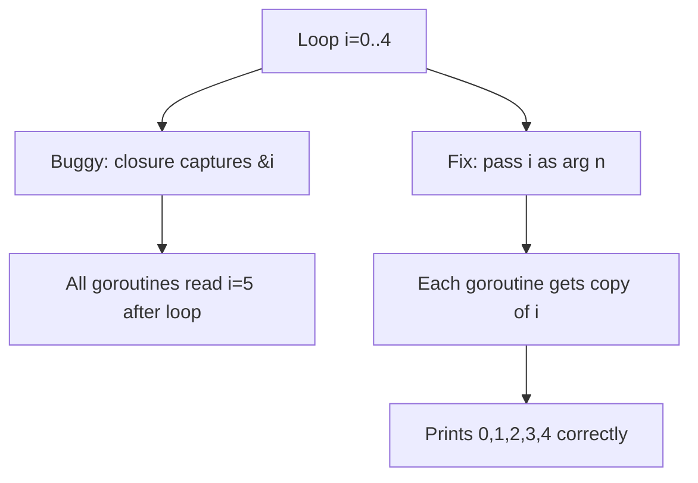
```
Trace (bug): i=0→goroutine starts, i=1→goroutine starts ... i=5→loop done → all read 5
Trace (fix): n=0 copied, n=1 copied ... each goroutine prints its n
```

### Interviewer Questions
1. Why does the bug happen? — Closure captures the variable address, not the value.
2. Can it be optimized? — Semantic fix, not performance; Go 1.22 fixes automatically.
3. Scale to 10M? — Use worker pool; don't launch 10M goroutines.
4. Edge cases? — n=0; loop with index manipulation inside body.
5. Goroutine-safe? — Buggy version has a data race; fixed versions are safe.
6. Memory impact? — Each goroutine costs ~2KB stack; pool goroutines for large n.
7. Alternative? — Go 1.22+ per-iteration variable; use `go func(n int)(i)` idiom.

### Follow-Up Questions
**Q1:** Does Go 1.22 fix this? **A1:** Yes — loop variables are per-iteration in Go 1.22+, eliminating the bug.
**Q2:** How do you detect this with tooling? **A2:** `go vet` and the race detector (`go test -race`) catch it.
**Q3:** What is a worker pool? **A3:** A fixed number of goroutines consuming from a channel, preventing goroutine explosion.
**Q4:** Can the shadow fix cause confusion? **A4:** Yes — two variables named `i` in the same function is a code smell; prefer the param fix.
**Q5:** What is `sync.WaitGroup` doing? **A5:** Counting active goroutines; `Wait()` blocks until all call `Done()`.

---

## Q7: Recursive Fibonacci with Memoization  [Level 3 — Medium]
> **Tags:** `#recursion` `#memoization` `#closures` `#dynamic-programming`

### Problem Statement
Implement a memoized Fibonacci function using a closure to encapsulate the cache. The naive recursive version is exponential; memoization reduces it to linear. Return the nth Fibonacci number where F(0)=0, F(1)=1.

### Input / Output / Constraints
```
Input:  n=10
Output: 55
Constraints: 0 ≤ n ≤ 90 (fits in int64); function must cache results
```

### Thought Process
1. Understand: fib(n) = fib(n-1) + fib(n-2); naive is O(2^n).
2. Pattern: Use a map inside a closure as cache; check before recursing.
3. Edge cases: n=0 returns 0, n=1 returns 1; n>90 overflows int64.

### Brute Force
```go
// O(2^n) time, O(n) space
func bruteForce(n int) int {
    if n <= 1 {
        return n
    }
    return bruteForce(n-1) + bruteForce(n-2)
}
```
**Time:** O(2^n) | **Space:** O(n)

### Better Solution
```go
// Iterative — O(n) time, O(1) space
func better(n int) int {
    if n <= 1 {
        return n
    }
    a, b := 0, 1
    for i := 2; i <= n; i++ {
        a, b = b, a+b
    }
    return b
}
```
**Time:** O(n) | **Space:** O(1)

### Best Solution
```go
package main

import "fmt"

// MakeFib returns a memoized Fibonacci function — O(n) time, O(n) space
func MakeFib() func(int) int {
    cache := map[int]int{}
    var fib func(int) int
    fib = func(n int) int {
        if n <= 1 {
            return n
        }
        if v, ok := cache[n]; ok {
            return v
        }
        result := fib(n-1) + fib(n-2)
        cache[n] = result
        return result
    }
    return fib
}

func main() {
    fib := MakeFib()
    for i := 0; i <= 10; i++ {
        fmt.Printf("fib(%d) = %d\n", i, fib(i))
    }
}
```
**Time:** O(n) | **Space:** O(n)

### Production Considerations
| Aspect | Details |
|--------|---------|
| Scalability | O(n) first call; O(1) cached calls; cache grows to n entries |
| Edge Cases | n<0 — add guard; n>90 — int64 overflow; use big.Int for large n |
| Error Handling | Return (int, error) for out-of-range n |
| Memory | Cache holds n entries; acceptable for n≤90 |
| Concurrency | Map is not goroutine-safe — use sync.Map or mutex |

### Visual Explanation
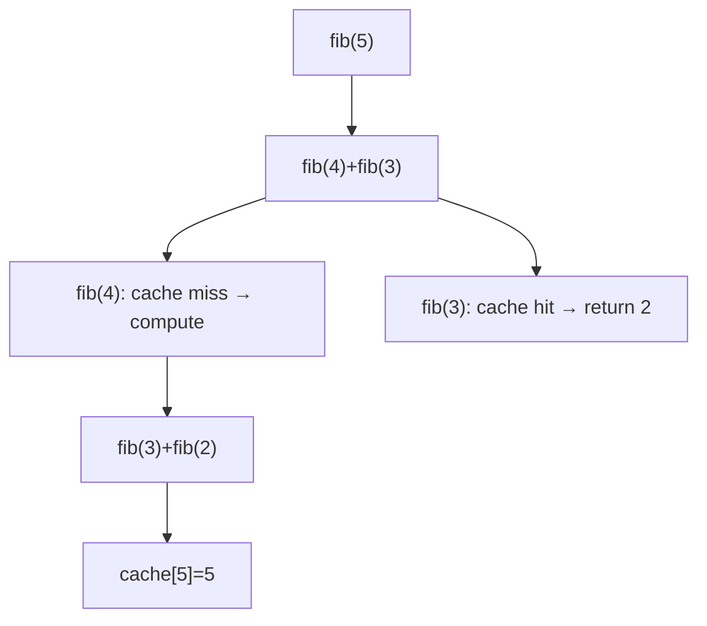
```
Trace: fib(5)→fib(4)+fib(3)→...→cache populated→fib(5)=5
```

### Interviewer Questions
1. Why closure for cache? — Encapsulates state; prevents global variable.
2. Can it be optimized? — Iterative O(1) space is better for single calls.
3. Scale to 10M calls? — Pre-compute table; serve from array.
4. Edge cases? — Negative n, overflow, concurrent access.
5. Goroutine-safe? — No; add sync.RWMutex around map access.
6. Memory impact? — O(n) map; use array for known max n.
7. Alternative? — Matrix exponentiation for O(log n) time.

### Follow-Up Questions
**Q1:** Why declare `var fib func(int) int` before assigning? **A1:** Allows the closure to reference itself recursively; `:=` inside a closure cannot self-reference.
**Q2:** What is the max safe n for int64? **A2:** fib(93) overflows int64; use big.Int for n>92.
**Q3:** How to make the cache goroutine-safe? **A3:** Replace `map` with `sync.Map` or guard reads/writes with `sync.RWMutex`.
**Q4:** When is iterative better than memoized recursive? **A4:** When space is constrained or call depth risks stack overflow.
**Q5:** What is matrix exponentiation for Fibonacci? **A5:** Computes fib(n) in O(log n) using repeated matrix multiplication.

---

## Q8: Defer — LIFO Order and Cleanup  [Level 3 — Medium]
> **Tags:** `#defer` `#cleanup` `#lifo` `#resource-management`

### Problem Statement
Demonstrate Go's `defer` mechanism by writing a function that opens multiple "resources" (simulated with strings), processes them, and ensures they are closed in reverse (LIFO) order even if an error occurs mid-way. Show how defer arguments are evaluated eagerly.

### Input / Output / Constraints
```
Input:  resources = ["db", "cache", "file"]
Output: open db → open cache → open file → close file → close cache → close db
Constraints: close must run even on panic; order must be LIFO
```

### Thought Process
1. Understand: `defer` statements run in LIFO order when the surrounding function returns.
2. Pattern: Loop over resources; defer close for each after open.
3. Edge cases: Panic mid-open — already-deferred closes still run.

### Brute Force
```go
// O(n) time — manual cleanup, error-prone
func bruteForce(resources []string) {
    for _, r := range resources {
        fmt.Println("open", r)
    }
    // manual reverse close — easy to forget
    for i := len(resources) - 1; i >= 0; i-- {
        fmt.Println("close", resources[i])
    }
}
```
**Time:** O(n) | **Space:** O(n)

### Better Solution
```go
func better(resources []string) {
    for _, r := range resources {
        r := r // capture
        fmt.Println("open", r)
        defer fmt.Println("close", r)
    }
}
```
**Time:** O(n) | **Space:** O(n)

### Best Solution
```go
package main

import "fmt"

// openResource simulates opening a resource and defers its close — O(1) per resource
func openResource(name string) func() {
    fmt.Println("open:", name)
    return func() { fmt.Println("close:", name) }
}

// ProcessResources opens all resources with guaranteed LIFO cleanup — O(n) time, O(n) space
func ProcessResources(resources []string) {
    for _, r := range resources {
        close := openResource(r)
        defer close()
    }
    fmt.Println("processing...")
}

func main() {
    ProcessResources([]string{"db", "cache", "file"})
}
// Output:
// open: db
// open: cache
// open: file
// processing...
// close: file
// close: cache
// close: db
```
**Time:** O(n) | **Space:** O(n)

### Production Considerations
| Aspect | Details |
|--------|---------|
| Scalability | Defer stack grows with n; avoid defer in tight loops — call close explicitly |
| Edge Cases | Panic between opens — already-deferred closes run; partially-opened resources cleaned |
| Error Handling | Defer runs before error return; named return can capture deferred error |
| Memory | Each defer pushes a stack frame; O(n) for n defers |
| Concurrency | Defer is per-goroutine; safe |

### Visual Explanation
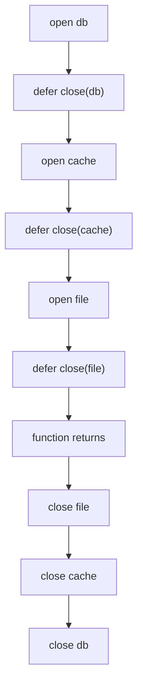
```
Trace: open db→open cache→open file→return→close file→close cache→close db
```

### Interviewer Questions
1. Why LIFO? — Mirrors acquisition order; inner resources often depend on outer ones.
2. Can it be optimized? — For tight loops, manual cleanup avoids defer overhead.
3. Scale to 10M? — Don't defer in hot loops; use explicit close with error handling.
4. Edge cases? — Panic recovery; error from deferred close (use named return).
5. Goroutine-safe? — Defer is per-goroutine; yes.
6. Memory impact? — Each defer allocates a stack entry.
7. Alternative? — `context.WithCancel` for propagated cleanup in concurrent code.

### Follow-Up Questions
**Q1:** When are defer arguments evaluated? **A1:** At the `defer` statement, not when the deferred function runs — arguments are captured eagerly.
**Q2:** Can a deferred function modify named return values? **A2:** Yes — named returns can be read/written by deferred functions.
**Q3:** What happens if a deferred function panics? **A3:** The panic propagates; other deferred functions still run.
**Q4:** How do you capture a deferred close error? **A4:** Use a named return: `func f() (err error) { defer func() { err = r.Close() }() }`.
**Q5:** Should you defer in a loop? **A5:** No — defers accumulate until function return, causing memory pressure; call close explicitly in the loop body.

---

## Q9: Function Pipeline  [Level 3 — Medium]
> **Tags:** `#pipeline` `#higher-order` `#function-composition` `#closures`

### Problem Statement
Build a `Pipeline` function that chains multiple `TransformFn` functions together. Each function's output becomes the next function's input. The pipeline should be callable as a single function. Demonstrate with a numeric processing pipeline: double → add10 → square.

### Input / Output / Constraints
```
Input:  Pipeline(double, add10, square)(3)
Output: ((3*2)+10)^2 = 256
Constraints: at least one function required; pipeline is left-to-right
```

### Thought Process
1. Understand: Compose f1, f2, f3 into h where h(x) = f3(f2(f1(x))).
2. Pattern: Reduce over the function slice; accumulate composed function.
3. Edge cases: Empty pipeline — return identity function.

### Brute Force
```go
// O(k) composition, O(1) per call
func bruteForce(x int, fns ...func(int) int) int {
    for _, fn := range fns {
        x = fn(x)
    }
    return x
}
```
**Time:** O(k) per call | **Space:** O(1)

### Better Solution
```go
type Fn func(int) int
func better(fns ...Fn) Fn {
    return func(x int) int {
        for _, f := range fns {
            x = f(x)
        }
        return x
    }
}
```
**Time:** O(k) per call | **Space:** O(k) closure |

### Best Solution
```go
package main

import "fmt"

// Fn is a unary integer transform
type Fn func(int) int

// Pipeline composes fns left-to-right into a single Fn — O(k) per call, O(k) space
func Pipeline(fns ...Fn) Fn {
    if len(fns) == 0 {
        return func(x int) int { return x } // identity
    }
    return func(x int) int {
        for _, f := range fns {
            x = f(x)
        }
        return x
    }
}

func main() {
    double := Fn(func(x int) int { return x * 2 })
    add10  := Fn(func(x int) int { return x + 10 })
    square := Fn(func(x int) int { return x * x })

    p := Pipeline(double, add10, square)
    fmt.Println(p(3)) // ((3*2)+10)^2 = 256
    fmt.Println(p(5)) // ((5*2)+10)^2 = 400
}
```
**Time:** O(k) per call | **Space:** O(k)

### Production Considerations
| Aspect | Details |
|--------|---------|
| Scalability | k functions in pipeline; amortised over many calls |
| Edge Cases | Empty pipeline — return identity; nil fn in slice — guard with nil check |
| Error Handling | Change Fn to `func(int) (int, error)`; short-circuit on error |
| Memory | Closure captures slice of k function pointers |
| Concurrency | Pipeline itself is stateless; safe if individual fns are safe |

### Visual Explanation
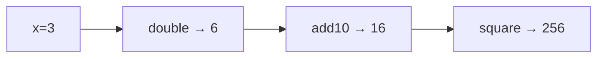
```
Trace: 3 →×2→ 6 →+10→ 16 →²→ 256
```

### Interviewer Questions
1. Why return a Fn instead of calling inline? — Reusable composed function; single construction, many calls.
2. Can it be optimized? — Precomputed composition; no further optimisation possible.
3. Scale to 10M calls? — O(k) per call is already minimal; parallelise at the call level.
4. Edge cases? — Empty pipeline, nil function, function that errors.
5. Goroutine-safe? — Yes if all fns are pure.
6. Memory impact? — k function pointers in closure; negligible.
7. Alternative? — Generic Pipeline[T] in Go 1.18+.

### Follow-Up Questions
**Q1:** How would you add error propagation? **A1:** Change `Fn` to `func(int) (int, error)` and short-circuit on non-nil error.
**Q2:** What is the difference between pipeline and middleware? **A2:** Pipeline applies fns sequentially to data; middleware wraps handler execution (request/response).
**Q3:** Can Pipeline be lazy (streaming)? **A3:** Yes — use channels; each stage is a goroutine reading/writing.
**Q4:** How do you test a pipeline? **A4:** Unit test each Fn; integration test the composed pipeline with known inputs/outputs.
**Q5:** What is a transducer? **A5:** A composable transformation that combines map/filter without intermediate allocations; similar concept to Pipeline but for collections.

---

## Q10: Defer with Named Returns for Error Wrapping  [Level 3 — Medium]
> **Tags:** `#defer` `#named-returns` `#error-handling` `#middleware`

### Problem Statement
Write a function `FetchUser` that simulates a database call. Use a deferred function with named return values to automatically wrap any error with context (e.g., "FetchUser: <original error>"). This pattern eliminates repetitive error-wrapping at each return site.

### Input / Output / Constraints
```
Input:  FetchUser(0)   — invalid ID
Output: error: "FetchUser: invalid user ID: 0"
Input:  FetchUser(42)  — valid ID
Output: User{ID:42, Name:"Alice"}, nil
Constraints: all errors must be wrapped; happy path returns nil error
```

### Thought Process
1. Understand: Named return `err` can be modified by a deferred func before caller sees it.
2. Pattern: `defer func() { if err != nil { err = fmt.Errorf("FetchUser: %w", err) } }()`.
3. Edge cases: Happy path — err is nil; defer skips wrapping. Panic — defer still runs.

### Brute Force
```go
// O(1) — manual wrapping at every return site
func bruteForce(id int) (User, error) {
    if id <= 0 {
        return User{}, fmt.Errorf("FetchUser: invalid user ID: %d", id)
    }
    u, err := db.Get(id)
    if err != nil {
        return User{}, fmt.Errorf("FetchUser: %w", err)
    }
    return u, nil
}
```
**Time:** O(1) | **Space:** O(1)

### Better Solution
```go
func better(id int) (u User, err error) {
    defer func() {
        if err != nil {
            err = fmt.Errorf("FetchUser: %w", err)
        }
    }()
    if id <= 0 {
        err = fmt.Errorf("invalid user ID: %d", id)
        return
    }
    u = User{ID: id, Name: "Alice"}
    return
}
```
**Time:** O(1) | **Space:** O(1)

### Best Solution
```go
package main

import (
    "errors"
    "fmt"
)

// User represents a domain user
type User struct {
    ID   int
    Name string
}

// ErrInvalidID is a sentinel for invalid user IDs
var ErrInvalidID = errors.New("invalid user ID")

// FetchUser simulates DB fetch with automatic error wrapping — O(1) time, O(1) space
func FetchUser(id int) (u User, err error) {
    defer func() {
        if err != nil {
            err = fmt.Errorf("FetchUser: %w", err)
        }
    }()

    if id <= 0 {
        err = fmt.Errorf("%w: %d", ErrInvalidID, id)
        return
    }
    // Simulate DB
    u = User{ID: id, Name: "Alice"}
    return
}

func main() {
    u, err := FetchUser(42)
    fmt.Println(u, err) // {42 Alice} <nil>

    _, err = FetchUser(0)
    fmt.Println(err)                         // FetchUser: invalid user ID: 0
    fmt.Println(errors.Is(err, ErrInvalidID)) // true — %w preserves chain
}
```
**Time:** O(1) | **Space:** O(1)

### Production Considerations
| Aspect | Details |
|--------|---------|
| Scalability | Constant time; no scalability concern |
| Edge Cases | Panic in function body — deferred wrapper still runs on recover |
| Error Handling | Use `%w` to preserve error unwrapping; sentinel errors remain detectable |
| Memory | One deferred closure per call; negligible |
| Concurrency | Pure function; goroutine-safe |

### Visual Explanation
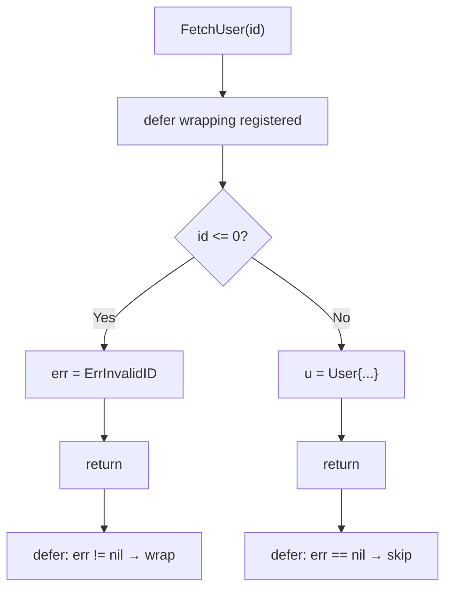
```
Trace: id=0 → err set → return → defer wraps → caller sees "FetchUser: invalid user ID: 0"
```

### Interviewer Questions
1. Why named return? — Allows defer to read and modify the return value.
2. Can it be optimized? — Already minimal; the defer adds one allocation.
3. Scale to 10M? — Stateless; trivially parallelisable.
4. Edge cases? — Panic — recover in defer if needed; nil error — skip wrapping.
5. Goroutine-safe? — Yes.
6. Memory impact? — One closure per call; GC handles it.
7. Alternative? — Explicit wrapping at each return; less DRY but more explicit.

### Follow-Up Questions
**Q1:** Does `%w` support `errors.Is` and `errors.As`? **A1:** Yes — `%w` wraps the error preserving the chain for unwrapping.
**Q2:** What if the deferred function itself errors? **A2:** Assign to `err` only if nil to avoid overwriting a real error: `if err == nil { err = deferErr }`.
**Q3:** Can you stack multiple defer wrappers? **A3:** Yes — they run LIFO, each seeing the err set by the previous one.
**Q4:** What is a sentinel error? **A4:** A package-level `var ErrX = errors.New(...)` used as a stable error identity for `errors.Is` checks.
**Q5:** When should you NOT use this pattern? **A5:** When different return sites need different wrapping messages — use explicit wrapping per site.

---

## Q11: Middleware Pattern via Closures  [Level 4 — Advanced]
> **Tags:** `#middleware` `#closures` `#higher-order` `#http`

### Problem Statement
Implement an HTTP-style middleware chain using closures. Define a `HandlerFunc` type and a `Middleware` type. Build `Logger` and `Auth` middlewares, and a `Chain` function that composes them. The innermost handler should only execute if all middlewares pass.

### Input / Output / Constraints
```
Input:  Chain(Logger, Auth)(finalHandler) called with request
Output: [LOG] → [AUTH check] → [handler] → response
Constraints: middlewares wrap in order; short-circuit on auth failure
```

### Thought Process
1. Understand: Middleware = function that takes a handler and returns a new handler.
2. Pattern: Each middleware closes over the next handler; Chain reduces right-to-left.
3. Edge cases: Empty chain returns handler as-is; auth failure must not call next.

### Brute Force
```go
// Manual wrapping — O(k) wrappers
func bruteForce(h HandlerFunc) HandlerFunc {
    h = Auth(h)
    h = Logger(h)
    return h
}
```
**Time:** O(k) setup | **Space:** O(k)

### Better Solution
```go
type HandlerFunc func(w http.ResponseWriter, r *http.Request)
type Middleware func(HandlerFunc) HandlerFunc

func better(h HandlerFunc, mws ...Middleware) HandlerFunc {
    for i := len(mws) - 1; i >= 0; i-- {
        h = mws[i](h)
    }
    return h
}
```
**Time:** O(k) setup | **Space:** O(k)

### Best Solution
```go
package main

import (
    "fmt"
    "net/http"
)

// HandlerFunc handles an HTTP request
type HandlerFunc func(w http.ResponseWriter, r *http.Request)

// Middleware wraps a HandlerFunc
type Middleware func(HandlerFunc) HandlerFunc

// Logger middleware logs the request method and URL
func Logger(next HandlerFunc) HandlerFunc {
    return func(w http.ResponseWriter, r *http.Request) {
        fmt.Printf("[LOG] %s %s\n", r.Method, r.URL.Path)
        next(w, r)
    }
}

// Auth middleware checks for a token header
func Auth(next HandlerFunc) HandlerFunc {
    return func(w http.ResponseWriter, r *http.Request) {
        if r.Header.Get("X-Token") == "" {
            http.Error(w, "unauthorized", http.StatusUnauthorized)
            return // do NOT call next
        }
        next(w, r)
    }
}

// Chain composes middlewares left-to-right — O(k) time, O(k) space
func Chain(mws ...Middleware) Middleware {
    return func(final HandlerFunc) HandlerFunc {
        for i := len(mws) - 1; i >= 0; i-- {
            final = mws[i](final)
        }
        return final
    }
}

func main() {
    hello := HandlerFunc(func(w http.ResponseWriter, r *http.Request) {
        fmt.Fprintln(w, "Hello, World!")
    })

    chain := Chain(Logger, Auth)
    http.HandleFunc("/", func(w http.ResponseWriter, r *http.Request) {
        chain(hello)(w, r)
    })
    fmt.Println("Server running on :8080")
    // http.ListenAndServe(":8080", nil)
}
```
**Time:** O(k) setup, O(k) per request | **Space:** O(k)

### Production Considerations
| Aspect | Details |
|--------|---------|
| Scalability | Closure chain is O(k) deep; negligible overhead per request |
| Edge Cases | Panic in middleware — recover at the outermost layer |
| Error Handling | Middlewares write HTTP errors and return early to short-circuit |
| Memory | k closure objects per handler registration; reuse across requests |
| Concurrency | Each request gets its own call stack; no shared mutable state |

### Visual Explanation
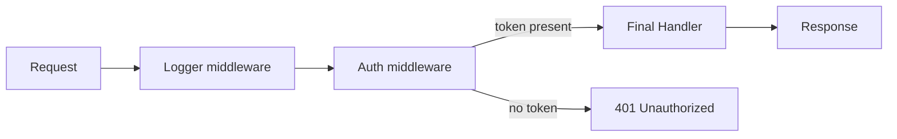
```
Trace: request → Logger logs → Auth checks token → handler writes response
```

### Interviewer Questions
1. Why reverse loop in Chain? — Left-to-right composition requires right-to-left wrapping.
2. Can it be optimized? — Pre-build the chain once; reuse per request.
3. Scale to 10M RPS? — Handler chain is stateless; scale horizontally.
4. Edge cases? — Middleware panic, missing headers, nil next handler.
5. Goroutine-safe? — Yes if middlewares don't mutate shared state.
6. Memory impact? — k closures per registered route; acceptable.
7. Alternative? — Use `net/http` middleware libs (chi, gorilla/mux).

### Follow-Up Questions
**Q1:** What is the difference between this and decorator pattern? **A1:** Functionally identical — middleware IS the decorator pattern for functions.
**Q2:** How do you pass context between middlewares? **A2:** Use `r.WithContext(context.WithValue(r.Context(), key, val))`.
**Q3:** How would you add rate limiting as middleware? **A3:** Wrap handler; check a token bucket or counter before calling next.
**Q4:** Can middlewares be added per-route? **A4:** Yes — create different chains for different routes.
**Q5:** What is the "next" pattern vs the "wrap" pattern? **A5:** Identical concept; "next" is the Go/Node term, "wrap" is the Python/Java term.

---

## Q12: Memoization with Expiry using Closures  [Level 4 — Advanced]
> **Tags:** `#memoization` `#closures` `#ttl` `#caching`

### Problem Statement
Build a generic memoization wrapper `Memoize` that caches the result of any `func(string) (string, error)` call. The cache entry should expire after a configurable TTL. Use closures to encapsulate the cache map and expiry logic without exposing them to the caller.

### Input / Output / Constraints
```
Input:  memoized := Memoize(expensiveFn, 5*time.Second); memoized("key")
Output: first call invokes fn; subsequent calls within TTL return cached value
Constraints: TTL > 0; thread-safe; different keys are independent
```

### Thought Process
1. Understand: Cache maps key → (value, expiry time); check expiry on each get.
2. Pattern: Closure captures `map` and `sync.Mutex`; compare `time.Now()` to stored expiry.
3. Edge cases: Expired entry, concurrent access, fn returning error (don't cache error).

### Brute Force
```go
// O(1) amortised, no expiry
var cache = map[string]string{}
func bruteForce(fn func(string) (string, error), key string) (string, error) {
    if v, ok := cache[key]; ok {
        return v, nil
    }
    v, err := fn(key)
    if err == nil {
        cache[key] = v
    }
    return v, err
}
```
**Time:** O(1) | **Space:** O(n keys)

### Better Solution
```go
type entry struct {
    value  string
    expiry time.Time
}
func better(fn func(string)(string,error), ttl time.Duration) func(string)(string,error) {
    var mu sync.Mutex
    cache := map[string]entry{}
    return func(key string) (string, error) {
        mu.Lock()
        defer mu.Unlock()
        if e, ok := cache[key]; ok && time.Now().Before(e.expiry) {
            return e.value, nil
        }
        v, err := fn(key)
        if err == nil {
            cache[key] = entry{v, time.Now().Add(ttl)}
        }
        return v, err
    }
}
```
**Time:** O(1) avg | **Space:** O(n keys)

### Best Solution
```go
package main

import (
    "fmt"
    "sync"
    "time"
)

type cacheEntry struct {
    value  string
    expiry time.Time
}

// Memoize wraps fn with a TTL cache — O(1) avg time, O(n) space
func Memoize(fn func(string) (string, error), ttl time.Duration) func(string) (string, error) {
    var mu sync.RWMutex
    cache := make(map[string]cacheEntry)

    return func(key string) (string, error) {
        // Fast path: read lock
        mu.RLock()
        if e, ok := cache[key]; ok && time.Now().Before(e.expiry) {
            mu.RUnlock()
            return e.value, nil
        }
        mu.RUnlock()

        // Slow path: write lock
        mu.Lock()
        defer mu.Unlock()
        // Double-check after acquiring write lock
        if e, ok := cache[key]; ok && time.Now().Before(e.expiry) {
            return e.value, nil
        }
        v, err := fn(key)
        if err != nil {
            return "", err
        }
        cache[key] = cacheEntry{value: v, expiry: time.Now().Add(ttl)}
        return v, nil
    }
}

func main() {
    calls := 0
    expensive := func(key string) (string, error) {
        calls++
        time.Sleep(10 * time.Millisecond)
        return "result:" + key, nil
    }

    mfn := Memoize(expensive, 2*time.Second)

    v1, _ := mfn("hello")
    v2, _ := mfn("hello") // cache hit
    fmt.Println(v1, v2, "calls:", calls) // result:hello result:hello calls: 1
}
```
**Time:** O(1) avg | **Space:** O(n keys)

### Production Considerations
| Aspect | Details |
|--------|---------|
| Scalability | O(n) memory; add LRU eviction for bounded size |
| Edge Cases | fn errors — do not cache; TTL=0 — always call fn; expired entries — refresh |
| Error Handling | Only cache successful results; return errors directly |
| Memory | Unbounded growth without eviction policy |
| Concurrency | RWMutex with double-checked locking prevents thundering herd |

### Visual Explanation
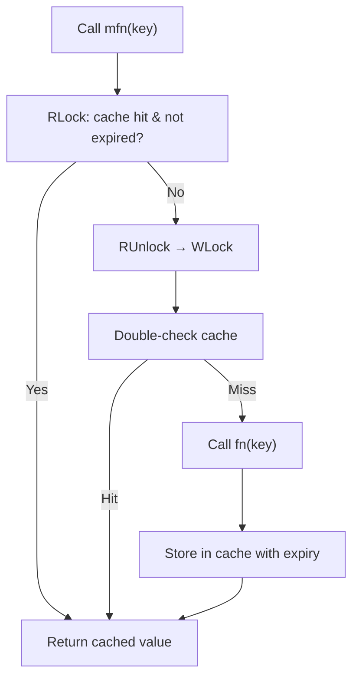
```
Trace: first call → miss → fn() → cache → second call → hit → return cached
```

### Interviewer Questions
1. Why double-checked locking? — Prevents multiple goroutines from calling fn for the same key.
2. Can it be optimized? — Use singleflight to deduplicate in-flight requests.
3. Scale to 10M keys? — Add LRU eviction; shard the map by key hash.
4. Edge cases? — TTL=0, fn panics, key is empty string.
5. Goroutine-safe? — Yes — RWMutex protects cache; double-check prevents races.
6. Memory impact? — Unbounded; add eviction (groupcache, bigcache).
7. Alternative? — `golang.org/x/sync/singleflight` for in-flight deduplication.

### Follow-Up Questions
**Q1:** What is thundering herd? **A1:** Many goroutines simultaneously calling fn for the same expired key; double-checked locking mitigates it.
**Q2:** What is singleflight? **A2:** A package that ensures only one in-flight call per key; others wait and share the result.
**Q3:** How would you add LRU eviction? **A3:** Use a doubly-linked list + map; on each access move entry to front; evict from back when capacity exceeded.
**Q4:** When should you NOT cache errors? **A4:** Transient errors (network timeout) should not be cached; permanent errors (invalid key) may be cached.
**Q5:** How do you test cache expiry? **A5:** Use `time.Sleep` in tests or inject a clock interface for deterministic testing.

---

## Q13: Recursive Tree Traversal with Closures  [Level 4 — Advanced]
> **Tags:** `#recursion` `#closures` `#trees` `#accumulator`

### Problem Statement
Define a binary tree and implement an `InOrderCollect` function that uses a closure as a visitor to collect node values. The closure captures an external slice, building the result without returning values up the call stack. Extend to support early termination via a `stop` flag captured in the closure.

### Input / Output / Constraints
```
Input:  BST with values [4,2,6,1,3,5,7]
Output: in-order: [1,2,3,4,5,6,7]
Constraints: balanced and unbalanced trees; nil nodes handled
```

### Thought Process
1. Understand: In-order = left → node → right; closure captures result slice.
2. Pattern: Pass visitor closure to recursive helper; closure mutates captured slice.
3. Edge cases: Nil root, single node, early termination.

### Brute Force
```go
// O(n) time, O(n) space — returns slice (no closure)
func bruteForce(root *Node) []int {
    if root == nil { return nil }
    var result []int
    result = append(result, bruteForce(root.Left)...)
    result = append(result, root.Val)
    result = append(result, bruteForce(root.Right)...)
    return result
}
```
**Time:** O(n) | **Space:** O(n)

### Better Solution
```go
func better(root *Node) []int {
    var result []int
    var traverse func(*Node)
    traverse = func(n *Node) {
        if n == nil { return }
        traverse(n.Left)
        result = append(result, n.Val) // closure captures result
        traverse(n.Right)
    }
    traverse(root)
    return result
}
```
**Time:** O(n) | **Space:** O(n)

### Best Solution
```go
package main

import "fmt"

// Node is a binary tree node
type Node struct {
    Val         int
    Left, Right *Node
}

// InOrderCollect uses a closure visitor to collect values in order — O(n) time, O(n) space
func InOrderCollect(root *Node) []int {
    result := make([]int, 0)
    stop := false

    var traverse func(n *Node)
    traverse = func(n *Node) {
        if n == nil || stop {
            return
        }
        traverse(n.Left)
        if stop {
            return
        }
        result = append(result, n.Val)
        // Example: stop after collecting 5 elements
        if len(result) >= 5 {
            stop = true
            return
        }
        traverse(n.Right)
    }
    traverse(root)
    return result
}

func main() {
    root := &Node{4,
        &Node{2, &Node{1, nil, nil}, &Node{3, nil, nil}},
        &Node{6, &Node{5, nil, nil}, &Node{7, nil, nil}},
    }
    fmt.Println(InOrderCollect(root)) // [1 2 3 4 5]
}
```
**Time:** O(n) | **Space:** O(n)

### Production Considerations
| Aspect | Details |
|--------|---------|
| Scalability | O(n) time and stack depth; for deep trees use iterative with explicit stack |
| Edge Cases | Nil root, all-left tree (stack overflow at ~10K depth), single node |
| Error Handling | Add context for cancellation instead of bool stop flag |
| Memory | Recursive stack O(h); iterative stack O(h) explicit — same asymptotically |
| Concurrency | Closure state (result, stop) is not goroutine-safe; don't share across goroutines |

### Visual Explanation
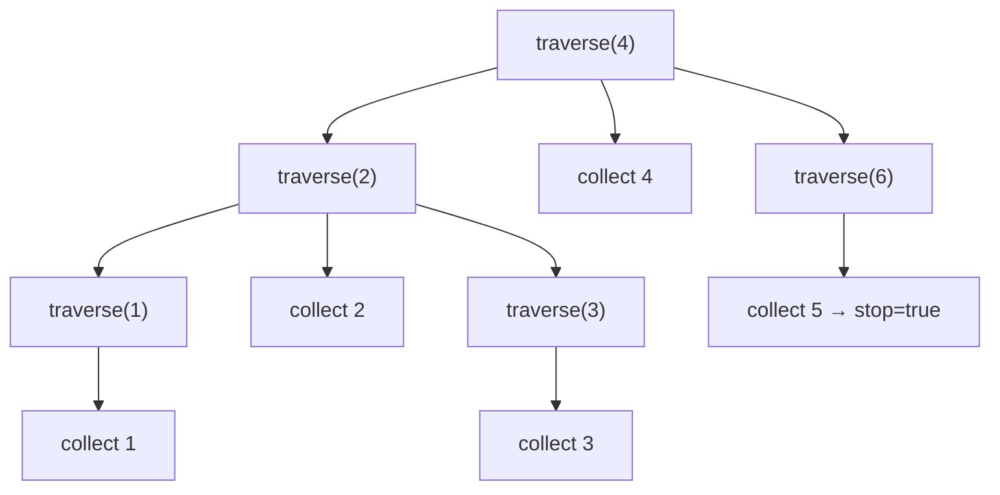
```
Trace: 1 → 2 → 3 → 4 → 5 (stop) → return [1,2,3,4,5]
```

### Interviewer Questions
1. Why closure for visitor? — Avoids threading result through recursive returns.
2. Can it be optimized? — Morris traversal: O(1) space, O(n) time.
3. Scale to 10M nodes? — Iterative traversal; goroutine fan-out for parallel subtrees.
4. Edge cases? — Nil root, deeply skewed tree (stack overflow), duplicate values.
5. Goroutine-safe? — No; `result` and `stop` are captured by reference.
6. Memory impact? — O(h) stack + O(n) result slice.
7. Alternative? — Return channel; producer sends values, consumer reads lazily.

### Follow-Up Questions
**Q1:** What is Morris traversal? **A1:** In-order traversal with O(1) space using threaded binary trees.
**Q2:** How would you make it lazy? **A2:** Return `chan int`; goroutine sends values; caller reads from channel.
**Q3:** How to handle stack overflow for deep trees? **A3:** Use an explicit stack (slice) instead of recursion.
**Q4:** Can you generalise the visitor for pre/post order? **A4:** Yes — move `result = append(...)` before/after recursive calls.
**Q5:** What does `var traverse func(*Node)` achieve? **A5:** Declares traverse before assignment, allowing the closure to reference itself recursively.

---

## Q14: Function Generator — Infinite Sequence  [Level 4 — Advanced]
> **Tags:** `#closures` `#generators` `#lazy-evaluation` `#state`

### Problem Statement
Implement a `Range` generator function that returns a closure producing consecutive integers starting from `start` with a given `step`. Each call to the closure advances the sequence. Also implement `TakeWhile` that collects values from a generator until a predicate returns false.

### Input / Output / Constraints
```
Input:  gen := Range(1, 2); TakeWhile(gen, func(x int) bool { return x <= 10 })
Output: [1, 3, 5, 7, 9]
Constraints: step != 0; sequence is infinite until predicate stops it
```

### Thought Process
1. Understand: Generator = stateful closure returning next value on each call.
2. Pattern: Capture `current` in closure; increment by step on each call.
3. Edge cases: step=0 (infinite loop), negative step (descending sequence).

### Brute Force
```go
// Pre-generate finite slice — O(n) upfront, wastes memory
func bruteForce(start, stop, step int) []int {
    var out []int
    for i := start; i <= stop; i += step {
        out = append(out, i)
    }
    return out
}
```
**Time:** O(n) | **Space:** O(n)

### Better Solution
```go
func better(start, step int) func() int {
    cur := start
    return func() int {
        v := cur
        cur += step
        return v
    }
}
```
**Time:** O(1) per call | **Space:** O(1)

### Best Solution
```go
package main

import "fmt"

// Range returns an infinite generator starting at `start` stepping by `step` — O(1)/call
func Range(start, step int) func() int {
    if step == 0 {
        panic("Range: step must not be zero")
    }
    cur := start
    return func() int {
        v := cur
        cur += step
        return v
    }
}

// TakeWhile collects values from gen while pred returns true — O(n) time, O(n) space
func TakeWhile(gen func() int, pred func(int) bool) []int {
    var result []int
    for {
        v := gen()
        if !pred(v) {
            break
        }
        result = append(result, v)
    }
    return result
}

func main() {
    gen := Range(1, 2)
    result := TakeWhile(gen, func(x int) bool { return x <= 10 })
    fmt.Println(result) // [1 3 5 7 9]

    // Descending
    down := Range(10, -3)
    fmt.Println(TakeWhile(down, func(x int) bool { return x > 0 })) // [10 7 4 1]
}
```
**Time:** O(1) per call, O(n) for TakeWhile | **Space:** O(n)

### Production Considerations
| Aspect | Details |
|--------|---------|
| Scalability | O(1) per value; only materialise what you need |
| Edge Cases | step=0 — panic; integer overflow — add bounds check |
| Error Handling | Use (int, bool) or (int, error) return if end-of-sequence is modelled |
| Memory | O(n) only when collecting; streaming avoids allocation |
| Concurrency | Single generator not goroutine-safe; wrap with mutex for shared use |

### Visual Explanation

```
Trace: 1→3→5→7→9→(11>10 stop) → [1,3,5,7,9]
```

### Interviewer Questions
1. Why lazy generation? — Memory-efficient; only computes needed values.
2. Can it be optimized? — Already O(1) per call; this is the optimum.
3. Scale to 10M? — Stream values through channel; consumer pulls as needed.
4. Edge cases? — step=0, overflow, negative step with wrong pred direction.
5. Goroutine-safe? — No; add sync.Mutex or use channel-based generator.
6. Memory impact? — O(1) generator; O(n) only on collect.
7. Alternative? — Channel-based generator for goroutine fan-out.

### Follow-Up Questions
**Q1:** How would you implement this with channels? **A1:** Goroutine sends to chan; caller reads; close channel to signal done.
**Q2:** What is lazy evaluation? **A2:** Computing values only when needed rather than upfront.
**Q3:** Can you zip two generators? **A3:** Yes — `Zip(g1, g2 func() int) func() (int, int)` calls both and returns pair.
**Q4:** How do you handle termination of an infinite generator? **A4:** Use a sentinel value, a done channel, or pass context for cancellation.
**Q5:** What is the iterator pattern in Go? **A5:** Go 1.23 introduced `iter.Seq` — a function `func(yield func(V) bool)` for push-style iteration.

---

## Q15: Partial Application and Currying  [Level 4 — Advanced]
> **Tags:** `#closures` `#partial-application` `#currying` `#functional`

### Problem Statement
Implement `Partial` which takes a two-argument function and one argument, returning a single-argument function with the first argument pre-filled. Then implement `Curry` which converts a two-argument function into a chain of single-argument functions. Demonstrate both with an `Add` function.

### Input / Output / Constraints
```
Input:  add5 := Partial(Add, 5); add5(3)
Output: 8
Input:  Curry(Add)(5)(3)
Output: 8
Constraints: functions must be reusable; closure must not mutate captured state
```

### Thought Process
1. Understand: Partial fixes one arg; Curry returns a function chain.
2. Pattern: Closure captures the fixed argument; returned fn accepts remaining args.
3. Edge cases: Both approaches are pure — no mutation, no side effects.

### Brute Force
```go
// O(1) — inline partial, not reusable
func bruteForce(b int) func(int) int {
    return func(a int) int { return a + b }
}
```
**Time:** O(1) | **Space:** O(1)

### Better Solution
```go
func Partial(fn func(int, int) int, a int) func(int) int {
    return func(b int) int { return fn(a, b) }
}
```
**Time:** O(1) | **Space:** O(1)

### Best Solution
```go
package main

import "fmt"

// Add is a pure two-argument function
func Add(a, b int) int { return a + b }

// Partial fixes the first argument of a two-arg function — O(1) time, O(1) space
func Partial(fn func(int, int) int, a int) func(int) int {
    return func(b int) int {
        return fn(a, b)
    }
}

// Curry converts fn into a chain of single-arg functions — O(1) time, O(1) space
func Curry(fn func(int, int) int) func(int) func(int) int {
    return func(a int) func(int) int {
        return func(b int) int {
            return fn(a, b)
        }
    }
}

func main() {
    add5 := Partial(Add, 5)
    fmt.Println(add5(3))  // 8
    fmt.Println(add5(10)) // 15

    curriedAdd := Curry(Add)
    fmt.Println(curriedAdd(5)(3))  // 8
    fmt.Println(curriedAdd(10)(7)) // 17

    // Build a family of adders
    adders := make([]func(int) int, 5)
    for i := 0; i < 5; i++ {
        adders[i] = Partial(Add, i*10)
    }
    for _, f := range adders {
        fmt.Print(f(1), " ") // 1 11 21 31 41
    }
    fmt.Println()
}
```
**Time:** O(1) | **Space:** O(1)

### Production Considerations
| Aspect | Details |
|--------|---------|
| Scalability | O(1); creates one closure per partial application |
| Edge Cases | fn is nil — panic on call; document requirement |
| Error Handling | If fn can fail: `func(int, int) (int, error)` |
| Memory | Each Partial/Curry call allocates one closure on heap |
| Concurrency | Pure closures; goroutine-safe |

### Visual Explanation
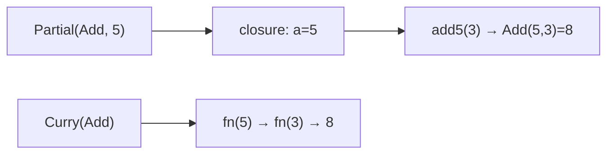
```
Trace: Partial(Add,5) → closure → add5(3) → Add(5,3) = 8
```

### Interviewer Questions
1. What is the difference between partial application and currying? — Partial fixes some args now; currying decomposes into unary chain.
2. Can it be optimized? — Already O(1) per call.
3. Scale to 10M? — Each is a pure function call; trivially parallel.
4. Edge cases? — nil fn, integer overflow in Add.
5. Goroutine-safe? — Yes; pure functions with no shared mutable state.
6. Memory impact? — One closure per Partial call; short-lived, GC-collected quickly.
7. Alternative? — Go generics: `func Partial[A, B, C any](fn func(A,B) C, a A) func(B) C`.

### Follow-Up Questions
**Q1:** Can you curry a three-argument function? **A1:** Yes — return a chain of three single-arg functions: `func(a) func(b) func(c) R`.
**Q2:** Is currying the same as memoization? **A2:** No — currying is about function decomposition; memoization is about caching results.
**Q3:** Where is partial application commonly used? **A3:** Event handlers, middleware configuration, builder patterns.
**Q4:** How do Go generics help here? **A4:** Remove the need to write Partial/Curry for each type signature.
**Q5:** What is a combinator? **A5:** A higher-order function that uses only function application to build new functions (no free variables from context).

---

## Q16: Concurrent Worker Pool with Closure Tasks  [Level 5 — Interview]
> **Tags:** `#closures` `#goroutines` `#worker-pool` `#concurrency` `#channels`

### Problem Statement
Implement a fixed-size worker pool that executes closure-based tasks concurrently. Each task is a `func() (string, error)`. The pool accepts tasks via a channel, workers process them, and results are collected through a results channel. Graceful shutdown must drain all pending tasks.

### Input / Output / Constraints
```
Input:  pool with 3 workers, 10 tasks (closure funcs)
Output: all 10 results collected; no task dropped; order may vary
Constraints: workers=1..100; tasks may arrive dynamically; graceful shutdown
```

### Thought Process
1. Understand: Workers are goroutines reading from a task channel; results written to results channel.
2. Pattern: Buffered task channel; WaitGroup tracks workers; close tasks to signal done.
3. Edge cases: Task panics, more tasks than buffer, shutdown before all tasks submitted.

### Brute Force
```go
// Sequential — O(n) time, O(1) concurrency
func bruteForce(tasks []func() (string, error)) []string {
    var results []string
    for _, t := range tasks {
        v, _ := t()
        results = append(results, v)
    }
    return results
}
```
**Time:** O(n) sequential | **Space:** O(n)

### Better Solution
```go
// Simple fan-out with goroutine per task — unbounded goroutines
func better(tasks []func() (string, error)) []string {
    results := make([]string, len(tasks))
    var wg sync.WaitGroup
    for i, t := range tasks {
        wg.Add(1)
        go func(idx int, fn func() (string, error)) {
            defer wg.Done()
            v, _ := fn()
            results[idx] = v // safe if each goroutine writes unique index
        }(i, t)
    }
    wg.Wait()
    return results
}
```
**Time:** O(n/goroutines) | **Space:** O(n)

### Best Solution
```go
package main

import (
    "fmt"
    "sync"
)

// Task is a unit of work returning a result and error
type Task func() (string, error)

// Result holds the output of a task
type Result struct {
    Value string
    Err   error
}

// WorkerPool runs tasks concurrently with a fixed number of workers — O(n/w) time
func WorkerPool(workers int, tasks []Task) []Result {
    taskCh := make(chan Task, len(tasks))
    resultCh := make(chan Result, len(tasks))

    var wg sync.WaitGroup
    // Start workers
    for i := 0; i < workers; i++ {
        wg.Add(1)
        go func() {
            defer wg.Done()
            for task := range taskCh {
                func() {
                    defer func() {
                        if r := recover(); r != nil {
                            resultCh <- Result{Err: fmt.Errorf("panic: %v", r)}
                        }
                    }()
                    v, err := task()
                    resultCh <- Result{Value: v, Err: err}
                }()
            }
        }()
    }

    // Submit tasks
    for _, t := range tasks {
        taskCh <- t
    }
    close(taskCh)

    // Wait then close results
    go func() {
        wg.Wait()
        close(resultCh)
    }()

    // Collect results
    var results []Result
    for r := range resultCh {
        results = append(results, r)
    }
    return results
}

func main() {
    tasks := make([]Task, 10)
    for i := 0; i < 10; i++ {
        n := i
        tasks[i] = func() (string, error) {
            return fmt.Sprintf("task-%d", n), nil
        }
    }
    results := WorkerPool(3, tasks)
    for _, r := range results {
        fmt.Println(r.Value, r.Err)
    }
}
```
**Time:** O(n/w) | **Space:** O(n)

### Production Considerations
| Aspect | Details |
|--------|---------|
| Scalability | w workers process n tasks in O(n/w) wall time |
| Edge Cases | Task panics recovered; task channel full blocks submitter |
| Error Handling | Errors per result; failed tasks don't crash workers |
| Memory | Buffered channels hold n tasks + n results; bound with smaller buffers |
| Concurrency | Fully goroutine-safe; channels used for all communication |

### Visual Explanation
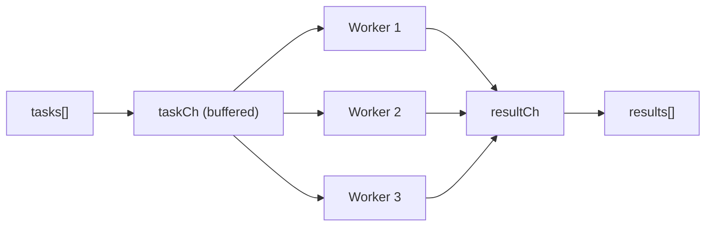
```
Trace: submit 10 tasks → 3 workers process → collect 10 results
```

### Interviewer Questions
1. Why buffered channels? — Decouples producer from consumers; prevents blocking on submit.
2. Can it be optimized? — Use `errgroup` for simpler code; semaphore for backpressure.
3. Scale to 10M tasks? — Stream tasks via channel; don't buffer all in memory.
4. Edge cases? — Worker panic — recovered; context cancellation — check ctx.Done in worker.
5. Goroutine-safe? — Yes; all communication through channels.
6. Memory impact? — O(n) buffers; stream with smaller buffer for large n.
7. Alternative? — `golang.org/x/sync/errgroup` with semaphore for cleaner API.

### Follow-Up Questions
**Q1:** How would you add cancellation? **A1:** Accept `context.Context`; workers select on `ctx.Done()` and task channel.
**Q2:** What is errgroup? **A2:** A sync primitive that runs goroutines and collects the first error; simpler than manual WaitGroup + channel.
**Q3:** How would you limit memory with 10M tasks? **A3:** Stream tasks from a source (DB, file) into a small buffered channel instead of pre-loading all.
**Q4:** What happens if a worker panics without recover? **A4:** The goroutine crashes silently; WaitGroup counter decrements; program may deadlock or lose results.
**Q5:** How do you measure worker pool throughput? **A5:** Track task start/end times; compute tasks/second; use pprof for CPU profiling.

---

## Q17: Decorator Pattern — Rate Limiter  [Level 5 — Interview]
> **Tags:** `#decorator` `#closures` `#rate-limiting` `#token-bucket`

### Problem Statement
Implement a `RateLimit` function decorator that wraps any `func(string) (string, error)` function and limits it to N calls per second using a token bucket algorithm implemented with a closure-captured ticker and semaphore. Callers that exceed the limit receive a rate-limit error immediately.

### Input / Output / Constraints
```
Input:  limited := RateLimit(fn, 5); call 10 times rapidly
Output: first 5 succeed; next 5 return ErrRateLimited
Constraints: N>=1; non-blocking (fail fast); goroutine-safe
```

### Thought Process
1. Understand: Token bucket — tokens refill at rate N/s; each call consumes one token.
2. Pattern: Closure captures a buffered channel as the bucket; ticker goroutine refills.
3. Edge cases: Burst, zero N, shutdown of ticker.

### Brute Force
```go
// O(1) — simple counter, not time-accurate
var count, limit int
var mu sync.Mutex
func bruteForce(fn func(string)(string,error), key string) (string, error) {
    mu.Lock()
    defer mu.Unlock()
    if count >= limit { return "", errors.New("rate limited") }
    count++
    return fn(key)
}
```
**Time:** O(1) | **Space:** O(1)

### Better Solution
```go
var ErrRateLimited = errors.New("rate limited")
func better(fn func(string)(string,error), rps int) func(string)(string,error) {
    bucket := make(chan struct{}, rps)
    for i := 0; i < rps; i++ { bucket <- struct{}{} }
    go func() {
        tick := time.NewTicker(time.Second / time.Duration(rps))
        for range tick.C {
            select {
            case bucket <- struct{}{}:
            default:
            }
        }
    }()
    return func(key string) (string, error) {
        select {
        case <-bucket:
            return fn(key)
        default:
            return "", ErrRateLimited
        }
    }
}
```
**Time:** O(1) | **Space:** O(rps)

### Best Solution
```go
package main

import (
    "errors"
    "fmt"
    "sync"
    "time"
)

// ErrRateLimited is returned when the rate limit is exceeded
var ErrRateLimited = errors.New("rate limited")

// RateLimit wraps fn to allow at most rps calls per second — O(1) per call
func RateLimit(fn func(string) (string, error), rps int) func(string) (string, error) {
    if rps <= 0 {
        panic("rps must be > 0")
    }
    bucket := make(chan struct{}, rps)
    for i := 0; i < rps; i++ {
        bucket <- struct{}{} // pre-fill
    }
    // Refill goroutine
    go func() {
        ticker := time.NewTicker(time.Second / time.Duration(rps))
        defer ticker.Stop()
        for range ticker.C {
            select {
            case bucket <- struct{}{}:
            default: // bucket full; discard token
            }
        }
    }()
    var mu sync.Mutex
    return func(key string) (string, error) {
        select {
        case <-bucket:
            mu.Lock()
            defer mu.Unlock()
            return fn(key)
        default:
            return "", ErrRateLimited
        }
    }
}

func main() {
    calls := 0
    fn := func(key string) (string, error) {
        calls++
        return "ok:" + key, nil
    }
    limited := RateLimit(fn, 3)

    var wg sync.WaitGroup
    for i := 0; i < 6; i++ {
        wg.Add(1)
        go func(n int) {
            defer wg.Done()
            v, err := limited(fmt.Sprintf("req%d", n))
            fmt.Printf("req%d: %s err=%v\n", n, v, err)
        }(i)
    }
    wg.Wait()
}
```
**Time:** O(1) per call | **Space:** O(rps)

### Production Considerations
| Aspect | Details |
|--------|---------|
| Scalability | O(1) per call; bucket is bounded by rps |
| Edge Cases | rps=0 panic; burst at start uses pre-filled tokens |
| Error Handling | Return ErrRateLimited; caller may retry with backoff |
| Memory | Buffered channel of rps capacity; one goroutine per limiter |
| Concurrency | Channel operations are goroutine-safe; mutex protects fn if needed |

### Visual Explanation
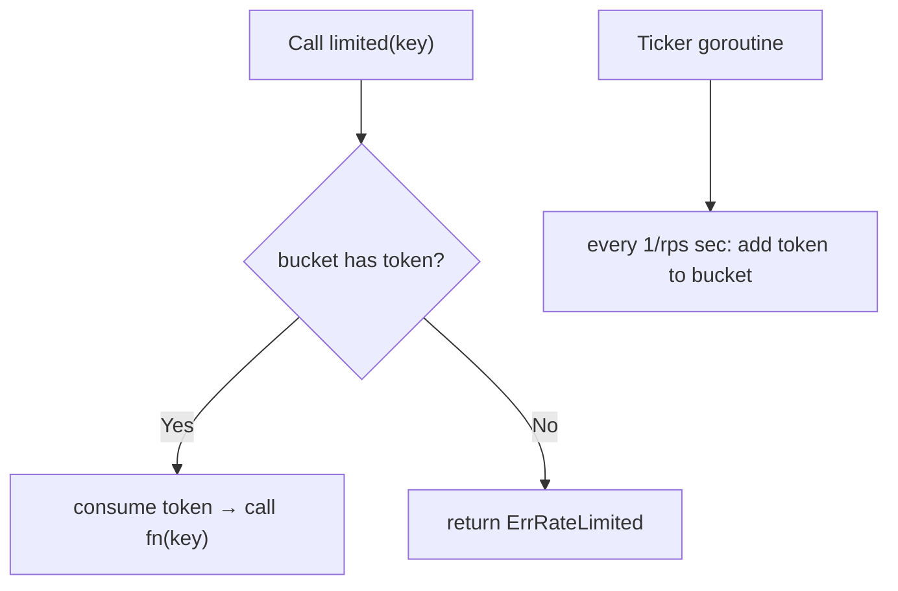
```
Trace: 3 tokens pre-filled → 3 calls succeed → 4th call → bucket empty → ErrRateLimited
```

### Interviewer Questions
1. Why channel as bucket? — Goroutine-safe; select enables non-blocking check.
2. Can it be optimized? — Use `golang.org/x/time/rate` for production; leaky bucket for smoother.
3. Scale to 10M RPS? — Distributed rate limiting with Redis; local limiter per node.
4. Edge cases? — rps=0, burst handling, ticker drift.
5. Goroutine-safe? — Yes; channel ops are atomic.
6. Memory impact? — O(rps) channel buffer; one goroutine per limiter.
7. Alternative? — `rate.Limiter` from `golang.org/x/time/rate`.

### Follow-Up Questions
**Q1:** What is the difference between token bucket and leaky bucket? **A1:** Token bucket allows bursts up to capacity; leaky bucket smooths output to a fixed rate.
**Q2:** How would you share a rate limiter across services? **A2:** Use Redis with atomic INCR/EXPIRE or a dedicated rate-limiting service.
**Q3:** What happens to the refill goroutine when the limiter is GC'd? **A3:** It leaks — add a Stop() method with a done channel to terminate it.
**Q4:** How would you implement per-user rate limiting? **A4:** Map of rate limiters keyed by user ID; create on first request; evict stale entries.
**Q5:** What is `rate.Limiter.Wait` vs `rate.Limiter.Allow`? **A5:** `Allow` is non-blocking (returns bool); `Wait` blocks until a token is available or context cancels.

---

## Q18: Closure-Based State Machine  [Level 5 — Interview]
> **Tags:** `#closures` `#state-machine` `#functional` `#advanced`

### Problem Statement
Model a simple order state machine (Pending → Confirmed → Shipped → Delivered) using closures. Each state is represented as a function that processes an event and returns the next state function. The machine must reject invalid transitions and be immutable — no external mutation of state.

### Input / Output / Constraints
```
Input:  events: ["confirm", "ship", "deliver"]
Output: state transitions: Pending→Confirmed→Shipped→Delivered
Constraints: invalid events return current state + error; state is encapsulated
```

### Thought Process
1. Understand: State = function; transition = calling the function with an event → returns new state fn.
2. Pattern: Each state fn handles valid events; rejects invalid ones; returns next state fn.
3. Edge cases: Duplicate events, terminal state receives more events.

### Brute Force
```go
// O(1) per transition — switch-based
type State int
const (Pending State = iota; Confirmed; Shipped; Delivered)
var state = Pending
func bruteForce(event string) error {
    switch state {
    case Pending: if event=="confirm" { state=Confirmed; return nil }
    // ... etc
    }
    return errors.New("invalid transition")
}
```
**Time:** O(1) | **Space:** O(1)

### Better Solution
```go
type StateFn func(event string) (StateFn, error)

func Pending() StateFn {
    return func(event string) (StateFn, error) {
        if event == "confirm" { return Confirmed(), nil }
        return Pending(), fmt.Errorf("Pending: invalid event %q", event)
    }
}
```
**Time:** O(1) | **Space:** O(1)

### Best Solution
```go
package main

import (
    "fmt"
)

// StateFn processes an event and returns the next state
type StateFn func(event string) (StateFn, string, error)

// PendingState handles the Pending state
func PendingState() StateFn {
    return func(event string) (StateFn, string, error) {
        if event == "confirm" {
            return ConfirmedState(), "Confirmed", nil
        }
        return PendingState(), "Pending", fmt.Errorf("pending: invalid event %q", event)
    }
}

// ConfirmedState handles the Confirmed state
func ConfirmedState() StateFn {
    return func(event string) (StateFn, string, error) {
        if event == "ship" {
            return ShippedState(), "Shipped", nil
        }
        return ConfirmedState(), "Confirmed", fmt.Errorf("confirmed: invalid event %q", event)
    }
}

// ShippedState handles the Shipped state
func ShippedState() StateFn {
    return func(event string) (StateFn, string, error) {
        if event == "deliver" {
            return DeliveredState(), "Delivered", nil
        }
        return ShippedState(), "Shipped", fmt.Errorf("shipped: invalid event %q", event)
    }
}

// DeliveredState is terminal — all events rejected
func DeliveredState() StateFn {
    return func(event string) (StateFn, string, error) {
        return DeliveredState(), "Delivered", fmt.Errorf("delivered: terminal state, event %q rejected", event)
    }
}

// Run drives the state machine through a sequence of events
func Run(events []string) {
    state := PendingState()
    stateName := "Pending"
    fmt.Println("Initial:", stateName)
    for _, e := range events {
        next, name, err := state(e)
        if err != nil {
            fmt.Printf("  event=%q err=%v\n", e, err)
        } else {
            fmt.Printf("  event=%q → %s\n", e, name)
            stateName = name
        }
        state = next
        _ = stateName
    }
}

func main() {
    Run([]string{"confirm", "invalid", "ship", "deliver", "reopen"})
}
```
**Time:** O(1) per transition | **Space:** O(1)

### Production Considerations
| Aspect | Details |
|--------|---------|
| Scalability | O(1) per event; suitable for high-throughput event streams |
| Edge Cases | Terminal state receiving events, invalid events, concurrent events |
| Error Handling | Each state returns descriptive error; caller decides to retry or abort |
| Memory | One function pointer per state; O(1) |
| Concurrency | StateFn itself is not goroutine-safe; wrap state variable with mutex |

### Visual Explanation
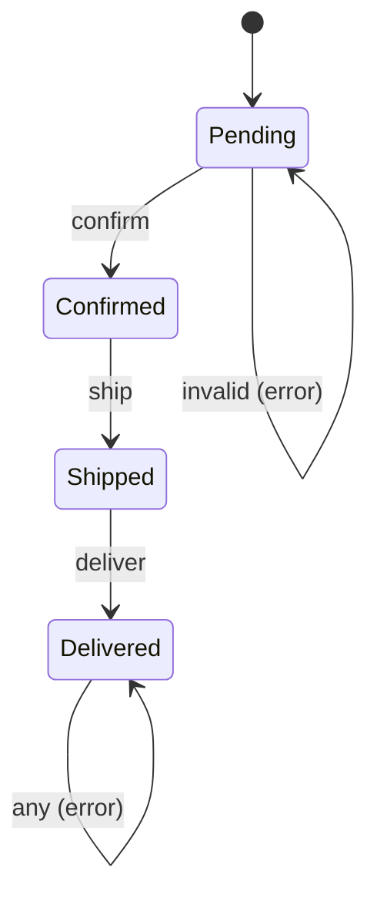
```
Trace: Pending→confirm→Confirmed→ship→Shipped→deliver→Delivered
```

### Interviewer Questions
1. Why functions as states? — Encapsulates transition logic per state; no external switch.
2. Can it be optimized? — Already O(1); table-driven approach is alternative.
3. Scale to 10M events? — State is pure; fan out to goroutines; each processes its event stream.
4. Edge cases? — Terminal state, unknown events, concurrent transitions.
5. Goroutine-safe? — No; guard `state` variable with mutex.
6. Memory impact? — O(1) per state; functions are shared (not per-instance).
7. Alternative? — Map-based transition table for data-driven state machines.

### Follow-Up Questions
**Q1:** What is the advantage over a switch-based state machine? **A1:** Each state is self-contained; adding a new state doesn't touch other states (Open-Closed Principle).
**Q2:** How would you persist state? **A2:** Store the state name as a string in DB; reconstruct StateFn from name on load.
**Q3:** How do you handle concurrent events for the same order? **A3:** Serialise via a per-order goroutine (actor model) or mutex.
**Q4:** What is the actor model? **A4:** Each entity has a mailbox (channel); processes one message at a time; no shared memory.
**Q5:** How would you add transition hooks (e.g., send email on Confirmed)? **A5:** Call the hook inside the state function after validating the transition, before returning next state.

---

## Q19: Production HTTP Handler with Full Middleware Stack  [Level 6 — Production]
> **Tags:** `#production` `#middleware` `#closures` `#http` `#observability`

### Problem Statement
Build a production-ready HTTP handler with a complete middleware stack using closures: request ID injection, structured logging, panic recovery, timeout enforcement, and authentication. All middleware must be composable via the Chain function from Q11. The handler should process a payment request endpoint.

### Input / Output / Constraints
```
Input:  POST /payment with JSON body and X-Token header
Output: JSON response; all middleware applied; panics recovered; timeout respected
Constraints: timeout=5s; auth required; request ID in every log line
```

### Thought Process
1. Understand: Each middleware is a closure wrapping the next handler; context propagates request-scoped data.
2. Pattern: Chain(Recovery, Timeout, RequestID, Logger, Auth)(paymentHandler).
3. Edge cases: Panic in handler, missing token, slow handler exceeding timeout.

### Brute Force
```go
// Manual inline middleware — O(k) setup, not reusable
func bruteForce(w http.ResponseWriter, r *http.Request) {
    // logging, auth, recovery all inline — unmaintainable
}
```
**Time:** O(k) | **Space:** O(k)

### Better Solution
```go
// Separate middleware funcs without Chain — must nest manually
h := Recovery(Timeout(5*time.Second)(RequestID(Logger(Auth(paymentHandler)))))
```
**Time:** O(k) | **Space:** O(k)

### Best Solution
```go
package main

import (
    "context"
    "encoding/json"
    "fmt"
    "log/slog"
    "net/http"
    "time"

    "github.com/google/uuid"
)

type contextKey string

const reqIDKey contextKey = "requestID"

// HandlerFunc is our handler type
type HandlerFunc func(http.ResponseWriter, *http.Request)

// Middleware wraps a HandlerFunc
type Middleware func(HandlerFunc) HandlerFunc

// Chain composes middlewares left-to-right
func Chain(mws ...Middleware) Middleware {
    return func(final HandlerFunc) HandlerFunc {
        for i := len(mws) - 1; i >= 0; i-- {
            final = mws[i](final)
        }
        return final
    }
}

// Recovery catches panics and returns 500
func Recovery(next HandlerFunc) HandlerFunc {
    return func(w http.ResponseWriter, r *http.Request) {
        defer func() {
            if rec := recover(); rec != nil {
                slog.Error("panic recovered", "error", rec, "requestID", r.Context().Value(reqIDKey))
                http.Error(w, "internal server error", http.StatusInternalServerError)
            }
        }()
        next(w, r)
    }
}

// RequestID injects a unique request ID into context
func RequestID(next HandlerFunc) HandlerFunc {
    return func(w http.ResponseWriter, r *http.Request) {
        id := uuid.New().String()
        ctx := context.WithValue(r.Context(), reqIDKey, id)
        w.Header().Set("X-Request-ID", id)
        next(w, r.WithContext(ctx))
    }
}

// Logger logs method, path, and request ID
func Logger(next HandlerFunc) HandlerFunc {
    return func(w http.ResponseWriter, r *http.Request) {
        start := time.Now()
        slog.Info("request", "method", r.Method, "path", r.URL.Path,
            "requestID", r.Context().Value(reqIDKey))
        next(w, r)
        slog.Info("response", "duration", time.Since(start),
            "requestID", r.Context().Value(reqIDKey))
    }
}

// Auth checks for X-Token header
func Auth(next HandlerFunc) HandlerFunc {
    return func(w http.ResponseWriter, r *http.Request) {
        if r.Header.Get("X-Token") == "" {
            http.Error(w, `{"error":"unauthorized"}`, http.StatusUnauthorized)
            return
        }
        next(w, r)
    }
}

// Timeout wraps handler with a context deadline
func Timeout(d time.Duration) Middleware {
    return func(next HandlerFunc) HandlerFunc {
        return func(w http.ResponseWriter, r *http.Request) {
            ctx, cancel := context.WithTimeout(r.Context(), d)
            defer cancel()
            next(w, r.WithContext(ctx))
        }
    }
}

// PaymentHandler processes a payment
func PaymentHandler(w http.ResponseWriter, r *http.Request) {
    reqID := r.Context().Value(reqIDKey)
    w.Header().Set("Content-Type", "application/json")
    json.NewEncoder(w).Encode(map[string]any{
        "status":    "success",
        "requestID": reqID,
    })
}

func main() {
    stack := Chain(Recovery, RequestID, Logger, Timeout(5*time.Second), Auth)
    handler := stack(PaymentHandler)
    http.HandleFunc("/payment", func(w http.ResponseWriter, r *http.Request) {
        handler(w, r)
    })
    fmt.Println("Listening on :8080")
    // http.ListenAndServe(":8080", nil)
}
```
**Time:** O(k) per request | **Space:** O(k)

### Production Considerations
| Aspect | Details |
|--------|---------|
| Scalability | Stateless middleware; horizontal scaling with load balancer |
| Edge Cases | Panic recovery, timeout cancellation, missing headers, malformed JSON |
| Error Handling | Structured JSON errors; request ID in every error response |
| Memory | Each request allocates context with values; GC handles cleanup |
| Concurrency | Each request is in its own goroutine; middleware closures are goroutine-safe if stateless |

### Visual Explanation
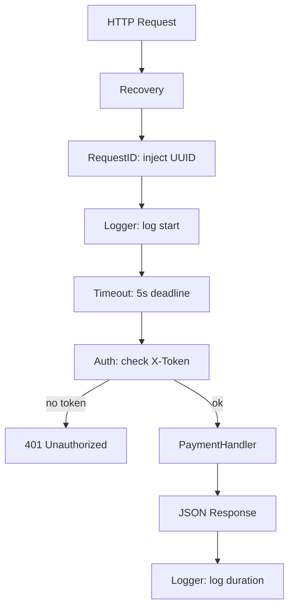
```
Trace: request → recovery wrapper → inject ID → log → set timeout → auth → handler → response
```

### Interviewer Questions
1. Why Chain reverses loop? — Leftmost middleware must be outermost wrapper.
2. Can it be optimized? — Pre-build the chain at startup; amortised across requests.
3. Scale to 10M RPS? — Stateless; horizontal pods; connection pooling; CDN for static.
4. Edge cases? — Context cancellation mid-handler; panic in middleware itself.
5. Goroutine-safe? — Yes if all captured state is per-request (in context).
6. Memory impact? — Context allocation per request; profile with pprof under load.
7. Alternative? — Use Chi or Gorilla Mux with built-in middleware support.

### Follow-Up Questions
**Q1:** How do you propagate request ID to downstream services? **A1:** Add it to outgoing HTTP headers: `req.Header.Set("X-Request-ID", id)`.
**Q2:** What is `slog`? **A2:** Go 1.21 structured logging package; outputs JSON or text; contextual key-value pairs.
**Q3:** How do you handle context timeout in the handler? **A3:** Check `ctx.Err()` after blocking operations; return early if cancelled.
**Q4:** How would you add metrics? **A4:** Middleware increments Prometheus counters: requests_total, request_duration_seconds.
**Q5:** How do you test middleware in isolation? **A5:** Use `httptest.NewRecorder()` and `httptest.NewRequest()`; assert response code and headers.

---

## Q20: Closure-Based Configuration Builder (Functional Options)  [Level 6 — Production]
> **Tags:** `#functional-options` `#closures` `#production` `#api-design` `#builder`

### Problem Statement
Implement the Functional Options pattern for a `Server` configuration. Options are closures of type `func(*Server) error` that mutate a config struct. Provide a `NewServer` constructor that applies options in order, validates the final config, and returns a ready server or an error. This is idiomatic Go API design for optional parameters.

### Input / Output / Constraints
```
Input:  NewServer(WithPort(8080), WithTimeout(30*time.Second), WithMaxConns(100))
Output: configured *Server or error
Constraints: unknown options must not break API; each option validates its value
```

### Thought Process
1. Understand: Options are closures that mutate a struct; collected by constructor.
2. Pattern: `type Option func(*Server) error`; each WithX returns an Option closure.
3. Edge cases: Invalid port, zero timeout, conflicting options, no options (use defaults).

### Brute Force
```go
// Config struct with every optional field — breaks caller on new fields (not extensible)
type Config struct { Port int; Timeout time.Duration; MaxConns int }
func NewServer(c Config) (*Server, error) { ... }
```
**Time:** O(k) | **Space:** O(1)

### Better Solution
```go
type Option func(*Server)
func WithPort(p int) Option { return func(s *Server) { s.port = p } }
func NewServer(opts ...Option) *Server {
    s := &Server{port: 8080, timeout: 30 * time.Second}
    for _, o := range opts { o(s) }
    return s
}
// No validation — not production-ready
```
**Time:** O(k) | **Space:** O(1)

### Best Solution
```go
package main

import (
    "errors"
    "fmt"
    "time"
)

// Server holds the server configuration
type Server struct {
    port     int
    timeout  time.Duration
    maxConns int
    host     string
}

// Option is a functional option for Server — each returns an error for validation
type Option func(*Server) error

// WithPort sets the server port (1024–65535)
func WithPort(port int) Option {
    return func(s *Server) error {
        if port < 1024 || port > 65535 {
            return fmt.Errorf("invalid port %d: must be 1024–65535", port)
        }
        s.port = port
        return nil
    }
}

// WithTimeout sets the request timeout
func WithTimeout(d time.Duration) Option {
    return func(s *Server) error {
        if d <= 0 {
            return errors.New("timeout must be positive")
        }
        s.timeout = d
        return nil
    }
}

// WithMaxConns sets the max concurrent connections
func WithMaxConns(n int) Option {
    return func(s *Server) error {
        if n <= 0 {
            return errors.New("maxConns must be positive")
        }
        s.maxConns = n
        return nil
    }
}

// WithHost sets the bind address
func WithHost(host string) Option {
    return func(s *Server) error {
        if host == "" {
            return errors.New("host must not be empty")
        }
        s.host = host
        return nil
    }
}

// NewServer applies options to defaults and validates — O(k) time, O(1) space
func NewServer(opts ...Option) (*Server, error) {
    s := &Server{
        port:     8080,
        timeout:  30 * time.Second,
        maxConns: 100,
        host:     "0.0.0.0",
    }
    for _, opt := range opts {
        if err := opt(s); err != nil {
            return nil, fmt.Errorf("NewServer: %w", err)
        }
    }
    return s, nil
}

func (s *Server) String() string {
    return fmt.Sprintf("Server{host:%s port:%d timeout:%s maxConns:%d}",
        s.host, s.port, s.timeout, s.maxConns)
}

func main() {
    srv, err := NewServer(
        WithPort(9090),
        WithTimeout(10*time.Second),
        WithMaxConns(500),
        WithHost("127.0.0.1"),
    )
    if err != nil {
        fmt.Println("error:", err)
        return
    }
    fmt.Println(srv)

    // Invalid option
    _, err = NewServer(WithPort(80))
    fmt.Println("error:", err) // invalid port
}
```
**Time:** O(k) per construction | **Space:** O(1)

### Production Considerations
| Aspect | Details |
|--------|---------|
| Scalability | O(k) options applied once at startup; negligible |
| Edge Cases | Zero options use defaults; invalid options caught at startup, not runtime |
| Error Handling | Each option validates and returns error; fail-fast at startup |
| Memory | O(1) — one Server struct; options are function pointers |
| Concurrency | Server fields set before serving — no concurrent mutation; immutable after construction |

### Visual Explanation
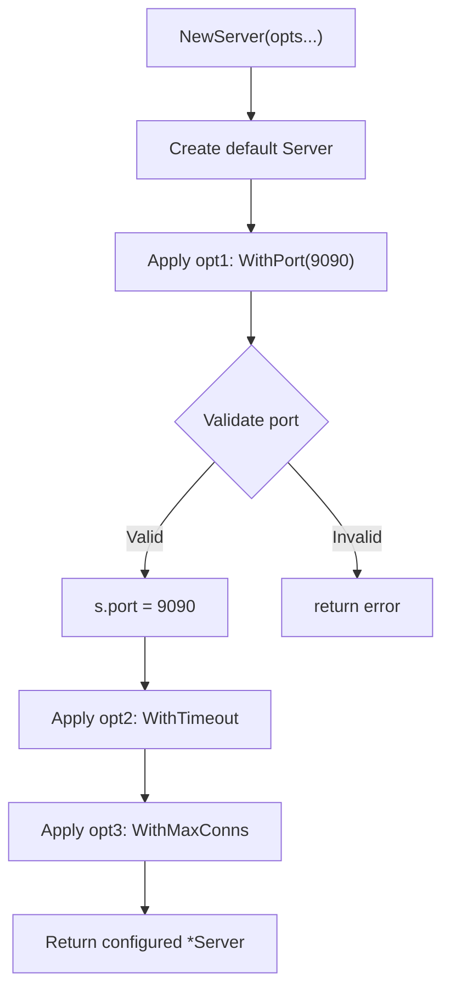
```
Trace: defaults → WithPort(9090)→ok → WithTimeout(10s)→ok → WithMaxConns(500)→ok → return srv
```

### Interviewer Questions
1. Why closures over a config struct? — Forward compatible; adding options is non-breaking.
2. Can it be optimized? — Already O(k); no further improvement.
3. Scale to 10M servers? — Each construction is O(k); trivially parallelisable.
4. Edge cases? — No options (defaults), invalid values (caught eagerly), nil option (guard).
5. Goroutine-safe? — Yes after construction; options applied synchronously.
6. Memory impact? — O(1); one struct, k function pointers.
7. Alternative? — Builder pattern with method chaining: `s.SetPort(80).SetTimeout(10s).Build()`.

### Follow-Up Questions
**Q1:** How do you add a new option without breaking existing callers? **A1:** Add a new `WithX` function; existing callers compile unchanged.
**Q2:** What if an option depends on another option's value? **A2:** Apply-order-dependent options; document ordering; or add a final Validate step.
**Q3:** How do you document the defaults? **A3:** Document in `NewServer` godoc; or provide `DefaultOptions()` returning the default option set.
**Q4:** Can options be composed? **A4:** Yes — `func Combined(port int, timeout time.Duration) Option { return func(s *Server) error { ... } }`.
**Q5:** What libraries use this pattern? **A5:** `grpc-go` (DialOption), `zap` (logger options), `http.Server`, many Go open-source libraries.

---

## Company-Style Questions

### 🔵 Google Style (3Q — algorithm focused)

**G1. Memoized Recursive Power Set**
Given a set of n distinct integers, use a memoized recursive closure to generate all 2^n subsets. The closure must cache sub-problem results. Analyse time complexity and the memory trade-off of the cache.
*Key insight:* Power set of S = power set of S[1:] ∪ each subset prefixed with S[0]. Cache maps index→subsets. O(2^n) time unavoidable; O(2^n) space for cache.

**G2. Compose N Sorting Comparators**
Implement a `ComposedLess` function that takes a variadic list of `func(a, b Item) int` comparators and returns a single comparator for `sort.Slice`. Earlier comparators take priority; later ones break ties. Use closures to capture the comparator chain.
*Key insight:* Range over comparators; return non-zero result immediately; final comparator result is the tiebreaker. O(k) per comparison where k = number of comparators.

**G3. Lazy Sieve of Eratosthenes via Generator Closures**
Implement a lazy prime generator using chained filter closures. The first generator produces natural numbers; each prime p discovered adds a filter closure that removes multiples of p. Return the nth prime.
*Key insight:* Classic concurrent sieve in functional style. Each filter closure captures its prime `p`; calls next generator only if value % p != 0. O(n log log n) primes up to n; O(n) closures.

---

### 🟡 Uber Style (3Q — real-time systems)

**U1. Circuit Breaker via Closure State**
Implement a `CircuitBreaker` decorator for any `func() error`. The breaker tracks failure count in closure state: Closed (normal) → Open (failing, reject all) → Half-Open (probe one). Transitions are time-based. Return wrapped function and a status accessor.
*Key insight:* Closure captures `state`, `failures`, `lastFailure time.Time`, and `mu sync.Mutex`. State machine drives transitions. O(1) per call; O(1) space.

**U2. Retry with Exponential Backoff**
Write a `Retry` function that wraps any `func(ctx context.Context) error` and retries up to maxAttempts with exponential backoff (base * 2^attempt) capped at maxDelay. Use a closure to capture retry configuration. Honour context cancellation.
*Key insight:* Closure captures `base`, `maxDelay`, `maxAttempts`. Each attempt: call fn; on error check ctx.Done; sleep min(base*2^i, maxDelay). O(maxAttempts) time.

**U3. Dynamic Config Reloader**
Build a `ConfigProvider` closure that wraps a config struct. A background goroutine periodically reloads the config from a source. Callers always get the latest snapshot via an atomic pointer swap. Show safe hot-reload without restarting the server.
*Key insight:* Use `atomic.Pointer[Config]` (Go 1.19+) for lock-free reads. Writer goroutine calls `Store`; readers call `Load`. Closure encapsulates the atomic pointer and reload ticker.

---

### 🟠 Amazon Style (3Q — distributed/reliability)

**A1. Bulkhead Pattern via Closure Semaphore**
Implement a `Bulkhead` decorator that limits concurrent executions of a wrapped function to n. Calls exceeding the limit return `ErrBulkheadFull` immediately. Use a buffered channel as semaphore inside the closure. Apply to an order-processing function.
*Key insight:* Buffered channel of capacity n; acquire by sending, release by receiving. Non-blocking send for fast failure. O(1) per call; O(n) channel buffer.

**A2. Idempotent Function Wrapper**
Write `Idempotent(fn func(string)(string,error))` that ensures fn is called at most once per unique key. Subsequent calls with the same key return the cached result without calling fn again. Use closures + sync.Map for goroutine-safe deduplication.
*Key insight:* sync.Map stores key → result. `LoadOrStore` with a singleflight-style lock ensures exactly-once execution. O(1) amortised; O(n keys) space.

**A3. Saga Compensator**
Implement a `Saga` builder where each step registers an action (closure) and a compensating action (closure). If any step fails, all previously completed compensations run in reverse order (LIFO). Return (success bool, compensationErrors []error).
*Key insight:* Two slices of closures: actions and compensators. On failure at step i, run compensators[0..i-1] in reverse. Defer-like semantics implemented explicitly. O(k) time and space.

---

### 🟢 Stripe Style (2Q — payment/correctness)

**S1. Idempotency-Key Deduplication Middleware**
Build middleware that reads an `Idempotency-Key` header. If the key has been seen before, return the cached response without calling the handler. If new, call the handler, cache the response (status + body), and return it. Use closures to encapsulate the cache.
*Key insight:* Cache maps idempotency key → `cachedResponse{status int, body []byte}`. Use `sync.RWMutex` or `sync.Map`. Capture `http.ResponseWriter` in a recorder to cache the response. Concurrent requests with the same key need singleflight deduplication.

**S2. Decimal-Safe Money Computation Pipeline**
Build a computation pipeline (from Q9) where each `Fn` operates on a `Decimal` type (integer cents, no float). Pipeline steps: validate amount, apply tax (10%), apply discount (coupon closure with captured rate), format output. All steps must return `(Decimal, error)`; short-circuit on first error.
*Key insight:* Define `type Fn func(Decimal) (Decimal, error)`. Pipeline short-circuits on non-nil error. Tax and discount closures capture their rates. Never use float64 for money — use integer cents or a fixed-point library.

---

### 🔴 Razorpay Style (2Q — payment APIs/Indian banking)

**R1. UPI Transaction Retry with Bank-Specific Rules**
Different Indian banks have different retry policies for UPI failures. Implement a `BankRetryPolicy` factory that returns a `RetryFn` closure capturing each bank's maxRetries, baseDelay, and a list of retryable error codes. The closure checks if the error code is retryable before sleeping. Demonstrate for HDFC (3 retries, 500ms base) and SBI (5 retries, 1s base, only codes [U16, U30]).
*Key insight:* `BankRetryPolicy(name string, maxRetries int, baseDelay time.Duration, retryCodes []string) RetryFn`. Closure captures `retryableSet map[string]bool`. O(maxRetries) time; O(|retryCodes|) space per policy.

**R2. Payment Gateway Fallback Chain**
Implement a `FallbackChain` that tries payment gateways in priority order. Each gateway is a `func(PaymentRequest) (PaymentResponse, error)`. On failure, the chain tries the next gateway. Capture success/failure metrics per gateway in closures. Return the first successful response or aggregate error if all fail.
*Key insight:* Each gateway closure captures its `name string` and `metrics *GatewayMetrics`. FallbackChain ranges over gateways; on success increments `metrics.Success`; on failure increments `metrics.Failure` and tries next. Return `errors.Join(errs...)` on total failure (Go 1.20+).
