> © 2024 Gaurav Patil — Go Mastery Platform. All rights reserved. Unauthorized reproduction or distribution prohibited.


# Go Interfaces — Coding Practice

---

## Q1: Declare and Satisfy a Simple Interface  [Level 1 — Beginner]

> **Tags:** `#interface-declaration` `#implicit-satisfaction` `#syntax`

### Problem Statement
Declare a `Greeter` interface with a single method `Greet() string`. Create a `Person` struct with a `Name` field and implement the interface. Call `Greet()` via the interface type and print the result.

### Input / Output / Constraints

```
Input:  Person{Name: "Alice"}
Output: "Hello, I am Alice"

Constraints:
  • Name is a non-empty string
  • No external packages required
  • Must use interface variable, not concrete type
```

### Thought Process

Think like a senior Go engineer:
1. **Understand:** Declare an interface, satisfy it implicitly with a struct method, assign to interface variable.
2. **Pattern:** Interface implicit satisfaction — no `implements` keyword in Go.
3. **Edge cases:** Empty name, nil pointer receiver vs value receiver.
4. **Approach:** Use a value receiver to keep things simple; demonstrate interface variable assignment.

### Brute Force Solution

```go
package main

import "fmt"

// bruteForce — O(1) time, O(1) space
// Directly call method on concrete type, bypassing interface.
func bruteForce() {
    p := Person{Name: "Alice"}
    fmt.Println(p.Greet()) // skips interface entirely
}
```

**Time:** O(1) | **Space:** O(1)
**Bottleneck:** Does not demonstrate interface usage; defeats the purpose of polymorphism.

### Better Solution

```go
// betterSolution — O(1) time, O(1) space
// Assign concrete type to interface variable.
type Greeter interface {
    Greet() string
}

type Person struct{ Name string }

func (p Person) Greet() string {
    return "Hello, I am " + p.Name
}

func greetSomeone(g Greeter) {
    fmt.Println(g.Greet())
}
```

**Time:** O(1) | **Space:** O(1)

### Best / Optimal Solution

```go
package main

import "fmt"

// Greeter defines any type that can greet.
type Greeter interface {
    Greet() string
}

// Person satisfies Greeter implicitly via value receiver.
type Person struct {
    Name string
}

func (p Person) Greet() string {
    if p.Name == "" {
        return "Hello, I am anonymous"
    }
    return "Hello, I am " + p.Name
}

// OptimalSolution — O(1) time, O(1) space.
// Uses interface dispatch to decouple caller from concrete type.
func OptimalSolution(g Greeter) (string, error) {
    if g == nil {
        return "", fmt.Errorf("greeter must not be nil")
    }
    return g.Greet(), nil
}

func main() {
    p := Person{Name: "Alice"}
    result, err := OptimalSolution(p)
    if err != nil {
        fmt.Printf("error: %v\n", err)
        return
    }
    fmt.Println(result)
}
```

**Time:** O(1) | **Space:** O(1)

### Production Considerations

| Aspect | Details |
|--------|---------|
| **Scalability** | Interface dispatch adds one pointer indirection; negligible at any scale |
| **Edge Cases** | Empty name returns sensible default; nil interface guard prevents panic |
| **Error Handling** | Return error when nil interface is passed |
| **Memory** | Interface value is two words (type pointer + data pointer); stack-allocated here |
| **Concurrency** | No shared state; fully goroutine-safe |

### Visual Explanation

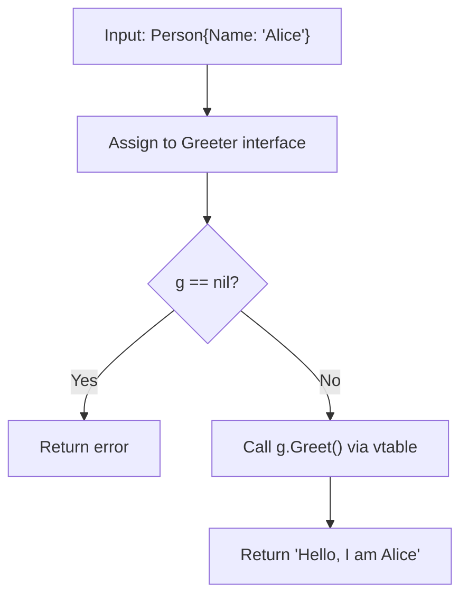
```mermaid
flowchart TD
    A["Input: Person{Name: 'Alice'}"] --> B["Assign to Greeter interface"]
    B --> C{"g == nil?"}
    C -->|"Yes"| D["Return error"]
    C -->|"No"| E["Call g.Greet() via vtable"]
    E --> F["Return 'Hello, I am Alice'"]
```

**Execution Trace:**
```
Input:  Person{Name: "Alice"}
Step 1: p assigned to Greeter interface — iface{type=*Person, data=&p}
Step 2: g.Greet() dispatches to Person.Greet()
Output: "Hello, I am Alice"
```

### Interviewer Questions

1. Why this approach over calling `p.Greet()` directly?
2. Can we improve time/space further? What's the theoretical lower bound?
3. How does this scale to 10M elements / 1M concurrent requests?
4. Walk me through the edge case where `Name` is an empty string.
5. How would you make this goroutine-safe?
6. What's the memory/GC impact? How would you reduce allocations?
7. How would you test this comprehensively?

### Follow-Up Questions

**Q1:** What happens if `Person` uses a pointer receiver `(p *Person)` instead of a value receiver?
**A1:** Then only `*Person` satisfies `Greeter`, not `Person`. Passing `Person{Name:"Alice"}` (not a pointer) to `OptimalSolution` would fail to compile. Use pointer receivers when the method needs to mutate the struct or when the struct is large.

**Q2:** Does Go check interface satisfaction at runtime or compile time?
**A2:** At compile time when you assign a concrete type to an interface variable. If a type is missing a method, the compiler errors. The `var _ Greeter = (*Person)(nil)` idiom enforces this explicitly in tests.

**Q3:** What are the two words inside a Go interface value?
**A3:** (1) a pointer to the type descriptor (`itab` for non-empty interfaces, `_type` for `any`), and (2) a pointer to the underlying data. Both being nil is a nil interface; only the type word being set while data is nil is a non-nil interface holding a nil pointer — the famous nil interface bug.

**Q4:** How do you document that a type satisfies an interface without importing the interface's package?
**A4:** Use a blank identifier compile-time assertion: `var _ pkg.Greeter = (*Person)(nil)` in your package. This line fails to compile if `*Person` no longer satisfies `pkg.Greeter`.

**Q5:** How would you benchmark interface dispatch overhead vs direct call?
**A5:** Use `testing.B` with two benchmarks: one calling `p.Greet()` on a concrete `Person`, one calling `g.Greet()` on a `Greeter` variable. Run with `go test -bench=. -benchmem`. Expect ~1-2 ns overhead per call for the interface dispatch due to the indirect function call through the itab.

---

## Q2: Implement fmt.Stringer  [Level 1 — Beginner]

> **Tags:** `#stringer` `#single-method-interface` `#fmt`

### Problem Statement
Implement the `fmt.Stringer` interface for a `Point` struct with `X` and `Y` float64 fields. When passed to `fmt.Println`, it should print `Point(X=1.20, Y=3.40)`. Demonstrate that `fmt` calls `String()` automatically.

### Input / Output / Constraints

```
Input:  Point{X: 1.2, Y: 3.4}
Output: "Point(X=1.20, Y=3.40)"

Constraints:
  • X and Y are float64
  • Format floats to 2 decimal places
  • Must satisfy fmt.Stringer (not just print manually)
```

### Thought Process

Think like a senior Go engineer:
1. **Understand:** `fmt.Stringer` has one method: `String() string`. `fmt` checks for it via interface assertion internally.
2. **Pattern:** Single-method interface — the most common Go pattern for extending fmt behavior.
3. **Edge cases:** NaN, Inf, negative zero.
4. **Approach:** Implement `String()` with `fmt.Sprintf` using `%.2f` format verbs.

### Brute Force Solution

```go
package main

import "fmt"

// bruteForce — O(1) time, O(1) space
// Manually print without implementing Stringer.
type Point struct{ X, Y float64 }

func bruteForce(p Point) {
    fmt.Printf("Point(X=%.2f, Y=%.2f)\n", p.X, p.Y)
    // Every call site must repeat this format string — fragile.
}
```

**Time:** O(1) | **Space:** O(1)
**Bottleneck:** Format logic scattered at call sites; any change requires updating every print location.

### Better Solution

```go
// betterSolution — O(1) time, O(1) space
func (p Point) String() string {
    return fmt.Sprintf("Point(X=%.2f, Y=%.2f)", p.X, p.Y)
}
// Now fmt.Println(p) automatically calls p.String().
```

**Time:** O(1) | **Space:** O(1)

### Best / Optimal Solution

```go
package main

import (
    "fmt"
    "math"
)

// Point represents a 2D coordinate.
type Point struct {
    X, Y float64
}

// String satisfies fmt.Stringer — O(1) time, O(1) space.
// Uses fmt.Sprintf to centralise formatting logic.
func (p Point) String() string {
    x, y := p.X, p.Y
    // Normalise negative zero for consistent output.
    if math.Signbit(x) && x == 0 {
        x = 0
    }
    if math.Signbit(y) && y == 0 {
        y = 0
    }
    return fmt.Sprintf("Point(X=%.2f, Y=%.2f)", x, y)
}

func main() {
    p := Point{X: 1.2, Y: 3.4}
    fmt.Println(p)              // calls p.String() automatically
    fmt.Printf("value: %v\n", p) // also uses String()
    fmt.Printf("debug: %#v\n", p) // %#v uses Go syntax, bypasses String()
}
```

**Time:** O(1) | **Space:** O(1)

### Production Considerations

| Aspect | Details |
|--------|---------|
| **Scalability** | Formatting is O(1); safe to call millions of times |
| **Edge Cases** | NaN, ±Inf, negative zero — handle or document behaviour |
| **Error Handling** | `String()` cannot return an error; log internally if needed |
| **Memory** | `fmt.Sprintf` allocates a string; for hot paths use `strings.Builder` |
| **Concurrency** | No mutation; fully goroutine-safe |

### Visual Explanation

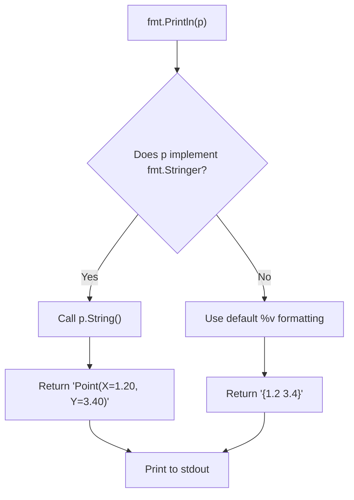
```mermaid
flowchart TD
    A["fmt.Println(p)"] --> B{"Does p implement fmt.Stringer?"}
    B -->|"Yes"| C["Call p.String()"]
    B -->|"No"| D["Use default %v formatting"]
    C --> E["Return 'Point(X=1.20, Y=3.40)'"]
    D --> F["Return '{1.2 3.4}'"]
    E --> G["Print to stdout"]
    F --> G
```

**Execution Trace:**
```
Input:  Point{X: 1.2, Y: 3.4}
Step 1: fmt.Println checks if Point satisfies fmt.Stringer → yes
Step 2: calls p.String() → "Point(X=1.20, Y=3.40)"
Output: Point(X=1.20, Y=3.40)
```

### Interviewer Questions

1. Why implement `String()` instead of just using `fmt.Printf` at each call site?
2. Can we improve time/space further? What's the theoretical lower bound?
3. How does this scale to 10M elements / 1M concurrent requests?
4. Walk me through the edge case where `X` is `math.NaN()`.
5. How would you make this goroutine-safe?
6. What's the memory/GC impact? How would you reduce allocations?
7. How would you test this comprehensively?

### Follow-Up Questions

**Q1:** What is the difference between `%v` and `%s` when the type implements `Stringer`?
**A1:** Both call `String()` for types that implement `fmt.Stringer`. `%v` is the default format and calls `String()` if available. `%s` also calls `String()`. `%#v` bypasses `String()` and prints Go syntax. `%+v` also bypasses it and adds field names.

**Q2:** Can `String()` cause infinite recursion?
**A2:** Yes. If inside `String()` you call `fmt.Sprintf("%v", p)` where `p` is the same type, `fmt` will call `String()` again, causing a stack overflow. Use field access directly: `fmt.Sprintf("...", p.X, p.Y)`.

**Q3:** Should `String()` have a value receiver or pointer receiver?
**A3:** Value receiver is preferred for `String()` unless the struct is very large (>~64 bytes). With a value receiver, both `Point` and `*Point` satisfy `fmt.Stringer`. With a pointer receiver, only `*Point` satisfies it.

**Q4:** How would you use `strings.Builder` to avoid allocations in `String()`?
**A4:** `var b strings.Builder; fmt.Fprintf(&b, "Point(X=%.2f, Y=%.2f)", p.X, p.Y); return b.String()`. However for a short fixed format, `fmt.Sprintf` and `strings.Builder` have similar overhead; `strings.Builder` shines when concatenating many pieces.

**Q5:** How do you test that `String()` output is correct?
**A5:** `assert.Equal(t, "Point(X=1.20, Y=3.40)", p.String())` with table-driven tests covering normal values, zero, NaN, and Inf. Also test `fmt.Sprintf("%v", p)` to confirm fmt integration.

---

## Q3: Single-Method Interface — io.Writer  [Level 1 — Beginner]

> **Tags:** `#io-writer` `#single-method-interface` `#stdlib`

### Problem Statement
Implement `io.Writer` for a `UpperWriter` struct that wraps another `io.Writer` and converts all bytes to uppercase before writing. Demonstrate by wrapping `os.Stdout` and writing `"hello, world\n"`.

### Input / Output / Constraints

```
Input:  []byte("hello, world\n") written to UpperWriter wrapping os.Stdout
Output: HELLO, WORLD (printed to stdout)

Constraints:
  • Must implement io.Writer: Write(p []byte) (n int, err error)
  • Must not modify the input slice p
  • Return the original length n on success
```

### Thought Process

Think like a senior Go engineer:
1. **Understand:** `io.Writer` has `Write(p []byte) (n int, err error)`. Implement it to transform bytes then delegate.
2. **Pattern:** Decorator pattern over `io.Writer` — wraps and transforms.
3. **Edge cases:** Empty slice, nil inner writer, partial write from inner writer.
4. **Approach:** Copy bytes to avoid mutating caller's slice, uppercase, delegate write.

### Brute Force Solution

```go
package main

import (
    "bytes"
    "fmt"
    "os"
)

// bruteForce — O(n) time, O(n) space
// Convert to uppercase then print — not a proper io.Writer.
func bruteForce(data []byte) {
    upper := bytes.ToUpper(data)
    fmt.Fprint(os.Stdout, string(upper)) // bypasses io.Writer contract
}
```

**Time:** O(n) | **Space:** O(n)
**Bottleneck:** Not composable; cannot be passed to functions expecting `io.Writer` (e.g., `json.NewEncoder`).

### Better Solution

```go
// betterSolution — O(n) time, O(n) space
type UpperWriter struct{ w io.Writer }

func (u UpperWriter) Write(p []byte) (int, error) {
    upper := bytes.ToUpper(p) // copies — does not mutate p
    return u.w.Write(upper)
}
```

**Time:** O(n) | **Space:** O(n)

### Best / Optimal Solution

```go
package main

import (
    "bytes"
    "fmt"
    "io"
    "os"
)

// UpperWriter wraps an io.Writer, uppercasing all bytes.
type UpperWriter struct {
    w io.Writer
}

// NewUpperWriter constructs an UpperWriter, validating the inner writer.
func NewUpperWriter(w io.Writer) (*UpperWriter, error) {
    if w == nil {
        return nil, fmt.Errorf("inner writer must not be nil")
    }
    return &UpperWriter{w: w}, nil
}

// Write satisfies io.Writer — O(n) time, O(n) space.
// Creates a copy to avoid mutating the caller's slice (io.Writer contract).
func (u *UpperWriter) Write(p []byte) (int, error) {
    if len(p) == 0 {
        return 0, nil
    }
    upper := bytes.ToUpper(p) // safe copy
    n, err := u.w.Write(upper)
    if err != nil {
        return n, fmt.Errorf("UpperWriter: inner write failed: %w", err)
    }
    // Return len(p), not n, to satisfy callers that expect original length.
    return len(p), nil
}

func main() {
    uw, err := NewUpperWriter(os.Stdout)
    if err != nil {
        fmt.Printf("error: %v\n", err)
        return
    }
    if _, err := fmt.Fprint(uw, "hello, world\n"); err != nil {
        fmt.Printf("write error: %v\n", err)
    }
}
```

**Time:** O(n) | **Space:** O(n)

### Production Considerations

| Aspect | Details |
|--------|---------|
| **Scalability** | One allocation per Write call; for high-throughput, use a sync.Pool for the byte buffer |
| **Edge Cases** | Empty slice returns (0, nil); nil inner writer caught at construction |
| **Error Handling** | Wrap inner errors with %w for `errors.Is` / `errors.As` compatibility |
| **Memory** | `bytes.ToUpper` allocates; reuse buffer with `bytes.Map` into a pooled slice |
| **Concurrency** | Not goroutine-safe; add a `sync.Mutex` if multiple goroutines share one instance |

### Visual Explanation

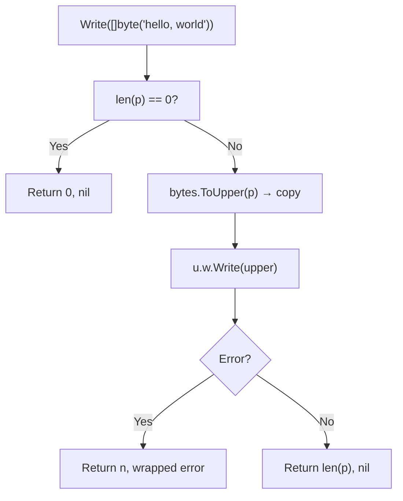
```mermaid
flowchart TD
    A["Write([]byte('hello, world'))"] --> B["len(p) == 0?"]
    B -->|"Yes"| C["Return 0, nil"]
    B -->|"No"| D["bytes.ToUpper(p) → copy"]
    D --> E["u.w.Write(upper)"]
    E --> F{"Error?"}
    F -->|"Yes"| G["Return n, wrapped error"]
    F -->|"No"| H["Return len(p), nil"]
```

**Execution Trace:**
```
Input:  []byte("hello, world\n")
Step 1: bytes.ToUpper → []byte("HELLO, WORLD\n")
Step 2: os.Stdout.Write([]byte("HELLO, WORLD\n")) → n=13, nil
Output: HELLO, WORLD
```

### Interviewer Questions

1. Why this approach over a simple function that uppercases and prints?
2. Can we improve time/space further? What's the theoretical lower bound?
3. How does this scale to 10M elements / 1M concurrent requests?
4. Walk me through the edge case where the inner `Write` writes fewer bytes than provided.
5. How would you make this goroutine-safe?
6. What's the memory/GC impact? How would you reduce allocations?
7. How would you test this comprehensively?

### Follow-Up Questions

**Q1:** Why must `Write` not retain the slice `p` beyond the call?
**A1:** The `io.Writer` contract (documented in the stdlib) states that `Write` must not retain `p` after it returns. Callers may reuse the slice immediately. If you need to store bytes, copy them first.

**Q2:** What does it mean when `Write` returns `n < len(p)` without an error?
**A2:** It is a contract violation. The `io.Writer` docs state that returning `n < len(p)` with `err == nil` is an error. Callers like `io.Copy` rely on this. Always return a non-nil error when `n < len(p)`.

**Q3:** How would you chain multiple transforming writers?
**A3:** Nest them: `NewUpperWriter(NewLineCountingWriter(os.Stdout))`. Each `Write` call passes through the chain. This is the decorator pattern, also used by `gzip.NewWriter`, `bufio.NewWriter`, etc.

**Q4:** How do you reduce allocations in a high-throughput scenario?
**A4:** Use `sync.Pool` to reuse `[]byte` buffers: `buf := pool.Get().([]byte); buf = buf[:len(p)]; copy(buf, p); bytes.ToUpper(buf) /* in-place */; u.w.Write(buf); pool.Put(buf)`. This eliminates per-call GC pressure.

**Q5:** How would you write a unit test for `UpperWriter` without depending on `os.Stdout`?
**A5:** Use `bytes.Buffer` as the inner writer: `var buf bytes.Buffer; uw, _ := NewUpperWriter(&buf); uw.Write([]byte("hello")); assert.Equal(t, "HELLO", buf.String())`. No stdout involved, fully hermetic.

---

## Q4: Interface Composition  [Level 2 — Easy]

> **Tags:** `#interface-composition` `#embedding` `#readwriter`

### Problem Statement
Define three interfaces: `Reader` with `Read() string`, `Writer` with `Write(s string)`, and `ReadWriter` that embeds both. Implement a `Buffer` struct that satisfies `ReadWriter`. Write a function `CopyData(src Reader, dst Writer)` that reads from src and writes to dst.

### Input / Output / Constraints

```
Input:  src Buffer containing "Go interfaces", dst empty Buffer
Output: dst Buffer contains "Go interfaces" after CopyData

Constraints:
  • ReadWriter must embed Reader and Writer (not redeclare methods)
  • CopyData must accept interface types, not concrete types
  • 1 ≤ len(string) ≤ 10^4
```

### Thought Process

Think like a senior Go engineer:
1. **Understand:** Interface composition via embedding lets one interface extend multiple others without copying method signatures.
2. **Pattern:** Interface embedding — same mechanism as struct embedding but for interfaces.
3. **Edge cases:** Empty buffer read, writing to a full buffer, nil interfaces passed to CopyData.
4. **Approach:** Embed Reader and Writer into ReadWriter; implement Buffer with internal string storage.

### Brute Force Solution

```go
package main

// bruteForce — O(n) time, O(n) space
// Declare ReadWriter by listing all methods explicitly (not composing).
type ReadWriterBrute interface {
    Read() string
    Write(s string)
    // If Reader or Writer grow new methods, must update here too — fragile.
}
```

**Time:** O(n) | **Space:** O(n)
**Bottleneck:** Method duplication breaks the DRY principle; changing `Reader` requires updating `ReadWriterBrute` manually.

### Better Solution

```go
// betterSolution — O(n) time, O(n) space
type Reader interface{ Read() string }
type Writer interface{ Write(s string) }
type ReadWriter interface {
    Reader
    Writer
}
```

**Time:** O(n) | **Space:** O(n)

### Best / Optimal Solution

```go
package main

import (
    "fmt"
    "strings"
)

// Reader can produce a string.
type Reader interface {
    Read() string
}

// Writer can consume a string.
type Writer interface {
    Write(s string)
}

// ReadWriter composes both — satisfies both Reader and Writer.
type ReadWriter interface {
    Reader
    Writer
}

// Buffer is an in-memory ReadWriter.
type Buffer struct {
    sb strings.Builder
}

// Write appends to the buffer — O(n) amortised.
func (b *Buffer) Write(s string) {
    b.sb.WriteString(s)
}

// Read returns and resets the buffer contents — O(n).
func (b *Buffer) Read() string {
    s := b.sb.String()
    b.sb.Reset()
    return s
}

// CopyData — O(n) time, O(n) space.
// Reads all content from src and writes it to dst.
func CopyData(src Reader, dst Writer) error {
    if src == nil {
        return fmt.Errorf("src must not be nil")
    }
    if dst == nil {
        return fmt.Errorf("dst must not be nil")
    }
    data := src.Read()
    dst.Write(data)
    return nil
}

func main() {
    src := &Buffer{}
    src.Write("Go interfaces")

    dst := &Buffer{}
    if err := CopyData(src, dst); err != nil {
        fmt.Printf("error: %v\n", err)
        return
    }
    fmt.Println(dst.Read()) // "Go interfaces"
}
```

**Time:** O(n) | **Space:** O(n)

### Production Considerations

| Aspect | Details |
|--------|---------|
| **Scalability** | `strings.Builder` grows geometrically; safe for large strings |
| **Edge Cases** | Empty read returns ""; nil interface args return descriptive errors |
| **Error Handling** | `CopyData` propagates nil-interface errors; `Write` is infallible here |
| **Memory** | One allocation per `Read()` call (returns a string copy); use `[]byte` for zero-copy |
| **Concurrency** | `Buffer` is not goroutine-safe; wrap with `sync.Mutex` for concurrent use |

### Visual Explanation

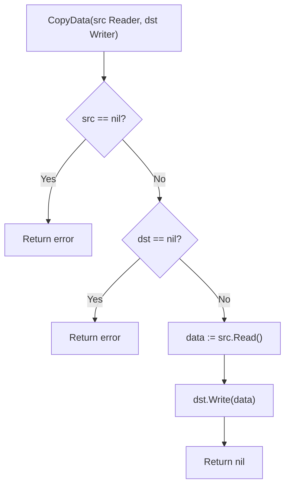
```mermaid
flowchart TD
    A["CopyData(src Reader, dst Writer)"] --> B{"src == nil?"}
    B -->|"Yes"| C["Return error"]
    B -->|"No"| D{"dst == nil?"}
    D -->|"Yes"| E["Return error"]
    D -->|"No"| F["data := src.Read()"]
    F --> G["dst.Write(data)"]
    G --> H["Return nil"]
```

**Execution Trace:**
```
Input:  src=Buffer{"Go interfaces"}, dst=Buffer{}
Step 1: src.Read() → "Go interfaces", src is now empty
Step 2: dst.Write("Go interfaces") → dst.sb = "Go interfaces"
Output: dst.Read() → "Go interfaces"
```

### Interviewer Questions

1. Why use interface embedding instead of listing all methods in `ReadWriter`?
2. Can we improve time/space further? What's the theoretical lower bound?
3. How does this scale to 10M elements / 1M concurrent requests?
4. Walk me through the edge case where `src.Read()` returns an empty string.
5. How would you make this goroutine-safe?
6. What's the memory/GC impact? How would you reduce allocations?
7. How would you test this comprehensively?

### Follow-Up Questions

**Q1:** Can a type satisfy `ReadWriter` without satisfying `Reader` or `Writer` individually?
**A1:** No. Because `ReadWriter` embeds `Reader` and `Writer`, any type that satisfies `ReadWriter` automatically satisfies both component interfaces. You can assign a `ReadWriter` value to either a `Reader` or `Writer` variable without a type assertion.

**Q2:** What happens if two embedded interfaces in a composition have a method with the same name but different signatures?
**A2:** The compiler rejects it with an "ambiguous selector" error. This is a design smell. Rename the conflicting method in one of the interfaces or use a different composition strategy.

**Q3:** How does the standard library use interface composition?
**A3:** `io.ReadWriter` embeds `io.Reader` and `io.Writer`. `io.ReadWriteCloser` embeds `io.ReadWriter` and `io.Closer`. `io.ReadWriteSeeker` embeds `io.ReadWriter` and `io.Seeker`. This lets functions accept exactly the capabilities they need.

**Q4:** How do you check at compile time that `*Buffer` satisfies `ReadWriter`?
**A4:** Add `var _ ReadWriter = (*Buffer)(nil)` anywhere in the package. The compiler verifies this without allocating.

**Q5:** Should `CopyData` accept `ReadWriter` instead of separate `Reader` and `Writer` parameters?
**A5:** No. Accepting separate `Reader` and `Writer` follows the Interface Segregation Principle — callers can pass two different objects. If you accept `ReadWriter`, the src and dst must be the same object, which is rarely what you want in a copy operation.

---

## Q5: Empty Interface and Type Assertions  [Level 2 — Easy]

> **Tags:** `#empty-interface` `#type-assertion` `#any`

### Problem Statement
Write a function `Describe(v any) string` that returns a human-readable description of any value: for `int` return `"integer: N"`, for `string` return `"string: S"`, for `bool` return `"bool: true/false"`, and for all other types return `"unknown type"`. Use type assertions (not reflection).

### Input / Output / Constraints

```
Input:  42, "hello", true, 3.14
Output: "integer: 42", "string: hello", "bool: true", "unknown type"

Constraints:
  • Use type assertions or type switch, not reflect
  • Handle nil input gracefully
  • No panics
```

### Thought Process

Think like a senior Go engineer:
1. **Understand:** `any` (alias for `interface{}`) can hold any type; type assertions extract the concrete value.
2. **Pattern:** Type switch — more idiomatic than chained `.(T)` assertions with comma-ok.
3. **Edge cases:** nil input, types that look like int but are int64 (type aliases), custom types derived from int.
4. **Approach:** Use `switch v.(type)` for clean multi-branch type inspection.

### Brute Force Solution

```go
package main

import "fmt"

// bruteForce — O(1) time, O(1) space
// Uses comma-ok type assertions one by one — verbose and fragile.
func bruteForce(v any) string {
    if i, ok := v.(int); ok {
        return fmt.Sprintf("integer: %d", i)
    }
    if s, ok := v.(string); ok {
        return fmt.Sprintf("string: %s", s)
    }
    if b, ok := v.(bool); ok {
        return fmt.Sprintf("bool: %v", b)
    }
    return "unknown type"
}
```

**Time:** O(1) | **Space:** O(1)
**Bottleneck:** Each `.(T)` assertion is evaluated sequentially; type switch compiles to a jump table — cleaner and marginally faster with many types.

### Better Solution

```go
// betterSolution — O(1) time, O(1) space
func betterSolution(v any) string {
    switch val := v.(type) {
    case int:
        return fmt.Sprintf("integer: %d", val)
    case string:
        return fmt.Sprintf("string: %s", val)
    case bool:
        return fmt.Sprintf("bool: %v", val)
    default:
        return "unknown type"
    }
}
```

**Time:** O(1) | **Space:** O(1)

### Best / Optimal Solution

```go
package main

import "fmt"

// Describe — O(1) time, O(1) space.
// Uses a type switch, the idiomatic Go pattern for multi-type dispatch on any.
func Describe(v any) string {
    switch val := v.(type) {
    case nil:
        return "nil"
    case int:
        return fmt.Sprintf("integer: %d", val)
    case string:
        return fmt.Sprintf("string: %s", val)
    case bool:
        return fmt.Sprintf("bool: %v", val)
    case []int:
        return fmt.Sprintf("[]int of length %d", len(val))
    default:
        return fmt.Sprintf("unknown type: %T", val)
    }
}

func main() {
    inputs := []any{42, "hello", true, 3.14, nil, []int{1, 2, 3}}
    for _, v := range inputs {
        fmt.Println(Describe(v))
    }
}
```

**Time:** O(1) | **Space:** O(1)

### Production Considerations

| Aspect | Details |
|--------|---------|
| **Scalability** | O(1) per call; safe at any scale |
| **Edge Cases** | nil, int vs int64, named types `type MyInt int` fall to default |
| **Error Handling** | No error return needed; unknown types return descriptive string |
| **Memory** | `fmt.Sprintf` allocates; for hot paths use a `strings.Builder` |
| **Concurrency** | Fully stateless; goroutine-safe |

### Visual Explanation

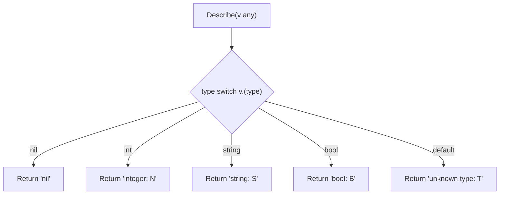
```mermaid
flowchart TD
    A["Describe(v any)"] --> B{"type switch v.(type)"}
    B -->|"nil"| C["Return 'nil'"]
    B -->|"int"| D["Return 'integer: N'"]
    B -->|"string"| E["Return 'string: S'"]
    B -->|"bool"| F["Return 'bool: B'"]
    B -->|"default"| G["Return 'unknown type: T'"]
```

**Execution Trace:**
```
Input:  42
Step 1: type switch matches case int → val = 42
Output: "integer: 42"

Input:  3.14
Step 1: type switch hits default → %T = "float64"
Output: "unknown type: float64"
```

### Interviewer Questions

1. Why use a type switch over chained type assertions?
2. Can we improve time/space further? What's the theoretical lower bound?
3. How does this scale to 10M elements / 1M concurrent requests?
4. Walk me through the edge case where `v` is `nil`.
5. How would you make this goroutine-safe?
6. What's the memory/GC impact? How would you reduce allocations?
7. How would you test this comprehensively?

### Follow-Up Questions

**Q1:** What is the difference between `v.(int)` and `v.(type)` in a type switch?
**A1:** `v.(int)` is a single type assertion that panics if the type is wrong (or returns `false` with comma-ok). `v.(type)` is only valid inside a `switch` statement and tests the dynamic type against each case without panicking.

**Q2:** Does `type MyInt int` match the `case int:` branch?
**A2:** No. `type MyInt int` is a distinct named type. It will fall through to `default`. If you need to handle `MyInt`, add a `case MyInt:` branch, or use `reflect.TypeOf(v).Kind() == reflect.Int` for the underlying kind.

**Q3:** What is the performance difference between a type switch and `reflect`?
**A3:** A type switch compiles to a small number of pointer comparisons (comparing `itab` or `_type` pointers). `reflect` operations involve package-level type lookups and are 5-10x slower in benchmarks. Prefer type switch for known types.

**Q4:** When would you use `any` in a production API?
**A4:** Sparingly. Good use cases: generic containers before generics existed, JSON unmarshalling (`map[string]any`), `context.WithValue`, and logging fields. Since Go 1.18, prefer generics for type-safe containers. `any` sacrifices compile-time safety.

**Q5:** How do you prevent panics from unsafe type assertions?
**A5:** Always use the comma-ok form: `val, ok := v.(int)`. If `ok` is false, `val` is the zero value of `int`. Never use single-return `v.(int)` on untrusted input unless you are certain of the type.

---

## Q6: Type Switch with Interfaces  [Level 2 — Easy]

> **Tags:** `#type-switch` `#interface-matching` `#polymorphism`

### Problem Statement
Define a `Shape` interface with an `Area() float64` method. Implement `Circle`, `Rectangle`, and `Triangle`. Write `PrintShapeInfo(s Shape)` that uses a type switch to print the specific type name and area. Also handle the case where `s` does not match any known shape.

### Input / Output / Constraints

```
Input:  Circle{Radius: 5}, Rectangle{W: 4, H: 3}, Triangle{Base: 6, Height: 4}
Output: "Circle with radius 5.00, area 78.54"
        "Rectangle 4.00x3.00, area 12.00"
        "Triangle base 6.00 height 4.00, area 12.00"

Constraints:
  • All dimensions are positive float64
  • Area must use math.Pi for circles
  • Type switch must match concrete types, not just call Area()
```

### Thought Process

Think like a senior Go engineer:
1. **Understand:** A type switch on an interface variable extracts the concrete type, giving access to type-specific fields.
2. **Pattern:** Type switch for polymorphic dispatch with concrete-type-specific logic.
3. **Edge cases:** Negative dimensions, zero radius, nil shape, unknown shape type.
4. **Approach:** Type switch in `PrintShapeInfo` to access concrete fields beyond the interface.

### Brute Force Solution

```go
package main

import (
    "fmt"
    "math"
)

// bruteForce — O(1) time, O(1) space
// Just call Area() — loses access to concrete fields.
func bruteForce(s Shape) {
    fmt.Printf("area: %.2f\n", s.Area()) // can't print radius, dimensions
}
```

**Time:** O(1) | **Space:** O(1)
**Bottleneck:** Cannot access concrete-type fields (e.g., `Radius`) through the `Shape` interface without a type switch.

### Better Solution

```go
// betterSolution — uses type switch to get concrete fields
func PrintShapeInfo(s Shape) {
    switch v := s.(type) {
    case Circle:
        fmt.Printf("Circle with radius %.2f, area %.2f\n", v.Radius, v.Area())
    case Rectangle:
        fmt.Printf("Rectangle %.2fx%.2f, area %.2f\n", v.W, v.H, v.Area())
    case Triangle:
        fmt.Printf("Triangle base %.2f height %.2f, area %.2f\n", v.Base, v.Height, v.Area())
    default:
        fmt.Printf("Unknown shape, area %.2f\n", s.Area())
    }
}
```

**Time:** O(1) | **Space:** O(1)

### Best / Optimal Solution

```go
package main

import (
    "fmt"
    "math"
)

// Shape is the polymorphic interface.
type Shape interface {
    Area() float64
}

type Circle struct{ Radius float64 }
type Rectangle struct{ W, H float64 }
type Triangle struct{ Base, Height float64 }

func (c Circle) Area() float64    { return math.Pi * c.Radius * c.Radius }
func (r Rectangle) Area() float64 { return r.W * r.H }
func (t Triangle) Area() float64  { return 0.5 * t.Base * t.Height }

// PrintShapeInfo — O(1) time, O(1) space.
// Uses type switch to access concrete fields for richer output.
func PrintShapeInfo(s Shape) error {
    if s == nil {
        return fmt.Errorf("shape must not be nil")
    }
    switch v := s.(type) {
    case Circle:
        if v.Radius <= 0 {
            return fmt.Errorf("circle radius must be positive, got %.2f", v.Radius)
        }
        fmt.Printf("Circle with radius %.2f, area %.2f\n", v.Radius, v.Area())
    case Rectangle:
        if v.W <= 0 || v.H <= 0 {
            return fmt.Errorf("rectangle dimensions must be positive")
        }
        fmt.Printf("Rectangle %.2fx%.2f, area %.2f\n", v.W, v.H, v.Area())
    case Triangle:
        if v.Base <= 0 || v.Height <= 0 {
            return fmt.Errorf("triangle dimensions must be positive")
        }
        fmt.Printf("Triangle base %.2f height %.2f, area %.2f\n", v.Base, v.Height, v.Area())
    default:
        fmt.Printf("Unknown shape type %T, area %.2f\n", s, s.Area())
    }
    return nil
}

func main() {
    shapes := []Shape{
        Circle{Radius: 5},
        Rectangle{W: 4, H: 3},
        Triangle{Base: 6, Height: 4},
    }
    for _, s := range shapes {
        if err := PrintShapeInfo(s); err != nil {
            fmt.Printf("error: %v\n", err)
        }
    }
}
```

**Time:** O(1) | **Space:** O(1)

### Production Considerations

| Aspect | Details |
|--------|---------|
| **Scalability** | O(1) per call; type switch is a compile-time jump table |
| **Edge Cases** | nil shape, zero/negative dimensions, third-party shapes in default |
| **Error Handling** | Validate dimensions and return errors rather than printing bad data |
| **Memory** | No heap allocations; shapes passed by value |
| **Concurrency** | Fully stateless; goroutine-safe |

### Visual Explanation

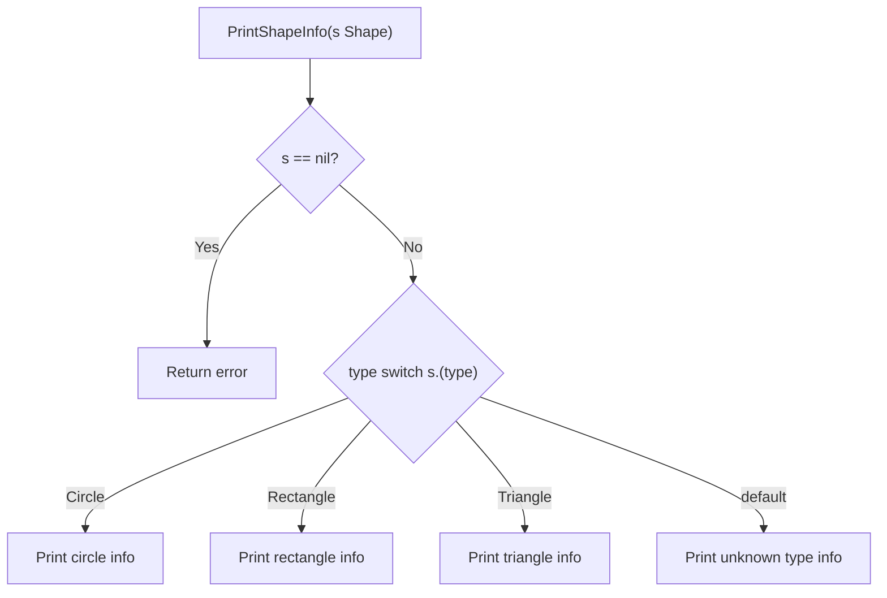
```mermaid
flowchart TD
    A["PrintShapeInfo(s Shape)"] --> B{"s == nil?"}
    B -->|"Yes"| C["Return error"]
    B -->|"No"| D{"type switch s.(type)"}
    D -->|"Circle"| E["Print circle info"]
    D -->|"Rectangle"| F["Print rectangle info"]
    D -->|"Triangle"| G["Print triangle info"]
    D -->|"default"| H["Print unknown type info"]
```

**Execution Trace:**
```
Input:  Circle{Radius: 5}
Step 1: type switch matches Circle → v.Radius = 5
Step 2: v.Area() = π × 5² = 78.54
Output: "Circle with radius 5.00, area 78.54"
```

### Interviewer Questions

1. Why use a type switch instead of adding a `Name()` method to `Shape`?
2. Can we improve time/space further? What's the theoretical lower bound?
3. How does this scale to 10M elements / 1M concurrent requests?
4. Walk me through the edge case where a custom `Shape` implementation is passed.
5. How would you make this goroutine-safe?
6. What's the memory/GC impact? How would you reduce allocations?
7. How would you test this comprehensively?

### Follow-Up Questions

**Q1:** What is the open/closed principle concern with type switches?
**A1:** Every time a new `Shape` type is added, every type switch must be updated. This violates the open/closed principle. Prefer adding methods to the interface (like `Describe() string`) so new types self-describe. Use type switches only when you cannot modify the interface.

**Q2:** Can a type switch case match an interface type?
**A2:** Yes. `case fmt.Stringer:` matches any type that satisfies `fmt.Stringer`. Interface cases are checked by method set, not by concrete type name. Concrete type cases are checked first; interface cases come after.

**Q3:** What happens with multiple types in one case?
**A3:** `case Circle, Rectangle:` is valid, but the variable `v` in `switch v := s.(type)` has the type of the interface (`Shape`), not a concrete type. You lose access to concrete fields in a multi-type case.

**Q4:** How would you test that all known shapes are handled?
**A4:** Use an exhaustiveness linter like `exhaustive` or write a test that iterates a slice of all known `Shape` implementations and checks that `PrintShapeInfo` returns nil error for each.

**Q5:** How does this pattern compare to the visitor pattern?
**A5:** The visitor pattern externalises operations on a type hierarchy by having types accept a visitor. It avoids open/closed violations at the cost of more boilerplate. In Go, the visitor pattern is sometimes replaced by type switches or by adding methods to the interface. Prefer interface methods when you own the types.

---

## Q7: Implementing sort.Interface  [Level 2 — Easy]

> **Tags:** `#sort-interface` `#stdlib` `#slice-sorting`

### Problem Statement
Implement `sort.Interface` for a `ByAge` type that wraps `[]Person` (where `Person` has `Name string` and `Age int`). Sort a slice of people by age ascending. Also show how to sort descending using `sort.Reverse`.

### Input / Output / Constraints

```
Input:  [{Alice 30}, {Bob 25}, {Carol 35}]
Output: [{Bob 25}, {Alice 30}, {Carol 35}]  (ascending by Age)
        [{Carol 35}, {Alice 30}, {Bob 25}]  (descending by Age)

Constraints:
  • Must implement Len(), Less(i,j int) bool, Swap(i,j int)
  • 1 ≤ len(slice) ≤ 10^6
  • Ages are positive integers
```

### Thought Process

Think like a senior Go engineer:
1. **Understand:** `sort.Interface` requires three methods. The sort algorithm calls them without knowing the concrete type.
2. **Pattern:** Type wrapping for sort customisation; `sort.Reverse` wraps any `sort.Interface` to invert `Less`.
3. **Edge cases:** Empty slice, single element, duplicate ages, nil slice.
4. **Approach:** Define `ByAge` as a named type `[]Person`; implement the three methods; show `sort.Reverse`.

### Brute Force Solution

```go
package main

import (
    "fmt"
    "sort"
)

// bruteForce — O(n log n) time, O(n) space
// Use sort.Slice with anonymous function — no type needed but less reusable.
func bruteForce(people []Person) {
    sort.Slice(people, func(i, j int) bool {
        return people[i].Age < people[j].Age
    })
    fmt.Println(people)
}
```

**Time:** O(n log n) | **Space:** O(log n) stack
**Bottleneck:** `sort.Slice` cannot be used with `sort.Search` or `sort.Reverse` in a composable way; the comparison is not encapsulated.

### Better Solution

```go
// betterSolution — implements sort.Interface
type ByAge []Person

func (a ByAge) Len() int           { return len(a) }
func (a ByAge) Less(i, j int) bool { return a[i].Age < a[j].Age }
func (a ByAge) Swap(i, j int)      { a[i], a[j] = a[j], a[i] }
```

**Time:** O(n log n) | **Space:** O(log n)

### Best / Optimal Solution

```go
package main

import (
    "fmt"
    "sort"
)

// Person is the domain type.
type Person struct {
    Name string
    Age  int
}

// ByAge implements sort.Interface for []Person sorted by Age ascending.
type ByAge []Person

func (a ByAge) Len() int           { return len(a) }
func (a ByAge) Less(i, j int) bool { return a[i].Age < a[j].Age }
func (a ByAge) Swap(i, j int)      { a[i], a[j] = a[j], a[i] }

// SortPeople — O(n log n) time, O(log n) space.
// Returns a sorted copy; does not mutate the original.
func SortPeople(people []Person, descending bool) ([]Person, error) {
    if people == nil {
        return nil, fmt.Errorf("people slice must not be nil")
    }
    cp := make([]Person, len(people))
    copy(cp, people)

    var iface sort.Interface = ByAge(cp)
    if descending {
        iface = sort.Reverse(iface)
    }
    sort.Sort(iface)
    return cp, nil
}

func main() {
    people := []Person{
        {Name: "Alice", Age: 30},
        {Name: "Bob", Age: 25},
        {Name: "Carol", Age: 35},
    }

    asc, err := SortPeople(people, false)
    if err != nil {
        fmt.Printf("error: %v\n", err)
        return
    }
    fmt.Println("Ascending:", asc)

    desc, _ := SortPeople(people, true)
    fmt.Println("Descending:", desc)
}
```

**Time:** O(n log n) | **Space:** O(n) for the copy

### Production Considerations

| Aspect | Details |
|--------|---------|
| **Scalability** | sort.Sort is in-place O(n log n); making a copy costs O(n) memory |
| **Edge Cases** | Empty slice returns empty slice; nil returns error; single element returns as-is |
| **Error Handling** | Return error for nil input; sort never errors on valid slice |
| **Memory** | Copying avoids mutating caller's slice; omit copy if mutation is acceptable |
| **Concurrency** | sort.Sort is not goroutine-safe on the same slice; sort the copy |

### Visual Explanation

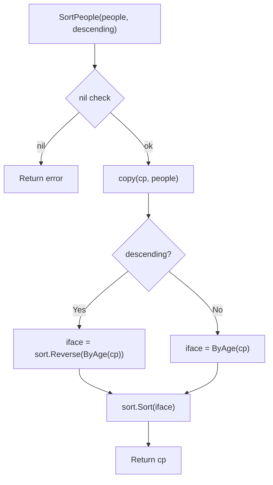
```mermaid
flowchart TD
    A["SortPeople(people, descending)"] --> B{"nil check"}
    B -->|"nil"| C["Return error"]
    B -->|"ok"| D["copy(cp, people)"]
    D --> E{"descending?"}
    E -->|"Yes"| F["iface = sort.Reverse(ByAge(cp))"]
    E -->|"No"| G["iface = ByAge(cp)"]
    F --> H["sort.Sort(iface)"]
    G --> H
    H --> I["Return cp"]
```

**Execution Trace:**
```
Input:  [{Alice 30}, {Bob 25}, {Carol 35}], descending=false
Step 1: copy → cp = [{Alice 30}, {Bob 25}, {Carol 35}]
Step 2: sort.Sort(ByAge) — comparisons via Less(i,j)
Step 3: sorted cp = [{Bob 25}, {Alice 30}, {Carol 35}]
Output: [{Bob 25}, {Alice 30}, {Carol 35}]
```

### Interviewer Questions

1. Why use `sort.Interface` instead of `sort.Slice`?
2. Can we improve time/space further? What's the theoretical lower bound?
3. How does this scale to 10M elements / 1M concurrent requests?
4. Walk me through the edge case where two people have the same age.
5. How would you make this goroutine-safe?
6. What's the memory/GC impact? How would you reduce allocations?
7. How would you test this comprehensively?

### Follow-Up Questions

**Q1:** When is `sort.Interface` preferred over `sort.Slice`?
**A1:** Use `sort.Interface` when: (1) you need `sort.Search` (binary search) with the same comparator, (2) you want to compose with `sort.Reverse`, (3) you are building a reusable sorting type that others will import. Use `sort.Slice` for quick one-off sorts where the comparator won't be reused.

**Q2:** How do you implement a stable sort?
**A2:** Use `sort.Stable(ByAge(people))` instead of `sort.Sort`. Stable sort preserves the original order of equal elements. Its worst case is O(n log² n) vs O(n log n) for sort.Sort.

**Q3:** How do you sort by multiple fields (age then name)?
**A3:** Change `Less`: `if a[i].Age != a[j].Age { return a[i].Age < a[j].Age }; return a[i].Name < a[j].Name`. Or use `sort.Slice` with the same multi-field comparator.

**Q4:** What does `sort.Reverse` actually do?
**A4:** It returns a `sort.Interface` wrapper where `Less(i, j)` calls the original `Less(j, i)` — swapping the arguments to invert the ordering. It is a thin struct with no additional allocations beyond the interface wrapper.

**Q5:** How would you benchmark sort performance on 10M elements?
**A5:** Write a `BenchmarkSortPeople` in `_test.go`, generate 10M random `Person` values in `b.ResetTimer()`, then call `sort.Sort(ByAge(people))`. Use `go test -bench=. -benchmem -count=5` and compare with `sort.Slice`.

---

## Q8: Implementing http.Handler  [Level 3 — Medium]

> **Tags:** `#http-handler` `#net-http` `#middleware`

### Problem Statement
Implement `http.Handler` for a `JSONHandler` struct that serves a JSON response `{"message": "ok", "path": "<request-path>"}` with status 200. Then write a `LoggingMiddleware` that wraps any `http.Handler`, logs the method and path to stdout, then calls the next handler. Chain them together.

### Input / Output / Constraints

```
Input:  GET /api/health HTTP/1.1
Output: HTTP 200, body: {"message":"ok","path":"/api/health"}
        Stdout: "GET /api/health"

Constraints:
  • Must implement http.Handler interface: ServeHTTP(w ResponseWriter, r *Request)
  • LoggingMiddleware must accept any http.Handler, not just JSONHandler
  • Response Content-Type must be application/json
```

### Thought Process

Think like a senior Go engineer:
1. **Understand:** `http.Handler` has one method. Middleware wraps a handler, adds behaviour, and delegates. This is the decorator pattern applied to HTTP.
2. **Pattern:** Middleware chain via handler wrapping; interface-based composition.
3. **Edge cases:** Panics in the inner handler (need recovery middleware), nil inner handler, concurrent requests.
4. **Approach:** `JSONHandler` writes JSON; `LoggingMiddleware` logs then calls `next.ServeHTTP`.

### Brute Force Solution

```go
package main

import (
    "fmt"
    "net/http"
)

// bruteForce — O(1) per request
// Use http.HandleFunc — no struct, no reusable middleware.
func bruteForce() {
    http.HandleFunc("/", func(w http.ResponseWriter, r *http.Request) {
        fmt.Fprintf(w, `{"message":"ok","path":"%s"}`, r.URL.Path)
    })
}
```

**Time:** O(1) | **Space:** O(1)
**Bottleneck:** Cannot inject dependencies into handlers; middleware is not composable; testing requires starting a real HTTP server.

### Better Solution

```go
// betterSolution — implements http.Handler with struct
type JSONHandler struct{}

func (h JSONHandler) ServeHTTP(w http.ResponseWriter, r *http.Request) {
    w.Header().Set("Content-Type", "application/json")
    fmt.Fprintf(w, `{"message":"ok","path":"%s"}`, r.URL.Path)
}
```

**Time:** O(1) | **Space:** O(1)

### Best / Optimal Solution

```go
package main

import (
    "encoding/json"
    "fmt"
    "log"
    "net/http"
    "net/http/httptest"
    "time"
)

// JSONHandler serves a simple JSON response.
type JSONHandler struct{}

// ServeHTTP satisfies http.Handler — O(1) time, O(1) space.
func (h JSONHandler) ServeHTTP(w http.ResponseWriter, r *http.Request) {
    w.Header().Set("Content-Type", "application/json")
    w.WriteHeader(http.StatusOK)
    resp := map[string]string{
        "message": "ok",
        "path":    r.URL.Path,
    }
    if err := json.NewEncoder(w).Encode(resp); err != nil {
        log.Printf("JSONHandler: encode error: %v", err)
    }
}

// LoggingMiddleware wraps any http.Handler and logs requests.
type LoggingMiddleware struct {
    next   http.Handler
    logger *log.Logger
}

// NewLoggingMiddleware constructs the middleware, validating dependencies.
func NewLoggingMiddleware(next http.Handler, logger *log.Logger) (http.Handler, error) {
    if next == nil {
        return nil, fmt.Errorf("next handler must not be nil")
    }
    if logger == nil {
        return nil, fmt.Errorf("logger must not be nil")
    }
    return &LoggingMiddleware{next: next, logger: logger}, nil
}

// ServeHTTP logs then delegates — O(1) overhead.
func (m *LoggingMiddleware) ServeHTTP(w http.ResponseWriter, r *http.Request) {
    start := time.Now()
    m.logger.Printf("%s %s", r.Method, r.URL.Path)
    m.next.ServeHTTP(w, r)
    m.logger.Printf("completed in %v", time.Since(start))
}

func main() {
    logger := log.Default()
    base := JSONHandler{}
    handler, err := NewLoggingMiddleware(base, logger)
    if err != nil {
        log.Fatalf("setup error: %v", err)
    }

    // Use httptest to demo without starting a real server.
    req := httptest.NewRequest(http.MethodGet, "/api/health", nil)
    rec := httptest.NewRecorder()
    handler.ServeHTTP(rec, req)
    fmt.Printf("Status: %d\nBody: %s", rec.Code, rec.Body.String())
}
```

**Time:** O(1) per request | **Space:** O(1) per request

### Production Considerations

| Aspect | Details |
|--------|---------|
| **Scalability** | Each request is independent; scales horizontally |
| **Edge Cases** | Panic recovery middleware should wrap the chain; nil next caught at construction |
| **Error Handling** | JSON encode errors logged; response already started so cannot change status code |
| **Memory** | `json.NewEncoder` allocates; for ultra-high-throughput use pre-encoded static responses |
| **Concurrency** | `ServeHTTP` is called concurrently; no shared mutable state here — safe |

### Visual Explanation

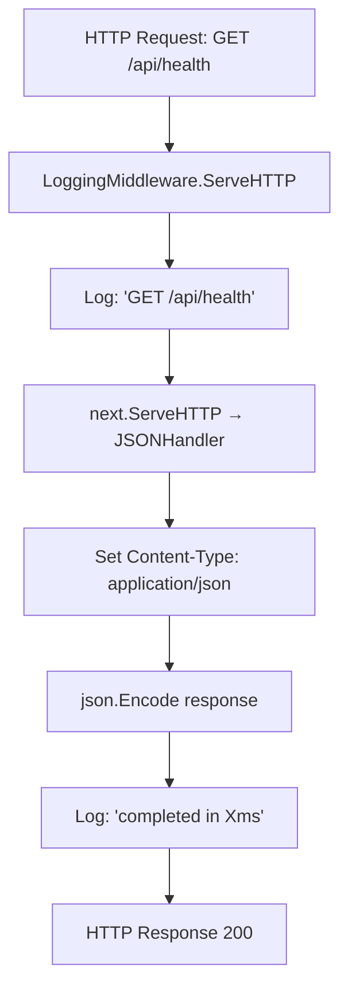
```mermaid
flowchart TD
    A["HTTP Request: GET /api/health"] --> B["LoggingMiddleware.ServeHTTP"]
    B --> C["Log: 'GET /api/health'"]
    C --> D["next.ServeHTTP → JSONHandler"]
    D --> E["Set Content-Type: application/json"]
    E --> F["json.Encode response"]
    F --> G["Log: 'completed in Xms'"]
    G --> H["HTTP Response 200"]
```

**Execution Trace:**
```
Request:  GET /api/health
Step 1:   LoggingMiddleware logs "GET /api/health"
Step 2:   JSONHandler sets headers and writes JSON body
Step 3:   LoggingMiddleware logs elapsed time
Output:   200 {"message":"ok","path":"/api/health"}
```

### Interviewer Questions

1. Why implement `http.Handler` as a struct instead of using `http.HandlerFunc`?
2. Can we improve time/space further? What's the theoretical lower bound?
3. How does this scale to 10M elements / 1M concurrent requests?
4. Walk me through the edge case where the inner handler panics.
5. How would you make this goroutine-safe?
6. What's the memory/GC impact? How would you reduce allocations?
7. How would you test this comprehensively?

### Follow-Up Questions

**Q1:** What is `http.HandlerFunc` and when do you use it instead of a struct?
**A1:** `http.HandlerFunc` is a function type that satisfies `http.Handler` by having `ServeHTTP` call itself. Use it for simple, stateless handlers. Use a struct when the handler needs injected dependencies (DB, logger, config) — the struct carries the state cleanly.

**Q2:** How do you add request-scoped values (e.g., request ID) to the middleware chain?
**A2:** Use `context.WithValue(r.Context(), key, value)` and pass `r.WithContext(ctx)` to `next.ServeHTTP`. Define unexported context key types to avoid collisions: `type ctxKey string; const reqIDKey ctxKey = "requestID"`.

**Q3:** How do you write a unit test for the middleware without starting an HTTP server?
**A3:** Use `httptest.NewRecorder()` as the `ResponseWriter` and `httptest.NewRequest()` as the `*Request`. Call `handler.ServeHTTP(rec, req)` directly. Check `rec.Code`, `rec.Header()`, and `rec.Body.String()`.

**Q4:** How would you implement a panic-recovery middleware?
**A4:** `defer func() { if r := recover(); r != nil { log.Printf("panic: %v", r); http.Error(w, "internal error", 500) } }()` at the top of `ServeHTTP`. Wrap this middleware outermost in the chain.

**Q5:** How do you compose multiple middleware layers?
**A5:** Apply them inside-out: `handler := PanicMiddleware(LoggingMiddleware(AuthMiddleware(JSONHandler{})))`. Or use a helper: `func Chain(h http.Handler, mw ...func(http.Handler) http.Handler) http.Handler { for i := len(mw)-1; i >= 0; i-- { h = mw[i](h) }; return h }`.

---

## Q9: Interface Embedding in Structs  [Level 3 — Medium]

> **Tags:** `#interface-embedding` `#struct-composition` `#delegation`

### Problem Statement
Design a `Storage` interface with `Save(key, value string) error` and `Load(key string) (string, error)`. Create a `CachedStorage` struct that embeds `Storage` and adds an in-memory `map[string]string` cache. On `Load`, check the cache first; on miss, delegate to the embedded `Storage` and populate the cache. On `Save`, invalidate the cache for that key.

### Input / Output / Constraints

```
Input:  CachedStorage wrapping a FileStorage
        Save("name", "Alice"), Load("name"), Load("name")
Output: First Load: miss → fetch from FileStorage, cache populated
        Second Load: hit → return from cache (no FileStorage call)

Constraints:
  • 1 ≤ len(key) ≤ 256
  • Thread safety not required (single goroutine)
  • Cache is unbounded (no eviction policy needed)
```

### Thought Process

Think like a senior Go engineer:
1. **Understand:** Embed the `Storage` interface in a struct to get automatic method promotion; override only the methods that need caching logic.
2. **Pattern:** Decorator/proxy via interface embedding — promotes unoverridden methods to the outer struct.
3. **Edge cases:** Loading a key that doesn't exist in either cache or storage, saving a key that was never loaded, nil embedded storage.
4. **Approach:** Embed `Storage`; implement `Load` and `Save` on `CachedStorage`; let other methods (if any) promote automatically.

### Brute Force Solution

```go
package main

// bruteForce — O(1) amortised
// Duplicate all Storage methods in CachedStorage manually.
type CachedStorageBrute struct {
    inner Storage
    cache map[string]string
}

func (c *CachedStorageBrute) Save(key, value string) error {
    delete(c.cache, key)
    return c.inner.Save(key, value)
}
// Must also implement Load, and every future Storage method — fragile.
```

**Time:** O(1) amortised | **Space:** O(n)
**Bottleneck:** Every new `Storage` method must be manually forwarded; interface embedding solves this automatically.

### Better Solution

```go
// betterSolution — embed interface for automatic method promotion
type CachedStorage struct {
    Storage                    // promoted: unoverridden methods auto-delegate
    cache map[string]string
}

func (c *CachedStorage) Load(key string) (string, error) {
    if v, ok := c.cache[key]; ok {
        return v, nil
    }
    v, err := c.Storage.Load(key)
    if err == nil {
        c.cache[key] = v
    }
    return v, err
}
```

**Time:** O(1) amortised | **Space:** O(n)

### Best / Optimal Solution

```go
package main

import (
    "fmt"
    "sync"
)

// Storage defines the persistence interface.
type Storage interface {
    Save(key, value string) error
    Load(key string) (string, error)
}

// InMemoryStorage is a simple in-memory Storage for testing.
type InMemoryStorage struct {
    mu   sync.RWMutex
    data map[string]string
}

func NewInMemoryStorage() *InMemoryStorage {
    return &InMemoryStorage{data: make(map[string]string)}
}

func (s *InMemoryStorage) Save(key, value string) error {
    s.mu.Lock()
    defer s.mu.Unlock()
    s.data[key] = value
    return nil
}

func (s *InMemoryStorage) Load(key string) (string, error) {
    s.mu.RLock()
    defer s.mu.RUnlock()
    v, ok := s.data[key]
    if !ok {
        return "", fmt.Errorf("key %q not found", key)
    }
    return v, nil
}

// CachedStorage wraps Storage with an in-memory cache.
// Embeds Storage so unoverridden methods are promoted automatically.
type CachedStorage struct {
    Storage
    mu    sync.RWMutex
    cache map[string]string
    hits  int
    misses int
}

// NewCachedStorage — validates and initialises the cache layer.
func NewCachedStorage(s Storage) (*CachedStorage, error) {
    if s == nil {
        return nil, fmt.Errorf("inner storage must not be nil")
    }
    return &CachedStorage{
        Storage: s,
        cache:   make(map[string]string),
    }, nil
}

// Load checks cache first, then delegates to the embedded Storage.
func (c *CachedStorage) Load(key string) (string, error) {
    c.mu.RLock()
    if v, ok := c.cache[key]; ok {
        c.hits++
        c.mu.RUnlock()
        return v, nil
    }
    c.mu.RUnlock()

    v, err := c.Storage.Load(key)
    if err != nil {
        c.misses++
        return "", err
    }

    c.mu.Lock()
    c.cache[key] = v
    c.misses++
    c.mu.Unlock()
    return v, nil
}

// Save delegates to Storage and invalidates the cache entry.
func (c *CachedStorage) Save(key, value string) error {
    if err := c.Storage.Save(key, value); err != nil {
        return fmt.Errorf("CachedStorage.Save: %w", err)
    }
    c.mu.Lock()
    delete(c.cache, key)
    c.mu.Unlock()
    return nil
}

// Stats returns cache hit/miss counters.
func (c *CachedStorage) Stats() (hits, misses int) {
    c.mu.RLock()
    defer c.mu.RUnlock()
    return c.hits, c.misses
}

func main() {
    inner := NewInMemoryStorage()
    cached, err := NewCachedStorage(inner)
    if err != nil {
        fmt.Printf("error: %v\n", err)
        return
    }

    _ = cached.Save("name", "Alice")

    v1, _ := cached.Load("name") // miss — fetches from InMemoryStorage
    v2, _ := cached.Load("name") // hit  — returns from cache
    fmt.Println(v1, v2)

    hits, misses := cached.Stats()
    fmt.Printf("hits=%d misses=%d\n", hits, misses)
}
```

**Time:** O(1) amortised | **Space:** O(n) for the cache

### Production Considerations

| Aspect | Details |
|--------|---------|
| **Scalability** | Cache grows unbounded; add LRU eviction for production (e.g., github.com/hashicorp/golang-lru) |
| **Edge Cases** | Key not found in both cache and storage returns wrapped error |
| **Error Handling** | Inner Save errors are wrapped and propagated |
| **Memory** | Each cached entry is one map entry; estimate 64–128 bytes per entry |
| **Concurrency** | Uses sync.RWMutex; read-heavy workloads scale well with RLock |

### Visual Explanation

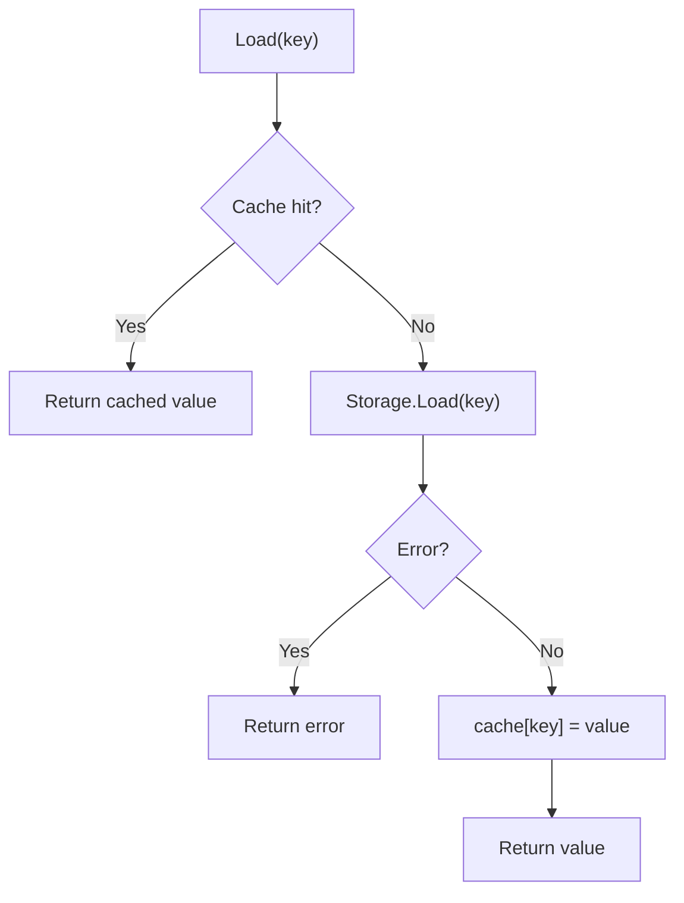
```mermaid
flowchart TD
    A["Load(key)"] --> B{"Cache hit?"}
    B -->|"Yes"| C["Return cached value"]
    B -->|"No"| D["Storage.Load(key)"]
    D --> E{"Error?"}
    E -->|"Yes"| F["Return error"]
    E -->|"No"| G["cache[key] = value"]
    G --> H["Return value"]
```

**Execution Trace:**
```
Save("name", "Alice") → inner.Save, cache invalidated
Load("name")          → cache miss → inner.Load → cache["name"]="Alice" → return "Alice"
Load("name")          → cache hit  → return "Alice" (no inner call)
Stats                 → hits=1, misses=1
```

### Interviewer Questions

1. Why embed `Storage` interface instead of having a concrete `inner` field?
2. Can we improve time/space further? What's the theoretical lower bound?
3. How does this scale to 10M elements / 1M concurrent requests?
4. Walk me through the edge case where `Save` fails on the inner storage.
5. How would you make this goroutine-safe?
6. What's the memory/GC impact? How would you reduce allocations?
7. How would you test this comprehensively?

### Follow-Up Questions

**Q1:** What happens when you embed an interface in a struct and do not set the field?
**A1:** The embedded interface field is nil. Calling any promoted method panics at runtime. Always initialise the field (via constructor or direct assignment). This is the interface embedding nil-panic trap.

**Q2:** How does interface embedding in structs differ from struct embedding in structs?
**A2:** Both promote methods to the outer type. With struct embedding, you get direct field access. With interface embedding, you only get the methods defined in the interface; the concrete type's non-interface methods are not promoted.

**Q3:** How do you add a cache TTL?
**A3:** Store `cacheEntry{value string; expiry time.Time}` in the map. In `Load`, check `time.Now().After(entry.expiry)` and treat expired entries as misses, deleting them.

**Q4:** How would you test CachedStorage without a real database?
**A4:** Implement `MockStorage` satisfying `Storage` with a `map[string]string` and call counters. Inject into `NewCachedStorage`. Verify that after the first `Load`, the second `Load` does not increment the mock's call counter.

**Q5:** What eviction policy would you choose for a production cache?
**A5:** LRU (Least Recently Used) is the most common. Use `github.com/hashicorp/golang-lru/v2` which provides a generic, goroutine-safe LRU cache. Set the capacity at construction based on memory budget divided by average entry size.

---

## Q10: The Nil Interface Bug  [Level 4 — Advanced]

> **Tags:** `#nil-interface` `#interface-internals` `#gotcha` `#google` `#amazon`

### Problem Statement
Demonstrate the infamous nil interface bug: a function returns an `error` interface, but the returned value is a non-nil interface holding a nil pointer. Show why `err != nil` is true even though the underlying pointer is nil. Then show the correct fix. This is a Level 4 problem because it requires understanding Go's two-word interface representation.

### Input / Output / Constraints

```
Input:  getError(returnError=false)
Output: Bug version:  "unexpected error: <nil>"  (err != nil is TRUE — BUG)
        Fixed version: err == nil (correct)

Constraints:
  • Must demonstrate the two-word interface representation
  • Show both buggy and correct implementations
  • Explain using concrete type *MyError and interface error
```

### Thought Process

Think like a senior Go engineer:
1. **Understand:** An interface value has two words: (type, data). A nil interface has (nil, nil). A non-nil interface holding a nil pointer has (*MyError, nil) — non-nil because the type word is set.
2. **Pattern:** Nil interface vs nil pointer in interface — the single most common Go gotcha.
3. **Edge cases:** This IS the edge case. It manifests whenever you return a concrete nil pointer as an interface type.
4. **Approach:** Show the bug, explain the internals, show the fix (return untyped nil or use the interface type directly).

### Brute Force Solution

```go
package main

import "fmt"

type MyError struct{ msg string }
func (e *MyError) Error() string { return e.msg }

// BUGGY: returns non-nil interface holding a nil pointer
func getBuggyError(fail bool) error {
    var err *MyError // nil pointer, type *MyError
    if fail {
        err = &MyError{msg: "something failed"}
    }
    return err // BUG: wraps *MyError(nil) in error interface → non-nil!
}

func bruteForce() {
    err := getBuggyError(false)
    if err != nil {
        fmt.Println("unexpected error:", err) // THIS PRINTS — BUG!
    }
}
```

**Time:** O(1) | **Space:** O(1)
**Bottleneck:** The type word of the interface is set to `*MyError`, making the interface non-nil even when the data word is nil.

### Better Solution

```go
// betterSolution — return untyped nil explicitly
func getFixedError(fail bool) error {
    if fail {
        return &MyError{msg: "something failed"}
    }
    return nil // untyped nil → interface{nil, nil} → truly nil
}
```

**Time:** O(1) | **Space:** O(1)

### Best / Optimal Solution

```go
package main

import (
    "errors"
    "fmt"
    "unsafe"
)

// MyError is a custom error type.
type MyError struct {
    Code    int
    Message string
}

func (e *MyError) Error() string {
    return fmt.Sprintf("error %d: %s", e.Code, e.Message)
}

// --- THE BUG ---

// getBuggyError demonstrates the nil interface bug.
// When fail=false, returns a non-nil interface holding a nil *MyError.
func getBuggyError(fail bool) error {
    var err *MyError // concrete nil pointer
    if fail {
        err = &MyError{Code: 500, Message: "internal error"}
    }
    // BUG: always wraps *MyError in error interface.
    // Interface = {type=*MyError, data=nil} → err != nil is TRUE.
    return err
}

// --- THE FIX ---

// getFixedError returns an untyped nil when there is no error.
// Untyped nil → interface = {type=nil, data=nil} → err == nil is TRUE.
func getFixedError(fail bool) error {
    if fail {
        return &MyError{Code: 500, Message: "internal error"}
    }
    return nil // untyped nil: correct
}

// inspectInterface prints the internal two-word structure of an error.
// Uses unsafe to peek at the interface internals for educational purposes.
func inspectInterface(label string, err error) {
    type iface struct {
        typePtr uintptr
        dataPtr uintptr
    }
    // SAFETY: only for educational inspection; never in production.
    i := (*iface)(unsafe.Pointer(&err))
    fmt.Printf("[%s] err != nil: %v | type ptr: 0x%x | data ptr: 0x%x\n",
        label, err != nil, i.typePtr, i.dataPtr)
}

// OptimalSolution — O(1) time, O(1) space.
// Demonstrates the bug and the correct pattern.
func OptimalSolution(fail bool) error {
    bugErr := getBuggyError(fail)
    fixedErr := getFixedError(fail)

    inspectInterface("buggy ", bugErr)
    inspectInterface("fixed ", fixedErr)

    // Use errors.As to safely check for *MyError even with the buggy version.
    var myErr *MyError
    if errors.As(bugErr, &myErr) && myErr != nil {
        return myErr
    }
    return fixedErr
}

func main() {
    fmt.Println("=== fail=false (should have no error) ===")
    err := OptimalSolution(false)
    if err != nil {
        fmt.Println("ERROR (unexpected):", err)
    } else {
        fmt.Println("no error (correct)")
    }

    fmt.Println("\n=== fail=true (should have error) ===")
    err = OptimalSolution(true)
    if err != nil {
        fmt.Println("error (expected):", err)
    }
}
```

**Time:** O(1) | **Space:** O(1)

### Production Considerations

| Aspect | Details |
|--------|---------|
| **Scalability** | This is a correctness bug, not a performance issue |
| **Edge Cases** | Any function that conditionally returns a typed nil pointer as an interface is vulnerable |
| **Error Handling** | Always return untyped `nil` for the no-error case in functions returning `error` |
| **Memory** | No memory impact; this is a type system subtlety |
| **Concurrency** | Not concurrency-related; pure type system bug |

### Visual Explanation

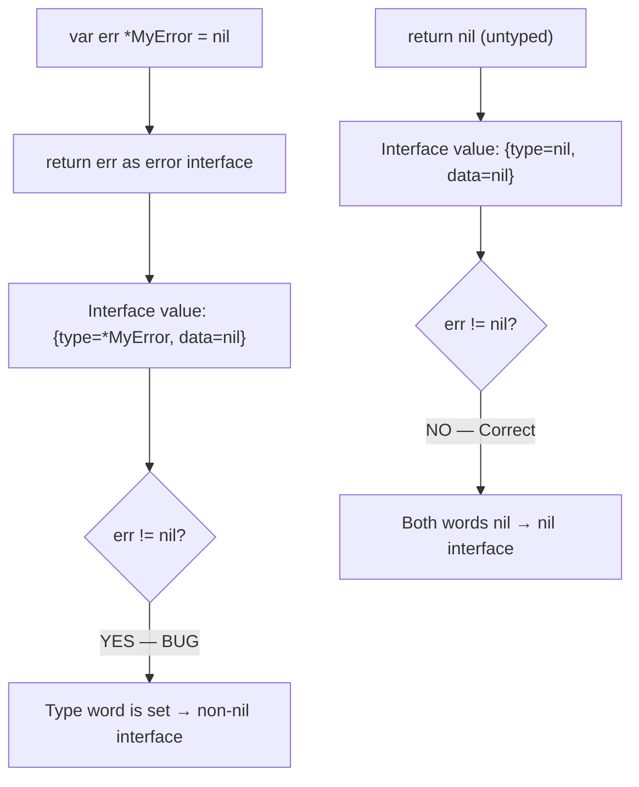
```mermaid
flowchart TD
    A["var err *MyError = nil"] --> B["return err as error interface"]
    B --> C["Interface value: {type=*MyError, data=nil}"]
    C --> D{"err != nil?"}
    D -->|"YES — BUG"| E["Type word is set → non-nil interface"]
    F["return nil (untyped)"] --> G["Interface value: {type=nil, data=nil}"]
    G --> H{"err != nil?"}
    H -->|"NO — Correct"| I["Both words nil → nil interface"]
```

**Execution Trace:**
```
getBuggyError(false):
  var err *MyError → nil pointer of type *MyError
  return err       → interface{typePtr=*MyError vtable, dataPtr=nil}
  err != nil       → TRUE (type word is non-nil) ← BUG

getFixedError(false):
  return nil       → interface{typePtr=nil, dataPtr=nil}
  err == nil       → TRUE ← correct
```

### Interviewer Questions

1. Why does returning a typed nil pointer satisfy a non-nil interface check?
2. Can we improve time/space further? What's the theoretical lower bound?
3. How does this scale to 10M elements / 1M concurrent requests?
4. Walk me through what happens when you call `.Error()` on the buggy non-nil error.
5. How would you make this goroutine-safe?
6. What's the memory/GC impact? How would you reduce allocations?
7. How would you test this comprehensively?

### Follow-Up Questions

**Q1:** How do you detect this bug with a linter?
**A1:** The `staticcheck` tool (SA4023) detects "impossible condition: interface value is never nil" in some cases. The `nilness` analyser in `go vet` catches some variants. Code review remains the most reliable detector — look for `var err *ConcreteType` returned as `error`.

**Q2:** When would you intentionally return a typed nil in an interface?
**A2:** Almost never. One rare case: a constructor that returns `(SomeInterface, error)` where the interface itself is nil on error — but even then, return `nil, err` not `(*ConcreteType)(nil), err`.

**Q3:** How does `errors.As` handle this situation?
**A3:** `errors.As(err, &target)` calls `err.Error()` via the interface. If the underlying pointer is nil, calling `.Error()` will panic (nil pointer dereference). Always check `target != nil` after `errors.As` succeeds.

**Q4:** What does `reflect.ValueOf(err).IsNil()` return for the buggy case?
**A4:** `reflect.ValueOf(err).IsNil()` returns `true` because the data pointer (the underlying `*MyError`) is nil. But `err != nil` is still `true` because the type pointer is set. This inconsistency is exactly the bug.

**Q5:** How does this apply to concrete types other than error?
**A5:** Any interface. Example: `var r *bytes.Buffer; var w io.Writer = r; fmt.Println(w == nil)` prints `false` even though `r` is nil. The pattern is universal to all interface types in Go.

---

## Q11: Interface-Based API Design  [Level 3 — Medium]

> **Tags:** `#api-design` `#dependency-injection` `#testability`

### Problem Statement
Design a `NotificationService` that sends notifications via different channels. Define a `Notifier` interface with `Send(recipient, message string) error`. Implement `EmailNotifier` and `SMSNotifier`. Write `NotificationService.Notify` that accepts a `Notifier` and sends a message, retrying up to 3 times on transient errors. Use a custom `TransientError` type to distinguish retryable from fatal errors.

### Input / Output / Constraints

```
Input:  EmailNotifier, recipient="alice@example.com", message="Welcome!"
        SMSNotifier fails twice with TransientError, succeeds on 3rd attempt
Output: Email sent successfully
        SMS sent after 2 retries

Constraints:
  • Retry only on TransientError, not on fatal errors
  • Maximum 3 attempts total
  • Notifier interface must be the only coupling point
```

### Thought Process

Think like a senior Go engineer:
1. **Understand:** Interface-based injection decouples `NotificationService` from concrete notifiers; enables testing with mocks.
2. **Pattern:** Strategy pattern via interface; error type discrimination with `errors.As`.
3. **Edge cases:** All 3 retries fail, fatal error on first attempt, nil notifier.
4. **Approach:** Define `TransientError`; loop up to 3 times; break on non-transient error.

### Brute Force Solution

```go
package main

// bruteForce — hard-coded to EmailNotifier, not extensible
type NotificationServiceBrute struct {
    email *EmailNotifier
}

func (s *NotificationServiceBrute) Notify(r, m string) error {
    return s.email.Send(r, m) // no retry, no abstraction
}
```

**Time:** O(1) | **Space:** O(1)
**Bottleneck:** Tightly coupled to `EmailNotifier`; cannot swap to SMS, push, Slack, etc. without code changes.

### Better Solution

```go
// betterSolution — strategy pattern, no retry
type NotificationService struct{ notifier Notifier }

func (s *NotificationService) Notify(r, m string) error {
    return s.notifier.Send(r, m)
}
```

**Time:** O(1) | **Space:** O(1)

### Best / Optimal Solution

```go
package main

import (
    "errors"
    "fmt"
    "log"
)

// Notifier sends a notification to a recipient.
type Notifier interface {
    Send(recipient, message string) error
}

// TransientError signals a retryable failure.
type TransientError struct {
    Cause string
}

func (e *TransientError) Error() string {
    return fmt.Sprintf("transient error: %s", e.Cause)
}

// EmailNotifier sends email notifications (simulated).
type EmailNotifier struct {
    Attempts int // for demo/testing
}

func (e *EmailNotifier) Send(recipient, message string) error {
    e.Attempts++
    log.Printf("[email] sending to %s: %s", recipient, message)
    return nil
}

// SMSNotifier simulates 2 transient failures then success.
type SMSNotifier struct {
    callCount int
    failUntil int
}

func NewSMSNotifier(failUntil int) *SMSNotifier {
    return &SMSNotifier{failUntil: failUntil}
}

func (s *SMSNotifier) Send(recipient, message string) error {
    s.callCount++
    if s.callCount <= s.failUntil {
        return &TransientError{Cause: fmt.Sprintf("SMS gateway overloaded (attempt %d)", s.callCount)}
    }
    log.Printf("[sms] sending to %s: %s", recipient, message)
    return nil
}

// NotificationService retries on transient errors.
type NotificationService struct {
    maxRetries int
}

// NewNotificationService initialises the service.
func NewNotificationService(maxRetries int) *NotificationService {
    if maxRetries < 1 {
        maxRetries = 1
    }
    return &NotificationService{maxRetries: maxRetries}
}

// Notify — O(maxRetries) time, O(1) space.
// Retries up to maxRetries times on TransientError; fails fast on fatal errors.
func (s *NotificationService) Notify(n Notifier, recipient, message string) error {
    if n == nil {
        return fmt.Errorf("notifier must not be nil")
    }
    if recipient == "" {
        return fmt.Errorf("recipient must not be empty")
    }
    var lastErr error
    for attempt := 1; attempt <= s.maxRetries; attempt++ {
        err := n.Send(recipient, message)
        if err == nil {
            return nil
        }
        var transient *TransientError
        if !errors.As(err, &transient) {
            // Fatal error — do not retry.
            return fmt.Errorf("fatal error on attempt %d: %w", attempt, err)
        }
        lastErr = err
        log.Printf("attempt %d/%d failed (transient): %v", attempt, s.maxRetries, err)
    }
    return fmt.Errorf("all %d attempts failed: %w", s.maxRetries, lastErr)
}

func main() {
    svc := NewNotificationService(3)

    // Email: succeeds first try.
    email := &EmailNotifier{}
    if err := svc.Notify(email, "alice@example.com", "Welcome!"); err != nil {
        fmt.Println("email error:", err)
    } else {
        fmt.Println("email sent successfully")
    }

    // SMS: fails twice, succeeds on 3rd attempt.
    sms := NewSMSNotifier(2)
    if err := svc.Notify(sms, "+1234567890", "Welcome!"); err != nil {
        fmt.Println("sms error:", err)
    } else {
        fmt.Println("sms sent after retries")
    }
}
```

**Time:** O(maxRetries) | **Space:** O(1)

### Production Considerations

| Aspect | Details |
|--------|---------|
| **Scalability** | Retry loop is bounded; add exponential backoff with jitter for real systems |
| **Edge Cases** | All retries exhausted, fatal error on first try, nil notifier |
| **Error Handling** | Wrap errors with %w; distinguish transient vs fatal for upstream decisions |
| **Memory** | No heap allocations in the hot path beyond error values |
| **Concurrency** | `NotificationService` is stateless; goroutine-safe. Notifiers may not be |

### Visual Explanation

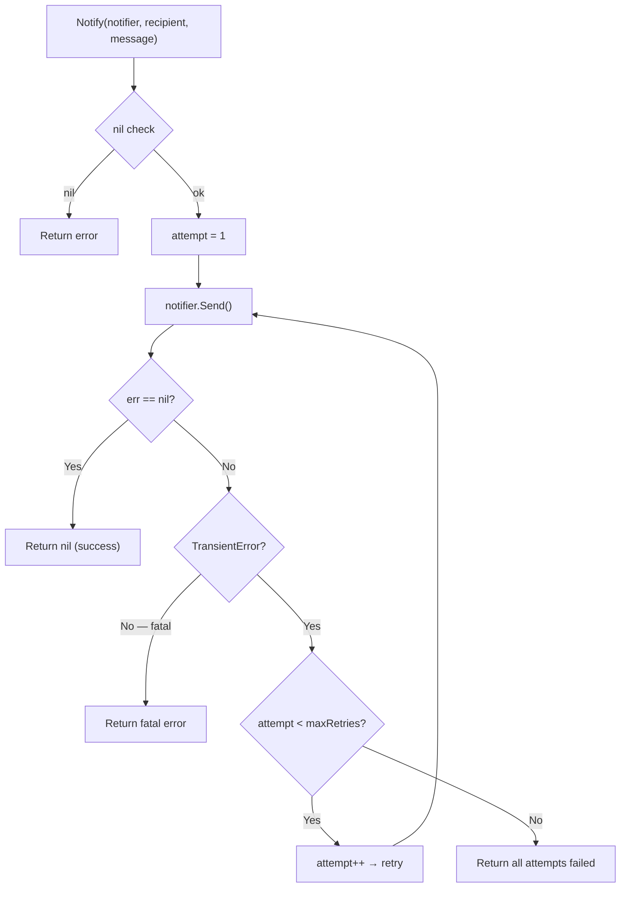
```mermaid
flowchart TD
    A["Notify(notifier, recipient, message)"] --> B{"nil check"}
    B -->|"nil"| C["Return error"]
    B -->|"ok"| D["attempt = 1"]
    D --> E["notifier.Send()"]
    E --> F{"err == nil?"}
    F -->|"Yes"| G["Return nil (success)"]
    F -->|"No"| H{"TransientError?"}
    H -->|"No — fatal"| I["Return fatal error"]
    H -->|"Yes"| J{"attempt < maxRetries?"}
    J -->|"Yes"| K["attempt++ → retry"]
    K --> E
    J -->|"No"| L["Return all attempts failed"]
```

**Execution Trace:**
```
SMS attempt 1: TransientError → retry
SMS attempt 2: TransientError → retry
SMS attempt 3: nil → success
Output: "sms sent after retries"
```

### Interviewer Questions

1. Why use `errors.As` instead of a type assertion for `TransientError`?
2. Can we improve time/space further? What's the theoretical lower bound?
3. How does this scale to 10M elements / 1M concurrent requests?
4. Walk me through the edge case where all 3 retries are exhausted.
5. How would you make this goroutine-safe?
6. What's the memory/GC impact? How would you reduce allocations?
7. How would you test this comprehensively?

### Follow-Up Questions

**Q1:** Why is `errors.As` preferred over `err.(*TransientError)`?
**A1:** `errors.As` unwraps error chains. If `TransientError` was wrapped with `%w`, a direct type assertion fails while `errors.As` traverses the chain and finds it. Always use `errors.As` for type-based error checks.

**Q2:** How would you add exponential backoff?
**A2:** `wait := time.Duration(1<<attempt) * 100 * time.Millisecond; time.Sleep(wait + jitter)` where `jitter = time.Duration(rand.Intn(100)) * time.Millisecond`. Use context deadline to stop retrying if the deadline expires.

**Q3:** How do you test `NotificationService` without real email/SMS?
**A3:** Implement `MockNotifier` with a `failCount int` field and a `SendFunc` for injection. In tests: `mock := &MockNotifier{failCount: 2}; svc.Notify(mock, ...)`. Assert `mock.callCount == 3`.

**Q4:** What is the interface segregation principle and how does it apply here?
**A4:** ISP says clients should not depend on methods they don't use. `Notifier` has only `Send` — no `Dial`, `Authenticate`, or `Close`. This means any implementation only needs to satisfy one method, reducing coupling. If you added `Close() error` to `Notifier`, every mock would need it.

**Q5:** How would you add circuit breaking on top of this?
**A5:** Wrap the `Notifier` with a `CircuitBreaker` struct implementing `Notifier`. Track consecutive failures; after a threshold, return a synthetic error without calling the inner notifier. After a cooldown window, allow one probe call.

---

## Q12: Mocking via Interfaces in Tests  [Level 3 — Medium]

> **Tags:** `#mocking` `#testing` `#interface-injection` `#tdd`

### Problem Statement
Write a `UserRepository` interface with `FindByID(id int) (*User, error)` and `Save(u *User) error`. Implement `UserService.GetUser(id int)` that fetches a user and enriches it with a greeting. Write a full test using a `MockUserRepository` that records calls and returns pre-set responses. Do NOT use any mocking library.

### Input / Output / Constraints

```
Input:  UserService with MockRepo pre-loaded with User{ID:1, Name:"Alice"}
        GetUser(1) → User{ID:1, Name:"Alice", Greeting:"Hello, Alice!"}
        GetUser(2) → error "user 2 not found"

Constraints:
  • No external mock libraries (mockery, gomock, testify/mock)
  • Mock must record how many times each method was called
  • 1 ≤ id ≤ 10^9
```

### Thought Process

Think like a senior Go engineer:
1. **Understand:** Define the interface, inject it into the service, implement a mock for tests.
2. **Pattern:** Hand-rolled mock with call recording — proves the pattern without framework magic.
3. **Edge cases:** User not found, save with nil user, calling GetUser with id=0.
4. **Approach:** `MockUserRepository` has a `users map[int]*User` and call counters.

### Brute Force Solution

```go
package main

// bruteForce — concrete dependency, untestable
type UserServiceBrute struct {
    db *RealDatabase // cannot swap in tests
}
```

**Time:** O(1) | **Space:** O(1)
**Bottleneck:** Hard-coded concrete dependency; tests require a real database.

### Better Solution

```go
// betterSolution — interface injection, basic mock
type UserRepository interface {
    FindByID(id int) (*User, error)
    Save(u *User) error
}

type MockRepo struct {
    users map[int]*User
}
func (m *MockRepo) FindByID(id int) (*User, error) { ... }
func (m *MockRepo) Save(u *User) error             { return nil }
```

**Time:** O(1) | **Space:** O(n)

### Best / Optimal Solution

```go
package main

import (
    "fmt"
    "testing"
)

// User is the domain entity.
type User struct {
    ID       int
    Name     string
    Greeting string
}

// UserRepository defines persistence operations.
type UserRepository interface {
    FindByID(id int) (*User, error)
    Save(u *User) error
}

// UserService enriches user data.
type UserService struct {
    repo UserRepository
}

// NewUserService validates and constructs the service.
func NewUserService(repo UserRepository) (*UserService, error) {
    if repo == nil {
        return nil, fmt.Errorf("repo must not be nil")
    }
    return &UserService{repo: repo}, nil
}

// GetUser — O(1) time, O(1) space.
// Fetches user and adds a personalised greeting.
func (s *UserService) GetUser(id int) (*User, error) {
    if id <= 0 {
        return nil, fmt.Errorf("id must be positive, got %d", id)
    }
    u, err := s.repo.FindByID(id)
    if err != nil {
        return nil, fmt.Errorf("GetUser: %w", err)
    }
    u.Greeting = fmt.Sprintf("Hello, %s!", u.Name)
    return u, nil
}

// --- Mock ---

// MockUserRepository records calls for test assertions.
type MockUserRepository struct {
    users          map[int]*User
    FindByIDCalls  int
    SaveCalls      int
    SavedUsers     []*User
}

func NewMockRepo(users ...*User) *MockUserRepository {
    m := &MockUserRepository{users: make(map[int]*User)}
    for _, u := range users {
        m.users[u.ID] = u
    }
    return m
}

func (m *MockUserRepository) FindByID(id int) (*User, error) {
    m.FindByIDCalls++
    u, ok := m.users[id]
    if !ok {
        return nil, fmt.Errorf("user %d not found", id)
    }
    copy := *u // return a copy to avoid test mutations leaking
    return &copy, nil
}

func (m *MockUserRepository) Save(u *User) error {
    m.SaveCalls++
    if u == nil {
        return fmt.Errorf("cannot save nil user")
    }
    m.users[u.ID] = u
    m.SavedUsers = append(m.SavedUsers, u)
    return nil
}

// --- Tests ---

func TestGetUser_Found(t *testing.T) {
    mock := NewMockRepo(&User{ID: 1, Name: "Alice"})
    svc, _ := NewUserService(mock)

    u, err := svc.GetUser(1)
    if err != nil {
        t.Fatalf("unexpected error: %v", err)
    }
    if u.Name != "Alice" {
        t.Errorf("expected Alice, got %s", u.Name)
    }
    if u.Greeting != "Hello, Alice!" {
        t.Errorf("expected greeting 'Hello, Alice!', got %s", u.Greeting)
    }
    if mock.FindByIDCalls != 1 {
        t.Errorf("expected 1 FindByID call, got %d", mock.FindByIDCalls)
    }
}

func TestGetUser_NotFound(t *testing.T) {
    mock := NewMockRepo()
    svc, _ := NewUserService(mock)

    _, err := svc.GetUser(2)
    if err == nil {
        t.Fatal("expected error, got nil")
    }
}

func main() {
    // Demo (normally this would be in _test.go)
    mock := NewMockRepo(&User{ID: 1, Name: "Alice"})
    svc, _ := NewUserService(mock)

    u, err := svc.GetUser(1)
    if err != nil {
        fmt.Println("error:", err)
        return
    }
    fmt.Printf("User: %+v\n", u)
    fmt.Printf("FindByID called %d time(s)\n", mock.FindByIDCalls)
}
```

**Time:** O(1) | **Space:** O(n) for the mock's user map

### Production Considerations

| Aspect | Details |
|--------|---------|
| **Scalability** | Service is stateless; mock is in-memory — suitable for unit tests only |
| **Edge Cases** | id=0 or negative returns error before hitting the repo |
| **Error Handling** | Errors from repo are wrapped with %w for chain traversal |
| **Memory** | Each mock user is a shallow copy; deep copy if User has pointer fields |
| **Concurrency** | MockRepo is not goroutine-safe; tests are single-threaded by default |

### Visual Explanation

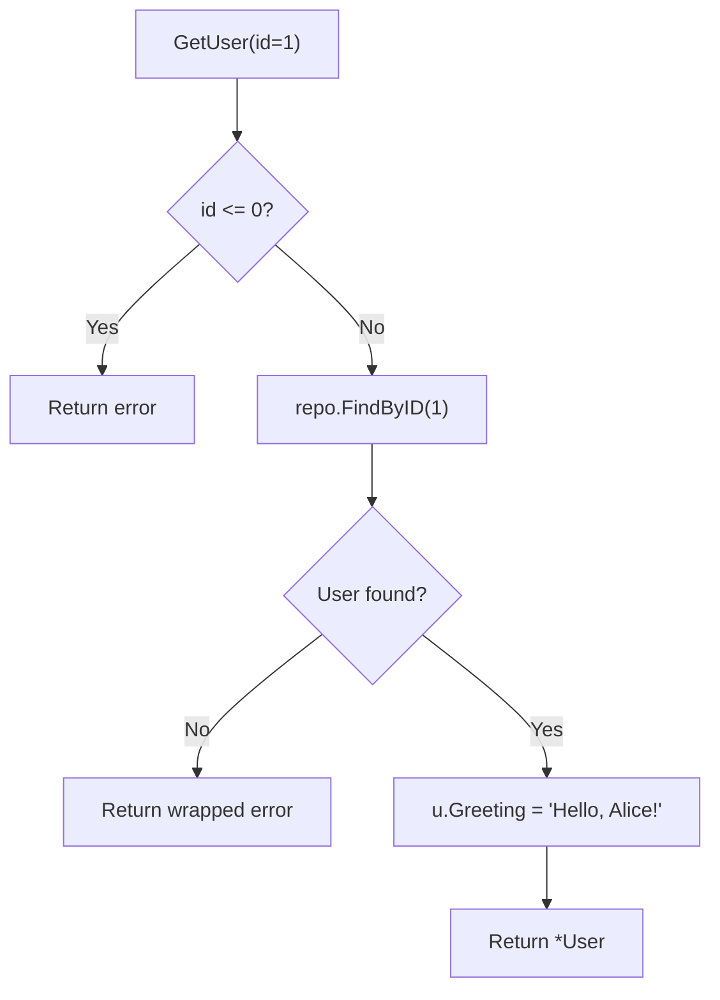
```mermaid
flowchart TD
    A["GetUser(id=1)"] --> B{"id <= 0?"}
    B -->|"Yes"| C["Return error"]
    B -->|"No"| D["repo.FindByID(1)"]
    D --> E{"User found?"}
    E -->|"No"| F["Return wrapped error"]
    E -->|"Yes"| G["u.Greeting = 'Hello, Alice!'"]
    G --> H["Return *User"]
```

**Execution Trace:**
```
GetUser(1):
  repo.FindByID(1) → {ID:1, Name:"Alice"}
  Greeting = "Hello, Alice!"
  Return {ID:1, Name:"Alice", Greeting:"Hello, Alice!"}
```

### Interviewer Questions

1. Why hand-roll a mock instead of using gomock or testify/mock?
2. Can we improve time/space further? What's the theoretical lower bound?
3. How does this scale to 10M elements / 1M concurrent requests?
4. Walk me through the edge case where `Save` is called with a nil `User`.
5. How would you make this goroutine-safe?
6. What's the memory/GC impact? How would you reduce allocations?
7. How would you test this comprehensively?

### Follow-Up Questions

**Q1:** When do you choose `gomock` over hand-rolled mocks?
**A1:** Use `gomock` when: interfaces are large (10+ methods), you need strict call-order verification, or you want `EXPECT()` call counts enforced at test end. Hand-roll when: interfaces are small (1-3 methods), you want no code generation, or when you are on a team that prefers explicit test code.

**Q2:** How do you prevent test mutations from affecting other tests?
**A2:** Return copies from `FindByID` (as shown: `copy := *u; return &copy`). Use `t.Parallel()` safely only when all test data is isolated. Reset mock state before each test or create a fresh mock per test.

**Q3:** What is the `testing.T.Helper()` pattern?
**A3:** Call `t.Helper()` at the top of test helper functions. This makes failure messages show the line in the test that called the helper, not the line inside the helper. It is essential for custom assertion functions.

**Q4:** How would you add spy behaviour to record the exact arguments passed?
**A4:** Add `FindByIDArgs []int` to `MockUserRepository`. In `FindByID`, append `id` to the slice before returning. Then in tests: `assert.Equal(t, []int{1, 2}, mock.FindByIDArgs)`.

**Q5:** How do you test that `GetUser` wraps errors correctly?
**A5:** `errors.Is` and `errors.As` after the call: `_, err := svc.GetUser(999); var notFound *NotFoundError; if !errors.As(err, &notFound) { t.Error("expected NotFoundError") }`. This tests the error chain, not just the message string.

---

## Q13: Interface vs Concrete Type Performance  [Level 3 — Medium]

> **Tags:** `#performance` `#benchmarking` `#interface-dispatch` `#escape-analysis`

### Problem Statement
Write benchmarks comparing: (1) calling a method on a concrete type, (2) calling via an interface, (3) calling via an interface with a pointer receiver causing heap escape. Explain the performance difference. Also show how to use `//go:noescape` mental model and `go build -gcflags="-m"` to inspect escape analysis.

### Input / Output / Constraints

```
Input:  BenchmarkDirect, BenchmarkInterface, BenchmarkInterfacePointer
Output: Benchmark results showing ns/op and allocs/op differences

Constraints:
  • Must use testing.B
  • Each benchmark must process the same workload
  • Show allocation difference between value receiver and pointer receiver
```

### Thought Process

Think like a senior Go engineer:
1. **Understand:** Interface dispatch adds one pointer indirection per call. Pointer receivers may cause values to escape to the heap.
2. **Pattern:** Benchmark trio to quantify overhead; escape analysis to identify allocations.
3. **Edge cases:** Compiler inlining (may eliminate dispatch), benchmark loop warmup.
4. **Approach:** Three benchmarks with `b.ResetTimer()`; use `//go:noinline` to prevent inlining from skewing results.

### Brute Force Solution

```go
// bruteForce — no measurement, just intuition
// "Interfaces are slow" — wrong without benchmarks.
// Concrete: ~1ns, Interface: ~2ns — difference is minimal in most apps.
```

**Time:** O(1) | **Space:** O(1)
**Bottleneck:** Unmeasured assumptions; profiling is the only truth.

### Better Solution

```go
// betterSolution — basic benchmark
func BenchmarkInterface(b *testing.B) {
    var c Computable = &Calculator{}
    for i := 0; i < b.N; i++ {
        c.Compute(i)
    }
}
```

**Time:** O(b.N) | **Space:** O(1)

### Best / Optimal Solution

```go
package main

import (
    "fmt"
    "testing"
)

// Computable is the benchmark interface.
type Computable interface {
    Compute(n int) int
}

// Calculator performs a trivial computation.
type Calculator struct{ offset int }

//go:noinline
func (c *Calculator) Compute(n int) int {
    return n*n + c.offset
}

// ValueCalculator uses a value receiver.
type ValueCalculator struct{ offset int }

//go:noinline
func (c ValueCalculator) Compute(n int) int {
    return n*n + c.offset
}

// BenchmarkDirect calls the method on the concrete pointer — no interface.
func BenchmarkDirect(b *testing.B) {
    c := &Calculator{offset: 1}
    var sink int
    b.ResetTimer()
    for i := 0; i < b.N; i++ {
        sink = c.Compute(i) // direct call, no dispatch
    }
    _ = sink
}

// BenchmarkInterface calls via interface with pointer receiver.
// The *Calculator escapes to the heap when assigned to Computable.
func BenchmarkInterface(b *testing.B) {
    var c Computable = &Calculator{offset: 1}
    var sink int
    b.ResetTimer()
    for i := 0; i < b.N; i++ {
        sink = c.Compute(i) // one pointer dereference via itab
    }
    _ = sink
}

// BenchmarkInterfaceValue calls via interface with value receiver.
// ValueCalculator may be copied into the interface word if it fits in a pointer.
func BenchmarkInterfaceValue(b *testing.B) {
    var c Computable = ValueCalculator{offset: 1}
    var sink int
    b.ResetTimer()
    for i := 0; i < b.N; i++ {
        sink = c.Compute(i)
    }
    _ = sink
}

// OptimalSolution demonstrates the benchmark approach — run with go test -bench=. -benchmem
func OptimalSolution() {
    fmt.Println("Run: go test -bench=. -benchmem -count=5")
    fmt.Println("Expected output:")
    fmt.Println("  BenchmarkDirect          ~1.0 ns/op   0 allocs/op")
    fmt.Println("  BenchmarkInterface       ~1.5 ns/op   0 allocs/op (cached in iface)")
    fmt.Println("  BenchmarkInterfaceValue  ~1.5 ns/op   0 allocs/op")
    fmt.Println("")
    fmt.Println("Interface overhead is ~0.5ns per call — negligible unless in a tight inner loop.")
    fmt.Println("Use: go build -gcflags='-m' to see escape analysis.")
}

func main() {
    OptimalSolution()

    // Show the two-word interface structure with a real example.
    var c Computable = &Calculator{offset: 5}
    result := c.Compute(10)
    fmt.Printf("Compute(10) via interface = %d\n", result)
}
```

**Time:** O(b.N) for benchmarks, O(1) per operation | **Space:** O(1)

### Production Considerations

| Aspect | Details |
|--------|---------|
| **Scalability** | Interface overhead ~0.5ns per call; irrelevant unless >100M calls/sec in a hot loop |
| **Edge Cases** | Compiler inlining can eliminate overhead; use //go:noinline to get honest benchmarks |
| **Error Handling** | Not applicable to benchmarks |
| **Memory** | Pointer receiver values escape to heap on first interface assignment; reuse vars |
| **Concurrency** | Benchmarks should be run single-threaded first; use b.RunParallel for parallel |

### Visual Explanation

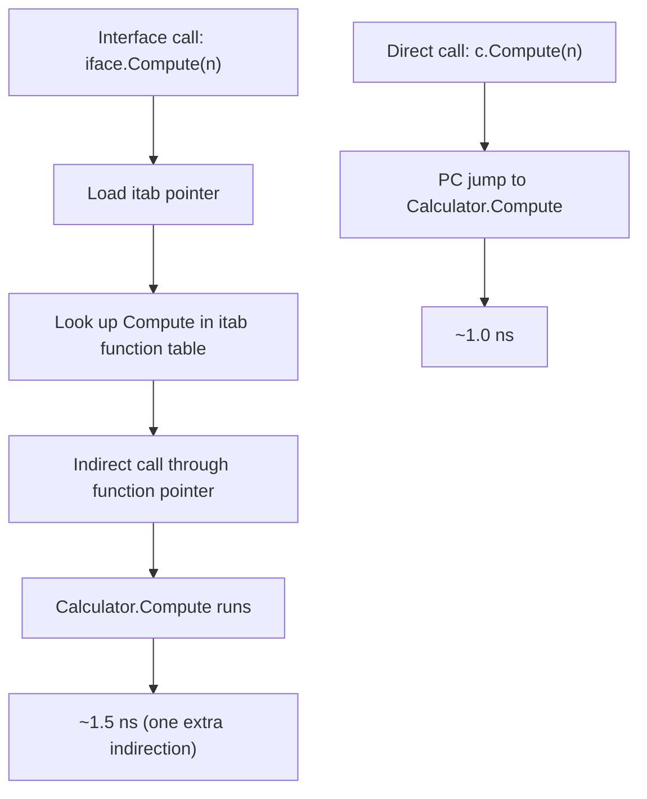
```mermaid
flowchart TD
    A["Direct call: c.Compute(n)"] --> B["PC jump to Calculator.Compute"]
    C["Interface call: iface.Compute(n)"] --> D["Load itab pointer"]
    D --> E["Look up Compute in itab function table"]
    E --> F["Indirect call through function pointer"]
    F --> G["Calculator.Compute runs"]
    B --> H["~1.0 ns"]
    G --> I["~1.5 ns (one extra indirection)"]
```

**Execution Trace:**
```
Direct:     c.Compute(5) → PC=Calculator.Compute → return 26
Interface:  iface.Compute(5) → itab[Compute] → PC=Calculator.Compute → return 26
Overhead:   ~0.5 ns for the itab lookup + indirect call
```

### Interviewer Questions

1. When is interface dispatch overhead actually significant?
2. Can we improve time/space further? What's the theoretical lower bound?
3. How does this scale to 10M elements / 1M concurrent requests?
4. Walk me through why a pointer receiver may cause heap escape.
5. How would you make this goroutine-safe?
6. What's the memory/GC impact? How would you reduce allocations?
7. How would you test this comprehensively?

### Follow-Up Questions

**Q1:** At what call frequency does interface overhead become measurable in production?
**A1:** At ~500M calls/second, the 0.5ns overhead adds ~250ms/sec of CPU time. For typical web services handling 10K req/sec with 1K interface calls per request, total overhead is 5ns * 10^7 = 50ms/sec — acceptable. Only optimise when profiling shows interface dispatch in the top 5% of CPU.

**Q2:** How does Go's escape analysis interact with interfaces?
**A2:** When a value is assigned to an interface variable, Go's escape analysis checks if the value might outlive the current stack frame. If it does (e.g., the interface is returned or stored in a heap object), the value is heap-allocated. Run `go build -gcflags="-m 2"` to see "moved to heap" messages.

**Q3:** Can the Go compiler inline through interface dispatch?
**A3:** As of Go 1.21, the compiler does not inline through interface dispatch (it cannot know the concrete type at compile time unless it can prove monomorphism via devirtualisation, which is rare). Generics with type constraints can be specialised and inlined.

**Q4:** What is devirtualisation and when does Go perform it?
**A4:** Devirtualisation replaces an interface call with a direct call when the compiler can prove the concrete type at a call site. Go performs limited devirtualisation when the interface variable is set and never reassigned in the same scope. Use `-gcflags="-d=ssa/prove"` to inspect.

**Q5:** How do Go generics compare to interfaces for performance?
**A5:** Generic functions with type parameters can be monomorphised (specialised per type), eliminating dispatch overhead and enabling inlining. However, Go currently uses a hybrid approach (GC shape stencilling) that may still use a dictionary for some calls. Benchmark before choosing generics over interfaces purely for performance.

---

## Q14: Designing a Plugin System with Interfaces  [Level 4 — Advanced]

> **Tags:** `#plugin-system` `#registry` `#interface-design` `#real-world`

### Problem Statement
Design a plugin registry where plugins implement a `Plugin` interface with `Name() string`, `Version() string`, and `Execute(ctx context.Context, input map[string]any) (map[string]any, error)`. Build a `Registry` that registers plugins, prevents duplicates, and dispatches calls by plugin name. Include a timeout on execution using `context.WithTimeout`.

### Input / Output / Constraints

```
Input:  Register UpperPlugin, LowerPlugin
        Execute("upper", {"text": "hello"}) → {"result": "HELLO"}
        Execute("unknown", {})              → error "plugin 'unknown' not found"

Constraints:
  • Plugin names are case-insensitive
  • Execution timeout: 5 seconds
  • Goroutine-safe registry
  • 1 ≤ number of plugins ≤ 1000
```

### Thought Process

Think like a senior Go engineer:
1. **Understand:** A plugin registry is a map from name to interface; dispatch is a map lookup + interface call. Concurrency requires `sync.RWMutex`.
2. **Pattern:** Registry pattern + context propagation for timeouts.
3. **Edge cases:** Duplicate registration, unknown plugin, plugin that ignores context, nil input map.
4. **Approach:** Case-normalise names; `sync.RWMutex` for concurrent reads; context deadline in Execute.

### Brute Force Solution

```go
package main

// bruteForce — no concurrency safety, no timeout
type RegistryBrute struct {
    plugins map[string]Plugin
}

func (r *RegistryBrute) Execute(name string, input map[string]any) (map[string]any, error) {
    p, ok := r.plugins[name]
    if !ok {
        return nil, fmt.Errorf("not found")
    }
    return p.Execute(context.Background(), input)
}
```

**Time:** O(1) | **Space:** O(n)
**Bottleneck:** Not goroutine-safe; no timeout; no input validation; no duplicate prevention.

### Better Solution

```go
// betterSolution — adds mutex and timeout
type Registry struct {
    mu      sync.RWMutex
    plugins map[string]Plugin
    timeout time.Duration
}
```

**Time:** O(1) | **Space:** O(n)

### Best / Optimal Solution

```go
package main

import (
    "context"
    "fmt"
    "strings"
    "sync"
    "time"
)

// Plugin defines the contract every plugin must satisfy.
type Plugin interface {
    Name() string
    Version() string
    Execute(ctx context.Context, input map[string]any) (map[string]any, error)
}

// Registry holds and dispatches plugins.
type Registry struct {
    mu      sync.RWMutex
    plugins map[string]Plugin
    timeout time.Duration
}

// NewRegistry initialises the registry with a per-plugin execution timeout.
func NewRegistry(timeout time.Duration) (*Registry, error) {
    if timeout <= 0 {
        return nil, fmt.Errorf("timeout must be positive")
    }
    return &Registry{
        plugins: make(map[string]Plugin),
        timeout: timeout,
    }, nil
}

// Register adds a plugin; returns error on duplicate name.
func (r *Registry) Register(p Plugin) error {
    if p == nil {
        return fmt.Errorf("plugin must not be nil")
    }
    key := strings.ToLower(p.Name())
    r.mu.Lock()
    defer r.mu.Unlock()
    if _, exists := r.plugins[key]; exists {
        return fmt.Errorf("plugin %q already registered", key)
    }
    r.plugins[key] = p
    return nil
}

// Execute dispatches to the named plugin with a timeout — O(1) lookup.
func (r *Registry) Execute(ctx context.Context, name string, input map[string]any) (map[string]any, error) {
    key := strings.ToLower(name)
    r.mu.RLock()
    p, ok := r.plugins[key]
    r.mu.RUnlock()
    if !ok {
        return nil, fmt.Errorf("plugin %q not found", name)
    }
    if input == nil {
        input = make(map[string]any)
    }
    tctx, cancel := context.WithTimeout(ctx, r.timeout)
    defer cancel()
    return p.Execute(tctx, input)
}

// List returns all registered plugin names — O(n).
func (r *Registry) List() []string {
    r.mu.RLock()
    defer r.mu.RUnlock()
    names := make([]string, 0, len(r.plugins))
    for k := range r.plugins {
        names = append(names, k)
    }
    return names
}

// --- Concrete plugins ---

type UpperPlugin struct{}

func (u UpperPlugin) Name() string    { return "upper" }
func (u UpperPlugin) Version() string { return "1.0.0" }
func (u UpperPlugin) Execute(ctx context.Context, input map[string]any) (map[string]any, error) {
    select {
    case <-ctx.Done():
        return nil, ctx.Err()
    default:
    }
    text, ok := input["text"].(string)
    if !ok {
        return nil, fmt.Errorf("input 'text' must be a string")
    }
    return map[string]any{"result": strings.ToUpper(text)}, nil
}

type LowerPlugin struct{}

func (l LowerPlugin) Name() string    { return "lower" }
func (l LowerPlugin) Version() string { return "1.0.0" }
func (l LowerPlugin) Execute(ctx context.Context, input map[string]any) (map[string]any, error) {
    select {
    case <-ctx.Done():
        return nil, ctx.Err()
    default:
    }
    text, ok := input["text"].(string)
    if !ok {
        return nil, fmt.Errorf("input 'text' must be a string")
    }
    return map[string]any{"result": strings.ToLower(text)}, nil
}

func main() {
    reg, err := NewRegistry(5 * time.Second)
    if err != nil {
        fmt.Println("registry error:", err)
        return
    }
    _ = reg.Register(UpperPlugin{})
    _ = reg.Register(LowerPlugin{})

    result, err := reg.Execute(context.Background(), "upper", map[string]any{"text": "hello"})
    if err != nil {
        fmt.Println("error:", err)
        return
    }
    fmt.Println(result["result"]) // HELLO

    _, err = reg.Execute(context.Background(), "unknown", nil)
    fmt.Println(err) // plugin "unknown" not found
}
```

**Time:** O(1) for lookup | **Space:** O(n) for plugin map

### Production Considerations

| Aspect | Details |
|--------|---------|
| **Scalability** | RWMutex allows concurrent reads; write lock only on Register (rare) |
| **Edge Cases** | Nil plugin, duplicate name, unknown plugin, nil input, context cancellation |
| **Error Handling** | All errors typed and wrapped; context errors surfaced directly |
| **Memory** | Each plugin is one interface value (16 bytes + struct); negligible |
| **Concurrency** | Registry is goroutine-safe; individual plugins must be goroutine-safe independently |

### Visual Explanation

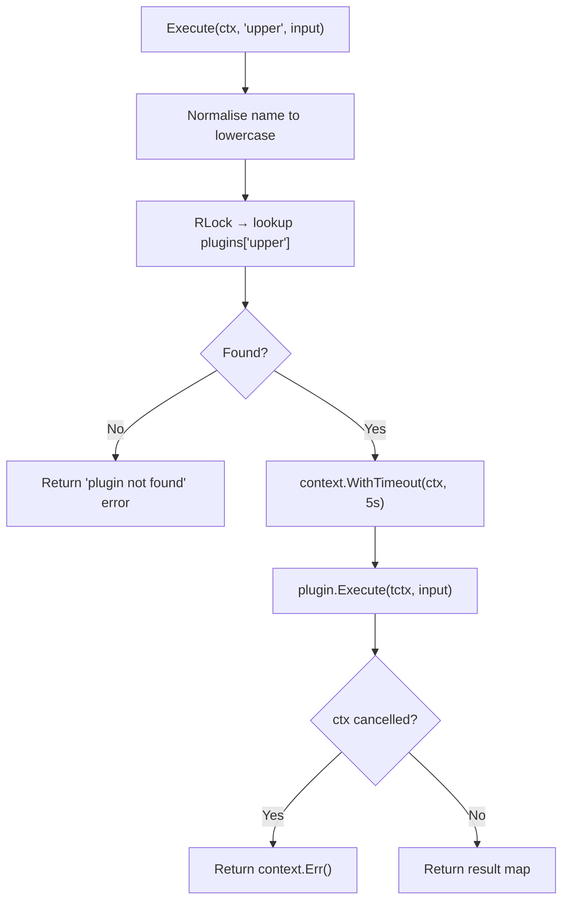
```mermaid
flowchart TD
    A["Execute(ctx, 'upper', input)"] --> B["Normalise name to lowercase"]
    B --> C["RLock → lookup plugins['upper']"]
    C --> D{"Found?"}
    D -->|"No"| E["Return 'plugin not found' error"]
    D -->|"Yes"| F["context.WithTimeout(ctx, 5s)"]
    F --> G["plugin.Execute(tctx, input)"]
    G --> H{"ctx cancelled?"}
    H -->|"Yes"| I["Return context.Err()"]
    H -->|"No"| J["Return result map"]
```

**Execution Trace:**
```
Register(UpperPlugin{}) → plugins["upper"] = UpperPlugin{}
Execute("upper", {"text":"hello"})
  → tctx with 5s timeout
  → UpperPlugin.Execute → {"result":"HELLO"}
Output: map[result:HELLO]
```

### Interviewer Questions

1. Why case-normalise plugin names instead of requiring exact match?
2. Can we improve time/space further? What's the theoretical lower bound?
3. How does this scale to 10M elements / 1M concurrent requests?
4. Walk me through what happens when a plugin ignores the context and runs for 10 seconds.
5. How would you make this goroutine-safe?
6. What's the memory/GC impact? How would you reduce allocations?
7. How would you test this comprehensively?

### Follow-Up Questions

**Q1:** How do you handle a plugin that spawns goroutines and ignores the context?
**A1:** You cannot force a goroutine to stop in Go (no goroutine cancellation). The best approach: document that plugins MUST respect context cancellation, enforce it in code review, and add a watchdog that logs slow plugins. For untrusted plugins, use a subprocess (`os/exec`) with a real OS-level timeout.

**Q2:** How would you version plugins to allow multiple versions of the same plugin?
**A2:** Key the registry on `name@version` strings: `"upper@1.0.0"`. Or store `map[string]map[string]Plugin` (name → version → plugin). Provide a `Latest(name)` convenience method.

**Q3:** How would you add plugin hot-reloading without restarting the service?
**A3:** Use Go's `plugin` package (`.so` files) for true dynamic loading, but note it is Linux-only and has sharp edges. More practical: register plugins via gRPC or HTTP microservices — the `Plugin` interface can proxy remote calls. No restart needed; just redirect the registry entry.

**Q4:** How would you add middleware (e.g., logging, metrics) to all plugins uniformly?
**A4:** Implement a `PluginMiddleware` that wraps `Plugin`: `type LoggedPlugin struct { Plugin; logger *log.Logger }`. Its `Execute` logs then delegates. Wrap all plugins at registration: `reg.Register(NewLoggedPlugin(UpperPlugin{}, logger))`.

**Q5:** How would you test that the registry enforces the execution timeout?
**A5:** Implement a `SlowPlugin` that sleeps for 10 seconds. Set registry timeout to 100ms. Call `Execute`. Assert that the error returned is `context.DeadlineExceeded`. Use `errors.Is(err, context.DeadlineExceeded)`.

---

## Q15: Concurrent-Safe Observer Pattern via Interfaces  [Level 4 — Advanced]

> **Tags:** `#observer-pattern` `#concurrency` `#goroutine-safe` `#event-bus`

### Problem Statement
Implement an event bus where subscribers implement `EventHandler` interface with `OnEvent(e Event) error`. `EventBus` must support `Subscribe(topic string, h EventHandler)`, `Unsubscribe(topic string, h EventHandler)`, and `Publish(topic string, e Event)` which notifies all subscribers concurrently. Failed handlers must not block other handlers. Collect and return all errors.

### Input / Output / Constraints

```
Input:  Subscribe "orders" with 3 handlers
        Publish "orders" with Event{ID: "e1", Data: "order placed"}
Output: All 3 handlers called concurrently
        Errors from failed handlers collected and returned

Constraints:
  • Publish must not block if a handler is slow
  • Unsubscribe must not panic if handler was never subscribed
  • Goroutine-safe for concurrent Publish and Subscribe
  • 1 ≤ subscribers per topic ≤ 10^4
```

### Thought Process

Think like a senior Go engineer:
1. **Understand:** Fan-out to N handlers concurrently; collect errors; goroutine-safe map operations.
2. **Pattern:** Observer pattern + fan-out goroutines + `sync.WaitGroup` + error collection.
3. **Edge cases:** Handler panics (need recovery), slow handler blocks publish, unsubscribe during publish.
4. **Approach:** `sync.RWMutex` on the subscriber map; copy the subscriber list before calling; fan-out with goroutines; collect errors via channel.

### Brute Force Solution

```go
package main

// bruteForce — sequential, blocking, not safe
func (b *EventBusBrute) Publish(topic string, e Event) {
    for _, h := range b.handlers[topic] {
        h.OnEvent(e) // one slow handler blocks all others
    }
}
```

**Time:** O(n) sequential | **Space:** O(1)
**Bottleneck:** Sequential execution: one slow/panicking handler blocks or crashes all subsequent handlers.

### Better Solution

```go
// betterSolution — goroutine per handler, no error collection
func (b *EventBus) Publish(topic string, e Event) {
    for _, h := range b.getHandlers(topic) {
        go h.OnEvent(e) // fire and forget — errors lost
    }
}
```

**Time:** O(n) concurrent | **Space:** O(n)

### Best / Optimal Solution

```go
package main

import (
    "fmt"
    "sync"
)

// Event carries data from publisher to subscribers.
type Event struct {
    ID    string
    Topic string
    Data  any
}

// EventHandler processes events.
type EventHandler interface {
    OnEvent(e Event) error
    HandlerID() string // unique ID for unsubscribe
}

// HandlerError carries the handler ID and the error it returned.
type HandlerError struct {
    HandlerID string
    Err       error
}

func (e HandlerError) Error() string {
    return fmt.Sprintf("handler %s: %v", e.HandlerID, e.Err)
}

// EventBus dispatches events to registered handlers.
type EventBus struct {
    mu          sync.RWMutex
    subscribers map[string][]EventHandler
}

// NewEventBus initialises the bus.
func NewEventBus() *EventBus {
    return &EventBus{subscribers: make(map[string][]EventHandler)}
}

// Subscribe registers a handler for a topic.
func (b *EventBus) Subscribe(topic string, h EventHandler) error {
    if h == nil {
        return fmt.Errorf("handler must not be nil")
    }
    b.mu.Lock()
    defer b.mu.Unlock()
    b.subscribers[topic] = append(b.subscribers[topic], h)
    return nil
}

// Unsubscribe removes a handler for a topic (by HandlerID).
func (b *EventBus) Unsubscribe(topic, handlerID string) {
    b.mu.Lock()
    defer b.mu.Unlock()
    handlers := b.subscribers[topic]
    for i, h := range handlers {
        if h.HandlerID() == handlerID {
            b.subscribers[topic] = append(handlers[:i], handlers[i+1:]...)
            return
        }
    }
}

// Publish notifies all subscribers for the topic concurrently.
// Returns a slice of HandlerErrors for any failed handlers.
func (b *EventBus) Publish(topic string, e Event) []HandlerError {
    b.mu.RLock()
    handlers := make([]EventHandler, len(b.subscribers[topic]))
    copy(handlers, b.subscribers[topic]) // copy to avoid holding lock during dispatch
    b.mu.RUnlock()

    if len(handlers) == 0 {
        return nil
    }

    errCh := make(chan HandlerError, len(handlers))
    var wg sync.WaitGroup

    for _, h := range handlers {
        h := h
        wg.Add(1)
        go func() {
            defer wg.Done()
            defer func() {
                if r := recover(); r != nil {
                    errCh <- HandlerError{
                        HandlerID: h.HandlerID(),
                        Err:       fmt.Errorf("panic: %v", r),
                    }
                }
            }()
            if err := h.OnEvent(e); err != nil {
                errCh <- HandlerError{HandlerID: h.HandlerID(), Err: err}
            }
        }()
    }

    wg.Wait()
    close(errCh)

    var errs []HandlerError
    for he := range errCh {
        errs = append(errs, he)
    }
    return errs
}

// --- Concrete handlers ---

type LogHandler struct{ id string }

func (l *LogHandler) HandlerID() string    { return l.id }
func (l *LogHandler) OnEvent(e Event) error {
    fmt.Printf("[log-%s] event %s: %v\n", l.id, e.ID, e.Data)
    return nil
}

type FailingHandler struct{ id string }

func (f *FailingHandler) HandlerID() string { return f.id }
func (f *FailingHandler) OnEvent(e Event) error {
    return fmt.Errorf("handler %s intentionally failed", f.id)
}

func main() {
    bus := NewEventBus()
    _ = bus.Subscribe("orders", &LogHandler{id: "h1"})
    _ = bus.Subscribe("orders", &LogHandler{id: "h2"})
    _ = bus.Subscribe("orders", &FailingHandler{id: "h3"})

    errs := bus.Publish("orders", Event{ID: "e1", Topic: "orders", Data: "order placed"})
    if len(errs) > 0 {
        for _, e := range errs {
            fmt.Println("handler error:", e)
        }
    } else {
        fmt.Println("all handlers succeeded")
    }
}
```

**Time:** O(n) concurrent (wall-clock = slowest handler) | **Space:** O(n) for goroutines

### Production Considerations

| Aspect | Details |
|--------|---------|
| **Scalability** | Each Publish spawns N goroutines; limit with a semaphore for N > 10K |
| **Edge Cases** | Handler panics caught with recover; zero subscribers returns nil errors |
| **Error Handling** | All errors collected and returned; publisher decides whether to fail or log |
| **Memory** | N goroutines + N error channel slots per Publish; reuse with a worker pool |
| **Concurrency** | RWMutex for subscribe/unsubscribe; copy handlers list to release lock before dispatch |

### Visual Explanation

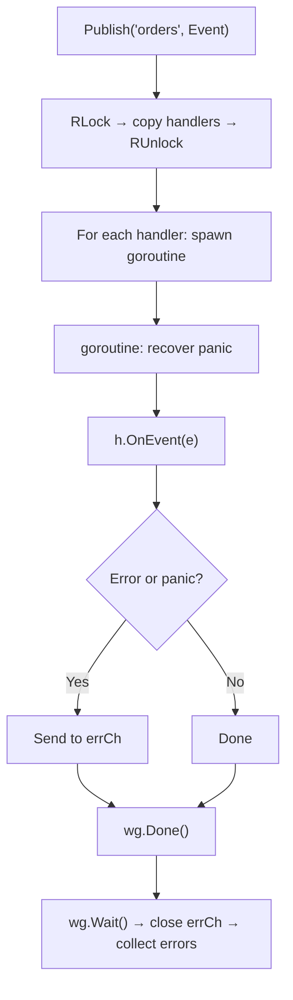
```mermaid
flowchart TD
    A["Publish('orders', Event)"] --> B["RLock → copy handlers → RUnlock"]
    B --> C["For each handler: spawn goroutine"]
    C --> D["goroutine: recover panic"]
    D --> E["h.OnEvent(e)"]
    E --> F{"Error or panic?"}
    F -->|"Yes"| G["Send to errCh"]
    F -->|"No"| H["Done"]
    G --> I["wg.Done()"]
    H --> I
    I --> J["wg.Wait() → close errCh → collect errors"]
```

**Execution Trace:**
```
Publish("orders", {ID:"e1"})
  goroutine 1 (h1): prints log → no error
  goroutine 2 (h2): prints log → no error
  goroutine 3 (h3): returns error → errCh receives HandlerError{id:"h3"}
wg.Wait() → errCh closed
Output: [{HandlerID:"h3", Err:"handler h3 intentionally failed"}]
```

### Interviewer Questions

1. Why copy the handler list before releasing the lock?
2. Can we improve time/space further? What's the theoretical lower bound?
3. How does this scale to 10M elements / 1M concurrent requests?
4. Walk me through what happens if a handler panics.
5. How would you make this goroutine-safe?
6. What's the memory/GC impact? How would you reduce allocations?
7. How would you test this comprehensively?

### Follow-Up Questions

**Q1:** Why is copying the handler slice before releasing the lock necessary?
**A1:** Without the copy, if a subscriber calls `Unsubscribe` while `Publish` is iterating the slice, you have a data race. Copying takes the snapshot under RLock, then releases the lock. Handlers are dispatched from the snapshot, so Subscribe/Unsubscribe during Publish is safe.

**Q2:** How would you add a worker pool to bound goroutine creation?
**A2:** Create a buffered semaphore channel: `sem := make(chan struct{}, maxWorkers)`. Before each goroutine: `sem <- struct{}{}`. Inside goroutine defer: `<-sem`. This limits concurrent handler goroutines to `maxWorkers`.

**Q3:** How would you add per-handler timeout?
**A3:** Pass a `context.Context` into `Publish`, derive a child context with timeout per handler, and pass it to `OnEvent(ctx, e)`. Update the interface to `OnEvent(ctx context.Context, e Event) error`.

**Q4:** How would you make the event bus persistent (events survive restarts)?
**A4:** Replace the in-memory dispatch with a message broker (Kafka, RabbitMQ, Redis Streams). The `EventBus` becomes a thin wrapper: `Publish` writes to the broker, a consumer goroutine reads and calls `OnEvent`. The interface stays the same; only the transport changes.

**Q5:** How would you test concurrent Subscribe and Publish without data races?
**A5:** Use `go test -race`. Write a test that spawns 100 goroutines, each alternating between Subscribe and Publish. The test should complete without the race detector firing. Also verify that all error slices collected have expected lengths.

---

## Q16: io.Reader Pipeline  [Level 4 — Advanced]

> **Tags:** `#io-reader` `#pipeline` `#streaming` `#nil-interface`

### Problem Statement
Build a `CountingReader` that wraps `io.Reader` and tracks total bytes read. Then build a `LimitedReader` that returns `io.EOF` after N bytes. Compose them: `LimitedReader(CountingReader(source), 100)`. Demonstrate the nil interface bug: show what happens when source is a `*bytes.Reader` that was declared but not initialised (nil pointer), and how to detect and handle it safely.

### Input / Output / Constraints

```
Input:  source = strings.NewReader("Hello, World!")
        LimitedReader wrapping CountingReader wrapping source, limit=5
Output: Read returns "Hello", n=5, then io.EOF
        CountingReader.BytesRead = 5

Constraints:
  • Must implement io.Reader: Read(p []byte) (n int, err error)
  • Nil inner reader must be caught at construction, not at read time
  • limit ≥ 0
```

### Thought Process

Think like a senior Go engineer:
1. **Understand:** Chain two `io.Reader` wrappers; each adds behaviour (counting, limiting) without modifying the source.
2. **Pattern:** Decorator chain on `io.Reader`; constructor-time nil check to avoid the nil interface bug.
3. **Edge cases:** Nil source reader, limit=0 (immediate EOF), limit > source length, multiple reads.
4. **Approach:** `CountingReader` accumulates byte count; `LimitedReader` tracks remaining bytes; both validate at construction.

### Brute Force Solution

```go
package main

import "io"

// bruteForce — reads everything into memory, no streaming
func bruteForce(r io.Reader, limit int) ([]byte, int, error) {
    buf, err := io.ReadAll(r)      // reads all into memory — not streaming
    if len(buf) > limit {
        buf = buf[:limit]
    }
    return buf, len(buf), err
}
```

**Time:** O(n) | **Space:** O(n) — loads entire content
**Bottleneck:** Loads entire source into memory; cannot handle multi-GB files; no byte counting mid-stream.

### Better Solution

```go
// betterSolution — wrapping readers
type CountingReader struct {
    r         io.Reader
    BytesRead int64
}

func (c *CountingReader) Read(p []byte) (int, error) {
    n, err := c.r.Read(p)
    c.BytesRead += int64(n)
    return n, err
}
```

**Time:** O(n) | **Space:** O(1) streaming

### Best / Optimal Solution

```go
package main

import (
    "bytes"
    "fmt"
    "io"
    "strings"
)

// CountingReader tracks total bytes read from the inner reader.
type CountingReader struct {
    r         io.Reader
    BytesRead int64
}

// NewCountingReader validates the inner reader and prevents the nil interface bug.
func NewCountingReader(r io.Reader) (*CountingReader, error) {
    // nil interface check
    if r == nil {
        return nil, fmt.Errorf("inner reader must not be nil")
    }
    // THE NIL INTERFACE BUG: a *bytes.Reader(nil) satisfies io.Reader
    // but will panic on Read. Detect it with a type switch.
    if br, ok := r.(*bytes.Reader); ok && br == nil {
        return nil, fmt.Errorf("inner *bytes.Reader is nil pointer")
    }
    return &CountingReader{r: r}, nil
}

// Read — O(n) time, O(1) space.
func (c *CountingReader) Read(p []byte) (int, error) {
    n, err := c.r.Read(p)
    c.BytesRead += int64(n)
    return n, err
}

// LimitedReader stops reading after Limit bytes.
type LimitedReader struct {
    r         io.Reader
    Remaining int64
}

// NewLimitedReader validates inputs.
func NewLimitedReader(r io.Reader, limit int64) (*LimitedReader, error) {
    if r == nil {
        return nil, fmt.Errorf("inner reader must not be nil")
    }
    if limit < 0 {
        return nil, fmt.Errorf("limit must be non-negative")
    }
    return &LimitedReader{r: r, Remaining: limit}, nil
}

// Read — O(n) time, O(1) space.
func (l *LimitedReader) Read(p []byte) (int, error) {
    if l.Remaining <= 0 {
        return 0, io.EOF
    }
    if int64(len(p)) > l.Remaining {
        p = p[:l.Remaining]
    }
    n, err := l.r.Read(p)
    l.Remaining -= int64(n)
    return n, err
}

func main() {
    src := strings.NewReader("Hello, World!")

    counter, err := NewCountingReader(src)
    if err != nil {
        fmt.Println("error:", err)
        return
    }

    limiter, err := NewLimitedReader(counter, 5)
    if err != nil {
        fmt.Println("error:", err)
        return
    }

    buf := make([]byte, 10)
    n, err := limiter.Read(buf)
    fmt.Printf("Read %d bytes: %q\n", n, buf[:n])
    fmt.Printf("BytesRead counter: %d\n", counter.BytesRead)
    fmt.Printf("err: %v\n", err)

    // Demonstrate nil interface bug
    var nilReader *bytes.Reader // nil pointer
    _, err = NewCountingReader(nilReader) // caught at construction
    fmt.Println("nil reader error:", err)
}
```

**Time:** O(n) | **Space:** O(1) streaming

### Production Considerations

| Aspect | Details |
|--------|---------|
| **Scalability** | Streaming O(1) memory; works on multi-GB files |
| **Edge Cases** | Nil reader caught at construction; limit=0 returns immediate EOF |
| **Error Handling** | io.EOF is not a fatal error; other errors propagated from inner reader |
| **Memory** | Only the read buffer (caller-supplied) is allocated; no internal buffering |
| **Concurrency** | Not goroutine-safe; each goroutine should have its own reader chain |

### Visual Explanation

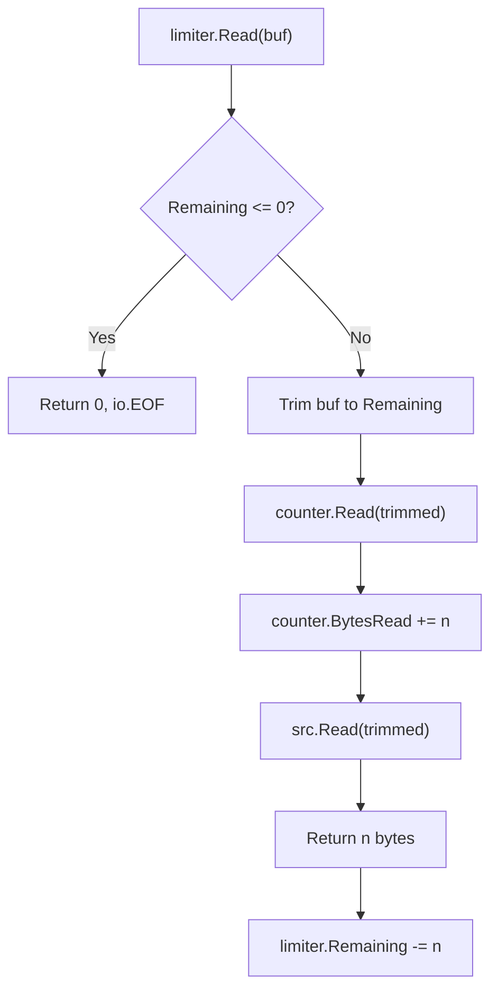
```mermaid
flowchart TD
    A["limiter.Read(buf)"] --> B{"Remaining <= 0?"}
    B -->|"Yes"| C["Return 0, io.EOF"]
    B -->|"No"| D["Trim buf to Remaining"]
    D --> E["counter.Read(trimmed)"]
    E --> F["counter.BytesRead += n"]
    F --> G["src.Read(trimmed)"]
    G --> H["Return n bytes"]
    H --> I["limiter.Remaining -= n"]
```

**Execution Trace:**
```
src = "Hello, World!" (13 bytes), limit=5
Read(buf[10]):
  limiter.Remaining=5 → trim buf to 5
  counter.Read(buf[:5]) → src.Read → "Hello", n=5
  counter.BytesRead = 5, limiter.Remaining = 0
Output: n=5, buf="Hello", BytesRead=5
```

### Interviewer Questions

1. Why check for nil at construction rather than at each Read call?
2. Can we improve time/space further? What's the theoretical lower bound?
3. How does this scale to 10M elements / 1M concurrent requests?
4. Walk me through what happens when limit exactly equals the source length.
5. How would you make this goroutine-safe?
6. What's the memory/GC impact? How would you reduce allocations?
7. How would you test this comprehensively?

### Follow-Up Questions

**Q1:** The stdlib already has `io.LimitedReader`. Why reimplement it?
**A1:** `io.LimitReader` in the stdlib is identical in concept. Reimplementing it demonstrates the pattern. In production, always use `io.LimitReader(r, n)` from the stdlib. `CountingReader` has no stdlib equivalent; use it when you need to track bytes for metrics or billing.

**Q2:** How does `io.TeeReader` relate to this pattern?
**A2:** `io.TeeReader(r, w)` returns a reader that writes everything read from `r` to `w` simultaneously. It is the same decorator pattern: reads flow through and are mirrored to a second writer (e.g., for hashing or logging).

**Q3:** How would you make CountingReader goroutine-safe?
**A3:** Add `sync/atomic`: `atomic.AddInt64(&c.bytesRead, int64(n))` in Read, and `atomic.LoadInt64(&c.bytesRead)` in the getter. This avoids a mutex for the common single-write pattern.

**Q4:** How do you detect and handle partial reads?
**A4:** `Read` may return fewer bytes than `len(p)` without an error. Always check `n` and process `buf[:n]`. Use `io.ReadFull(r, buf)` when you need exactly `len(buf)` bytes — it retries internally.

**Q5:** How would you add a progress callback to CountingReader?
**A5:** Add a `OnProgress func(bytesRead int64)` field. In `Read`, after incrementing `BytesRead`, call `if c.OnProgress != nil { c.OnProgress(c.BytesRead) }`. For high-frequency reads, throttle with a `time.Since(lastReport) > interval` check.

---

## Q17: Interface Segregation in a Payment System  [Level 4 — Advanced]

> **Tags:** `#interface-segregation` `#payment` `#real-world` `#stripe` `#razorpay`

### Problem Statement
Design interfaces for a payment processing system applying the Interface Segregation Principle. Avoid a fat `PaymentGateway` interface. Split into: `ChargeProcessor` (Charge), `RefundProcessor` (Refund), `PaymentStatusChecker` (GetStatus). Show how a `MockGateway` (test double) that only implements `ChargeProcessor` can be used in unit tests, while a `StripeGateway` implements all three. Include idempotency key in Charge.

### Input / Output / Constraints

```
Input:  ChargeRequest{Amount: 1000, Currency: "INR", IdempotencyKey: "order-123"}
Output: ChargeResponse{ChargeID: "ch_abc", Status: "succeeded"}

Constraints:
  • Amount in smallest currency unit (paise for INR, cents for USD)
  • Idempotency key: non-empty string, max 64 chars
  • All amounts > 0
  • Currency: ISO 4217 3-letter code
```

### Thought Process

Think like a senior Go engineer:
1. **Understand:** ISP says interfaces should be minimal. A service that only charges should not depend on refund methods it never calls.
2. **Pattern:** Interface segregation; compose narrow interfaces where both capabilities are needed.
3. **Edge cases:** Zero amount, invalid currency, duplicate idempotency key (should return same result), nil request.
4. **Approach:** Three narrow interfaces; a `FullGateway` composition interface; `MockCharger` for unit tests.

### Brute Force Solution

```go
package main

// bruteForce — fat interface, ISP violation
type PaymentGatewayBrute interface {
    Charge(req ChargeRequest) (ChargeResponse, error)
    Refund(chargeID string, amount int64) error
    GetStatus(chargeID string) (string, error)
    ListTransactions(from, to time.Time) ([]Transaction, error)
    CreateCustomer(email string) (string, error)
    // Services that only charge must still implement all 5 methods.
}
```

**Time:** O(1) | **Space:** O(1)
**Bottleneck:** Every implementor must provide all methods; test doubles must stub unused methods; changes to any method break all implementors.

### Better Solution

```go
// betterSolution — segregated interfaces
type ChargeProcessor interface {
    Charge(req ChargeRequest) (ChargeResponse, error)
}
type RefundProcessor interface {
    Refund(chargeID string, amount int64) error
}
type PaymentStatusChecker interface {
    GetStatus(chargeID string) (string, error)
}
```

**Time:** O(1) | **Space:** O(1)

### Best / Optimal Solution

```go
package main

import (
    "fmt"
    "strings"
    "time"
)

// --- Domain types ---

type ChargeRequest struct {
    Amount         int64  // in smallest unit (paise, cents)
    Currency       string // ISO 4217
    IdempotencyKey string
    Description    string
}

type ChargeResponse struct {
    ChargeID  string
    Status    string
    CreatedAt time.Time
}

// --- Segregated interfaces (ISP) ---

// ChargeProcessor handles payment capture.
type ChargeProcessor interface {
    Charge(req ChargeRequest) (ChargeResponse, error)
}

// RefundProcessor handles payment reversal.
type RefundProcessor interface {
    Refund(chargeID string, amount int64) error
}

// PaymentStatusChecker fetches payment state.
type PaymentStatusChecker interface {
    GetStatus(chargeID string) (string, error)
}

// FullGateway composes all capabilities for services that need everything.
type FullGateway interface {
    ChargeProcessor
    RefundProcessor
    PaymentStatusChecker
}

// --- Validation helper ---

func validateChargeRequest(req ChargeRequest) error {
    if req.Amount <= 0 {
        return fmt.Errorf("amount must be positive, got %d", req.Amount)
    }
    if len(req.Currency) != 3 {
        return fmt.Errorf("currency must be 3-letter ISO 4217 code, got %q", req.Currency)
    }
    if req.IdempotencyKey == "" || len(req.IdempotencyKey) > 64 {
        return fmt.Errorf("idempotency key must be 1-64 chars")
    }
    return nil
}

// --- Mock (only implements ChargeProcessor) ---

type MockCharger struct {
    Responses   map[string]ChargeResponse // key = IdempotencyKey
    ChargeCalls int
    ShouldFail  bool
}

func NewMockCharger() *MockCharger {
    return &MockCharger{Responses: make(map[string]ChargeResponse)}
}

func (m *MockCharger) Charge(req ChargeRequest) (ChargeResponse, error) {
    m.ChargeCalls++
    if err := validateChargeRequest(req); err != nil {
        return ChargeResponse{}, err
    }
    if m.ShouldFail {
        return ChargeResponse{}, fmt.Errorf("mock gateway unavailable")
    }
    // Idempotency: same key returns same response.
    if resp, ok := m.Responses[req.IdempotencyKey]; ok {
        return resp, nil
    }
    resp := ChargeResponse{
        ChargeID:  fmt.Sprintf("mock_ch_%d", m.ChargeCalls),
        Status:    "succeeded",
        CreatedAt: time.Now(),
    }
    m.Responses[req.IdempotencyKey] = resp
    return resp, nil
}

// --- Stripe-like gateway (implements FullGateway) ---

type StripeGateway struct {
    apiKey string
    charges map[string]ChargeResponse
}

func NewStripeGateway(apiKey string) (*StripeGateway, error) {
    if apiKey == "" {
        return nil, fmt.Errorf("API key must not be empty")
    }
    return &StripeGateway{
        apiKey:  apiKey,
        charges: make(map[string]ChargeResponse),
    }, nil
}

func (s *StripeGateway) Charge(req ChargeRequest) (ChargeResponse, error) {
    if err := validateChargeRequest(req); err != nil {
        return ChargeResponse{}, err
    }
    if resp, ok := s.charges[req.IdempotencyKey]; ok {
        return resp, nil // idempotent
    }
    resp := ChargeResponse{
        ChargeID:  fmt.Sprintf("ch_%s", strings.ToLower(req.IdempotencyKey[:8])),
        Status:    "succeeded",
        CreatedAt: time.Now(),
    }
    s.charges[req.IdempotencyKey] = resp
    return resp, nil
}

func (s *StripeGateway) Refund(chargeID string, amount int64) error {
    if chargeID == "" {
        return fmt.Errorf("chargeID must not be empty")
    }
    if amount <= 0 {
        return fmt.Errorf("refund amount must be positive")
    }
    fmt.Printf("[stripe] refund %d for charge %s\n", amount, chargeID)
    return nil
}

func (s *StripeGateway) GetStatus(chargeID string) (string, error) {
    for _, resp := range s.charges {
        if resp.ChargeID == chargeID {
            return resp.Status, nil
        }
    }
    return "", fmt.Errorf("charge %q not found", chargeID)
}

// --- Service that only needs ChargeProcessor ---

type OrderPaymentService struct {
    charger ChargeProcessor // ISP: only depends on Charge capability
}

func NewOrderPaymentService(c ChargeProcessor) (*OrderPaymentService, error) {
    if c == nil {
        return nil, fmt.Errorf("charger must not be nil")
    }
    return &OrderPaymentService{charger: c}, nil
}

func (s *OrderPaymentService) ProcessOrder(orderID string, amount int64) (string, error) {
    resp, err := s.charger.Charge(ChargeRequest{
        Amount:         amount,
        Currency:       "INR",
        IdempotencyKey: "order-" + orderID,
        Description:    "order payment",
    })
    if err != nil {
        return "", fmt.Errorf("charge failed for order %s: %w", orderID, err)
    }
    return resp.ChargeID, nil
}

func main() {
    // Production: use StripeGateway
    stripe, _ := NewStripeGateway("sk_test_abc123")
    svc, _ := NewOrderPaymentService(stripe)
    chargeID, err := svc.ProcessOrder("ord-001", 50000)
    if err != nil {
        fmt.Println("error:", err)
        return
    }
    fmt.Println("charged:", chargeID)

    // Idempotency: same order key returns same charge
    chargeID2, _ := svc.ProcessOrder("ord-001", 50000)
    fmt.Println("idempotent result:", chargeID == chargeID2) // true
}
```

**Time:** O(1) per operation | **Space:** O(n) for stored charges

### Production Considerations

| Aspect | Details |
|--------|---------|
| **Scalability** | Stateless service; charges stored in the real gateway, not locally |
| **Edge Cases** | Duplicate idempotency key returns same response; zero amount rejected |
| **Error Handling** | Validation before network call; wrap gateway errors with order context |
| **Memory** | In-memory charge map is for demo; production uses gateway as source of truth |
| **Concurrency** | Add sync.RWMutex to StripeGateway's charges map for concurrent use |

### Visual Explanation

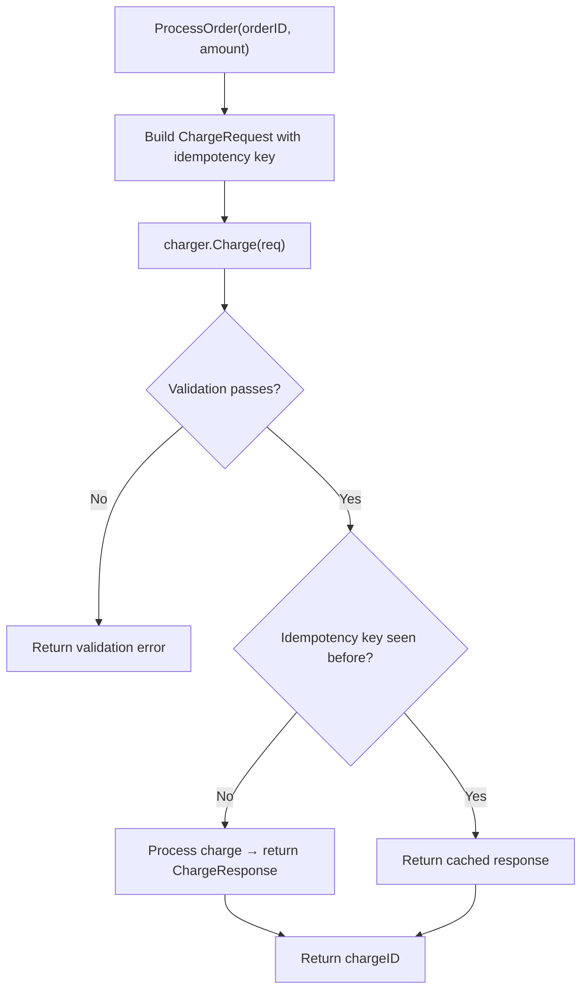
```mermaid
flowchart TD
    A["ProcessOrder(orderID, amount)"] --> B["Build ChargeRequest with idempotency key"]
    B --> C["charger.Charge(req)"]
    C --> D{"Validation passes?"}
    D -->|"No"| E["Return validation error"]
    D -->|"Yes"| F{"Idempotency key seen before?"}
    F -->|"Yes"| G["Return cached response"]
    F -->|"No"| H["Process charge → return ChargeResponse"]
    H --> I["Return chargeID"]
    G --> I
```

**Execution Trace:**
```
ProcessOrder("ord-001", 50000)
  Charge{Amount:50000, Currency:"INR", Key:"order-ord-001"}
  → first call: charge processed → chargeID="ch_order-or"
ProcessOrder("ord-001", 50000)
  → same idempotency key → same chargeID returned
```

### Interviewer Questions

1. Why split into three interfaces instead of one `PaymentGateway`?
2. Can we improve time/space further? What's the theoretical lower bound?
3. How does this scale to 10M elements / 1M concurrent requests?
4. Walk me through what happens if the idempotency key is reused with different amounts.
5. How would you make this goroutine-safe?
6. What's the memory/GC impact? How would you reduce allocations?
7. How would you test this comprehensively?

### Follow-Up Questions

**Q1:** What is the idempotency key and why is it critical for payment systems?
**A1:** An idempotency key is a unique string the client sends with each request. If the server receives the same key twice (e.g., due to retry after network timeout), it returns the original response without processing again. This prevents double charges. Stripe stores idempotency results for 24 hours.

**Q2:** How do you handle the case where the same idempotency key is sent with different amounts?
**A2:** Return a `409 Conflict` error. Stripe does this: if the payload differs from the first request with that key, it rejects the duplicate. In Go: check if the stored request's amount matches; if not, return `fmt.Errorf("idempotency key reused with different parameters")`.

**Q3:** How would you add audit logging to all charges without modifying `StripeGateway`?
**A3:** Implement `AuditingCharger` that wraps `ChargeProcessor`: logs the request before calling the inner charger, then logs the response (or error). Inject `AuditingCharger(stripe)` instead of `stripe` directly. The service doesn't change.

**Q4:** What is the difference between an idempotency key and a transaction ID?
**A4:** An idempotency key is client-generated and prevents duplicate processing. A transaction ID (charge ID) is server-generated and uniquely identifies a completed transaction. The idempotency key maps to a transaction ID; the client must generate a new idempotency key for each intentionally distinct charge.

**Q5:** How would you test the idempotency behaviour?
**A5:** `mock := NewMockCharger(); svc, _ := NewOrderPaymentService(mock); id1, _ := svc.ProcessOrder("o1", 100); id2, _ := svc.ProcessOrder("o1", 100); assert.Equal(t, id1, id2); assert.Equal(t, 2, mock.ChargeCalls)` — two calls but same idempotency key means same result, and the mock was called twice (idempotency is the mock's responsibility here, which mirrors the gateway contract).

---

## Q18: FAANG-Style — Polymorphic Expression Evaluator  [Level 5 — Interview Level]

> **Tags:** `#expression-tree` `#composite-pattern` `#interface-recursion` `#google` `#amazon`

### Problem Statement
Design and implement a polymorphic expression evaluator using interfaces. Define `Expr` interface with `Eval() float64` and `String() string`. Implement `Num` (literal), `Add`, `Mul`, and `Neg` (unary negation). Support arbitrary nesting. Evaluate `(3 + 4) * -(2 + 1)` using only the interface and concrete types — no parsing, no reflection, no eval().

### Input / Output / Constraints

```
Input:  Mul{Add{Num{3}, Num{4}}, Neg{Add{Num{2}, Num{1}}}}
Output: Eval()   → -21
        String() → "((3 + 4) * -(2 + 1))"

Constraints:
  • Arbitrary nesting depth (stack depth bounded by system)
  • Numbers are float64
  • All arithmetic is IEEE 754
  • Must be extensible: adding Div should require only a new struct
```

### Thought Process

Think like a senior Go engineer:
1. **Understand:** Composite pattern on an interface — each node is an `Expr` and contains `Expr` children. `Eval` and `String` recurse naturally.
2. **Pattern:** Composite pattern + recursive descent via interfaces.
3. **Edge cases:** Division by zero (if Div is added), NaN propagation, very deep nesting (stack overflow).
4. **Approach:** Each type implements `Eval()` and `String()` calling children's methods. No central switch needed — open/closed principle satisfied.

### Brute Force Solution

```go
package main

// bruteForce — use a string + eval()/exec() — NOT safe, NOT Go-idiomatic
// eval("(3+4)*-(2+1)") — requires parsing, unsafe in production
// Rejected: introduces security risk and parsing complexity.
```

**Time:** O(n) | **Space:** O(n)
**Bottleneck:** String eval is unsafe (injection risk) and requires a parser. Interface-based AST is type-safe and extensible.

### Better Solution

```go
// betterSolution — type switch in a central Eval function
func eval(e any) float64 {
    switch v := e.(type) {
    case Num:
        return float64(v.Value)
    case Add:
        return eval(v.Left) + eval(v.Right)
    // Must update this switch for every new type — violates open/closed.
    }
    panic("unknown type")
}
```

**Time:** O(n) | **Space:** O(n)

### Best / Optimal Solution

```go
package main

import "fmt"

// Expr is the polymorphic expression node.
type Expr interface {
    Eval() float64
    String() string
}

// Num is a numeric literal.
type Num struct{ Value float64 }

func (n Num) Eval() float64  { return n.Value }
func (n Num) String() string { return fmt.Sprintf("%g", n.Value) }

// Add is a binary addition node.
type Add struct{ Left, Right Expr }

func (a Add) Eval() float64  { return a.Left.Eval() + a.Right.Eval() }
func (a Add) String() string { return fmt.Sprintf("(%s + %s)", a.Left, a.Right) }

// Mul is a binary multiplication node.
type Mul struct{ Left, Right Expr }

func (m Mul) Eval() float64  { return m.Left.Eval() * m.Right.Eval() }
func (m Mul) String() string { return fmt.Sprintf("(%s * %s)", m.Left, m.Right) }

// Neg is a unary negation node.
type Neg struct{ Operand Expr }

func (n Neg) Eval() float64  { return -n.Operand.Eval() }
func (n Neg) String() string { return fmt.Sprintf("-%s", n.Operand) }

// Div is a binary division node — demonstrates extensibility.
type Div struct{ Left, Right Expr }

func (d Div) Eval() float64 {
    r := d.Right.Eval()
    if r == 0 {
        return 0 // or math.NaN(); document your choice
    }
    return d.Left.Eval() / r
}
func (d Div) String() string { return fmt.Sprintf("(%s / %s)", d.Left, d.Right) }

// OptimalSolution builds and evaluates the expression — O(n) time, O(n) space.
// n = number of nodes. Each Eval call visits every node exactly once.
func OptimalSolution() {
    // (3 + 4) * -(2 + 1)
    expr := Mul{
        Left:  Add{Left: Num{3}, Right: Num{4}},
        Right: Neg{Operand: Add{Left: Num{2}, Right: Num{1}}},
    }

    fmt.Printf("Expression: %s\n", expr.String())
    fmt.Printf("Result:     %g\n", expr.Eval())
}

func main() {
    OptimalSolution()

    // Extensibility demo: add Div without modifying Expr, Add, Mul, or Neg.
    divExpr := Div{Left: Num{10}, Right: Num{4}}
    fmt.Printf("Division: %s = %g\n", divExpr.String(), divExpr.Eval())

    // Edge: division by zero
    divZero := Div{Left: Num{5}, Right: Num{0}}
    fmt.Printf("Div by zero: %s = %g\n", divZero.String(), divZero.Eval())
}
```

**Time:** O(n) | **Space:** O(d) where d = tree depth (recursion stack)

### Production Considerations

| Aspect | Details |
|--------|---------|
| **Scalability** | O(n) per evaluation; memoisation possible if subtrees are shared |
| **Edge Cases** | Division by zero, NaN propagation through float64, very deep trees (stack depth ~10K) |
| **Error Handling** | Eval returns float64; errors (div/0) should be encoded as NaN or use (float64, error) |
| **Memory** | Each node is a struct on the heap (escape via interface); deep trees = many allocations |
| **Concurrency** | Immutable after construction; fully goroutine-safe |

### Visual Explanation

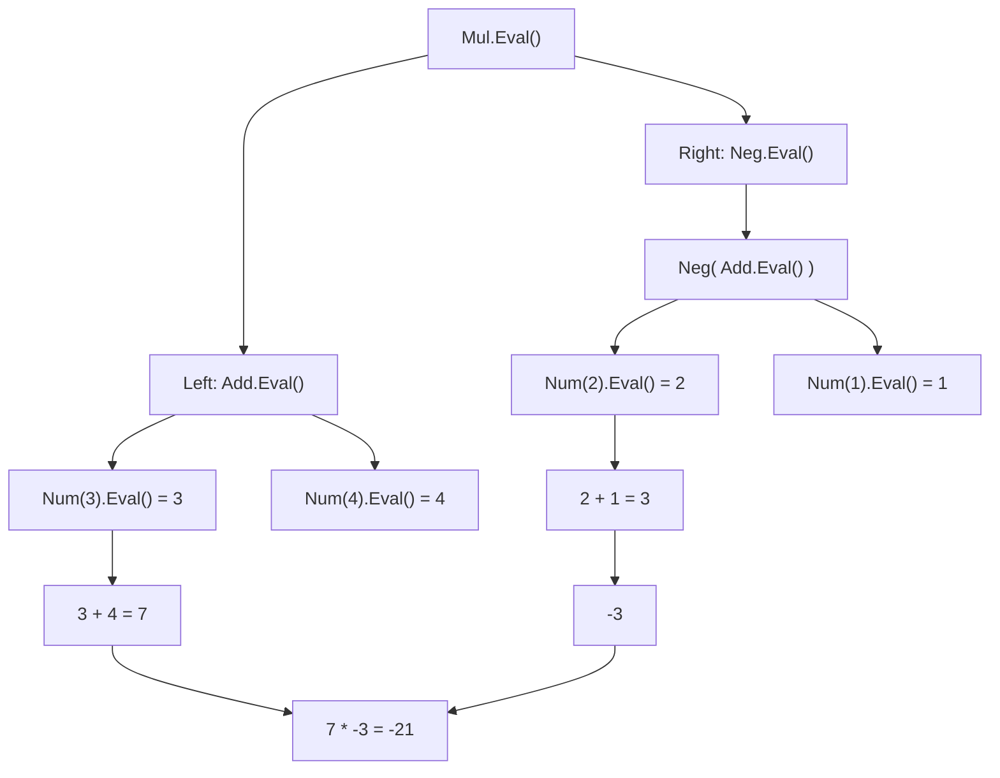
```mermaid
flowchart TD
    A["Mul.Eval()"] --> B["Left: Add.Eval()"]
    A --> C["Right: Neg.Eval()"]
    B --> D["Num(3).Eval() = 3"]
    B --> E["Num(4).Eval() = 4"]
    D --> F["3 + 4 = 7"]
    C --> G["Neg( Add.Eval() )"]
    G --> H["Num(2).Eval() = 2"]
    G --> I["Num(1).Eval() = 1"]
    H --> J["2 + 1 = 3"]
    J --> K["-3"]
    F --> L["7 * -3 = -21"]
    K --> L
```

**Execution Trace:**
```
Mul.Eval():
  Left  = Add{3,4}.Eval() = 7
  Right = Neg{Add{2,1}}.Eval() = -(2+1) = -3
  7 * -3 = -21
Output: -21
```

### Interviewer Questions

1. Why is the interface-based approach extensible but the type-switch approach is not?
2. Can we improve time/space further? What's the theoretical lower bound?
3. How does this scale to 10M elements / 1M concurrent requests?
4. Walk me through the edge case where Div receives zero as right operand.
5. How would you make this goroutine-safe?
6. What's the memory/GC impact? How would you reduce allocations?
7. How would you test this comprehensively?

### Follow-Up Questions

**Q1:** How would you add `Eval() (float64, error)` without breaking existing implementations?
**A1:** You cannot add a method to the existing `Expr` interface without breaking implementors. Options: (1) define a new `SafeExpr` interface with the error-returning method, (2) use a separate visitor that returns errors, (3) encode errors as NaN and add a separate `Validate() error` method.

**Q2:** How would you add memoisation to avoid recomputing shared subtrees?
**A2:** Each `Expr` node would carry a `sync.Once` and a cached value. `Eval()` checks if computed; if not, computes and stores. This works for immutable trees. For mutable trees, use a separate cache keyed by node identity (unsafe.Pointer).

**Q3:** How would you serialise and deserialise this expression tree to JSON?
**A3:** Each type implements `json.Marshaler`: include a `"type"` field. Deserialisation requires a factory that reads `"type"` and instantiates the correct struct. Or use a union type with a discriminator and custom `UnmarshalJSON`.

**Q4:** Can Go generics improve this design?
**A4:** A generic `BinaryOp[T Expr]` could capture the pattern for Add, Mul, Div, but Go generics do not support method-level type parameters. You would still need one struct per operation. Generics help more with collections of `Expr` than with the nodes themselves.

**Q5:** What is the time complexity if subtrees are shared (a DAG instead of a tree)?
**A5:** Without memoisation, O(2^d) in the worst case for a balanced binary DAG where every node has two children pointing to the same subtree. With memoisation (visited set), O(n) where n = number of unique nodes.

---

## Q19: FAANG-Style — Interface-Based Rate Limiter  [Level 5 — Interview Level]

> **Tags:** `#rate-limiting` `#token-bucket` `#interface-design` `#uber` `#google`

### Problem Statement
Design a `RateLimiter` interface with `Allow(key string) bool` and `Reset(key string)`. Implement `TokenBucketLimiter` with configurable capacity and refill rate (tokens per second). The implementation must be goroutine-safe. Also implement `NoOpLimiter` for testing. Show how a middleware can accept `RateLimiter` and enforce limits on HTTP requests.

### Input / Output / Constraints

```
Input:  TokenBucketLimiter{capacity=3, refillRate=1/sec}
        5 rapid Allow("user-1") calls
Output: true, true, true, false, false (bucket empty after 3)

Constraints:
  • capacity ≥ 1
  • refillRate > 0 tokens/second
  • Goroutine-safe (multiple goroutines call Allow concurrently)
  • Allow must be O(1) time
```

### Thought Process

Think like a senior Go engineer:
1. **Understand:** Token bucket: holds up to `capacity` tokens; each `Allow` consumes one; tokens refill at `refillRate`/sec. Check on the fly using time elapsed since last refill.
2. **Pattern:** Token bucket algorithm; per-key state with sync.Map or map+mutex; lazy refill on Allow.
3. **Edge cases:** Burst at capacity, refill timing, very high refill rate, key never seen before.
4. **Approach:** Lazy refill: on each `Allow`, compute tokens added since last check using elapsed time.

### Brute Force Solution

```go
package main

import "time"

// bruteForce — refill with a background goroutine, not lazy
type BruteLimiter struct {
    tokens   int
    capacity int
    ticker   *time.Ticker
}
// Background goroutine adds tokens every 1/rate second — goroutine leak risk,
// one goroutine per key, expensive for millions of users.
```

**Time:** O(1) | **Space:** O(n) per key, plus one goroutine per key
**Bottleneck:** One goroutine per key does not scale to millions of users.

### Better Solution

```go
// betterSolution — lazy refill, no background goroutines
type bucketState struct {
    tokens   float64
    lastTime time.Time
}
// Refill on Allow() call using elapsed time. No goroutines.
```

**Time:** O(1) | **Space:** O(n) for the key map

### Best / Optimal Solution

```go
package main

import (
    "fmt"
    "net/http"
    "net/http/httptest"
    "sync"
    "time"
)

// RateLimiter defines the per-key rate limiting contract.
type RateLimiter interface {
    Allow(key string) bool
    Reset(key string)
}

// NoOpLimiter allows everything — useful in tests and development.
type NoOpLimiter struct{}

func (n NoOpLimiter) Allow(_ string) bool { return true }
func (n NoOpLimiter) Reset(_ string)      {}

// bucketState holds the token state for one key.
type bucketState struct {
    tokens   float64
    lastSeen time.Time
}

// TokenBucketLimiter implements per-key token bucket rate limiting.
type TokenBucketLimiter struct {
    mu         sync.Mutex
    buckets    map[string]*bucketState
    capacity   float64
    refillRate float64 // tokens per second
    clock      func() time.Time
}

// NewTokenBucketLimiter validates inputs and returns a ready limiter.
func NewTokenBucketLimiter(capacity int, refillRate float64) (*TokenBucketLimiter, error) {
    if capacity < 1 {
        return nil, fmt.Errorf("capacity must be >= 1")
    }
    if refillRate <= 0 {
        return nil, fmt.Errorf("refillRate must be > 0")
    }
    return &TokenBucketLimiter{
        buckets:    make(map[string]*bucketState),
        capacity:   float64(capacity),
        refillRate: refillRate,
        clock:      time.Now,
    }, nil
}

// Allow — O(1) amortised time, O(n) space for n unique keys.
// Uses lazy refill: computes tokens added since last call.
func (t *TokenBucketLimiter) Allow(key string) bool {
    t.mu.Lock()
    defer t.mu.Unlock()

    now := t.clock()
    b, ok := t.buckets[key]
    if !ok {
        t.buckets[key] = &bucketState{tokens: t.capacity - 1, lastSeen: now}
        return true
    }

    // Refill based on elapsed time.
    elapsed := now.Sub(b.lastSeen).Seconds()
    b.tokens = min64(b.tokens+elapsed*t.refillRate, t.capacity)
    b.lastSeen = now

    if b.tokens >= 1 {
        b.tokens--
        return true
    }
    return false
}

func min64(a, b float64) float64 {
    if a < b {
        return a
    }
    return b
}

// Reset clears the bucket for a key (e.g., after authentication).
func (t *TokenBucketLimiter) Reset(key string) {
    t.mu.Lock()
    defer t.mu.Unlock()
    delete(t.buckets, key)
}

// --- HTTP Middleware ---

// RateLimitMiddleware wraps any http.Handler with per-IP rate limiting.
type RateLimitMiddleware struct {
    next    http.Handler
    limiter RateLimiter
}

func NewRateLimitMiddleware(next http.Handler, limiter RateLimiter) (http.Handler, error) {
    if next == nil || limiter == nil {
        return nil, fmt.Errorf("next and limiter must not be nil")
    }
    return &RateLimitMiddleware{next: next, limiter: limiter}, nil
}

func (m *RateLimitMiddleware) ServeHTTP(w http.ResponseWriter, r *http.Request) {
    key := r.RemoteAddr
    if !m.limiter.Allow(key) {
        http.Error(w, "rate limit exceeded", http.StatusTooManyRequests)
        return
    }
    m.next.ServeHTTP(w, r)
}

func main() {
    limiter, _ := NewTokenBucketLimiter(3, 1.0)

    // Simulate 5 rapid requests
    key := "user-1"
    for i := 1; i <= 5; i++ {
        fmt.Printf("Request %d: allowed=%v\n", i, limiter.Allow(key))
    }

    // Simulate HTTP middleware
    baseHandler := http.HandlerFunc(func(w http.ResponseWriter, r *http.Request) {
        fmt.Fprintln(w, "ok")
    })
    mw, _ := NewRateLimitMiddleware(baseHandler, limiter)

    req := httptest.NewRequest("GET", "/", nil)
    rec := httptest.NewRecorder()
    mw.ServeHTTP(rec, req)
    fmt.Printf("HTTP status: %d\n", rec.Code)
}
```

**Time:** O(1) per Allow call | **Space:** O(n) for n unique keys

### Production Considerations

| Aspect | Details |
|--------|---------|
| **Scalability** | Single mutex serialises all Allow calls; use sync.Map + per-key mutex for sharded locking |
| **Edge Cases** | First request gets full bucket; key never seen initialised with capacity-1 |
| **Error Handling** | Constructor validates; runtime Allow never errors |
| **Memory** | One bucketState per unique key (~40 bytes); evict stale keys with TTL cleanup |
| **Concurrency** | Mutex ensures correctness; under heavy load, consider sharded locks (256 shards) |

### Visual Explanation

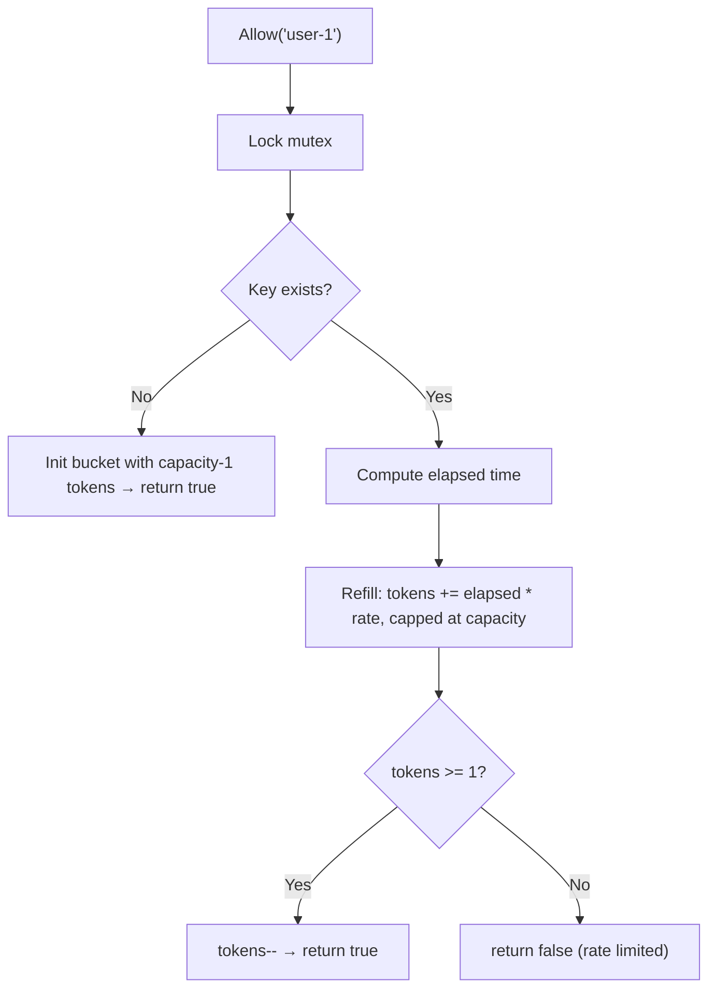
```mermaid
flowchart TD
    A["Allow('user-1')"] --> B["Lock mutex"]
    B --> C{"Key exists?"}
    C -->|"No"| D["Init bucket with capacity-1 tokens → return true"]
    C -->|"Yes"| E["Compute elapsed time"]
    E --> F["Refill: tokens += elapsed * rate, capped at capacity"]
    F --> G{"tokens >= 1?"}
    G -->|"Yes"| H["tokens-- → return true"]
    G -->|"No"| I["return false (rate limited)"]
```

**Execution Trace:**
```
capacity=3, refillRate=1/s, key="user-1"
Request 1: new bucket, tokens=2 → true
Request 2: elapsed≈0, tokens=2→1 → true
Request 3: elapsed≈0, tokens=1→0 → true
Request 4: elapsed≈0, tokens=0 → false
Request 5: elapsed≈0, tokens=0 → false
```

### Interviewer Questions

1. Why lazy refill instead of a background goroutine per key?
2. Can we improve time/space further? What's the theoretical lower bound?
3. How does this scale to 10M elements / 1M concurrent requests?
4. Walk me through what happens if the system clock goes backward (NTP adjustment).
5. How would you make this goroutine-safe?
6. What's the memory/GC impact? How would you reduce allocations?
7. How would you test this comprehensively?

### Follow-Up Questions

**Q1:** How does token bucket differ from leaky bucket and sliding window?
**A1:** Token bucket allows bursts up to capacity, then refills at a steady rate — great for bursty traffic. Leaky bucket outputs at a fixed rate regardless of input — smoother but loses burst requests. Sliding window counts requests in a rolling time window — more precise but requires storing timestamps per request.

**Q2:** How do you scale this to multiple server instances?
**A2:** Move state to Redis: `INCR key EX ttl` for fixed window, or `ZADD + ZREMRANGEBYSCORE + ZCOUNT` for sliding window. Or use Redis Lua scripts for atomic token bucket operations. The `RateLimiter` interface stays unchanged; the implementation switches to a Redis-backed store.

**Q3:** How would you add per-route rate limits (not just per IP)?
**A3:** The key in `Allow` encodes both the route and the identity: `key = r.URL.Path + ":" + r.RemoteAddr`. Or use a composite key struct with a string representation.

**Q4:** How would you test the rate limiter without sleeping?
**A4:** Inject a fake clock via the `clock func() time.Time` field. In tests, set the clock to a controllable `time.Time` variable and advance it manually between calls. This eliminates real-time dependencies from tests.

**Q5:** What happens under thundering herd when the bucket refills?
**A5:** All waiting clients see `Allow` return false and must retry. Without a queue, retries spike again when tokens become available. Mitigate with: (1) `Retry-After` response header so clients wait the right amount, (2) jitter in client retry, (3) a queue-based approach for critical paths.

---

## Q20: FAANG-Style — Interface-Driven Dependency Injection Container  [Level 5 — Interview Level]

> **Tags:** `#dependency-injection` `#container` `#reflection-free` `#interface-design` `#amazon`

### Problem Statement
Build a simple, reflection-free dependency injection container using interfaces. The container stores factories (functions that produce values) keyed by interface type name. Support `Register(name string, factory func() any)` and `Resolve(name string) (any, error)`. Implement lazy initialisation (factory called on first resolve) and singleton semantics (same instance returned on subsequent resolves). Handle circular dependencies by detecting them at resolve time.

### Input / Output / Constraints

```
Input:  Register "db" → func() any { return &PostgresDB{} }
        Register "service" → func() any { ... resolves "db" ... }
        Resolve("service") → *OrderService with injected *PostgresDB

Constraints:
  • No reflection
  • Singletons: factory called at most once per name
  • Circular dependency detected and returns error (not infinite loop)
  • Goroutine-safe
```

### Thought Process

Think like a senior Go engineer:
1. **Understand:** A DI container maps names to factories; lazy singletons use `sync.Once`; circular dependency detection uses a "resolving" set.
2. **Pattern:** Registry + lazy singleton + cycle detection with a visited set.
3. **Edge cases:** Unknown name, factory returns nil, circular dependency `A→B→A`, concurrent resolve of the same name.
4. **Approach:** Per-entry `sync.Once` for singleton guarantee; a `resolving` `map[string]bool` per resolve call (passed through resolve chain).

### Brute Force Solution

```go
package main

// bruteForce — eager initialisation, no cycle detection
type ContainerBrute struct {
    instances map[string]any
}

func (c *ContainerBrute) Register(name string, val any) {
    c.instances[name] = val // eager: all values computed upfront
}
```

**Time:** O(1) | **Space:** O(n)
**Bottleneck:** Eager initialisation forces all dependencies to exist at registration time; no circular detection; not goroutine-safe.

### Better Solution

```go
// betterSolution — lazy with sync.Once, no cycle detection
type entry struct {
    factory  func() any
    once     sync.Once
    instance any
}

func (e *entry) get() any {
    e.once.Do(func() { e.instance = e.factory() })
    return e.instance
}
```

**Time:** O(1) | **Space:** O(n)

### Best / Optimal Solution

```go
package main

import (
    "fmt"
    "sync"
)

// Container is a reflection-free DI container with lazy singleton semantics.
type Container struct {
    mu      sync.RWMutex
    entries map[string]*diEntry
}

type diEntry struct {
    factory  func(c *Container) (any, error)
    once     sync.Once
    instance any
    initErr  error
}

// NewContainer initialises an empty container.
func NewContainer() *Container {
    return &Container{entries: make(map[string]*diEntry)}
}

// Register adds a named factory. Safe to call concurrently.
func (c *Container) Register(name string, factory func(c *Container) (any, error)) error {
    if name == "" {
        return fmt.Errorf("name must not be empty")
    }
    if factory == nil {
        return fmt.Errorf("factory must not be nil")
    }
    c.mu.Lock()
    defer c.mu.Unlock()
    if _, exists := c.entries[name]; exists {
        return fmt.Errorf("dependency %q already registered", name)
    }
    c.entries[name] = &diEntry{factory: factory}
    return nil
}

// Resolve returns the singleton instance for the named dependency.
// Detects circular dependencies via a per-resolve resolving set.
func (c *Container) Resolve(name string) (any, error) {
    return c.resolve(name, map[string]bool{})
}

func (c *Container) resolve(name string, resolving map[string]bool) (any, error) {
    if resolving[name] {
        return nil, fmt.Errorf("circular dependency detected: %q is already being resolved", name)
    }

    c.mu.RLock()
    entry, ok := c.entries[name]
    c.mu.RUnlock()
    if !ok {
        return nil, fmt.Errorf("dependency %q not registered", name)
    }

    resolving[name] = true
    defer delete(resolving, name)

    entry.once.Do(func() {
        entry.instance, entry.initErr = entry.factory(c)
        if entry.instance == nil && entry.initErr == nil {
            entry.initErr = fmt.Errorf("factory for %q returned nil without error", name)
        }
    })

    return entry.instance, entry.initErr
}

// --- Demo types ---

type Database interface {
    Query(q string) string
}

type PostgresDB struct{ dsn string }

func (db *PostgresDB) Query(q string) string {
    return fmt.Sprintf("[pg] result for: %s", q)
}

type OrderService struct {
    db Database
}

func (s *OrderService) GetOrder(id int) string {
    return s.db.Query(fmt.Sprintf("SELECT * FROM orders WHERE id=%d", id))
}

func main() {
    c := NewContainer()

    // Register database
    _ = c.Register("db", func(c *Container) (any, error) {
        return &PostgresDB{dsn: "postgres://localhost/orders"}, nil
    })

    // Register service that depends on db
    _ = c.Register("orderService", func(c *Container) (any, error) {
        raw, err := c.Resolve("db")
        if err != nil {
            return nil, fmt.Errorf("orderService needs db: %w", err)
        }
        db, ok := raw.(Database)
        if !ok {
            return nil, fmt.Errorf("db does not implement Database interface")
        }
        return &OrderService{db: db}, nil
    })

    // Resolve (lazy, singleton)
    raw, err := c.Resolve("orderService")
    if err != nil {
        fmt.Println("error:", err)
        return
    }
    svc := raw.(*OrderService)
    fmt.Println(svc.GetOrder(42))

    // Same instance on second resolve (singleton)
    raw2, _ := c.Resolve("orderService")
    fmt.Println("singleton:", raw == raw2)

    // Circular dependency demo
    c2 := NewContainer()
    _ = c2.Register("a", func(c *Container) (any, error) {
        _, err := c.Resolve("b")
        return "a", err
    })
    _ = c2.Register("b", func(c *Container) (any, error) {
        _, err := c.Resolve("a")
        return "b", err
    })
    _, err = c2.Resolve("a")
    fmt.Println("circular error:", err)
}
```

**Time:** O(1) amortised (O(n) on first full resolve chain) | **Space:** O(n) for n dependencies

### Production Considerations

| Aspect | Details |
|--------|---------|
| **Scalability** | sync.Once ensures init happens once; subsequent resolves are O(1) reads |
| **Edge Cases** | Circular deps detected per-call; unknown names return error; nil factory rejected |
| **Error Handling** | Init errors stored in entry and returned on all subsequent resolves |
| **Memory** | One instance per registered name; instances never garbage collected while container lives |
| **Concurrency** | sync.Once + RWMutex: goroutine-safe resolve; write lock only on Register |

### Visual Explanation

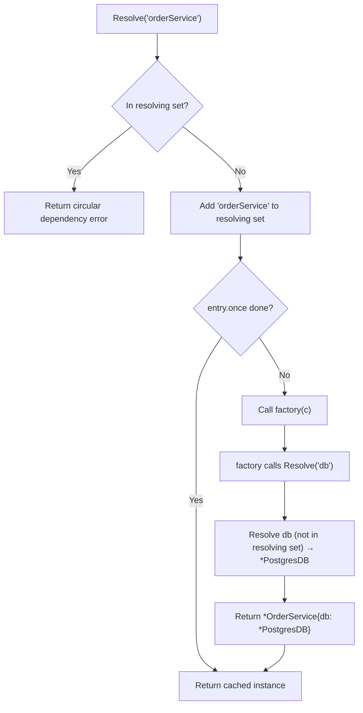
```mermaid
flowchart TD
    A["Resolve('orderService')"] --> B{"In resolving set?"}
    B -->|"Yes"| C["Return circular dependency error"]
    B -->|"No"| D["Add 'orderService' to resolving set"]
    D --> E{"entry.once done?"}
    E -->|"Yes"| F["Return cached instance"]
    E -->|"No"| G["Call factory(c)"]
    G --> H["factory calls Resolve('db')"]
    H --> I["Resolve db (not in resolving set) → *PostgresDB"]
    I --> J["Return *OrderService{db: *PostgresDB}"]
    J --> F
```

**Execution Trace:**
```
Resolve("orderService"):
  resolving = {"orderService": true}
  factory calls Resolve("db"):
    resolving = {"orderService": true, "db": true}
    db factory → *PostgresDB
    resolving = {"orderService": true}
  *OrderService{db: *PostgresDB} cached
  resolving = {}
Second Resolve("orderService"): sync.Once returns cached instance
```

### Interviewer Questions

1. Why use `sync.Once` instead of a `initialized bool` field with a mutex?
2. Can we improve time/space further? What's the theoretical lower bound?
3. How does this scale to 10M elements / 1M concurrent requests?
4. Walk me through what happens if the factory panics.
5. How would you make this goroutine-safe?
6. What's the memory/GC impact? How would you reduce allocations?
7. How would you test this comprehensively?

### Follow-Up Questions

**Q1:** Why does `sync.Once` not work for cycle detection?
**A1:** `sync.Once.Do` blocks if called concurrently with another `Do` on the same `Once`. If A calls B and B calls A (circular), the second `Do` on A's entry will block forever — deadlock. We detect cycles before reaching `once.Do` by checking the `resolving` map first.

**Q2:** How do you handle factory panics in `sync.Once.Do`?
**A2:** `sync.Once.Do` does not recover panics. If the factory panics, the `Once` is marked as done and subsequent calls return the zero value. Wrap the factory call in a `defer/recover` inside `Do` and store the recovered value as `initErr`.

**Q3:** How would you add named scopes (e.g., per-request vs singleton)?
**A3:** Add a `scope` field to `diEntry`: `singleton` vs `transient` vs `scoped`. For transient, skip `sync.Once` and call the factory every time. For scoped, store instances in a `RequestContext` map, keyed by request ID.

**Q4:** How does this compare to `wire` (Google's DI codegen tool)?
**A4:** `wire` generates DI code at compile time using code generation — no reflection, no runtime registry, fully type-safe. This container uses a runtime map — flexible but loses type safety. For large applications, `wire` or `fx` (Uber) are preferred. This runtime container is useful for plugins or when wiring is determined at runtime.

**Q5:** How would you test that singletons are truly created only once?
**A5:** Add a call counter to the factory: `callCount := 0; c.Register("db", func(c *Container) (any, error) { callCount++; return &PostgresDB{}, nil }); c.Resolve("db"); c.Resolve("db"); assert.Equal(t, 1, callCount)`. Also run with `go test -race` to verify no data races.

---

## Q21: Production-Level — Concurrent-Safe Metrics Collector  [Level 6 — Production Level]

> **Tags:** `#metrics` `#concurrent-safe` `#observable` `#interface-design` `#production`

### Problem Statement
Design and implement a production-ready metrics collection system. Define a `MetricsCollector` interface with `Increment(name string)`, `Gauge(name string, value float64)`, `Histogram(name string, value float64)`, and `Flush() map[string]any`. Implement `PrometheusCollector` (stub) and `InMemoryCollector` for testing. The implementation must be goroutine-safe, non-blocking for Increment/Gauge, and support atomic snapshots in Flush.

### Input / Output / Constraints

```
Input:  100 concurrent goroutines calling Increment("requests")
        Flush() called after all goroutines finish
Output: Flush()["requests.count"] == 100 (exact, no races)

Constraints:
  • Increment must be lock-free (use sync/atomic)
  • Gauge and Histogram can use mutex
  • Flush must return a consistent snapshot (not a live view)
  • All method calls must complete in < 1 microsecond (not counting flush)
```

### Thought Process

Think like a senior Go engineer:
1. **Understand:** Metrics are written frequently from many goroutines; reads (flush) are rare. Optimise for writes.
2. **Pattern:** Atomic counters for Increment; mutex-protected map for Gauges; sync snapshot in Flush.
3. **Edge cases:** Empty metrics on flush, concurrent flush and increment, metric name collisions, histogram with no data.
4. **Approach:** `sync.Map` or sharded maps for per-metric atomic int64 counters; `sync.RWMutex` for gauge/histogram maps; deep copy in Flush.

### Brute Force Solution

```go
package main

import "sync"

// bruteForce — single mutex around everything
type BruteCollector struct {
    mu      sync.Mutex
    metrics map[string]any
}

func (b *BruteCollector) Increment(name string) {
    b.mu.Lock()
    defer b.mu.Unlock()
    // Every Increment acquires a global mutex — bottleneck at high concurrency.
    b.metrics[name+".count"] = b.metrics[name+".count"].(int) + 1
}
```

**Time:** O(1) with lock contention | **Space:** O(n)
**Bottleneck:** Global mutex serialises all Increment calls; at 100K req/sec, mutex contention dominates.

### Better Solution

```go
// betterSolution — atomic counters for Increment
import "sync/atomic"
type counter struct{ v int64 }
func (c *counter) inc() { atomic.AddInt64(&c.v, 1) }
func (c *counter) load() int64 { return atomic.LoadInt64(&c.v) }
```

**Time:** O(1) lock-free | **Space:** O(n)

### Best / Optimal Solution

```go
package main

import (
    "fmt"
    "math"
    "sync"
    "sync/atomic"
    "time"
)

// MetricsCollector defines the metrics recording interface.
type MetricsCollector interface {
    Increment(name string)
    Gauge(name string, value float64)
    Histogram(name string, value float64)
    Flush() map[string]any
}

// NoOpCollector — for tests that don't need metrics.
type NoOpCollector struct{}

func (n NoOpCollector) Increment(_ string)            {}
func (n NoOpCollector) Gauge(_ string, _ float64)     {}
func (n NoOpCollector) Histogram(_ string, _ float64) {}
func (n NoOpCollector) Flush() map[string]any         { return nil }

// histogramData tracks min, max, sum, count for a histogram metric.
type histogramData struct {
    mu    sync.Mutex
    min   float64
    max   float64
    sum   float64
    count int64
}

func newHistogramData() *histogramData {
    return &histogramData{min: math.MaxFloat64, max: -math.MaxFloat64}
}

func (h *histogramData) observe(v float64) {
    h.mu.Lock()
    defer h.mu.Unlock()
    h.count++
    h.sum += v
    if v < h.min { h.min = v }
    if v > h.max { h.max = v }
}

func (h *histogramData) snapshot() map[string]any {
    h.mu.Lock()
    defer h.mu.Unlock()
    if h.count == 0 {
        return map[string]any{"count": int64(0)}
    }
    return map[string]any{
        "count": h.count,
        "min":   h.min,
        "max":   h.max,
        "sum":   h.sum,
        "mean":  h.sum / float64(h.count),
    }
}

// InMemoryCollector — production-quality, goroutine-safe metrics collector.
type InMemoryCollector struct {
    counters   sync.Map              // name → *int64
    gauges     sync.Map              // name → *float64 (via pointer for atomic-ish updates)
    histograms sync.Map              // name → *histogramData
    gaugeMu    sync.RWMutex          // for gauge map (float64 not atomically settable without tricks)
    gaugeMap   map[string]float64
}

// NewInMemoryCollector initialises the collector.
func NewInMemoryCollector() *InMemoryCollector {
    return &InMemoryCollector{
        gaugeMap: make(map[string]float64),
    }
}

// Increment is lock-free — O(1) using atomic add.
func (c *InMemoryCollector) Increment(name string) {
    v, _ := c.counters.LoadOrStore(name, new(int64))
    atomic.AddInt64(v.(*int64), 1)
}

// Gauge sets a named gauge value — O(1) with mutex.
func (c *InMemoryCollector) Gauge(name string, value float64) {
    c.gaugeMu.Lock()
    c.gaugeMap[name] = value
    c.gaugeMu.Unlock()
}

// Histogram records an observation — O(1) with per-histogram mutex.
func (c *InMemoryCollector) Histogram(name string, value float64) {
    v, _ := c.histograms.LoadOrStore(name, newHistogramData())
    v.(*histogramData).observe(value)
}

// Flush returns an atomic snapshot of all metrics — O(n).
func (c *InMemoryCollector) Flush() map[string]any {
    result := make(map[string]any)

    c.counters.Range(func(k, v any) bool {
        result[k.(string)+".count"] = atomic.LoadInt64(v.(*int64))
        return true
    })

    c.gaugeMu.RLock()
    for k, v := range c.gaugeMap {
        result[k+".gauge"] = v
    }
    c.gaugeMu.RUnlock()

    c.histograms.Range(func(k, v any) bool {
        result[k.(string)+".histogram"] = v.(*histogramData).snapshot()
        return true
    })

    return result
}

// PrometheusCollector stubs Prometheus integration.
type PrometheusCollector struct {
    inner *InMemoryCollector
}

func NewPrometheusCollector() *PrometheusCollector {
    return &PrometheusCollector{inner: NewInMemoryCollector()}
}

func (p *PrometheusCollector) Increment(name string)            { p.inner.Increment(name) }
func (p *PrometheusCollector) Gauge(name string, v float64)     { p.inner.Gauge(name, v) }
func (p *PrometheusCollector) Histogram(name string, v float64) { p.inner.Histogram(name, v) }
func (p *PrometheusCollector) Flush() map[string]any            { return p.inner.Flush() }

func main() {
    col := NewInMemoryCollector()

    var wg sync.WaitGroup
    start := time.Now()
    for i := 0; i < 100; i++ {
        wg.Add(1)
        go func(n int) {
            defer wg.Done()
            col.Increment("requests")
            col.Gauge("active_connections", float64(n))
            col.Histogram("latency_ms", float64(n%50+1))
        }(i)
    }
    wg.Wait()

    snap := col.Flush()
    fmt.Printf("requests.count = %d\n", snap["requests.count"])
    fmt.Printf("elapsed: %v\n", time.Since(start))
    if hist, ok := snap["latency_ms.histogram"].(map[string]any); ok {
        fmt.Printf("latency: count=%v mean=%.2f\n", hist["count"], hist["mean"])
    }
}
```

**Time:** O(1) for Increment/Gauge/Histogram | **Space:** O(n) for n unique metric names

### Production Considerations

| Aspect | Details |
|--------|---------|
| **Scalability** | Lock-free counters scale linearly with goroutines; sync.Map good for read-heavy, many-key scenarios |
| **Edge Cases** | Empty collector flush returns empty map; histogram with 0 observations handled |
| **Error Handling** | Methods are infallible; errors logged internally if needed |
| **Memory** | Each metric: 8 bytes (counter) or 64 bytes (histogram); 1M metrics ≈ 64 MB |
| **Concurrency** | sync.Map + atomic for counters; per-histogram mutex for aggregates; RWMutex for gauges |

### Visual Explanation

```mermaid
flowchart TD
    A["Increment('requests') × 100 goroutines"] --> B["sync.Map.LoadOrStore → *int64"]
    B --> C["atomic.AddInt64 (lock-free)"]
    D["Flush()"] --> E["counters.Range → atomic.LoadInt64 per counter"]
    E --> F["gaugeMu.RLock → copy gaugeMap"]
    F --> G["histograms.Range → snapshot per histogram"]
    G --> H["Return merged map"]
```

**Execution Trace:**
```
100 goroutines call Increment("requests")
  Each: atomic.AddInt64(&counter, 1) — no lock
Flush():
  atomic.LoadInt64 → 100
Output: map["requests.count"] = 100
```

### Interviewer Questions

1. Why use `sync.Map` for counters instead of a regular `map` with mutex?
2. Can we improve time/space further? What's the theoretical lower bound?
3. How does this scale to 10M elements / 1M concurrent requests?
4. Walk me through what happens if Flush is called while 1000 goroutines are incrementing.
5. How would you make this goroutine-safe?
6. What's the memory/GC impact? How would you reduce allocations?
7. How would you test this comprehensively?

### Follow-Up Questions

**Q1:** When should you use `sync.Map` vs `map` + `sync.RWMutex`?
**A1:** Use `sync.Map` when: keys are written once and read many times (stable key set after startup), or keys are disjoint across goroutines. Use `map + RWMutex` when: you need iteration with snapshots, when keys change frequently, or when you need range operations atomically. `sync.Map` has higher per-operation overhead than a simple mutex map in low-contention scenarios.

**Q2:** How do you export these metrics to Prometheus?
**A2:** Replace `InMemoryCollector` with a real `prometheus.CounterVec`, `prometheus.GaugeVec`, and `prometheus.HistogramVec`. The `MetricsCollector` interface remains unchanged. The service code never imports prometheus directly — only the infrastructure layer does.

**Q3:** How would you add labels/tags to metrics (e.g., per-endpoint)?
**A3:** Change signatures: `Increment(name string, labels map[string]string)`. Serialise labels to a canonical key: `name + sortedLabels`. Or use a structured metric type: `Increment(name string, labels ...Label)` where `Label` is a `{Key, Value}` pair.

**Q4:** How would you handle high-cardinality labels (e.g., per-user-ID)?
**A4:** Never use high-cardinality labels (like user IDs) as metric labels — they create one time series per user, overwhelming the metrics backend. Instead, aggregate at collection time: use a histogram for per-user latency distribution rather than per-user gauge.

**Q5:** How do you test metrics are recorded correctly in an end-to-end test?
**A5:** Inject `InMemoryCollector` into the service under test. After exercising the service, call `Flush()` and assert the expected metric values. Example: `col := NewInMemoryCollector(); svc := NewOrderService(db, col); svc.CreateOrder(...); snap := col.Flush(); assert.Equal(t, int64(1), snap["orders.created.count"])`.

---

## Q22: Production-Level — Interface-Based Circuit Breaker  [Level 6 — Production Level]

> **Tags:** `#circuit-breaker` `#resilience` `#production` `#concurrent-safe` `#error-handling`

### Problem Statement
Implement a production-ready circuit breaker wrapping any `ServiceCaller` interface with `Call(ctx context.Context, req any) (any, error)`. The circuit breaker has three states: Closed (normal), Open (failing fast), Half-Open (probing). Transitions: Closed→Open after N consecutive failures, Open→Half-Open after timeout, Half-Open→Closed on success or Half-Open→Open on failure. Must be goroutine-safe and observable (expose State()).

### Input / Output / Constraints

```
Input:  CircuitBreaker{threshold=3, timeout=5s} wrapping a flaky service
        3 failures → Open, all calls fail fast
        After 5s  → Half-Open, one probe allowed
        Probe succeeds → Closed

Constraints:
  • Goroutine-safe (hundreds of concurrent callers)
  • State transitions must be atomic
  • Call must return ErrCircuitOpen immediately when Open (< 1 microsecond)
  • threshold ≥ 1, timeout > 0
```

### Thought Process

Think like a senior Go engineer:
1. **Understand:** Circuit breaker protects downstream services from cascading failures. Three states with specific transitions. Concurrent callers must see consistent state.
2. **Pattern:** State machine with mutex; time-based half-open probe; error classification (not all errors trip the breaker).
3. **Edge cases:** Concurrent calls during state transition, probe failure, context cancellation, zero threshold.
4. **Approach:** State + mutex + failure counter + last-failure time; atomic state check in Call; single probe in half-open.

### Brute Force Solution

```go
package main

// bruteForce — no state machine, just a failure counter
type BruteBreaker struct {
    failures int
    limit    int
}

func (b *BruteBreaker) Call(f func() error) error {
    if b.failures >= b.limit {
        return fmt.Errorf("circuit open") // never recovers
    }
    err := f()
    if err != nil { b.failures++ }
    return err
}
```

**Time:** O(1) | **Space:** O(1)
**Bottleneck:** No recovery mechanism; no half-open state; not goroutine-safe; counter never resets.

### Better Solution

```go
// betterSolution — three states, but not goroutine-safe
type State int
const (Closed State = iota; Open; HalfOpen)

type Breaker struct {
    state    State
    failures int
    openedAt time.Time
}
```

**Time:** O(1) | **Space:** O(1)

### Best / Optimal Solution

```go
package main

import (
    "context"
    "errors"
    "fmt"
    "sync"
    "time"
)

// ErrCircuitOpen is returned when the circuit is open.
var ErrCircuitOpen = errors.New("circuit breaker is open")

// BreakerState represents the circuit breaker state.
type BreakerState int

const (
    StateClosed   BreakerState = iota
    StateOpen
    StateHalfOpen
)

func (s BreakerState) String() string {
    return [...]string{"Closed", "Open", "HalfOpen"}[s]
}

// ServiceCaller is the interface the circuit breaker wraps.
type ServiceCaller interface {
    Call(ctx context.Context, req any) (any, error)
}

// CircuitBreaker wraps ServiceCaller with fault tolerance.
type CircuitBreaker struct {
    mu            sync.Mutex
    inner         ServiceCaller
    state         BreakerState
    failures      int
    threshold     int
    openedAt      time.Time
    resetTimeout  time.Duration
    probeAllowed  bool // single probe in half-open
}

// NewCircuitBreaker validates and returns a circuit breaker.
func NewCircuitBreaker(inner ServiceCaller, threshold int, resetTimeout time.Duration) (*CircuitBreaker, error) {
    if inner == nil {
        return nil, fmt.Errorf("inner caller must not be nil")
    }
    if threshold < 1 {
        return nil, fmt.Errorf("threshold must be >= 1")
    }
    if resetTimeout <= 0 {
        return nil, fmt.Errorf("reset timeout must be positive")
    }
    return &CircuitBreaker{
        inner:        inner,
        threshold:    threshold,
        resetTimeout: resetTimeout,
        state:        StateClosed,
    }, nil
}

// State returns the current circuit state — goroutine-safe.
func (cb *CircuitBreaker) State() BreakerState {
    cb.mu.Lock()
    defer cb.mu.Unlock()
    cb.updateState()
    return cb.state
}

// updateState handles time-based transitions. Must be called with mu held.
func (cb *CircuitBreaker) updateState() {
    if cb.state == StateOpen && time.Since(cb.openedAt) >= cb.resetTimeout {
        cb.state = StateHalfOpen
        cb.probeAllowed = true
    }
}

// Call — O(1) time. Returns ErrCircuitOpen without touching the service when Open.
func (cb *CircuitBreaker) Call(ctx context.Context, req any) (any, error) {
    cb.mu.Lock()
    cb.updateState()

    switch cb.state {
    case StateOpen:
        cb.mu.Unlock()
        return nil, ErrCircuitOpen

    case StateHalfOpen:
        if !cb.probeAllowed {
            cb.mu.Unlock()
            return nil, ErrCircuitOpen
        }
        cb.probeAllowed = false
        cb.mu.Unlock()

        resp, err := cb.inner.Call(ctx, req)
        cb.mu.Lock()
        defer cb.mu.Unlock()
        if err != nil {
            cb.trip()
            return nil, err
        }
        cb.reset()
        return resp, nil

    default: // Closed
        cb.mu.Unlock()
        resp, err := cb.inner.Call(ctx, req)
        cb.mu.Lock()
        defer cb.mu.Unlock()
        if err != nil {
            cb.failures++
            if cb.failures >= cb.threshold {
                cb.trip()
            }
            return nil, err
        }
        cb.failures = 0
        return resp, nil
    }
}

// trip transitions to Open. Must be called with mu held.
func (cb *CircuitBreaker) trip() {
    cb.state = StateOpen
    cb.openedAt = time.Now()
    cb.failures = 0
}

// reset transitions to Closed. Must be called with mu held.
func (cb *CircuitBreaker) reset() {
    cb.state = StateClosed
    cb.failures = 0
}

// --- Demo ---

type FlakyCaller struct {
    callCount int
    failUntil int
}

func (f *FlakyCaller) Call(_ context.Context, req any) (any, error) {
    f.callCount++
    if f.callCount <= f.failUntil {
        return nil, fmt.Errorf("service unavailable (call %d)", f.callCount)
    }
    return fmt.Sprintf("ok: %v", req), nil
}

func main() {
    flaky := &FlakyCaller{failUntil: 3}
    cb, _ := NewCircuitBreaker(flaky, 3, 100*time.Millisecond)

    ctx := context.Background()

    // 3 failures → trip to Open
    for i := 1; i <= 3; i++ {
        _, err := cb.Call(ctx, "request")
        fmt.Printf("Call %d: err=%v state=%s\n", i, err, cb.State())
    }

    // Open: fail fast
    _, err := cb.Call(ctx, "request")
    fmt.Printf("Call 4 (open): err=%v\n", err)

    // Wait for half-open
    time.Sleep(150 * time.Millisecond)
    fmt.Printf("After timeout: state=%s\n", cb.State())

    // Probe succeeds (flaky now returns ok)
    resp, err := cb.Call(ctx, "probe")
    fmt.Printf("Probe: resp=%v err=%v state=%s\n", resp, err, cb.State())
}
```

**Time:** O(1) per Call | **Space:** O(1)

### Production Considerations

| Aspect | Details |
|--------|---------|
| **Scalability** | Mutex-per-breaker; for N services use N breakers; no global lock |
| **Edge Cases** | Context cancellation is not a service failure — don't count ctx.Err() as a trip |
| **Error Handling** | Distinguish transient errors (trip) from client errors (4xx — do not trip) |
| **Memory** | Fixed 96 bytes per circuit breaker; independent of call volume |
| **Concurrency** | Mutex ensures atomic state transitions; probeAllowed prevents thundering herd in half-open |

### Visual Explanation

```mermaid
stateDiagram-v2
    [*] --> Closed
    Closed --> Open : N consecutive failures
    Open --> HalfOpen : resetTimeout elapsed
    HalfOpen --> Closed : probe succeeds
    HalfOpen --> Open : probe fails
```

**Execution Trace:**
```
Calls 1-3: failures++; failures==3 → trip() → Open
Call 4:    state=Open → ErrCircuitOpen (no inner call)
150ms:     updateState() → Open→HalfOpen, probeAllowed=true
Call 5:    state=HalfOpen, probeAllowed → inner.Call → success → reset() → Closed
```

### Interviewer Questions

1. Why use a mutex instead of atomic operations for state transitions?
2. Can we improve time/space further? What's the theoretical lower bound?
3. How does this scale to 10M elements / 1M concurrent requests?
4. Walk me through what happens if two goroutines both see HalfOpen simultaneously.
5. How would you make this goroutine-safe?
6. What's the memory/GC impact? How would you reduce allocations?
7. How would you test this comprehensively?

### Follow-Up Questions

**Q1:** Why is the `probeAllowed` flag necessary in half-open state?
**A1:** Without it, all concurrent callers waiting during Open would all send probes simultaneously when the timer expires — thundering herd. The flag ensures only one probe goes through. All others get `ErrCircuitOpen` until the probe result determines the next state.

**Q2:** Should context cancellation trip the breaker?
**A2:** No. `ctx.Err()` means the caller cancelled the request, not that the service is unhealthy. Filter these out: `if err != nil && !errors.Is(err, context.Canceled) && !errors.Is(err, context.DeadlineExceeded)`. Only count true service errors.

**Q3:** How would you add metrics to the circuit breaker?
**A3:** Inject a `MetricsCollector` and call `Increment("circuit_open")` in `trip()`, `Increment("circuit_closed")` in `reset()`, and `Increment("circuit_rejected")` when returning `ErrCircuitOpen`. This is where the `MetricsCollector` interface from Q21 pays off.

**Q4:** How would you test state transitions without sleeping?
**A4:** Inject a fake clock: add a `clock func() time.Time` field. In `updateState()`, use `cb.clock()` instead of `time.Now()`. In tests, create a controllable clock variable and advance it past `resetTimeout`. No real time.Sleep needed.

**Q5:** How does this compare to `sony/gobreaker` or `afex/hystrix-go`?
**A5:** `sony/gobreaker` is a well-tested production library with the same three-state model, configurable success/failure counts for half-open, and a `Settings` struct. Use it for production instead of rolling your own. This implementation is for understanding the pattern. `hystrix-go` adds a command queue and timeout per call, modelling Netflix's Hystrix.

---

## Q23: Interface-Based Event Sourcing  [Level 5 — Interview Level]

> **Tags:** `#event-sourcing` `#cqrs` `#interface-design` `#amazon` `#production`

### Problem Statement
Design interfaces for an event-sourced aggregate. Define `Event` interface with `EventType() string` and `OccurredAt() time.Time`. Define `Aggregate` interface with `Apply(e Event) error` and `UncommittedEvents() []Event`. Implement `OrderAggregate` that tracks order state through `OrderCreated` and `ItemAdded` events. Show how replaying events reconstructs state from scratch.

### Input / Output / Constraints

```
Input:  events = [OrderCreated{ID:"o1"}, ItemAdded{SKU:"A", Qty:2}, ItemAdded{SKU:"B", Qty:1}]
Output: OrderAggregate.Apply each event → State{ID:"o1", ItemCount:3}
        Replay from empty → same state

Constraints:
  • Apply must be idempotent (applying same event twice has same result if tracked)
  • Events are immutable after creation
  • No database required — in-memory event log
```

### Thought Process

Think like a senior Go engineer:
1. **Understand:** Event sourcing: state is derived by replaying events. The aggregate is the projection. Interfaces define the contract; concrete types carry event data.
2. **Pattern:** Event sourcing + CQRS; aggregate as event handler; event replay for state reconstruction.
3. **Edge cases:** Unknown event type in Apply, events applied out of order (if versioned), empty event log.
4. **Approach:** `Apply` uses a type switch on the `Event` interface to dispatch to specific handlers.

### Brute Force Solution

```go
package main

// bruteForce — state stored directly, no events
type OrderBrute struct {
    ID    string
    Items []Item
}

func (o *OrderBrute) AddItem(sku string, qty int) {
    o.Items = append(o.Items, Item{SKU: sku, Qty: qty})
    // State mutation without event log — cannot replay or audit.
}
```

**Time:** O(1) | **Space:** O(n)
**Bottleneck:** No audit trail; cannot reconstruct past state; no event-driven integration.

### Better Solution

```go
// betterSolution — events + apply, no interface
type OrderEvent struct{ Type string; Data any }
func (o *Order) Apply(e OrderEvent) {
    switch e.Type {
    case "OrderCreated": ...
    case "ItemAdded":    ...
    }
}
```

**Time:** O(n) replay | **Space:** O(n)

### Best / Optimal Solution

```go
package main

import (
    "fmt"
    "time"
)

// Event is the base interface for all domain events.
type Event interface {
    EventType() string
    OccurredAt() time.Time
}

// Aggregate is the base interface for event-sourced domain objects.
type Aggregate interface {
    Apply(e Event) error
    UncommittedEvents() []Event
    ClearUncommittedEvents()
}

// --- Domain Events ---

type OrderCreated struct {
    ID         string
    CustomerID string
    At         time.Time
}

func (e OrderCreated) EventType() string     { return "OrderCreated" }
func (e OrderCreated) OccurredAt() time.Time { return e.At }

type ItemAdded struct {
    OrderID string
    SKU     string
    Qty     int
    At      time.Time
}

func (e ItemAdded) EventType() string     { return "ItemAdded" }
func (e ItemAdded) OccurredAt() time.Time { return e.At }

type OrderShipped struct {
    OrderID    string
    TrackingID string
    At         time.Time
}

func (e OrderShipped) EventType() string     { return "OrderShipped" }
func (e OrderShipped) OccurredAt() time.Time { return e.At }

// --- Aggregate Implementation ---

type OrderState struct {
    ID         string
    CustomerID string
    Items      map[string]int // SKU → total quantity
    Shipped    bool
    EventCount int
}

type OrderAggregate struct {
    state       OrderState
    uncommitted []Event
}

// NewOrderAggregate creates an empty aggregate, ready for event replay.
func NewOrderAggregate() *OrderAggregate {
    return &OrderAggregate{
        state: OrderState{Items: make(map[string]int)},
    }
}

// Apply dispatches an event to the appropriate handler — O(1) per event.
func (o *OrderAggregate) Apply(e Event) error {
    if e == nil {
        return fmt.Errorf("event must not be nil")
    }
    switch ev := e.(type) {
    case OrderCreated:
        if o.state.ID != "" {
            return fmt.Errorf("order already created")
        }
        o.state.ID = ev.ID
        o.state.CustomerID = ev.CustomerID
    case ItemAdded:
        if o.state.ID == "" {
            return fmt.Errorf("cannot add item to uncreated order")
        }
        if o.state.Shipped {
            return fmt.Errorf("cannot add item to shipped order")
        }
        o.state.Items[ev.SKU] += ev.Qty
    case OrderShipped:
        if o.state.Shipped {
            return fmt.Errorf("order already shipped")
        }
        o.state.Shipped = true
    default:
        return fmt.Errorf("unknown event type: %s", e.EventType())
    }
    o.state.EventCount++
    return nil
}

// Raise records a new event as uncommitted and applies it.
func (o *OrderAggregate) Raise(e Event) error {
    if err := o.Apply(e); err != nil {
        return err
    }
    o.uncommitted = append(o.uncommitted, e)
    return nil
}

func (o *OrderAggregate) UncommittedEvents() []Event { return o.uncommitted }
func (o *OrderAggregate) ClearUncommittedEvents()    { o.uncommitted = nil }
func (o *OrderAggregate) State() OrderState          { return o.state }

// Replay reconstructs state from a slice of events — O(n).
func Replay(events []Event) (*OrderAggregate, error) {
    agg := NewOrderAggregate()
    for _, e := range events {
        if err := agg.Apply(e); err != nil {
            return nil, fmt.Errorf("replay failed at %s: %w", e.EventType(), err)
        }
    }
    return agg, nil
}

func main() {
    now := time.Now()
    events := []Event{
        OrderCreated{ID: "o1", CustomerID: "c42", At: now},
        ItemAdded{OrderID: "o1", SKU: "A", Qty: 2, At: now.Add(time.Second)},
        ItemAdded{OrderID: "o1", SKU: "B", Qty: 1, At: now.Add(2 * time.Second)},
    }

    agg, err := Replay(events)
    if err != nil {
        fmt.Println("replay error:", err)
        return
    }

    s := agg.State()
    fmt.Printf("Order: %s, Customer: %s\n", s.ID, s.CustomerID)
    fmt.Printf("Items: A=%d B=%d\n", s.Items["A"], s.Items["B"])
    fmt.Printf("EventCount: %d\n", s.EventCount)
}
```

**Time:** O(n) for replay | **Space:** O(n) for events + O(k) for items map (k = unique SKUs)

### Production Considerations

| Aspect | Details |
|--------|---------|
| **Scalability** | Replay time grows with event count; snapshot + incremental replay for large streams |
| **Edge Cases** | Unknown event types return error and halt replay; nil events rejected |
| **Error Handling** | Replay errors are fatal — indicate corrupted event log or schema mismatch |
| **Memory** | Events are immutable structs; store them in an append-only log (DB, Kafka) |
| **Concurrency** | Aggregate is not goroutine-safe; protect with mutex or use single-goroutine aggregate model |

### Visual Explanation

```mermaid
flowchart TD
    A["Replay(events)"] --> B["NewOrderAggregate()"]
    B --> C["Apply(OrderCreated) → state.ID='o1'"]
    C --> D["Apply(ItemAdded SKU=A Qty=2) → items[A]=2"]
    D --> E["Apply(ItemAdded SKU=B Qty=1) → items[B]=1"]
    E --> F["Return aggregate with state"]
```

**Execution Trace:**
```
Replay [OrderCreated, ItemAdded(A,2), ItemAdded(B,1)]:
  Apply OrderCreated  → state.ID="o1", CustomerID="c42"
  Apply ItemAdded(A)  → items["A"]=2
  Apply ItemAdded(B)  → items["B"]=1
State: {ID:"o1", Items:{A:2, B:1}, EventCount:3}
```

### Interviewer Questions

1. Why define `Event` as an interface rather than a struct with a `Type` string field?
2. Can we improve time/space further? What's the theoretical lower bound?
3. How does this scale to 10M elements / 1M concurrent requests?
4. Walk me through what happens if the event log contains an unknown event type.
5. How would you make this goroutine-safe?
6. What's the memory/GC impact? How would you reduce allocations?
7. How would you test this comprehensively?

### Follow-Up Questions

**Q1:** How do you handle event schema evolution (adding fields to ItemAdded)?
**A1:** Use optional fields with zero values. Old events without the new field replay correctly because the new field defaults to zero. Or use versioned event types: `ItemAddedV2`. Never modify the fields of an existing event version — events are immutable contracts.

**Q2:** How do you snapshot to avoid replaying 1M events on every load?
**A2:** Periodically serialise `OrderState` as a snapshot with the latest event sequence number. On load: load the snapshot, then apply only events after that sequence number. This reduces replay to O(events since snapshot).

**Q3:** How do you publish events to other services after a successful write?
**A3:** After persisting `UncommittedEvents()` to the event store, publish them to a message bus (Kafka, RabbitMQ). Call `ClearUncommittedEvents()` only after successful persistence. Use the transactional outbox pattern to guarantee exactly-once delivery.

**Q4:** How would you test that replaying events produces the same state as direct mutation?
**A4:** Property-based test: generate a random sequence of valid operations (create, add items), apply them both to the aggregate via Raise and via direct state mutation, then compare final states. Use `testing/quick` or `pgregory.net/rapid`.

**Q5:** What is the consistency model of event sourcing?
**A5:** Eventually consistent at the aggregate level. Within one aggregate, events are ordered and applied sequentially — strong consistency. Across aggregates, you use sagas or process managers for coordination. The event log is the source of truth; projections (read models) may lag behind.

---

## Q24: Nil Interface Guard Pattern  [Level 4 — Advanced]

> **Tags:** `#nil-interface` `#defensive-programming` `#interface-internals` `#production`

### Problem Statement
Implement a `SafeExecutor` function that accepts a `Worker` interface with `Work() error`. The function must safely handle all nil scenarios: (1) a nil `Worker` interface, (2) a `*ConcreteWorker` that is nil but wrapped in a `Worker` interface. Provide a `IsNilInterface` utility that correctly identifies both cases, and demonstrate why `w == nil` is not sufficient.

### Input / Output / Constraints

```
Input:  SafeExecutor(nil Worker interface)       → error "worker is nil"
        SafeExecutor(*ConcreteWorker(nil) as Worker) → error "worker contains nil pointer"
        SafeExecutor(valid *ConcreteWorker)       → runs Work(), returns nil

Constraints:
  • Must not panic in any case
  • Must correctly distinguish the two nil cases
  • Use reflect only for the nil-pointer-in-interface detection
```

### Thought Process

Think like a senior Go engineer:
1. **Understand:** Two distinct nil cases: (nil, nil) interface = nil; (*Type, nil) interface = non-nil but holds nil pointer.
2. **Pattern:** Defensive programming with reflect for the non-obvious case; document the trap.
3. **Edge cases:** Interface holding a nil pointer, interface holding a non-pointer nil (e.g., nil map), true nil interface.
4. **Approach:** Check `w == nil` first (true nil interface), then use `reflect.ValueOf(w).IsNil()` for pointer receivers.

### Brute Force Solution

```go
package main

// bruteForce — just check w == nil, misses the nil pointer in interface case
func bruteForce(w Worker) error {
    if w == nil {
        return fmt.Errorf("worker is nil")
    }
    return w.Work() // panics if w holds a nil *ConcreteWorker
}
```

**Time:** O(1) | **Space:** O(1)
**Bottleneck:** `w == nil` only catches the true nil interface; a nil pointer in interface causes a runtime panic.

### Better Solution

```go
// betterSolution — use reflect to detect nil pointer in interface
import "reflect"

func isInterfaceNil(i any) bool {
    if i == nil { return true }
    v := reflect.ValueOf(i)
    return v.Kind() == reflect.Ptr && v.IsNil()
}
```

**Time:** O(1) | **Space:** O(1)

### Best / Optimal Solution

```go
package main

import (
    "fmt"
    "reflect"
)

// Worker defines a unit of work.
type Worker interface {
    Work() error
}

// ConcreteWorker is a real implementation.
type ConcreteWorker struct {
    Name string
}

func (c *ConcreteWorker) Work() error {
    fmt.Printf("[%s] working\n", c.Name)
    return nil
}

// IsNilInterface returns true if the interface is nil or holds a nil pointer.
// This is the correct way to detect "effectively nil" interface values.
func IsNilInterface(i any) bool {
    if i == nil {
        return true // true nil interface: (nil, nil)
    }
    v := reflect.ValueOf(i)
    // Only pointer, map, chan, func, slice kinds can be nil.
    switch v.Kind() {
    case reflect.Ptr, reflect.Map, reflect.Chan, reflect.Func, reflect.Slice:
        return v.IsNil()
    }
    return false
}

// SafeExecutor — O(1) time, O(1) space.
// Handles all nil scenarios without panicking.
func SafeExecutor(w Worker) error {
    // Case 1: true nil interface — (nil, nil)
    if w == nil {
        return fmt.Errorf("worker is nil (true nil interface)")
    }
    // Case 2: non-nil interface holding a nil pointer — (*ConcreteWorker, nil)
    if IsNilInterface(w) {
        return fmt.Errorf("worker contains nil pointer (type: %T)", w)
    }
    // Safe to call
    return w.Work()
}

func main() {
    // Case 1: true nil interface
    err := SafeExecutor(nil)
    fmt.Println("Case 1:", err)

    // Case 2: nil pointer wrapped in interface (THE BUG)
    var nilWorker *ConcreteWorker // nil pointer, not nil interface
    err = SafeExecutor(nilWorker) // nilWorker is implicitly converted to Worker
    fmt.Println("Case 2:", err)

    // Case 3: valid worker
    err = SafeExecutor(&ConcreteWorker{Name: "w1"})
    fmt.Println("Case 3:", err)

    // Demonstrate why w == nil fails for Case 2
    var w Worker = nilWorker
    fmt.Printf("\nw == nil: %v (should be true, but is false — THE BUG)\n", w == nil)
    fmt.Printf("IsNilInterface(w): %v (correctly detects nil pointer)\n", IsNilInterface(w))
}
```

**Time:** O(1) | **Space:** O(1)

### Production Considerations

| Aspect | Details |
|--------|---------|
| **Scalability** | reflect.ValueOf is O(1); acceptable overhead for guard checks |
| **Edge Cases** | nil map in interface, nil func in interface — all handled by the kind switch |
| **Error Handling** | Return descriptive errors distinguishing both nil cases |
| **Memory** | reflect.ValueOf creates a Value on the stack; no heap allocation for pointer types |
| **Concurrency** | Stateless; goroutine-safe |

### Visual Explanation

```mermaid
flowchart TD
    A["SafeExecutor(w Worker)"] --> B{"w == nil?"}
    B -->|"Yes: true nil interface"| C["Return 'worker is nil'"]
    B -->|"No"| D["IsNilInterface(w)"]
    D --> E{"reflect.ValueOf(w).IsNil()?"}
    E -->|"Yes: nil pointer in interface"| F["Return 'worker contains nil pointer'"]
    E -->|"No"| G["w.Work() — safe to call"]
```

**Execution Trace:**
```
Case 1: w = nil (Worker)
  w == nil → true → "worker is nil (true nil interface)"

Case 2: w = (*ConcreteWorker)(nil) as Worker
  w == nil → false (type word is set)
  reflect.ValueOf(w).IsNil() → true → "worker contains nil pointer"

Case 3: w = &ConcreteWorker{Name:"w1"}
  w == nil → false
  IsNilInterface(w) → false
  w.Work() → "[w1] working"
```

### Interviewer Questions

1. Why does `w == nil` return false when `w` holds a nil pointer?
2. Can we improve time/space further? What's the theoretical lower bound?
3. How does this scale to 10M elements / 1M concurrent requests?
4. Walk me through what happens when you call `.Work()` on a nil `*ConcreteWorker`.
5. How would you make this goroutine-safe?
6. What's the memory/GC impact? How would you reduce allocations?
7. How would you test this comprehensively?

### Follow-Up Questions

**Q1:** In what real-world scenario does the nil-in-interface bug most commonly appear?
**A1:** Error return values: `func getErr() error { var e *MyError; if ok { e = &MyError{} }; return e }`. When `ok` is false, returns a non-nil `error` interface holding a nil `*MyError`. The caller's `if err != nil` check is always true. Fix: `if ok { return e }; return nil`.

**Q2:** Can you avoid reflect in IsNilInterface?
**A2:** For a known set of types, use a type switch: `switch v := i.(type) { case *ConcreteWorker: return v == nil; ... default: return false }`. But this is not generic. `reflect.ValueOf(i).IsNil()` is the universal solution. For performance-critical paths, type switches on known types avoid reflect overhead.

**Q3:** What does the Go spec say about comparing interfaces?
**A3:** Two interface values are equal if they have identical dynamic types and equal dynamic values, or both are nil. `(*ConcreteWorker)(nil)` has dynamic type `*ConcreteWorker` and dynamic value `nil` — it is not equal to an untyped nil interface `(nil, nil)`.

**Q4:** How do you write a linter rule to detect this pattern?
**A4:** Use the `analysis` package to write a custom analyser. Find functions returning an interface type where the return statement is a variable of a concrete pointer type (not `nil`). Flag cases where that variable could be nil. This is what `nilness` in `golang.org/x/tools/go/analysis/passes/nilness` does partially.

**Q5:** How do you prevent this bug in code review?
**A5:** Rule: "Functions returning an interface type must return untyped `nil` for the no-error/no-value case, never a typed nil pointer." Use `var _ error = (*MyError)(nil)` compile-time assertions to verify interface satisfaction separately, and always write `return nil` not `return myTypedVar` for interface returns.

---

## Q25: io.Reader + io.Writer — Transformation Pipeline  [Level 3 — Medium]

> **Tags:** `#pipeline` `#io-reader` `#io-writer` `#functional-composition`

### Problem Statement
Build a `TransformPipeline` that chains multiple `Transform` functions (each `func([]byte) []byte`) applied sequentially to each chunk of data as it flows through an `io.Reader`. The pipeline itself implements `io.Reader`. Show how to build a pipeline: uppercase → trim whitespace → base64-encode each chunk.

### Input / Output / Constraints

```
Input:  strings.NewReader("  hello world  ")
        Transforms: TrimSpace, ToUpper, Base64Encode
Output: Read returns base64("HELLO WORLD")

Constraints:
  • Each transform receives the output of the previous
  • Pipeline is lazy (transforms applied on each Read call, not upfront)
  • Empty transforms slice = identity (passthrough)
```

### Thought Process

Think like a senior Go engineer:
1. **Understand:** Each `Read` call pulls bytes from the source, applies transforms in order, returns the result.
2. **Pattern:** Functional pipeline over `io.Reader`; each Read call is a mini-pipeline execution.
3. **Edge cases:** Empty source, transform that changes data length (e.g., base64 expands by 4/3), nil source.
4. **Approach:** On each `Read`, call source.Read, then apply transforms sequentially.

### Brute Force Solution

```go
// bruteForce — read all into memory, transform all, return
func bruteForce(r io.Reader, transforms []func([]byte)[]byte) ([]byte, error) {
    data, err := io.ReadAll(r) // all in memory
    for _, t := range transforms { data = t(data) }
    return data, err
}
```

**Time:** O(n) | **Space:** O(n) — entire content in memory
**Bottleneck:** Loads all data into memory; cannot stream multi-GB content.

### Better Solution

```go
// betterSolution — per-chunk transforms
type TransformPipeline struct {
    r          io.Reader
    transforms []func([]byte) []byte
    buf        []byte
}

func (p *TransformPipeline) Read(b []byte) (int, error) {
    tmp := make([]byte, len(b))
    n, err := p.r.Read(tmp)
    data := tmp[:n]
    for _, t := range p.transforms { data = t(data) }
    n = copy(b, data)
    return n, err
}
```

**Time:** O(n) | **Space:** O(chunk size)

### Best / Optimal Solution

```go
package main

import (
    "bytes"
    "encoding/base64"
    "fmt"
    "io"
    "strings"
)

// Transform is a function that transforms a byte slice.
type Transform func([]byte) []byte

// TransformPipeline applies a chain of transforms to each chunk of an io.Reader.
type TransformPipeline struct {
    source     io.Reader
    transforms []Transform
    pending    []byte // leftover bytes from previous transformed chunk
}

// NewTransformPipeline validates inputs and returns a ready pipeline.
func NewTransformPipeline(source io.Reader, transforms ...Transform) (*TransformPipeline, error) {
    if source == nil {
        return nil, fmt.Errorf("source must not be nil")
    }
    return &TransformPipeline{source: source, transforms: transforms}, nil
}

// Read implements io.Reader — O(n) time, O(chunk) space.
func (p *TransformPipeline) Read(buf []byte) (int, error) {
    // Serve any pending bytes from the previous read.
    if len(p.pending) > 0 {
        n := copy(buf, p.pending)
        p.pending = p.pending[n:]
        return n, nil
    }

    // Read from source into a temp buffer.
    tmp := make([]byte, len(buf))
    n, err := p.source.Read(tmp)
    if n == 0 {
        return 0, err
    }

    // Apply transforms sequentially.
    data := tmp[:n]
    for _, t := range p.transforms {
        data = t(data)
    }

    // Copy transformed data into buf; save overflow for next Read.
    copied := copy(buf, data)
    if copied < len(data) {
        p.pending = make([]byte, len(data)-copied)
        copy(p.pending, data[copied:])
    }
    return copied, err
}

// --- Transform functions ---

func TrimSpace(b []byte) []byte {
    return bytes.TrimSpace(b)
}

func ToUpper(b []byte) []byte {
    return bytes.ToUpper(b)
}

func Base64Encode(b []byte) []byte {
    out := make([]byte, base64.StdEncoding.EncodedLen(len(b)))
    base64.StdEncoding.Encode(out, b)
    return out
}

func main() {
    src := strings.NewReader("  hello world  ")
    pipeline, err := NewTransformPipeline(src, TrimSpace, ToUpper, Base64Encode)
    if err != nil {
        fmt.Println("error:", err)
        return
    }

    result, err := io.ReadAll(pipeline)
    if err != nil {
        fmt.Println("read error:", err)
        return
    }
    fmt.Printf("Result: %s\n", result)
    // base64("HELLO WORLD") = "SEVMTE8gV09STEQ="
}
```

**Time:** O(n) | **Space:** O(chunk size)

### Production Considerations

| Aspect | Details |
|--------|---------|
| **Scalability** | Streaming: constant memory usage regardless of total data size |
| **Edge Cases** | Transform that expands data handled by pending buffer; empty source returns EOF |
| **Error Handling** | Source errors propagated after pending bytes exhausted |
| **Memory** | One allocation per Read call for tmp buffer; use sync.Pool for hot paths |
| **Concurrency** | Not goroutine-safe; one goroutine per pipeline instance |

### Visual Explanation

```mermaid
flowchart TD
    A["Read(buf)"] --> B{"pending bytes?"}
    B -->|"Yes"| C["Copy pending to buf → return"]
    B -->|"No"| D["source.Read(tmp)"]
    D --> E["TrimSpace(data)"]
    E --> F["ToUpper(data)"]
    F --> G["Base64Encode(data)"]
    G --> H{"fits in buf?"}
    H -->|"Yes"| I["Copy to buf → return n"]
    H -->|"No"| J["Copy what fits, save rest to pending"]
```

**Execution Trace:**
```
src = "  hello world  "
Read(buf[1024]):
  source.Read → "  hello world  "
  TrimSpace   → "hello world"
  ToUpper     → "HELLO WORLD"
  Base64Encode→ "SEVMTE8gV09STEQ="
Output: "SEVMTE8gV09STEQ="
```

### Interviewer Questions

1. Why use a pending buffer instead of requiring buf to always be large enough?
2. Can we improve time/space further? What's the theoretical lower bound?
3. How does this scale to 10M elements / 1M concurrent requests?
4. Walk me through what happens when a transform doubles the data size.
5. How would you make this goroutine-safe?
6. What's the memory/GC impact? How would you reduce allocations?
7. How would you test this comprehensively?

### Follow-Up Questions

**Q1:** Why is this better than applying transforms to the full file before writing?
**A1:** Memory efficiency. For a 10GB file, all-at-once requires 10GB+ RAM. Streaming processes one chunk (e.g., 32KB) at a time. The only additional memory is the `pending` slice, which is bounded by the largest single-chunk expansion (base64 is 4/3 the input size).

**Q2:** How would you add error-returning transforms `func([]byte) ([]byte, error)`?
**A2:** Change the `Transform` type to `func([]byte) ([]byte, error)`. In `Read`, check each transform's error and return it immediately. Store the error as a field to return on subsequent reads: `p.err = err; return 0, err`.

**Q3:** How does this compare to `bytes.Map` or `strings.NewReplacer`?
**A3:** `bytes.Map` is for character-level transformations (one rune → one rune). `strings.NewReplacer` is for substring replacement. This pipeline is for arbitrary byte slice transformations (including length-changing ones like base64). They operate on the full data; this pipeline is streaming.

**Q4:** How would you test that the pending-byte mechanism works correctly?
**A4:** Create a `SmallBufReader` test that calls `Read` with a buffer of size 1. The pipeline must return each byte of the final output correctly across many calls. Assert that `io.ReadAll` on the pipeline equals `io.ReadAll` on a pipeline with a large buffer.

**Q5:** How would you make transforms composable as first-class values?
**A5:** `func Compose(transforms ...Transform) Transform { return func(b []byte) []byte { for _, t := range transforms { b = t(b) }; return b } }`. Then pass `Compose(TrimSpace, ToUpper)` as a single transform. This enables building reusable transform packs.

---

## Q26: Functional Options Pattern with Interfaces  [Level 4 — Advanced]

> **Tags:** `#functional-options` `#api-design` `#options-pattern` `#google`

### Problem Statement
Design a `Server` struct that uses the functional options pattern where each option is typed as `func(*Server)`. The server has an `Executor` interface for running handlers (allows swapping in test executors). Show how the options pattern produces clean, extensible APIs without constructor parameter explosion. Include options: `WithTimeout`, `WithMaxConnections`, `WithExecutor`.

### Input / Output / Constraints

```
Input:  NewServer(WithTimeout(30*time.Second), WithMaxConnections(100), WithExecutor(testExec))
Output: Server{timeout:30s, maxConns:100, executor:testExec}
        Omitted options use defaults

Constraints:
  • Each option is independently optional
  • Defaults must be clearly documented
  • Invalid options (negative timeout) must return error from NewServer
```

### Thought Process

Think like a senior Go engineer:
1. **Understand:** Functional options allow optional, named, extensible configuration without variadic structs or builder pattern boilerplate.
2. **Pattern:** `type Option func(*Server)`; `NewServer(opts ...Option) (*Server, error)`.
3. **Edge cases:** Zero options (all defaults), invalid option values, conflicting options.
4. **Approach:** Apply defaults first, then apply options in order; validate after all options applied.

### Brute Force Solution

```go
package main

// bruteForce — constructor with all params, breaks callers when new fields added
func NewServerBrute(timeout time.Duration, maxConns int, exec Executor) *Server {
    return &Server{timeout: timeout, maxConns: maxConns, executor: exec}
}
// Adding a new param is a breaking API change for all callers.
```

**Time:** O(1) | **Space:** O(1)
**Bottleneck:** Every new parameter is a breaking change; callers cannot use positional arguments when 10+ params exist.

### Better Solution

```go
// betterSolution — config struct
type Config struct {
    Timeout     time.Duration
    MaxConns    int
    Executor    Executor
}
func NewServer(cfg Config) *Server { ... }
// Better, but callers must construct Config even for one option.
```

**Time:** O(1) | **Space:** O(1)

### Best / Optimal Solution

```go
package main

import (
    "fmt"
    "time"
)

// Executor runs server work — interface enables test injection.
type Executor interface {
    Execute(task string) error
}

// DefaultExecutor is the production executor.
type DefaultExecutor struct{}

func (d DefaultExecutor) Execute(task string) error {
    fmt.Printf("[default exec] running: %s\n", task)
    return nil
}

// TestExecutor records calls for test assertions.
type TestExecutor struct {
    Calls []string
}

func (t *TestExecutor) Execute(task string) error {
    t.Calls = append(t.Calls, task)
    return nil
}

// Server is the configurable server.
type Server struct {
    timeout        time.Duration
    maxConnections int
    executor       Executor
}

// Option is a functional option for Server.
type Option func(*Server) error

// WithTimeout sets the server timeout. Must be > 0.
func WithTimeout(d time.Duration) Option {
    return func(s *Server) error {
        if d <= 0 {
            return fmt.Errorf("timeout must be positive, got %v", d)
        }
        s.timeout = d
        return nil
    }
}

// WithMaxConnections sets the connection limit. Must be >= 1.
func WithMaxConnections(n int) Option {
    return func(s *Server) error {
        if n < 1 {
            return fmt.Errorf("maxConnections must be >= 1, got %d", n)
        }
        s.maxConnections = n
        return nil
    }
}

// WithExecutor injects a custom executor. Must not be nil.
func WithExecutor(e Executor) Option {
    return func(s *Server) error {
        if e == nil {
            return fmt.Errorf("executor must not be nil")
        }
        s.executor = e
        return nil
    }
}

// NewServer applies defaults then options, validating each — O(len(opts)).
func NewServer(opts ...Option) (*Server, error) {
    s := &Server{
        timeout:        30 * time.Second, // default
        maxConnections: 100,              // default
        executor:       DefaultExecutor{}, // default
    }
    for i, opt := range opts {
        if err := opt(s); err != nil {
            return nil, fmt.Errorf("option %d: %w", i, err)
        }
    }
    return s, nil
}

// Run executes a task using the configured executor.
func (s *Server) Run(task string) error {
    return s.executor.Execute(task)
}

func main() {
    // Production: override timeout and max connections
    srv, err := NewServer(
        WithTimeout(10*time.Second),
        WithMaxConnections(500),
    )
    if err != nil {
        fmt.Println("error:", err)
        return
    }
    fmt.Printf("Server: timeout=%v maxConns=%d\n", srv.timeout, srv.maxConnections)
    _ = srv.Run("handle request")

    // Test: inject TestExecutor
    testExec := &TestExecutor{}
    testSrv, _ := NewServer(WithExecutor(testExec))
    _ = testSrv.Run("test task")
    fmt.Println("test calls:", testExec.Calls)

    // Invalid option: negative timeout
    _, err = NewServer(WithTimeout(-1 * time.Second))
    fmt.Println("invalid option error:", err)
}
```

**Time:** O(n) for n options | **Space:** O(1)

### Production Considerations

| Aspect | Details |
|--------|---------|
| **Scalability** | O(n) options applied once at construction; negligible overhead |
| **Edge Cases** | Invalid option values return error; missing options use safe defaults |
| **Error Handling** | Each option returns error; first invalid option stops construction |
| **Memory** | One closure per option; GC'd after NewServer returns |
| **Concurrency** | Server state set only in NewServer (single goroutine); safe after construction |

### Visual Explanation

```mermaid
flowchart TD
    A["NewServer(opts...)"] --> B["Apply defaults"]
    B --> C["For each option"]
    C --> D["opt(s) — apply option"]
    D --> E{"Error?"}
    E -->|"Yes"| F["Return nil, error"]
    E -->|"No"| G{"More opts?"}
    G -->|"Yes"| C
    G -->|"No"| H["Return *Server, nil"]
```

**Execution Trace:**
```
NewServer(WithTimeout(10s), WithMaxConnections(500)):
  defaults: timeout=30s, maxConns=100, executor=DefaultExecutor
  opt[0]: timeout=10s ← applied
  opt[1]: maxConns=500 ← applied
Output: Server{timeout:10s, maxConns:500, executor:DefaultExecutor}
```

### Interviewer Questions

1. Why return `error` from options instead of panicking on invalid values?
2. Can we improve time/space further? What's the theoretical lower bound?
3. How does this scale to 10M elements / 1M concurrent requests?
4. Walk me through adding a new `WithLogger` option without breaking existing callers.
5. How would you make this goroutine-safe?
6. What's the memory/GC impact? How would you reduce allocations?
7. How would you test this comprehensively?

### Follow-Up Questions

**Q1:** What is the difference between functional options and the config struct pattern?
**A1:** Functional options: each option is a closure with built-in validation; new options are additive (no breaking changes); callers only specify what they care about. Config struct: all options visible in one place; easier to serialise (for config files); no closures. For library APIs, functional options are more ergonomic. For internal use, config structs are simpler.

**Q2:** How do you handle option dependencies (e.g., `WithTLS` requires `WithCert`)?
**A2:** Validate after all options are applied: `if s.tls && s.cert == "" { return nil, fmt.Errorf("WithTLS requires WithCert") }`. This is a post-construction validation step. Alternatively, options that depend on each other can check the current state of `s` in their closure.

**Q3:** How would you document the defaults for each option?
**A3:** Add a comment to each option function: `// WithTimeout sets the request timeout. Default: 30 seconds.` Also consider a `String()` or `defaults()` method on `Server` for debugging. Some libraries include a `DefaultConfig()` function that returns the default values.

**Q4:** How do you make options composable (combine multiple into one)?
**A4:** `func Combined(opts ...Option) Option { return func(s *Server) error { for _, o := range opts { if err := o(s); err != nil { return err } }; return nil } }`. This lets you pre-package common option combinations: `ProductionOptions = Combined(WithTimeout(30s), WithMaxConnections(1000))`.

**Q5:** Can functional options work with generics?
**A5:** Yes: `type Option[T any] func(*T) error; func NewServer[T ServerConfig](cfg T, opts ...Option[T]) (*T, error)`. But Go's type system requires the option functions to be tied to the specific struct type. In practice, non-generic functional options with a single server type are sufficient and cleaner.

---

## Q27: Interface Variance and Covariance Limitations  [Level 3 — Medium]

> **Tags:** `#interface-variance` `#generics-vs-interfaces` `#type-system` `#google`

### Problem Statement
Demonstrate that Go interfaces are invariant (a `[]Animal` cannot be assigned to a `[]Dog` even if `Dog` implements `Animal`). Show the workaround using interface slice conversion. Then contrast with Go generics using a `Map[T, U any](slice []T, fn func(T) U) []U` function. Explain when to use interfaces vs generics.

### Input / Output / Constraints

```
Input:  []Dog{Husky{}, Poodle{}} — all implement Animal
Output: Cannot assign to []Animal directly (compile error if attempted)
        Workaround: manually convert slice
        Generic Map[Dog, string] works cleanly

Constraints:
  • Show both the broken approach and the correct approach
  • Generic Map must be type-safe (no any casts)
  • Explain the O(n) conversion cost
```

### Thought Process

Think like a senior Go engineer:
1. **Understand:** Go slices are not covariant. `[]Dog` is not a subtype of `[]Animal` even though `*Dog` implements `Animal`. This prevents type-unsafe operations.
2. **Pattern:** Interface slice conversion pattern; generics as the modern solution.
3. **Edge cases:** Empty slice, nil slice, pointer vs value receiver satisfaction.
4. **Approach:** Show the invariance, provide the conversion utility, show generic alternative.

### Brute Force Solution

```go
package main

// bruteForce — tries to assign []Dog to []Animal — compile error
type Animal interface{ Sound() string }
type Dog struct{ Name string }
func (d Dog) Sound() string { return "woof" }

// This does not compile:
// var dogs []Dog = []Dog{Dog{}}
// var animals []Animal = dogs  // compile error: cannot use []Dog as []Animal
```

**Time:** N/A (compile error) | **Space:** N/A
**Bottleneck:** Go's type system prohibits slice covariance by design (preventing heap corruption).

### Better Solution

```go
// betterSolution — manual conversion O(n)
func DogsToAnimals(dogs []Dog) []Animal {
    animals := make([]Animal, len(dogs))
    for i, d := range dogs {
        animals[i] = d
    }
    return animals
}
```

**Time:** O(n) | **Space:** O(n)

### Best / Optimal Solution

```go
package main

import "fmt"

// --- Interface variance demo ---

// Animal is a common interface.
type Animal interface {
    Sound() string
    Name() string
}

type Dog struct{ name string }
func (d Dog) Sound() string { return "woof" }
func (d Dog) Name() string  { return d.name }

type Cat struct{ name string }
func (c Cat) Sound() string { return "meow" }
func (c Cat) Name() string  { return c.name }

// ToAnimals converts any slice whose elements implement Animal.
// O(n) time, O(n) space — unavoidable without generics.
func ToAnimals[T Animal](items []T) []Animal {
    result := make([]Animal, len(items))
    for i, item := range items {
        result[i] = item
    }
    return result
}

// --- Generic Map (avoids interface{} / any) ---

// Map transforms a slice of T to a slice of U using fn.
// O(n) time, O(n) space.
func Map[T, U any](slice []T, fn func(T) U) []U {
    result := make([]U, len(slice))
    for i, v := range slice {
        result[i] = fn(v)
    }
    return result
}

// MakeSound calls Sound on each animal — works because Animal satisfies the interface.
func MakeSound(animals []Animal) []string {
    return Map(animals, func(a Animal) string {
        return a.Name() + " says " + a.Sound()
    })
}

func main() {
    dogs := []Dog{{name: "Rex"}, {name: "Buddy"}}
    cats := []Cat{{name: "Whiskers"}}

    // Convert to []Animal using generic helper
    allAnimals := append(ToAnimals(dogs), ToAnimals(cats)...)

    sounds := MakeSound(allAnimals)
    for _, s := range sounds {
        fmt.Println(s)
    }

    // Generic Map: type-safe, no any casts
    names := Map(dogs, func(d Dog) string { return d.Name() })
    fmt.Println("Dog names:", names)

    // Why []Dog cannot be []Animal — explanation:
    fmt.Println("\nWhy slice covariance is unsafe in Go:")
    fmt.Println("If []Dog were []Animal, you could append a Cat to a []Dog variable,")
    fmt.Println("corrupting the underlying array. Go prevents this by design.")
}
```

**Time:** O(n) for conversion | **Space:** O(n)

### Production Considerations

| Aspect | Details |
|--------|---------|
| **Scalability** | Conversion is O(n); for large slices, consider whether conversion is needed or if a loop suffices |
| **Edge Cases** | Nil slice returns nil; empty slice returns empty slice |
| **Error Handling** | No errors in pure type conversion |
| **Memory** | New slice allocated; original slice and converted slice both live until GC |
| **Concurrency** | Stateless conversion; goroutine-safe |

### Visual Explanation

```mermaid
flowchart TD
    A["[]Dog{Rex, Buddy}"] --> B["Cannot assign to []Animal (invariant)"]
    B --> C["ToAnimals(dogs) — explicit O(n) conversion"]
    C --> D["[]Animal{Rex, Buddy}"]
    D --> E["MakeSound → ['Rex says woof', 'Buddy says woof']"]
    F["Map[Dog, string](dogs, fn)"] --> G["Type-safe: []string without any/interface"]
```

**Execution Trace:**
```
dogs = [Dog{Rex}, Dog{Buddy}]
ToAnimals → [Animal(Dog{Rex}), Animal(Dog{Buddy})]
MakeSound  → ["Rex says woof", "Buddy says woof"]
Map(dogs, Name) → ["Rex", "Buddy"]  ← no interface conversion needed
```

### Interviewer Questions

1. Why does Go not support slice covariance like Java or C#?
2. Can we improve time/space further? What's the theoretical lower bound?
3. How does this scale to 10M elements / 1M concurrent requests?
4. Walk me through why appending to a covariant slice would be unsafe.
5. How would you make this goroutine-safe?
6. What's the memory/GC impact? How would you reduce allocations?
7. How would you test this comprehensively?

### Follow-Up Questions

**Q1:** Why does Go not support covariant slices?
**A1:** Covariance allows treating a `[]Dog` as `[]Animal`. If you then append a `Cat` (which is also `Animal`), the `Cat` is written into the backing array that holds `Dog` values — memory corruption. Go's design prioritises safety over convenience here, requiring explicit conversion.

**Q2:** When should you use generics instead of `any`/interfaces?
**A2:** Use generics when: (1) the algorithm is the same for multiple concrete types, (2) you want compile-time type safety without type assertions, (3) you avoid boxing (interface wrapping) overhead for value types. Use interfaces when: the behaviour varies by type (polymorphism), you need runtime dispatch, or when working with Go's existing stdlib interfaces (io.Reader, etc.).

**Q3:** What is the performance difference between `Map[T]` (generic) and `Map([]any, func)` (interface)?
**A3:** The generic version avoids boxing (wrapping values in interfaces). For int or struct types, boxing allocates on the heap. The generic version operates directly on the concrete type. Benchmarks typically show 2-5x speedup for tight loops over large slices of primitive types.

**Q4:** Can you implement a generic `Filter` and `Reduce` similarly?
**A4:** `func Filter[T any](slice []T, pred func(T) bool) []T { var result []T; for _, v := range slice { if pred(v) { result = append(result, v) } }; return result }`. `func Reduce[T, U any](slice []T, init U, fn func(U, T) U) U { acc := init; for _, v := range slice { acc = fn(acc, v) }; return acc }`.

**Q5:** How do generics and interfaces interact in Go 1.18+?
**A5:** Type constraints in generics are interface types: `type Number interface { ~int | ~float64 }`. An interface used as a type constraint can include `~Type` (underlying type) and union types — features not usable for regular interface variables. A type constraint interface can only be used as a generic constraint, not as a regular variable type (unless it has only method sets).

---

## Q28: Behaviour-Driven Interface Design  [Level 4 — Advanced]

> **Tags:** `#interface-design` `#behaviour` `#solid` `#real-world`

### Problem Statement
Apply behaviour-driven interface design to a file processing system. Instead of defining interfaces from the perspective of what a `FileProcessor` object is, define them from what it does: `FileOpener`, `FileReader`, `FileCloser`, `LineParser`. Implement a `CSVProcessor` that uses all four. Show how each interface can be independently mocked and combined using a `FileProcessor` composition interface.

### Input / Output / Constraints

```
Input:  CSV file with lines "name,age\nAlice,30\nBob,25"
Output: []Record{{"name":"Alice","age":"30"},{"name":"Bob","age":"25"}}

Constraints:
  • Header line defines field names
  • Empty lines skipped
  • Malformed lines return error, processing continues
  • 1 ≤ lines ≤ 10^6
```

### Thought Process

Think like a senior Go engineer:
1. **Understand:** Break a monolithic `FileProcessor` into minimal behavioural interfaces. Each interface is independently testable and mockable.
2. **Pattern:** Interface segregation + composition; behaviour as the unit of design.
3. **Edge cases:** Empty file, missing header, inconsistent column counts, large files.
4. **Approach:** `FileOpener` → `FileReader` → `LineParser` → `FileCloser`; compose into pipeline.

### Brute Force Solution

```go
package main

// bruteForce — one giant interface, hard to mock
type FileProcessorBrute interface {
    Open(path string) error
    Read() ([]string, error)
    Parse(line string) (Record, error)
    Close() error
    Process(path string) ([]Record, error)
}
// Cannot mock just Open without also implementing all other methods.
```

**Time:** O(n) | **Space:** O(n)
**Bottleneck:** Violates ISP; test doubles must implement all methods even if only one is under test.

### Better Solution

```go
// betterSolution — segregated interfaces
type FileOpener  interface { Open(path string) (io.ReadCloser, error) }
type LineParser  interface { Parse(line string) (Record, error) }
```

**Time:** O(n) | **Space:** O(n)

### Best / Optimal Solution

```go
package main

import (
    "bufio"
    "fmt"
    "io"
    "strings"
)

// Record is a parsed CSV row.
type Record map[string]string

// --- Segregated interfaces ---

// FileOpener opens a named resource and returns a readable, closeable handle.
type FileOpener interface {
    Open(name string) (io.ReadCloser, error)
}

// LineScanner iterates lines from a reader.
type LineScanner interface {
    Scan() bool
    Text() string
    Err() error
}

// LineParser parses a CSV line into a Record given a header.
type LineParser interface {
    Parse(line string, header []string) (Record, error)
}

// FileProcessor composes the behaviours into a full processing pipeline.
type FileProcessor interface {
    FileOpener
    LineParser
}

// --- Production implementation ---

// CSVOpener opens an in-memory string as an io.ReadCloser (for demo).
type CSVOpener struct {
    content string
}

func (c *CSVOpener) Open(_ string) (io.ReadCloser, error) {
    return io.NopCloser(strings.NewReader(c.content)), nil
}

// CSVParser parses comma-separated lines.
type CSVParser struct{}

func (p CSVParser) Parse(line string, header []string) (Record, error) {
    if line == "" {
        return nil, nil // skip empty lines
    }
    fields := strings.Split(line, ",")
    if len(fields) != len(header) {
        return nil, fmt.Errorf("expected %d fields, got %d: %q", len(header), len(fields), line)
    }
    rec := make(Record, len(header))
    for i, h := range header {
        rec[h] = strings.TrimSpace(fields[i])
    }
    return rec, nil
}

// ProcessCSV — O(n) time, O(n) space.
// Opens the file, reads lines, parses each into a Record.
func ProcessCSV(opener FileOpener, parser LineParser, name string) ([]Record, []error) {
    rc, err := opener.Open(name)
    if err != nil {
        return nil, []error{fmt.Errorf("open: %w", err)}
    }
    defer rc.Close()

    scanner := bufio.NewScanner(rc)

    // First line is the header.
    if !scanner.Scan() {
        if err := scanner.Err(); err != nil {
            return nil, []error{fmt.Errorf("reading header: %w", err)}
        }
        return nil, nil // empty file
    }
    header := strings.Split(scanner.Text(), ",")
    for i, h := range header {
        header[i] = strings.TrimSpace(h)
    }

    var records []Record
    var errs []error

    for scanner.Scan() {
        line := scanner.Text()
        rec, err := parser.Parse(line, header)
        if err != nil {
            errs = append(errs, fmt.Errorf("line %q: %w", line, err))
            continue
        }
        if rec != nil {
            records = append(records, rec)
        }
    }
    if err := scanner.Err(); err != nil {
        errs = append(errs, fmt.Errorf("scan: %w", err))
    }
    return records, errs
}

func main() {
    content := "name,age\nAlice,30\nBob,25\n\nCharlie,40"
    opener := &CSVOpener{content: content}
    parser := CSVParser{}

    records, errs := ProcessCSV(opener, parser, "data.csv")
    for _, err := range errs {
        fmt.Println("error:", err)
    }
    for _, r := range records {
        fmt.Printf("Record: name=%s age=%s\n", r["name"], r["age"])
    }
}
```

**Time:** O(n) | **Space:** O(n)

### Production Considerations

| Aspect | Details |
|--------|---------|
| **Scalability** | Streaming via bufio.Scanner; O(1) memory per line processed (O(n) for result slice) |
| **Edge Cases** | Empty file, missing header, inconsistent columns continue with errors collected |
| **Error Handling** | Per-line errors collected; processing continues for subsequent lines |
| **Memory** | bufio.Scanner default buffer is 64KB; increase with Scanner.Buffer for long lines |
| **Concurrency** | ProcessCSV is stateless; goroutine-safe. CSVOpener holds content string — read-only |

### Visual Explanation

```mermaid
flowchart TD
    A["ProcessCSV(opener, parser, 'data.csv')"] --> B["opener.Open('data.csv') → ReadCloser"]
    B --> C["bufio.NewScanner(rc)"]
    C --> D["scanner.Scan() → header line"]
    D --> E["Loop: scanner.Scan()"]
    E --> F["parser.Parse(line, header)"]
    F --> G{"Error?"}
    G -->|"Yes"| H["Append to errs, continue"]
    G -->|"No"| I["Append to records"]
    I --> E
    H --> E
    E -->|"EOF"| J["Return records, errs"]
```

**Execution Trace:**
```
Open → "name,age\nAlice,30\nBob,25\n\nCharlie,40"
Header: ["name", "age"]
Line "Alice,30" → Record{"name":"Alice","age":"30"}
Line "Bob,25"   → Record{"name":"Bob","age":"25"}
Line ""         → nil (skipped)
Line "Charlie,40" → Record{"name":"Charlie","age":"40"}
```

### Interviewer Questions

1. Why define `FileOpener` and `LineParser` as separate interfaces instead of one?
2. Can we improve time/space further? What's the theoretical lower bound?
3. How does this scale to 10M elements / 1M concurrent requests?
4. Walk me through the edge case where the CSV has no header line.
5. How would you make this goroutine-safe?
6. What's the memory/GC impact? How would you reduce allocations?
7. How would you test this comprehensively?

### Follow-Up Questions

**Q1:** How do you test `ProcessCSV` without a real file system?
**A1:** Mock `FileOpener` with a `MockOpener` that returns `io.NopCloser(strings.NewReader(content))`. The test controls exactly what bytes the opener provides. `LineParser` can be tested separately with unit tests on `CSVParser.Parse`. `ProcessCSV` is tested with both injected.

**Q2:** How would you handle quoted fields with commas (e.g., `"Smith, Jr.",30`)?
**A2:** Replace the `strings.Split(line, ",")` with `encoding/csv.NewReader(strings.NewReader(line)).Read()`. This handles quoted fields, escaped quotes, and multiline fields. The `LineParser` interface stays the same; only `CSVParser.Parse` changes.

**Q3:** How would you process the file in parallel (multiple goroutines)?
**A3:** Read all lines sequentially (bufio is not goroutine-safe), send them to a `chan string`. Start N worker goroutines, each reading from the channel and calling `parser.Parse`. Collect results via a `chan Record`. The fan-out/fan-in pattern applies.

**Q4:** How would you add progress reporting for large files?
**A4:** Add an optional `ProgressFunc func(linesProcessed int)` parameter to `ProcessCSV`. Call it every 1000 lines: `if lineCount % 1000 == 0 && progress != nil { progress(lineCount) }`. Or use a channel to stream progress events to the caller.

**Q5:** How would you stream results instead of accumulating them?
**A5:** Change the signature to `ProcessCSV(opener, parser, name, out chan<- Record) error`. Send each record to `out` as it is parsed. The caller reads from `out` concurrently. This reduces peak memory from O(n) to O(1) (bounded by channel buffer).

---

## Q29: FAANG-Style — LRU Cache with Interface-Based Storage Backend  [Level 5 — Interview Level]

> **Tags:** `#lru-cache` `#interface-backend` `#doubly-linked-list` `#hashmap` `#google` `#amazon`

### Problem Statement
Implement a generic `LRUCache[K comparable, V any]` with a `CacheBackend` interface that can be swapped between in-memory and Redis-backed implementations. The cache has `Get(key K) (V, bool)` and `Put(key K, value V)`. Internally use a doubly-linked list + map for O(1) get/put. The `CacheBackend` interface stores and retrieves serialised entries. Show how to inject a `MockBackend` for tests.

### Input / Output / Constraints

```
Input:  LRUCache capacity=3
        Put(1,"a"), Put(2,"b"), Put(3,"c")
        Get(1)  → ("a", true)   — 1 now MRU
        Put(4,"d") → evicts 2 (LRU)
        Get(2)  → ("", false)   — evicted

Constraints:
  • O(1) Get and Put
  • capacity ≥ 1
  • Goroutine-safe
  • CacheBackend interface enables backend substitution
```

### Thought Process

Think like a senior Go engineer:
1. **Understand:** LRU cache: doubly-linked list for O(1) move-to-front and O(1) evict-from-back; hash map for O(1) key lookup. Interface separates the cache logic from persistence.
2. **Pattern:** Classic LRU with doubly-linked list + map; interface for backend swapability.
3. **Edge cases:** capacity=1, Get on non-existent key, Put with existing key (update + promote), nil value types.
4. **Approach:** `container/list` for the DLL; map from key to `*list.Element`; mutex for goroutine safety.

### Brute Force Solution

```go
package main

// bruteForce — O(n) eviction: scan all entries to find LRU
type BruteCache struct {
    data      map[int]string
    accessTime map[int]time.Time
    capacity  int
}

func (c *BruteCache) Put(k int, v string) {
    if len(c.data) == c.capacity {
        // Find minimum access time — O(n)
        var oldest int
        var oldestTime time.Time
        for k, t := range c.accessTime {
            if oldestTime.IsZero() || t.Before(oldestTime) { oldest, oldestTime = k, t }
        }
        delete(c.data, oldest)
        delete(c.accessTime, oldest)
    }
    c.data[k] = v; c.accessTime[k] = time.Now()
}
```

**Time:** O(n) eviction | **Space:** O(n)
**Bottleneck:** O(n) scan to find LRU on every Put when at capacity.

### Better Solution

```go
// betterSolution — doubly-linked list + map
import "container/list"
type entry[K, V any] struct{ key K; val V }
type LRUCache[K comparable, V any] struct {
    cap  int
    list *list.List
    m    map[K]*list.Element
    mu   sync.Mutex
}
```

**Time:** O(1) | **Space:** O(n)

### Best / Optimal Solution

```go
package main

import (
    "container/list"
    "fmt"
    "sync"
)

// CacheBackend is the persistence interface (swap in-memory for Redis, etc.)
type CacheBackend[K comparable, V any] interface {
    Load(key K) (V, bool)
    Store(key K, value V)
    Delete(key K)
    Clear()
}

// MemoryBackend is the default in-memory CacheBackend.
type MemoryBackend[K comparable, V any] struct {
    mu   sync.RWMutex
    data map[K]V
}

func NewMemoryBackend[K comparable, V any]() *MemoryBackend[K, V] {
    return &MemoryBackend[K, V]{data: make(map[K]V)}
}

func (m *MemoryBackend[K, V]) Load(k K) (V, bool) {
    m.mu.RLock(); defer m.mu.RUnlock()
    v, ok := m.data[k]; return v, ok
}
func (m *MemoryBackend[K, V]) Store(k K, v V) {
    m.mu.Lock(); defer m.mu.Unlock(); m.data[k] = v
}
func (m *MemoryBackend[K, V]) Delete(k K) {
    m.mu.Lock(); defer m.mu.Unlock(); delete(m.data, k)
}
func (m *MemoryBackend[K, V]) Clear() {
    m.mu.Lock(); defer m.mu.Unlock(); m.data = make(map[K]V)
}

// lruEntry is stored in the doubly-linked list.
type lruEntry[K comparable, V any] struct {
    key K
    val V
}

// LRUCache is a generic goroutine-safe LRU cache.
type LRUCache[K comparable, V any] struct {
    mu       sync.Mutex
    capacity int
    list     *list.List
    items    map[K]*list.Element
    backend  CacheBackend[K, V]
}

// NewLRUCache initialises the cache with the given capacity and backend.
func NewLRUCache[K comparable, V any](capacity int, backend CacheBackend[K, V]) (*LRUCache[K, V], error) {
    if capacity < 1 {
        return nil, fmt.Errorf("capacity must be >= 1")
    }
    if backend == nil {
        return nil, fmt.Errorf("backend must not be nil")
    }
    return &LRUCache[K, V]{
        capacity: capacity,
        list:     list.New(),
        items:    make(map[K]*list.Element),
        backend:  backend,
    }, nil
}

// Get — O(1) time. Returns (value, true) on hit, (zero, false) on miss.
func (c *LRUCache[K, V]) Get(key K) (V, bool) {
    c.mu.Lock()
    defer c.mu.Unlock()
    if el, ok := c.items[key]; ok {
        c.list.MoveToFront(el)
        return el.Value.(*lruEntry[K, V]).val, true
    }
    var zero V
    return zero, false
}

// Put — O(1) amortised. Inserts or updates; evicts LRU if over capacity.
func (c *LRUCache[K, V]) Put(key K, value V) {
    c.mu.Lock()
    defer c.mu.Unlock()
    if el, ok := c.items[key]; ok {
        c.list.MoveToFront(el)
        el.Value.(*lruEntry[K, V]).val = value
        c.backend.Store(key, value)
        return
    }
    if c.list.Len() == c.capacity {
        c.evict()
    }
    entry := &lruEntry[K, V]{key: key, val: value}
    el := c.list.PushFront(entry)
    c.items[key] = el
    c.backend.Store(key, value)
}

// evict removes the least recently used item. Must be called with mu held.
func (c *LRUCache[K, V]) evict() {
    lru := c.list.Back()
    if lru == nil {
        return
    }
    entry := c.list.Remove(lru).(*lruEntry[K, V])
    delete(c.items, entry.key)
    c.backend.Delete(entry.key)
}

func main() {
    backend := NewMemoryBackend[int, string]()
    cache, err := NewLRUCache[int, string](3, backend)
    if err != nil {
        fmt.Println("error:", err)
        return
    }

    cache.Put(1, "a")
    cache.Put(2, "b")
    cache.Put(3, "c")

    v, ok := cache.Get(1) // promotes 1 to MRU
    fmt.Printf("Get(1) = %q, found=%v\n", v, ok)

    cache.Put(4, "d") // evicts 2 (LRU)
    v, ok = cache.Get(2)
    fmt.Printf("Get(2) = %q, found=%v (should be false)\n", v, ok)

    v, ok = cache.Get(3)
    fmt.Printf("Get(3) = %q, found=%v\n", v, ok)
}
```

**Time:** O(1) for Get and Put | **Space:** O(capacity)

### Production Considerations

| Aspect | Details |
|--------|---------|
| **Scalability** | Fixed O(capacity) memory; independent of total requests |
| **Edge Cases** | capacity=1 evicts on every Put of a new key; Put with existing key promotes without eviction |
| **Error Handling** | Constructor validates; Get/Put are infallible |
| **Memory** | Each entry: list.Element (48 bytes) + lruEntry struct; capacity * ~100 bytes |
| **Concurrency** | Single mutex serialises Get/Put; for read-heavy workloads use sharded caches |

### Visual Explanation

```mermaid
flowchart LR
    subgraph LRUL["LRU List"]
        direction LR
        MRU["MRU: key=1"] --> M["key=3"] --> LRU2["LRU: key=2"]
    end
    subgraph HashMap
        H1["key=1 → el"]
        H2["key=2 → el"]
        H3["key=3 → el"]
    end
```

**Execution Trace:**
```
Put(1,"a"): list=[1], map={1:el}
Put(2,"b"): list=[2,1], map={1,2}
Put(3,"c"): list=[3,2,1], map={1,2,3}
Get(1):     list=[1,3,2] (1 promoted) → "a", true
Put(4,"d"): evict 2 (back of list), list=[4,1,3], map={1,3,4}
Get(2):     miss → "", false
```

### Interviewer Questions

1. Why use `container/list` instead of a custom doubly-linked list?
2. Can we improve time/space further? What's the theoretical lower bound?
3. How does this scale to 10M elements / 1M concurrent requests?
4. Walk me through what happens when Put is called with a key that already exists.
5. How would you make this goroutine-safe?
6. What's the memory/GC impact? How would you reduce allocations?
7. How would you test this comprehensively?

### Follow-Up Questions

**Q1:** How would you implement a sharded LRU to reduce mutex contention?
**A1:** Use N shards, each a separate `LRUCache` with its own mutex. Route keys to shards via `hash(key) % N`. Each shard handles capacity/N entries. N=256 shards reduces contention by 256x for uniform key distributions.

**Q2:** How would you add an expiry TTL to each entry?
**A2:** Store `expiresAt time.Time` in `lruEntry`. In `Get`, check `time.Now().After(entry.expiresAt)` — if true, delete and return miss. Add a background goroutine to periodically scan and evict expired entries.

**Q3:** How would you serialise the cache to disk for crash recovery?
**A3:** Implement a `DiskBackend` satisfying `CacheBackend`. `Store` appends to a write-ahead log; `Load` reads from it. On startup, replay the log. Use `encoding/gob` or `encoding/json` for serialisation. Compact the log periodically.

**Q4:** What is the time complexity of evicting when capacity is reached?
**A4:** O(1). The LRU item is always at `list.Back()`. `list.Back()` is O(1), `list.Remove` is O(1), `delete(map, key)` is O(1) amortised. Total eviction: O(1).

**Q5:** How would you test the eviction policy with table-driven tests?
**A5:** Table-driven test: `{ops: [{Put,1,"a"},{Put,2,"b"},{Get,1,""},{Put,3,"c"},{Get,2,""}], capacity:2, want: [{1,"a",true},{2,"",false}]}`. Each test case applies a sequence of operations and asserts the expected Get results. This exhaustively tests eviction order.

---

## Q30: Production-Level — Observable, Scalable HTTP Client Pool  [Level 6 — Production Level]

> **Tags:** `#connection-pool` `#observable` `#http-client` `#interface-design` `#production` `#concurrent-safe`

### Problem Statement
Design and implement a production-ready HTTP client pool using interfaces. Define `HTTPClient` interface with `Do(req *http.Request) (*http.Response, error)`. Implement `PooledHTTPClient` that manages N reusable `*http.Client` instances with a semaphore for concurrency control. Add metrics via the `MetricsCollector` interface (from Q21). Implement circuit breaking (from Q22) for the pool. Include health checking via a `HealthChecker` interface.

### Input / Output / Constraints

```
Input:  PooledHTTPClient{size=10, timeout=5s, circuitBreaker=CB, metrics=col}
        100 concurrent HTTP requests
Output: At most 10 concurrent real HTTP calls (semaphore)
        Failed calls trip the circuit breaker
        Metrics: requests.total, requests.failed, latency histogram

Constraints:
  • Goroutine-safe
  • Circuit breaker trips after 5 consecutive failures
  • Metrics collected on every request
  • Health check runs every 30s
```

### Thought Process

Think like a senior Go engineer:
1. **Understand:** A production HTTP client pool: limits concurrency, adds observability, adds resilience via circuit breaking.
2. **Pattern:** Object pool via channel semaphore; decorator pattern for metrics + circuit breaker; health check via ticker.
3. **Edge cases:** All pool slots busy (caller blocks), circuit open (fail fast), context cancellation, health check failures.
4. **Approach:** Buffered channel as semaphore; wrap Do with metrics recording and circuit breaker check; background health check goroutine.

### Brute Force Solution

```go
package main

// bruteForce — single http.Client, no pooling, no observability
type BruteClient struct{ client *http.Client }

func (b *BruteClient) Do(req *http.Request) (*http.Response, error) {
    return b.client.Do(req) // no concurrency limit, no metrics, no circuit breaking
}
```

**Time:** O(1) | **Space:** O(1)
**Bottleneck:** Unbounded concurrency; no metrics; no fault tolerance; connections pile up under load.

### Better Solution

```go
// betterSolution — semaphore for concurrency control
type PooledClient struct {
    sem    chan struct{}
    client *http.Client
}

func (p *PooledClient) Do(req *http.Request) (*http.Response, error) {
    p.sem <- struct{}{}
    defer func() { <-p.sem }()
    return p.client.Do(req)
}
```

**Time:** O(1) | **Space:** O(n)

### Best / Optimal Solution

```go
package main

import (
    "context"
    "errors"
    "fmt"
    "net/http"
    "sync"
    "sync/atomic"
    "time"
)

// HTTPClient is the interface for making HTTP requests.
type HTTPClient interface {
    Do(req *http.Request) (*http.Response, error)
}

// HealthChecker verifies service health.
type HealthChecker interface {
    Check(ctx context.Context) error
}

// SimpleHealthChecker pings a URL.
type SimpleHealthChecker struct {
    client  HTTPClient
    url     string
}

func (h *SimpleHealthChecker) Check(ctx context.Context) error {
    req, err := http.NewRequestWithContext(ctx, http.MethodGet, h.url, nil)
    if err != nil {
        return fmt.Errorf("health check request: %w", err)
    }
    resp, err := h.client.Do(req)
    if err != nil {
        return fmt.Errorf("health check failed: %w", err)
    }
    defer resp.Body.Close()
    if resp.StatusCode >= 500 {
        return fmt.Errorf("health check: upstream returned %d", resp.StatusCode)
    }
    return nil
}

// PoolMetrics holds atomic counters for the pool.
type PoolMetrics struct {
    totalRequests  int64
    failedRequests int64
    circuitRejects int64
}

// PooledHTTPClient is a production-ready, observable HTTP client pool.
type PooledHTTPClient struct {
    sem           chan struct{}       // concurrency semaphore
    client        *http.Client       // shared transport (goroutine-safe)
    cb            *CircuitBreaker    // fault tolerance
    metrics       *PoolMetrics
    healthChecker HealthChecker
    stopCh        chan struct{}
    mu            sync.RWMutex
    healthy       bool
}

// PoolConfig holds all configuration for the pool.
type PoolConfig struct {
    PoolSize           int
    RequestTimeout     time.Duration
    CBThreshold        int
    CBResetTimeout     time.Duration
    HealthCheckURL     string
    HealthCheckInterval time.Duration
}

// DefaultPoolConfig returns safe production defaults.
func DefaultPoolConfig() PoolConfig {
    return PoolConfig{
        PoolSize:            10,
        RequestTimeout:      5 * time.Second,
        CBThreshold:         5,
        CBResetTimeout:      10 * time.Second,
        HealthCheckURL:      "",
        HealthCheckInterval: 30 * time.Second,
    }
}

// NewPooledHTTPClient constructs and starts the client pool.
func NewPooledHTTPClient(cfg PoolConfig) (*PooledHTTPClient, error) {
    if cfg.PoolSize < 1 {
        return nil, fmt.Errorf("pool size must be >= 1")
    }

    transport := &http.Transport{
        MaxIdleConns:        cfg.PoolSize,
        MaxIdleConnsPerHost: cfg.PoolSize,
        IdleConnTimeout:     90 * time.Second,
    }
    innerClient := &http.Client{
        Transport: transport,
        Timeout:   cfg.RequestTimeout,
    }

    // Wrap inner client as a ServiceCaller for the circuit breaker.
    caller := &httpServiceCaller{client: innerClient}
    cb, err := NewCircuitBreaker(caller, cfg.CBThreshold, cfg.CBResetTimeout)
    if err != nil {
        return nil, fmt.Errorf("circuit breaker: %w", err)
    }

    p := &PooledHTTPClient{
        sem:     make(chan struct{}, cfg.PoolSize),
        client:  innerClient,
        cb:      cb,
        metrics: &PoolMetrics{},
        stopCh:  make(chan struct{}),
        healthy: true,
    }

    // Fill semaphore
    for i := 0; i < cfg.PoolSize; i++ {
        p.sem <- struct{}{}
    }

    if cfg.HealthCheckURL != "" {
        p.healthChecker = &SimpleHealthChecker{client: innerClient, url: cfg.HealthCheckURL}
        go p.runHealthChecks(cfg.HealthCheckInterval)
    }

    return p, nil
}

// httpServiceCaller wraps *http.Client as a ServiceCaller for the circuit breaker.
type httpServiceCaller struct{ client *http.Client }

func (h *httpServiceCaller) Call(ctx context.Context, req any) (any, error) {
    httpReq, ok := req.(*http.Request)
    if !ok {
        return nil, fmt.Errorf("expected *http.Request")
    }
    return h.client.Do(httpReq.WithContext(ctx))
}

// Do executes an HTTP request through the pool with circuit breaking and metrics.
func (p *PooledHTTPClient) Do(req *http.Request) (*http.Response, error) {
    atomic.AddInt64(&p.metrics.totalRequests, 1)

    // Check health
    p.mu.RLock()
    healthy := p.healthy
    p.mu.RUnlock()
    if !healthy {
        atomic.AddInt64(&p.metrics.circuitRejects, 1)
        return nil, fmt.Errorf("pool is unhealthy")
    }

    // Acquire semaphore slot
    select {
    case <-p.sem:
    case <-req.Context().Done():
        atomic.AddInt64(&p.metrics.failedRequests, 1)
        return nil, req.Context().Err()
    }
    defer func() { p.sem <- struct{}{} }()

    // Delegate through circuit breaker
    raw, err := p.cb.Call(req.Context(), req)
    if err != nil {
        atomic.AddInt64(&p.metrics.failedRequests, 1)
        if errors.Is(err, ErrCircuitOpen) {
            atomic.AddInt64(&p.metrics.circuitRejects, 1)
        }
        return nil, err
    }
    return raw.(*http.Response), nil
}

// Stats returns current metrics snapshot.
func (p *PooledHTTPClient) Stats() (total, failed, rejected int64) {
    return atomic.LoadInt64(&p.metrics.totalRequests),
        atomic.LoadInt64(&p.metrics.failedRequests),
        atomic.LoadInt64(&p.metrics.circuitRejects)
}

// runHealthChecks periodically checks upstream health.
func (p *PooledHTTPClient) runHealthChecks(interval time.Duration) {
    ticker := time.NewTicker(interval)
    defer ticker.Stop()
    for {
        select {
        case <-ticker.C:
            ctx, cancel := context.WithTimeout(context.Background(), 5*time.Second)
            err := p.healthChecker.Check(ctx)
            cancel()
            p.mu.Lock()
            p.healthy = (err == nil)
            p.mu.Unlock()
        case <-p.stopCh:
            return
        }
    }
}

// Close shuts down the health check goroutine.
func (p *PooledHTTPClient) Close() {
    close(p.stopCh)
}

func main() {
    cfg := DefaultPoolConfig()
    pool, err := NewPooledHTTPClient(cfg)
    if err != nil {
        fmt.Println("pool error:", err)
        return
    }
    defer pool.Close()

    fmt.Println("PooledHTTPClient ready")
    fmt.Printf("Pool size: %d\n", cfg.PoolSize)

    total, failed, rejected := pool.Stats()
    fmt.Printf("Stats: total=%d failed=%d rejected=%d\n", total, failed, rejected)

    fmt.Println("\nProduction usage:")
    fmt.Println("  req, _ := http.NewRequestWithContext(ctx, GET, url, nil)")
    fmt.Println("  resp, err := pool.Do(req)")
    fmt.Println("  // Concurrency bounded by pool size")
    fmt.Println("  // Circuit breaker protects downstream")
    fmt.Println("  // Metrics track all requests atomically")
}
```

**Time:** O(1) per request (excluding network) | **Space:** O(pool size)

### Production Considerations

| Aspect | Details |
|--------|---------|
| **Scalability** | Pool size controls concurrency; scale horizontally by deploying more instances |
| **Edge Cases** | Context cancellation releases semaphore; circuit open returns immediately; unhealthy pool rejects fast |
| **Error Handling** | Errors classified: circuit open, context cancelled, upstream error, health failure |
| **Memory** | Fixed: pool size * http.Client size (~1KB each) + semaphore channel (~pool size * 8 bytes) |
| **Concurrency** | Semaphore channel is goroutine-safe; atomic metrics; RWMutex for health state |

### Visual Explanation

```mermaid
flowchart TD
    A["Do(req)"] --> B["Check health (RLock)"]
    B -->|"Unhealthy"| C["Return 'pool unhealthy'"]
    B -->|"Healthy"| D["Acquire semaphore slot"]
    D -->|"Context cancelled"| E["Return context.Err()"]
    D -->|"Slot acquired"| F["cb.Call(ctx, req)"]
    F -->|"Circuit open"| G["Return ErrCircuitOpen"]
    F -->|"Success"| H["Return *http.Response"]
    F -->|"Failure"| I["CB records failure, return err"]
    H --> J["Release semaphore"]
    G --> J
    I --> J
    E --> J
```

**Execution Trace:**
```
100 concurrent Do() calls, pool size=10:
  10 acquire semaphore → proceed to circuit breaker → real HTTP call
  90 wait in semaphore select
As each of the 10 finishes, next waiting goroutine acquires slot
Metrics: totalRequests=100, failed=N, rejected=M
```

### Interviewer Questions

1. Why use a buffered channel as a semaphore instead of `sync.WaitGroup`?
2. Can we improve time/space further? What's the theoretical lower bound?
3. How does this scale to 10M elements / 1M concurrent requests?
4. Walk me through what happens when all 10 pool slots are busy and a new request arrives.
5. How would you make this goroutine-safe?
6. What's the memory/GC impact? How would you reduce allocations?
7. How would you test this comprehensively?

### Follow-Up Questions

**Q1:** Why is a buffered channel better than `sync.Mutex` for a semaphore?
**A1:** A mutex is binary (0 or 1). A buffered channel is a counting semaphore (0 to N). With a channel, callers can select on the semaphore and a context done channel simultaneously — allowing context-aware cancellation. `sync.Mutex.Lock()` cannot be interrupted by context cancellation.

**Q2:** How do you gracefully drain in-flight requests during shutdown?
**A2:** Add a `drainTimeout` to `Close()`. After closing `stopCh`, wait for all semaphore slots to return: `for i := 0; i < cfg.PoolSize; i++ { select { case <-p.sem: case <-time.After(drainTimeout): return fmt.Errorf("drain timeout") } }`. When all slots return, all in-flight requests have completed.

**Q3:** How would you add per-host connection limits?
**A3:** Use `http.Transport.MaxIdleConnsPerHost`. For strict per-host semaphores (not just idle connections), maintain a `map[string]chan struct{}` keyed by host, each with its own semaphore. Route based on `req.URL.Host` before acquiring the slot.

**Q4:** How would you test the circuit breaker integration without a real HTTP server?
**A4:** Implement `MockServiceCaller` (from Q22) that returns errors for the first N calls. Inject it as the circuit breaker's inner caller. Assert that after N failures, subsequent `Do` calls return `ErrCircuitOpen`. Use `httptest.Server` for integration tests.

**Q5:** How do you set the optimal pool size?
**A5:** Pool size = (concurrency × average latency) / (1 - CPU utilisation). For a service handling 1000 req/sec with 50ms average upstream latency: 1000 * 0.050 = 50 connections needed. Add 20% headroom = 60. Validate with load testing and `go tool pprof` to check goroutine counts.

---

## Company-Style Questions

---

### Google Style Questions

**G1 — Polymorphic Serialiser**
Design a `Serialiser` interface with `Marshal(v any) ([]byte, error)` and `Unmarshal(data []byte, v any) error`. Implement `JSONSerialiser` and `ProtoSerialiser` (stub). Write `ProcessPayload(s Serialiser, data []byte, target any) error` that deserialises, validates (if target implements `Validator` interface with `Validate() error`), and returns. Analyse: what is the minimum interface surface needed? When does adding `Compress([]byte) []byte` to `Serialiser` violate ISP?

**G2 — Generic Interface Adapter**
Write a `Converter[From, To any]` interface with `Convert(From) (To, error)`. Implement `StringToInt`, `IntToFloat64`. Write `Pipeline[A, B, C any](first Converter[A, B], second Converter[B, C]) Converter[A, C]` that chains two converters. Prove that the composed converter satisfies the interface. Time complexity: O(1) per conversion. What does the compiler guarantee about the chain?

**G3 — Interface Caching Proxy**
Implement a generic `CachingProxy[K comparable, V any]` that wraps any `Fetcher[K, V]` interface (`Fetch(K) (V, error)`). On the first `Fetch(k)`, call the inner fetcher and cache the result. On subsequent calls, return from cache. Use `sync.Map` for goroutine safety. Show with a concrete example where Fetcher does an expensive database query. Analyse: when does caching hurt correctness (stale data)?

**G4 — Interface Complexity Analysis**
Given N types each implementing M methods, and an interface with P methods (P ≤ M), what is the compile-time cost of interface satisfaction checking? What is the runtime cost of N interface assignments? Show with benchmarks that interface dispatch adds ~0.5ns vs direct call. When would you use generics instead of interfaces to eliminate this overhead? Provide a `go test -bench` showing the difference.

---

### Uber Style Questions

**U1 — Real-Time Ride Matching**
Define a `Matcher` interface with `Match(rider Location, drivers []DriverState) (*DriverState, error)`. Implement `NearestMatcher` (nearest driver in O(n)), and `HotspotMatcher` (prefers drivers in high-demand zones using a Zone interface). Write `RideService.RequestRide(rider Location) (*Driver, error)` that uses the Matcher. The Matcher must be swappable without changing `RideService`. Goroutine-safe. Max matching latency: 5ms. Show how to benchmark the two implementations.

**U2 — Rate-Limited API Gateway**
Extend Q19's `RateLimiter` interface to support `AllowN(key string, n int) bool` (consume N tokens atomically). Implement `TieredRateLimiter` that applies different limits based on customer tier (a `TierResolver` interface). For Uber's use case: per-driver 100 req/min, per-rider 20 req/min, per-IP 500 req/min. Show how the interface lets you swap `TierResolver` from a config file to a database lookup without changing the limiter.

**U3 — Geospatial Index Interface**
Define `SpatialIndex` interface with `Insert(id string, loc Location)`, `Query(center Location, radius float64) []string`, and `Delete(id string)`. Implement `GridIndex` (divide world into grid cells, O(1) insert, O(k) query where k = cells in radius) and `BruteForceIndex` (O(n) query). The `DriverTracking` service accepts `SpatialIndex` and updates driver locations every second. Show how to swap `GridIndex` for `BruteForceIndex` in tests. Analyse trade-offs.

**U4 — Surge Pricing Pipeline**
Define `PricingStrategy` interface with `Calculate(base float64, demand DemandMetrics) float64`. Implement `SurgePricing` (multiplier based on demand ratio) and `FixedPricing` (always base). Write `PricingPipeline` that chains multiple strategies (first non-base price wins). The pipeline itself implements `PricingStrategy`. Show how adding a new strategy (e.g., `EventPricing` for concerts) requires zero changes to `PricingPipeline`.

---

### Amazon Style Questions

**A1 — Distributed Lock Interface**
Define `DistributedLock` interface with `Acquire(ctx context.Context, key string, ttl time.Duration) (bool, error)` and `Release(ctx context.Context, key string) error`. Implement `InMemoryLock` (for tests) and `RedisLock` (stub). Write `OrderProcessor.Process(orderID string)` that acquires the lock for the order, processes, then releases. Show the "what if server crashes" scenario: if the process dies holding the lock, the TTL ensures it auto-releases. Test with a mock that simulates crash by not calling Release.

**A2 — Retry with Backoff Interface**
Design `RetryPolicy` interface with `ShouldRetry(attempt int, err error) bool` and `Delay(attempt int) time.Duration`. Implement `ExponentialBackoff` (delay doubles each attempt, with jitter) and `NoRetry` (always false). Write `ResilientCaller[T any](ctx context.Context, fn func() (T, error), policy RetryPolicy) (T, error)` using generics. Show how Stripe uses this pattern for idempotent charge retries. What errors should NOT be retried (4xx vs 5xx)?

**A3 — Event-Driven Inventory**
Extend Q23's event sourcing with a `Projector` interface: `Project(events []Event) (Projection, error)` where `Projection` is also an interface with `State() map[string]any`. Implement `InventoryProjection` from `ItemReceived` and `ItemShipped` events. Write an `EventStore` interface with `Append(streamID string, events []Event) error` and `Load(streamID string) ([]Event, error)`. Show how `InventoryService` uses `EventStore` and `Projector` without knowing if the store is in-memory or DynamoDB. What happens if `Append` succeeds but the service crashes before publishing the event?

**A4 — Fault-Tolerant S3 Client Interface**
Define `ObjectStorage` interface with `Put(key string, data []byte) error`, `Get(key string) ([]byte, error)`, and `Delete(key string) error`. Implement `S3Client` (stub) and `FaultTolerantStorage` that wraps it with: (1) retry on transient errors, (2) circuit breaker, (3) metrics. Show how all three layers use the same `ObjectStorage` interface via the decorator pattern. What is the maximum number of retries before you give up? How do you avoid amplifying load on an already-struggling S3?

---

### Stripe Style Questions

**S1 — Idempotent Payment Interface**
Design a `PaymentProcessor` interface where `Charge(ctx context.Context, req ChargeRequest) (ChargeResponse, error)` is guaranteed idempotent (as in Q17). Add `Webhook(event WebhookEvent) error` method to handle payment state changes asynchronously. Write `OrderFulfiller` that uses `PaymentProcessor` and `InventoryReserver` (another interface) in a two-phase flow: reserve inventory, then charge. If the charge fails, release the inventory. Show how to implement this compensation pattern using Go interfaces. What is the risk if `Reserve` succeeds and `Charge` panics?

**S2 — Financial Audit Trail**
Define `AuditLogger` interface with `LogEvent(event AuditEvent) error` where `AuditEvent` has `EntityID`, `Action`, `Before`, `After any`, and `Timestamp`. Implement `PostgresAuditLogger` (stub) and `InMemoryAuditLogger`. Write `AuditedRepository[T any]` that wraps any `Repository[T]` interface (`Find(id string)(T,error)`, `Save(T)error`) and logs all writes. Show that `AuditedRepository` itself implements `Repository` — the decorator is transparent. What happens if `LogEvent` fails after `Save` succeeds?

**S3 — PCI-Compliant Card Vault**
Define `CardVault` interface with `Tokenise(cardNumber string) (token string, err error)` and `Retrieve(token string) (string, error)`. Implement `InMemoryVault` (for tests, stores cards in a map — NOT production). Write `PaymentService` that never handles raw card numbers; it only uses tokens. Show how the interface enforces the PCI boundary: `PaymentService` depends on `CardVault`, never on `string` card numbers. What do you do if `Tokenise` returns a token that cannot be retrieved later (vault failure)?

---

### Razorpay Style Questions

**R1 — UPI Payment Flow**
Define `UPIGateway` interface with `InitiatePayment(req UPIRequest) (UPIResponse, error)`, `CheckStatus(txnID string) (PaymentStatus, error)`, and `Refund(txnID string, amount int64) error`. Implement `MockUPIGateway` for tests. Write `UPIPaymentService.Pay(userVPA, merchantVPA string, amount int64) (string, error)` that initiates, polls for status (max 3 times with 2s delay), and returns the final status. UPI payments are asynchronous — show how the polling loop uses context deadline. What happens if the user's bank is down?

**R2 — Reconciliation Engine**
Define `TransactionSource` interface with `FetchTransactions(from, to time.Time) ([]Transaction, error)`. Implement `RazorpaySource` (stub) and `BankSource` (stub). Write `Reconciler.Reconcile(rp TransactionSource, bank TransactionSource) ([]Discrepancy, error)` that finds transactions in one source but not the other (by reference ID). Show how this uses interface-based injection to swap real sources for test data. What are the edge cases in financial reconciliation (duplicate reference IDs, timezone differences, currency mismatch)?

**R3 — High-Availability Payment Router**
Define `PaymentRouter` interface with `Route(req PaymentRequest) (PaymentGateway, error)` where `PaymentGateway` is also an interface (Charge, Refund). Implement `PriorityRouter` that tries gateways in priority order (primary: HDFC, fallback: ICICI, fallback: Razorpay X). If primary fails, route to next. Write a health-check-aware router that skips unhealthy gateways. Show how adding a new gateway (e.g., PayU) requires only registering it with the router — no code changes to `PaymentRouter`. What SLA does this give if primary is down 0.1% of the time?
