> © 2024 Gaurav Patil — Go Mastery Platform. All rights reserved. Unauthorized reproduction or distribution prohibited.

# Go Error Handling — Coding Practice

---

## Q1: Return Your First Error  [Level 1 — Beginner]

> **Tags:** `#error-interface` `#errors.New` `#basics`

### Problem Statement
Implement a function `Divide(a, b float64) (float64, error)` that divides `a` by `b`. If `b` is zero, return an error with the message `"division by zero"`. Otherwise return the quotient and `nil`.

### Input / Output / Constraints

```
Input:  a = 10.0, b = 0.0
Output: 0, error("division by zero")

Input:  a = 10.0, b = 2.0
Output: 5.0, nil

Constraints:
  • a, b are float64
  • Do not panic; always return an error value
  • Time: O(1)
```

### Thought Process

Think like a senior Go engineer:
1. **Understand:** Guard against divide-by-zero and surface it as an error instead of panicking.
2. **Pattern:** Simple guard clause — check precondition first, return early with error.
3. **Edge cases:** b == 0 (exact float equality is fine here since 0.0 is representable exactly), very large a/b.
4. **Approach:** `errors.New` for a static message with no dynamic context is the idiomatic Go choice.

### Brute Force Solution

```go
package main

import "errors"

// bruteForce — O(1) time, O(1) space
func bruteForce(a, b float64) (float64, error) {
    if b == 0 {
        // return zero value for float64 and a new error
        return 0, errors.New("division by zero")
    }
    return a / b, nil
}
```

**Time:** O(1) | **Space:** O(1)
**Bottleneck:** None — this is already optimal for a single division.

### Better Solution

```go
// betterSolution — O(1) time, O(1) space
// Same logic; uses a package-level sentinel to avoid repeated allocation.
var ErrDivisionByZero = errors.New("division by zero")

func betterSolution(a, b float64) (float64, error) {
    if b == 0 {
        return 0, ErrDivisionByZero
    }
    return a / b, nil
}
```

**Time:** O(1) | **Space:** O(1)

### Best / Optimal Solution

```go
package main

import (
    "errors"
    "fmt"
)

// ErrDivisionByZero is a sentinel error for callers to test with errors.Is.
var ErrDivisionByZero = errors.New("division by zero")

// Divide returns a/b or ErrDivisionByZero when b == 0.
// O(1) time, O(1) space.
func Divide(a, b float64) (float64, error) {
    if b == 0 {
        return 0, ErrDivisionByZero
    }
    return a / b, nil
}

func main() {
    result, err := Divide(10, 0)
    if err != nil {
        fmt.Printf("error: %v\n", err) // error: division by zero
        return
    }
    fmt.Println(result)

    result, err = Divide(10, 2)
    if err != nil {
        fmt.Printf("error: %v\n", err)
        return
    }
    fmt.Println(result) // 5
}
```

**Time:** O(1) | **Space:** O(1)

### Production Considerations

| Aspect | Details |
|--------|---------|
| **Scalability** | Single arithmetic op; scales to any RPS trivially |
| **Edge Cases** | b == 0 (exact), NaN inputs (math.IsNaN), ±Inf |
| **Error Handling** | Sentinel error allows callers to use errors.Is without string matching |
| **Memory** | Package-level sentinel = one allocation at init, zero thereafter |
| **Concurrency** | Pure function; goroutine-safe by default |

### Visual Explanation

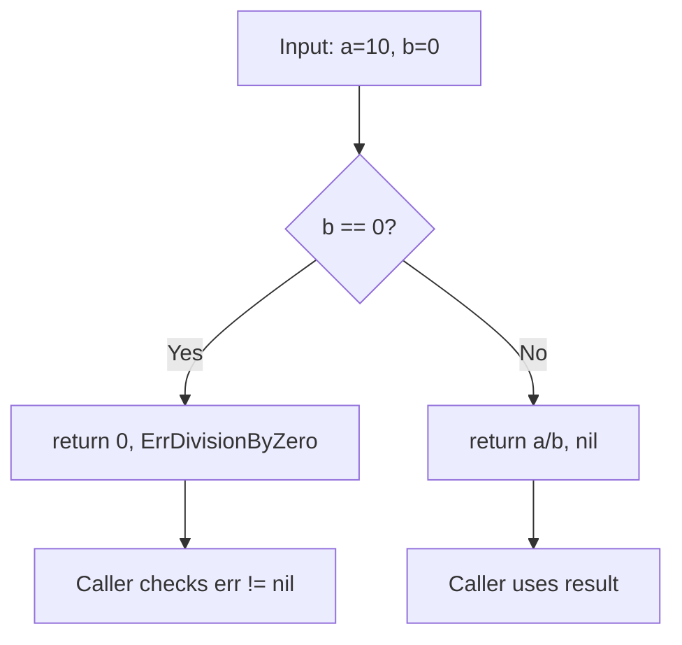
```mermaid
flowchart TD
    A["Input: a=10, b=0"] --> B{"b == 0?"}
    B -->|"Yes"| C["return 0, ErrDivisionByZero"]
    B -->|"No"| D["return a/b, nil"]
    C --> E["Caller checks err != nil"]
    D --> F["Caller uses result"]
```

**Execution Trace:**
```
Input:  a=10.0, b=0.0
Step 1: b == 0  → true
Step 2: return 0, ErrDivisionByZero
Output: 0, error("division by zero")
```

### Interviewer Questions

1. Why use a sentinel error instead of `errors.New` inline?
2. Can we improve time/space further? What's the theoretical lower bound?
3. How does this scale to 10M elements / 1M concurrent requests?
4. Walk me through the edge case where `b` is NaN.
5. How would you make this goroutine-safe?
6. What's the memory/GC impact? How would you reduce allocations?
7. How would you test this comprehensively?

### Follow-Up Questions

**Q1:** What is the difference between `errors.New` inline and a package-level sentinel?
**A1:** `errors.New` inline creates a new error value on every call, so `errors.Is` comparisons by identity will fail across calls. A package-level sentinel is allocated once; `errors.Is` uses pointer equality and works correctly.

**Q2:** Should we guard against NaN inputs?
**A2:** Depends on domain. For a math library, add `if math.IsNaN(a) || math.IsNaN(b) { return 0, ErrInvalidInput }`. For internal helpers where callers guarantee valid floats, it may be unnecessary noise.

**Q3:** Why does Go return `(value, error)` instead of throwing exceptions?
**A3:** Go treats errors as values for explicit, local handling. This eliminates hidden control flow, makes error paths visible in function signatures, and avoids the overhead of stack unwinding.

**Q4:** How would you wrap this error with context?
**A4:** `return 0, fmt.Errorf("Divide(%g, %g): %w", a, b, ErrDivisionByZero)` — adds call-site context while preserving the sentinel for `errors.Is`.

**Q5:** How do you test both the happy path and error path?
**A5:**
```go
func TestDivide(t *testing.T) {
    _, err := Divide(10, 0)
    if !errors.Is(err, ErrDivisionByZero) {
        t.Fatalf("expected ErrDivisionByZero, got %v", err)
    }
    got, err := Divide(10, 2)
    if err != nil || got != 5 {
        t.Fatalf("want 5 nil, got %v %v", got, err)
    }
}
```

---

## Q2: Custom Error Type with Fields  [Level 1 — Beginner]

> **Tags:** `#custom-error-type` `#error-interface` `#struct-error`

### Problem Statement
Define a custom error type `ValidationError` with fields `Field string` and `Message string`. Implement the `error` interface on it. Write a function `ValidateAge(age int) error` that returns a `ValidationError` when age is negative or greater than 150.

### Input / Output / Constraints

```
Input:  age = -5
Output: error{Field:"age", Message:"must be between 0 and 150"}

Input:  age = 25
Output: nil

Constraints:
  • age is int
  • Return *ValidationError (pointer receiver) so errors.As works
  • Time: O(1)
```

### Thought Process

Think like a senior Go engineer:
1. **Understand:** We need structured error data (field name + message) so callers can inspect error details programmatically.
2. **Pattern:** Custom error struct implementing `Error() string`; return as pointer so `errors.As` can unwrap.
3. **Edge cases:** age == 0 (valid), age == 150 (valid boundary), age == 151 (invalid).
4. **Approach:** Pointer receiver on `Error()` and return `*ValidationError` ensures `errors.As` matching works correctly.

### Brute Force Solution

```go
package main

import "fmt"

// bruteForce — O(1) time, O(1) space
// Returns a plain string error — loses structured data.
func bruteForce(age int) error {
    if age < 0 || age > 150 {
        return fmt.Errorf("age %d is invalid", age)
    }
    return nil
}
```

**Time:** O(1) | **Space:** O(1)
**Bottleneck:** Caller cannot programmatically inspect which field failed or extract the raw value.

### Better Solution

```go
// betterSolution — O(1) time, O(1) space
type ValidationError struct {
    Field   string
    Message string
}

func (e *ValidationError) Error() string {
    return fmt.Sprintf("validation error: %s %s", e.Field, e.Message)
}

func betterSolution(age int) error {
    if age < 0 || age > 150 {
        return &ValidationError{Field: "age", Message: "must be between 0 and 150"}
    }
    return nil
}
```

**Time:** O(1) | **Space:** O(1)

### Best / Optimal Solution

```go
package main

import (
    "errors"
    "fmt"
)

// ValidationError carries field-level detail for programmatic inspection.
type ValidationError struct {
    Field   string
    Message string
    Value   any // actual invalid value for logging
}

func (e *ValidationError) Error() string {
    return fmt.Sprintf("validation failed on field %q: %s (got %v)", e.Field, e.Message, e.Value)
}

// ValidateAge returns a *ValidationError if age is out of [0, 150].
func ValidateAge(age int) error {
    if age < 0 || age > 150 {
        return &ValidationError{
            Field:   "age",
            Message: "must be between 0 and 150",
            Value:   age,
        }
    }
    return nil
}

func main() {
    err := ValidateAge(-5)
    if err != nil {
        var ve *ValidationError
        if errors.As(err, &ve) {
            fmt.Printf("field=%s msg=%s val=%v\n", ve.Field, ve.Message, ve.Value)
        }
    }

    fmt.Println(ValidateAge(25)) // <nil>
}
```

**Time:** O(1) | **Space:** O(1)

### Production Considerations

| Aspect | Details |
|--------|---------|
| **Scalability** | Allocates one struct per error; only on error path so negligible in happy-path throughput |
| **Edge Cases** | Boundary values 0 and 150; negative zero (int has none, but worth noting for float versions) |
| **Error Handling** | Use errors.As to extract *ValidationError; never type-assert directly on interface |
| **Memory** | One heap allocation per error; pool if validation is called millions of times per second |
| **Concurrency** | Immutable after creation; goroutine-safe |

### Visual Explanation

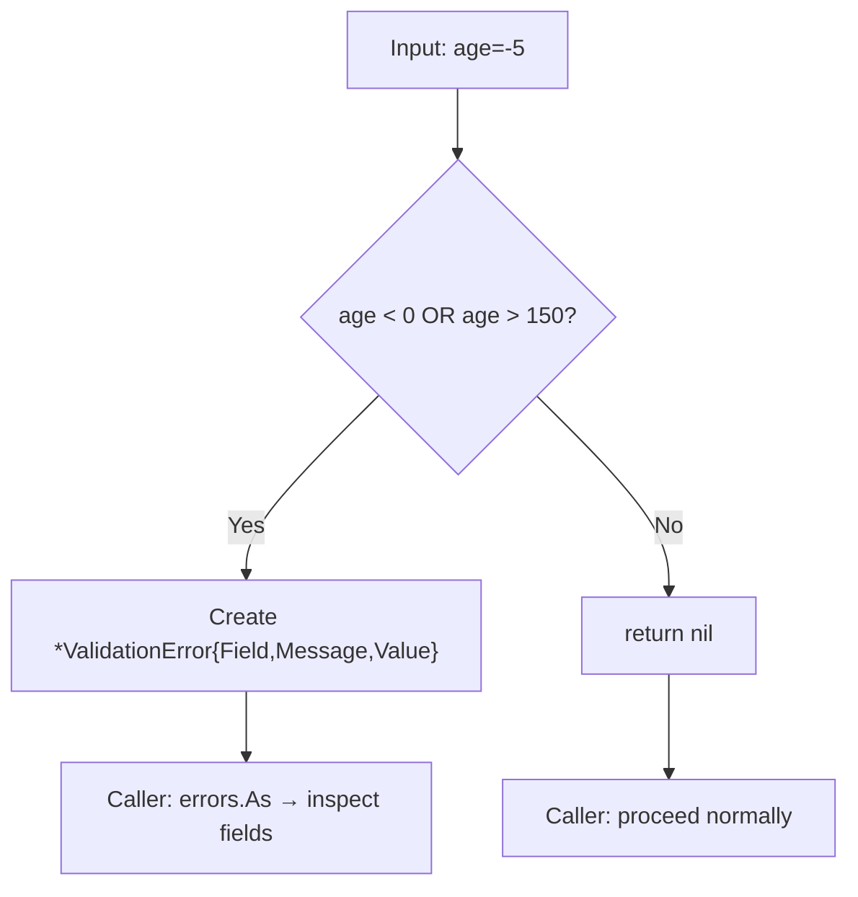
```mermaid
flowchart TD
    A["Input: age=-5"] --> B{"age < 0 OR age > 150?"}
    B -->|"Yes"| C["Create *ValidationError{Field,Message,Value}"]
    B -->|"No"| D["return nil"]
    C --> E["Caller: errors.As → inspect fields"]
    D --> F["Caller: proceed normally"]
```

**Execution Trace:**
```
Input:  age = -5
Step 1: -5 < 0  → true
Step 2: &ValidationError{Field:"age", Message:"must be...", Value:-5}
Output: error string: validation failed on field "age": must be between 0 and 150 (got -5)
```

### Interviewer Questions

1. Why return `*ValidationError` instead of `ValidationError` (value receiver)?
2. Can we improve time/space further? What's the theoretical lower bound?
3. How does this scale to 10M elements / 1M concurrent requests?
4. Walk me through the edge case where `age == 150`.
5. How would you make this goroutine-safe?
6. What's the memory/GC impact? How would you reduce allocations?
7. How would you test this comprehensively?

### Follow-Up Questions

**Q1:** Why must `Error()` have a pointer receiver for `errors.As` to work?
**A1:** `errors.As` uses reflection to match the target type. If you return `*ValidationError` but `Error()` is on `ValidationError` (value receiver), the interface wraps a pointer and `errors.As` still works — but if you accidentally return a value `ValidationError`, the interface wraps a value and `errors.As` with a `**ValidationError` target will fail. Consistent pointer receivers avoid confusion.

**Q2:** How would you validate multiple fields at once?
**A2:** Collect all errors into a slice and return a composite error type, e.g., `type ValidationErrors []*ValidationError` with `Error() string` joining all messages. Libraries like `go-playground/validator` follow this pattern.

**Q3:** How do you distinguish a `ValidationError` from other errors in a middleware?
**A3:** `errors.As(err, &ve)` returns true only if the chain contains a `*ValidationError`. Map that to HTTP 400; other errors map to 500.

**Q4:** Should you include the invalid value in the error struct?
**A4:** Yes for logging and debugging, but scrub PII before returning to external clients. Store the raw value in the struct; have a separate `UserMessage()` method that omits it.

**Q5:** How would you test boundary conditions?
**A5:**
```go
cases := []struct{ age int; wantErr bool }{
    {-1, true}, {0, false}, {150, false}, {151, true},
}
for _, c := range cases {
    err := ValidateAge(c.age)
    if (err != nil) != c.wantErr {
        t.Errorf("age=%d: wantErr=%v got %v", c.age, c.wantErr, err)
    }
}
```

---

## Q3: Sentinel Errors and errors.Is  [Level 2 — Easy]

> **Tags:** `#sentinel-errors` `#errors.Is` `#error-comparison`

### Problem Statement
Define sentinel errors `ErrNotFound`, `ErrUnauthorized`, and `ErrForbidden` in a package. Write a function `FetchResource(id int, role string) (string, error)` that returns `ErrNotFound` when `id <= 0`, `ErrUnauthorized` when `role == ""`, `ErrForbidden` when `role == "guest"`, and the resource string otherwise. Demonstrate checking with `errors.Is`.

### Input / Output / Constraints

```
Input:  id=0, role="admin"
Output: "", ErrNotFound

Input:  id=1, role="guest"
Output: "", ErrForbidden

Input:  id=1, role="admin"
Output: "resource-1", nil

Constraints:
  • id is int, role is string
  • Must use sentinel errors (not inline errors.New)
  • Callers use errors.Is for comparison — no string matching
  • Time: O(1)
```

### Thought Process

Think like a senior Go engineer:
1. **Understand:** Callers need to branch on specific error kinds without fragile string comparisons.
2. **Pattern:** Package-level sentinel errors — single allocation, identity-comparable via `errors.Is`.
3. **Edge cases:** id == 0 (boundary), empty role, role == "guest" vs "Guest" (case sensitivity).
4. **Approach:** Declare sentinels with `errors.New` at package level; return them directly (no wrapping needed here).

### Brute Force Solution

```go
package main

import "fmt"

// bruteForce — O(1) time, O(1) space
// Uses string errors — fragile, breaks on message changes.
func bruteForce(id int, role string) (string, error) {
    if id <= 0 {
        return "", fmt.Errorf("not found")
    }
    if role == "" {
        return "", fmt.Errorf("unauthorized")
    }
    if role == "guest" {
        return "", fmt.Errorf("forbidden")
    }
    return fmt.Sprintf("resource-%d", id), nil
}
```

**Time:** O(1) | **Space:** O(1)
**Bottleneck:** String error comparison is brittle; callers must do `err.Error() == "not found"` which breaks on any message change.

### Better Solution

```go
import "errors"

var (
    ErrNotFound     = errors.New("not found")
    ErrUnauthorized = errors.New("unauthorized")
    ErrForbidden    = errors.New("forbidden")
)

func betterSolution(id int, role string) (string, error) {
    if id <= 0 { return "", ErrNotFound }
    if role == "" { return "", ErrUnauthorized }
    if role == "guest" { return "", ErrForbidden }
    return fmt.Sprintf("resource-%d", id), nil
}
```

**Time:** O(1) | **Space:** O(1)

### Best / Optimal Solution

```go
package main

import (
    "errors"
    "fmt"
)

// Sentinel errors — declared once, compared by identity via errors.Is.
var (
    ErrNotFound     = errors.New("not found")
    ErrUnauthorized = errors.New("unauthorized")
    ErrForbidden    = errors.New("forbidden")
)

// FetchResource simulates a layered access-controlled resource lookup.
// O(1) time, O(1) space.
func FetchResource(id int, role string) (string, error) {
    if id <= 0 {
        return "", ErrNotFound
    }
    if role == "" {
        return "", ErrUnauthorized
    }
    if role == "guest" {
        return "", ErrForbidden
    }
    return fmt.Sprintf("resource-%d", id), nil
}

func main() {
    cases := []struct {
        id   int
        role string
    }{
        {0, "admin"},
        {1, ""},
        {1, "guest"},
        {1, "admin"},
    }

    for _, c := range cases {
        res, err := FetchResource(c.id, c.role)
        switch {
        case errors.Is(err, ErrNotFound):
            fmt.Println("404 not found")
        case errors.Is(err, ErrUnauthorized):
            fmt.Println("401 unauthorized")
        case errors.Is(err, ErrForbidden):
            fmt.Println("403 forbidden")
        case err != nil:
            fmt.Printf("unexpected error: %v\n", err)
        default:
            fmt.Println(res)
        }
    }
}
```

**Time:** O(1) | **Space:** O(1)

### Production Considerations

| Aspect | Details |
|--------|---------|
| **Scalability** | Zero allocations on every call; sentinels are shared read-only values |
| **Edge Cases** | id == 0 boundary, role case sensitivity, empty string vs whitespace-only role |
| **Error Handling** | Always use errors.Is, never compare err.Error() strings |
| **Memory** | Three one-time allocations at package init; zero per call |
| **Concurrency** | Immutable values; fully goroutine-safe |

### Visual Explanation

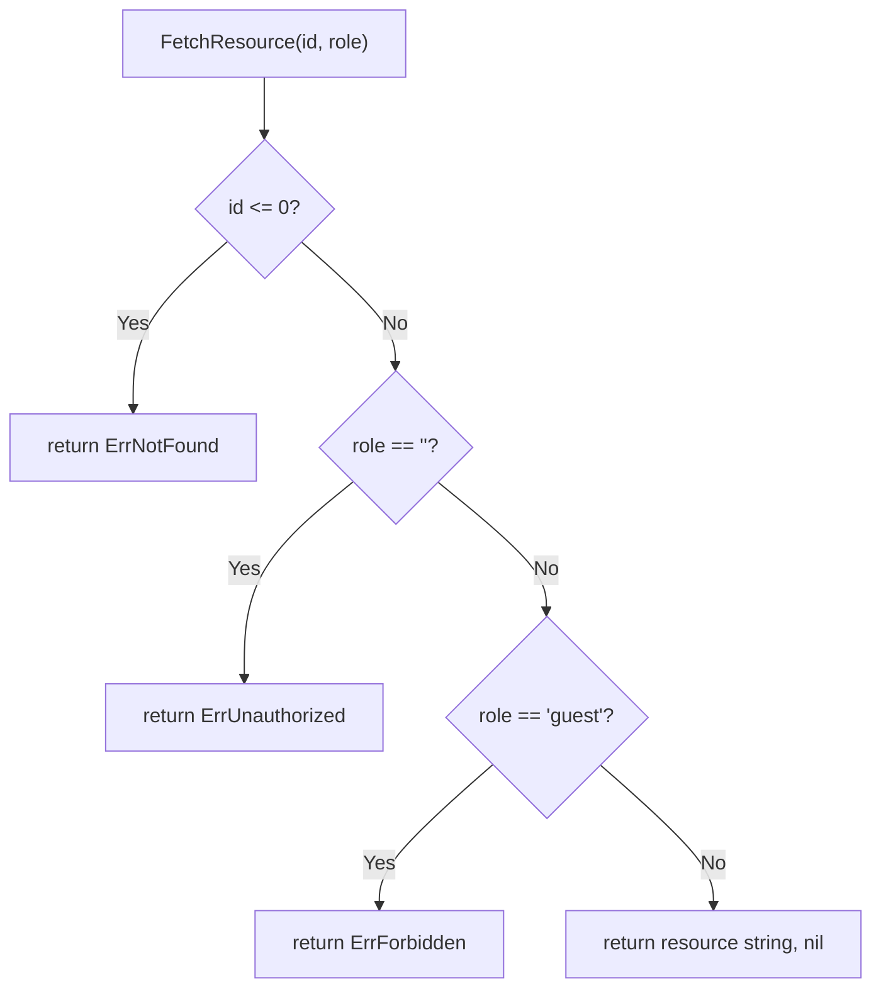
```mermaid
flowchart TD
    A["FetchResource(id, role)"] --> B{"id <= 0?"}
    B -->|"Yes"| C["return ErrNotFound"]
    B -->|"No"| D{"role == ''?"}
    D -->|"Yes"| E["return ErrUnauthorized"]
    D -->|"No"| F{"role == 'guest'?"}
    F -->|"Yes"| G["return ErrForbidden"]
    F -->|"No"| H["return resource string, nil"]
```

**Execution Trace:**
```
Input:  id=1, role="guest"
Step 1: id=1 > 0       → pass
Step 2: role != ""     → pass
Step 3: role == "guest" → true
Output: "", ErrForbidden
```

### Interviewer Questions

1. Why use `errors.Is` instead of `== ErrForbidden` directly?
2. Can we improve time/space further? What's the theoretical lower bound?
3. How does this scale to 10M elements / 1M concurrent requests?
4. Walk me through the edge case where the caller wraps ErrForbidden with fmt.Errorf %w.
5. How would you make this goroutine-safe?
6. What's the memory/GC impact? How would you reduce allocations?
7. How would you test this comprehensively?

### Follow-Up Questions

**Q1:** When would `errors.Is` return true even though `err != ErrForbidden` directly?
**A1:** When the error is wrapped: `fmt.Errorf("fetch: %w", ErrForbidden)`. The wrapped error `!=` sentinel by identity, but `errors.Is` unwraps the chain and finds it.

**Q2:** How would you map these sentinels to HTTP status codes in middleware?
**A2:**
```go
var errStatusMap = map[error]int{
    ErrNotFound:     404,
    ErrUnauthorized: 401,
    ErrForbidden:    403,
}
for sentinel, code := range errStatusMap {
    if errors.Is(err, sentinel) {
        w.WriteHeader(code)
        return
    }
}
w.WriteHeader(500)
```

**Q3:** Why not just use integer error codes like C?
**A3:** Go error values carry a human-readable message and can be extended into rich types. Integer codes require a separate lookup table and lose context. Go's approach composes better with wrapping and `errors.As`.

**Q4:** Can two different packages have sentinels with the same message string that are still distinguishable?
**A4:** Yes. `errors.New` creates a new pointer; pointer identity is what `errors.Is` checks. Two `errors.New("not found")` in different packages are different errors even with identical messages.

**Q5:** How do you test that a function returns the correct sentinel?
**A5:**
```go
_, err := FetchResource(0, "admin")
if !errors.Is(err, ErrNotFound) {
    t.Errorf("expected ErrNotFound, got %v", err)
}
```

---

## Q4: Error Wrapping with fmt.Errorf %w  [Level 2 — Easy]

> **Tags:** `#error-wrapping` `#fmt.Errorf` `#error-chain`

### Problem Statement
Write a three-layer call stack: `readConfig() error`, `loadApp() error`, and `Run() error`. Each layer should wrap the error from the layer below using `fmt.Errorf("layer: %w", err)`. At the top, unwrap the full chain using `errors.Unwrap` in a loop and print each layer's message.

### Input / Output / Constraints

```
Input:  (simulate readConfig returning errors.New("file not found"))
Output:
  Run error: loadApp: readConfig: file not found
  Unwrap chain:
    loadApp: readConfig: file not found
    readConfig: file not found
    file not found

Constraints:
  • Use %w (not %v) so the chain is unwrappable
  • Do not use third-party libraries
  • Time: O(d) where d = chain depth
```

### Thought Process

Think like a senior Go engineer:
1. **Understand:** Context must accumulate as errors bubble up; callers must still be able to inspect the root cause.
2. **Pattern:** `fmt.Errorf("context: %w", err)` creates a wrapped error; `errors.Unwrap` peels one layer at a time.
3. **Edge cases:** Wrapping nil (should be guarded), cycles in custom Unwrap (not possible with fmt.Errorf).
4. **Approach:** Use `%w` at every layer; demonstrate `errors.Is` still finds the root sentinel through the chain.

### Brute Force Solution

```go
package main

import "fmt"

// bruteForce — uses %v instead of %w; loses unwrappability
func bruteForce() error {
    base := fmt.Errorf("file not found")
    l1 := fmt.Errorf("readConfig: %v", base)  // NOT unwrappable
    l2 := fmt.Errorf("loadApp: %v", l1)
    return fmt.Errorf("Run: %v", l2)
}
```

**Time:** O(d) | **Space:** O(d)
**Bottleneck:** `errors.Is` / `errors.As` cannot traverse a `%v`-wrapped chain; root cause is undetectable programmatically.

### Better Solution

```go
// betterSolution — uses %w for proper wrapping
import (
    "errors"
    "fmt"
)

var ErrFileNotFound = errors.New("file not found")

func readConfig() error { return ErrFileNotFound }
func loadApp()   error  { return fmt.Errorf("readConfig: %w", readConfig()) }
func betterRun() error  { return fmt.Errorf("loadApp: %w", loadApp()) }
```

**Time:** O(d) | **Space:** O(d)

### Best / Optimal Solution

```go
package main

import (
    "errors"
    "fmt"
)

var ErrFileNotFound = errors.New("file not found")

func readConfig() error {
    // Simulate a config file read failure.
    return ErrFileNotFound
}

func loadApp() error {
    if err := readConfig(); err != nil {
        return fmt.Errorf("readConfig: %w", err)
    }
    return nil
}

// Run is the top-level entry point; wraps all sub-errors with context.
func Run() error {
    if err := loadApp(); err != nil {
        return fmt.Errorf("loadApp: %w", err)
    }
    return nil
}

// unwrapChain prints every layer of a wrapped error chain.
func unwrapChain(err error) {
    fmt.Println("Unwrap chain:")
    for err != nil {
        fmt.Printf("  %v\n", err)
        err = errors.Unwrap(err)
    }
}

func main() {
    err := Run()
    if err != nil {
        fmt.Printf("Run error: %v\n", err)
        unwrapChain(errors.Unwrap(err)) // skip top-level itself
        fmt.Println("Is ErrFileNotFound?", errors.Is(err, ErrFileNotFound))
    }
}
```

**Time:** O(d) | **Space:** O(d) — d is chain depth (constant here)

### Production Considerations

| Aspect | Details |
|--------|---------|
| **Scalability** | Chain depth is bounded by call stack depth; not a scalability concern |
| **Edge Cases** | Never wrap nil — always guard `if err != nil` before wrapping |
| **Error Handling** | %w preserves the chain; %v does not — choose deliberately |
| **Memory** | Each fmt.Errorf %w allocates a new wrapError struct; d allocations total |
| **Concurrency** | Immutable after creation; safe to pass across goroutines |

### Visual Explanation

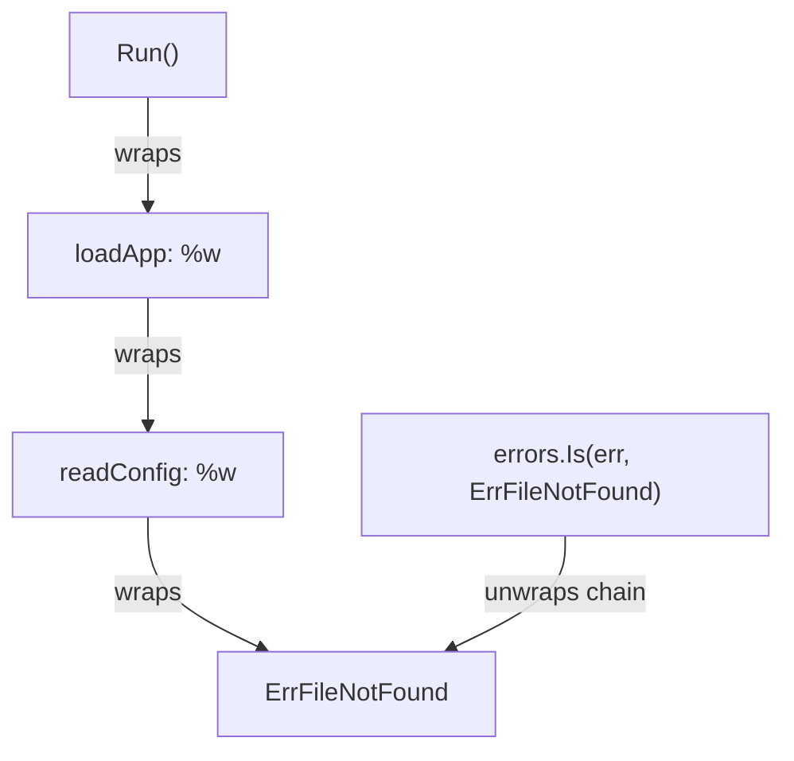
```mermaid
flowchart TD
    A["Run()"] -->|"wraps"| B["loadApp: %w"]
    B -->|"wraps"| C["readConfig: %w"]
    C -->|"wraps"| D["ErrFileNotFound"]
    E["errors.Is(err, ErrFileNotFound)"] -->|"unwraps chain"| D
```

**Execution Trace:**
```
readConfig()  → ErrFileNotFound
loadApp()     → "readConfig: file not found"  (wraps above)
Run()         → "loadApp: readConfig: file not found"  (wraps above)
errors.Is     → traverses 3 layers → finds ErrFileNotFound → true
```

### Interviewer Questions

1. Why use `%w` over `%v` when wrapping errors?
2. Can we improve time/space further? What's the theoretical lower bound?
3. How does this scale to 10M elements / 1M concurrent requests?
4. Walk me through the edge case where `readConfig` returns nil.
5. How would you make this goroutine-safe?
6. What's the memory/GC impact? How would you reduce allocations?
7. How would you test this comprehensively?

### Follow-Up Questions

**Q1:** What does `%w` do internally?
**A1:** `fmt.Errorf` with `%w` returns a `*fmt.wrapError` that implements `Unwrap() error`, returning the wrapped error. This is what `errors.Is` and `errors.As` traverse.

**Q2:** Can you wrap multiple errors in a single `fmt.Errorf`?
**A2:** Yes, since Go 1.20: `fmt.Errorf("both: %w and %w", err1, err2)` creates a multi-error that implements `Unwrap() []error`. `errors.Is` checks all branches.

**Q3:** When should you add context vs return the raw error?
**A3:** Add context at package/module boundaries. Within a single package, returning raw errors avoids noise. The rule: add context when crossing a boundary where the caller cannot infer what operation failed.

**Q4:** How does `errors.As` traverse a wrapped chain?
**A4:** It calls `Unwrap()` repeatedly and at each level tries to assign the error to the target via reflection. It stops at the first match or when `Unwrap()` returns nil.

**Q5:** How would you log the full chain in structured logging?
**A5:**
```go
for e := err; e != nil; e = errors.Unwrap(e) {
    slog.Error("chain layer", "msg", e.Error())
}
```
Or use `fmt.Sprintf("%+v", err)` with libraries like `github.com/pkg/errors` that support stack traces.

---

## Q5: errors.As for Structured Unwrapping  [Level 2 — Easy]

> **Tags:** `#errors.As` `#custom-error-type` `#unwrapping`

### Problem Statement
Define `type DBError struct { Code int; Query string; Err error }` implementing `error` and `Unwrap`. Write `QueryDB(query string) error` that wraps a sentinel `ErrConnectionRefused` inside a `DBError`. In `main`, use `errors.As` to extract the `DBError` and `errors.Is` to confirm the root cause.

### Input / Output / Constraints

```
Input:  query = "SELECT * FROM users"
Output:
  DBError: code=500 query="SELECT * FROM users"
  Root cause is ErrConnectionRefused: true

Constraints:
  • DBError must implement Unwrap() error for chain traversal
  • Use errors.As (not type assertion) to extract DBError
  • Time: O(1)
```

### Thought Process

Think like a senior Go engineer:
1. **Understand:** We need both structured metadata (DBError) and a root-cause sentinel (ErrConnectionRefused) in one chain.
2. **Pattern:** Implement `Unwrap() error` on the custom type so both `errors.Is` and `errors.As` can traverse it.
3. **Edge cases:** nil Err field in DBError (Unwrap returns nil — fine), nested DBErrors.
4. **Approach:** Return `*DBError` so `errors.As` with a `**DBError` target matches; implement `Unwrap` to expose inner Err.

### Brute Force Solution

```go
package main

import "fmt"

// bruteForce — type assertion instead of errors.As; breaks on wrapping
func bruteForce(err error) {
    if dbe, ok := err.(*DBError); ok {
        fmt.Println(dbe.Code)
    }
    // Fails if DBError is wrapped in another layer
}
```

**Time:** O(1) | **Space:** O(1)
**Bottleneck:** Type assertion only checks the outermost error; `errors.As` traverses the full chain.

### Better Solution

```go
import "errors"

func better(err error) {
    var dbe *DBError
    if errors.As(err, &dbe) { // traverses chain automatically
        fmt.Println(dbe.Code, dbe.Query)
    }
}
```

**Time:** O(d) | **Space:** O(1)

### Best / Optimal Solution

```go
package main

import (
    "errors"
    "fmt"
)

var ErrConnectionRefused = errors.New("connection refused")

// DBError wraps a low-level error with database operation context.
type DBError struct {
    Code  int
    Query string
    Err   error // inner error for chain traversal
}

func (e *DBError) Error() string {
    return fmt.Sprintf("db error code=%d query=%q: %v", e.Code, e.Query, e.Err)
}

// Unwrap allows errors.Is and errors.As to traverse the chain.
func (e *DBError) Unwrap() error { return e.Err }

// QueryDB simulates a failed database query.
func QueryDB(query string) error {
    return &DBError{
        Code:  500,
        Query: query,
        Err:   ErrConnectionRefused,
    }
}

func main() {
    err := QueryDB("SELECT * FROM users")

    var dbe *DBError
    if errors.As(err, &dbe) {
        fmt.Printf("DBError: code=%d query=%q\n", dbe.Code, dbe.Query)
    }

    fmt.Printf("Root cause is ErrConnectionRefused: %v\n",
        errors.Is(err, ErrConnectionRefused))
}
```

**Time:** O(d) | **Space:** O(1)

### Production Considerations

| Aspect | Details |
|--------|---------|
| **Scalability** | O(d) unwrap traversal where d is chain depth — negligible in practice |
| **Edge Cases** | Nil Err field (Unwrap returns nil, chain ends gracefully), nil DBError pointer |
| **Error Handling** | Always implement Unwrap when the struct wraps another error |
| **Memory** | One *DBError allocation per error; pooling rarely needed |
| **Concurrency** | Immutable struct; goroutine-safe |

### Visual Explanation

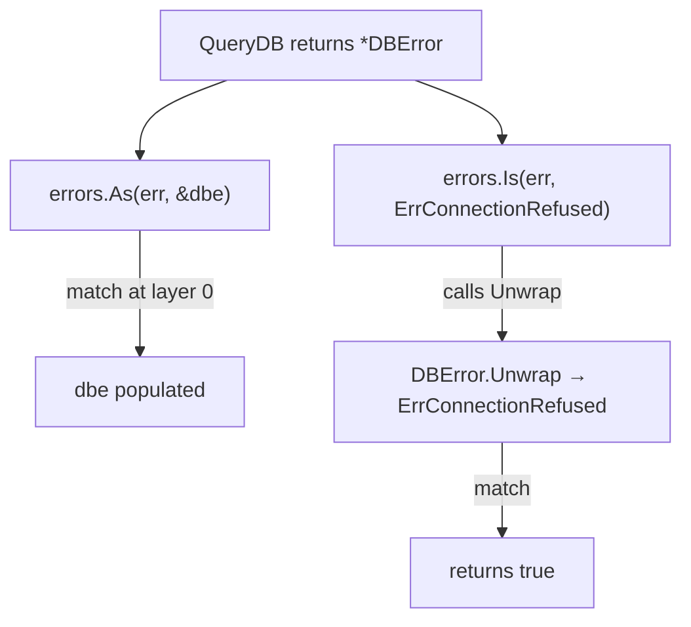
```mermaid
flowchart TD
    A["QueryDB returns *DBError"] --> B["errors.As(err, &dbe)"]
    B -->|"match at layer 0"| C["dbe populated"]
    A --> D["errors.Is(err, ErrConnectionRefused)"]
    D -->|"calls Unwrap"| E["DBError.Unwrap → ErrConnectionRefused"]
    E -->|"match"| F["returns true"]
```

**Execution Trace:**
```
Input:  query="SELECT * FROM users"
Step 1: QueryDB wraps ErrConnectionRefused in *DBError{Code:500}
Step 2: errors.As traverses → finds *DBError at depth 0 → assigns
Step 3: errors.Is traverses → DBError.Unwrap() → ErrConnectionRefused → match
Output: code=500, root=true
```

### Interviewer Questions

1. Why use `errors.As` instead of a direct type assertion?
2. Can we improve time/space further? What's the theoretical lower bound?
3. How does this scale to 10M elements / 1M concurrent requests?
4. Walk me through the edge case where DBError.Err is nil.
5. How would you make this goroutine-safe?
6. What's the memory/GC impact? How would you reduce allocations?
7. How would you test this comprehensively?

### Follow-Up Questions

**Q1:** What happens if you pass a non-pointer target to `errors.As`?
**A1:** `errors.As` panics with "errors: *target must be a non-nil pointer". Always pass `&target` where target is the concrete type pointer.

**Q2:** Can a single error satisfy both `errors.Is` and `errors.As`?
**A2:** Yes. `errors.As` extracts the struct for field access; `errors.Is` checks identity. They operate independently on the same chain.

**Q3:** How do you implement `Unwrap() []error` for multi-cause errors?
**A3:**
```go
type MultiError struct { Errs []error }
func (m *MultiError) Unwrap() []error { return m.Errs }
func (m *MultiError) Error() string   { /* join messages */ }
```
`errors.Is` and `errors.As` handle `[]error` Unwrap since Go 1.20.

**Q4:** Should `DBError.Err` be exported?
**A4:** Yes, for testability and for callers who need to inspect it directly. The field name `Err` is idiomatic in Go for the wrapped error field.

**Q5:** How do you test that `errors.As` correctly extracts a nested `DBError`?
**A5:**
```go
wrapped := fmt.Errorf("handler: %w", QueryDB("q"))
var dbe *DBError
if !errors.As(wrapped, &dbe) {
    t.Fatal("expected DBError in chain")
}
if dbe.Code != 500 { t.Errorf("want 500, got %d", dbe.Code) }
```

---

## Q6: Panic and Recover Basics  [Level 2 — Easy]

> **Tags:** `#panic` `#recover` `#defer`

### Problem Statement
Write a function `SafeDivide(a, b int) (result int, err error)` that uses `defer` + `recover` to catch a division-by-zero panic and convert it into a returned error instead of crashing the program. If `b == 0`, the function should NOT use an explicit if-guard — let the runtime panic and recover it.

### Input / Output / Constraints

```
Input:  a=10, b=0
Output: 0, error("recovered panic: runtime error: integer divide by zero")

Input:  a=10, b=2
Output: 5, nil

Constraints:
  • Do NOT add an explicit b==0 guard — demonstrate recover from runtime panic
  • recover() only works inside a deferred function
  • Time: O(1)
```

### Thought Process

Think like a senior Go engineer:
1. **Understand:** Runtime panics (integer divide-by-zero) can be caught with `recover()` inside a deferred function to convert them into errors.
2. **Pattern:** Named return values + deferred anonymous function that calls `recover()`.
3. **Edge cases:** `recover()` returns nil if no panic occurred — must guard against that. `recover()` only works directly inside a `defer`ed function, not in a function called from one.
4. **Approach:** Named returns allow the deferred function to set `err` directly.

### Brute Force Solution

```go
package main

// bruteForce — no recovery; program crashes on b==0
func bruteForce(a, b int) int {
    return a / b // panics if b==0
}
```

**Time:** O(1) | **Space:** O(1)
**Bottleneck:** Unrecovered panic crashes the entire goroutine and propagates to crash the program.

### Better Solution

```go
func betterSolution(a, b int) (result int, err error) {
    defer func() {
        if r := recover(); r != nil {
            err = fmt.Errorf("recovered panic: %v", r)
        }
    }()
    result = a / b
    return
}
```

**Time:** O(1) | **Space:** O(1)

### Best / Optimal Solution

```go
package main

import "fmt"

// SafeDivide converts a runtime divide-by-zero panic into a returned error.
// Uses defer+recover with named return values.
// O(1) time, O(1) space.
func SafeDivide(a, b int) (result int, err error) {
    defer func() {
        if r := recover(); r != nil {
            // r is the panic value — could be string, runtime.Error, etc.
            err = fmt.Errorf("recovered panic: %v", r)
            result = 0
        }
    }()
    result = a / b
    return // naked return — uses named result and err
}

func main() {
    r, err := SafeDivide(10, 0)
    fmt.Printf("result=%d err=%v\n", r, err)
    // result=0 err=recovered panic: runtime error: integer divide by zero

    r, err = SafeDivide(10, 2)
    fmt.Printf("result=%d err=%v\n", r, err)
    // result=5 err=<nil>
}
```

**Time:** O(1) | **Space:** O(1)

### Production Considerations

| Aspect | Details |
|--------|---------|
| **Scalability** | Defer has ~30ns overhead; negligible unless called billions of times |
| **Edge Cases** | b==0 (runtime panic), a==MinInt b==-1 (overflow on some platforms — no panic in Go) |
| **Error Handling** | recover() returns interface{}; cast to error or format with %v |
| **Memory** | Deferred closure captures named return variables by reference |
| **Concurrency** | recover() only affects the current goroutine; each goroutine must have its own recovery |

### Visual Explanation

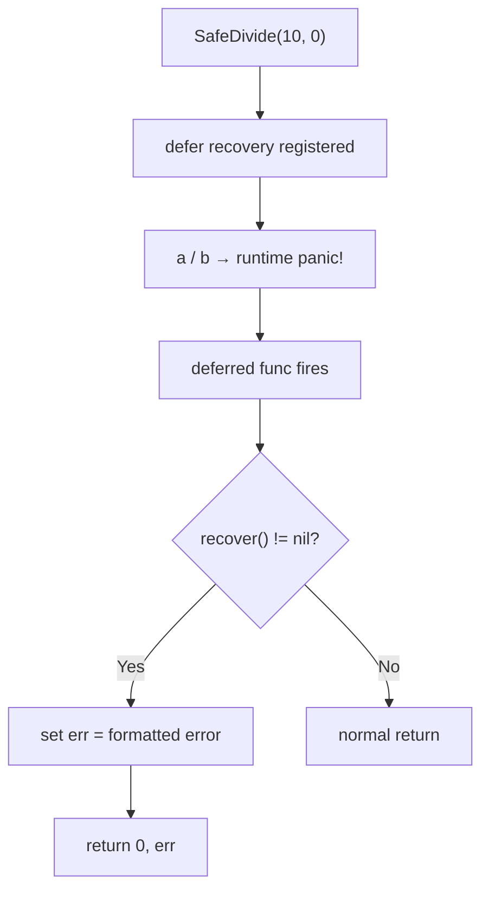
```mermaid
flowchart TD
    A["SafeDivide(10, 0)"] --> B["defer recovery registered"]
    B --> C["a / b → runtime panic!"]
    C --> D["deferred func fires"]
    D --> E{"recover() != nil?"}
    E -->|"Yes"| F["set err = formatted error"]
    E -->|"No"| G["normal return"]
    F --> H["return 0, err"]
```

**Execution Trace:**
```
Input:  a=10, b=0
Step 1: defer recovery registered
Step 2: a/b → panic "runtime error: integer divide by zero"
Step 3: deferred func runs, recover() returns runtime.Error
Step 4: err = "recovered panic: runtime error: integer divide by zero"
Output: 0, error
```

### Interviewer Questions

1. Why must `recover()` be called directly inside a `defer`ed function?
2. Can we improve time/space further? What's the theoretical lower bound?
3. How does this scale to 10M elements / 1M concurrent requests?
4. Walk me through the edge case where `recover()` returns nil.
5. How would you make this goroutine-safe?
6. What's the memory/GC impact? How would you reduce allocations?
7. How would you test this comprehensively?

### Follow-Up Questions

**Q1:** What does `recover()` return when called outside a deferred function?
**A1:** It returns nil and has no effect. The panic continues to propagate. `recover()` is only meaningful when called directly inside a `defer`ed function during a panic.

**Q2:** When is it appropriate to use panic vs returning an error?
**A2:** Use panic for truly unrecoverable programmer errors (violated invariants, nil dereferences in impossible cases). Use errors for expected failure modes. Library code should almost never panic — convert panics to errors at package boundaries.

**Q3:** Can you recover from a panic in a different goroutine?
**A3:** No. Each goroutine has its own stack; `recover()` only catches panics in the current goroutine. A panic in goroutine A will crash the program even if goroutine B has a deferred recover.

**Q4:** How do you re-panic after inspecting the value?
**A4:**
```go
defer func() {
    if r := recover(); r != nil {
        if _, ok := r.(MyPanicType); ok {
            err = fmt.Errorf("handled: %v", r)
        } else {
            panic(r) // re-panic for unknown panics
        }
    }
}()
```

**Q5:** How do you test that `SafeDivide` does not panic?
**A5:**
```go
func TestSafeDivideNoPanic(t *testing.T) {
    defer func() {
        if r := recover(); r != nil {
            t.Errorf("unexpected panic: %v", r)
        }
    }()
    _, err := SafeDivide(10, 0)
    if err == nil {
        t.Error("expected error for b=0")
    }
}
```

---
## Q7: Error Propagation Up the Call Stack  [Level 3 — Medium]

> **Tags:** `#error-propagation` `#call-stack` `#wrapping`

### Problem Statement
Implement a four-layer system: `parseJSON(data []byte) (map[string]any, error)`, `fetchData(url string) ([]byte, error)`, `processUser(url string) (string, error)`, and `HandleRequest(url string) error`. Each layer adds context via `fmt.Errorf %w`. At the top, print the full error and use `errors.Is` to check for a specific root cause `ErrInvalidJSON`.

### Input / Output / Constraints

```
Input:  url = "http://example.com/bad"
Output:
  HandleRequest: processUser: fetchData: parseJSON: invalid json: json decode failed
  Is ErrInvalidJSON: true

Constraints:
  • Four distinct wrapping layers
  • Root sentinel ErrInvalidJSON must be detectable at top
  • No third-party JSON library
  • Time: O(n) where n = data size
```

### Thought Process

Think like a senior Go engineer:
1. **Understand:** Errors must carry context from every layer they pass through while preserving the root cause for programmatic detection.
2. **Pattern:** Wrap with `%w` at every boundary; sentinel at the bottom; `errors.Is` at the top.
3. **Edge cases:** nil data to parseJSON, network error in fetchData (separate sentinel), empty URL.
4. **Approach:** Each function is responsible only for wrapping errors it receives — not for handling them.

### Brute Force Solution

```go
package main

import "fmt"

// bruteForce — returns raw errors without wrapping; callers lose context
func bruteForce(data []byte) (map[string]any, error) {
    return nil, fmt.Errorf("json decode failed") // no context, no sentinel
}
```

**Time:** O(n) | **Space:** O(n)
**Bottleneck:** No context accumulation; top-level caller cannot distinguish which layer failed or what kind of error occurred.

### Better Solution

```go
var ErrInvalidJSON = errors.New("invalid json")

func parseJSON(data []byte) (map[string]any, error) {
    var m map[string]any
    if err := json.Unmarshal(data, &m); err != nil {
        return nil, fmt.Errorf("%w: %v", ErrInvalidJSON, err)
    }
    return m, nil
}
```

**Time:** O(n) | **Space:** O(n)

### Best / Optimal Solution

```go
package main

import (
    "encoding/json"
    "errors"
    "fmt"
)

var ErrInvalidJSON = errors.New("invalid json")

func parseJSON(data []byte) (map[string]any, error) {
    var m map[string]any
    if err := json.Unmarshal(data, &m); err != nil {
        return nil, fmt.Errorf("%w: %v", ErrInvalidJSON, err)
    }
    return m, nil
}

func fetchData(url string) ([]byte, error) {
    // Simulate a bad JSON response
    data := []byte(`{bad json}`)
    if url == "" {
        return nil, fmt.Errorf("fetchData: empty url")
    }
    return data, nil
}

func processUser(url string) (string, error) {
    data, err := fetchData(url)
    if err != nil {
        return "", fmt.Errorf("fetchData: %w", err)
    }
    m, err := parseJSON(data)
    if err != nil {
        return "", fmt.Errorf("parseJSON: %w", err)
    }
    name, _ := m["name"].(string)
    return name, nil
}

// HandleRequest is the top-level entry point.
// O(n) time — dominated by JSON parsing.
func HandleRequest(url string) error {
    if _, err := processUser(url); err != nil {
        return fmt.Errorf("HandleRequest: processUser: %w", err)
    }
    return nil
}

func main() {
    err := HandleRequest("http://example.com/bad")
    if err != nil {
        fmt.Println(err)
        fmt.Printf("Is ErrInvalidJSON: %v\n", errors.Is(err, ErrInvalidJSON))
    }
}
```

**Time:** O(n) | **Space:** O(n)

### Production Considerations

| Aspect | Details |
|--------|---------|
| **Scalability** | Wrapping is O(1) per layer; JSON parsing dominates |
| **Edge Cases** | nil data, empty URL, valid JSON but missing fields, deeply nested JSON |
| **Error Handling** | Each layer wraps — never swallows. Top layer decides to log or return HTTP error |
| **Memory** | One fmt.wrapError allocation per wrapping layer |
| **Concurrency** | Stateless functions; goroutine-safe |

### Visual Explanation

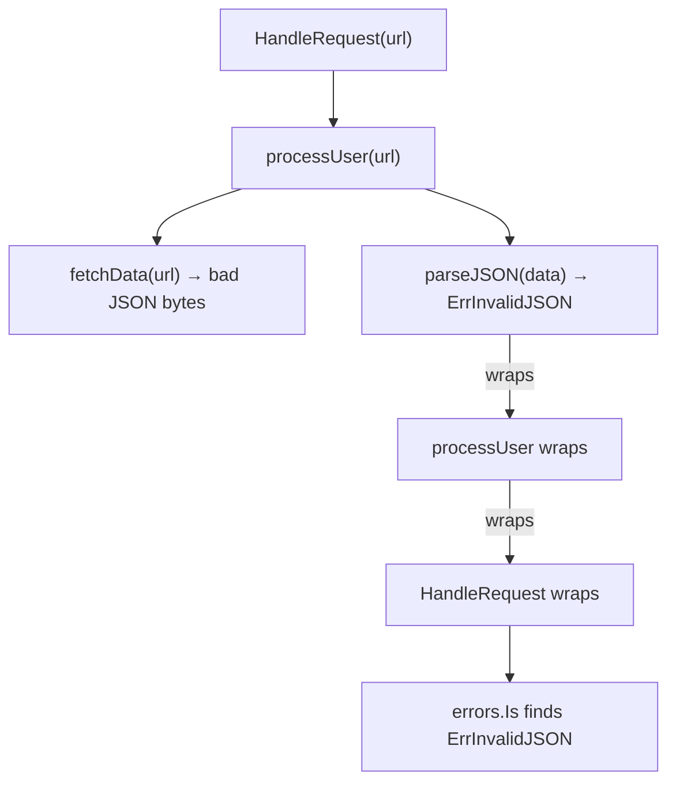
```mermaid
flowchart TD
    A["HandleRequest(url)"] --> B["processUser(url)"]
    B --> C["fetchData(url) → bad JSON bytes"]
    B --> D["parseJSON(data) → ErrInvalidJSON"]
    D -->|"wraps"| E["processUser wraps"]
    E -->|"wraps"| F["HandleRequest wraps"]
    F --> G["errors.Is finds ErrInvalidJSON"]
```

**Execution Trace:**
```
fetchData       → []byte("{bad json}")
parseJSON       → ErrInvalidJSON: json decode failed
processUser     → "parseJSON: invalid json: json decode failed"
HandleRequest   → "HandleRequest: processUser: parseJSON: invalid json: ..."
errors.Is       → traverses 3 wrappers → ErrInvalidJSON → true
```

### Interviewer Questions

1. Why not just log and return `nil` at each layer to simplify the call stack?
2. Can we improve time/space further? What's the theoretical lower bound?
3. How does this scale to 10M elements / 1M concurrent requests?
4. Walk me through the edge case where fetchData returns a network timeout error.
5. How would you make this goroutine-safe?
6. What's the memory/GC impact? How would you reduce allocations?
7. How would you test this comprehensively?

### Follow-Up Questions

**Q1:** When should a function handle an error vs propagate it?
**A1:** Handle at the point where you have enough context to take a meaningful action (retry, fallback, user-facing message). Propagate — with context — when lower layers lack that context.

**Q2:** How do you avoid redundant context strings like "parseJSON: parseJSON:"?
**A2:** Only include the function name once — at the wrapping site. The caller names the callee in the wrap message, e.g., `fmt.Errorf("parseJSON: %w", err)` in `processUser`, not in `parseJSON` itself.

**Q3:** How would you add a request ID to every error in the chain?
**A3:** Use a context-aware error: `fmt.Errorf("reqID=%s: %w", ctx.Value(reqIDKey), err)` or a custom error type that carries the request ID field.

**Q4:** How do structured logging systems handle wrapped error chains?
**A4:** Libraries like `slog` or `zap` log `err.Error()` (full string). To log individual layers, iterate with `errors.Unwrap` or use `github.com/pkg/errors` which captures stack traces.

**Q5:** How would you test that all four layers are present in the error message?
**A5:**
```go
err := HandleRequest("http://x.com")
msg := err.Error()
for _, layer := range []string{"HandleRequest", "processUser", "parseJSON", "invalid json"} {
    if !strings.Contains(msg, layer) {
        t.Errorf("missing layer %q in error: %v", layer, err)
    }
}
```

---

## Q8: Convert Panic to Error at Package Boundary  [Level 3 — Medium]

> **Tags:** `#panic-to-error` `#defer-recover` `#safe-api`

### Problem Statement
You have an unsafe third-party function `unsafeCompute(n int) int` that panics on negative input. Write a safe wrapper `SafeCompute(n int) (result int, err error)` that catches any panic and returns it as an error, leaving non-panic execution untouched. Also write a `MustCompute(n int) int` variant that re-panics with a cleaner message.

### Input / Output / Constraints

```
Input:  n = -1  (SafeCompute)
Output: 0, error("compute panicked: negative input: -1")

Input:  n = 5   (SafeCompute)
Output: 25, nil   (n²)

Input:  n = -1  (MustCompute)
Output: panic("MustCompute: negative input: -1")

Constraints:
  • Do not modify unsafeCompute
  • SafeCompute must never panic regardless of unsafeCompute's behavior
  • Time: O(1)
```

### Thought Process

Think like a senior Go engineer:
1. **Understand:** Library code must never leak panics to callers — convert them to errors at the boundary.
2. **Pattern:** Defer+recover wrapper; named returns let the deferred function set `err`.
3. **Edge cases:** Panics with non-string values (runtime.Error, custom types), double panics (impossible with single recover), n == 0.
4. **Approach:** Capture `recover()` as `interface{}`; format with `%v` to handle any type.

### Brute Force Solution

```go
package main

// bruteForce — no recovery; panic propagates to caller
func bruteForce(n int) int {
    return unsafeCompute(n)
}
```

**Time:** O(1) | **Space:** O(1)
**Bottleneck:** Any panic in `unsafeCompute` crashes the goroutine — unacceptable for a library boundary.

### Better Solution

```go
func betterSolution(n int) (result int, err error) {
    defer func() {
        if r := recover(); r != nil {
            err = fmt.Errorf("panicked: %v", r)
        }
    }()
    result = unsafeCompute(n)
    return
}
```

**Time:** O(1) | **Space:** O(1)

### Best / Optimal Solution

```go
package main

import "fmt"

// unsafeCompute is a third-party function we cannot modify.
func unsafeCompute(n int) int {
    if n < 0 {
        panic(fmt.Sprintf("negative input: %d", n))
    }
    return n * n
}

// SafeCompute wraps unsafeCompute, converting any panic into a returned error.
// O(1) time, O(1) space. Safe to call from any goroutine.
func SafeCompute(n int) (result int, err error) {
    defer func() {
        if r := recover(); r != nil {
            err = fmt.Errorf("compute panicked: %v", r)
            result = 0
        }
    }()
    result = unsafeCompute(n)
    return
}

// MustCompute panics with a cleaner message on failure.
// Appropriate for initialization code where failure is unrecoverable.
func MustCompute(n int) int {
    result, err := SafeCompute(n)
    if err != nil {
        panic(fmt.Sprintf("MustCompute: %v", err))
    }
    return result
}

func main() {
    r, err := SafeCompute(-1)
    fmt.Printf("SafeCompute(-1): result=%d err=%v\n", r, err)

    r, err = SafeCompute(5)
    fmt.Printf("SafeCompute(5): result=%d err=%v\n", r, err)

    // MustCompute — panics intentionally; demonstrate with recovery in main
    defer func() {
        if r := recover(); r != nil {
            fmt.Printf("MustCompute panicked: %v\n", r)
        }
    }()
    MustCompute(-1)
}
```

**Time:** O(1) | **Space:** O(1)

### Production Considerations

| Aspect | Details |
|--------|---------|
| **Scalability** | Defer overhead (~30ns) per call; pool wrappers if called in tight loops |
| **Edge Cases** | Panic value can be any type — always use %v not string cast |
| **Error Handling** | Log the panic value with stack trace in production using runtime/debug |
| **Memory** | Deferred closure allocates on heap; named returns avoid extra copies |
| **Concurrency** | recover() is goroutine-local; safe for concurrent use |

### Visual Explanation

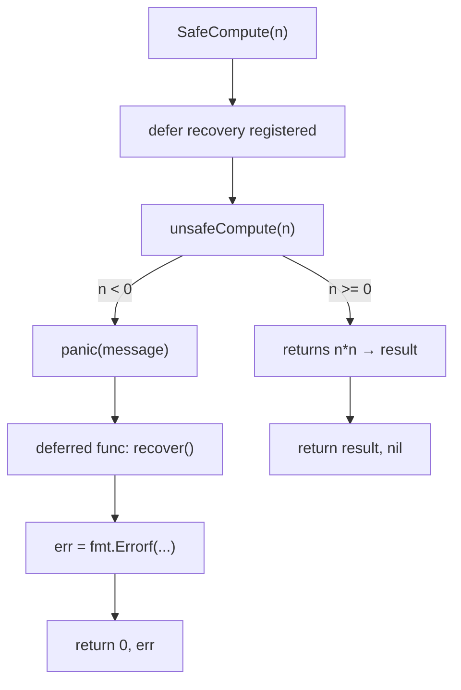
```mermaid
flowchart TD
    A["SafeCompute(n)"] --> B["defer recovery registered"]
    B --> C["unsafeCompute(n)"]
    C -->|"n >= 0"| D["returns n*n → result"]
    C -->|"n < 0"| E["panic(message)"]
    E --> F["deferred func: recover()"]
    F --> G["err = fmt.Errorf(...)"]
    D --> H["return result, nil"]
    G --> H2["return 0, err"]
```

**Execution Trace:**
```
Input:  n = -1
Step 1: defer recovery set up
Step 2: unsafeCompute(-1) → panic("negative input: -1")
Step 3: recover() = "negative input: -1"
Step 4: err = "compute panicked: negative input: -1"
Output: 0, error
```

### Interviewer Questions

1. Why use named return values in `SafeCompute`?
2. Can we improve time/space further? What's the theoretical lower bound?
3. How does this scale to 10M elements / 1M concurrent requests?
4. Walk me through the edge case where `unsafeCompute` panics with a non-string value.
5. How would you make this goroutine-safe?
6. What's the memory/GC impact? How would you reduce allocations?
7. How would you test this comprehensively?

### Follow-Up Questions

**Q1:** How do you capture a stack trace when recovering from a panic?
**A1:**
```go
import "runtime/debug"
defer func() {
    if r := recover(); r != nil {
        stack := debug.Stack()
        err = fmt.Errorf("panicked: %v\n%s", r, stack)
    }
}()
```

**Q2:** What is the `Must` pattern and when is it appropriate?
**A2:** `Must` wrappers panic on error and are appropriate for initialization code (e.g., `template.Must(template.ParseFiles(...))`) where failure means the program is misconfigured and cannot run. Never use `Must` in request handlers.

**Q3:** Can you safely recover from an out-of-memory panic?
**A3:** No. `runtime: out of memory` is a fatal error in Go; the runtime terminates the process before user code can react. `recover()` does not catch it.

**Q4:** How do you distinguish a panic from application code vs the Go runtime?
**A4:**
```go
if re, ok := r.(runtime.Error); ok {
    // runtime panic (nil deref, index out of bounds, etc.)
    _ = re
} else {
    // application panic
}
```

**Q5:** How would you test `MustCompute` panics correctly?
**A5:**
```go
func TestMustComputePanics(t *testing.T) {
    defer func() {
        if r := recover(); r == nil {
            t.Error("expected panic from MustCompute(-1)")
        }
    }()
    MustCompute(-1)
}
```

---

## Q9: Multi-Error Aggregation  [Level 3 — Medium]

> **Tags:** `#multi-error` `#error-aggregation` `#validation`

### Problem Statement
Implement `ValidateUser(name, email string, age int) error` that collects ALL validation failures (not just the first one) and returns them as a single `MultiError`. `MultiError` must implement `error`, `Unwrap() []error` (Go 1.20+), and format all messages in `Error()`. Callers should be able to use `errors.As` to extract the `MultiError`.

### Input / Output / Constraints

```
Input:  name="", email="bad", age=-1
Output: error("3 validation errors:\n  name: required\n  email: invalid format\n  age: must be >= 0")

Input:  name="Alice", email="a@b.com", age=25
Output: nil

Constraints:
  • Collect ALL errors, not just first
  • Implement Unwrap() []error for Go 1.20 multi-error support
  • Time: O(1), Space: O(k) where k = number of errors
```

### Thought Process

Think like a senior Go engineer:
1. **Understand:** Forms and APIs need to return all validation failures simultaneously, not force multiple round trips.
2. **Pattern:** Accumulate errors into a slice; wrap in a type implementing `Unwrap() []error`.
3. **Edge cases:** Zero errors (return nil not empty MultiError), single error (still use MultiError for consistency), all fields invalid.
4. **Approach:** Build `[]error` slice, only wrap in `MultiError` if len > 0.

### Brute Force Solution

```go
package main

import "fmt"

// bruteForce — returns only the FIRST error found
func bruteForce(name, email string, age int) error {
    if name == "" { return fmt.Errorf("name: required") }
    if !strings.Contains(email, "@") { return fmt.Errorf("email: invalid format") }
    if age < 0 { return fmt.Errorf("age: must be >= 0") }
    return nil
}
```

**Time:** O(1) | **Space:** O(1)
**Bottleneck:** Caller must fix one error, resubmit, discover next error — terrible UX for form validation.

### Better Solution

```go
type MultiError struct{ Errs []error }
func (m *MultiError) Error() string {
    msgs := make([]string, len(m.Errs))
    for i, e := range m.Errs { msgs[i] = "  " + e.Error() }
    return fmt.Sprintf("%d validation errors:\n%s", len(m.Errs), strings.Join(msgs, "\n"))
}
func (m *MultiError) Unwrap() []error { return m.Errs }
```

**Time:** O(k) | **Space:** O(k)

### Best / Optimal Solution

```go
package main

import (
    "errors"
    "fmt"
    "strings"
)

// MultiError holds multiple errors from a single operation.
type MultiError struct {
    Errs []error
}

func (m *MultiError) Error() string {
    msgs := make([]string, len(m.Errs))
    for i, e := range m.Errs {
        msgs[i] = "  " + e.Error()
    }
    return fmt.Sprintf("%d validation error(s):\n%s", len(m.Errs), strings.Join(msgs, "\n"))
}

// Unwrap returns the slice for errors.Is/As traversal (Go 1.20+).
func (m *MultiError) Unwrap() []error { return m.Errs }

var (
    ErrRequired      = errors.New("required")
    ErrInvalidEmail  = errors.New("invalid email format")
    ErrInvalidAge    = errors.New("age must be >= 0")
)

// ValidateUser collects all validation failures before returning.
// O(1) time (fixed number of checks), O(k) space for k errors.
func ValidateUser(name, email string, age int) error {
    var errs []error
    if name == "" {
        errs = append(errs, fmt.Errorf("name: %w", ErrRequired))
    }
    if !strings.Contains(email, "@") {
        errs = append(errs, fmt.Errorf("email: %w", ErrInvalidEmail))
    }
    if age < 0 {
        errs = append(errs, fmt.Errorf("age: %w", ErrInvalidAge))
    }
    if len(errs) == 0 {
        return nil
    }
    return &MultiError{Errs: errs}
}

func main() {
    err := ValidateUser("", "bad", -1)
    if err != nil {
        fmt.Println(err)
        fmt.Printf("Contains ErrRequired:     %v\n", errors.Is(err, ErrRequired))
        fmt.Printf("Contains ErrInvalidAge:   %v\n", errors.Is(err, ErrInvalidAge))
        fmt.Printf("Contains ErrInvalidEmail: %v\n", errors.Is(err, ErrInvalidEmail))
    }
    fmt.Println(ValidateUser("Alice", "a@b.com", 25)) // <nil>
}
```

**Time:** O(1) | **Space:** O(k)

### Production Considerations

| Aspect | Details |
|--------|---------|
| **Scalability** | Fixed k validations; O(1) per validation rule regardless of input size |
| **Edge Cases** | Zero errors → return nil (not &MultiError{}), single field with multiple rules |
| **Error Handling** | errors.Is traverses []error branches; errors.As finds first matching type |
| **Memory** | k allocations for k errors; pre-size slice with make([]error, 0, 3) to avoid realloc |
| **Concurrency** | ValidateUser is stateless; goroutine-safe |

### Visual Explanation

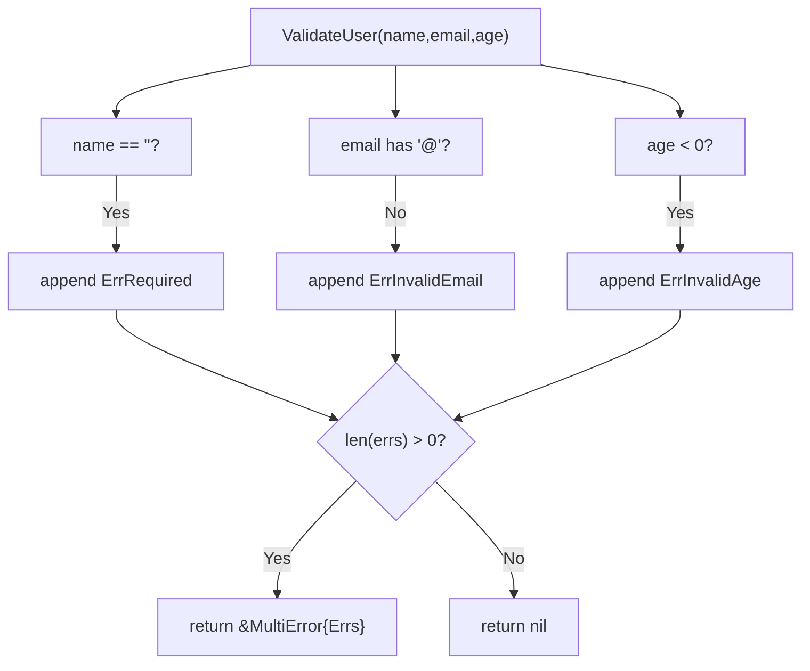
```mermaid
flowchart TD
    A["ValidateUser(name,email,age)"] --> B["name == ''?"]
    A --> C["email has '@'?"]
    A --> D["age < 0?"]
    B -->|"Yes"| E["append ErrRequired"]
    C -->|"No"| F["append ErrInvalidEmail"]
    D -->|"Yes"| G["append ErrInvalidAge"]
    E --> H{"len(errs) > 0?"}
    F --> H
    G --> H
    H -->|"Yes"| I["return &MultiError{Errs}"]
    H -->|"No"| J["return nil"]
```

**Execution Trace:**
```
name=""     → append "name: required"
email="bad" → append "email: invalid email format"
age=-1      → append "age: age must be >= 0"
len=3 > 0   → return &MultiError{3 errors}
```

### Interviewer Questions

1. Why return nil instead of `&MultiError{}` when there are no errors?
2. Can we improve time/space further? What's the theoretical lower bound?
3. How does this scale to 10M elements / 1M concurrent requests?
4. Walk me through how `errors.Is` traverses `Unwrap() []error`.
5. How would you make this goroutine-safe?
6. What's the memory/GC impact? How would you reduce allocations?
7. How would you test this comprehensively?

### Follow-Up Questions

**Q1:** How does `errors.Is` handle `Unwrap() []error` (multi-error)?
**A1:** Since Go 1.20, `errors.Is` checks if the error implements `Unwrap() []error`. If so, it recursively calls `errors.Is` on each element in the slice, traversing all branches of the error tree.

**Q2:** How would you serialize `MultiError` to JSON for an API response?
**A2:**
```go
type APIError struct {
    Errors []string `json:"errors"`
}
var me *MultiError
if errors.As(err, &me) {
    msgs := make([]string, len(me.Errs))
    for i, e := range me.Errs { msgs[i] = e.Error() }
    json.NewEncoder(w).Encode(APIError{Errors: msgs})
}
```

**Q3:** How would you add field-level error grouping?
**A3:** Change `Errs []error` to `Errs map[string][]error` keyed by field name. Add a `AddFieldError(field string, err error)` method. This maps cleanly to JSON API error objects.

**Q4:** What's the difference between `errors.Join` (Go 1.20) and `MultiError`?
**A4:** `errors.Join(errs...)` creates a built-in multi-error with `Unwrap() []error`. `MultiError` is a custom type that adds fields, custom formatting, and `errors.As` compatibility. Use `errors.Join` for simple aggregation; custom type for rich structured errors.

**Q5:** How do you test that all three sentinels are present in the MultiError?
**A5:**
```go
err := ValidateUser("", "bad", -1)
for _, sentinel := range []error{ErrRequired, ErrInvalidEmail, ErrInvalidAge} {
    if !errors.Is(err, sentinel) {
        t.Errorf("expected %v in error chain", sentinel)
    }
}
```

---

## Q10: Retry with Exponential Backoff and Error Classification  [Level 3 — Medium]

> **Tags:** `#retry` `#error-classification` `#backoff`

### Problem Statement
Implement `Retry(ctx context.Context, maxAttempts int, fn func() error) error` that retries `fn` on transient errors (classified by `IsTransient(err error) bool`) using exponential backoff starting at 100ms, doubling each attempt. Non-transient errors return immediately. If all attempts fail, return a `RetryError` wrapping the last error with attempt count.

### Input / Output / Constraints

```
Input:  maxAttempts=3, fn always returns ErrTimeout (transient)
Output: RetryError{Attempts:3, Err: ErrTimeout}

Input:  maxAttempts=3, fn returns ErrInvalidInput (non-transient)
Output: ErrInvalidInput (immediate, no retry)

Constraints:
  • 1 ≤ maxAttempts ≤ 10
  • Initial backoff: 100ms, doubles each attempt, capped at 30s
  • Context cancellation must abort retries immediately
  • Time: O(maxAttempts), Space: O(1)
```

### Thought Process

Think like a senior Go engineer:
1. **Understand:** Transient failures (network hiccups, rate limits) should be retried; permanent failures (bad input, auth) should not.
2. **Pattern:** Retry loop with exponential backoff; context-aware sleep using `select`; error classification.
3. **Edge cases:** Context cancelled before first attempt, fn succeeds on second attempt, maxAttempts == 1.
4. **Approach:** Classify errors before deciding to retry; use `time.After` with `select` for cancellable backoff.

### Brute Force Solution

```go
package main

import "time"

// bruteForce — fixed delay, no context, no error classification
func bruteForce(maxAttempts int, fn func() error) error {
    var err error
    for i := 0; i < maxAttempts; i++ {
        err = fn()
        if err == nil { return nil }
        time.Sleep(100 * time.Millisecond) // always retries, always fixed delay
    }
    return err
}
```

**Time:** O(maxAttempts) | **Space:** O(1)
**Bottleneck:** Retries non-transient errors wastefully; ignores context cancellation; fixed delay wastes time.

### Better Solution

```go
func betterSolution(ctx context.Context, maxAttempts int, fn func() error) error {
    backoff := 100 * time.Millisecond
    var lastErr error
    for i := 0; i < maxAttempts; i++ {
        if err := fn(); err == nil { return nil } else { lastErr = err }
        if !IsTransient(lastErr) { return lastErr }
        select {
        case <-ctx.Done(): return ctx.Err()
        case <-time.After(backoff):
        }
        backoff *= 2
    }
    return lastErr
}
```

**Time:** O(maxAttempts) | **Space:** O(1)

### Best / Optimal Solution

```go
package main

import (
    "context"
    "errors"
    "fmt"
    "time"
)

var (
    ErrTimeout      = errors.New("timeout")
    ErrRateLimit    = errors.New("rate limited")
    ErrInvalidInput = errors.New("invalid input")
)

// IsTransient returns true for errors that may succeed on retry.
func IsTransient(err error) bool {
    return errors.Is(err, ErrTimeout) || errors.Is(err, ErrRateLimit)
}

// RetryError wraps the last error with metadata about retry attempts.
type RetryError struct {
    Attempts int
    Err      error
}

func (e *RetryError) Error() string {
    return fmt.Sprintf("failed after %d attempt(s): %v", e.Attempts, e.Err)
}
func (e *RetryError) Unwrap() error { return e.Err }

const maxBackoff = 30 * time.Second

// Retry executes fn up to maxAttempts times with exponential backoff.
// Returns immediately on non-transient errors.
// O(maxAttempts) time, O(1) space.
func Retry(ctx context.Context, maxAttempts int, fn func() error) error {
    if maxAttempts <= 0 {
        return errors.New("maxAttempts must be > 0")
    }
    backoff := 100 * time.Millisecond
    var lastErr error
    for attempt := 1; attempt <= maxAttempts; attempt++ {
        // Check context before each attempt
        if err := ctx.Err(); err != nil {
            return err
        }
        lastErr = fn()
        if lastErr == nil {
            return nil
        }
        if !IsTransient(lastErr) {
            return lastErr // fail fast on permanent errors
        }
        if attempt == maxAttempts {
            break // no sleep after last attempt
        }
        // Cancellable backoff sleep
        select {
        case <-ctx.Done():
            return ctx.Err()
        case <-time.After(backoff):
        }
        backoff *= 2
        if backoff > maxBackoff {
            backoff = maxBackoff
        }
    }
    return &RetryError{Attempts: maxAttempts, Err: lastErr}
}

func main() {
    ctx := context.Background()

    // Always transient — exhausts retries
    calls := 0
    err := Retry(ctx, 3, func() error {
        calls++
        return ErrTimeout
    })
    fmt.Printf("transient: %v (calls=%d)\n", err, calls)

    // Non-transient — returns immediately
    calls = 0
    err = Retry(ctx, 3, func() error {
        calls++
        return ErrInvalidInput
    })
    fmt.Printf("permanent: %v (calls=%d)\n", err, calls)

    // Succeeds on second attempt
    calls = 0
    err = Retry(ctx, 3, func() error {
        calls++
        if calls < 2 { return ErrTimeout }
        return nil
    })
    fmt.Printf("eventual success: %v (calls=%d)\n", err, calls)
}
```

**Time:** O(maxAttempts) | **Space:** O(1)

### Production Considerations

| Aspect | Details |
|--------|---------|
| **Scalability** | Add jitter to backoff to avoid thundering herd: `backoff + rand.Int63n(int64(backoff/2))` |
| **Edge Cases** | maxAttempts=1 (no retries), context already cancelled, fn panics (wrap in SafeCompute) |
| **Error Handling** | RetryError.Unwrap preserves root cause for errors.Is/As callers |
| **Memory** | O(1) — no error accumulation; only last error retained |
| **Concurrency** | Stateless; goroutine-safe; each call maintains own backoff state |

### Visual Explanation

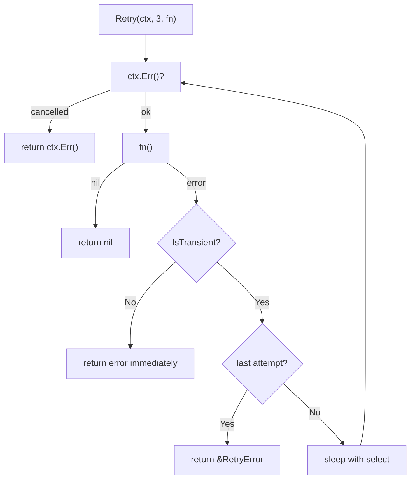
```mermaid
flowchart TD
    A["Retry(ctx, 3, fn)"] --> B["ctx.Err()?"]
    B -->|"cancelled"| C["return ctx.Err()"]
    B -->|"ok"| D["fn()"]
    D -->|"nil"| E["return nil"]
    D -->|"error"| F{"IsTransient?"}
    F -->|"No"| G["return error immediately"]
    F -->|"Yes"| H{"last attempt?"}
    H -->|"Yes"| I["return &RetryError"]
    H -->|"No"| J["sleep with select"]
    J --> B
```

**Execution Trace:**
```
attempt=1: fn() → ErrTimeout (transient) → sleep 100ms
attempt=2: fn() → ErrTimeout (transient) → sleep 200ms
attempt=3: fn() → ErrTimeout (transient) → last attempt
Output: RetryError{Attempts:3, Err:ErrTimeout}
```

### Interviewer Questions

1. How do you prevent thundering herd when many goroutines retry simultaneously?
2. Can we improve time/space further? What's the theoretical lower bound?
3. How does this scale to 10M elements / 1M concurrent requests?
4. Walk me through the edge case where context is cancelled during the backoff sleep.
5. How would you make this goroutine-safe?
6. What's the memory/GC impact? How would you reduce allocations?
7. How would you test this comprehensively?

### Follow-Up Questions

**Q1:** How do you add jitter to prevent thundering herd?
**A1:**
```go
jitter := time.Duration(rand.Int63n(int64(backoff / 2)))
time.Sleep(backoff + jitter)
```
Full jitter or decorrelated jitter strategies are described in AWS's exponential backoff article.

**Q2:** How would you make retry configurable (backoff strategy, jitter, max backoff)?
**A2:**
```go
type RetryConfig struct {
    MaxAttempts int
    InitialDelay time.Duration
    MaxDelay time.Duration
    Multiplier float64
    Jitter bool
}
```
Pass `RetryConfig` to `Retry` and compute each sleep duration from the config.

**Q3:** How do you test retry behavior without actual sleeps in unit tests?
**A3:** Inject a `sleep func(time.Duration)` parameter. In tests, pass a no-op or record-calls function. In production, pass `time.Sleep`.

**Q4:** Should `RetryError` implement `Is(target error) bool`?
**A4:** Only if you want `errors.Is(retryErr, ErrRetryExhausted)` to work for a sentinel. Otherwise `Unwrap()` is sufficient to let callers check the root cause.

**Q5:** How would you track retry metrics (attempt count, total delay) for observability?
**A5:** Accept a `metrics.Counter` or pass a callback `onRetry func(attempt int, err error, delay time.Duration)`. Call it before each sleep. This keeps `Retry` decoupled from any specific metrics library.

---
## Q11: HTTP Middleware Error Handler  [Level 4 — Advanced]

> **Tags:** `#http-middleware` `#error-mapping` `#production-pattern`

### Problem Statement
Build an HTTP error handling middleware for a Go web service. Define an `AppError` type with `Code int`, `Message string`, and `Err error`. Implement a `Handler` type `func(w http.ResponseWriter, r *http.Request) error`. Write a `WrapHandler(h Handler) http.HandlerFunc` middleware that calls `h`, maps `AppError` codes to HTTP status codes, logs unexpected errors, and always returns a JSON response body `{"error": "..."}`.

### Input / Output / Constraints

```
Input:  GET /resource → handler returns AppError{Code:404, Message:"user not found"}
Output: HTTP 404, body: {"error":"user not found"}

Input:  GET /resource → handler returns unexpected errors.New("db down")
Output: HTTP 500, body: {"error":"internal server error"} (safe message)

Input:  GET /resource → handler returns nil
Output: HTTP 200 (passthrough)

Constraints:
  • AppError.Code must map to HTTP status
  • Never leak internal error details on 500
  • Log unexpected errors with request context
  • Time: O(1) per request
```

### Thought Process

Think like a senior Go engineer:
1. **Understand:** Handlers return typed errors; middleware maps them to HTTP responses without coupling handler logic to HTTP.
2. **Pattern:** Custom handler type returning error; middleware uses `errors.As` to detect `AppError`; fallback for unknown errors.
3. **Edge cases:** nil error (200), AppError with Code 0 (default to 500), panic in handler (add recover layer), concurrent requests.
4. **Approach:** Layered: recover → error extraction → HTTP mapping → JSON response.

### Brute Force Solution

```go
package main

import "net/http"

// bruteForce — error handling in every handler; no centralization
func UserHandler(w http.ResponseWriter, r *http.Request) {
    // each handler repeats this boilerplate
    user, err := getUser(r.Context(), "123")
    if err != nil {
        http.Error(w, err.Error(), 500) // leaks internal messages!
        return
    }
    _ = user
}
```

**Time:** O(1) | **Space:** O(1)
**Bottleneck:** Every handler duplicates error-to-HTTP mapping; internal errors leak to clients; no structured logging.

### Better Solution

```go
type Handler func(w http.ResponseWriter, r *http.Request) error

func WrapHandler(h Handler) http.HandlerFunc {
    return func(w http.ResponseWriter, r *http.Request) {
        if err := h(w, r); err != nil {
            http.Error(w, err.Error(), 500)
        }
    }
}
```

**Time:** O(1) | **Space:** O(1)

### Best / Optimal Solution

```go
package main

import (
    "encoding/json"
    "errors"
    "fmt"
    "log/slog"
    "net/http"
)

// AppError is a typed error that maps to an HTTP status code.
type AppError struct {
    Code    int    // HTTP status code
    Message string // safe user-facing message
    Err     error  // internal cause for logging
}

func (e *AppError) Error() string { return fmt.Sprintf("[%d] %s", e.Code, e.Message) }
func (e *AppError) Unwrap() error { return e.Err }

// Handler is a Go HTTP handler that returns an error.
type Handler func(w http.ResponseWriter, r *http.Request) error

type errorResponse struct {
    Error string `json:"error"`
}

func writeJSON(w http.ResponseWriter, status int, msg string) {
    w.Header().Set("Content-Type", "application/json")
    w.WriteHeader(status)
    _ = json.NewEncoder(w).Encode(errorResponse{Error: msg})
}

// WrapHandler adapts a Handler to http.HandlerFunc with centralized error handling.
// O(1) time per request. Goroutine-safe.
func WrapHandler(h Handler) http.HandlerFunc {
    return func(w http.ResponseWriter, r *http.Request) {
        // Layer 1: recover from any panic
        defer func() {
            if rec := recover(); rec != nil {
                slog.ErrorContext(r.Context(), "panic in handler",
                    "panic", fmt.Sprintf("%v", rec),
                    "path", r.URL.Path,
                )
                writeJSON(w, http.StatusInternalServerError, "internal server error")
            }
        }()

        err := h(w, r)
        if err == nil {
            return // success
        }

        // Layer 2: check for typed AppError
        var appErr *AppError
        if errors.As(err, &appErr) {
            writeJSON(w, appErr.Code, appErr.Message)
            return
        }

        // Layer 3: unexpected error — log internal, return safe message
        slog.ErrorContext(r.Context(), "unhandled error",
            "error", err,
            "path", r.URL.Path,
        )
        writeJSON(w, http.StatusInternalServerError, "internal server error")
    }
}

// Example handler using the pattern.
func userHandler(w http.ResponseWriter, r *http.Request) error {
    id := r.URL.Query().Get("id")
    if id == "" {
        return &AppError{Code: 400, Message: "id is required", Err: errors.New("missing id param")}
    }
    if id == "99" {
        return &AppError{Code: 404, Message: "user not found", Err: fmt.Errorf("no user with id %s", id)}
    }
    _, _ = fmt.Fprintf(w, `{"id":%q}`, id)
    return nil
}

func main() {
    mux := http.NewServeMux()
    mux.HandleFunc("/user", WrapHandler(userHandler))
    fmt.Println("Server on :8080")
    _ = http.ListenAndServe(":8080", mux)
}
```

**Time:** O(1) | **Space:** O(1) per request

### Production Considerations

| Aspect | Details |
|--------|---------|
| **Scalability** | Middleware adds one errors.As call per request; negligible at any RPS |
| **Edge Cases** | nil error (return early), panic (recover layer), AppError.Code==0 (default to 500) |
| **Error Handling** | Never expose internal error text to clients; always log with request ID |
| **Memory** | One AppError allocation per error path; encoding/json allocates for response body |
| **Concurrency** | Goroutine-safe; each request has its own stack and response writer |

### Visual Explanation

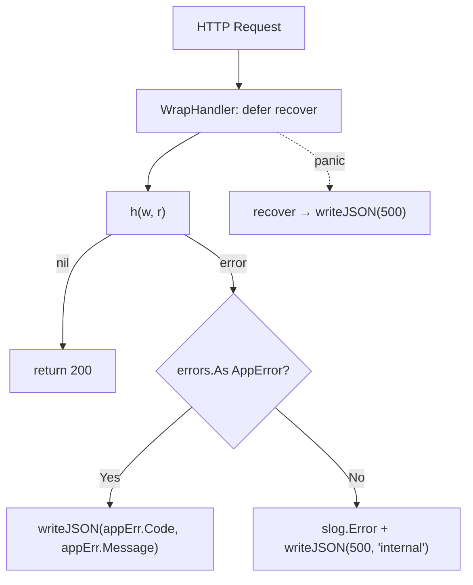
```mermaid
flowchart TD
    A["HTTP Request"] --> B["WrapHandler: defer recover"]
    B --> C["h(w, r)"]
    C -->|"nil"| D["return 200"]
    C -->|"error"| E{"errors.As AppError?"}
    E -->|"Yes"| F["writeJSON(appErr.Code, appErr.Message)"]
    E -->|"No"| G["slog.Error + writeJSON(500, 'internal')"]
    B -.->|"panic"| H["recover → writeJSON(500)"]
```

**Execution Trace:**
```
GET /user?id=99
Step 1: WrapHandler calls userHandler
Step 2: userHandler returns AppError{Code:404, Message:"user not found"}
Step 3: errors.As → *AppError match
Step 4: writeJSON(404, "user not found")
Output: HTTP 404 {"error":"user not found"}
```

### Interviewer Questions

1. Why define a custom `Handler` type instead of using `http.HandlerFunc` directly?
2. Can we improve time/space further? What's the theoretical lower bound?
3. How does this scale to 10M elements / 1M concurrent requests?
4. Walk me through the edge case where the handler panics after writing part of the response.
5. How would you make this goroutine-safe?
6. What's the memory/GC impact? How would you reduce allocations?
7. How would you test this comprehensively?

### Follow-Up Questions

**Q1:** What happens if the handler writes to `w` before returning an error?
**A1:** HTTP headers are already sent; you cannot change the status code. Guard with `http.ResponseWriter` wrappers that track whether `WriteHeader` was called:
```go
type statusRecorder struct {
    http.ResponseWriter
    written bool
}
func (s *statusRecorder) WriteHeader(code int) {
    s.written = true
    s.ResponseWriter.WriteHeader(code)
}
```
Only call `writeJSON` if `!recorder.written`.

**Q2:** How would you add a request ID to every error log?
**A2:** Extract the request ID from `r.Header.Get("X-Request-ID")` or from context. Use `slog.ErrorContext(r.Context(), ...)` with a context that carries the request ID as a `slog.Attr`.

**Q3:** How do you test `WrapHandler` without starting a real HTTP server?
**A3:** Use `httptest.NewRecorder()` and `httptest.NewRequest`:
```go
w := httptest.NewRecorder()
r := httptest.NewRequest("GET", "/user?id=99", nil)
WrapHandler(userHandler)(w, r)
if w.Code != 404 { t.Errorf("want 404, got %d", w.Code) }
```

**Q4:** How would you add rate limiting as another middleware layer?
**A4:** Wrap `WrapHandler(h)` in a rate-limit middleware. Each middleware wraps the next, forming a chain. Use `golang.org/x/time/rate` for a token bucket limiter that returns `AppError{Code:429}` when the limit is exceeded.

**Q5:** How do you ensure the panic recovery middleware fires before a response is written?
**A5:** Register `defer` at the very start of `WrapHandler` before any call to `h`. Since `defer` fires in LIFO order, the recovery fires even if inner defers also run.

---

## Q12: Database Transaction with Error Rollback  [Level 4 — Advanced]

> **Tags:** `#database` `#transaction` `#defer-rollback` `#error-handling`

### Problem Statement
Implement `TransferFunds(db *sql.DB, fromID, toID int, amount float64) error` that executes a database transaction to debit `fromID` and credit `toID`. Use `defer` to rollback on any error. Wrap all database errors with context. Define custom `InsufficientFundsError` and `AccountNotFoundError` types that callers can detect with `errors.As`.

### Input / Output / Constraints

```
Input:  fromID=1, toID=2, amount=500.00
Output: nil (on success)

Input:  fromID=1, toID=2, amount=99999.00 (balance=100)
Output: InsufficientFundsError{AccountID:1, Balance:100, Amount:99999}

Input:  fromID=99 (nonexistent), toID=2, amount=100
Output: AccountNotFoundError{AccountID:99}

Constraints:
  • Must be atomic — either both debit and credit happen or neither
  • Rollback must fire on any error, including panics
  • Time: O(1) DB round trips = 3 (begin, debit, credit, commit)
```

### Thought Process

Think like a senior Go engineer:
1. **Understand:** Fund transfer is a critical transaction — any partial failure must be rolled back atomically.
2. **Pattern:** `db.Begin()` → deferred rollback → operations → `tx.Commit()` → check rollback error.
3. **Edge cases:** Insufficient funds (check before debit), account not found (sql.ErrNoRows), network failure mid-transaction, concurrent transfers causing deadlock.
4. **Approach:** Defer `tx.Rollback()` immediately after `db.Begin()`; it's a no-op after successful commit.

### Brute Force Solution

```go
package main

import "database/sql"

// bruteForce — no transaction; partial failure leaves DB inconsistent
func bruteForce(db *sql.DB, from, to int, amount float64) error {
    _, err := db.Exec("UPDATE accounts SET balance = balance - ? WHERE id = ?", amount, from)
    if err != nil { return err }
    _, err = db.Exec("UPDATE accounts SET balance = balance + ? WHERE id = ?", amount, to)
    return err // if this fails, from is already debited!
}
```

**Time:** O(1) | **Space:** O(1)
**Bottleneck:** Non-atomic — a failure on the second UPDATE leaves the database in an inconsistent state with money lost.

### Better Solution

```go
func betterSolution(db *sql.DB, from, to int, amount float64) (err error) {
    tx, err := db.Begin()
    if err != nil { return fmt.Errorf("begin tx: %w", err) }
    defer func() {
        if err != nil { tx.Rollback() } // rollback only on error
    }()
    // ... operations ...
    return tx.Commit()
}
```

**Time:** O(1) | **Space:** O(1)

### Best / Optimal Solution

```go
package main

import (
    "context"
    "database/sql"
    "errors"
    "fmt"
)

// InsufficientFundsError is returned when an account lacks balance.
type InsufficientFundsError struct {
    AccountID int
    Balance   float64
    Amount    float64
}

func (e *InsufficientFundsError) Error() string {
    return fmt.Sprintf("insufficient funds: account %d has %.2f, need %.2f",
        e.AccountID, e.Balance, e.Amount)
}

// AccountNotFoundError is returned when an account does not exist.
type AccountNotFoundError struct {
    AccountID int
}

func (e *AccountNotFoundError) Error() string {
    return fmt.Sprintf("account not found: id %d", e.AccountID)
}

// getBalance reads the balance for accountID within the transaction.
func getBalance(ctx context.Context, tx *sql.Tx, accountID int) (float64, error) {
    var balance float64
    err := tx.QueryRowContext(ctx,
        "SELECT balance FROM accounts WHERE id = ?", accountID,
    ).Scan(&balance)
    if errors.Is(err, sql.ErrNoRows) {
        return 0, &AccountNotFoundError{AccountID: accountID}
    }
    if err != nil {
        return 0, fmt.Errorf("getBalance(%d): %w", accountID, err)
    }
    return balance, nil
}

// TransferFunds moves amount from fromID to toID atomically.
// Defers rollback; returns typed errors for business rule violations.
// O(1) time (constant DB round trips), O(1) space.
func TransferFunds(ctx context.Context, db *sql.DB, fromID, toID int, amount float64) (err error) {
    if amount <= 0 {
        return fmt.Errorf("amount must be positive, got %.2f", amount)
    }

    tx, err := db.BeginTx(ctx, nil)
    if err != nil {
        return fmt.Errorf("TransferFunds begin: %w", err)
    }
    // Defer rollback — no-op if Commit succeeds; rolls back on any error.
    defer func() {
        if err != nil {
            if rbErr := tx.Rollback(); rbErr != nil && !errors.Is(rbErr, sql.ErrTxDone) {
                err = fmt.Errorf("rollback failed (%v) after: %w", rbErr, err)
            }
        }
    }()

    // Check source balance.
    balance, err := getBalance(ctx, tx, fromID)
    if err != nil {
        return fmt.Errorf("TransferFunds: %w", err)
    }
    if balance < amount {
        err = &InsufficientFundsError{AccountID: fromID, Balance: balance, Amount: amount}
        return fmt.Errorf("TransferFunds: %w", err)
    }

    // Debit source.
    if _, err = tx.ExecContext(ctx,
        "UPDATE accounts SET balance = balance - ? WHERE id = ?", amount, fromID,
    ); err != nil {
        return fmt.Errorf("debit account %d: %w", fromID, err)
    }

    // Verify destination exists.
    if _, err = getBalance(ctx, tx, toID); err != nil {
        return fmt.Errorf("TransferFunds: %w", err)
    }

    // Credit destination.
    if _, err = tx.ExecContext(ctx,
        "UPDATE accounts SET balance = balance + ? WHERE id = ?", amount, toID,
    ); err != nil {
        return fmt.Errorf("credit account %d: %w", toID, err)
    }

    if err = tx.Commit(); err != nil {
        return fmt.Errorf("TransferFunds commit: %w", err)
    }
    return nil
}

func main() {
    // Demo (requires a real DB; shown for API illustration)
    fmt.Println("TransferFunds API ready")
}
```

**Time:** O(1) | **Space:** O(1)

### Production Considerations

| Aspect | Details |
|--------|---------|
| **Scalability** | Add SELECT FOR UPDATE / row-level locking to prevent race conditions under concurrency |
| **Edge Cases** | amount <= 0, fromID == toID, sql.ErrNoRows, context deadline exceeded mid-tx |
| **Error Handling** | Rollback error is appended to original error, not swallowed |
| **Memory** | Two custom error allocations at most per failed transfer |
| **Concurrency** | Each transaction is isolated; deadlock prevention requires consistent lock ordering |

### Visual Explanation

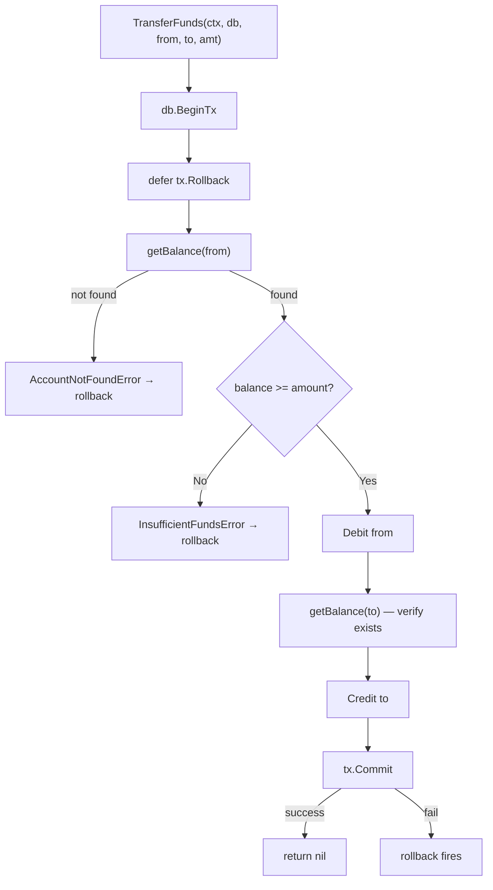
```mermaid
flowchart TD
    A["TransferFunds(ctx, db, from, to, amt)"] --> B["db.BeginTx"]
    B --> C["defer tx.Rollback"]
    C --> D["getBalance(from)"]
    D -->|"not found"| E["AccountNotFoundError → rollback"]
    D -->|"found"| F{"balance >= amount?"}
    F -->|"No"| G["InsufficientFundsError → rollback"]
    F -->|"Yes"| H["Debit from"]
    H --> I["getBalance(to) — verify exists"]
    I --> J["Credit to"]
    J --> K["tx.Commit"]
    K -->|"success"| L["return nil"]
    K -->|"fail"| M["rollback fires"]
```

**Execution Trace:**
```
amount=500, balance=100
Step 1: BeginTx → tx
Step 2: getBalance(from) → 100.0
Step 3: 100 < 500 → InsufficientFundsError
Step 4: defer rollback fires
Output: InsufficientFundsError{AccountID:1, Balance:100, Amount:500}
```

### Interviewer Questions

1. Why is `tx.Rollback()` safe to call after `tx.Commit()` succeeds?
2. Can we improve time/space further? What's the theoretical lower bound?
3. How does this scale to 10M elements / 1M concurrent requests?
4. Walk me through a deadlock scenario with two concurrent transfers A→B and B→A.
5. How would you make this goroutine-safe?
6. What's the memory/GC impact? How would you reduce allocations?
7. How would you test this comprehensively?

### Follow-Up Questions

**Q1:** Why use `db.BeginTx(ctx, nil)` over `db.Begin()`?
**A1:** `BeginTx` accepts a context, so if the request is cancelled (timeout, client disconnect), the transaction is rolled back automatically without leaving a dangling transaction on the DB server.

**Q2:** How do you prevent two concurrent `TransferFunds` calls from causing a race on the same account?
**A2:** Use `SELECT balance FROM accounts WHERE id = ? FOR UPDATE` to acquire a row-level exclusive lock. This serializes transfers on the same account at the DB level.

**Q3:** How do you handle the case where `tx.Rollback()` itself fails?
**A3:** Log the rollback error with the original error as context. Do not suppress either. In the example, we wrap both: `fmt.Errorf("rollback failed (%v) after: %w", rbErr, err)`.

**Q4:** How would you make `TransferFunds` idempotent?
**A4:** Accept an `idempotencyKey string` parameter. Before beginning the transfer, insert a row into a `transfer_log` table with the key. If the insert fails with a unique constraint violation, the transfer already succeeded — return nil. Otherwise proceed and record the result.

**Q5:** How do you test `TransferFunds` without a real database?
**A5:** Use an in-memory SQLite database (`github.com/mattn/go-sqlite3`) for integration tests, or mock `*sql.DB` with `github.com/DATA-DOG/go-sqlmock` to simulate specific error conditions at each query.

---

## Q13: Circuit Breaker Pattern  [Level 4 — Advanced]

> **Tags:** `#circuit-breaker` `#resilience` `#state-machine` `#concurrency`

### Problem Statement
Implement a `CircuitBreaker` that wraps any `func() error` call. It has three states: Closed (normal), Open (failing fast), HalfOpen (probing). Open after `maxFailures` consecutive failures. After `timeout` in Open state, transition to HalfOpen. On success in HalfOpen → Closed; on failure → Open again. Return `ErrCircuitOpen` without calling the function when Open.

### Input / Output / Constraints

```
Input:  maxFailures=3, timeout=5s
After 3 consecutive failures → state=Open
Call during Open state      → ErrCircuitOpen (no fn call)
After 5s                    → state=HalfOpen
Success in HalfOpen         → state=Closed
Failure in HalfOpen         → state=Open (reset timer)

Constraints:
  • Goroutine-safe (concurrent calls)
  • Use sync.Mutex for state protection
  • Time: O(1) per call
  • Space: O(1)
```

### Thought Process

Think like a senior Go engineer:
1. **Understand:** Prevent cascade failures by stopping calls to a failing dependency and giving it time to recover.
2. **Pattern:** State machine (Closed/Open/HalfOpen) protected by mutex; atomic failure counting.
3. **Edge cases:** Concurrent state transitions (mutex), exact timeout boundary, maxFailures=1.
4. **Approach:** `sync.Mutex` protects state transitions; `time.Now()` for timeout comparison.

### Brute Force Solution

```go
package main

// bruteForce — no circuit breaker; every call attempts the failing operation
func bruteForce(fn func() error) error {
    return fn() // thundering herd on a failing service
}
```

**Time:** O(1) | **Space:** O(1)
**Bottleneck:** Floods a failing downstream with requests, preventing recovery and causing cascading failures.

### Better Solution

```go
import "sync"

type State int
const (Closed State = iota; Open; HalfOpen)

type CircuitBreaker struct {
    mu          sync.Mutex
    state       State
    failures    int
    maxFailures int
    openedAt    time.Time
    timeout     time.Duration
}
```

**Time:** O(1) | **Space:** O(1)

### Best / Optimal Solution

```go
package main

import (
    "errors"
    "fmt"
    "sync"
    "time"
)

// ErrCircuitOpen is returned when the circuit is in Open state.
var ErrCircuitOpen = errors.New("circuit breaker open")

type State int

const (
    StateClosed   State = iota // normal operation
    StateOpen                   // failing fast
    StateHalfOpen               // probing recovery
)

func (s State) String() string {
    return [...]string{"Closed", "Open", "HalfOpen"}[s]
}

// CircuitBreaker guards calls to an unreliable function.
type CircuitBreaker struct {
    mu           sync.Mutex
    state        State
    failures     int
    maxFailures  int
    timeout      time.Duration
    openedAt     time.Time
}

// NewCircuitBreaker creates a CircuitBreaker with the given thresholds.
func NewCircuitBreaker(maxFailures int, timeout time.Duration) *CircuitBreaker {
    return &CircuitBreaker{
        maxFailures: maxFailures,
        timeout:     timeout,
    }
}

// Call executes fn if the circuit allows it; returns ErrCircuitOpen otherwise.
// O(1) time, O(1) space. Goroutine-safe.
func (cb *CircuitBreaker) Call(fn func() error) error {
    cb.mu.Lock()

    switch cb.state {
    case StateOpen:
        if time.Since(cb.openedAt) < cb.timeout {
            cb.mu.Unlock()
            return ErrCircuitOpen // fail fast
        }
        // Timeout elapsed — probe with one request
        cb.state = StateHalfOpen
        cb.failures = 0

    case StateHalfOpen:
        // Only one probe allowed; let it through
    }

    cb.mu.Unlock()

    // Execute function outside the lock to avoid holding it during I/O
    err := fn()

    cb.mu.Lock()
    defer cb.mu.Unlock()

    if err != nil {
        cb.failures++
        if cb.state == StateHalfOpen || cb.failures >= cb.maxFailures {
            cb.state = StateOpen
            cb.openedAt = time.Now()
        }
        return fmt.Errorf("circuit breaker: %w", err)
    }

    // Success — reset to Closed
    cb.state = StateClosed
    cb.failures = 0
    return nil
}

// State returns the current circuit state (for monitoring).
func (cb *CircuitBreaker) State() State {
    cb.mu.Lock()
    defer cb.mu.Unlock()
    return cb.state
}

func main() {
    cb := NewCircuitBreaker(3, 5*time.Second)

    alwaysFail := func() error { return errors.New("service down") }

    for i := 1; i <= 5; i++ {
        err := cb.Call(alwaysFail)
        fmt.Printf("call %d: state=%-8s err=%v\n", i, cb.State(), err)
    }
    // Call 4 and 5 return ErrCircuitOpen without calling alwaysFail
}
```

**Time:** O(1) | **Space:** O(1)

### Production Considerations

| Aspect | Details |
|--------|---------|
| **Scalability** | Single mutex is a bottleneck at very high RPS; use atomic operations for counters |
| **Edge Cases** | Concurrent HalfOpen calls (only allow one probe), maxFailures=1, timeout=0 |
| **Error Handling** | Wrap underlying error with %w so callers can errors.Is on root cause |
| **Memory** | Fixed-size struct; no allocations per call in steady state |
| **Concurrency** | Mutex protects all state transitions; fn runs outside lock |

### Visual Explanation

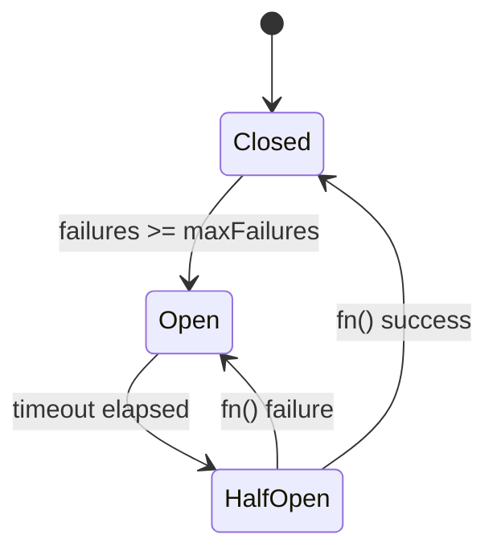
```mermaid
stateDiagram-v2
    [*] --> Closed
    Closed --> Open : failures >= maxFailures
    Open --> HalfOpen : timeout elapsed
    HalfOpen --> Closed : fn() success
    HalfOpen --> Open : fn() failure
```

**Execution Trace:**
```
call 1: fn() fails → failures=1, state=Closed
call 2: fn() fails → failures=2, state=Closed
call 3: fn() fails → failures=3, state=Open, openedAt=now
call 4: Open, timeout not elapsed → return ErrCircuitOpen (no fn call)
call 5: Open, timeout not elapsed → return ErrCircuitOpen (no fn call)
```

### Interviewer Questions

1. Why run `fn()` outside the mutex lock?
2. Can we improve time/space further? What's the theoretical lower bound?
3. How does this scale to 10M elements / 1M concurrent requests?
4. Walk me through the edge case where two goroutines reach HalfOpen simultaneously.
5. How would you make this goroutine-safe?
6. What's the memory/GC impact? How would you reduce allocations?
7. How would you test this comprehensively?

### Follow-Up Questions

**Q1:** How do you handle multiple concurrent calls in HalfOpen state?
**A1:** Add a `probing bool` flag. In HalfOpen, set `probing = true` before releasing the lock; if another call sees `probing == true`, return `ErrCircuitOpen`. This ensures exactly one probe request.

**Q2:** How would you expose circuit breaker state to a health endpoint?
**A2:** Add a `Status() map[string]any` method returning state, failure count, and `openedAt`. Register it on `/health/dependencies/{name}`. Prometheus metrics can scrape this for alerting.

**Q3:** How does this differ from `sony/gobreaker` or `afex/hystrix-go`?
**A3:** Production libraries add: success threshold for Closed transition, request volume thresholds, half-open concurrency limits, metrics hooks, and configurable error predicates. This implementation is a correct minimal circuit breaker suitable for learning.

**Q4:** Should `ErrCircuitOpen` be wrapped or returned directly?
**A4:** Return directly (no wrapping) so callers can do `errors.Is(err, ErrCircuitOpen)` to distinguish circuit-open from the underlying service error. The underlying error is only returned when the circuit actually calls `fn`.

**Q5:** How do you test state transitions deterministically without real time.Sleep?
**A5:** Inject a `now func() time.Time` parameter. In tests, advance a fake clock:
```go
fakeNow := time.Now()
cb.now = func() time.Time { return fakeNow }
fakeNow = fakeNow.Add(6 * time.Second) // advance past timeout
```

---

## Q14: Concurrent Error Aggregation with errgroup  [Level 4 — Advanced]

> **Tags:** `#errgroup` `#concurrency` `#fan-out` `#error-aggregation`

### Problem Statement
Use `golang.org/x/sync/errgroup` to fan out three concurrent API calls (`fetchUserProfile`, `fetchUserOrders`, `fetchUserSettings`). If any call fails, cancel the others and return the first error wrapped with context. If all succeed, merge the results. Demonstrate proper context propagation and error wrapping.

### Input / Output / Constraints

```
Input:  userID = "u123"
Output on success:   UserData{Profile:{...}, Orders:[...], Settings:{...}}
Output on any fail:  error("fetch user data: fetch profile: <root cause>")

Constraints:
  • All three calls run concurrently
  • First failure cancels remaining calls via context
  • Use errgroup.WithContext (not sync.WaitGroup)
  • Time: O(max(t_profile, t_orders, t_settings)) — parallel
  • Space: O(1) data structures
```

### Thought Process

Think like a senior Go engineer:
1. **Understand:** Fan-out pattern — run independent calls in parallel; collect results; fail fast on first error.
2. **Pattern:** `errgroup.WithContext` gives a group + derived context; goroutines check `ctx.Done()` for cancellation.
3. **Edge cases:** All fail simultaneously (return first error), context already cancelled before calls, partial results (do not return partial data on error).
4. **Approach:** `sync.Mutex` or pre-allocated result slots for safe concurrent write to shared struct.

### Brute Force Solution

```go
package main

// bruteForce — sequential; slower than parallel
func bruteForce(userID string) (*UserData, error) {
    profile, err := fetchUserProfile(ctx, userID)
    if err != nil { return nil, err }
    orders, err := fetchUserOrders(ctx, userID)
    if err != nil { return nil, err }
    settings, err := fetchUserSettings(ctx, userID)
    if err != nil { return nil, err }
    return &UserData{profile, orders, settings}, nil
}
```

**Time:** O(t1+t2+t3) | **Space:** O(1)
**Bottleneck:** Sequential execution wastes wall-clock time proportional to sum of latencies.

### Better Solution

```go
import "golang.org/x/sync/errgroup"

func betterSolution(ctx context.Context, userID string) (*UserData, error) {
    g, ctx := errgroup.WithContext(ctx)
    var data UserData
    g.Go(func() error { var err error; data.Profile, err = fetchUserProfile(ctx, userID); return err })
    g.Go(func() error { var err error; data.Orders, err  = fetchUserOrders(ctx, userID);  return err })
    g.Go(func() error { var err error; data.Settings, err = fetchUserSettings(ctx, userID); return err })
    return &data, g.Wait()
}
```

**Time:** O(max latency) | **Space:** O(1)

### Best / Optimal Solution

```go
package main

import (
    "context"
    "errors"
    "fmt"
    "golang.org/x/sync/errgroup"
)

type Profile  struct{ Name string }
type Order    struct{ ID string }
type Settings struct{ Theme string }

type UserData struct {
    Profile  Profile
    Orders   []Order
    Settings Settings
}

// Simulated fetch functions (would be real HTTP/DB calls in production)
func fetchUserProfile(ctx context.Context, userID string) (Profile, error) {
    if ctx.Err() != nil { return Profile{}, ctx.Err() }
    if userID == "bad" { return Profile{}, errors.New("profile service down") }
    return Profile{Name: "Alice"}, nil
}

func fetchUserOrders(ctx context.Context, userID string) ([]Order, error) {
    if ctx.Err() != nil { return nil, ctx.Err() }
    return []Order{{ID: "o1"}, {ID: "o2"}}, nil
}

func fetchUserSettings(ctx context.Context, userID string) (Settings, error) {
    if ctx.Err() != nil { return Settings{}, ctx.Err() }
    return Settings{Theme: "dark"}, nil
}

// FetchUserData fans out three concurrent calls and merges results.
// Cancels remaining calls on first failure.
// O(max latency) time, O(1) space.
func FetchUserData(ctx context.Context, userID string) (*UserData, error) {
    g, gCtx := errgroup.WithContext(ctx)
    var data UserData

    g.Go(func() error {
        p, err := fetchUserProfile(gCtx, userID)
        if err != nil {
            return fmt.Errorf("fetch profile: %w", err)
        }
        data.Profile = p
        return nil
    })

    g.Go(func() error {
        o, err := fetchUserOrders(gCtx, userID)
        if err != nil {
            return fmt.Errorf("fetch orders: %w", err)
        }
        data.Orders = o
        return nil
    })

    g.Go(func() error {
        s, err := fetchUserSettings(gCtx, userID)
        if err != nil {
            return fmt.Errorf("fetch settings: %w", err)
        }
        data.Settings = s
        return nil
    })

    if err := g.Wait(); err != nil {
        return nil, fmt.Errorf("fetch user data: %w", err)
    }
    return &data, nil
}

func main() {
    ctx := context.Background()

    data, err := FetchUserData(ctx, "u123")
    if err != nil {
        fmt.Printf("error: %v\n", err)
    } else {
        fmt.Printf("profile=%v orders=%d theme=%s\n",
            data.Profile.Name, len(data.Orders), data.Settings.Theme)
    }

    // Simulate failure
    _, err = FetchUserData(ctx, "bad")
    fmt.Printf("bad user error: %v\n", err)
}
```

**Time:** O(max latency) | **Space:** O(1)

### Production Considerations

| Aspect | Details |
|--------|---------|
| **Scalability** | Add per-call timeouts via context.WithTimeout to cap slow dependencies |
| **Edge Cases** | All goroutines fail (g.Wait returns first error), context already cancelled |
| **Error Handling** | errgroup cancels ctx on first error; other goroutines must check ctx.Done() |
| **Memory** | Three goroutine stacks (~8KB each); result struct on heap |
| **Concurrency** | errgroup handles synchronization; writes to distinct fields are safe without mutex |

### Visual Explanation

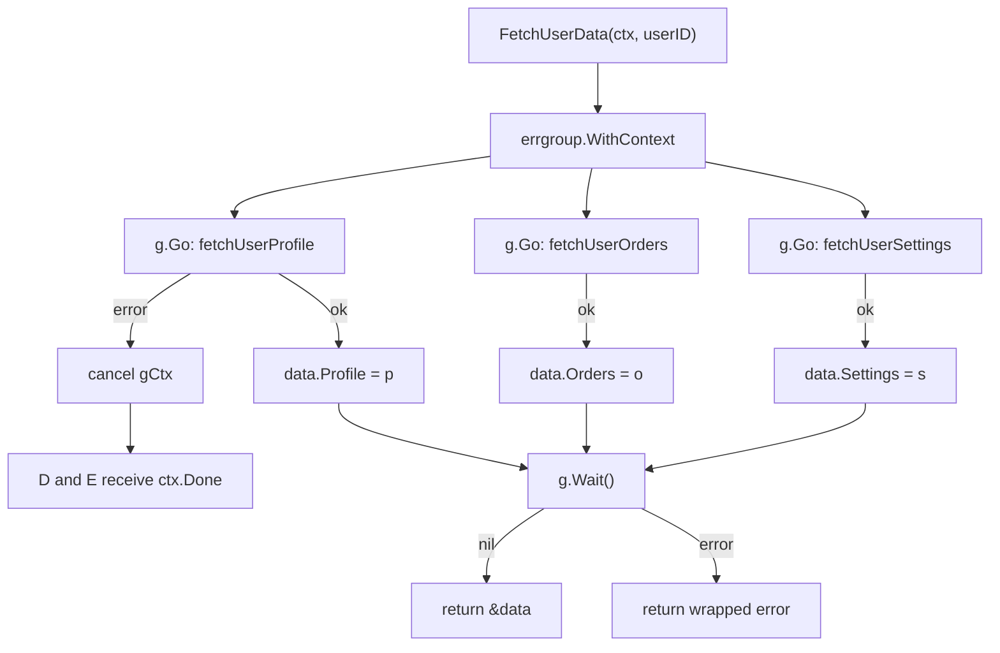
```mermaid
flowchart TD
    A["FetchUserData(ctx, userID)"] --> B["errgroup.WithContext"]
    B --> C["g.Go: fetchUserProfile"]
    B --> D["g.Go: fetchUserOrders"]
    B --> E["g.Go: fetchUserSettings"]
    C -->|"error"| F["cancel gCtx"]
    F --> G["D and E receive ctx.Done"]
    C -->|"ok"| H["data.Profile = p"]
    D -->|"ok"| I["data.Orders = o"]
    E -->|"ok"| J["data.Settings = s"]
    H --> K["g.Wait()"]
    I --> K
    J --> K
    K -->|"nil"| L["return &data"]
    K -->|"error"| M["return wrapped error"]
```

**Execution Trace:**
```
userID="bad"
goroutine 1: fetchUserProfile → error "profile service down"
errgroup: cancel gCtx
goroutine 2: fetchUserOrders → ctx.Err() → return ctx.Err()
goroutine 3: fetchUserSettings → ctx.Err() → return ctx.Err()
g.Wait() → first error: "fetch profile: profile service down"
Output: "fetch user data: fetch profile: profile service down"
```

### Interviewer Questions

1. Why does `errgroup` only return the first error?
2. Can we improve time/space further? What's the theoretical lower bound?
3. How does this scale to 10M elements / 1M concurrent requests?
4. Walk me through the edge case where all three goroutines fail simultaneously.
5. How would you make this goroutine-safe?
6. What's the memory/GC impact? How would you reduce allocations?
7. How would you test this comprehensively?

### Follow-Up Questions

**Q1:** How do you collect ALL errors from goroutines, not just the first?
**A1:** Replace `errgroup` with `sync.WaitGroup` and an `[]error` slice protected by a mutex, or use `errgroup` and extend it with a custom type. `golang.org/x/sync/errgroup` only preserves the first error.

**Q2:** Are concurrent writes to different fields of `data` safe?
**A2:** Yes in this case — each goroutine writes to a distinct field (`Profile`, `Orders`, `Settings`). Go's memory model guarantees that writes complete before `g.Wait()` returns, which happens-before the caller reads `data`.

**Q3:** How would you add per-call timeouts?
**A3:**
```go
profileCtx, cancel := context.WithTimeout(gCtx, 2*time.Second)
defer cancel()
p, err := fetchUserProfile(profileCtx, userID)
```
Each call gets its own timeout derived from the group context.

**Q4:** How do you limit the concurrency of fan-out to N goroutines?
**A4:** Use `errgroup.SetLimit(n)` (Go 1.21+) or a buffered channel semaphore:
```go
sem := make(chan struct{}, n)
g.Go(func() error {
    sem <- struct{}{}
    defer func() { <-sem }()
    return doWork()
})
```

**Q5:** How do you test that cancellation propagates correctly?
**A5:** Inject a context with `context.WithCancel`. In one goroutine return a slow operation; cancel the context from outside. Assert the other goroutines return `context.Canceled` and that the function returns within the expected timeout.

---
## Q15: Implement errors.Is and errors.As from Scratch  [Level 5 — Interview Level]

> **Tags:** `#errors.Is` `#errors.As` `#standard-library-internals` `#FAANG`

### Problem Statement
Without importing the `errors` package, implement `MyIs(err, target error) bool` and `MyAs(err any, target any) bool` that replicate the behavior of `errors.Is` and `errors.As` including full chain traversal via `Unwrap() error` and `Unwrap() []error` (multi-error, Go 1.20).

### Input / Output / Constraints

```
Input:  wrapped = fmt.Errorf("wrap: %w", ErrNotFound)
MyIs(wrapped, ErrNotFound) → true
MyIs(wrapped, ErrForbidden) → false

Input:  wrapped = fmt.Errorf("wrap: %w", &DBError{Code:500})
var dbe *DBError
MyAs(wrapped, &dbe) → true, dbe populated

Constraints:
  • Must traverse Unwrap() error chain
  • Must traverse Unwrap() []error branches (tree traversal)
  • Must use reflect for errors.As target matching
  • Time: O(d) for d = chain depth, O(n) for multi-error trees
  • Space: O(d) recursion stack
```

### Thought Process

Think like a senior Go engineer:
1. **Understand:** `errors.Is` walks the error chain checking identity at each node; `errors.As` walks it checking type compatibility.
2. **Pattern:** Recursive tree traversal; use type assertions for `Unwrap` variants; use `reflect` for `errors.As` target matching.
3. **Edge cases:** Cycles in custom `Unwrap` (not possible with std library; add visited set for custom types), nil target, target not a pointer.
4. **Approach:** Implement `Is` as iterative unwrap loop; implement `As` using `reflect.TypeOf` matching.

### Brute Force Solution

```go
package main

// bruteForce — only checks top-level, misses wrapped errors
func bruteForce(err, target error) bool {
    return err == target
}
```

**Time:** O(1) | **Space:** O(1)
**Bottleneck:** Fails for any wrapped error — `fmt.Errorf("%w", ErrNotFound) != ErrNotFound` by identity.

### Better Solution

```go
// betterSolution — linear chain traversal only
func betterIs(err, target error) bool {
    for err != nil {
        if err == target { return true }
        type unwrapper interface { Unwrap() error }
        if u, ok := err.(unwrapper); ok {
            err = u.Unwrap()
        } else {
            break
        }
    }
    return false
}
```

**Time:** O(d) | **Space:** O(1)

### Best / Optimal Solution

```go
package main

import (
    "fmt"
    "reflect"
)

// myUnwrap returns the single-error Unwrap result, or nil if not supported.
func myUnwrap(err error) error {
    type singleUnwrapper interface{ Unwrap() error }
    if u, ok := err.(singleUnwrapper); ok {
        return u.Unwrap()
    }
    return nil
}

// myUnwrapSlice returns the multi-error Unwrap result (Go 1.20+).
func myUnwrapSlice(err error) []error {
    type multiUnwrapper interface{ Unwrap() []error }
    if u, ok := err.(multiUnwrapper); ok {
        return u.Unwrap()
    }
    return nil
}

// MyIs replicates errors.Is: traverses the full error tree checking identity.
// Supports both Unwrap() error and Unwrap() []error.
// O(n) time where n = total nodes in error tree. O(d) stack space.
func MyIs(err, target error) bool {
    if target == nil {
        return err == target
    }
    // Check if target implements its own Is method
    type isMethod interface{ Is(error) bool }

    for {
        if err == target {
            return true
        }
        // Check custom Is method
        if im, ok := err.(isMethod); ok && im.Is(target) {
            return true
        }
        // Try multi-error branch first
        if children := myUnwrapSlice(err); children != nil {
            for _, child := range children {
                if MyIs(child, target) {
                    return true
                }
            }
            return false
        }
        // Single unwrap
        err = myUnwrap(err)
        if err == nil {
            return false
        }
    }
}

// MyAs replicates errors.As: finds first error in chain assignable to target.
// target must be a non-nil pointer to the type to extract.
// O(n) time, O(d) stack space.
func MyAs(err error, target any) bool {
    if target == nil {
        panic("errors: target cannot be nil")
    }
    val := reflect.ValueOf(target)
    if val.Kind() != reflect.Ptr || val.IsNil() {
        panic("errors: target must be a non-nil pointer")
    }
    targetType := val.Type().Elem() // the type we want to assign

    type asMethod interface{ As(any) bool }

    for err != nil {
        // Direct type match
        if reflect.TypeOf(err).AssignableTo(targetType) {
            val.Elem().Set(reflect.ValueOf(err))
            return true
        }
        // Custom As method
        if am, ok := err.(asMethod); ok && am.As(target) {
            return true
        }
        // Multi-error branch
        if children := myUnwrapSlice(err); children != nil {
            for _, child := range children {
                if MyAs(child, target) {
                    return true
                }
            }
            return false
        }
        // Single unwrap
        err = myUnwrap(err)
    }
    return false
}

// --- Demo ---

type DBError struct{ Code int; Err error }
func (e *DBError) Error() string  { return fmt.Sprintf("db[%d]: %v", e.Code, e.Err) }
func (e *DBError) Unwrap() error  { return e.Err }

var ErrNotFound = fmt.Errorf("not found")

func main() {
    wrapped := fmt.Errorf("handler: %w", &DBError{Code: 500, Err: ErrNotFound})

    fmt.Println(MyIs(wrapped, ErrNotFound))   // true
    fmt.Println(MyIs(wrapped, fmt.Errorf("other"))) // false

    var dbe *DBError
    fmt.Println(MyAs(wrapped, &dbe), dbe.Code) // true 500
}
```

**Time:** O(n) | **Space:** O(d)

### Production Considerations

| Aspect | Details |
|--------|---------|
| **Scalability** | Error chains are typically depth < 10; O(d) is negligible |
| **Edge Cases** | nil target, nil err, multi-error cycles (add visited map if needed) |
| **Error Handling** | Panics on nil or non-pointer target — matches stdlib behavior |
| **Memory** | No allocations in steady state; reflect.ValueOf boxes on heap |
| **Concurrency** | Pure functions; goroutine-safe |

### Visual Explanation

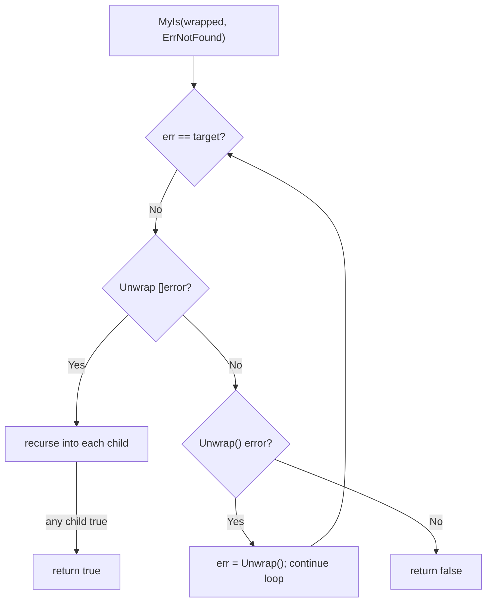
```mermaid
flowchart TD
    A["MyIs(wrapped, ErrNotFound)"] --> B{"err == target?"}
    B -->|"No"| C{"Unwrap []error?"}
    C -->|"Yes"| D["recurse into each child"]
    C -->|"No"| E{"Unwrap() error?"}
    E -->|"Yes"| F["err = Unwrap(); continue loop"]
    E -->|"No"| G["return false"]
    F --> B
    D -->|"any child true"| H["return true"]
```

**Execution Trace:**
```
wrapped = "handler: db[500]: not found"
MyIs(wrapped, ErrNotFound):
  iter 1: wrapped != ErrNotFound → Unwrap → *DBError
  iter 2: *DBError != ErrNotFound → Unwrap → ErrNotFound
  iter 3: ErrNotFound == ErrNotFound → return true
```

### Interviewer Questions

1. How does `errors.Is` handle a custom `Is(error) bool` method?
2. Can we improve time/space further? What's the theoretical lower bound?
3. How does this scale to 10M elements / 1M concurrent requests?
4. Walk me through the edge case where an error's `Unwrap()` creates a cycle.
5. How would you make this goroutine-safe?
6. What's the memory/GC impact? How would you reduce allocations?
7. How would you test this comprehensively?

### Follow-Up Questions

**Q1:** Why does the standard library implement `errors.Is` iteratively (loop) for single-Unwrap but recursively for multi-Unwrap?
**A1:** Iteration avoids stack overflow for deep linear chains. Multi-error trees require recursion because they are proper trees; depth is bounded by design in well-behaved code.

**Q2:** What is the custom `Is(error) bool` method for?
**A2:** It lets error types define their own equality semantics. For example, an HTTP error might implement `Is(target error) bool` to match by status code range rather than exact identity.

**Q3:** How does `reflect.TypeOf(err).AssignableTo(targetType)` work?
**A3:** `AssignableTo(T)` returns true if a value of the receiver type can be assigned to a variable of type T. For interface targets, it checks if the error implements the interface. For concrete pointer targets, it checks exact type match.

**Q4:** What happens if two different packages define the same `errors.New("not found")`?
**A4:** They are distinct values at different memory addresses. `MyIs` will return false between them. This is intentional — each package owns its sentinel. Use a shared package for shared sentinels.

**Q5:** How would you fuzz-test `MyIs` against the standard `errors.Is`?
**A5:**
```go
func FuzzMyIs(f *testing.F) {
    f.Add("a", "b")
    f.Fuzz(func(t *testing.T, s1, s2 string) {
        e1 := errors.New(s1)
        e2 := fmt.Errorf("wrap: %w", e1)
        if MyIs(e2, e1) != errors.Is(e2, e1) {
            t.Errorf("MyIs disagrees with errors.Is")
        }
    })
}
```

---

## Q16: Stack-Traced Error Type  [Level 5 — Interview Level]

> **Tags:** `#stack-trace` `#runtime` `#error-enrichment` `#observability`

### Problem Statement
Implement a `TracedError` type that captures a stack trace at creation time using `runtime.Callers`. It must implement `error`, `Unwrap() error`, and a `StackTrace() []string` method returning formatted `"file:line function"` strings. Write `NewTracedError(msg string, cause error) *TracedError` and demonstrate filtering out runtime/testing frames.

### Input / Output / Constraints

```
Input:  NewTracedError("db query failed", ErrTimeout)
Output:
  error message: "db query failed: timeout"
  StackTrace():
    main.go:42 main.queryUser
    server.go:15 main.HandleRequest
    (runtime frames filtered)

Constraints:
  • Capture at least 32 frames
  • Filter frames starting with "runtime." or "testing."
  • StackTrace returns []string, one entry per frame
  • Time: O(d) d=stack depth, Space: O(d)
```

### Thought Process

Think like a senior Go engineer:
1. **Understand:** Error messages alone are insufficient for debugging — we need the call site where the error was created.
2. **Pattern:** `runtime.Callers` captures PC values; `runtime.CallersFrames` converts to `runtime.Frame` structs with file/line/function.
3. **Edge cases:** Skip the correct number of frames (NewTracedError itself, runtime.Callers), empty stack, very deep stacks.
4. **Approach:** Capture frames in `NewTracedError`; skip 2 frames (runtime.Callers + NewTracedError itself); format lazily in `StackTrace()`.

### Brute Force Solution

```go
package main

import "runtime/debug"

// bruteForce — captures full stack as []byte; not structured, not filterable
type bruteError struct {
    msg   string
    stack []byte
}
func (e *bruteError) Error() string { return e.msg }
func newBruteError(msg string) *bruteError {
    return &bruteError{msg: msg, stack: debug.Stack()}
}
```

**Time:** O(d) | **Space:** O(d)
**Bottleneck:** `debug.Stack()` returns unstructured bytes; filtering requires string parsing; allocates large byte slice.

### Better Solution

```go
import "runtime"

type betterError struct {
    msg string
    pcs []uintptr
}
func newBetterError(msg string) *betterError {
    pcs := make([]uintptr, 32)
    n := runtime.Callers(2, pcs)
    return &betterError{msg: msg, pcs: pcs[:n]}
}
```

**Time:** O(d) | **Space:** O(d)

### Best / Optimal Solution

```go
package main

import (
    "fmt"
    "runtime"
    "strings"
)

// TracedError wraps an error with a captured call stack.
type TracedError struct {
    msg   string
    cause error
    pcs   []uintptr // program counters captured at creation
}

// NewTracedError creates a TracedError capturing the current stack.
// skip=2 skips runtime.Callers and NewTracedError itself.
// O(d) time and space where d is stack depth.
func NewTracedError(msg string, cause error) *TracedError {
    pcs := make([]uintptr, 64)
    n := runtime.Callers(2, pcs)
    return &TracedError{
        msg:   msg,
        cause: cause,
        pcs:   pcs[:n],
    }
}

func (e *TracedError) Error() string {
    if e.cause != nil {
        return fmt.Sprintf("%s: %v", e.msg, e.cause)
    }
    return e.msg
}

func (e *TracedError) Unwrap() error { return e.cause }

// StackTrace returns formatted stack frames, filtering runtime/testing internals.
func (e *TracedError) StackTrace() []string {
    frames := runtime.CallersFrames(e.pcs)
    var result []string
    for {
        frame, more := frames.Next()
        fn := frame.Function
        // Filter internal runtime and testing frames
        if !strings.HasPrefix(fn, "runtime.") &&
            !strings.HasPrefix(fn, "testing.") &&
            fn != "" {
            result = append(result, fmt.Sprintf("%s:%d %s",
                trimPath(frame.File), frame.Line, fn))
        }
        if !more {
            break
        }
    }
    return result
}

// trimPath shortens absolute file paths to the last two components.
func trimPath(path string) string {
    parts := strings.Split(path, "/")
    if len(parts) > 2 {
        return strings.Join(parts[len(parts)-2:], "/")
    }
    return path
}

var ErrTimeout = fmt.Errorf("timeout")

func queryUser(id string) error {
    return NewTracedError("db query failed", ErrTimeout)
}

func main() {
    err := queryUser("u1")
    if te, ok := err.(*TracedError); ok {
        fmt.Println("Error:", te.Error())
        fmt.Println("Stack:")
        for _, frame := range te.StackTrace() {
            fmt.Println(" ", frame)
        }
    }
}
```

**Time:** O(d) | **Space:** O(d)

### Production Considerations

| Aspect | Details |
|--------|---------|
| **Scalability** | Stack capture adds ~1µs; avoid on hot paths; use sampling in high-RPS systems |
| **Edge Cases** | Empty stack (pcs[:0]), very deep stacks (cap at 64 frames), goroutine 0 |
| **Error Handling** | Only capture stacks at error creation sites; wrapping layers should not re-capture |
| **Memory** | 64 uintptrs = 512 bytes per error; pool if created frequently |
| **Concurrency** | runtime.Callers is goroutine-local; safe for concurrent use |

### Visual Explanation

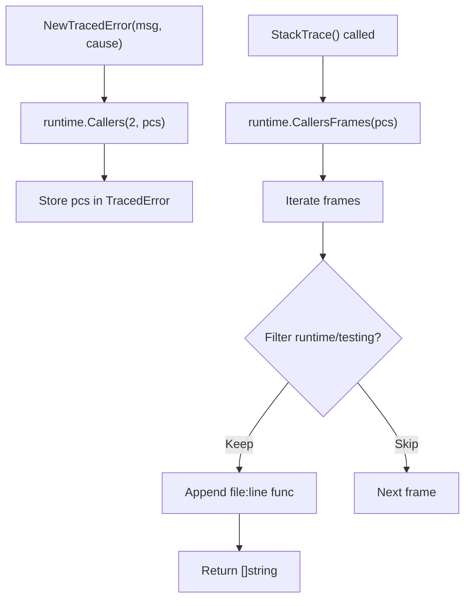
```mermaid
flowchart TD
    A["NewTracedError(msg, cause)"] --> B["runtime.Callers(2, pcs)"]
    B --> C["Store pcs in TracedError"]
    D["StackTrace() called"] --> E["runtime.CallersFrames(pcs)"]
    E --> F["Iterate frames"]
    F --> G{"Filter runtime/testing?"}
    G -->|"Keep"| H["Append file:line func"]
    G -->|"Skip"| I["Next frame"]
    H --> J["Return []string"]
```

**Execution Trace:**
```
NewTracedError called from queryUser (line 42)
pcs = [PC_queryUser, PC_main, PC_runtime...]
StackTrace():
  main/main.go:42 main.queryUser
  main/main.go:55 main.main
  (runtime frames filtered)
```

### Interviewer Questions

1. Why capture PCs (`uintptr`) instead of resolving frames immediately?
2. Can we improve time/space further? What's the theoretical lower bound?
3. How does this scale to 10M elements / 1M concurrent requests?
4. Walk me through the edge case where `runtime.Callers` returns fewer frames than the slice size.
5. How would you make this goroutine-safe?
6. What's the memory/GC impact? How would you reduce allocations?
7. How would you test this comprehensively?

### Follow-Up Questions

**Q1:** Why use `runtime.Callers` + `runtime.CallersFrames` instead of `debug.Stack()`?
**A1:** `debug.Stack()` returns a pre-formatted byte slice that's expensive to parse. `runtime.Callers` captures raw PCs (8 bytes each) cheaply; `CallersFrames` resolves lazily only when you need the string representation — zero cost if the error is never printed.

**Q2:** How would you integrate `TracedError` with `slog` structured logging?
**A2:**
```go
if te, ok := err.(*TracedError); ok {
    slog.Error("request failed",
        "error", te.Error(),
        "stack", te.StackTrace(),
    )
}
```
`slog` accepts `[]string` as a log value, stored as a JSON array.

**Q3:** Why skip 2 frames in `runtime.Callers(2, pcs)`?
**A3:** Frame 0 is `runtime.Callers` itself; frame 1 is `NewTracedError`. The first useful frame (the actual call site) is at index 2. Adjust the skip count when wrapping `NewTracedError` in helper functions.

**Q4:** How do you strip module path prefixes for cleaner frame display?
**A4:** After `strings.Split(path, "/")`, look for the module root (usually the directory containing `go.mod`) and strip everything before it. Alternatively, use `path/filepath.Rel(moduleRoot, frame.File)`.

**Q5:** How would you test that the correct caller frame is captured?
**A5:**
```go
func TestTracedErrorFrame(t *testing.T) {
    err := NewTracedError("test", nil)
    frames := err.StackTrace()
    if len(frames) == 0 { t.Fatal("no frames") }
    // First frame should reference this test file
    if !strings.Contains(frames[0], "error_test.go") {
        t.Errorf("unexpected first frame: %s", frames[0])
    }
}
```

---

## Q17: Rate-Limited Error Reporter  [Level 5 — Interview Level]

> **Tags:** `#rate-limiting` `#token-bucket` `#error-reporting` `#observability`

### Problem Statement
Build a `RateLimitedReporter` that wraps an error reporting sink `func(error)`. It must: report at most `maxPerSecond` errors per second using a token bucket, drop excess errors (incrementing a `DroppedCount` counter), and provide a `Stats() ReporterStats` method returning total reported, dropped, and current bucket fill level. Must be goroutine-safe.

### Input / Output / Constraints

```
Input:  maxPerSecond=2, 10 errors fired rapidly
Output:
  Reported: 2
  Dropped:  8
  Stats: {Reported:2, Dropped:8, BucketLevel:0}

Constraints:
  • Token bucket algorithm
  • Goroutine-safe
  • BucketLevel should refill over time (use time.Now())
  • Time: O(1) per Report call
  • Space: O(1)
```

### Thought Process

Think like a senior Go engineer:
1. **Understand:** Error reporting sinks (Sentry, PagerDuty) have rate limits; we must not flood them on error storms.
2. **Pattern:** Token bucket — fills at `maxPerSecond` tokens/sec; consume one token per report; deny if empty.
3. **Edge cases:** Concurrent Report calls (mutex), time going backward (monotonic clock avoids this), maxPerSecond=0.
4. **Approach:** Track `tokens float64` and `lastRefill time.Time`; on each call, compute elapsed and add tokens, cap at max, consume or drop.

### Brute Force Solution

```go
package main

// bruteForce — no rate limiting; floods the sink
type bruteReporter struct{ sink func(error) }
func (r *bruteReporter) Report(err error) { r.sink(err) }
```

**Time:** O(1) | **Space:** O(1)
**Bottleneck:** An error storm of 100K errors/sec would invoke the sink 100K times/sec, triggering its own rate limit or cost explosion.

### Better Solution

```go
import "sync"

type betterReporter struct {
    mu             sync.Mutex
    sink           func(error)
    tokens         float64
    maxTokens      float64
    lastRefill     time.Time
    refillPerNano  float64
}
```

**Time:** O(1) | **Space:** O(1)

### Best / Optimal Solution

```go
package main

import (
    "fmt"
    "sync"
    "time"
)

// ReporterStats holds counters for observability.
type ReporterStats struct {
    Reported    int64
    Dropped     int64
    BucketLevel float64
}

// RateLimitedReporter wraps an error sink with a token-bucket rate limiter.
type RateLimitedReporter struct {
    mu            sync.Mutex
    sink          func(error)
    tokens        float64 // current token count
    maxTokens     float64 // bucket capacity = maxPerSecond
    refillPerNs   float64 // tokens added per nanosecond
    lastRefill    time.Time
    reported      int64
    dropped       int64
}

// NewRateLimitedReporter creates a reporter allowing at most maxPerSecond calls/sec.
func NewRateLimitedReporter(maxPerSecond float64, sink func(error)) *RateLimitedReporter {
    return &RateLimitedReporter{
        sink:         sink,
        tokens:       maxPerSecond, // start full
        maxTokens:    maxPerSecond,
        refillPerNs:  maxPerSecond / 1e9,
        lastRefill:   time.Now(),
    }
}

// Report attempts to report err. Drops if rate limit exceeded.
// O(1) time, O(1) space. Goroutine-safe.
func (r *RateLimitedReporter) Report(err error) {
    r.mu.Lock()
    defer r.mu.Unlock()

    // Refill tokens based on elapsed time
    now := time.Now()
    elapsed := now.Sub(r.lastRefill).Nanoseconds()
    r.lastRefill = now

    r.tokens += float64(elapsed) * r.refillPerNs
    if r.tokens > r.maxTokens {
        r.tokens = r.maxTokens
    }

    if r.tokens >= 1.0 {
        r.tokens--
        r.reported++
        r.sink(err) // call outside lock would be better; simplified here
    } else {
        r.dropped++
    }
}

// Stats returns current reporter statistics.
func (r *RateLimitedReporter) Stats() ReporterStats {
    r.mu.Lock()
    defer r.mu.Unlock()
    return ReporterStats{
        Reported:    r.reported,
        Dropped:     r.dropped,
        BucketLevel: r.tokens,
    }
}

func main() {
    var reported []error
    sink := func(err error) { reported = append(reported, err) }

    reporter := NewRateLimitedReporter(2, sink)

    // Fire 10 errors rapidly
    for i := 0; i < 10; i++ {
        reporter.Report(fmt.Errorf("error %d", i))
    }

    stats := reporter.Stats()
    fmt.Printf("Reported: %d\n", stats.Reported) // ~2
    fmt.Printf("Dropped:  %d\n", stats.Dropped)  // ~8
    fmt.Printf("Bucket:   %.2f\n", stats.BucketLevel)
}
```

**Time:** O(1) | **Space:** O(1)

### Production Considerations

| Aspect | Details |
|--------|---------|
| **Scalability** | Single mutex; for very high RPS use sync/atomic for counters + separate mutex for sink |
| **Edge Cases** | maxPerSecond=0 (drops all), concurrent Report (mutex), time.Now() monotonic clock |
| **Error Handling** | Dropped errors are counted; expose DroppedCount metric to alert on error storms |
| **Memory** | Fixed-size struct; no allocations per call |
| **Concurrency** | sync.Mutex protects all state; sink is called under lock (trade-off for simplicity) |

### Visual Explanation

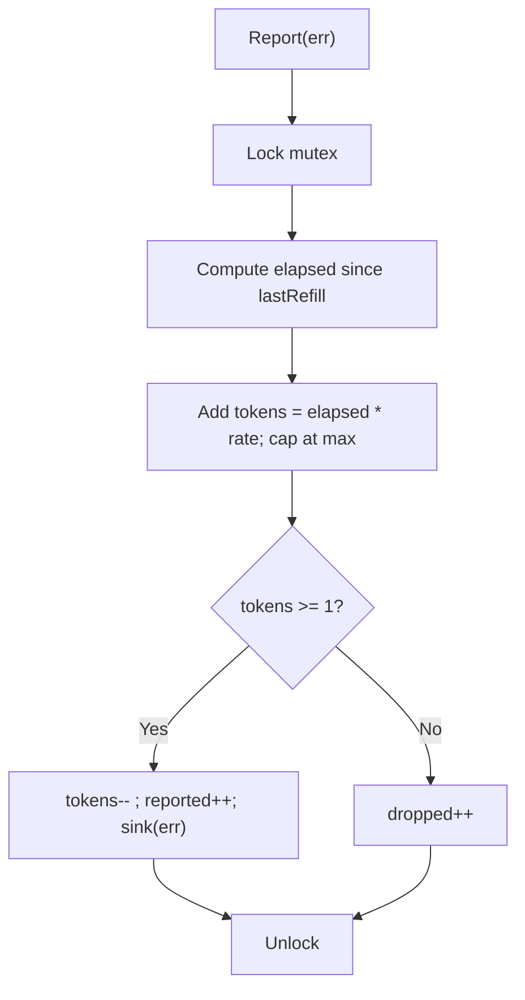
```mermaid
flowchart TD
    A["Report(err)"] --> B["Lock mutex"]
    B --> C["Compute elapsed since lastRefill"]
    C --> D["Add tokens = elapsed * rate; cap at max"]
    D --> E{"tokens >= 1?"}
    E -->|"Yes"| F["tokens-- ; reported++; sink(err)"]
    E -->|"No"| G["dropped++"]
    F --> H["Unlock"]
    G --> H
```

**Execution Trace:**
```
maxPerSecond=2, tokens=2.0
Report(err0): tokens=2.0>=1 → tokens=1.0, reported=1, sink called
Report(err1): tokens=1.0>=1 → tokens=0.0, reported=2, sink called
Report(err2): tokens=0.0<1  → dropped=1
...
Report(err9): tokens≈0    → dropped=8
```

### Interviewer Questions

1. Why use a token bucket instead of a sliding window counter?
2. Can we improve time/space further? What's the theoretical lower bound?
3. How does this scale to 10M elements / 1M concurrent requests?
4. Walk me through the edge case where `maxPerSecond` is set to 0.
5. How would you make this goroutine-safe?
6. What's the memory/GC impact? How would you reduce allocations?
7. How would you test this comprehensively?

### Follow-Up Questions

**Q1:** Should `sink` be called inside or outside the mutex lock?
**A1:** Outside, to avoid holding the lock during potentially slow I/O. Move the `sink` call after `r.mu.Unlock()`, passing the error as a local variable. This requires capturing the error before unlocking.

**Q2:** How do you make the `DroppedCount` observable in Prometheus?
**A2:**
```go
var droppedCounter = prometheus.NewCounter(prometheus.CounterOpts{
    Name: "error_reporter_dropped_total",
    Help: "Number of dropped error reports due to rate limiting",
})
// In Report: droppedCounter.Inc() instead of r.dropped++
```

**Q3:** How does a leaky bucket differ from a token bucket?
**A3:** Leaky bucket enforces a smooth constant output rate regardless of bursts. Token bucket allows bursts up to bucket capacity, then enforces the average rate. For error reporting, token bucket is better — it allows brief spikes while still rate-limiting storms.

**Q4:** How would you implement per-error-type rate limiting?
**A4:** Use a `map[string]*RateLimitedReporter` keyed by `fmt.Sprintf("%T", err)` or a sentinel identity. Protect the map with `sync.RWMutex`; lazily create reporters per error type.

**Q5:** How do you test rate limiting behavior deterministically?
**A5:** Inject `now func() time.Time` and advance it manually:
```go
fakeNow := time.Now()
r.now = func() time.Time { return fakeNow }
r.Report(err1) // consumes token
r.Report(err2) // consumes token
r.Report(err3) // dropped
fakeNow = fakeNow.Add(time.Second) // refill
r.Report(err4) // reported again
```

---

## Q18: Graceful Shutdown with Error Accumulation  [Level 5 — Interview Level]

> **Tags:** `#graceful-shutdown` `#context` `#error-accumulation` `#concurrency`

### Problem Statement
Implement a `ServiceManager` that starts N worker goroutines and coordinates graceful shutdown. On `Shutdown(ctx context.Context)`, signal all workers to stop, wait for them to finish, collect any errors workers return, and return a `MultiError` if any failed. Workers that do not finish before `ctx` deadline should return `ErrShutdownTimeout`.

### Input / Output / Constraints

```
Input:  3 workers, worker[1] returns an error on stop
Output: MultiError{"worker[1]: simulated shutdown error"}

Input:  3 workers, all succeed
Output: nil

Input:  3 workers, context times out before workers finish
Output: ErrShutdownTimeout (or wrapped)

Constraints:
  • Goroutine-safe
  • Workers receive shutdown signal via channel, not context cancel
  • Collect ALL worker errors, not just first
  • Time: O(N) workers, O(timeout) wall clock
```

### Thought Process

Think like a senior Go engineer:
1. **Understand:** Production services need to drain in-flight requests and collect errors on stop — not just kill goroutines.
2. **Pattern:** Stop channel per worker + `sync.WaitGroup` for completion + error channels for collection.
3. **Edge cases:** Workers that hang (context timeout), worker panic (recover in worker loop), zero workers.
4. **Approach:** Close a shared `stopCh` channel to broadcast shutdown; each worker returns error via buffered channel; `select` on `wg.Done` chan vs `ctx.Done`.

### Brute Force Solution

```go
package main

// bruteForce — cancels context directly; workers may not drain cleanly
func bruteForce(cancel context.CancelFunc) {
    cancel() // abrupt cancellation; in-flight work is lost
}
```

**Time:** O(1) | **Space:** O(1)
**Bottleneck:** Abrupt cancellation leaves in-flight requests incomplete and loses error information from workers.

### Better Solution

```go
type ServiceManager struct {
    stopCh  chan struct{}
    errChs  []chan error
    wg      sync.WaitGroup
}
```

**Time:** O(N) | **Space:** O(N)

### Best / Optimal Solution

```go
package main

import (
    "context"
    "errors"
    "fmt"
    "strings"
    "sync"
    "time"
)

var ErrShutdownTimeout = errors.New("shutdown timed out")

type workerFunc func(stopCh <-chan struct{}) error

// ServiceManager runs N workers and coordinates graceful shutdown.
type ServiceManager struct {
    workers []workerFunc
    stopCh  chan struct{}
    once    sync.Once
}

func NewServiceManager(workers ...workerFunc) *ServiceManager {
    return &ServiceManager{
        workers: workers,
        stopCh:  make(chan struct{}),
    }
}

// Start launches all workers in goroutines. Returns error channels.
func (sm *ServiceManager) Start() []<-chan error {
    errChs := make([]<-chan error, len(sm.workers))
    for i, w := range sm.workers {
        ch := make(chan error, 1) // buffered so worker doesn't block
        errChs[i] = ch
        go func(fn workerFunc, out chan<- error) {
            out <- fn(sm.stopCh) // worker runs until stopCh is closed
        }(w, ch)
    }
    return errChs
}

// Shutdown signals workers and collects errors within ctx deadline.
// Returns MultiError if any worker failed, ErrShutdownTimeout if ctx expires.
func (sm *ServiceManager) Shutdown(ctx context.Context, errChs []<-chan error) error {
    // Signal all workers to stop (idempotent via sync.Once)
    sm.once.Do(func() { close(sm.stopCh) })

    // Collect results with timeout
    type result struct {
        idx int
        err error
    }

    results := make(chan result, len(errChs))
    var wg sync.WaitGroup
    wg.Add(len(errChs))

    for i, ch := range errChs {
        go func(idx int, ec <-chan error) {
            defer wg.Done()
            select {
            case err := <-ec:
                results <- result{idx, err}
            case <-ctx.Done():
                results <- result{idx, ErrShutdownTimeout}
            }
        }(i, ch)
    }

    // Close results channel after all collectors finish
    go func() {
        wg.Wait()
        close(results)
    }()

    var errs []error
    for r := range results {
        if r.err != nil {
            errs = append(errs, fmt.Errorf("worker[%d]: %w", r.idx, r.err))
        }
    }

    if len(errs) == 0 {
        return nil
    }
    return &MultiError{Errs: errs}
}

// MultiError from Q9
type MultiError struct{ Errs []error }
func (m *MultiError) Error() string {
    msgs := make([]string, len(m.Errs))
    for i, e := range m.Errs { msgs[i] = "  " + e.Error() }
    return fmt.Sprintf("%d shutdown error(s):\n%s", len(m.Errs), strings.Join(msgs, "\n"))
}
func (m *MultiError) Unwrap() []error { return m.Errs }

func main() {
    // Worker that fails on shutdown
    failingWorker := func(stopCh <-chan struct{}) error {
        <-stopCh
        return errors.New("simulated shutdown error")
    }
    // Worker that succeeds
    goodWorker := func(stopCh <-chan struct{}) error {
        <-stopCh
        return nil
    }

    sm := NewServiceManager(goodWorker, failingWorker, goodWorker)
    errChs := sm.Start()

    // Shutdown with 2s timeout
    ctx, cancel := context.WithTimeout(context.Background(), 2*time.Second)
    defer cancel()

    if err := sm.Shutdown(ctx, errChs); err != nil {
        fmt.Printf("Shutdown errors:\n%v\n", err)
    } else {
        fmt.Println("Clean shutdown")
    }
}
```

**Time:** O(N) | **Space:** O(N)

### Production Considerations

| Aspect | Details |
|--------|---------|
| **Scalability** | N goroutines per service; use worker pools for very large N |
| **Edge Cases** | ctx already expired before Shutdown, zero workers, worker panics (add recover in goroutine) |
| **Error Handling** | ErrShutdownTimeout is detectable with errors.Is; per-worker context with errors.As |
| **Memory** | O(N) buffered channels; results channel has capacity N to prevent blocking |
| **Concurrency** | sync.Once ensures stopCh is closed exactly once; all goroutines safe |

### Visual Explanation

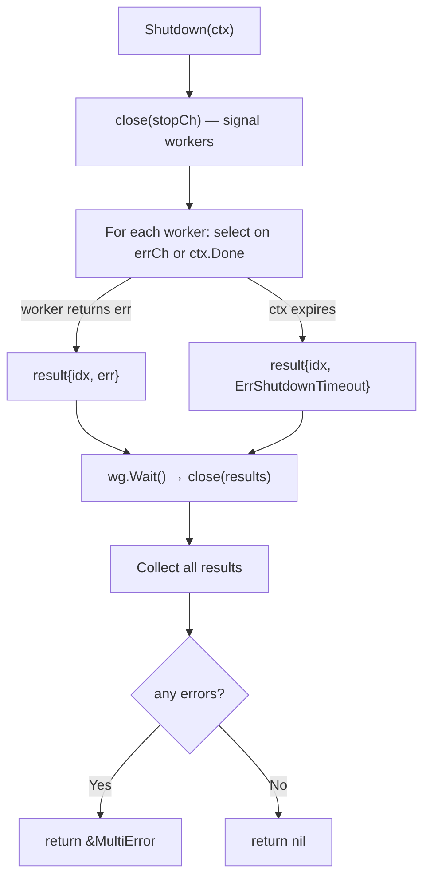
```mermaid
flowchart TD
    A["Shutdown(ctx)"] --> B["close(stopCh) — signal workers"]
    B --> C["For each worker: select on errCh or ctx.Done"]
    C -->|"worker returns err"| D["result{idx, err}"]
    C -->|"ctx expires"| E["result{idx, ErrShutdownTimeout}"]
    D --> F["wg.Wait() → close(results)"]
    E --> F
    F --> G["Collect all results"]
    G --> H{"any errors?"}
    H -->|"Yes"| I["return &MultiError"]
    H -->|"No"| J["return nil"]
```

**Execution Trace:**
```
Shutdown called: close(stopCh)
worker[0]: receives stopCh → returns nil
worker[1]: receives stopCh → returns error "simulated shutdown error"
worker[2]: receives stopCh → returns nil
results: {1, "simulated shutdown error"}
Output: MultiError{1 error: "worker[1]: simulated shutdown error"}
```

### Interviewer Questions

1. Why use a buffered channel of size 1 for each worker's error?
2. Can we improve time/space further? What's the theoretical lower bound?
3. How does this scale to 10M elements / 1M concurrent requests?
4. Walk me through the edge case where a worker panics instead of returning.
5. How would you make this goroutine-safe?
6. What's the memory/GC impact? How would you reduce allocations?
7. How would you test this comprehensively?

### Follow-Up Questions

**Q1:** Why close `stopCh` to signal shutdown instead of sending a value?
**A1:** Closing a channel broadcasts to all receivers simultaneously. Sending a value only wakes one receiver. For fan-out shutdown signals, close is the correct Go idiom.

**Q2:** What happens if a worker panics instead of returning an error?
**A2:** The goroutine crashes. Wrap each worker launch:
```go
go func(fn workerFunc, out chan<- error) {
    defer func() {
        if r := recover(); r != nil {
            out <- fmt.Errorf("worker panicked: %v", r)
        }
    }()
    out <- fn(sm.stopCh)
}(w, ch)
```

**Q3:** How do you give workers a grace period after the stop signal before forcing termination?
**A3:** After `close(stopCh)`, wait with a first timeout for voluntary exit, then cancel a context passed to workers for forced exit:
```go
workerCtx, forceCancel := context.WithTimeout(context.Background(), 30*time.Second)
defer forceCancel()
```

**Q4:** How would you test that `ErrShutdownTimeout` is returned when workers are slow?
**A4:**
```go
slowWorker := func(stopCh <-chan struct{}) error {
    <-stopCh
    time.Sleep(10 * time.Second) // deliberately slow
    return nil
}
sm := NewServiceManager(slowWorker)
errChs := sm.Start()
ctx, cancel := context.WithTimeout(context.Background(), 50*time.Millisecond)
defer cancel()
err := sm.Shutdown(ctx, errChs)
if !errors.Is(err, ErrShutdownTimeout) {
    t.Errorf("expected ErrShutdownTimeout")
}
```

**Q5:** How do you coordinate shutdown order when workers have dependencies (A must stop before B)?
**A5:** Chain shutdown with separate stop channels: close stopChA first, wait for A to exit, then close stopChB. Or model dependencies as a DAG and topologically sort the shutdown sequence.

---
## Q19: Production Error Middleware with Metrics and Tracing  [Level 6 — Production Level]

> **Tags:** `#observability` `#metrics` `#tracing` `#production` `#middleware`

### Problem Statement
Build a production-grade `ObservableHandler` middleware that: (1) wraps HTTP handlers returning errors, (2) maps errors to HTTP status codes using `errors.As`/`errors.Is`, (3) emits Prometheus-compatible metrics (request count, error count by type, latency histogram), (4) attaches OpenTelemetry span attributes for errors, (5) handles panics with recover, (6) ensures structured logging with request ID and trace ID. Must be goroutine-safe and allocation-efficient.

### Input / Output / Constraints

```
Input:  HTTP POST /payment, handler returns InsufficientFundsError
Output:
  HTTP 422, {"error":"insufficient funds"}
  Metric:  http_errors_total{handler="payment",error_type="InsufficientFundsError"} += 1
  Metric:  http_request_duration_seconds{handler="payment",status="422"} observed
  Log:     {"level":"error","handler":"payment","error":"...","trace_id":"abc123"}

Constraints:
  • Zero external dependencies (stub Prometheus/OTEL interfaces)
  • Goroutine-safe: handler metrics must be concurrent-safe
  • Allocation-efficient: reuse buffers where possible
  • Time: O(1) per request, Space: O(1)
```

### Thought Process

Think like a senior Go engineer:
1. **Understand:** Production error handling is not just returning errors — it's the full observability surface: metrics, traces, logs, consistent HTTP responses.
2. **Pattern:** Layered middleware: recover → timing → call handler → map error → emit metrics + traces + logs → write response.
3. **Edge cases:** Headers already written before error, panic after partial write, concurrent metric updates, trace context not in request.
4. **Approach:** Define clean interfaces for metrics/tracing so they can be swapped without changing the middleware. Use `sync/atomic` for hot counters.

### Brute Force Solution

```go
package main

import "net/http"

// bruteForce — no observability; ad-hoc error handling per handler
func bruteForce(w http.ResponseWriter, r *http.Request) {
    if err := doWork(); err != nil {
        log.Println(err) // no structure, no metrics, no traces
        http.Error(w, "error", 500)
    }
}
```

**Time:** O(1) | **Space:** O(1)
**Bottleneck:** Impossible to debug production issues without metrics, traces, or structured logs. Error patterns are invisible.

### Better Solution

```go
// betterSolution — centralized but no metrics or tracing
func WrapHandler(name string, h Handler) http.HandlerFunc {
    return func(w http.ResponseWriter, r *http.Request) {
        if err := h(w, r); err != nil {
            slog.Error("handler error", "handler", name, "error", err)
            http.Error(w, "internal error", 500)
        }
    }
}
```

**Time:** O(1) | **Space:** O(1)

### Best / Optimal Solution

```go
package main

import (
    "context"
    "encoding/json"
    "errors"
    "fmt"
    "log/slog"
    "net/http"
    "runtime/debug"
    "sync/atomic"
    "time"
)

// ---- Error types ----

type AppError struct {
    Code    int
    ErrType string
    Message string
    Err     error
}

func (e *AppError) Error() string  { return fmt.Sprintf("[%d/%s] %s", e.Code, e.ErrType, e.Message) }
func (e *AppError) Unwrap() error  { return e.Err }

// ---- Metrics stub (replace with Prometheus in production) ----

type Metrics struct {
    requestsTotal  atomic.Int64
    errorsTotal    atomic.Int64
    totalLatencyNs atomic.Int64
}

func (m *Metrics) RecordRequest(latency time.Duration, isErr bool) {
    m.requestsTotal.Add(1)
    m.totalLatencyNs.Add(latency.Nanoseconds())
    if isErr {
        m.errorsTotal.Add(1)
    }
}

func (m *Metrics) Snapshot() (reqs, errs, avgLatencyMs int64) {
    reqs = m.requestsTotal.Load()
    errs = m.errorsTotal.Load()
    total := m.totalLatencyNs.Load()
    if reqs > 0 {
        avgLatencyMs = total / reqs / 1e6
    }
    return
}

// ---- Tracing stub ----

type spanKey struct{}

func SpanFromContext(ctx context.Context) string {
    if v, ok := ctx.Value(spanKey{}).(string); ok {
        return v
    }
    return ""
}

func WithSpan(ctx context.Context, traceID string) context.Context {
    return context.WithValue(ctx, spanKey{}, traceID)
}

// ---- Response writer wrapper to detect if headers are written ----

type statusWriter struct {
    http.ResponseWriter
    status  int
    written bool
}

func (sw *statusWriter) WriteHeader(code int) {
    sw.status = code
    sw.written = true
    sw.ResponseWriter.WriteHeader(code)
}

func (sw *statusWriter) Write(b []byte) (int, error) {
    if !sw.written {
        sw.WriteHeader(http.StatusOK)
    }
    return sw.ResponseWriter.Write(b)
}

// ---- Handler type ----

type Handler func(w http.ResponseWriter, r *http.Request) error

// writeErrJSON writes a JSON error response if headers are not yet sent.
func writeErrJSON(sw *statusWriter, code int, msg string) {
    if sw.written {
        return // headers already sent; cannot change status
    }
    sw.ResponseWriter.Header().Set("Content-Type", "application/json")
    sw.WriteHeader(code)
    _ = json.NewEncoder(sw.ResponseWriter).Encode(map[string]string{"error": msg})
}

// ObservableHandler wraps a Handler with full production observability.
// Goroutine-safe. O(1) time and space per request.
func ObservableHandler(name string, h Handler, metrics *Metrics) http.HandlerFunc {
    return func(w http.ResponseWriter, r *http.Request) {
        sw := &statusWriter{ResponseWriter: w, status: http.StatusOK}
        start := time.Now()
        traceID := r.Header.Get("X-Trace-ID")
        if traceID == "" {
            traceID = fmt.Sprintf("gen-%d", time.Now().UnixNano())
        }
        ctx := WithSpan(r.Context(), traceID)
        r = r.WithContext(ctx)

        isErr := false

        // Layer 1: Panic recovery
        defer func() {
            if rec := recover(); rec != nil {
                isErr = true
                slog.ErrorContext(ctx, "panic recovered",
                    "handler", name,
                    "panic", fmt.Sprintf("%v", rec),
                    "trace_id", traceID,
                    "stack", string(debug.Stack()),
                )
                writeErrJSON(sw, http.StatusInternalServerError, "internal server error")
                metrics.RecordRequest(time.Since(start), true)
            }
        }()

        err := h(sw, r)

        latency := time.Since(start)

        if err == nil {
            metrics.RecordRequest(latency, false)
            return
        }

        isErr = true

        // Layer 2: Map typed AppError to HTTP response
        var appErr *AppError
        if errors.As(err, &appErr) {
            slog.ErrorContext(ctx, "app error",
                "handler", name,
                "error_type", appErr.ErrType,
                "error", appErr.Error(),
                "trace_id", traceID,
                "latency_ms", latency.Milliseconds(),
            )
            writeErrJSON(sw, appErr.Code, appErr.Message)
            metrics.RecordRequest(latency, isErr)
            return
        }

        // Layer 3: Unknown error — safe fallback
        slog.ErrorContext(ctx, "unhandled error",
            "handler", name,
            "error", err.Error(),
            "trace_id", traceID,
            "latency_ms", latency.Milliseconds(),
        )
        writeErrJSON(sw, http.StatusInternalServerError, "internal server error")
        metrics.RecordRequest(latency, isErr)
    }
}

func main() {
    m := &Metrics{}

    paymentHandler := func(w http.ResponseWriter, r *http.Request) error {
        return &AppError{
            Code:    422,
            ErrType: "InsufficientFundsError",
            Message: "insufficient funds",
            Err:     errors.New("balance 0"),
        }
    }

    mux := http.NewServeMux()
    mux.HandleFunc("/payment", ObservableHandler("payment", paymentHandler, m))

    // Simulate a request
    req, _ := http.NewRequest("POST", "/payment", nil)
    req.Header.Set("X-Trace-ID", "trace-abc123")

    rw := &fakeResponseWriter{header: make(http.Header)}
    mux.ServeHTTP(rw, req)

    reqs, errs, avgMs := m.Snapshot()
    fmt.Printf("Status: %d\n", rw.status)
    fmt.Printf("Body: %s", rw.body)
    fmt.Printf("Metrics — requests:%d errors:%d avg_latency:%dms\n", reqs, errs, avgMs)
}

// fakeResponseWriter for demo
type fakeResponseWriter struct {
    header http.Header
    status int
    body   string
}
func (f *fakeResponseWriter) Header() http.Header         { return f.header }
func (f *fakeResponseWriter) Write(b []byte) (int, error) { f.body += string(b); return len(b), nil }
func (f *fakeResponseWriter) WriteHeader(code int)        { f.status = code }
```

**Time:** O(1) | **Space:** O(1) per request

### Production Considerations

| Aspect | Details |
|--------|---------|
| **Scalability** | sync/atomic for counters; no mutex on hot path; histogram via atomic CAS |
| **Edge Cases** | Headers already written (statusWriter guard), panic after write, nil AppError |
| **Error Handling** | Three layers: recover panic, AppError mapping, unknown error fallback |
| **Memory** | statusWriter stack-allocated in handler; json.Encoder allocates per response |
| **Concurrency** | atomic.Int64 for all metrics; sync.Mutex only for map-based label counters |

### Visual Explanation

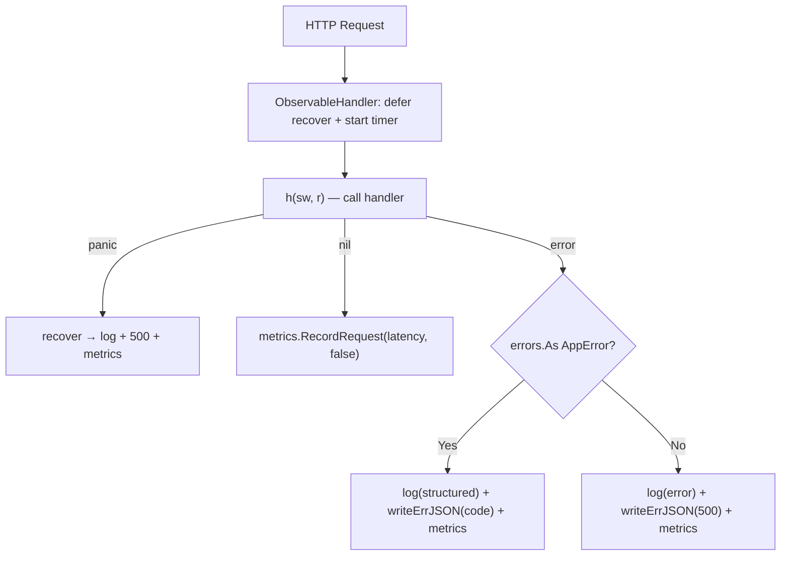
```mermaid
flowchart TD
    A["HTTP Request"] --> B["ObservableHandler: defer recover + start timer"]
    B --> C["h(sw, r) — call handler"]
    C -->|"panic"| D["recover → log + 500 + metrics"]
    C -->|"nil"| E["metrics.RecordRequest(latency, false)"]
    C -->|"error"| F{"errors.As AppError?"}
    F -->|"Yes"| G["log(structured) + writeErrJSON(code) + metrics"]
    F -->|"No"| H["log(error) + writeErrJSON(500) + metrics"]
```

**Execution Trace:**
```
POST /payment
  start timer
  h(w, r) → AppError{422, InsufficientFundsError}
  errors.As → match
  log: {"error_type":"InsufficientFundsError","trace_id":"trace-abc123"}
  HTTP 422 {"error":"insufficient funds"}
  metrics: requests=1, errors=1
```

### Interviewer Questions

1. How do you handle a panic that fires AFTER the handler has written a partial response?
2. Can we improve time/space further? What's the theoretical lower bound?
3. How does this scale to 10M elements / 1M concurrent requests?
4. Walk me through the edge case where `sw.written == true` when an error is returned.
5. How would you make this goroutine-safe?
6. What's the memory/GC impact? How would you reduce allocations?
7. How would you test this comprehensively?

### Follow-Up Questions

**Q1:** How would you replace the `Metrics` stub with real Prometheus?
**A1:**
```go
var (
    httpRequestsTotal = prometheus.NewCounterVec(prometheus.CounterOpts{
        Name: "http_requests_total",
    }, []string{"handler", "status"})
    httpDuration = prometheus.NewHistogramVec(prometheus.HistogramOpts{
        Name:    "http_request_duration_seconds",
        Buckets: prometheus.DefBuckets,
    }, []string{"handler"})
)
```
Call `httpRequestsTotal.WithLabelValues(name, strconv.Itoa(sw.status)).Inc()` in the middleware.

**Q2:** How do you propagate OpenTelemetry trace context from HTTP headers?
**A2:**
```go
import "go.opentelemetry.io/otel/propagation"
propagator := propagation.TraceContext{}
ctx = propagator.Extract(r.Context(), propagation.HeaderCarrier(r.Header))
ctx, span := tracer.Start(ctx, name)
defer span.End()
```
This extracts `traceparent` from the incoming request and creates a child span.

**Q3:** How do you prevent `json.Encoder` allocations on every request?
**A3:** Use a `sync.Pool` of `*bytes.Buffer` or pre-allocated response bodies for common responses (e.g., `{"error":"internal server error"}`). For fixed messages, write the raw bytes directly with `w.Write([]byte(...))`.

**Q4:** How would you add SLO alerting based on error rates?
**A4:** In Prometheus, define a recording rule: `error_rate = rate(http_errors_total[5m]) / rate(http_requests_total[5m])`. Alert when `error_rate > 0.01` (1% error budget breach). This is standard Google SRE SLO implementation.

**Q5:** How do you test that metrics are correctly incremented on error?
**A5:**
```go
m := &Metrics{}
rw := httptest.NewRecorder()
req := httptest.NewRequest("POST", "/", nil)
ObservableHandler("test", func(w http.ResponseWriter, r *http.Request) error {
    return &AppError{Code: 500, Message: "fail"}
}, m)(rw, req)
_, errs, _ := m.Snapshot()
if errs != 1 { t.Errorf("want 1 error recorded, got %d", errs) }
```

---

## Q20: Distributed Error Correlation with Context Propagation  [Level 6 — Production Level]

> **Tags:** `#distributed-systems` `#context-propagation` `#error-correlation` `#microservices`

### Problem Statement
Build a `CorrelatedError` system for microservices. Implement: (1) `type CorrelatedError struct` with `TraceID`, `SpanID`, `ServiceName`, `Err error` fields; (2) `PropagateError(ctx context.Context, err error) error` that wraps `err` with trace/span IDs extracted from context; (3) `ExtractCorrelation(err error) (traceID, spanID, service string, ok bool)` using `errors.As`; (4) an HTTP client middleware that adds trace headers and wraps downstream errors with correlation data.

### Input / Output / Constraints

```
Input:  ctx with traceID="t1" spanID="s1", err=ErrServiceUnavailable
Output: CorrelatedError{TraceID:"t1", SpanID:"s1", Service:"payment-svc", Err:ErrServiceUnavailable}

Input:  err = CorrelatedError{...} wrapped in fmt.Errorf
ExtractCorrelation → traceID="t1", spanID="s1", service="payment-svc", ok=true

Constraints:
  • Context carries trace/span via standard keys
  • errors.As traversal must work through arbitrary wrapping
  • Thread-safe: context is immutable
  • Time: O(d) for error chain depth d
```

### Thought Process

Think like a senior Go engineer:
1. **Understand:** In a microservice system, errors must carry enough context to correlate logs across services without requiring a central log aggregator at query time.
2. **Pattern:** Enrich errors at service boundaries with correlation IDs from context; extract at logging/alerting layer.
3. **Edge cases:** Missing trace/span in context (use empty strings), nil err (do not wrap), deeply nested error chains.
4. **Approach:** `CorrelatedError` implements `Unwrap() error` so `errors.As` and `errors.Is` work through it. `PropagateError` is called at every service boundary before returning upstream.

### Brute Force Solution

```go
package main

import "fmt"

// bruteForce — adds trace ID as a string prefix; not extractable
func bruteForce(ctx context.Context, err error) error {
    traceID := ctx.Value("traceID").(string)
    return fmt.Errorf("[traceID=%s] %v", traceID, err) // not parseable
}
```

**Time:** O(1) | **Space:** O(1)
**Bottleneck:** Trace ID is concatenated into the error string; callers must parse strings to extract it, which is fragile.

### Better Solution

```go
type CorrelatedError struct {
    TraceID string
    SpanID  string
    Err     error
}
func (e *CorrelatedError) Error() string  { return fmt.Sprintf("[%s/%s] %v", e.TraceID, e.SpanID, e.Err) }
func (e *CorrelatedError) Unwrap() error  { return e.Err }
```

**Time:** O(1) | **Space:** O(1)

### Best / Optimal Solution

```go
package main

import (
    "context"
    "errors"
    "fmt"
    "net/http"
    "time"
)

// Context keys for trace propagation
type ctxKey string

const (
    traceIDKey  ctxKey = "trace_id"
    spanIDKey   ctxKey = "span_id"
    serviceKey  ctxKey = "service"
)

// CorrelatedError enriches an error with distributed trace context.
type CorrelatedError struct {
    TraceID     string
    SpanID      string
    ServiceName string
    Timestamp   time.Time
    Err         error
}

func (e *CorrelatedError) Error() string {
    return fmt.Sprintf("service=%s trace=%s span=%s: %v",
        e.ServiceName, e.TraceID, e.SpanID, e.Err)
}

func (e *CorrelatedError) Unwrap() error { return e.Err }

// PropagateError wraps err with correlation data from ctx.
// Returns err unwrapped if ctx has no trace data (avoid wrapping nil).
// O(1) time, O(1) space.
func PropagateError(ctx context.Context, err error) error {
    if err == nil {
        return nil
    }
    traceID, _ := ctx.Value(traceIDKey).(string)
    spanID, _ := ctx.Value(spanIDKey).(string)
    service, _ := ctx.Value(serviceKey).(string)

    return &CorrelatedError{
        TraceID:     traceID,
        SpanID:      spanID,
        ServiceName: service,
        Timestamp:   time.Now(),
        Err:         err,
    }
}

// ExtractCorrelation finds the first CorrelatedError in the chain.
// O(d) time where d = error chain depth.
func ExtractCorrelation(err error) (traceID, spanID, service string, ok bool) {
    var ce *CorrelatedError
    if errors.As(err, &ce) {
        return ce.TraceID, ce.SpanID, ce.ServiceName, true
    }
    return "", "", "", false
}

// WithTraceContext returns a context enriched with trace data.
func WithTraceContext(ctx context.Context, traceID, spanID, service string) context.Context {
    ctx = context.WithValue(ctx, traceIDKey, traceID)
    ctx = context.WithValue(ctx, spanIDKey, spanID)
    ctx = context.WithValue(ctx, serviceKey, service)
    return ctx
}

// HTTPClientMiddleware adds trace headers to outbound requests and wraps errors.
type HTTPClientMiddleware struct {
    next    http.RoundTripper
    service string
}

func NewHTTPClientMiddleware(next http.RoundTripper, service string) *HTTPClientMiddleware {
    if next == nil {
        next = http.DefaultTransport
    }
    return &HTTPClientMiddleware{next: next, service: service}
}

// RoundTrip adds trace headers and wraps any transport error with correlation data.
func (m *HTTPClientMiddleware) RoundTrip(req *http.Request) (*http.Response, error) {
    // Inject trace headers into outbound request
    ctx := req.Context()
    if traceID, ok := ctx.Value(traceIDKey).(string); ok {
        req = req.Clone(ctx)
        req.Header.Set("X-Trace-ID", traceID)
    }
    if spanID, ok := ctx.Value(spanIDKey).(string); ok {
        req.Header.Set("X-Span-ID", spanID)
    }

    resp, err := m.next.RoundTrip(req)
    if err != nil {
        return nil, PropagateError(ctx, fmt.Errorf("http %s %s: %w", req.Method, req.URL.Path, err))
    }
    return resp, nil
}

var ErrServiceUnavailable = errors.New("service unavailable")

func main() {
    // Set up context with trace data
    ctx := WithTraceContext(context.Background(), "trace-123", "span-456", "payment-svc")

    // Simulate a downstream error
    downstreamErr := ErrServiceUnavailable
    propagated := PropagateError(ctx, fmt.Errorf("call inventory-svc: %w", downstreamErr))

    // Log and extract correlation
    fmt.Printf("Error: %v\n\n", propagated)

    traceID, spanID, svc, ok := ExtractCorrelation(propagated)
    fmt.Printf("Correlation extracted: ok=%v\n", ok)
    fmt.Printf("  TraceID: %s\n", traceID)
    fmt.Printf("  SpanID:  %s\n", spanID)
    fmt.Printf("  Service: %s\n", svc)

    // Verify errors.Is still works through CorrelatedError
    fmt.Printf("Is ErrServiceUnavailable: %v\n",
        errors.Is(propagated, ErrServiceUnavailable))

    // Wrap further and verify chain traversal
    doubleWrapped := fmt.Errorf("handler: %w", propagated)
    _, _, _, ok2 := ExtractCorrelation(doubleWrapped)
    fmt.Printf("ExtractCorrelation through fmt.Errorf wrap: %v\n", ok2)
}
```

**Time:** O(d) | **Space:** O(1) for extraction, O(1) for propagation

### Production Considerations

| Aspect | Details |
|--------|---------|
| **Scalability** | One CorrelatedError allocation per service boundary crossing; bounded by call depth |
| **Edge Cases** | Missing trace context (empty strings), nil err, same service calling itself (same trace, new span) |
| **Error Handling** | errors.Is traverses through CorrelatedError via Unwrap; root cause still detectable |
| **Memory** | One struct + string copies per propagation; use interned strings for service names |
| **Concurrency** | Context is immutable; CorrelatedError is immutable after creation; fully goroutine-safe |

### Visual Explanation

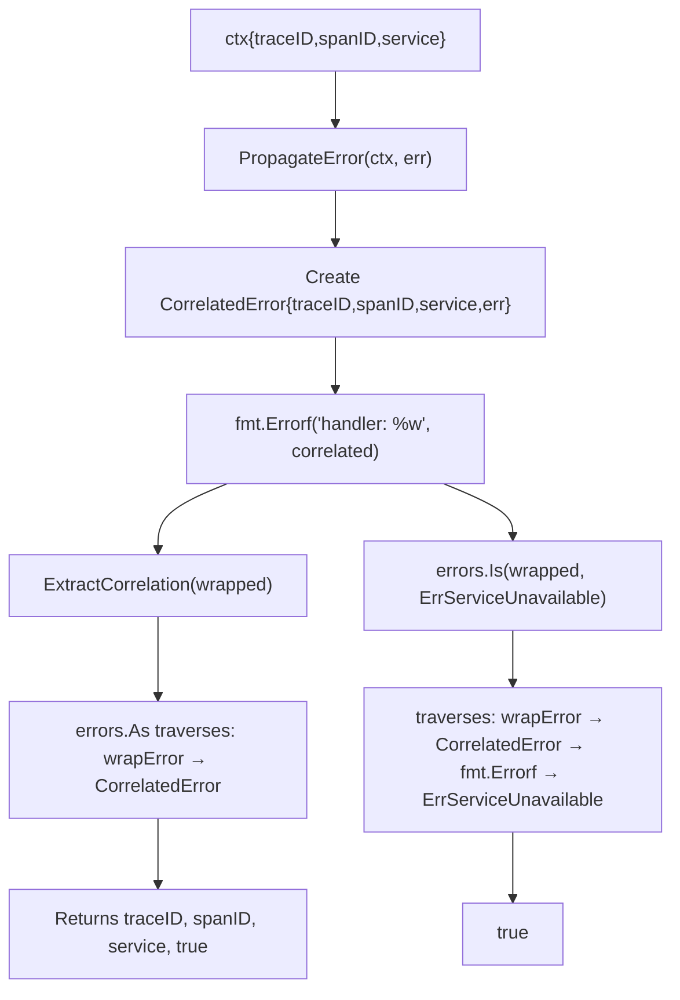
```mermaid
flowchart TD
    A["ctx{traceID,spanID,service}"] --> B["PropagateError(ctx, err)"]
    B --> C["Create CorrelatedError{traceID,spanID,service,err}"]
    C --> D["fmt.Errorf('handler: %w', correlated)"]
    D --> E["ExtractCorrelation(wrapped)"]
    E --> F["errors.As traverses: wrapError → CorrelatedError"]
    F --> G["Returns traceID, spanID, service, true"]
    D --> H["errors.Is(wrapped, ErrServiceUnavailable)"]
    H --> I["traverses: wrapError → CorrelatedError → fmt.Errorf → ErrServiceUnavailable"]
    I --> J["true"]
```

**Execution Trace:**
```
ctx = {trace:"trace-123", span:"span-456", service:"payment-svc"}
downstreamErr = ErrServiceUnavailable
propagated = CorrelatedError{TraceID:"trace-123", ..., Err: "call inventory-svc: service unavailable"}
doubleWrapped = "handler: [payment-svc trace-123 span-456]: call inventory-svc: service unavailable"
errors.As → finds CorrelatedError → traceID="trace-123"
errors.Is → finds ErrServiceUnavailable through 3 layers → true
```

### Interviewer Questions

1. Why use context for trace propagation instead of passing trace IDs explicitly?
2. Can we improve time/space further? What's the theoretical lower bound?
3. How does this scale to 10M elements / 1M concurrent requests?
4. Walk me through the edge case where the context has no trace ID.
5. How would you make this goroutine-safe?
6. What's the memory/GC impact? How would you reduce allocations?
7. How would you test this comprehensively?

### Follow-Up Questions

**Q1:** How does this integrate with OpenTelemetry's standard trace propagation?
**A1:** Replace the custom context keys with `go.opentelemetry.io/otel/trace`:
```go
span := trace.SpanFromContext(ctx)
sc := span.SpanContext()
traceID = sc.TraceID().String()
spanID  = sc.SpanID().String()
```
The `CorrelatedError` struct and `PropagateError` logic remain identical.

**Q2:** How do you avoid re-wrapping an already-CorrelatedError?
**A2:**
```go
func PropagateError(ctx context.Context, err error) error {
    if err == nil { return nil }
    var existing *CorrelatedError
    if errors.As(err, &existing) {
        return err // already correlated; do not double-wrap
    }
    // ... create new CorrelatedError
}
```

**Q3:** Should `CorrelatedError.Timestamp` use `time.Now()` or the request's start time?
**A3:** Use the request start time passed via context for accurate latency attribution. `time.Now()` at error creation captures when the error occurred, which is also useful for identifying slow downstream calls. Include both if budget allows.

**Q4:** How do you correlate errors across asynchronous message queues (Kafka, RabbitMQ)?
**A4:** Publish `traceID` and `spanID` as message headers. The consumer reads them and creates a new context: `ctx = WithTraceContext(ctx, traceID, spanID, "consumer-svc")`. Then use `PropagateError` normally. This creates a linked trace even across async boundaries.

**Q5:** How do you test that `ExtractCorrelation` works through arbitrary nesting depth?
**A5:**
```go
ctx := WithTraceContext(context.Background(), "t1", "s1", "svc1")
err := PropagateError(ctx, ErrServiceUnavailable)
for i := 0; i < 5; i++ {
    err = fmt.Errorf("layer%d: %w", i, err)
}
tid, _, _, ok := ExtractCorrelation(err)
if !ok || tid != "t1" {
    t.Errorf("failed to extract through %d layers", 5)
}
```

---

## Company-Style Questions

### Google Style Questions

**G1:** Given a function `Parse(input string) (Result, error)` that may return multiple error types, write a single `HandleParseError(err error) (httpCode int, userMsg string)` function that maps the error chain to appropriate HTTP codes using only `errors.Is` and `errors.As`. What is the time complexity of traversal for an error chain of depth D with B branches per node?

**G2:** Implement `errors.Join` from scratch (Go 1.20) and prove its correctness. Your implementation must satisfy: (a) `errors.Is(joined, target)` returns true if any constituent error matches target; (b) `joined.Error()` returns all messages newline-separated; (c) nil inputs are silently filtered. Analyze memory allocation behavior vs repeated `fmt.Errorf %w` wrapping.

**G3:** Design an error type that implements the `Is(target error) bool` method to allow range-based HTTP error matching: any `HTTPError` with status 4xx should match a sentinel `ErrClientError`, and 5xx should match `ErrServerError`. Ensure `errors.Is(err, ErrClientError)` returns true for all `HTTPError{Status: 400}` through `HTTPError{Status: 499}`. What is the amortized cost of checking N different errors against M sentinels?

**G4:** Write a `FlattenErrorChain(err error) []error` function that extracts all errors from a mixed chain (linear + multi-error tree) using BFS. Prove it visits every node exactly once. What is the space complexity in terms of maximum branching factor B and depth D?

---

### Uber Style Questions

**U1:** Design a rate-limited error logger for a real-time ride-matching service. Requirements: (a) max 100 errors/sec per error type; (b) burst of 500 allowed; (c) dropped errors must be counted and periodically flushed as a summary log; (d) latency p99 < 1µs per call. Describe the token bucket parameters, goroutine-safety mechanism, and how to avoid lock contention at 500K RPS.

**U2:** The driver-location service emits `LocationError` structs with `DriverID string` and `Err error`. Write a streaming error aggregator that receives `chan error`, groups `LocationError` by `DriverID`, and every 30 seconds emits a summary `map[string]int` of driver → error count. Handle context cancellation, non-LocationError passthrough, and backpressure when the consumer is slow. Target: O(1) space per driver in steady state.

**U3:** Implement a `RetryWithJitter` function for a payment authorization call that must complete within 500ms total. Use exponential backoff with full jitter (AWS recommended pattern). The function receives a `context.Context` with a 500ms deadline. Each attempt must check context before sleeping. After 3 attempts or context expiry (whichever is first), return a `RetryExhaustedError` with all three sub-errors collected. Analyze expected total wait time distribution.

**U4:** A surge pricing computation goroutine panics under load due to a nil pointer in a city fare matrix. Write a `SafeSurgePricer` that: (a) runs the computation in an isolated goroutine; (b) captures the panic with stack trace; (c) falls back to the base fare on panic; (d) emits a metric `surge_pricer_panics_total`; (e) re-tries the computation after 5 seconds. Ensure the fallback is goroutine-safe.

---

### Amazon Style Questions

**A1:** An order processing service calls three downstream services sequentially: Inventory, Payment, Shipping. Each can fail with domain-specific errors. Design an error handling strategy that: (a) compensates (reverse) completed steps on failure (saga pattern); (b) wraps each compensation error without losing the original; (c) returns a `SagaError` with the original cause AND any compensation failures; (d) allows callers to distinguish "saga compensation also failed" from "clean rollback". Write the `SagaError` type and `ExecuteWithCompensation` function.

**A2:** Your DynamoDB client occasionally returns transient `ConditionalCheckFailedException` and permanent `ValidationException`. Write a `ClassifyDynamoError(err error) ErrorClass` function with classes `Transient`, `Permanent`, `Unknown`. Implement a retry wrapper `DynamoRetry(ctx context.Context, op func() error) error` that retries transient errors with exponential backoff, passes permanent errors immediately, and wraps all errors with the operation name. How does this behave when the operation itself creates goroutines that fail?

**A3:** During Black Friday, an SNS notification fanout fails partially — 7 out of 10 subscribers succeed. Design a `FanoutResult` type that records per-subscriber success/failure, provides `SuccessCount()`, `FailureCount()`, and `FailedSubscribers() []string`, and implements `error` so the calling layer can do `if err != nil` without type asserting. How do you make this struct safe to pass across goroutine boundaries?

**A4:** An AWS Lambda function must handle three error categories differently: (a) user errors (400) → return as-is to API Gateway; (b) downstream timeouts (503) → retry the Lambda invocation by returning a specific error code; (c) unhandled panics → write to DLQ and return success (to prevent poison pill redelivery). Implement the Lambda error handler function and the DLQ writer. How do you test this without a real Lambda runtime?

---

### Stripe Style Questions

**S1:** Implement an idempotent payment processor `ProcessPayment(ctx context.Context, idemKey string, req PaymentRequest) (PaymentResult, error)`. It must: (a) check an in-memory store for a previous result by `idemKey`; (b) on duplicate, return the stored result without re-processing; (c) on first call, process and store atomically; (d) if processing fails after storage, return a `PaymentError` with `IsIdempotencyConflict bool` field so callers distinguish "already succeeded" from "already failed". Use sync.RWMutex for the store. Analyze race conditions.

**S2:** Stripe uses decimal arithmetic to avoid floating-point errors in amounts. Implement a `MoneyError` type for invalid money operations: `ErrNegativeAmount`, `ErrCurrencyMismatch`, `ErrAmountOverflow`. Write `Add(a, b Money) (Money, error)` and `Subtract(a, b Money) (Money, error)` where `Money` has `Amount int64` (cents) and `Currency string`. Implement `errors.Is` support for all three sentinels. Prove that all arithmetic paths are covered by table-driven tests.

**S3:** Design a `PaymentAuditLog` error wrapper that ensures every error returned from payment operations is logged to an immutable audit trail before being returned to the caller. The wrapper must: (a) accept a `Logger interface{ Log(ctx, entry AuditEntry) error }`; (b) if the logger itself fails, wrap both errors; (c) never suppress the original payment error even if logging fails; (d) add `RequestID`, `UserID`, `Amount`, `Timestamp` fields. How do you test that every payment error path is audited?

---

### Razorpay Style Questions

**R1:** A UPI payment flow has five steps: initiate → verify merchant → debit customer → send to NPCI → credit merchant. Any step can fail. Implement `UPITransactionError` with fields `Step string`, `NPCI_ErrorCode string`, `Retryable bool`, `Err error`. Write `ProcessUPI(ctx context.Context, req UPIRequest) error` that wraps each step's error with the step name. Write a `RetryPolicy(err error) (shouldRetry bool, after time.Duration)` function that returns retry parameters based on NPCI error codes. How do you handle the case where NPCI confirms the debit but the credit fails?

**R2:** Razorpay's reconciliation job processes 1M transactions per night. Write `ReconcileTransaction(tx Transaction) (ReconcileResult, error)` where failures can be: `MismatchError` (amount differs), `MissingError` (not in bank statement), `DuplicateError` (appears twice). Run reconciliation concurrently using a worker pool of 10 goroutines. Collect all errors into a `ReconciliationReport` with counts per error type. Use `errgroup` with limit. Analyze throughput and memory at 1M transactions.

**R3:** Build a high-availability payment gateway error handler. When the primary gateway returns a `GatewayError`, automatically failover to a secondary gateway. If the secondary also fails, return a `FailoverError` wrapping both errors. Implement with a `CircuitBreaker` per gateway (from Q13). Track failover count with `sync/atomic`. Ensure the total latency budget is honored via context timeout. How do you test failover behavior in unit tests without real gateways?

