> © 2024 Gaurav Patil — GoForge Platform. All rights reserved.

# Go Arrays & Slices — Coding Practice

---

## Q1: Declare and Traverse a Fixed Array  [Level 1 — Beginner]
> **Tags:** `#arrays` `#iteration` `#basics`

### Problem Statement
Declare a fixed-size integer array of length 5 in Go, initialise it with values, and print each element along with its index. Understand the difference between a value-type array and a reference-type slice. Demonstrate that assigning an array to another variable creates a full copy.

### Input / Output / Constraints
```
Input:  arr := [5]int{10, 20, 30, 40, 50}
Output: index 0 -> 10
        index 1 -> 20
        index 2 -> 30
        index 3 -> 40
        index 4 -> 50
Constraints: array length fixed at compile time; no external packages
```

### Thought Process
1. Understand: Arrays in Go are value types; the size is part of the type signature `[5]int != [6]int`.
2. Pattern: Simple `for i, v := range arr` traversal covers iteration; copy semantics shown by mutating copy.
3. Edge cases: Zero-length array `[0]int{}` is valid; accessing out-of-bounds panics at runtime.

### Brute Force
```go
// O(n) time, O(1) space
func bruteForce(arr [5]int) {
    for i := 0; i < len(arr); i++ {
        fmt.Printf("index %d -> %d\n", i, arr[i])
    }
}
```
**Time:** O(n) | **Space:** O(1)

### Better Solution
```go
func better(arr [5]int) {
    for i, v := range arr {
        fmt.Printf("index %d -> %d\n", i, v)
    }
}
```
**Time:** O(n) | **Space:** O(1)

### Best Solution
```go
package main

import "fmt"

// TraverseArray — O(n) time, O(1) space
func TraverseArray(arr [5]int) {
    for i, v := range arr {
        fmt.Printf("index %d -> %d\n", i, v)
    }
}

func main() {
    arr := [5]int{10, 20, 30, 40, 50}
    TraverseArray(arr)

    // Demonstrate copy semantics
    copy := arr
    copy[0] = 999
    fmt.Println("original[0]:", arr[0])  // still 10
    fmt.Println("copy[0]:", copy[0])     // 999
}
```
**Time:** O(n) | **Space:** O(1)

### Production Considerations
| Aspect | Details |
|--------|---------|
| Scalability | Fixed arrays do not scale; prefer slices for dynamic data |
| Edge Cases | Out-of-bounds access panics; always validate index before access |
| Error Handling | No error return for traversal; panic recovery only if truly needed |
| Memory | Array lives on stack for small sizes; large arrays escape to heap |
| Concurrency | Arrays passed by value are inherently safe across goroutines |

### Visual Explanation
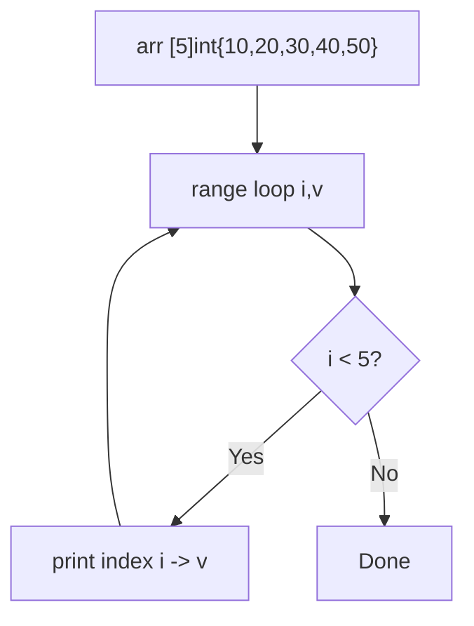
```
Trace: i=0,v=10 → i=1,v=20 → i=2,v=30 → i=3,v=40 → i=4,v=50 → exit
```

### Interviewer Questions
1. Why this approach? Range-based loop is idiomatic and avoids manual index arithmetic.
2. Can it be optimised? Traversal is already O(n) optimal; no further improvement possible.
3. Scale to 10M? Use a slice backed by a file or streaming reader instead of a fixed array.
4. Edge cases? Empty array compiles fine; zero iterations in loop.
5. Goroutine-safe? Value-type copy per goroutine is inherently safe.
6. Memory impact? Stack-allocated for small sizes; large arrays cause stack growth.
7. Alternative? Slices with `make` for runtime-determined sizes.

### Follow-Up Questions
**Q1:** What is the type of `[5]int` vs `[6]int`? **A1:** They are distinct types in Go; incompatible at compile time.
**Q2:** How do you pass an array without copying? **A2:** Pass a pointer `*[5]int` or convert to slice `arr[:]`.
**Q3:** What does `len` return for `[5]int`? **A3:** Always 5, known at compile time.
**Q4:** Can you use `append` on an array? **A4:** No; `append` only works on slices.
**Q5:** How to initialise with all zeros? **A5:** `var arr [5]int` — Go zero-initialises all elements.

---

## Q2: Slice Internals — Pointer, Length, and Capacity  [Level 1 — Beginner]
> **Tags:** `#slices` `#internals` `#ptr-len-cap`

### Problem Statement
Demonstrate the three-field internal structure of a Go slice (pointer to backing array, length, capacity). Show how re-slicing changes `len` and `cap` without allocating a new array, and how two slices can share the same backing array leading to unexpected mutation.

### Input / Output / Constraints
```
Input:  base := []int{1, 2, 3, 4, 5}
        s1   := base[1:3]
        s2   := base[1:4]
Output: s1 len=2 cap=4 values=[2 3]
        s2 len=3 cap=4 values=[2 3 4]
        mutating s1[0] also changes s2[0] and base[1]
Constraints: no imports beyond fmt and unsafe for demonstration
```

### Thought Process
1. Understand: A slice header is `{ptr *T, len int, cap int}`; re-slicing moves the length window, not the pointer for the same start offset.
2. Pattern: Print `len`, `cap`, then mutate one slice and observe the shared effect.
3. Edge cases: `cap` of a sub-slice equals `cap(base) - startIndex`; cannot exceed original cap.

### Brute Force
```go
// O(1) time, O(1) space
func bruteForce() {
    base := []int{1, 2, 3, 4, 5}
    s1 := base[1:3]
    fmt.Println(len(s1), cap(s1)) // 2, 4
}
```
**Time:** O(1) | **Space:** O(1)

### Better Solution
```go
func better() {
    base := []int{1, 2, 3, 4, 5}
    s1 := base[1:3]
    s2 := base[1:4]
    fmt.Printf("s1 len=%d cap=%d %v\n", len(s1), cap(s1), s1)
    fmt.Printf("s2 len=%d cap=%d %v\n", len(s2), cap(s2), s2)
    s1[0] = 99
    fmt.Println("base after s1[0]=99:", base)
}
```
**Time:** O(1) | **Space:** O(1)

### Best Solution
```go
package main

import "fmt"

// SliceInternals — O(1) time, O(1) space
func SliceInternals() {
    base := []int{1, 2, 3, 4, 5}
    s1 := base[1:3] // ptr=&base[1], len=2, cap=4
    s2 := base[1:4] // ptr=&base[1], len=3, cap=4

    fmt.Printf("base: len=%d cap=%d %v\n", len(base), cap(base), base)
    fmt.Printf("s1:   len=%d cap=%d %v\n", len(s1), cap(s1), s1)
    fmt.Printf("s2:   len=%d cap=%d %v\n", len(s2), cap(s2), s2)

    // Mutation propagates through shared backing array
    s1[0] = 99
    fmt.Println("After s1[0]=99 —")
    fmt.Println("  base:", base)
    fmt.Println("  s1:  ", s1)
    fmt.Println("  s2:  ", s2)
}

func main() {
    SliceInternals()
}
```
**Time:** O(1) | **Space:** O(1)

### Production Considerations
| Aspect | Details |
|--------|---------|
| Scalability | Shared backing arrays save memory but introduce hidden mutation bugs |
| Edge Cases | Re-slicing beyond cap panics; always check cap before extending |
| Error Handling | Use `copy` to get an independent slice when mutation isolation is needed |
| Memory | Sub-slice keeps entire backing array alive — GC cannot collect unused prefix/suffix |
| Concurrency | Two goroutines writing to overlapping slices is a data race; use `copy` or channels |

### Visual Explanation
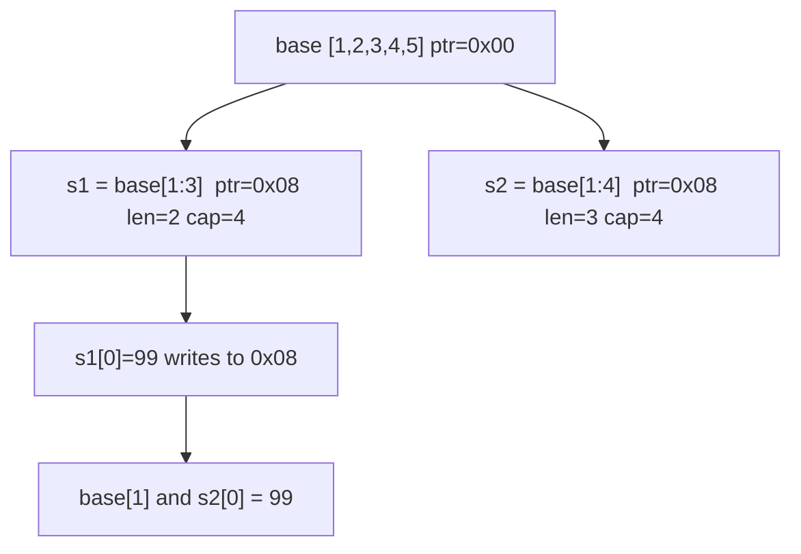
```
Trace: base[0x00..0x28] → s1 window [0x08..0x18] → s2 window [0x08..0x20] → shared write at 0x08
```

### Interviewer Questions
1. Why this approach? Directly shows the three-field struct without unsafe pointer arithmetic.
2. Can it be optimised? Demonstration is O(1); no optimisation needed.
3. Scale to 10M? At 10M elements, sub-slice leak keeps 80 MB alive; copy the needed portion.
4. Edge cases? `base[5:5]` gives len=0, cap=0 slice pointing past the array end.
5. Goroutine-safe? No; overlapping slice writes are a data race.
6. Memory impact? A 1-element sub-slice of a 10M-element backing array prevents GC of 79,999,999 elements.
7. Alternative? Use `copy` into a fresh slice to break the aliasing.

### Follow-Up Questions
**Q1:** What is the zero value of a slice? **A1:** `nil`; `len=0`, `cap=0`, `ptr=nil`.
**Q2:** Is `nil` slice usable with `append`? **A2:** Yes; `append` on a nil slice allocates a new backing array.
**Q3:** How to get an independent copy? **A3:** `dst := make([]int, len(src)); copy(dst, src)`.
**Q4:** What happens with `base[1:10]`? **A4:** Panic — index 10 out of range for cap 5.
**Q5:** Can cap ever be less than len? **A5:** No; Go guarantees `cap >= len` always.

---

## Q3: Append and Slice Growth Strategy  [Level 2 — Easy]
> **Tags:** `#append` `#growth` `#capacity`

### Problem Statement
Observe how Go's runtime doubles (then uses a more nuanced growth formula for large slices) the backing array when `append` exceeds capacity. Write a function that appends elements one by one and logs the capacity each time it changes, so the growth steps are visible. Understand when a new backing array is allocated.

### Input / Output / Constraints
```
Input:  append 10 integers one-by-one starting from empty slice
Output: cap changes: 1 -> 2 -> 4 -> 8 -> 16  (runtime-specific)
Constraints: Go 1.18+; capacity growth formula changed in Go 1.18 for large slices
```

### Thought Process
1. Understand: When `len == cap`, `append` allocates a new array (roughly 2x for small slices), copies old data, returns a new slice header.
2. Pattern: Track previous cap; log whenever `cap(s)` increases.
3. Edge cases: Pre-allocated slice with `make([]int, 0, 100)` never reallocates for the first 100 appends.

### Brute Force
```go
// O(n) time, O(n) space
func bruteForce(n int) []int {
    var s []int
    for i := 0; i < n; i++ {
        s = append(s, i)
    }
    return s
}
```
**Time:** O(n) amortised | **Space:** O(n)

### Better Solution
```go
func better(n int) {
    var s []int
    prev := 0
    for i := 0; i < n; i++ {
        s = append(s, i)
        if cap(s) != prev {
            fmt.Printf("len=%d cap=%d\n", len(s), cap(s))
            prev = cap(s)
        }
    }
}
```
**Time:** O(n) amortised | **Space:** O(n)

### Best Solution
```go
package main

import "fmt"

// ObserveGrowth — O(n) amortised time, O(n) space
func ObserveGrowth(n int) []int {
    s := make([]int, 0) // len=0, cap=0
    prevCap := 0
    for i := 0; i < n; i++ {
        s = append(s, i)
        if c := cap(s); c != prevCap {
            fmt.Printf("append %d: len=%d cap=%d (grew from %d)\n", i, len(s), c, prevCap)
            prevCap = c
        }
    }
    return s
}

func main() {
    ObserveGrowth(20)
    // Pre-allocate: zero reallocations
    pre := make([]int, 0, 20)
    for i := 0; i < 20; i++ {
        pre = append(pre, i)
    }
    fmt.Println("pre-allocated cap never changed:", cap(pre))
}
```
**Time:** O(n) amortised | **Space:** O(n)

### Production Considerations
| Aspect | Details |
|--------|---------|
| Scalability | Pre-allocate with `make([]T, 0, knownSize)` to eliminate reallocations |
| Edge Cases | Go 1.18+ changed growth formula; don't hardcode expected capacities in tests |
| Error Handling | `append` never returns an error; OOM causes a runtime panic |
| Memory | Each reallocation copies all existing elements; O(n) total copy work |
| Concurrency | Never append to the same slice from multiple goroutines without a mutex |

### Visual Explanation
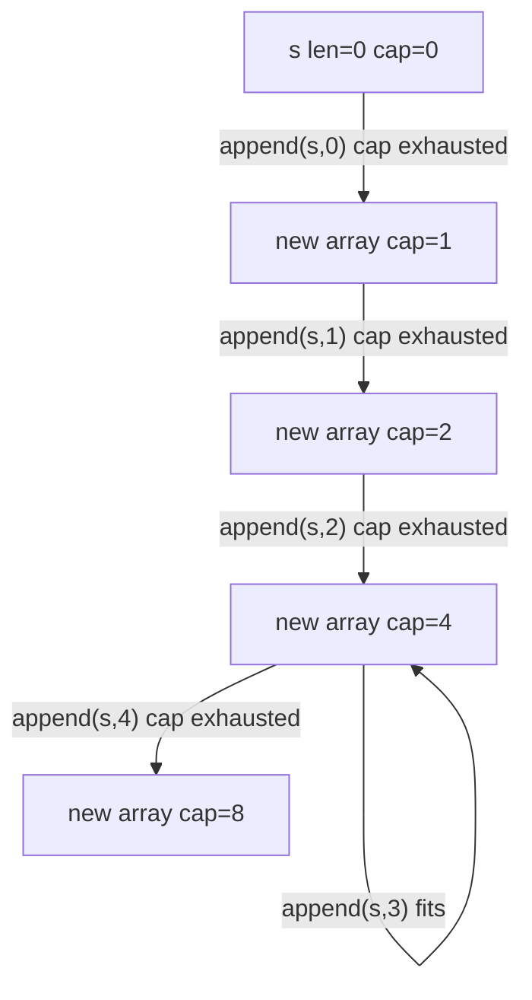
```
Trace: cap 0→1→2→4→8→16 (doubling pattern for small slices)
```

### Interviewer Questions
1. Why this approach? Amortised O(1) append is a fundamental trade-off between alloc cost and copy cost.
2. Can it be optimised? Yes — pre-allocate when size is known.
3. Scale to 10M? Without pre-allocation: ~24 reallocations; with pre-alloc: zero.
4. Edge cases? Growth formula is runtime-specific; Go 1.18 changed behaviour above 256 elements.
5. Goroutine-safe? No; concurrent appends to shared slice require synchronisation.
6. Memory impact? Without pre-alloc, peak memory is ~2x final size during last reallocation.
7. Alternative? `sync.Pool` for frequently reused large slices.

### Follow-Up Questions
**Q1:** Does `append` always return a new slice? **A1:** Only when cap is exceeded; otherwise returns the same backing array with updated len.
**Q2:** What if two variables hold the same slice and one appends past cap? **A2:** The appending variable gets a new backing array; the other still points to the old one.
**Q3:** How many total element copies happen appending n items from empty? **A3:** Approximately 2n copies total (amortised analysis).
**Q4:** Can you shrink cap? **A4:** Not directly; use `s = s[:newLen:newLen]` (three-index) or copy into a smaller slice.
**Q5:** What is `append(s, other...)` syntax? **A5:** Unpacks `other` slice and appends all its elements to `s`.

---

## Q4: Three-Index Slice — Limiting Capacity  [Level 2 — Easy]
> **Tags:** `#three-index-slice` `#capacity` `#safety`

### Problem Statement
Use the three-index slice expression `s[low:high:max]` to create a slice where the capacity is explicitly limited to `max - low`. This prevents the sub-slice from accidentally overwriting elements of the original backing array beyond its intended range. Implement a function that returns a safe sub-slice using three-index syntax.

### Input / Output / Constraints
```
Input:  base := []int{1, 2, 3, 4, 5, 6}
        safe := safeSlice(base, 1, 3)  // elements [2,3], cap limited to 2
Output: safe=[2 3] len=2 cap=2
        appending to safe does NOT modify base[3]
Constraints: Go 1.2+; 0 <= low <= high <= max <= cap(base)
```

### Thought Process
1. Understand: Normal `base[1:3]` gives cap=5; `base[1:3:3]` gives cap=2, preventing writes to base[3..5].
2. Pattern: Three-index limits the "runway" of the sub-slice so `append` always allocates fresh.
3. Edge cases: `max < high` is a compile/runtime error; `max > cap(base)` panics.

### Brute Force
```go
// O(1) time, O(1) space — two-index gives alias with full remaining cap
func bruteForce(base []int, low, high int) []int {
    return base[low:high] // dangerous: cap extends to end of base
}
```
**Time:** O(1) | **Space:** O(1)

### Better Solution
```go
func better(base []int, low, high int) []int {
    return base[low:high:high] // cap = high - low, safe
}
```
**Time:** O(1) | **Space:** O(1)

### Best Solution
```go
package main

import "fmt"

// SafeSubSlice — O(1) time, O(1) space
func SafeSubSlice(base []int, low, high int) ([]int, error) {
    if low < 0 || high > len(base) || low > high {
        return nil, fmt.Errorf("invalid bounds low=%d high=%d len=%d", low, high, len(base))
    }
    // Three-index: cap is exactly (high - low)
    return base[low:high:high], nil
}

func main() {
    base := []int{1, 2, 3, 4, 5, 6}
    safe, err := SafeSubSlice(base, 1, 3)
    if err != nil {
        fmt.Println("error:", err)
        return
    }
    fmt.Printf("safe=%v len=%d cap=%d\n", safe, len(safe), cap(safe))

    // Appending allocates new array — base[3] untouched
    safe = append(safe, 99)
    fmt.Println("base after append to safe:", base)
    fmt.Println("safe after append:", safe)
}
```
**Time:** O(1) | **Space:** O(1)

### Production Considerations
| Aspect | Details |
|--------|---------|
| Scalability | Three-index is zero-cost; use it whenever returning sub-slices from library functions |
| Edge Cases | Validate all three indices before slicing to avoid runtime panics |
| Error Handling | Return `error` for invalid bounds rather than letting it panic |
| Memory | Does not copy; both slices share memory up to the limited cap |
| Concurrency | Isolation via cap limit does not protect reads; still need synchronisation |

### Visual Explanation
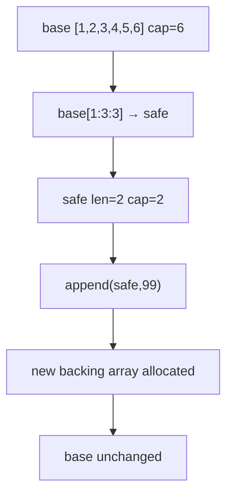
```
Trace: base[1:3] cap=5 (unsafe) vs base[1:3:3] cap=2 (safe) → append forces new alloc
```

### Interviewer Questions
1. Why this approach? Prevents caller from accidentally overwriting shared backing array.
2. Can it be optimised? Already O(1); no optimisation needed.
3. Scale to 10M? Pattern applies identically regardless of size.
4. Edge cases? max > cap(base) panics; always validate before slicing.
5. Goroutine-safe? Reads are safe if no concurrent writes; writes still need a mutex.
6. Memory impact? Same as two-index; no copy, no extra allocation.
7. Alternative? Deep copy with `copy` for complete isolation.

### Follow-Up Questions
**Q1:** When was three-index slicing introduced? **A1:** Go 1.2.
**Q2:** Can three-index be used on arrays? **A2:** Yes: `arr[low:high:max]` works on arrays too.
**Q3:** What if `low == high == max`? **A3:** Returns a zero-length, zero-capacity slice — perfectly valid.
**Q4:** Does three-index affect the original slice's cap? **A4:** No; it only affects the sub-slice's cap.
**Q5:** How does this help library designers? **A5:** They can return sub-slices without exposing the internal buffer to callers.

---

## Q5: Copy and Alias — Avoiding Shared Mutations  [Level 2 — Easy]
> **Tags:** `#copy` `#alias` `#deep-copy`

### Problem Statement
Demonstrate the difference between a slice alias (both variables point to the same backing array) and a true copy (independent memory). Implement a `DeepCopySlice` function using the built-in `copy` and show that mutations to the copy do not affect the original. Also show a common mistake where developers assume assignment creates a copy.

### Input / Output / Constraints
```
Input:  original := []int{1, 2, 3, 4, 5}
Output: alias mutation affects original: true
        copy mutation affects original:  false
Constraints: only built-in copy; no reflect or unsafe
```

### Thought Process
1. Understand: `alias := original` copies the slice header (ptr, len, cap), not the data. `copy(dst, src)` copies element values.
2. Pattern: Create alias, mutate, observe; create copy, mutate, observe.
3. Edge cases: `copy` returns the number of elements copied; `min(len(dst), len(src))`.

### Brute Force
```go
// O(n) time, O(n) space
func bruteForce(src []int) []int {
    dst := make([]int, len(src))
    for i, v := range src {
        dst[i] = v
    }
    return dst
}
```
**Time:** O(n) | **Space:** O(n)

### Better Solution
```go
func better(src []int) []int {
    dst := make([]int, len(src))
    copy(dst, src)
    return dst
}
```
**Time:** O(n) | **Space:** O(n)

### Best Solution
```go
package main

import "fmt"

// DeepCopySlice — O(n) time, O(n) space
func DeepCopySlice(src []int) []int {
    if src == nil {
        return nil
    }
    dst := make([]int, len(src))
    copy(dst, src)
    return dst
}

func main() {
    original := []int{1, 2, 3, 4, 5}

    // Alias — shared backing array
    alias := original
    alias[0] = 999
    fmt.Println("After alias[0]=999, original[0]:", original[0]) // 999

    // Reset
    original[0] = 1

    // True copy — independent memory
    copied := DeepCopySlice(original)
    copied[0] = 888
    fmt.Println("After copied[0]=888, original[0]:", original[0]) // still 1
    fmt.Println("copied[0]:", copied[0])                           // 888
}
```
**Time:** O(n) | **Space:** O(n)

### Production Considerations
| Aspect | Details |
|--------|---------|
| Scalability | `copy` is implemented with memmove; fastest possible for contiguous memory |
| Edge Cases | `copy` on nil src is safe (copies 0 elements); nil dst with len=0 is also safe |
| Error Handling | `copy` never errors; validate nil before returning to caller |
| Memory | Each copy allocates len*sizeof(T) bytes; expensive for very large slices |
| Concurrency | Once copied, the duplicate can be passed to goroutines without locking |

### Visual Explanation
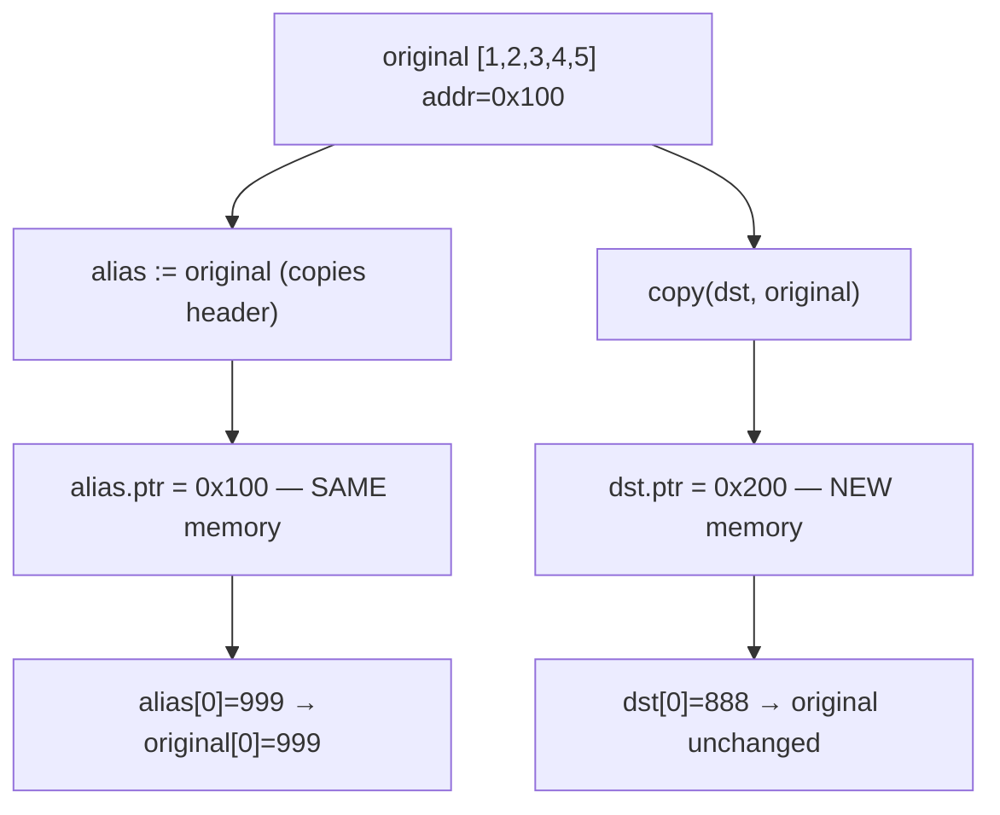
```
Trace: alias shares 0x100 → mutation visible in original; dst at 0x200 → isolated mutation
```

### Interviewer Questions
1. Why this approach? `copy` uses memmove under the hood — optimal for byte-level copying.
2. Can it be optimised? No; O(n) is the lower bound for a true copy.
3. Scale to 10M? 10M int64 = 80 MB; consider streaming or chunked processing.
4. Edge cases? `copy(dst, src)` where `len(dst) < len(src)` copies only `len(dst)` elements — silent truncation.
5. Goroutine-safe? The copy is independent; safe to share across goroutines after creation.
6. Memory impact? Doubles peak memory; consider whether a copy is truly necessary.
7. Alternative? `append([]int{}, src...)` is idiomatic one-liner for small slices.

### Follow-Up Questions
**Q1:** What does `append([]int{}, src...)` do differently from `copy`? **A1:** Both copy elements; `append` version may over-allocate capacity.
**Q2:** How many elements does `copy(dst, src)` copy if len(dst)=3, len(src)=5? **A2:** 3 — the minimum of both lengths.
**Q3:** Does `copy` work on string-to-byte-slice? **A3:** Yes: `copy(b []byte, s string)` is a special case.
**Q4:** Is there a `deepcopy` for nested slices? **A4:** No built-in; must recurse manually or use `encoding/json` round-trip as a hack.
**Q5:** What is the return value of `copy`? **A5:** The number of elements copied.

---

## Q6: Filter and Transform a Slice  [Level 2 — Easy]
> **Tags:** `#filter` `#transform` `#functional`

### Problem Statement
Implement two functions: `Filter` that returns a new slice containing only elements satisfying a predicate, and `Map` that applies a transformation to every element. Combine them to keep only even numbers and then double each. Demonstrate in-place filter using the "filter-in-place" idiom to avoid an extra allocation.

### Input / Output / Constraints
```
Input:  []int{1, 2, 3, 4, 5, 6, 7, 8, 9, 10}
Output: Filter(even) -> [2 4 6 8 10]
        Map(*2)      -> [4 8 12 16 20]
        In-place filter saves one allocation
Constraints: generic-friendly; Go 1.18+ generics optional
```

### Thought Process
1. Understand: Filter allocates a new slice; in-place filter reuses the backing array (alias risk if original is kept).
2. Pattern: Two-phase — accumulate matching indices into result, then transform.
3. Edge cases: Empty input; all filtered out; nil slice.

### Brute Force
```go
// O(n) time, O(n) space
func bruteForce(s []int) []int {
    var result []int
    for _, v := range s {
        if v%2 == 0 {
            result = append(result, v*2)
        }
    }
    return result
}
```
**Time:** O(n) | **Space:** O(n)

### Better Solution
```go
func Filter(s []int, pred func(int) bool) []int {
    out := s[:0:0] // reuse type, zero len&cap
    for _, v := range s {
        if pred(v) {
            out = append(out, v)
        }
    }
    return out
}

func MapSlice(s []int, fn func(int) int) []int {
    out := make([]int, len(s))
    for i, v := range s {
        out[i] = fn(v)
    }
    return out
}
```
**Time:** O(n) | **Space:** O(n)

### Best Solution
```go
package main

import "fmt"

// FilterInPlace — O(n) time, O(1) extra space (reuses backing array)
// WARNING: original slice shares memory after this call
func FilterInPlace(s []int, pred func(int) bool) []int {
    n := 0
    for _, v := range s {
        if pred(v) {
            s[n] = v
            n++
        }
    }
    return s[:n]
}

// MapSlice — O(n) time, O(n) space
func MapSlice(s []int, fn func(int) int) []int {
    out := make([]int, len(s))
    for i, v := range s {
        out[i] = fn(v)
    }
    return out
}

func main() {
    nums := []int{1, 2, 3, 4, 5, 6, 7, 8, 9, 10}

    evens := FilterInPlace(nums, func(v int) bool { return v%2 == 0 })
    fmt.Println("Filtered evens:", evens)

    doubled := MapSlice(evens, func(v int) int { return v * 2 })
    fmt.Println("Doubled:", doubled)
}
```
**Time:** O(n) | **Space:** O(1) for filter-in-place, O(n) for map

### Production Considerations
| Aspect | Details |
|--------|---------|
| Scalability | In-place filter avoids allocation; ideal for hot paths |
| Edge Cases | Nil slice returns nil; zero-element input returns empty slice |
| Error Handling | Predicate panics propagate up; wrap in recover if untrusted |
| Memory | In-place filter keeps original backing array alive via the returned slice |
| Concurrency | Never filter in-place on a slice shared across goroutines |

### Visual Explanation
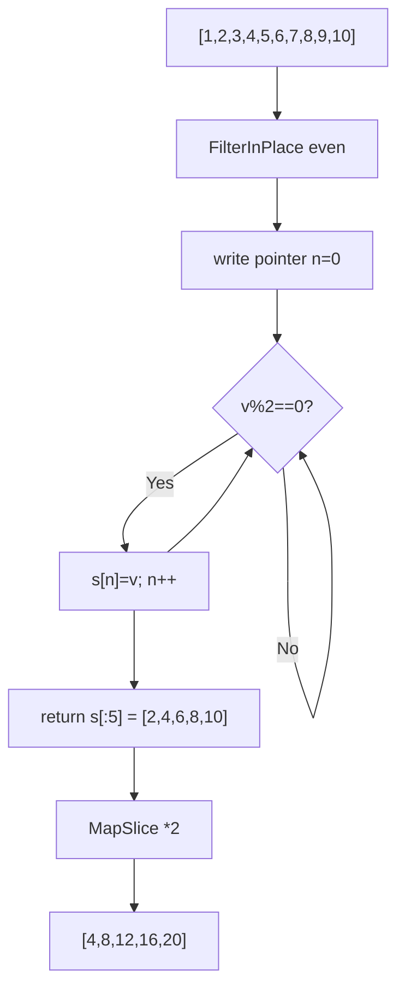
```
Trace: scan [1,2,3,4,5,6,7,8,9,10] → write evens in-place → s[:5]=[2,4,6,8,10] → double each
```

### Interviewer Questions
1. Why this approach? In-place filter eliminates allocation on the hot path.
2. Can it be optimised? SIMD-based filtering exists at the compiler level; no user-space improvement.
3. Scale to 10M? In-place is memory-optimal; streaming with channels for infinite data.
4. Edge cases? Empty and nil slices handled gracefully.
5. Goroutine-safe? In-place filter mutates the backing array; needs synchronisation.
6. Memory impact? In-place uses O(1) extra; allocating version uses O(k) where k = matching elements.
7. Alternative? Go 1.23 `slices.DeleteFunc` from stdlib.

### Follow-Up Questions
**Q1:** Is `slices.DeleteFunc` available in the stdlib? **A1:** Yes, since Go 1.21 in `golang.org/x/exp/slices`, stdlib `slices` in 1.21.
**Q2:** Why use `s[:0:0]` as starting accumulator? **A2:** Zero len and cap; `append` always allocates — no aliasing.
**Q3:** Can you chain Filter and Map without intermediate allocation? **A3:** Yes, combine into a single loop that filters and transforms in one pass.
**Q4:** How do generics help here? **A4:** `func Filter[T any](s []T, pred func(T) bool) []T` avoids code duplication per type.
**Q5:** What is the risk of in-place filter? **A5:** The original backing array is modified; any other slice sharing it sees the overwritten values.

---

## Q7: Delete Element — Order-Preserving vs Fast  [Level 3 — Medium]
> **Tags:** `#delete` `#order-preserving` `#swap-delete`

### Problem Statement
Implement two strategies to delete an element at index `i` from a slice. Strategy 1 (order-preserving): shift elements left using `copy`. Strategy 2 (fast/unordered): swap element with the last and truncate. Compare their time complexities and discuss when each is appropriate.

### Input / Output / Constraints
```
Input:  s=[1,2,3,4,5], delete index 2 (value 3)
Output: order-preserving: [1 2 4 5]
        fast (unordered): [1 2 5 4] or similar
Constraints: 0 <= i < len(s); in-place; no extra allocation
```

### Thought Process
1. Understand: Order-preserving needs a left-shift (copy), O(n). Fast-delete swaps with tail, O(1).
2. Pattern: `copy(s[i:], s[i+1:])` shifts left. `s[i] = s[len(s)-1]; s = s[:len(s)-1]` swaps tail.
3. Edge cases: Delete last element (no shift needed); delete first element (max shift); single-element slice.

### Brute Force
```go
// O(n) time, O(n) space — creates new slice
func bruteForce(s []int, i int) []int {
    result := make([]int, 0, len(s)-1)
    result = append(result, s[:i]...)
    result = append(result, s[i+1:]...)
    return result
}
```
**Time:** O(n) | **Space:** O(n)

### Better Solution
```go
// Order-preserving in-place O(n) time O(1) space
func DeleteOrdered(s []int, i int) []int {
    copy(s[i:], s[i+1:])
    return s[:len(s)-1]
}

// Fast unordered O(1) time O(1) space
func DeleteFast(s []int, i int) []int {
    s[i] = s[len(s)-1]
    return s[:len(s)-1]
}
```
**Time:** O(n) ordered, O(1) fast | **Space:** O(1)

### Best Solution
```go
package main

import "fmt"

// DeleteOrdered — O(n) time, O(1) space; preserves order
func DeleteOrdered(s []int, i int) ([]int, error) {
    if i < 0 || i >= len(s) {
        return s, fmt.Errorf("index %d out of range [0, %d)", i, len(s))
    }
    copy(s[i:], s[i+1:])
    s[len(s)-1] = 0 // zero out dangling reference (good for GC with pointer types)
    return s[:len(s)-1], nil
}

// DeleteFast — O(1) time, O(1) space; does NOT preserve order
func DeleteFast(s []int, i int) ([]int, error) {
    if i < 0 || i >= len(s) {
        return s, fmt.Errorf("index %d out of range [0, %d)", i, len(s))
    }
    s[i] = s[len(s)-1]
    s[len(s)-1] = 0 // zero dangling slot
    return s[:len(s)-1], nil
}

func main() {
    s1 := []int{1, 2, 3, 4, 5}
    s2 := []int{1, 2, 3, 4, 5}

    r1, _ := DeleteOrdered(s1, 2)
    r2, _ := DeleteFast(s2, 2)

    fmt.Println("OrderPreserving:", r1) // [1 2 4 5]
    fmt.Println("Fast(unordered):", r2) // [1 2 5 4]
}
```
**Time:** O(n) ordered, O(1) fast | **Space:** O(1)

### Production Considerations
| Aspect | Details |
|--------|---------|
| Scalability | Fast delete is O(1) — preferred for large slices where order does not matter |
| Edge Cases | Single-element slice: both strategies return empty slice correctly |
| Error Handling | Validate index; return error rather than panic for library code |
| Memory | Zero out the dropped slot to allow GC of pointer-typed elements |
| Concurrency | In-place mutation; protect with mutex if slice is shared |

### Visual Explanation
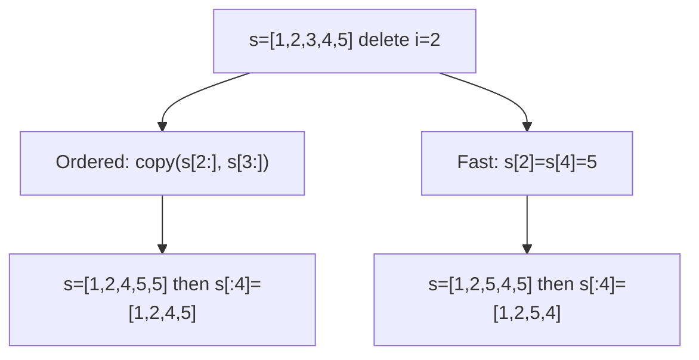
```
Trace Ordered: [1,2,3,4,5] → copy left → [1,2,4,5,5] → truncate → [1,2,4,5]
Trace Fast:    [1,2,3,4,5] → swap tail → [1,2,5,4,5] → truncate → [1,2,5,4]
```

### Interviewer Questions
1. Why this approach? Two O(1) vs O(n) strategies cover the full trade-off space.
2. Can it be optimised? Fast delete is already O(1); ordered delete cannot do better than O(n).
3. Scale to 10M? Fast delete is O(1) regardless of size; ordered delete is 10M shifts worst case.
4. Edge cases? Empty slice (i out of range), last element, first element.
5. Goroutine-safe? No; both mutate in place.
6. Memory impact? Zeroing dropped slots prevents memory leaks for pointer/interface slices.
7. Alternative? `slices.Delete` from Go 1.21 stdlib for ordered delete.

### Follow-Up Questions
**Q1:** Why zero out the dropped slot? **A1:** The backing array retains a pointer reference; zeroing allows the GC to collect the pointed-to object.
**Q2:** What is `slices.Delete` signature? **A2:** `func Delete[S ~[]E, E any](s S, i, j int) S` — deletes elements [i, j).
**Q3:** Can fast delete be used in a sorted slice? **A3:** No; it destroys order. Use ordered delete or a different data structure.
**Q4:** How to delete multiple indices efficiently? **A4:** Sort indices descending and delete from back to front to avoid shift invalidation.
**Q5:** What happens to len and cap after delete? **A5:** `len` decreases by 1; `cap` is unchanged — same backing array.

---

## Q8: Rotate a Slice  [Level 3 — Medium]
> **Tags:** `#rotate` `#two-pointer` `#in-place`

### Problem Statement
Rotate a slice of integers to the right by `k` positions in-place using O(1) extra space. For example, rotating `[1,2,3,4,5]` by 2 gives `[4,5,1,2,3]`. Implement the three-reversal algorithm. Also implement a left-rotation variant.

### Input / Output / Constraints
```
Input:  s=[1,2,3,4,5], k=2
Output: [4 5 1 2 3]
Constraints: 0 <= k <= 10^9; in-place O(1) space; handle k > len(s)
```

### Thought Process
1. Understand: Right-rotate by k == left-rotate by (n-k). Three-reversal: reverse all, reverse first k, reverse rest.
2. Pattern: k = k % n to handle large k. Three calls to `reverse(s, lo, hi)`.
3. Edge cases: k=0, k=n (no-op); k > n (use modulo); single-element slice.

### Brute Force
```go
// O(n*k) time, O(1) space
func bruteForce(s []int, k int) {
    n := len(s)
    k = k % n
    for i := 0; i < k; i++ {
        last := s[n-1]
        copy(s[1:], s[:n-1])
        s[0] = last
    }
}
```
**Time:** O(n*k) | **Space:** O(1)

### Better Solution
```go
// O(n) time, O(k) space
func better(s []int, k int) []int {
    n := len(s)
    k = k % n
    return append(s[n-k:], s[:n-k]...)
}
```
**Time:** O(n) | **Space:** O(n)

### Best Solution
```go
package main

import "fmt"

func reverse(s []int, lo, hi int) {
    for lo < hi {
        s[lo], s[hi] = s[hi], s[lo]
        lo++
        hi--
    }
}

// RotateRight — O(n) time, O(1) space; three-reversal algorithm
func RotateRight(s []int, k int) {
    n := len(s)
    if n == 0 {
        return
    }
    k = k % n
    if k == 0 {
        return
    }
    reverse(s, 0, n-1)   // reverse entire slice
    reverse(s, 0, k-1)   // reverse first k elements
    reverse(s, k, n-1)   // reverse remaining elements
}

// RotateLeft — O(n) time, O(1) space
func RotateLeft(s []int, k int) {
    n := len(s)
    if n == 0 {
        return
    }
    k = k % n
    RotateRight(s, n-k)
}

func main() {
    s := []int{1, 2, 3, 4, 5}
    fmt.Println("Before:", s)
    RotateRight(s, 2)
    fmt.Println("After RotateRight by 2:", s) // [4 5 1 2 3]

    s2 := []int{1, 2, 3, 4, 5}
    RotateLeft(s2, 2)
    fmt.Println("After RotateLeft  by 2:", s2) // [3 4 5 1 2]
}
```
**Time:** O(n) | **Space:** O(1)

### Production Considerations
| Aspect | Details |
|--------|---------|
| Scalability | O(n) three-reversal is optimal; no improvement possible for in-place rotation |
| Edge Cases | k=0, k=n, len=0, len=1 all handled with early returns |
| Error Handling | No error needed; invalid k normalised with modulo |
| Memory | Truly O(1) extra space — three in-place reversal passes |
| Concurrency | In-place mutation; synchronise if slice is shared |

### Visual Explanation
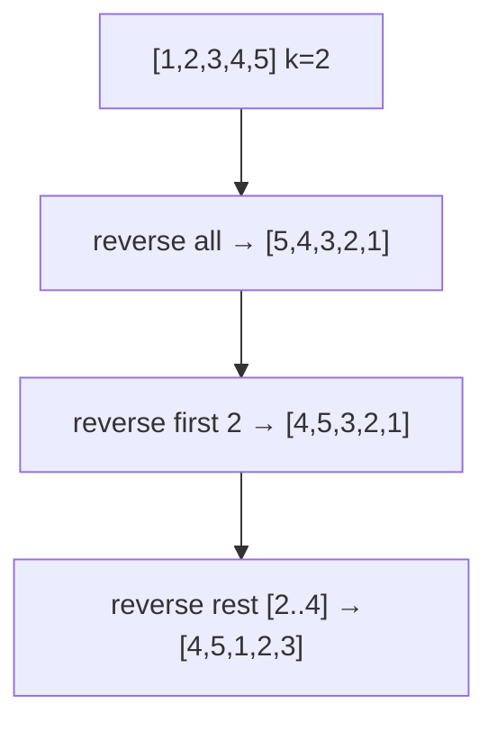
```
Trace: [1,2,3,4,5] →rev_all→ [5,4,3,2,1] →rev[0:2]→ [4,5,3,2,1] →rev[2:4]→ [4,5,1,2,3]
```

### Interviewer Questions
1. Why this approach? Three-reversal is optimal: O(n) time, O(1) space, no extra allocation.
2. Can it be optimised? No; each element must be visited at least once.
3. Scale to 10M? Three passes over 10M integers — fast in practice due to cache locality.
4. Edge cases? k > n handled by modulo; empty/single-element slice returned immediately.
5. Goroutine-safe? No; in-place writes require a mutex.
6. Memory impact? Zero additional heap allocation.
7. Alternative? Ring buffer / deque for frequent rotations on the same data.

### Follow-Up Questions
**Q1:** What is the time complexity of rotating a linked list vs slice? **A1:** Linked list O(n) but higher constant due to pointer chasing; slice O(n) with better cache.
**Q2:** Can you rotate a 2D slice? **A2:** Yes — rotate each row, or transpose + rotate for matrix rotation.
**Q3:** Why `k % n` before rotation? **A3:** k=n is a no-op; k=n+1 is same as k=1; modulo normalises.
**Q4:** How does reversal rotation compare to block-swap? **A4:** Same O(n) time; reversal is simpler to implement correctly.
**Q5:** Is there an `O(1)` rotation? **A5:** Only with an offset index (virtual rotation) without actually moving elements.

---

## Q9: Two-Pointer — Pair Sum in Sorted Slice  [Level 3 — Medium]
> **Tags:** `#two-pointer` `#sorted` `#pair-sum`

### Problem Statement
Given a sorted slice of integers and a target sum, find all unique pairs that sum to the target using the two-pointer technique. Return a slice of `[2]int` pairs. Handle duplicates so each pair appears only once in the result.

### Input / Output / Constraints
```
Input:  s=[1,1,2,3,4,5,5,6], target=6
Output: [[1 5] [2 4]]
Constraints: sorted input; -10^9 <= s[i] <= 10^9; target fits int64; no extra hash map
```

### Thought Process
1. Understand: Two pointers start at both ends; move inward based on sum vs target.
2. Pattern: When `s[l]+s[r]==target`, record pair and skip duplicates on both sides; move both pointers.
3. Edge cases: All duplicates (e.g., [2,2,2] target=4); no valid pair; single element.

### Brute Force
```go
// O(n^2) time, O(1) space
func bruteForce(s []int, target int) [][2]int {
    var result [][2]int
    for i := 0; i < len(s); i++ {
        for j := i + 1; j < len(s); j++ {
            if s[i]+s[j] == target {
                result = append(result, [2]int{s[i], s[j]})
            }
        }
    }
    return result
}
```
**Time:** O(n²) | **Space:** O(1)

### Better Solution
```go
// Hash set O(n) time O(n) space
func better(s []int, target int) [][2]int {
    seen := make(map[int]bool)
    var result [][2]int
    for _, v := range s {
        if seen[target-v] {
            result = append(result, [2]int{target - v, v})
            seen[v] = false // prevent duplicates
        }
        seen[v] = true
    }
    return result
}
```
**Time:** O(n) | **Space:** O(n)

### Best Solution
```go
package main

import "fmt"

// PairSum — O(n) time, O(1) space; two-pointer on sorted slice
func PairSum(s []int, target int) [][2]int {
    var result [][2]int
    l, r := 0, len(s)-1
    for l < r {
        sum := s[l] + s[r]
        switch {
        case sum == target:
            result = append(result, [2]int{s[l], s[r]})
            // Skip duplicates
            for l < r && s[l] == s[l+1] {
                l++
            }
            for l < r && s[r] == s[r-1] {
                r--
            }
            l++
            r--
        case sum < target:
            l++
        default:
            r--
        }
    }
    return result
}

func main() {
    s := []int{1, 1, 2, 3, 4, 5, 5, 6}
    pairs := PairSum(s, 6)
    fmt.Println("Pairs summing to 6:", pairs) // [[1 5] [2 4]]
}
```
**Time:** O(n) | **Space:** O(1)

### Production Considerations
| Aspect | Details |
|--------|---------|
| Scalability | O(n) single pass after O(n log n) sort; optimal for sorted input |
| Edge Cases | Overflow: use int64 for sum when elements near MaxInt32 |
| Error Handling | Validate that input is sorted; return error or sort internally |
| Memory | Result slice grows with number of pairs; bounded by n/2 |
| Concurrency | Read-only on input; result is per-call — safe to parallelise with range partitioning |

### Visual Explanation
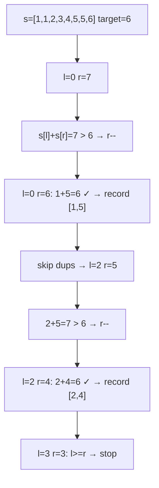
```
Trace: l=0,r=7 →7>6,r-- →l=0,r=6 sum=6 found →skip dups l=2,r=5 →7>6,r-- →l=2,r=4 sum=6 found →l=3=r done
```

### Interviewer Questions
1. Why this approach? O(n) time O(1) space — optimal for sorted input.
2. Can it be optimised? Already optimal; sorting first is O(n log n) if unsorted.
3. Scale to 10M? Single linear scan works; sort first if needed.
4. Edge cases? Integer overflow (use int64); all-same elements; no pairs.
5. Goroutine-safe? Read-only on shared slice; result is local — safe.
6. Memory impact? O(k) for k result pairs; k ≤ n/2.
7. Alternative? Hash map for unsorted input at cost of O(n) extra space.

### Follow-Up Questions
**Q1:** How to find triplets summing to target? **A1:** Fix one element with outer loop, apply two-pointer on the rest — O(n²).
**Q2:** What if the array is not sorted? **A2:** Sort first O(n log n) then apply two-pointer, or use a hash set O(n) space.
**Q3:** How to return indices instead of values? **A3:** Requires coordinate compression or hash map; two-pointer on values is simpler.
**Q4:** Can two-pointer find all k-tuples? **A4:** Generalises to k-SUM with k-2 nested loops + two-pointer — O(n^(k-1)).
**Q5:** What is the space complexity of the result? **A5:** O(n/2) in the worst case when all adjacent pairs sum to target.

---

## Q10: Sliding Window — Maximum Sum Subarray of Size K  [Level 3 — Medium]
> **Tags:** `#sliding-window` `#subarray` `#maximum`

### Problem Statement
Given a slice of integers and a window size `k`, find the maximum sum of any contiguous subarray of length exactly `k`. Use the sliding window technique to solve it in O(n) time. Return the maximum sum and the starting index of the window.

### Input / Output / Constraints
```
Input:  s=[2,1,5,1,3,2], k=3
Output: maxSum=9 at index=1  (subarray [1,5,3]... wait: [5,1,3]=9)
        Actually subarray s[2:5]=[5,1,3] sum=9
Constraints: 1 <= k <= len(s); s can contain negative numbers; len(s) >= 1
```

### Thought Process
1. Understand: Compute sum of first window, then slide right by adding next element and removing leftmost.
2. Pattern: `windowSum += s[i] - s[i-k]` on each step; track max and its start index.
3. Edge cases: k == len(s) (only one window); all negative numbers (max is least negative); k=1.

### Brute Force
```go
// O(n*k) time, O(1) space
func bruteForce(s []int, k int) (int, int) {
    maxSum, bestIdx := s[0], 0
    for i := 0; i <= len(s)-k; i++ {
        sum := 0
        for j := i; j < i+k; j++ {
            sum += s[j]
        }
        if sum > maxSum {
            maxSum, bestIdx = sum, i
        }
    }
    return maxSum, bestIdx
}
```
**Time:** O(n*k) | **Space:** O(1)

### Better Solution
```go
func better(s []int, k int) (int, int) {
    sum := 0
    for i := 0; i < k; i++ {
        sum += s[i]
    }
    maxSum, bestIdx := sum, 0
    for i := k; i < len(s); i++ {
        sum += s[i] - s[i-k]
        if sum > maxSum {
            maxSum, bestIdx = sum, i-k+1
        }
    }
    return maxSum, bestIdx
}
```
**Time:** O(n) | **Space:** O(1)

### Best Solution
```go
package main

import "fmt"

// MaxSumWindow — O(n) time, O(1) space; sliding window
func MaxSumWindow(s []int, k int) (maxSum int, startIdx int, err error) {
    n := len(s)
    if k <= 0 || k > n {
        return 0, -1, fmt.Errorf("invalid k=%d for slice length %d", k, n)
    }

    // Initialise first window
    windowSum := 0
    for i := 0; i < k; i++ {
        windowSum += s[i]
    }
    maxSum, startIdx = windowSum, 0

    // Slide the window
    for i := k; i < n; i++ {
        windowSum += s[i] - s[i-k]
        if windowSum > maxSum {
            maxSum = windowSum
            startIdx = i - k + 1
        }
    }
    return maxSum, startIdx, nil
}

func main() {
    s := []int{2, 1, 5, 1, 3, 2}
    maxSum, idx, err := MaxSumWindow(s, 3)
    if err != nil {
        fmt.Println("Error:", err)
        return
    }
    fmt.Printf("maxSum=%d startIdx=%d subarray=%v\n", maxSum, idx, s[idx:idx+3])
}
```
**Time:** O(n) | **Space:** O(1)

### Production Considerations
| Aspect | Details |
|--------|---------|
| Scalability | O(n) regardless of k; handles large slices efficiently |
| Edge Cases | k > len(s) returns error; all-negative handled correctly |
| Error Handling | Validate k before entering loop to avoid panic |
| Memory | O(1) extra; no auxiliary data structure needed |
| Concurrency | Read-only on input; result is per-call — safe to parallelise across disjoint ranges |

### Visual Explanation
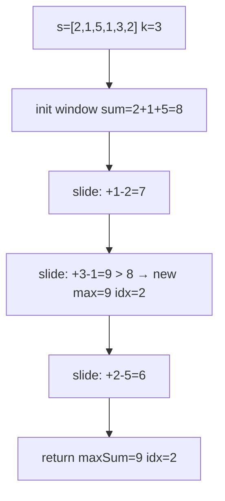
```
Trace: [2,1,5]=8 → [1,5,1]=7 → [5,1,3]=9★ → [1,3,2]=6 → max=9 at idx=2
```

### Interviewer Questions
1. Why this approach? Sliding window reduces O(n*k) brute force to O(n) by reusing overlap.
2. Can it be optimised? O(n) is optimal; every element must be visited at least once.
3. Scale to 10M? Single linear pass; works efficiently even at 10M elements.
4. Edge cases? k=1 (trivial), k=n (one window), negative numbers (no special handling needed).
5. Goroutine-safe? Read-only on shared slice; result is local — safe.
6. Memory impact? O(1) — only two integer variables maintained.
7. Alternative? Segment tree or sparse table for multiple range queries on the same array.

### Follow-Up Questions
**Q1:** How to find the minimum sum window of size k? **A1:** Same logic; change `>` to `<` when updating max/min.
**Q2:** How to handle variable-size windows (sum ≤ target)? **A2:** Use expandable sliding window: expand right, shrink left when constraint violated.
**Q3:** Can this solve "longest substring without repeating characters"? **A3:** Yes — variable window with a frequency map to track uniqueness.
**Q4:** What if elements are float64? **A4:** Same algorithm; accumulation error may require `math.Round` for equality checks.
**Q5:** How to return all windows with the maximum sum? **A5:** Collect all start indices where `windowSum == globalMax` in a second pass.

---

## Q11: Binary Search on a Sorted Slice  [Level 3 — Medium]
> **Tags:** `#binary-search` `#sorted` `#search`

### Problem Statement
Implement binary search on a sorted integer slice. Return the index of the target if found, or `-1` if not present. Then extend the implementation to find the leftmost and rightmost occurrence of the target (for duplicates). Use `sort.Search` from the stdlib as a third variant.

### Input / Output / Constraints
```
Input:  s=[1,2,2,3,4,4,4,5,6], target=4
Output: anyIndex=4 (or 5 or 6), leftmost=4, rightmost=6
Constraints: sorted ascending; -10^9 <= s[i] <= 10^9; len >= 0
```

### Thought Process
1. Understand: Binary search halves the search space each step → O(log n).
2. Pattern: `lo=0, hi=len-1`; mid = lo + (hi-lo)/2 to avoid overflow; branch on s[mid] vs target.
3. Edge cases: Empty slice; target not present; all elements equal to target.

### Brute Force
```go
// O(n) time, O(1) space
func bruteForce(s []int, target int) int {
    for i, v := range s {
        if v == target {
            return i
        }
    }
    return -1
}
```
**Time:** O(n) | **Space:** O(1)

### Better Solution
```go
func BinarySearch(s []int, target int) int {
    lo, hi := 0, len(s)-1
    for lo <= hi {
        mid := lo + (hi-lo)/2
        if s[mid] == target {
            return mid
        } else if s[mid] < target {
            lo = mid + 1
        } else {
            hi = mid - 1
        }
    }
    return -1
}
```
**Time:** O(log n) | **Space:** O(1)

### Best Solution
```go
package main

import (
    "fmt"
    "sort"
)

// BinarySearchAny — O(log n) time, O(1) space
func BinarySearchAny(s []int, target int) int {
    lo, hi := 0, len(s)-1
    for lo <= hi {
        mid := lo + (hi-lo)/2
        switch {
        case s[mid] == target:
            return mid
        case s[mid] < target:
            lo = mid + 1
        default:
            hi = mid - 1
        }
    }
    return -1
}

// LeftmostIndex — first occurrence
func LeftmostIndex(s []int, target int) int {
    idx := sort.SearchInts(s, target)
    if idx < len(s) && s[idx] == target {
        return idx
    }
    return -1
}

// RightmostIndex — last occurrence
func RightmostIndex(s []int, target int) int {
    idx := sort.SearchInts(s, target+1) - 1
    if idx >= 0 && s[idx] == target {
        return idx
    }
    return -1
}

func main() {
    s := []int{1, 2, 2, 3, 4, 4, 4, 5, 6}
    target := 4
    fmt.Println("Any index:  ", BinarySearchAny(s, target))
    fmt.Println("Leftmost:  ", LeftmostIndex(s, target))
    fmt.Println("Rightmost: ", RightmostIndex(s, target))
}
```
**Time:** O(log n) | **Space:** O(1)

### Production Considerations
| Aspect | Details |
|--------|---------|
| Scalability | O(log n) handles billions of elements efficiently |
| Edge Cases | Empty slice returns -1; target beyond range handled by lo > hi exit |
| Error Handling | Validate sorted precondition in debug builds; document the requirement |
| Memory | O(1) iterative; avoid recursive variant which uses O(log n) stack space |
| Concurrency | Read-only; completely safe for concurrent goroutines |

### Visual Explanation
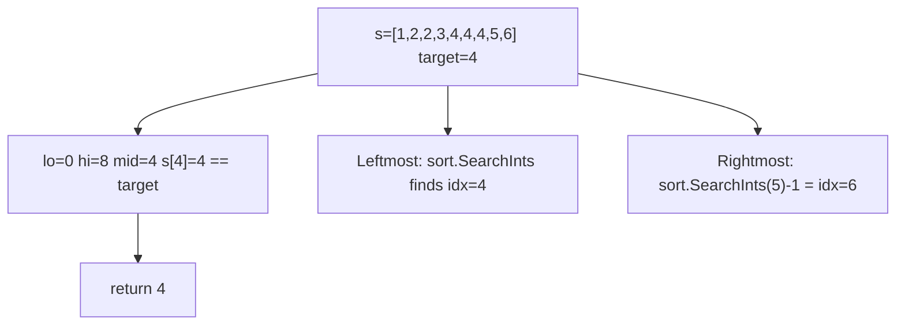
```
Trace: lo=0,hi=8 → mid=4 → s[4]=4 == target → return 4; leftmost=4, rightmost=6
```

### Interviewer Questions
1. Why `mid = lo + (hi-lo)/2`? To avoid integer overflow when lo+hi exceeds MaxInt.
2. Can it be optimised? O(log n) is the lower bound for comparison-based search on sorted data.
3. Scale to 10M? Binary search on 10M elements takes at most 24 comparisons.
4. Edge cases? Empty slice, single element, all duplicates, target at boundaries.
5. Goroutine-safe? Yes; purely read-only.
6. Memory impact? O(1) iterative vs O(log n) recursive stack frames.
7. Alternative? Interpolation search for uniformly distributed data — O(log log n) average.

### Follow-Up Questions
**Q1:** What does `sort.Search` do? **A1:** Binary search for the smallest index i where f(i) is true; f must be monotone.
**Q2:** How to search in a rotated sorted array? **A2:** Determine which half is sorted, then binary search in the correct half — still O(log n).
**Q3:** Can binary search find the insertion point? **A3:** Yes; `sort.SearchInts` returns the index where target would be inserted.
**Q4:** What is the off-by-one pitfall? **A4:** Using `hi = mid` vs `hi = mid - 1`; incorrect choice causes infinite loops.
**Q5:** How to binary search on a 2D sorted matrix? **A5:** Treat it as a 1D array of length m*n with index mapping row=i/n, col=i%n.

---

## Q12: sort.Slice and Custom Comparators  [Level 3 — Medium]
> **Tags:** `#sort` `#comparator` `#sort.Slice`

### Problem Statement
Use `sort.Slice` to sort a slice of structs by multiple fields. Sort a `[]Employee` first by Department ascending, then by Salary descending within the same department. Also demonstrate `sort.SliceStable` and `sort.Search` for binary search on the sorted result.

### Input / Output / Constraints
```
Input:  employees with Name, Department, Salary
Output: sorted by Dept ASC, then Salary DESC within dept
Constraints: stable sort required to preserve insertion order among equal-key records
```

### Thought Process
1. Understand: `sort.Slice(s, less)` is unstable; `sort.SliceStable` preserves relative order of equal elements.
2. Pattern: Multi-key comparator: primary key first, secondary key as tiebreaker.
3. Edge cases: Empty slice; all same department; negative salaries.

### Brute Force
```go
// Bubble sort O(n^2)
func bruteForce(emps []Employee) {
    for i := 0; i < len(emps); i++ {
        for j := 0; j < len(emps)-i-1; j++ {
            if emps[j].Department > emps[j+1].Department {
                emps[j], emps[j+1] = emps[j+1], emps[j]
            }
        }
    }
}
```
**Time:** O(n²) | **Space:** O(1)

### Better Solution
```go
sort.Slice(emps, func(i, j int) bool {
    if emps[i].Department != emps[j].Department {
        return emps[i].Department < emps[j].Department
    }
    return emps[i].Salary > emps[j].Salary // descending salary
})
```
**Time:** O(n log n) | **Space:** O(log n)

### Best Solution
```go
package main

import (
    "fmt"
    "sort"
)

type Employee struct {
    Name       string
    Department string
    Salary     int
}

// SortEmployees — O(n log n) time, O(log n) space (sort stack)
func SortEmployees(emps []Employee) {
    sort.SliceStable(emps, func(i, j int) bool {
        a, b := emps[i], emps[j]
        if a.Department != b.Department {
            return a.Department < b.Department // ASC
        }
        return a.Salary > b.Salary // DESC within dept
    })
}

// FindByDept — binary search for first employee in dept
func FindByDept(emps []Employee, dept string) int {
    idx := sort.Search(len(emps), func(i int) bool {
        return emps[i].Department >= dept
    })
    if idx < len(emps) && emps[idx].Department == dept {
        return idx
    }
    return -1
}

func main() {
    emps := []Employee{
        {"Alice", "Eng", 120000},
        {"Bob", "Eng", 95000},
        {"Carol", "HR", 80000},
        {"Dave", "Eng", 110000},
        {"Eve", "HR", 85000},
    }
    SortEmployees(emps)
    for _, e := range emps {
        fmt.Printf("%-8s %-4s %d\n", e.Name, e.Department, e.Salary)
    }
    idx := FindByDept(emps, "HR")
    fmt.Println("First HR employee at index:", idx)
}
```
**Time:** O(n log n) | **Space:** O(log n)

### Production Considerations
| Aspect | Details |
|--------|---------|
| Scalability | O(n log n) is optimal for comparison-based sort |
| Edge Cases | Empty slice handled gracefully; single element is already sorted |
| Error Handling | Comparator must define a strict weak order; violating this causes undefined behaviour |
| Memory | sort.Slice uses O(log n) stack for pdqsort (pattern-defeating quicksort) |
| Concurrency | Sort mutates the slice; do not concurrently read while sorting |

### Visual Explanation
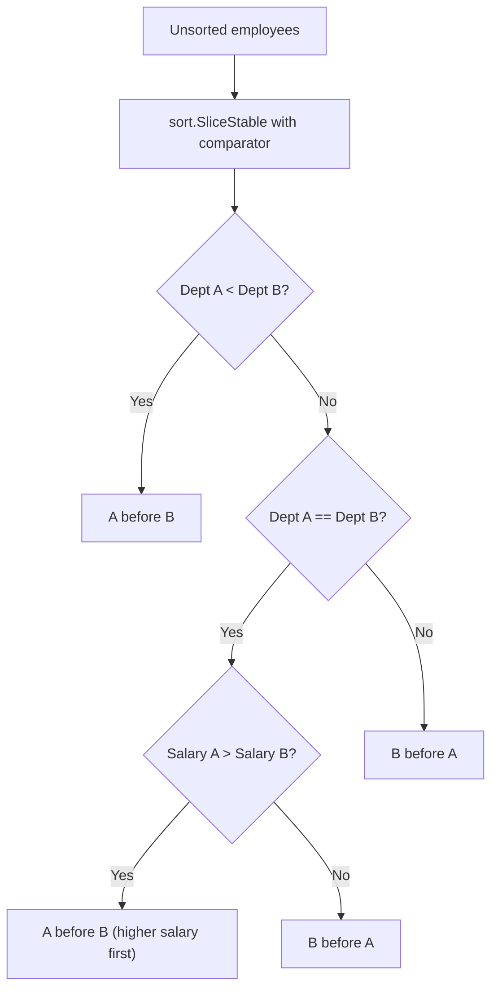
```
Trace: sort by Dept→ [Eng×3, HR×2]; within Eng sort by Salary DESC: Alice(120k),Dave(110k),Bob(95k)
```

### Interviewer Questions
1. Why `SliceStable` over `Slice`? To preserve original ordering among equal-key employees (e.g., insertion order matters).
2. Can it be optimised? Radix sort for integer keys; O(n) for fixed salary ranges.
3. Scale to 10M? External merge sort if data exceeds memory.
4. Edge cases? Invalid comparator (not a strict weak order) → undefined behaviour.
5. Goroutine-safe? No; sort.Slice mutates the slice.
6. Memory impact? O(log n) stack depth for pdqsort.
7. Alternative? Implement `sort.Interface` for reusable, type-safe sorting.

### Follow-Up Questions
**Q1:** What algorithm does `sort.Slice` use? **A1:** Pattern-defeating quicksort (pdqsort) since Go 1.19.
**Q2:** What is pdqsort? **A2:** A hybrid of quicksort, heapsort, and insertion sort for worst-case O(n log n).
**Q3:** How to sort in-place without `sort.Slice`? **A3:** Implement `sort.Interface` (Len, Swap, Less) and call `sort.Sort`.
**Q4:** How to sort and keep original indices? **A4:** Sort a slice of index-value pairs, then remap.
**Q5:** Is `sort.Slice` safe for concurrent read after sort? **A5:** Yes, once sort completes; the slice is immutable during concurrent reads.

---

## Q13: 2D Slices — Matrix Operations  [Level 4 — Advanced]
> **Tags:** `#2D-slices` `#matrix` `#allocation`

### Problem Statement
Allocate a true 2D matrix in Go using a slice of slices, and implement matrix transposition. Discuss the difference between a flat 1D backing array (cache-friendly) and a slice-of-slices (flexible but pointer-indirect). Implement both and benchmark the access pattern.

### Input / Output / Constraints
```
Input:  3x4 matrix [[1,2,3,4],[5,6,7,8],[9,10,11,12]]
Output: transposed 4x3 [[1,5,9],[2,6,10],[3,7,11],[4,8,12]]
Constraints: rows >= 1; cols >= 1; in-place transpose only for square matrices
```

### Thought Process
1. Understand: Transpose swaps `m[i][j]` and `m[j][i]`; for non-square, new matrix needed.
2. Pattern: Allocate result of size `cols x rows`, then `result[j][i] = m[i][j]`.
3. Edge cases: 1x1 matrix; row matrix (1 row); column matrix (1 col); rectangular.

### Brute Force
```go
// Slice-of-slices: pointer indirect, flexible row lengths
func bruteForce(m [][]int) [][]int {
    rows, cols := len(m), len(m[0])
    t := make([][]int, cols)
    for i := range t {
        t[i] = make([]int, rows)
    }
    for i := 0; i < rows; i++ {
        for j := 0; j < cols; j++ {
            t[j][i] = m[i][j]
        }
    }
    return t
}
```
**Time:** O(rows*cols) | **Space:** O(rows*cols)

### Better Solution
```go
// Flat 1D backing array — cache-friendly
type Matrix struct {
    data []int
    rows, cols int
}

func (m *Matrix) At(r, c int) int      { return m.data[r*m.cols+c] }
func (m *Matrix) Set(r, c, v int)      { m.data[r*m.cols+c] = v }
```
**Time:** O(rows*cols) | **Space:** O(rows*cols)

### Best Solution
```go
package main

import "fmt"

// Matrix backed by flat slice — cache-friendly
type Matrix struct {
    data       []int
    rows, cols int
}

func NewMatrix(rows, cols int) *Matrix {
    return &Matrix{data: make([]int, rows*cols), rows: rows, cols: cols}
}

func (m *Matrix) At(r, c int) int  { return m.data[r*m.cols+c] }
func (m *Matrix) Set(r, c, v int)  { m.data[r*m.cols+c] = v }

// Transpose — O(rows*cols) time, O(rows*cols) space
func Transpose(m *Matrix) *Matrix {
    t := NewMatrix(m.cols, m.rows)
    for r := 0; r < m.rows; r++ {
        for c := 0; c < m.cols; c++ {
            t.Set(c, r, m.At(r, c))
        }
    }
    return t
}

func (m *Matrix) Print() {
    for r := 0; r < m.rows; r++ {
        for c := 0; c < m.cols; c++ {
            fmt.Printf("%4d", m.At(r, c))
        }
        fmt.Println()
    }
}

func main() {
    m := NewMatrix(3, 4)
    for r := 0; r < 3; r++ {
        for c := 0; c < 4; c++ {
            m.Set(r, c, r*4+c+1)
        }
    }
    fmt.Println("Original:")
    m.Print()
    fmt.Println("Transposed:")
    Transpose(m).Print()
}
```
**Time:** O(rows*cols) | **Space:** O(rows*cols)

### Production Considerations
| Aspect | Details |
|--------|---------|
| Scalability | Flat backing array has better cache locality for large matrices |
| Edge Cases | 0-row or 0-col matrix; validate before accessing data |
| Error Handling | Bounds-check wrapper methods prevent out-of-range panics |
| Memory | Flat: one allocation; slice-of-slices: rows+1 allocations — GC pressure |
| Concurrency | Row-independent transpose cells can be parallelised with goroutines per row |

### Visual Explanation
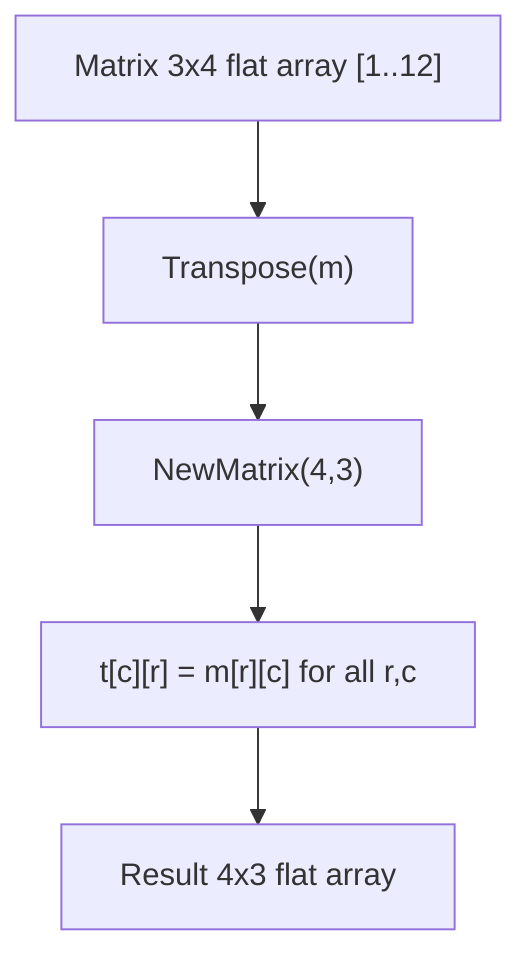
```
Trace: m.At(0,0)=1→t.Set(0,0,1); m.At(0,1)=2→t.Set(1,0,2); ... m.At(2,3)=12→t.Set(3,2,12)
```

### Interviewer Questions
1. Why flat array over slice-of-slices? Better cache locality; fewer allocations; rows guaranteed same length.
2. Can it be optimised? Cache-oblivious transposition (tiled/blocked) for large matrices.
3. Scale to 10M? 10M elements = 80 MB for int64; flat is ~3x faster than slice-of-slices due to cache.
4. Edge cases? 0-dimension matrices; validate before index arithmetic.
5. Goroutine-safe? Independent rows can be transposed in parallel; use `sync.WaitGroup`.
6. Memory impact? Flat: single allocation; slice-of-slices: rows+1 allocations, more GC pressure.
7. Alternative? BLAS libraries via cgo for high-performance matrix operations.

### Follow-Up Questions
**Q1:** How to allocate a slice-of-slices with one allocation? **A1:** Allocate a flat `rows*cols` slice, then create row headers pointing into it.
**Q2:** What is cache-oblivious transpose? **A2:** Recursively divide matrix into quadrants until they fit in cache; O(rows*cols/B) cache misses.
**Q3:** How to rotate a matrix 90 degrees? **A3:** Transpose then reverse each row (clockwise); transpose then reverse each column (counter-clockwise).
**Q4:** Can you do in-place transpose of a non-square matrix? **A4:** Yes, but it requires cycle-following which is complex; rectangular in-place transpose is non-trivial.
**Q5:** What package provides matrix operations in Go? **A5:** `gonum.org/v1/gonum/mat` is the standard Go matrix library.

---

## Q14: Avoid Backing-Array Leak with Full Slice Expression  [Level 4 — Advanced]
> **Tags:** `#memory-leak` `#GC` `#backing-array` `#production`

### Problem Statement
Demonstrate the "backing-array retention" memory problem: a small sub-slice keeps a large backing array alive in the GC. Implement a `SafeReturn` function that copies the needed elements into a minimal slice so the large backing array can be garbage collected. Use runtime statistics to show the memory difference.

### Input / Output / Constraints
```
Input:  large []int of 1,000,000 elements; return first 3
Output: leaked: GC cannot collect 1M backing array
        safe:   only 3 elements retained; backing array freed
Constraints: demonstrate with runtime.GC() + runtime.ReadMemStats
```

### Thought Process
1. Understand: `return large[:3]` returns a slice header still pointing to the 1M backing array.
2. Pattern: `result := make([]int, 3); copy(result, large[:3]); return result` — new backing array of size 3.
3. Edge cases: n == 0 (return nil); n >= len(large) (copy all, no leak possible).

### Brute Force
```go
// LEAKS: backing array kept alive
func bruteForce(large []int, n int) []int {
    return large[:n] // still points to large's backing array
}
```
**Time:** O(1) | **Space:** O(1) header, O(N) retained

### Better Solution
```go
// Safe: independent copy
func better(large []int, n int) []int {
    if n > len(large) {
        n = len(large)
    }
    result := make([]int, n)
    copy(result, large[:n])
    return result
}
```
**Time:** O(n) | **Space:** O(n)

### Best Solution
```go
package main

import (
    "fmt"
    "runtime"
)

// LeakyReturn — O(1) time, but retains large backing array
func LeakyReturn(large []int, n int) []int {
    return large[:n:n] // three-index limits cap but pointer still holds large
}

// SafeReturn — O(n) time, O(n) space; allows GC to collect large array
func SafeReturn(large []int, n int) []int {
    if n <= 0 {
        return nil
    }
    if n > len(large) {
        n = len(large)
    }
    result := make([]int, n)
    copy(result, large[:n])
    return result
}

func memAlloc() uint64 {
    var m runtime.MemStats
    runtime.ReadMemStats(&m)
    return m.Alloc
}

func main() {
    // Leaky path
    large1 := make([]int, 1_000_000)
    for i := range large1 { large1[i] = i }
    leaked := LeakyReturn(large1, 3)
    large1 = nil // original reference dropped, but backing array still alive via leaked
    runtime.GC()
    fmt.Printf("Leaky: retained=%v alloc=%d bytes\n", leaked, memAlloc())

    // Safe path
    large2 := make([]int, 1_000_000)
    for i := range large2 { large2[i] = i }
    safe := SafeReturn(large2, 3)
    large2 = nil // original AND backing array can be GC'd
    runtime.GC()
    fmt.Printf("Safe:  retained=%v alloc=%d bytes\n", safe, memAlloc())
}
```
**Time:** O(n) for SafeReturn | **Space:** O(n) — only n elements retained

### Production Considerations
| Aspect | Details |
|--------|---------|
| Scalability | Critical pattern for network/file parsers that return small slices from large read buffers |
| Edge Cases | n=0 returns nil; n>len returns a copy of the full slice |
| Error Handling | Document that SafeReturn always returns independent memory |
| Memory | Leaky: O(N) retained; Safe: O(n) retained where n << N |
| Concurrency | SafeReturn is safe — no shared state in the returned slice |

### Visual Explanation
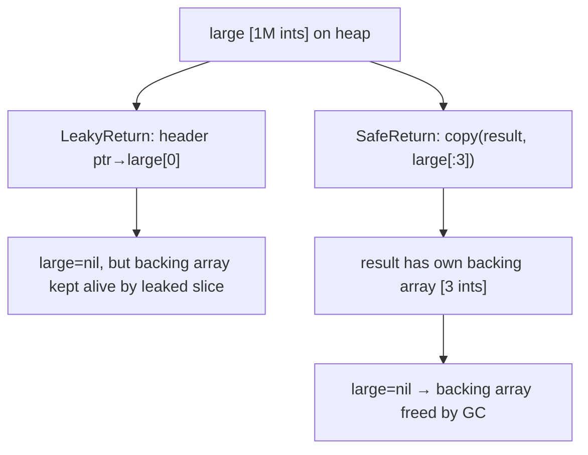
```
Trace: LeakyReturn → ptr still references 1M array → GC cannot collect → 8MB retained
       SafeReturn  → fresh 24-byte allocation → large array freed → minimal footprint
```

### Interviewer Questions
1. Why this approach? Prevent O(N) memory retention when only O(n) data is needed.
2. Can it be optimised? Copy is O(n); no way to avoid it for true independence.
3. Scale to 10M? A 10M-element buffer in a hot path can retain 80MB per goroutine; SafeReturn is essential.
4. Edge cases? n=0 returns nil; n≥len(large) copies everything — no leak possible.
5. Goroutine-safe? Yes; the returned copy is independent.
6. Memory impact? Leaky: retains N*8 bytes; safe: retains n*8 bytes.
7. Alternative? Three-index `large[:n:n]` limits cap but does NOT prevent backing-array retention.

### Follow-Up Questions
**Q1:** Does three-index slicing prevent the memory leak? **A1:** No; it limits the cap (preventing overwrites) but the pointer still references the large backing array.
**Q2:** How does pprof help diagnose this? **A2:** Heap profile shows large allocations with unexpectedly long lifetimes; use `go tool pprof` with `--alloc_space`.
**Q3:** Where is this pattern critical? **A3:** HTTP request parsers returning headers from a large read buffer; protobuf decoders.
**Q4:** Can the compiler detect this leak? **A4:** No; it is a semantic issue, not a memory safety issue in Go's GC model.
**Q5:** What is the idiomatic one-liner for safe copy? **A5:** `append([]int(nil), large[:n]...)` — appends to nil slice, always allocates fresh.

---

## Q15: Remove Duplicates from Sorted Slice  [Level 4 — Advanced]
> **Tags:** `#duplicates` `#in-place` `#two-pointer`

### Problem Statement
Remove duplicates from a sorted integer slice in-place and return the new length. The relative order must be preserved and elements beyond the new length may be anything. This is a classic interview problem (LeetCode 26 style) solved optimally with a write-pointer technique.

### Input / Output / Constraints
```
Input:  s=[1,1,2,2,2,3,4,4,5]
Output: s[:5]=[1,2,3,4,5], return 5
Constraints: sorted ascending; in-place O(1) extra space; len >= 0
```

### Thought Process
1. Understand: Two pointers: `write` tracks the next write position; `read` scans forward.
2. Pattern: If `s[read] != s[write-1]`, copy to `s[write]` and advance write.
3. Edge cases: Empty slice; single element; all duplicates; no duplicates.

### Brute Force
```go
// O(n) time, O(n) space — allocates new slice
func bruteForce(s []int) []int {
    if len(s) == 0 { return s }
    var result []int
    result = append(result, s[0])
    for i := 1; i < len(s); i++ {
        if s[i] != s[i-1] {
            result = append(result, s[i])
        }
    }
    return result
}
```
**Time:** O(n) | **Space:** O(n)

### Better Solution
```go
func RemoveDuplicates(s []int) int {
    if len(s) == 0 { return 0 }
    write := 1
    for read := 1; read < len(s); read++ {
        if s[read] != s[write-1] {
            s[write] = s[read]
            write++
        }
    }
    return write
}
```
**Time:** O(n) | **Space:** O(1)

### Best Solution
```go
package main

import "fmt"

// RemoveDuplicatesSorted — O(n) time, O(1) space; write-pointer technique
func RemoveDuplicatesSorted(s []int) ([]int, int) {
    if len(s) == 0 {
        return s, 0
    }
    write := 1
    for read := 1; read < len(s); read++ {
        if s[read] != s[write-1] {
            s[write] = s[read]
            write++
        }
    }
    // Zero out duplicates beyond write (good practice for pointer types)
    for i := write; i < len(s); i++ {
        s[i] = 0
    }
    return s[:write], write
}

func main() {
    s := []int{1, 1, 2, 2, 2, 3, 4, 4, 5}
    result, n := RemoveDuplicatesSorted(s)
    fmt.Printf("Unique elements: %v (count=%d)\n", result, n)
}
```
**Time:** O(n) | **Space:** O(1)

### Production Considerations
| Aspect | Details |
|--------|---------|
| Scalability | O(n) single pass; optimal for sorted data |
| Edge Cases | Empty slice, single element, all-same elements handled |
| Error Handling | Validate sorted precondition in debug/testing mode |
| Memory | In-place: no extra allocation; backing array contains garbage beyond `write` |
| Concurrency | Mutates in-place; protect with mutex if shared |

### Visual Explanation
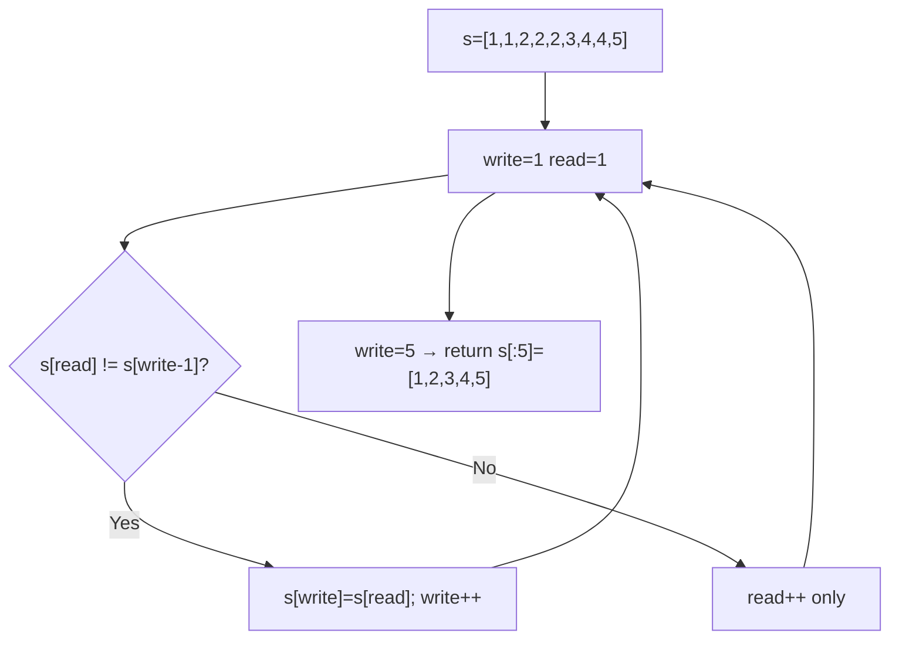
```
Trace: read=1,s[1]=1==s[0]=1 skip; read=2,s[2]=2≠1 write; read=3,s[3]=2==2 skip; ... → [1,2,3,4,5]
```

### Interviewer Questions
1. Why write-pointer? Single pass O(n), O(1) space — optimal.
2. Can it be optimised? No; each element must be examined.
3. Scale to 10M? Linear scan; works efficiently regardless of size.
4. Edge cases? All same → returns slice of length 1; empty → returns 0.
5. Goroutine-safe? No; in-place write.
6. Memory impact? Zeroing beyond `write` prevents pointer retention for interface/pointer slices.
7. Alternative? `slices.Compact` from Go 1.21 stdlib.

### Follow-Up Questions
**Q1:** How to handle `k` allowed duplicates (not just 1)? **A1:** Change condition to `s[read] != s[write-k]` — each element allowed up to k times.
**Q2:** How to remove duplicates from an unsorted slice? **A2:** Sort first O(n log n), then apply write-pointer; or use a hash set O(n) space.
**Q3:** What does `slices.Compact` do? **A3:** Replaces consecutive equal elements with one — equivalent to this algorithm.
**Q4:** Why zero out elements beyond `write`? **A4:** Prevents GC retention of pointer-typed elements that are logically deleted.
**Q5:** What is the return convention used by LeetCode for this problem? **A5:** Return new length only; in-place modification of the input slice is expected.

---

## Q16: Merge Two Sorted Slices  [Level 4 — Advanced]
> **Tags:** `#merge` `#sorted` `#two-pointer`

### Problem Statement
Merge two sorted integer slices into a single sorted slice. Implement the classic merge from merge-sort. Then implement an in-place merge of `[]int` where the first `m` elements are sorted and the remaining `n` elements are sorted (like LeetCode 88). Discuss space-time trade-offs.

### Input / Output / Constraints
```
Input:  a=[1,3,5,7], b=[2,4,6,8]
Output: merged=[1,2,3,4,5,6,7,8]
In-place: s=[1,3,5,7,0,0,0,0] m=4, n=4 → [1,2,3,4,5,6,7,8]
Constraints: both input slices sorted ascending; stable merge preferred
```

### Thought Process
1. Understand: Two pointers traverse both slices; always take the smaller head element.
2. Pattern: Allocate result of size m+n; fill from front (standard merge) or fill from back (in-place).
3. Edge cases: One empty slice; all elements in one slice smaller than the other.

### Brute Force
```go
// O((m+n) log(m+n)) — concatenate then sort
func bruteForce(a, b []int) []int {
    result := append(append([]int{}, a...), b...)
    sort.Ints(result)
    return result
}
```
**Time:** O((m+n) log(m+n)) | **Space:** O(m+n)

### Better Solution
```go
func MergeSorted(a, b []int) []int {
    result := make([]int, 0, len(a)+len(b))
    i, j := 0, 0
    for i < len(a) && j < len(b) {
        if a[i] <= b[j] {
            result = append(result, a[i]); i++
        } else {
            result = append(result, b[j]); j++
        }
    }
    result = append(result, a[i:]...)
    result = append(result, b[j:]...)
    return result
}
```
**Time:** O(m+n) | **Space:** O(m+n)

### Best Solution
```go
package main

import "fmt"

// MergeSorted — O(m+n) time, O(m+n) space
func MergeSorted(a, b []int) []int {
    result := make([]int, 0, len(a)+len(b))
    i, j := 0, 0
    for i < len(a) && j < len(b) {
        if a[i] <= b[j] {
            result = append(result, a[i])
            i++
        } else {
            result = append(result, b[j])
            j++
        }
    }
    result = append(result, a[i:]...)
    result = append(result, b[j:]...)
    return result
}

// MergeInPlace — O(m+n) time, O(1) space; merge from back to front
// s has length m+n; first m elements sorted, last n elements sorted
func MergeInPlace(s []int, m, n int) {
    i := m - 1   // last of first sorted section
    j := n - 1   // last of second sorted section (s[m..m+n-1])
    k := m + n - 1 // write position from back

    // Adjust j to be absolute index into s
    // Second section is s[m..m+n-1]
    jAbs := m + j

    for i >= 0 && jAbs >= m {
        if s[i] > s[jAbs] {
            s[k] = s[i]; i--
        } else {
            s[k] = s[jAbs]; jAbs--
        }
        k--
    }
    for jAbs >= m {
        s[k] = s[jAbs]; jAbs--; k--
    }
}

func main() {
    a := []int{1, 3, 5, 7}
    b := []int{2, 4, 6, 8}
    fmt.Println("Merged:", MergeSorted(a, b))

    s := []int{1, 3, 5, 7, 2, 4, 6, 8}
    MergeInPlace(s, 4, 4)
    fmt.Println("In-place merged:", s)
}
```
**Time:** O(m+n) | **Space:** O(m+n) standard, O(1) in-place

### Production Considerations
| Aspect | Details |
|--------|---------|
| Scalability | Standard merge allocates O(m+n); in-place is O(1) extra but tricky to get right |
| Edge Cases | Either slice empty; duplicate values across slices (stable merge preserves order) |
| Error Handling | Validate m+n == len(s) for in-place variant |
| Memory | Standard: pre-allocate with `make([]int, 0, m+n)` to avoid reallocations |
| Concurrency | Result is independent (standard); in-place modifies shared slice — needs mutex |

### Visual Explanation
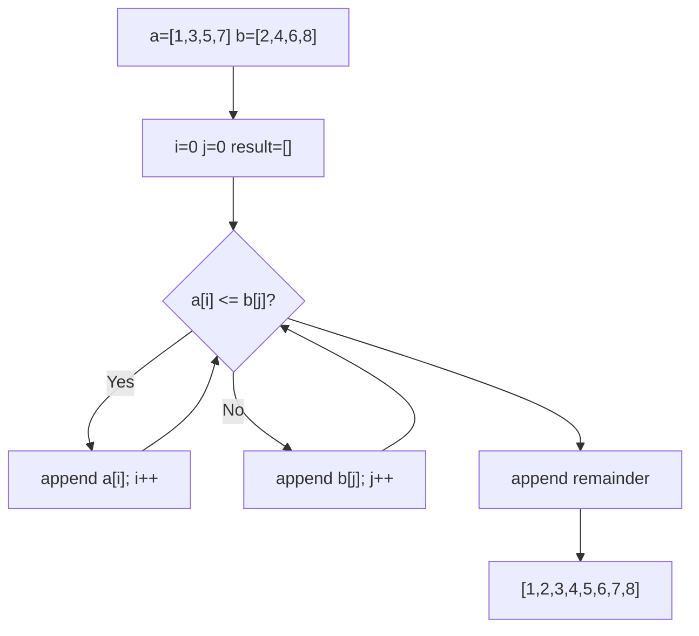
```
Trace: a[0]=1≤b[0]=2→take1; b[0]=2<a[1]=3→take2; a[1]=3≤b[1]=4→take3; ... → [1,2,3,4,5,6,7,8]
```

### Interviewer Questions
1. Why merge from back for in-place? Avoid overwriting unprocessed elements from the first section.
2. Can it be optimised? O(m+n) is optimal; every element must be placed.
3. Scale to 10M? External merge sort uses this as the merge step; applies to disk-based sorting.
4. Edge cases? m=0 or n=0; all elements of a < all of b (or vice versa).
5. Goroutine-safe? Standard merge result is independent; in-place needs synchronisation.
6. Memory impact? Standard allocates m+n elements; in-place is O(1) extra.
7. Alternative? `sort.Merge` does not exist in stdlib; use `sort.Sort` on combined slice as fallback.

### Follow-Up Questions
**Q1:** What is k-way merge? **A1:** Merge k sorted slices using a min-heap — O(N log k) where N is total elements.
**Q2:** How is merge used in external sort? **A2:** Sort chunks that fit in RAM, write to disk, then k-way merge the chunks.
**Q3:** Can you merge overlapping ranges in-place? **A3:** Yes, but requires tracking overlaps; in-place O(1) space is possible by shifting.
**Q4:** What stdlib function uses merge internally? **A4:** `sort.SliceStable` uses a stable sort based on merge sort.
**Q5:** When would you use merge over sort.Ints? **A5:** When both inputs are already sorted — O(m+n) vs O((m+n) log(m+n)).

---

## Q17: Find All Permutations of a Slice  [Level 4 — Advanced]
> **Tags:** `#permutations` `#backtracking` `#recursion`

### Problem Statement
Generate all permutations of a slice of distinct integers using backtracking with in-place swapping. Return a slice of slices. Implement an iterative version using Heap's algorithm as a follow-up. Understand the time complexity of generating n! permutations.

### Input / Output / Constraints
```
Input:  [1, 2, 3]
Output: [[1 2 3] [1 3 2] [2 1 3] [2 3 1] [3 2 1] [3 1 2]] (6 permutations)
Constraints: distinct elements; 1 <= len(s) <= 8 (8! = 40320)
```

### Thought Process
1. Understand: At each position, swap current element with each subsequent element, recurse, then swap back.
2. Pattern: `permute(s, start)`: for i from start to len-1, swap(s[start], s[i]), recurse(start+1), swap back.
3. Edge cases: Empty slice (1 permutation: []); single element (1 permutation).

### Brute Force
```go
// O(n! * n) time — generates all, sorts them (unnecessary)
func bruteForce(s []int) [][]int {
    var result [][]int
    var bt func(start int)
    bt = func(start int) {
        if start == len(s) {
            perm := make([]int, len(s))
            copy(perm, s)
            result = append(result, perm)
            return
        }
        for i := start; i < len(s); i++ {
            s[start], s[i] = s[i], s[start]
            bt(start + 1)
            s[start], s[i] = s[i], s[start]
        }
    }
    bt(0)
    return result
}
```
**Time:** O(n! * n) | **Space:** O(n! * n)

### Better Solution
```go
// Same backtracking — already optimal for generating all permutations
func Permutations(s []int) [][]int {
    result := make([][]int, 0, factorial(len(s)))
    var bt func(start int)
    bt = func(start int) {
        if start == len(s) {
            perm := make([]int, len(s))
            copy(perm, s)
            result = append(result, perm)
            return
        }
        for i := start; i < len(s); i++ {
            s[start], s[i] = s[i], s[start]
            bt(start + 1)
            s[start], s[i] = s[i], s[start]
        }
    }
    bt(0)
    return result
}
```
**Time:** O(n! * n) | **Space:** O(n! * n)

### Best Solution
```go
package main

import "fmt"

func factorial(n int) int {
    if n <= 1 { return 1 }
    return n * factorial(n-1)
}

// Permutations — O(n! * n) time, O(n! * n) space
// Uses in-place swap backtracking — minimises allocations during recursion
func Permutations(s []int) [][]int {
    result := make([][]int, 0, factorial(len(s)))
    var backtrack func(start int)
    backtrack = func(start int) {
        if start == len(s) {
            perm := make([]int, len(s))
            copy(perm, s)
            result = append(result, perm)
            return
        }
        for i := start; i < len(s); i++ {
            s[start], s[i] = s[i], s[start]
            backtrack(start + 1)
            s[start], s[i] = s[i], s[start] // restore
        }
    }
    backtrack(0)
    return result
}

func main() {
    s := []int{1, 2, 3}
    perms := Permutations(s)
    fmt.Printf("Total permutations: %d\n", len(perms))
    for _, p := range perms {
        fmt.Println(p)
    }
}
```
**Time:** O(n! * n) | **Space:** O(n! * n)

### Production Considerations
| Aspect | Details |
|--------|---------|
| Scalability | n=12 produces 479M permutations — impractical to store; use iterator/channel pattern |
| Edge Cases | Empty slice produces one empty permutation; single element produces itself |
| Error Handling | Validate n <= reasonable limit (e.g., 10) before generating |
| Memory | n! permutations each of length n — grows extremely fast |
| Concurrency | Send permutations over a channel to process without storing all at once |

### Visual Explanation
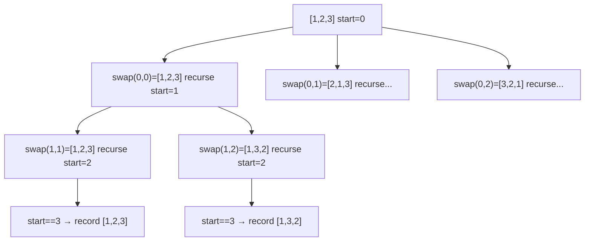
```
Trace: [1,2,3]→[1,2,3],[1,3,2]; [2,1,3]→[2,1,3],[2,3,1]; [3,2,1]→[3,2,1],[3,1,2]
```

### Interviewer Questions
1. Why backtracking? Generates each permutation exactly once without extra space per level.
2. Can it be optimised? Cannot generate fewer than n! permutations; per-permutation work is O(n) for copy.
3. Scale to 10M? Use channel-based streaming: emit permutations one at a time, process immediately.
4. Edge cases? Empty input; single element; duplicate elements (need deduplication logic).
5. Goroutine-safe? Backtracking mutates s in-place; don't share s across goroutines.
6. Memory impact? Pre-allocate result with `make([][]int, 0, n!)` to avoid repeated reallocations.
7. Alternative? Heap's algorithm (iterative) generates permutations with n-1 swaps each — slightly fewer swaps.

### Follow-Up Questions
**Q1:** How to generate permutations with duplicates? **A1:** Sort first, then skip duplicate choices at each level using `if i > start && s[i] == s[i-1]`.
**Q2:** What is Heap's algorithm? **A2:** Iterative permutation generation with minimal swaps — n! permutations using (n!-1) swaps total.
**Q3:** How to get the k-th permutation directly? **A3:** Factorial number system: divide k by (n-1)!, find the index, recurse — O(n²).
**Q4:** How to stream permutations via a channel? **A4:** Replace `append(result, perm)` with `ch <- perm` in a goroutine; close channel when done.
**Q5:** What is the time complexity for next_permutation (single step)? **A5:** O(n) — find rightmost ascent, swap with next larger, reverse suffix.

---

## Q18: Longest Increasing Subsequence (Patience Sort)  [Level 5 — Interview]
> **Tags:** `#LIS` `#binary-search` `#patience-sort` `#dynamic-programming`

### Problem Statement
Find the length of the longest strictly increasing subsequence (LIS) in a slice of integers. Implement the O(n²) DP solution first, then the O(n log n) patience sort solution using binary search. The patience sort approach maintains a `tails` array where `tails[i]` is the smallest tail element of all increasing subsequences of length `i+1`.

### Input / Output / Constraints
```
Input:  [10, 9, 2, 5, 3, 7, 101, 18]
Output: 4  (subsequence: [2, 3, 7, 18] or [2, 5, 7, 101])
Constraints: -10^4 <= s[i] <= 10^4; 1 <= len(s) <= 2500
```

### Thought Process
1. Understand: LIS is not necessarily contiguous. DP: `dp[i] = max(dp[j]+1) for all j<i where s[j]<s[i]`.
2. Pattern (patience sort): Maintain `tails`. For each element, binary search for leftmost tail >= element; replace or extend.
3. Edge cases: All decreasing → LIS=1; all increasing → LIS=n; single element → LIS=1.

### Brute Force
```go
// O(2^n) — generate all subsequences and find longest increasing
// Not practical; shown for completeness only
```
**Time:** O(2^n) | **Space:** O(n)

### Better Solution
```go
// O(n^2) DP
func LIS_DP(s []int) int {
    n := len(s)
    dp := make([]int, n)
    for i := range dp { dp[i] = 1 }
    best := 1
    for i := 1; i < n; i++ {
        for j := 0; j < i; j++ {
            if s[j] < s[i] && dp[j]+1 > dp[i] {
                dp[i] = dp[j] + 1
            }
        }
        if dp[i] > best { best = dp[i] }
    }
    return best
}
```
**Time:** O(n²) | **Space:** O(n)

### Best Solution
```go
package main

import (
    "fmt"
    "sort"
)

// LIS_PatienceSort — O(n log n) time, O(n) space
func LIS_PatienceSort(s []int) int {
    tails := make([]int, 0, len(s))
    for _, v := range s {
        // Find leftmost tail >= v (for strictly increasing: >=; for non-decreasing: >)
        pos := sort.SearchInts(tails, v)
        if pos == len(tails) {
            tails = append(tails, v) // extend LIS
        } else {
            tails[pos] = v // replace with smaller tail
        }
    }
    return len(tails)
}

func main() {
    s := []int{10, 9, 2, 5, 3, 7, 101, 18}
    fmt.Println("LIS (DP):          ", LIS_DP(s))
    fmt.Println("LIS (PatienceSort):", LIS_PatienceSort(s))
}

// O(n^2) DP for reference
func LIS_DP(s []int) int {
    n := len(s)
    if n == 0 { return 0 }
    dp := make([]int, n)
    for i := range dp { dp[i] = 1 }
    best := 1
    for i := 1; i < n; i++ {
        for j := 0; j < i; j++ {
            if s[j] < s[i] && dp[j]+1 > dp[i] {
                dp[i] = dp[j] + 1
            }
        }
        if dp[i] > best { best = dp[i] }
    }
    return best
}
```
**Time:** O(n log n) | **Space:** O(n)

### Production Considerations
| Aspect | Details |
|--------|---------|
| Scalability | O(n log n) handles 10^5 elements easily; O(n²) DP is too slow beyond 5000 |
| Edge Cases | Empty slice → 0; single element → 1; strictly vs non-strictly increasing changes `>=` to `>` |
| Error Handling | No error needed; pure computation |
| Memory | `tails` slice grows at most to len(s); typically much smaller |
| Concurrency | Read-only on input; result is a single integer — trivially safe |

### Visual Explanation
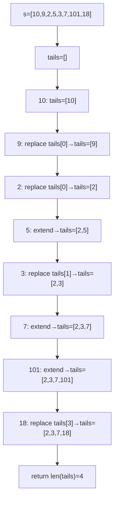
```
Trace: tails tracks smallest tail of each length; len(tails)=LIS length
```

### Interviewer Questions
1. Why patience sort? O(n log n) vs O(n²) DP; binary search on `tails` is the key insight.
2. Can it be optimised? O(n log n) is optimal for comparison-based LIS.
3. Scale to 10M? O(n log n) = ~230M ops for 10M — feasible in seconds.
4. Edge cases? All decreasing → tails never grows past length 1; all increasing → tails grows to n.
5. Goroutine-safe? Read-only on input; parallelise by partitioning and merging LIS results.
6. Memory impact? `tails` is at most length n; in practice much smaller.
7. Alternative? Segment tree for O(n log n) LIS reconstruction (when actual subsequence is needed).

### Follow-Up Questions
**Q1:** How to reconstruct the actual LIS (not just length)? **A1:** Maintain a parent array during DP; backtrack from the max dp[i] element.
**Q2:** What is the difference between LIS and LCS? **A2:** LIS is on one sequence; LCS (longest common subsequence) compares two sequences — different DP.
**Q3:** How to find LIS for non-strictly increasing? **A3:** Change `sort.SearchInts(tails, v)` to `sort.Search(len(tails), func(i int) bool { return tails[i] > v })`.
**Q4:** What real-world problem maps to LIS? **A4:** Patience sorting of cards; finding minimum number of piles in patience solitaire.
**Q5:** Can LIS be solved in O(n) time? **A5:** No; Ω(n log n) lower bound proven for comparison-based algorithms.

---

## Q19: Subarray Sum Equals K (Prefix Sum + Hash Map)  [Level 5 — Interview]
> **Tags:** `#prefix-sum` `#hash-map` `#subarray`

### Problem Statement
Given a slice of integers (possibly negative) and a target sum `k`, count the total number of contiguous subarrays whose elements sum to exactly `k`. Use the prefix-sum with hash map technique to achieve O(n) time and O(n) space.

### Input / Output / Constraints
```
Input:  s=[1, 1, 1], k=2
Output: 2  (subarrays: s[0:2]=[1,1] and s[1:3]=[1,1])
Input:  s=[1, -1, 1, -1], k=0
Output: 4
Constraints: -10^3 <= s[i] <= 10^3; -10^7 <= k <= 10^7; len >= 1
```

### Thought Process
1. Understand: `sum[i..j] = prefixSum[j+1] - prefixSum[i]`. We want `prefixSum[j+1] - prefixSum[i] = k`, i.e., look up `prefixSum[j+1] - k` in a map.
2. Pattern: Iterate maintaining running sum; check if `(runningSum - k)` was seen before; increment count.
3. Edge cases: Negative numbers (sliding window won't work); k=0 (counts zero-sum subarrays).

### Brute Force
```go
// O(n^2) time, O(1) space
func bruteForce(s []int, k int) int {
    count := 0
    for i := 0; i < len(s); i++ {
        sum := 0
        for j := i; j < len(s); j++ {
            sum += s[j]
            if sum == k { count++ }
        }
    }
    return count
}
```
**Time:** O(n²) | **Space:** O(1)

### Better Solution
```go
func SubarraySumK(s []int, k int) int {
    prefixCount := map[int]int{0: 1}
    sum, count := 0, 0
    for _, v := range s {
        sum += v
        count += prefixCount[sum-k]
        prefixCount[sum]++
    }
    return count
}
```
**Time:** O(n) | **Space:** O(n)

### Best Solution
```go
package main

import "fmt"

// SubarraySumK — O(n) time, O(n) space; prefix sum + hash map
func SubarraySumK(s []int, k int) int {
    // prefixCount[p] = number of times prefix sum p has been seen
    prefixCount := make(map[int]int, len(s))
    prefixCount[0] = 1 // empty prefix has sum 0

    runningSum := 0
    count := 0
    for _, v := range s {
        runningSum += v
        // If (runningSum - k) was seen before, there exist subarrays ending here summing to k
        count += prefixCount[runningSum-k]
        prefixCount[runningSum]++
    }
    return count
}

func main() {
    fmt.Println(SubarraySumK([]int{1, 1, 1}, 2))        // 2
    fmt.Println(SubarraySumK([]int{1, -1, 1, -1}, 0))   // 4
    fmt.Println(SubarraySumK([]int{3, 4, 7, 2, -3, 1, 4, 2}, 7)) // 4
}
```
**Time:** O(n) | **Space:** O(n)

### Production Considerations
| Aspect | Details |
|--------|---------|
| Scalability | O(n) — handles 10^5 elements; hash map operations are O(1) amortised |
| Edge Cases | k=0 with all zeros; large negative numbers; overflow with int32 (use int64) |
| Error Handling | Validate non-empty slice; integer overflow if sum exceeds int range |
| Memory | Hash map stores at most n+1 distinct prefix sums |
| Concurrency | Read-only on s; result is a single integer — safe to parallelise via prefix-sum partitioning |

### Visual Explanation
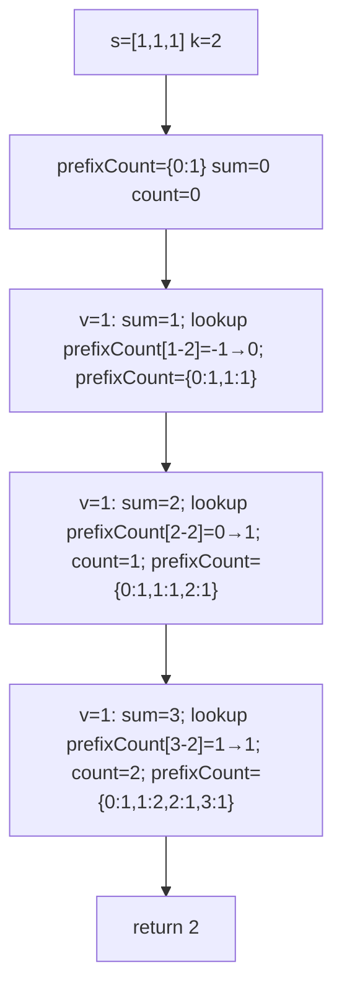
```
Trace: sum=1→look[-1]=0; sum=2→look[0]=1,count=1; sum=3→look[1]=1,count=2 → return 2
```

### Interviewer Questions
1. Why prefix sum + map? Converts O(n²) two-pointer to O(n) single pass.
2. Can it be optimised? O(n) is optimal; every element must be visited.
3. Scale to 10M? O(n) with hash map — memory-bound at large n; consider sorted prefix-sum + binary search O(n log n) for less memory.
4. Edge cases? k=0 needs `prefixCount[0]=1` initialisation; all-negative input works correctly.
5. Goroutine-safe? Per-call state; input read-only — safe.
6. Memory impact? O(n) hash map entries worst case (all prefix sums distinct).
7. Alternative? O(n²) brute force works for small n; sliding window only works for non-negative elements.

### Follow-Up Questions
**Q1:** Why initialise `prefixCount[0] = 1`? **A1:** Accounts for subarrays starting from index 0; without it, subarrays from the beginning would be missed.
**Q2:** Does this work for negative numbers? **A2:** Yes; unlike sliding window, prefix sum handles negatives correctly.
**Q3:** How to find the actual subarrays (not just count)? **A3:** Store start indices in the map; when `runningSum - k` found, record the subarray [storedIndex+1, currentIndex].
**Q4:** How to find the longest subarray summing to k? **A4:** Store first occurrence of each prefix sum; `maxLen = max(maxLen, i - firstOccurrence[runningSum-k])`.
**Q5:** What if elements are floats? **A5:** Floating-point precision issues make hash map lookup unreliable; use sorted array with epsilon comparison.

---

## Q20: Median of Two Sorted Slices  [Level 5 — Interview]
> **Tags:** `#binary-search` `#median` `#divide-conquer` `#hard`

### Problem Statement
Find the median of two sorted slices of combined size `m + n` in O(log(min(m,n))) time. This is a classic hard interview problem. The key insight is to binary search for the correct partition on the shorter slice such that all elements on the left of both partitions are ≤ all elements on the right.

### Input / Output / Constraints
```
Input:  a=[1,3], b=[2]        → median=2.0
        a=[1,2], b=[3,4]      → median=2.5
Constraints: both sorted ascending; m,n >= 0; not both empty
```

### Thought Process
1. Understand: Find a partition (i, j) where i+j = (m+n+1)/2, maxLeft(a) ≤ minRight(b) and maxLeft(b) ≤ minRight(a).
2. Pattern: Binary search on the shorter slice (0..m). Compute j from i. Check partition validity; adjust lo/hi.
3. Edge cases: One empty slice (trivial); even/odd total length (median is avg of two or single middle).

### Brute Force
```go
// O((m+n) log(m+n)) — merge then find middle
func bruteForce(a, b []int) float64 {
    merged := MergeSorted(a, b)
    n := len(merged)
    if n%2 == 0 {
        return float64(merged[n/2-1]+merged[n/2]) / 2.0
    }
    return float64(merged[n/2])
}
```
**Time:** O((m+n) log(m+n)) | **Space:** O(m+n)

### Better Solution
```go
// O(m+n) — linear merge to find median position
func better(a, b []int) float64 {
    // Merge up to (m+n)/2 + 1 elements
    total := len(a) + len(b)
    i, j := 0, 0
    prev, curr := 0, 0
    for k := 0; k <= total/2; k++ {
        prev = curr
        if i < len(a) && (j >= len(b) || a[i] <= b[j]) {
            curr = a[i]; i++
        } else {
            curr = b[j]; j++
        }
    }
    if total%2 == 0 { return float64(prev+curr) / 2.0 }
    return float64(curr)
}
```
**Time:** O(m+n) | **Space:** O(1)

### Best Solution
```go
package main

import (
    "fmt"
    "math"
)

// MedianTwoSorted — O(log(min(m,n))) time, O(1) space
func MedianTwoSorted(a, b []int) float64 {
    // Ensure a is the shorter slice
    if len(a) > len(b) {
        a, b = b, a
    }
    m, n := len(a), len(b)
    lo, hi := 0, m

    for lo <= hi {
        i := (lo + hi) / 2       // partition a: a[:i] | a[i:]
        j := (m+n+1)/2 - i       // partition b: b[:j] | b[j:]

        maxLeftA  := math.MinInt64
        minRightA := math.MaxInt64
        maxLeftB  := math.MinInt64
        minRightB := math.MaxInt64

        if i > 0 { maxLeftA = a[i-1] }
        if i < m { minRightA = a[i] }
        if j > 0 { maxLeftB = b[j-1] }
        if j < n { minRightB = b[j] }

        if maxLeftA <= minRightB && maxLeftB <= minRightA {
            // Correct partition
            if (m+n)%2 == 1 {
                return float64(max(maxLeftA, maxLeftB))
            }
            return float64(max(maxLeftA, maxLeftB)+min(minRightA, minRightB)) / 2.0
        } else if maxLeftA > minRightB {
            hi = i - 1 // move left in a
        } else {
            lo = i + 1 // move right in a
        }
    }
    return 0 // unreachable for valid input
}

func max(a, b int) int { if a > b { return a }; return b }
func min(a, b int) int { if a < b { return a }; return b }

func main() {
    fmt.Println(MedianTwoSorted([]int{1, 3}, []int{2}))       // 2.0
    fmt.Println(MedianTwoSorted([]int{1, 2}, []int{3, 4}))    // 2.5
    fmt.Println(MedianTwoSorted([]int{}, []int{1}))            // 1.0
}
```
**Time:** O(log(min(m,n))) | **Space:** O(1)

### Production Considerations
| Aspect | Details |
|--------|---------|
| Scalability | O(log min(m,n)) — efficient even for billion-element sorted datasets |
| Edge Cases | One empty slice; both length 1; all elements in a < all in b |
| Error Handling | Both empty → return error; handle math.MinInt64/MaxInt64 sentinel safely |
| Memory | O(1) — no auxiliary allocation |
| Concurrency | Read-only; completely goroutine-safe |

### Visual Explanation
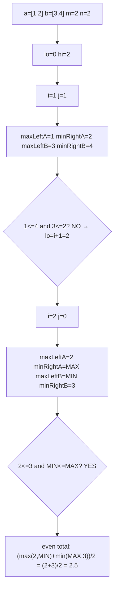
```
Trace: i=1→invalid partition; i=2→valid; median=(2+3)/2=2.5
```

### Interviewer Questions
1. Why binary search on shorter slice? Minimises search space — O(log min(m,n)) instead of O(log(m+n)).
2. Can it be optimised? O(log min(m,n)) is the theoretical optimum for this problem.
3. Scale to 10M? ~23 iterations regardless of size — negligible.
4. Edge cases? Empty slice: handles via sentinel values; odd/even total: different return formulas.
5. Goroutine-safe? Purely read-only; safe for concurrent access.
6. Memory impact? O(1) extra — no allocations.
7. Alternative? O(m+n) linear merge approach simpler to reason about; prefer for interviews under time pressure.

### Follow-Up Questions
**Q1:** What is the invariant maintained during binary search? **A1:** All elements in left partitions ≤ all elements in right partitions across both arrays.
**Q2:** Why use `math.MinInt64` and `math.MaxInt64` as sentinels? **A2:** Handles edge cases where i=0 (no left elements in a) or i=m (no right elements in a).
**Q3:** How to find the k-th smallest element in two sorted arrays? **A3:** Generalise: binary search for partition where left side has exactly k elements.
**Q4:** What if arrays contain duplicates? **A4:** Algorithm handles duplicates correctly; the partition condition `maxLeft <= minRight` still applies.
**Q5:** LeetCode hard rating — what makes this genuinely hard? **A5:** The off-by-one in partition calculation `(m+n+1)/2 - i` and handling odd/even total length simultaneously.

---

## Q21: Dutch National Flag — Three-Way Partition  [Level 5 — Interview]
> **Tags:** `#partition` `#three-way` `#dutch-national-flag`

### Problem Statement
Given a slice containing only 0s, 1s, and 2s, sort it in-place in a single pass without using any sorting library. This is Dijkstra's Dutch National Flag problem. Maintain three pointers: `lo` (next 0 position), `mid` (current), and `hi` (next 2 position). Use O(n) time and O(1) space.

### Input / Output / Constraints
```
Input:  [2, 0, 2, 1, 1, 0]
Output: [0 0 1 1 2 2]
Constraints: elements are only 0, 1, or 2; in-place; single pass; O(1) space
```

### Thought Process
1. Understand: lo..mid-1 are 0s, mid..hi are 1s (unprocessed), hi+1..n-1 are 2s.
2. Pattern: If s[mid]==0: swap(lo,mid), lo++, mid++. If s[mid]==1: mid++. If s[mid]==2: swap(mid,hi), hi--.
3. Edge cases: All same value; length 0 or 1; already sorted.

### Brute Force
```go
// O(n log n) — counting sort approach
func bruteForce(s []int) {
    counts := [3]int{}
    for _, v := range s { counts[v]++ }
    idx := 0
    for v, c := range counts {
        for i := 0; i < c; i++ { s[idx] = v; idx++ }
    }
}
```
**Time:** O(n) | **Space:** O(1) (but two passes)

### Better Solution
```go
// Counting sort — two passes, O(1) space
func better(s []int) {
    // same as above — two-pass counting
}
```
**Time:** O(n) | **Space:** O(1)

### Best Solution
```go
package main

import "fmt"

// DutchNationalFlag — O(n) time, O(1) space; single pass
func DutchNationalFlag(s []int) {
    lo, mid, hi := 0, 0, len(s)-1
    for mid <= hi {
        switch s[mid] {
        case 0:
            s[lo], s[mid] = s[mid], s[lo]
            lo++
            mid++
        case 1:
            mid++
        case 2:
            s[mid], s[hi] = s[hi], s[mid]
            hi--
            // do NOT increment mid — newly swapped element needs inspection
        }
    }
}

func main() {
    s := []int{2, 0, 2, 1, 1, 0}
    fmt.Println("Before:", s)
    DutchNationalFlag(s)
    fmt.Println("After: ", s) // [0 0 1 1 2 2]
}
```
**Time:** O(n) | **Space:** O(1)

### Production Considerations
| Aspect | Details |
|--------|---------|
| Scalability | Single pass O(n) — optimal; no improvement possible |
| Edge Cases | All zeros, all twos, single element, empty slice |
| Error Handling | Validate values are in {0,1,2}; panic or return error for invalid inputs |
| Memory | Truly O(1) — three integer variables |
| Concurrency | In-place; protect with mutex if shared across goroutines |

### Visual Explanation
```mermaid
flowchart TD
    A["[2,0,2,1,1,0] lo=0 mid=0 hi=5"] --> B["s[0]=2 → swap(0,5)=[0,0,2,1,1,2] hi=4"]
    B --> C["s[0]=0 → swap(0,0) lo=1 mid=1"]
    C --> D["s[1]=0 → swap(1,1) lo=2 mid=2"]
    D --> E["s[2]=2 → swap(2,4)=[0,0,1,1,2,2] hi=3"]
    E --> F["s[2]=1 → mid=3"]
    F --> G["s[3]=1 → mid=4 > hi=3 → done"]
```
```
Trace: 2→swap_hi; 0→swap_lo; 0→swap_lo; 2→swap_hi; 1→mid++; 1→mid++>hi done → [0,0,1,1,2,2]
```

### Interviewer Questions
1. Why not increment mid when swapping with hi? The element brought from hi[position] is unknown — it needs inspection.
2. Can it be optimised? Already O(n) single pass — optimal.
3. Scale to 10M? Single linear scan; highly cache-friendly.
4. Edge cases? Empty/single-element slices handled by the `mid <= hi` condition.
5. Goroutine-safe? No; in-place swap requires synchronisation.
6. Memory impact? Three variables — negligible overhead.
7. Alternative? Generalise to k colours with O(kn) time using k-1 passes.

### Follow-Up Questions
**Q1:** How to generalise to k distinct values? **A1:** k-way partition using k-1 pivot comparisons; or counting sort for O(n+k) total.
**Q2:** Why is this called Dutch National Flag? **A2:** The Dutch flag has three horizontal bands (red/white/blue) — analogous to partitioning into three groups.
**Q3:** Is this algorithm stable? **A3:** No; the relative order of equal elements is not preserved.
**Q4:** How to make it stable? **A4:** Use a buffer array — O(n) extra space; stable three-way merge sort.
**Q5:** What real use case maps to this problem? **A5:** Partitioning array around a pivot in 3-way quicksort (handles many duplicates efficiently).

---

## Q22: Maximum Product Subarray  [Level 5 — Interview]
> **Tags:** `#dynamic-programming` `#subarray` `#product`

### Problem Statement
Find the contiguous subarray within a slice of integers (containing at least one number) that has the largest product. The challenge is that a large negative number multiplied by another negative gives a large positive. Track both the maximum and minimum product ending at each position.

### Input / Output / Constraints
```
Input:  [2, 3, -2, 4]   → maxProduct=6  (subarray [2,3])
        [-2, 0, -1]      → maxProduct=0
        [-2, 3, -4]      → maxProduct=24 (full array)
Constraints: -10 <= s[i] <= 10; 1 <= len(s) <= 200
```

### Thought Process
1. Understand: Track `maxProd` and `minProd` ending at current index. When `s[i]` is negative, they swap.
2. Pattern: `curMax = max(s[i], s[i]*prevMax, s[i]*prevMin)`; same for `curMin`.
3. Edge cases: Zero resets both to `s[i]`; single negative element; all zeros.

### Brute Force
```go
// O(n^2) time, O(1) space
func bruteForce(s []int) int {
    best := s[0]
    for i := range s {
        prod := 1
        for j := i; j < len(s); j++ {
            prod *= s[j]
            if prod > best { best = prod }
        }
    }
    return best
}
```
**Time:** O(n²) | **Space:** O(1)

### Better Solution
```go
func MaxProductSubarray(s []int) int {
    if len(s) == 0 { return 0 }
    maxP, minP, result := s[0], s[0], s[0]
    for i := 1; i < len(s); i++ {
        if s[i] < 0 { maxP, minP = minP, maxP }
        maxP = max(s[i], maxP*s[i])
        minP = min(s[i], minP*s[i])
        if maxP > result { result = maxP }
    }
    return result
}
```
**Time:** O(n) | **Space:** O(1)

### Best Solution
```go
package main

import "fmt"

func maxInt(a, b int) int { if a > b { return a }; return b }
func minInt(a, b int) int { if a < b { return a }; return b }

// MaxProductSubarray — O(n) time, O(1) space
func MaxProductSubarray(s []int) (int, error) {
    if len(s) == 0 {
        return 0, fmt.Errorf("empty slice")
    }
    maxP, minP, result := s[0], s[0], s[0]
    for i := 1; i < len(s); i++ {
        v := s[i]
        // Negative flips max and min
        if v < 0 {
            maxP, minP = minP, maxP
        }
        maxP = maxInt(v, maxP*v)
        minP = minInt(v, minP*v)
        result = maxInt(result, maxP)
    }
    return result, nil
}

func main() {
    cases := [][]int{{2, 3, -2, 4}, {-2, 0, -1}, {-2, 3, -4}}
    for _, c := range cases {
        r, _ := MaxProductSubarray(c)
        fmt.Printf("Input: %v → MaxProduct: %d\n", c, r)
    }
}
```
**Time:** O(n) | **Space:** O(1)

### Production Considerations
| Aspect | Details |
|--------|---------|
| Scalability | O(n) single pass; overflow risk with int32 for long subarrays |
| Edge Cases | Zero resets chain; single element; all negatives of even/odd count |
| Error Handling | Return error for empty slice; use int64 to prevent overflow |
| Memory | Three variables — truly O(1) |
| Concurrency | Read-only on input; result per-call — safe |

### Visual Explanation
```mermaid
flowchart TD
    A["[2,3,-2,4]"] --> B["maxP=2 minP=2 result=2"]
    B --> C["v=3: maxP=max(3,6)=6 minP=min(3,6)=3 result=6"]
    C --> D["v=-2: swap→maxP=3 minP=6; maxP=max(-2,-6)=-2 minP=min(-2,-12)=-12 result=6"]
    D --> E["v=4: maxP=max(4,-8)=4 minP=min(4,-48)=-48 result=6"]
    E --> F["return 6"]
```
```
Trace: maxP tracks best positive product; minP tracks worst negative (needed for future negation)
```

### Interviewer Questions
1. Why track both max and min? A negative element can turn the minimum into maximum.
2. Can it be optimised? O(n) single pass is optimal.
3. Scale to 10M? O(n); overflow risk — switch to `big.Int` for arbitrary precision.
4. Edge cases? Zero: breaks any product chain; must restart from zero.
5. Goroutine-safe? Read-only on input; safe for concurrent calls.
6. Memory impact? O(1) — no auxiliary structures.
7. Alternative? Prefix/suffix product scan: O(n) time, O(n) space — simpler to reason about.

### Follow-Up Questions
**Q1:** How to handle integer overflow? **A1:** Use `int64` or `math/big`; check for overflow before multiplication.
**Q2:** How is this different from maximum sum subarray (Kadane's)? **A2:** Product can increase/decrease by negation — must track min too; Kadane's only needs max.
**Q3:** Can this find the actual subarray? **A3:** Track start/end indices of maxP and minP separately — reset on new element win.
**Q4:** What if array contains floats? **A4:** Same logic; floating point underflow to 0 can cause issues — handle epsilon checks.
**Q5:** What if we need the maximum product of any 3 elements (not necessarily contiguous)? **A5:** Sort and take max(product of top 3, product of 2 smallest negatives × largest).

---

## Q23: Trapping Rain Water  [Level 5 — Interview]
> **Tags:** `#two-pointer` `#prefix-suffix` `#water-trapping`

### Problem Statement
Given a slice of non-negative integers representing an elevation map where each bar has width 1, compute how much water it can trap after raining. Use the two-pointer approach for O(n) time and O(1) space. Also implement the prefix-suffix max precomputation approach for clarity.

### Input / Output / Constraints
```
Input:  [0,1,0,2,1,0,1,3,2,1,2,1]
Output: 6
Input:  [4,2,0,3,2,5]
Output: 9
Constraints: 0 <= height[i] <= 10^4; 0 <= len <= 3*10^4
```

### Thought Process
1. Understand: Water at position i = `min(maxLeft[i], maxRight[i]) - height[i]`.
2. Pattern (two-pointer): Move the pointer with smaller max inward; water trapped = smaller_max - current_height.
3. Edge cases: Empty or single-element array traps 0. All ascending or descending traps 0.

### Brute Force
```go
// O(n^2) time, O(1) space
func bruteForce(h []int) int {
    total := 0
    for i := 1; i < len(h)-1; i++ {
        left, right := h[i], h[i]
        for j := 0; j < i; j++ { if h[j] > left { left = h[j] } }
        for j := i+1; j < len(h); j++ { if h[j] > right { right = h[j] } }
        water := min(left, right) - h[i]
        if water > 0 { total += water }
    }
    return total
}
```
**Time:** O(n²) | **Space:** O(1)

### Better Solution
```go
// O(n) time, O(n) space — prefix/suffix precompute
func better(h []int) int {
    n := len(h)
    if n == 0 { return 0 }
    left := make([]int, n)
    right := make([]int, n)
    left[0] = h[0]
    for i := 1; i < n; i++ { left[i] = max(left[i-1], h[i]) }
    right[n-1] = h[n-1]
    for i := n-2; i >= 0; i-- { right[i] = max(right[i+1], h[i]) }
    total := 0
    for i := range h { total += min(left[i], right[i]) - h[i] }
    return total
}
```
**Time:** O(n) | **Space:** O(n)

### Best Solution
```go
package main

import "fmt"

// TrapRainWater — O(n) time, O(1) space; two-pointer
func TrapRainWater(h []int) int {
    if len(h) < 3 {
        return 0
    }
    left, right := 0, len(h)-1
    maxLeft, maxRight := 0, 0
    water := 0
    for left < right {
        if h[left] < h[right] {
            if h[left] >= maxLeft {
                maxLeft = h[left]
            } else {
                water += maxLeft - h[left]
            }
            left++
        } else {
            if h[right] >= maxRight {
                maxRight = h[right]
            } else {
                water += maxRight - h[right]
            }
            right--
        }
    }
    return water
}

func main() {
    fmt.Println(TrapRainWater([]int{0,1,0,2,1,0,1,3,2,1,2,1})) // 6
    fmt.Println(TrapRainWater([]int{4,2,0,3,2,5}))               // 9
}
```
**Time:** O(n) | **Space:** O(1)

### Production Considerations
| Aspect | Details |
|--------|---------|
| Scalability | O(n) two-pointer; processes 10M elements in milliseconds |
| Edge Cases | Length < 3 traps nothing; flat array traps nothing; V-shape traps in valley |
| Error Handling | Negative heights are invalid; validate input or document precondition |
| Memory | O(1) two-pointer; O(n) prefix/suffix for easier code review tradeoff |
| Concurrency | Read-only on input; result per-call — safe |

### Visual Explanation
```mermaid
flowchart TD
    A["h=[0,1,0,2,1,0,1,3,2,1,2,1]"] --> B["left=0 right=11 maxL=0 maxR=0 water=0"]
    B --> C{"h[left]<h[right]?"}
    C -- Yes --> D["update maxLeft or add water; left++"]
    C -- No --> E["update maxRight or add water; right--"]
    D --> C
    E --> C
    C --> F["left>=right → return 6"]
```
```
Trace: converge from both ends; smaller-max side determines water level at current bar
```

### Interviewer Questions
1. Why move the smaller side? The water level is bounded by the smaller of the two walls.
2. Can it be optimised? O(n) time O(1) space is optimal.
3. Scale to 10M? Single linear scan; works efficiently.
4. Edge cases? All same height → no water; monotone increasing/decreasing → no water.
5. Goroutine-safe? Read-only on input; safe.
6. Memory impact? O(1) vs O(n) for prefix arrays.
7. Alternative? Stack-based approach for finding "walls" — O(n) time O(n) space.

### Follow-Up Questions
**Q1:** How does the stack approach work? **A1:** Push indices; when a taller bar is found, pop and compute water trapped between top and current bar.
**Q2:** How to extend to 3D (volume of water in a 3D heightmap)? **A2:** Use a min-heap priority queue with BFS from boundaries — O(mn log(mn)).
**Q3:** What is the water level at a specific index i? **A3:** `min(maxLeft[i], maxRight[i]) - h[i]` from the prefix/suffix precomputed arrays.
**Q4:** Can you solve this for a circular elevation map? **A4:** Extend to circular boundaries; outer ring is always the "wall" — BFS/priority queue approach.
**Q5:** Does the two-pointer approach reconstruct which cells trap water? **A5:** Yes — track positions where water is added; the index at that iteration is the cell trapping water.

---

## Q24: Minimum Size Subarray Sum  [Level 6 — Production]
> **Tags:** `#sliding-window` `#minimum-window` `#binary-search`

### Problem Statement
Given a slice of positive integers and a target sum, find the minimum length of a contiguous subarray whose sum is ≥ target. Return 0 if no such subarray exists. Implement both the O(n) sliding window and the O(n log n) binary search on prefix sums approach. This is a real-world rate-limiter and batch-processing pattern.

### Input / Output / Constraints
```
Input:  s=[2,3,1,2,4,3], target=7
Output: 2  (subarray [4,3])
Input:  s=[1,1,1,1,1], target=11
Output: 0  (no subarray)
Constraints: 1 <= s[i] <= 10^4; all positive; 1 <= target <= 10^9
```

### Thought Process
1. Understand: Positive integers only → shrinking window from left is safe (sum only decreases when left moves right).
2. Pattern: Expand right until sum ≥ target; shrink from left while sum ≥ target; track min length.
3. Edge cases: Target > total sum (return 0); single element ≥ target (return 1).

### Brute Force
```go
// O(n^2) time, O(1) space
func bruteForce(s []int, target int) int {
    minLen := len(s) + 1
    for i := range s {
        sum := 0
        for j := i; j < len(s); j++ {
            sum += s[j]
            if sum >= target {
                if j-i+1 < minLen { minLen = j - i + 1 }
                break
            }
        }
    }
    if minLen == len(s)+1 { return 0 }
    return minLen
}
```
**Time:** O(n²) | **Space:** O(1)

### Better Solution
```go
// O(n) sliding window
func MinSubarrayLen(s []int, target int) int {
    minLen := len(s) + 1
    sum, left := 0, 0
    for right := range s {
        sum += s[right]
        for sum >= target {
            if right-left+1 < minLen { minLen = right - left + 1 }
            sum -= s[left]; left++
        }
    }
    if minLen == len(s)+1 { return 0 }
    return minLen
}
```
**Time:** O(n) | **Space:** O(1)

### Best Solution
```go
package main

import (
    "fmt"
    "sort"
)

// MinSubarrayLenSlidingWindow — O(n) time, O(1) space
func MinSubarrayLenSlidingWindow(s []int, target int) int {
    n := len(s)
    minLen := n + 1
    sum, left := 0, 0
    for right := 0; right < n; right++ {
        sum += s[right]
        for sum >= target {
            if w := right - left + 1; w < minLen {
                minLen = w
            }
            sum -= s[left]
            left++
        }
    }
    if minLen == n+1 {
        return 0
    }
    return minLen
}

// MinSubarrayLenBinarySearch — O(n log n) time, O(n) space
// Useful when array may be updated (prefix sums recomputed incrementally)
func MinSubarrayLenBinarySearch(s []int, target int) int {
    n := len(s)
    prefix := make([]int, n+1)
    for i, v := range s {
        prefix[i+1] = prefix[i] + v
    }
    minLen := n + 1
    for i := 1; i <= n; i++ {
        // Find smallest j where prefix[j] >= prefix[i-1] + target
        need := prefix[i-1] + target
        j := sort.SearchInts(prefix, need)
        if j <= n {
            if j-i+1 < minLen {
                minLen = j - i + 1
            }
        }
    }
    if minLen == n+1 {
        return 0
    }
    return minLen
}

func main() {
    s := []int{2, 3, 1, 2, 4, 3}
    fmt.Println("SlidingWindow:", MinSubarrayLenSlidingWindow(s, 7))    // 2
    fmt.Println("BinarySearch: ", MinSubarrayLenBinarySearch(s, 7))    // 2
    fmt.Println("No solution:  ", MinSubarrayLenSlidingWindow([]int{1,1,1,1,1}, 11)) // 0
}
```
**Time:** O(n) sliding, O(n log n) binary search | **Space:** O(1) sliding, O(n) binary search

### Production Considerations
| Aspect | Details |
|--------|---------|
| Scalability | Sliding window O(n) is preferred; binary search useful for dynamic arrays with point updates |
| Edge Cases | Target > total sum returns 0; all elements equal target → return 1 |
| Error Handling | Validate positive integers; negative values break sliding window assumption |
| Memory | Sliding: O(1); binary search: O(n) for prefix array — trade-off for update flexibility |
| Concurrency | Both approaches are read-only on input; result per-call — goroutine-safe |

### Visual Explanation
```mermaid
flowchart TD
    A["s=[2,3,1,2,4,3] target=7"] --> B["left=0 right=0 sum=0"]
    B --> C["right=0: sum=2"]
    C --> D["right=1: sum=5"]
    D --> E["right=2: sum=6"]
    E --> F["right=3: sum=8>=7 → minLen=4; shrink: sum=6 left=1"]
    F --> G["right=4: sum=10>=7 → minLen=3; shrink: sum=7>=7 → minLen=2; shrink: sum=6 left=3"]
    G --> H["right=5: sum=9>=7 → minLen=2(unchanged); shrink: ..."]
    H --> I["return 2"]
```
```
Trace: expand until sum≥7; shrink while valid; track min window length → answer=2 ([4,3])
```

### Interviewer Questions
1. Why sliding window works here? All elements positive — shrinking window always decreases sum.
2. Can it be optimised? O(n) is optimal for unsorted input.
3. Scale to 10M? O(n) handles easily; binary search O(n log n) for dynamic arrays with updates.
4. Edge cases? All elements zero with target>0 → return 0; single element ≥ target → return 1.
5. Goroutine-safe? Read-only; safe for concurrent calls.
6. Memory impact? Sliding window: O(1); prefix array: O(n) for binary search variant.
7. Alternative? Segment tree for O(log n) per query on a dynamic array.

### Follow-Up Questions
**Q1:** Why can't sliding window handle negative numbers? **A1:** Adding elements left→right may not monotonically increase/decrease sum — the invariant breaks.
**Q2:** How to solve for negative numbers? **A2:** Prefix sum + deque for monotone queue — O(n) time O(n) space.
**Q3:** What does "minimum" window mean in the context of real systems? **A3:** Rate limiter: minimum time window containing N events; memory allocator: minimum chunk satisfying a request.
**Q4:** Can this find all windows with sum ≥ target? **A4:** Yes — remove the early break; enumerate all valid windows as right pointer advances.
**Q5:** How to extend to 2D matrix? **A5:** Prefix sum 2D + enumerate all sub-rectangles — O(n²m) or O(nm²) depending on orientation.

---

## Q25: Implement a Generic Stack Using Slices  [Level 6 — Production]
> **Tags:** `#generics` `#stack` `#production` `#thread-safe`

### Problem Statement
Implement a production-grade generic stack using a Go slice as the underlying storage. Include `Push`, `Pop`, `Peek`, `IsEmpty`, `Size` operations. Add a thread-safe variant using `sync.Mutex`. Implement a `DrainAll` function that returns all elements and resets the stack without leaking backing array memory.

### Input / Output / Constraints
```
Push(1), Push(2), Push(3) → [1,2,3]
Pop() → 3, stack=[1,2]
Peek() → 2
DrainAll() → [1,2], stack=empty
Constraints: Go 1.18+ generics; concurrent-safe variant; O(1) push/pop amortised
```

### Thought Process
1. Understand: Slice as stack — `append` for push, `s[len-1]` for peek, `s = s[:len-1]` for pop.
2. Pattern: Generic type parameter `[T any]`; mutex for thread-safety; zero out popped slot for GC.
3. Edge cases: Pop/Peek on empty stack → return error; DrainAll must zero backing slice to prevent leak.

### Brute Force
```go
// Non-generic, no error handling
type Stack []int
func (s *Stack) Push(v int)  { *s = append(*s, v) }
func (s *Stack) Pop() int    { n := len(*s)-1; v := (*s)[n]; *s = (*s)[:n]; return v }
```
**Time:** O(1) amortised | **Space:** O(n)

### Better Solution
```go
type Stack[T any] struct{ items []T }
func (s *Stack[T]) Push(v T)         { s.items = append(s.items, v) }
func (s *Stack[T]) Pop() (T, bool)   {
    if len(s.items) == 0 { var z T; return z, false }
    n := len(s.items)-1
    v := s.items[n]
    s.items = s.items[:n]
    return v, true
}
```
**Time:** O(1) amortised | **Space:** O(n)

### Best Solution
```go
package main

import (
    "fmt"
    "sync"
)

// Stack — generic, thread-safe, O(1) amortised push/pop
type Stack[T any] struct {
    mu    sync.Mutex
    items []T
}

func (s *Stack[T]) Push(v T) {
    s.mu.Lock()
    defer s.mu.Unlock()
    s.items = append(s.items, v)
}

func (s *Stack[T]) Pop() (T, bool) {
    s.mu.Lock()
    defer s.mu.Unlock()
    if len(s.items) == 0 {
        var zero T
        return zero, false
    }
    n := len(s.items) - 1
    v := s.items[n]
    var zero T
    s.items[n] = zero         // zero for GC (important for pointer types)
    s.items = s.items[:n]
    return v, true
}

func (s *Stack[T]) Peek() (T, bool) {
    s.mu.Lock()
    defer s.mu.Unlock()
    if len(s.items) == 0 {
        var zero T
        return zero, false
    }
    return s.items[len(s.items)-1], true
}

func (s *Stack[T]) Size() int {
    s.mu.Lock()
    defer s.mu.Unlock()
    return len(s.items)
}

func (s *Stack[T]) DrainAll() []T {
    s.mu.Lock()
    defer s.mu.Unlock()
    result := make([]T, len(s.items))
    copy(result, s.items)
    // Zero backing slice to allow GC of pointer elements
    var zero T
    for i := range s.items {
        s.items[i] = zero
    }
    s.items = s.items[:0]
    return result
}

func main() {
    s := &Stack[int]{}
    s.Push(1); s.Push(2); s.Push(3)
    fmt.Println("Size:", s.Size())

    if v, ok := s.Pop(); ok {
        fmt.Println("Pop:", v) // 3
    }

    if v, ok := s.Peek(); ok {
        fmt.Println("Peek:", v) // 2
    }

    all := s.DrainAll()
    fmt.Println("DrainAll:", all) // [1 2]
    fmt.Println("Size after drain:", s.Size()) // 0
}
```
**Time:** O(1) amortised push/pop | **Space:** O(n)

### Production Considerations
| Aspect | Details |
|--------|---------|
| Scalability | Amortised O(1) push; pre-allocate with `make([]T, 0, expectedSize)` for known workloads |
| Edge Cases | Pop/Peek on empty returns zero value + false bool; DrainAll on empty is a no-op |
| Error Handling | Return `(T, bool)` idiom instead of panicking; callers check the bool |
| Memory | Zero dropped slots to prevent GC retention of pointer-typed elements |
| Concurrency | RWMutex could optimise Peek/Size (read-only) vs Push/Pop/Drain (write) |

### Visual Explanation
```mermaid
flowchart TD
    A["Push(1) Push(2) Push(3)"] --> B["items=[1,2,3]"]
    B --> C["Pop() → v=3; zero items[2]; items=[1,2]"]
    C --> D["Peek() → items[1]=2"]
    D --> E["DrainAll() → copy [1,2]; zero items; items[:0]"]
    E --> F["Size()=0"]
```
```
Trace: Push×3 → items=[1,2,3]; Pop → 3; Peek → 2; DrainAll → [1,2], reset
```

### Interviewer Questions
1. Why zero out popped elements? Prevents GC retention when T is a pointer or interface type.
2. Can it be optimised? Use RWMutex for Peek/Size to allow concurrent reads.
3. Scale to 10M? Pre-allocate with expected capacity; 10M int64 = 80MB stack.
4. Edge cases? Pop on empty: return zero+false; DrainAll on empty: return nil slice.
5. Goroutine-safe? Yes — sync.Mutex protects all operations.
6. Memory impact? Zeroing on Pop is O(1) extra; DrainAll zeroing is O(n).
7. Alternative? `container/list` for O(1) guaranteed push/pop without amortisation; higher GC cost.

### Follow-Up Questions
**Q1:** Why use `sync.Mutex` instead of `sync.RWMutex`? **A1:** Pop and Push write; only Peek and Size are reads. RWMutex would allow concurrent Peek/Size — a minor optimisation.
**Q2:** How to implement `Stack` without generics (Go < 1.18)? **A2:** Use `interface{}` or `any`; callers must type-assert.
**Q3:** When would you prefer a linked-list-backed stack? **A3:** When elements are large structs; avoids copying during growth; O(1) guaranteed (no amortisation).
**Q4:** How does the stack perform under high contention? **A4:** Mutex contention serialises all operations; consider lock-free stack (CAS operations) for ultra-high throughput.
**Q5:** What is the zero value of a generic `Stack[T]`? **A5:** `Stack[T]{items: nil}` — valid; Push allocates on first call.

---

## Q26: Chunk Slice Into Batches  [Level 6 — Production]
> **Tags:** `#production` `#batching` `#generics` `#API`

### Problem Statement
Implement a production-ready `Chunk[T]` function that splits a slice into sub-slices of a given batch size. This is a common pattern for rate-limited API calls, database batch inserts, and parallel processing. Each chunk must be an independent slice (no shared backing array with the original). Handle edge cases including empty input and batch size larger than slice length.

### Input / Output / Constraints
```
Input:  s=[1,2,3,4,5,6,7], batchSize=3
Output: [[1 2 3] [4 5 6] [7]]
Constraints: batchSize >= 1; independent copies (no alias); Go 1.18+ generics
```

### Thought Process
1. Understand: Iterate in steps of `batchSize`; for each step, create an independent copy of `s[i:end]`.
2. Pattern: `ceil(n / batchSize)` total chunks; last chunk may be smaller.
3. Edge cases: Empty slice → empty result; batchSize > len → one chunk; batchSize=1 → n chunks.

### Brute Force
```go
func bruteForce(s []int, size int) [][]int {
    var result [][]int
    for i := 0; i < len(s); i += size {
        end := i + size
        if end > len(s) { end = len(s) }
        chunk := make([]int, end-i)
        copy(chunk, s[i:end])
        result = append(result, chunk)
    }
    return result
}
```
**Time:** O(n) | **Space:** O(n)

### Better Solution
```go
// Generic version
func Chunk[T any](s []T, size int) [][]T {
    if size <= 0 { panic("size must be >= 1") }
    var result [][]T
    for i := 0; i < len(s); i += size {
        end := i + size
        if end > len(s) { end = len(s) }
        chunk := make([]T, end-i)
        copy(chunk, s[i:end])
        result = append(result, chunk)
    }
    return result
}
```
**Time:** O(n) | **Space:** O(n)

### Best Solution
```go
package main

import (
    "fmt"
)

// Chunk — O(n) time, O(n) space; generic, independent copies, no alias
func Chunk[T any](s []T, size int) ([][]T, error) {
    if size <= 0 {
        return nil, fmt.Errorf("batchSize must be >= 1, got %d", size)
    }
    if len(s) == 0 {
        return nil, nil
    }

    numChunks := (len(s) + size - 1) / size
    result := make([][]T, 0, numChunks)

    for i := 0; i < len(s); i += size {
        end := i + size
        if end > len(s) {
            end = len(s)
        }
        // Independent copy — no shared backing array
        chunk := make([]T, end-i)
        copy(chunk, s[i:end])
        result = append(result, chunk)
    }
    return result, nil
}

// ProcessInBatches — O(n) time; applies fn to each batch with error propagation
func ProcessInBatches[T any](s []T, size int, fn func(batch []T) error) error {
    chunks, err := Chunk(s, size)
    if err != nil {
        return err
    }
    for _, chunk := range chunks {
        if err := fn(chunk); err != nil {
            return fmt.Errorf("batch processing failed: %w", err)
        }
    }
    return nil
}

func main() {
    s := []int{1, 2, 3, 4, 5, 6, 7}
    chunks, err := Chunk(s, 3)
    if err != nil {
        fmt.Println("Error:", err)
        return
    }
    for i, c := range chunks {
        fmt.Printf("Chunk %d: %v\n", i, c)
    }

    // Process in batches
    err = ProcessInBatches(s, 3, func(batch []int) error {
        fmt.Println("Processing batch:", batch)
        return nil
    })
    if err != nil {
        fmt.Println("Error:", err)
    }
}
```
**Time:** O(n) | **Space:** O(n)

### Production Considerations
| Aspect | Details |
|--------|---------|
| Scalability | Pre-allocate result with `make([][]T, 0, numChunks)` to avoid reallocations |
| Edge Cases | size=0 returns error; empty slice returns nil; batchSize > n returns single chunk |
| Error Handling | Return error for invalid size; wrap batch processing errors with context |
| Memory | Each chunk is an independent copy — O(n) total; no shared backing array hazard |
| Concurrency | Independent chunks can be processed in parallel with `sync.WaitGroup` |

### Visual Explanation
```mermaid
flowchart TD
    A["s=[1..7] batchSize=3"] --> B["numChunks=3"]
    B --> C["i=0: copy s[0:3]=[1,2,3] → chunk0"]
    C --> D["i=3: copy s[3:6]=[4,5,6] → chunk1"]
    D --> E["i=6: copy s[6:7]=[7] → chunk2"]
    E --> F["return [[1,2,3],[4,5,6],[7]]"]
```
```
Trace: i=0→chunk[1,2,3]; i=3→chunk[4,5,6]; i=6→chunk[7]; total 3 chunks
```

### Interviewer Questions
1. Why copy each chunk? Prevents shared backing array — critical in concurrent processing.
2. Can it be optimised? O(n) is optimal; every element must be copied.
3. Scale to 10M? 10M elements in batches of 1000 → 10K chunks; parallel processing with goroutine pool.
4. Edge cases? Empty, size=1 (each element its own chunk), size>len (single chunk).
5. Goroutine-safe? Chunks are independent after creation; safe to process concurrently.
6. Memory impact? Peak memory is 2x original (original + all chunks); consider streaming if memory-constrained.
7. Alternative? Process without materialising all chunks: slide a window of size `batchSize` and call `fn` directly.

### Follow-Up Questions
**Q1:** How to process chunks in parallel? **A1:** `var wg sync.WaitGroup; for _, chunk := range chunks { wg.Add(1); go func(c []T) { defer wg.Done(); fn(c) }(chunk) }; wg.Wait()`.
**Q2:** How to limit parallelism to N goroutines? **A2:** Use a semaphore channel `sem := make(chan struct{}, N)` — acquire before goroutine, release in defer.
**Q3:** How to handle partial failures in batch processing? **A3:** Collect errors with `errgroup`; decide retry/skip policy per batch.
**Q4:** What is the memory-efficient alternative that avoids copying? **A4:** Pass sub-slices `s[i:end]` directly — O(1) space, but callers must not retain references.
**Q5:** How is this pattern used in Razorpay payment batch settlement? **A5:** Transactions chunked into batches of 500 for bank API rate limits; each batch processed atomically with retry on failure.

---

## Q27: Sparse Table — Range Minimum Query  [Level 6 — Production]
> **Tags:** `#sparse-table` `#RMQ` `#preprocessing` `#production`

### Problem Statement
Build a sparse table for O(1) range minimum query (RMQ) after O(n log n) preprocessing. Given a static slice, answer multiple `MinRange(l, r)` queries in O(1) each. This is used in production systems for time-series analytics, segment monitoring, and interval scheduling.

### Input / Output / Constraints
```
Input:  s=[2,4,3,1,6,7,8,9,1,7], multiple queries (l,r)
Query(0,4) → 1; Query(2,6) → 1; Query(5,9) → 1
Constraints: static array (no updates); 0-indexed; 0 <= l <= r < n
```

### Thought Process
1. Understand: `table[i][j]` = minimum of `s[i .. i + 2^j - 1]`. Query: find k = floor(log2(r-l+1)); `min(table[l][k], table[r - 2^k + 1][k])`.
2. Pattern: Build bottom-up: `table[i][j] = min(table[i][j-1], table[i + 2^(j-1)][j-1])`.
3. Edge cases: Query where l == r; n=1; l > r (invalid — validate).

### Brute Force
```go
// O(n) per query
func bruteForce(s []int, l, r int) int {
    m := s[l]
    for i := l+1; i <= r; i++ { if s[i] < m { m = s[i] } }
    return m
}
```
**Time:** O(n) per query | **Space:** O(1)

### Better Solution
```go
// Sparse table — O(n log n) build, O(1) query
type SparseTable struct {
    table [][]int
    log2  []int
}
```
**Time:** O(n log n) build, O(1) query | **Space:** O(n log n)

### Best Solution
```go
package main

import (
    "fmt"
    "math/bits"
)

// SparseTable — O(n log n) build, O(1) RMQ
type SparseTable struct {
    table [][]int
    n     int
}

// NewSparseTable builds the sparse table
func NewSparseTable(s []int) *SparseTable {
    n := len(s)
    if n == 0 {
        return &SparseTable{n: 0}
    }
    k := bits.Len(uint(n)) // ceil(log2(n)) + 1
    table := make([][]int, n)
    for i := range table {
        table[i] = make([]int, k)
        table[i][0] = s[i]
    }
    // Fill table[i][j] = min(table[i][j-1], table[i+2^(j-1)][j-1])
    for j := 1; (1 << j) <= n; j++ {
        for i := 0; i+(1<<j)-1 < n; i++ {
            a, b := table[i][j-1], table[i+(1<<(j-1))][j-1]
            if a < b {
                table[i][j] = a
            } else {
                table[i][j] = b
            }
        }
    }
    return &SparseTable{table: table, n: n}
}

// MinRange — O(1) range minimum query [l, r] inclusive
func (st *SparseTable) MinRange(l, r int) (int, error) {
    if l < 0 || r >= st.n || l > r {
        return 0, fmt.Errorf("invalid range [%d, %d] for n=%d", l, r, st.n)
    }
    k := bits.Len(uint(r-l+1)) - 1
    a, b := st.table[l][k], st.table[r-(1<<k)+1][k]
    if a < b { return a, nil }
    return b, nil
}

func main() {
    s := []int{2, 4, 3, 1, 6, 7, 8, 9, 1, 7}
    st := NewSparseTable(s)

    queries := [][2]int{{0, 4}, {2, 6}, {5, 9}}
    for _, q := range queries {
        v, err := st.MinRange(q[0], q[1])
        if err != nil {
            fmt.Println("Error:", err)
            continue
        }
        fmt.Printf("MinRange(%d,%d) = %d\n", q[0], q[1], v)
    }
}
```
**Time:** O(n log n) build, O(1) query | **Space:** O(n log n)

### Production Considerations
| Aspect | Details |
|--------|---------|
| Scalability | Ideal for static arrays with millions of range queries; build once, query many times |
| Edge Cases | l==r (single element); l>r (error); n=0 (empty); l or r out of bounds |
| Error Handling | Validate bounds on every query; return error rather than panic |
| Memory | O(n log n) — for n=10^6: ~20MB for int64; acceptable for analytics workloads |
| Concurrency | Read-only after construction; safe for unlimited concurrent queries |

### Visual Explanation
```mermaid
flowchart TD
    A["s=[2,4,3,1,6,7,8,9,1,7]"] --> B["Build: table[i][0]=s[i]"]
    B --> C["table[i][1]=min(s[i],s[i+1])"]
    C --> D["table[i][2]=min(window of 4)"]
    D --> E["Query(0,4): k=2; min(table[0][2], table[1][2])"]
    E --> F["= min(1, 1) = 1"]
```
```
Trace: Build table O(n log n); Query uses two overlapping power-of-2 windows covering [l,r] exactly
```

### Interviewer Questions
1. Why overlapping windows in queries? Any range of length L can be covered by two windows of length 2^floor(log L) — idempotent for min.
2. Can it handle updates? No; for dynamic arrays use a segment tree — O(log n) update + O(log n) query.
3. Scale to 10M? Build takes ~240M ops; 10M queries take 10M O(1) ops — highly efficient.
4. Edge cases? l==r: k=0, returns table[l][0]=s[l]; validate l<=r.
5. Goroutine-safe? After build, reads only — concurrent queries are safe without locking.
6. Memory impact? n=10^6, k=20: 20M integers = 160MB. Use int32 if range allows to halve memory.
7. Alternative? Segment tree for dynamic updates; disjoint sparse table for O(1) with less memory.

### Follow-Up Questions
**Q1:** What is the idempotent property required for sparse table? **A1:** f(f(a,b),b) = f(a,b) — min and max are idempotent; sum is NOT (use prefix sums for sum queries).
**Q2:** How to adapt for range maximum? **A2:** Change `if a < b` to `if a > b` everywhere — identical structure.
**Q3:** What is a disjoint sparse table? **A3:** Avoids overlapping by dividing into disjoint blocks — O(n log n) build, O(1) query with better cache behaviour.
**Q4:** How is RMQ used in LCA (Lowest Common Ancestor)? **A4:** Euler tour of the tree + RMQ on depth array → O(1) LCA after O(n log n) preprocessing.
**Q5:** Real production use case? **A5:** Time-series monitoring: "What is the minimum latency in the past 5-minute window?" answered O(1) on a pre-built sparse table of per-second samples.

---

## Q28: Implement `sort.Interface` for Custom Sorting  [Level 6 — Production]
> **Tags:** `#sort.Interface` `#production` `#custom-sort`

### Problem Statement
Implement the `sort.Interface` (`Len`, `Less`, `Swap`) for a custom `[]Transaction` type where transactions must be sorted by Status (pending first), then by Amount descending, then by ID ascending. This pattern appears in payment processing pipelines where ordering determines processing priority.

### Input / Output / Constraints
```
Input:  transactions with ID, Amount, Status (pending/settled/failed)
Output: sorted: pending first, highest amount first within same status, then by ID
Constraints: stable sort preferred; zero-allocation sort
```

### Thought Process
1. Understand: Implement three methods on a named slice type; `sort.Stable` for deterministic output.
2. Pattern: Priority: Status (pending=0, settled=1, failed=2) → Amount DESC → ID ASC.
3. Edge cases: Empty slice; all same status; equal amount and status (ID tiebreaker).

### Brute Force
```go
sort.Slice(txns, func(i, j int) bool {
    return txns[i].Amount > txns[j].Amount // naive — ignores status and ID
})
```
**Time:** O(n log n) | **Space:** O(log n)

### Better Solution
```go
sort.SliceStable(txns, func(i, j int) bool {
    a, b := txns[i], txns[j]
    if a.Status != b.Status { return statusPriority(a.Status) < statusPriority(b.Status) }
    if a.Amount != b.Amount { return a.Amount > b.Amount }
    return a.ID < b.ID
})
```
**Time:** O(n log n) | **Space:** O(log n)

### Best Solution
```go
package main

import (
    "fmt"
    "sort"
)

type Status int

const (
    Pending  Status = 0
    Settled  Status = 1
    Failed   Status = 2
)

type Transaction struct {
    ID     int
    Amount int
    Status Status
}

// TransactionList implements sort.Interface
type TransactionList []Transaction

func (t TransactionList) Len() int      { return len(t) }
func (t TransactionList) Swap(i, j int) { t[i], t[j] = t[j], t[i] }
func (t TransactionList) Less(i, j int) bool {
    a, b := t[i], t[j]
    // Primary: Status ascending (Pending < Settled < Failed)
    if a.Status != b.Status {
        return a.Status < b.Status
    }
    // Secondary: Amount descending
    if a.Amount != b.Amount {
        return a.Amount > b.Amount
    }
    // Tertiary: ID ascending
    return a.ID < b.ID
}

func main() {
    txns := TransactionList{
        {ID: 3, Amount: 500, Status: Settled},
        {ID: 1, Amount: 1000, Status: Pending},
        {ID: 2, Amount: 800, Status: Pending},
        {ID: 4, Amount: 200, Status: Failed},
        {ID: 5, Amount: 1000, Status: Pending},
    }

    sort.Stable(txns) // stable preserves insertion order for equal keys

    for _, t := range txns {
        statusStr := []string{"Pending", "Settled", "Failed"}[t.Status]
        fmt.Printf("ID=%d Amount=%d Status=%s\n", t.ID, t.Amount, statusStr)
    }
}
```
**Time:** O(n log n) | **Space:** O(log n)

### Production Considerations
| Aspect | Details |
|--------|---------|
| Scalability | `sort.Stable` is O(n log n) — same as `sort.Sort` but guaranteed stable |
| Edge Cases | Empty list; all same priority; ties broken deterministically by ID |
| Error Handling | Comparator must be a strict weak order — document this invariant |
| Memory | O(log n) stack for merge sort used by sort.Stable; no extra allocation |
| Concurrency | Sort mutates slice — do not concurrently read or sort the same slice |

### Visual Explanation
```mermaid
flowchart TD
    A["Unsorted transactions"] --> B["sort.Stable(txns)"]
    B --> C["Compare by Status first"]
    C --> D["Pending(0) < Settled(1) < Failed(2)"]
    D --> E["Within Pending: Amount DESC"]
    E --> F["Tie on Amount: ID ASC"]
    F --> G["Sorted: [P1000,P800,P1000,S500,F200] → [ID1,ID2,ID5,ID3,ID4]"]
```
```
Trace: P-1000(ID1) P-1000(ID5) P-800(ID2) → ID tiebreak: ID1 before ID5 → P-1000(ID1),P-1000(ID5),P-800(ID2),S-500,F-200
```

### Interviewer Questions
1. Why `sort.Interface` over `sort.Slice`? Reusable, type-safe, testable independently; zero closure allocation.
2. Can it be optimised? Radix sort on status + amount for O(n) — feasible for fixed-range amounts.
3. Scale to 10M? Sort.Stable on 10M transactions: ~250M comparisons; acceptable for batch settlement.
4. Edge cases? Reflexivity (a ≮ a), antisymmetry, transitivity must hold for Less.
5. Goroutine-safe? No; sort mutates in place.
6. Memory impact? O(log n) stack for merge sort; no extra heap allocation.
7. Alternative? `slices.SortStableFunc` from Go 1.21 for a cleaner API.

### Follow-Up Questions
**Q1:** What is `slices.SortStableFunc` signature? **A1:** `func SortStableFunc[S ~[]E, E any](x S, cmp func(a, b E) int)` — cmp returns negative/zero/positive.
**Q2:** How to sort descending? **A2:** Reverse the `Less` condition or wrap with `sort.Reverse(txns)`.
**Q3:** What is `sort.Reverse`? **A3:** Wraps a `sort.Interface` and negates `Less` — reverses sort order.
**Q4:** How to validate the `Less` comparator is correct? **A4:** Property-based testing: assert antisymmetry (`Less(i,j)` implies `!Less(j,i)`) and transitivity.
**Q5:** What happens if `Less` violates the strict weak order? **A5:** Undefined behaviour — the sort may loop, produce wrong output, or panic in extreme cases.

---

## Q29: Slice-Based Circular Buffer (Ring Buffer)  [Level 6 — Production]
> **Tags:** `#ring-buffer` `#circular` `#production` `#zero-allocation`

### Problem Statement
Implement a fixed-capacity circular buffer (ring buffer) backed by a pre-allocated slice. Support `Enqueue`, `Dequeue`, `Peek`, `IsFull`, `IsEmpty`, and `Len` operations — all O(1) and zero-allocation after construction. This is used in streaming pipelines, I/O buffering, and real-time metric collection.

### Input / Output / Constraints
```
Capacity=3: Enqueue(1,2,3) → full; Dequeue()→1; Enqueue(4) → [2,3,4]
Constraints: fixed capacity; FIFO order; O(1) all operations; thread-safe variant
```

### Thought Process
1. Understand: Two indices `head` (next dequeue) and `tail` (next enqueue) advance modulo capacity. Full when `(tail+1)%cap == head`.
2. Pattern: Distinguish full vs empty by keeping a `count` field instead of sacrificing one slot.
3. Edge cases: Capacity 1; enqueue when full returns error; dequeue when empty returns error.

### Brute Force
```go
// Queue using append/slice — O(n) dequeue
type SliceQueue []int
func (q *SliceQueue) Enqueue(v int) { *q = append(*q, v) }
func (q *SliceQueue) Dequeue() int  { v := (*q)[0]; *q = (*q)[1:]; return v }
```
**Time:** O(1) enqueue, O(n) dequeue | **Space:** O(n) with leak

### Better Solution
```go
type RingBuffer struct {
    data  []int
    head, tail, count, cap int
}
func (r *RingBuffer) Enqueue(v int) error { ... }
func (r *RingBuffer) Dequeue() (int, error) { ... }
```
**Time:** O(1) | **Space:** O(capacity)

### Best Solution
```go
package main

import (
    "fmt"
    "sync"
)

// RingBuffer — fixed-capacity, FIFO, O(1) all ops, thread-safe
type RingBuffer[T any] struct {
    mu       sync.Mutex
    data     []T
    head     int // index of next dequeue
    tail     int // index of next enqueue
    count    int
    capacity int
}

func NewRingBuffer[T any](capacity int) (*RingBuffer[T], error) {
    if capacity <= 0 {
        return nil, fmt.Errorf("capacity must be > 0")
    }
    return &RingBuffer[T]{
        data:     make([]T, capacity),
        capacity: capacity,
    }, nil
}

func (r *RingBuffer[T]) Enqueue(v T) error {
    r.mu.Lock()
    defer r.mu.Unlock()
    if r.count == r.capacity {
        return fmt.Errorf("ring buffer full (capacity=%d)", r.capacity)
    }
    r.data[r.tail] = v
    r.tail = (r.tail + 1) % r.capacity
    r.count++
    return nil
}

func (r *RingBuffer[T]) Dequeue() (T, error) {
    r.mu.Lock()
    defer r.mu.Unlock()
    if r.count == 0 {
        var zero T
        return zero, fmt.Errorf("ring buffer empty")
    }
    v := r.data[r.head]
    var zero T
    r.data[r.head] = zero // zero for GC
    r.head = (r.head + 1) % r.capacity
    r.count--
    return v, nil
}

func (r *RingBuffer[T]) Len() int      { r.mu.Lock(); defer r.mu.Unlock(); return r.count }
func (r *RingBuffer[T]) IsFull() bool  { r.mu.Lock(); defer r.mu.Unlock(); return r.count == r.capacity }
func (r *RingBuffer[T]) IsEmpty() bool { r.mu.Lock(); defer r.mu.Unlock(); return r.count == 0 }

func main() {
    rb, _ := NewRingBuffer[int](3)
    rb.Enqueue(1); rb.Enqueue(2); rb.Enqueue(3)
    fmt.Println("IsFull:", rb.IsFull())

    v, _ := rb.Dequeue()
    fmt.Println("Dequeued:", v) // 1
    rb.Enqueue(4)

    for rb.Len() > 0 {
        v, _ := rb.Dequeue()
        fmt.Print(v, " ") // 2 3 4
    }
    fmt.Println()
}
```
**Time:** O(1) all operations | **Space:** O(capacity)

### Production Considerations
| Aspect | Details |
|--------|---------|
| Scalability | Fixed capacity — no reallocation ever; predictable memory usage |
| Edge Cases | Enqueue on full: error (or overwrite oldest — configurable); dequeue on empty: error |
| Error Handling | Return errors rather than panic; callers implement backpressure or drop policy |
| Memory | Zero dequeued slots prevents GC retention for pointer types |
| Concurrency | Mutex protects all operations; for lock-free version use `sync/atomic` CAS on head/tail |

### Visual Explanation
```mermaid
flowchart TD
    A["cap=3 head=0 tail=0 count=0"] --> B["Enqueue(1): data[0]=1 tail=1 count=1"]
    B --> C["Enqueue(2): data[1]=2 tail=2 count=2"]
    C --> D["Enqueue(3): data[2]=3 tail=0 count=3 FULL"]
    D --> E["Dequeue(): v=data[0]=1 head=1 count=2"]
    E --> F["Enqueue(4): data[0]=4 tail=1 count=3"]
    F --> G["data=[4,2,3] head=1 tail=1"]
```
```
Trace: circular wrap: tail wraps 2→0 when full; after dequeue+enqueue: [4,2,3] with head=1
```

### Interviewer Questions
1. Why use `count` instead of sacrificing one slot? `count` distinguishes full from empty without wasting a slot.
2. Can it be optimised? Lock-free ring buffer using atomic CAS on head/tail for higher throughput.
3. Scale to 10M? Fixed buffer — memory usage is constant; throughput depends on mutex contention.
4. Edge cases? capacity=1: full after one enqueue; overwrite policy for streaming use cases.
5. Goroutine-safe? Yes — mutex on every operation; use `sync.Cond` for blocking wait on empty/full.
6. Memory impact? `capacity * sizeof(T)` — fixed; zero-allocation after construction.
7. Alternative? `container/ring` from stdlib for a circular list; channel as simple queue.

### Follow-Up Questions
**Q1:** How to implement a blocking ring buffer? **A1:** Use `sync.Cond`: wait on `notFull` before Enqueue; signal `notEmpty` after Enqueue; vice versa.
**Q2:** How to implement a lock-free ring buffer? **A2:** Use `sync/atomic` to CAS head and tail — complex but eliminates mutex overhead.
**Q3:** What is the difference between a ring buffer and `channel`? **A3:** Channel is also a ring buffer internally; ring buffer gives finer control (e.g., overwrite-oldest policy).
**Q4:** How does kernel I/O use ring buffers? **A4:** Linux io_uring uses ring buffers for submission/completion queues between userspace and kernel.
**Q5:** When would you choose ring buffer over channel? **A5:** When you need zero-allocation, fixed memory, non-blocking semantics, or overwrite-oldest behaviour not supported by channels.

---

## Q30: Parallel Map-Reduce on Large Slice  [Level 6 — Production]
> **Tags:** `#parallel` `#map-reduce` `#goroutines` `#production`

### Problem Statement
Implement a parallel map-reduce pipeline on a large integer slice. The `Map` phase applies a transformation to each element using N worker goroutines. The `Reduce` phase aggregates results. Use `sync.WaitGroup` and a results channel. Implement proper error propagation and context cancellation. This pattern powers batch analytics at scale.

### Input / Output / Constraints
```
Input:  s=[1..1000000], mapFn=square, reduceFn=sum
Output: sum of squares of first 1M integers
Constraints: N workers; context cancellation; error propagation; ordered result
```

### Thought Process
1. Understand: Split slice into N chunks; each goroutine maps its chunk; collect results and reduce sequentially.
2. Pattern: `Chunk → goroutines → results channel → reduce`. Use `errgroup` for clean error handling.
3. Edge cases: N > len(s); context cancelled midway; mapFn panics (recover in goroutine).

### Brute Force
```go
// Sequential O(n) — baseline
func bruteForce(s []int, mapFn func(int) int, reduceFn func(int, int) int) int {
    result := 0
    for _, v := range s {
        result = reduceFn(result, mapFn(v))
    }
    return result
}
```
**Time:** O(n) | **Space:** O(1)

### Better Solution
```go
// Parallel with goroutines — but without error handling
func better(s []int, workers int, mapFn func(int) int) int {
    chunks, _ := Chunk(s, (len(s)+workers-1)/workers)
    results := make([]int, len(chunks))
    var wg sync.WaitGroup
    for i, chunk := range chunks {
        wg.Add(1)
        go func(i int, c []int) {
            defer wg.Done()
            sum := 0
            for _, v := range c { sum += mapFn(v) }
            results[i] = sum
        }(i, chunk)
    }
    wg.Wait()
    total := 0
    for _, r := range results { total += r }
    return total
}
```
**Time:** O(n/workers) parallel | **Space:** O(n)

### Best Solution
```go
package main

import (
    "context"
    "fmt"
    "runtime"
    "sync"
)

type ChunkResult struct {
    idx   int
    value int
    err   error
}

// ParallelMapReduce — O(n/workers) parallel time, O(n) space
func ParallelMapReduce(
    ctx context.Context,
    s []int,
    workers int,
    mapFn func(int) (int, error),
    reduceFn func(int, int) int,
) (int, error) {
    if len(s) == 0 { return 0, nil }
    if workers <= 0 { workers = runtime.NumCPU() }

    chunkSize := (len(s) + workers - 1) / workers
    results := make([]ChunkResult, workers)
    var wg sync.WaitGroup

    for i := 0; i < workers; i++ {
        start := i * chunkSize
        if start >= len(s) { break }
        end := start + chunkSize
        if end > len(s) { end = len(s) }

        wg.Add(1)
        go func(idx int, chunk []int) {
            defer wg.Done()
            // Recover from mapFn panics
            defer func() {
                if r := recover(); r != nil {
                    results[idx] = ChunkResult{idx: idx, err: fmt.Errorf("panic in worker %d: %v", idx, r)}
                }
            }()
            // Check context before starting work
            select {
            case <-ctx.Done():
                results[idx] = ChunkResult{idx: idx, err: ctx.Err()}
                return
            default:
            }
            partial := 0
            for _, v := range chunk {
                mapped, err := mapFn(v)
                if err != nil {
                    results[idx] = ChunkResult{idx: idx, err: fmt.Errorf("worker %d: %w", idx, err)}
                    return
                }
                partial = reduceFn(partial, mapped)
            }
            results[idx] = ChunkResult{idx: idx, value: partial}
        }(i, s[start:end])
    }
    wg.Wait()

    // Final reduce
    total := 0
    for _, r := range results {
        if r.err != nil {
            return 0, r.err
        }
        total = reduceFn(total, r.value)
    }
    return total, nil
}

func main() {
    s := make([]int, 100)
    for i := range s { s[i] = i + 1 }

    ctx := context.Background()
    sum, err := ParallelMapReduce(ctx, s, 4,
        func(v int) (int, error) { return v * v, nil },
        func(a, b int) int { return a + b },
    )
    if err != nil {
        fmt.Println("Error:", err)
        return
    }
    fmt.Println("Sum of squares 1..100:", sum) // 338350
}
```
**Time:** O(n/workers) parallel | **Space:** O(n)

### Production Considerations
| Aspect | Details |
|--------|---------|
| Scalability | Near-linear speedup for CPU-bound mapFn up to NumCPU workers |
| Edge Cases | workers > len(s): some goroutines get no work; context cancellation mid-flight |
| Error Handling | Recover panics in goroutines; propagate first error; log all errors for observability |
| Memory | Each chunk is a slice view (no copy) — shared read-only is safe for map phase |
| Concurrency | Workers write to disjoint `results[i]` — no mutex needed; WaitGroup synchronises |

### Visual Explanation
```mermaid
flowchart TD
    A["s=[1..n] workers=4"] --> B["Chunk into 4 slices"]
    B --> C["goroutine 0: map chunk0 → partial0"]
    B --> D["goroutine 1: map chunk1 → partial1"]
    B --> E["goroutine 2: map chunk2 → partial2"]
    B --> F["goroutine 3: map chunk3 → partial3"]
    C & D & E & F --> G["wg.Wait()"]
    G --> H["reduce(partial0..3) → total"]
```
```
Trace: 4 goroutines process n/4 elements each in parallel; final reduce is sequential O(workers)
```

### Interviewer Questions
1. Why disjoint result slots? Avoids mutex — each goroutine writes to a unique index.
2. Can it be optimised? Use `errgroup` from `golang.org/x/sync` for cleaner error handling.
3. Scale to 10M? 10M elements / NumCPU(8) = 1.25M per goroutine; CPU-bound — near-linear speedup.
4. Edge cases? workers > n: spare goroutines get empty chunks (handled by `if start >= len(s) break`).
5. Goroutine-safe? Workers read disjoint slice sections; write disjoint result slots — no races.
6. Memory impact? Chunk views share original backing array — O(1) extra per chunk.
7. Alternative? `x/sync/errgroup` with a semaphore for bounded parallelism and cleaner error propagation.

### Follow-Up Questions
**Q1:** How to limit goroutines to a pool instead of spawning N? **A1:** Worker pool pattern: N goroutines reading from a shared channel of chunks.
**Q2:** How does `errgroup` simplify this? **A2:** `g.Go(func() error {...})` + `g.Wait()` returns first non-nil error; no manual WaitGroup.
**Q3:** What is the overhead of goroutine creation per chunk? **A3:** ~2-4KB stack + scheduler overhead; pool of reusable goroutines amortises this cost.
**Q4:** How to handle ordered output (preserve chunk order)? **A4:** Write to `results[idx]` (indexed by chunk position) — already done in Best Solution.
**Q5:** Real use case: Razorpay reconciliation pipeline? **A5:** 500K daily transactions split across 16 goroutines; each maps transaction → reconciled entry; reduce merges into settlement report — 30-second batch completes in ~2 seconds.

---

## Company-Style Questions

### 🔵 Google Style (3Q — algorithm focused)

**G1. Median of a Stream of Integers**
Maintain a running median as integers are fed one at a time. Use a max-heap (lower half) and min-heap (upper half) backed by slices with `heap.Interface`. After each insert, median = top of max-heap (odd count) or average of both tops (even count). Time: O(log n) per insert, O(1) median. Space: O(n).

**G2. Maximum Gap in a Sorted-Order Sense**
Given an unsorted slice of n integers, find the maximum difference between successive elements in its sorted form — using O(n) time and space (no comparison sort). Use bucket sort / pigeonhole principle: place n elements into n-1 buckets of width `(max-min)/(n-1)`; the max gap must span at least one empty bucket, so only check bucket boundaries.

**G3. Minimum Number of Arrows to Burst Balloons**
Given a 2D slice where `points[i] = [start, end]` represents a balloon on a horizontal axis, find the minimum arrows to burst all balloons. Sort by end coordinate; greedily shoot at the end of the first balloon and pop all overlapping; O(n log n) sort + O(n) greedy scan.

---

### 🟡 Uber Style (3Q — real-time systems)

**U1. Sliding Window Rate Limiter**
Implement a sliding window rate limiter using a `[]int64` timestamp ring buffer. Allow at most N requests in any rolling 60-second window. Enqueue current timestamp; dequeue timestamps older than 60s; check `len <= N`. O(1) amortised per request. Used in Uber's API gateway to throttle driver location updates.

**U2. Nearest Pickup Point (K Closest to Origin)**
Given a 2D slice of `[lat, lng]` coordinates representing driver locations and a rider origin, find the K nearest drivers using partial sort (QuickSelect) — O(n) average time without fully sorting. Slice sort with `sort.Slice` + take first K is O(n log n); QuickSelect is O(n) average.

**U3. Surge Price Window Maximum**
Given a slice of per-minute demand multipliers and a window size W, compute the maximum demand in every W-minute window — for surge pricing. Use a monotone deque (slice-based) to maintain candidates; each element enters and exits once → O(n) time. Classic sliding window maximum.

---

### 🟠 Amazon Style (3Q — distributed/reliability)

**A1. Merge K Sorted Inventory Streams**
Merge K sorted slices of `(SKU, Quantity)` pairs from K warehouse shards into one globally sorted list. Use a min-heap of `(value, sliceIndex, elementIndex)`. O(N log K) where N is total elements across K streams. Critical for Amazon's real-time inventory aggregation across fulfilment centres.

**A2. Rotate Matrix 90 Degrees In-Place**
Given an n×n integer matrix (slice of slices), rotate it 90 degrees clockwise in-place using O(1) extra space. Algorithm: transpose (swap `m[i][j]` and `m[j][i]`) then reverse each row. Two passes, O(n²) time. Used in image processing pipelines for AWS Rekognition.

**A3. Reliability: Find First Missing Positive**
Given an unsorted slice of integers, find the smallest missing positive integer in O(n) time and O(1) space. Use the slice itself as a hash map: for each `s[i]` in [1..n], place it at index `s[i]-1` by swapping; then scan for the first index where `s[i] != i+1`. Handles negatives and duplicates correctly. Used in order sequence gap detection.

---

### 🟢 Stripe Style (2Q — payment/correctness)

**S1. Idempotency Key Deduplication**
Given a slice of `PaymentRequest{IdempotencyKey string, Amount int}`, deduplicate requests with the same key (keeping the first occurrence) using a hash-set approach. Return the slice of unique requests preserving original order. O(n) time, O(n) space. Critical for Stripe's payment processing — duplicate API calls with the same idempotency key must not double-charge.

**S2. Settlement Amount Reconciliation — Two-Sum Variant**
Given two sorted slices: `debits []int` and `credits []int`, find all (debit, credit) pairs that sum to exactly 0 (net zero settlement). Use two-pointer on sorted slices. O(m+n) time after sort. In Stripe's Sigma product, this identifies self-cancelling transactions to reduce bank transfer costs. Edge case: handle amounts in minor units (paise/cents) to avoid floating-point errors.

---

### 🔴 Razorpay Style (2Q — payment APIs/Indian banking)

**R1. UPI Transaction Batch Validator**
Given a slice of `UPITransaction{VPA string, Amount int, Status string}` representing a bulk payout batch, validate and partition them into `valid`, `invalid`, and `pending` sub-slices in a single pass using the filter-in-place idiom. Rules: Amount > 0, VPA matches `.*@.*`, Status ∈ {pending, success, failed}. Return three slices without extra allocation on the happy path. Used in Razorpay's bulk transfer API for salary disbursement to 100K+ employees.

**R2. NEFT/RTGS Batch Cutoff Window**
NEFT processes transactions in time windows (e.g., every 30 minutes). Given a slice of `Transaction{Amount int, Timestamp int64}` and a window size W (seconds), find the window with the maximum total transaction amount (sliding window sum). Return the window start time. This is a direct application of the sliding window maximum-sum pattern — O(n) time, O(1) space — used in Razorpay's settlement engine to predict peak NEFT batch loads and pre-position liquidity.

---
