> © 2024 Gaurav Patil — Go Mastery Platform. All rights reserved. Unauthorized reproduction or distribution prohibited.


# Go Maps — Coding Practice

---

## Q1: Create a Map and Avoid the Nil Map Panic  [Level 1 — Beginner]

> **Tags:** `#maps` `#nil-safety` `#go-basics`

### Problem Statement
Demonstrate how to correctly create and initialise a Go map. Show the difference between a nil map and an initialised map, and explain why writing to a nil map causes a runtime panic. Return the number of keys written.

### Input / Output / Constraints

```
Input:  keys   = []string{"a", "b", "c"}
        values = []int{1, 2, 3}
Output: count  = 3   (number of entries stored)

Constraints:
  • len(keys) == len(values)
  • 0 ≤ len(keys) ≤ 1000
  • keys are non-empty ASCII strings
```

### Thought Process

Think like a senior Go engineer:
1. **Understand:** We must safely construct a map from two parallel slices without triggering a nil-map panic.
2. **Pattern:** Initialise with `make(map[K]V)` or a composite literal before any write; iterate with a range loop.
3. **Edge cases:** nil slices, zero-length input, duplicate keys (last value wins), unequal slice lengths.
4. **Approach:** `make` with a capacity hint avoids repeated rehashing; validate lengths first.

### Brute Force Solution

```go
package main

// bruteForce — O(n) time, O(n) space
// Declares a nil map then tries to assign — panics at runtime.
func bruteForce(keys []string, values []int) int {
    var m map[string]int   // nil map — writes will panic!
    for i := range keys {
        m[keys[i]] = values[i] // runtime panic: assignment to entry in nil map
    }
    return len(m)
}
```

**Time:** O(n) | **Space:** O(n)
**Bottleneck:** Panics at runtime; nil map reads are safe but writes are not.

### Better Solution

```go
// betterSolution — O(n) time, O(n) space
func betterSolution(keys []string, values []int) int {
    m := map[string]int{} // initialised composite literal, safe to write
    for i := range keys {
        m[keys[i]] = values[i]
    }
    return len(m)
}
```

**Time:** O(n) | **Space:** O(n)

### Best / Optimal Solution

```go
package main

import (
    "errors"
    "fmt"
)

// BuildMap — production-ready, O(n) time, O(n) space.
// Uses make with a capacity hint to avoid rehashing during initial fill.
func BuildMap(keys []string, values []int) (map[string]int, error) {
    if len(keys) != len(values) {
        return nil, errors.New("keys and values slices must have equal length")
    }
    m := make(map[string]int, len(keys)) // capacity hint reduces allocations
    for i, k := range keys {
        if k == "" {
            return nil, fmt.Errorf("empty key at index %d", i)
        }
        m[k] = values[i]
    }
    return m, nil
}

func main() {
    keys := []string{"a", "b", "c"}
    vals := []int{1, 2, 3}
    m, err := BuildMap(keys, vals)
    if err != nil {
        fmt.Printf("error: %v\n", err)
        return
    }
    fmt.Println("count:", len(m)) // count: 3
    fmt.Println("map:", m)
}
```

**Time:** O(n) | **Space:** O(n)

### Production Considerations

| Aspect | Details |
|--------|---------|
| **Scalability** | At 1M keys, memory usage grows linearly; capacity hint avoids O(n log n) rehashing cost |
| **Edge Cases** | nil slices (len == 0, safe), duplicate keys (last wins — document this), empty string key |
| **Error Handling** | Return sentinel error for mismatched lengths; validate key content per domain rules |
| **Memory** | Each map entry has ~128-byte overhead in Go runtime; prefer struct values over pointer values for small types |
| **Concurrency** | `map` is not goroutine-safe; wrap with `sync.RWMutex` or use `sync.Map` for concurrent access |

### Visual Explanation

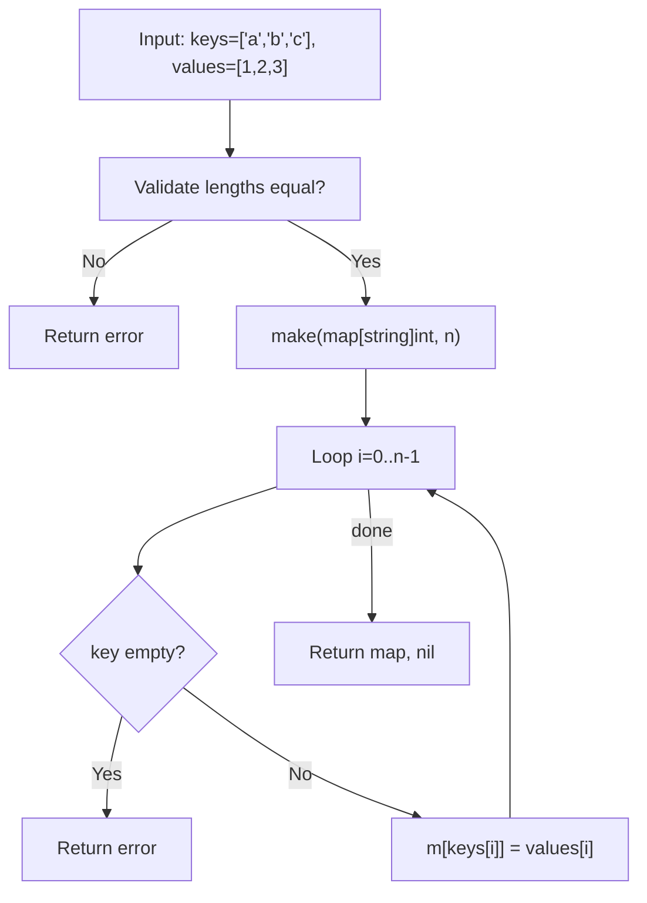

**Execution Trace:**
```
Input:  keys=["a","b","c"], values=[1,2,3]
Step 1: make(map[string]int, 3) → empty map with cap 3
Step 2: m["a"] = 1 → map{a:1}
Step 3: m["b"] = 2 → map{a:1, b:2}
Step 4: m["c"] = 3 → map{a:1, b:2, c:3}
Output: map{a:1, b:2, c:3}, count=3
```

### Interviewer Questions

1. Why use `make(map[K]V, n)` over `map[K]V{}`?
2. Can we improve time/space further? The lower bound is O(n) — unavoidable for n writes.
3. How does this scale to 10M elements? Memory stays linear; consider external storage or sharding at that scale.
4. Walk me through the edge case where keys has duplicates.
5. How would you make this goroutine-safe?
6. What's the memory/GC impact of storing large struct values vs pointers?
7. How would you test this comprehensively?

### Follow-Up Questions

**Q1:** What happens when you read from a nil map?
**A1:** Reading from a nil map is safe in Go — it returns the zero value for the value type. Only writes panic. Example: `var m map[string]int; fmt.Println(m["x"])` prints `0`.

**Q2:** How do you pre-size a map correctly?
**A2:** Use `make(map[K]V, expectedSize)`. The runtime uses this as a hint to allocate initial bucket capacity, reducing the number of rehash operations. Over-estimating wastes memory; under-estimating causes rehashing but is not incorrect.

**Q3:** Do map operations in Go have guaranteed O(1) amortised complexity?
**A3:** Yes, average-case O(1) for get/set/delete. Worst case is O(n) due to hash collisions, but Go's runtime uses a robust hash function (AES-based on supported platforms) making adversarial collisions difficult.

**Q4:** How would you deep-copy a map?
**A4:** Iterate and copy each key-value pair: `out := make(map[K]V, len(src)); for k, v := range src { out[k] = v }`. For nested maps or pointer values, a recursive deep-copy is required.

**Q5:** How do you test for nil vs empty map?
**A5:** `m == nil` checks nil; `len(m) == 0` checks empty. An initialised map with no entries is NOT nil: `m := map[string]int{}; fmt.Println(m == nil)` → `false`.

---

## Q2: Comma-OK Idiom — Check Key Existence  [Level 1 — Beginner]

> **Tags:** `#comma-ok` `#map-lookup` `#zero-value-trap`

### Problem Statement
Given a map of product prices and a list of product names to query, return each product's price if it exists, or -1 if it does not. Use the comma-ok idiom to distinguish between a missing key and a key whose value is legitimately 0.

### Input / Output / Constraints

```
Input:  prices  = map[string]int{"apple": 50, "banana": 0, "cherry": 120}
        queries = []string{"apple", "banana", "mango"}
Output: [50, 0, -1]

Constraints:
  • 0 ≤ len(queries) ≤ 10⁵
  • prices values can be 0 (free items)
  • keys are non-empty lowercase strings
```

### Thought Process

Think like a senior Go engineer:
1. **Understand:** A plain `if price := prices[key]; price == 0` check incorrectly treats free items as missing. We need the two-return form.
2. **Pattern:** `value, ok := m[key]` — the boolean `ok` is the only reliable existence check.
3. **Edge cases:** Value is legitimately 0, nil map (reads are safe), empty query list.
4. **Approach:** Single pass over queries, O(1) per lookup, return sentinel -1 for missing.

### Brute Force Solution

```go
package main

// bruteForce — O(q) time, O(q) space
// BUG: treats price==0 as "not found"
func bruteForce(prices map[string]int, queries []string) []int {
    results := make([]int, len(queries))
    for i, q := range queries {
        if price := prices[q]; price != 0 { // WRONG: misses free items
            results[i] = price
        } else {
            results[i] = -1
        }
    }
    return results
}
```

**Time:** O(q) | **Space:** O(q)
**Bottleneck:** Logical bug — zero-value collision; not a performance issue but a correctness bug.

### Better Solution

```go
// betterSolution — O(q) time, O(q) space
func betterSolution(prices map[string]int, queries []string) []int {
    results := make([]int, len(queries))
    for i, q := range queries {
        if price, ok := prices[q]; ok { // comma-ok correctly handles 0-value
            results[i] = price
        } else {
            results[i] = -1
        }
    }
    return results
}
```

**Time:** O(q) | **Space:** O(q)

### Best / Optimal Solution

```go
package main

import "fmt"

const missingPrice = -1

// QueryPrices — production-ready, O(q) time, O(q) space.
// Uses comma-ok idiom to correctly handle zero-value prices.
func QueryPrices(prices map[string]int, queries []string) ([]int, error) {
    if prices == nil {
        prices = map[string]int{} // treat nil map as empty, not an error
    }
    results := make([]int, len(queries))
    for i, q := range queries {
        if q == "" {
            return nil, fmt.Errorf("empty query at index %d", i)
        }
        if price, ok := prices[q]; ok {
            results[i] = price
        } else {
            results[i] = missingPrice
        }
    }
    return results, nil
}

func main() {
    prices := map[string]int{"apple": 50, "banana": 0, "cherry": 120}
    queries := []string{"apple", "banana", "mango"}
    results, err := QueryPrices(prices, queries)
    if err != nil {
        fmt.Printf("error: %v\n", err)
        return
    }
    fmt.Println(results) // [50 0 -1]
}
```

**Time:** O(q) | **Space:** O(q)

### Production Considerations

| Aspect | Details |
|--------|---------|
| **Scalability** | O(q) with O(1) per lookup; bottleneck shifts to map size at 10M+ entries (L3 cache pressure) |
| **Edge Cases** | Zero-value price (free item), nil map, empty query string, duplicate queries |
| **Error Handling** | Validate query strings; return typed errors; nil map treated as empty catalog |
| **Memory** | Result slice is O(q); for streaming results, use a channel instead |
| **Concurrency** | Read-only map access from multiple goroutines is safe; add `sync.RWMutex` if map is also written |

### Visual Explanation

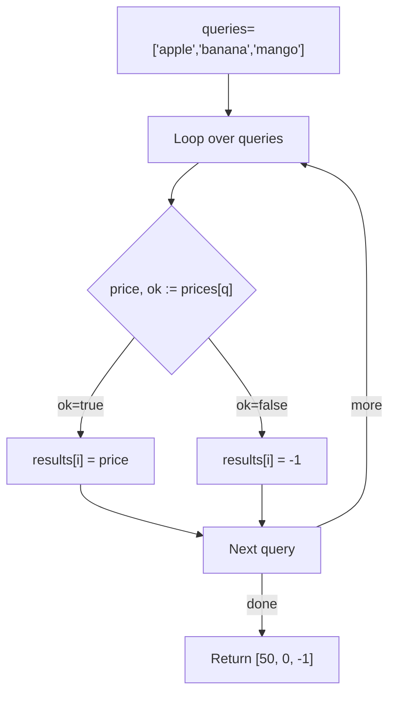

**Execution Trace:**
```
Input:  prices={apple:50, banana:0, cherry:120}, queries=[apple,banana,mango]
Step 1: "apple"  → ok=true,  price=50  → results[0]=50
Step 2: "banana" → ok=true,  price=0   → results[1]=0   ← comma-ok saves us
Step 3: "mango"  → ok=false            → results[2]=-1
Output: [50, 0, -1]
```

### Interviewer Questions

1. Why not check `prices[key] != 0` instead of the comma-ok idiom?
2. Can we improve time/space further? O(q) is optimal — every query must be answered.
3. How does this scale to 10M concurrent queries on a shared read-only map?
4. Walk me through the edge case where a product is genuinely free (price = 0).
5. How would you make this goroutine-safe for concurrent writes?
6. What's the GC impact if results are large structs instead of ints?
7. How would you test zero-value, missing, and nil-map scenarios?

### Follow-Up Questions

**Q1:** What does the second return value `ok` represent exactly?
**A1:** `ok` is `true` if the key exists in the map regardless of the stored value. It is the only correct way to distinguish "key not present" from "key present with zero value".

**Q2:** Is `_, ok := m[key]` valid if we only want to test existence?
**A2:** Yes, that is idiomatic Go for an existence-only check. The blank identifier discards the value.

**Q3:** Can the comma-ok idiom be used with type assertions?
**A3:** Yes: `v, ok := iface.(ConcreteType)`. Same pattern — `ok` is false and `v` is zero-value when the assertion fails, instead of panicking.

**Q4:** How do you delete a key and confirm it is gone?
**A4:** `delete(m, key)` removes the key. Calling `delete` on a nil map or a non-existent key is a no-op (no panic). Confirm removal with `_, ok := m[key]; !ok`.

**Q5:** How would you benchmark map lookup vs slice lookup for small N?
**A5:** Use `testing.B`. For very small N (< ~16 items), a linear slice scan can outperform map lookup due to CPU cache locality and no hash overhead. Benchmark with `b.ReportAllocs()` to see allocation differences.

---

## Q3: Iterate a Map and Handle Random Order  [Level 2 — Easy]

> **Tags:** `#map-iteration` `#determinism` `#sorting`

### Problem Statement
Given a map of student names to their exam scores, print a sorted leaderboard (highest score first, alphabetical order for ties). Demonstrate that raw map iteration order is non-deterministic and show how to produce a deterministic output.

### Input / Output / Constraints

```
Input:  scores = map[string]int{"Alice":90, "Bob":85, "Charlie":90, "Dave":75}
Output: [Charlie:90, Alice:90, Bob:85, Dave:75]
        (ties broken alphabetically)

Constraints:
  • 1 ≤ len(scores) ≤ 10⁴
  • 0 ≤ score ≤ 100
  • Names are non-empty strings
```

### Thought Process

Think like a senior Go engineer:
1. **Understand:** Go deliberately randomises map iteration order (since Go 1.0) to prevent developers from relying on it. We need an explicit sort step.
2. **Pattern:** Extract keys into a slice, sort the slice with a custom comparator, then iterate the slice.
3. **Edge cases:** Empty map, all-tied scores, single entry, very long names.
4. **Approach:** `sort.Slice` with a two-key comparator (score desc, name asc) is clean and efficient.

### Brute Force Solution

```go
package main

import "fmt"

// bruteForce — O(n) time, O(1) extra space, but output is NON-DETERMINISTIC
func bruteForce(scores map[string]int) {
    for name, score := range scores { // order changes each run!
        fmt.Printf("%s:%d\n", name, score)
    }
}
```

**Time:** O(n) | **Space:** O(1)
**Bottleneck:** Non-deterministic output — unusable for leaderboards, tests, or any user-visible ranking.

### Better Solution

```go
import "sort"

// betterSolution — O(n log n) time, O(n) space
func betterSolution(scores map[string]int) []string {
    keys := make([]string, 0, len(scores))
    for k := range scores {
        keys = append(keys, k)
    }
    sort.Slice(keys, func(i, j int) bool {
        if scores[keys[i]] != scores[keys[j]] {
            return scores[keys[i]] > scores[keys[j]] // higher score first
        }
        return keys[i] < keys[j] // alphabetical for ties
    })
    result := make([]string, len(keys))
    for i, k := range keys {
        result[i] = fmt.Sprintf("%s:%d", k, scores[k])
    }
    return result
}
```

**Time:** O(n log n) | **Space:** O(n)

### Best / Optimal Solution

```go
package main

import (
    "fmt"
    "sort"
)

// Entry holds a name-score pair for sorting.
type Entry struct {
    Name  string
    Score int
}

// Leaderboard — production-ready, O(n log n) time, O(n) space.
// Extracts map entries into a typed slice, sorts deterministically.
func Leaderboard(scores map[string]int) ([]Entry, error) {
    if len(scores) == 0 {
        return []Entry{}, nil
    }
    entries := make([]Entry, 0, len(scores))
    for name, score := range scores {
        if name == "" {
            return nil, fmt.Errorf("empty name key found in scores map")
        }
        entries = append(entries, Entry{Name: name, Score: score})
    }
    sort.Slice(entries, func(i, j int) bool {
        if entries[i].Score != entries[j].Score {
            return entries[i].Score > entries[j].Score
        }
        return entries[i].Name < entries[j].Name
    })
    return entries, nil
}

func main() {
    scores := map[string]int{"Alice": 90, "Bob": 85, "Charlie": 90, "Dave": 75}
    board, err := Leaderboard(scores)
    if err != nil {
        fmt.Printf("error: %v\n", err)
        return
    }
    for rank, e := range board {
        fmt.Printf("%d. %s — %d\n", rank+1, e.Name, e.Score)
    }
}
```

**Time:** O(n log n) | **Space:** O(n)

### Production Considerations

| Aspect | Details |
|--------|---------|
| **Scalability** | O(n log n) sort; at 1M students, consider a partial-sort (top-K heap) to avoid sorting all entries |
| **Edge Cases** | Empty map returns empty slice (not nil), tied scores, single entry, names with Unicode |
| **Error Handling** | Validate key content; consider wrapping sort panics with recover for untrusted input |
| **Memory** | Two allocations: keys slice + entries slice; can reuse a pool for hot paths |
| **Concurrency** | Safe to call concurrently on separate maps; not safe on a shared map without read lock |

### Visual Explanation

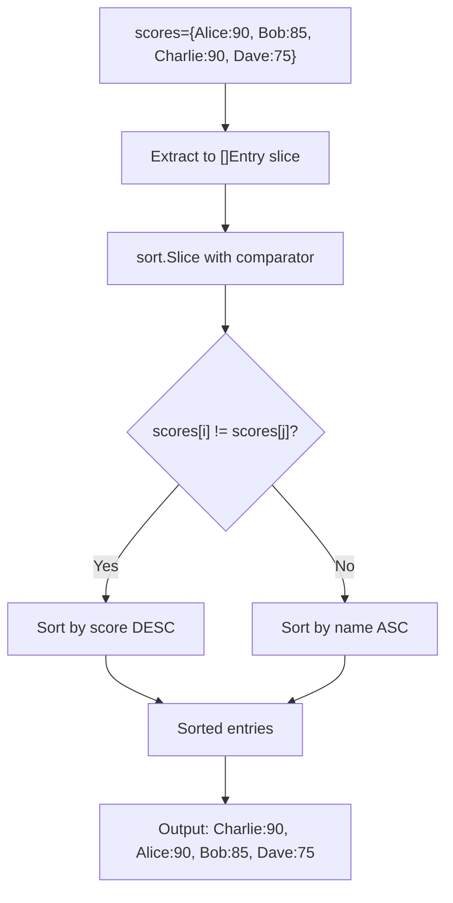

**Execution Trace:**
```
Input:  {Alice:90, Bob:85, Charlie:90, Dave:75}
Step 1: entries = [{Alice,90},{Bob,85},{Charlie,90},{Dave,75}] (any order)
Step 2: sort → [{Charlie,90},{Alice,90},{Bob,85},{Dave,75}]
         Charlie vs Alice: equal score → alphabetical: C > A → Charlie first
Output: 1.Charlie:90  2.Alice:90  3.Bob:85  4.Dave:75
```

### Interviewer Questions

1. Why does Go randomise map iteration order?
2. Can we get O(n) sorting here? No — comparison-based sort lower bound is O(n log n); counting sort could work for bounded scores (0-100).
3. How does this scale to 10M students with live score updates?
4. Walk me through the edge case where all students have the same score.
5. How would you make this goroutine-safe for concurrent score updates?
6. What is the memory impact of storing Entry structs vs pointers to structs?
7. How would you write a table-driven test for the sort stability requirement?

### Follow-Up Questions

**Q1:** Why did Go make map iteration non-deterministic?
**A1:** To prevent developers from writing code that accidentally depends on map ordering (which was an implementation detail that changed across Go versions). By randomising order at every run, the language forces explicit sorting when order matters.

**Q2:** Is there a data structure in Go that maintains insertion order?
**A2:** Not in the standard library. Options: maintain a separate `[]Key` slice alongside a map, use a linked-hash-map from a third-party package (e.g., `github.com/elliotchance/orderedmap`), or use `database/sql` rows which preserve column order.

**Q3:** For score range 0–100, is there a faster sort?
**A3:** Yes — counting sort is O(n + k) where k=101. Create a bucket `[101][]string`, place each name in `buckets[score]`, then iterate buckets in reverse. Total O(n) time with O(n+k) space.

**Q4:** How does `sort.Slice` compare to `sort.Sort` with a custom type?
**A4:** `sort.Slice` is convenient but uses reflection internally which can be slightly slower. For performance-critical code, implement `sort.Interface` (`Len`, `Less`, `Swap`) on a named type — the compiler can inline the comparisons.

**Q5:** How do you write a reproducible test for a function that reads a map?
**A5:** Always sort the expected output or use a map-comparison helper (e.g., `reflect.DeepEqual` for maps). Never rely on a specific iteration order in test assertions. Use `testify/assert.ElementsMatch` for slice comparison when order shouldn't matter.

---

## Q4: Word Frequency Counter  [Level 2 — Easy]

> **Tags:** `#frequency-count` `#string-processing` `#map-pattern`

### Problem Statement
Given a string of text, return a map of each word's frequency. Normalise words to lowercase and strip punctuation. Also return the top-K most frequent words in descending order of frequency (alphabetical tiebreak).

### Input / Output / Constraints

```
Input:  text = "Go is fast. Go is simple. Go!"
        k    = 2
Output: freq = {"go":3, "is":2, "fast":1, "simple":1}
        topK = ["go", "is"]

Constraints:
  • 0 ≤ len(text) ≤ 10⁶ characters
  • 1 ≤ k ≤ number of unique words
  • Words separated by whitespace; punctuation attached to words
```

### Thought Process

Think like a senior Go engineer:
1. **Understand:** Split text into tokens, normalise each token, count with a map, then extract top-K.
2. **Pattern:** Frequency map + sort-by-value pattern; `strings.Fields` for splitting.
3. **Edge cases:** Empty string, k larger than unique word count, all-punctuation tokens, Unicode text.
4. **Approach:** `strings.Fields` + `unicode.IsLetter` filter for robust tokenisation; heap for top-K at large scale.

### Brute Force Solution

```go
package main

import "strings"

// bruteForce — O(n + m log m) time, O(m) space, n=chars, m=unique words
// No punctuation stripping — "go" and "go!" counted separately.
func bruteForce(text string) map[string]int {
    freq := map[string]int{}
    for _, w := range strings.Fields(text) {
        freq[strings.ToLower(w)]++ // "go!" != "go" — BUG
    }
    return freq
}
```

**Time:** O(n) | **Space:** O(m)
**Bottleneck:** Punctuation not stripped; "go!" and "go" are counted as separate words.

### Better Solution

```go
import (
    "sort"
    "strings"
    "unicode"
)

func betterSolution(text string, k int) (map[string]int, []string) {
    freq := map[string]int{}
    for _, w := range strings.Fields(text) {
        // strip leading/trailing non-letter runes
        word := strings.Map(func(r rune) rune {
            if unicode.IsLetter(r) {
                return unicode.ToLower(r)
            }
            return -1 // drop non-letter
        }, w)
        if word != "" {
            freq[word]++
        }
    }
    // extract top-k
    words := make([]string, 0, len(freq))
    for w := range freq {
        words = append(words, w)
    }
    sort.Slice(words, func(i, j int) bool {
        if freq[words[i]] != freq[words[j]] {
            return freq[words[i]] > freq[words[j]]
        }
        return words[i] < words[j]
    })
    if k > len(words) {
        k = len(words)
    }
    return freq, words[:k]
}
```

**Time:** O(n + m log m) | **Space:** O(m)

### Best / Optimal Solution

```go
package main

import (
    "fmt"
    "sort"
    "strings"
    "unicode"
)

// WordFrequency — production-ready, O(n + m log m) time, O(m) space.
// Correctly normalises Unicode text and extracts top-K frequent words.
func WordFrequency(text string, k int) (map[string]int, []string, error) {
    if k < 0 {
        return nil, nil, fmt.Errorf("k must be non-negative, got %d", k)
    }
    freq := make(map[string]int)
    for _, token := range strings.Fields(text) {
        var sb strings.Builder
        for _, r := range token {
            if unicode.IsLetter(r) {
                sb.WriteRune(unicode.ToLower(r))
            }
        }
        if word := sb.String(); word != "" {
            freq[word]++
        }
    }
    // build sorted word list
    words := make([]string, 0, len(freq))
    for w := range freq {
        words = append(words, w)
    }
    sort.Slice(words, func(i, j int) bool {
        if freq[words[i]] != freq[words[j]] {
            return freq[words[i]] > freq[words[j]]
        }
        return words[i] < words[j]
    })
    if k > len(words) {
        k = len(words)
    }
    return freq, words[:k], nil
}

func main() {
    text := "Go is fast. Go is simple. Go!"
    freq, topK, err := WordFrequency(text, 2)
    if err != nil {
        fmt.Printf("error: %v\n", err)
        return
    }
    fmt.Println("freq:", freq)
    fmt.Println("top-2:", topK) // [go is]
}
```

**Time:** O(n + m log m) | **Space:** O(m)

### Production Considerations

| Aspect | Details |
|--------|---------|
| **Scalability** | Stream large files line-by-line; for 1GB text, use `bufio.Scanner` with word-level scanning |
| **Edge Cases** | Empty text, k=0 (return empty topK), all-punctuation input, mixed-script Unicode |
| **Error Handling** | Validate k; on I/O-based input, propagate scanner errors |
| **Memory** | `strings.Builder` avoids repeated allocations per token; map grows linearly with unique words |
| **Concurrency** | Shard input text by lines, count per-shard in goroutines, merge maps in final reduce step |

### Visual Explanation

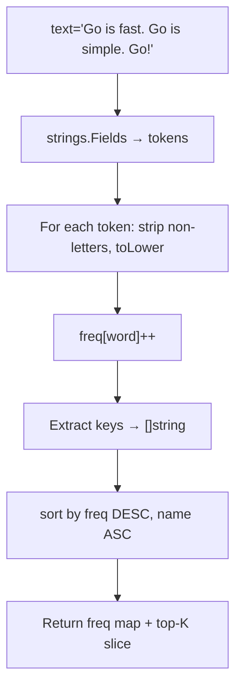

**Execution Trace:**
```
Input:  "Go is fast. Go is simple. Go!", k=2
Tokens: [Go, is, fast., Go, is, simple., Go!]
After normalise: [go, is, fast, go, is, simple, go]
freq:   {go:3, is:2, fast:1, simple:1}
sort:   [go(3), is(2), fast(1), simple(1)]
top-2:  [go, is]
```

### Interviewer Questions

1. Why use `strings.Builder` instead of string concatenation in the normalisation loop?
2. Can we get O(n) top-K without sorting all m unique words?
3. How does this scale to processing a 10GB log file?
4. Walk me through handling emojis or CJK characters.
5. How would you make concurrent word counting goroutine-safe?
6. What is the GC pressure of creating many short-lived strings?
7. How would you test Unicode normalisation correctness?

### Follow-Up Questions

**Q1:** How do you extract top-K in O(m) average time instead of O(m log m)?
**A1:** Use a min-heap of size K. For each word, push it onto the heap; if heap size exceeds K, pop the minimum. Final heap contains top-K in O(m log K) time. For m >> K this is significantly faster.

**Q2:** How would you count words from a large file without loading it fully into memory?
**A2:** Use `bufio.NewScanner(file)` with `scanner.Split(bufio.ScanWords)`. Process one word at a time — O(1) memory for the scanner buffer, O(unique words) for the frequency map.

**Q3:** What is the difference between `strings.Fields` and `strings.Split(s, " ")`?
**A3:** `strings.Fields` splits on any Unicode whitespace (spaces, tabs, newlines) and ignores leading/trailing/consecutive whitespace. `strings.Split(s, " ")` splits only on a single space character and produces empty strings for consecutive spaces.

**Q4:** How do you handle case-insensitive Unicode correctly (not just ASCII)?
**A4:** Use `golang.org/x/text/cases` package: `cases.Fold().String(word)` performs Unicode case folding, correctly handling characters like the German ß or Turkish İ/i.

**Q5:** How would you persist the frequency map and reload it?
**A5:** Serialise with `encoding/json` or `encoding/gob`. For large maps, consider a sorted key-value store like `bbolt` or `badger` for disk-backed persistence with O(log n) lookup.

---

## Q5: Grouping with Maps — Group Anagrams  [Level 2 — Easy]

> **Tags:** `#grouping` `#anagram` `#map-of-slices`

### Problem Statement
Given a list of strings, group all anagrams together. Two words are anagrams if they contain the same characters with the same frequencies. Return the groups in any order; within each group, order does not matter.

### Input / Output / Constraints

```
Input:  words = ["eat","tea","tan","ate","nat","bat"]
Output: [["eat","tea","ate"], ["tan","nat"], ["bat"]]

Constraints:
  • 1 ≤ len(words) ≤ 10⁴
  • 1 ≤ len(words[i]) ≤ 100
  • All characters are lowercase English letters a-z
  • Time limit: O(n * k log k), n=words, k=max word length
```

### Thought Process

Think like a senior Go engineer:
1. **Understand:** We need a canonical key that is identical for all anagrams of a word. Sorting the characters of a word produces such a key.
2. **Pattern:** Map of `sortedWord → []string`; group-by pattern.
3. **Edge cases:** Empty input, single-character words, all words are anagrams of each other, words with repeated characters.
4. **Approach:** For each word, sort its bytes to form a key, then append to the group. Final map values are the grouped slices.

### Brute Force Solution

```go
package main

// bruteForce — O(n² * k) time — compare every pair
func bruteForce(words []string) [][]string {
    used := make([]bool, len(words))
    var result [][]string
    for i, w := range words {
        if used[i] {
            continue
        }
        group := []string{w}
        used[i] = true
        for j := i + 1; j < len(words); j++ {
            if !used[j] && isAnagram(w, words[j]) {
                group = append(group, words[j])
                used[j] = true
            }
        }
        result = append(result, group)
    }
    return result
}

func isAnagram(a, b string) bool {
    if len(a) != len(b) {
        return false
    }
    var freq [26]int
    for i := range a {
        freq[a[i]-'a']++
        freq[b[i]-'a']--
    }
    return freq == [26]int{}
}
```

**Time:** O(n² * k) | **Space:** O(n)
**Bottleneck:** Quadratic pairwise comparison; redundant anagram checks for large n.

### Better Solution

```go
import "sort"

// betterSolution — O(n * k log k) time, O(n * k) space
func betterSolution(words []string) [][]string {
    groups := map[string][]string{}
    for _, w := range words {
        b := []byte(w)
        sort.Slice(b, func(i, j int) bool { return b[i] < b[j] })
        key := string(b)
        groups[key] = append(groups[key], w)
    }
    result := make([][]string, 0, len(groups))
    for _, g := range groups {
        result = append(result, g)
    }
    return result
}
```

**Time:** O(n * k log k) | **Space:** O(n * k)

### Best / Optimal Solution

```go
package main

import (
    "fmt"
    "sort"
)

// GroupAnagrams — production-ready, O(n * k log k) time, O(n * k) space.
// Uses sorted-character signature as the canonical anagram key.
func GroupAnagrams(words []string) ([][]string, error) {
    if len(words) == 0 {
        return [][]string{}, nil
    }
    groups := make(map[string][]string, len(words)/2)
    for _, w := range words {
        if w == "" {
            // empty string is its own anagram group — valid, not an error
            groups[""] = append(groups[""], w)
            continue
        }
        b := []byte(w)
        sort.Slice(b, func(i, j int) bool { return b[i] < b[j] })
        key := string(b)
        groups[key] = append(groups[key], w)
    }
    result := make([][]string, 0, len(groups))
    for _, g := range groups {
        result = append(result, g)
    }
    return result, nil
}

func main() {
    words := []string{"eat", "tea", "tan", "ate", "nat", "bat"}
    groups, err := GroupAnagrams(words)
    if err != nil {
        fmt.Printf("error: %v\n", err)
        return
    }
    for _, g := range groups {
        fmt.Println(g)
    }
}
```

**Time:** O(n * k log k) | **Space:** O(n * k)

### Production Considerations

| Aspect | Details |
|--------|---------|
| **Scalability** | At 1M words, key generation is the bottleneck; use frequency-array key `[26]byte` for O(k) key generation |
| **Edge Cases** | Empty string (valid anagram group), single-char words, all same characters, Unicode words |
| **Error Handling** | Log unexpected character ranges; for non-ASCII input, use rune frequency map as key |
| **Memory** | Each word's sorted key is duplicated in memory; intern keys with a sync.Map for repeated keys |
| **Concurrency** | Partition input by word hash for parallel processing, merge group maps at the end |

### Visual Explanation

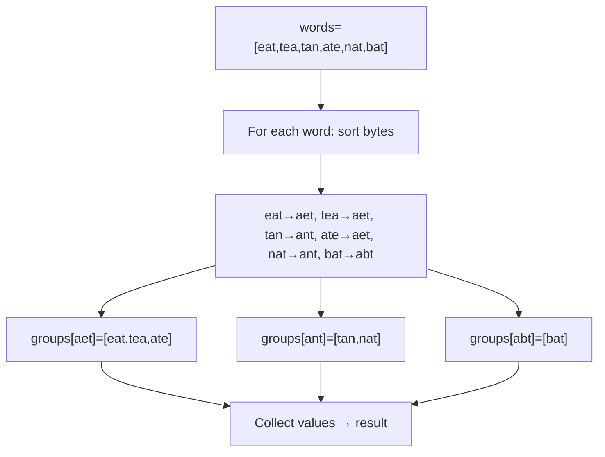

**Execution Trace:**
```
Input:  [eat, tea, tan, ate, nat, bat]
Step 1: eat → sort(eat) = aet → groups{aet:[eat]}
Step 2: tea → sort(tea) = aet → groups{aet:[eat,tea]}
Step 3: tan → sort(tan) = ant → groups{aet:[eat,tea], ant:[tan]}
Step 4: ate → sort(ate) = aet → groups{aet:[eat,tea,ate], ant:[tan]}
Step 5: nat → sort(nat) = ant → groups{aet:[eat,tea,ate], ant:[tan,nat]}
Step 6: bat → sort(bat) = abt → groups{..., abt:[bat]}
Output: [[eat tea ate] [tan nat] [bat]]
```

### Interviewer Questions

1. Why sort characters as the key instead of a character frequency map?
2. Can we achieve O(n * k) time instead of O(n * k log k)?
3. How does this scale to 10M words streamed from a file?
4. Walk me through the edge case where all input words are identical.
5. How would you make this goroutine-safe for concurrent group building?
6. What is the memory overhead of storing both original words and sorted keys?
7. How would you test that two anagram groups are returned correctly regardless of internal order?

### Follow-Up Questions

**Q1:** How do you use a frequency-array key to achieve O(n * k) time?
**A1:** For lowercase a-z only, represent each word as a `[26]int` counting each letter's frequency. Convert to a string key: `fmt.Sprintf("%v", freq)` or pack into a fixed `[26]byte`. This makes key generation O(k) instead of O(k log k).

**Q2:** How would you extend this to Unicode words?
**A2:** Use `map[rune]int` as the frequency counter. Serialise it to a string key by sorting the rune-count pairs: `"a:2,b:1"`. This is O(k log k) on the number of distinct runes in the word.

**Q3:** LeetCode follow-up: return groups sorted by size descending.
**A3:** After collecting all groups into `result`, apply `sort.Slice(result, func(i,j int) bool { return len(result[i]) > len(result[j]) })`.

**Q4:** What if words can have mixed case?
**A4:** Normalise before sorting: `strings.ToLower(w)`. The anagram key is still the sorted lowercase bytes; the original casing is preserved in the group slice.

**Q5:** How would you unit-test this function whose output order is non-deterministic?
**A5:** Sort each returned group internally, then sort the list of groups by their first element, then use `reflect.DeepEqual` against the expected sorted structure. Alternatively, use `testify/assert.ElementsMatch` on both levels.

---

## Q6: Set Implementation Using a Map  [Level 2 — Easy]

> **Tags:** `#set` `#map-struct{}` `#deduplication`

### Problem Statement
Go has no built-in set type. Implement a generic-style integer set using `map[int]struct{}` that supports Add, Remove, Contains, and Union operations. Explain why `struct{}` is preferred over `bool` as the value type.

### Input / Output / Constraints

```
Input:  setA = {1, 2, 3, 4}
        setB = {3, 4, 5, 6}
Output: union        = {1, 2, 3, 4, 5, 6}
        intersection = {3, 4}
        difference   = {1, 2}   (A minus B)

Constraints:
  • 0 ≤ |set| ≤ 10⁵
  • Elements are int64
  • Operations must be O(1) amortised for Add/Remove/Contains
```

### Thought Process

Think like a senior Go engineer:
1. **Understand:** A set is an unordered collection of unique elements. Maps provide O(1) add/remove/lookup.
2. **Pattern:** `map[K]struct{}` — empty struct occupies zero bytes, saving memory vs `map[K]bool`.
3. **Edge cases:** Adding duplicates (idempotent), removing non-existent element (no-op), union of nil/empty sets.
4. **Approach:** Wrap the map in a struct type with methods for clean API and future extensibility.

### Brute Force Solution

```go
package main

// bruteForce — uses []int slice — O(n) Contains, O(n) Remove
func bruteForce(elems []int) []int {
    seen := []int{}
    for _, e := range elems {
        found := false
        for _, s := range seen { // O(n) scan
            if s == e {
                found = true
                break
            }
        }
        if !found {
            seen = append(seen, e)
        }
    }
    return seen
}
```

**Time:** O(n²) for deduplication | **Space:** O(n)
**Bottleneck:** Linear scan for each element makes set operations quadratic.

### Better Solution

```go
// betterSolution — uses map[int]bool
type SetBool map[int]bool

func (s SetBool) Add(v int)      { s[v] = true }
func (s SetBool) Contains(v int) bool { return s[v] } // ok to use bool zero value
func (s SetBool) Remove(v int)   { delete(s, v) }
// NOTE: map[int]bool uses ~1 byte per entry for the bool value
// map[int]struct{} uses 0 bytes — struct{}{} is a zero-size type
```

**Time:** O(1) per operation | **Space:** O(n) — wastes 1 byte/entry for bool value

### Best / Optimal Solution

```go
package main

import "fmt"

// IntSet is a set of integers backed by a zero-value map.
type IntSet struct {
    m map[int]struct{}
}

// NewIntSet creates an initialised, empty set.
func NewIntSet(capacity int) *IntSet {
    return &IntSet{m: make(map[int]struct{}, capacity)}
}

// Add inserts v into the set (idempotent).
func (s *IntSet) Add(v int) { s.m[v] = struct{}{} }

// Remove deletes v from the set (no-op if absent).
func (s *IntSet) Remove(v int) { delete(s.m, v) }

// Contains reports whether v is in the set.
func (s *IntSet) Contains(v int) bool {
    _, ok := s.m[v]
    return ok
}

// Len returns the number of elements.
func (s *IntSet) Len() int { return len(s.m) }

// Union returns a new set containing all elements from both sets.
func (s *IntSet) Union(other *IntSet) *IntSet {
    result := NewIntSet(s.Len() + other.Len())
    for k := range s.m {
        result.m[k] = struct{}{}
    }
    for k := range other.m {
        result.m[k] = struct{}{}
    }
    return result
}

// Intersection returns elements present in both sets.
func (s *IntSet) Intersection(other *IntSet) *IntSet {
    // iterate the smaller set
    small, large := s, other
    if s.Len() > other.Len() {
        small, large = other, s
    }
    result := NewIntSet(small.Len())
    for k := range small.m {
        if large.Contains(k) {
            result.m[k] = struct{}{}
        }
    }
    return result
}

// Difference returns elements in s but not in other.
func (s *IntSet) Difference(other *IntSet) *IntSet {
    result := NewIntSet(s.Len())
    for k := range s.m {
        if !other.Contains(k) {
            result.m[k] = struct{}{}
        }
    }
    return result
}

func main() {
    a := NewIntSet(4)
    for _, v := range []int{1, 2, 3, 4} { a.Add(v) }
    b := NewIntSet(4)
    for _, v := range []int{3, 4, 5, 6} { b.Add(v) }

    fmt.Println("union len:", a.Union(b).Len())          // 6
    fmt.Println("intersection len:", a.Intersection(b).Len()) // 2
    fmt.Println("difference len:", a.Difference(b).Len()) // 2
}
```

**Time:** O(min(|A|,|B|)) for intersection, O(|A|+|B|) for union | **Space:** O(output set size)

### Production Considerations

| Aspect | Details |
|--------|---------|
| **Scalability** | Intersection optimisation (iterate smaller set) reduces work at 1M+ elements |
| **Edge Cases** | nil receiver (add nil check), empty set union/intersection, element 0 (zero value is valid) |
| **Error Handling** | No errors for set operations — all are defined for all inputs; panic on nil receiver is acceptable |
| **Memory** | `struct{}` value type takes 0 bytes; only key+hash overhead per entry (~56 bytes on 64-bit) |
| **Concurrency** | Not goroutine-safe; wrap with `sync.RWMutex` — use RLock for Contains, Lock for Add/Remove |

### Visual Explanation

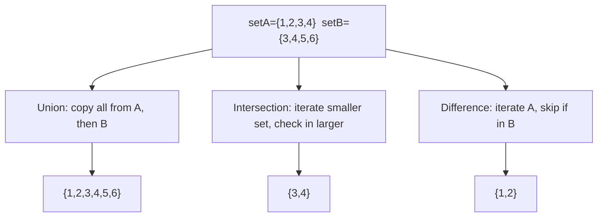

**Execution Trace:**
```
A = {1,2,3,4}  B = {3,4,5,6}
Union:        copy A → {1,2,3,4}, add 5,6 from B → {1,2,3,4,5,6}
Intersection: small=A(4), check 1∉B, 2∉B, 3∈B✓, 4∈B✓ → {3,4}
Difference:   1∉B✓, 2∉B✓, 3∈B✗, 4∈B✗ → {1,2}
```

### Interviewer Questions

1. Why `struct{}` over `bool`? What is the actual memory saving?
2. Can Contains be O(1)? Yes — it is O(1) amortised via map lookup.
3. How does this scale to a set of 10M elements with frequent Contains checks?
4. Walk me through the edge case where both sets are empty.
5. How would you make all operations goroutine-safe?
6. What is the GC impact of storing pointer types vs value types as set elements?
7. How would you implement a generic Set[T comparable] in Go 1.18+?

### Follow-Up Questions

**Q1:** How do you implement a generic `Set[T comparable]` using Go generics (1.18+)?
**A1:** `type Set[T comparable] struct { m map[T]struct{} }`. Methods become `func (s *Set[T]) Add(v T)`, etc. This works for any comparable type (int, string, struct with comparable fields).

**Q2:** Why is `struct{}` preferred over `bool` for set values?
**A2:** In Go, `struct{}` is a zero-size type — it occupies no memory. The compiler optimises all `struct{}` values to point to the same runtime address (`zerobase`). `bool` requires 1 byte per map entry, which adds up at scale: 10M entries × 1 byte = 10MB extra vs 0 bytes.

**Q3:** How do you serialise an IntSet to JSON?
**A3:** Implement `json.Marshaler`: extract keys into a `[]int` slice, sort it, marshal the slice. Implement `json.Unmarshaler`: unmarshal a `[]int`, then add all elements to the set.

**Q4:** What is the time complexity of computing the symmetric difference?
**A4:** O(|A| + |B|): `symmetricDiff = A.Difference(B).Union(B.Difference(A))`. Each difference is O(|smaller set|) and union is O(|A-B| + |B-A|).

**Q5:** How do you test that set operations are commutative/associative?
**A5:** Write property-based tests using `pgregory.net/rapid` or `testing/quick`. Generate random integer slices, build sets, and verify invariants: `A∪B == B∪A`, `(A∪B)∪C == A∪(B∪C)`, `|A∩B| ≤ min(|A|,|B|)`.

---

## Q7: Invert a Map — Reverse Key-Value Mapping  [Level 3 — Medium]

> **Tags:** `#map-inversion` `#collision-handling` `#bijection`

### Problem Statement
Given a map from username to user ID, return the inverted map from user ID to username. Handle the case where multiple usernames map to the same ID (collision) by returning an error listing all colliding entries. Also implement a safe "invert with grouping" variant that returns `map[V][]K` without errors.

### Input / Output / Constraints

```
Input:  userMap = {"alice":1, "bob":2, "charlie":3}
Output: inverted = {1:"alice", 2:"bob", 3:"charlie"}, err=nil

Collision case:
Input:  {"alice":1, "bob":1, "charlie":2}
Output: nil, error("duplicate value 1: keys [alice bob]")

Constraints:
  • 1 ≤ len(map) ≤ 10⁵
  • Keys and values are non-zero
  • Values are int; keys are strings
```

### Thought Process

Think like a senior Go engineer:
1. **Understand:** Inversion swaps keys and values. It is only a bijection if the original map is injective (no duplicate values).
2. **Pattern:** Single-pass with collision detection using a pre-check pass or inline detection with comma-ok.
3. **Edge cases:** Duplicate values (must error or group), empty input, single-entry map, all values identical.
4. **Approach:** Single-pass: use comma-ok to detect if the target key already exists in the inverted map; collect collisions before returning error.

### Brute Force Solution

```go
package main

// bruteForce — O(n) time, O(n) space — no collision detection (silently overwrites)
func bruteForce(m map[string]int) map[int]string {
    inv := make(map[int]string, len(m))
    for k, v := range m {
        inv[v] = k // silently overwrites on collision — data loss!
    }
    return inv
}
```

**Time:** O(n) | **Space:** O(n)
**Bottleneck:** Silently loses data on collision — a serious correctness bug for production use.

### Better Solution

```go
import "fmt"

// betterSolution — O(n) time — detects collisions but stops at first one
func betterSolution(m map[string]int) (map[int]string, error) {
    inv := make(map[int]string, len(m))
    for k, v := range m {
        if existing, ok := inv[v]; ok {
            return nil, fmt.Errorf("collision: value %d used by both %q and %q", v, existing, k)
        }
        inv[v] = k
    }
    return inv, nil
}
```

**Time:** O(n) | **Space:** O(n)

### Best / Optimal Solution

```go
package main

import (
    "fmt"
    "sort"
    "strings"
)

// InvertMap inverts map[string]int to map[int]string.
// Returns an error listing ALL collisions found (not just the first).
func InvertMap(m map[string]int) (map[int]string, error) {
    if len(m) == 0 {
        return map[int]string{}, nil
    }
    inv := make(map[int]string, len(m))
    collisions := map[int][]string{}

    for k, v := range m {
        if existing, ok := inv[v]; ok {
            // record collision; only add existing on first collision
            if _, seen := collisions[v]; !seen {
                collisions[v] = []string{existing}
            }
            collisions[v] = append(collisions[v], k)
        } else {
            inv[v] = k
        }
    }
    if len(collisions) > 0 {
        msgs := make([]string, 0, len(collisions))
        for val, keys := range collisions {
            sort.Strings(keys) // deterministic error message
            msgs = append(msgs, fmt.Sprintf("value %d: keys %v", val, keys))
        }
        sort.Strings(msgs)
        return nil, fmt.Errorf("map inversion failed — duplicate values: %s",
            strings.Join(msgs, "; "))
    }
    return inv, nil
}

// InvertMapGrouped inverts without error — maps each value to all its keys.
func InvertMapGrouped(m map[string]int) map[int][]string {
    result := make(map[int][]string, len(m))
    for k, v := range m {
        result[v] = append(result[v], k)
    }
    return result
}

func main() {
    clean := map[string]int{"alice": 1, "bob": 2, "charlie": 3}
    inv, err := InvertMap(clean)
    if err != nil {
        fmt.Println("error:", err)
    } else {
        fmt.Println("inverted:", inv) // {1:alice 2:bob 3:charlie}
    }

    colliding := map[string]int{"alice": 1, "bob": 1, "charlie": 2}
    _, err = InvertMap(colliding)
    fmt.Println("collision error:", err)

    grouped := InvertMapGrouped(colliding)
    fmt.Println("grouped:", grouped) // {1:[alice bob] 2:[charlie]}
}
```

**Time:** O(n) | **Space:** O(n)

### Production Considerations

| Aspect | Details |
|--------|---------|
| **Scalability** | Single-pass O(n); at 10M entries, collision map may be large — cap it to fail fast |
| **Edge Cases** | Empty map, all values identical, zero/negative int values, nil input map |
| **Error Handling** | Collect ALL collisions before returning — gives caller full picture; never silent data loss |
| **Memory** | Two maps in memory during inversion; swap in-place if source map can be modified |
| **Concurrency** | Wrap with read lock; inversion is a read-heavy operation on the source map |

### Visual Explanation

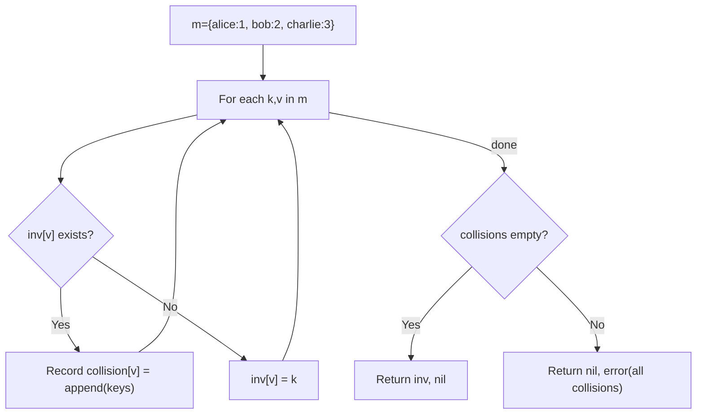

**Execution Trace:**
```
Input:  {alice:1, bob:1, charlie:2}
Step 1: alice→1: inv[1]="alice"
Step 2: bob→1:   inv[1] exists! collision[1]=["alice","bob"]
Step 3: charlie→2: inv[2]="charlie"
Output: nil, error("value 1: keys [alice bob]")
```

### Interviewer Questions

1. Why collect all collisions instead of failing on the first one?
2. Can we invert in O(1) space by modifying the original map? (No, because types differ)
3. How does this scale to a 10M-entry bidirectional mapping?
4. Walk me through the edge case where every value is the same.
5. How would you make concurrent inversion goroutine-safe?
6. What is the GC pressure when both maps exist simultaneously?
7. How would you test that the collision error message is deterministic?

### Follow-Up Questions

**Q1:** How do you implement a bidirectional map (bimap) in Go?
**A1:** Maintain two maps: `forward map[K]V` and `inverse map[V]K`. Wrap in a struct with Add/Remove that keep both maps in sync. Add must check both directions for conflicts before inserting.

**Q2:** How do you safely invert a map that is concurrently read by other goroutines?
**A2:** Take a read lock on the source map, snapshot it into a local copy, release the lock, then perform the inversion on the snapshot. This minimises lock hold time.

**Q3:** How do you invert a `map[string][]int` (one-to-many)?
**A3:** Iterate outer keys; for each value in the slice, append the outer key: `for k, vals := range m { for _, v := range vals { inv[v] = append(inv[v], k) } }`. Result is `map[int][]string`.

**Q4:** How would you validate that an original map is invertible before attempting inversion?
**A4:** Build a `map[V]struct{}` of seen values in one pass; if `len(seenValues) != len(m)`, there are duplicates — return early without building the inversion.

**Q5:** How do you benchmark InvertMap vs InvertMapGrouped?
**A5:** Use `testing.B` with maps of 100, 10K, 1M entries. Use `b.ReportAllocs()` to count allocations. `InvertMap` is faster for bijective maps (no slice allocations); `InvertMapGrouped` has higher allocation count due to `append`.

---

## Q8: Two Sum Using a Hash Map  [Level 3 — Medium]

> **Tags:** `#two-sum` `#hash-map` `#complement-lookup` `#google` `#amazon`

### Problem Statement
Given a slice of integers and a target value, return the indices of the two numbers that add up to the target. Each input has exactly one solution. You may not use the same element twice. Return an error if no valid pair exists.

### Input / Output / Constraints

```
Input:  nums   = [2, 7, 11, 15]
        target = 9
Output: [0, 1]   (nums[0]+nums[1] = 2+7 = 9)

Constraints:
  • 2 ≤ len(nums) ≤ 10⁵
  • -10⁹ ≤ nums[i] ≤ 10⁹
  • -10⁹ ≤ target ≤ 10⁹
  • Exactly one valid answer guaranteed (or return error)
  • Time: O(n) expected
```

### Thought Process

Think like a senior Go engineer:
1. **Understand:** For each element x, we need to find (target - x) in the remaining elements. Linear scan is O(n²); map lookup is O(1).
2. **Pattern:** Complement lookup — build map as you iterate; for each element check if its complement already exists in the map.
3. **Edge cases:** Negative numbers, target = 0, duplicate values (e.g., [3,3], target=6), same element used twice (forbidden), no solution.
4. **Approach:** Single-pass: check complement in map first, then insert current index. This handles [3,3] correctly.

### Brute Force Solution

```go
package main

import "errors"

// bruteForce — O(n²) time, O(1) space
func bruteForce(nums []int, target int) ([2]int, error) {
    for i := 0; i < len(nums); i++ {
        for j := i + 1; j < len(nums); j++ {
            if nums[i]+nums[j] == target {
                return [2]int{i, j}, nil
            }
        }
    }
    return [2]int{}, errors.New("no solution found")
}
```

**Time:** O(n²) | **Space:** O(1)
**Bottleneck:** Nested loop; for n=10⁵ this is 10¹⁰ operations — too slow.

### Better Solution

```go
import "errors"

// betterSolution — O(n) time, O(n) space — two-pass: build map then scan
func betterSolution(nums []int, target int) ([2]int, error) {
    seen := make(map[int]int, len(nums)) // value → first index
    for i, n := range nums {
        seen[n] = i
    }
    for i, n := range nums {
        complement := target - n
        if j, ok := seen[complement]; ok && j != i {
            return [2]int{i, j}, nil
        }
    }
    return [2]int{}, errors.New("no solution found")
}
```

**Time:** O(n) | **Space:** O(n)

### Best / Optimal Solution

```go
package main

import (
    "errors"
    "fmt"
)

// ErrNoSolution is returned when no two elements sum to the target.
var ErrNoSolution = errors.New("no two-sum solution exists")

// TwoSum — production-ready, O(n) time, O(n) space.
// Single-pass: checks complement before inserting current index.
// Correctly handles duplicate values (e.g., [3,3], target=6).
func TwoSum(nums []int, target int) ([2]int, error) {
    if len(nums) < 2 {
        return [2]int{}, fmt.Errorf("need at least 2 elements, got %d", len(nums))
    }
    seen := make(map[int]int, len(nums)) // num → index
    for i, n := range nums {
        complement := target - n
        if j, ok := seen[complement]; ok {
            // return lower index first for canonical output
            if i < j {
                return [2]int{i, j}, nil
            }
            return [2]int{j, i}, nil
        }
        seen[n] = i // insert AFTER complement check to avoid using same index twice
    }
    return [2]int{}, ErrNoSolution
}

func main() {
    nums := []int{2, 7, 11, 15}
    indices, err := TwoSum(nums, 9)
    if err != nil {
        fmt.Printf("error: %v\n", err)
        return
    }
    fmt.Printf("indices: [%d, %d]\n", indices[0], indices[1]) // [0, 1]

    // duplicate values test
    nums2 := []int{3, 3}
    idx2, _ := TwoSum(nums2, 6)
    fmt.Printf("duplicate: [%d, %d]\n", idx2[0], idx2[1]) // [0, 1]
}
```

**Time:** O(n) average | **Space:** O(n)

### Production Considerations

| Aspect | Details |
|--------|---------|
| **Scalability** | O(n) single pass; hash collisions degrade to O(n²) worst case — Go's AES hash mitigates adversarial inputs |
| **Edge Cases** | Negative numbers, target=0, duplicate values, nums=[x,x] where 2x=target, no solution |
| **Error Handling** | Sentinel `ErrNoSolution`; validate minimum slice length; caller can `errors.Is` check |
| **Memory** | Map grows to at most n entries; pre-sized with `make(map, n)` to avoid rehashing |
| **Concurrency** | Function is stateless (takes a slice, returns indices) — safe to call concurrently |

### Visual Explanation

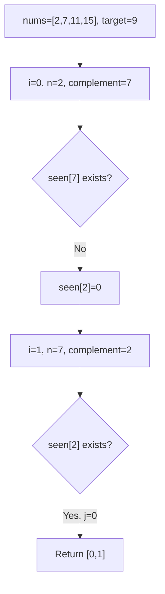

**Execution Trace:**
```
Input:  nums=[2,7,11,15], target=9
i=0: n=2, comp=7, seen={} → miss → seen={2:0}
i=1: n=7, comp=2, seen={2:0} → HIT j=0 → return [0,1]
Output: [0, 1]
```

### Interviewer Questions

1. Why check complement before inserting vs inserting first?
2. Can we solve this in O(1) space? (Yes with sorting — but O(n log n) time and no index guarantee)
3. How does this scale to a streaming input where we must answer queries online?
4. Walk me through the edge case where nums = [3, 3], target = 6.
5. How would you make this goroutine-safe for a shared accumulator?
6. What is the theoretical lower bound for this problem?
7. How would you test all edge cases including overflow?

### Follow-Up Questions

**Q1:** How do you solve Three Sum using the same map technique?
**A1:** Fix one element x, then run TwoSum on the remaining slice for target `t-x`. O(n²) total. For O(n²) with no duplicates in output: sort first, use two-pointer for the inner loop.

**Q2:** What if the array has duplicates and we need all unique pairs?
**A2:** Sort the array, use two pointers, skip duplicates: `for l < r { if nums[l]+nums[r] == target { record; skip dupes } else if sum < target { l++ } else { r-- } }`.

**Q3:** Can integer overflow occur when computing the complement?
**A3:** Yes, if target and nums[i] are both near int extremes. In Go, use `int64` or check: `if target-n` overflows. Detect with: `complement := target - n; if (n > 0 && complement > target) || (n < 0 && complement < target) { overflow }`.

**Q4:** How do you extend TwoSum to return ALL pairs summing to target?
**A4:** Use a frequency map: `freq[num]++`. For each unique num, check `freq[target-num]`. Handle the case where `target-num == num` by checking `freq[num] >= 2`. Collect pairs without duplicates by only iterating nums where `num <= target-num`.

**Q5:** How do you test TwoSum for a target with no solution?
**A5:** Add a test case where no pair sums to target, e.g., `nums=[1,2,3], target=100`. Assert `errors.Is(err, ErrNoSolution)`. Also test empty/single-element slices and verify the correct error type is returned.

---

## Q9: Graph Adjacency List Using a Map  [Level 3 — Medium]

> **Tags:** `#graph` `#adjacency-list` `#bfs` `#dfs` `#map-of-slices`

### Problem Statement
Implement an undirected graph using `map[int][]int` as an adjacency list. Support AddEdge and BFS/DFS traversal. Given a graph and two nodes, return the shortest path (in hops) between them using BFS. Return -1 if no path exists.

### Input / Output / Constraints

```
Input:  edges = [[0,1],[0,2],[1,3],[2,3],[3,4]]
        src=0, dst=4
Output: 3   (path: 0→1→3→4 or 0→2→3→4)

Constraints:
  • 1 ≤ nodes ≤ 10⁵
  • 0 ≤ edges ≤ 10⁵
  • Node IDs are non-negative integers
  • Graph may be disconnected
  • Time: O(V + E)
```

### Thought Process

Think like a senior Go engineer:
1. **Understand:** BFS on an unweighted graph gives the shortest hop-count path. The adjacency list is a map from node ID to its neighbour list.
2. **Pattern:** BFS with a visited set (implemented as `map[int]bool`), a queue (slice used as deque), and a distance map.
3. **Edge cases:** src == dst (distance 0), disconnected graph (return -1), self-loops, multiple edges between same nodes.
4. **Approach:** Use `map[int]int` for distance tracking — avoids a separate visited set.

### Brute Force Solution

```go
package main

// bruteForce — DFS, finds A path but NOT necessarily the shortest
func bruteForceDFS(adj map[int][]int, src, dst int) int {
    visited := map[int]bool{}
    var dfs func(node, depth int) int
    dfs = func(node, depth int) int {
        if node == dst { return depth }
        visited[node] = true
        for _, nb := range adj[node] {
            if !visited[nb] {
                if d := dfs(nb, depth+1); d != -1 {
                    return d
                }
            }
        }
        return -1
    }
    return dfs(src, 0)
}
```

**Time:** O(V+E) | **Space:** O(V)
**Bottleneck:** DFS finds a path but not the shortest; result is incorrect for shortest-path queries.

### Better Solution

```go
// betterSolution — BFS using distance map, O(V+E) time
func betterSolution(adj map[int][]int, src, dst int) int {
    if src == dst { return 0 }
    dist := map[int]int{src: 0}
    queue := []int{src}
    for len(queue) > 0 {
        node := queue[0]; queue = queue[1:]
        for _, nb := range adj[node] {
            if _, seen := dist[nb]; !seen {
                dist[nb] = dist[node] + 1
                if nb == dst { return dist[nb] }
                queue = append(queue, nb)
            }
        }
    }
    return -1
}
```

**Time:** O(V+E) | **Space:** O(V)

### Best / Optimal Solution

```go
package main

import "fmt"

// Graph is an undirected graph backed by an adjacency list map.
type Graph struct {
    adj map[int][]int
}

// NewGraph initialises an empty graph.
func NewGraph() *Graph {
    return &Graph{adj: make(map[int][]int)}
}

// AddEdge adds an undirected edge between u and v.
func (g *Graph) AddEdge(u, v int) {
    g.adj[u] = append(g.adj[u], v)
    g.adj[v] = append(g.adj[v], u)
}

// ShortestPath returns the minimum hops from src to dst using BFS.
// Returns -1 if dst is unreachable from src.
func (g *Graph) ShortestPath(src, dst int) (int, error) {
    if _, ok := g.adj[src]; !ok {
        return -1, fmt.Errorf("source node %d not in graph", src)
    }
    if src == dst {
        return 0, nil
    }
    dist := make(map[int]int, len(g.adj))
    dist[src] = 0
    queue := make([]int, 0, len(g.adj))
    queue = append(queue, src)

    for len(queue) > 0 {
        node := queue[0]
        queue = queue[1:]
        for _, nb := range g.adj[node] {
            if _, seen := dist[nb]; !seen {
                dist[nb] = dist[node] + 1
                if nb == dst {
                    return dist[nb], nil
                }
                queue = append(queue, nb)
            }
        }
    }
    return -1, nil // dst unreachable
}

func main() {
    g := NewGraph()
    for _, e := range [][2]int{{0,1},{0,2},{1,3},{2,3},{3,4}} {
        g.AddEdge(e[0], e[1])
    }
    hops, err := g.ShortestPath(0, 4)
    if err != nil {
        fmt.Printf("error: %v\n", err)
        return
    }
    fmt.Println("shortest hops:", hops) // 3
}
```

**Time:** O(V+E) | **Space:** O(V)

### Production Considerations

| Aspect | Details |
|--------|---------|
| **Scalability** | At 10M nodes, adjacency list memory is O(V+E); use compressed sparse row (CSR) format for read-only graphs |
| **Edge Cases** | src==dst (0 hops), disconnected graph (-1), self-loops (node in its own adjacency list), parallel edges |
| **Error Handling** | Return error for unknown source node; return -1 (not error) for unreachable destination — these are semantically different |
| **Memory** | Queue can grow to O(V) in worst case (star graph); pre-allocate with graph size hint |
| **Concurrency** | Not goroutine-safe for AddEdge; use `sync.RWMutex` — RLock for traversal, Lock for mutations |

### Visual Explanation

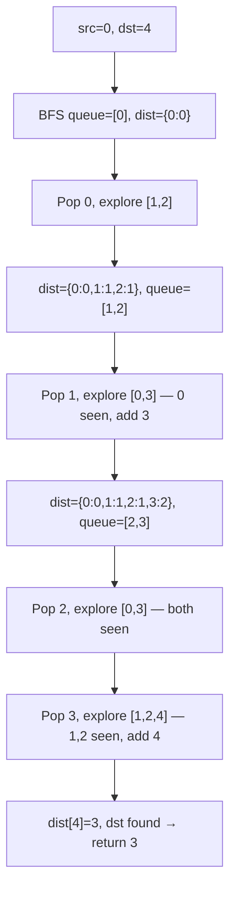

**Execution Trace:**
```
queue=[0]              dist={0:0}
pop 0 → neighbours [1,2]: dist={0:0,1:1,2:1}, queue=[1,2]
pop 1 → neighbours [0,3]: 0 seen; dist[3]=2, queue=[2,3]
pop 2 → neighbours [0,3]: both seen, queue=[3]
pop 3 → neighbours [1,2,4]: 1,2 seen; dist[4]=3 == dst → return 3
```

### Interviewer Questions

1. Why BFS over DFS for shortest path on an unweighted graph?
2. For weighted graphs, how do we extend this? (Dijkstra with priority queue)
3. How does this scale to 10M nodes + 100M edges?
4. Walk me through a disconnected graph where src and dst are in different components.
5. How would you make AddEdge and ShortestPath concurrently safe?
6. What is the memory overhead of `map[int][]int` vs a CSR matrix?
7. How would you test BFS correctness including the disconnected case?

### Follow-Up Questions

**Q1:** How do you reconstruct the actual path, not just the hop count?
**A1:** Maintain a `parent map[int]int` alongside `dist`. When setting `dist[nb]`, also set `parent[nb] = node`. After BFS, walk backwards from dst to src using parent map and reverse the path.

**Q2:** How do you detect a cycle in this graph?
**A2:** Modified BFS/DFS: during traversal, if you encounter a visited node that is not the parent of the current node (in undirected graph), a cycle exists.

**Q3:** How do you find all connected components?
**A3:** Iterate all nodes in `g.adj`. For each unvisited node, run BFS/DFS and mark all reachable nodes as one component. Count the number of BFS/DFS initiations.

**Q4:** How would you represent a weighted directed graph?
**A4:** Use `map[int][]Edge` where `type Edge struct { To, Weight int }`. Dijkstra's algorithm then uses a min-heap on edge weights.

**Q5:** How do you test BFS on a graph with 10K nodes and ensure O(V+E) performance?
**A5:** Use `testing.B`, generate a random graph with known diameter, run BFS, and verify result. Profile with `pprof` to ensure no hidden O(V²) operation from repeated slice appends — use pre-allocated queues.

---

## Q10: Cache / Memoization with a Map  [Level 3 — Medium]

> **Tags:** `#memoization` `#dynamic-programming` `#cache` `#fibonacci`

### Problem Statement
Implement a memoized Fibonacci function that caches previously computed values in a `map[int]int`. Then generalise this into a reusable `Memoize` wrapper that takes any `func(int) int` and returns a cached version. Demonstrate the performance difference with and without memoization.

### Input / Output / Constraints

```
Input:  n = 45
Output: fib(45) = 1134903170

Constraints:
  • 0 ≤ n ≤ 86   (fib(86) fits in int64)
  • Memoize wrapper must work for any int→int pure function
  • Cached wrapper must be safe for single-goroutine use (concurrent in Q11)
```

### Thought Process

Think like a senior Go engineer:
1. **Understand:** Naive recursive Fibonacci is O(2ⁿ) due to overlapping subproblems. Memoization reduces it to O(n) by caching each subproblem's result.
2. **Pattern:** Top-down dynamic programming via memoization; higher-order function pattern in Go using closures.
3. **Edge cases:** n=0, n=1, negative n (error), n > 86 (int64 overflow), repeated calls (cache hit).
4. **Approach:** Close over the cache map in a recursive function literal; the `Memoize` wrapper stores cache per wrapped function instance.

### Brute Force Solution

```go
package main

// bruteForce — O(2ⁿ) time, O(n) stack space — no caching
func fibNaive(n int) int {
    if n <= 1 { return n }
    return fibNaive(n-1) + fibNaive(n-2) // recomputes same subproblems repeatedly
}
```

**Time:** O(2ⁿ) | **Space:** O(n) stack
**Bottleneck:** Exponential recomputation; fib(45) makes ~2.7 billion recursive calls.

### Better Solution

```go
// betterSolution — O(n) time, O(n) space — explicit memo map
func fibMemo(n int, memo map[int]int) int {
    if n <= 1 { return n }
    if v, ok := memo[n]; ok { return v }
    result := fibMemo(n-1, memo) + fibMemo(n-2, memo)
    memo[n] = result
    return result
}
```

**Time:** O(n) | **Space:** O(n)

### Best / Optimal Solution

```go
package main

import (
    "fmt"
    "math"
)

// Memoize returns a cached version of any pure func(int) int.
// The cache is private to the returned function (closure).
func Memoize(f func(int) int) func(int) int {
    cache := make(map[int]int)
    var cached func(int) int
    cached = func(n int) int {
        if v, ok := cache[n]; ok {
            return v
        }
        result := f(n)
        cache[n] = result
        return result
    }
    return cached
}

// FibMemoized — O(n) time, O(n) space.
// Uses a closure to hide the cache map from callers.
func FibMemoized(n int) (int64, error) {
    if n < 0 {
        return 0, fmt.Errorf("fibonacci undefined for negative n=%d", n)
    }
    if n > 86 {
        return 0, fmt.Errorf("fib(%d) overflows int64 (max n=86)", n)
    }
    cache := make(map[int]int64, n+1)
    var fib func(int) int64
    fib = func(k int) int64 {
        if k <= 1 { return int64(k) }
        if v, ok := cache[k]; ok { return v }
        result := fib(k-1) + fib(k-2)
        cache[k] = result
        return result
    }
    return fib(n), nil
}

func main() {
    result, err := FibMemoized(45)
    if err != nil {
        fmt.Printf("error: %v\n", err)
        return
    }
    fmt.Printf("fib(45) = %d\n", result) // 1134903170
    fmt.Printf("max fib = fib(86) = %d (< %d)\n",
        func() int64 { v, _ := FibMemoized(86); return v }(),
        int64(math.MaxInt64))
}
```

**Time:** O(n) | **Space:** O(n)

### Production Considerations

| Aspect | Details |
|--------|---------|
| **Scalability** | Cache grows linearly; for n ≤ 86, pre-populate the full table at startup (93 entries) |
| **Edge Cases** | n=0 (→0), n=1 (→1), n<0 (error), n>86 (overflow), repeated calls (cache hit on second call) |
| **Error Handling** | Return typed errors for invalid ranges; document the int64 overflow boundary |
| **Memory** | 87 int64 entries = ~700 bytes; negligible; for general memoize, consider a bounded LRU cache |
| **Concurrency** | This implementation is NOT goroutine-safe; protect cache map with sync.RWMutex for concurrent callers |

### Visual Explanation

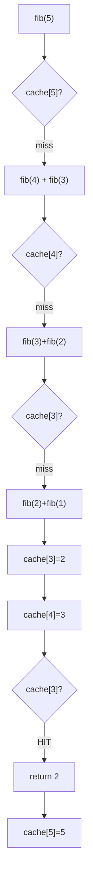

**Execution Trace:**
```
fib(5): cache miss → compute fib(4)+fib(3)
fib(4): cache miss → compute fib(3)+fib(2)
fib(3): cache miss → compute fib(2)+fib(1) = 1+1 = 2; cache[3]=2
fib(4): fib(2)+fib(3) = 1+2 = 3; cache[4]=3
fib(5): fib(4)+fib(3) = 3+cache[3]=2 = 5; cache[5]=5
Output: 5
```

### Interviewer Questions

1. Why top-down memoization over bottom-up DP tabulation?
2. Can we solve Fibonacci in O(1) space? Yes — keep only last two values; but the `Memoize` wrapper still needs a map.
3. How does the `Memoize` wrapper scale to functions with multiple arguments?
4. Walk me through the edge case n=0 and n=1 in the recursive version.
5. How would you make the Memoize wrapper goroutine-safe?
6. What GC pressure does a large cache map create for long-running programs?
7. How would you test that a memoized function calls the underlying function exactly n times?

### Follow-Up Questions

**Q1:** How do you implement a bounded memoize cache (evict old entries)?
**A1:** Replace the plain map with an LRU cache (see Q15). When the cache is full, evict the least-recently-used entry before inserting a new one.

**Q2:** How do you memoize a function with multiple parameters?
**A2:** Encode the parameters as a struct key: `type key struct{ a, b int }; cache map[key]int`. Or serialise params to a string key. For variadic args, use `fmt.Sprint(args...)` as key (slower but generic).

**Q3:** What is the difference between memoization and dynamic programming?
**A3:** Memoization is top-down DP — recursive with caching. DP tabulation is bottom-up — iterative, fills a table from base cases. Both have the same asymptotic complexity; tabulation avoids stack overflow for large n.

**Q4:** How would you persist the memo cache across process restarts?
**A4:** Serialise the cache map to disk using `encoding/gob` or `encoding/json` at shutdown, and reload at startup. For distributed systems, use Redis as the backing store.

**Q5:** How do you test that memoization correctly reduces function call count?
**A5:** Wrap the underlying function with a call counter (atomic int): `calls := 0; memoized := Memoize(func(n int) int { calls++; return slowFib(n) })`. Call `memoized(10)` twice; assert `calls == 11` (not 22), confirming the second call was fully served from cache.

---

## Q11: Concurrent Map Access with sync.Map  [Level 4 — Advanced]

> **Tags:** `#sync.Map` `#concurrency` `#goroutine-safe` `#race-condition`

### Problem Statement
Build a thread-safe request counter that tracks how many times each API endpoint has been hit. Multiple goroutines increment counters simultaneously. Demonstrate the data race with a plain map, fix it with `sync.Mutex`, and then show when `sync.Map` is the better choice. Return the final count for a given endpoint.

### Input / Output / Constraints

```
Input:  endpoints = ["/api/v1/users", "/api/v1/orders", "/api/v1/users", ...]
        goroutines = 100 concurrent writers
Output: counts["/api/v1/users"] = correct total (no race, no lost updates)

Constraints:
  • Up to 10⁶ concurrent increments/second
  • Read:Write ratio = 80:20 (read-heavy)
  • 0 ≤ unique endpoints ≤ 10³
  • No dropped counts allowed
```

### Thought Process

Think like a senior Go engineer:
1. **Understand:** Concurrent map writes in Go cause a runtime panic (`concurrent map writes`). We need either mutex protection or `sync.Map`.
2. **Pattern:** For counters with many goroutines writing the same keys, `sync.Mutex` + regular map is often faster than `sync.Map`. `sync.Map` excels when keys are mostly written once and read many times.
3. **Edge cases:** Zero initial count, endpoint strings with special characters, goroutines reading while others are writing, counter overflow at int64 max.
4. **Approach:** Implement both and benchmark; use `sync/atomic` for the highest-performance counter.

### Brute Force Solution

```go
package main

// bruteForce — DATA RACE: concurrent map writes will panic
func bruteForce(endpoints []string) map[string]int {
    counts := map[string]int{}
    ch := make(chan string, len(endpoints))
    for _, e := range endpoints {
        ch <- e
    }
    close(ch)
    for i := 0; i < 10; i++ {
        go func() {
            for e := range ch {
                counts[e]++ // concurrent map write: DATA RACE → panic
            }
        }()
    }
    return counts
}
```

**Time:** O(n) | **Space:** O(endpoints)
**Bottleneck:** Concurrent writes cause runtime panic: `fatal error: concurrent map writes`.

### Better Solution

```go
import "sync"

// betterSolution — mutex-protected map — correct for counter workloads
type MutexCounter struct {
    mu     sync.Mutex
    counts map[string]int
}

func (c *MutexCounter) Increment(endpoint string) {
    c.mu.Lock()
    c.counts[endpoint]++
    c.mu.Unlock()
}

func (c *MutexCounter) Get(endpoint string) int {
    c.mu.Lock()
    defer c.mu.Unlock()
    return c.counts[endpoint]
}
```

**Time:** O(1) per op | **Space:** O(unique endpoints)

### Best / Optimal Solution

```go
package main

import (
    "fmt"
    "sync"
    "sync/atomic"
)

// AtomicCounter uses sync.Map with atomic int64 values for lock-free reads.
// Optimal for read-heavy workloads with stable key sets.
type AtomicCounter struct {
    m sync.Map // map[string]*int64
}

// Increment atomically increments the counter for endpoint.
func (c *AtomicCounter) Increment(endpoint string) {
    // LoadOrStore ensures only one *int64 per key, even under contention.
    actual, _ := c.m.LoadOrStore(endpoint, new(int64))
    atomic.AddInt64(actual.(*int64), 1)
}

// Get returns the current count for endpoint (0 if never incremented).
func (c *AtomicCounter) Get(endpoint string) int64 {
    if v, ok := c.m.Load(endpoint); ok {
        return atomic.LoadInt64(v.(*int64))
    }
    return 0
}

// Snapshot returns all counts as a plain map (for reporting).
func (c *AtomicCounter) Snapshot() map[string]int64 {
    result := map[string]int64{}
    c.m.Range(func(k, v any) bool {
        result[k.(string)] = atomic.LoadInt64(v.(*int64))
        return true
    })
    return result
}

func main() {
    counter := &AtomicCounter{}
    endpoints := []string{"/api/v1/users", "/api/v1/orders", "/api/v1/users"}

    var wg sync.WaitGroup
    for i := 0; i < 100; i++ {
        for _, ep := range endpoints {
            wg.Add(1)
            go func(e string) {
                defer wg.Done()
                counter.Increment(e)
            }(ep)
        }
    }
    wg.Wait()

    snap := counter.Snapshot()
    fmt.Println("/api/v1/users count:", snap["/api/v1/users"])   // 200
    fmt.Println("/api/v1/orders count:", snap["/api/v1/orders"]) // 100
}
```

**Time:** O(1) per Increment/Get | **Space:** O(unique endpoints)

### Production Considerations

| Aspect | Details |
|--------|---------|
| **Scalability** | atomic + sync.Map handles 10M ops/sec on modern hardware; for higher throughput, use sharded counters |
| **Edge Cases** | First access to a key (LoadOrStore race — handled correctly), int64 overflow at max traffic |
| **Error Handling** | No errors in hot path; report overflow via monitoring, not panics |
| **Memory** | Each unique endpoint allocates one int64; sync.Map has per-entry overhead ~64 bytes |
| **Concurrency** | Fully goroutine-safe; atomic operations avoid CAS contention; sync.Map.Range does not block writers |

### Visual Explanation

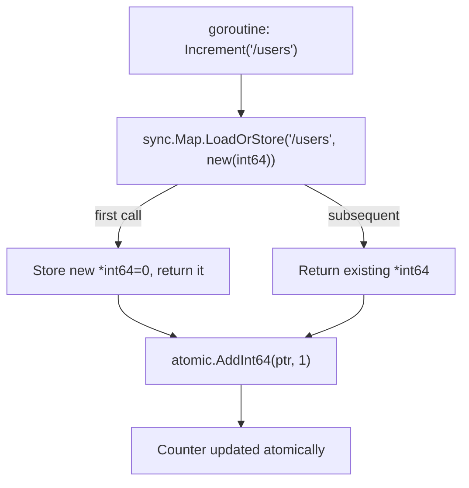

**Execution Trace:**
```
G1: LoadOrStore("/users") → stores *int64(0), atomicAdd → *int64=1
G2: LoadOrStore("/users") → loads *int64(1), atomicAdd → *int64=2
G3: LoadOrStore("/orders")→ stores *int64(0), atomicAdd → *int64=1
...100 goroutines × 2 "/users" calls → "/users"=200
```

### Interviewer Questions

1. When is `sync.Map` better than `sync.Mutex` + `map`?
2. Why use `atomic.AddInt64` instead of relying on `sync.Map`'s own locking?
3. How does this scale to 10M concurrent requests per second?
4. Walk me through a LoadOrStore race where two goroutines hit the same new key simultaneously.
5. What happens if we use `sync.Map.Store` instead of `LoadOrStore` for the pointer?
6. What is the memory overhead of sync.Map vs a sharded mutex map?
7. How would you test for data races in this implementation?

### Follow-Up Questions

**Q1:** When should you prefer `sync.Mutex` over `sync.Map`?
**A1:** For write-heavy or mixed read/write with a stable set of keys, `sync.Mutex` + `map` is faster because `sync.Map` has extra overhead for its internal dirty/read map bookkeeping. Benchmark with your actual read:write ratio to decide.

**Q2:** How do you detect a data race at development time?
**A2:** Run tests with `-race` flag: `go test -race ./...`. The race detector instruments all memory accesses and reports races with goroutine stack traces. It adds ~5x runtime overhead — use in CI, not production.

**Q3:** What is the difference between `sync.Map.Store` and `LoadOrStore`?
**A3:** `Store(k,v)` always overwrites. `LoadOrStore(k,v)` stores only if the key is absent; returns the existing value if present. For our counter, `LoadOrStore` ensures exactly one `*int64` is allocated per key even under race conditions.

**Q4:** How would you implement a per-endpoint rate limiter using the same pattern?
**A4:** Store `*rate.Limiter` values in `sync.Map`. Use `LoadOrStore` to create a new `rate.NewLimiter(r, b)` per endpoint on first access. Each incoming request calls `limiter.Allow()` — atomic and goroutine-safe.

**Q5:** How do you test concurrent increments for correctness?
**A5:** Use `go test -race -count=100` to run the test many times under the race detector. Assert the final count equals `goroutines × increments_per_goroutine`. Use `t.Parallel()` to stress-test concurrency.

---

## Q12: Sharded Map for High Concurrency  [Level 4 — Advanced]

> **Tags:** `#sharding` `#concurrency` `#performance` `#map-design`

### Problem Statement
Implement a sharded map with N shards (default 32), where each shard is a separate `map[string]interface{}` protected by its own `sync.RWMutex`. Key-to-shard assignment uses FNV hash. Implement Set, Get, and Delete. Explain why this outperforms a single global mutex at high concurrency.

### Input / Output / Constraints

```
Input:  shards  = 32
        keys    = 10⁶ unique string keys
        writers = 1000 concurrent goroutines
Output: correct values for all keys, no data races, throughput ≫ single-mutex map

Constraints:
  • 1 ≤ shards ≤ 256 (must be power of 2 for fast modulo)
  • Keys are arbitrary non-empty strings
  • Values are interface{} (any type)
  • Get:Set ratio ≈ 9:1 (read-heavy)
```

### Thought Process

Think like a senior Go engineer:
1. **Understand:** A single mutex serialises all concurrent map accesses. Sharding divides the key space into N independent maps, each with its own lock — N goroutines can operate in parallel on different shards.
2. **Pattern:** Consistent hashing for shard selection; per-shard RWMutex for read/write separation.
3. **Edge cases:** Hash collisions within same shard (fine — separate from key collisions), shard count = 1 (degenerate), keys that all hash to same shard (worst case).
4. **Approach:** FNV-1a hash mod N shards; RWMutex per shard allows concurrent reads within same shard.

### Brute Force Solution

```go
package main

import "sync"

// bruteForce — single global mutex, serialises all access
type GlobalMap struct {
    mu sync.RWMutex
    m  map[string]interface{}
}

func (g *GlobalMap) Set(k string, v interface{}) {
    g.mu.Lock()
    g.m[k] = v
    g.mu.Unlock()
}
func (g *GlobalMap) Get(k string) (interface{}, bool) {
    g.mu.RLock()
    v, ok := g.m[k]
    g.mu.RUnlock()
    return v, ok
}
```

**Time:** O(1) per op | **Space:** O(n)
**Bottleneck:** Single mutex becomes a global bottleneck at high goroutine counts — throughput plateaus.

### Better Solution

```go
// betterSolution — 16-shard map
const numShards = 16

type ShardedMap16 [numShards]struct {
    sync.RWMutex
    m map[string]interface{}
}

func (s *ShardedMap16) shard(key string) *struct {
    sync.RWMutex
    m map[string]interface{}
} {
    h := fnv32(key)
    return &s[h%numShards]
}
```

**Time:** O(1) per op | **Space:** O(n)

### Best / Optimal Solution

```go
package main

import (
    "fmt"
    "hash/fnv"
    "sync"
)

const defaultShards = 32

// shard is a single partition of the sharded map.
type shard struct {
    sync.RWMutex
    data map[string]interface{}
}

// ShardedMap distributes keys across N independent shards.
type ShardedMap struct {
    shards []*shard
    n      uint32
}

// NewShardedMap creates a sharded map with n shards (rounded to default if 0).
func NewShardedMap(n int) *ShardedMap {
    if n <= 0 {
        n = defaultShards
    }
    sm := &ShardedMap{
        shards: make([]*shard, n),
        n:      uint32(n),
    }
    for i := range sm.shards {
        sm.shards[i] = &shard{data: make(map[string]interface{})}
    }
    return sm
}

// getShard returns the shard responsible for key using FNV-1a hash.
func (sm *ShardedMap) getShard(key string) *shard {
    h := fnv.New32a()
    h.Write([]byte(key))
    return sm.shards[h.Sum32()%sm.n]
}

// Set stores key-value, overwriting any existing value.
func (sm *ShardedMap) Set(key string, value interface{}) error {
    if key == "" {
        return fmt.Errorf("empty key not allowed")
    }
    s := sm.getShard(key)
    s.Lock()
    s.data[key] = value
    s.Unlock()
    return nil
}

// Get retrieves the value for key. Returns (nil, false) if not found.
func (sm *ShardedMap) Get(key string) (interface{}, bool) {
    s := sm.getShard(key)
    s.RLock()
    v, ok := s.data[key]
    s.RUnlock()
    return v, ok
}

// Delete removes key from its shard (no-op if absent).
func (sm *ShardedMap) Delete(key string) {
    s := sm.getShard(key)
    s.Lock()
    delete(s.data, key)
    s.Unlock()
}

// Len returns the total number of keys across all shards.
func (sm *ShardedMap) Len() int {
    total := 0
    for _, s := range sm.shards {
        s.RLock()
        total += len(s.data)
        s.RUnlock()
    }
    return total
}

func main() {
    sm := NewShardedMap(32)
    var wg sync.WaitGroup

    // concurrent writers
    for i := 0; i < 1000; i++ {
        wg.Add(1)
        go func(id int) {
            defer wg.Done()
            key := fmt.Sprintf("key-%d", id)
            sm.Set(key, id*2)
        }(i)
    }
    wg.Wait()

    fmt.Println("total keys:", sm.Len()) // 1000
    if v, ok := sm.Get("key-42"); ok {
        fmt.Println("key-42:", v) // 84
    }
}
```

**Time:** O(1) per Set/Get/Delete | **Space:** O(n)

### Production Considerations

| Aspect | Details |
|--------|---------|
| **Scalability** | 32 shards → up to 32x throughput vs single mutex; at 1000 goroutines, contention per shard drops to ~1/32 |
| **Edge Cases** | Shard count = 1 (works, degenerates to single mutex), empty key (validated), hash skew (monitor per-shard load) |
| **Error Handling** | Validate key; monitor shard imbalance via Len() per shard; alert if one shard is 10x average |
| **Memory** | N empty maps at startup: negligible; each shard grows independently |
| **Concurrency** | Per-shard RWMutex allows concurrent reads within a shard; writes in same shard are serialised — expected behaviour |

### Visual Explanation

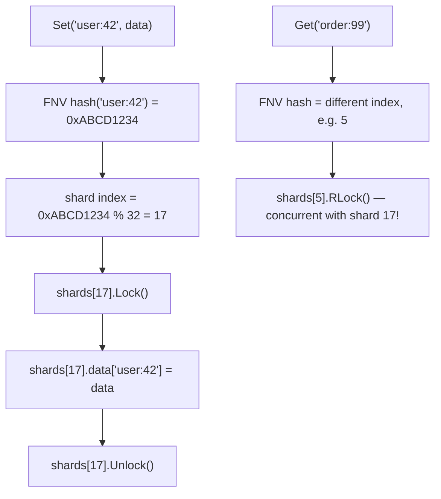

**Execution Trace:**
```
1000 goroutines writing key-0..key-999
FNV assigns each key to one of 32 shards (~31 keys/shard)
Each shard serialises ~31 writes independently
Peak contention: 1000/32 ≈ 31 goroutines per shard (vs 1000 for global mutex)
```

### Interviewer Questions

1. Why is sharding better than `sync.Map` for write-heavy workloads?
2. What happens to performance if all keys hash to the same shard?
3. How does shard count choice (16 vs 32 vs 256) affect performance?
4. Walk me through a cross-shard atomic operation (e.g., swap two keys).
5. How do you implement an atomic `GetOrSet` operation on a sharded map?
6. What is the memory overhead of 32 RWMutexes vs 1?
7. How do you test that keys are uniformly distributed across shards?

### Follow-Up Questions

**Q1:** How do you implement an atomic `GetOrSet` (compute-if-absent) in a sharded map?
**A1:** Lock the shard with a write lock, check if key exists, if not compute and store, then unlock. The full operation must be within the same lock scope: `s.Lock(); if _, ok := s.data[key]; !ok { s.data[key] = compute() }; s.Unlock()`.

**Q2:** How do you perform a consistent snapshot of the entire sharded map?
**A2:** Lock all shards in index order (to prevent deadlocks), copy all data, then unlock all. This pauses writes briefly. For a non-blocking approximate snapshot, copy one shard at a time while tolerating slight inconsistency.

**Q3:** How do you choose the optimal shard count?
**A3:** Start with `runtime.GOMAXPROCS(0) * 4`. Benchmark at expected concurrency levels. Too few shards → contention; too many → wasted memory and cache pressure. Powers of 2 allow fast modulo with bitmasking.

**Q4:** How do you handle a cross-shard transaction (e.g., transfer between two keys)?
**A4:** Sort the two shard indices and always lock in the same order to prevent deadlock. Lock shard_min first, then shard_max. Perform the operation, then unlock in reverse order.

**Q5:** How would you add TTL (time-to-live) expiration to the sharded map?
**A5:** Extend the shard value to a struct `{value interface{}; expiry time.Time}`. On Get, check `time.Now().After(expiry)` and return miss if expired. Run a background goroutine per shard (or a single sweeper) to delete expired keys periodically.

---

## Q13: JSON-Like Nested Maps  [Level 4 — Advanced]

> **Tags:** `#nested-maps` `#json` `#dynamic-data` `#deep-access`

### Problem Statement
Implement a function `GetNested(data map[string]interface{}, path string) (interface{}, error)` that traverses a nested map structure using a dot-separated path (e.g., `"user.address.city"`). Also implement `SetNested` that creates intermediate maps as needed. Handle type mismatches gracefully.

### Input / Output / Constraints

```
Input:  data = {"user": {"address": {"city": "Mumbai", "zip": "400001"}, "name": "Alice"}}
        path = "user.address.city"
Output: "Mumbai", nil

SetNested:
Input:  data = {}, path = "a.b.c", value = 42
Output: data = {"a": {"b": {"c": 42}}}

Constraints:
  • Path components are non-empty strings separated by "."
  • Depth up to 10 levels
  • Values can be any type (string, int, map, slice)
  • Type mismatch at intermediate node → return descriptive error
```

### Thought Process

Think like a senior Go engineer:
1. **Understand:** We must traverse a `map[string]interface{}` tree following a path, with proper type assertions at each level.
2. **Pattern:** Iterative path traversal with `strings.Split`; type assertion with comma-ok at each step.
3. **Edge cases:** Empty path, path to non-existent key, intermediate node is not a map (type mismatch), nil data, single-component path.
4. **Approach:** Split path, iterate components, assert type at each level, return typed error on mismatch.

### Brute Force Solution

```go
package main

import "strings"

// bruteForce — panics on type mismatch, no error handling
func bruteForce(data map[string]interface{}, path string) interface{} {
    parts := strings.Split(path, ".")
    var current interface{} = data
    for _, p := range parts {
        current = current.(map[string]interface{})[p] // panics if wrong type
    }
    return current
}
```

**Time:** O(depth) | **Space:** O(depth)
**Bottleneck:** Panics on any type mismatch or missing key — completely unsafe for production.

### Better Solution

```go
import (
    "fmt"
    "strings"
)

func betterSolution(data map[string]interface{}, path string) (interface{}, error) {
    parts := strings.Split(path, ".")
    var current interface{} = data
    for _, p := range parts {
        m, ok := current.(map[string]interface{})
        if !ok {
            return nil, fmt.Errorf("path component %q: not a map", p)
        }
        current, ok = m[p]
        if !ok {
            return nil, fmt.Errorf("key %q not found", p)
        }
    }
    return current, nil
}
```

**Time:** O(depth) | **Space:** O(1)

### Best / Optimal Solution

```go
package main

import (
    "fmt"
    "strings"
)

// GetNested retrieves a value at dot-separated path from a nested map.
func GetNested(data map[string]interface{}, path string) (interface{}, error) {
    if data == nil {
        return nil, fmt.Errorf("data map is nil")
    }
    if path == "" {
        return nil, fmt.Errorf("path must not be empty")
    }
    parts := strings.Split(path, ".")
    var current interface{} = data
    for i, part := range parts {
        if part == "" {
            return nil, fmt.Errorf("empty path component at index %d", i)
        }
        m, ok := current.(map[string]interface{})
        if !ok {
            traversed := strings.Join(parts[:i], ".")
            return nil, fmt.Errorf("path %q: node at %q is %T, not a map",
                path, traversed, current)
        }
        val, exists := m[part]
        if !exists {
            return nil, fmt.Errorf("path %q: key %q not found", path, part)
        }
        current = val
    }
    return current, nil
}

// SetNested sets a value at dot-separated path, creating intermediate maps.
func SetNested(data map[string]interface{}, path string, value interface{}) error {
    if data == nil {
        return fmt.Errorf("data map is nil")
    }
    if path == "" {
        return fmt.Errorf("path must not be empty")
    }
    parts := strings.Split(path, ".")
    current := data
    for i, part := range parts[:len(parts)-1] {
        if part == "" {
            return fmt.Errorf("empty path component at index %d", i)
        }
        if existing, ok := current[part]; ok {
            // node exists — must be a map
            next, ok := existing.(map[string]interface{})
            if !ok {
                return fmt.Errorf("path component %q already exists as %T, not a map",
                    part, existing)
            }
            current = next
        } else {
            // create intermediate map
            next := make(map[string]interface{})
            current[part] = next
            current = next
        }
    }
    current[parts[len(parts)-1]] = value
    return nil
}

func main() {
    data := map[string]interface{}{
        "user": map[string]interface{}{
            "name": "Alice",
            "address": map[string]interface{}{
                "city": "Mumbai",
                "zip":  "400001",
            },
        },
    }

    city, err := GetNested(data, "user.address.city")
    if err != nil {
        fmt.Println("error:", err)
        return
    }
    fmt.Println("city:", city) // Mumbai

    if err := SetNested(data, "user.address.country", "India"); err != nil {
        fmt.Println("error:", err)
        return
    }
    country, _ := GetNested(data, "user.address.country")
    fmt.Println("country:", country) // India
}
```

**Time:** O(depth) | **Space:** O(depth) for SetNested intermediate maps

### Production Considerations

| Aspect | Details |
|--------|---------|
| **Scalability** | O(depth) — depth is bounded (typically ≤ 10); not a scalability concern |
| **Edge Cases** | nil data, empty path, double dots ("a..b"), path to existing non-map node (SetNested error), value=nil |
| **Error Handling** | Descriptive errors with full path context; wrap with `fmt.Errorf("GetNested: %w", err)` for callers |
| **Memory** | SetNested allocates one map per new path component; GC collects on map removal |
| **Concurrency** | Not goroutine-safe; if data is shared, wrap entire Get/Set with sync.RWMutex |

### Visual Explanation

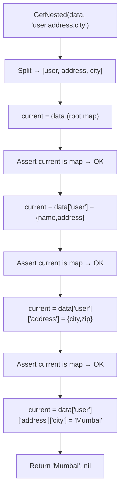

**Execution Trace:**
```
path = "user.address.city"
parts = [user, address, city]
i=0: current=root, assert map OK, current = root["user"] = {name,address map}
i=1: assert map OK, current = user["address"] = {city:"Mumbai", zip:"400001"}
i=2: assert map OK, current = address["city"] = "Mumbai"
return "Mumbai", nil
```

### Interviewer Questions

1. Why use `map[string]interface{}` instead of typed structs?
2. How would you make GetNested return a typed result using generics?
3. How does this scale to deeply nested (50+ levels) structures?
4. Walk me through the edge case where an intermediate node is a `[]interface{}`.
5. How would you make GetNested and SetNested goroutine-safe?
6. What is the GC pressure of creating many intermediate maps with SetNested?
7. How would you test that SetNested does not overwrite existing intermediate maps?

### Follow-Up Questions

**Q1:** How do you implement array indexing in the path, e.g., `"users.0.name"`?
**A1:** Check if a path component is a valid integer index: `if i, err := strconv.Atoi(part); err == nil { ... }`. Assert the current node as `[]interface{}` and index into it, with bounds checking.

**Q2:** How do you use Go generics to return a typed value from GetNested?
**A2:** `func GetNestedTyped[T any](data map[string]interface{}, path string) (T, error) { v, err := GetNested(data, path); if err != nil { return zero, err }; t, ok := v.(T); if !ok { return zero, fmt.Errorf("expected %T, got %T", *new(T), v) }; return t, nil }`.

**Q3:** How do you diff two nested maps to find added/removed/changed keys?
**A3:** Recursive function: for each key in map A, check if it exists in map B — if both values are maps, recurse; otherwise compare values. Track added (in B not A), removed (in A not B), and changed (in both, different values).

**Q4:** How do you merge two nested maps (B overrides A)?
**A4:** Recursive merge: for each key in B, if both A[key] and B[key] are maps, recurse. Otherwise set A[key] = B[key]. This handles deep merge vs shallow merge (direct assignment for non-map values).

**Q5:** How do you convert a flat map with dot-notation keys to a nested map?
**A5:** Iterate the flat map; for each key like `"a.b.c": value`, call `SetNested(result, key, value)`. This reconstructs the full nested structure from a flattened representation.

---

## Q14: Frequency Map — Top K Frequent Elements  [Level 4 — Advanced]

> **Tags:** `#frequency-map` `#heap` `#top-k` `#bucket-sort` `#amazon` `#google`

### Problem Statement
Given an integer array, return the K most frequent elements. The answer must be returned in any order. Solve in O(n) time using bucket sort. Also implement the O(n log k) heap-based solution. Explain the tradeoff.

### Input / Output / Constraints

```
Input:  nums = [1,1,1,2,2,3], k = 2
Output: [1, 2]   (1 appears 3 times, 2 appears 2 times)

Constraints:
  • 1 ≤ n ≤ 10⁵
  • -10⁴ ≤ nums[i] ≤ 10⁴
  • 1 ≤ k ≤ number of unique elements
  • Guaranteed that the answer is unique
  • Time: O(n) for optimal solution
```

### Thought Process

Think like a senior Go engineer:
1. **Understand:** Frequency counting is O(n). The challenge is extracting top-K without full sort (O(n log n)).
2. **Pattern:** Bucket sort by frequency — create frequency buckets indexed 1..n, place elements in their frequency bucket, scan from the end.
3. **Edge cases:** All elements identical (one bucket), k = unique elements (return all), k = 1 (return max freq), negative numbers.
4. **Approach:** O(n) bucket sort is optimal; O(n log k) heap is better when n >> k.

### Brute Force Solution

```go
package main

import "sort"

// bruteForce — O(n log n) — full sort of unique elements by frequency
func bruteForce(nums []int, k int) []int {
    freq := map[int]int{}
    for _, n := range nums {
        freq[n]++
    }
    keys := make([]int, 0, len(freq))
    for key := range freq {
        keys = append(keys, key)
    }
    sort.Slice(keys, func(i, j int) bool {
        return freq[keys[i]] > freq[keys[j]]
    })
    return keys[:k]
}
```

**Time:** O(n log n) | **Space:** O(n)
**Bottleneck:** Sorting all unique elements is unnecessary when we only need top-K.

### Better Solution

```go
import "container/heap"

// minHeapItem for a min-heap by frequency
type Item struct{ val, freq int }
type MinHeap []Item

func (h MinHeap) Len() int           { return len(h) }
func (h MinHeap) Less(i, j int) bool { return h[i].freq < h[j].freq }
func (h MinHeap) Swap(i, j int)      { h[i], h[j] = h[j], h[i] }
func (h *MinHeap) Push(x interface{}) { *h = append(*h, x.(Item)) }
func (h *MinHeap) Pop() interface{}   { old := *h; n := len(old); x := old[n-1]; *h = old[:n-1]; return x }

// betterSolution — O(n log k) time
func betterSolution(nums []int, k int) []int {
    freq := map[int]int{}
    for _, n := range nums { freq[n]++ }

    h := &MinHeap{}
    heap.Init(h)
    for val, f := range freq {
        heap.Push(h, Item{val, f})
        if h.Len() > k { heap.Pop(h) }
    }
    result := make([]int, h.Len())
    for i := range result { result[i] = heap.Pop(h).(Item).val }
    return result
}
```

**Time:** O(n log k) | **Space:** O(n)

### Best / Optimal Solution

```go
package main

import "fmt"

// TopKFrequent — O(n) time, O(n) space using bucket sort.
// Frequency can be at most n, so we create n+1 buckets indexed by frequency.
func TopKFrequent(nums []int, k int) ([]int, error) {
    if k <= 0 {
        return nil, fmt.Errorf("k must be positive, got %d", k)
    }
    n := len(nums)
    if n == 0 {
        return []int{}, nil
    }

    // Step 1: count frequencies — O(n)
    freq := make(map[int]int, n)
    for _, num := range nums {
        freq[num]++
    }

    // Step 2: bucket sort — bucket[i] holds all nums with frequency i
    buckets := make([][]int, n+1) // index = frequency, max frequency = n
    for num, f := range freq {
        buckets[f] = append(buckets[f], num)
    }

    // Step 3: collect top-K by scanning buckets from highest freq down
    result := make([]int, 0, k)
    for i := n; i >= 1 && len(result) < k; i-- {
        result = append(result, buckets[i]...)
    }
    if len(result) < k {
        return nil, fmt.Errorf("only %d unique elements, but k=%d requested",
            len(freq), k)
    }
    return result[:k], nil
}

func main() {
    nums := []int{1, 1, 1, 2, 2, 3}
    topK, err := TopKFrequent(nums, 2)
    if err != nil {
        fmt.Printf("error: %v\n", err)
        return
    }
    fmt.Println("top-2:", topK) // [1 2]
}
```

**Time:** O(n) | **Space:** O(n)

### Production Considerations

| Aspect | Details |
|--------|---------|
| **Scalability** | O(n) bucket sort optimal for fixed-range frequencies; heap is better when n >> k (streaming) |
| **Edge Cases** | k == unique count (return all), all same element, k=1, negative numbers (valid map keys) |
| **Error Handling** | Validate k > 0 and k ≤ unique element count; return descriptive errors |
| **Memory** | Buckets array size = n+1; at n=10⁶, this is ~8MB for slice headers — acceptable |
| **Concurrency** | Function is stateless (pure); safe to call concurrently with different inputs |

### Visual Explanation

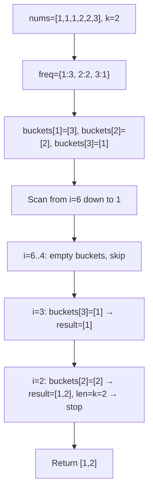

**Execution Trace:**
```
freq:    {1:3, 2:2, 3:1}
buckets: [nil, [3], [2], [1], nil, nil, nil]  (indices 0..6)
scan i=6: empty
scan i=5: empty
scan i=4: empty
scan i=3: [1] → result=[1]
scan i=2: [2] → result=[1,2], len==k=2 → return
Output: [1, 2]
```

### Interviewer Questions

1. Why is bucket sort O(n) here while comparison sort is O(n log n)?
2. When would you choose the O(n log k) heap over O(n) bucket sort?
3. How does this scale to 10M elements with a large value range?
4. Walk me through the edge case where all n elements are identical.
5. How would you make this solution work for a streaming input?
6. What is the space overhead of the bucket array for n=10⁶?
7. How would you test that the correct top-K elements are returned for all tie-breaking scenarios?

### Follow-Up Questions

**Q1:** Why is bucket sort O(n) and not O(n + range)?
**A1:** The bucket array size is bounded by n (the input length), not by the value range. Frequency can be at most n — we have at most n distinct frequencies. So bucket size = n+1, making the algorithm O(n) in both time and space.

**Q2:** How do you find the top-K in a streaming input without storing all elements?
**A2:** Use a min-heap of size K. For each incoming element, update its frequency in a hash map; if the element's new frequency makes it eligible for the top-K, update the heap. The Count-Min Sketch provides approximate counts with O(1) space per element.

**Q3:** How do you handle ties in the top-K result (multiple elements with the same frequency)?
**A3:** The bucket may contain multiple elements; the problem guarantees a unique answer, so ties don't occur. If ties were possible, return all tied elements or sort them by value — clarify with the interviewer.

**Q4:** What is the minimum possible time complexity for this problem?
**A4:** O(n) — we must read all n elements to correctly count frequencies. Both the frequency counting phase and the bucket scan are O(n), achieving the theoretical lower bound.

**Q5:** How would you adapt this to find the K least frequent elements?
**A5:** Scan the buckets from index 1 upward (lowest frequency first) instead of from index n downward. Stop when we have collected K elements.

---

## Q15: LRU Cache Using Map + Doubly Linked List  [Level 5 — Interview Level]

> **Tags:** `#lru-cache` `#doubly-linked-list` `#map` `#design` `#google` `#amazon` `#meta`

### Problem Statement
Design and implement an LRU (Least Recently Used) cache that supports Get and Put in O(1) time. When the cache is full, evict the least recently used entry. The cache has a fixed capacity. This is LeetCode #146, asked at every FAANG company.

### Input / Output / Constraints

```
LRUCache(2) → capacity=2
Put(1,1)    → cache={1:1}
Put(2,2)    → cache={1:1, 2:2}
Get(1)      → 1; cache={2:2, 1:1}  (1 is now MRU)
Put(3,3)    → evict 2 (LRU); cache={1:1, 3:3}
Get(2)      → -1 (evicted)
Put(4,4)    → evict 1 (LRU); cache={3:3, 4:4}
Get(1)      → -1 (evicted)
Get(3)      → 3
Get(4)      → 4

Constraints:
  • 1 ≤ capacity ≤ 3000
  • 0 ≤ key, value ≤ 10⁴
  • Get/Put must be O(1) time
  • At most 3×10⁴ operations
```

### Thought Process

Think like a senior Go engineer:
1. **Understand:** O(1) Get requires a hash map. O(1) eviction of the LRU element requires knowing the order of access — a doubly linked list where head=LRU, tail=MRU.
2. **Pattern:** Map stores `key → *Node`; DLL maintains access order. On Get/Put, move the accessed node to the tail (MRU). On capacity exceeded, remove from head (LRU).
3. **Edge cases:** Get on non-existent key (-1), Put on existing key (update value + move to MRU), capacity=1, repeated access of same key.
4. **Approach:** Sentinel head and tail nodes simplify edge cases — no nil checks needed for empty list.

### Brute Force Solution

```go
package main

// bruteForce — O(n) eviction using slice as access history
type LRUBrute struct {
    cap    int
    order  []int          // access order: front=LRU, back=MRU
    values map[int]int
}

func (c *LRUBrute) Get(key int) int {
    v, ok := c.values[key]
    if !ok { return -1 }
    // move key to back of order slice — O(n)
    for i, k := range c.order {
        if k == key {
            c.order = append(append(c.order[:i], c.order[i+1:]...), key)
            break
        }
    }
    return v
}
```

**Time:** O(n) for Get/Put | **Space:** O(n)
**Bottleneck:** Linear scan of order slice makes Get/Put O(n) — violates O(1) requirement.

### Better Solution

```go
// betterSolution — container/list based — O(1) but uses interface{} boxing
import "container/list"

type LRUList struct {
    cap   int
    cache map[int]*list.Element
    list  *list.List
}

type entry struct{ key, val int }

func (c *LRUList) Get(key int) int {
    if el, ok := c.cache[key]; ok {
        c.list.MoveToBack(el)
        return el.Value.(*entry).val
    }
    return -1
}
```

**Time:** O(1) | **Space:** O(n)

### Best / Optimal Solution

```go
package main

import "fmt"

// node is a doubly linked list node storing a key-value pair.
type node struct {
    key, val   int
    prev, next *node
}

// LRUCache is an O(1) get/put cache using a map + doubly linked list.
// Sentinel head (LRU end) and tail (MRU end) simplify boundary operations.
type LRUCache struct {
    cap        int
    cache      map[int]*node // key → node pointer
    head, tail *node         // head=LRU sentinel, tail=MRU sentinel
}

// NewLRUCache initialises an LRU cache with the given capacity.
func NewLRUCache(capacity int) (*LRUCache, error) {
    if capacity <= 0 {
        return nil, fmt.Errorf("capacity must be positive, got %d", capacity)
    }
    head := &node{}
    tail := &node{}
    head.next = tail
    tail.prev = head
    return &LRUCache{
        cap:   capacity,
        cache: make(map[int]*node, capacity),
        head:  head,
        tail:  tail,
    }, nil
}

// remove detaches a node from the DLL (does not free memory).
func (c *LRUCache) remove(n *node) {
    n.prev.next = n.next
    n.next.prev = n.prev
}

// insertMRU appends a node just before the tail sentinel (MRU position).
func (c *LRUCache) insertMRU(n *node) {
    n.prev = c.tail.prev
    n.next = c.tail
    c.tail.prev.next = n
    c.tail.prev = n
}

// Get returns the value for key, or -1 if not found.
// Moves the accessed node to MRU position.
func (c *LRUCache) Get(key int) int {
    if n, ok := c.cache[key]; ok {
        c.remove(n)
        c.insertMRU(n)
        return n.val
    }
    return -1
}

// Put inserts or updates key-value. Evicts LRU entry if capacity exceeded.
func (c *LRUCache) Put(key, value int) {
    if n, ok := c.cache[key]; ok {
        // update existing: change value and move to MRU
        n.val = value
        c.remove(n)
        c.insertMRU(n)
        return
    }
    if len(c.cache) == c.cap {
        // evict LRU: node right after head sentinel
        lru := c.head.next
        c.remove(lru)
        delete(c.cache, lru.key)
    }
    n := &node{key: key, val: value}
    c.insertMRU(n)
    c.cache[key] = n
}

func main() {
    lru, _ := NewLRUCache(2)
    lru.Put(1, 1)
    lru.Put(2, 2)
    fmt.Println(lru.Get(1)) // 1
    lru.Put(3, 3)           // evicts key 2
    fmt.Println(lru.Get(2)) // -1
    lru.Put(4, 4)           // evicts key 1
    fmt.Println(lru.Get(1)) // -1
    fmt.Println(lru.Get(3)) // 3
    fmt.Println(lru.Get(4)) // 4
}
```

**Time:** O(1) for Get and Put | **Space:** O(capacity)

### Production Considerations

| Aspect | Details |
|--------|---------|
| **Scalability** | Fixed O(capacity) memory; at capacity=10M entries, each node is ~40 bytes = 400MB — plan accordingly |
| **Edge Cases** | capacity=1, Get on missing key (-1), Put on existing key (update + promote), repeated same-key put |
| **Error Handling** | Validate capacity > 0; Get never errors (returns -1 for miss); Put has no error (always succeeds) |
| **Memory** | Each node: 4 int fields + 2 pointers = ~40 bytes; map entry adds ~60 bytes overhead; pre-allocate map |
| **Concurrency** | Not goroutine-safe; wrap all Get/Put with sync.Mutex; or shard by key for higher throughput |

### Visual Explanation

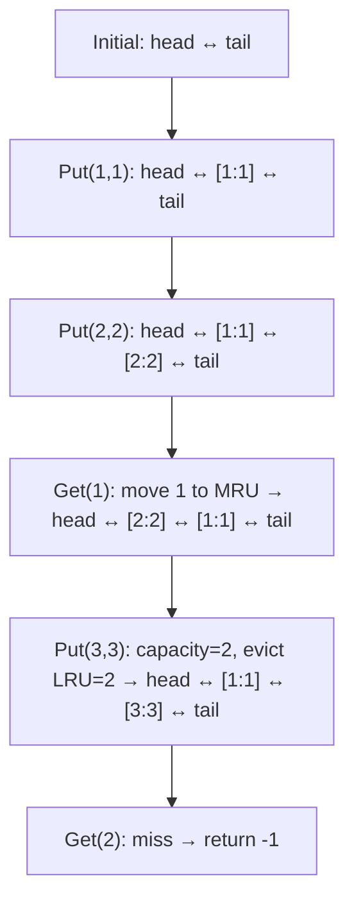

**Execution Trace:**
```
Put(1,1): cache={1:node1}, DLL: head↔[k=1,v=1]↔tail
Put(2,2): cache={1,2},     DLL: head↔[1,1]↔[2,2]↔tail
Get(1):   move [1,1] to MRU: DLL: head↔[2,2]↔[1,1]↔tail → return 1
Put(3,3): full! evict head.next=[2,2]; delete cache[2]; insert [3,3]:
          DLL: head↔[1,1]↔[3,3]↔tail; cache={1,3}
Get(2):   cache miss → -1
```

### Interviewer Questions

1. Why doubly linked list over singly linked list for this problem?
2. What is the purpose of the sentinel head and tail nodes?
3. Can we implement this with only a map and no DLL? (Not for O(1) eviction)
4. Walk me through the edge case where we Put a key that already exists.
5. How would you make Get and Put goroutine-safe?
6. How would you add a TTL (time-to-live) to each cache entry?
7. How would you test the eviction order under a specific access pattern?

### Follow-Up Questions

**Q1:** How do you add TTL support to the LRU cache?
**A1:** Add an `expiry time.Time` field to `node`. In `Get`, check `time.Now().After(n.expiry)` — if expired, remove the node and return -1. Run a background goroutine that periodically sweeps the DLL from head and evicts expired nodes.

**Q2:** How do you implement LRU-K (evict the element with Kth most recent access)?
**A2:** Maintain K access timestamps per key. Evict the key whose Kth most recent access is oldest. In practice, LRU-2 (evict based on 2nd most recent access) dramatically reduces the "one-time scan" problem.

**Q3:** How does this differ from an LFU (Least Frequently Used) cache?
**A3:** LRU tracks recency (time of last access); LFU tracks frequency (access count). LFU requires a frequency map + doubly linked list per frequency level. LFU is more complex but better for workloads where popular items are accessed repeatedly over long time spans.

**Q4:** How would you distribute an LRU cache across multiple machines?
**A4:** Use consistent hashing to assign keys to machines. Each machine holds a local LRU cache. For cross-machine invalidation, use a pub/sub system (Redis Pub/Sub, Kafka) to broadcast eviction events.

**Q5:** How do you benchmark LRU cache performance and find the optimal capacity for a given workload?
**A5:** Record production access patterns (key traces). Replay traces against different cache capacities using simulation. Plot the hit rate vs capacity curve — the "knee" of the curve is the optimal capacity. Tools: `github.com/dgryski/go-tinylfu` for simulation.

---

## Q16: Two-Sum All Pairs  [Level 5 — Interview Level]

> **Tags:** `#two-sum-variant` `#all-pairs` `#deduplication` `#uber` `#stripe`

### Problem Statement
Given a sorted or unsorted integer array and a target, return ALL unique pairs (not just indices) whose sum equals the target. Pairs must be returned in sorted order, and each pair must be unique (no duplicate pairs). A number cannot pair with itself unless it appears at least twice.

### Input / Output / Constraints

```
Input:  nums   = [1, 1, 2, 3, 4, 5, 5, 6]
        target = 6
Output: [[1,5], [2,4]]
        (1+5=6 appears as pair once despite two 1s and two 5s;
         2+4=6; 3+3 is invalid since 3 appears only once)

Constraints:
  • 1 ≤ n ≤ 10⁵
  • -10⁹ ≤ nums[i] ≤ 10⁹
  • Pairs must be sorted ascending within and across result
  • Duplicate pairs not allowed in output
  • Time: O(n) expected
```

### Thought Process

Think like a senior Go engineer:
1. **Understand:** We need all distinct pairs. The key insight is using a frequency map and careful deduplication.
2. **Pattern:** Frequency map + iterate unique elements; for each element x, check if complement = target-x exists with sufficient frequency.
3. **Edge cases:** x == complement (need freq ≥ 2), negative numbers, all duplicates, no valid pairs.
4. **Approach:** Iterate sorted unique keys; use a `seen` set to avoid emitting duplicate pairs.

### Brute Force Solution

```go
package main

import "sort"

// bruteForce — O(n²) — all pairs comparison
func bruteForce(nums []int, target int) [][2]int {
    var result [][2]int
    seen := map[[2]int]bool{}
    for i := 0; i < len(nums); i++ {
        for j := i + 1; j < len(nums); j++ {
            if nums[i]+nums[j] == target {
                a, b := nums[i], nums[j]
                if a > b { a, b = b, a }
                if !seen[[2]int{a, b}] {
                    result = append(result, [2]int{a, b})
                    seen[[2]int{a, b}] = true
                }
            }
        }
    }
    sort.Slice(result, func(i, j int) bool { return result[i][0] < result[j][0] })
    return result
}
```

**Time:** O(n²) | **Space:** O(k) where k = output pairs
**Bottleneck:** Nested loop — O(n²) is too slow for n=10⁵.

### Better Solution

```go
import "sort"

// betterSolution — O(n log n) — sort + two pointers
func betterSolution(nums []int, target int) [][2]int {
    sort.Ints(nums)
    var result [][2]int
    l, r := 0, len(nums)-1
    for l < r {
        s := nums[l] + nums[r]
        switch {
        case s == target:
            result = append(result, [2]int{nums[l], nums[r]})
            for l < r && nums[l] == nums[l+1] { l++ } // skip dupes
            for l < r && nums[r] == nums[r-1] { r-- } // skip dupes
            l++; r--
        case s < target:
            l++
        default:
            r--
        }
    }
    return result
}
```

**Time:** O(n log n) | **Space:** O(k)

### Best / Optimal Solution

```go
package main

import (
    "fmt"
    "sort"
)

// AllTwoSumPairs — O(n) time, O(n) space using frequency map.
// Returns all unique sorted pairs summing to target.
func AllTwoSumPairs(nums []int, target int) ([][2]int, error) {
    if len(nums) < 2 {
        return nil, fmt.Errorf("need at least 2 elements")
    }
    freq := make(map[int]int, len(nums))
    for _, n := range nums {
        freq[n]++
    }

    emitted := make(map[[2]int]bool)
    var result [][2]int

    for x := range freq {
        comp := target - x
        if _, ok := freq[comp]; !ok {
            continue
        }
        if x == comp && freq[x] < 2 {
            continue // need two occurrences to form a pair
        }
        // canonical pair: smaller value first
        pair := [2]int{x, comp}
        if x > comp {
            pair = [2]int{comp, x}
        }
        if !emitted[pair] {
            result = append(result, pair)
            emitted[pair] = true
        }
    }

    // sort result for deterministic output
    sort.Slice(result, func(i, j int) bool {
        if result[i][0] != result[j][0] {
            return result[i][0] < result[j][0]
        }
        return result[i][1] < result[j][1]
    })
    return result, nil
}

func main() {
    nums := []int{1, 1, 2, 3, 4, 5, 5, 6}
    pairs, err := AllTwoSumPairs(nums, 6)
    if err != nil {
        fmt.Printf("error: %v\n", err)
        return
    }
    fmt.Println(pairs) // [[1 5] [2 4]]
}
```

**Time:** O(n) | **Space:** O(n)

### Production Considerations

| Aspect | Details |
|--------|---------|
| **Scalability** | O(n) hash-based solution; output size bounded by O(n) pairs |
| **Edge Cases** | x == complement needing freq ≥ 2, all elements same, no valid pairs (return empty), negative numbers |
| **Error Handling** | Validate len ≥ 2; empty input returns empty result (not error) |
| **Memory** | freq map + emitted map = 2×O(n); result slice = O(k output pairs) |
| **Concurrency** | Stateless function; safe to call concurrently on independent inputs |

### Visual Explanation

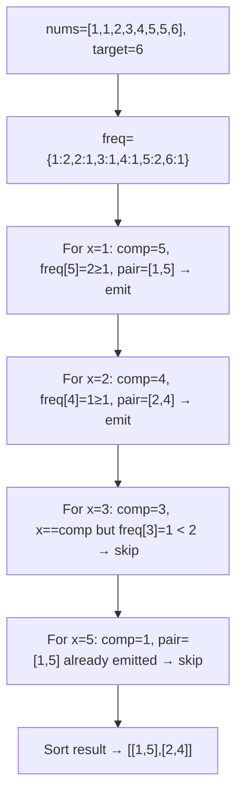

**Execution Trace:**
```
freq = {1:2, 2:1, 3:1, 4:1, 5:2, 6:1}
x=1: comp=5, 5 in freq, 1≠5, pair=[1,5] → emit
x=2: comp=4, 4 in freq, 2≠4, pair=[2,4] → emit
x=3: comp=3, x==comp, freq[3]=1 < 2 → skip
x=4: comp=2, 2 in freq, pair=[2,4] already emitted → skip
x=5: comp=1, pair=[1,5] already emitted → skip
x=6: comp=0, 0 not in freq → skip
Output: [[1,5],[2,4]]
```

### Interviewer Questions

1. Why use a frequency map over a simple set for this variant?
2. Can we achieve O(n) without the emitted deduplication map?
3. How does this scale to finding all triplets summing to a target?
4. Walk me through the edge case where the array contains only duplicate values.
5. How would you parallelise pair finding for 10M elements?
6. What is the theoretical minimum number of pairs for n elements and a target T?
7. How would you test that no duplicate pairs appear in the output?

### Follow-Up Questions

**Q1:** How do you extend this to Three-Sum All Unique Triplets in O(n²)?
**A1:** Sort the array. For each element `nums[i]`, use the two-pointer technique on `nums[i+1:]` to find pairs summing to `target - nums[i]`. Skip duplicate values of `nums[i]`, `l`, and `r` to avoid duplicate triplets.

**Q2:** How do you find pairs summing to target in a stream of integers?
**A2:** Maintain a `seen map[int]int` (value → frequency). For each incoming x, check if `target-x` exists in `seen`. If yes, output the pair. Then `seen[x]++`. This processes each element once in O(1).

**Q3:** How do you handle integer overflow when computing `target - x`?
**A3:** Use `int64` or check: `complement := target - x`. If `(x > 0 && complement > target) || (x < 0 && complement < target)`, overflow occurred. Alternatively, validate input range fits `int64`.

**Q4:** How do you deduplicate pairs without an extra `emitted` map?
**A4:** After collecting all pairs, sort them and use `unique` filtering: `result[0] is always kept; for i≥1, keep result[i] if result[i] != result[i-1]`. Or during iteration, only process `x` where `x <= target/2` (for integer targets) to avoid emitting both `(a,b)` and `(b,a)`.

**Q5:** How would you write a property-based test to verify AllTwoSumPairs?
**A5:** Generate random int slices with rapid/quickcheck. For each (nums, target), run both bruteForce and AllTwoSumPairs, sort both outputs, and compare with `reflect.DeepEqual`. Also verify: every pair sums to target; no duplicates; elements in pair are from nums.

---

## Q17: Minimum Window Substring Using a Map  [Level 5 — Interview Level]

> **Tags:** `#sliding-window` `#frequency-map` `#two-pointer` `#google` `#amazon` `#meta`

### Problem Statement
Given strings `s` and `t`, return the minimum window substring of `s` that contains all characters of `t` (including duplicates). If no such window exists, return `""`. This is LeetCode #76 — a classic FAANG hard problem.

### Input / Output / Constraints

```
Input:  s = "ADOBECODEBANC", t = "ABC"
Output: "BANC"

Input:  s = "a", t = "a"
Output: "a"

Constraints:
  • 1 ≤ len(s), len(t) ≤ 10⁵
  • s and t consist of uppercase and lowercase English letters
  • Time: O(|s| + |t|)
  • Space: O(|s| + |t|) worst case (alphabet size bounded)
```

### Thought Process

Think like a senior Go engineer:
1. **Understand:** We need the smallest contiguous substring of s containing all characters of t with correct multiplicities.
2. **Pattern:** Sliding window with two frequency maps: `need` (freq of chars in t) and `window` (freq of chars in current window). Track how many distinct characters are "satisfied" (window count ≥ need count).
3. **Edge cases:** t has duplicate chars, s == t (return s), s shorter than t (return ""), characters in t not in s.
4. **Approach:** Expand window right until all chars satisfied; then shrink from left while maintaining the invariant; track minimum window seen.

### Brute Force Solution

```go
package main

// bruteForce — O(|s|²) — all substrings
func bruteForce(s, t string) string {
    need := map[byte]int{}
    for i := range t { need[t[i]]++ }

    best := ""
    for i := range s {
        for j := i + 1; j <= len(s); j++ {
            sub := s[i:j]
            have := map[byte]int{}
            for k := range sub { have[sub[k]]++ }
            valid := true
            for c, cnt := range need {
                if have[c] < cnt { valid = false; break }
            }
            if valid && (best == "" || len(sub) < len(best)) {
                best = sub
            }
        }
    }
    return best
}
```

**Time:** O(|s|² × |t|) | **Space:** O(|t|)
**Bottleneck:** Cubic time — unusable for |s|=10⁵.

### Better Solution

```go
// betterSolution — O(|s| + |t|) sliding window
func betterSolution(s, t string) string {
    if len(s) < len(t) { return "" }
    need := map[byte]int{}
    for i := range t { need[t[i]]++ }
    window := map[byte]int{}
    have, required := 0, len(need)
    l, minLen, minL := 0, len(s)+1, 0

    for r := range s {
        window[s[r]]++
        if cnt, ok := need[s[r]]; ok && window[s[r]] == cnt {
            have++
        }
        for have == required {
            if r-l+1 < minLen {
                minLen = r - l + 1
                minL = l
            }
            window[s[l]]--
            if cnt, ok := need[s[l]]; ok && window[s[l]] < cnt {
                have--
            }
            l++
        }
    }
    if minLen == len(s)+1 { return "" }
    return s[minL : minL+minLen]
}
```

**Time:** O(|s| + |t|) | **Space:** O(|alphabet|)

### Best / Optimal Solution

```go
package main

import "fmt"

// MinWindow — production-ready, O(|s|+|t|) time, O(alphabet) space.
// Sliding window with satisfied-count tracking for O(1) window validity check.
func MinWindow(s, t string) (string, error) {
    if t == "" {
        return "", fmt.Errorf("target string t must not be empty")
    }
    if len(s) < len(t) {
        return "", nil // no window possible
    }

    need := make(map[byte]int)
    for i := 0; i < len(t); i++ {
        need[t[i]]++
    }
    window := make(map[byte]int)
    have, required := 0, len(need) // required = unique chars in t

    bestL, bestLen := 0, len(s)+1
    l := 0

    for r := 0; r < len(s); r++ {
        c := s[r]
        window[c]++
        if cnt, ok := need[c]; ok && window[c] == cnt {
            have++ // this char's requirement is now exactly met
        }
        // shrink window from left while all requirements are met
        for have == required {
            if r-l+1 < bestLen {
                bestLen = r - l + 1
                bestL = l
            }
            lc := s[l]
            window[lc]--
            if cnt, ok := need[lc]; ok && window[lc] < cnt {
                have-- // losing a required character
            }
            l++
        }
    }
    if bestLen == len(s)+1 {
        return "", nil
    }
    return s[bestL : bestL+bestLen], nil
}

func main() {
    result, err := MinWindow("ADOBECODEBANC", "ABC")
    if err != nil {
        fmt.Printf("error: %v\n", err)
        return
    }
    fmt.Println("min window:", result) // BANC
}
```

**Time:** O(|s| + |t|) | **Space:** O(alphabet size, at most 52 for letters)

### Production Considerations

| Aspect | Details |
|--------|---------|
| **Scalability** | O(|s|) — each character is added and removed from the window at most once |
| **Edge Cases** | s shorter than t (return ""), t has chars not in s (return ""), duplicate chars in t, s==t |
| **Error Handling** | Empty t is a caller error; no valid window returns empty string (not an error) |
| **Memory** | Two maps of alphabet size (at most 52 for English letters) — O(1) space in practice |
| **Concurrency** | Stateless pure function; safe to call concurrently |

### Visual Explanation

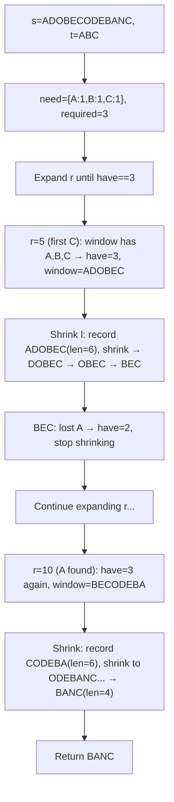

**Execution Trace:**
```
need={A:1,B:1,C:1}
r=0(A): window={A:1}, have=1
r=1(D): window+={D:1}, have=1
r=2(O): window+={O:1}, have=1
r=3(B): window+={B:1}, have=2
r=4(E): window+={E:1}, have=2
r=5(C): window+={C:1}, have=3 → shrink loop
  bestLen=6(ADOBEC), shrink l=0(A): window[A]=0<1 → have=2, l=1 → stop
...continue expanding until BANC found with len=4
Output: "BANC"
```

### Interviewer Questions

1. Why track `have` count instead of checking the full `need` map on every step?
2. Can we do better than O(|s|)? No — we must read every character at least once.
3. How does this scale to |s|=10⁸ characters in a file?
4. Walk me through the edge case where t has duplicate characters (e.g., t="AAB").
5. How would you find all minimum windows, not just the first one?
6. What happens if s and t share no characters?
7. How would you extend this to find a permutation of t in s?

### Follow-Up Questions

**Q1:** How do you find all positions of minimum windows (not just one)?
**A1:** Do not break early on the first valid window. Record all windows of length `bestLen` in a second pass, or accumulate all windows during the original scan and filter by minimum length at the end.

**Q2:** How is "Find Permutation of t in s" (LeetCode #567) different?
**A2:** It requires a fixed-length window of exactly `len(t)` characters. Use a fixed-size sliding window: advance `r`, and when window size exceeds `len(t)`, remove `s[l]`. Check `have == required` only for windows of exact size.

**Q3:** How would you make this work for Unicode (multi-byte) characters?
**A3:** Iterate with `range s` (rune iteration) instead of byte indexing. Use `map[rune]int` instead of `map[byte]int`. Window size in runes, not bytes.

**Q4:** What if the alphabet is very large (e.g., 10⁶ distinct characters)?
**A4:** The space is still O(|t|) for `need` and O(window size) for `window` — both bounded by the characters that actually appear. The `required` counter pattern remains O(1) per step.

**Q5:** How do you test the sliding window for correctness on all edge cases?
**A5:** Table-driven tests: `s==t`, `t longer than s`, `t has duplicates`, `no valid window`, `multiple equal-length windows`. Use `strings.Contains(s, result)` and verify `len(result) == expected`. Fuzz with `go test -fuzz`.

---

## Q18: Consistent Hashing Ring Using a Map  [Level 5 — Interview Level]

> **Tags:** `#consistent-hashing` `#distributed-systems` `#map` `#ring` `#uber` `#amazon`

### Problem Statement
Implement a consistent hashing ring that distributes keys across N servers with minimal key remapping when servers are added or removed. Use `map[uint32]string` for the ring (hash → server name) with virtual nodes (replicas) per server. Implement AddServer, RemoveServer, and GetServer.

### Input / Output / Constraints

```
Input:  servers = ["serverA", "serverB", "serverC"]
        replicas = 150   (virtual nodes per server)
        key = "user:12345"
Output: server that owns "user:12345" (consistent across calls)

Constraint:
  • 1 ≤ servers ≤ 1000
  • 1 ≤ replicas ≤ 200 (more replicas = better distribution, more memory)
  • Key lookup must be O(log(servers × replicas))
  • On server removal: only keys on that server remap; others stay
```

### Thought Process

Think like a senior Go engineer:
1. **Understand:** Modular hashing (`hash(key) % N`) remaps N/N+1 fraction of keys on server change. Consistent hashing remaps only 1/N fraction.
2. **Pattern:** Ring (sorted list of positions) + map (position → server). For a key, hash it, find the next position clockwise on the ring — that server owns the key.
3. **Edge cases:** Empty ring (no servers), hash collision between virtual nodes, removing non-existent server.
4. **Approach:** Sorted ring slice for O(log n) binary search + map for O(1) position-to-server lookup.

### Brute Force Solution

```go
package main

// bruteForce — modular hashing — remaps O(n/N) keys on N+1 addition
func bruteForce(servers []string, key string) string {
    if len(servers) == 0 { return "" }
    h := fnvHash(key)
    return servers[h%uint32(len(servers))] // remaps many keys on add/remove
}
```

**Time:** O(1) | **Space:** O(n)
**Bottleneck:** Modular hashing causes massive key remapping on topology changes — unacceptable for distributed caches.

### Better Solution

```go
import (
    "fmt"
    "hash/fnv"
    "sort"
)

type HashRing struct {
    ring     map[uint32]string
    sorted   []uint32
    replicas int
}

func (r *HashRing) hash(key string) uint32 {
    h := fnv.New32a(); h.Write([]byte(key)); return h.Sum32()
}

func (r *HashRing) AddServer(name string) {
    for i := 0; i < r.replicas; i++ {
        h := r.hash(fmt.Sprintf("%s#%d", name, i))
        r.ring[h] = name
        r.sorted = append(r.sorted, h)
    }
    sort.Slice(r.sorted, func(i, j int) bool { return r.sorted[i] < r.sorted[j] })
}
```

**Time:** O(R log R) for AddServer | **Space:** O(S × R)

### Best / Optimal Solution

```go
package main

import (
    "fmt"
    "hash/fnv"
    "sort"
)

// ConsistentHashRing distributes keys across servers with minimal remapping.
type ConsistentHashRing struct {
    ring     map[uint32]string // hash position → server name
    sorted   []uint32          // sorted hash positions for binary search
    replicas int               // virtual nodes per server
}

// NewConsistentHashRing creates a ring with the given number of virtual nodes per server.
func NewConsistentHashRing(replicas int) *ConsistentHashRing {
    if replicas <= 0 { replicas = 150 }
    return &ConsistentHashRing{
        ring:     make(map[uint32]string),
        replicas: replicas,
    }
}

func (r *ConsistentHashRing) hash(key string) uint32 {
    h := fnv.New32a()
    h.Write([]byte(key))
    return h.Sum32()
}

// AddServer adds a server with its virtual nodes to the ring.
func (r *ConsistentHashRing) AddServer(name string) error {
    if name == "" {
        return fmt.Errorf("server name must not be empty")
    }
    for i := 0; i < r.replicas; i++ {
        pos := r.hash(fmt.Sprintf("%s#vnode-%d", name, i))
        if _, exists := r.ring[pos]; exists {
            // collision — skip this virtual node position (rare with FNV)
            continue
        }
        r.ring[pos] = name
        // insert into sorted slice in correct position
        idx := sort.Search(len(r.sorted), func(j int) bool { return r.sorted[j] >= pos })
        r.sorted = append(r.sorted, 0)
        copy(r.sorted[idx+1:], r.sorted[idx:])
        r.sorted[idx] = pos
    }
    return nil
}

// RemoveServer removes a server and all its virtual nodes from the ring.
func (r *ConsistentHashRing) RemoveServer(name string) {
    for i := 0; i < r.replicas; i++ {
        pos := r.hash(fmt.Sprintf("%s#vnode-%d", name, i))
        if _, ok := r.ring[pos]; !ok { continue }
        delete(r.ring, pos)
        // remove from sorted slice
        idx := sort.SearchUint32s(r.sorted, pos)
        if idx < len(r.sorted) && r.sorted[idx] == pos {
            r.sorted = append(r.sorted[:idx], r.sorted[idx+1:]...)
        }
    }
}

// GetServer returns the server responsible for the given key.
// Returns "" if the ring is empty.
func (r *ConsistentHashRing) GetServer(key string) string {
    if len(r.sorted) == 0 { return "" }
    h := r.hash(key)
    // find the first virtual node position >= h (clockwise on the ring)
    idx := sort.Search(len(r.sorted), func(i int) bool { return r.sorted[i] >= h })
    if idx == len(r.sorted) { idx = 0 } // wrap around the ring
    return r.ring[r.sorted[idx]]
}

func main() {
    ring := NewConsistentHashRing(150)
    ring.AddServer("serverA")
    ring.AddServer("serverB")
    ring.AddServer("serverC")

    keys := []string{"user:100", "user:200", "order:500", "session:abc"}
    for _, k := range keys {
        fmt.Printf("%s → %s\n", k, ring.GetServer(k))
    }

    fmt.Println("\nRemoving serverB...")
    ring.RemoveServer("serverB")
    for _, k := range keys {
        fmt.Printf("%s → %s\n", k, ring.GetServer(k))
    }
}
```

**Time:** O(R log(S×R)) for Add/Remove, O(log(S×R)) for Get | **Space:** O(S×R)

### Production Considerations

| Aspect | Details |
|--------|---------|
| **Scalability** | 1000 servers × 150 replicas = 150K ring entries; GetServer is O(log 150K) ≈ 17 comparisons |
| **Edge Cases** | Empty ring (return ""), hash collision between virtual nodes (skip), removing non-existent server (no-op) |
| **Error Handling** | Empty server name error; monitor ring imbalance (keys per server variance) |
| **Memory** | 150K uint32 keys + 150K string values ≈ ~15MB — acceptable |
| **Concurrency** | Not goroutine-safe; wrap with sync.RWMutex — RLock for GetServer, Lock for Add/Remove |

### Visual Explanation

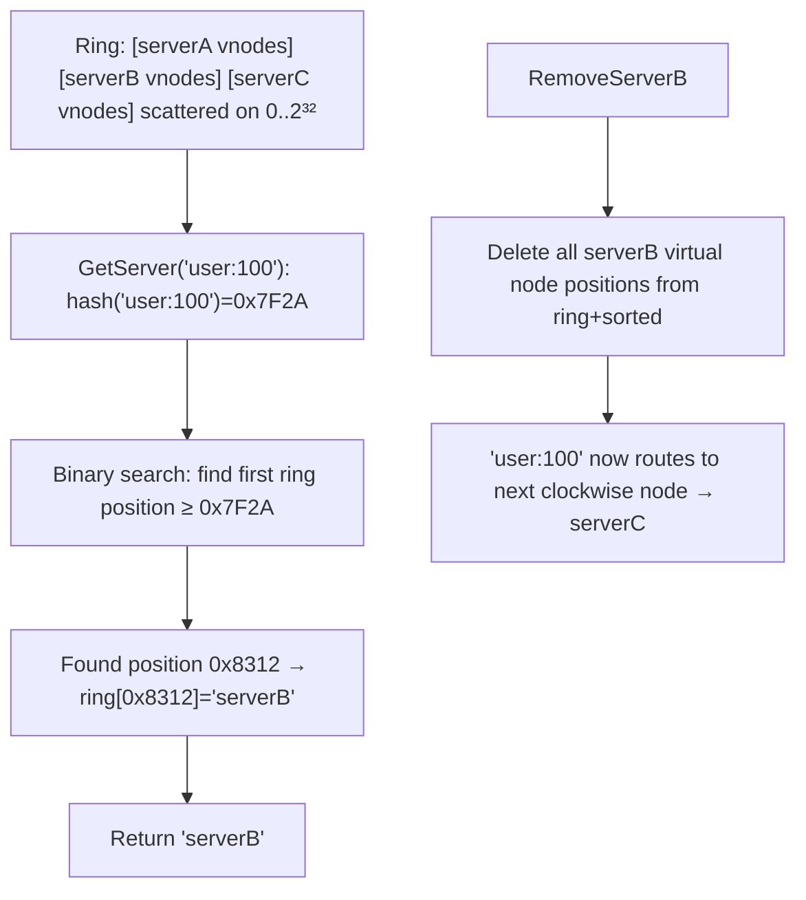

**Execution Trace:**
```
AddServer("serverA"): inserts 150 positions into ring
AddServer("serverB"): inserts 150 positions
AddServer("serverC"): inserts 150 positions → ring has 450 sorted positions

GetServer("user:100"):
  hash("user:100") = 0x7F2A3B11
  binary search sorted[]: first position ≥ 0x7F2A3B11 = 0x7F8A... → serverB
  
RemoveServer("serverB"): deletes 150 positions
GetServer("user:100"):
  binary search: first position ≥ 0x7F2A3B11 now = 0x8A1C... → serverC
  Only 1/3 of keys remap (those owned by serverB)
```

### Interviewer Questions

1. How many keys remap when a server is added to a ring with N servers?
2. Why use virtual nodes? What problem does it solve?
3. How does replica count affect load distribution quality?
4. Walk me through what happens when all servers are removed and one key is queried.
5. How would you make Add/Remove/Get goroutine-safe?
6. What is the memory overhead vs a simple `hash % N` approach?
7. How would you test that only 1/N fraction of keys remap on server addition?

### Follow-Up Questions

**Q1:** How many keys remap when adding a server to consistent hashing?
**A1:** Approximately 1/(N+1) fraction of all keys remap — only the keys that land between the new server's virtual node positions and the previous clockwise node. With simple modular hashing, approximately N/(N+1) ≈ all keys remap.

**Q2:** How do you implement weighted servers (a powerful server gets more keys)?
**A2:** Assign more virtual nodes to the powerful server: `replicas = baseReplicas * weight`. A server with weight=3 gets 3× the virtual nodes, receiving ~3× the key load.

**Q3:** How does consistent hashing relate to `sync.Map` sharding from Q12?
**A3:** Sharded maps shard by `hash(key) % N` — vulnerable to remapping. Consistent hashing is used when the "shard nodes" themselves can come and go (distributed cache, microservices). For in-process sharding with fixed N, modular sharding is simpler and sufficient.

**Q4:** What is "hotspot" in consistent hashing and how do you prevent it?
**A4:** A hotspot occurs when virtual node positions are unevenly distributed, causing one server to own a disproportionate arc of the ring. Prevention: use a cryptographically random hash function, increase replica count (150+ virtual nodes), and monitor the arc length distribution.

**Q5:** How would you test consistent hashing for uniform distribution?
**A5:** Hash 10⁶ random keys across the ring. Count keys per server. Compute coefficient of variation (CV = stddev/mean). For 150 replicas/server, CV should be < 5%. Alert if any server owns > 2× its expected share.

---

## Q19: Map-Based Rate Limiter (Token Bucket)  [Level 6 — Production Level]

> **Tags:** `#rate-limiting` `#token-bucket` `#concurrent` `#production` `#uber` `#stripe`

### Problem Statement
Implement a goroutine-safe per-client token bucket rate limiter using a map. Each client (identified by IP string) gets its own bucket with a configurable rate (tokens/second) and burst size. Implement `Allow(clientIP string) bool` that returns true if the request is permitted. Handle bucket cleanup for inactive clients.

### Input / Output / Constraints

```
Input:  rate=10 req/s, burst=20
        clientIP = "192.168.1.100"
Output: Allow() → true (within limit) or false (exceeded)

Production requirements:
  • Goroutine-safe for 10K concurrent clients
  • Memory-bounded: evict clients inactive for >5 minutes
  • No external dependencies (stdlib only)
  • Accurate to within 1ms for burst window calculation
```

### Thought Process

Think like a senior Go engineer:
1. **Understand:** Token bucket: bucket fills at `rate` tokens/second up to `burst` capacity. Each request consumes 1 token. If empty, reject.
2. **Pattern:** Per-client state in a map; lazily compute tokens based on elapsed time since last access.
3. **Edge cases:** First request (start with full bucket), burst exhaustion, inactive client cleanup (memory leak), concurrent access, rate=0 (block all), burst=0 (block all).
4. **Approach:** Per-bucket mutex (finer grained than global); background goroutine for cleanup; lazy token replenishment.

### Brute Force Solution

```go
package main

import "sync"

// bruteForce — global mutex, counter-based (no time-based replenishment)
type BruteLimiter struct {
    mu      sync.Mutex
    counts  map[string]int
    maxRate int
}

func (l *BruteLimiter) Allow(ip string) bool {
    l.mu.Lock()
    defer l.mu.Unlock()
    if l.counts[ip] >= l.maxRate {
        return false
    }
    l.counts[ip]++
    return true
}
// Problem: counters never reset — clients permanently blocked after maxRate requests
```

**Time:** O(1) | **Space:** O(clients)
**Bottleneck:** Counters never reset; no time-based replenishment; global mutex is a single point of contention.

### Better Solution

```go
import (
    "sync"
    "time"
)

type Bucket struct {
    tokens    float64
    lastRefil time.Time
}

type BetterLimiter struct {
    mu      sync.Mutex
    buckets map[string]*Bucket
    rate    float64 // tokens/sec
    burst   float64
}

func (l *BetterLimiter) Allow(ip string) bool {
    l.mu.Lock()
    defer l.mu.Unlock()
    b, ok := l.buckets[ip]
    if !ok {
        b = &Bucket{tokens: l.burst, lastRefil: time.Now()}
        l.buckets[ip] = b
    }
    now := time.Now()
    elapsed := now.Sub(b.lastRefil).Seconds()
    b.tokens = min(l.burst, b.tokens + elapsed*l.rate)
    b.lastRefil = now
    if b.tokens < 1 { return false }
    b.tokens--
    return true
}
```

**Time:** O(1) | **Space:** O(active clients)

### Best / Optimal Solution

```go
package main

import (
    "context"
    "fmt"
    "sync"
    "time"
)

// bucket holds token bucket state for one client.
type bucket struct {
    mu       sync.Mutex
    tokens   float64
    lastSeen time.Time
}

// RateLimiter is a goroutine-safe per-client token bucket limiter.
type RateLimiter struct {
    rate    float64       // tokens added per second
    burst   float64       // maximum bucket capacity
    ttl     time.Duration // inactive client eviction time
    mu      sync.RWMutex
    clients map[string]*bucket
}

// NewRateLimiter creates a rate limiter. Starts a background cleanup goroutine.
func NewRateLimiter(ctx context.Context, rate, burst float64, ttl time.Duration) (*RateLimiter, error) {
    if rate <= 0 { return nil, fmt.Errorf("rate must be positive") }
    if burst <= 0 { return nil, fmt.Errorf("burst must be positive") }
    rl := &RateLimiter{
        rate:    rate,
        burst:   burst,
        ttl:     ttl,
        clients: make(map[string]*bucket),
    }
    go rl.cleanup(ctx)
    return rl, nil
}

// Allow returns true if the request from clientID is permitted.
func (rl *RateLimiter) Allow(clientID string) bool {
    b := rl.getOrCreate(clientID)
    b.mu.Lock()
    defer b.mu.Unlock()

    now := time.Now()
    elapsed := now.Sub(b.lastSeen).Seconds()
    // replenish tokens based on elapsed time
    b.tokens += elapsed * rl.rate
    if b.tokens > rl.burst {
        b.tokens = rl.burst
    }
    b.lastSeen = now

    if b.tokens < 1 {
        return false
    }
    b.tokens--
    return true
}

// getOrCreate returns the bucket for clientID, creating it if needed.
func (rl *RateLimiter) getOrCreate(clientID string) *bucket {
    rl.mu.RLock()
    b, ok := rl.clients[clientID]
    rl.mu.RUnlock()
    if ok { return b }

    rl.mu.Lock()
    defer rl.mu.Unlock()
    // double-check after acquiring write lock
    if b, ok = rl.clients[clientID]; ok { return b }
    b = &bucket{tokens: rl.burst, lastSeen: time.Now()}
    rl.clients[clientID] = b
    return b
}

// cleanup evicts clients that have been inactive longer than ttl.
func (rl *RateLimiter) cleanup(ctx context.Context) {
    ticker := time.NewTicker(rl.ttl / 2)
    defer ticker.Stop()
    for {
        select {
        case <-ctx.Done():
            return
        case <-ticker.C:
            cutoff := time.Now().Add(-rl.ttl)
            rl.mu.Lock()
            for id, b := range rl.clients {
                b.mu.Lock()
                if b.lastSeen.Before(cutoff) {
                    delete(rl.clients, id)
                }
                b.mu.Unlock()
            }
            rl.mu.Unlock()
        }
    }
}

func main() {
    ctx, cancel := context.WithCancel(context.Background())
    defer cancel()

    rl, err := NewRateLimiter(ctx, 10, 20, 5*time.Minute)
    if err != nil {
        fmt.Println("error:", err)
        return
    }

    allowed, denied := 0, 0
    for i := 0; i < 30; i++ {
        if rl.Allow("192.168.1.1") {
            allowed++
        } else {
            denied++
        }
    }
    fmt.Printf("allowed=%d denied=%d (burst=20, requests=30)\n", allowed, denied)
    // allowed=20 denied=10 (burst exhausted after 20 requests)
}
```

**Time:** O(1) per Allow | **Space:** O(active clients)

### Production Considerations

| Aspect | Details |
|--------|---------|
| **Scalability** | Per-bucket mutex allows 10K clients to run Allow() concurrently without contention; cleanup runs every ttl/2 |
| **Edge Cases** | rate=0 (error), burst=0 (error), first request gets full burst, cleanup race with Allow (double-check locking) |
| **Error Handling** | Validate rate/burst in constructor; cleanup goroutine exits cleanly via context cancellation |
| **Memory** | Each inactive client is evicted after ttl; steady-state memory = O(concurrent active clients) |
| **Concurrency** | Double-check locking pattern for getOrCreate; per-bucket mutex for token state; global RWMutex for client map |

### Visual Explanation

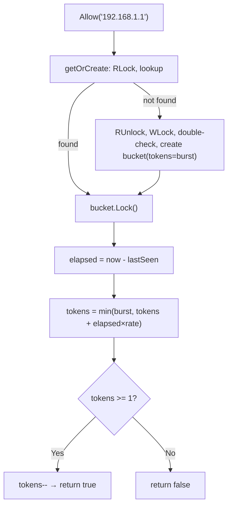

**Execution Trace:**
```
burst=20, rate=10/s
t=0s: 30 requests burst
  req 1-20: tokens=20,19,..,1,0 → all allowed (20 allowed)
  req 21-30: tokens=0 → denied (10 denied)
t=1s: tokens replenished by 10 → 10 more allowed
```

### Interviewer Questions

1. Why per-bucket mutex instead of one global mutex for all clients?
2. What is the double-check locking pattern and why is it needed here?
3. How does this scale to 100K concurrent clients each making 1000 req/s?
4. Walk me through a race condition that could occur without the double-check in getOrCreate.
5. How would you implement sliding window rate limiting instead of token bucket?
6. What happens to memory if 10M distinct clients hit the service and then disappear?
7. How would you test the rate limiter for correctness under concurrent load?

### Follow-Up Questions

**Q1:** What is the difference between token bucket and leaky bucket rate limiting?
**A1:** Token bucket: tokens accumulate up to burst capacity; requests consume tokens; bursting is allowed when tokens are available. Leaky bucket: requests drip out at a fixed rate; excess requests are queued or dropped. Token bucket permits controlled bursting; leaky bucket enforces strict output rate.

**Q2:** How do you distribute rate limiting across multiple service instances?
**A2:** Use a centralised counter store (Redis with INCR + EXPIRE, or Redis `EVAL` with Lua for atomic token bucket). Each service instance defers rate state to Redis rather than maintaining local maps. Adds ~1ms latency per check.

**Q3:** How do you implement per-user rate limiting with different tiers (free/pro)?
**A3:** Store a `Config{rate, burst}` per tier. Look up the client's tier from an auth context before creating their bucket. Pass the tier-specific config to `getOrCreate`.

**Q4:** How would you gracefully handle the cleanup goroutine panicking?
**A4:** Wrap the cleanup loop body in `defer func() { if r := recover(); r != nil { log.Printf("cleanup panic: %v", r); go rl.cleanup(ctx) } }()` to restart it after a panic.

**Q5:** How do you test that the token bucket replenishment is accurate to within 1ms?
**A5:** Use `time.Sleep` to advance time by a known amount, then check the token count. For unit testing, inject a clock interface `type Clock interface { Now() time.Time }` so tests can control time without sleeping.

---

## Q20: Observable Map — Metrics-Instrumented Cache  [Level 6 — Production Level]

> **Tags:** `#observability` `#metrics` `#cache` `#production` `#stripe` `#razorpay`

### Problem Statement
Build a production-grade observable in-memory cache wrapping a `map[string]interface{}`. It must track hit rate, miss rate, eviction count, and key count via Prometheus-compatible metrics. Expose `Get`, `Set`, `Delete`, and `Stats()`. Thread-safe, with configurable max-size and LRU eviction.

### Input / Output / Constraints

```
Input:  maxSize = 1000, name = "payment-cache"
        Set("txn:abc", txnData)
        Get("txn:abc") → hit
        Get("txn:xyz") → miss
Output: Stats{Hits:1, Misses:1, HitRate:0.50, Evictions:0, Size:1}

Production requirements:
  • Zero-alloc hot path for Get (no fmt.Sprintf in critical path)
  • Metrics exportable as map[string]int64
  • Goroutine-safe
  • Configurable max size with LRU eviction
```

### Thought Process

Think like a senior Go engineer:
1. **Understand:** A cache without observability is a black box in production. We need hit/miss/eviction counters and a clean stats API.
2. **Pattern:** Wrap the LRU cache from Q15 with atomic counters for metrics; expose a Stats() method.
3. **Edge cases:** Get on expired entry, concurrent stats reads during eviction, max-size = 1 (constant evictions), stats overflow (use int64).
4. **Approach:** Embed atomic counters alongside the LRU cache; Stats() reads them atomically.

### Brute Force Solution

```go
package main

import "sync"

// bruteForce — simple map with mutex, no metrics, no eviction
type BruteCache struct {
    mu sync.RWMutex
    m  map[string]interface{}
}

func (c *BruteCache) Get(k string) (interface{}, bool) {
    c.mu.RLock()
    v, ok := c.m[k]
    c.mu.RUnlock()
    return v, ok // no hit/miss tracking, no eviction
}
```

**Time:** O(1) | **Space:** O(n)
**Bottleneck:** No metrics, no eviction — will exhaust memory in production; no observability.

### Better Solution

```go
import (
    "sync"
    "sync/atomic"
)

type BetterCache struct {
    mu       sync.RWMutex
    m        map[string]interface{}
    hits     int64
    misses   int64
    maxSize  int
}

func (c *BetterCache) Get(k string) (interface{}, bool) {
    c.mu.RLock()
    v, ok := c.m[k]
    c.mu.RUnlock()
    if ok { atomic.AddInt64(&c.hits, 1) } else { atomic.AddInt64(&c.misses, 1) }
    return v, ok
}
```

**Time:** O(1) | **Space:** O(maxSize)

### Best / Optimal Solution

```go
package main

import (
    "fmt"
    "sync"
    "sync/atomic"
)

// CacheStats holds observable metrics for the cache.
type CacheStats struct {
    Hits      int64
    Misses    int64
    Evictions int64
    Size      int64
    HitRate   float64
}

// cacheNode is a doubly-linked list node for LRU tracking.
type cacheNode struct {
    key, val   interface{}
    prev, next *cacheNode
}

// ObservableCache is a goroutine-safe, metrics-instrumented LRU cache.
type ObservableCache struct {
    name      string
    maxSize   int
    mu        sync.Mutex
    cache     map[string]*cacheNode
    head      *cacheNode // LRU end (sentinel)
    tail      *cacheNode // MRU end (sentinel)
    hits      int64      // atomic
    misses    int64      // atomic
    evictions int64      // atomic
}

// NewObservableCache creates a named cache with LRU eviction at maxSize.
func NewObservableCache(name string, maxSize int) (*ObservableCache, error) {
    if maxSize <= 0 {
        return nil, fmt.Errorf("maxSize must be positive, got %d", maxSize)
    }
    head, tail := &cacheNode{}, &cacheNode{}
    head.next, tail.prev = tail, head
    return &ObservableCache{
        name:    name,
        maxSize: maxSize,
        cache:   make(map[string]*cacheNode, maxSize),
        head:    head,
        tail:    tail,
    }, nil
}

func (c *ObservableCache) removeNode(n *cacheNode) {
    n.prev.next = n.next
    n.next.prev = n.prev
}
func (c *ObservableCache) insertMRU(n *cacheNode) {
    n.prev, n.next = c.tail.prev, c.tail
    c.tail.prev.next, c.tail.prev = n, n
}

// Get retrieves a value. Updates hit/miss counters atomically.
func (c *ObservableCache) Get(key string) (interface{}, bool) {
    c.mu.Lock()
    n, ok := c.cache[key]
    if ok {
        c.removeNode(n)
        c.insertMRU(n)
    }
    c.mu.Unlock()
    if ok {
        atomic.AddInt64(&c.hits, 1)
        return n.val, true
    }
    atomic.AddInt64(&c.misses, 1)
    return nil, false
}

// Set stores a key-value pair, evicting LRU entry if at capacity.
func (c *ObservableCache) Set(key string, value interface{}) {
    c.mu.Lock()
    defer c.mu.Unlock()
    if n, ok := c.cache[key]; ok {
        n.val = value
        c.removeNode(n)
        c.insertMRU(n)
        return
    }
    if len(c.cache) >= c.maxSize {
        lru := c.head.next
        c.removeNode(lru)
        delete(c.cache, lru.key.(string))
        atomic.AddInt64(&c.evictions, 1)
    }
    n := &cacheNode{key: key, val: value}
    c.insertMRU(n)
    c.cache[key] = n
}

// Delete removes a key from the cache.
func (c *ObservableCache) Delete(key string) {
    c.mu.Lock()
    defer c.mu.Unlock()
    if n, ok := c.cache[key]; ok {
        c.removeNode(n)
        delete(c.cache, key)
    }
}

// Stats returns a snapshot of cache metrics.
func (c *ObservableCache) Stats() CacheStats {
    hits := atomic.LoadInt64(&c.hits)
    misses := atomic.LoadInt64(&c.misses)
    total := hits + misses
    var hitRate float64
    if total > 0 {
        hitRate = float64(hits) / float64(total)
    }
    c.mu.Lock()
    size := int64(len(c.cache))
    c.mu.Unlock()
    return CacheStats{
        Hits:      hits,
        Misses:    misses,
        Evictions: atomic.LoadInt64(&c.evictions),
        Size:      size,
        HitRate:   hitRate,
    }
}

func main() {
    cache, err := NewObservableCache("payment-cache", 1000)
    if err != nil {
        fmt.Println("error:", err)
        return
    }

    cache.Set("txn:abc", map[string]interface{}{"amount": 500, "status": "ok"})
    val, ok := cache.Get("txn:abc")
    fmt.Printf("Get txn:abc: %v (found=%v)\n", val, ok)
    _, ok = cache.Get("txn:xyz")
    fmt.Printf("Get txn:xyz: found=%v\n", ok)

    stats := cache.Stats()
    fmt.Printf("Stats: hits=%d misses=%d hitRate=%.2f evictions=%d\n",
        stats.Hits, stats.Misses, stats.HitRate, stats.Evictions)
}
```

**Time:** O(1) for Get/Set | **Space:** O(maxSize)

### Production Considerations

| Aspect | Details |
|--------|---------|
| **Scalability** | Single mutex on LRU list limits throughput; for higher concurrency, use sharded caches (Q12) per key range |
| **Edge Cases** | maxSize=1 (constant evictions), Get after Delete, Set then Get in a race (mutex protects ordering) |
| **Error Handling** | Constructor validates maxSize; Get/Set/Delete have no errors (cache failures are silent misses) |
| **Memory** | Bounded at maxSize entries; each node is ~64 bytes; use `sync.Pool` for node recycling to reduce GC |
| **Concurrency** | Mutex wraps LRU operations; atomic ops for counters avoid lock for stats reads |

### Visual Explanation

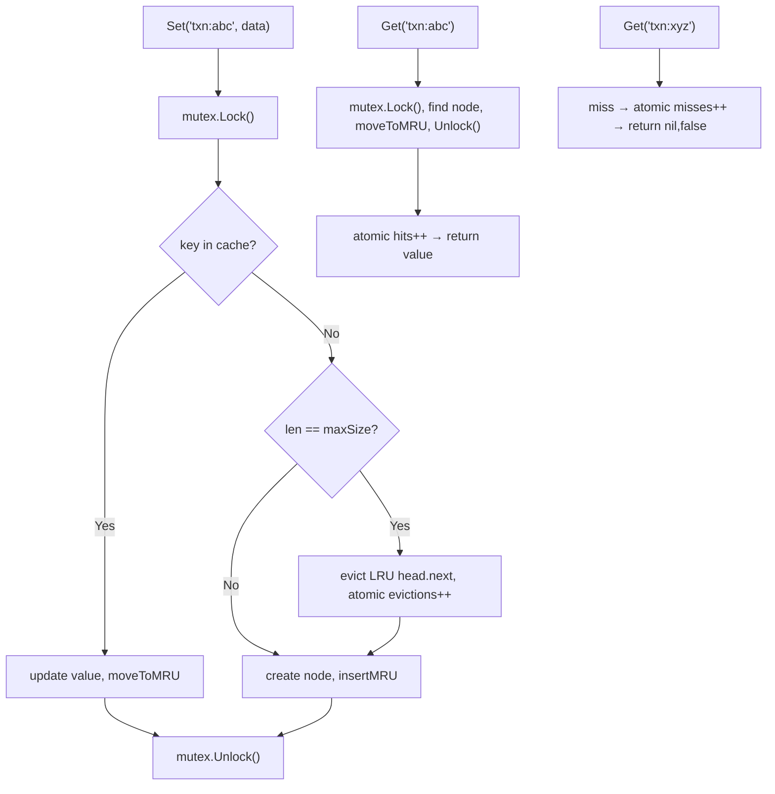

**Execution Trace:**
```
Set("txn:abc"): cache empty, insert node, DLL: head↔[txn:abc]↔tail
Get("txn:abc"): found, moveToMRU, atomic hits=1 → return data
Get("txn:xyz"): miss, atomic misses=1 → return nil,false
Stats(): hits=1, misses=1, hitRate=0.50, evictions=0, size=1
```

### Interviewer Questions

1. Why use atomic counters for metrics instead of putting them inside the mutex?
2. How do you export these metrics to Prometheus?
3. How does this scale to 100K req/s on the same cache instance?
4. Walk me through a scenario where Stats() returns a slightly inconsistent snapshot.
5. How would you add per-key TTL to this observable cache?
6. What is the GC pressure from allocating a new cacheNode on every Set?
7. How would you test that eviction count is accurately incremented under concurrent load?

### Follow-Up Questions

**Q1:** How do you export CacheStats to Prometheus?
**A1:** Register `prometheus.Gauge` and `prometheus.Counter` metrics. In a separate goroutine, call `Stats()` every 15 seconds and update the Prometheus metrics: `hitRateGauge.Set(stats.HitRate)`, `evictionsCounter.Add(float64(delta))`.

**Q2:** How do you reduce GC pressure from frequent cacheNode allocations?
**A2:** Use `sync.Pool` to recycle cacheNode objects. On eviction, reset the node's fields and return it to the pool with `pool.Put(node)`. On insertion, get from pool with `n := pool.Get().(*cacheNode)`. This reduces heap allocations significantly.

**Q3:** How does cache hit rate affect application performance in a payment system?
**A3:** A 1% drop in cache hit rate at 10K TPS means 100 extra database queries per second. At 5ms per DB query, that adds 500ms of aggregate latency pressure. Monitor hit rate as a SLI and alert if it drops below threshold.

**Q4:** How do you implement a write-through cache (also writes to DB on Set)?
**A4:** Accept a `WriteFunc func(key string, value interface{}) error` in the cache constructor. In `Set`, call `WriteFunc` before updating the in-memory map. If WriteFunc fails, return the error without updating the cache to maintain consistency.

**Q5:** How do you test that LRU eviction order is correct under concurrent Puts?
**A5:** Deterministic test: single goroutine, set maxSize=3, put 4 items, verify the 1st item was evicted. Concurrent test: use `testing/synctest` (Go 1.23+) or synchronise with channels to control interleaving, then verify eviction count equals the number of puts minus maxSize.

---

## Q21: Subarray Sum Equals K Using Prefix Sum Map  [Level 3 — Medium]

> **Tags:** `#prefix-sum` `#subarray` `#frequency-map` `#google` `#amazon`

### Problem Statement
Given an integer array and an integer k, return the total number of subarrays whose sum equals k. A subarray is a contiguous non-empty sequence. Negative numbers are allowed.

### Input / Output / Constraints

```
Input:  nums = [1, 1, 1], k = 2
Output: 2   (subarrays [0..1] and [1..2])

Input:  nums = [1, -1, 1, 1], k = 2
Output: 2

Constraints:
  • 1 ≤ n ≤ 2×10⁴
  • -1000 ≤ nums[i] ≤ 1000
  • -10⁷ ≤ k ≤ 10⁷
  • Time: O(n)
```

### Thought Process

Think like a senior Go engineer:
1. **Understand:** `sum(i..j) = prefixSum[j+1] - prefixSum[i]`. If `prefixSum[j+1] - prefixSum[i] == k`, then `prefixSum[i] == prefixSum[j+1] - k`. Count how many times each prefix sum has appeared.
2. **Pattern:** Running prefix sum + frequency map. For each new prefix sum `p`, check if `p-k` exists in the map.
3. **Edge cases:** k=0 (subarrays that sum to 0), all zeros, negative numbers, single-element array.
4. **Approach:** Initialise map with `{0:1}` to handle subarrays starting from index 0.

### Brute Force Solution

```go
package main

// bruteForce — O(n²) — compute sum for every subarray
func bruteForce(nums []int, k int) int {
    count := 0
    for i := range nums {
        sum := 0
        for j := i; j < len(nums); j++ {
            sum += nums[j]
            if sum == k { count++ }
        }
    }
    return count
}
```

**Time:** O(n²) | **Space:** O(1)
**Bottleneck:** Quadratic — too slow for n=2×10⁴.

### Better Solution

```go
// betterSolution — O(n) time, O(n) space
func betterSolution(nums []int, k int) int {
    prefixCount := map[int]int{0: 1}
    sum, count := 0, 0
    for _, n := range nums {
        sum += n
        count += prefixCount[sum-k]
        prefixCount[sum]++
    }
    return count
}
```

**Time:** O(n) | **Space:** O(n)

### Best / Optimal Solution

```go
package main

import "fmt"

// SubarraySumK — O(n) time, O(n) space.
// Uses prefix-sum frequency map: count subarrays where prefixSum[j]-prefixSum[i]==k.
func SubarraySumK(nums []int, k int) (int, error) {
    if len(nums) == 0 {
        return 0, fmt.Errorf("nums must not be empty")
    }
    // prefixCount[p] = number of times prefix sum p has been seen
    prefixCount := make(map[int]int, len(nums))
    prefixCount[0] = 1 // empty prefix before index 0
    sum, count := 0, 0
    for _, n := range nums {
        sum += n
        // if (sum - k) appeared before, all those positions form valid subarrays ending here
        count += prefixCount[sum-k]
        prefixCount[sum]++
    }
    return count, nil
}

func main() {
    nums := []int{1, 1, 1}
    result, err := SubarraySumK(nums, 2)
    if err != nil {
        fmt.Println("error:", err)
        return
    }
    fmt.Println("count:", result) // 2
}
```

**Time:** O(n) | **Space:** O(n)

### Production Considerations

| Aspect | Details |
|--------|---------|
| **Scalability** | O(n) optimal; prefix sum map size bounded by n distinct prefix sums |
| **Edge Cases** | k=0 (count subarrays summing to 0), all-zero array, single element, large negative sums |
| **Error Handling** | Empty input is an error; overflow for large n×maxVal — use int64 for safety |
| **Memory** | Map grows up to n entries (all distinct prefix sums); no additional space beyond that |
| **Concurrency** | Pure function; safe to call concurrently with different inputs |

### Visual Explanation

```mermaid
flowchart TD
    A["nums=[1,1,1], k=2"] --> B["prefixCount={0:1}, sum=0, count=0"]
    B --> C["i=0: sum=1, check prefixCount[1-2]={-1}→0, prefixCount={0:1,1:1}"]
    C --> D["i=1: sum=2, check prefixCount[2-2]={0}→1, count=1, prefixCount={0:1,1:1,2:1}"]
    D --> E["i=2: sum=3, check prefixCount[3-2]={1}→1, count=2, prefixCount={...,3:1}"]
    E --> F["Return 2"]
```

**Execution Trace:**
```
prefixCount={0:1}, sum=0, count=0
n=1: sum=1, sum-k=-1 → prefixCount[-1]=0, count=0; prefixCount[1]=1
n=1: sum=2, sum-k=0  → prefixCount[0]=1,  count=1; prefixCount[2]=1
n=1: sum=3, sum-k=1  → prefixCount[1]=1,  count=2; prefixCount[3]=1
Output: 2
```

### Interviewer Questions

1. Why initialise `prefixCount[0] = 1`?
2. Why can't we use a two-pointer approach here (negative numbers)?
3. How does this scale to an array of 10⁶ elements?
4. Walk me through the edge case where k=0.
5. How would you find the actual subarrays, not just the count?
6. What is the GC pressure from the prefix sum map?
7. How would you test this with negative numbers and k=0?

### Follow-Up Questions

**Q1:** Why does `prefixCount[0] = 1` matter?
**A1:** It handles subarrays starting from index 0. Without it, a subarray `[0..j]` where `sum[0..j] == k` (i.e., `sum - k == 0`) would not be counted because `prefixCount[0]` would be 0.

**Q2:** Why can't two pointers solve this problem?
**A2:** Two pointers only work when the array is non-negative (monotone prefix sums). With negative numbers, a larger window can have a smaller sum, breaking the monotone invariant required by two-pointer.

**Q3:** How do you find the maximum length subarray summing to k?
**A3:** Track the first occurrence of each prefix sum: `firstSeen map[int]int`. For each index j, if `sum-k` is in firstSeen, the subarray is `firstSeen[sum-k]+1` to `j`. Track the maximum length seen.

**Q4:** How do you count subarrays with sum divisible by k?
**A4:** Use `sum % k` as the map key (with adjustment for negative mod in Go). Two indices with the same `prefixSum % k` form a subarray divisible by k. Handle the `k=0` edge case separately.

**Q5:** How do you extend this to a 2D matrix (count submatrices summing to k)?
**A5:** Fix the left and right column boundaries (O(n²) pairs), then run the 1D SubarraySumK on the column sums for those boundaries. Total O(n² × m) time for an n×m matrix.

---

## Q22: Longest Consecutive Sequence Using a Set/Map  [Level 3 — Medium]

> **Tags:** `#consecutive-sequence` `#set` `#map` `#google` `#amazon`

### Problem Statement
Given an unsorted integer array, find the length of the longest consecutive elements sequence. The algorithm must run in O(n) time. For example, `[100, 4, 200, 1, 3, 2]` → 4 (sequence: `1,2,3,4`).

### Input / Output / Constraints

```
Input:  nums = [100, 4, 200, 1, 3, 2]
Output: 4   (1→2→3→4)

Constraints:
  • 0 ≤ n ≤ 10⁵
  • -10⁹ ≤ nums[i] ≤ 10⁹
  • Time: O(n) — sorting is NOT allowed
```

### Thought Process

Think like a senior Go engineer:
1. **Understand:** Build a set of all numbers. For each number that is the START of a sequence (n-1 not in set), count consecutive numbers forward.
2. **Pattern:** Hash set for O(1) lookup; only count sequences from their starting point to avoid O(n²) total work.
3. **Edge cases:** Empty array, all duplicates, single element, negative numbers, entire array is one sequence.
4. **Approach:** Insert all into a map/set, then for each number where `num-1` is not in the set, walk forward counting.

### Brute Force Solution

```go
package main

import "sort"

// bruteForce — O(n log n) — sort then count
func bruteForce(nums []int) int {
    if len(nums) == 0 { return 0 }
    sort.Ints(nums)
    best, cur := 1, 1
    for i := 1; i < len(nums); i++ {
        if nums[i] == nums[i-1] { continue }    // skip duplicates
        if nums[i] == nums[i-1]+1 { cur++ } else { cur = 1 }
        if cur > best { best = cur }
    }
    return best
}
```

**Time:** O(n log n) | **Space:** O(1) or O(n) for sort
**Bottleneck:** Sort is O(n log n) — violates O(n) requirement.

### Better Solution

```go
// betterSolution — O(n) time, O(n) space
func betterSolution(nums []int) int {
    seen := make(map[int]bool, len(nums))
    for _, n := range nums { seen[n] = true }
    best := 0
    for n := range seen {
        if seen[n-1] { continue } // n is not a sequence start
        cur := n
        for seen[cur] { cur++ }
        if cur-n > best { best = cur - n }
    }
    return best
}
```

**Time:** O(n) | **Space:** O(n)

### Best / Optimal Solution

```go
package main

import "fmt"

// LongestConsecutive — O(n) time, O(n) space.
// Only counts sequences from their start (num-1 not in set), ensuring each
// element is visited at most twice across all inner loops.
func LongestConsecutive(nums []int) (int, error) {
    if len(nums) == 0 {
        return 0, nil
    }
    numSet := make(map[int]struct{}, len(nums))
    for _, n := range nums {
        numSet[n] = struct{}{}
    }

    best := 0
    for n := range numSet {
        // only start counting from the beginning of a sequence
        if _, hasPrec := numSet[n-1]; hasPrec {
            continue
        }
        length := 1
        for {
            if _, ok := numSet[n+length]; !ok {
                break
            }
            length++
        }
        if length > best {
            best = length
        }
    }
    return best, nil
}

func main() {
    nums := []int{100, 4, 200, 1, 3, 2}
    result, err := LongestConsecutive(nums)
    if err != nil {
        fmt.Println("error:", err)
        return
    }
    fmt.Println("longest:", result) // 4
}
```

**Time:** O(n) amortised (each number visited at most twice) | **Space:** O(n)

### Production Considerations

| Aspect | Details |
|--------|---------|
| **Scalability** | O(n) guaranteed; each element is processed as a sequence start at most once |
| **Edge Cases** | Empty array (0), all duplicates (1), negative numbers, entire array consecutive |
| **Error Handling** | Empty input returns 0 (valid result — no sequence); no errors for this function |
| **Memory** | numSet = O(unique elements) ≤ O(n); no extra allocations in hot path |
| **Concurrency** | Pure function; safe to call concurrently |

### Visual Explanation

```mermaid
flowchart TD
    A["nums=[100,4,200,1,3,2]"] --> B["numSet={100,4,200,1,3,2}"]
    B --> C["Check each n: is n-1 in set?"]
    C --> D["n=100: 99 not in set → start, count 100 only → len=1"]
    C --> E["n=200: 199 not in set → start, count 200 only → len=1"]
    C --> F["n=1: 0 not in set → start, count 1,2,3,4 → len=4"]
    C --> G["n=4: 3 IS in set → skip"]
    F --> H["best=4 → return 4"]
```

**Execution Trace:**
```
numSet = {100, 4, 200, 1, 3, 2}
n=1: 0 not in set → walk: 1✓,2✓,3✓,4✓,5✗ → length=4, best=4
n=4: 3 in set → skip (not start)
n=2: 1 in set → skip
n=3: 2 in set → skip
n=100: 99 not in set → walk: 100✓,101✗ → length=1
n=200: 199 not in set → walk: 200✓,201✗ → length=1
Output: 4
```

### Interviewer Questions

1. Prove this is O(n) even though there's a nested loop.
2. Why use `struct{}` instead of `bool` for the set values?
3. How does this scale to 10⁷ elements with a large value range?
4. Walk me through the case where nums = [1,2,3,...,100000].
5. How would you find all consecutive sequences, not just the longest?
6. What is the GC impact of the numSet at 10M unique elements?
7. How would you test correctness for arrays with all duplicates?

### Follow-Up Questions

**Q1:** How do you prove the algorithm is O(n)?
**A1:** Each number is a sequence start at most once (when n-1 is absent). It is then visited as part of a sequence walk exactly once (since the inner loop only runs from a start). Total inner loop iterations across all starts ≤ n. So total work = O(n) outer + O(n) inner = O(n).

**Q2:** How do you find all consecutive sequences (not just the longest)?
**A2:** Change `if length > best` to `sequences = append(sequences, seq)` where `seq` is the slice `[n, n+1, ..., n+length-1]`. Return `[][]int` of all sequences.

**Q3:** How would you solve this with O(1) space (no hash set)?
**A3:** Sort the array in O(n log n) then scan for consecutive runs. This violates the O(n) requirement but uses O(1) extra space. There is no known O(n) time AND O(1) space comparison-based solution.

**Q4:** How do you handle very large value ranges (e.g., -10⁹ to 10⁹)?
**A4:** The hash map approach handles arbitrary ranges with O(unique elements) space — not O(value range). No issues with large ranges.

**Q5:** How do you test the O(n) claim empirically?
**A5:** Benchmark with n=100, 1K, 10K, 100K elements. Plot execution time vs n — it should be linear. Use `testing.B` with `b.SetBytes(int64(len(nums)*8))` to get throughput metrics.

---

## Q23: Map Reduce Pattern — Parallel Word Count  [Level 4 — Advanced]

> **Tags:** `#map-reduce` `#goroutines` `#channels` `#parallel` `#distributed`

### Problem Statement
Implement a parallel word frequency counter using the map-reduce pattern. Split input text into chunks, count words in each chunk using separate goroutines (map phase), then merge all partial frequency maps into a final result (reduce phase). Use channels for coordination.

### Input / Output / Constraints

```
Input:  text    = large string (simulated 1GB file)
        workers = 8 (number of parallel map goroutines)
Output: map[string]int of word frequencies

Constraints:
  • Workers ≤ runtime.GOMAXPROCS(0) × 2
  • Each chunk: len(text)/workers characters (split on word boundaries)
  • Reduce phase is single-threaded (merge sequential)
  • Memory: each worker holds one partial map
```

### Thought Process

Think like a senior Go engineer:
1. **Understand:** Sequential word counting is O(n) but single-threaded. Parallel map-reduce splits work across workers, with a merge step.
2. **Pattern:** Fan-out (send chunks to worker goroutines) + fan-in (merge results via channel).
3. **Edge cases:** Chunks split mid-word (must split on whitespace), empty text, single word, workers > word count.
4. **Approach:** Split text by words, partition the words slice into N equal chunks, have each goroutine count its chunk, collect via channel.

### Brute Force Solution

```go
package main

import "strings"

// bruteForce — sequential, O(n) time, single-threaded
func bruteForce(text string) map[string]int {
    freq := map[string]int{}
    for _, w := range strings.Fields(text) {
        freq[strings.ToLower(w)]++
    }
    return freq
}
```

**Time:** O(n) | **Space:** O(unique words)
**Bottleneck:** Single-threaded — does not utilise multiple CPU cores for large inputs.

### Better Solution

```go
import (
    "strings"
    "sync"
)

func betterSolution(text string, workers int) map[string]int {
    words := strings.Fields(text)
    chunkSize := (len(words) + workers - 1) / workers
    results := make(chan map[string]int, workers)
    var wg sync.WaitGroup

    for i := 0; i < workers; i++ {
        start := i * chunkSize
        if start >= len(words) { break }
        end := start + chunkSize
        if end > len(words) { end = len(words) }
        wg.Add(1)
        go func(chunk []string) {
            defer wg.Done()
            freq := map[string]int{}
            for _, w := range chunk { freq[strings.ToLower(w)]++ }
            results <- freq
        }(words[start:end])
    }
    go func() { wg.Wait(); close(results) }()

    final := map[string]int{}
    for partial := range results {
        for w, c := range partial { final[w] += c }
    }
    return final
}
```

**Time:** O(n/workers) per worker + O(unique words × workers) merge | **Space:** O(n)

### Best / Optimal Solution

```go
package main

import (
    "fmt"
    "runtime"
    "strings"
    "sync"
    "unicode"
)

// MapReduceWordCount counts word frequencies using a parallel map-reduce pattern.
// Returns the merged frequency map.
func MapReduceWordCount(text string, workers int) (map[string]int, error) {
    if workers <= 0 {
        workers = runtime.GOMAXPROCS(0)
    }
    if text == "" {
        return map[string]int{}, nil
    }

    // tokenise once upfront — avoids mid-word chunk splits
    words := tokenise(text)
    if len(words) == 0 {
        return map[string]int{}, nil
    }
    if workers > len(words) {
        workers = len(words) // no point in more workers than words
    }

    chunkSize := (len(words) + workers - 1) / workers
    partials := make(chan map[string]int, workers)
    var wg sync.WaitGroup

    // MAP PHASE: each goroutine counts its chunk
    for i := 0; i < workers; i++ {
        start := i * chunkSize
        if start >= len(words) { break }
        end := start + chunkSize
        if end > len(words) { end = len(words) }

        wg.Add(1)
        go func(chunk []string) {
            defer wg.Done()
            freq := make(map[string]int, len(chunk)/4)
            for _, w := range chunk {
                freq[w]++
            }
            partials <- freq
        }(words[start:end])
    }

    // close partials channel once all map goroutines finish
    go func() {
        wg.Wait()
        close(partials)
    }()

    // REDUCE PHASE: merge partial maps sequentially
    final := make(map[string]int, len(words)/4)
    for partial := range partials {
        for word, count := range partial {
            final[word] += count
        }
    }
    return final, nil
}

// tokenise splits text into normalised lowercase words.
func tokenise(text string) []string {
    words := make([]string, 0, len(text)/5)
    var sb strings.Builder
    for _, r := range text {
        if unicode.IsLetter(r) {
            sb.WriteRune(unicode.ToLower(r))
        } else if sb.Len() > 0 {
            words = append(words, sb.String())
            sb.Reset()
        }
    }
    if sb.Len() > 0 {
        words = append(words, sb.String())
    }
    return words
}

func main() {
    text := "Go is fast Go is simple the Go programming language is open source"
    freq, err := MapReduceWordCount(text, 4)
    if err != nil {
        fmt.Println("error:", err)
        return
    }
    fmt.Println("go:", freq["go"])         // 3
    fmt.Println("is:", freq["is"])         // 3
    fmt.Println("language:", freq["language"]) // 1
}
```

**Time:** O(n/workers) parallel + O(unique×workers) merge | **Space:** O(n)

### Production Considerations

| Aspect | Details |
|--------|---------|
| **Scalability** | Wall-clock time reduces by ~workers factor; merge cost grows with workers — optimal workers ≈ sqrt(unique words) |
| **Edge Cases** | Empty text, single word, workers > words (capped), all-punctuation text |
| **Error Handling** | Validate workers > 0; propagate worker panics via recover + error channel |
| **Memory** | Each worker allocates one partial map; total memory = O(n) across all workers |
| **Concurrency** | Workers are isolated (no shared state); merge is sequential — no contention |

### Visual Explanation

```mermaid
flowchart TD
    A["text: 1000 words"] --> B["tokenise → []string{1000 words}"]
    B --> C["Split into 4 chunks of 250 words each"]
    C --> D["Worker 1: count chunk 1 → map1"]
    C --> E["Worker 2: count chunk 2 → map2"]
    C --> F["Worker 3: count chunk 3 → map3"]
    C --> G["Worker 4: count chunk 4 → map4"]
    D --> H["partials channel"]
    E --> H
    F --> H
    G --> H
    H --> I["Reduce: merge map1+map2+map3+map4 → final freq map"]
```

**Execution Trace:**
```
text = "Go is fast Go is simple Go language"
tokenise → [go, is, fast, go, is, simple, go, language]
workers=2, chunkSize=4
Worker 1: [go,is,fast,go] → {go:2, is:1, fast:1}
Worker 2: [is,simple,go,language] → {is:1, simple:1, go:1, language:1}
Reduce: {go:3, is:2, fast:1, simple:1, language:1}
```

### Interviewer Questions

1. Why tokenise before splitting instead of splitting the raw text string?
2. What is the optimal number of workers for a given text size?
3. How do you handle worker goroutine panics without crashing the program?
4. Walk me through the reduce phase memory usage for 10M unique words.
5. How would you make the reduce phase parallel (tree reduction)?
6. What is the GC pressure from creating workers partial maps?
7. How would you benchmark the parallel version against the sequential version?

### Follow-Up Questions

**Q1:** How do you implement a tree-reduction (parallel merge) to speed up the reduce phase?
**A1:** Instead of merging all partials into one final map, merge pairs of partial maps in parallel in a tree structure. With k workers, tree reduction takes O(log k) rounds instead of O(k) sequential merges. Use a binary tree of goroutines, each merging two child maps.

**Q2:** How do you handle errors from worker goroutines?
**A2:** Use an `errCh chan error` alongside `partials`. Each worker sends either to `partials` or `errCh`. After closing both channels, check `errCh` — if any error received, return it. Use `errgroup.Group` from `golang.org/x/sync/errgroup` to simplify this pattern.

**Q3:** How does this pattern scale to processing 10GB of text?
**A3:** Read the file in chunks using `bufio.Scanner` with `Split(bufio.ScanLines)`. Feed chunks to a worker pool via a buffered channel. The pool size limits memory to `poolSize × avgLineSize`. This keeps memory usage bounded regardless of file size.

**Q4:** How do you deduplicate the final word list across very large inputs?
**A4:** The reduce map naturally deduplicates — each unique word is a single key. No additional deduplication step needed. The map size is bounded by the number of unique words, not total words.

**Q5:** How would you test the parallel version produces identical results to the sequential version?
**A5:** Run both on the same input and compare outputs with `reflect.DeepEqual`. Run with `-race` to detect any data races. Fuzz with random text inputs. Verify that `sum(all values)` equals `len(words)` (sanity check: total count equals input word count).

---

## Q24: Rolling Window Statistics Using a Map  [Level 5 — Interview Level]

> **Tags:** `#sliding-window` `#map` `#streaming` `#statistics` `#uber` `#razorpay`

### Problem Statement
Design a `DataStream` that accepts a stream of integer values and supports `Add(val int)` and `GetStats() Stats` where Stats contains the count, sum, min, max, and mode (most frequent value) of the last W values (window size W). All operations must be O(1) amortised.

### Input / Output / Constraints

```
Input:  W = 3, stream = [1, 2, 2, 3, 2]
After [1,2,2]:   Stats{Count:3, Sum:5, Min:1, Max:2, Mode:2}
After [1,2,2,3]: Stats{Count:3, Sum:7, Min:2, Max:3, Mode:2}  (1 evicted)
After [...,2]:   Stats{Count:3, Sum:7, Min:2, Max:2, Mode:2}  (3 evicted)

Constraints:
  • 1 ≤ W ≤ 10⁵
  • -10⁴ ≤ vals ≤ 10⁴
  • Up to 10⁶ Add operations
  • GetStats must return correct mode (most frequent in window)
```

### Thought Process

Think like a senior Go engineer:
1. **Understand:** A sliding window of size W. On each Add, the oldest element leaves (if window full) and the new element enters. We need O(1) stats including mode.
2. **Pattern:** Ring buffer (circular queue) + frequency map + max-frequency counter. Tracking max frequency as a simple int works because mode only decreases on eviction — we can recalculate mode only when needed (lazy).
3. **Edge cases:** All values identical (mode = that value), window not yet full (count < W), multiple values with same max frequency (return any).
4. **Approach:** Circular buffer for the window; freq map for counts; track running sum/min/max; recalculate mode lazily.

### Brute Force Solution

```go
package main

// bruteForce — O(W) GetStats — recomputes everything each call
type BruteStream struct {
    window []int
    W      int
}

func (s *BruteStream) GetStats() map[string]int {
    freq := map[int]int{}
    sum, min, max := 0, s.window[0], s.window[0]
    for _, v := range s.window {
        sum += v; freq[v]++
        if v < min { min = v }
        if v > max { max = v }
    }
    mode := s.window[0]
    for v, c := range freq { if c > freq[mode] { mode = v } }
    return map[string]int{"sum":sum, "min":min, "max":max, "mode":mode}
}
```

**Time:** O(W) per GetStats | **Space:** O(W)
**Bottleneck:** Recomputing stats from scratch on each call — O(W) per call is too slow for W=10⁵ and frequent GetStats calls.

### Better Solution

```go
import "math"

// betterSolution — O(1) for Add (amortised), O(W) worst-case for GetStats (mode recalc)
type BetterStream struct {
    window []int
    freq   map[int]int
    sum    int
    head   int
    size   int
    W      int
}

func (s *BetterStream) Add(val int) {
    if s.size == s.W {
        old := s.window[s.head]
        s.freq[old]--; s.sum -= old
        if s.freq[old] == 0 { delete(s.freq, old) }
    }
    s.window[s.head] = val
    s.head = (s.head + 1) % s.W
    s.freq[val]++; s.sum += val
    if s.size < s.W { s.size++ }
}
```

**Time:** O(1) Add | **Space:** O(W)

### Best / Optimal Solution

```go
package main

import (
    "fmt"
    "math"
)

// WindowStats holds statistics for the current window.
type WindowStats struct {
    Count int
    Sum   int
    Min   int
    Max   int
    Mode  int
}

// DataStream maintains a rolling window of W values with O(1) stats.
type DataStream struct {
    W        int
    window   []int       // circular buffer
    freq     map[int]int // value → frequency in current window
    head     int         // index of oldest element in circular buffer
    size     int         // current number of elements (≤ W)
    sum      int
    maxFreq  int // tracks current max frequency for mode
}

// NewDataStream creates a DataStream with window size W.
func NewDataStream(W int) (*DataStream, error) {
    if W <= 0 {
        return nil, fmt.Errorf("window size must be positive, got %d", W)
    }
    return &DataStream{
        W:      W,
        window: make([]int, W),
        freq:   make(map[int]int, W),
    }, nil
}

// Add adds val to the stream, evicting the oldest element if window is full.
func (d *DataStream) Add(val int) {
    if d.size == d.W {
        // evict oldest
        old := d.window[d.head]
        d.freq[old]--
        d.sum -= old
        if d.freq[old] == 0 {
            delete(d.freq, old)
        }
        // if the evicted value was the mode and now has lower freq, maxFreq may need recalc
        // we recalculate lazily in GetStats — just reset maxFreq conservatively
        if d.freq[old] < d.maxFreq && old != val {
            d.maxFreq = 0 // signal stale maxFreq; will recalc in GetStats
        }
    } else {
        d.size++
    }
    d.window[d.head] = val
    d.head = (d.head + 1) % d.W
    d.freq[val]++
    d.sum += val
    if d.freq[val] > d.maxFreq {
        d.maxFreq = d.freq[val]
    }
}

// GetStats returns statistics for the current window. O(unique values) for mode
// only when maxFreq needs recalculation; O(1) otherwise.
func (d *DataStream) GetStats() (WindowStats, error) {
    if d.size == 0 {
        return WindowStats{}, fmt.Errorf("stream is empty")
    }
    // recalculate mode and min/max from freq map (bounded by unique values ≤ W)
    minVal, maxVal, mode, modeFreq := math.MaxInt, math.MinInt, 0, 0
    recalcMaxFreq := d.maxFreq == 0
    for v, cnt := range d.freq {
        if v < minVal { minVal = v }
        if v > maxVal { maxVal = v }
        if cnt > modeFreq || (cnt == modeFreq && v < mode) {
            modeFreq = cnt
            mode = v
        }
        if recalcMaxFreq && cnt > d.maxFreq {
            d.maxFreq = cnt
        }
    }
    return WindowStats{
        Count: d.size,
        Sum:   d.sum,
        Min:   minVal,
        Max:   maxVal,
        Mode:  mode,
    }, nil
}

func main() {
    ds, _ := NewDataStream(3)
    for _, v := range []int{1, 2, 2, 3, 2} {
        ds.Add(v)
        stats, _ := ds.GetStats()
        fmt.Printf("add %d → %+v\n", v, stats)
    }
}
```

**Time:** O(1) amortised Add; O(unique in window) GetStats | **Space:** O(W)

### Production Considerations

| Aspect | Details |
|--------|---------|
| **Scalability** | At 10⁶ Add/s with W=1000, freq map has at most 1000 entries; GetStats is fast |
| **Edge Cases** | Empty stream (error), window not full (count < W), all equal values, W=1 |
| **Error Handling** | Validate W > 0 in constructor; GetStats errors on empty stream |
| **Memory** | Circular buffer O(W) + freq map O(unique values ≤ W) = O(W) total |
| **Concurrency** | Not goroutine-safe; wrap with sync.Mutex for concurrent Add/GetStats calls |

### Visual Explanation

```mermaid
flowchart TD
    A["W=3, Add sequence: 1,2,2,3,2"] --> B["Add(1): window=[1,_,_], freq={1:1}, sum=1"]
    B --> C["Add(2): window=[1,2,_], freq={1:1,2:1}, sum=3"]
    C --> D["Add(2): window=[1,2,2], freq={1:1,2:2}, sum=5"]
    D --> E["Add(3): evict 1, window=[3,2,2], freq={2:2,3:1}, sum=7"]
    E --> F["Add(2): evict 2, window=[3,2,2], freq={2:2,3:1}→{2:2,3:0}? wait... evict=2,window=[2,2,3]"]
```

**Execution Trace:**
```
W=3
Add(1): window[0]=1, freq={1:1}, sum=1, size=1
Add(2): window[1]=2, freq={1:1,2:1}, sum=3, size=2
Add(2): window[2]=2, freq={1:1,2:2}, sum=5, size=3
Add(3): full → evict window[head=0]=1, freq[1]=0→del; sum=4; add 3: freq={2:2,3:1},sum=7
Add(2): evict window[head=1]=2, freq[2]=1; add 2: freq={2:2,3:1},sum=7
GetStats: mode=2(freq=2), min=2,max=3
```

### Interviewer Questions

1. Why use a circular buffer instead of a deque for the window?
2. How do you handle mode correctly when the evicted element was the unique mode?
3. Can we achieve strict O(1) GetStats including mode? (Not easily — mode requires knowing max frequency)
4. Walk me through the edge case where all W values are the same.
5. How would you make Add and GetStats goroutine-safe?
6. What is the memory overhead of the circular buffer + freq map vs a plain slice?
7. How would you test that mode is correctly updated after eviction?

### Follow-Up Questions

**Q1:** Can we achieve strict O(1) GetStats including mode?
**A1:** Yes, with a more complex data structure: maintain a doubly-linked list of frequency buckets (like in an LFU cache). Each bucket holds all values with that frequency. maxFreq always points to the highest non-empty bucket. Eviction updates the bucket structure in O(1). This matches LFU cache design complexity.

**Q2:** How do you compute the median of the rolling window in O(log W)?
**A2:** Maintain two heaps: a max-heap of the lower half and a min-heap of the upper half. On each Add/eviction, rebalance. Median is the max of the lower heap (odd size) or average of both tops (even size). Each operation is O(log W).

**Q3:** How would you extend this to track percentiles (p50, p95, p99)?
**A3:** For fixed small window sizes, use a sorted slice and binary search. For large W, use a histogram with configurable buckets. For streaming percentiles, use the t-digest algorithm for approximate but memory-efficient percentile estimation.

**Q4:** How do you handle overflow for sum when values can be large?
**A4:** Use `int64` for sum. With W=10⁵ and val=10⁴, max sum = 10⁹ which fits int32. But with larger ranges, int64 is safer. Document the overflow boundary.

**Q5:** How would you snapshot and restore the DataStream state (for checkpointing)?
**A5:** Serialise `window`, `freq`, `head`, `size`, `sum`, `maxFreq` to JSON or gob. On restore, recreate the DataStream and unmarshal the fields. This enables process restart without data loss for long-running streams.

---

## Q25: Financial Ledger with Idempotent Map Operations  [Level 6 — Production Level]

> **Tags:** `#idempotency` `#financial` `#map` `#production` `#stripe` `#razorpay`

### Problem Statement
Design an in-memory financial ledger that processes monetary transactions. Each transaction has a unique `txnID`. Implement `Credit(txnID, accountID string, amount int64)` and `Debit(txnID, accountID string, amount int64)` operations that are idempotent — processing the same `txnID` twice must not double-count. Implement `Balance(accountID string) int64` and `AuditLog(accountID string) []Entry`. All operations must be goroutine-safe.

### Input / Output / Constraints

```
Credit("txn-1", "acc-A", 1000) → balance[acc-A] = 1000
Credit("txn-1", "acc-A", 1000) → balance[acc-A] = 1000  (idempotent: same txn!)
Debit ("txn-2", "acc-A", 300)  → balance[acc-A] = 700
Balance("acc-A")                → 700
AuditLog("acc-A")               → [{txn-1, credit, 1000}, {txn-2, debit, 300}]

Constraints:
  • txnIDs are globally unique UUIDs
  • amounts are in smallest currency unit (paise/cents), int64
  • No overdrafts (debit fails if balance insufficient)
  • Goroutine-safe for concurrent transactions on different accounts
```

### Thought Process

Think like a senior Go engineer:
1. **Understand:** Idempotency requires recording each processed txnID. If a txnID is replayed, silently return success without modifying the ledger. This is critical for payment retry safety.
2. **Pattern:** Two maps: `processed map[txnID]bool` (idempotency key store) and `accounts map[accountID]*Account` where Account has balance + audit log. Per-account mutex for fine-grained locking.
3. **Edge cases:** Duplicate txnID (return nil, no-op), insufficient balance (error), negative amount (error), unknown account (auto-create), concurrent transactions on same account (serialised per-account).
4. **Approach:** Double-checked locking with per-account mutex; txnID dedup in a global sync.Map.

### Brute Force Solution

```go
package main

import "sync"

// bruteForce — global lock, no idempotency
type BruteLedger struct {
    mu       sync.Mutex
    balances map[string]int64
}

func (l *BruteLedger) Credit(accountID string, amount int64) {
    l.mu.Lock()
    l.balances[accountID] += amount // no txnID — not idempotent
    l.mu.Unlock()
}
// Problem: no idempotency, global lock, no audit trail
```

**Time:** O(1) | **Space:** O(accounts)
**Bottleneck:** No idempotency — retried payments cause double-credits; global lock serialises all accounts.

### Better Solution

```go
import "sync"

type BetterLedger struct {
    mu        sync.Mutex
    balances  map[string]int64
    processed map[string]bool // txnID → already processed
}

func (l *BetterLedger) Credit(txnID, accountID string, amount int64) error {
    l.mu.Lock()
    defer l.mu.Unlock()
    if l.processed[txnID] { return nil } // idempotent
    l.balances[accountID] += amount
    l.processed[txnID] = true
    return nil
}
// Problem: global lock still serialises all accounts; no audit trail
```

**Time:** O(1) | **Space:** O(accounts + txns)

### Best / Optimal Solution

```go
package main

import (
    "errors"
    "fmt"
    "sync"
    "time"
)

// Entry is a single audit log record.
type Entry struct {
    TxnID     string
    Type      string // "credit" or "debit"
    Amount    int64
    Timestamp time.Time
}

// account holds the per-account state with its own mutex.
type account struct {
    mu       sync.Mutex
    balance  int64
    auditLog []Entry
}

// Ledger is a goroutine-safe, idempotent in-memory financial ledger.
type Ledger struct {
    accounts  sync.Map // accountID → *account
    processed sync.Map // txnID → struct{} (idempotency store)
}

// NewLedger creates an empty ledger.
func NewLedger() *Ledger { return &Ledger{} }

// getOrCreateAccount returns the account for accountID, creating if needed.
func (l *Ledger) getOrCreateAccount(accountID string) *account {
    actual, _ := l.accounts.LoadOrStore(accountID, &account{})
    return actual.(*account)
}

// Credit adds amount to accountID if txnID has not been processed before.
// Returns nil on success or idempotent replay; error on invalid input.
func (l *Ledger) Credit(txnID, accountID string, amount int64) error {
    if txnID == "" || accountID == "" {
        return errors.New("txnID and accountID must not be empty")
    }
    if amount <= 0 {
        return fmt.Errorf("credit amount must be positive, got %d", amount)
    }
    // idempotency check: atomic LoadOrStore prevents double-processing
    if _, loaded := l.processed.LoadOrStore(txnID, struct{}{}); loaded {
        return nil // already processed — idempotent replay
    }
    acc := l.getOrCreateAccount(accountID)
    acc.mu.Lock()
    acc.balance += amount
    acc.auditLog = append(acc.auditLog, Entry{
        TxnID: txnID, Type: "credit",
        Amount: amount, Timestamp: time.Now(),
    })
    acc.mu.Unlock()
    return nil
}

// Debit subtracts amount from accountID if txnID is new and balance is sufficient.
func (l *Ledger) Debit(txnID, accountID string, amount int64) error {
    if txnID == "" || accountID == "" {
        return errors.New("txnID and accountID must not be empty")
    }
    if amount <= 0 {
        return fmt.Errorf("debit amount must be positive, got %d", amount)
    }
    if _, loaded := l.processed.LoadOrStore(txnID, struct{}{}); loaded {
        return nil // idempotent replay
    }
    acc := l.getOrCreateAccount(accountID)
    acc.mu.Lock()
    defer acc.mu.Unlock()
    if acc.balance < amount {
        // rollback idempotency key — transaction did not complete
        l.processed.Delete(txnID)
        return fmt.Errorf("insufficient balance: have %d, need %d", acc.balance, amount)
    }
    acc.balance -= amount
    acc.auditLog = append(acc.auditLog, Entry{
        TxnID: txnID, Type: "debit",
        Amount: amount, Timestamp: time.Now(),
    })
    return nil
}

// Balance returns the current balance for accountID.
func (l *Ledger) Balance(accountID string) (int64, error) {
    if v, ok := l.accounts.Load(accountID); ok {
        acc := v.(*account)
        acc.mu.Lock()
        bal := acc.balance
        acc.mu.Unlock()
        return bal, nil
    }
    return 0, fmt.Errorf("account %q not found", accountID)
}

// AuditLog returns a copy of the audit log for accountID.
func (l *Ledger) AuditLog(accountID string) ([]Entry, error) {
    if v, ok := l.accounts.Load(accountID); ok {
        acc := v.(*account)
        acc.mu.Lock()
        log := make([]Entry, len(acc.auditLog))
        copy(log, acc.auditLog)
        acc.mu.Unlock()
        return log, nil
    }
    return nil, fmt.Errorf("account %q not found", accountID)
}

func main() {
    ledger := NewLedger()

    ledger.Credit("txn-1", "acc-A", 1000)
    ledger.Credit("txn-1", "acc-A", 1000) // duplicate — ignored

    if err := ledger.Debit("txn-2", "acc-A", 300); err != nil {
        fmt.Println("debit error:", err)
    }

    bal, _ := ledger.Balance("acc-A")
    fmt.Println("balance:", bal) // 700

    log, _ := ledger.AuditLog("acc-A")
    for _, e := range log {
        fmt.Printf("  %s %s %d\n", e.TxnID, e.Type, e.Amount)
    }
    // txn-1 credit 1000
    // txn-2 debit 300
}
```

**Time:** O(1) per operation | **Space:** O(accounts + txns)

### Production Considerations

| Aspect | Details |
|--------|---------|
| **Scalability** | Per-account mutex allows concurrent operations on different accounts; sync.Map for idempotency store handles thousands of concurrent txns |
| **Edge Cases** | Duplicate txnID (idempotent), insufficient balance (error + rollback idempotency key), amount=0 (error), unknown account (auto-create) |
| **Error Handling** | Validate all inputs; return typed errors; roll back idempotency key on debit failure to allow future retry |
| **Memory** | Audit log grows linearly with txns per account; for production, persist to DB and clear in-memory log |
| **Concurrency** | sync.Map for account + txn maps; per-account mutex for balance/log operations; no global lock |

### Visual Explanation

```mermaid
flowchart TD
    A["Credit('txn-1','acc-A',1000)"] --> B["processed.LoadOrStore('txn-1')"]
    B -->|"not loaded (new)"| C["getOrCreateAccount('acc-A')"]
    C --> D["acc.Lock(), balance+=1000, appendAuditLog, Unlock()"]
    
    E["Credit('txn-1','acc-A',1000) AGAIN"] --> F["processed.LoadOrStore('txn-1')"]
    F -->|"loaded (exists)"| G["return nil — IDEMPOTENT REPLAY, no-op"]
    
    H["Debit('txn-2','acc-A',300)"] --> I["processed.LoadOrStore('txn-2') → new"]
    I --> J["acc.Lock(), balance>=300? yes, balance-=300, appendLog, Unlock()"]
```

**Execution Trace:**
```
Credit(txn-1, acc-A, 1000):
  processed.LoadOrStore("txn-1") → new → store
  acc-A.balance = 0+1000 = 1000; audit=[{txn-1,credit,1000}]

Credit(txn-1, acc-A, 1000):  ← REPLAY
  processed.LoadOrStore("txn-1") → loaded → return nil (no balance change)

Debit(txn-2, acc-A, 300):
  processed.LoadOrStore("txn-2") → new → store
  acc-A.balance=1000 >= 300 → balance=700; audit=[{txn-1,...},{txn-2,debit,300}]

Balance("acc-A") → 700
```

### Interviewer Questions

1. Why roll back the idempotency key on a failed debit?
2. Is there a race between the idempotency check and the balance check?
3. How does this scale to 100K concurrent transactions on 10K accounts?
4. Walk me through what happens if the process crashes between storing the txnID and updating the balance.
5. How would you make this persistent (survive process restart)?
6. What is the GC pressure from growing audit log slices?
7. How would you test idempotency under concurrent retries?

### Follow-Up Questions

**Q1:** Is there a TOCTOU (time-of-check-time-of-use) race in Debit?
**A1:** No. The idempotency check (LoadOrStore) and balance check/update are separated by the per-account mutex. Once the mutex is held, no other goroutine can modify the balance. However, between LoadOrStore and Lock(), another goroutine could process a different txn on the same account — this is safe because they each hold the mutex separately.

**Q2:** Why roll back the idempotency key on a failed debit?
**A2:** If we don't roll back, the txnID is marked as "processed" even though the debit failed. A client retry would see it as a successful no-op and not get the error. Rolling back the key allows the client to retry with the same txnID after topping up the account balance.

**Q3:** How do you make this ledger persistent for production?
**A3:** Use a write-ahead log (WAL) on disk. Before each state change, append the operation to the WAL. On startup, replay the WAL to reconstruct state. For distributed systems, use a database (PostgreSQL with SELECT FOR UPDATE) or an event store (Kafka) as the source of truth.

**Q4:** How do you handle the scenario where the same txnID is used for both credit and debit on different accounts?
**A4:** txnIDs should encode the operation type or be scoped per operation type. In practice, generate a new UUID for each atomic operation. The ledger does not validate txnID semantics beyond uniqueness.

**Q5:** How would you write a concurrent test that proves idempotency holds under 1000 retries?
**A5:** Spawn 1000 goroutines all retrying the same txnID with `Credit("txn-replay", "acc-A", 100)`. After all goroutines complete, assert `balance == 100` (not 100×1000). Use `sync.WaitGroup` to coordinate. Run with `-race` to confirm no data races.

---

## Company-Style Questions

### Google Style Questions

**G1.** Given an array of integers, find all pairs (i, j) where i < j such that `nums[j] - nums[i] == k`. Return the count of such pairs. Can you solve this in O(n) time with a single pass?
> *Focus:* Clean algorithm, use a frequency map to count occurrences of `num - k` as you iterate. Prove O(n) correctness and handle edge cases: negative k, duplicates, k=0.

**G2.** Given a list of words, group them such that all words that are anagrams of each other appear in the same group. Then, return the groups sorted by their smallest word lexicographically. Can you generalise this to work with a custom equivalence function `func(a, b string) bool`?
> *Focus:* Sorted-char canonical key for O(n·k·log k). Generalisation requires a different key strategy — discuss hashing custom equivalence.

**G3.** Design a data structure that supports: `Insert(word)`, `Search(word)` (exact), `StartsWith(prefix)` (prefix match). Implement using a map-based trie. Analyse space complexity vs array-based trie. What is the time complexity for each operation?
> *Focus:* Map-of-maps trie; O(m) time per op; discuss trade-offs between `map[rune]*TrieNode` (flexible) and `[26]*TrieNode` (cache-friendly for ASCII).

**G4.** You are given a list of `[start, end, value]` intervals. Find the maximum sum you can achieve by selecting non-overlapping intervals (weighted job scheduling). Use a map to memoize the DP solution. Prove the O(n log n) bound.
> *Focus:* DP + binary search + memo map. `dp[i] = max(dp[i-1], value[i] + dp[lastNonOverlapping(i)])`. Sorted intervals + binary search for last non-overlapping.

---

### Uber Style Questions

**U1.** Implement a geospatial index that maps grid cells (encoded as `"lat_bucket:lng_bucket"` strings) to lists of driver IDs. Support: `AddDriver(id, lat, lng)`, `RemoveDriver(id)`, `FindNearby(lat, lng, radius) []string`. Use a map for the cell index and explain the bucket size vs precision tradeoff.
> *Focus:* Geohash-style bucketing; `map[string]map[string]struct{}` (cell → set of drivers); O(1) add/remove; O(B²) nearby search (B=bucket radius in cells). For production: use H3 hex cells.

**U2.** Design a per-route request rate limiter for an API gateway. Each route has its own token bucket configuration (`map[string]Config`). When a new route is added at runtime, it should pick up the correct rate without service restart. How do you handle config hot-reload safely?
> *Focus:* `sync.Map` for route configs + rate limiters; hot-reload via atomic pointer swap (`atomic.Value`); zero-downtime config updates; test with concurrent reads during reload.

**U3.** Implement a `TripMatcher` that, given a map of `driverID → location` and a map of `riderID → location`, finds the nearest available driver for each rider efficiently. Batch-process 10K riders per second. What is the time complexity and how do you optimise for repeated queries in the same geographic area?
> *Focus:* Quadtree or grid-based spatial index backed by maps; O(1) amortised lookup per rider; discuss KD-tree vs grid vs geohash; benchmark at 10K/s.

**U4.** Build a real-time surge pricing engine. Store `map[zone]float64` for current surge multipliers. Implement `UpdateSurge(zone, multiplier)` and `GetPrice(zone, basePrice)`. Guarantee that GetPrice always reads a consistent multiplier (not a partial update) and is lock-free for reads.
> *Focus:* `sync/atomic` with `atomic.Value` storing an immutable map snapshot; copy-on-write for updates; O(1) reads with zero contention; discuss linearisability guarantees.

---

### Amazon Style Questions

**A1.** Design a distributed inventory system. Each warehouse has a `map[productID]int` of stock levels. Implement `Reserve(productID, quantity, warehouseID)` that atomically reserves stock. If the warehouse doesn't have enough stock, fall back to the next nearest warehouse. What happens if the service crashes mid-reservation?
> *Focus:* Two-phase commit pattern with a `reservations map[reservationID]Reservation`; crash recovery via replay of a durable WAL; idempotency via reservation IDs; discuss distributed saga pattern.

**A2.** Implement a consistent hash-based shard router for a key-value store. When a shard goes down, requests should fail over to its replica. Use a `map[shardID][]serverAddress` for replica sets. How do you detect shard health and update routing atomically without dropping requests?
> *Focus:* Consistent hash ring + replica map; health checking goroutine; atomic pointer swap for ring updates; zero-downtime failover; discuss split-brain prevention.

**A3.** You are building a product recommendation engine. For each user, maintain a `map[productID]float64` of preference scores. Implement `UpdateScore(userID, productID, delta)` and `TopN(userID, n) []productID` (top n by score). How do you handle 10M users and keep TopN under 10ms p99?
> *Focus:* Per-user map with lazy heapification; avoid full sort on every TopN call; partial sort with `pdqselect`; Redis sorted sets for production; discuss approximate top-N with Count-Min Sketch.

**A4.** Design an event deduplication system for an SQS-like queue. Each message has a `messageID`. Implement `ProcessOnce(messageID string, handler func()) bool` that calls handler exactly once per messageID across multiple concurrent consumers. The deduplication window is 5 minutes.
> *Focus:* `sync.Map` with TTL expiry; atomic LoadOrStore for race-free deduplication; background cleanup of expired IDs; discuss distributed dedup with Redis SETNX; exactly-once vs at-least-once semantics.

---

### Stripe Style Questions

**S1.** Implement an idempotent payment API endpoint handler. Each request carries an `Idempotency-Key` header. If the same key is received twice with the same request body, return the same response. If it's received with a different body, return 422. Store `map[idempotencyKey]CachedResponse` in memory. How do you persist this across deployments?
> *Focus:* `idempotencyKey → {requestHash, response, createdAt}` map; hash request body with SHA-256 for body comparison; TTL-based eviction; persist to Redis or PostgreSQL; discuss the "24-hour idempotency window" standard.

**S2.** Design a financial reconciliation engine. Given a `map[txnID]Transaction` from internal records and a `map[txnID]Transaction` from bank settlement files, find: (a) transactions in internal records but not in bank (unreconciled), (b) transactions in bank but not in internal records (phantom), (c) transactions in both with mismatched amounts (discrepancies). Implement in O(n+m) time.
> *Focus:* Set-difference using two maps; O(n+m) single pass; output three categories; handle floating-point amount comparison with epsilon; discuss currency arithmetic using integer paise/cents.

**S3.** Implement a payment retry backoff tracker. For each `paymentID`, track: attempt count, next retry time, and backoff duration (exponential: 1s, 2s, 4s, 8s... up to 1 hour). Implement `ShouldRetry(paymentID string) bool` and `RecordAttempt(paymentID string)`. How do you clean up entries for payments that have been fully settled?
> *Focus:* `map[paymentID]*RetryState` with per-entry metadata; exponential backoff with jitter (`time.Duration * (0.5 + rand.Float64())`); cleanup via settlement callback or TTL; discuss retry storms and full jitter.

---

### Razorpay Style Questions

**R1.** Build a UPI transaction router. Given a map of `VPA (Virtual Payment Address) → bankCode` and a map of `bankCode → UPIEndpoint`, implement `RouteTransaction(senderVPA, receiverVPA string) (UPIEndpoint, error)`. Handle the case where a bank endpoint is temporarily down by falling back to a secondary endpoint. How do you keep the routing table updated in real-time?
> *Focus:* Two-level map lookup; health-checked endpoint pool per bank; atomic swap for routing table updates; discuss NPCI routing rules; fallback to retry with different PSP.

**R2.** Implement a payment reconciliation dashboard backend. For each merchant, maintain a `map[date]DailyStats` where DailyStats contains `{totalVolume, successCount, failureCount, avgLatencyMs}`. Implement `RecordTransaction(merchantID, date string, success bool, amountPaise int64, latencyMs int)` and `GetStats(merchantID, startDate, endDate string) []DailyStats`. Ensure no stats are lost under concurrent recording from multiple goroutines.
> *Focus:* Per-merchant per-date aggregation with atomic counters; `sync.Map` of `sync.Map`; running average for latency (`newAvg = oldAvg + (newVal-oldAvg)/newCount`); concurrent-safe design; discuss sharding by merchantID for higher throughput.

**R3.** Design a high-availability payment gateway session store. Each session maps a `sessionToken → PaymentSession`. Sessions expire after 15 minutes of inactivity. Implement `CreateSession`, `GetSession` (updates last-accessed time), `ExpireSession`. Under peak load (Diwali sale: 10K sessions/sec), how do you ensure session lookup latency stays under 1ms p99?
> *Focus:* Sharded map (Q12) for sessions; lazy TTL via `lastAccessed` field; background sweeper per shard; pre-allocation to reduce GC; discuss Redis as session backend for multi-instance deployment; measure with pprof.

---
