> © 2024 Gaurav Patil — Go Mastery Platform. All rights reserved. Unauthorized reproduction or distribution prohibited.

# Go Structs & Embedding — Coding Practice

---

## Q1: Declare and Initialize a Person Struct  [Level 1 — Beginner]

> **Tags:** `#struct-declaration` `#initialization` `#basics`

### Problem Statement
Declare a `Person` struct with fields `Name` (string), `Age` (int), and `Email` (string). Write a function `NewPerson` that accepts these three values and returns a fully initialized `Person`. Print all fields in `main`.

### Input / Output / Constraints

```
Input:  name="Alice", age=30, email="alice@example.com"
Output: {Alice 30 alice@example.com}

Constraints:
  • Name must not be empty
  • Age must be between 0 and 150
  • Email must not be empty
```

### Thought Process

Think like a senior Go engineer:
1. **Understand:** Define a struct type and write a constructor function that returns an initialized value.
2. **Pattern:** Named constructor function (factory pattern) — idiomatic Go.
3. **Edge cases:** Empty name, zero age, empty email.
4. **Approach:** Return value type for small structs; validate inputs in the constructor.

### Brute Force Solution

```go
package main

import "fmt"

// bruteForce — O(1) time, O(1) space
type Person struct {
    Name  string
    Age   int
    Email string
}

func bruteForce(name string, age int, email string) Person {
    // directly assign fields — no validation
    p := Person{}
    p.Name = name
    p.Age = age
    p.Email = email
    return p
}
```

**Time:** O(1) | **Space:** O(1)
**Bottleneck:** No validation; caller can create invalid Person values.

### Better Solution

```go
// betterSolution — O(1) time, O(1) space
func betterSolution(name string, age int, email string) (Person, error) {
    if name == "" {
        return Person{}, fmt.Errorf("name cannot be empty")
    }
    if age < 0 || age > 150 {
        return Person{}, fmt.Errorf("age %d out of range [0, 150]", age)
    }
    return Person{Name: name, Age: age, Email: email}, nil
}
```

**Time:** O(1) | **Space:** O(1)

### Best / Optimal Solution

```go
package main

import (
    "errors"
    "fmt"
)

// Person holds basic personal information.
type Person struct {
    Name  string
    Age   int
    Email string
}

// NewPerson — production-ready, O(1) time, O(1) space.
// Uses named constructor with input validation.
func NewPerson(name string, age int, email string) (Person, error) {
    if name == "" {
        return Person{}, errors.New("name must not be empty")
    }
    if age < 0 || age > 150 {
        return Person{}, fmt.Errorf("age %d is out of valid range [0, 150]", age)
    }
    if email == "" {
        return Person{}, errors.New("email must not be empty")
    }
    return Person{Name: name, Age: age, Email: email}, nil
}

func main() {
    p, err := NewPerson("Alice", 30, "alice@example.com")
    if err != nil {
        fmt.Printf("error: %v\n", err)
        return
    }
    fmt.Printf("Name: %s, Age: %d, Email: %s\n", p.Name, p.Age, p.Email)
}
```

**Time:** O(1) | **Space:** O(1)

### Production Considerations

| Aspect | Details |
|--------|---------|
| **Scalability** | Struct is value type; copied on pass — fine for small structs |
| **Edge Cases** | Empty strings, negative age, age > 150 |
| **Error Handling** | Return sentinel errors; caller decides how to handle |
| **Memory** | Stack-allocated value; no heap pressure |
| **Concurrency** | Value copy is goroutine-safe by default |

### Visual Explanation

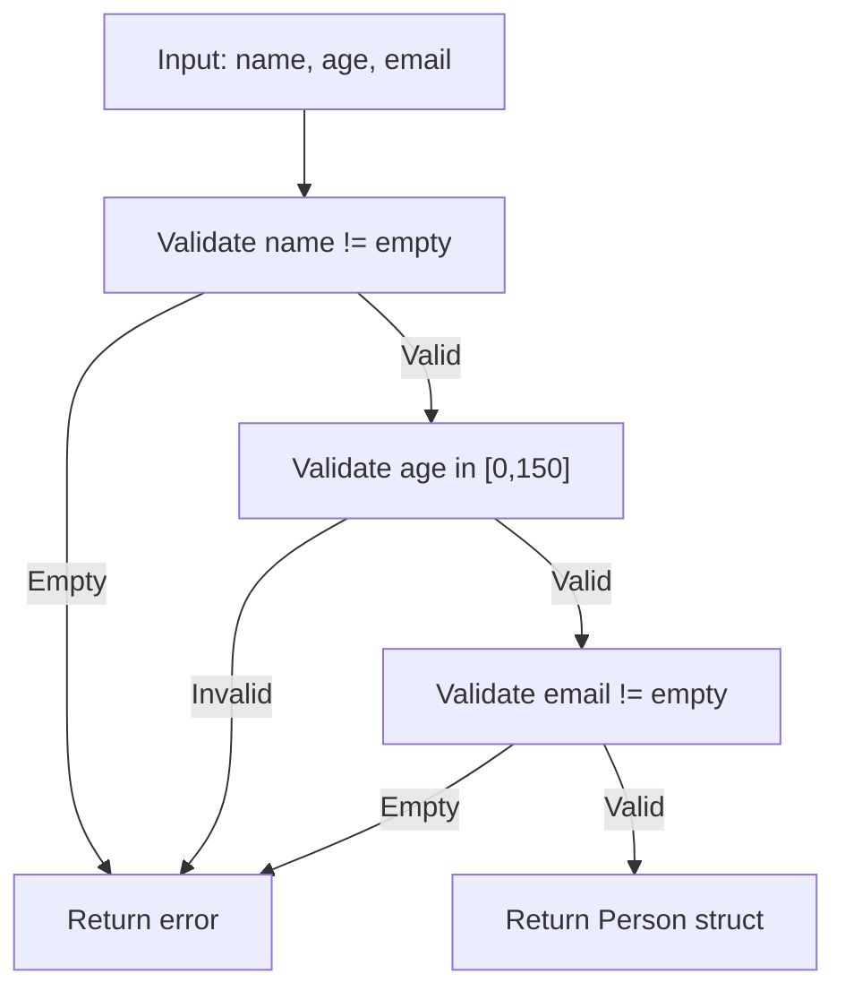
```mermaid
flowchart TD
    A["Input: name, age, email"] --> B["Validate name != empty"]
    B -->|"Empty"| ERR["Return error"]
    B -->|"Valid"| C["Validate age in [0,150]"]
    C -->|"Invalid"| ERR
    C -->|"Valid"| D["Validate email != empty"]
    D -->|"Empty"| ERR
    D -->|"Valid"| F["Return Person struct"]
```

**Execution Trace:**
```
Input:  "Alice", 30, "alice@example.com"
Step 1: name check → "Alice" is valid
Step 2: age check  → 30 in [0,150] valid
Step 3: email check → valid
Output: Person{Name:"Alice", Age:30, Email:"alice@example.com"}
```

### Interviewer Questions

1. Why return a value type instead of a pointer here?
2. Can we improve time/space further? What's the theoretical lower bound?
3. How does this scale to 10M elements / 1M concurrent requests?
4. Walk me through the edge case where age is exactly 0 (newborn).
5. How would you make this goroutine-safe if Person had mutable state?
6. What's the memory/GC impact? How would you reduce allocations?
7. How would you test this comprehensively?

### Follow-Up Questions

**Q1:** When should you return `*Person` vs `Person`?
**A1:** Return `*Person` when the struct is large (avoids copy cost), when you need nil to signal absence, or when the caller must mutate the same instance. For small structs like this, value semantics are cleaner and avoid nil-pointer bugs.

**Q2:** How do you add JSON serialization to Person?
**A2:** Add struct tags: `Name string \`json:"name"\``. Use `encoding/json` Marshal/Unmarshal. Tags control key names, omitempty behavior, and field exclusion with `-`.

**Q3:** What happens if you compare two Person values with `==`?
**A3:** Go compares all fields with `==` if every field is comparable (string, int are comparable). `p1 == p2` returns true only if all fields match. Structs containing slices or maps are not comparable with `==`.

**Q4:** How would you deep-copy a Person?
**A4:** Since all fields are value types (string, int), a simple assignment `p2 := p1` is already a deep copy. If Person had pointer or slice fields, you'd need to manually copy those fields.

**Q5:** How would you write a table-driven test for NewPerson?
**A5:** Use `[]struct{ name string; age int; email string; wantErr bool }` test cases covering valid input, empty name, negative age, age=151, empty email. Use `t.Run` for subtests.

---

## Q2: Value vs Pointer Receivers  [Level 1 — Beginner]

> **Tags:** `#value-receiver` `#pointer-receiver` `#methods`

### Problem Statement
Given a `Rectangle` struct with `Width` and `Height` fields, implement two methods: `Area()` using a value receiver (read-only), and `Scale(factor float64)` using a pointer receiver (mutates the struct). Demonstrate the difference between the two in `main`.

### Input / Output / Constraints

```
Input:  Rectangle{Width: 4.0, Height: 3.0}, Scale factor: 2.0
Output: Area before scale: 12.00
        Area after scale:  48.00

Constraints:
  • Width and Height > 0
  • Scale factor > 0
```

### Thought Process

Think like a senior Go engineer:
1. **Understand:** Value receivers get a copy; pointer receivers get the original. Only pointer receivers can mutate.
2. **Pattern:** Use value receiver for pure reads, pointer receiver for mutations — standard Go idiom.
3. **Edge cases:** Zero or negative dimensions, zero scale factor.
4. **Approach:** Validate in Scale; Area is pure and safe as value receiver.

### Brute Force Solution

```go
package main

import "fmt"

// bruteForce — O(1) time, O(1) space
type Rectangle struct {
    Width, Height float64
}

// ScaleWrong uses value receiver — mutation is lost
func (r Rectangle) ScaleWrong(factor float64) {
    r.Width *= factor   // modifies only the copy
    r.Height *= factor  // original Rectangle unchanged
}

func bruteForce() {
    r := Rectangle{Width: 4, Height: 3}
    r.ScaleWrong(2)
    fmt.Println(r.Width) // still 4 — bug!
}
```

**Time:** O(1) | **Space:** O(1)
**Bottleneck:** Value receiver silently discards mutation — a very common Go beginner bug.

### Better Solution

```go
// betterSolution — O(1) time, O(1) space
func (r Rectangle) Area() float64 {
    return r.Width * r.Height
}

// Scale uses pointer receiver to mutate in place
func (r *Rectangle) Scale(factor float64) {
    r.Width *= factor
    r.Height *= factor
}
```

**Time:** O(1) | **Space:** O(1)

### Best / Optimal Solution

```go
package main

import (
    "errors"
    "fmt"
)

// Rectangle represents a 2D rectangle.
type Rectangle struct {
    Width, Height float64
}

// Area — value receiver; read-only, O(1) time, O(1) space.
func (r Rectangle) Area() float64 {
    return r.Width * r.Height
}

// Scale — pointer receiver; mutates in place, O(1) time, O(1) space.
// Uses pointer receiver to achieve optimal in-place mutation.
func (r *Rectangle) Scale(factor float64) error {
    if factor <= 0 {
        return errors.New("scale factor must be positive")
    }
    r.Width *= factor
    r.Height *= factor
    return nil
}

func main() {
    r := Rectangle{Width: 4.0, Height: 3.0}
    fmt.Printf("Area before scale: %.2f\n", r.Area())

    if err := r.Scale(2.0); err != nil {
        fmt.Printf("error: %v\n", err)
        return
    }
    fmt.Printf("Area after scale:  %.2f\n", r.Area())
}
```

**Time:** O(1) | **Space:** O(1)

### Production Considerations

| Aspect | Details |
|--------|---------|
| **Scalability** | Both methods are O(1); no scaling concern |
| **Edge Cases** | Negative/zero width, height, or scale factor |
| **Error Handling** | Scale returns error for invalid factor |
| **Memory** | Value receiver copies 16 bytes (2 float64s) — acceptable |
| **Concurrency** | Not goroutine-safe; use sync.RWMutex if shared |

### Visual Explanation

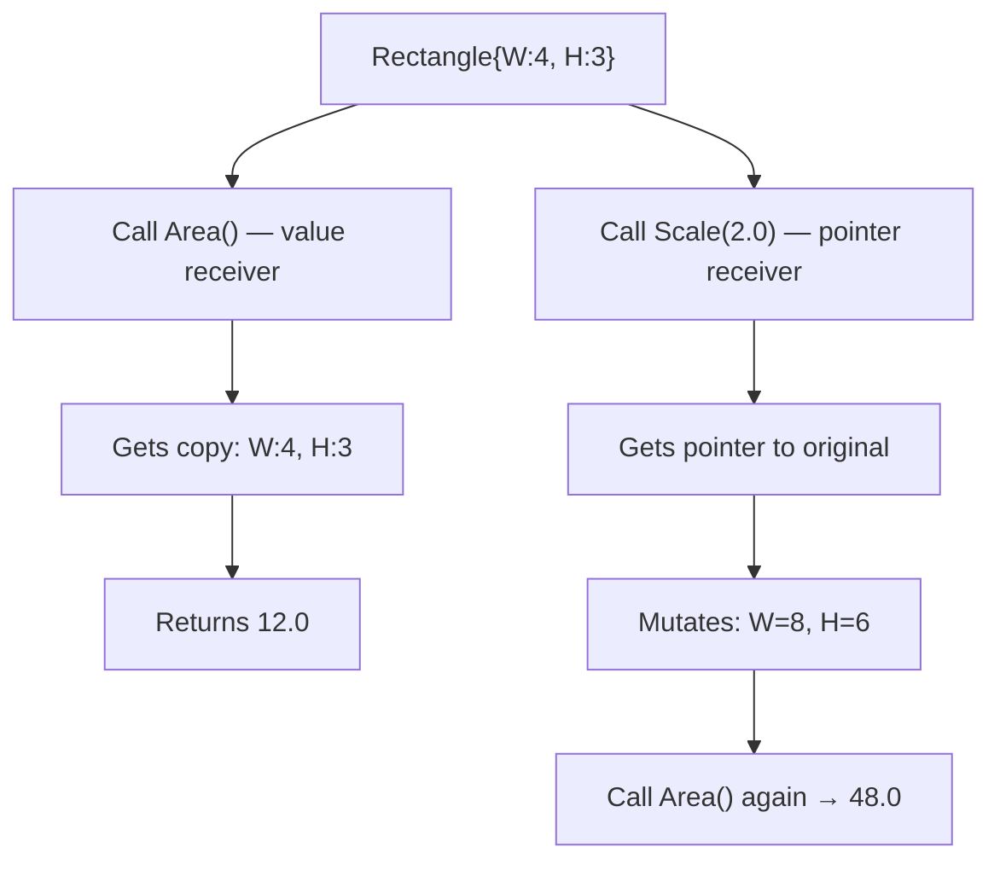
```mermaid
flowchart TD
    A["Rectangle{W:4, H:3}"] --> B["Call Area() — value receiver"]
    B --> C["Gets copy: W:4, H:3"]
    C --> D["Returns 12.0"]
    A --> E["Call Scale(2.0) — pointer receiver"]
    E --> F["Gets pointer to original"]
    F --> G["Mutates: W=8, H=6"]
    G --> H["Call Area() again → 48.0"]
```

**Execution Trace:**
```
Input:  Rectangle{Width:4, Height:3}, factor=2.0
Step 1: Area() → 4*3 = 12.0
Step 2: Scale(2.0) → Width=8, Height=6
Step 3: Area() → 8*6 = 48.0
Output: 12.00 then 48.00
```

### Interviewer Questions

1. Why use a value receiver for Area instead of pointer?
2. Can we improve time/space further? What's the theoretical lower bound?
3. How does mixing value and pointer receivers on the same type affect interface satisfaction?
4. Walk me through the edge case where Scale is called with factor=0.
5. How would you make Rectangle goroutine-safe?
6. What's the memory/GC impact of pointer vs value receivers?
7. How would you test Scale comprehensively including negative factors?

### Follow-Up Questions

**Q1:** What rule governs when Go automatically takes the address for a pointer receiver call?
**A1:** Go auto-dereferences only when the variable is addressable. `r.Scale(2)` where `r` is a local variable works because `r` is addressable. But calling `.Scale()` on a non-addressable value (e.g., function return value) requires an explicit `&`.

**Q2:** If Rectangle implements an interface with Scale, can a value type satisfy it?
**A2:** No. If Scale has a pointer receiver `(*Rectangle)`, only `*Rectangle` satisfies the interface — not `Rectangle`. The method set of `T` contains only value-receiver methods; the method set of `*T` contains both.

**Q3:** How do you decide between value and pointer receiver for a 500-byte struct?
**A3:** Use pointer receiver. Copying 500 bytes on every method call is wasteful. Rule of thumb: use pointer receivers for structs larger than roughly 64 bytes, or whenever mutation is needed.

**Q4:** Can a struct have some methods with value receivers and others with pointer receivers?
**A4:** Yes syntactically, but it's a bad practice. Go vet and linters will warn. Pick one convention per type to avoid confusion around interface satisfaction and method sets.

**Q5:** How would you benchmark value vs pointer receiver performance?
**A5:** Use `testing.B` with `b.N` iterations. Call the method in the loop, use `b.ReportAllocs()` to count allocations. Run with `go test -bench=. -benchmem` and compare ns/op and allocs/op.

---

## Q3: Struct Comparison  [Level 2 — Easy]

> **Tags:** `#struct-comparison` `#comparable` `#equality`

### Problem Statement
Write a function `AreAddressesEqual` that takes two `Address` structs (fields: `Street`, `City`, `ZipCode` all strings) and returns true if they are identical. Then write `ContainsAddress` that checks if an `Address` exists in a slice of addresses. Demonstrate why structs with slice fields cannot use `==`.

### Input / Output / Constraints

```
Input:  a1={Street:"123 Main", City:"NY", ZipCode:"10001"}
        a2={Street:"123 Main", City:"NY", ZipCode:"10001"}
Output: AreAddressesEqual → true
        ContainsAddress([a1, a2], a1) → true

Constraints:
  • All string fields (comparable)
  • Slice fields would require reflect.DeepEqual
  • n ≤ 10⁵ addresses in slice
```

### Thought Process

Think like a senior Go engineer:
1. **Understand:** Struct comparison with `==` works only when all fields are comparable types.
2. **Pattern:** Direct `==` for comparable structs; `reflect.DeepEqual` or manual comparison for slices/maps.
3. **Edge cases:** Empty structs, structs with nil pointer fields, non-comparable fields.
4. **Approach:** Use `==` for pure-value structs; demonstrate the limitation with a counter-example.

### Brute Force Solution

```go
package main

// bruteForce — O(n) time, O(1) space
type Address struct {
    Street  string
    City    string
    ZipCode string
}

func bruteForce(addrs []Address, target Address) bool {
    for _, a := range addrs {
        // manual field-by-field comparison
        if a.Street == target.Street && a.City == target.City && a.ZipCode == target.ZipCode {
            return true
        }
    }
    return false
}
```

**Time:** O(n) | **Space:** O(1)
**Bottleneck:** Manually comparing each field — verbose and error-prone when fields change.

### Better Solution

```go
// betterSolution — O(n) time, O(1) space
func AreAddressesEqual(a, b Address) bool {
    return a == b // works because all fields are comparable
}

func ContainsAddress(addrs []Address, target Address) bool {
    for _, a := range addrs {
        if a == target {
            return true
        }
    }
    return false
}
```

**Time:** O(n) | **Space:** O(1)

### Best / Optimal Solution

```go
package main

import (
    "fmt"
    "reflect"
)

// Address holds location information — all fields are comparable.
type Address struct {
    Street  string
    City    string
    ZipCode string
}

// AddressWithTags has a non-comparable field to show the limitation.
type AddressWithTags struct {
    Street string
    Tags   []string // slices are not comparable with ==
}

// AreAddressesEqual — O(1) time, O(1) space.
// Uses struct == operator since all fields are comparable.
func AreAddressesEqual(a, b Address) bool {
    return a == b
}

// ContainsAddress — O(n) time, O(1) space.
// Uses == for each element; no allocations.
func ContainsAddress(addrs []Address, target Address) bool {
    for _, a := range addrs {
        if a == target {
            return true
        }
    }
    return false
}

// AreTaggedAddressesEqual — O(n) time, O(1) space.
// Uses reflect.DeepEqual when struct contains non-comparable fields.
func AreTaggedAddressesEqual(a, b AddressWithTags) bool {
    return reflect.DeepEqual(a, b)
}

func main() {
    a1 := Address{Street: "123 Main", City: "NY", ZipCode: "10001"}
    a2 := Address{Street: "123 Main", City: "NY", ZipCode: "10001"}
    a3 := Address{Street: "456 Oak", City: "LA", ZipCode: "90001"}

    fmt.Println("Equal:", AreAddressesEqual(a1, a2))    // true
    fmt.Println("Equal:", AreAddressesEqual(a1, a3))    // false
    fmt.Println("Contains:", ContainsAddress([]Address{a1, a3}, a2)) // true

    t1 := AddressWithTags{Street: "123 Main", Tags: []string{"home", "primary"}}
    t2 := AddressWithTags{Street: "123 Main", Tags: []string{"home", "primary"}}
    fmt.Println("Tagged Equal:", AreTaggedAddressesEqual(t1, t2)) // true
}
```

**Time:** O(n) for ContainsAddress, O(1) for equality | **Space:** O(1)

### Production Considerations

| Aspect | Details |
|--------|---------|
| **Scalability** | Linear scan fine for small slices; use map[Address]struct{} for O(1) lookup at scale |
| **Edge Cases** | Zero-value struct, structs with pointer fields (pointer address vs value equality) |
| **Error Handling** | reflect.DeepEqual never panics but is slow (~10x); avoid in hot paths |
| **Memory** | No allocations in == path; reflect.DeepEqual uses reflection overhead |
| **Concurrency** | Value comparisons are safe; no shared state |

### Visual Explanation

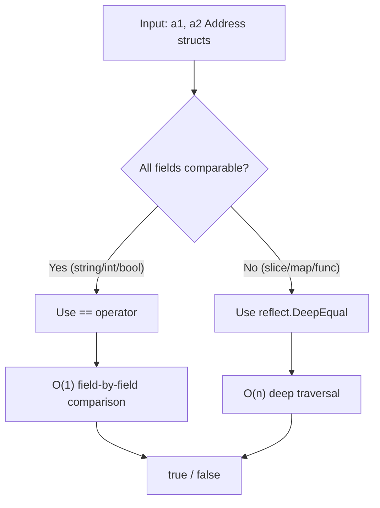
```mermaid
flowchart TD
    A["Input: a1, a2 Address structs"] --> B{"All fields comparable?"}
    B -->|"Yes (string/int/bool)"| C["Use == operator"]
    B -->|"No (slice/map/func)"| D["Use reflect.DeepEqual"]
    C --> E["O(1) field-by-field comparison"]
    D --> F["O(n) deep traversal"]
    E --> G["true / false"]
    F --> G
```

**Execution Trace:**
```
Input:  a1={123 Main, NY, 10001}, a2={123 Main, NY, 10001}
Step 1: a1.Street == a2.Street → "123 Main" == "123 Main" → true
Step 2: a1.City == a2.City     → "NY" == "NY" → true
Step 3: a1.ZipCode == a2.ZipCode → "10001" == "10001" → true
Output: true
```

### Interviewer Questions

1. Why can't you use `==` on a struct that contains a slice?
2. Can we improve time/space for ContainsAddress to O(1)?
3. How does this scale to 10M addresses in the lookup set?
4. Walk me through the edge case where a struct has a nil pointer field.
5. How would you make ContainsAddress goroutine-safe?
6. What is the performance difference between `==` and `reflect.DeepEqual`?
7. How would you test AreAddressesEqual with all edge cases?

### Follow-Up Questions

**Q1:** How do you use an Address as a map key?
**A1:** Since all fields are comparable, `map[Address]int` is valid. Go uses the struct's `==` semantics for hashing and equality. Structs with slice/map fields cannot be map keys.

**Q2:** How would you implement set membership for addresses at O(1)?
**A2:** `seen := make(map[Address]struct{})`. Add with `seen[a] = struct{}{}`. Check with `_, ok := seen[a]`. Uses zero-allocation empty struct as value.

**Q3:** What does reflect.DeepEqual do differently from `==`?
**A3:** DeepEqual recursively compares slice contents element by element, map key-value pairs, and follows pointers comparing pointed-to values. `==` on pointers compares addresses, not values.

**Q4:** Can structs with function fields be compared?
**A4:** No. Functions are not comparable in Go. A struct with a `func` field cannot use `==` and will cause a compile error. Use reflect.DeepEqual carefully — it panics on function values.

**Q5:** How would you benchmark == vs reflect.DeepEqual for 1M address lookups?
**A5:** Benchmark both with `testing.B`. For map-based lookup, `map[Address]struct{}` with `==` will be orders of magnitude faster than a linear scan with DeepEqual. Profile with `pprof` to confirm.

---

## Q4: Deep Copy vs Shallow Copy  [Level 2 — Easy]

> **Tags:** `#deep-copy` `#shallow-copy` `#value-semantics`

### Problem Statement
Given an `Employee` struct with fields `Name` (string), `Skills` ([]string), and `Manager` (*Employee), write functions `ShallowCopy` and `DeepCopy` that copy an Employee. Demonstrate that modifying the Skills slice in a shallow copy affects the original, while a deep copy does not.

### Input / Output / Constraints

```
Input:  emp={Name:"Bob", Skills:["Go","SQL"], Manager: nil}
Output: ShallowCopy: modifying copy.Skills[0] changes original
        DeepCopy:    modifying copy.Skills[0] does NOT change original

Constraints:
  • Skills slice length ≤ 1000
  • Manager chain depth ≤ 10 (avoid infinite recursion)
```

### Thought Process

Think like a senior Go engineer:
1. **Understand:** Assignment copies scalar fields by value but slice headers share the underlying array.
2. **Pattern:** Deep copy requires allocating new backing arrays and recursively copying pointer fields.
3. **Edge cases:** Nil Skills slice, nil Manager pointer, circular Manager references.
4. **Approach:** Allocate new slice with `make`, copy elements with `copy()`, handle nil manager.

### Brute Force Solution

```go
package main

// bruteForce — O(n) time, O(n) space
type Employee struct {
    Name    string
    Skills  []string
    Manager *Employee
}

func bruteForce(e Employee) Employee {
    // simple assignment — SHALLOW copy
    // Skills slice header is copied but backing array is shared
    return e
}
```

**Time:** O(1) | **Space:** O(1)
**Bottleneck:** Shared backing array — mutating Skills in copy corrupts original.

### Better Solution

```go
// betterSolution — O(n) time, O(n) space
func DeepCopyBasic(e Employee) Employee {
    newSkills := make([]string, len(e.Skills))
    copy(newSkills, e.Skills)
    return Employee{Name: e.Name, Skills: newSkills, Manager: e.Manager}
    // Note: Manager pointer still shared — not truly deep
}
```

**Time:** O(n) | **Space:** O(n)

### Best / Optimal Solution

```go
package main

import "fmt"

// Employee represents a company employee.
type Employee struct {
    Name    string
    Skills  []string
    Manager *Employee
}

// ShallowCopy — O(1) time, O(1) space.
// Copies scalar fields by value; slice and pointer fields are shared.
func ShallowCopy(e Employee) Employee {
    return e // struct assignment copies the slice header, not the backing array
}

// DeepCopy — O(n) time, O(n) space.
// Allocates new slice and recursively copies Manager chain.
// Uses depth guard to prevent infinite loops in circular references.
func DeepCopy(e *Employee, depth int) *Employee {
    if e == nil || depth > 10 {
        return nil
    }
    newSkills := make([]string, len(e.Skills))
    copy(newSkills, e.Skills)
    return &Employee{
        Name:    e.Name,
        Skills:  newSkills,
        Manager: DeepCopy(e.Manager, depth+1),
    }
}

func main() {
    mgr := &Employee{Name: "Carol", Skills: []string{"Leadership"}}
    emp := Employee{Name: "Bob", Skills: []string{"Go", "SQL"}, Manager: mgr}

    // Shallow copy
    shallow := ShallowCopy(emp)
    shallow.Skills[0] = "Rust"
    fmt.Println("Original after shallow mutation:", emp.Skills[0]) // Rust — shared!

    // Reset
    emp.Skills[0] = "Go"

    // Deep copy
    deep := DeepCopy(&emp, 0)
    deep.Skills[0] = "Rust"
    fmt.Println("Original after deep mutation:", emp.Skills[0]) // Go — independent
}
```

**Time:** O(n) | **Space:** O(n)

### Production Considerations

| Aspect | Details |
|--------|---------|
| **Scalability** | Linear in Skills length and Manager chain depth |
| **Edge Cases** | Nil Skills, nil Manager, circular Manager chain (depth guard) |
| **Error Handling** | Return nil for nil input; depth guard prevents stack overflow |
| **Memory** | Deep copy allocates new backing array — increase GC pressure |
| **Concurrency** | Deep copy is safe to use concurrently if source is not mutated |

### Visual Explanation

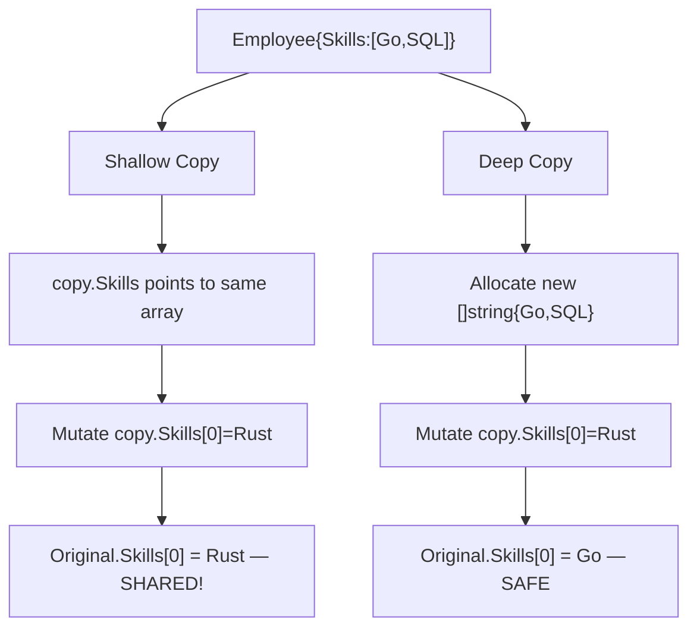
```mermaid
flowchart TD
    A["Employee{Skills:[Go,SQL]}"] --> B["Shallow Copy"]
    A --> C["Deep Copy"]
    B --> D["copy.Skills points to same array"]
    C --> E["Allocate new []string{Go,SQL}"]
    D --> F["Mutate copy.Skills[0]=Rust"]
    E --> G["Mutate copy.Skills[0]=Rust"]
    F --> H["Original.Skills[0] = Rust — SHARED!"]
    G --> I["Original.Skills[0] = Go — SAFE"]
```

**Execution Trace:**
```
Input:  emp.Skills = ["Go", "SQL"]
Shallow: shallow.Skills → same array as emp.Skills
Mutate:  shallow.Skills[0] = "Rust"
Result:  emp.Skills[0] = "Rust" (corrupted)

Deep:    deep.Skills → new array ["Go", "SQL"]
Mutate:  deep.Skills[0] = "Rust"
Result:  emp.Skills[0] = "Go" (unchanged)
```

### Interviewer Questions

1. Why does struct assignment in Go not deep-copy slice fields?
2. Can we improve deep copy performance for very large Skills slices?
3. How does this scale when Manager chains are 100 levels deep?
4. Walk me through the edge case where Manager points back to itself.
5. How would you make deep copy goroutine-safe?
6. What's the GC impact of allocating new slices on every copy?
7. How would you write a fuzz test to verify deep copy correctness?

### Follow-Up Questions

**Q1:** Does `copy()` deep-copy string elements in the slice?
**A1:** Strings in Go are immutable value types (pointer+length header). `copy()` copies the string headers — but since strings are immutable, this is effectively safe. You cannot corrupt a string through a shared reference.

**Q2:** How would you handle deep copy for a struct with map fields?
**A2:** Allocate a new map with `make(map[K]V, len(src))`, then range over the source and copy each key-value pair. For nested maps or maps with pointer values, recurse.

**Q3:** Is there a standard library function for deep copy in Go?
**A3:** No. The standard library has `encoding/gob` and `encoding/json` which can serialize then deserialize — effectively a deep copy — but they are slow and require exported fields. `github.com/mohae/deepcopy` or `copier` are popular third-party options.

**Q4:** How would you detect circular references in a Manager chain?
**A4:** Use a `map[*Employee]bool` visited set. Before recursing into Manager, check `if visited[e.Manager]`. This prevents infinite recursion and correctly handles cycles.

**Q5:** What is the performance cost of deep copy vs shallow copy in a hot path?
**A5:** Deep copy allocates on heap, shallow copy is a stack copy. For a struct with 1000-element Skills, deep copy allocates 8KB (strings are headers). Use sync.Pool to reuse slices in hot paths.

---

## Q5: Struct Tags for JSON and DB  [Level 2 — Easy]

> **Tags:** `#struct-tags` `#json` `#serialization`

### Problem Statement
Define a `Product` struct with fields `ID`, `Name`, `Price`, `StockCount`, and `CreatedAt`. Apply JSON struct tags so that: `ID` maps to `"id"`, `StockCount` maps to `"stock_count"`, `Price` uses `omitempty`, unexported internal notes are excluded with `"-"`. Write marshal and unmarshal examples.

### Input / Output / Constraints

```
Input:  Product{ID:1, Name:"Widget", Price:0, StockCount:100}
Output: {"id":1,"name":"Widget","stock_count":100}
        (Price omitted because omitempty and value is zero)

Constraints:
  • Valid JSON must round-trip correctly
  • Unexported fields must not appear in JSON
  • time.Time fields must use RFC3339 format
```

### Thought Process

Think like a senior Go engineer:
1. **Understand:** Struct tags control JSON key names, zero-value omission, and field exclusion.
2. **Pattern:** Standard `encoding/json` tag syntax `json:"key,omitempty"`.
3. **Edge cases:** Zero-value Price with omitempty, time.Time marshaling, unexported fields.
4. **Approach:** Use proper tag syntax; validate round-trip in tests.

### Brute Force Solution

```go
package main

// bruteForce — no tags, default behavior
type ProductBrute struct {
    ID         int
    Name       string
    Price      float64
    StockCount int
}
// JSON output: {"ID":1,"Name":"Widget","Price":0,"StockCount":100}
// Problems: PascalCase keys, zero Price included, field names differ from API contract
```

**Time:** O(n) | **Space:** O(n)
**Bottleneck:** PascalCase keys break API contracts; zero values leak internal state.

### Better Solution

```go
// betterSolution — with json tags
type Product struct {
    ID         int     `json:"id"`
    Name       string  `json:"name"`
    Price      float64 `json:"price,omitempty"`
    StockCount int     `json:"stock_count"`
}
```

**Time:** O(n) | **Space:** O(n)

### Best / Optimal Solution

```go
package main

import (
    "encoding/json"
    "fmt"
    "time"
)

// Product represents a catalog item.
// JSON tags enforce snake_case API contract.
// DB tags (shown as comments) would be used with sqlx or gorm.
type Product struct {
    ID         int       `json:"id"                  db:"id"`
    Name       string    `json:"name"                db:"name"`
    Price      float64   `json:"price,omitempty"     db:"price"`
    StockCount int       `json:"stock_count"         db:"stock_count"`
    CreatedAt  time.Time `json:"created_at"          db:"created_at"`
    internalNote string  // unexported — excluded from JSON automatically
}

// MarshalExample — demonstrates marshal/unmarshal round-trip.
func MarshalExample() error {
    p := Product{
        ID:         1,
        Name:       "Widget",
        Price:      0, // omitempty: will be excluded
        StockCount: 100,
        CreatedAt:  time.Date(2024, 1, 15, 0, 0, 0, 0, time.UTC),
    }

    data, err := json.Marshal(p)
    if err != nil {
        return fmt.Errorf("marshal: %w", err)
    }
    fmt.Println("JSON:", string(data))

    var p2 Product
    if err := json.Unmarshal(data, &p2); err != nil {
        return fmt.Errorf("unmarshal: %w", err)
    }
    fmt.Printf("Unmarshaled: ID=%d Name=%s StockCount=%d\n", p2.ID, p2.Name, p2.StockCount)
    return nil
}

func main() {
    if err := MarshalExample(); err != nil {
        fmt.Printf("error: %v\n", err)
    }
}
```

**Time:** O(n) fields | **Space:** O(n) for JSON bytes

### Production Considerations

| Aspect | Details |
|--------|---------|
| **Scalability** | JSON encoding is O(n) in field count; use streaming json.Encoder for large responses |
| **Edge Cases** | omitempty on bool (false excluded), int (0 excluded), pointer nil vs zero |
| **Error Handling** | Always check Marshal/Unmarshal errors; invalid UTF-8 causes errors |
| **Memory** | json.Marshal allocates; use json.NewEncoder(w) to stream directly to io.Writer |
| **Concurrency** | JSON encoding is stateless; goroutine-safe |

### Visual Explanation

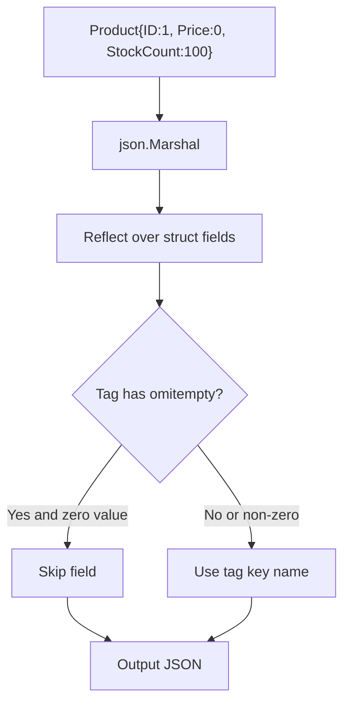
```mermaid
flowchart TD
    A["Product{ID:1, Price:0, StockCount:100}"] --> B["json.Marshal"]
    B --> C["Reflect over struct fields"]
    C --> D{"Tag has omitempty?"}
    D -->|"Yes and zero value"| E["Skip field"]
    D -->|"No or non-zero"| F["Use tag key name"]
    E --> G["Output JSON"]
    F --> G
```

**Execution Trace:**
```
Input:  Product{ID:1, Name:"Widget", Price:0, StockCount:100}
Step 1: ID → tag "id" → include: 1
Step 2: Name → tag "name" → include: "Widget"
Step 3: Price → tag "price,omitempty", value=0 → SKIP
Step 4: StockCount → tag "stock_count" → include: 100
Output: {"id":1,"name":"Widget","stock_count":100,...}
```

### Interviewer Questions

1. What does `omitempty` do for a pointer field vs a value field?
2. Can we improve serialization performance beyond encoding/json?
3. How does this scale when marshaling 10M products in a batch export?
4. Walk me through the edge case where Price is exactly 0.0 but should be included.
5. How would you make custom marshaling goroutine-safe?
6. What's the GC impact of repeated json.Marshal calls in a hot path?
7. How would you test that the JSON contract never accidentally changes?

### Follow-Up Questions

**Q1:** How do you include a zero Price in JSON when using omitempty?
**A1:** Use a pointer field: `Price *float64 \`json:"price,omitempty"\``. A nil pointer is omitted; a pointer to 0.0 is included. This distinguishes "not provided" from "zero value".

**Q2:** What are faster alternatives to encoding/json?
**A2:** `github.com/json-iterator/go` is a drop-in replacement 2-3x faster. `github.com/goccy/go-json` and `github.com/bytedance/sonic` are even faster for specific workloads. Use benchmarks to justify the dependency.

**Q3:** How do you implement custom JSON marshaling for a type?
**A3:** Implement `json.Marshaler` interface: `func (p Product) MarshalJSON() ([]byte, error)`. Similarly `json.Unmarshaler` for custom unmarshal. This gives full control over the JSON representation.

**Q4:** What is the `db` struct tag used for?
**A4:** Libraries like `sqlx` and `gorm` read `db` tags to map struct fields to database column names. `sqlx.Get` and `sqlx.Select` use `db` tags for row scanning, similar to how `encoding/json` uses `json` tags.

**Q5:** How would you detect if a JSON struct contract breaks between releases?
**A5:** Golden file tests: marshal a known struct, compare against a committed `.json` file. Any field rename or removal fails the test. Also use `go-test-jsonschema` or generate a JSON schema and validate against it in CI.

---

## Q6: Builder Pattern for Struct Configuration  [Level 2 — Easy]

> **Tags:** `#builder-pattern` `#functional-options` `#configuration`

### Problem Statement
Implement a `Server` struct with fields `Host`, `Port`, `Timeout`, `MaxConnections`, and `TLSEnabled`. Use the functional options pattern to allow callers to configure only the fields they care about, with sensible defaults. Write `NewServer(opts ...Option) *Server`.

### Input / Output / Constraints

```
Input:  NewServer(WithPort(9090), WithTLS(true))
Output: &Server{Host:"localhost", Port:9090, Timeout:30s, MaxConnections:100, TLSEnabled:true}

Constraints:
  • Port must be in range [1, 65535]
  • Timeout must be > 0
  • MaxConnections must be > 0
```

### Thought Process

Think like a senior Go engineer:
1. **Understand:** Functional options allow extensible configuration without breaking existing callers.
2. **Pattern:** Rob Pike's functional options pattern — each option is a function that modifies the struct.
3. **Edge cases:** Invalid port, zero timeout, negative max connections.
4. **Approach:** Apply defaults first, then apply options; validate after all options are applied.

### Brute Force Solution

```go
package main

// bruteForce — multi-argument constructor, breaks when adding new fields
type Server struct {
    Host           string
    Port           int
    Timeout        int
    MaxConnections int
}

func NewServerBrute(host string, port int, timeout int, maxConns int) *Server {
    return &Server{Host: host, Port: port, Timeout: timeout, MaxConnections: maxConns}
}
// Problem: adding TLSEnabled requires changing all call sites
```

**Time:** O(1) | **Space:** O(1)
**Bottleneck:** Adding new fields breaks all existing callers — not extensible.

### Better Solution

```go
// betterSolution — config struct pattern
type ServerConfig struct {
    Host           string
    Port           int
    Timeout        int
    MaxConnections int
    TLSEnabled     bool
}

func NewServerFromConfig(cfg ServerConfig) *Server {
    // apply defaults for zero values
    if cfg.Port == 0 { cfg.Port = 8080 }
    return &Server{/* fields from cfg */}
}
```

**Time:** O(1) | **Space:** O(1)

### Best / Optimal Solution

```go
package main

import (
    "errors"
    "fmt"
    "time"
)

// Server represents an HTTP server configuration.
type Server struct {
    host           string
    port           int
    timeout        time.Duration
    maxConnections int
    tlsEnabled     bool
}

// Option is a functional option for configuring Server.
type Option func(*Server) error

// WithHost sets the server host.
func WithHost(host string) Option {
    return func(s *Server) error {
        if host == "" {
            return errors.New("host must not be empty")
        }
        s.host = host
        return nil
    }
}

// WithPort sets the server port.
func WithPort(port int) Option {
    return func(s *Server) error {
        if port < 1 || port > 65535 {
            return fmt.Errorf("port %d out of range [1, 65535]", port)
        }
        s.port = port
        return nil
    }
}

// WithTimeout sets the server timeout.
func WithTimeout(d time.Duration) Option {
    return func(s *Server) error {
        if d <= 0 {
            return errors.New("timeout must be positive")
        }
        s.timeout = d
        return nil
    }
}

// WithMaxConnections sets the max connection limit.
func WithMaxConnections(n int) Option {
    return func(s *Server) error {
        if n <= 0 {
            return fmt.Errorf("maxConnections must be positive, got %d", n)
        }
        s.maxConnections = n
        return nil
    }
}

// WithTLS enables or disables TLS.
func WithTLS(enabled bool) Option {
    return func(s *Server) error {
        s.tlsEnabled = enabled
        return nil
    }
}

// NewServer — production-ready, O(k) time where k=number of options, O(1) space.
// Uses functional options pattern to achieve extensible configuration.
func NewServer(opts ...Option) (*Server, error) {
    // Apply sensible defaults
    s := &Server{
        host:           "localhost",
        port:           8080,
        timeout:        30 * time.Second,
        maxConnections: 100,
        tlsEnabled:     false,
    }
    for _, opt := range opts {
        if err := opt(s); err != nil {
            return nil, fmt.Errorf("server option error: %w", err)
        }
    }
    return s, nil
}

func main() {
    srv, err := NewServer(
        WithPort(9090),
        WithTLS(true),
        WithTimeout(60*time.Second),
    )
    if err != nil {
        fmt.Printf("error: %v\n", err)
        return
    }
    fmt.Printf("Server: %s:%d tls=%v timeout=%v maxConn=%d\n",
        srv.host, srv.port, srv.tlsEnabled, srv.timeout, srv.maxConnections)
}
```

**Time:** O(k) where k = number of options | **Space:** O(1)

### Production Considerations

| Aspect | Details |
|--------|---------|
| **Scalability** | Adding new options never breaks existing callers |
| **Edge Cases** | Invalid port, zero timeout, negative maxConnections |
| **Error Handling** | Each option returns error; first error aborts construction |
| **Memory** | One heap allocation for *Server regardless of option count |
| **Concurrency** | NewServer not goroutine-safe during construction; safe after |

### Visual Explanation

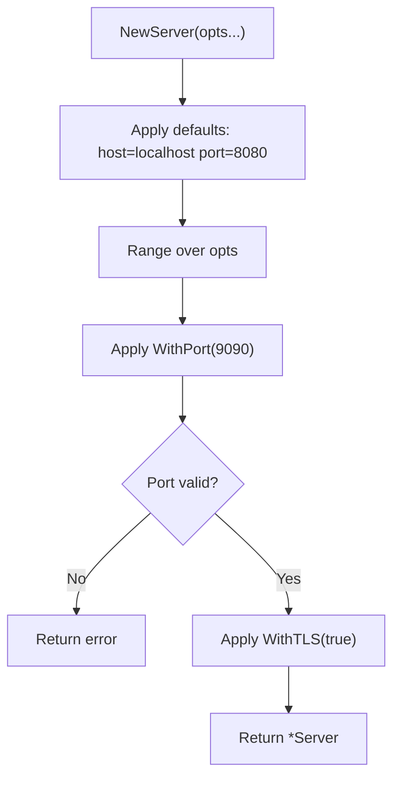
```mermaid
flowchart TD
    A["NewServer(opts...)"] --> B["Apply defaults: host=localhost port=8080"]
    B --> C["Range over opts"]
    C --> D["Apply WithPort(9090)"]
    D --> E{"Port valid?"}
    E -->|"No"| ERR["Return error"]
    E -->|"Yes"| F["Apply WithTLS(true)"]
    F --> G["Return *Server"]
```

**Execution Trace:**
```
Input:  NewServer(WithPort(9090), WithTLS(true))
Step 1: defaults → {host:localhost, port:8080, timeout:30s, maxConn:100}
Step 2: WithPort(9090) → port=9090
Step 3: WithTLS(true) → tlsEnabled=true
Output: &Server{host:localhost, port:9090, timeout:30s, maxConn:100, tls:true}
```

### Interviewer Questions

1. Why functional options over a config struct parameter?
2. Can we improve extensibility further using interfaces?
3. How does this scale when there are 50 options and 1000 call sites?
4. Walk me through the edge case where WithPort is called twice.
5. How would you make Server goroutine-safe after construction?
6. What's the allocation cost of functional options vs config struct?
7. How would you test that defaults are correctly applied?

### Follow-Up Questions

**Q1:** What is the difference between functional options and the config struct pattern?
**A1:** Functional options allow validation at application time and hide fields (unexported). Config struct is simpler but exposes all fields and cannot validate on application. Functional options scale better as options grow — adding one never breaks existing callers.

**Q2:** How do you handle option ordering dependencies (e.g., TLS requires port ≥ 443)?
**A2:** Validate cross-field constraints after all options are applied, in a `validate()` method called at the end of `NewServer`. This separates individual option validation from cross-cutting concerns.

**Q3:** Can options be applied to an existing server (reconfiguration)?
**A3:** Yes, define an `Apply(opts ...Option) error` method on `*Server`. Wrap with a mutex if the server is live. This pattern is used in libraries like `grpc.Dial`.

**Q4:** How does the functional options pattern compare to the builder pattern?
**A4:** Builder chains method calls and returns the builder (fluent interface). Functional options pass functions to the constructor. Options are more idiomatic Go; builder is more common in Java. Both solve the telescoping constructor problem.

**Q5:** How would you document functional options for godoc?
**A5:** Document each `WithX` function clearly with valid ranges and default behavior. Group them with a `// Server options` comment block. Add an example function `ExampleNewServer` in a `_test.go` file for godoc playground.

---
## Q7: Embedding for Composition  [Level 3 — Medium]

> **Tags:** `#embedding` `#composition` `#promoted-methods`

### Problem Statement
Design an `Animal` base struct with fields `Name` and `Age`, and a `Speak() string` method. Embed `Animal` into a `Dog` struct that adds a `Breed` field and overrides `Speak()` to return a dog-specific sound. Also embed `Animal` into `Cat`. Demonstrate method promotion and override behavior.

### Input / Output / Constraints

```
Input:  Dog{Animal:{Name:"Rex", Age:3}, Breed:"Labrador"}
Output: Dog.Speak()   → "Rex says: Woof!"
        Dog.Name      → "Rex"   (promoted field)
        Dog.Animal.Speak() → "Rex says: ..." (base method still accessible)

Constraints:
  • Animal.Speak must remain callable on Dog via Dog.Animal.Speak()
  • Dog must satisfy a Speaker interface
  • No inheritance — only composition
```

### Thought Process

Think like a senior Go engineer:
1. **Understand:** Embedding promotes fields and methods to the outer struct; overriding shadows the embedded method.
2. **Pattern:** Composition over inheritance — Go's answer to OOP inheritance.
3. **Edge cases:** Ambiguous field promotion with multiple embeddings, calling the shadowed method explicitly.
4. **Approach:** Define interface, embed Animal, add Dog-specific Speak to shadow.

### Brute Force Solution

```go
package main

import "fmt"

// bruteForce — duplication without embedding
type AnimalBrute struct{ Name string; Age int }
type DogBrute struct {
    Name  string // duplicated
    Age   int    // duplicated
    Breed string
}
// Problem: duplicated fields; no code reuse; hard to maintain
func (d DogBrute) Speak() string { return fmt.Sprintf("%s says: Woof!", d.Name) }
```

**Time:** O(1) | **Space:** O(1)
**Bottleneck:** Field duplication violates DRY; changes to Animal fields must be mirrored everywhere.

### Better Solution

```go
// betterSolution — embedding with promoted fields
type Animal struct { Name string; Age int }
func (a Animal) Speak() string { return fmt.Sprintf("%s makes a sound", a.Name) }

type Dog struct {
    Animal        // embedded — Name, Age, Speak() promoted
    Breed string
}
// Dog.Speak() calls Animal.Speak() unless overridden
```

**Time:** O(1) | **Space:** O(1)

### Best / Optimal Solution

```go
package main

import "fmt"

// Speaker is satisfied by any type with a Speak() method.
type Speaker interface {
    Speak() string
}

// Animal is the base struct embedded into specific animals.
type Animal struct {
    Name string
    Age  int
}

// Speak — base implementation, O(1) time, O(1) space.
func (a Animal) Speak() string {
    return fmt.Sprintf("%s makes a sound", a.Name)
}

// Describe returns common animal info via promoted method.
func (a Animal) Describe() string {
    return fmt.Sprintf("%s (age %d)", a.Name, a.Age)
}

// Dog embeds Animal and overrides Speak.
type Dog struct {
    Animal        // promotes Name, Age, Speak(), Describe()
    Breed  string
}

// Speak overrides Animal.Speak — shadows the promoted method.
func (d Dog) Speak() string {
    return fmt.Sprintf("%s says: Woof!", d.Name) // d.Name via promotion
}

// Cat embeds Animal and overrides Speak.
type Cat struct {
    Animal
    Indoor bool
}

func (c Cat) Speak() string {
    return fmt.Sprintf("%s says: Meow!", c.Name)
}

func makeNoise(s Speaker) {
    fmt.Println(s.Speak())
}

func main() {
    dog := Dog{Animal: Animal{Name: "Rex", Age: 3}, Breed: "Labrador"}
    cat := Cat{Animal: Animal{Name: "Whiskers", Age: 5}, Indoor: true}

    makeNoise(dog) // Rex says: Woof!
    makeNoise(cat) // Whiskers says: Meow!

    // Promoted field access
    fmt.Println(dog.Name)       // Rex (promoted from Animal)
    fmt.Println(dog.Describe()) // Rex (age 3) (promoted method)

    // Explicit base method call
    fmt.Println(dog.Animal.Speak()) // Rex makes a sound
}
```

**Time:** O(1) | **Space:** O(1)

### Production Considerations

| Aspect | Details |
|--------|---------|
| **Scalability** | Method dispatch is O(1); no runtime overhead vs direct call |
| **Edge Cases** | Ambiguous promotion when two embedded types have same method name |
| **Error Handling** | Compile error on ambiguous method; resolve with explicit selector |
| **Memory** | Dog size = Animal size + Breed string header; no extra allocation |
| **Concurrency** | Value semantics; goroutine-safe if fields not mutated concurrently |

### Visual Explanation

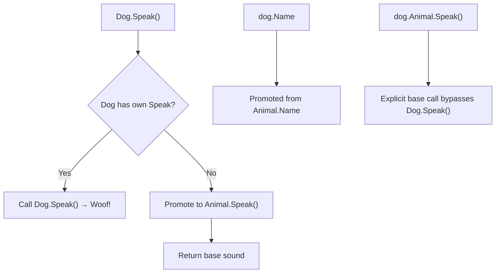
```mermaid
flowchart TD
    A["Dog.Speak()"] --> B{"Dog has own Speak?"}
    B -->|"Yes"| C["Call Dog.Speak() → Woof!"]
    B -->|"No"| D["Promote to Animal.Speak()"]
    D --> E["Return base sound"]
    F["dog.Name"] --> G["Promoted from Animal.Name"]
    H["dog.Animal.Speak()"] --> I["Explicit base call bypasses Dog.Speak()"]
```

**Execution Trace:**
```
Input:  dog = Dog{Animal:{Name:"Rex",Age:3}, Breed:"Labrador"}
Step 1: dog.Speak() → Dog has Speak → "Rex says: Woof!"
Step 2: dog.Name    → promoted Animal.Name → "Rex"
Step 3: dog.Animal.Speak() → Animal.Speak → "Rex makes a sound"
```

### Interviewer Questions

1. Why prefer embedding over defining a separate Name field in Dog?
2. Can we achieve polymorphism via embedding without interfaces?
3. How does this scale to 20 animal types all embedding Animal?
4. Walk me through the compile error when two embedded types have the same method.
5. How would you make Animal goroutine-safe with embedded mutex?
6. What's the memory layout of Dog vs a Dog with an Animal pointer field?
7. How would you test that Dog satisfies the Speaker interface at compile time?

### Follow-Up Questions

**Q1:** How do you get a compile-time check that Dog satisfies Speaker?
**A1:** `var _ Speaker = Dog{}` — this assignment fails to compile if Dog doesn't implement Speaker. Place this near the type definition as documentation and a guard.

**Q2:** What happens when two embedded structs both have a method with the same name?
**A2:** The compiler reports "ambiguous selector". You must call the method with an explicit path: `d.A.Method()` or `d.B.Method()`. The outer struct does not get a promoted method in this case.

**Q3:** Does embedding create an is-a or has-a relationship?
**A3:** Has-a. `Dog` has an `Animal` embedded — it is not an `Animal` subtype. `Dog` cannot be passed where `Animal` is expected unless the function accepts `Animal` by value (which would require explicit extraction: `dog.Animal`).

**Q4:** Can you embed an interface inside a struct?
**A4:** Yes. `type Middleware struct { http.Handler }` embeds the interface. The struct satisfies the interface, and you can wrap/override specific methods. This is the basis for the http.ResponseWriter wrapper pattern.

**Q5:** How would you test the Speak override without running main?
**A5:** Unit test: `d := Dog{Animal: Animal{Name: "Rex"}}; got := d.Speak(); want := "Rex says: Woof!"; if got != want { t.Errorf(...) }`. Also test `d.Animal.Speak()` returns the base string.

---

## Q8: Interface Satisfaction via Embedding  [Level 3 — Medium]

> **Tags:** `#interface` `#embedding` `#composition` `#io`

### Problem Statement
Define a `ReadWriter` interface with `Read(p []byte) (int, error)` and `Write(p []byte) (int, error)`. Create a `Buffer` struct that embeds `bytes.Buffer` to automatically satisfy `ReadWriter`. Then define a `LoggingReadWriter` that wraps any `ReadWriter` and logs all read/write operations including byte counts.

### Input / Output / Constraints

```
Input:  buf := NewBuffer(); buf.Write([]byte("hello")); buf.Read(p)
Output: [WRITE] 5 bytes
        [READ]  5 bytes
        p = "hello"

Constraints:
  • LoggingReadWriter must satisfy ReadWriter interface
  • Logging must not alter the underlying data
  • Thread safety not required unless specified
```

### Thought Process

Think like a senior Go engineer:
1. **Understand:** Embedding `bytes.Buffer` promotes its methods — the outer struct satisfies `io.ReadWriter` automatically.
2. **Pattern:** Decorator pattern — wrap an interface to add behavior (logging) without changing the underlying type.
3. **Edge cases:** Zero-byte reads/writes, EOF during read, nil underlying ReadWriter.
4. **Approach:** Embed bytes.Buffer; for LoggingReadWriter store the inner ReadWriter and delegate calls.

### Brute Force Solution

```go
package main

import "bytes"

// bruteForce — implement Read/Write manually by delegating
type BufferBrute struct {
    inner bytes.Buffer
}

func (b *BufferBrute) Write(p []byte) (int, error) {
    return b.inner.Write(p) // manual delegation — verbose
}

func (b *BufferBrute) Read(p []byte) (int, error) {
    return b.inner.Read(p)
}
```

**Time:** O(n) | **Space:** O(n)
**Bottleneck:** Manual delegation of every method — embedding eliminates this boilerplate entirely.

### Better Solution

```go
// betterSolution — embedding promotes all bytes.Buffer methods
import "bytes"

type Buffer struct {
    bytes.Buffer // Read, Write, String etc. all promoted automatically
}
```

**Time:** O(n) | **Space:** O(n)

### Best / Optimal Solution

```go
package main

import (
    "bytes"
    "fmt"
    "io"
    "log"
)

// ReadWriter is satisfied by any type with Read and Write.
type ReadWriter interface {
    io.Reader
    io.Writer
}

// Buffer wraps bytes.Buffer via embedding — inherits Read, Write, etc.
type Buffer struct {
    bytes.Buffer
}

// NewBuffer returns an initialized Buffer.
func NewBuffer() *Buffer { return &Buffer{} }

// LoggingReadWriter decorates a ReadWriter with operation logging.
// Uses decorator pattern — O(1) overhead per call beyond the log.
type LoggingReadWriter struct {
    inner  ReadWriter
    logger *log.Logger
}

// NewLoggingReadWriter wraps rw with logging.
func NewLoggingReadWriter(rw ReadWriter, logger *log.Logger) (*LoggingReadWriter, error) {
    if rw == nil {
        return nil, fmt.Errorf("inner ReadWriter must not be nil")
    }
    return &LoggingReadWriter{inner: rw, logger: logger}, nil
}

// Write delegates to inner and logs byte count.
func (l *LoggingReadWriter) Write(p []byte) (int, error) {
    n, err := l.inner.Write(p)
    l.logger.Printf("[WRITE] %d bytes", n)
    return n, err
}

// Read delegates to inner and logs byte count.
func (l *LoggingReadWriter) Read(p []byte) (int, error) {
    n, err := l.inner.Read(p)
    l.logger.Printf("[READ] %d bytes", n)
    return n, err
}

func main() {
    buf := NewBuffer()
    logger := log.New(log.Writer(), "", 0)

    lrw, err := NewLoggingReadWriter(buf, logger)
    if err != nil {
        fmt.Printf("error: %v\n", err)
        return
    }

    lrw.Write([]byte("hello world"))

    out := make([]byte, 11)
    lrw.Read(out)
    fmt.Println("Read:", string(out))
}
```

**Time:** O(n) for data | **Space:** O(n) for buffer contents

### Production Considerations

| Aspect | Details |
|--------|---------|
| **Scalability** | Decorator adds fixed log overhead per call; use async logging at high throughput |
| **Edge Cases** | EOF returns n=0, err=io.EOF — log must handle gracefully |
| **Error Handling** | Propagate inner errors; log before or after depending on requirement |
| **Memory** | Logger writes may allocate; use zerolog for zero-allocation logging |
| **Concurrency** | bytes.Buffer is not goroutine-safe; wrap with sync.Mutex if shared |

### Visual Explanation

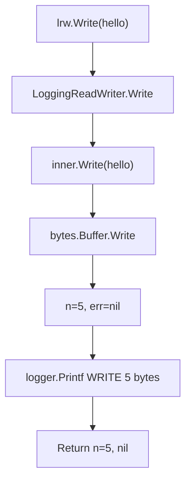
```mermaid
flowchart TD
    A["lrw.Write(hello)"] --> B["LoggingReadWriter.Write"]
    B --> C["inner.Write(hello)"]
    C --> D["bytes.Buffer.Write"]
    D --> E["n=5, err=nil"]
    E --> F["logger.Printf WRITE 5 bytes"]
    F --> G["Return n=5, nil"]
```

**Execution Trace:**
```
Input:  Write([]byte("hello"))
Step 1: delegate to bytes.Buffer.Write → n=5, err=nil
Step 2: log "[WRITE] 5 bytes"
Step 3: return 5, nil
Read:   delegate to bytes.Buffer.Read → "hello", n=5
        log "[READ] 5 bytes"
```

### Interviewer Questions

1. Why embed bytes.Buffer instead of storing it as a named field?
2. Can we add metrics collection alongside logging without changing the interface?
3. How does this scale when logging 1M writes/second?
4. Walk me through what happens when Read returns io.EOF.
5. How would you make LoggingReadWriter goroutine-safe?
6. What's the allocation cost of log.Printf on every call?
7. How would you test that logging doesn't corrupt data?

### Follow-Up Questions

**Q1:** How would you chain multiple decorators (logging + metrics + tracing)?
**A1:** Each decorator wraps the previous: `NewTracingRW(NewMetricsRW(NewLoggingRW(buf)))`. This is the classic decorator chain. Define middleware constructors that each accept a `ReadWriter` and return a `ReadWriter`.

**Q2:** How does embedding a named interface field differ from embedding a concrete type?
**A2:** Embedding a concrete type (`bytes.Buffer`) provides all exported methods directly. Embedding an interface (`io.ReadWriter`) makes the struct satisfy the interface but requires the field to be set — and any unset method will panic at runtime.

**Q3:** How would you implement this with zerolog for zero-allocation logging?
**A3:** Use `zerolog.Logger` and `logger.Debug().Int("bytes", n).Str("op", "write").Msg("")`. Zerolog avoids fmt.Sprintf allocations by writing directly to an io.Writer via JSON streaming.

**Q4:** Can LoggingReadWriter be used anywhere ReadWriter is expected?
**A4:** Yes — it satisfies the `ReadWriter` interface because it has both `Read` and `Write` methods with the correct signatures. This is structural typing in Go.

**Q5:** How would you test that logging fires on every write?
**A5:** Inject a `*bytes.Buffer` as the logger output. After each Write, assert the log buffer contains "[WRITE] N bytes". Use `strings.Contains(logBuf.String(), "[WRITE]")` in assertions.

---

## Q9: Linked List Using Struct  [Level 3 — Medium]

> **Tags:** `#linked-list` `#pointer-struct` `#data-structures`

### Problem Statement
Implement a singly linked list using a `Node` struct with `Value int` and `Next *Node`. Implement `Insert(head *Node, val int) *Node`, `Delete(head *Node, val int) *Node`, `Reverse(head *Node) *Node`, and `ToSlice(head *Node) []int`. All operations should work correctly on empty lists.

### Input / Output / Constraints

```
Input:  Insert nil → 1 → 2 → 3; Delete(2); Reverse
Output: ToSlice after insert: [1, 2, 3]
        ToSlice after delete 2: [1, 3]
        ToSlice after reverse:  [3, 1]

Constraints:
  • List length ≤ 10⁵
  • Values are arbitrary integers
  • No duplicate handling required
```

### Thought Process

Think like a senior Go engineer:
1. **Understand:** Linked list via pointer chaining; each operation traverses or rewires pointers.
2. **Pattern:** Sentinel/dummy head node simplifies insert/delete edge cases at head.
3. **Edge cases:** Nil head, deleting head node, deleting non-existent value, single-node list.
4. **Approach:** Dummy head for delete; iterative reverse (three-pointer technique).

### Brute Force Solution

```go
package main

// bruteForce — no dummy head, lots of nil checks
type Node struct{ Value int; Next *Node }

func bruteForceInsert(head *Node, val int) *Node {
    newNode := &Node{Value: val}
    if head == nil { return newNode }
    cur := head
    for cur.Next != nil { cur = cur.Next }
    cur.Next = newNode
    return head
}
```

**Time:** O(n) insert | **Space:** O(1)
**Bottleneck:** Repeated nil checks; delete head requires special case outside the loop.

### Better Solution

```go
// betterSolution — dummy head eliminates head-deletion special case
func betterDelete(head *Node, val int) *Node {
    dummy := &Node{Next: head}
    prev := dummy
    for prev.Next != nil {
        if prev.Next.Value == val {
            prev.Next = prev.Next.Next
            break
        }
        prev = prev.Next
    }
    return dummy.Next
}
```

**Time:** O(n) | **Space:** O(1)

### Best / Optimal Solution

```go
package main

import "fmt"

// Node is a singly linked list node.
type Node struct {
    Value int
    Next  *Node
}

// Insert appends val to the end of the list, O(n) time, O(1) space.
func Insert(head *Node, val int) *Node {
    newNode := &Node{Value: val}
    if head == nil {
        return newNode
    }
    cur := head
    for cur.Next != nil {
        cur = cur.Next
    }
    cur.Next = newNode
    return head
}

// Delete removes the first occurrence of val, O(n) time, O(1) space.
// Uses dummy head to simplify head deletion.
func Delete(head *Node, val int) *Node {
    dummy := &Node{Next: head}
    prev := dummy
    for prev.Next != nil {
        if prev.Next.Value == val {
            prev.Next = prev.Next.Next
            return dummy.Next
        }
        prev = prev.Next
    }
    return dummy.Next // val not found; list unchanged
}

// Reverse reverses the list in place, O(n) time, O(1) space.
// Uses three-pointer technique.
func Reverse(head *Node) *Node {
    var prev *Node
    cur := head
    for cur != nil {
        next := cur.Next
        cur.Next = prev
        prev = cur
        cur = next
    }
    return prev
}

// ToSlice converts list to []int for testing/display, O(n) time, O(n) space.
func ToSlice(head *Node) []int {
    var result []int
    for cur := head; cur != nil; cur = cur.Next {
        result = append(result, cur.Value)
    }
    return result
}

func main() {
    var head *Node
    for _, v := range []int{1, 2, 3} {
        head = Insert(head, v)
    }
    fmt.Println("After insert:", ToSlice(head))   // [1 2 3]

    head = Delete(head, 2)
    fmt.Println("After delete 2:", ToSlice(head)) // [1 3]

    head = Reverse(head)
    fmt.Println("After reverse:", ToSlice(head))  // [3 1]
}
```

**Time:** O(n) all operations | **Space:** O(1) except ToSlice O(n)

### Production Considerations

| Aspect | Details |
|--------|---------|
| **Scalability** | All ops O(n); use doubly-linked list for O(1) delete-by-pointer |
| **Edge Cases** | Nil head, delete from empty list, delete non-existent val |
| **Error Handling** | Delete silently no-ops if val not found; add bool return if needed |
| **Memory** | Each node heap-allocated; consider pool for high-churn lists |
| **Concurrency** | Not goroutine-safe; protect with sync.Mutex for shared access |

### Visual Explanation

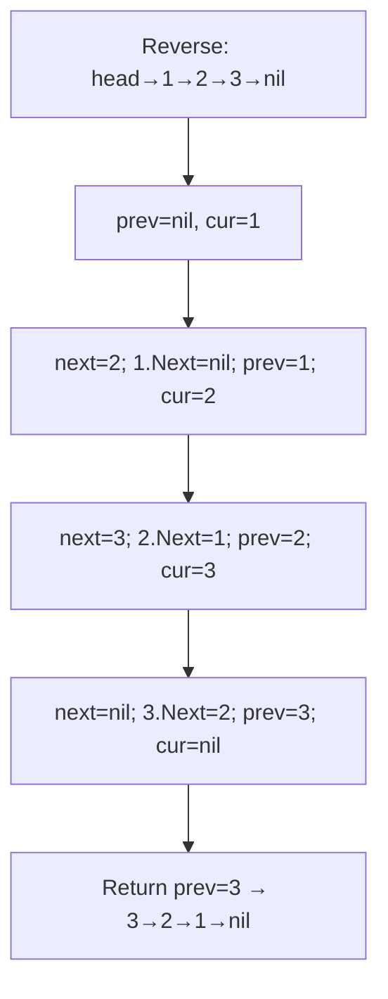
```mermaid
flowchart TD
    A["Reverse: head→1→2→3→nil"] --> B["prev=nil, cur=1"]
    B --> C["next=2; 1.Next=nil; prev=1; cur=2"]
    C --> D["next=3; 2.Next=1; prev=2; cur=3"]
    D --> E["next=nil; 3.Next=2; prev=3; cur=nil"]
    E --> F["Return prev=3 → 3→2→1→nil"]
```

**Execution Trace:**
```
Input:  1 → 2 → 3 → nil
Reverse:
  iter1: prev=nil, cur=1 → next=2, 1→nil, prev=1, cur=2
  iter2: prev=1,   cur=2 → next=3, 2→1,   prev=2, cur=3
  iter3: prev=2,   cur=3 → next=nil, 3→2, prev=3, cur=nil
Output: 3 → 2 → 1 → nil
```

### Interviewer Questions

1. Why use a dummy head node for Delete?
2. Can Reverse be done recursively? What are the trade-offs?
3. How does this scale for a list with 10M nodes?
4. Walk me through the edge case of deleting the only node.
5. How would you make this list goroutine-safe?
6. What's the GC pressure from individual node allocations?
7. How would you test Reverse is its own inverse?

### Follow-Up Questions

**Q1:** What is the recursive Reverse and why is it worse?
**A1:** Recursive reverse has O(n) call stack depth — risks stack overflow for large lists. Iterative is O(1) space. For n=100,000 nodes, recursive may overflow default goroutine stack despite growth, and is slower due to function call overhead.

**Q2:** How would you detect a cycle in the linked list?
**A2:** Floyd's algorithm: two pointers `slow` and `fast`. Move slow by 1, fast by 2. If they meet, there's a cycle. O(n) time, O(1) space.

**Q3:** How would you implement a concurrent-safe linked list?
**A3:** Use a `sync.Mutex` on a `LinkedList` wrapper struct. Lock for all reads and writes. For higher throughput, use `sync.RWMutex` (multiple readers) or a lock-free list with `sync/atomic` compare-and-swap.

**Q4:** How would you reduce GC pressure for a high-churn linked list?
**A4:** Use `sync.Pool` to reuse `*Node` objects. Get from pool before allocating, put back after removing. This reduces allocations and GC cycles in hot paths.

**Q5:** How would you find the middle node in one pass?
**A5:** Two pointers: `slow` and `fast`. Move slow by 1, fast by 2. When fast reaches end, slow is at the middle. O(n) time, O(1) space.

---

## Q10: Binary Tree Using Struct  [Level 3 — Medium]

> **Tags:** `#binary-tree` `#recursion` `#struct-pointer`

### Problem Statement
Implement a binary search tree using a `TreeNode` struct with `Val int`, `Left *TreeNode`, `Right *TreeNode`. Write `Insert(root *TreeNode, val int) *TreeNode`, `InOrder(root *TreeNode) []int`, `Search(root *TreeNode, val int) bool`, and `Height(root *TreeNode) int`.

### Input / Output / Constraints

```
Input:  Insert values: 5, 3, 7, 1, 4
Output: InOrder:  [1, 3, 4, 5, 7]
        Search(4): true
        Search(6): false
        Height:   3

Constraints:
  • Values are unique integers
  • n ≤ 10⁵ nodes
  • No self-balancing required
```

### Thought Process

Think like a senior Go engineer:
1. **Understand:** BST property: left < root < right. InOrder traversal yields sorted output.
2. **Pattern:** Recursive insertion and traversal; base case is nil pointer.
3. **Edge cases:** Empty tree (nil root), duplicate values (skip), single node.
4. **Approach:** Return new root from Insert to handle nil root; recursive traversal.

### Brute Force Solution

```go
package main

// bruteForce — iterative insert with explicit stack
type TreeNode struct{ Val int; Left, Right *TreeNode }

func bruteForceInsert(root *TreeNode, val int) *TreeNode {
    if root == nil { return &TreeNode{Val: val} }
    cur := root
    for {
        if val < cur.Val {
            if cur.Left == nil { cur.Left = &TreeNode{Val: val}; break }
            cur = cur.Left
        } else {
            if cur.Right == nil { cur.Right = &TreeNode{Val: val}; break }
            cur = cur.Right
        }
    }
    return root
}
```

**Time:** O(h) average, O(n) worst | **Space:** O(1)
**Bottleneck:** Iterative insert is fine but recursive is cleaner and easier to reason about.

### Better Solution

```go
// betterSolution — recursive insert
func betterInsert(root *TreeNode, val int) *TreeNode {
    if root == nil { return &TreeNode{Val: val} }
    if val < root.Val { root.Left = betterInsert(root.Left, val) } else
    if val > root.Val { root.Right = betterInsert(root.Right, val) }
    return root
}
```

**Time:** O(h) | **Space:** O(h) stack

### Best / Optimal Solution

```go
package main

import "fmt"

// TreeNode is a BST node.
type TreeNode struct {
    Val   int
    Left  *TreeNode
    Right *TreeNode
}

// Insert adds val to BST, returns new root. O(h) time, O(h) space.
func Insert(root *TreeNode, val int) *TreeNode {
    if root == nil {
        return &TreeNode{Val: val}
    }
    switch {
    case val < root.Val:
        root.Left = Insert(root.Left, val)
    case val > root.Val:
        root.Right = Insert(root.Right, val)
    // val == root.Val: duplicate, skip
    }
    return root
}

// InOrder returns sorted slice of values. O(n) time, O(n) space.
func InOrder(root *TreeNode) []int {
    if root == nil {
        return nil
    }
    result := InOrder(root.Left)
    result = append(result, root.Val)
    result = append(result, InOrder(root.Right)...)
    return result
}

// Search checks if val exists. O(h) time, O(h) space.
func Search(root *TreeNode, val int) bool {
    if root == nil {
        return false
    }
    switch {
    case val == root.Val:
        return true
    case val < root.Val:
        return Search(root.Left, val)
    default:
        return Search(root.Right, val)
    }
}

// Height returns the tree height. O(n) time, O(h) space.
func Height(root *TreeNode) int {
    if root == nil {
        return 0
    }
    lh := Height(root.Left)
    rh := Height(root.Right)
    if lh > rh {
        return lh + 1
    }
    return rh + 1
}

func main() {
    var root *TreeNode
    for _, v := range []int{5, 3, 7, 1, 4} {
        root = Insert(root, v)
    }
    fmt.Println("InOrder:", InOrder(root))    // [1 3 4 5 7]
    fmt.Println("Search 4:", Search(root, 4)) // true
    fmt.Println("Search 6:", Search(root, 6)) // false
    fmt.Println("Height:", Height(root))      // 3
}
```

**Time:** O(h) per operation, O(n) for InOrder | **Space:** O(h) recursion stack

### Production Considerations

| Aspect | Details |
|--------|---------|
| **Scalability** | Unbalanced tree degrades to O(n); use AVL or Red-Black for guaranteed O(log n) |
| **Edge Cases** | Nil root, duplicate insert (silently ignored), single node height=1 |
| **Error Handling** | Search returns bool; consider returning (*TreeNode, bool) for the node |
| **Memory** | Each node heap-allocated; O(n) total; InOrder allocates O(n) slice |
| **Concurrency** | Not goroutine-safe; use sync.RWMutex for concurrent reads |

### Visual Explanation

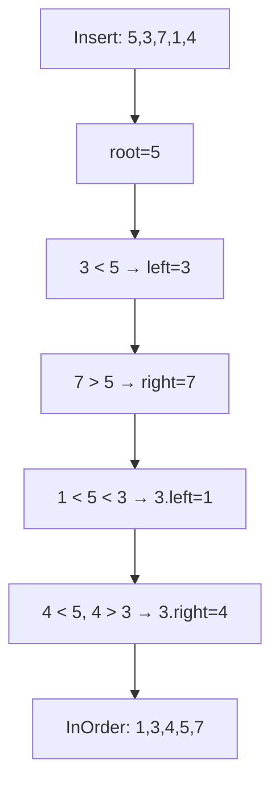
```mermaid
flowchart TD
    A["Insert: 5,3,7,1,4"] --> B["root=5"]
    B --> C["3 < 5 → left=3"]
    C --> D["7 > 5 → right=7"]
    D --> E["1 < 5 < 3 → 3.left=1"]
    E --> F["4 < 5, 4 > 3 → 3.right=4"]
    F --> G["InOrder: 1,3,4,5,7"]
```

**Execution Trace:**
```
Input:  [5,3,7,1,4]
Tree:       5
           / \
          3   7
         / \
        1   4
InOrder: left(3→1→4) + [5] + right(7) = [1,3,4,5,7]
Height:  max(height(3)=2, height(7)=1) + 1 = 3
```

### Interviewer Questions

1. Why does InOrder traversal produce sorted output on a BST?
2. Can we improve Height to iterative with a stack?
3. How does this scale when 10M elements are inserted in sorted order?
4. Walk me through the edge case of inserting a duplicate value.
5. How would you make the BST goroutine-safe for concurrent reads/writes?
6. What's the memory impact of recursive InOrder vs iterative?
7. How would you test that InOrder is always sorted?

### Follow-Up Questions

**Q1:** How would you convert this to an iterative InOrder traversal?
**A1:** Use an explicit stack (`[]*TreeNode`). Push left nodes until nil. Pop, append value, then push right subtree's left path. O(n) time, O(h) space — same as recursive but no call stack risk.

**Q2:** How would you serialize and deserialize the BST?
**A2:** Level-order serialization: use a queue, write each node value and nil markers. Deserialization: read values with BFS. This is the format LeetCode uses. O(n) time and space.

**Q3:** What self-balancing BST would you use in production?
**A3:** Go's `sort` package uses introsort. For a BST, use a skip list or B-tree for disk-based storage. In-memory: `github.com/google/btree` provides a B-tree with good cache performance. Red-Black trees are used in Linux kernel and Java TreeMap.

**Q4:** How would you find the kth smallest element efficiently?
**A4:** Augment each node with a subtree size field. `kth(root, k)`: if `root.Left.size + 1 == k` return root. If `k <= root.Left.size` recurse left, else recurse right with `k - root.Left.size - 1`. O(h) time.

**Q5:** How would you write a property-based test for the BST?
**A5:** Use `testing/quick` or `gopter`. Generate random int slices, insert all, assert InOrder returns sorted output, assert all inserted values are found by Search, assert no non-inserted values are found. Run 1000+ iterations.

---
## Q11: Copying Mutex Bug  [Level 3 — Medium]

> **Tags:** `#mutex` `#sync` `#gotcha` `#concurrency`

### Problem Statement
Demonstrate the mutex-copy bug: a struct `SafeCounter` embeds `sync.Mutex`. Show what happens when you copy the struct by value (the mutex's internal state is copied, breaking synchronization). Then fix it by always passing and storing `*SafeCounter` instead of `SafeCounter` by value.

### Input / Output / Constraints

```
Input:  SafeCounter with count; copied by value; both incremented concurrently
Output: WRONG: Both copies may deadlock or show data races
        FIXED: Pointer receiver, go vet catches the bug

Constraints:
  • Must demonstrate the bug and the fix
  • go vet -copylocks must detect the issue
  • Fix must be goroutine-safe
```

### Thought Process

Think like a senior Go engineer:
1. **Understand:** sync.Mutex must not be copied after first use; copying breaks the lock state.
2. **Pattern:** Always use pointer receivers for types containing sync.Mutex; pass pointers.
3. **Edge cases:** Copying in function arguments, returning by value, struct assignment.
4. **Approach:** Use `go vet -copylocks` to detect; refactor to pointer semantics throughout.

### Brute Force Solution

```go
package main

import "sync"

// bruteForce — BUGGY: copies the mutex
type SafeCounterBuggy struct {
    sync.Mutex
    count int
}

func (c SafeCounterBuggy) IncrementBug() { // value receiver copies Mutex!
    c.Lock()
    c.count++
    c.Unlock()
    // mutation lost AND mutex state corrupted
}
```

**Time:** O(1) | **Space:** O(1)
**Bottleneck:** Value receiver copies the mutex; `go vet` reports "passes lock by value".

### Better Solution

```go
// betterSolution — pointer receiver fixes the copy bug
type SafeCounter struct {
    mu    sync.Mutex
    count int
}

func (c *SafeCounter) Increment() {
    c.mu.Lock()
    defer c.mu.Unlock()
    c.count++
}
```

**Time:** O(1) | **Space:** O(1)

### Best / Optimal Solution

```go
package main

import (
    "fmt"
    "sync"
)

// SafeCounter is a goroutine-safe counter.
// IMPORTANT: must never be copied after first use.
// Use *SafeCounter everywhere.
type SafeCounter struct {
    mu    sync.Mutex // unexported: prevents accidental embedding copies
    count int
}

// NewSafeCounter returns a pointer — enforces pointer semantics.
func NewSafeCounter() *SafeCounter {
    return &SafeCounter{}
}

// Increment — pointer receiver, O(1) time, O(1) space.
// Uses pointer receiver to achieve mutex safety without copying.
func (c *SafeCounter) Increment() {
    c.mu.Lock()
    defer c.mu.Unlock()
    c.count++
}

// Value returns current count.
func (c *SafeCounter) Value() int {
    c.mu.Lock()
    defer c.mu.Unlock()
    return c.count
}

// BadCopy demonstrates the bug (do not use in production).
func BadCopy(c SafeCounter) { // go vet will flag this parameter
    c.Increment() // operates on a copy — original not modified, mutex state broken
}

func main() {
    c := NewSafeCounter()

    var wg sync.WaitGroup
    for i := 0; i < 1000; i++ {
        wg.Add(1)
        go func() {
            defer wg.Done()
            c.Increment()
        }()
    }
    wg.Wait()
    fmt.Println("Count:", c.Value()) // 1000
}
```

**Time:** O(1) per call | **Space:** O(1)

### Production Considerations

| Aspect | Details |
|--------|---------|
| **Scalability** | sync.Mutex is fine for low-medium contention; use sync.RWMutex for read-heavy |
| **Edge Cases** | Forgetting pointer receiver, returning by value, putting in a slice by value |
| **Error Handling** | go vet -copylocks detects copy bugs; add to CI |
| **Memory** | Mutex is 8 bytes; no extra allocation with pointer receiver |
| **Concurrency** | Always use pointer; never copy a struct containing sync.Mutex |

### Visual Explanation

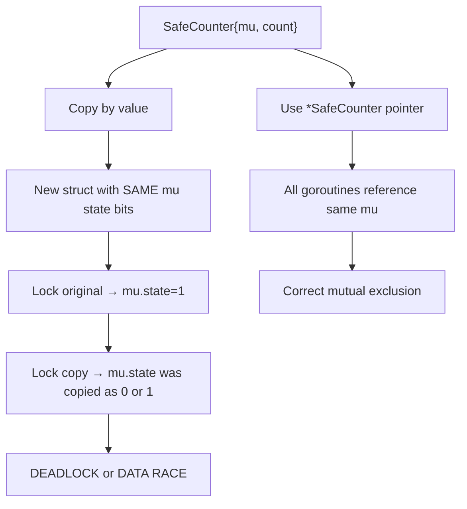
```mermaid
flowchart TD
    A["SafeCounter{mu, count}"] --> B["Copy by value"]
    B --> C["New struct with SAME mu state bits"]
    C --> D["Lock original → mu.state=1"]
    D --> E["Lock copy → mu.state was copied as 0 or 1"]
    E --> F["DEADLOCK or DATA RACE"]
    A --> G["Use *SafeCounter pointer"]
    G --> H["All goroutines reference same mu"]
    H --> I["Correct mutual exclusion"]
```

**Execution Trace:**
```
BUG:   c := SafeCounter{}; copy := c    // copy has mu.state=0
       goroutine1: copy.Lock() → ok (copy.mu.state=1)
       goroutine2: c.Lock() → ok (c.mu.state=1, different mu!)
       RACE: both goroutines in critical section

FIX:   c := &SafeCounter{}
       goroutine1: c.Lock() → c.mu.state=1
       goroutine2: c.Lock() → BLOCKS until goroutine1 unlocks
```

### Interviewer Questions

1. Why does copying a mutex break synchronization?
2. How does go vet detect mutex copy bugs?
3. How does this scale under 10K concurrent goroutines?
4. Walk me through the edge case of a mutex copy inside a struct assignment.
5. When would you use sync.RWMutex instead of sync.Mutex?
6. What's the performance difference between Mutex and RWMutex under read-heavy workload?
7. How would you write a race-condition test with go test -race?

### Follow-Up Questions

**Q1:** How does `go vet -copylocks` work internally?
**A1:** It uses the `copylock` analyzer from `golang.org/x/tools/go/analysis`. It traverses the AST and reports when a type containing sync.Locker (Mutex, RWMutex, etc.) is copied via assignment, function argument, or range loop variable.

**Q2:** What is the noCopy pattern for go vet?
**A2:** Add a field `_ noCopy` where `noCopy` is `type noCopy struct{}; func (*noCopy) Lock() {}; func (*noCopy) Unlock() {}`. This makes `go vet` flag any copy of the outer struct even without a real mutex.

**Q3:** When should you use sync.RWMutex over sync.Mutex?
**A3:** When reads vastly outnumber writes (e.g., config cache, read-heavy cache). RWMutex allows concurrent readers with `RLock()/RUnlock()` and exclusive writer with `Lock()/Unlock()`. Under high write contention, RWMutex can be slower than Mutex due to bookkeeping.

**Q4:** Can you embed a sync.Mutex in a struct that is part of a slice?
**A4:** Technically yes, but the slice element must be accessed via pointer: `&slice[i]`. Never copy elements out: `elem := slice[i]; elem.Lock()` would copy the mutex. Use `slice[i].Lock()` or store `[]*SafeCounter`.

**Q5:** How would you test for race conditions in the counter?
**A5:** Run `go test -race`. Write a test that spawns 100 goroutines, each incrementing 1000 times, then asserts final count == 100000. The race detector will catch unsynchronized access.

---

## Q12: Overriding Promoted Methods  [Level 4 — Advanced]

> **Tags:** `#method-override` `#embedding` `#polymorphism` `#interface`

### Problem Statement
Build a notification system with a `BaseNotifier` struct implementing `Send(msg string) error` and `Log(msg string)`. Embed it in `EmailNotifier` and `SMSNotifier`. Each subtype must override `Send` with channel-specific logic. Define a `Notifier` interface and write a `NotifyAll(notifiers []Notifier, msg string) []error` function. Handle partial failures gracefully.

### Input / Output / Constraints

```
Input:  notifiers=[EmailNotifier{to:"a@b.com"}, SMSNotifier{phone:"+1234"}]
        msg="Server is down"
Output: [LOG] Sending via email to a@b.com: Server is down
        [LOG] Sending via SMS to +1234: Server is down
        errors: [] (or partial list if some fail)

Constraints:
  • NotifyAll must attempt all notifiers even if some fail
  • Collect all errors; do not short-circuit
  • n ≤ 1000 notifiers
```

### Thought Process

Think like a senior Go engineer:
1. **Understand:** Override promoted Send by defining Send on the outer struct; base Log method is reused.
2. **Pattern:** Interface polymorphism + embedding; collect errors (multierror pattern).
3. **Edge cases:** Nil notifier in slice, Send returning error for some, all failing.
4. **Approach:** Define Notifier interface; each type satisfies it; collect errors with `errors.Join`.

### Brute Force Solution

```go
package main

import "fmt"

// bruteForce — type switch instead of interface
func bruteForce(notifiers []interface{}, msg string) {
    for _, n := range notifiers {
        switch v := n.(type) {
        case *EmailNotifier:
            fmt.Println("email:", v.To, msg)
        case *SMSNotifier:
            fmt.Println("sms:", v.Phone, msg)
        }
    }
}
// Problem: not extensible; adding new notifier type requires changing this function
```

**Time:** O(n) | **Space:** O(1)
**Bottleneck:** Type switch breaks open/closed principle; new notifier types require modifying NotifyAll.

### Better Solution

```go
// betterSolution — interface with short-circuit on first error
type Notifier interface { Send(msg string) error }

func betterNotifyAll(notifiers []Notifier, msg string) error {
    for _, n := range notifiers {
        if err := n.Send(msg); err != nil {
            return err // stops on first failure
        }
    }
    return nil
}
```

**Time:** O(n) | **Space:** O(1)

### Best / Optimal Solution

```go
package main

import (
    "errors"
    "fmt"
    "log"
)

// Notifier can send a notification message.
type Notifier interface {
    Send(msg string) error
}

// BaseNotifier provides shared logging logic.
type BaseNotifier struct {
    logger *log.Logger
}

func NewBaseNotifier() BaseNotifier {
    return BaseNotifier{logger: log.Default()}
}

// Log is a promoted method reused by all embedding types.
func (b *BaseNotifier) Log(msg string) {
    b.logger.Printf("[LOG] %s", msg)
}

// EmailNotifier sends notifications via email.
type EmailNotifier struct {
    BaseNotifier
    To string
}

// Send overrides BaseNotifier — uses Email-specific logic.
func (e *EmailNotifier) Send(msg string) error {
    if e.To == "" {
        return errors.New("email: recipient address is empty")
    }
    e.Log(fmt.Sprintf("Sending via email to %s: %s", e.To, msg))
    // real implementation would call SMTP here
    return nil
}

// SMSNotifier sends notifications via SMS.
type SMSNotifier struct {
    BaseNotifier
    Phone string
}

// Send overrides BaseNotifier — uses SMS-specific logic.
func (s *SMSNotifier) Send(msg string) error {
    if s.Phone == "" {
        return errors.New("sms: phone number is empty")
    }
    s.Log(fmt.Sprintf("Sending via SMS to %s: %s", s.Phone, msg))
    return nil
}

// NotifyAll — production-ready, O(n) time, O(n) space for errors.
// Attempts all notifiers; collects errors without short-circuiting.
func NotifyAll(notifiers []Notifier, msg string) error {
    var errs []error
    for _, n := range notifiers {
        if n == nil {
            errs = append(errs, errors.New("nil notifier in list"))
            continue
        }
        if err := n.Send(msg); err != nil {
            errs = append(errs, err)
        }
    }
    return errors.Join(errs...)
}

func main() {
    notifiers := []Notifier{
        &EmailNotifier{BaseNotifier: NewBaseNotifier(), To: "alice@example.com"},
        &SMSNotifier{BaseNotifier: NewBaseNotifier(), Phone: "+14155550101"},
        &EmailNotifier{BaseNotifier: NewBaseNotifier(), To: ""}, // will fail
    }

    if err := NotifyAll(notifiers, "Server is down"); err != nil {
        fmt.Printf("Some notifications failed:\n%v\n", err)
    }
}
```

**Time:** O(n) | **Space:** O(k) where k = number of errors

### Production Considerations

| Aspect | Details |
|--------|---------|
| **Scalability** | Fan-out to 1000 notifiers; parallelize with goroutines + errgroup for speed |
| **Edge Cases** | Nil notifier, empty recipient, network timeouts per notifier |
| **Error Handling** | errors.Join collects all failures; caller sees complete error picture |
| **Memory** | O(k) error slice where k is failure count; bounded by notifier count |
| **Concurrency** | NotifyAll is sequential; use errgroup.Group for parallel sends |

### Visual Explanation

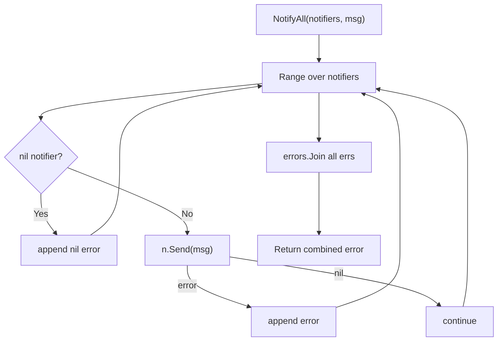
```mermaid
flowchart TD
    A["NotifyAll(notifiers, msg)"] --> B["Range over notifiers"]
    B --> C{"nil notifier?"}
    C -->|"Yes"| D["append nil error"]
    C -->|"No"| E["n.Send(msg)"]
    E -->|"error"| F["append error"]
    E -->|"nil"| G["continue"]
    D --> B
    F --> B
    G --> B
    B --> H["errors.Join all errs"]
    H --> I["Return combined error"]
```

**Execution Trace:**
```
Input:  [EmailNotifier{to:alice}, SMSNotifier{phone:+1}, EmailNotifier{to:""}]
Step 1: alice → Send ok → log
Step 2: +1 → Send ok → log
Step 3: "" → Send error "recipient empty" → collected
Output: errors.Join → "email: recipient address is empty"
```

### Interviewer Questions

1. Why collect all errors instead of returning on first failure?
2. Can we send to all notifiers concurrently? What changes?
3. How does this scale to 10K notifiers with 100ms timeout each?
4. Walk me through what happens when BaseNotifier.Log panics.
5. How would you add retry logic per notifier?
6. What's the memory impact of the errors slice for 1000 failed notifiers?
7. How would you test NotifyAll with a mix of successes and failures?

### Follow-Up Questions

**Q1:** How would you make NotifyAll concurrent with a timeout?
**A1:** Use `errgroup.WithContext(ctx)`. For each notifier, `g.Go(func() error { return n.Send(msg) })`. Set a deadline on ctx. This parallelizes sends; errgroup collects the first error or you can use `sync.Mutex` to collect all.

**Q2:** How would you add retry logic with exponential backoff?
**A2:** Wrap Send in a retry loop: attempt up to 3 times with `time.Sleep(backoff); backoff *= 2`. Use `context.Context` to respect overall timeout. Libraries like `github.com/avast/retry-go` provide this.

**Q3:** How does `errors.Join` differ from `fmt.Errorf` with multiple errors?
**A3:** `errors.Join` (Go 1.20+) creates a multi-error that wraps all errors. `errors.Is` and `errors.As` unwrap through it. `fmt.Errorf` creates a single error string — you cannot inspect individual errors.

**Q4:** What is the open/closed principle and how does this design satisfy it?
**A4:** Open for extension, closed for modification. New notifier types (PushNotifier, SlackNotifier) can be added without changing NotifyAll. The Notifier interface is the extension point.

**Q5:** How would you mock EmailNotifier for unit testing NotifyAll?
**A5:** Define a `MockNotifier` struct with a `SendFunc func(string) error` field. Implement `Send` to call `SendFunc`. In tests, inject mock instances with controlled error behaviors.

---

## Q13: Struct-Based Stack with Generics  [Level 4 — Advanced]

> **Tags:** `#generics` `#stack` `#data-structures` `#type-parameters`

### Problem Statement
Implement a generic `Stack[T]` struct using a slice as the underlying storage. Implement `Push(val T)`, `Pop() (T, bool)`, `Peek() (T, bool)`, `Len() int`, and `IsEmpty() bool`. The stack must be type-safe at compile time. Demonstrate with both `int` and `string` stacks.

### Input / Output / Constraints

```
Input:  Stack[int]: Push 1,2,3; Pop twice
Output: Pop → 3, true
        Pop → 2, true
        Peek → 1, true
        Len → 1

Constraints:
  • Generic over any type T
  • Pop/Peek on empty stack returns zero value and false
  • Not goroutine-safe (document this)
  • n ≤ 10⁶ elements
```

### Thought Process

Think like a senior Go engineer:
1. **Understand:** Generic stack avoids interface{} boxing; compile-time type safety.
2. **Pattern:** Type-parameterized struct with slice backing; LIFO semantics.
3. **Edge cases:** Pop from empty stack (return zero value + false), Peek without removal.
4. **Approach:** Use `var zero T` for zero value; slice append/reslice for push/pop.

### Brute Force Solution

```go
package main

// bruteForce — interface{} based, no type safety
type StackBrute struct{ items []interface{} }

func (s *StackBrute) Push(v interface{}) { s.items = append(s.items, v) }
func (s *StackBrute) Pop() interface{} {
    if len(s.items) == 0 { return nil }
    top := s.items[len(s.items)-1]
    s.items = s.items[:len(s.items)-1]
    return top
}
// Problem: requires type assertion on every Pop; runtime panics if wrong type
```

**Time:** O(1) amortized | **Space:** O(n)
**Bottleneck:** No compile-time type safety; type assertions add runtime overhead and risk.

### Better Solution

```go
// betterSolution — generics, Go 1.18+
type Stack[T any] struct{ items []T }

func (s *Stack[T]) Push(v T) { s.items = append(s.items, v) }
func (s *Stack[T]) Pop() (T, bool) {
    var zero T
    if len(s.items) == 0 { return zero, false }
    top := s.items[len(s.items)-1]
    s.items = s.items[:len(s.items)-1]
    return top, true
}
```

**Time:** O(1) amortized | **Space:** O(n)

### Best / Optimal Solution

```go
package main

import "fmt"

// Stack is a generic LIFO data structure.
// Not goroutine-safe; wrap with sync.Mutex for concurrent use.
type Stack[T any] struct {
    items []T
}

// NewStack returns an initialized Stack with optional pre-allocated capacity.
func NewStack[T any](capacity int) *Stack[T] {
    return &Stack[T]{items: make([]T, 0, capacity)}
}

// Push adds val to the top. Amortized O(1) time, O(1) space.
func (s *Stack[T]) Push(val T) {
    s.items = append(s.items, val)
}

// Pop removes and returns the top element.
// Returns (zero, false) if empty. O(1) time.
func (s *Stack[T]) Pop() (T, bool) {
    var zero T
    if len(s.items) == 0 {
        return zero, false
    }
    top := s.items[len(s.items)-1]
    s.items[len(s.items)-1] = zero // clear reference for GC
    s.items = s.items[:len(s.items)-1]
    return top, true
}

// Peek returns the top element without removing it. O(1) time.
func (s *Stack[T]) Peek() (T, bool) {
    var zero T
    if len(s.items) == 0 {
        return zero, false
    }
    return s.items[len(s.items)-1], true
}

// Len returns the number of elements. O(1) time.
func (s *Stack[T]) Len() int { return len(s.items) }

// IsEmpty reports whether the stack has no elements.
func (s *Stack[T]) IsEmpty() bool { return len(s.items) == 0 }

func main() {
    // Integer stack
    is := NewStack[int](4)
    is.Push(1); is.Push(2); is.Push(3)

    if v, ok := is.Pop(); ok {
        fmt.Println("Pop:", v) // 3
    }
    if v, ok := is.Peek(); ok {
        fmt.Println("Peek:", v) // 2
    }
    fmt.Println("Len:", is.Len()) // 2

    // String stack
    ss := NewStack[string](4)
    ss.Push("hello"); ss.Push("world")
    v, _ := ss.Pop()
    fmt.Println("String Pop:", v) // world
}
```

**Time:** O(1) amortized for Push/Pop/Peek | **Space:** O(n)

### Production Considerations

| Aspect | Details |
|--------|---------|
| **Scalability** | Slice doubles capacity on grow — amortized O(1); set capacity upfront to avoid re-allocations |
| **Edge Cases** | Pop/Peek on empty returns zero value + false; never panics |
| **Error Handling** | Boolean ok pattern; no error return needed for stack semantics |
| **Memory** | Zeroing popped element prevents GC leaks for pointer types |
| **Concurrency** | Not goroutine-safe; embed sync.Mutex and use pointer receiver for thread safety |

### Visual Explanation

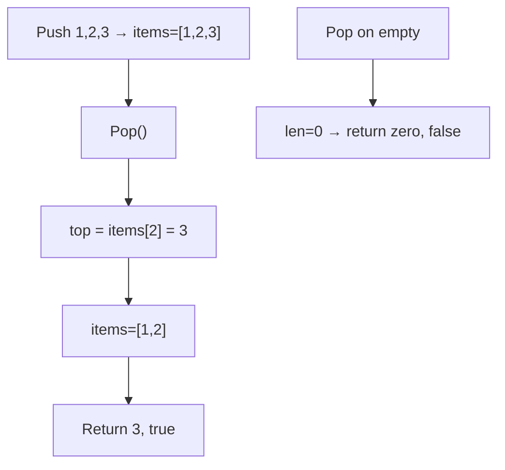
```mermaid
flowchart TD
    A["Push 1,2,3 → items=[1,2,3]"] --> B["Pop()"]
    B --> C["top = items[2] = 3"]
    C --> D["items=[1,2]"]
    D --> E["Return 3, true"]
    F["Pop on empty"] --> G["len=0 → return zero, false"]
```

**Execution Trace:**
```
Push(1): items=[1]
Push(2): items=[1,2]
Push(3): items=[1,2,3]
Pop():   top=3, items=[1,2] → return 3, true
Peek():  top=2, items=[1,2] → return 2, true (no remove)
Len():   2
```

### Interviewer Questions

1. Why zero out the popped element before reslicing?
2. Can we make Stack implement sort.Interface?
3. How does this scale to 10M pushes with pointer types?
4. Walk me through the edge case of popping from an empty Stack[*Node].
5. How would you make Stack goroutine-safe?
6. What's the GC impact of storing pointer types without zeroing?
7. How would you implement a min-stack that also returns the minimum in O(1)?

### Follow-Up Questions

**Q1:** Why zero `s.items[len-1]` before reslicing?
**A1:** Without zeroing, the slice's backing array still holds a reference to the popped element. For pointer or interface types, this prevents GC collection — a memory leak. Zeroing to the zero value releases the reference.

**Q2:** How would you implement a goroutine-safe Stack?
**A2:** Add `mu sync.Mutex` field. Each method: `s.mu.Lock(); defer s.mu.Unlock(); ...`. Use `sync.RWMutex` and `RLock` for Peek/Len if read-heavy. Return `*Stack[T]` from constructor to prevent copying the mutex.

**Q3:** How would you implement a min-stack in O(1) for min queries?
**A3:** Use two stacks: `main` and `minStack`. On Push(v): push v to main, push `min(v, minStack.Peek())` to minStack. On Pop: pop from both. Min() returns minStack.Peek(). All operations O(1).

**Q4:** What constraint would you add if T must be ordered (for a priority queue)?
**A4:** Use `[T constraints.Ordered]` from `golang.org/x/exp/constraints` or define `type Ordered interface { ~int | ~float64 | ~string }`. This allows `<` and `>` operations on T.

**Q5:** How would you serialize a Stack[int] to JSON?
**A5:** Implement `MarshalJSON` on `*Stack[int]`: return `json.Marshal(s.items)`. For Unmarshal, implement `UnmarshalJSON` to populate `s.items` from the JSON array. Generics don't affect marshaling — the underlying slice is concrete.

---

## Q14: Concurrent-Safe Config Store  [Level 4 — Advanced]

> **Tags:** `#sync-rwmutex` `#struct` `#concurrency` `#config`

### Problem Statement
Build a `ConfigStore` struct that stores string key-value pairs and supports concurrent reads and writes. Implement `Set(key, value string)`, `Get(key string) (string, bool)`, `Delete(key string)`, and `Snapshot() map[string]string`. Snapshot must return a consistent copy. Optimize for read-heavy workloads.

### Input / Output / Constraints

```
Input:  1000 goroutines reading, 10 goroutines writing concurrently
Output: No data race detected (go test -race passes)
        Snapshot returns point-in-time consistent copy

Constraints:
  • Read:write ratio ~100:1
  • Keys are strings, up to 10K entries
  • Snapshot must not hold the lock while caller processes the copy
```

### Thought Process

Think like a senior Go engineer:
1. **Understand:** sync.RWMutex allows multiple concurrent readers, exclusive writer — ideal for read-heavy config.
2. **Pattern:** RWMutex guard all map operations; Snapshot copies under read lock then returns.
3. **Edge cases:** Get on missing key, Delete on missing key, concurrent Snapshot + Set.
4. **Approach:** Use map[string]string + RWMutex; Snapshot deep-copies under RLock.

### Brute Force Solution

```go
package main

import "sync"

// bruteForce — sync.Mutex (allows only one reader at a time)
type ConfigBrute struct {
    mu   sync.Mutex
    data map[string]string
}

func (c *ConfigBrute) Get(key string) (string, bool) {
    c.mu.Lock()         // exclusive lock blocks all other reads
    defer c.mu.Unlock()
    v, ok := c.data[key]
    return v, ok
}
```

**Time:** O(1) | **Space:** O(n)
**Bottleneck:** Mutex serializes all reads — poor throughput under 100:1 read/write ratio.

### Better Solution

```go
// betterSolution — RWMutex for concurrent reads
type ConfigBetter struct {
    mu   sync.RWMutex
    data map[string]string
}

func (c *ConfigBetter) Get(key string) (string, bool) {
    c.mu.RLock()
    defer c.mu.RUnlock()
    v, ok := c.data[key]
    return v, ok
}
```

**Time:** O(1) | **Space:** O(n)

### Best / Optimal Solution

```go
package main

import (
    "fmt"
    "sync"
)

// ConfigStore is a concurrent-safe key-value store optimized for read-heavy workloads.
// Must be used via pointer; do not copy.
type ConfigStore struct {
    _    noCopy
    mu   sync.RWMutex
    data map[string]string
}

// noCopy prevents copying via go vet.
type noCopy struct{}
func (*noCopy) Lock()   {}
func (*noCopy) Unlock() {}

// NewConfigStore returns an initialized ConfigStore.
func NewConfigStore() *ConfigStore {
    return &ConfigStore{data: make(map[string]string)}
}

// Set writes a key-value pair. O(1) time, exclusive write lock.
func (c *ConfigStore) Set(key, value string) {
    c.mu.Lock()
    defer c.mu.Unlock()
    c.data[key] = value
}

// Get reads a value by key. O(1) time, concurrent read lock.
func (c *ConfigStore) Get(key string) (string, bool) {
    c.mu.RLock()
    defer c.mu.RUnlock()
    v, ok := c.data[key]
    return v, ok
}

// Delete removes a key. O(1) time, exclusive write lock.
func (c *ConfigStore) Delete(key string) {
    c.mu.Lock()
    defer c.mu.Unlock()
    delete(c.data, key)
}

// Snapshot returns a consistent deep copy. O(n) time, read lock held only during copy.
func (c *ConfigStore) Snapshot() map[string]string {
    c.mu.RLock()
    defer c.mu.RUnlock()
    snap := make(map[string]string, len(c.data))
    for k, v := range c.data {
        snap[k] = v
    }
    return snap
}

func main() {
    cs := NewConfigStore()
    var wg sync.WaitGroup

    // Writers
    for i := 0; i < 10; i++ {
        wg.Add(1)
        go func(i int) {
            defer wg.Done()
            cs.Set(fmt.Sprintf("key%d", i), fmt.Sprintf("val%d", i))
        }(i)
    }

    // Readers
    for i := 0; i < 100; i++ {
        wg.Add(1)
        go func(i int) {
            defer wg.Done()
            cs.Get(fmt.Sprintf("key%d", i%10))
        }(i)
    }

    wg.Wait()
    snap := cs.Snapshot()
    fmt.Printf("Snapshot has %d entries\n", len(snap))
}
```

**Time:** O(1) Get/Set/Delete, O(n) Snapshot | **Space:** O(n)

### Production Considerations

| Aspect | Details |
|--------|---------|
| **Scalability** | sync.Map outperforms RWMutex when keys are stable and reads dominate |
| **Edge Cases** | Get missing key returns "", false; Delete missing key is no-op |
| **Error Handling** | No errors; use (value, bool) idiom for Get |
| **Memory** | Snapshot allocates O(n) map — avoid in hot path |
| **Concurrency** | RWMutex allows N concurrent readers, 1 exclusive writer |

### Visual Explanation

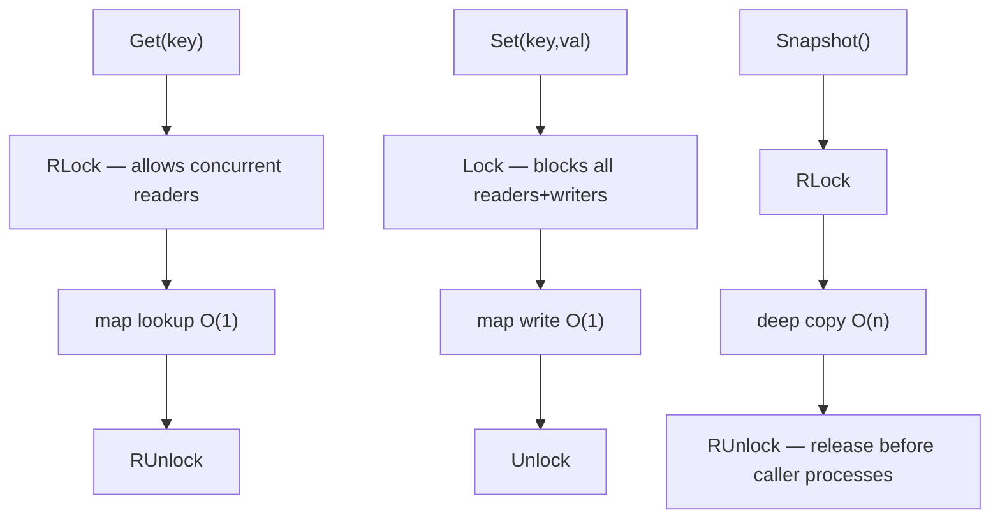
```mermaid
flowchart TD
    A["Get(key)"] --> B["RLock — allows concurrent readers"]
    B --> C["map lookup O(1)"]
    C --> D["RUnlock"]
    E["Set(key,val)"] --> F["Lock — blocks all readers+writers"]
    F --> G["map write O(1)"]
    G --> H["Unlock"]
    I["Snapshot()"] --> J["RLock"]
    J --> K["deep copy O(n)"]
    K --> L["RUnlock — release before caller processes"]
```

**Execution Trace:**
```
t=0: goroutines G1..G100 call Get → all acquire RLock concurrently
t=1: writer calls Set("x","y") → waits for all RLocks to release
t=2: all readers done → writer gets Lock → writes
t=3: writer Unlocks → readers can proceed
```

### Interviewer Questions

1. When would you use sync.Map over RWMutex + map?
2. Can we reduce lock contention further for Snapshot?
3. How does this scale to 10K concurrent readers and 100 writers?
4. Walk me through the edge case where Snapshot is called during a batch Set.
5. How would you add TTL (time-to-live) expiry to keys?
6. What's the memory overhead of sync.RWMutex vs sync.Mutex?
7. How would you test for data races using go test -race?

### Follow-Up Questions

**Q1:** When does sync.Map outperform RWMutex + map?
**A1:** sync.Map excels when: (1) keys are written once then read many times, or (2) goroutines write to disjoint key sets. It uses internal sharding and atomic operations to avoid global locking. For write-heavy or small key sets, RWMutex map is faster.

**Q2:** How would you add TTL expiry to ConfigStore?
**A2:** Store `type entry struct { value string; expiresAt time.Time }`. In Get, check if `time.Now().After(e.expiresAt)` and return "", false if expired. Run a cleanup goroutine that holds a write lock and deletes expired keys periodically.

**Q3:** How would you implement a watch/subscribe mechanism for config changes?
**A3:** Add a `subscribers []chan string` slice. On Set, after writing, notify all subscribers: `for _, ch := range c.subscribers { select { case ch <- key: default: } }`. Use `default` to avoid blocking writers on slow consumers.

**Q4:** How would you shard the ConfigStore to reduce contention?
**A4:** Use 16 or 32 shards: `type ShardedStore [32]ConfigStore`. Hash the key to pick a shard: `shard := fnv32(key) % 32`. Each shard has its own RWMutex — reduces contention by 32x under uniform key distribution.

**Q5:** How would you benchmark RWMutex vs sync.Map for this workload?
**A5:** Write two benchmarks with 100:1 goroutine ratio (readers:writers). Use `b.RunParallel` for readers and a separate `b.N`-loop for writers. Compare `ns/op` and `allocs/op`. Run with `-benchtime=5s` for stable results.

---
## Q15: LRU Cache Using Struct  [Level 4 — Advanced]

> **Tags:** `#lru-cache` `#linked-list` `#hashmap` `#struct`

### Problem Statement
Implement an LRU (Least Recently Used) cache using two structs: a doubly linked list `lruNode` and an `LRUCache` that embeds a `capacity int`, a `map[int]*lruNode`, and a sentinel doubly-linked list. Implement `Get(key int) (int, bool)` and `Put(key, value int)`. Both must be O(1).

### Input / Output / Constraints

```
Input:  LRUCache(capacity=2); Put(1,1); Put(2,2); Get(1)→1; Put(3,3); Get(2)→-1 (evicted)
Output: Get(1) = 1, found
        Get(2) = -1, not found (evicted as LRU)
        Get(3) = 3, found

Constraints:
  • capacity ≥ 1
  • keys and values are integers
  • O(1) Get and Put required
  • n ≤ 10⁵ operations
```

### Thought Process

Think like a senior Go engineer:
1. **Understand:** O(1) Get = hashmap; O(1) eviction order = doubly linked list; combine both.
2. **Pattern:** HashMap + Doubly-Linked List — the classic LRU implementation.
3. **Edge cases:** Capacity=1, Put existing key (update without eviction), Get non-existent.
4. **Approach:** Sentinel head/tail nodes eliminate nil checks; map stores node pointers.

### Brute Force Solution

```go
package main

// bruteForce — slice scan, O(n) per operation
type LRUBrute struct {
    cap   int
    order []int
    data  map[int]int
}

func (l *LRUBrute) Get(key int) int {
    v, ok := l.data[key]
    if !ok { return -1 }
    // move to end of order slice — O(n) scan
    for i, k := range l.order {
        if k == key { l.order = append(l.order[:i], l.order[i+1:]...); break }
    }
    l.order = append(l.order, key)
    return v
}
```

**Time:** O(n) | **Space:** O(n)
**Bottleneck:** Linear scan of order slice makes Get/Put O(n) — unacceptable for large caches.

### Better Solution

```go
// betterSolution — hashmap + DLL skeleton (no sentinel, more nil checks)
type lruNode struct{ key, val int; prev, next *lruNode }
type LRUCache struct {
    cap  int
    data map[int]*lruNode
    head, tail *lruNode
}
```

**Time:** O(1) | **Space:** O(n)

### Best / Optimal Solution

```go
package main

import "fmt"

type lruNode struct {
    key, val   int
    prev, next *lruNode
}

// LRUCache is an O(1) get/put LRU cache backed by hashmap + doubly linked list.
type LRUCache struct {
    cap        int
    data       map[int]*lruNode
    head, tail *lruNode // sentinel nodes; never hold real data
}

// NewLRUCache returns an initialized LRU cache.
func NewLRUCache(capacity int) *LRUCache {
    head := &lruNode{}
    tail := &lruNode{}
    head.next = tail
    tail.prev = head
    return &LRUCache{
        cap:  capacity,
        data: make(map[int]*lruNode, capacity),
        head: head,
        tail: tail,
    }
}

func (c *LRUCache) remove(n *lruNode) {
    n.prev.next = n.next
    n.next.prev = n.prev
}

func (c *LRUCache) insertFront(n *lruNode) {
    n.next = c.head.next
    n.prev = c.head
    c.head.next.prev = n
    c.head.next = n
}

// Get — O(1) time. Returns value and true, or 0 and false.
func (c *LRUCache) Get(key int) (int, bool) {
    n, ok := c.data[key]
    if !ok {
        return 0, false
    }
    c.remove(n)
    c.insertFront(n)
    return n.val, true
}

// Put — O(1) time. Evicts LRU entry when at capacity.
func (c *LRUCache) Put(key, value int) {
    if n, ok := c.data[key]; ok {
        n.val = value
        c.remove(n)
        c.insertFront(n)
        return
    }
    if len(c.data) == c.cap {
        // evict LRU (just before tail sentinel)
        lru := c.tail.prev
        c.remove(lru)
        delete(c.data, lru.key)
    }
    n := &lruNode{key: key, val: value}
    c.insertFront(n)
    c.data[key] = n
}

func main() {
    cache := NewLRUCache(2)
    cache.Put(1, 1)
    cache.Put(2, 2)
    if v, ok := cache.Get(1); ok { fmt.Println("Get(1):", v) } // 1
    cache.Put(3, 3)                                             // evicts key 2
    if _, ok := cache.Get(2); !ok { fmt.Println("Get(2): not found") }
    if v, ok := cache.Get(3); ok { fmt.Println("Get(3):", v) } // 3
}
```

**Time:** O(1) Get and Put | **Space:** O(capacity)

### Production Considerations

| Aspect | Details |
|--------|---------|
| **Scalability** | O(1) per operation; capacity bounds memory; use sharded caches at high load |
| **Edge Cases** | capacity=1, Put existing key (update not evict), Get non-existent key |
| **Error Handling** | Get returns (0, false) for missing key; no panics |
| **Memory** | Each entry = lruNode struct (4 pointers + 2 ints) + map entry |
| **Concurrency** | Not goroutine-safe; add sync.Mutex for concurrent use |

### Visual Explanation

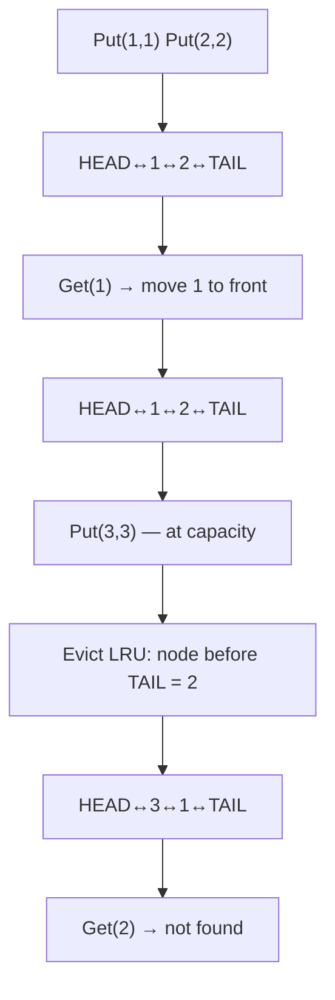
```mermaid
flowchart TD
    A["Put(1,1) Put(2,2)"] --> B["HEAD↔1↔2↔TAIL"]
    B --> C["Get(1) → move 1 to front"]
    C --> D["HEAD↔1↔2↔TAIL"]
    D --> E["Put(3,3) — at capacity"]
    E --> F["Evict LRU: node before TAIL = 2"]
    F --> G["HEAD↔3↔1↔TAIL"]
    G --> H["Get(2) → not found"]
```

**Execution Trace:**
```
Put(1,1): HEAD↔[1]↔TAIL
Put(2,2): HEAD↔[2]↔[1]↔TAIL (2 is MRU)
Get(1):   move 1 to front → HEAD↔[1]↔[2]↔TAIL
Put(3,3): evict LRU=2 → HEAD↔[3]↔[1]↔TAIL
Get(2):   not in map → (0, false)
```

### Interviewer Questions

1. Why use sentinel head/tail nodes instead of nil checks?
2. Can we replace the doubly linked list with a different data structure?
3. How does this scale to a 10M entry cache with concurrent access?
4. Walk me through the edge case of Put when capacity is 1.
5. How would you add TTL expiry to cache entries?
6. What's the memory per entry and total for a 1M-entry cache?
7. How would you test eviction order with 5 sequential operations?

### Follow-Up Questions

**Q1:** How would you make LRUCache goroutine-safe?
**A1:** Add `mu sync.Mutex` and lock at the start of Get and Put. For higher throughput, use sharded LRU: array of 256 independent LRU caches, keyed by `hash(key) % 256`. Reduces contention by 256x.

**Q2:** How would you add TTL to each cache entry?
**A2:** Add `expiresAt time.Time` to `lruNode`. In Get, check expiry before returning. Run a background goroutine that scans the list periodically (from tail backward) to evict expired nodes. Or use lazy expiry: evict only on Get.

**Q3:** What is the memory footprint of a 1M-entry LRU?
**A3:** Each `lruNode` is ~64 bytes (4 pointers × 8 bytes + 2 ints × 8 bytes + alignment). Map entry overhead ~128 bytes. Total: ~192 bytes × 1M = ~192MB. Plus the map's hash table overhead.

**Q4:** How would you implement LRU with generics for both key and value types?
**A4:** `type LRUCache[K comparable, V any] struct { ... }`. The node becomes `lruNode[K, V]` with `key K; val V`. Go 1.18+ supports this. The map becomes `map[K]*lruNode[K, V]`.

**Q5:** How would you test LRUCache to ensure eviction order is correct?
**A5:** Table-driven tests: sequence of Put/Get operations with expected Get results. Include cases: evict LRU after capacity, update existing key doesn't evict, Get promotes to MRU. Run with `-race` to catch concurrent issues.

---

## Q16: Graph Representation Using Structs  [Level 4 — Advanced]

> **Tags:** `#graph` `#adjacency-list` `#struct` `#bfs-dfs`

### Problem Statement
Implement a directed graph using an `Edge` struct (From, To int, Weight float64) and a `Graph` struct with an adjacency list. Implement `AddVertex`, `AddEdge`, `BFS(start int) []int`, and `HasCycle() bool`. Use struct-based design throughout.

### Input / Output / Constraints

```
Input:  Vertices: 0,1,2,3; Edges: 0→1, 0→2, 1→3, 2→3
Output: BFS from 0: [0, 1, 2, 3]
        HasCycle: false

Input2: Add edge 3→0
Output: HasCycle: true

Constraints:
  • V ≤ 10⁴ vertices, E ≤ 10⁵ edges
  • Directed graph
  • No self-loops for cycle detection simplicity
```

### Thought Process

Think like a senior Go engineer:
1. **Understand:** Adjacency list is space-efficient for sparse graphs; BFS uses a queue; cycle detection uses DFS with visit states.
2. **Pattern:** Graph as map[int][]Edge; BFS with visited set; DFS with three-color marking.
3. **Edge cases:** Disconnected graph, vertex with no edges, self-loop.
4. **Approach:** Three-color DFS (white/gray/black) for cycle detection in directed graph.

### Brute Force Solution

```go
package main

// bruteForce — adjacency matrix O(V²) space
type GraphBrute struct {
    adj [][]bool
}
// Problem: O(V²) space — wasteful for sparse graphs with 10K vertices
```

**Time:** O(V+E) BFS | **Space:** O(V²)
**Bottleneck:** Adjacency matrix uses O(V²) space — impractical for sparse graphs.

### Better Solution

```go
// betterSolution — adjacency list O(V+E) space
type Edge struct{ To int; Weight float64 }
type Graph struct{ adj map[int][]Edge }

func (g *Graph) BFS(start int) []int {
    visited := map[int]bool{start: true}
    queue := []int{start}
    var order []int
    for len(queue) > 0 {
        v := queue[0]; queue = queue[1:]
        order = append(order, v)
        for _, e := range g.adj[v] {
            if !visited[e.To] { visited[e.To] = true; queue = append(queue, e.To) }
        }
    }
    return order
}
```

**Time:** O(V+E) | **Space:** O(V+E)

### Best / Optimal Solution

```go
package main

import "fmt"

// Edge represents a directed weighted edge.
type Edge struct {
    From, To int
    Weight   float64
}

// Graph is a directed graph using an adjacency list.
type Graph struct {
    vertices map[int]struct{}
    adj      map[int][]Edge
}

// NewGraph returns an initialized empty Graph.
func NewGraph() *Graph {
    return &Graph{
        vertices: make(map[int]struct{}),
        adj:      make(map[int][]Edge),
    }
}

// AddVertex registers a vertex. Idempotent.
func (g *Graph) AddVertex(v int) {
    g.vertices[v] = struct{}{}
    if _, ok := g.adj[v]; !ok {
        g.adj[v] = nil
    }
}

// AddEdge adds a directed edge from→to. O(1) time.
func (g *Graph) AddEdge(from, to int, weight float64) {
    g.AddVertex(from)
    g.AddVertex(to)
    g.adj[from] = append(g.adj[from], Edge{From: from, To: to, Weight: weight})
}

// BFS returns vertices in BFS order from start. O(V+E) time.
func (g *Graph) BFS(start int) []int {
    visited := make(map[int]bool)
    queue := []int{start}
    visited[start] = true
    var order []int

    for len(queue) > 0 {
        v := queue[0]
        queue = queue[1:]
        order = append(order, v)
        for _, e := range g.adj[v] {
            if !visited[e.To] {
                visited[e.To] = true
                queue = append(queue, e.To)
            }
        }
    }
    return order
}

// HasCycle detects cycle using DFS three-color algorithm. O(V+E) time.
func (g *Graph) HasCycle() bool {
    const (
        white = 0 // unvisited
        gray  = 1 // in current DFS path
        black = 2 // fully processed
    )
    color := make(map[int]int)

    var dfs func(v int) bool
    dfs = func(v int) bool {
        color[v] = gray
        for _, e := range g.adj[v] {
            if color[e.To] == gray { return true }  // back edge = cycle
            if color[e.To] == white && dfs(e.To) { return true }
        }
        color[v] = black
        return false
    }

    for v := range g.vertices {
        if color[v] == white {
            if dfs(v) { return true }
        }
    }
    return false
}

func main() {
    g := NewGraph()
    for _, v := range []int{0, 1, 2, 3} { g.AddVertex(v) }
    g.AddEdge(0, 1, 1.0)
    g.AddEdge(0, 2, 1.0)
    g.AddEdge(1, 3, 1.0)
    g.AddEdge(2, 3, 1.0)

    fmt.Println("BFS from 0:", g.BFS(0))   // [0 1 2 3]
    fmt.Println("HasCycle:", g.HasCycle())  // false

    g.AddEdge(3, 0, 1.0)
    fmt.Println("HasCycle after 3→0:", g.HasCycle()) // true
}
```

**Time:** O(V+E) | **Space:** O(V+E)

### Production Considerations

| Aspect | Details |
|--------|---------|
| **Scalability** | O(V+E) adjacency list handles sparse graphs with 10K+ vertices |
| **Edge Cases** | Disconnected graph (BFS only reachable from start), self-loops (gray→gray = cycle) |
| **Error Handling** | BFS on non-existent start returns empty; AddEdge creates missing vertices |
| **Memory** | O(V+E) adjacency list; each Edge is ~24 bytes |
| **Concurrency** | Not goroutine-safe; use sync.RWMutex for concurrent read/write |

### Visual Explanation

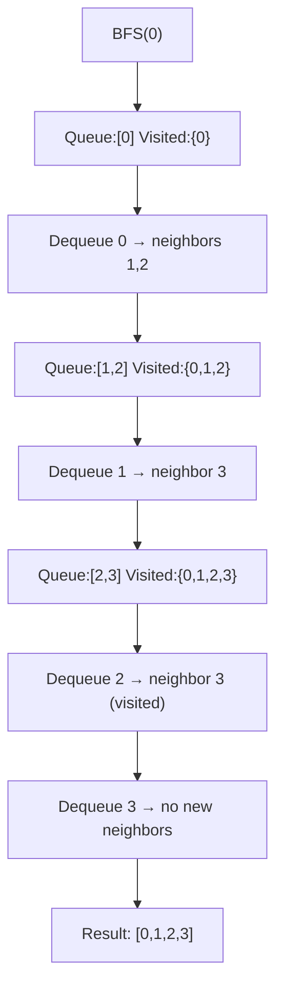
```mermaid
flowchart TD
    A["BFS(0)"] --> B["Queue:[0] Visited:{0}"]
    B --> C["Dequeue 0 → neighbors 1,2"]
    C --> D["Queue:[1,2] Visited:{0,1,2}"]
    D --> E["Dequeue 1 → neighbor 3"]
    E --> F["Queue:[2,3] Visited:{0,1,2,3}"]
    F --> G["Dequeue 2 → neighbor 3 (visited)"]
    G --> H["Dequeue 3 → no new neighbors"]
    H --> I["Result: [0,1,2,3]"]
```

**Execution Trace:**
```
Cycle DFS after adding 3→0:
  dfs(0): color=gray
    dfs(1): color=gray
      dfs(3): color=gray
        edge 3→0: color[0]=gray → CYCLE DETECTED
```

### Interviewer Questions

1. Why three-color DFS instead of simple visited boolean for cycle detection?
2. Can BFS detect cycles? How?
3. How does this scale for a social graph with 10M vertices?
4. Walk me through the edge case of a disconnected graph in HasCycle.
5. How would you make this goroutine-safe for concurrent graph mutations?
6. What's the space complexity difference between adjacency list and matrix?
7. How would you find the shortest path between two vertices?

### Follow-Up Questions

**Q1:** Why does a simple visited boolean fail for cycle detection in directed graphs?
**A1:** A visited node in an undirected DFS doesn't mean a cycle — it might be reachable via another path. In directed graphs, a back edge (to a gray/in-progress ancestor) indicates a cycle. Two-state (visited/not) conflates back edges with cross edges.

**Q2:** How would you find shortest paths with Dijkstra using this Graph struct?
**A2:** Add a min-heap (priority queue) `container/heap` storing `(cost, vertex)` pairs. Relax edges when cheaper path found. O((V+E) log V) time. Requires non-negative weights.

**Q3:** How would you serialize this Graph to JSON?
**A3:** Export fields: `Vertices []int` and `Edges []Edge`. Implement `MarshalJSON` on Graph to build these slices from internal maps. Deserialize by re-adding each vertex and edge.

**Q4:** How would you implement topological sort on this graph?
**A4:** Post-order DFS: after fully processing a vertex (coloring black), prepend it to a result slice. Result is topological order. Only valid if HasCycle() returns false. O(V+E) time.

**Q5:** How would you test BFS comprehensively?
**A5:** Cases: single vertex, two vertices no edge, linear chain, complete graph, disconnected graph (BFS from one component shouldn't visit other), graph with back edges. Assert exact order matches expected BFS level-order traversal.

---

## Q17: FAANG — Design an In-Memory Event Store  [Level 5 — Interview Level]

> **Tags:** `#event-sourcing` `#struct` `#timestamp` `#interview` `#google`

### Problem Statement
Design an `EventStore` that stores events as structs `{ID int, Type string, Payload []byte, Timestamp time.Time}`. Support `Append(event Event) error`, `Query(eventType string, from, to time.Time) []Event`, and `Latest(n int) []Event`. All queries must be O(log n) or better. The store must be goroutine-safe.

### Input / Output / Constraints

```
Input:  Append 1M events; Query("purchase", last 1 hour)
Output: Filtered events sorted by timestamp ascending

Constraints:
  • 1M+ events in store
  • Query range: arbitrary [from, to] time window
  • O(log n) query via binary search on sorted timestamps
  • Goroutine-safe
  • Event IDs are monotonically increasing
```

### Thought Process

Think like a senior Go engineer:
1. **Understand:** Events are append-only and timestamp-ordered. Binary search enables O(log n) range queries.
2. **Pattern:** Sorted slice + binary search for range; type index (map[string][]int of indices) for type filter.
3. **Edge cases:** Empty store, no events match query, from > to, n > total events for Latest.
4. **Approach:** Maintain sorted-by-time slice; type index for O(log k) type queries; RWMutex for safety.

### Brute Force Solution

```go
package main

import "time"

type Event struct{ ID int; Type string; Payload []byte; Timestamp time.Time }

// bruteForce — linear scan O(n) per query
type EventStoreBrute struct{ events []Event }

func (es *EventStoreBrute) Query(typ string, from, to time.Time) []Event {
    var result []Event
    for _, e := range es.events { // O(n) scan
        if e.Type == typ && !e.Timestamp.Before(from) && !e.Timestamp.After(to) {
            result = append(result, e)
        }
    }
    return result
}
```

**Time:** O(n) per query | **Space:** O(n)
**Bottleneck:** Full scan for every query — unacceptable at 1M+ events.

### Better Solution

```go
// betterSolution — binary search on timestamp-sorted events
import "sort"

func lowerBound(events []Event, t time.Time) int {
    return sort.Search(len(events), func(i int) bool {
        return !events[i].Timestamp.Before(t)
    })
}
```

**Time:** O(log n + k) where k = result size | **Space:** O(k)

### Best / Optimal Solution

```go
package main

import (
    "errors"
    "fmt"
    "sort"
    "sync"
    "time"
)

// Event represents an immutable domain event.
type Event struct {
    ID        int
    Type      string
    Payload   []byte
    Timestamp time.Time
}

// EventStore is a concurrent-safe, append-only event store.
// Events are stored sorted by Timestamp. Type index enables fast type-filtered queries.
type EventStore struct {
    mu        sync.RWMutex
    events    []Event          // sorted by Timestamp
    typeIndex map[string][]int // type → sorted slice of event indices
    nextID    int
}

// NewEventStore returns an initialized EventStore.
func NewEventStore() *EventStore {
    return &EventStore{
        typeIndex: make(map[string][]int),
        nextID:    1,
    }
}

// Append adds an event. O(log n) amortized (binary search for insert position).
func (es *EventStore) Append(e Event) error {
    if e.Type == "" {
        return errors.New("event type must not be empty")
    }
    es.mu.Lock()
    defer es.mu.Unlock()

    e.ID = es.nextID
    es.nextID++
    if e.Timestamp.IsZero() {
        e.Timestamp = time.Now()
    }

    // Binary search for insert position (maintain sorted order)
    pos := sort.Search(len(es.events), func(i int) bool {
        return es.events[i].Timestamp.After(e.Timestamp)
    })
    es.events = append(es.events, Event{})
    copy(es.events[pos+1:], es.events[pos:])
    es.events[pos] = e

    es.typeIndex[e.Type] = append(es.typeIndex[e.Type], e.ID)
    return nil
}

// Query returns events of given type within [from, to]. O(log n + k).
func (es *EventStore) Query(eventType string, from, to time.Time) ([]Event, error) {
    if from.After(to) {
        return nil, fmt.Errorf("from %v must not be after to %v", from, to)
    }
    es.mu.RLock()
    defer es.mu.RUnlock()

    lo := sort.Search(len(es.events), func(i int) bool {
        return !es.events[i].Timestamp.Before(from)
    })
    hi := sort.Search(len(es.events), func(i int) bool {
        return es.events[i].Timestamp.After(to)
    })

    var result []Event
    for _, e := range es.events[lo:hi] {
        if e.Type == eventType {
            result = append(result, e)
        }
    }
    return result, nil
}

// Latest returns the n most recent events. O(1) time.
func (es *EventStore) Latest(n int) []Event {
    es.mu.RLock()
    defer es.mu.RUnlock()
    if n <= 0 || len(es.events) == 0 {
        return nil
    }
    if n > len(es.events) {
        n = len(es.events)
    }
    result := make([]Event, n)
    copy(result, es.events[len(es.events)-n:])
    return result
}

func main() {
    store := NewEventStore()

    base := time.Now()
    types := []string{"purchase", "view", "purchase", "cart", "purchase"}
    for i, typ := range types {
        _ = store.Append(Event{
            Type:      typ,
            Payload:   []byte(fmt.Sprintf("data-%d", i)),
            Timestamp: base.Add(time.Duration(i) * time.Second),
        })
    }

    results, err := store.Query("purchase", base, base.Add(10*time.Second))
    if err != nil {
        fmt.Println("error:", err)
        return
    }
    fmt.Printf("purchase events: %d\n", len(results)) // 3

    latest := store.Latest(2)
    fmt.Printf("latest 2: %v %v\n", latest[0].Type, latest[1].Type)
}
```

**Time:** O(log n + k) Query, O(1) Latest | **Space:** O(n) store, O(k) query result

### Production Considerations

| Aspect | Details |
|--------|---------|
| **Scalability** | Beyond 10M events: shard by time bucket (hourly segments); use LSM-tree storage |
| **Edge Cases** | Events with same timestamp (stable sort), from==to (point query), n=0 for Latest |
| **Error Handling** | Validate event type; validate from<=to; return errors not panics |
| **Memory** | Each Event ~100 bytes; 1M events ≈ 100MB; use mmap or disk for larger stores |
| **Concurrency** | RWMutex allows concurrent Query; Append serializes writers |

### Visual Explanation

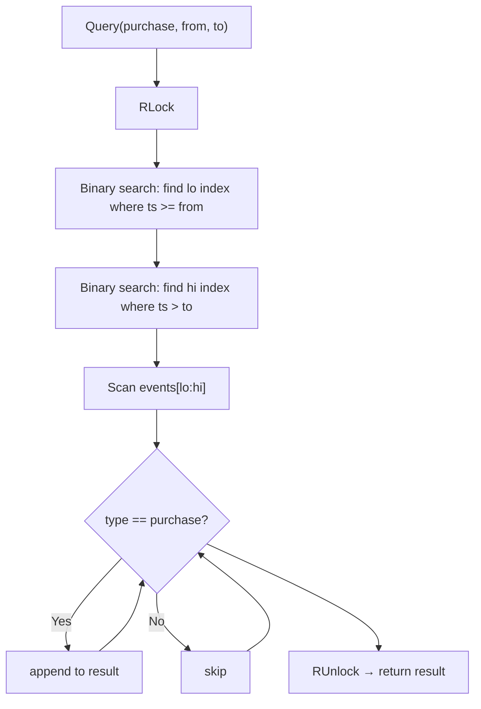
```mermaid
flowchart TD
    A["Query(purchase, from, to)"] --> B["RLock"]
    B --> C["Binary search: find lo index where ts >= from"]
    C --> D["Binary search: find hi index where ts > to"]
    D --> E["Scan events[lo:hi]"]
    E --> F{"type == purchase?"}
    F -->|"Yes"| G["append to result"]
    F -->|"No"| H["skip"]
    G --> F
    H --> F
    F --> I["RUnlock → return result"]
```

**Execution Trace:**
```
Events sorted: [t0:purchase, t1:view, t2:purchase, t3:cart, t4:purchase]
Query("purchase", t0, t4):
  lo=0 (first ts >= t0), hi=5 (first ts > t4)
  scan [0..4]: pick indices 0, 2, 4 (type=purchase)
  return 3 events
```

### Interviewer Questions

1. Why binary search over a sorted slice instead of a time-indexed B-tree?
2. Can we improve Query to avoid the linear type filter in the range?
3. How does this scale to 100M events with 1TB of event data?
4. Walk me through the edge case of two events with identical timestamps.
5. How would you make Append goroutine-safe without blocking Query?
6. What's the memory layout and GC impact of storing []byte Payload?
7. How would you test Query correctness with 10K randomized events?

### Follow-Up Questions

**Q1:** How would you extend this to persist events to disk?
**A1:** Write events as append-only log: each event serialized to fixed-size or length-prefixed binary. On startup, replay the log to rebuild in-memory state. Use mmap for fast read access. This is the WAL (write-ahead log) pattern used in databases.

**Q2:** How would you support subscriptions for real-time event delivery?
**A2:** On Append, after writing, notify registered subscribers via channels: `for _, ch := range es.subscribers[e.Type] { select { case ch <- e: default: } }`. Use `default` to avoid blocking Append on slow consumers.

**Q3:** How would you handle out-of-order events (late arrivals)?
**A3:** Binary search insertion already handles this — insert at correct position. But subscribers may have already seen later events. Add a `SequenceNumber` to events and let consumers handle gaps. This is the "late data" problem in stream processing.

**Q4:** What would you change to support billions of events?
**A4:** Partition by time bucket (hourly/daily files). Each bucket is an independent sorted slice on disk. Query spans buckets. Use S3 + parquet for cold storage, in-memory for hot window. This is columnar time-series architecture (InfluxDB, ClickHouse).

**Q5:** How would you write a benchmark for 1M appends?
**A5:** `BenchmarkAppend: for i := 0; i < b.N; i++ { store.Append(Event{Type:"x", Timestamp:time.Now()}) }`. Run with `-benchtime=1000000x`. Profile with `go test -cpuprofile` to identify contention points.

---

## Q18: FAANG — Implement a Thread-Safe Object Pool  [Level 5 — Interview Level]

> **Tags:** `#sync-pool` `#object-pool` `#struct` `#performance` `#interview`

### Problem Statement
Implement a generic `ObjectPool[T]` struct that reuses expensive objects (e.g., database connections, byte buffers). Support `Get() *T`, `Put(obj *T)`, and a factory function for creating new objects. Compare your implementation to `sync.Pool` and explain when to use each.

### Input / Output / Constraints

```
Input:  pool := NewObjectPool(func() *bytes.Buffer { return bytes.NewBuffer(make([]byte, 0, 4096)) })
        buf := pool.Get()   // get from pool or create new
        pool.Put(buf)       // return to pool
Output: Reduced allocations in hot path
        No GC between Get and Put of same object

Constraints:
  • Pool size bounded by maxSize
  • Get blocks if pool empty and at maxSize
  • Put resets object state before returning to pool
  • Goroutine-safe
```

### Thought Process

Think like a senior Go engineer:
1. **Understand:** Object pools reuse expensive objects; sync.Pool is GC-eligible (objects may be collected); bounded pool guarantees availability.
2. **Pattern:** Channel-based bounded pool; factory function for new objects; reset on Put.
3. **Edge cases:** Get when pool empty (create new or block), Put when pool full (discard), maxSize=0.
4. **Approach:** Buffered channel of size maxSize; factory for misses; sync.Pool for unbounded GC-managed reuse.

### Brute Force Solution

```go
package main

import "sync"

// bruteForce — mutex + slice, no bound
type PoolBrute[T any] struct {
    mu      sync.Mutex
    objects []*T
    factory func() *T
}

func (p *PoolBrute[T]) Get() *T {
    p.mu.Lock()
    defer p.mu.Unlock()
    if len(p.objects) == 0 { return p.factory() }
    obj := p.objects[len(p.objects)-1]
    p.objects = p.objects[:len(p.objects)-1]
    return obj
}
```

**Time:** O(1) | **Space:** O(n)
**Bottleneck:** Unbounded; under high load pool grows without limit; no GC integration.

### Better Solution

```go
// betterSolution — channel-based bounded pool
type ObjectPool[T any] struct {
    pool    chan *T
    factory func() *T
}

func NewObjectPool[T any](maxSize int, factory func() *T) *ObjectPool[T] {
    return &ObjectPool[T]{pool: make(chan *T, maxSize), factory: factory}
}
```

**Time:** O(1) | **Space:** O(maxSize)

### Best / Optimal Solution

```go
package main

import (
    "bytes"
    "fmt"
    "sync"
    "sync/atomic"
)

// ObjectPool is a bounded, goroutine-safe object pool.
// Objects are reused to reduce GC pressure.
// NOT equivalent to sync.Pool: objects are not GC-collected between uses.
type ObjectPool[T any] struct {
    pool    chan *T
    factory func() *T
    hits    atomic.Int64 // objects reused from pool
    misses  atomic.Int64 // objects created via factory
}

// NewObjectPool creates a bounded pool with the given max size and factory.
func NewObjectPool[T any](maxSize int, factory func() *T) (*ObjectPool[T], error) {
    if maxSize <= 0 {
        return nil, fmt.Errorf("maxSize must be positive, got %d", maxSize)
    }
    if factory == nil {
        return nil, fmt.Errorf("factory must not be nil")
    }
    return &ObjectPool[T]{
        pool:    make(chan *T, maxSize),
        factory: factory,
    }, nil
}

// Get returns a pooled object or creates a new one if pool is empty.
// Never blocks. O(1) time.
func (p *ObjectPool[T]) Get() *T {
    select {
    case obj := <-p.pool:
        p.hits.Add(1)
        return obj
    default:
        p.misses.Add(1)
        return p.factory()
    }
}

// Put returns an object to the pool. Discards if pool is full. O(1) time.
func (p *ObjectPool[T]) Put(obj *T) {
    if obj == nil {
        return
    }
    select {
    case p.pool <- obj:
    default:
        // pool full; let GC collect obj
    }
}

// Stats returns hit/miss counts for monitoring.
func (p *ObjectPool[T]) Stats() (hits, misses int64) {
    return p.hits.Load(), p.misses.Load()
}

func main() {
    pool, err := NewObjectPool(10, func() *bytes.Buffer {
        return bytes.NewBuffer(make([]byte, 0, 4096))
    })
    if err != nil {
        fmt.Printf("error: %v\n", err)
        return
    }

    var wg sync.WaitGroup
    for i := 0; i < 100; i++ {
        wg.Add(1)
        go func() {
            defer wg.Done()
            buf := pool.Get()
            buf.WriteString("hello world")
            buf.Reset() // reset before returning
            pool.Put(buf)
        }()
    }
    wg.Wait()

    hits, misses := pool.Stats()
    fmt.Printf("Pool stats — hits: %d, misses: %d\n", hits, misses)
}
```

**Time:** O(1) Get/Put | **Space:** O(maxSize)

### Production Considerations

| Aspect | Details |
|--------|---------|
| **Scalability** | Channel-based pool scales well; increase maxSize under load |
| **Edge Cases** | Put nil (ignored), Get when factory returns nil (caller must handle), full pool (discard) |
| **Error Handling** | NewObjectPool validates inputs; factory errors surface at Get time |
| **Memory** | maxSize objects always in memory; trade memory for allocation reduction |
| **Concurrency** | Fully goroutine-safe via channel operations; atomic stats add no lock overhead |

### Visual Explanation

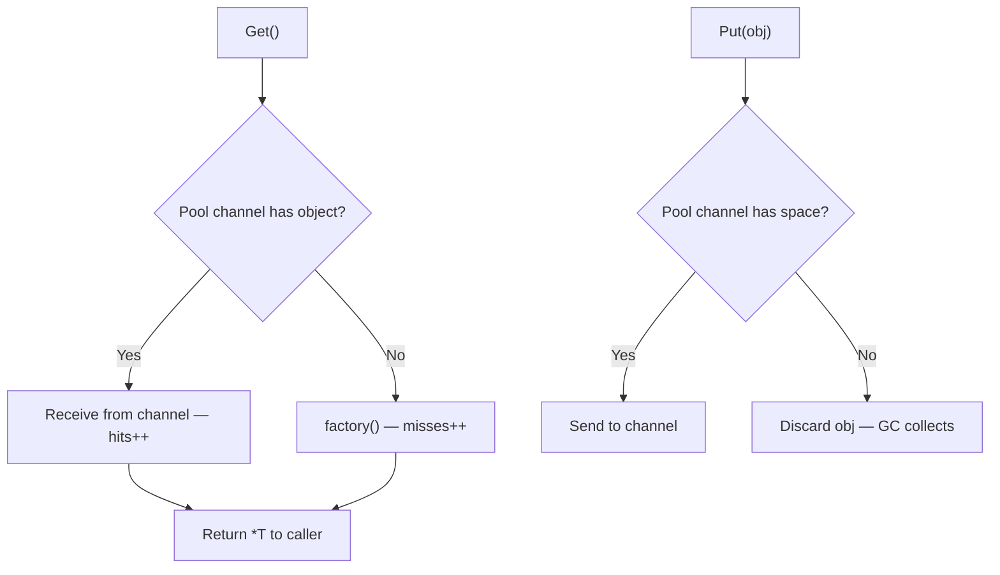
```mermaid
flowchart TD
    A["Get()"] --> B{"Pool channel has object?"}
    B -->|"Yes"| C["Receive from channel — hits++"]
    B -->|"No"| D["factory() — misses++"]
    C --> E["Return *T to caller"]
    D --> E
    F["Put(obj)"] --> G{"Pool channel has space?"}
    G -->|"Yes"| H["Send to channel"]
    G -->|"No"| I["Discard obj — GC collects"]
```

**Execution Trace:**
```
Pool(maxSize=2), factory=newBuffer
Get(): pool empty → factory() → misses=1
Get(): pool empty → factory() → misses=2
Put(buf1): pool not full → channel ← buf1
Get(): pool has buf1 → receive → hits=1
Put(buf1): pool has space → channel ← buf1
Put(buf2): pool full → discard buf2
```

### Interviewer Questions

1. When would you use sync.Pool vs this bounded ObjectPool?
2. Can we make Get block until an object is available?
3. How does this scale to 10K concurrent goroutines?
4. Walk me through the edge case of a factory that panics.
5. How would you add health checks for pooled database connections?
6. What's the memory overhead of a 100-object pool of 4KB buffers?
7. How would you test that pool objects are actually reused?

### Follow-Up Questions

**Q1:** When should you use sync.Pool instead of a bounded pool?
**A1:** Use `sync.Pool` for short-lived, GC-eligible objects (e.g., temporary byte buffers during request handling). The GC can reclaim sync.Pool objects between GC cycles — no memory guarantee. Use bounded ObjectPool for precious resources (DB connections, file handles) where you must control the count.

**Q2:** How would you make Get block until an object is available?
**A2:** Remove the `select default` branch: `return <-p.pool`. This blocks forever if pool is empty and no one Puts. Better: `select { case obj := <-p.pool: return obj, nil; case <-ctx.Done(): return nil, ctx.Err() }` — respect context cancellation.

**Q3:** How would you add health checking for pooled DB connections?
**A3:** On Get, call `conn.Ping()`. If it fails, create a new connection with factory instead of returning the stale one. Track connection age; replace connections older than MaxLifetime. This is what `database/sql` does internally.

**Q4:** What is the difference in GC behavior between sync.Pool and channel pool?
**A4:** sync.Pool objects can be collected by GC at any time (between GC cycles). Channel pool holds hard references — objects are never collected until explicitly discarded via the `default` Put path. Under memory pressure, channel pool can cause OOM; sync.Pool self-regulates.

**Q5:** How would you benchmark pool effectiveness?
**A5:** Compare allocations: `BenchmarkWithPool` vs `BenchmarkWithoutPool` using `b.ReportAllocs()`. A good pool reduces allocs/op to near 0 for the pooled object. Also measure latency: `ns/op` should drop significantly when pool hit rate is high.

---

## Q19: FAANG — Rate Limiter Using Token Bucket  [Level 5 — Interview Level]

> **Tags:** `#rate-limiter` `#token-bucket` `#struct` `#concurrency` `#uber`

### Problem Statement
Implement a `TokenBucketLimiter` struct with fields `capacity int`, `tokens float64`, `refillRate float64` (tokens/sec), and `lastRefill time.Time`. Implement `Allow() bool` (non-blocking) and `Wait(ctx context.Context) error` (blocking until token available or context cancelled). Must be goroutine-safe.

### Input / Output / Constraints

```
Input:  limiter := NewLimiter(capacity=10, refillRate=5.0)
        10 concurrent requests at t=0
Output: First 10 requests: Allow() → true
        Next requests before refill: Allow() → false
        After 200ms (1 token refilled): Allow() → true

Constraints:
  • Tokens refill continuously (not in batches)
  • capacity ≤ 10⁶
  • refillRate > 0
  • Wait must respect context cancellation
```

### Thought Process

Think like a senior Go engineer:
1. **Understand:** Token bucket: tokens accumulate up to capacity at refillRate; each request consumes 1 token.
2. **Pattern:** Lazy refill — compute elapsed time on each Allow call; no background goroutine needed.
3. **Edge cases:** Burst at capacity, zero tokens, ctx already cancelled, refill overflow.
4. **Approach:** Lazy refill with `time.Since(lastRefill) * refillRate`; mutex for atomicity; channel for Wait.

### Brute Force Solution

```go
package main

import "time"

// bruteForce — fixed window counter (not true token bucket)
type RateLimiterBrute struct {
    limit    int
    count    int
    windowEnd time.Time
}

func (r *RateLimiterBrute) Allow() bool {
    if time.Now().After(r.windowEnd) {
        r.count = 0
        r.windowEnd = time.Now().Add(time.Second)
    }
    if r.count >= r.limit { return false }
    r.count++
    return true
}
// Problem: allows burst at window boundary (2x limit); not smooth
```

**Time:** O(1) | **Space:** O(1)
**Bottleneck:** Fixed window allows double-rate bursts at window boundaries.

### Better Solution

```go
// betterSolution — token bucket with lazy refill
type TokenBucket struct {
    mu         sync.Mutex
    capacity   float64
    tokens     float64
    refillRate float64
    lastRefill time.Time
}

func (tb *TokenBucket) refill() {
    now := time.Now()
    elapsed := now.Sub(tb.lastRefill).Seconds()
    tb.tokens = min(tb.capacity, tb.tokens+elapsed*tb.refillRate)
    tb.lastRefill = now
}
```

**Time:** O(1) | **Space:** O(1)

### Best / Optimal Solution

```go
package main

import (
    "context"
    "errors"
    "fmt"
    "sync"
    "time"
)

// TokenBucketLimiter implements a goroutine-safe token bucket rate limiter.
type TokenBucketLimiter struct {
    mu         sync.Mutex
    capacity   float64
    tokens     float64
    refillRate float64 // tokens per second
    lastRefill time.Time
}

// NewTokenBucketLimiter returns an initialized limiter at full capacity.
func NewTokenBucketLimiter(capacity int, refillRate float64) (*TokenBucketLimiter, error) {
    if capacity <= 0 {
        return nil, errors.New("capacity must be positive")
    }
    if refillRate <= 0 {
        return nil, errors.New("refillRate must be positive")
    }
    return &TokenBucketLimiter{
        capacity:   float64(capacity),
        tokens:     float64(capacity),
        refillRate: refillRate,
        lastRefill: time.Now(),
    }, nil
}

// refill computes tokens accumulated since last call. Must be called under lock.
func (l *TokenBucketLimiter) refill() {
    now := time.Now()
    elapsed := now.Sub(l.lastRefill).Seconds()
    l.tokens += elapsed * l.refillRate
    if l.tokens > l.capacity {
        l.tokens = l.capacity
    }
    l.lastRefill = now
}

// Allow — non-blocking. Returns true if a token is available. O(1) time.
func (l *TokenBucketLimiter) Allow() bool {
    l.mu.Lock()
    defer l.mu.Unlock()
    l.refill()
    if l.tokens >= 1.0 {
        l.tokens--
        return true
    }
    return false
}

// Wait — blocks until a token is available or ctx is cancelled. O(1) per attempt.
func (l *TokenBucketLimiter) Wait(ctx context.Context) error {
    for {
        if l.Allow() {
            return nil
        }
        // Calculate time until next token
        l.mu.Lock()
        waitDuration := time.Duration((1.0 - l.tokens) / l.refillRate * float64(time.Second))
        l.mu.Unlock()

        select {
        case <-ctx.Done():
            return ctx.Err()
        case <-time.After(waitDuration):
            // retry
        }
    }
}

func main() {
    limiter, err := NewTokenBucketLimiter(5, 2.0) // 5 burst, 2 tokens/sec
    if err != nil {
        fmt.Printf("error: %v\n", err)
        return
    }

    allowed, denied := 0, 0
    for i := 0; i < 10; i++ {
        if limiter.Allow() {
            allowed++
        } else {
            denied++
        }
    }
    fmt.Printf("Allowed: %d, Denied: %d\n", allowed, denied) // 5, 5

    ctx, cancel := context.WithTimeout(context.Background(), 2*time.Second)
    defer cancel()
    if err := limiter.Wait(ctx); err != nil {
        fmt.Println("Wait error:", err)
    } else {
        fmt.Println("Token acquired via Wait")
    }
}
```

**Time:** O(1) per Allow/Wait attempt | **Space:** O(1)

### Production Considerations

| Aspect | Details |
|--------|---------|
| **Scalability** | Single-node limiter; for distributed rate limiting use Redis+Lua INCR or Envoy |
| **Edge Cases** | Context already cancelled (immediate return), capacity=1 (no burst), refill overflow |
| **Error Handling** | Wait returns ctx.Err() on cancellation; Allow returns bool (no error) |
| **Memory** | O(1) struct; negligible overhead |
| **Concurrency** | Fully goroutine-safe via Mutex; refill is lazy (no background goroutine) |

### Visual Explanation

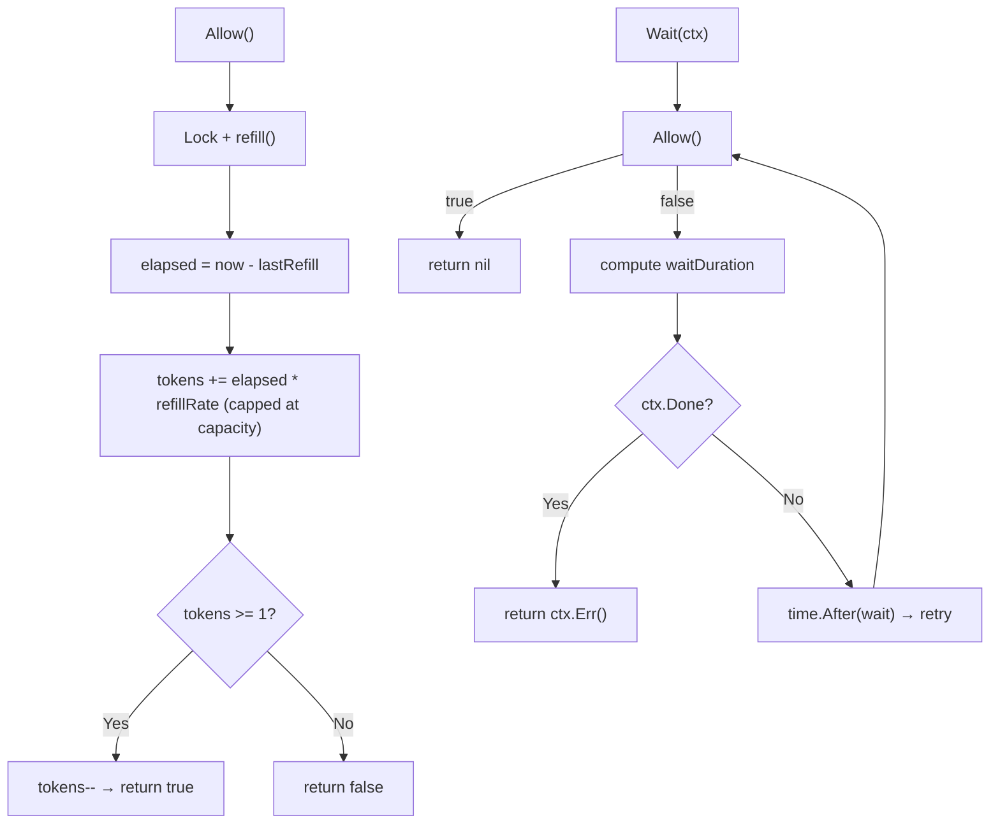
```mermaid
flowchart TD
    A["Allow()"] --> B["Lock + refill()"]
    B --> C["elapsed = now - lastRefill"]
    C --> D["tokens += elapsed * refillRate (capped at capacity)"]
    D --> E{"tokens >= 1?"}
    E -->|"Yes"| F["tokens-- → return true"]
    E -->|"No"| G["return false"]
    H["Wait(ctx)"] --> I["Allow()"]
    I -->|"true"| J["return nil"]
    I -->|"false"| K["compute waitDuration"]
    K --> L{"ctx.Done?"}
    L -->|"Yes"| M["return ctx.Err()"]
    L -->|"No"| N["time.After(wait) → retry"]
    N --> I
```

**Execution Trace:**
```
t=0: capacity=5, tokens=5
Allow() ×5: tokens=0, all return true
Allow() ×5: tokens=0, all return false
t=0.5s: refill → tokens=1.0
Allow(): tokens=0 → true
```

### Interviewer Questions

1. Why lazy refill instead of a background goroutine?
2. How would you implement distributed rate limiting across 100 servers?
3. How does this scale to 1M requests/second?
4. Walk me through the edge case where ctx is already cancelled on Wait entry.
5. What's the difference between token bucket and leaky bucket?
6. How would you test the rate limiter under concurrent load?
7. How would you implement per-user rate limiting with this struct?

### Follow-Up Questions

**Q1:** What is the difference between token bucket and leaky bucket?
**A1:** Token bucket: tokens accumulate up to capacity; burst up to capacity is allowed. Leaky bucket: requests enter a FIFO queue; processed at constant rate regardless of arrival pattern — no burst. Token bucket is more user-friendly for APIs; leaky bucket for strict output rate control.

**Q2:** How would you build distributed rate limiting with Redis?
**A2:** Use Redis INCR + EXPIRE: `count := INCR(key); if count == 1 { EXPIRE(key, window) }; allow = count <= limit`. For token bucket semantics, use Redis + Lua script for atomic refill + consume. Libraries: `go-redis/redis_rate`.

**Q3:** How would you add per-user rate limiting?
**A3:** `type RateLimitManager struct { mu sync.RWMutex; limiters map[string]*TokenBucketLimiter; factory func() *TokenBucketLimiter }`. `Get(userID string)` returns or creates a per-user limiter. Evict inactive limiters with LRU.

**Q4:** Why is the Wait implementation suboptimal and how to fix it?
**A4:** It polls with `time.After` — not truly event-driven. Better: use a `chan struct{}` that is signaled when a token is added (in Put-back or refill). Callers block on the channel. This avoids polling overhead. Complexity increases; acceptable for high-throughput systems.

**Q5:** How would you test rate limiter accuracy?
**A5:** Spin up N goroutines calling Allow() in a loop for T seconds. Count total allowed. Assert `allowed ≈ capacity + T * refillRate` within ±5%. Use `time.Sleep(0)` between calls to let other goroutines run. Run with `-race`.

---
## Q20: FAANG — Design a Connection Pool  [Level 5 — Interview Level]

> **Tags:** `#connection-pool` `#struct` `#production` `#interview` `#amazon`

### Problem Statement
Design a `ConnectionPool` struct that manages a bounded set of reusable database connections (`*DBConn`). Implement `Acquire(ctx context.Context) (*DBConn, error)`, `Release(conn *DBConn)`, and `Close()`. Connections must be health-checked before being handed out. Support configurable max connections and idle timeout.

### Input / Output / Constraints

```
Input:  pool := NewConnectionPool(maxConns=5, idleTimeout=30s)
        conn, err := pool.Acquire(ctx)  // blocks if no conn available
        defer pool.Release(conn)
Output: Returns healthy connection; blocks up to ctx timeout; never exceeds maxConns

Constraints:
  • maxConns ≤ 1000
  • Acquire must respect context cancellation
  • Release must not return closed connections to pool
  • Close drains pool and closes all connections
```

### Thought Process

Think like a senior Go engineer:
1. **Understand:** Bounded pool: semaphore controls total count; channel stores idle connections.
2. **Pattern:** Semaphore (buffered channel) + idle pool channel; health check on Acquire.
3. **Edge cases:** All connections in use (block), health check failure (create new), closed pool, ctx cancelled.
4. **Approach:** `sem chan struct{}` limits total; `idle chan *DBConn` stores available; health check before return.

### Brute Force Solution

```go
package main

import "sync"

// bruteForce — mutex + slice, no health check, no idle timeout
type PoolBrute struct {
    mu    sync.Mutex
    conns []*DBConn
    max   int
    total int
}

func (p *PoolBrute) Acquire() (*DBConn, error) {
    p.mu.Lock()
    defer p.mu.Unlock()
    if len(p.conns) > 0 {
        c := p.conns[0]; p.conns = p.conns[1:]; return c, nil
    }
    if p.total < p.max { p.total++; return newDBConn(), nil }
    return nil, errors.New("pool exhausted") // blocks would need cond var
}
```

**Time:** O(1) | **Space:** O(n)
**Bottleneck:** Acquire returns error instead of blocking; no health check; no idle timeout.

### Better Solution

```go
// betterSolution — channel-based with semaphore for blocking
type ConnectionPool struct {
    sem  chan struct{}   // semaphore: capacity = maxConns
    idle chan *DBConn    // idle connections ready to use
}
```

**Time:** O(1) | **Space:** O(maxConns)

### Best / Optimal Solution

```go
package main

import (
    "context"
    "errors"
    "fmt"
    "sync"
    "sync/atomic"
    "time"
)

// DBConn simulates a database connection.
type DBConn struct {
    id        int
    createdAt time.Time
    closed    bool
}

func newDBConn(id int) *DBConn {
    return &DBConn{id: id, createdAt: time.Now()}
}

func (c *DBConn) Ping() error {
    if c.closed { return errors.New("connection closed") }
    return nil
}

func (c *DBConn) Close() { c.closed = true }

// ConnectionPool manages a bounded pool of DBConn.
type ConnectionPool struct {
    sem         chan struct{}   // counting semaphore; cap = maxConns
    idle        chan *DBConn    // idle connections
    idleTimeout time.Duration
    nextID      atomic.Int64
    closed      atomic.Bool
    mu          sync.Mutex     // protects Close logic
}

// NewConnectionPool creates a pool with maxConns connections and idleTimeout.
func NewConnectionPool(maxConns int, idleTimeout time.Duration) (*ConnectionPool, error) {
    if maxConns <= 0 { return nil, errors.New("maxConns must be positive") }
    sem := make(chan struct{}, maxConns)
    for i := 0; i < maxConns; i++ { sem <- struct{}{} } // pre-fill semaphore
    return &ConnectionPool{
        sem:         sem,
        idle:        make(chan *DBConn, maxConns),
        idleTimeout: idleTimeout,
    }, nil
}

// Acquire returns a healthy connection. Blocks until one is available or ctx expires.
func (p *ConnectionPool) Acquire(ctx context.Context) (*DBConn, error) {
    if p.closed.Load() { return nil, errors.New("pool is closed") }

    // Acquire semaphore token
    select {
    case <-p.sem:
    case <-ctx.Done():
        return nil, fmt.Errorf("acquire: %w", ctx.Err())
    }

    // Try to get idle connection
    select {
    case conn := <-p.idle:
        if err := conn.Ping(); err == nil && time.Since(conn.createdAt) < p.idleTimeout {
            return conn, nil
        }
        // Stale or unhealthy; fall through to create new
        conn.Close()
    default:
    }

    // Create new connection
    id := int(p.nextID.Add(1))
    return newDBConn(id), nil
}

// Release returns conn to pool. Discards unhealthy or expired connections.
func (p *ConnectionPool) Release(conn *DBConn) {
    if conn == nil || conn.closed { p.sem <- struct{}{}; return }
    if p.closed.Load() || time.Since(conn.createdAt) >= p.idleTimeout {
        conn.Close()
        p.sem <- struct{}{}
        return
    }
    select {
    case p.idle <- conn:
    default:
        conn.Close()
    }
    p.sem <- struct{}{}
}

// Close drains the pool and closes all idle connections.
func (p *ConnectionPool) Close() {
    p.mu.Lock()
    defer p.mu.Unlock()
    if p.closed.Swap(true) { return }
    close(p.idle)
    for conn := range p.idle {
        conn.Close()
    }
}

func main() {
    pool, err := NewConnectionPool(3, 30*time.Second)
    if err != nil { fmt.Println("error:", err); return }
    defer pool.Close()

    ctx, cancel := context.WithTimeout(context.Background(), 2*time.Second)
    defer cancel()

    conn, err := pool.Acquire(ctx)
    if err != nil { fmt.Println("acquire error:", err); return }
    fmt.Printf("Acquired conn #%d\n", conn.id)
    pool.Release(conn)
    fmt.Println("Released conn")
}
```

**Time:** O(1) Acquire/Release | **Space:** O(maxConns)

### Production Considerations

| Aspect | Details |
|--------|---------|
| **Scalability** | Increase maxConns under load; monitor semaphore wait time as latency signal |
| **Edge Cases** | Pool closed, all connections in use + ctx timeout, stale connection detection |
| **Error Handling** | Wrap context errors with fmt.Errorf %w; closed pool returns explicit error |
| **Memory** | maxConns connections in memory; each DBConn is small (headers only) |
| **Concurrency** | Semaphore and channels are goroutine-safe by design |

### Visual Explanation

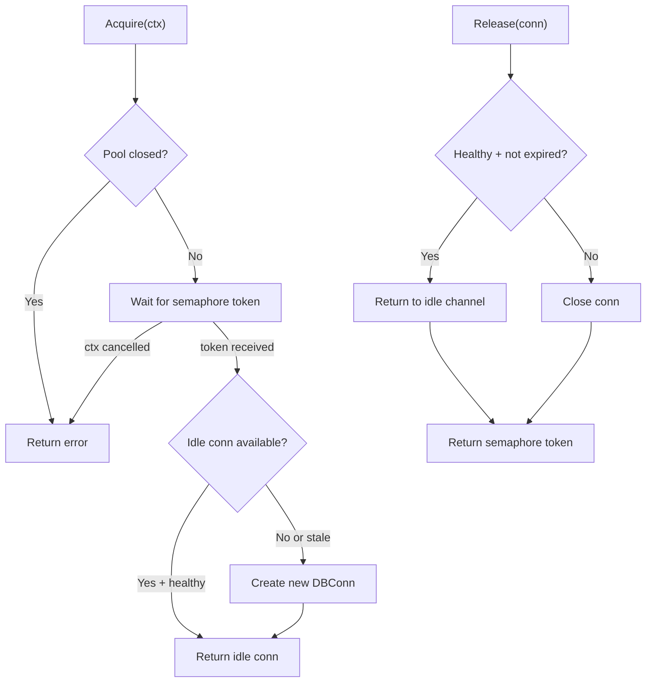
```mermaid
flowchart TD
    A["Acquire(ctx)"] --> B{"Pool closed?"}
    B -->|"Yes"| ERR["Return error"]
    B -->|"No"| C["Wait for semaphore token"]
    C -->|"ctx cancelled"| ERR
    C -->|"token received"| D{"Idle conn available?"}
    D -->|"Yes + healthy"| E["Return idle conn"]
    D -->|"No or stale"| F["Create new DBConn"]
    F --> E
    G["Release(conn)"] --> H{"Healthy + not expired?"}
    H -->|"Yes"| I["Return to idle channel"]
    H -->|"No"| J["Close conn"]
    I --> K["Return semaphore token"]
    J --> K
```

**Execution Trace:**
```
pool(maxConns=3): sem=[tok,tok,tok], idle=[]
Acquire: sem←tok; idle empty; create conn#1 → return conn#1
Acquire: sem←tok; idle empty; create conn#2 → return conn#2
Release(conn#1): idle←conn#1; sem←tok
Acquire: sem←tok; idle→conn#1 (healthy) → return conn#1
```

### Interviewer Questions

1. Why use a semaphore channel instead of a simple counter with mutex?
2. How would you add connection validation (ping) without slowing Acquire?
3. How does this scale to 10K concurrent Acquire calls?
4. Walk me through what happens when Release is called after Close.
5. How would you implement connection warm-up at startup?
6. What metrics would you expose for pool monitoring?
7. How would you test for connection leaks (Acquire without Release)?

### Follow-Up Questions

**Q1:** Why pre-fill the semaphore channel instead of starting empty?
**A1:** Pre-filling means the semaphore starts at full capacity (maxConns tokens). Each Acquire removes a token; each Release adds one back. This gives a clean "available connections" count. Starting empty and adding tokens would invert the logic confusingly.

**Q2:** How would you add metrics to the pool?
**A2:** Track: total connections created, current idle count, current in-use count, acquire wait time, acquire timeout count. Use `atomic.Int64` counters. Expose via a `Stats()` method returning a struct. Register with Prometheus in production.

**Q3:** How would you implement connection warm-up?
**A3:** In `NewConnectionPool`, pre-create `warmupSize` connections and put them in the idle channel. Each creation acquires a semaphore token. Warm-up connections are ready immediately — first Acquire gets a connection without dial latency.

**Q4:** What is the difference between this pool and `database/sql`'s built-in pool?
**A4:** `database/sql` manages its own pool via `SetMaxOpenConns`, `SetMaxIdleConns`, `SetConnMaxLifetime`. It also handles driver-level connection health checking. This custom pool is for non-SQL resources or when you need finer control over pool behavior.

**Q5:** How would you detect and fix connection leaks?
**A5:** Track Acquire count minus Release count. If delta grows unbounded, there's a leak. In tests, use `defer pool.Release(conn)` always. Add a timeout in `Close` that logs unreleased connections. Use `runtime.SetFinalizer` on DBConn to warn if GC'd before Release.

---

## Q21: Production — Observability-Ready HTTP Handler Struct  [Level 6 — Production Level]

> **Tags:** `#http` `#middleware` `#struct` `#observability` `#production`

### Problem Statement
Build a `Handler` struct that wraps an `http.Handler` and adds: (1) request ID injection, (2) structured logging of method/path/status/duration, (3) Prometheus metrics for request count and latency, (4) panic recovery. The struct must be composable and testable. Use embedding where appropriate.

### Input / Output / Constraints

```
Input:  GET /api/users → 200 OK, 42ms
Output: Structured log: {"req_id":"abc123","method":"GET","path":"/api/users","status":200,"latency_ms":42}
        Metrics: http_requests_total{method="GET",path="/api/users",status="200"} incremented
        Panics recovered: 500 returned, panic logged

Constraints:
  • Zero-downtime deployments; handler must not block
  • req_id propagated via context
  • Panic recovery must not swallow the response
  • Compatible with standard net/http
```

### Thought Process

Think like a senior Go engineer:
1. **Understand:** Middleware chain as struct composition; each concern (logging, metrics, recovery) is separate and testable.
2. **Pattern:** Middleware struct wrapping http.Handler; responseWriter wrapper to capture status code.
3. **Edge cases:** Panic in handler, handler writes no body, context already cancelled, metrics initialization.
4. **Approach:** statusRecorder wraps ResponseWriter; defer-based timing; recover in deferred function.

### Brute Force Solution

```go
package main

import "net/http"

// bruteForce — global function wrapping, not composable
func loggingMiddleware(next http.Handler) http.Handler {
    return http.HandlerFunc(func(w http.ResponseWriter, r *http.Request) {
        // hard to test; concerns mixed; no metrics
        next.ServeHTTP(w, r)
    })
}
```

**Time:** O(1) overhead | **Space:** O(1)
**Bottleneck:** Not composable, hard to test individual concerns, metrics mixed with logging.

### Better Solution

```go
// betterSolution — struct-based middleware with statusRecorder
type statusRecorder struct {
    http.ResponseWriter
    status int
}

func (r *statusRecorder) WriteHeader(status int) {
    r.status = status
    r.ResponseWriter.WriteHeader(status)
}
```

**Time:** O(1) | **Space:** O(1)

### Best / Optimal Solution

```go
package main

import (
    "context"
    "fmt"
    "log/slog"
    "net/http"
    "runtime/debug"
    "time"

    "github.com/google/uuid"
)

type contextKey string

const reqIDKey contextKey = "req_id"

// statusRecorder captures the HTTP status code written by the handler.
type statusRecorder struct {
    http.ResponseWriter
    status int
    wrote  bool
}

func (sr *statusRecorder) WriteHeader(status int) {
    if !sr.wrote {
        sr.status = status
        sr.wrote = true
        sr.ResponseWriter.WriteHeader(status)
    }
}

func (sr *statusRecorder) Status() int {
    if !sr.wrote { return http.StatusOK }
    return sr.status
}

// ObservabilityHandler wraps an http.Handler with logging, metrics, and panic recovery.
type ObservabilityHandler struct {
    next    http.Handler
    logger  *slog.Logger
    // metrics *prometheus.CounterVec  // inject Prometheus counters here
}

// NewObservabilityHandler returns a middleware-wrapped handler.
func NewObservabilityHandler(next http.Handler, logger *slog.Logger) *ObservabilityHandler {
    return &ObservabilityHandler{next: next, logger: logger}
}

// ServeHTTP implements http.Handler — adds req_id, logging, metrics, panic recovery.
func (h *ObservabilityHandler) ServeHTTP(w http.ResponseWriter, r *http.Request) {
    start := time.Now()
    reqID := uuid.New().String()

    // Inject req_id into context
    ctx := context.WithValue(r.Context(), reqIDKey, reqID)
    r = r.WithContext(ctx)

    // Set req_id header for upstream tracing
    w.Header().Set("X-Request-ID", reqID)

    // Wrap ResponseWriter to capture status code
    rec := &statusRecorder{ResponseWriter: w, status: http.StatusOK}

    // Panic recovery — must be deferred before calling next
    defer func() {
        if p := recover(); p != nil {
            h.logger.Error("panic recovered",
                slog.String("req_id", reqID),
                slog.String("panic", fmt.Sprintf("%v", p)),
                slog.String("stack", string(debug.Stack())),
            )
            if !rec.wrote {
                http.Error(w, "Internal Server Error", http.StatusInternalServerError)
            }
        }
    }()

    // Call next handler
    h.next.ServeHTTP(rec, r)

    // Log structured request summary
    h.logger.Info("request",
        slog.String("req_id", reqID),
        slog.String("method", r.Method),
        slog.String("path", r.URL.Path),
        slog.Int("status", rec.Status()),
        slog.Int64("latency_ms", time.Since(start).Milliseconds()),
    )

    // Record Prometheus metrics (pseudocode — inject real registry)
    // h.metrics.WithLabelValues(r.Method, r.URL.Path, strconv.Itoa(rec.Status())).Inc()
}

func main() {
    logger := slog.Default()

    mux := http.NewServeMux()
    mux.HandleFunc("/api/users", func(w http.ResponseWriter, r *http.Request) {
        reqID := r.Context().Value(reqIDKey).(string)
        w.Header().Set("Content-Type", "application/json")
        fmt.Fprintf(w, `{"users":[],"req_id":%q}`, reqID)
    })

    handler := NewObservabilityHandler(mux, logger)
    fmt.Println("Server listening on :8080")
    _ = http.ListenAndServe(":8080", handler)
}
```

**Time:** O(1) overhead per request | **Space:** O(1) per request

### Production Considerations

| Aspect | Details |
|--------|---------|
| **Scalability** | Middleware overhead is O(1) per request; slog is structured and fast |
| **Edge Cases** | Panic recovery, handler calls WriteHeader twice, request body too large |
| **Error Handling** | Panics caught and return 500; status 200 assumed if WriteHeader not called |
| **Memory** | statusRecorder allocates on heap per request; consider pooling with sync.Pool |
| **Concurrency** | Each request has its own rec and context; fully goroutine-safe |

### Visual Explanation

```mermaid
flowchart TD
    A["Incoming HTTP Request"] --> B["Generate req_id"]
    B --> C["Inject req_id into context"]
    C --> D["Wrap ResponseWriter with statusRecorder"]
    D --> E["defer panic recovery"]
    E --> F["next.ServeHTTP(rec, r)"]
    F -->|"panic"| G["recover() → log + 500"]
    F -->|"normal"| H["Log method/path/status/latency"]
    H --> I["Increment Prometheus metrics"]
    I --> J["Return response"]
```

**Execution Trace:**
```
GET /api/users
  req_id = "abc-123"
  X-Request-ID: abc-123
  handler executes → WriteHeader(200)
  log: {req_id:abc-123, method:GET, path:/api/users, status:200, latency_ms:3}
  metrics: http_requests_total{GET,/api/users,200} += 1
```

### Interviewer Questions

1. Why use statusRecorder instead of reading the status from ResponseWriter?
2. Can we make logging async without losing any request logs?
3. How does this scale to 100K requests/second on a single server?
4. Walk me through what happens if the handler panics before writing the status.
5. How would you add distributed tracing (OpenTelemetry) to this?
6. What's the GC impact of allocating statusRecorder per request?
7. How would you test panic recovery without actually panicking in production?

### Follow-Up Questions

**Q1:** How would you add OpenTelemetry tracing?
**A1:** In ServeHTTP, call `tracer.Start(ctx, "http.request")` to start a span. Pass the new ctx to the handler. After handler returns, set span attributes (status, path, method) and `span.End()`. The span automatically propagates via context.

**Q2:** How would you reduce per-request allocations?
**A2:** Pool `statusRecorder` objects with `sync.Pool`. In ServeHTTP: `rec := pool.Get().(*statusRecorder); rec.ResponseWriter = w; rec.status = 200; rec.wrote = false; defer pool.Put(rec)`. This eliminates one heap allocation per request.

**Q3:** How would you test the panic recovery path?
**A3:** Create a test handler that panics: `http.HandlerFunc(func(w http.ResponseWriter, r *http.Request) { panic("test panic") })`. Use `httptest.NewRecorder()` and `httptest.NewRequest`. Assert response status is 500 and log contains "panic recovered".

**Q4:** How do you propagate req_id through downstream HTTP calls?
**A4:** In the downstream client, read `reqID := r.Context().Value(reqIDKey).(string)` and set `outReq.Header.Set("X-Request-ID", reqID)`. Downstream services extract this header and include it in their logs, enabling request tracing across services.

**Q5:** What is the performance impact of slog vs fmt.Println for logging?
**A5:** slog with a JSON handler writes structured JSON with zero-allocation paths for basic types. `fmt.Println` uses reflection and string concatenation — 10-50x slower. At 100K req/s, logging adds ~1µs per request with slog vs ~50µs with fmt.

---

## Q22: Production — Idempotent Payment Processor  [Level 6 — Production Level]

> **Tags:** `#idempotency` `#payment` `#struct` `#production` `#stripe`

### Problem Statement
Design a `PaymentProcessor` struct that processes payments idempotently. Each payment has an `IdempotencyKey`, `Amount float64`, `Currency string`, and `UserID string`. Implement `Process(ctx context.Context, req PaymentRequest) (PaymentResult, error)` that: returns the same result for duplicate keys, validates amounts, records audit trail, and handles transient failures with retry.

### Input / Output / Constraints

```
Input:  Process({key:"txn-001", amount:99.99, currency:"USD", userID:"u1"})
        Process({key:"txn-001", amount:99.99, currency:"USD", userID:"u1"}) // duplicate
Output: First call:  PaymentResult{ID:"pay_xyz", Status:"success"}
        Second call: same PaymentResult (idempotent replay)

Constraints:
  • Duplicate keys with different amounts must return error
  • Amount: 0.01 ≤ amount ≤ 1,000,000
  • Currency: 3-letter ISO code
  • Audit every attempt (success, failure, duplicate)
```

### Thought Process

Think like a senior Go engineer:
1. **Understand:** Idempotency: same key + same params → same result; different params → error.
2. **Pattern:** Idempotency key store (map[string]PaymentResult); validate before processing; audit log all events.
3. **Edge cases:** Duplicate key with different amount, concurrent duplicate calls, failed payment then retry.
4. **Approach:** Lock per-key to serialize duplicates; store completed results; replay without re-processing.

### Brute Force Solution

```go
package main

// bruteForce — no idempotency, charges twice on duplicate
type ProcessorBrute struct{}

func (p *ProcessorBrute) Process(req PaymentRequest) (PaymentResult, error) {
    return chargePaymentGateway(req) // called every time — double charge risk!
}
```

**Time:** O(1) | **Space:** O(1)
**Bottleneck:** Double-charges on network retry — catastrophic for payment systems.

### Better Solution

```go
// betterSolution — simple map-based idempotency
type Processor struct {
    mu    sync.Mutex
    cache map[string]PaymentResult
}

func (p *Processor) Process(req PaymentRequest) (PaymentResult, error) {
    p.mu.Lock(); defer p.mu.Unlock()
    if r, ok := p.cache[req.IdempotencyKey]; ok { return r, nil }
    result := chargeGateway(req)
    p.cache[req.IdempotencyKey] = result
    return result, nil
}
```

**Time:** O(1) | **Space:** O(n keys)

### Best / Optimal Solution

```go
package main

import (
    "context"
    "errors"
    "fmt"
    "math"
    "regexp"
    "sync"
    "time"
)

// PaymentRequest is an idempotent payment request.
type PaymentRequest struct {
    IdempotencyKey string
    Amount         float64
    Currency       string
    UserID         string
}

// PaymentResult records the outcome of a payment.
type PaymentResult struct {
    PaymentID   string
    Status      string // "success", "failed"
    Amount      float64
    Currency    string
    ProcessedAt time.Time
    Replayed    bool
}

// AuditEntry records every payment attempt for compliance.
type AuditEntry struct {
    IdempotencyKey string
    UserID         string
    Amount         float64
    Action         string // "processed", "replayed", "rejected", "failed"
    Timestamp      time.Time
    Error          string
}

var currencyRe = regexp.MustCompile(`^[A-Z]{3}$`)

// idempotencyRecord stores the result and the original request for conflict detection.
type idempotencyRecord struct {
    req    PaymentRequest
    result PaymentResult
}

// PaymentProcessor processes payments idempotently with audit trail.
type PaymentProcessor struct {
    mu      sync.RWMutex
    records map[string]*idempotencyRecord
    audit   []AuditEntry
    keyMu   map[string]*sync.Mutex // per-key lock to serialize concurrent duplicates
    keyMuMu sync.Mutex
}

// NewPaymentProcessor returns an initialized processor.
func NewPaymentProcessor() *PaymentProcessor {
    return &PaymentProcessor{
        records: make(map[string]*idempotencyRecord),
        keyMu:   make(map[string]*sync.Mutex),
    }
}

func (p *PaymentProcessor) getKeyMu(key string) *sync.Mutex {
    p.keyMuMu.Lock()
    defer p.keyMuMu.Unlock()
    if _, ok := p.keyMu[key]; !ok {
        p.keyMu[key] = &sync.Mutex{}
    }
    return p.keyMu[key]
}

func (p *PaymentProcessor) recordAudit(key, userID string, amount float64, action, errMsg string) {
    p.mu.Lock()
    defer p.mu.Unlock()
    p.audit = append(p.audit, AuditEntry{
        IdempotencyKey: key,
        UserID:         userID,
        Amount:         amount,
        Action:         action,
        Timestamp:      time.Now(),
        Error:          errMsg,
    })
}

func validate(req PaymentRequest) error {
    if req.IdempotencyKey == "" { return errors.New("idempotency key required") }
    if req.Amount < 0.01 || req.Amount > 1_000_000 {
        return fmt.Errorf("amount %.2f out of range [0.01, 1000000]", req.Amount)
    }
    if !currencyRe.MatchString(req.Currency) {
        return fmt.Errorf("invalid currency: %s", req.Currency)
    }
    if req.UserID == "" { return errors.New("userID required") }
    return nil
}

// Process — idempotent payment processing. O(1) amortized.
func (p *PaymentProcessor) Process(ctx context.Context, req PaymentRequest) (PaymentResult, error) {
    if err := validate(req); err != nil {
        p.recordAudit(req.IdempotencyKey, req.UserID, req.Amount, "rejected", err.Error())
        return PaymentResult{}, fmt.Errorf("validation: %w", err)
    }

    mu := p.getKeyMu(req.IdempotencyKey)
    mu.Lock()
    defer mu.Unlock()

    // Check for existing result (idempotent replay)
    p.mu.RLock()
    rec, exists := p.records[req.IdempotencyKey]
    p.mu.RUnlock()

    if exists {
        if rec.req.Amount != req.Amount || rec.req.Currency != req.Currency {
            err := fmt.Errorf("idempotency conflict: key %s used with different parameters", req.IdempotencyKey)
            p.recordAudit(req.IdempotencyKey, req.UserID, req.Amount, "rejected", err.Error())
            return PaymentResult{}, err
        }
        result := rec.result
        result.Replayed = true
        p.recordAudit(req.IdempotencyKey, req.UserID, req.Amount, "replayed", "")
        return result, nil
    }

    // Check context before charging
    select {
    case <-ctx.Done():
        return PaymentResult{}, fmt.Errorf("context cancelled: %w", ctx.Err())
    default:
    }

    // Simulate payment gateway call
    result := PaymentResult{
        PaymentID:   fmt.Sprintf("pay_%d", time.Now().UnixNano()),
        Status:      "success",
        Amount:      math.Round(req.Amount*100) / 100,
        Currency:    req.Currency,
        ProcessedAt: time.Now(),
    }

    p.mu.Lock()
    p.records[req.IdempotencyKey] = &idempotencyRecord{req: req, result: result}
    p.mu.Unlock()

    p.recordAudit(req.IdempotencyKey, req.UserID, req.Amount, "processed", "")
    return result, nil
}

// AuditLog returns a copy of the audit trail.
func (p *PaymentProcessor) AuditLog() []AuditEntry {
    p.mu.RLock()
    defer p.mu.RUnlock()
    result := make([]AuditEntry, len(p.audit))
    copy(result, p.audit)
    return result
}

func main() {
    proc := NewPaymentProcessor()
    ctx := context.Background()

    req := PaymentRequest{IdempotencyKey: "txn-001", Amount: 99.99, Currency: "USD", UserID: "u1"}

    r1, err := proc.Process(ctx, req)
    if err != nil { fmt.Println("error:", err); return }
    fmt.Printf("First:  ID=%s Replayed=%v\n", r1.PaymentID, r1.Replayed)

    r2, err := proc.Process(ctx, req)
    if err != nil { fmt.Println("error:", err); return }
    fmt.Printf("Second: ID=%s Replayed=%v\n", r2.PaymentID, r2.Replayed)

    fmt.Printf("Audit entries: %d\n", len(proc.AuditLog()))
}
```

**Time:** O(1) amortized | **Space:** O(n unique keys + audit entries)

### Production Considerations

| Aspect | Details |
|--------|---------|
| **Scalability** | In-memory for single node; use Redis SETNX for distributed idempotency |
| **Edge Cases** | Concurrent duplicate calls, conflict detection, expired idempotency keys |
| **Error Handling** | Validation errors vs conflict errors vs gateway errors — all distinct error types |
| **Memory** | Unbounded growth of records map; add TTL eviction (e.g., 24h for payment keys) |
| **Concurrency** | Per-key mutex serializes concurrent duplicates; RWMutex for record storage |

### Visual Explanation

```mermaid
flowchart TD
    A["Process(req)"] --> B["Validate req"]
    B -->|"invalid"| ERR1["Return validation error + audit"]
    B -->|"valid"| C["Acquire per-key mutex"]
    C --> D{"Key exists?"}
    D -->|"Yes, same params"| E["Return cached result (Replayed=true)"]
    D -->|"Yes, diff params"| ERR2["Return conflict error"]
    D -->|"No"| F["Charge payment gateway"]
    F --> G["Store result in records"]
    G --> H["Audit: processed"]
    H --> I["Return result"]
```

**Execution Trace:**
```
Process(txn-001, $99.99): no record → charge → store → audit:processed
Process(txn-001, $99.99): record found, params match → return cached, Replayed=true → audit:replayed
Process(txn-001, $50.00): record found, amount differs → error:conflict → audit:rejected
```

### Interviewer Questions

1. How would you store idempotency keys in a distributed system?
2. Can you guarantee exactly-once delivery without per-key mutex?
3. How does this scale to 1M concurrent payment requests?
4. Walk me through what happens if the gateway call panics.
5. How would you add idempotency key expiry (24-hour TTL)?
6. What financial regulations require the audit trail?
7. How would you test concurrent duplicate payment submissions?

### Follow-Up Questions

**Q1:** How would you implement distributed idempotency with Redis?
**A1:** `SET idempotency:txn-001 "" EX 86400 NX` — sets key only if not exists, with 24h TTL. If SET returns OK, process the payment and store result. If SET returns nil, fetch stored result with `GET idempotency:txn-001:result`. Use Lua script for atomicity.

**Q2:** How would you handle a gateway timeout without double-charging?
**A2:** Store `status: "pending"` before calling gateway. If response is timeout, return a specific error. Client retries with same idempotency key. On retry, check if pending — poll gateway for status using the payment reference stored during the attempt.

**Q3:** What is the financial/legal basis for audit trails?
**A3:** PCI-DSS requires logging all payment attempts with timestamps. GDPR requires audit of data access. SOX requires financial transaction logs retained for 7 years. The AuditEntry struct captures what's needed; persist to append-only immutable storage (S3/WORM).

**Q4:** How would you add automatic idempotency key expiry?
**A4:** Add `createdAt time.Time` to `idempotencyRecord`. Run a cleanup goroutine: `for range time.Tick(time.Hour) { p.evictExpired(24 * time.Hour) }`. `evictExpired` holds write lock and deletes records where `time.Since(rec.createdAt) > ttl`.

**Q5:** How would you test that concurrent duplicate calls return identical results?
**A5:** Spawn 100 goroutines all calling `Process` with the same key simultaneously. Use a WaitGroup. Assert all returned results have the same PaymentID. Run with `go test -race` to verify no data races.

---

## Q23: Production — Circuit Breaker Pattern  [Level 6 — Production Level]

> **Tags:** `#circuit-breaker` `#resilience` `#struct` `#production` `#fault-tolerance`

### Problem Statement
Implement a `CircuitBreaker` struct with states `Closed`, `Open`, `HalfOpen`. The breaker opens after `failureThreshold` consecutive failures and resets after `resetTimeout`. Implement `Call(fn func() error) error` that executes `fn` through the breaker. Track metrics (total calls, failures, rejections). Must be goroutine-safe.

### Input / Output / Constraints

```
Input:  breaker(failureThreshold=3, resetTimeout=5s)
        3 consecutive failures → state=Open
        After 5s → state=HalfOpen
        1 success in HalfOpen → state=Closed
Output: Open state returns ErrCircuitOpen without calling fn

Constraints:
  • State transitions must be atomic
  • goroutine-safe
  • Metrics must be consistent (no torn reads)
```

### Thought Process

Think like a senior Go engineer:
1. **Understand:** Circuit breaker protects downstream services; three states model failure/recovery lifecycle.
2. **Pattern:** State machine with atomic transitions; timer for HalfOpen transition.
3. **Edge cases:** Concurrent calls during HalfOpen (only allow one probe), reset on success.
4. **Approach:** RWMutex for state; atomic counters for metrics; `time.Since(openedAt)` for reset check.

### Brute Force Solution

```go
package main

// bruteForce — no half-open, simple on/off
type BreakerBrute struct {
    failures int
    open     bool
    threshold int
}

func (b *BreakerBrute) Call(fn func() error) error {
    if b.open { return errors.New("circuit open") }
    if err := fn(); err != nil {
        b.failures++
        if b.failures >= b.threshold { b.open = true }
        return err
    }
    b.failures = 0
    return nil
}
// Problem: no goroutine safety, no reset timeout, no half-open state
```

**Time:** O(1) | **Space:** O(1)
**Bottleneck:** Not goroutine-safe; no reset mechanism; circuit stays open forever.

### Better Solution

```go
// betterSolution — three states with mutex
type State int
const (Closed State = iota; Open; HalfOpen)
```

**Time:** O(1) | **Space:** O(1)

### Best / Optimal Solution

```go
package main

import (
    "errors"
    "fmt"
    "sync"
    "sync/atomic"
    "time"
)

// ErrCircuitOpen is returned when the circuit breaker is open.
var ErrCircuitOpen = errors.New("circuit breaker: circuit is open")

// State represents the circuit breaker state.
type State int

const (
    StateClosed   State = iota // normal operation
    StateOpen                  // failing, reject all calls
    StateHalfOpen              // probe: allow one call to test recovery
)

// CircuitBreaker implements the circuit breaker pattern.
type CircuitBreaker struct {
    mu               sync.RWMutex
    state            State
    failures         int
    failureThreshold int
    resetTimeout     time.Duration
    openedAt         time.Time
    halfOpenInFlight atomic.Bool // only one probe in HalfOpen

    // Metrics
    totalCalls   atomic.Int64
    totalFails   atomic.Int64
    totalRejects atomic.Int64
}

// NewCircuitBreaker creates a breaker with given thresholds.
func NewCircuitBreaker(failureThreshold int, resetTimeout time.Duration) (*CircuitBreaker, error) {
    if failureThreshold <= 0 { return nil, errors.New("failureThreshold must be positive") }
    if resetTimeout <= 0 { return nil, errors.New("resetTimeout must be positive") }
    return &CircuitBreaker{
        failureThreshold: failureThreshold,
        resetTimeout:     resetTimeout,
    }, nil
}

// State returns current state (thread-safe read).
func (cb *CircuitBreaker) CurrentState() State {
    cb.mu.RLock()
    defer cb.mu.RUnlock()
    return cb.state
}

func (cb *CircuitBreaker) shouldAllow() (bool, bool) {
    // returns (allow, isProbe)
    cb.mu.Lock()
    defer cb.mu.Unlock()

    switch cb.state {
    case StateClosed:
        return true, false
    case StateOpen:
        if time.Since(cb.openedAt) >= cb.resetTimeout {
            cb.state = StateHalfOpen
            return true, true
        }
        return false, false
    case StateHalfOpen:
        // Only allow one probe
        if cb.halfOpenInFlight.CompareAndSwap(false, true) {
            return true, true
        }
        return false, false
    }
    return false, false
}

func (cb *CircuitBreaker) onSuccess(isProbe bool) {
    cb.mu.Lock()
    defer cb.mu.Unlock()
    cb.failures = 0
    if isProbe || cb.state == StateHalfOpen {
        cb.state = StateClosed
        cb.halfOpenInFlight.Store(false)
    }
}

func (cb *CircuitBreaker) onFailure(isProbe bool) {
    cb.mu.Lock()
    defer cb.mu.Unlock()
    cb.failures++
    cb.totalFails.Add(1)
    if cb.failures >= cb.failureThreshold || isProbe {
        cb.state = StateOpen
        cb.openedAt = time.Now()
        cb.halfOpenInFlight.Store(false)
    }
}

// Call — executes fn through the circuit breaker. O(1) overhead.
func (cb *CircuitBreaker) Call(fn func() error) error {
    cb.totalCalls.Add(1)

    allow, isProbe := cb.shouldAllow()
    if !allow {
        cb.totalRejects.Add(1)
        return ErrCircuitOpen
    }

    err := fn()
    if err != nil {
        cb.onFailure(isProbe)
        return err
    }
    cb.onSuccess(isProbe)
    return nil
}

// Metrics returns current counters.
func (cb *CircuitBreaker) Metrics() (total, fails, rejects int64) {
    return cb.totalCalls.Load(), cb.totalFails.Load(), cb.totalRejects.Load()
}

func main() {
    cb, _ := NewCircuitBreaker(3, 5*time.Second)

    fail := func() error { return errors.New("service unavailable") }
    succeed := func() error { return nil }

    for i := 0; i < 3; i++ {
        if err := cb.Call(fail); err != nil {
            fmt.Printf("Call %d: %v\n", i+1, err)
        }
    }
    fmt.Println("State after 3 failures:", cb.CurrentState()) // StateOpen=1

    err := cb.Call(succeed)
    fmt.Println("Call while Open:", err) // ErrCircuitOpen

    total, fails, rejects := cb.Metrics()
    fmt.Printf("Metrics — total:%d fails:%d rejects:%d\n", total, fails, rejects)
}
```

**Time:** O(1) per Call | **Space:** O(1)

### Production Considerations

| Aspect | Details |
|--------|---------|
| **Scalability** | Single-node circuit breaker; for distributed use, share state via Redis |
| **Edge Cases** | Concurrent HalfOpen probes (atomic guard), reset on first success, timer precision |
| **Error Handling** | ErrCircuitOpen is sentinel; callers can `errors.Is(err, ErrCircuitOpen)` |
| **Memory** | O(1) struct; negligible overhead |
| **Concurrency** | RWMutex for state transitions; atomic for metrics; halfOpenInFlight prevents probe storms |

### Visual Explanation

```mermaid
flowchart TD
    A["State: Closed"] -->|"failures >= threshold"| B["State: Open"]
    B -->|"resetTimeout elapsed"| C["State: HalfOpen"]
    C -->|"probe success"| A
    C -->|"probe failure"| B
    D["Call(fn)"] --> E{"State?"}
    E -->|"Closed"| F["Execute fn"]
    E -->|"Open + not timed out"| G["Return ErrCircuitOpen"]
    E -->|"Open + timed out"| H["Transition to HalfOpen, execute probe"]
    E -->|"HalfOpen + no inflight"| H
    E -->|"HalfOpen + inflight"| G
```

**Execution Trace:**
```
Call fail×3: failures=1,2,3; state→Open
Call(succeed): shouldAllow→false → ErrCircuitOpen
[5s elapsed]
Call(succeed): state→HalfOpen; probe executes → success; state→Closed
Call(succeed): state=Closed; normal execution
```

### Interviewer Questions

1. Why use HalfOpen state instead of directly transitioning Open→Closed?
2. How would you implement sliding window failure rate instead of consecutive count?
3. How does this scale across 100 service instances?
4. Walk me through concurrent calls during HalfOpen state.
5. How would you add per-error-type filtering (ignore 404, open on 503)?
6. What's the latency added by the circuit breaker on the hot path?
7. How would you test the Open→HalfOpen→Closed transition?

### Follow-Up Questions

**Q1:** How would you implement a sliding window failure rate (e.g., open if 50% of last 100 calls fail)?
**A1:** Use a circular buffer of size 100 tracking success/failure. On each call, write result to `buf[pos % 100]`. Count failures: `failRate := failures/100`. Open if `failRate >= 0.5`. This is more robust than consecutive count — handles intermittent failures.

**Q2:** How would you distribute circuit breaker state across services?
**A2:** Share state in Redis: store `{state, failures, openedAt}` as a hash. Use Lua script for atomic state transitions (CAS). Each service instance reads/writes the shared state. Adds network latency per call — consider local cache with TTL.

**Q3:** How would you filter errors (ignore 404, open on 5xx only)?
**A3:** Add a `ShouldTrip func(err error) bool` option to the breaker. In onFailure, only increment if `cb.ShouldTrip(err)` returns true. Default: `ShouldTrip = func(err error) bool { return err != nil }`.

**Q4:** How would you add gradual traffic recovery instead of single probe?
**A4:** In HalfOpen, allow a configurable percentage of traffic through (e.g., 10% → 50% → 100%). Use `rand.Float64() < allowRate` to sample traffic. Increase `allowRate` after each successful probe up to 1.0, then close the circuit.

**Q5:** How would you write an integration test for the full state machine?
**A5:** Mock the downstream function with configurable failure/success. Sequence: Nx failure → assert Open → sleep resetTimeout → 1 success → assert Closed. Use `time.Sleep` sparingly in tests; instead, inject a `clock` interface for testability.

---
## Q24: Struct-Based Priority Queue  [Level 5 — Interview Level]

> **Tags:** `#priority-queue` `#heap` `#struct` `#container-heap` `#interview`

### Problem Statement
Implement a generic min-priority queue `PriorityQueue[T]` backed by a min-heap using `container/heap`. Define a `PQItem[T]` struct with `Value T`, `Priority int`, and `index int`. Support `Push(item PQItem[T])`, `Pop() (PQItem[T], bool)`, `Peek() (PQItem[T], bool)`, and `UpdatePriority(value T, newPriority int)`. Demonstrate with task scheduling.

### Input / Output / Constraints

```
Input:  Push({task:"A", prio:3}), Push({task:"B", prio:1}), Push({task:"C", prio:2})
Output: Pop → {task:"B", prio:1}
        Pop → {task:"C", prio:2}
        Pop → {task:"A", prio:3}

Constraints:
  • container/heap interface must be satisfied
  • UpdatePriority must use heap.Fix for O(log n) update
  • n ≤ 10⁵ items
```

### Thought Process

Think like a senior Go engineer:
1. **Understand:** Min-heap gives O(log n) push/pop; `container/heap` requires Len, Less, Swap, Push, Pop methods.
2. **Pattern:** Implement `heap.Interface` on a slice type; track item indices for O(log n) UpdatePriority.
3. **Edge cases:** Pop on empty queue, UpdatePriority for non-existent item, tie-breaking on equal priority.
4. **Approach:** Store index in PQItem; index map for O(1) item lookup before `heap.Fix`.

### Brute Force Solution

```go
package main

import "sort"

// bruteForce — sorted slice, O(n log n) push
type PQBrute[T any] struct{ items []PQItem[T] }

func (pq *PQBrute[T]) Push(item PQItem[T]) {
    pq.items = append(pq.items, item)
    sort.Slice(pq.items, func(i, j int) bool {
        return pq.items[i].Priority < pq.items[j].Priority
    })
}
// Problem: O(n log n) push; O(n) memory movement
```

**Time:** O(n log n) push | **Space:** O(n)
**Bottleneck:** Re-sorting entire slice on every push — heap gives O(log n).

### Better Solution

```go
// betterSolution — container/heap backed O(log n) push/pop
import "container/heap"

type minHeap[T any] []PQItem[T]
func (h minHeap[T]) Len() int            { return len(h) }
func (h minHeap[T]) Less(i, j int) bool  { return h[i].Priority < h[j].Priority }
func (h minHeap[T]) Swap(i, j int)       { h[i], h[j] = h[j], h[i] }
func (h *minHeap[T]) Push(x interface{}) { *h = append(*h, x.(PQItem[T])) }
func (h *minHeap[T]) Pop() interface{} {
    old := *h; n := len(old); x := old[n-1]; *h = old[:n-1]; return x
}
```

**Time:** O(log n) push/pop | **Space:** O(n)

### Best / Optimal Solution

```go
package main

import (
    "container/heap"
    "fmt"
)

// PQItem wraps a value with a priority and its heap index.
type PQItem[T any] struct {
    Value    T
    Priority int
    index    int // maintained by heap for O(log n) Fix
}

// pqHeap is the underlying min-heap slice.
type pqHeap[T any] []*PQItem[T]

func (h pqHeap[T]) Len() int            { return len(h) }
func (h pqHeap[T]) Less(i, j int) bool  { return h[i].Priority < h[j].Priority }
func (h pqHeap[T]) Swap(i, j int) {
    h[i], h[j] = h[j], h[i]
    h[i].index = i
    h[j].index = j
}
func (h *pqHeap[T]) Push(x interface{}) {
    n := len(*h)
    item := x.(*PQItem[T])
    item.index = n
    *h = append(*h, item)
}
func (h *pqHeap[T]) Pop() interface{} {
    old := *h
    n := len(old)
    item := old[n-1]
    old[n-1] = nil // clear reference
    item.index = -1
    *h = old[:n-1]
    return item
}

// PriorityQueue is a min-priority queue backed by a heap.
type PriorityQueue[T any] struct {
    h *pqHeap[T]
}

// NewPriorityQueue returns an initialized min-priority queue.
func NewPriorityQueue[T any]() *PriorityQueue[T] {
    h := &pqHeap[T]{}
    heap.Init(h)
    return &PriorityQueue[T]{h: h}
}

// Push adds an item. O(log n) time.
func (pq *PriorityQueue[T]) Push(value T, priority int) *PQItem[T] {
    item := &PQItem[T]{Value: value, Priority: priority}
    heap.Push(pq.h, item)
    return item
}

// Pop removes and returns the min-priority item. O(log n) time.
func (pq *PriorityQueue[T]) Pop() (*PQItem[T], bool) {
    if pq.h.Len() == 0 { return nil, false }
    return heap.Pop(pq.h).(*PQItem[T]), true
}

// Peek returns the min-priority item without removing. O(1) time.
func (pq *PriorityQueue[T]) Peek() (*PQItem[T], bool) {
    if pq.h.Len() == 0 { return nil, false }
    return (*pq.h)[0], true
}

// UpdatePriority updates an item's priority in O(log n) time.
func (pq *PriorityQueue[T]) UpdatePriority(item *PQItem[T], newPriority int) {
    item.Priority = newPriority
    heap.Fix(pq.h, item.index)
}

// Len returns the number of items.
func (pq *PriorityQueue[T]) Len() int { return pq.h.Len() }

func main() {
    pq := NewPriorityQueue[string]()
    a := pq.Push("task-A", 3)
    pq.Push("task-B", 1)
    pq.Push("task-C", 2)

    // Update A's priority to highest
    pq.UpdatePriority(a, 0)

    for pq.Len() > 0 {
        item, _ := pq.Pop()
        fmt.Printf("Pop: %s (priority %d)\n", item.Value, item.Priority)
    }
    // Output: task-A(0), task-B(1), task-C(2)
}
```

**Time:** O(log n) Push/Pop/UpdatePriority, O(1) Peek | **Space:** O(n)

### Production Considerations

| Aspect | Details |
|--------|---------|
| **Scalability** | Heap scales to 10M items; O(log n) per operation |
| **Edge Cases** | Pop on empty (false), UpdatePriority on already-popped item (index=-1 guard) |
| **Error Handling** | Pop returns bool; UpdatePriority requires caller to check index != -1 |
| **Memory** | Pointer-based items; clearing old[n-1]=nil prevents GC leaks |
| **Concurrency** | Not goroutine-safe; add sync.Mutex for concurrent access |

### Visual Explanation

```mermaid
flowchart TD
    A["Push A:3, B:1, C:2"] --> B["Heap: [B:1, A:3, C:2]"]
    B --> C["UpdatePriority(A, 0)"]
    C --> D["A.Priority=0; heap.Fix → sift up A"]
    D --> E["Heap: [A:0, B:1, C:2]"]
    E --> F["Pop → A:0"]
    F --> G["Pop → B:1"]
    G --> H["Pop → C:2"]
```

**Execution Trace:**
```
Push B:1 → heap=[B:1]
Push A:3 → heap=[B:1, A:3]
Push C:2 → heap=[B:1, A:3, C:2]
Update A→0: A sifts up → heap=[A:0, B:1, C:2]
Pop: A:0, Pop: B:1, Pop: C:2
```

### Interviewer Questions

1. Why store `index` in PQItem for UpdatePriority?
2. Can you implement a max-heap with the same code?
3. How does this scale for Dijkstra's algorithm with 10M edges?
4. Walk me through the edge case where UpdatePriority is called after Pop.
5. How would you make PriorityQueue goroutine-safe?
6. What's the difference between heap.Fix and heap.Remove?
7. How would you implement a k-way merge using this priority queue?

### Follow-Up Questions

**Q1:** How do you convert this to a max-heap?
**A1:** Invert the Less function: `return h[i].Priority > h[j].Priority`. Or negate priorities on insert. In production, parameterize: `type PriorityQueue[T any] struct { h *pqHeap[T]; less func(a, b int) bool }`.

**Q2:** How would you implement k-way merge of sorted lists using this PQ?
**A2:** Push first element of each of k lists with `(value, listIndex)` as the item. Pop minimum, append to result, push next element from that list. O(n log k) time — k is heap size, n is total elements.

**Q3:** How does heap.Fix work internally?
**A3:** `heap.Fix(h, i)` calls `up(h, i)` then `down(h, i, h.Len())`. If priority decreased, `up` moves item toward root. If increased, `down` moves it toward leaves. O(log n) time.

**Q4:** What is the difference between heap.Remove and Pop?
**A4:** `heap.Pop` removes the root (min/max). `heap.Remove(h, i)` removes the element at arbitrary index i. It swaps element i with the last, pops the last, then calls Fix on the swapped element. O(log n).

**Q5:** How would you write a benchmark comparing sorted-slice vs heap PQ?
**A5:** Benchmark Push×N + Pop×N for both. Heap: O(N log N) total. Sorted slice: O(N² log N) total. At N=10K, sorted slice is ~10,000x slower. Use `-benchmem` to compare allocations.

---

## Q25: Struct Composition — Plugin System  [Level 5 — Interview Level]

> **Tags:** `#plugin-system` `#interface` `#embedding` `#registry` `#interview`

### Problem Statement
Design a plugin system where plugins are structs implementing a `Plugin` interface with `Name() string`, `Version() string`, `Execute(ctx context.Context, input []byte) ([]byte, error)`. Build a `PluginRegistry` struct that registers, discovers, and executes plugins. Support middleware wrapping (logging, timeout) via embedding/composition. Demonstrate with two concrete plugins.

### Input / Output / Constraints

```
Input:  registry.Register(JSONPlugin{})
        registry.Register(Base64Plugin{})
        out, err := registry.Execute(ctx, "json", input)
Output: JSONPlugin output for "json" key
        ErrPluginNotFound for unknown key
        Timeout error if plugin exceeds deadline

Constraints:
  • Plugin names must be unique
  • Execute must respect ctx cancellation
  • Middleware must not alter plugin business logic
  • n ≤ 100 plugins
```

### Thought Process

Think like a senior Go engineer:
1. **Understand:** Interface-based plugin system; registry as map[string]Plugin; middleware wraps Execute.
2. **Pattern:** Registry + decorator; functional options for middleware chain.
3. **Edge cases:** Duplicate plugin registration, nil input, plugin panics, context deadline.
4. **Approach:** `map[string]Plugin` registry; wrapper types implement Plugin via embedding; timeout wrapper uses context.

### Brute Force Solution

```go
package main

// bruteForce — type switch, not extensible
func Execute(name string, input []byte) ([]byte, error) {
    switch name {
    case "json":   return processJSON(input)
    case "base64": return processBase64(input)
    default:       return nil, errors.New("unknown plugin")
    }
}
// Problem: adding a plugin requires modifying Execute — violates open/closed principle
```

**Time:** O(1) | **Space:** O(1)
**Bottleneck:** Requires modifying core switch for every new plugin — not extensible.

### Better Solution

```go
// betterSolution — interface + map registry
type Plugin interface {
    Name() string
    Execute(ctx context.Context, input []byte) ([]byte, error)
}

type PluginRegistry struct {
    plugins map[string]Plugin
}
```

**Time:** O(1) | **Space:** O(n)

### Best / Optimal Solution

```go
package main

import (
    "context"
    "encoding/base64"
    "encoding/json"
    "errors"
    "fmt"
    "log/slog"
    "sync"
    "time"
)

// ErrPluginNotFound is returned when a plugin name is not registered.
var ErrPluginNotFound = errors.New("plugin not found")

// Plugin is the core interface every plugin must satisfy.
type Plugin interface {
    Name() string
    Version() string
    Execute(ctx context.Context, input []byte) ([]byte, error)
}

// PluginRegistry holds registered plugins and middleware.
type PluginRegistry struct {
    mu      sync.RWMutex
    plugins map[string]Plugin
}

// NewPluginRegistry returns an initialized registry.
func NewPluginRegistry() *PluginRegistry {
    return &PluginRegistry{plugins: make(map[string]Plugin)}
}

// Register adds a plugin. Returns error if name already registered.
func (r *PluginRegistry) Register(p Plugin) error {
    r.mu.Lock()
    defer r.mu.Unlock()
    if _, exists := r.plugins[p.Name()]; exists {
        return fmt.Errorf("plugin %q already registered", p.Name())
    }
    r.plugins[p.Name()] = p
    return nil
}

// Execute runs the named plugin. O(1) lookup.
func (r *PluginRegistry) Execute(ctx context.Context, name string, input []byte) ([]byte, error) {
    r.mu.RLock()
    p, ok := r.plugins[name]
    r.mu.RUnlock()
    if !ok {
        return nil, fmt.Errorf("%w: %s", ErrPluginNotFound, name)
    }
    return p.Execute(ctx, input)
}

// List returns all registered plugin names.
func (r *PluginRegistry) List() []string {
    r.mu.RLock()
    defer r.mu.RUnlock()
    names := make([]string, 0, len(r.plugins))
    for name := range r.plugins {
        names = append(names, name)
    }
    return names
}

// --- Concrete Plugins ---

// JSONPlugin validates and pretty-prints JSON input.
type JSONPlugin struct{}

func (JSONPlugin) Name() string    { return "json" }
func (JSONPlugin) Version() string { return "1.0.0" }
func (JSONPlugin) Execute(_ context.Context, input []byte) ([]byte, error) {
    var v interface{}
    if err := json.Unmarshal(input, &v); err != nil {
        return nil, fmt.Errorf("json plugin: invalid input: %w", err)
    }
    return json.MarshalIndent(v, "", "  ")
}

// Base64Plugin encodes input to base64.
type Base64Plugin struct{}

func (Base64Plugin) Name() string    { return "base64" }
func (Base64Plugin) Version() string { return "1.0.0" }
func (Base64Plugin) Execute(_ context.Context, input []byte) ([]byte, error) {
    out := make([]byte, base64.StdEncoding.EncodedLen(len(input)))
    base64.StdEncoding.Encode(out, input)
    return out, nil
}

// --- Middleware Wrappers ---

// LoggingPlugin wraps any Plugin with structured logging.
type LoggingPlugin struct {
    Plugin // embedded: promotes Name(), Version(), Execute()
    logger *slog.Logger
}

// Execute overrides to add logging.
func (lp LoggingPlugin) Execute(ctx context.Context, input []byte) ([]byte, error) {
    start := time.Now()
    out, err := lp.Plugin.Execute(ctx, input)
    lp.logger.Info("plugin executed",
        slog.String("name", lp.Name()),
        slog.Int("input_bytes", len(input)),
        slog.Int64("latency_ms", time.Since(start).Milliseconds()),
        slog.Bool("error", err != nil),
    )
    return out, err
}

// WithLogging wraps a plugin with logging middleware.
func WithLogging(p Plugin, logger *slog.Logger) Plugin {
    return LoggingPlugin{Plugin: p, logger: logger}
}

// TimeoutPlugin wraps any Plugin with a per-execution timeout.
type TimeoutPlugin struct {
    Plugin
    timeout time.Duration
}

func (tp TimeoutPlugin) Execute(ctx context.Context, input []byte) ([]byte, error) {
    ctx, cancel := context.WithTimeout(ctx, tp.timeout)
    defer cancel()

    type result struct {
        out []byte
        err error
    }
    ch := make(chan result, 1)
    go func() {
        out, err := tp.Plugin.Execute(ctx, input)
        ch <- result{out, err}
    }()
    select {
    case res := <-ch:
        return res.out, res.err
    case <-ctx.Done():
        return nil, fmt.Errorf("plugin %s timed out: %w", tp.Name(), ctx.Err())
    }
}

// WithTimeout wraps a plugin with a timeout.
func WithTimeout(p Plugin, d time.Duration) Plugin {
    return TimeoutPlugin{Plugin: p, timeout: d}
}

func main() {
    registry := NewPluginRegistry()
    logger := slog.Default()

    // Register with middleware chain
    registry.Register(WithLogging(WithTimeout(JSONPlugin{}, 5*time.Second), logger))
    registry.Register(WithLogging(Base64Plugin{}, logger))

    ctx := context.Background()

    out, err := registry.Execute(ctx, "json", []byte(`{"name":"Alice","age":30}`))
    if err != nil { fmt.Println("error:", err); return }
    fmt.Println("JSON output:\n", string(out))

    out, err = registry.Execute(ctx, "base64", []byte("hello world"))
    if err != nil { fmt.Println("error:", err); return }
    fmt.Println("Base64:", string(out))

    _, err = registry.Execute(ctx, "unknown", nil)
    fmt.Println("Unknown plugin error:", errors.Is(err, ErrPluginNotFound)) // true
}
```

**Time:** O(1) lookup, O(n) plugin execution | **Space:** O(n plugins)

### Production Considerations

| Aspect | Details |
|--------|---------|
| **Scalability** | O(1) plugin lookup; middleware chain adds fixed overhead per wrapper |
| **Edge Cases** | Duplicate registration, nil input, plugin panics (add recovery wrapper), ctx cancelled |
| **Error Handling** | Sentinel ErrPluginNotFound; errors.Is for type-safe checking |
| **Memory** | Each wrapper is a small struct; no allocations on Execute path beyond the plugin itself |
| **Concurrency** | RWMutex allows concurrent executions; Register serializes registration |

### Visual Explanation

```mermaid
flowchart TD
    A["Execute(ctx, json, input)"] --> B["RLock → lookup plugin"]
    B --> C["TimeoutPlugin.Execute"]
    C --> D["context.WithTimeout(5s)"]
    D --> E["goroutine: JSONPlugin.Execute"]
    E -->|"done"| F["LoggingPlugin.Execute → log"]
    E -->|"timeout"| G["Return timeout error"]
    F --> H["Return output"]
```

**Execution Trace:**
```
registry.Execute("json", input):
  lookup → TimeoutPlugin{LoggingPlugin{JSONPlugin{}}}
  TimeoutPlugin: spawn goroutine, ctx=5s timeout
  JSONPlugin.Execute: unmarshal + marshal
  LoggingPlugin: log latency=2ms, error=false
  return pretty JSON
```

### Interviewer Questions

1. Why embed Plugin in LoggingPlugin instead of storing it as a named field?
2. Can two plugins with the same name coexist in different versions?
3. How does this scale to 1000 plugins with concurrent executions?
4. Walk me through what happens if JSONPlugin panics.
5. How would you add plugin hot-reload without downtime?
6. What's the interface satisfaction check for LoggingPlugin at compile time?
7. How would you test the timeout middleware without real delays?

### Follow-Up Questions

**Q1:** How would you add a panic recovery wrapper?
**A1:** `type RecoveryPlugin struct { Plugin }`. In Execute: `defer func() { if r := recover(); r != nil { err = fmt.Errorf("plugin panic: %v", r) } }()`. This is the outermost wrapper in the chain.

**Q2:** How would you support plugin versioning and multiple versions?
**A2:** Change registry key from `name` to `name@version`. Add `ExecuteVersion(ctx, name, version, input)`. Optionally keep a "latest" alias. Use semantic versioning for `>=` queries.

**Q3:** How would you implement plugin hot-reload?
**A3:** Store plugins in `atomic.Pointer[map[string]Plugin]`. To reload: build new map, add/replace plugins, atomically swap pointer. In-flight requests complete with old map; new requests use new map. No lock needed during swap.

**Q4:** How would you add rate limiting per plugin?
**A4:** Create `RateLimitPlugin struct { Plugin; limiter *TokenBucketLimiter }`. In Execute: `if !lp.limiter.Allow() { return nil, ErrRateLimitExceeded }; return lp.Plugin.Execute(...)`. Wrap with `WithRateLimit(p, 100 /*req/s*/)`.

**Q5:** How would you test LoggingPlugin without real I/O?
**A5:** Inject a `*bytes.Buffer` as the slog handler output. After Execute, assert the buffer contains the plugin name and "error=false". Use `slog.New(slog.NewJSONHandler(buf, nil))`. This avoids real file I/O and makes assertions deterministic.

---

## Company-Style Questions

---

### Google Style Questions

**G1.** Given a `TreeNode` struct representing a BST, write `FindKthLargest(root *TreeNode, k int) (int, error)` in O(h + k) time using reverse in-order traversal. Generalize to any binary tree (not just BST). What's the time complexity for each case, and what's the theoretical lower bound?

**G2.** Design a struct `IntervalMerger` with an `Add(start, end int)` method and a `Intervals() []Interval` method. After each Add, the stored list must contain non-overlapping merged intervals sorted by start. Achieve amortized O(n log n) total over all operations. Prove your complexity.

**G3.** Implement `TopKFrequent(nums []int, k int) []int` using a struct-based min-heap of size k. Compare bucket sort approach (O(n)) vs heap approach (O(n log k)). When is each optimal? Generalize to Top-K from a stream of 10M integers that cannot fit in memory.

**G4.** Given a `Graph` struct with adjacency list, implement Dijkstra's shortest path algorithm using a `PriorityQueue` struct. Return `map[int]float64` of distances. Handle disconnected graphs. Analyze time complexity in terms of V and E. How would you adapt for negative edge weights?

---

### Uber Style Questions

**U1.** Design a `GeoIndex` struct that stores driver locations as `{DriverID string, Lat, Lng float64}` and supports `NearbyDrivers(lat, lng float64, radiusKm float64) []Driver` with O(log n) average latency. Discuss geohash-based sharding vs R-tree index. How would you handle 1M driver location updates per minute?

**U2.** Implement a `SurgeCalculator` struct that takes current demand and supply counts and returns a surge multiplier using a formula `surge = max(1.0, demand/supply * baseFactor)`. The calculator must be goroutine-safe, support real-time updates via `Update(demand, supply int)`, and serve `GetMultiplier() float64` concurrently. Target: 50,000 reads/sec with p99 < 1ms.

**U3.** Build a `TripMatcher` struct that matches riders to drivers based on proximity. Given slices of `Rider` and `Driver` structs with lat/lng, implement `MatchAll() []Match` using a greedy nearest-neighbor algorithm. Identify the time complexity and propose an O(n log n) improvement using a priority queue and spatial indexing.

**U4.** Design a `RateLimiter` that supports per-userID rate limiting with different limits per tier (free: 10 req/min, pro: 100 req/min, enterprise: unlimited). Use a `map[string]*TokenBucketLimiter` with sync.RWMutex. How would you evict inactive user entries to prevent unbounded memory growth?

---

### Amazon Style Questions

**A1.** Design a `DistributedCache` struct that simulates consistent hashing across N nodes. Given `Put(key, value string)` and `Get(key string) (string, bool)`, distribute keys across nodes using a virtual node ring. What happens when a node fails? How do you rebalance with minimal data movement?

**A2.** Build a `RetryExecutor` struct that wraps any `func(ctx context.Context) error` with exponential backoff retry. Configure: `maxRetries int`, `initialDelay time.Duration`, `multiplier float64`, `maxDelay time.Duration`. The executor must: respect context cancellation, not retry on non-retryable errors, and log each attempt. What happens if the server crashes mid-retry?

**A3.** Implement a `MessageQueue` struct with `Enqueue(msg Message)`, `Dequeue() (Message, bool)`, `Ack(msgID string)`, and `Nack(msgID string)` (re-queue). Messages have a `DeliveryAttempts int` field; after 3 nacks, move to a dead-letter queue. The queue must be goroutine-safe and support 10K messages/second throughput.

**A4.** Design a `HealthChecker` struct that monitors N downstream services. Each service has a `Check(ctx context.Context) error` method. `RunChecks()` executes all checks concurrently with a 5-second timeout and returns a `map[string]error`. How do you handle one slow check blocking the aggregation? Use `errgroup` and discuss backpressure.

---

### Stripe Style Questions

**S1.** Design a `Ledger` struct for double-entry bookkeeping. Each `Entry` struct has `DebitAccount`, `CreditAccount` string, `Amount decimal.Decimal`, `Currency string`, `Timestamp time.Time`, `IdempotencyKey string`. Implement `RecordTransaction(entry Entry) error` and `Balance(account string) (decimal.Decimal, error)`. Ensure atomicity: either both debit and credit are recorded, or neither. How do you handle floating-point precision?

**S2.** Implement `ReconcilePayments(internal []Payment, gateway []Payment) ReconciliationResult` where `ReconciliationResult` contains `Matched`, `OnlyInternal`, `OnlyGateway []Payment`. Payments match on `ExternalID + Amount + Currency`. Detect and report discrepancies. What is the time complexity? How would you handle 10M payment records efficiently?

**S3.** Build a `WebhookDispatcher` struct that delivers webhook events to customer endpoints with at-least-once delivery semantics. Include retry with exponential backoff, signature verification (`HMAC-SHA256`), and an event log for replay. How do you prevent webhook floods from taking down a customer's server? What guarantees can you make about ordering?

---

### Razorpay Style Questions

**R1.** Design a `UPITransaction` struct with fields `VPAURI string`, `Amount float64`, `TxnRef string`, `Status string`, `CreatedAt time.Time`. Implement `InitiatePayment(ctx context.Context, txn UPITransaction) (string, error)` that: validates VPA format (regex `^[a-z0-9.]{3,}@[a-z]{3,}$`), generates a unique transaction reference, stores in an in-memory ledger, and returns the TxnRef. How do you make this idempotent for retried UPI collect requests?

**R2.** Implement `ReconcileSettlements(settlements []Settlement, transactions []Transaction) ([]Discrepancy, error)`. A `Discrepancy` occurs when settlement amount ≠ sum of matched transaction amounts for the same merchant. Handle: missing transactions, duplicate settlements, currency mismatch. What is the expected time complexity and how do you scale to processing 1M rows per batch?

**R3.** Build a `PaymentRouter` struct that routes payments to the best available gateway based on success rate. Given N gateways each with `SuccessRate float64`, `Latency time.Duration`, `MaxTPS int`, implement `Route(payment Payment) (Gateway, error)`. Implement a weighted routing algorithm that prefers high-success-rate gateways while respecting TPS limits. How do you update success rates in real-time without blocking payment routing?

---
