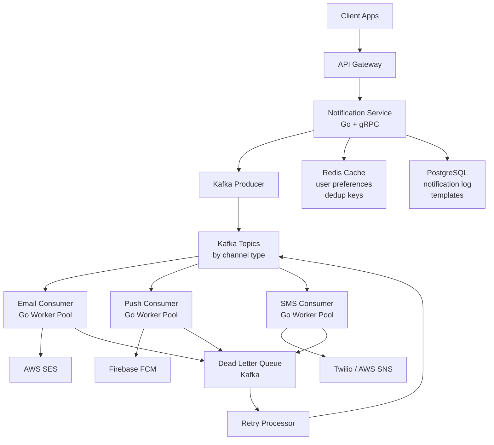
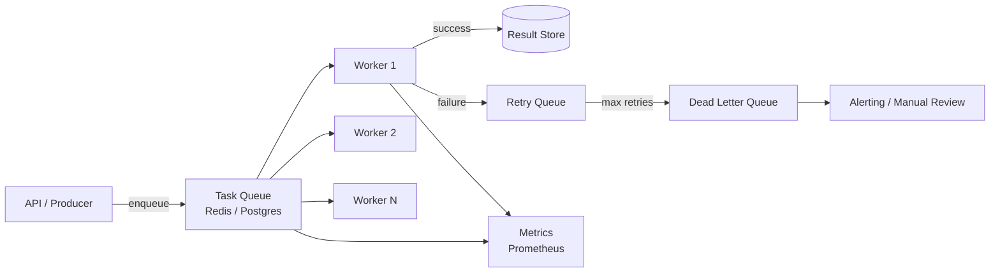

# 15-25 LPA Go Developer: Complete Preparation Guide

> Target band: 15-25 LPA (INR) | Experience: 3-6 years | Location: Bangalore, Hyderabad, Remote-first

---

## Table of Contents

1. [Target Companies](#target-companies)
2. [What Separates 15 LPA from 25 LPA Candidates](#what-separates-15-lpa-from-25-lpa-candidates)
3. [Advanced Go Knowledge Required](#advanced-go-knowledge-required)
4. [System Design at This Level](#system-design-at-this-level)
5. [DSA at This Level](#dsa-at-this-level)
6. [Behavioral Questions at This Band](#behavioral-questions-at-this-band)
7. [Sample Full Interview Simulation](#sample-full-interview-simulation)

---

## Target Companies

### PhonePe
- **Team size**: Engineering org ~2000+, Go backend teams of 6-12
- **Go stack**: Go services for payment processing, UPI flows, fraud detection, internal tooling
- **Typical role**: Backend engineer, Platform engineering, SRE
- **Hiring bar**: Strong distributed systems, high-throughput APIs, payment domain knowledge a plus. Expect concurrency deep-dives and system design for fault-tolerant payment flows. LeetCode medium-hard mandatory.

### CRED
- **Team size**: ~700 engineers, backend squads of 5-8
- **Go stack**: Go microservices for credit card management, rewards engine, bill payments
- **Typical role**: Backend SDE2/SDE3, Platform
- **Hiring bar**: Clean code, strong API design, familiarity with gRPC. CRED values engineering taste — expect code review round. Behavioral bar is high; culture fit matters significantly.

### Zepto
- **Team size**: ~400-600 engineers, high growth
- **Go stack**: Go for inventory management, order routing, delivery ETA, catalog service
- **Typical role**: Backend engineer, Infra/Platform
- **Hiring bar**: Startup pace tolerance, fast execution. Strong Go fundamentals, real-world debugging scenarios. Expect questions about handling spikes (dark stores, peak traffic).

### Razorpay
- **Team size**: ~1500+ engineers, Go teams across payments, banking, capital
- **Go stack**: Core payment gateway in Go, webhook delivery, settlement engine
- **Typical role**: SDE2/SDE3 Backend, Platform engineer
- **Hiring bar**: Payment systems knowledge, reliability engineering (retries, idempotency), strong DSA. 4-5 interview rounds standard. Expect a take-home or live coding + system design.

### Swiggy
- **Team size**: ~3000+ engineers, Go used in supply chain, logistics, catalog
- **Go stack**: Go microservices for restaurant catalog, delivery partner assignment, pricing
- **Typical role**: SDE2/SDE3 Backend, Data Platform
- **Hiring bar**: High scale experience, geospatial awareness a plus, strong system design. Expect questions on rate limiting, circuit breakers, cache invalidation.

### Ola
- **Team size**: ~1000+ engineers across Ola Cabs + Ola Electric
- **Go stack**: Ride matching engine, driver allocation, maps integration
- **Typical role**: Backend SDE2/SDE3, Platform
- **Hiring bar**: Real-time systems experience valued. Strong concurrency knowledge. Go + distributed systems combo expected at SDE3.

### Meesho
- **Team size**: ~1500 engineers, rapid growth in tier 2/3 markets focus
- **Go stack**: Go for catalog service, order management, logistics aggregation
- **Typical role**: Backend SDE2, SDE3
- **Hiring bar**: Scale-focused engineering, cost optimization awareness. Expect system design for catalog at 100M SKUs. Strong SQL and caching knowledge required.

### Dream11
- **Team size**: ~800 engineers, fantasy sports platform
- **Go stack**: Contest engine, scoring engine, wallet service in Go
- **Typical role**: Backend SDE2/SDE3, Platform
- **Hiring bar**: Peak traffic handling (IPL match moments = millions of concurrent users), strong concurrency, Redis expertise. Expect concurrency problem-solving in Go live.

### Groww
- **Team size**: ~1000+ engineers, fintech
- **Go stack**: Go for portfolio management, order execution, SIP processing
- **Typical role**: Backend SDE2/SDE3, Fintech Platform
- **Hiring bar**: Financial domain understanding helps. Strong Go + consistency guarantees. Expect questions on transactions, idempotency, reconciliation.

---

## What Separates 15 LPA from 25 LPA Candidates

### Technical Depth

| Dimension | 15 LPA Profile | 25 LPA Profile |
|-----------|---------------|----------------|
| Go runtime | Knows goroutines + channels work | Explains GMP scheduler, work-stealing, GOMAXPROCS tuning |
| Concurrency bugs | Fixes data races with mutex | Identifies root cause with race detector, redesigns to avoid contention |
| System design | Draws boxes and arrows, mentions Kafka | Sizes queues, calculates throughput, justifies DB choices with tradeoffs |
| DSA | Solves medium LeetCode with hints | Solves medium in 20 min, optimizes, discusses edge cases proactively |
| Code quality | Working code | Working + idiomatic + testable + observable |
| Production mindset | Writes code that works locally | Writes code with retries, timeouts, circuit breakers, metrics |
| Debugging | Printf debugging | pprof, trace, delve, structured log analysis |

### System Design Ability
At 25 LPA, interviewers expect you to drive the conversation: state assumptions, back-of-envelope estimate (QPS, storage), propose architecture, then defend each choice with specific tradeoffs. At 15 LPA, you answer questions. At 25 LPA, you ask clarifying questions and own the design.

### Communication
- 15 LPA: Answers what is asked
- 25 LPA: Signals tradeoffs before being asked, mentions what was intentionally NOT done and why, acknowledges when a simpler solution would suffice

### Problem-Solving Speed
At 25 LPA, interviewers expect pattern recognition. When you see a problem, you should immediately say "this looks like a sliding window" or "this is a classic producer-consumer with backpressure" — not stare at it for 5 minutes. Speed comes from drilling 200+ problems, not 50.

---

## Advanced Go Knowledge Required

### 1. GMP Scheduler Internals

**What to know**: G = goroutine (user-level thread), M = OS thread (machine), P = processor (logical CPU context holding run queue). Go runtime multiplexes N goroutines onto M OS threads using P logical processors. GOMAXPROCS controls number of P's.

**Typical interview question**: "Explain what happens when a goroutine calls a blocking syscall."

**Bad answer**: "It blocks the thread."

**Good answer**: "When a goroutine makes a blocking syscall, the runtime detaches the P from the M (thread). The blocked M holds the goroutine making the syscall. A new M is either created or pulled from a thread cache and attached to the freed P, allowing other goroutines on that P's run queue to continue executing. When the syscall returns, the goroutine tries to reacquire a P; if none available, it goes to the global run queue and the M is parked."

```go
package main

import (
    "fmt"
    "runtime"
    "sync"
    "time"
)

func demonstrateGMP() {
    // GOMAXPROCS controls number of P's (logical processors)
    // Default: number of logical CPUs
    fmt.Printf("GOMAXPROCS: %d\n", runtime.GOMAXPROCS(0))
    fmt.Printf("NumCPU: %d\n", runtime.NumCPU())

    var wg sync.WaitGroup
    // These goroutines compete for P's
    for i := 0; i < 5; i++ {
        wg.Add(1)
        go func(id int) {
            defer wg.Done()
            // runtime.Gosched() yields the current goroutine,
            // giving other goroutines a chance to run on this P
            runtime.Gosched()
            fmt.Printf("goroutine %d running on thread\n", id)
        }(i)
    }

    // NumGoroutine shows live goroutine count — useful for leak detection
    fmt.Printf("Active goroutines: %d\n", runtime.NumGoroutine())
    wg.Wait()
    time.Sleep(time.Millisecond) // let scheduler settle
    fmt.Printf("After wait: %d\n", runtime.NumGoroutine())
}
```

---

### 2. Goroutine Lifecycle and Leak Detection

**What to know**: Goroutines are cheap (~2KB stack initial) but not free. A goroutine leaks when it is blocked forever — waiting on a channel nobody sends to, holding a mutex nobody releases, or stuck in an infinite loop. In production, leaks manifest as memory growth and eventually OOM.

**Typical interview question**: "You notice your service's memory grows 50MB every hour and never drops. How do you investigate?"

**Bad answer**: "I'd restart the service and add more memory."

**Good answer**: Expose `/debug/pprof`, take a goroutine profile, look for goroutines stuck in the same stack frame. Use `runtime.NumGoroutine()` as a metric. Fix the root cause: add context cancellation or close channels properly.

```go
package main

import (
    "context"
    "fmt"
    "net/http"
    _ "net/http/pprof" // registers /debug/pprof handlers
    "runtime"
    "time"
)

// LEAKY version — goroutine blocks forever if no sender
func leakyWorker(jobs <-chan int) {
    go func() {
        for job := range jobs { // blocks if channel never closed
            fmt.Println("processing", job)
        }
    }()
}

// CORRECT version — uses context for cancellation
func safeWorker(ctx context.Context, jobs <-chan int) {
    go func() {
        for {
            select {
            case <-ctx.Done():
                fmt.Println("worker shutting down:", ctx.Err())
                return
            case job, ok := <-jobs:
                if !ok {
                    return // channel closed
                }
                fmt.Println("processing", job)
            }
        }
    }()
}

func main() {
    // Expose pprof — in production, restrict to internal network
    go http.ListenAndServe(":6060", nil)

    ctx, cancel := context.WithTimeout(context.Background(), 2*time.Second)
    defer cancel()

    jobs := make(chan int, 10)
    safeWorker(ctx, jobs)

    for i := 0; i < 5; i++ {
        jobs <- i
    }

    fmt.Printf("Goroutines before cancel: %d\n", runtime.NumGoroutine())
    cancel()
    time.Sleep(10 * time.Millisecond)
    fmt.Printf("Goroutines after cancel: %d\n", runtime.NumGoroutine())
    // Access goroutine profiles at: http://localhost:6060/debug/pprof/goroutine?debug=2
}
```

---

### 3. Channel Internals and Select Implementation

**What to know**: A channel is a circular buffer with a mutex and two wait queues (sendq, recvq). When a send has no receiver, the goroutine parks itself in sendq. Select with multiple cases: Go shuffles case order randomly (prevents starvation), then checks each for readiness, then blocks.

**Typical interview question**: "What happens when you select on two channels that are both ready simultaneously?"

**Bad answer**: "It picks the first one."

**Good answer**: "Go's runtime shuffles the case order pseudo-randomly before evaluating, so both have an equal chance. This prevents starvation of any single channel. The selection is non-deterministic by design."

```go
package main

import (
    "fmt"
    "time"
)

// Fan-in pattern: merge multiple channels into one
func fanIn(channels ...<-chan int) <-chan int {
    merged := make(chan int, 10)
    done := make(chan struct{})

    for _, ch := range channels {
        ch := ch // capture range variable
        go func() {
            for v := range ch {
                select {
                case merged <- v:
                case <-done:
                    return
                }
            }
        }()
    }

    // Close merged after all inputs drain — use a separate goroutine
    go func() {
        // In real code, use sync.WaitGroup to know when all senders finish
        time.Sleep(100 * time.Millisecond)
        close(merged)
    }()

    _ = done // would be closed on shutdown
    return merged
}

// Timeout pattern — critical in production services
func fetchWithTimeout(url string) (string, error) {
    result := make(chan string, 1)
    go func() {
        // simulate network call
        time.Sleep(50 * time.Millisecond)
        result <- "data from " + url
    }()

    select {
    case data := <-result:
        return data, nil
    case <-time.After(30 * time.Millisecond):
        return "", fmt.Errorf("fetch timed out for %s", url)
    }
}

func main() {
    data, err := fetchWithTimeout("https://api.example.com")
    fmt.Println(data, err)
}
```

---

### 4. Memory Model and Happens-Before

**What to know**: Go's memory model defines when one goroutine is guaranteed to observe writes made by another. Without synchronization, reads and writes to shared variables are data races — undefined behavior. Synchronization primitives (mutexes, channels, sync/atomic) establish happens-before edges.

**Typical interview question**: "Is this code safe?" (shows two goroutines reading/writing a variable with no mutex)

**Bad answer**: "It might work most of the time."

**Good answer**: "No — this is a data race. The Go memory model does not guarantee visibility of writes across goroutines without explicit synchronization. Use `sync/atomic` for single values or `sync.Mutex` for compound state. Run with `go test -race` to detect it."

```go
package main

import (
    "fmt"
    "sync"
    "sync/atomic"
)

// UNSAFE: data race — not guaranteed to see final count
func unsafeCounter() {
    count := 0
    var wg sync.WaitGroup
    for i := 0; i < 1000; i++ {
        wg.Add(1)
        go func() {
            defer wg.Done()
            count++ // read-modify-write is NOT atomic
        }()
    }
    wg.Wait()
    fmt.Println("unsafe count:", count) // likely != 1000
}

// SAFE with atomic
func atomicCounter() {
    var count int64
    var wg sync.WaitGroup
    for i := 0; i < 1000; i++ {
        wg.Add(1)
        go func() {
            defer wg.Done()
            atomic.AddInt64(&count, 1) // atomic CAS loop — safe
        }()
    }
    wg.Wait()
    fmt.Println("atomic count:", count) // always 1000
}

// Channel send happens-before corresponding receive
func channelHappensBefore() {
    done := make(chan struct{})
    x := 0
    go func() {
        x = 42             // write
        done <- struct{}{} // send happens-after write
    }()
    <-done          // receive happens-before read below
    fmt.Println(x) // guaranteed to see 42
}

func main() {
    atomicCounter()
    channelHappensBefore()
}
```

---

### 5. Escape Analysis and Heap Allocation

**What to know**: The Go compiler decides whether a variable lives on the stack (fast, auto-freed) or heap (GC-managed). Escape analysis determines this. A variable escapes to the heap when: it outlives its function (returned pointer), captured by a closure, passed to an interface, or too large for stack.

**Typical interview question**: "Why does allocating inside a hot loop slow your service down?"

**Bad answer**: "Memory is slow."

**Good answer**: "Heap allocations in hot paths increase GC pressure. More allocations = more GC cycles = more stop-the-world (STW) pauses = latency spikes. Use `sync.Pool` to reuse objects, pre-allocate slices with correct capacity, and avoid interface boxing of value types in tight loops. Use `go build -gcflags='-m'` to see escape decisions."

```go
package main

import "fmt"

// This does NOT escape — compiler can prove it lives on stack
func noEscape() int {
    x := 42 // stack allocated
    return x // returns value, not pointer
}

// This ESCAPES to heap — pointer returned, outlives function
func escapesToHeap() *int {
    x := 42
    return &x // x must live beyond function return
}

// Closure capture causes escape
func closureEscape() func() int {
    x := 100 // escapes because closure captures it
    return func() int { return x }
}

// Interface boxing causes escape
func interfaceEscape(v interface{}) {
    fmt.Println(v) // v escapes into fmt.Println's interface param
}

// Check with: go build -gcflags='-m -m' ./...
// Output will show lines like: "x escapes to heap"

// sync.Pool to reduce allocations in hot paths
// (see sync.Pool section for full example)

func main() {
    _ = noEscape()
    _ = escapesToHeap()
    f := closureEscape()
    fmt.Println(f())
}
```

---

### 6. sync.Pool, sync.Map, and Atomic Operations

**What to know**: `sync.Pool` recycles objects across GC cycles — not a permanent cache. `sync.Map` is optimized for read-heavy concurrent maps where keys are written once and read many times. Atomics are for single-word lock-free operations; prefer over mutexes only when profiling shows mutex contention.

**Typical interview question**: "When would you use sync.Pool over sync.Map over a regular mutex-protected map?"

```go
package main

import (
    "bytes"
    "fmt"
    "sync"
    "sync/atomic"
)

// sync.Pool: reuse expensive allocations (e.g., bytes.Buffer in HTTP handlers)
var bufPool = sync.Pool{
    New: func() interface{} {
        return new(bytes.Buffer)
    },
}

func handleRequest(data string) string {
    buf := bufPool.Get().(*bytes.Buffer)
    buf.Reset() // CRITICAL: always reset before use
    defer bufPool.Put(buf)

    buf.WriteString("processed: ")
    buf.WriteString(data)
    return buf.String()
}

// sync.Map: concurrent cache with read-heavy workload
var cache sync.Map

func getOrCompute(key string) string {
    if v, ok := cache.Load(key); ok {
        return v.(string) // fast path: no lock needed for read
    }
    value := "computed_" + key
    cache.Store(key, value) // uses internal sharding
    return value
}

// Atomic for metrics counters — no mutex overhead
type Metrics struct {
    requests int64
    errors   int64
    latencyNs int64
}

func (m *Metrics) RecordRequest(latency int64) {
    atomic.AddInt64(&m.requests, 1)
    atomic.AddInt64(&m.latencyNs, latency)
}

func (m *Metrics) RecordError() {
    atomic.AddInt64(&m.errors, 1)
}

func (m *Metrics) Report() {
    reqs := atomic.LoadInt64(&m.requests)
    errs := atomic.LoadInt64(&m.errors)
    fmt.Printf("requests=%d errors=%d\n", reqs, errs)
}

func main() {
    fmt.Println(handleRequest("hello"))
    fmt.Println(getOrCompute("user:123"))

    m := &Metrics{}
    m.RecordRequest(1500000) // 1.5ms in ns
    m.RecordError()
    m.Report()
}
```

---

### 7. Generics (Type Parameters and Constraints)

**What to know**: Go 1.18+ generics use type parameters `[T constraint]`. Constraints are interface types. Common constraints: `any`, `comparable`, `~int | ~string`. Use generics to eliminate code duplication for container types, functional utilities (Map, Filter, Reduce), and algorithms.

**Typical interview question**: "Write a generic Stack implementation in Go."

```go
package main

import (
    "cmp"
    "fmt"
)

// Generic Stack
type Stack[T any] struct {
    items []T
}

func (s *Stack[T]) Push(item T) {
    s.items = append(s.items, item)
}

func (s *Stack[T]) Pop() (T, bool) {
    var zero T
    if len(s.items) == 0 {
        return zero, false
    }
    last := len(s.items) - 1
    item := s.items[last]
    s.items = s.items[:last]
    return item, true
}

func (s *Stack[T]) Peek() (T, bool) {
    var zero T
    if len(s.items) == 0 {
        return zero, false
    }
    return s.items[len(s.items)-1], true
}

// Generic Map function
func Map[T, U any](slice []T, fn func(T) U) []U {
    result := make([]U, len(slice))
    for i, v := range slice {
        result[i] = fn(v)
    }
    return result
}

// Generic Filter
func Filter[T any](slice []T, predicate func(T) bool) []T {
    var result []T
    for _, v := range slice {
        if predicate(v) {
            result = append(result, v)
        }
    }
    return result
}

// Ordered constraint using cmp package (Go 1.21+)
func Min[T cmp.Ordered](a, b T) T {
    if a < b {
        return a
    }
    return b
}

func main() {
    s := Stack[int]{}
    s.Push(1)
    s.Push(2)
    s.Push(3)

    for {
        v, ok := s.Pop()
        if !ok {
            break
        }
        fmt.Println(v)
    }

    doubled := Map([]int{1, 2, 3, 4}, func(x int) int { return x * 2 })
    fmt.Println(doubled)

    evens := Filter([]int{1, 2, 3, 4, 5, 6}, func(x int) bool { return x%2 == 0 })
    fmt.Println(evens)

    fmt.Println(Min(3.14, 2.71))
}
```

---

### 8. Context Propagation Patterns

**What to know**: `context.Context` carries deadlines, cancellation signals, and request-scoped values across API boundaries. Rule: context is always the first argument, never stored in a struct. Use `context.WithTimeout` for downstream calls, `context.WithCancel` for cleanup, `context.WithValue` sparingly (only for request metadata, not business data).

**Typical interview question**: "How do you propagate a request ID through all layers of your service for distributed tracing?"

```go
package main

import (
    "context"
    "fmt"
    "log"
    "net/http"
    "time"
)

type contextKey string

const (
    requestIDKey contextKey = "request_id"
    userIDKey    contextKey = "user_id"
)

// Middleware: inject request ID
func withRequestID(next http.HandlerFunc) http.HandlerFunc {
    return func(w http.ResponseWriter, r *http.Request) {
        reqID := r.Header.Get("X-Request-ID")
        if reqID == "" {
            reqID = fmt.Sprintf("req-%d", time.Now().UnixNano())
        }
        ctx := context.WithValue(r.Context(), requestIDKey, reqID)
        next(w, r.WithContext(ctx))
    }
}

// Extract helper — avoids string type assertions scattered everywhere
func RequestIDFromCtx(ctx context.Context) string {
    if v, ok := ctx.Value(requestIDKey).(string); ok {
        return v
    }
    return "unknown"
}

// Service layer: always accept and pass context
type UserService struct{}

func (s *UserService) GetUser(ctx context.Context, id string) (string, error) {
    // Propagate context to DB call — timeout from parent propagates
    return s.repo(ctx, id)
}

func (s *UserService) repo(ctx context.Context, id string) (string, error) {
    reqID := RequestIDFromCtx(ctx)
    log.Printf("[%s] fetching user %s", reqID, id)

    // Simulate DB with deadline check
    select {
    case <-ctx.Done():
        return "", fmt.Errorf("context cancelled: %w", ctx.Err())
    case <-time.After(10 * time.Millisecond):
        return "user-data-for-" + id, nil
    }
}

func handler(w http.ResponseWriter, r *http.Request) {
    ctx, cancel := context.WithTimeout(r.Context(), 500*time.Millisecond)
    defer cancel()

    svc := &UserService{}
    data, err := svc.GetUser(ctx, "user123")
    if err != nil {
        http.Error(w, err.Error(), http.StatusGatewayTimeout)
        return
    }
    fmt.Fprint(w, data)
}
```

---

### 9. HTTP Middleware Chains

**What to know**: Middleware in Go is a function that wraps `http.Handler`. Standard pattern: `func(next http.Handler) http.Handler`. Chains are composed right-to-left or via helper libraries. Key middleware: logging, auth, rate limiting, panic recovery, request ID injection, timeout.

```go
package main

import (
    "fmt"
    "log"
    "net/http"
    "time"
)

type Middleware func(http.Handler) http.Handler

// Chain applies middlewares in order (left to right = outer to inner)
func Chain(h http.Handler, middlewares ...Middleware) http.Handler {
    for i := len(middlewares) - 1; i >= 0; i-- {
        h = middlewares[i](h)
    }
    return h
}

func LoggingMiddleware(next http.Handler) http.Handler {
    return http.HandlerFunc(func(w http.ResponseWriter, r *http.Request) {
        start := time.Now()
        wrapped := &responseWriter{ResponseWriter: w, status: 200}
        next.ServeHTTP(wrapped, r)
        log.Printf("%s %s %d %v", r.Method, r.URL.Path, wrapped.status, time.Since(start))
    })
}

func RecoveryMiddleware(next http.Handler) http.Handler {
    return http.HandlerFunc(func(w http.ResponseWriter, r *http.Request) {
        defer func() {
            if err := recover(); err != nil {
                log.Printf("panic recovered: %v", err)
                http.Error(w, "internal server error", http.StatusInternalServerError)
            }
        }()
        next.ServeHTTP(w, r)
    })
}

func AuthMiddleware(next http.Handler) http.Handler {
    return http.HandlerFunc(func(w http.ResponseWriter, r *http.Request) {
        token := r.Header.Get("Authorization")
        if token == "" {
            http.Error(w, "unauthorized", http.StatusUnauthorized)
            return
        }
        next.ServeHTTP(w, r)
    })
}

type responseWriter struct {
    http.ResponseWriter
    status int
}

func (rw *responseWriter) WriteHeader(code int) {
    rw.status = code
    rw.ResponseWriter.WriteHeader(code)
}

func main() {
    mux := http.NewServeMux()
    mux.HandleFunc("/api/users", func(w http.ResponseWriter, r *http.Request) {
        fmt.Fprint(w, "users list")
    })

    handler := Chain(mux,
        RecoveryMiddleware,
        LoggingMiddleware,
        AuthMiddleware,
    )

    log.Fatal(http.ListenAndServe(":8080", handler))
}
```

---

### 10. gRPC + Protobuf in Production

**What to know**: gRPC uses HTTP/2 for multiplexing, protobuf for serialization (3-10x smaller than JSON, strongly typed). Key production concerns: interceptors (equivalent to middleware), deadlines propagation, error codes (use `codes` package not raw errors), health checks, graceful shutdown.

**Typical interview question**: "How do you add authentication to every gRPC call without modifying each handler?"

**Good answer**: Unary and stream interceptors — equivalent to HTTP middleware. Use `grpc.UnaryInterceptor` on server, `grpc.WithUnaryInterceptor` on client.

```go
// server/main.go — production-ready gRPC server sketch
package main

import (
    "context"
    "log"
    "net"
    "time"

    "google.golang.org/grpc"
    "google.golang.org/grpc/codes"
    "google.golang.org/grpc/metadata"
    "google.golang.org/grpc/status"
)

// Unary interceptor for auth + logging
func authInterceptor(
    ctx context.Context,
    req interface{},
    info *grpc.UnaryServerInfo,
    handler grpc.UnaryHandler,
) (interface{}, error) {
    start := time.Now()

    md, ok := metadata.FromIncomingContext(ctx)
    if !ok {
        return nil, status.Error(codes.Unauthenticated, "missing metadata")
    }

    tokens := md.Get("authorization")
    if len(tokens) == 0 || tokens[0] == "" {
        return nil, status.Error(codes.Unauthenticated, "missing token")
    }

    // Validate token (stub)
    if tokens[0] != "Bearer valid-token" {
        return nil, status.Error(codes.PermissionDenied, "invalid token")
    }

    resp, err := handler(ctx, req)

    log.Printf("method=%s duration=%v err=%v", info.FullMethod, time.Since(start), err)
    return resp, err
}

func main() {
    lis, err := net.Listen("tcp", ":50051")
    if err != nil {
        log.Fatal(err)
    }

    srv := grpc.NewServer(
        grpc.UnaryInterceptor(authInterceptor),
        grpc.MaxRecvMsgSize(4*1024*1024), // 4MB
    )

    // pb.RegisterUserServiceServer(srv, &userServiceImpl{})
    // reflection.Register(srv) // enable grpcurl in dev

    log.Println("gRPC server listening on :50051")
    if err := srv.Serve(lis); err != nil {
        log.Fatal(err)
    }
}
```

---

## System Design at This Level

### 1. Notification Service (10M Users)

#### Architecture Overview



#### Scale Considerations
- **10M users, 1M notifications/hour** = ~278 notifications/sec baseline
- **Peak** (product launch, IPL moment): 10x = 2780/sec
- **Kafka partitions**: 30 partitions per topic, each consumer handles ~90/sec — well within capacity
- **Dedup**: Redis `SETNX` with 24hr TTL to prevent double-send on producer retry
- **User preferences** (do-not-disturb, channel opt-out): cached in Redis, TTL 5min, written to Postgres

#### Go Implementation Sketch

```go
package notification

import (
    "context"
    "encoding/json"
    "fmt"
    "log"
    "sync"
    "time"

    "github.com/IBM/sarama"
)

type NotificationType string

const (
    TypeEmail NotificationType = "email"
    TypePush  NotificationType = "push"
    TypeSMS   NotificationType = "sms"
)

type Notification struct {
    ID        string           `json:"id"`
    UserID    string           `json:"user_id"`
    Type      NotificationType `json:"type"`
    Template  string           `json:"template"`
    Data      map[string]any   `json:"data"`
    CreatedAt time.Time        `json:"created_at"`
    Retry     int              `json:"retry"`
}

type NotificationService struct {
    producer sarama.SyncProducer
    cache    CacheClient // Redis abstraction
    db       DBClient    // Postgres abstraction
}

func (s *NotificationService) Send(ctx context.Context, n *Notification) error {
    // 1. Check user preferences
    if opted, err := s.cache.IsOptedOut(ctx, n.UserID, string(n.Type)); opted || err != nil {
        return fmt.Errorf("user opted out or cache error: %w", err)
    }

    // 2. Dedup check
    dedupKey := fmt.Sprintf("notif:dedup:%s", n.ID)
    if sent, _ := s.cache.SetNX(ctx, dedupKey, "1", 24*time.Hour); !sent {
        log.Printf("duplicate notification %s, skipping", n.ID)
        return nil
    }

    // 3. Persist to DB for audit
    if err := s.db.Insert(ctx, n); err != nil {
        return fmt.Errorf("db insert: %w", err)
    }

    // 4. Publish to Kafka
    payload, _ := json.Marshal(n)
    msg := &sarama.ProducerMessage{
        Topic: "notifications." + string(n.Type),
        Key:   sarama.StringEncoder(n.UserID), // same user -> same partition -> ordering
        Value: sarama.ByteEncoder(payload),
    }
    _, _, err := s.producer.SendMessage(msg)
    return err
}

// Worker pool for consuming and dispatching
type Worker struct {
    id       int
    consumer sarama.ConsumerGroup
    sender   ChannelSender // email/push/sms implementation
}

func StartWorkerPool(ctx context.Context, size int, consumer sarama.ConsumerGroup, sender ChannelSender) {
    var wg sync.WaitGroup
    sem := make(chan struct{}, size) // concurrency limiter

    for {
        select {
        case <-ctx.Done():
            wg.Wait()
            return
        case msg := <-messages(consumer):
            sem <- struct{}{}
            wg.Add(1)
            go func(m *sarama.ConsumerMessage) {
                defer wg.Done()
                defer func() { <-sem }()

                var n Notification
                if err := json.Unmarshal(m.Value, &n); err != nil {
                    log.Printf("unmarshal error: %v", err)
                    return
                }

                if err := sender.Send(ctx, &n); err != nil {
                    // route to DLQ after max retries
                    if n.Retry >= 3 {
                        routeToDLQ(ctx, &n)
                        return
                    }
                    n.Retry++
                    requeueWithBackoff(ctx, &n)
                }
            }(msg)
        }
    }
}

// Stubs for interface clarity
type CacheClient interface {
    IsOptedOut(ctx context.Context, userID, channel string) (bool, error)
    SetNX(ctx context.Context, key, val string, ttl time.Duration) (bool, error)
}
type DBClient interface{ Insert(ctx context.Context, n *Notification) error }
type ChannelSender interface{ Send(ctx context.Context, n *Notification) error }

func messages(cg sarama.ConsumerGroup) <-chan *sarama.ConsumerMessage { return nil } // stub
func routeToDLQ(ctx context.Context, n *Notification)                {}
func requeueWithBackoff(ctx context.Context, n *Notification)        {}
```

#### Database Choices
- **PostgreSQL**: notification audit log, templates, user preferences source of truth
- **Redis**: dedup keys (TTL-based), user opt-out cache, rate limiting counters
- **Kafka**: decouples ingestion from delivery, handles spikes, replay on failure
- **Do NOT use**: MySQL for append-heavy log (Postgres WAL is better), DynamoDB unless multi-region needed

---

### 2. Rate Limiter — Token Bucket in Go

#### Full In-Process Implementation

```go
package ratelimit

import (
    "context"
    "fmt"
    "sync"
    "time"
)

// TokenBucket implements token bucket algorithm
// Allows bursts up to capacity, refills at rate tokens/second
type TokenBucket struct {
    capacity  float64
    tokens    float64
    rate      float64 // tokens per second
    lastRefil time.Time
    mu        sync.Mutex
}

func NewTokenBucket(capacity, ratePerSec float64) *TokenBucket {
    return &TokenBucket{
        capacity:  capacity,
        tokens:    capacity,
        rate:      ratePerSec,
        lastRefil: time.Now(),
    }
}

func (tb *TokenBucket) Allow() bool {
    return tb.AllowN(1)
}

func (tb *TokenBucket) AllowN(n float64) bool {
    tb.mu.Lock()
    defer tb.mu.Unlock()

    now := time.Now()
    elapsed := now.Sub(tb.lastRefil).Seconds()
    tb.tokens = min(tb.capacity, tb.tokens+elapsed*tb.rate)
    tb.lastRefil = now

    if tb.tokens >= n {
        tb.tokens -= n
        return true
    }
    return false
}

func min(a, b float64) float64 {
    if a < b {
        return a
    }
    return b
}

// Per-key rate limiter (per user/IP)
type MultiLimiter struct {
    mu       sync.RWMutex
    limiters map[string]*TokenBucket
    capacity float64
    rate     float64
}

func NewMultiLimiter(capacity, rate float64) *MultiLimiter {
    return &MultiLimiter{
        limiters: make(map[string]*TokenBucket),
        capacity: capacity,
        rate:     rate,
    }
}

func (ml *MultiLimiter) Allow(key string) bool {
    ml.mu.RLock()
    lb, ok := ml.limiters[key]
    ml.mu.RUnlock()

    if !ok {
        ml.mu.Lock()
        // Double-check after acquiring write lock
        if lb, ok = ml.limiters[key]; !ok {
            lb = NewTokenBucket(ml.capacity, ml.rate)
            ml.limiters[key] = lb
        }
        ml.mu.Unlock()
    }
    return lb.Allow()
}
```

#### Distributed Rate Limiter (Redis-Based)

```go
package ratelimit

import (
    "context"
    "fmt"
    "time"

    "github.com/redis/go-redis/v9"
)

// Distributed token bucket using Redis Lua script (atomic)
// Lua runs atomically on Redis — no race conditions across replicas
const tokenBucketLua = `
local key = KEYS[1]
local capacity = tonumber(ARGV[1])
local rate = tonumber(ARGV[2])   -- tokens per second
local now = tonumber(ARGV[3])    -- unix timestamp milliseconds
local requested = tonumber(ARGV[4])

local fill_time = capacity / rate
local ttl = math.floor(fill_time * 2)

local last_tokens = tonumber(redis.call("HGET", key, "tokens"))
if last_tokens == nil then
    last_tokens = capacity
end

local last_refreshed = tonumber(redis.call("HGET", key, "ts"))
if last_refreshed == nil then
    last_refreshed = 0
end

local delta = math.max(0, now - last_refreshed)
local filled_tokens = math.min(capacity, last_tokens + (delta / 1000.0 * rate))
local allowed = filled_tokens >= requested
local new_tokens = filled_tokens
if allowed then
    new_tokens = filled_tokens - requested
end

redis.call("HSET", key, "tokens", new_tokens, "ts", now)
redis.call("EXPIRE", key, ttl)

return { allowed and 1 or 0, math.floor(new_tokens) }
`

type RedisRateLimiter struct {
    client   *redis.Client
    capacity float64
    rate     float64
    script   *redis.Script
}

func NewRedisRateLimiter(client *redis.Client, capacity, rate float64) *RedisRateLimiter {
    return &RedisRateLimiter{
        client:   client,
        capacity: capacity,
        rate:     rate,
        script:   redis.NewScript(tokenBucketLua),
    }
}

func (r *RedisRateLimiter) Allow(ctx context.Context, key string) (bool, error) {
    now := time.Now().UnixMilli()
    result, err := r.script.Run(ctx, r.client,
        []string{fmt.Sprintf("ratelimit:%s", key)},
        r.capacity, r.rate, now, 1,
    ).Slice()

    if err != nil {
        // Fail open on Redis error — don't block users if Redis is down
        return true, err
    }

    allowed, _ := result[0].(int64)
    return allowed == 1, nil
}
```

---

### 3. Job Queue / Task Worker System

#### Architecture



#### Full Worker Pool Implementation with Retry and DLQ

```go
package worker

import (
    "context"
    "encoding/json"
    "fmt"
    "log"
    "math"
    "sync"
    "time"
)

type TaskStatus string

const (
    StatusPending   TaskStatus = "pending"
    StatusRunning   TaskStatus = "running"
    StatusDone      TaskStatus = "done"
    StatusFailed    TaskStatus = "failed"
    StatusDead      TaskStatus = "dead" // in DLQ
)

const MaxRetries = 3

type Task struct {
    ID          string         `json:"id"`
    Type        string         `json:"type"`
    Payload     json.RawMessage `json:"payload"`
    Retries     int            `json:"retries"`
    ScheduledAt time.Time      `json:"scheduled_at"`
    CreatedAt   time.Time      `json:"created_at"`
}

type Handler func(ctx context.Context, task *Task) error

type WorkerPool struct {
    queue   chan *Task
    dlq     chan *Task
    retry   chan *Task
    handler map[string]Handler
    wg      sync.WaitGroup
    metrics *WorkerMetrics
}

type WorkerMetrics struct {
    processed int64
    failed    int64
    dead      int64
    mu        sync.Mutex
}

func NewWorkerPool(size int) *WorkerPool {
    wp := &WorkerPool{
        queue:   make(chan *Task, 1000),
        dlq:     make(chan *Task, 100),
        retry:   make(chan *Task, 500),
        handler: make(map[string]Handler),
        metrics: &WorkerMetrics{},
    }

    for i := 0; i < size; i++ {
        wp.wg.Add(1)
        go wp.runWorker(i)
    }

    // Retry scheduler: moves retry tasks back to main queue after backoff
    go wp.runRetryScheduler()

    return wp
}

func (wp *WorkerPool) Register(taskType string, h Handler) {
    wp.handler[taskType] = h
}

func (wp *WorkerPool) Enqueue(task *Task) {
    wp.queue <- task
}

func (wp *WorkerPool) runWorker(id int) {
    defer wp.wg.Done()
    for task := range wp.queue {
        wp.process(id, task)
    }
}

func (wp *WorkerPool) process(workerID int, task *Task) {
    ctx, cancel := context.WithTimeout(context.Background(), 30*time.Second)
    defer cancel()

    h, ok := wp.handler[task.Type]
    if !ok {
        log.Printf("[worker %d] no handler for type %s", workerID, task.Type)
        return
    }

    log.Printf("[worker %d] processing task %s (attempt %d)", workerID, task.ID, task.Retries+1)

    err := h(ctx, task)
    if err == nil {
        wp.metrics.mu.Lock()
        wp.metrics.processed++
        wp.metrics.mu.Unlock()
        log.Printf("[worker %d] task %s done", workerID, task.ID)
        return
    }

    log.Printf("[worker %d] task %s failed: %v", workerID, task.ID, err)
    task.Retries++

    if task.Retries >= MaxRetries {
        wp.metrics.mu.Lock()
        wp.metrics.dead++
        wp.metrics.mu.Unlock()
        log.Printf("[worker %d] task %s exceeded max retries, routing to DLQ", workerID, task.ID)
        wp.dlq <- task
        return
    }

    // Exponential backoff: 5s, 25s, 125s
    backoff := time.Duration(math.Pow(5, float64(task.Retries))) * time.Second
    task.ScheduledAt = time.Now().Add(backoff)
    log.Printf("[worker %d] task %s scheduled for retry in %v", workerID, task.ID, backoff)
    wp.retry <- task
}

// runRetryScheduler polls retry queue and re-enqueues ready tasks
func (wp *WorkerPool) runRetryScheduler() {
    ticker := time.NewTicker(time.Second)
    defer ticker.Stop()

    var pending []*Task

    for {
        select {
        case task := <-wp.retry:
            pending = append(pending, task)
        case <-ticker.C:
            now := time.Now()
            var remaining []*Task
            for _, t := range pending {
                if now.After(t.ScheduledAt) {
                    wp.queue <- t
                } else {
                    remaining = append(remaining, t)
                }
            }
            pending = remaining
        }
    }
}

func (wp *WorkerPool) Shutdown() {
    close(wp.queue)
    wp.wg.Wait()
    log.Printf("worker pool shutdown: processed=%d failed=%d dead=%d",
        wp.metrics.processed, wp.metrics.failed, wp.metrics.dead)
}

// Example: register an email task handler
func ExampleUsage() {
    pool := NewWorkerPool(10)
    defer pool.Shutdown()

    pool.Register("send_email", func(ctx context.Context, task *Task) error {
        var payload struct {
            To      string `json:"to"`
            Subject string `json:"subject"`
        }
        if err := json.Unmarshal(task.Payload, &payload); err != nil {
            return fmt.Errorf("unmarshal: %w", err)
        }
        log.Printf("sending email to %s: %s", payload.To, payload.Subject)
        // call email provider here
        return nil
    })

    payload, _ := json.Marshal(map[string]string{"to": "user@example.com", "subject": "Welcome"})
    pool.Enqueue(&Task{
        ID:        "task-001",
        Type:      "send_email",
        Payload:   payload,
        CreatedAt: time.Now(),
    })

    time.Sleep(100 * time.Millisecond)
}
```

---

## DSA at This Level

### Problem List by Category

#### Sliding Window (10 Problems)
1. Maximum sum subarray of size K
2. Longest substring without repeating characters
3. Minimum window substring
4. Longest substring with at most K distinct characters
5. Find all anagrams in a string
6. Maximum of all subarrays of size K (deque)
7. Smallest subarray with sum >= S
8. Longest repeating character replacement
9. Permutation in string
10. Maximum points from cards (reverse sliding window)

#### Two Pointers (8 Problems)
1. Two sum (sorted array)
2. Container with most water
3. 3Sum
4. Remove duplicates from sorted array
5. Trapping rain water
6. Sort colors (Dutch national flag)
7. Merge sorted arrays
8. Linked list cycle detection (Floyd's)

#### Binary Search (8 Problems)
1. Search in rotated sorted array
2. Find minimum in rotated array
3. Kth smallest in sorted matrix
4. Median of two sorted arrays
5. Search in 2D matrix
6. Find peak element
7. Capacity to ship packages within D days
8. Aggressive cows / Allocate minimum pages (binary search on answer)

#### Trees (12 Problems)
1. Inorder / Preorder / Postorder traversal (iterative)
2. Level order traversal (BFS)
3. Maximum depth of binary tree
4. Lowest common ancestor
5. Binary tree from preorder and inorder
6. Validate BST
7. Kth smallest in BST
8. Diameter of binary tree
9. Right side view
10. Serialize and deserialize binary tree
11. Path sum II (all root-to-leaf paths)
12. Flatten binary tree to linked list

#### Graphs (12 Problems)
1. BFS / DFS (adjacency list)
2. Number of islands
3. Clone graph
4. Course schedule (cycle detection in directed graph)
5. Topological sort
6. Shortest path in unweighted graph (BFS)
7. Dijkstra's shortest path
8. Detect cycle in undirected graph (Union-Find)
9. Number of provinces (connected components)
10. Word ladder
11. Bipartite check
12. Critical connections (bridges — Tarjan's algorithm)

#### Dynamic Programming (10 Problems)
1. Coin change (minimum coins)
2. Longest common subsequence
3. Longest increasing subsequence
4. 0/1 Knapsack
5. Edit distance
6. Maximum product subarray
7. Unique paths in grid
8. Jump game II (minimum jumps)
9. Palindrome partitioning (minimum cuts)
10. Word break

---

### Top 15 Most-Asked Problems — Full Go Solutions

#### 1. Longest Substring Without Repeating Characters

```go
// Time: O(n) | Space: O(min(n,alphabet))
func lengthOfLongestSubstring(s string) int {
    charIndex := make(map[byte]int)
    maxLen, left := 0, 0

    for right := 0; right < len(s); right++ {
        if idx, ok := charIndex[s[right]]; ok && idx >= left {
            left = idx + 1 // shrink window past duplicate
        }
        charIndex[s[right]] = right
        if right-left+1 > maxLen {
            maxLen = right - left + 1
        }
    }
    return maxLen
}
```

#### 2. Two Sum

```go
// Time: O(n) | Space: O(n)
func twoSum(nums []int, target int) []int {
    seen := make(map[int]int) // value -> index
    for i, n := range nums {
        complement := target - n
        if j, ok := seen[complement]; ok {
            return []int{j, i}
        }
        seen[n] = i
    }
    return nil
}
```

#### 3. Maximum Subarray (Kadane's Algorithm)

```go
// Time: O(n) | Space: O(1)
func maxSubArray(nums []int) int {
    maxSum := nums[0]
    current := nums[0]
    for _, n := range nums[1:] {
        if current < 0 {
            current = n // restart from current element
        } else {
            current += n
        }
        if current > maxSum {
            maxSum = current
        }
    }
    return maxSum
}
```

#### 4. Search in Rotated Sorted Array

```go
// Time: O(log n) | Space: O(1)
func search(nums []int, target int) int {
    lo, hi := 0, len(nums)-1
    for lo <= hi {
        mid := lo + (hi-lo)/2
        if nums[mid] == target {
            return mid
        }
        // Left half is sorted
        if nums[lo] <= nums[mid] {
            if nums[lo] <= target && target < nums[mid] {
                hi = mid - 1
            } else {
                lo = mid + 1
            }
        } else { // Right half is sorted
            if nums[mid] < target && target <= nums[hi] {
                lo = mid + 1
            } else {
                hi = mid - 1
            }
        }
    }
    return -1
}
```

#### 5. Validate Binary Search Tree

```go
// Time: O(n) | Space: O(h) where h = height
import "math"

func isValidBST(root *TreeNode) bool {
    return validate(root, math.MinInt64, math.MaxInt64)
}

func validate(node *TreeNode, min, max int) bool {
    if node == nil {
        return true
    }
    if node.Val <= min || node.Val >= max {
        return false
    }
    return validate(node.Left, min, node.Val) &&
        validate(node.Right, node.Val, max)
}
```

#### 6. Number of Islands (BFS)

```go
// Time: O(m*n) | Space: O(m*n)
func numIslands(grid [][]byte) int {
    if len(grid) == 0 {
        return 0
    }
    count := 0
    for i := range grid {
        for j := range grid[i] {
            if grid[i][j] == '1' {
                bfs(grid, i, j)
                count++
            }
        }
    }
    return count
}

func bfs(grid [][]byte, row, col int) {
    type point struct{ r, c int }
    queue := []point{{row, col}}
    grid[row][col] = '0'
    dirs := []point{{0, 1}, {0, -1}, {1, 0}, {-1, 0}}

    for len(queue) > 0 {
        cur := queue[0]
        queue = queue[1:]
        for _, d := range dirs {
            nr, nc := cur.r+d.r, cur.c+d.c
            if nr >= 0 && nr < len(grid) && nc >= 0 && nc < len(grid[0]) && grid[nr][nc] == '1' {
                grid[nr][nc] = '0'
                queue = append(queue, point{nr, nc})
            }
        }
    }
}
```

#### 7. Coin Change (Minimum Coins)

```go
// Time: O(amount * len(coins)) | Space: O(amount)
func coinChange(coins []int, amount int) int {
    dp := make([]int, amount+1)
    for i := range dp {
        dp[i] = amount + 1 // sentinel infinity
    }
    dp[0] = 0

    for i := 1; i <= amount; i++ {
        for _, coin := range coins {
            if coin <= i && dp[i-coin]+1 < dp[i] {
                dp[i] = dp[i-coin] + 1
            }
        }
    }

    if dp[amount] > amount {
        return -1
    }
    return dp[amount]
}
```

#### 8. LRU Cache

```go
// Time: O(1) get and put | Space: O(capacity)
type LRUCache struct {
    cap   int
    cache map[int]*Node
    head  *Node // most recent
    tail  *Node // least recent
}

type Node struct {
    key, val   int
    prev, next *Node
}

func Constructor(capacity int) LRUCache {
    head := &Node{}
    tail := &Node{}
    head.next = tail
    tail.prev = head
    return LRUCache{
        cap:   capacity,
        cache: make(map[int]*Node),
        head:  head,
        tail:  tail,
    }
}

func (l *LRUCache) Get(key int) int {
    if n, ok := l.cache[key]; ok {
        l.remove(n)
        l.insertFront(n)
        return n.val
    }
    return -1
}

func (l *LRUCache) Put(key, val int) {
    if n, ok := l.cache[key]; ok {
        l.remove(n)
        delete(l.cache, key)
    }
    if len(l.cache) == l.cap {
        lru := l.tail.prev
        l.remove(lru)
        delete(l.cache, lru.key)
    }
    n := &Node{key: key, val: val}
    l.cache[key] = n
    l.insertFront(n)
}

func (l *LRUCache) remove(n *Node) {
    n.prev.next = n.next
    n.next.prev = n.prev
}

func (l *LRUCache) insertFront(n *Node) {
    n.next = l.head.next
    n.prev = l.head
    l.head.next.prev = n
    l.head.next = n
}
```

#### 9. Course Schedule (Topological Sort / Cycle Detection)

```go
// Time: O(V+E) | Space: O(V+E)
func canFinish(numCourses int, prerequisites [][]int) bool {
    graph := make([][]int, numCourses)
    for _, p := range prerequisites {
        graph[p[1]] = append(graph[p[1]], p[0])
    }

    // 0=unvisited, 1=visiting, 2=visited
    state := make([]int, numCourses)

    var dfs func(node int) bool
    dfs = func(node int) bool {
        if state[node] == 1 {
            return false // cycle detected
        }
        if state[node] == 2 {
            return true // already processed
        }
        state[node] = 1
        for _, next := range graph[node] {
            if !dfs(next) {
                return false
            }
        }
        state[node] = 2
        return true
    }

    for i := 0; i < numCourses; i++ {
        if !dfs(i) {
            return false
        }
    }
    return true
}
```

#### 10. Trapping Rain Water

```go
// Time: O(n) | Space: O(1) — two pointer approach
func trap(height []int) int {
    left, right := 0, len(height)-1
    leftMax, rightMax := 0, 0
    water := 0

    for left < right {
        if height[left] < height[right] {
            if height[left] >= leftMax {
                leftMax = height[left]
            } else {
                water += leftMax - height[left]
            }
            left++
        } else {
            if height[right] >= rightMax {
                rightMax = height[right]
            } else {
                water += rightMax - height[right]
            }
            right--
        }
    }
    return water
}
```

#### 11. Lowest Common Ancestor of BST

```go
// Time: O(h) | Space: O(1)
func lowestCommonAncestor(root, p, q *TreeNode) *TreeNode {
    for root != nil {
        if p.Val < root.Val && q.Val < root.Val {
            root = root.Left
        } else if p.Val > root.Val && q.Val > root.Val {
            root = root.Right
        } else {
            return root // root is between p and q, or is one of them
        }
    }
    return nil
}
```

#### 12. Merge K Sorted Lists (Heap)

```go
import "container/heap"

type MinHeap []*ListNode

func (h MinHeap) Len() int           { return len(h) }
func (h MinHeap) Less(i, j int) bool { return h[i].Val < h[j].Val }
func (h MinHeap) Swap(i, j int)      { h[i], h[j] = h[j], h[i] }
func (h *MinHeap) Push(x interface{}) { *h = append(*h, x.(*ListNode)) }
func (h *MinHeap) Pop() interface{} {
    old := *h
    n := len(old)
    x := old[n-1]
    *h = old[:n-1]
    return x
}

// Time: O(n log k) where n=total nodes, k=number of lists
func mergeKLists(lists []*ListNode) *ListNode {
    h := &MinHeap{}
    for _, l := range lists {
        if l != nil {
            heap.Push(h, l)
        }
    }

    dummy := &ListNode{}
    cur := dummy
    for h.Len() > 0 {
        node := heap.Pop(h).(*ListNode)
        cur.Next = node
        cur = cur.Next
        if node.Next != nil {
            heap.Push(h, node.Next)
        }
    }
    return dummy.Next
}
```

#### 13. Word Ladder (BFS on implicit graph)

```go
// Time: O(M^2 * N) where M=word length, N=wordList size
func ladderLength(beginWord string, endWord string, wordList []string) int {
    wordSet := make(map[string]bool)
    for _, w := range wordList {
        wordSet[w] = true
    }
    if !wordSet[endWord] {
        return 0
    }

    queue := []string{beginWord}
    visited := map[string]bool{beginWord: true}
    steps := 1

    for len(queue) > 0 {
        size := len(queue)
        for i := 0; i < size; i++ {
            word := queue[i]
            wordBytes := []byte(word)
            for j := range wordBytes {
                orig := wordBytes[j]
                for c := byte('a'); c <= 'z'; c++ {
                    if c == orig {
                        continue
                    }
                    wordBytes[j] = c
                    next := string(wordBytes)
                    if next == endWord {
                        return steps + 1
                    }
                    if wordSet[next] && !visited[next] {
                        visited[next] = true
                        queue = append(queue, next)
                    }
                    wordBytes[j] = orig
                }
            }
        }
        queue = queue[size:]
        steps++
    }
    return 0
}
```

#### 14. Longest Increasing Subsequence

```go
// Time: O(n log n) with binary search | Space: O(n)
import "sort"

func lengthOfLIS(nums []int) int {
    tails := []int{} // tails[i] = smallest tail for LIS of length i+1
    for _, n := range nums {
        pos := sort.SearchInts(tails, n) // first index where tails[pos] >= n
        if pos == len(tails) {
            tails = append(tails, n)
        } else {
            tails[pos] = n // replace to maintain smallest possible tails
        }
    }
    return len(tails)
}
```

#### 15. Serialize and Deserialize Binary Tree

```go
import (
    "strconv"
    "strings"
)

// Time: O(n) | Space: O(n)
func serialize(root *TreeNode) string {
    if root == nil {
        return "null"
    }
    left := serialize(root.Left)
    right := serialize(root.Right)
    return strconv.Itoa(root.Val) + "," + left + "," + right
}

func deserialize(data string) *TreeNode {
    parts := strings.Split(data, ",")
    idx := 0
    var build func() *TreeNode
    build = func() *TreeNode {
        if idx >= len(parts) || parts[idx] == "null" {
            idx++
            return nil
        }
        val, _ := strconv.Atoi(parts[idx])
        idx++
        node := &TreeNode{Val: val}
        node.Left = build()
        node.Right = build()
        return node
    }
    return build()
}
```

---

## Behavioral Questions at This Band

At 15-25 LPA, behavioral rounds use the STAR framework: **S**ituation, **T**ask, **A**ction, **R**esult. Interviewers want specificity — actual numbers, actual tools, actual impact.

---

### Q1: "Tell me about a time you debugged a goroutine leak in production."

**STAR Answer:**

**S**: Our payment status polling service was consuming 4GB RAM after 48 hours uptime — we'd need to restart it every 2 days. This was a Razorpay-style problem: real money, real users waiting for status updates.

**T**: I needed to identify the root cause without taking the service down, since it handled live transaction status checks.

**A**: I enabled the pprof endpoint on an internal port (not exposed externally) and took a goroutine profile via `/debug/pprof/goroutine?debug=2`. I saw ~50,000 goroutines stuck in `pollTransactionStatus` waiting on a channel. On inspection, the code was launching a goroutine per polling request with no timeout context — if the upstream bank API didn't respond, the goroutine blocked forever. I added `context.WithTimeout(ctx, 30*time.Second)` to all upstream calls and verified the goroutine count stabilized at ~200 (expected for steady-state load). I also added `runtime.NumGoroutine()` as a Prometheus gauge metric with an alert threshold at 5000.

**R**: Memory usage dropped to stable ~200MB. Zero restarts needed over the following 30 days. The metric alert caught a regression two weeks later when a new developer added a similar pattern, caught it in staging before prod.

---

### Q2: "Describe a high-impact optimization you made in a Go service."

**STAR Answer:**

**S**: Our catalog search service at peak handled 3000 QPS but had p99 latency of 800ms. Target was 200ms p99.

**T**: Optimize end-to-end latency without adding hardware.

**A**: I profiled with `go tool pprof` — CPU profile showed 40% time in JSON marshaling (we were marshaling full product documents then discarding 90% of fields). Memory profile showed high allocation rate in request handlers. Three changes: (1) switched from `encoding/json` to `github.com/bytedance/sonic` (5x faster JSON, drop-in replacement), (2) added `sync.Pool` for the request/response structs that were allocated per request, (3) added a Redis cache with 30-second TTL for the top 1000 search queries (which accounted for 60% of traffic). Changed the cache key to include pagination state.

**R**: p99 latency dropped from 800ms to 85ms. Redis hit rate was 62%. CPU utilization dropped 35%. No additional infra cost.

---

### Q3: "How did you handle a production incident?"

**STAR Answer:**

**S**: 11 PM on a Saturday: our order service was returning 503s for 15% of requests. This was a 15 LPA company — real users, real orders failing.

**T**: As the on-call engineer, I needed to identify, mitigate, and resolve within SLA (30-minute resolution target).

**A**: Timeline: T+0 alert fired (error rate > 5%). T+3 checked dashboards — DB connection pool exhausted (max 100 connections, all in use). T+7 checked slow query log — one query (order history join) had gone from 5ms to 8000ms due to missing index after a schema migration deployed at 10 PM. T+10 mitigation: temporarily reduced max connections per pod from 10 to 5, allowing more pods to get connections. Error rate dropped to 0.5%. T+15 added the missing index (`CREATE INDEX CONCURRENTLY` — non-blocking). T+25 verified query back to 4ms. T+30 restored connection limit. Post-incident: added slow query alerting threshold at 100ms, added migration checklist item requiring `EXPLAIN ANALYZE` sign-off before deploy.

**R**: Full resolution in 27 minutes. Added monitoring that would have caught this 30 minutes before impact. Zero recurrence in 6 months.

---

### Q4: "Describe a technical disagreement you had with a senior engineer."

**STAR Answer:**

**S**: My tech lead wanted to use a global `sync.Map` as an in-process cache for user sessions in our Go service. I disagreed — the cache had no eviction policy, and with 100K daily active users, it would grow unboundedly.

**T**: Present a better solution while being constructive, not confrontational.

**A**: I prepared a concrete comparison: wrote a small benchmark showing `sync.Map` memory growth at 10K, 50K, 100K entries vs. a TTL-based approach using `github.com/patrickmn/go-cache`. I showed the memory projection over 24 hours. I also proposed we scope the discussion: if TTL was acceptable (sessions expire anyway), TTL cache was strictly better; if we needed manual eviction control, a bounded LRU with `sync.Mutex` was the right call. I shared a 50-line prototype of each. The tech lead acknowledged the eviction concern and we shipped the TTL cache.

**R**: Session cache worked correctly, memory stayed bounded at ~50MB even at peak. Tech lead and I established a norm of writing benchmarks before cache design decisions.

---

### Q5: "Tell me about a system you designed end-to-end."

**STAR Answer:**

**S**: At my previous company (D2C e-commerce), we had no webhook delivery system — partner integrations were done via polling, which created 10x unnecessary API calls and delayed order updates by up to 5 minutes.

**T**: Design and implement a reliable webhook delivery system for 50 partner integrations, handling ~500K events/day.

**A**: Designed a 3-component system: (1) Event publisher — Go service listening to Kafka topics, transforming events to webhook payloads, writing to a `webhook_jobs` Postgres table with status=pending. (2) Delivery worker pool — 10 worker goroutines pulling from the table, HTTP POST to partner URLs with 10s timeout, exponential backoff retry (1m, 5m, 30m, 4h, 24h), dead letter after 5 attempts. (3) Admin dashboard for manual retry and event inspection. Key decisions: Postgres over a separate queue (simpler ops, transactional writes), HMAC-SHA256 signatures on each request (standard webhook security), idempotency via event ID in the payload.

**R**: Reduced partner polling by 95%. Average delivery latency: 2.3 seconds. Delivery success rate: 99.2% (0.8% in DLQ requiring manual intervention). System ran for 18 months without downtime.

---

### Q6-Q10: Additional Questions with Key Themes

**Q6**: "How do you ensure code quality in a fast-moving team?"
Key points: PR reviews with specific standards (no func > 50 lines, 80%+ test coverage), `golangci-lint` in CI, pair programming for complex features, runbooks for every production system.

**Q7**: "Tell me about a time you mentored a junior engineer."
Key points: Pair on their first production issue, review their PRs with explanations not just changes, give them ownership of a small subsystem, measure success by their ability to onboard the next person.

**Q8**: "How do you handle tight deadlines with quality tradeoffs?"
Key points: Be explicit about the tradeoff with the PM, document the tech debt with a JIRA ticket immediately, define the threshold (e.g., no auth shortcuts even under deadline), advocate for a cleanup sprint.

**Q9**: "Describe a time you improved team processes."
Key points: Concrete before/after metrics (deploy frequency, MTTR, review time), got buy-in before implementing, made the change reversible.

**Q10**: "What is the most complex Go program you have written?"
Key points: Walk through architecture decisions, not just features. Mention concurrency model, error handling strategy, observability approach, how it handles failure.

---

### Full 25 Behavioral Questions Reference

1. Tell me about a time you debugged a goroutine leak.
2. Describe a high-impact optimization you made.
3. How did you handle a production incident?
4. Describe a technical disagreement with a senior engineer.
5. Tell me about a system you designed end-to-end.
6. How do you ensure code quality in a fast-moving team?
7. Tell me about a time you mentored a junior engineer.
8. How do you handle tight deadlines with quality tradeoffs?
9. Describe a time you improved team processes.
10. What is the most complex Go program you have written?
11. Tell me about a time you had to revert a deployment.
12. How do you approach learning a new domain (e.g., fintech, logistics)?
13. Describe a time you disagreed with a product decision.
14. Tell me about a time you reduced technical debt.
15. How did you handle a situation where requirements changed mid-sprint?
16. Describe a time you proactively caught a bug before production.
17. Tell me about the most interesting problem you have solved.
18. How do you decide when to use a library vs. writing from scratch?
19. Describe your process for onboarding to a new codebase.
20. Tell me about a time a third-party dependency caused problems.
21. How do you approach capacity planning for a service you own?
22. Describe a time you had to make a decision with incomplete information.
23. Tell me about a cross-team collaboration that was challenging.
24. How do you stay current with Go ecosystem changes?
25. What would you do differently if you were redesigning a past system?

---

## Sample Full Interview Simulation

> Duration: 120 minutes | Format: 4 rounds back to back

---

### Round 1: Go Knowledge (30 minutes — 15 Q&A)

**Q1**: What is the zero value of a channel?
**A**: `nil`. A nil channel blocks forever on both send and receive. Receiving from a closed channel returns the zero value immediately with `ok=false`.

**Q2**: What happens if you close a channel that already has receivers waiting?
**A**: All waiting receivers are immediately unblocked and receive the zero value of the channel's element type with `ok=false`.

**Q3**: What is the difference between `make([]int, 5)` and `make([]int, 0, 5)`?
**A**: `make([]int, 5)` creates a slice with length 5 and capacity 5, all elements zero-valued. `make([]int, 0, 5)` creates a slice with length 0 and capacity 5 — no elements visible yet, but no allocation needed until capacity exceeded.

**Q4**: Explain `defer` evaluation order.
**A**: Deferred functions run in LIFO order when the surrounding function returns. Arguments to deferred functions are evaluated at the time of the defer statement, not when the deferred function runs. This is why `defer fmt.Println(i)` in a loop captures the value of `i` at the iteration, not the final value.

**Q5**: When would you use `sync.RWMutex` over `sync.Mutex`?
**A**: When reads significantly outnumber writes. `RWMutex` allows concurrent reads but exclusive writes. For write-heavy or balanced read/write workloads, `Mutex` is simpler and may be faster due to lower overhead.

**Q6**: What does `go vet` check that `golint` does not?
**A**: `go vet` catches correctness issues: copying mutexes, unreachable code, incorrect format strings, struct tags syntax errors. `golint` (now `staticcheck`) focuses on style and idiomatic Go (exported without comments, naming conventions). `go vet` is part of CI; `golint` is advisory.

**Q7**: How does Go's garbage collector pause the program?
**A**: Modern Go GC (tricolor concurrent mark-and-sweep since Go 1.5) is mostly concurrent — mark phase runs concurrently with user goroutines. There are two short STW (stop-the-world) pauses: one to enable write barriers at the start of the GC cycle, and one to finalize at the end. As of Go 1.14+, STW pauses are typically < 1ms. GC is triggered by heap size doubling by default (GOGC=100).

**Q8**: What is a write barrier in Go's GC?
**A**: A write barrier is a small piece of code injected by the compiler at pointer write operations. During the GC mark phase, the write barrier ensures that any pointer writes are recorded so the GC doesn't miss live objects that are moved between grey and black objects. It is what makes the GC safe to run concurrently with mutator goroutines.

**Q9**: How do you implement a timeout on a database query in Go?
**A**: Use `context.WithTimeout` and pass the context to the query: `ctx, cancel := context.WithTimeout(ctx, 5*time.Second); defer cancel(); row := db.QueryRowContext(ctx, query, args...)`. The `database/sql` package respects context cancellation and returns `context.DeadlineExceeded` when the timeout fires.

**Q10**: What is the difference between `errors.Is` and `errors.As`?
**A**: `errors.Is(err, target)` checks if any error in the chain equals `target` (by value or implements `Is(error) bool`). `errors.As(err, &target)` finds the first error in the chain that can be assigned to `target` (by type). Use `Is` for sentinel errors (`ErrNotFound`), use `As` for structured error types (`*ValidationError`).

**Q11**: Explain interface satisfaction in Go.
**A**: A type satisfies an interface implicitly — no `implements` keyword. If a type has all the methods defined in an interface (with matching signatures), it satisfies the interface. Pointer receivers satisfy interfaces only when the value is addressable; value receivers satisfy interfaces for both values and pointers.

**Q12**: What is `unsafe.Pointer` and when would you use it?
**A**: `unsafe.Pointer` bypasses Go's type system, allowing conversion between arbitrary pointer types. Rarely needed: converting between types for performance (e.g., string ↔ []byte without allocation), interfacing with C via cgo, reading struct memory layout. Almost never needed in application code — it disables type safety and race detection.

**Q13**: How does Go handle method sets for pointer vs. value receivers?
**A**: A value type `T` has a method set containing only value receiver methods. A pointer type `*T` has a method set containing both value and pointer receiver methods. This matters for interface satisfaction: if an interface requires a pointer receiver method, only `*T` (not `T`) satisfies it.

**Q14**: What does GOGC=off do?
**A**: Disables the garbage collector entirely. Useful for short-lived programs or benchmarks where you want to measure pure CPU without GC interference. Not suitable for long-running services as memory will grow unboundedly.

**Q15**: How do you profile a Go program in production without significant overhead?
**A**: Enable pprof on an internal port (`import _ "net/http/pprof"`). CPU profiles at 10ms sampling rate add ~1-3% overhead — acceptable in production for short bursts. For continuous profiling, use a sampling profiler like Pyroscope or Google Cloud Profiler. Heap profiles (allocations) have near-zero overhead when not sampling. Goroutine profiles are instantaneous and very low overhead.

---

### Round 2: DSA Problem (35 minutes)

**Problem**: Given a string `s`, find the length of the longest substring that contains at most 2 distinct characters.

**Interviewer walkthrough:**

"Let me restate to confirm: we want the longest contiguous substring with at most 2 unique characters. Example: `"eceba"` → 3 (`"ece"`). `"ccaabbb"` → 5 (`"aabbb"`). Correct?"

"This is a sliding window problem. I'll maintain a window with a frequency map. When we have more than 2 distinct characters, we shrink from the left."

```go
func lengthOfLongestSubstringTwoDistinct(s string) int {
    freq := make(map[byte]int)
    left, maxLen := 0, 0

    for right := 0; right < len(s); right++ {
        freq[s[right]]++

        // Shrink window until at most 2 distinct chars
        for len(freq) > 2 {
            freq[s[left]]--
            if freq[s[left]] == 0 {
                delete(freq, s[left])
            }
            left++
        }

        if right-left+1 > maxLen {
            maxLen = right - left + 1
        }
    }
    return maxLen
}
```

"Time complexity: O(n) — each character enters and exits the window at most once. Space: O(1) — the map holds at most 3 entries before shrinking, so it's bounded by the alphabet size, which is constant."

"Edge cases: empty string returns 0 (the loop doesn't execute). Single character returns 1. All same character returns `len(s)`."

"If the problem changes to K distinct characters, I just replace `2` with `K` — no other change needed. This is the power of the sliding window template."

**Follow-up from interviewer**: "What if the string is 1 billion characters in a stream — you can't load it all?"

"Streaming approach: maintain the same sliding window, but process character by character from the stream. The algorithm is already O(1) extra space — I just need to accept `io.Reader` instead of string and process rune by rune. Same time complexity, same space complexity."

---

### Round 3: System Design (35 minutes)

**Problem**: Design the notification service for a fintech app (like Groww) with 5M users, handling trade execution alerts, SIP reminders, KYC expiry notifications.

**Candidate opens with clarifying questions:**

"A few questions before I start. (1) What channels do we need — push, email, SMS, WhatsApp? (2) Is this primarily transactional (user triggered an action) or marketing (bulk campaigns)? (3) What are the latency requirements — trade execution alerts are probably < 2 seconds, SIP reminders can be scheduled. (4) Do we need templating/personalization? (5) What's the expected peak QPS?"

Interviewer: "All four channels, primarily transactional, trade alerts < 2 seconds, yes to templating, 5M users with peaks of 50K alerts/sec during market open."

**Candidate's design:**

```
50K alerts/sec during market open is the hard constraint.
At 100 bytes per notification payload, that's 5 MB/s into the system —
well within Kafka's throughput.

Let me break this into: Ingestion, Routing, Delivery, Observability.
```

```mermaid
graph TB
    subgraph Ingestion
        TES[Trade Execution Service] --> NE[Notification Engine\nGo service]
        OMS[Order Management] --> NE
        SC[Scheduler Service\nSIP/KYC reminders] --> NE
    end

    subgraph Routing
        NE --> KP[Kafka\n50K msg/sec]
        NE --> TP[Template Processor\nGo, Redis cache]
        TP --> KP
    end

    subgraph Delivery
        KP --> PW[Push Worker Pool\n20 pods x 50 goroutines]
        KP --> EW[Email Worker Pool\n5 pods x 20 goroutines]
        KP --> SW[SMS Worker Pool\n5 pods x 20 goroutines]
        PW --> FCM[Firebase FCM]
        EW --> SES[AWS SES]
        SW --> TWL[Twilio]
    end

    subgraph State
        NE --> PG[(PostgreSQL\nnotif log, templates,\nuser preferences)]
        NE --> RD[(Redis\ndedup, rate limits,\ntemplate cache)]
    end

    subgraph DLQ
        PW --> DLQ[(Dead Letter Queue)]
        EW --> DLQ
        SW --> DLQ
        DLQ --> RP[Retry Processor]
    end
```

**Key design decisions explained:**

1. **Kafka partitioned by user_id**: ensures ordering per user (their trade alerts arrive in sequence), distributes load evenly.

2. **Template processing before Kafka**: personalized content generated once, payload written to Kafka — workers are dumb delivery agents, easy to scale independently.

3. **Redis for dedup + rate limiting**: SETNX with 30s TTL prevents duplicate pushes if Kafka consumer retries. Rate limit per user: max 10 notifications/hour for non-critical types (prevents spam).

4. **PostgreSQL for audit log**: every notification has a record. OLAP queries (delivery rate by template, bounce rate by carrier) run on a read replica.

5. **Separate worker pools per channel**: FCM has different SLAs and failure modes than Twilio. Isolating them prevents a Twilio outage from starving push notifications.

6. **Trade execution alerts bypass normal queue**: they go directly to a high-priority Kafka topic with more partitions and dedicated consumers with lower batch size (lower latency vs. throughput tradeoff).

**Candidate invites challenge**: "What concerns do you have about this design?"

Interviewer: "What if FCM is down for 30 minutes?"

"FCM outages are rare but real. Design: (1) exponential backoff retry with jitter, max 4 hours. (2) For time-sensitive notifications (trade confirmation), fall back to SMS if FCM fails after 3 attempts within 10 seconds. (3) DLQ captures all permanently failed notifications — manual retry via admin dashboard. (4) Monitoring: track FCM API error codes — `UNAVAILABLE` vs `INVALID_REGISTRATION` vs `NOT_REGISTERED` need different actions."

---

### Round 4: Behavioral (20 minutes — 5 questions)

**Q1**: "Why are you leaving your current role?"

"I've learned a lot about building reliable Go services at scale, and I'm proud of what my team shipped. I'm looking for a role where I can work on core infrastructure problems — not just application-level services — and where Go is used idiomatically throughout the stack. Your platform team role fits that exactly."

**Q2**: "Where do you see yourself in 3 years?"

"I want to be the person on the team who can be handed the hardest reliability problem and own it end to end — from profiling the bottleneck to shipping the fix to writing the postmortem. At 15-25 LPA companies, the best engineers aren't just coding — they're shaping how the team builds. I want to grow into that kind of influence over engineering standards."

**Q3**: "What is your biggest weakness as an engineer?"

"I sometimes over-engineer initial designs — I'll spend too long on a perfect abstraction when a simpler version would ship faster. I've been working on this by timebox my design phase: if I can't sketch the core in 30 minutes, I'm probably over-complicating it. I also do a 'what's the simplest version that could possibly work' check before starting implementation."

**Q4**: "How do you handle working with a codebase that has significant legacy debt?"

"I start by understanding intent — why does this code exist, what problem does it solve? Then I categorize debt: what's actively causing bugs vs. what's just ugly but stable. I prioritize the former. I advocate for a regular 20% time allocation to refactoring rather than a big-bang rewrite. And I leave code better than I found it — the Boy Scout rule applied to every PR."

**Q5**: "Do you have any questions for us?"

"A few: (1) What does the on-call rotation look like for this team, and how has the incident frequency trended in the last quarter? (2) What is the biggest technical challenge the team is currently facing that I would be expected to contribute to? (3) How does engineering at this company measure and improve service reliability — do you use SLOs, error budgets?"

---

## Preparation Timeline

### 8-Week Plan for 15-25 LPA Readiness

| Week | Focus | Daily Goal |
|------|-------|-----------|
| 1 | Go internals (GMP, GC, memory model) | 1 topic deep-dive + 1 blog post |
| 2 | Go concurrency patterns + pprof | 2 concurrency patterns + 1 profile session |
| 3 | System design fundamentals | 1 case study/day (Notification, Rate Limiter, URL Shortener) |
| 4 | DSA: Sliding window + Two pointers + Binary search | 3 problems/day |
| 5 | DSA: Trees + Graphs | 3 problems/day |
| 6 | DSA: DP + Mock interviews | 2 problems + 1 timed mock |
| 7 | Behavioral preparation | 5 STAR stories + 1 mock behavioral round |
| 8 | Full mock interviews | 1 complete 2-hour simulation daily |

### Resources

- **Go internals**: `go.dev/doc/faq`, Russ Cox's blog posts, GopherCon talks on YouTube
- **pprof**: `pkg.go.dev/net/http/pprof`, Brendan Gregg's flamegraph guide
- **System design**: `bytebytego.com`, Alex Xu's System Design Interview books
- **DSA**: `leetcode.com` (focus on company-tagged: PhonePe, Swiggy, Razorpay)
- **Mock interviews**: `interviewing.io`, `pramp.com`, or pair with a peer engineer

### Red Flags to Avoid in Interviews

- Writing code without stating your approach first
- Ignoring edge cases (nil inputs, empty slices, overflow)
- Not asking clarifying questions in system design
- Saying "I would use Redis" without explaining why over alternatives
- Panicking when the interviewer pushes back — pushback is a probe, not failure
- Not mentioning observability (metrics, logs, traces) in any system design
- Forgetting context cancellation in goroutine code

---

*Last updated: 2026-06-11 | GoForge — ctc-prep series*
