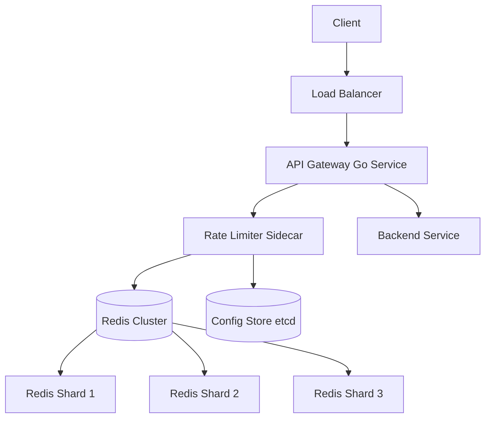
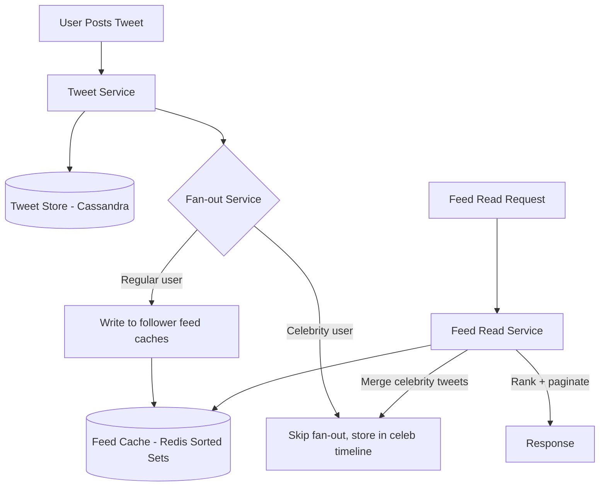
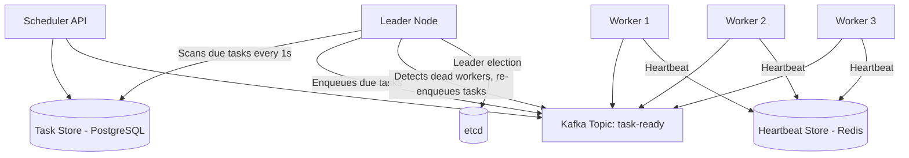

# 25+ LPA Senior Go Engineer: The Definitive Guide

> This is the hardest, deepest file on the platform. If you can answer every question here without looking anything up, you are ready for any senior Go role in India or globally.

---

## Table of Contents

1. [The Senior Engineer Bar](#the-senior-engineer-bar)
2. [Companies and Roles at This Band](#companies-and-roles-at-this-band)
3. [Go Mastery Topics (Non-negotiable)](#go-mastery-topics-non-negotiable)
4. [System Design at Senior Level](#system-design-at-senior-level)
5. [Distributed Systems Concepts](#distributed-systems-concepts)
6. [Leadership and Architecture Questions](#leadership-and-architecture-questions)
7. [DSA at Senior Level](#dsa-at-senior-level)
8. [The 90-Day Senior Prep Plan](#the-90-day-senior-prep-plan)

---

## The Senior Engineer Bar

### What Senior Means: Three Contexts

**FAANG India (Google, Amazon, Meta, Microsoft)**
Senior here means L5/SDE-2 at minimum. You are expected to independently own end-to-end systems, not just features. The bar is calibrated globally — your L5 counterpart in Seattle must find your code reviewable. Expect to be asked not just what you built but the alternatives you rejected, the failure modes you anticipated, and the oncall incidents you fixed at 2am.

**Unicorns (Zepto, Meesho, CRED, Razorpay, Slice)**
Senior here translates to "founding engineer quality." You are often the person who defines standards, not follows them. You are expected to have opinions on Kafka vs Pulsar, to have strong stances on monorepo vs polyrepo, and to have shipped features that moved ARR. System design interviews here often use the company's own product as the case study.

**Top Product Companies (Atlassian, Stripe, Cloudflare India)**
The bar is closer to FAANG but with higher emphasis on distributed systems and infrastructure. Stripe's interview for a senior Go backend engineer will test correctness at the level of "explain what happens if two goroutines write to the same map" and the design bar will be "design the payment idempotency layer."

### The Three Dimensions Interviewers Evaluate

**1. Technical Depth**
Not breadth. You must have at least two areas where you can go 5 levels deep. For Go engineers, these are usually: concurrency internals + one of (distributed systems / systems programming / high-performance pipelines). You should be able to explain the Go scheduler without googling it, describe GC pause characteristics, and write a lock-free queue from scratch.

**2. Design Judgment**
The ability to look at a system design and say "this will break at 10x traffic because of this specific bottleneck." Senior engineers have scar tissue. Interviewers probe for it: "what went wrong in production?", "what would you do differently?", "what's the failure mode you're most worried about?" Pattern: junior engineers design happy paths; senior engineers design failure modes.

**3. Leadership and Influence**
This does not mean people management. It means: Can you make a roomful of engineers agree on the right approach? Can you write an RFC that gets buy-in from skeptics? Can you onboard a new engineer in two weeks by writing a good RUNBOOK? At FAANG L5, you are expected to lead projects spanning 3-5 engineers. At L6, cross-team. At staff level, cross-org.

### The Implicit Filter: Communication

Technical depth without clarity is a liability at senior levels. If you cannot explain GC pressure to a PM in one sentence, or convince a skeptical SRE your design is safe, you will not pass. Every answer in a senior interview should follow: state the constraint → show the tradeoff → commit to a decision → defend it.

---

## Companies and Roles at This Band

### Google India (Hyderabad / Bangalore) — SWE-3 / SWE-4

**Role**: SWE-3 is Senior, SWE-4 is Staff. Go is used in GCP infrastructure, Kubernetes, and internal tooling at scale.

**Interview Process** (6-7 rounds, spread over 2-3 weeks):
- Round 1: Phone screen with a Googler — medium DSA, 45 min
- Round 2: Technical phone screen — hard DSA or system design fundamentals
- Onsite Day (4 rounds back-to-back):
  - DSA-1: Hard problem, graph/DP, 45 min
  - DSA-2: Hard problem, focus on correctness + optimization, 45 min
  - System Design: Whiteboard design, focus on scale and trade-offs, 60 min
  - Behavioral + Leadership: Structured STAR questions, 45 min
- Hiring Committee review (can take 2-4 weeks after onsite)

**What is tested per round**: DSA rounds test correctness first, optimization second. They want clean code + the ability to talk through your thinking. System design at Google focuses on distributed systems — expect questions about consensus, sharding, replication lag. The behavioral round uses the "Googleyness" rubric: collaboration, ownership, care for users.

**Compensation (2025 estimates, INR)**:
- SWE-3: Base 45-55 LPA + RSU 80-120L over 4 years + joining bonus 15-30L = total 60-80 LPA CTC
- SWE-4: Base 60-80 LPA + RSU 150-250L over 4 years = total 100-130 LPA CTC

---

### Amazon India (Hyderabad / Bangalore) — SDE-2 / SDE-3

**Role**: SDE-2 is Senior, SDE-3 is Principal equivalent. Amazon uses Go extensively in AWS services.

**Interview Process** (5 rounds, usually 1 week turnaround):
- Online Assessment: 2 DSA problems in 90 minutes (LeetCode medium-hard)
- Round 1: DSA — medium-hard, focus on efficient code
- Round 2: System Design — design at Amazon scale (100M users), 60 min
- Round 3: DSA + Behavioral (Bar Raiser) — most critical round
- Round 4: Behavioral (Leadership Principles) — 45 min deep dive

**Amazon-specific note**: Every round tests Leadership Principles. The Bar Raiser can veto any hire regardless of other round feedback. For SDE-2, expect 2-3 LP questions per round. The 16 LPs must be in your muscle memory.

**Compensation (2025)**:
- SDE-2: Base 40-50 LPA + RSU 60-80L over 4 years + signing 10-20L = 55-75 LPA total
- SDE-3: Base 60-80 LPA + RSU 150-250L over 4 years = 90-130 LPA total

---

### Microsoft India (Hyderabad) — SDE-2 / SDE-3 (Go roles)

**Go usage**: Azure Kubernetes Service, DevDiv tooling, GitHub (post-acquisition) infrastructure.

**Interview Process** (4 rounds, often virtual):
- Round 1: Coding — medium DSA, 60 min
- Round 2: System Design — 60 min, focus on Azure-scale systems
- Round 3: Coding + deep-dive on past projects
- Round 4: As-Appropriate (AA) + Manager round — culture + leadership

**Compensation (2025)**:
- SDE-2: Base 40-50 LPA + RSU 50-80L over 4 years = 55-70 LPA total
- SDE-3: Base 55-70 LPA + RSU 100-160L over 4 years = 80-110 LPA total

---

### Uber India (Hyderabad) — Senior Backend Engineer

**Go usage**: Uber rewrote most of its core services in Go. Trip dispatch, surge pricing, and driver matching are all Go microservices.

**Interview Process** (5 rounds):
- Hiring Manager screen: culture + technical discussion, 30 min
- Technical screen: medium-hard DSA, 60 min
- Onsite Round 1: Hard DSA, 60 min
- Onsite Round 2: System Design — design at Uber scale (real-time geo, matching), 60 min
- Onsite Round 3: Go-specific deep dive + past project discussion, 45 min

**Compensation (2025)**:
- Senior Backend: Base 50-65 LPA + RSU 40-60L over 4 years = 60-80 LPA total

---

### Stripe India (Bangalore) — Senior Backend Engineer

**Go usage**: Core payment processing, API infrastructure, internal event systems.

**Interview Process** (6 rounds — Stripe is thorough):
- Recruiter screen
- Technical screen: medium DSA + code quality emphasis
- Coding Round 1: Hard DSA (real Stripe-style problem — often involves financial arithmetic precision)
- Coding Round 2: System design with code — they want actual function signatures, not boxes
- System Design: Full distributed systems design, 75 min
- Values interview: Stripe's "curiosity + integrity" rubric

**What makes Stripe different**: They care deeply about correctness. Expect questions about overflow, floating-point in financial calculations, idempotency, and what happens when a network request succeeds on the server but the client never gets the response.

**Compensation (2025)**:
- Senior: Base 60-80 LPA + RSU 150-300L over 4 years = 100-160 LPA total

---

### PhonePe / Razorpay — Tech Lead / Senior Engineer

**Interview Process** (4-5 rounds, faster cycle):
- Technical screen: DSA + Go fundamentals, 60 min
- System Design: Payments-specific design (idempotency, reconciliation, ledger), 60 min
- Go-specific round: Concurrency, runtime, production patterns, 45 min
- Leadership / culture round with Engineering Manager

**Compensation (2025)**:
- Tech Lead: Base 40-55 LPA + ESOP 30-50L over 4 years = 55-75 LPA total
- Senior Engineer: Base 35-50 LPA = 45-65 LPA total

---

## Go Mastery Topics (Non-negotiable)

These 10 topics separate senior Go engineers from mid-level ones. Each section is a deep-dive you must be able to discuss for 10+ minutes in an interview.

---

### 1. Go Runtime Internals: Scheduler, GC, Stack Management

The Go runtime is a userspace operating system. Understanding it is mandatory at senior level.

**The Scheduler (GMP Model)**

Go uses a work-stealing scheduler with three entities:
- **G (goroutine)**: The unit of execution. Starts with a 2KB stack (not OS thread stack).
- **M (machine)**: An OS thread. There are usually GOMAXPROCS Ms.
- **P (processor)**: A logical CPU context. Holds the run queue. GOMAXPROCS Ps exist.

When a goroutine blocks on a syscall, its M is detached from P. The P picks up another M (or creates one) to keep all Ps busy — this is why you can have thousands of goroutines with only a handful of OS threads.

Work-stealing: When a P's run queue is empty, it steals from another P's tail (not head — to avoid cache conflicts). This is how Go achieves ~1µs goroutine scheduling latency.

```go
// Force GOMAXPROCS to observe scheduler behavior
import "runtime"

func main() {
    // By default, Go uses all CPU cores
    // Setting to 1 makes all goroutines sequential
    runtime.GOMAXPROCS(1)

    done := make(chan struct{})
    go func() {
        // With GOMAXPROCS=1, this won't run until main yields
        fmt.Println("goroutine")
        close(done)
    }()
    // main holds the P; goroutine queued but not running
    runtime.Gosched() // yield to scheduler
    <-done
}
```

**GC: Tricolor Mark-and-Sweep with Write Barriers**

Go GC is concurrent — it runs alongside application goroutines. The tricolor algorithm:
1. All objects start white (unvisited)
2. GC marks roots gray (stack variables, globals)
3. Gray objects' children are turned gray; the object itself turns black
4. When no gray objects remain, all white objects are garbage

The write barrier ensures that if a black object gets a pointer to a white object during concurrent marking, the white object is grayed (invariant preserved). This causes a small overhead on pointer writes during GC.

GC is triggered when heap doubles since last GC, or by `runtime.GC()`. Key tunable: `GOGC` (default 100 = trigger when heap doubles). For low-latency services, `GOGC=50` trades throughput for shorter pauses. Go 1.19+ introduced `GOMEMLIMIT` for absolute memory caps.

**Stack Management**

Every goroutine has a growable stack. Initial size is 2KB (configurable). When the stack is nearly full, Go allocates a new stack 2x larger and copies the entire stack — all pointers in the stack are updated. This "stack copy" is why taking the address of a stack variable is safe across goroutine calls in Go, but is also why benchmarking stack-heavy code is tricky.

```go
// This function causes many stack growths — observe with GODEBUG=gccheckmark=1
func deep(n int) int {
    if n == 0 {
        return 0
    }
    var buf [1024]byte // force stack usage
    _ = buf
    return deep(n-1) + 1
}
```

---

### 2. Memory Model: Formal Happens-Before, Atomic Guarantees

The Go memory model defines when one goroutine is *guaranteed* to observe writes made by another.

**Happens-Before (HB) Rules**:

A write W to variable x is observable by read R if:
- W happens-before R, AND
- No other write to x happens after W but before R

Built-in HB edges:
- `go` statement: The goroutine creation happens-before the goroutine body starts
- Channel send happens-before the corresponding receive completes
- Closing a channel happens-before a receive that returns zero value
- `sync.Mutex` Unlock happens-before the next Lock
- `sync.WaitGroup` Done happens-before Wait returns
- `sync/atomic` operations with `atomic.Store` + `atomic.Load` provide sequential consistency within the atomic variable

```go
var x int
var mu sync.Mutex

// Safe: HB through mutex
func writer() { mu.Lock(); x = 42; mu.Unlock() }
func reader() { mu.Lock(); fmt.Println(x); mu.Unlock() }

// UNSAFE: no HB — data race
var y int
func unsafeWriter() { y = 42 }
func unsafeReader() { fmt.Println(y) } // might see 0

// Safe with atomic
var z atomic.Int64
func atomicWriter() { z.Store(42) }
func atomicReader() { fmt.Println(z.Load()) }
```

**Atomic Guarantees (Go 1.19 Memory Model Update)**

Go's `sync/atomic` now provides sequentially consistent atomics. `atomic.Store` and `atomic.Load` on the same variable have a total order. However, **atomics do not create HB edges between different variables** — you cannot use an atomic flag to synchronize access to a non-atomic variable safely without also using a mutex or channel.

The classic double-checked locking anti-pattern:
```go
// WRONG in Go — atomic flag does not protect non-atomic field
type Singleton struct {
    initialized atomic.Bool
    value       int // NOT atomic
}

func (s *Singleton) Init() {
    if !s.initialized.Load() {
        s.value = expensiveCompute() // data race with concurrent readers
        s.initialized.Store(true)
    }
}

// CORRECT: use sync.Once
var instance *Singleton
var once sync.Once

func GetSingleton() *Singleton {
    once.Do(func() {
        instance = &Singleton{value: expensiveCompute()}
    })
    return instance
}
```

---

### 3. Profile-Guided Optimization with pprof

Go's `pprof` is the production profiling tool. Senior engineers know it cold.

**Profile types**:
- `cpu`: where the program spends wall-clock time (sampled every 10ms)
- `heap`: current allocations and inuse memory (sampled at every N bytes allocated, default 512KB)
- `goroutine`: stack traces of all live goroutines — essential for goroutine leak detection
- `mutex`: contention on sync.Mutex — where goroutines are waiting for locks
- `block`: where goroutines block on channels/sleep/syscall
- `trace`: execution trace — fine-grained scheduler, GC, goroutine events (use `go tool trace`)

```go
import (
    "net/http"
    _ "net/http/pprof" // registers /debug/pprof endpoints
    "runtime/pprof"
    "os"
)

// Option 1: HTTP server (for long-running services)
func startPprof() {
    go http.ListenAndServe(":6060", nil) // /debug/pprof/*
}

// Option 2: CPU profile to file (for benchmarks)
func profileCPU() {
    f, _ := os.Create("cpu.prof")
    defer f.Close()
    pprof.StartCPUProfile(f)
    defer pprof.StopCPUProfile()
    // ... your code ...
}
```

**Reading a CPU profile**:
```bash
go tool pprof -http=:8080 cpu.prof
# Look for: flat% (time in this function) vs cum% (including callees)
# Flame graph shows call stacks — wide = hot

# Live from running service
go tool pprof http://localhost:6060/debug/pprof/heap
# Then: top10, list <FuncName>, web (opens SVG)
```

**Heap profile analysis** — the key insight for senior interviews: heap profile shows *live* allocations at time of capture. To find allocation sites, use `go tool pprof -alloc_objects http://...` to count objects ever allocated (not just live). High `alloc_objects` with low `inuse_objects` means high GC churn.

**Mutex and block profiles** are disabled by default:
```go
runtime.SetMutexProfileFraction(1) // sample every mutex event
runtime.SetBlockProfileRate(1)     // sample every block event (nanoseconds)
```

---

### 4. Zero-Allocation Patterns in Hot Paths

Every allocation is a GC liability. In hot paths (>100K req/sec), allocation churn causes GC pauses that spike p99 latency.

**Pattern 1: sync.Pool for temporary objects**
```go
var bufPool = sync.Pool{
    New: func() interface{} {
        return make([]byte, 0, 4096) // pre-sized buffer
    },
}

func handleRequest(data []byte) []byte {
    buf := bufPool.Get().([]byte)
    defer func() {
        bufPool.Put(buf[:0]) // reset length, keep capacity
    }()
    buf = append(buf, data...)
    // ... process ...
    result := make([]byte, len(buf)) // only escape if needed
    copy(result, buf)
    return result
}
```

**Pattern 2: Avoid interface boxing**
```go
// BAD: every fmt.Sprintf allocates (interface boxing)
func logEvent(id int, name string) string {
    return fmt.Sprintf("event: %d %s", id, name)
}

// GOOD: strings.Builder with pre-sizing
func logEventFast(id int, name string) string {
    var sb strings.Builder
    sb.Grow(32)
    sb.WriteString("event: ")
    sb.WriteString(strconv.Itoa(id))
    sb.WriteByte(' ')
    sb.WriteString(name)
    return sb.String()
}
```

**Pattern 3: Stack allocation via escape analysis**
```go
// Use go build -gcflags="-m" to see escape decisions

// This escapes to heap: returned pointer causes escape
func allocatesOnHeap() *int {
    x := 42
    return &x // x escapes
}

// This stays on stack: value is consumed before function returns
func staysOnStack() int {
    x := 42
    return x // x does NOT escape
}

// Slice that doesn't escape if capacity is small and doesn't grow
func mayStayOnStack() int {
    buf := make([]byte, 64) // stays on stack if <= 64KB and doesn't escape
    copy(buf, "hello")
    return len(buf)
}
```

**Pattern 4: Avoid map allocations in hot paths — use arrays or flat structs**
```go
// BAD: map allocation per request
func classify(status int) string {
    m := map[int]string{200: "ok", 404: "not found", 500: "error"}
    return m[status]
}

// GOOD: switch statement — zero allocation
func classifyFast(status int) string {
    switch status {
    case 200: return "ok"
    case 404: return "not found"
    case 500: return "error"
    default: return "unknown"
    }
}
```

---

### 5. Building High-Throughput Pipelines (1M+ msg/sec)

The ceiling for a single Go goroutine reading from a channel is ~10M ops/sec. To hit 1M+ end-to-end msg/sec with real processing, you need:

1. **Batch processing**: Read 100-1000 items per loop iteration instead of 1
2. **Backpressure**: Use buffered channels sized to absorb bursts; shed load when full
3. **Worker pools sized to GOMAXPROCS**: More workers than cores causes context-switch overhead
4. **Avoid allocations in the hot loop**: Use object pools, pre-allocated slices

```go
package pipeline

import (
    "context"
    "sync"
    "runtime"
)

type Message struct {
    ID      uint64
    Payload []byte
}

// Stage represents one pipeline stage
type Stage func(ctx context.Context, in <-chan []Message) <-chan []Message

// BatchProducer reads messages and emits batches
func BatchProducer(ctx context.Context, source <-chan Message, batchSize int) <-chan []Message {
    out := make(chan []Message, 16) // buffered to absorb bursts
    go func() {
        defer close(out)
        batch := make([]Message, 0, batchSize)
        for {
            select {
            case <-ctx.Done():
                if len(batch) > 0 {
                    out <- batch
                }
                return
            case msg, ok := <-source:
                if !ok {
                    if len(batch) > 0 {
                        out <- batch
                    }
                    return
                }
                batch = append(batch, msg)
                if len(batch) >= batchSize {
                    out <- batch
                    batch = make([]Message, 0, batchSize) // new slice; pooling would be better
                }
            }
        }
    }()
    return out
}

// ParallelStage fans out to N workers, fans back in
func ParallelStage(ctx context.Context, in <-chan []Message, process func([]Message) []Message) <-chan []Message {
    numWorkers := runtime.GOMAXPROCS(0)
    out := make(chan []Message, numWorkers*2)
    var wg sync.WaitGroup
    for i := 0; i < numWorkers; i++ {
        wg.Add(1)
        go func() {
            defer wg.Done()
            for batch := range in {
                result := process(batch)
                select {
                case out <- result:
                case <-ctx.Done():
                    return
                }
            }
        }()
    }
    go func() { wg.Wait(); close(out) }()
    return out
}
```

**Capacity calculation for 1M msg/sec pipeline**:
- Each message: 1KB payload
- Throughput needed: 1M * 1KB = 1GB/sec
- Network card needed: 10GbE minimum
- Workers: 8 cores, each handling ~125K msg/sec
- Channel buffer: 16 batches * 1000 msg = 16K messages in-flight = 16MB memory
- Processing latency target: <1ms per batch

---

### 6. Distributed Systems Primitives in Go (Consensus, Leader Election)

**Raft-based leader election pattern** (simplified):

```go
package leaderelection

import (
    "context"
    "sync/atomic"
    "time"
)

type Role int32

const (
    Follower  Role = 0
    Candidate Role = 1
    Leader    Role = 2
)

type Node struct {
    id          string
    currentTerm atomic.Int64
    role        atomic.Int32
    votedFor    string
    peers       []string
    heartbeat   chan struct{}
    storage     Storage // persist term + votedFor
}

// StartElection triggers when heartbeat timeout fires
func (n *Node) StartElection(ctx context.Context) bool {
    n.role.Store(int32(Candidate))
    newTerm := n.currentTerm.Add(1)
    n.votedFor = n.id

    votes := int32(1) // vote for self
    majority := int32(len(n.peers)/2 + 1)

    var wg sync.WaitGroup
    for _, peer := range n.peers {
        wg.Add(1)
        go func(p string) {
            defer wg.Done()
            granted := n.requestVote(ctx, p, newTerm)
            if granted {
                atomic.AddInt32(&votes, 1)
            }
        }(peer)
    }
    wg.Wait()

    if votes >= majority && n.currentTerm.Load() == newTerm {
        n.role.Store(int32(Leader))
        return true
    }
    n.role.Store(int32(Follower))
    return false
}

// SendHeartbeat keeps followers from timing out
func (n *Node) SendHeartbeat(ctx context.Context) {
    ticker := time.NewTicker(50 * time.Millisecond)
    defer ticker.Stop()
    for {
        select {
        case <-ticker.C:
            for _, peer := range n.peers {
                go n.appendEntries(ctx, peer, nil) // empty = heartbeat
            }
        case <-ctx.Done():
            return
        }
    }
}
```

The real etcd and HashiCorp Raft libraries are production-grade implementations of exactly this pattern.

---

### 7. Custom Sync Primitives (When stdlib Isn't Enough)

The stdlib covers Mutex, RWMutex, WaitGroup, Cond, Once. When do you need more?

**Use case: Semaphore with context support**
```go
type Semaphore struct {
    ch chan struct{}
}

func NewSemaphore(n int) *Semaphore {
    return &Semaphore{ch: make(chan struct{}, n)}
}

func (s *Semaphore) Acquire(ctx context.Context) error {
    select {
    case s.ch <- struct{}{}:
        return nil
    case <-ctx.Done():
        return ctx.Err()
    }
}

func (s *Semaphore) Release() { <-s.ch }

// Use: limit concurrent DB connections
sem := NewSemaphore(50)
func query(ctx context.Context) error {
    if err := sem.Acquire(ctx); err != nil {
        return err // context cancelled — don't wait
    }
    defer sem.Release()
    return db.QueryContext(ctx, "...")
}
```

**Use case: Read-preferring vs write-preferring RWMutex**
```go
// stdlib RWMutex is "reader-preferring" by default
// For high-write scenarios, you may need write-preferring:

type WritePreferRWMutex struct {
    mu           sync.Mutex
    readers      int
    writers      int
    readersWait  sync.Cond
    writersWait  sync.Cond
}
// Full implementation omitted for brevity; key insight:
// writers increment a counter before acquiring; new readers
// check the counter and wait if writers are pending
```

**Use case: TryLock (Go 1.18+)**
```go
var mu sync.Mutex

// Non-blocking lock attempt — avoid in hot paths, use for "best-effort" updates
func tryUpdate(v *int, newVal int) bool {
    if mu.TryLock() {
        defer mu.Unlock()
        *v = newVal
        return true
    }
    return false // another goroutine holds the lock; skip this update
}
```

---

### 8. Go Plugin System and Embedding

**Plugins** (`plugin` package) allow loading `.so` files at runtime. Caveats: plugin and host must be compiled with the same Go version, same package versions; Linux/macOS only; no unloading.

```go
// plugin/greeter/main.go (compiled with: go build -buildmode=plugin -o greeter.so)
package main

import "fmt"

var PluginName = "greeter"

func Greet(name string) string {
    return fmt.Sprintf("Hello, %s", name)
}

// host/main.go
import "plugin"

func loadPlugin(path string) {
    p, err := plugin.Open(path)
    if err != nil { panic(err) }

    greetSym, err := p.Lookup("Greet")
    if err != nil { panic(err) }

    greet := greetSym.(func(string) string)
    fmt.Println(greet("World"))
}
```

**Embedding** (`//go:embed`): Embed static files into the binary at compile time.

```go
import "embed"

//go:embed templates/*.html
var templateFS embed.FS

//go:embed config/default.yaml
var defaultConfig []byte

func main() {
    data, _ := templateFS.ReadFile("templates/index.html")
    // data is available without filesystem access at runtime
    // deploy a single binary with no external file dependencies
}
```

**Interview angle**: "When would you use plugins vs embed vs just importing packages?" — Plugins for user-supplied logic (IDE extensions, custom transformers); embed for static assets (web UIs, config defaults, SQL migrations); packages for everything else.

---

### 9. cgo Considerations and Safety

cgo bridges Go and C. The cost is high: every cgo call crosses the runtime boundary, takes ~2µs (vs ~2ns for a Go function call), and prevents Go's scheduler from preempting the goroutine.

```go
/*
#include <stdlib.h>
#include <string.h>

char* reverse(const char* input, int len) {
    char* result = (char*)malloc(len + 1);
    for (int i = 0; i < len; i++) {
        result[i] = input[len - 1 - i];
    }
    result[len] = '\0';
    return result;
}
*/
import "C"
import "unsafe"

func ReverseViaCgo(s string) string {
    cStr := C.CString(s)
    defer C.free(unsafe.Pointer(cStr))     // MUST free — C heap, not Go GC

    result := C.reverse(cStr, C.int(len(s)))
    defer C.free(unsafe.Pointer(result))

    return C.GoString(result)
}
```

**Rules for safe cgo**:
1. Never pass a Go pointer to C if that Go pointer may be moved by GC (Go pointers to Go memory are pinned during cgo calls, but only directly passed ones)
2. Never store a Go pointer in C memory across cgo calls
3. Always free C memory explicitly — the Go GC does not manage it
4. Use `//export` with care — creates a C-callable function, but causes build complications

**When to avoid cgo**: If you can rewrite the C library in Go (common for smaller libs), do it. cgo makes cross-compilation harder (`CGO_ENABLED=0` required for static binaries), increases binary size, and complicates race detection.

---

### 10. Building Production-Grade Observability (Traces, Metrics, Logs)

**The Three Pillars**:

```go
package observability

import (
    "context"
    "go.opentelemetry.io/otel"
    "go.opentelemetry.io/otel/attribute"
    "go.opentelemetry.io/otel/metric"
    "go.opentelemetry.io/otel/trace"
    "log/slog"
)

// TRACES: structured spans for distributed request tracing
var tracer = otel.Tracer("my-service")

func ProcessOrder(ctx context.Context, orderID string) error {
    ctx, span := tracer.Start(ctx, "ProcessOrder",
        trace.WithAttributes(attribute.String("order.id", orderID)),
    )
    defer span.End()

    // Spans form a tree: parent ctx propagates trace ID
    if err := validateOrder(ctx, orderID); err != nil {
        span.RecordError(err)
        span.SetStatus(codes.Error, err.Error())
        return err
    }
    return nil
}

// METRICS: counters, gauges, histograms for SLOs
var meter = otel.Meter("my-service")

var (
    requestCounter, _  = meter.Int64Counter("http.requests.total")
    requestDuration, _ = meter.Float64Histogram("http.request.duration.seconds",
        metric.WithExplicitBucketBoundaries(0.001, 0.005, 0.01, 0.05, 0.1, 0.5, 1.0),
    )
)

// LOGS: structured, level-filtered, context-aware
func newLogger() *slog.Logger {
    return slog.New(slog.NewJSONHandler(os.Stdout, &slog.HandlerOptions{
        Level:     slog.LevelInfo,
        AddSource: true, // file:line in every log entry
    }))
}

// Correlate logs with traces via context
func logWithTrace(ctx context.Context, log *slog.Logger, msg string) {
    span := trace.SpanFromContext(ctx)
    sc := span.SpanContext()
    log.InfoContext(ctx, msg,
        slog.String("trace_id", sc.TraceID().String()),
        slog.String("span_id", sc.SpanID().String()),
    )
}
```

**Production checklist**: Every service must expose `/metrics` (Prometheus), `/healthz` (liveness), `/readyz` (readiness). SLOs should be defined before writing code: "99.9% of requests < 100ms", "error rate < 0.1%". Alerting should fire at 70% of SLO budget burn, not at 100%.

---

## System Design at Senior Level

Senior-level system design is not about drawing boxes. It is about demonstrating that you have shipped systems that failed in production, and that you learned from it. Every design should include: requirements → estimation → architecture → failure modes → operations.

---

### Case Study 1: Design a Distributed Rate Limiter

#### Requirements Gathering

**Functional**:
- Rate limit API requests per user, per IP, or per API key
- Support multiple algorithms: fixed window, sliding window, token bucket
- Rules configurable without service restart (e.g., 1000 req/min for free tier, 10000 for paid)
- Return `X-RateLimit-Remaining`, `X-RateLimit-Reset` headers
- Blocking (reject over-limit requests) and non-blocking (allow but flag) modes

**Non-Functional**:
- Latency overhead: <1ms p99 per rate-limit check (must not be on the critical path)
- Throughput: 1 million rate-limit checks per second across the fleet
- Availability: 99.99% (rate limiter outage = service outage)
- Consistency: "mostly consistent" — occasional over-limit requests acceptable; no strong consistency needed

#### Architecture

```
Client
  │
  ▼
Load Balancer (L7)
  │
  ├──> API Gateway (Go service) ──> Rate Limit Check (local + Redis)
  │         │
  │         └──> Backend Services
  │
  └──> Rate Limiter Service (Go)
           │
           ├──> Redis Cluster (sliding window counters)
           │       └── Lua scripts for atomicity
           └──> Config Store (etcd / Redis) for rule changes
```



#### Full Go Implementation

```go
package ratelimiter

import (
    "context"
    "fmt"
    "time"

    "github.com/redis/go-redis/v9"
)

// SlidingWindowLimiter uses Redis sorted sets for O(log N) per check
type SlidingWindowLimiter struct {
    rdb      *redis.Client
    limit    int64
    window   time.Duration
}

func NewSlidingWindowLimiter(rdb *redis.Client, limit int64, window time.Duration) *SlidingWindowLimiter {
    return &SlidingWindowLimiter{rdb: rdb, limit: limit, window: window}
}

// Allow returns (allowed, remaining, resetAt, error)
func (l *SlidingWindowLimiter) Allow(ctx context.Context, key string) (bool, int64, time.Time, error) {
    now := time.Now()
    windowStart := now.Add(-l.window)

    pipe := l.rdb.Pipeline()

    // Remove timestamps outside current window
    pipe.ZRemRangeByScore(ctx, key, "0", fmt.Sprintf("%d", windowStart.UnixMilli()))

    // Add current request timestamp
    pipe.ZAdd(ctx, key, redis.Z{
        Score:  float64(now.UnixMilli()),
        Member: fmt.Sprintf("%d", now.UnixNano()),
    })

    // Count requests in window
    countCmd := pipe.ZCard(ctx, key)

    // Set TTL to avoid orphaned keys
    pipe.Expire(ctx, key, l.window+time.Second)

    _, err := pipe.Exec(ctx)
    if err != nil {
        // Fail open: allow request if Redis is down
        return true, l.limit, now.Add(l.window), err
    }

    count := countCmd.Val()
    remaining := l.limit - count
    resetAt := now.Add(l.window)

    if count > l.limit {
        return false, 0, resetAt, nil
    }
    return true, remaining, resetAt, nil
}

// TokenBucketLimiter uses Redis + Lua for atomic check-and-decrement
type TokenBucketLimiter struct {
    rdb      *redis.Client
    capacity int64
    refillRate float64 // tokens per second
}

var tokenBucketScript = redis.NewScript(`
local key = KEYS[1]
local capacity = tonumber(ARGV[1])
local refill_rate = tonumber(ARGV[2])
local now = tonumber(ARGV[3])
local requested = tonumber(ARGV[4])

local bucket = redis.call('HMGET', key, 'tokens', 'last_refill')
local tokens = tonumber(bucket[1]) or capacity
local last_refill = tonumber(bucket[2]) or now

-- Calculate tokens to add since last refill
local elapsed = math.max(0, now - last_refill)
local new_tokens = math.min(capacity, tokens + elapsed * refill_rate)

if new_tokens >= requested then
    new_tokens = new_tokens - requested
    redis.call('HMSET', key, 'tokens', new_tokens, 'last_refill', now)
    redis.call('EXPIRE', key, math.ceil(capacity / refill_rate) + 1)
    return {1, math.floor(new_tokens)}
else
    redis.call('HMSET', key, 'tokens', new_tokens, 'last_refill', now)
    return {0, math.floor(new_tokens)}
end
`)

func (l *TokenBucketLimiter) Allow(ctx context.Context, key string) (bool, int64, error) {
    result, err := tokenBucketScript.Run(ctx, l.rdb,
        []string{key},
        l.capacity,
        l.refillRate,
        float64(time.Now().UnixMilli())/1000.0,
        1,
    ).Int64Slice()
    if err != nil {
        return true, l.capacity, err // fail open
    }
    return result[0] == 1, result[1], nil
}
```

#### Capacity Estimation

| Metric | Value |
|---|---|
| Peak QPS to rate limiter | 1,000,000 req/sec |
| Redis ops per check (sliding window) | 4 (ZREM + ZADD + ZCARD + EXPIRE) |
| Redis ops/sec needed | 4,000,000 |
| Redis throughput per node | ~200K ops/sec (single-threaded) |
| Redis nodes needed | 20 (with 3x replication = 60 instances) |
| Memory per key (1h window) | ~1KB (sorted set of timestamps) |
| Active keys (1M unique users/hr) | 1M keys |
| Total Redis memory | ~1GB per shard |

#### Failure Modes and Mitigation

| Failure Mode | Impact | Mitigation |
|---|---|---|
| Redis node failure | Rate limit checks fail for 1/N users | Redis Sentinel / Cluster; fail-open for availability |
| Redis network partition | Stale counts — over-limiting or under-limiting | Fail-open: allow requests; alert on high error rate |
| Config store unavailable | Stale rate limit rules | Cache rules in memory; serve stale config |
| Clock skew between nodes | Sliding window inaccuracy | NTP with <1ms skew; use server-side Redis time via `TIME` command |
| Hot key (celebrity user) | Single Redis shard overloaded | Local in-process cache for hot keys (sync every 100ms) |

#### Interviewer Deep-Dive Questions + Answers

**Q: How do you handle the thundering herd when a rate limit resets?**
A: Token bucket inherently smooths this — tokens refill continuously, not at a fixed reset. For fixed-window, add jitter: reset windows at `user_hash % window_duration` offset, so all users don't reset at :00.

**Q: What's the consistency guarantee of your sliding window?**
A: Pipeline is atomic at the Redis level, but between ZRemRangeByScore and ZCard there's no distributed lock. Two simultaneous requests could both read `count = N-1` and both proceed. This is intentional — for rate limiting, occasional over-limit is acceptable. For strict enforcement (billing), use Lua script.

**Q: How would you handle multi-region rate limiting?**
A: Two options: (1) Global Redis (adds 50-100ms cross-region latency — unacceptable for <1ms budget), (2) Per-region limits with a global aggregation service that reconciles every 1 second. Option 2 allows temporary over-limit of up to `limit * num_regions / seconds_between_sync` requests — acceptable for most use cases.

---

### Case Study 2: Design a Real-time Feed System (Twitter Scale)

#### Requirements

**Functional**: Users follow other users. When a user posts, followers see it in their feed. Feed is chronologically ordered. Support 500M users, 200M DAU, average 200 follows per user.

**Non-Functional**: Feed read latency <50ms p99. Write latency <500ms. Eventual consistency acceptable — 30-second lag for feed updates is fine. 99.9% availability.

#### Fan-out vs Fan-in Decision

This is THE interview crux. Two models:

**Fan-out on write (push model)**: When Alice posts, her tweet is pushed to all N followers' feed caches immediately.
- Read: O(1) — just read your pre-computed feed
- Write: O(N) fan-out — for a celebrity with 50M followers, one tweet = 50M Redis writes
- Problem: Celebrities make write fan-out infeasible

**Fan-out on read (pull model)**: When Bob reads his feed, fetch tweets from all followed users.
- Read: O(follows) — for 200 follows, 200 DB lookups on every feed read
- Problem: DAU * reads_per_day * 200 = billions of DB ops per day

**Hybrid (Twitter's actual solution)**:
- Regular users (< 10K followers): Fan-out on write. Their tweet is pushed to followers' feed caches.
- Celebrities (> 10K followers): Fan-out on read. Their tweets are NOT pushed; when you load your feed, celebrity tweets are fetched separately and merged.



#### Feed Storage in Redis

```go
// Feed stored as Redis Sorted Set: score = tweet timestamp, member = tweet ID
// ZADD user:feed:123 <timestamp> <tweet_id>
// ZREVRANGE user:feed:123 0 99 WITHSCORES  -- get latest 100 tweets

type FeedService struct {
    rdb   *redis.Client
    tweet *TweetStore
}

func (f *FeedService) AddToFeed(ctx context.Context, userID, tweetID int64, timestamp int64) error {
    key := fmt.Sprintf("user:feed:%d", userID)
    err := f.rdb.ZAdd(ctx, key, redis.Z{
        Score:  float64(timestamp),
        Member: tweetID,
    }).Err()
    if err != nil {
        return err
    }
    // Trim to latest 1000 entries (users rarely scroll past 1000)
    return f.rdb.ZRemRangeByRank(ctx, key, 0, -1001).Err()
}

func (f *FeedService) GetFeed(ctx context.Context, userID int64, page, pageSize int) ([]Tweet, error) {
    key := fmt.Sprintf("user:feed:%d", userID)
    start := int64(page * pageSize)
    stop := start + int64(pageSize) - 1

    tweetIDs, err := f.rdb.ZRevRange(ctx, key, start, stop).Result()
    if err != nil {
        return nil, err
    }

    // Batch-fetch tweet content (use mget or Cassandra multi-get)
    return f.tweet.BatchGet(ctx, tweetIDs)
}
```

**Eventual Consistency**: The fan-out worker queue (Kafka topic `feed-fanout`) is processed asynchronously. A tweet posted at T=0 may not appear in a follower's feed until T=30s. This is acceptable. To surface it instantly for the poster themselves, the tweet service returns the tweet directly to the poster's client and the client optimistically prepends it.

---

### Case Study 3: Design a Distributed Task Scheduler

#### Requirements

**Functional**: Schedule one-time and recurring tasks (cron syntax). Tasks are Go functions or HTTP endpoints. Exactly-once execution guarantee. Tasks can be retried on failure with exponential backoff. Support 10M tasks scheduled, 100K tasks executing concurrently.

**Focus Areas**: Leader election, work stealing, fault tolerance.

#### Architecture



#### Leader Election with etcd

```go
package scheduler

import (
    "context"
    "time"

    clientv3 "go.etcd.io/etcd/client/v3"
    "go.etcd.io/etcd/client/v3/concurrency"
)

type LeaderScheduler struct {
    client *clientv3.Client
    nodeID string
    onElected func(ctx context.Context)
}

func (ls *LeaderScheduler) Run(ctx context.Context) error {
    session, err := concurrency.NewSession(ls.client, concurrency.WithTTL(10))
    if err != nil {
        return err
    }
    defer session.Close()

    election := concurrency.NewElection(session, "/scheduler/leader")

    for {
        // Campaign blocks until this node becomes leader
        if err := election.Campaign(ctx, ls.nodeID); err != nil {
            if ctx.Err() != nil {
                return nil // context cancelled, clean shutdown
            }
            time.Sleep(time.Second)
            continue
        }

        // Now leader — run scheduler logic until context cancelled or leadership lost
        leaderCtx, cancel := context.WithCancel(ctx)
        go ls.onElected(leaderCtx)

        // Watch for leadership loss (session expiry)
        select {
        case <-session.Done():
            cancel()
            // Session expired — re-create and re-campaign
            session, _ = concurrency.NewSession(ls.client, concurrency.WithTTL(10))
            election = concurrency.NewElection(session, "/scheduler/leader")
        case <-ctx.Done():
            cancel()
            return nil
        }
    }
}
```

#### Work Stealing

Workers pull tasks from Kafka (inherent load balancing). True work stealing is needed when tasks have variable duration and some workers finish early:

```go
// Each worker maintains a local queue + a shared "steal" queue in Redis
// When local queue < threshold, steal tasks from overloaded workers

type WorkerPool struct {
    id          string
    localQueue  chan Task
    redis       *redis.Client
    stealScript *redis.Script
}

// LMOVE atomically moves task from another worker's queue to ours
var stealScript = redis.NewScript(`
local src = KEYS[1]  -- victim worker queue
local dst = KEYS[2]  -- our queue
return redis.call('LMOVE', src, dst, 'RIGHT', 'LEFT')
`)

func (wp *WorkerPool) TrySteal(ctx context.Context, victimID string) (Task, bool) {
    result, err := stealScript.Run(ctx, wp.redis,
        []string{
            fmt.Sprintf("worker:queue:%s", victimID),
            fmt.Sprintf("worker:queue:%s", wp.id),
        },
    ).Result()
    if err != nil || result == nil {
        return Task{}, false
    }
    return deserializeTask(result), true
}
```

**Fault tolerance**: Each task has a `claimed_by` field and `claim_expires_at`. Worker heartbeats every 5 seconds. Leader scans for tasks with `claimed_by != null AND claim_expires_at < NOW()` every 10 seconds and re-enqueues them. Exactly-once is achieved via database-level idempotency: task status transitions are CAS operations.

---

## Distributed Systems Concepts

Every senior Go engineer must be able to explain these 15 concepts clearly, with production examples.

---

### 1. CAP Theorem

**3-line explanation**: A distributed system can provide at most 2 of 3: Consistency (every read sees the latest write), Availability (every request gets a response), Partition Tolerance (system works despite network splits). Since network partitions are unavoidable in production, you choose between CP (Cassandra with quorum, HBase) and AP (Cassandra with eventual consistency, DynamoDB in default mode).

**Go code sketch**:
```go
// CP choice: refuse writes during partition to maintain consistency
func (db *CPDatabase) Write(key, value string) error {
    quorum := db.totalNodes/2 + 1
    acks := db.broadcastWrite(key, value)
    if acks < quorum {
        return ErrPartitioned // refuse write, maintain consistency
    }
    return nil
}
```

**Interview question**: "Your users complain about seeing stale data. How do you decide between strong consistency and availability?" — Answer: characterize the cost of staleness vs the cost of unavailability. For bank balances: CP. For social feed likes: AP.

---

### 2. PACELC

**3-line explanation**: Extension of CAP. During a Partition: choose between Availability and Consistency (like CAP). Else (normal operation): choose between Latency and Consistency. Most real systems face the Else case far more often — PACELC is more practically relevant.

**Go code sketch**:
```go
// PACELC: no partition, choose latency vs consistency
func (db *DB) ReadWithConsistency(key string, strong bool) (string, error) {
    if strong {
        // Read from leader only — higher latency, always consistent
        return db.leader.Read(key)
    }
    // Read from nearest replica — lower latency, possibly stale
    return db.nearestReplica.Read(key)
}
```

**Interview question**: "DynamoDB is PA/EL — what does that mean for your service?" — During partition: available, not consistent. During normal operation: low latency, not strongly consistent. Design your service to tolerate stale reads.

---

### 3. Consistent Hashing

**3-line explanation**: Hash ring with virtual nodes. Each key maps to the nearest node clockwise on the ring. Adding or removing nodes rebalances only 1/N of keys (vs N-1/N for modulo hashing). Used in Cassandra, Memcached, load balancers.

**Go code sketch**:
```go
type HashRing struct {
    ring     map[uint32]string // hash -> node
    sorted   []uint32
    replicas int
}

func (h *HashRing) GetNode(key string) string {
    hash := crc32.ChecksumIEEE([]byte(key))
    // Binary search for the nearest node clockwise
    idx := sort.Search(len(h.sorted), func(i int) bool {
        return h.sorted[i] >= hash
    })
    if idx == len(h.sorted) { idx = 0 } // wrap around
    return h.ring[h.sorted[idx]]
}
```

**Interview question**: "What is the hotspot problem with consistent hashing and how do you solve it?" — Uneven distribution when nodes have unequal capacity or hash space is small. Solution: virtual nodes (150-300 tokens per physical node). Each physical node has multiple points on the ring.

---

### 4. Vector Clocks

**3-line explanation**: A vector of counters, one per node. When a node writes, it increments its own counter. On receive, take max of each component. Allows detecting concurrent writes and causal ordering without a central clock. Used in Riak, Amazon DynamoDB conflict detection.

**Go code sketch**:
```go
type VectorClock map[string]int

func (vc VectorClock) Increment(nodeID string) {
    vc[nodeID]++
}

// HappensBefore returns true if vc happened before other
func (vc VectorClock) HappensBefore(other VectorClock) bool {
    for node, ts := range vc {
        if other[node] < ts { return false }
    }
    return true
}

// Concurrent returns true if neither happened-before the other
func Concurrent(a, b VectorClock) bool {
    return !a.HappensBefore(b) && !b.HappensBefore(a)
}
```

**Interview question**: "Two users edit the same document offline. How do you merge them?" — Use vector clocks to detect they're concurrent, then apply CRDT-based merge or present a conflict to the user (Google Docs shows conflicting edits).

---

### 5. Raft Consensus

**3-line explanation**: Log-based consensus protocol. One leader per term. Leader receives writes, replicates to majority, then commits. If leader fails, a new election occurs. Used in etcd, CockroachDB, TiKV.

**Go code sketch**:
```go
// Three states: Follower, Candidate, Leader
// Log entry: {term, index, command}
// Commit when replicated to majority (N/2 + 1 nodes)

type LogEntry struct {
    Term    int64
    Index   int64
    Command []byte
}

func (r *Raft) AppendEntries(args *AppendEntriesArgs) *AppendEntriesReply {
    if args.Term < r.currentTerm {
        return &AppendEntriesReply{Success: false, Term: r.currentTerm}
    }
    r.currentTerm = args.Term
    r.role = Follower
    r.resetElectionTimer()
    // Consistency check: prev log entry must match
    if args.PrevLogIndex > 0 && r.log[args.PrevLogIndex].Term != args.PrevLogTerm {
        return &AppendEntriesReply{Success: false}
    }
    r.log = append(r.log[:args.PrevLogIndex+1], args.Entries...)
    if args.LeaderCommit > r.commitIndex {
        r.commitIndex = min(args.LeaderCommit, int64(len(r.log)-1))
        r.applyCommitted()
    }
    return &AppendEntriesReply{Success: true}
}
```

**Interview question**: "Why does Raft need randomized election timeouts?" — To prevent split votes where all candidates start elections simultaneously. Randomization ensures one node usually starts first, wins the election, and suppresses others before they time out.

---

### 6. Distributed Transactions

**3-line explanation**: 2PC (Two-Phase Commit) coordinates writes across services: coordinator sends prepare to all participants, waits for all to ack, then sends commit. Blocking protocol — if coordinator fails after prepare but before commit, participants are stuck. Saga pattern solves this with compensating transactions.

**Go code sketch (2PC)**:
```go
func (c *Coordinator) TwoPhaseCommit(ctx context.Context, participants []Participant, tx Transaction) error {
    // Phase 1: Prepare
    for _, p := range participants {
        if err := p.Prepare(ctx, tx); err != nil {
            c.abortAll(ctx, participants, tx.ID) // rollback all
            return err
        }
    }
    // Phase 2: Commit (must succeed — retry indefinitely if needed)
    for _, p := range participants {
        if err := p.Commit(ctx, tx.ID); err != nil {
            // Log to durable queue for retry — cannot abort after prepare-ok
            c.retryQueue.Add(p, tx.ID)
        }
    }
    return nil
}
```

**Interview question**: "What happens if the coordinator crashes between Prepare and Commit?" — Participants are in a blocking state (holding locks). Solution: use a persistent transaction log. On recovery, coordinator reads log and re-sends commit/abort. This is why 2PC is avoided for high-throughput systems — use Sagas instead.

---

### 7. Saga Pattern

**3-line explanation**: A saga is a sequence of local transactions, each with a compensating transaction. If step N fails, compensating transactions for steps 1..N-1 are executed in reverse. No distributed locks needed. Two implementations: choreography (events) and orchestration (central coordinator).

**Go code sketch**:
```go
type SagaStep struct {
    Execute     func(ctx context.Context) error
    Compensate  func(ctx context.Context) error
}

func ExecuteSaga(ctx context.Context, steps []SagaStep) error {
    executed := []SagaStep{}
    for _, step := range steps {
        if err := step.Execute(ctx); err != nil {
            // Compensate in reverse order
            for i := len(executed) - 1; i >= 0; i-- {
                _ = executed[i].Compensate(ctx) // log errors but continue
            }
            return err
        }
        executed = append(executed, step)
    }
    return nil
}
```

**Interview question**: "What happens if a compensating transaction also fails?" — This is a "non-retryable failure" — often handled by alerting a human operator and putting the system in a manual remediation state. Production sagas use durable outboxes for compensation steps so they can be retried indefinitely.

---

### 8. CQRS + Event Sourcing

**3-line explanation**: CQRS: separate the read model from the write model. Writes go through commands; reads use projections optimized for queries. Event Sourcing: store events (facts), not state. Reconstruct state by replaying events. Enables time travel, audit logs, and eventual consistency between models.

**Go code sketch**:
```go
// Event Sourcing: store events, not rows
type OrderEvent struct {
    ID        string
    Type      string // "OrderPlaced", "OrderShipped", "OrderCancelled"
    Payload   []byte
    Timestamp time.Time
}

// Reconstruct state by replaying events
func ReconstructOrder(events []OrderEvent) Order {
    var order Order
    for _, e := range events {
        switch e.Type {
        case "OrderPlaced":
            json.Unmarshal(e.Payload, &order)
        case "OrderShipped":
            order.Status = "shipped"
        case "OrderCancelled":
            order.Status = "cancelled"
        }
    }
    return order
}
```

**Interview question**: "What's the problem with event sourcing at scale?" — Event replay for reconstruction is O(N events). Solution: snapshots — periodically store a snapshot of state so you only replay events after the last snapshot.

---

### 9. Service Mesh

**3-line explanation**: A service mesh (Istio, Linkerd) injects a sidecar proxy (Envoy) into every service pod. The proxy handles mTLS, retries, circuit breaking, and distributed tracing — without any application code changes. The control plane (Istiod) configures all proxies centrally.

**Go code sketch**: No code needed in your service — the mesh handles it. But you need to understand:
```go
// Without mesh: you implement all this in your HTTP client
client := &http.Client{
    Transport: &RetryTransport{
        Wrapped: &CircuitBreakerTransport{
            Wrapped: &mtlsTransport{},
        },
    },
}

// With mesh: just use http.DefaultClient
// The sidecar proxy handles retry, circuit breaking, mTLS
client := http.DefaultClient
```

**Interview question**: "What are the downsides of a service mesh?" — Adds ~1-2ms latency per hop (proxy round-trip), increases memory footprint by ~50MB per pod (Envoy sidecar), and adds operational complexity. For services already using gRPC with interceptors, the overlap with service mesh features can create confusion.

---

### 10. Circuit Breaker

**3-line explanation**: Wrap calls to a dependency. If the dependency fails N times in a window, the circuit "opens" and subsequent calls fail immediately without hitting the dependency. After a timeout, a "half-open" probe is sent; if it succeeds, the circuit closes.

**Go code sketch**:
```go
type CircuitBreaker struct {
    mu           sync.Mutex
    state        string // "closed", "open", "half-open"
    failures     int
    threshold    int
    openUntil    time.Time
    resetTimeout time.Duration
}

func (cb *CircuitBreaker) Call(ctx context.Context, fn func() error) error {
    cb.mu.Lock()
    if cb.state == "open" && time.Now().Before(cb.openUntil) {
        cb.mu.Unlock()
        return ErrCircuitOpen
    }
    if cb.state == "open" {
        cb.state = "half-open" // probe
    }
    cb.mu.Unlock()

    err := fn()

    cb.mu.Lock()
    defer cb.mu.Unlock()
    if err != nil {
        cb.failures++
        if cb.failures >= cb.threshold {
            cb.state = "open"
            cb.openUntil = time.Now().Add(cb.resetTimeout)
        }
        return err
    }
    cb.failures = 0
    cb.state = "closed"
    return nil
}
```

**Interview question**: "How do you prevent the thundering herd when a circuit closes?" — Half-open state allows only 1 probe request. Only after the probe succeeds does the circuit fully close. This prevents 1000 pending goroutines all slamming the just-recovered service simultaneously.

---

### 11. Bulkhead Pattern

**3-line explanation**: Isolate resources (goroutine pools, connection pools, semaphores) per dependency so that one failing dependency cannot exhaust resources for all others. Named after ship bulkheads that prevent one flooded compartment from sinking the ship.

**Go code sketch**: Implemented with semaphores (see custom sync primitives above). Each external service gets its own semaphore with a maximum concurrency limit. One service being slow only blocks its own semaphore, not others.

**Interview question**: "Your database is slow. How does bulkhead prevent it from taking down your entire service?" — DB calls are limited to semaphore(50). When DB is slow, those 50 goroutines are stuck. But incoming HTTP requests are handled by a separate pool of 500 goroutines, and Redis calls have their own semaphore(100). The service degrades gracefully for DB-dependent endpoints, but Redis-only endpoints remain healthy.

---

### 12. Backpressure

**3-line explanation**: When a consumer is slower than a producer, backpressure propagates the "slow down" signal upstream rather than buffering infinitely or dropping data. In Go, this is naturally expressed via blocking channel sends.

**Go code sketch**:
```go
// Producer respects backpressure via context + blocking channel
func produce(ctx context.Context, out chan<- Work) {
    for {
        work := generateWork()
        select {
        case out <- work:   // blocks if consumer is slow — natural backpressure
        case <-ctx.Done():
            return
        }
    }
}

// Explicit load shedding when buffer is full
func produceWithShedding(ctx context.Context, out chan<- Work) {
    work := generateWork()
    select {
    case out <- work:
    default:
        // Channel full — shed this unit of work
        metrics.Counter("work_shed").Inc()
    }
}
```

**Interview question**: "What is the difference between backpressure and load shedding?" — Backpressure slows down the producer (preserves all work, may increase latency). Load shedding drops work (preserves latency, may lose data). Choose based on whether losing work is acceptable (API calls: shed; financial transactions: backpressure and queue).

---

### 13. Exactly-Once Semantics

**3-line explanation**: Guarantee a message is processed exactly once, not zero times (at-most-once) or multiple times (at-least-once). Requires both deduplication (idempotency key + database upsert) and transactional outbox (write to DB + enqueue message atomically).

**Go code sketch**:
```go
func ProcessPayment(ctx context.Context, db *sql.DB, idempotencyKey string, amount int64) error {
    return withTx(ctx, db, func(tx *sql.Tx) error {
        // Check if already processed
        var processed bool
        err := tx.QueryRowContext(ctx,
            "SELECT processed FROM idempotency_keys WHERE key = $1 FOR UPDATE",
            idempotencyKey,
        ).Scan(&processed)
        if err == nil && processed {
            return nil // already done — idempotent
        }

        // Process payment
        if err := processPaymentTx(ctx, tx, amount); err != nil {
            return err
        }

        // Mark as processed + insert outbox event (atomic with payment)
        _, err = tx.ExecContext(ctx,
            "INSERT INTO idempotency_keys (key, processed) VALUES ($1, true) ON CONFLICT DO UPDATE SET processed = true",
            idempotencyKey,
        )
        return err
    })
}
```

**Interview question**: "Kafka provides at-least-once. How do you achieve exactly-once at the application level?" — Consumer reads message, processes with idempotency check, commits offset only after successful processing. Idempotency key = kafka_topic + partition + offset.

---

### 14. Idempotency

**3-line explanation**: An operation is idempotent if calling it N times has the same effect as calling it once. Critical for retries. GET is idempotent. POST is not by default — add an `Idempotency-Key` header (Stripe pattern) and the server deduplicates.

**Go code sketch** — see Exactly-Once above. Key point: idempotency is a property of the operation, not the transport. You must store and check idempotency keys server-side.

**Interview question**: "How long do you store idempotency keys?" — 24 hours is standard (Stripe keeps for 24 hours with explicit expiry; clients retry within that window). For financial operations: indefinitely, for audit purposes.

---

### 15. Distributed Tracing

**3-line explanation**: Assign a trace ID to each incoming request. Propagate the trace ID to all downstream services via HTTP headers (`traceparent` in W3C spec). Each service creates child spans. A tracing backend (Jaeger, Tempo) assembles the full request tree for debugging.

**Go code sketch** — see Observability section (Topic 10) above. Key point: trace context must propagate via `context.Context`. Never pass trace IDs as function arguments; use `ctx`.

**Interview question**: "Your p99 latency spiked from 50ms to 500ms. How do you use distributed tracing to find the cause?" — Filter traces by latency > 200ms. Inspect the flame graph — which span is widest? Was it a database call (N+1 query?), external API (network latency?), or CPU-bound processing (GC pause?). The span attributes (SQL query text, HTTP URL, error type) point to the root cause.

---

## Leadership and Architecture Questions

Senior interviewers care about how you think, not just what you know. These 20 questions with detailed answers cover the leadership bar.

---

**Q1: How would you architect a new microservice platform for 100 engineers?**

Start with the organizational constraint. Conway's Law: your architecture will mirror your communication structure. 100 engineers ≈ 10-12 teams ≈ 10-12 services at steady state. Don't start with 50 microservices.

Architecture principles I'd establish on day one: (1) API contracts over shared databases — services communicate via gRPC or REST, never via shared DB tables. (2) Each service owns its data. (3) Async-first for non-user-facing flows (Kafka for event streaming). (4) Shared nothing at the infrastructure level — separate DB instances, separate Redis instances, separate deployment pipelines. (5) Observability from day one — every service born with traces, metrics, structured logs.

Platform team deliverables: Go service template (GitHub repo template) with pre-wired pprof, /healthz, /metrics, OpenTelemetry, graceful shutdown, structured logging. Service catalog. ADR (Architecture Decision Record) process. Runbook template.

The 100-engineer trap: premature decomposition. Teams that split too early create integration hell. I'd start with 3-4 well-defined services and split only when a team's velocity is measurably blocked by another team.

---

**Q2: Walk me through a technical decision you made that had company-wide impact.**

Use STAR format but go deep on the technical tradeoffs. The interviewer wants to see: (1) you identified the problem before it was obvious, (2) you considered alternatives with explicit tradeoffs, (3) you got buy-in from skeptics, (4) you measured the outcome.

Example answer structure: "We were spending $400K/year on RDS for a service where 90% of queries were reads. I proposed adding Redis caching, but the DBA objected to cache invalidation complexity. I analyzed our query patterns, found that 80% of reads were for data that changed < once per hour, and designed a TTL-based caching layer with explicit invalidation on writes. I wrote an RFC, addressed the DBA's concerns with a consistency analysis, ran a 2-week shadow deployment, and showed 40% reduction in DB load with zero consistency incidents. We rolled out company-wide, saving $150K/year."

---

**Q3: How do you balance technical debt vs feature velocity?**

Framing I use: technical debt is a financial instrument. Debt is not always bad — taking it intentionally to hit a product deadline can be the right call. The problem is unintentional debt (code that was never designed to be temporary but became so).

My framework: (1) Track debt explicitly — create tickets, not comments. (2) Set a budget — 20% of sprint capacity for debt reduction. (3) Prioritize debt that costs more to maintain than to fix. (4) Never take on more debt than you can repay in 2 sprints. (5) Use a "boy scout rule" — leave code slightly better than you found it.

The hard conversation: when debt causes incidents, it becomes a cost center with a measurable bill. I show the p99 latency spike caused by N+1 queries in legacy code, calculate the SLO penalty, and propose a refactor budget based on the avoided incident cost.

---

**Q4: A production incident happens at 2 AM. Walk me through your approach.**

Triage hierarchy: (1) Stop the bleeding — roll back if needed, without analyzing root cause. Recovery first, diagnosis second. (2) Communicate status — update your status page within 5 minutes, even if you have nothing to say except "investigating." Silence is worse than "we don't know yet." (3) Capture timeline — write down what you're seeing in real time. Future you will thank present you. (4) Root cause — once stable, use the 5 Whys. (5) Write a blameless postmortem within 48 hours.

What I don't do: debug in production under pressure without a rollback plan. If a fix attempt fails, I roll back and try again. Two failed fixes in a row is a signal to escalate.

---

**Q5: How do you mentor junior engineers?**

Three things I invest in: code reviews (write comments that teach, not just find bugs), design reviews (invite juniors to senior design discussions as observers, then reviewers, then contributors), and pairing on incidents (the best learning happens in production).

What doesn't work: "go read this book." Learning by doing is 10x more effective. I give juniors 20%-sized projects (safe to fail, fast to complete) before giving them 80%-sized ones.

---

**Q6-Q20 Quick Fire**

**Q6: How do you handle disagreement with your tech lead on a design?**
Write an RFC. Get a third opinion from someone neutral. If still disagreed, agree to run a time-boxed prototype — let data decide. Never leave a disagreement unresolved in a meeting without a documented decision and who made it.

**Q7: Describe your ideal code review culture.**
Small PRs (<400 lines). Same-day review SLA. Comments are questions first ("Why not X?") not mandates ("Change this to X"). Automated formatting, linting, test coverage checks reduce review fatigue. Reviewer role: find correctness bugs and suggest simplifications; not gatekeeping style.

**Q8: How do you decide when to rewrite vs refactor?**
Rewrite when: (1) the original language/framework can't meet new requirements, (2) the code is so tangled that adding any feature requires touching 20 files, (3) the original author is gone and no one understands it. Refactor when: the core logic is sound but the abstractions are wrong. Rule of thumb: rewrites take 3-5x longer than estimates. Almost always prefer incremental refactoring with feature flags.

**Q9: What's your approach to on-call rotation?**
Alerts should be actionable — an alert that fires without a runbook entry is not an alert, it's noise. I aim for <2 alerts per on-call shift per engineer. Anything more is a signal that the alert threshold is wrong or the runbook needs work. Every on-call rotation should reduce the alert count by at least one.

**Q10: How do you evaluate whether a new technology is worth adopting?**
Four questions: (1) Does it solve a problem we actually have, not a hypothetical future one? (2) Is it mature enough (3+ years, production users, active community)? (3) What's the operational cost (new toil, new failure modes)? (4) Who owns it when the champion leaves? The "new shiny" adoption cost is almost always underestimated.

**Q11: How do you make a complex technical decision under uncertainty?**
Time-box the decision. Gather the 3-5 most important constraints. Make the simplest decision that satisfies those constraints and leaves future options open (reversible > irreversible). Document the decision context so future engineers know why — not just what — was decided.

**Q12: How do you think about API versioning?**
URL versioning (`/v1/`, `/v2/`) for breaking changes. Additive changes (new optional fields) are backwards compatible and don't need a version bump. Maintain two versions for a migration window (usually 6 months). Automated compatibility checks (protobuf `buf breaking`) in CI catch accidental breaks.

**Q13: What's your approach to database migrations in production?**
Blue-green deployments require that the new schema is compatible with the old code and the new code. The migration pattern: (1) Add new column nullable. (2) Deploy new code that writes to both old and new columns. (3) Backfill old data. (4) Make new column non-nullable. (5) Remove old code. (6) Remove old column. Never drop a column in the same migration that adds the replacement.

**Q14: How do you ensure your service is production-ready?**
Production-readiness checklist: Health checks, metrics/alerts, distributed tracing, structured logs, graceful shutdown, load-tested to 2x peak traffic, runbook written, on-call rotation updated, incident playbook exists, security review done (auth, input validation, secrets management), dependency scan (CVEs).

**Q15: What's the difference between a senior and a staff engineer?**
Senior: scope is one service or one team. Deliverable is working, well-designed code. Staff: scope is multiple teams. Deliverable is the direction and standards by which those teams build systems. Staff engineers write RFCs, establish conventions, identify systemic problems before they become incidents. A staff engineer who only writes code is underleveled.

**Q16: How do you approach incident postmortems?**
Blameless culture is non-negotiable. The postmortem asks "what in our systems or processes allowed this to happen?" not "who did this." Timeline reconstruction (to the minute), impact quantification, 5 Whys, action items with owners and due dates. Action items are not optional suggestions — they go into the next sprint.

**Q17: You have two competing high-priority projects. How do you choose?**
Clarify whether they're truly both P0 (usually they're not). If they are, the business makes the call — I provide a clear tradeoffs analysis (timeline impact, risk, cost of delay) for each, and let the stakeholder decide. My job is to make the tradeoff visible, not to hide it.

**Q18: How do you know when your architecture is too complex?**
When onboarding a new engineer takes more than 2 weeks to understand the data flow for a single feature. When changing one service requires coordinating with more than 2 other teams. When the number of services exceeds the number of engineers who understand them. Complexity is a smell, not a badge.

**Q19: How do you handle a team member who consistently ships low-quality code?**
First: understand why. Is it unclear quality standards? Insufficient review? Time pressure? Skill gap? Then: specific, private, written feedback on what "good" looks like with examples. Pair on the next task. Set a clear expectation and timeline. If no improvement after coaching: escalate to management. Protect the team from low quality, but protect the person from public shame.

**Q20: What does "production-grade Go code" mean to you?**
It means: no goroutine leaks (every goroutine has a cancellation path), no unbounded memory growth (channels are sized, pools are used), observability built in (not bolted on), graceful shutdown (drain in-flight requests before exit), explicit error handling (every error is either returned or logged with context, never swallowed), and tested against realistic failure modes (network timeouts, partial failures, out-of-order events).

---

## DSA at Senior Level

Hard problems only. Focus on patterns that appear in real distributed systems code. For each: the problem, a Go solution, complexity analysis, and why it matters in production.

---

### 1. Find K-th Largest Element in a Stream

**Why it matters in production**: Real-time percentile calculation for SLO monitoring — finding p99 latency in a live stream.

```go
// MinHeap of size K — maintain K largest elements
import "container/heap"

type MinHeap []int
func (h MinHeap) Len() int           { return len(h) }
func (h MinHeap) Less(i, j int) bool { return h[i] < h[j] }
func (h MinHeap) Swap(i, j int)      { h[i], h[j] = h[j], h[i] }
func (h *MinHeap) Push(x interface{}) { *h = append(*h, x.(int)) }
func (h *MinHeap) Pop() interface{} {
    old := *h; n := len(old); x := old[n-1]; *h = old[:n-1]; return x
}

type KthLargest struct {
    k    int
    heap *MinHeap
}

func NewKthLargest(k int, nums []int) *KthLargest {
    h := &MinHeap{}
    heap.Init(h)
    kl := &KthLargest{k: k, heap: h}
    for _, n := range nums {
        kl.Add(n)
    }
    return kl
}

func (kl *KthLargest) Add(val int) int {
    heap.Push(kl.heap, val)
    if kl.heap.Len() > kl.k {
        heap.Pop(kl.heap)
    }
    return (*kl.heap)[0]
}
```
**Complexity**: O(log K) per add, O(K) space. **Production use**: P99 latency computation in a metrics pipeline where you need the k-th largest value without sorting the entire stream.

---

### 2. LRU Cache

**Why it matters**: Every caching layer in a Go service. Redis has it built in, but you often need an in-process LRU.

```go
type LRUCache struct {
    capacity int
    cache    map[int]*list.Element
    list     *list.List
    mu       sync.Mutex
}

type entry struct{ key, val int }

func NewLRU(cap int) *LRUCache {
    return &LRUCache{capacity: cap, cache: make(map[int]*list.Element), list: list.New()}
}

func (c *LRUCache) Get(key int) int {
    c.mu.Lock(); defer c.mu.Unlock()
    if el, ok := c.cache[key]; ok {
        c.list.MoveToFront(el)
        return el.Value.(*entry).val
    }
    return -1
}

func (c *LRUCache) Put(key, val int) {
    c.mu.Lock(); defer c.mu.Unlock()
    if el, ok := c.cache[key]; ok {
        el.Value.(*entry).val = val
        c.list.MoveToFront(el)
        return
    }
    if c.list.Len() == c.capacity {
        back := c.list.Back()
        c.list.Remove(back)
        delete(c.cache, back.Value.(*entry).key)
    }
    el := c.list.PushFront(&entry{key, val})
    c.cache[key] = el
}
```
**Complexity**: O(1) Get and Put. **Production use**: Token cache, session cache, DNS cache, hot-path computation cache.

---

### 3. Top K Frequent Elements

**Why it matters**: Finding top N error codes, top N slow endpoints in a log stream.

```go
func topKFrequent(nums []int, k int) []int {
    freq := make(map[int]int)
    for _, n := range nums { freq[n]++ }

    // Bucket sort: index = frequency
    buckets := make([][]int, len(nums)+1)
    for n, f := range freq {
        buckets[f] = append(buckets[f], n)
    }

    result := make([]int, 0, k)
    for i := len(buckets) - 1; i >= 0 && len(result) < k; i-- {
        result = append(result, buckets[i]...)
    }
    return result[:k]
}
```
**Complexity**: O(N) time, O(N) space. **Production use**: Real-time top-K aggregation in metrics systems.

---

### 4. Merge K Sorted Lists

**Why it matters**: Merging sorted log streams from K services, merge-sort in distributed sort.

```go
func mergeKLists(lists []*ListNode) *ListNode {
    h := &nodeHeap{}
    heap.Init(h)
    for _, l := range lists {
        if l != nil { heap.Push(h, l) }
    }
    dummy := &ListNode{}
    cur := dummy
    for h.Len() > 0 {
        node := heap.Pop(h).(*ListNode)
        cur.Next = node
        cur = cur.Next
        if node.Next != nil { heap.Push(h, node.Next) }
    }
    return dummy.Next
}
```
**Complexity**: O(N log K) where N = total nodes. **Production use**: Merging sorted segments in a distributed sort job, merging paginated results from multiple database shards.

---

### 5. Sliding Window Maximum

**Why it matters**: Rolling average / rolling max for real-time metrics with a time window.

```go
func maxSlidingWindow(nums []int, k int) []int {
    deque := make([]int, 0, k) // stores indices, front = max
    result := make([]int, 0, len(nums)-k+1)
    for i, n := range nums {
        // Remove elements outside window
        for len(deque) > 0 && deque[0] < i-k+1 {
            deque = deque[1:]
        }
        // Remove smaller elements from back
        for len(deque) > 0 && nums[deque[len(deque)-1]] < n {
            deque = deque[:len(deque)-1]
        }
        deque = append(deque, i)
        if i >= k-1 {
            result = append(result, nums[deque[0]])
        }
    }
    return result
}
```
**Complexity**: O(N) time. **Production use**: Finding max latency in a sliding 1-minute window without iterating all samples.

---

### 6. Longest Increasing Subsequence (LIS)

**Why it matters**: Version ordering in distributed systems, scheduling with ordering constraints.

```go
func lengthOfLIS(nums []int) int {
    tails := []int{} // tails[i] = smallest tail of IS of length i+1
    for _, n := range nums {
        lo, hi := 0, len(tails)
        for lo < hi {
            mid := (lo + hi) / 2
            if tails[mid] < n { lo = mid + 1 } else { hi = mid }
        }
        if lo == len(tails) { tails = append(tails, n) } else { tails[lo] = n }
    }
    return len(tails)
}
```
**Complexity**: O(N log N). **Production use**: Solving dependency ordering in CI/CD pipelines.

---

### 7. Word Ladder (BFS on Graph)

**Why it matters**: Shortest path in configuration state spaces, network topology traversal.

```go
func ladderLength(beginWord, endWord string, wordList []string) int {
    wordSet := make(map[string]bool)
    for _, w := range wordList { wordSet[w] = true }
    if !wordSet[endWord] { return 0 }

    queue := []string{beginWord}
    visited := map[string]bool{beginWord: true}
    steps := 1

    for len(queue) > 0 {
        size := len(queue)
        for i := 0; i < size; i++ {
            word := queue[i]
            bs := []byte(word)
            for j := 0; j < len(bs); j++ {
                orig := bs[j]
                for c := byte('a'); c <= 'z'; c++ {
                    if c == orig { continue }
                    bs[j] = c
                    next := string(bs)
                    if next == endWord { return steps + 1 }
                    if wordSet[next] && !visited[next] {
                        visited[next] = true
                        queue = append(queue, next)
                    }
                    bs[j] = orig
                }
            }
        }
        queue = queue[size:]
        steps++
    }
    return 0
}
```
**Complexity**: O(M^2 * N) where M = word length, N = wordList size. **Production use**: BFS pattern used in dependency resolution, network shortest path, config state machine.

---

### 8. Course Schedule (Cycle Detection in DAG)

**Why it matters**: Detecting circular dependencies in microservice graphs, CI/CD job scheduling.

```go
func canFinish(numCourses int, prerequisites [][2]int) bool {
    graph := make([][]int, numCourses)
    for _, p := range prerequisites {
        graph[p[1]] = append(graph[p[1]], p[0])
    }
    // 0=unvisited, 1=in-progress, 2=done
    state := make([]int, numCourses)
    var dfs func(int) bool
    dfs = func(node int) bool {
        if state[node] == 1 { return false } // cycle
        if state[node] == 2 { return true }  // already processed
        state[node] = 1
        for _, next := range graph[node] {
            if !dfs(next) { return false }
        }
        state[node] = 2
        return true
    }
    for i := 0; i < numCourses; i++ {
        if !dfs(i) { return false }
    }
    return true
}
```
**Complexity**: O(V + E). **Production use**: Terraform dependency graph validation, Kubernetes operator reconciliation loop ordering.

---

### 9. Number of Islands (BFS/DFS on Grid)

**Why it matters**: Connected components algorithm — used in network topology analysis, cluster detection.

```go
func numIslands(grid [][]byte) int {
    count := 0
    for i := range grid {
        for j := range grid[i] {
            if grid[i][j] == '1' {
                count++
                dfs(grid, i, j)
            }
        }
    }
    return count
}

func dfs(grid [][]byte, i, j int) {
    if i < 0 || i >= len(grid) || j < 0 || j >= len(grid[0]) || grid[i][j] != '1' { return }
    grid[i][j] = '0' // mark visited
    dfs(grid, i+1, j); dfs(grid, i-1, j); dfs(grid, i, j+1); dfs(grid, i, j-1)
}
```
**Complexity**: O(M*N). **Production use**: Finding connected components in graph-based data structures.

---

### 10. Trapping Rain Water

**Why it matters**: Monotonic stack pattern used in histogram processing, stock span problems.

```go
func trap(height []int) int {
    left, right := 0, len(height)-1
    leftMax, rightMax := 0, 0
    water := 0
    for left < right {
        if height[left] < height[right] {
            if height[left] >= leftMax { leftMax = height[left] } else { water += leftMax - height[left] }
            left++
        } else {
            if height[right] >= rightMax { rightMax = height[right] } else { water += rightMax - height[right] }
            right--
        }
    }
    return water
}
```
**Complexity**: O(N) time, O(1) space. **Production use**: Understanding two-pointer patterns used in memory allocation algorithms.

---

### 11. Serialize and Deserialize Binary Tree

**Why it matters**: JSON/protobuf serialization of tree structures in distributed systems.

```go
type Codec struct{}

func (c *Codec) serialize(root *TreeNode) string {
    if root == nil { return "null" }
    return fmt.Sprintf("%d,%s,%s", root.Val,
        c.serialize(root.Left), c.serialize(root.Right))
}

func (c *Codec) deserialize(data string) *TreeNode {
    vals := strings.Split(data, ",")
    idx := 0
    var build func() *TreeNode
    build = func() *TreeNode {
        if idx >= len(vals) || vals[idx] == "null" { idx++; return nil }
        val, _ := strconv.Atoi(vals[idx]); idx++
        return &TreeNode{Val: val, Left: build(), Right: build()}
    }
    return build()
}
```
**Complexity**: O(N). **Production use**: Distributed caching of computed tree structures.

---

### 12. Median of Two Sorted Arrays

**Why it matters**: Binary search on answer space — the technique is used in load balancing, quantile computation.

```go
func findMedianSortedArrays(nums1, nums2 []int) float64 {
    if len(nums1) > len(nums2) { return findMedianSortedArrays(nums2, nums1) }
    m, n := len(nums1), len(nums2)
    lo, hi := 0, m
    for lo <= hi {
        i := (lo + hi) / 2
        j := (m+n+1)/2 - i
        lMax1 := math.MinInt64; if i > 0 { lMax1 = nums1[i-1] }
        rMin1 := math.MaxInt64; if i < m { rMin1 = nums1[i] }
        lMax2 := math.MinInt64; if j > 0 { lMax2 = nums2[j-1] }
        rMin2 := math.MaxInt64; if j < n { rMin2 = nums2[j] }
        if lMax1 <= rMin2 && lMax2 <= rMin1 {
            if (m+n)%2 == 0 {
                return float64(max(lMax1, lMax2)+min(rMin1, rMin2)) / 2.0
            }
            return float64(max(lMax1, lMax2))
        } else if lMax1 > rMin2 { hi = i - 1 } else { lo = i + 1 }
    }
    return 0
}
```
**Complexity**: O(log(min(M,N))). **Production use**: The binary-search-on-partition technique is used in distributed quantile computation.

---

### 13-20 (Pattern Summary for Senior Interviews)

| # | Problem | Pattern | Production Use |
|---|---------|---------|---------------|
| 13 | Task Scheduler | Greedy + max heap | Job scheduling in task queue systems |
| 14 | Design Twitter | Design + hash map + heap | Feed service design question (see Case Study 2) |
| 15 | Alien Dictionary | Topological sort (Kahn's) | Custom ordering in internationalized sort |
| 16 | Find Duplicate in O(1) space | Floyd's cycle detection | Memory-efficient cycle detection in linked data |
| 17 | Segment Tree (range sum query) | Segment tree | Time-series aggregation, range metrics queries |
| 18 | Trie (implement + search) | Prefix tree | Autocomplete, IP routing tables |
| 19 | Concurrent Bounded Queue | Channels + sync | Producer-consumer in pipeline systems |
| 20 | Deadlock Detection | Graph cycle detection | Detecting lock ordering violations |

**Concurrent Bounded Queue (Go-specific)** — the one problem unique to Go interviews:
```go
type BoundedQueue struct {
    ch chan interface{}
}
func NewBoundedQueue(cap int) *BoundedQueue { return &BoundedQueue{ch: make(chan interface{}, cap)} }
func (q *BoundedQueue) Enqueue(ctx context.Context, item interface{}) error {
    select {
    case q.ch <- item: return nil
    case <-ctx.Done(): return ctx.Err()
    }
}
func (q *BoundedQueue) Dequeue(ctx context.Context) (interface{}, error) {
    select {
    case item := <-q.ch: return item, nil
    case <-ctx.Done(): return nil, ctx.Err()
    }
}
```
**Why it matters**: Demonstrates you understand that Go channels ARE the bounded queue — no need for a mutex + slice + condition variable. The context integration shows production-grade thinking.

---

## The 90-Day Senior Prep Plan

This plan assumes you are working a full-time job and have 2-3 hours per day. No shortcuts. No "I'll do it later." Consistency beats intensity.

---

### Phase 1: Days 1-30 — Go Mastery + System Design Foundations

**Goal**: Close any gaps in Go internals knowledge; build fluency in the vocabulary of system design.

**Week 1 (Days 1-7): Go Internals**
- Day 1: Read the Go scheduler source (`runtime/proc.go`). Write a 500-word summary of GMP in your own words.
- Day 2: pprof hands-on. Profile a real service or write a hot-path benchmark. Find one optimization.
- Day 3: Go memory model. Read the official spec. Write 5 code examples with race conditions and fix them with the race detector.
- Day 4: Zero-allocation patterns. Benchmark `fmt.Sprintf` vs `strings.Builder` vs `strconv`. Measure allocs/op.
- Day 5: GC tuning. Experiment with `GOGC=50` vs `GOGC=200` on a benchmark. Observe GC pause impact.
- Day 6-7: Review and consolidate. Write a blog post (private) explaining Go's GC to a junior engineer.

**Week 2 (Days 8-14): Concurrency Deep Dive**
- Implement: semaphore, bounded queue, worker pool, pipeline with backpressure, fan-out/fan-in — all from scratch.
- Read: "Concurrency in Go" chapters 4-6.
- Run the race detector on your implementations. Fix every race.
- Study goroutine leak patterns: forgotten goroutines, channels that are never closed, goroutines blocked on unbuffered channels.

**Week 3 (Days 15-21): System Design Vocabulary**
- Study: CAP, PACELC, consistent hashing, vector clocks, Raft (read the original paper — 18 pages).
- For each concept: write a 3-line explanation + draw a diagram + find one production system that uses it.
- Watch: MIT 6.824 (Distributed Systems) lectures 1-6 on YouTube.

**Week 4 (Days 22-30): DSA Foundation**
- Solve 20 medium LeetCode problems (focus on arrays, strings, trees, graphs).
- Timed practice: 45 minutes per problem.
- For every problem: write the brute force first, then optimize.
- Review all solutions the next day — can you reproduce without looking?

**Phase 1 Checkpoint**: Can you explain the Go scheduler without notes? Can you solve a medium graph problem in 30 minutes? Can you explain Raft in 5 minutes?

---

### Phase 2: Days 31-60 — Case Studies + Distributed Systems

**Goal**: Be able to design any large-scale system from scratch in 45 minutes, with real failure modes and tradeoffs.

**Week 5-6 (Days 31-44): System Design Case Studies**
- Design 2 systems per day (15-20 min each): rate limiter, URL shortener, distributed cache, messaging queue, feed system, payment service, search autocomplete, ride-sharing dispatch, video streaming CDN, notification service.
- Use the framework: Requirements → Estimation → Architecture → Failure Modes → Operations.
- After each design, find an engineering blog post from a company that built this. Compare your design to theirs.

**Recommended reading**:
- "Designing Data-Intensive Applications" by Martin Kleppmann — chapters 5, 9, 11, 12 are mandatory.
- Netflix tech blog (distributed systems posts).
- Cloudflare blog (edge infrastructure posts).
- Uber engineering blog (Go microservices posts).

**Week 7-8 (Days 45-60): Distributed Systems Implementation**
- Implement from scratch: consistent hash ring with virtual nodes, LRU cache (thread-safe), circuit breaker, semaphore with timeout, sliding window rate limiter (in-memory, no Redis).
- Study the etcd, Kafka, and Redis source code — not all of it, but find one critical section (e.g., etcd's election code, Kafka's ISR tracking, Redis's LFU eviction) and read it carefully.
- Solve 15 hard LeetCode problems. Focus on: graphs (Dijkstra, Floyd-Warshall, topological sort), DP (memoization top-down, tabulation bottom-up), heaps.

**Phase 2 Checkpoint**: Set a 45-minute timer. Design a distributed rate limiter with no notes. Time yourself. If you finish under 35 minutes with all components covered, you're ready.

---

### Phase 3: Days 61-90 — Mock Interviews + Behavioral + Negotiation

**Goal**: Convert knowledge into interview performance. Fix timing, communication, and nervousness.

**Week 9-10 (Days 61-74): Mock Interviews**
- Do 2 mock interviews per week (one DSA, one system design). Use Pramp, Interviewing.io, or a senior friend.
- After each mock: write down the 3 things you did well and 3 things to improve.
- Record yourself on the system design mocks. Watch the recording. It's uncomfortable — that's the point.
- Focus area: Do you talk while you code? (Good.) Do you get the answer and stop? (Bad — optimize and discuss.)

**DSA mock format**:
- 2 minutes: clarify the problem, state the brute force
- 5 minutes: code the brute force
- 10 minutes: optimize and code the optimal
- 5 minutes: walk through with an example, find edge cases
- 3 minutes: analyze complexity

**System design mock format**:
- 5 minutes: requirements gathering (ask, don't assume)
- 5 minutes: capacity estimation (back-of-envelope on whiteboard)
- 20 minutes: architecture with trade-off discussion
- 10 minutes: deep dive on one component (interviewer-led)
- 5 minutes: failure modes, monitoring, future scaling

**Week 11 (Days 75-81): Behavioral Mastery**
- Write STAR stories for: (1) most complex technical problem, (2) conflict with teammate, (3) missed deadline, (4) changed someone's mind, (5) built something end-to-end, (6) incident you caused + how you handled it.
- Memorize the STAR structure but not word-for-word — you want it to sound natural.
- For FAANG: Learn Amazon's 16 Leadership Principles. Map at least 2 stories to each.

**Week 12 (Days 82-90): Negotiation + Closing**
- Research compensation bands: Levels.fyi for company-specific data, LinkedIn Salary, glassdoor.
- Negotiation principle: Never accept the first offer. "That's lower than I was expecting based on my research. Can you do better?" works 60% of the time.
- Have a competing offer (real or implied): "I have an offer from [Company X] for Y LPA. I prefer your company for [specific reason]. Can you match?" This is the strongest negotiation position.
- Counter on every component: base, RSU cliff and vesting schedule, signing bonus, annual bonus target, start date (1 extra week is worth 1/52 of annual salary).
- Know your BATNA (Best Alternative to Negotiated Agreement): if you have no competing offers, you have no leverage. Apply broadly. Start processes at multiple companies simultaneously.

---

### Target Company Application Timeline

| Week | Activity |
|------|----------|
| Week 1-4 (Phase 1) | Refresh resume. Apply to tier-2 companies (warm up your interview skills). |
| Week 5-8 (Phase 2) | Apply to target companies (Google, Stripe, Uber). Processes take 4-6 weeks. |
| Week 9-12 (Phase 3) | Peak interview window. Have 3-5 active processes simultaneously for negotiation leverage. |
| Post-Week 12 | Receive offers. Negotiate. Decide. |

**The final secret**: The senior interview bar is high, but it is a learnable bar. There are no tricks — only preparation. Every concept in this guide has been asked in real senior Go interviews at these companies. If you complete this 90-day plan with full effort, you will be in the top 10% of candidates for 25+ LPA roles.

---

*Last updated: June 2026 | Platform: GoForge by CTC*
