# CTC-Wise Go Interview Preparation Roadmap

> Last updated: June 2026 | Platform: GoForge | Author: CTC Research Team

---

## Why CTC-Wise Matters

Most Go interview preparation guides treat every candidate the same — a fresh graduate targeting an 8 LPA role at a mid-size service company gets the same advice as a staff engineer aiming for 40 LPA at Google India. This one-size-fits-all approach wastes time, creates anxiety about irrelevant topics, and leaves real skill gaps exactly where the interviewer will probe. A candidate interviewing for a 10 LPA backend role at a Pune-based fintech does not need to master distributed consensus algorithms, but they absolutely must demonstrate clean error handling, idiomatic Go patterns, and a working understanding of goroutines. Preparing for the wrong depth in either direction — too shallow or too deep — directly reduces your offer probability.

CTC-wise preparation works because interviewers at different salary bands are optimizing for different signals. A recruiter at a 12 LPA startup needs to know you can ship reliable Go services without heavy mentorship. A senior hiring manager at a FAANG India office wants evidence of systems thinking, trade-off articulation, and the ability to design systems that outlive any single engineer. By aligning your preparation depth to the band you are targeting, you invest hours where they produce the highest return — covering exactly the topics that appear on the rubric the interviewer is using, at exactly the depth they expect, with exactly the vocabulary they want to hear.

---

## The Four Bands

| CTC Band | Target Companies | Key Roles | Preparation Timeline | Success Rate Without Structured Prep |
|----------|-----------------|-----------|---------------------|--------------------------------------|
| **8–12 LPA** | TCS Digital, Infosys SP, Wipro Elite, mid-size product startups (Series A and below), regional fintech, SaaS companies, IT services with product wings | Junior Backend Engineer, Software Engineer I, Go Developer, Associate SDE | 3–4 weeks of focused daily practice (2–3 hours/day) | ~35% — many candidates clear on general coding ability but fail Go-specific rounds |
| **12–20 LPA** | CRED, Razorpay, Groww, Zepto, Urban Company, BrowserStack, Postman, well-funded Series B/C startups, mid-tier product companies | Software Engineer II, Backend Engineer, Senior Developer, SDE-2 | 5–6 weeks with increasing system design focus (3–4 hours/day) | ~22% — system design gaps and weak concurrency knowledge are top rejection reasons |
| **20–30 LPA** | PhonePe, Swiggy, Zomato, Meesho, Flipkart, Paytm, Juspay, Atlassian India, Uber India, Hotstar, Amazon India (SDE-2/3) | Senior Backend Engineer, Tech Lead, SDE-3, Principal Engineer (early) | 8–10 weeks with deep DSA + system design focus (4–5 hours/day) | ~15% — most rejections happen at system design and Go internals depth |
| **30+ LPA** | Google India, Microsoft India (senior+), Stripe India, Coinbase India, Databricks, Confluent, Netflix (remote India roles), Amazon India SDE-3+, Staff at unicorns | Staff Engineer, Principal Engineer, Senior SDE-3, Engineering Manager (technical), Solutions Architect | 12–16 weeks with architecture, leadership, and behavioral depth (5–6 hours/day) | ~8% — the gap is almost always in leadership signal, architecture thinking, and Go internals depth |

---

## Band Skill Matrix

The matrix below shows which skills are required at each band. Use this as your personal checklist — do not waste time on ❌ cells when aiming for a specific band.

| Topic | 8–12 LPA | 12–20 LPA | 20–30 LPA | 30+ LPA |
|-------|----------|-----------|-----------|---------|
| **Go Fundamentals** | | | | |
| Variables, types, zero values | ✅ Must | ✅ Must | ✅ Must | ✅ Must |
| Functions, multiple returns, named returns | ✅ Must | ✅ Must | ✅ Must | ✅ Must |
| Structs, methods, interfaces | ✅ Must | ✅ Must | ✅ Must | ✅ Must |
| Pointers and memory layout | 🔵 Important | ✅ Must | ✅ Must | ✅ Must |
| Error handling patterns (`errors.Is`, `errors.As`, wrapping) | ✅ Must | ✅ Must | ✅ Must | ✅ Must |
| Slices, maps, underlying arrays | ✅ Must | ✅ Must | ✅ Must | ✅ Must |
| Defer, panic, recover | 🔵 Important | ✅ Must | ✅ Must | ✅ Must |
| Type assertions, type switches | 🔵 Important | ✅ Must | ✅ Must | ✅ Must |
| Generics (Go 1.18+) | ⚪ Optional | 🔵 Important | ✅ Must | ✅ Must |
| Embedding and composition | ⚪ Optional | 🔵 Important | ✅ Must | ✅ Must |
| init(), blank identifier | ⚪ Optional | 🔵 Important | ✅ Must | ✅ Must |
| **Concurrency** | | | | |
| Goroutines, basic WaitGroup | ✅ Must | ✅ Must | ✅ Must | ✅ Must |
| Channels (unbuffered, buffered, directional) | ✅ Must | ✅ Must | ✅ Must | ✅ Must |
| select statement | 🔵 Important | ✅ Must | ✅ Must | ✅ Must |
| Mutex, RWMutex | 🔵 Important | ✅ Must | ✅ Must | ✅ Must |
| Context (cancellation, timeout, deadline) | 🔵 Important | ✅ Must | ✅ Must | ✅ Must |
| sync.Once, sync.Pool, sync.Map | ⚪ Optional | 🔵 Important | ✅ Must | ✅ Must |
| Race conditions, data races (go race detector) | ⚪ Optional | 🔵 Important | ✅ Must | ✅ Must |
| Worker pool pattern | ⚪ Optional | ✅ Must | ✅ Must | ✅ Must |
| Pipeline pattern | ❌ Rarely tested | 🔵 Important | ✅ Must | ✅ Must |
| Fan-out / fan-in | ❌ Rarely tested | 🔵 Important | ✅ Must | ✅ Must |
| Go scheduler (GMP model) | ❌ Rarely tested | ⚪ Optional | 🔵 Important | ✅ Must |
| Memory model, happens-before | ❌ Rarely tested | ⚪ Optional | 🔵 Important | ✅ Must |
| **Data Structures & Algorithms** | | | | |
| Arrays, slices, strings | ✅ Must | ✅ Must | ✅ Must | ✅ Must |
| Hash maps, sets | ✅ Must | ✅ Must | ✅ Must | ✅ Must |
| Linked lists | 🔵 Important | ✅ Must | ✅ Must | ✅ Must |
| Stacks, queues | 🔵 Important | ✅ Must | ✅ Must | ✅ Must |
| Sorting (built-in + custom comparator) | 🔵 Important | ✅ Must | ✅ Must | ✅ Must |
| Binary search | 🔵 Important | ✅ Must | ✅ Must | ✅ Must |
| Trees (BFS, DFS, BST) | ⚪ Optional | ✅ Must | ✅ Must | ✅ Must |
| Graphs (BFS, DFS, Dijkstra) | ❌ Rarely tested | 🔵 Important | ✅ Must | ✅ Must |
| Dynamic programming (basic) | ❌ Rarely tested | 🔵 Important | ✅ Must | ✅ Must |
| Dynamic programming (advanced, 2D) | ❌ Rarely tested | ❌ Rarely tested | 🔵 Important | ✅ Must |
| Tries, heaps, segment trees | ❌ Rarely tested | ❌ Rarely tested | 🔵 Important | ✅ Must |
| **System Design** | | | | |
| REST API design, HTTP fundamentals | ✅ Must | ✅ Must | ✅ Must | ✅ Must |
| Database design (relational, indexes) | 🔵 Important | ✅ Must | ✅ Must | ✅ Must |
| Caching basics (Redis concepts) | ⚪ Optional | ✅ Must | ✅ Must | ✅ Must |
| Message queues (Kafka / RabbitMQ concepts) | ❌ Rarely tested | 🔵 Important | ✅ Must | ✅ Must |
| Microservices patterns | ❌ Rarely tested | 🔵 Important | ✅ Must | ✅ Must |
| Rate limiting, circuit breakers | ❌ Rarely tested | 🔵 Important | ✅ Must | ✅ Must |
| Load balancing, service discovery | ❌ Rarely tested | ⚪ Optional | ✅ Must | ✅ Must |
| Distributed systems (CAP, consistency) | ❌ Rarely tested | ❌ Rarely tested | 🔵 Important | ✅ Must |
| Observability (tracing, metrics, logs) | ❌ Rarely tested | ⚪ Optional | ✅ Must | ✅ Must |
| Event-driven architecture | ❌ Rarely tested | ❌ Rarely tested | 🔵 Important | ✅ Must |
| Consensus algorithms (Raft, Paxos concepts) | ❌ Rarely tested | ❌ Rarely tested | ⚪ Optional | ✅ Must |
| **Architecture** | | | | |
| Clean architecture / layered design | ❌ Rarely tested | 🔵 Important | ✅ Must | ✅ Must |
| Repository pattern, dependency injection | ❌ Rarely tested | 🔵 Important | ✅ Must | ✅ Must |
| CQRS, event sourcing | ❌ Rarely tested | ❌ Rarely tested | 🔵 Important | ✅ Must |
| Domain-driven design concepts | ❌ Rarely tested | ❌ Rarely tested | ⚪ Optional | ✅ Must |
| API gateway patterns | ❌ Rarely tested | ⚪ Optional | ✅ Must | ✅ Must |
| Multi-region architecture | ❌ Rarely tested | ❌ Rarely tested | ❌ Rarely tested | ✅ Must |
| **Behavioral / Leadership** | | | | |
| STAR format answers | 🔵 Important | ✅ Must | ✅ Must | ✅ Must |
| Ownership and delivery stories | 🔵 Important | ✅ Must | ✅ Must | ✅ Must |
| Conflict resolution | ⚪ Optional | 🔵 Important | ✅ Must | ✅ Must |
| Mentorship and cross-team collaboration | ❌ Rarely tested | ⚪ Optional | ✅ Must | ✅ Must |
| Technical vision and roadmap ownership | ❌ Rarely tested | ❌ Rarely tested | 🔵 Important | ✅ Must |
| Managing ambiguity and stakeholder alignment | ❌ Rarely tested | ❌ Rarely tested | 🔵 Important | ✅ Must |

**Legend:** ✅ Must = Critical, prepare deeply | 🔵 Important = High probability, prepare well | ⚪ Optional = Cover basics | ❌ Rarely tested = Skip unless time allows

---

## Learning Path Visualization

The flowchart below shows the skill gates you must pass to move from band to band. Each node represents a skill cluster; the edges represent prerequisite relationships.

```mermaid
flowchart TD
    START([Start: Go Beginner]) --> F1

    subgraph BAND1["🎯 8–12 LPA Band"]
        F1[Go Fundamentals\nVars · Types · Functions · Structs] --> F2
        F2[Error Handling\nErrors.Is · As · Wrapping] --> F3
        F3[Basic Concurrency\nGoroutines · Channels · WaitGroup] --> F4
        F4[Core DSA\nArrays · Maps · Linked Lists · Sorting] --> F5
        F5[REST API Basics\nHTTP · JSON · Basic DB Design] --> GATE1
        GATE1{Gate 1:\nBuild a working CRUD API\nwith proper error handling}
    end

    GATE1 -->|Pass| C1

    subgraph BAND2["🎯 12–20 LPA Band"]
        C1[Intermediate Concurrency\nMutex · Context · select · Race Detector] --> C2
        C2[Go Patterns\nWorker Pool · Fan-out · Interfaces] --> C3
        C3[Intermediate DSA\nTrees · Graphs · Binary Search · DP basics] --> C4
        C4[System Design Foundations\nCaching · Message Queues · Microservices] --> C5
        C5[Architecture Basics\nClean Architecture · Repository Pattern\nDependency Injection] --> GATE2
        GATE2{Gate 2:\nDesign a payment processing service\nwith concurrency + fault tolerance}
    end

    GATE2 -->|Pass| S1

    subgraph BAND3["🎯 20–30 LPA Band"]
        S1[Advanced Concurrency\nGMP Model · Memory Model · sync primitives] --> S2
        S2[Advanced DSA\nDP 2D · Tries · Heaps · Complex graphs] --> S3
        S3[Advanced System Design\nDistributed systems · CAP · CQRS · Events] --> S4
        S4[Observability & Reliability\nTracing · Metrics · Circuit breakers] --> S5
        S5[Leadership Behaviors\nSTAR stories · Conflict · Cross-team impact] --> GATE3
        GATE3{Gate 3:\nDesign WhatsApp-scale messaging\nwith multi-region failover}
    end

    GATE3 -->|Pass| A1

    subgraph BAND4["🎯 30+ LPA Band"]
        A1[Go Internals\nRuntime · Garbage Collector · Escape Analysis] --> A2
        A2[Architecture at Scale\nMulti-region · Consensus · Data consistency] --> A3
        A3[Advanced Leadership\nTechnical vision · Roadmap · Org influence] --> A4
        A4[FAANG Behavioral\nAmazon LPs · Google Googleyness] --> A5
        A5[Principal-level DSA\nHard LeetCode · Contest-level problems] --> GATE4
        GATE4{Gate 4:\nArchitecture review of a global\ndistributed data platform}
    end

    GATE4 -->|Pass| OFFER([🏆 30+ LPA Offer])

    style START fill:#4CAF50,color:#fff
    style GATE1 fill:#FF9800,color:#fff
    style GATE2 fill:#FF9800,color:#fff
    style GATE3 fill:#FF9800,color:#fff
    style GATE4 fill:#FF9800,color:#fff
    style OFFER fill:#9C27B0,color:#fff
    style BAND1 fill:#E3F2FD
    style BAND2 fill:#E8F5E9
    style BAND3 fill:#FFF3E0
    style BAND4 fill:#FCE4EC
```

---

## 4-Week Sprint Plans

### Band 1: 8–12 LPA Sprint (4 Weeks)

**Target audience:** Candidates with 0–2 years experience, transitioning from another language, or entering Go from a CS background.

| Week | Focus Area | Daily Hours | Topics Covered | Target Outcome |
|------|-----------|-------------|----------------|----------------|
| Week 1 | Go Fundamentals Mastery | 2–3 hrs | Variables & zero values, all primitive types, string manipulation, functions (variadic, multiple returns), arrays vs slices internals, maps, struct methods, interfaces (duck typing), basic error handling | Write a CLI utility that reads a CSV file, processes records, and outputs filtered results — no bugs, clean error handling |
| Week 2 | Concurrency Basics + Error Patterns | 2–3 hrs | Goroutines (launch, leak prevention), WaitGroup, basic channels, buffered channels, goroutine-safe patterns, defer/panic/recover, error wrapping with `fmt.Errorf("%w")`, `errors.Is`, `errors.As` | Build a concurrent file processor: reads N files in parallel using goroutines + WaitGroup, returns structured errors |
| Week 3 | DSA in Go | 2–3 hrs | Slices as stacks and queues, implementing linked list in Go, hash map problems (two sum, group anagram), sorting with `sort.Slice`, binary search, basic recursion, string problems (palindrome, anagram) | Solve 15 LeetCode Easy + 5 LeetCode Medium problems entirely in Go — time yourself to under 30 minutes per Easy |
| Week 4 | REST API + Mock Interviews | 2–3 hrs | `net/http` basics, JSON encoding/decoding, routing (gorilla/mux or chi), middleware pattern, basic PostgreSQL connection with `database/sql`, environment variables, mock interviews x3 | Build a working to-do REST API: Create/Read/Update/Delete with proper status codes, error responses, and DB persistence |

**8–12 LPA Checkpoint:** You should be able to explain goroutines vs threads, show a working API, and solve an Easy/Medium LeetCode problem in Go under 35 minutes.

---

### Band 2: 12–20 LPA Sprint (6 Weeks)

**Target audience:** Candidates with 2–4 years experience, moving from service companies to product companies, or targeting Series B/C startups.

| Week | Focus Area | Daily Hours | Topics Covered | Target Outcome |
|------|-----------|-------------|----------------|----------------|
| Week 1 | Advanced Go Patterns | 3–4 hrs | Interfaces in depth (interface composition, empty interface, type switches), embedding, generics basics, functional options pattern, builder pattern in Go, sync.Once, sync.Map | Refactor a messy codebase using interfaces + generics — demonstrate clean separation of concerns |
| Week 2 | Concurrency Deep Dive | 3–4 hrs | Mutex vs RWMutex (when to use which), Context (WithCancel, WithTimeout, WithDeadline, WithValue), select with default, worker pool implementation, fan-out fan-in, go race detector usage | Implement a configurable worker pool that processes jobs with timeout, cancellation, and graceful shutdown |
| Week 3 | Intermediate DSA | 3–4 hrs | Binary trees (traversal, height, LCA), binary search trees, BFS/DFS on graphs, Dijkstra's shortest path, sliding window, two pointers, basic dynamic programming (fibonacci, coin change, longest common subsequence) | Solve 10 LeetCode Medium problems involving trees + graphs in Go. Target: under 40 minutes per problem |
| Week 4 | System Design Foundations | 3–4 hrs | Caching strategy (cache-aside, write-through, write-back), Redis data structures + use cases, SQL vs NoSQL decision framework, message queues (when Kafka vs RabbitMQ), basic rate limiting (token bucket, sliding window) | Design a URL shortener (Bit.ly) from scratch: storage decision, caching layer, rate limiting, failure handling |
| Week 5 | Microservices + Architecture | 3–4 hrs | REST vs gRPC trade-offs, service-to-service auth (JWT, mTLS concepts), circuit breakers (Hystrix pattern in Go), retry with exponential backoff, clean architecture layers, repository pattern, dependency injection in Go | Design a notification service: SMS + email + push with retries, DLQ, idempotency, and Go implementation sketch |
| Week 6 | Mock Interviews + Behavioral | 3–4 hrs | STAR format for 10 behavioral questions, 3 full system design mock interviews, 5 coding mock interviews, review weak areas, company-specific research for 3 target companies | Complete 3 end-to-end practice interviews — score yourself on: correctness, clarity, trade-off discussion, code quality |

**12–20 LPA Checkpoint:** You should be able to design a moderately complex service (payment processor, notification system, URL shortener) with caching and fault tolerance, explain your concurrency model, and solve Medium LeetCode problems in Go.

---

### Band 3: 20–30 LPA Sprint (10 Weeks)

**Target audience:** Candidates with 4–8 years experience, targeting senior roles at Swiggy, PhonePe, Flipkart, Zomato, or Amazon SDE-2/3.

| Week | Focus Area | Daily Hours | Topics Covered | Target Outcome |
|------|-----------|-------------|----------------|----------------|
| Week 1 | Go Internals | 4–5 hrs | GMP scheduler model (goroutine, machine, processor), heap vs stack allocation, escape analysis (`go build -gcflags="-m"`), garbage collector (tri-color mark and sweep), `pprof` basics | Profile a Go service, identify memory leak, explain the escape analysis output — demonstrate production debugging skill |
| Week 2 | Advanced Concurrency | 4–5 hrs | sync.Pool deep dive, semaphore pattern, per-object locking, memory model (happens-before rules), atomic operations (`sync/atomic`), lock-free data structures concepts, goroutine leak detection | Implement a connection pool from scratch using sync primitives — handle concurrent access, idle timeouts, max capacity |
| Week 3 | Hard DSA — Trees & Graphs | 4–5 hrs | Advanced tree problems (serialize/deserialize, right side view, path sum variants), union-find, Bellman-Ford, Floyd-Warshall, topological sort, advanced BFS/DFS patterns | Solve 15 LeetCode Medium and 5 LeetCode Hard problems in trees + graphs. No looking up solutions — simulate interview conditions |
| Week 4 | Hard DSA — DP & Advanced | 4–5 hrs | 2D DP (matrix chain, edit distance, longest palindromic subsequence), knapsack variants, interval DP, segment trees (concept), tries (implementation + problems: autocomplete, word search) | Implement a trie-based autocomplete in Go and solve 10 DP problems — focus on recognizing the pattern first |
| Week 5 | Advanced System Design I | 4–5 hrs | Designing for scale: consistent hashing, virtual nodes, data sharding strategies, read replicas, CQRS pattern, event sourcing with Go example, saga pattern for distributed transactions | Design Twitter/X from scratch: tweet storage, feed generation (fan-out on write vs read), trending topics, notification pipeline |
| Week 6 | Advanced System Design II | 4–5 hrs | Distributed tracing (OpenTelemetry in Go), metrics (Prometheus + Grafana concepts), structured logging, SLOs/SLIs/error budgets, feature flags, A/B testing infrastructure | Design an observability platform for a microservices system — cover all three pillars with Go tooling choices |
| Week 7 | Leadership & Behavioral Depth | 4–5 hrs | 15+ STAR stories covering: ownership, failure, ambiguity, conflict, technical decision, cross-team work, mentorship, process improvement; practice articulating trade-offs in system design out loud | Record 5 behavioral answers, review, rewrite for clarity and impact. Practice "Tell me about yourself" for each target company |
| Week 8 | Company-Specific Preparation | 4–5 hrs | Research each target company's engineering blog, understand their stack and challenges, prepare domain-specific system design answers (e.g., Swiggy: delivery routing; PhonePe: payment consistency) | Prepare 3 company-specific system designs and a tailored "why this company" narrative for each |
| Week 9 | Full Mock Gauntlet | 4–5 hrs | Full interview simulation: coding round (45 min), system design round (60 min), behavioral round (45 min), Go fundamentals round (30 min) — repeat 3 times with different problems | Complete 3 full end-to-end interview simulations. Score and review each section. Address the weakest area before Week 10 |
| Week 10 | Polish & Final Review | 4–5 hrs | Review all failed mock problems, re-do weak system designs with improvements, practice whiteboard drawing for system design, update resume with Go-specific accomplishments, prepare questions to ask interviewers | Final confidence check: can you design a complex distributed system AND solve a hard DSA problem in the same day? |

**20–30 LPA Checkpoint:** Design a system like Netflix India's video delivery or PhonePe's payment settlement with multi-region failover. Solve Hard LeetCode problems in Go under 50 minutes.

---

### Band 4: 30+ LPA Sprint (16 Weeks)

**Target audience:** Candidates with 8+ years experience, targeting Staff/Principal roles at FAANG India offices, or Senior-3+ at unicorns.

| Week | Focus Area | Daily Hours | Topics Covered | Target Outcome |
|------|-----------|-------------|----------------|----------------|
| Week 1–2 | Go Runtime Mastery | 5–6 hrs | Garbage collector deep dive (GOGC, GOMemLimit, write barriers), runtime scheduler source code reading, cgo, unsafe package, reflect package, plugin architecture | Give a 20-minute talk explaining the Go GC to a junior engineer — test with a real colleague or record it |
| Week 3–4 | Distributed Systems Theory | 5–6 hrs | Raft consensus algorithm (leader election, log replication), Paxos overview, 2-Phase Commit vs Saga, vector clocks, CRDTs, Byzantine fault tolerance concepts | Implement a simplified Raft leader election in Go — not production-grade, but demonstrates understanding |
| Week 5–6 | FAANG-Level DSA | 5–6 hrs | Hard LeetCode problems in all categories, contest problems (Codeforces), bit manipulation tricks, monotonic stacks/queues, advanced heap problems, hard graph problems (min cut, max flow concepts) | Achieve consistent 45-minute solutions for Hard LeetCode problems. Complete 3 LeetCode weekly contests |
| Week 7–8 | Architecture at Scale | 5–6 hrs | Multi-region active-active vs active-passive trade-offs, global load balancing, cross-region data replication, global event ordering, conflict-free replicated data types, cost optimization at scale | Design Google Search's index update pipeline at global scale — cover ingestion, indexing, serving, consistency |
| Week 9–10 | Principal-Level System Design | 5–6 hrs | Designing for 10x scale (capacity planning, bottleneck analysis), making systems evolvable (versioned APIs, schema migrations at scale, feature flags for infrastructure), technical debt decision framework | Design and present the entire AWS S3 object storage system: metadata service, storage nodes, erasure coding, lifecycle management |
| Week 11–12 | Leadership at Principal Level | 5–6 hrs | Technical vision articulation, technology radar creation, org-level influence (how to drive adoption of a new pattern across 10+ teams), measuring engineering effectiveness, building a platform team case | Write and present a 3-year technology roadmap for a hypothetical fintech company's backend platform |
| Week 13–14 | FAANG Behavioral Mastery | 5–6 hrs | Amazon Leadership Principles (all 16) mapped to your experience, Google's Googliness behavioral framework, situational leadership, managing up, delivering difficult feedback, scope expansion stories | Prepare 2 STAR stories per Amazon LP (32 stories total), have each reviewed by a peer or mentor |
| Week 15–16 | Company Deep Dive + Final Polish | 5–6 hrs | Deep research on each target company (recent engineering decisions, published RFCs, engineering blog posts), senior engineer case studies at target companies, negotiation preparation, final mock gauntlets | Complete 5 full interview loops (coding + design + behavioral + executive) with peers at the same level |

**30+ LPA Checkpoint:** Own a room when explaining a complex distributed architecture. Justify every design decision with data and precedent. Lead a technical discussion, not just participate in it.

---

## Top Companies Per Band

### 8–12 LPA: Companies and Hiring Process

| Company | Rounds | Duration | What They Test Most |
|---------|--------|----------|---------------------|
| **TCS Digital / Prime** | 3 rounds: coding test + technical interview + HR | 1–2 weeks | Basic Go syntax, simple DSA (arrays, strings), SQL queries, REST API concepts |
| **Infosys SP (Specialist Programmer)** | 3 rounds: aptitude + coding + technical + HR | 2–3 weeks | Problem solving in Go, basic OOP/struct patterns, communication |
| **Mindtree / LTIMindtree** | 3 rounds: online assessment + 2 technical rounds | 2 weeks | Go coding (Easy level), system understanding, SDLC knowledge |
| **Locus (logistics tech)** | 4 rounds: phone screen + 2 coding + culture fit | 3 weeks | Go fundamentals, REST API design, basic concurrency |
| **Vyapar / Khatabook** | 3 rounds: coding + system design basics + HR | 2 weeks | Go code quality, error handling, basic database design |
| **Juspay (junior)** | 4 rounds: online test + 2 technical + HR | 3 weeks | Functional thinking, Go fundamentals, basic distributed concepts |

**Pro tip for 8–12 LPA:** Focus on writing clean, idiomatic Go. Reviewers at this band value readable code over clever algorithms.

---

### 12–20 LPA: Companies and Hiring Process

| Company | Rounds | Duration | What They Test Most |
|---------|--------|----------|---------------------|
| **CRED** | 5 rounds: screening + DSA (x2) + system design + culture | 3–4 weeks | Medium-Hard DSA in Go, Golang-specific patterns, clean code, product thinking |
| **Razorpay** | 5 rounds: phone screen + DSA + system design + Go-specific + values | 3–4 weeks | Payments domain knowledge, concurrency, REST API design, error handling |
| **Groww** | 4 rounds: coding + system design + Go deep-dive + behavioral | 3 weeks | Financial systems, Go concurrency for high-throughput, database design |
| **BrowserStack** | 4 rounds: coding + system design + technical deep-dive + HR | 3–4 weeks | Distributed systems concepts, testing philosophy, Go internals basics |
| **Postman** | 5 rounds: coding + design + technical interview + cross-functional + leadership | 4 weeks | API design excellence, developer tooling, Go for infrastructure |
| **Zepto** | 4 rounds: DSA + system design + Go + hiring manager | 2–3 weeks | High-throughput systems, real-time order management, Go concurrency |
| **Urban Company** | 4 rounds: coding + system design + behavioral + VP round | 3 weeks | Service architecture, booking systems, background job processing |

**Pro tip for 12–20 LPA:** System design is the differentiator. Candidates who can't explain their caching or database decisions clearly get rejected even if their coding is excellent.

---

### 20–30 LPA: Companies and Hiring Process

| Company | Rounds | Duration | What They Test Most |
|---------|--------|----------|---------------------|
| **PhonePe** | 6 rounds: DSA (x2) + system design (x2) + Go deep-dive + behavioral + hiring manager | 4–6 weeks | Payment consistency, ACID vs BASE trade-offs, distributed locking, Go concurrency patterns for finance |
| **Swiggy** | 6 rounds: coding (x2) + system design + Go + behavioral + skip-level | 4–5 weeks | Real-time systems (order routing, delivery), geospatial queries, event-driven architecture, Go performance |
| **Zomato** | 5 rounds: DSA + system design + technical depth + behavioral + culture | 4–5 weeks | High-availability design, recommendation systems concepts, Go microservices |
| **Flipkart** | 6 rounds: online coding + DSA (x2) + system design + HLD + behavioral | 5–6 weeks | End-to-end e-commerce domain, caching at scale, inventory systems, FAANG-style DSA |
| **Amazon India SDE-2** | 5–7 rounds: phone screen + coding (x2) + system design + 4 behavioral (LPs) | 4–6 weeks | Amazon Leadership Principles (heavily weighted), FAANG DSA, AWS ecosystem, high-scale system design |
| **Meesho** | 5 rounds: coding + system design + Go + behavioral + leadership | 4 weeks | Tier-2/3 market constraints, WhatsApp commerce integration, Go for high-concurrency services |
| **Hotstar / JioCinema** | 5 rounds: coding + system design (streaming focus) + Go + behavioral + director | 4–5 weeks | Video streaming pipeline, CDN design, WebSocket at scale, Go for media processing |
| **Juspay (senior)** | 6 rounds: DSA + system design (x2) + Go deep-dive + behavioral + culture | 5 weeks | Payments orchestration, Go DSL/plugin architecture, distributed state management |

**Pro tip for 20–30 LPA:** Prepare 2–3 industry-specific system designs for your target company's domain. Swiggy's system design expectations are very different from Flipkart's.

---

### 30+ LPA: Companies and Hiring Process

| Company | Rounds | Duration | What They Test Most |
|---------|--------|----------|---------------------|
| **Google India (L5/L6)** | 5–7 rounds on-site: 4 coding + 1–2 system design + 1 behavioral ("Googleyness") | 6–10 weeks (including team match) | Hard algorithmic problems, massive-scale system design, Googliness behavioral, code quality |
| **Microsoft India (Senior SDE / Principal)** | 5–6 rounds: coding (x2–3) + system design (x2) + behavioral | 4–6 weeks | Clean code, design excellence, growth mindset behavioral, Azure integration knowledge |
| **Amazon India SDE-3 / Principal** | 6–8 rounds: coding (x2) + system design (x2) + 6+ behavioral (all 16 LPs covered) + bar raiser | 5–8 weeks | Leadership Principles depth, raising the bar, 100M+ user system design |
| **Uber India (Senior/Staff)** | 5–6 rounds: coding (x2) + system design (x2) + behavioral + hiring manager | 4–6 weeks | Geo-distributed systems, real-time dispatch, Go at the core of Uber's services, ML systems awareness |
| **Stripe India (Senior/Staff)** | 6–7 rounds: systems thinking (x2) + coding (x2) + design + payments domain + culture | 6–8 weeks | Payments protocol depth, API design philosophy, fault-tolerant system design, developer experience focus |
| **Databricks India** | 5–6 rounds: distributed systems coding + system design + Go/Scala + ML platform + behavioral | 5–7 weeks | Apache Spark internals awareness, distributed data processing, Go for control plane services |
| **Coinbase India** | 5–7 rounds: coding + system design + security awareness + behavioral + compliance mindset | 5–7 weeks | Blockchain/crypto protocol understanding, financial system correctness, Go for high-frequency services |

**Pro tip for 30+ LPA:** The bar raiser (Amazon) or equivalent "second set of eyes" round is where strong candidates fail. Practice articulating "why" behind every technical decision, not just "what."

---

## Interview Process Comparison

The table below provides a normalized view across major companies. Weights are approximate percentages of total evaluation time in the hiring loop.

| Company | Total Rounds | DSA Weight | System Design Weight | Go-Specific Weight | Behavioral Weight | Typical Duration |
|---------|-------------|------------|---------------------|-------------------|-------------------|-----------------|
| **Razorpay** | 5 | 35% | 30% | 20% | 15% | 3–4 weeks |
| **CRED** | 5 | 40% | 30% | 15% | 15% | 3–4 weeks |
| **Zepto** | 4 | 35% | 30% | 20% | 15% | 2–3 weeks |
| **PhonePe** | 6 | 30% | 35% | 25% | 10% | 4–6 weeks |
| **Swiggy** | 6 | 30% | 35% | 20% | 15% | 4–5 weeks |
| **Flipkart** | 6 | 35% | 30% | 15% | 20% | 5–6 weeks |
| **Amazon India** | 6–8 | 25% | 30% | 10% | 35% | 5–8 weeks |
| **Microsoft India** | 5–6 | 30% | 35% | 15% | 20% | 4–6 weeks |
| **Google India** | 5–7 | 45% | 30% | 5% | 20% | 6–10 weeks |
| **Uber India** | 5–6 | 30% | 40% | 15% | 15% | 4–6 weeks |

**Notes on the table:**
- **Google India** has the highest DSA weight of any company — do not underestimate algorithmic preparation even at senior levels.
- **Amazon India** has by far the highest behavioral weight due to Leadership Principles; this is not negotiable — a brilliant system design does not compensate for weak LP answers.
- **PhonePe and Swiggy** place heavy weight on Go-specific knowledge because Go is the primary backend language; knowing Go internals is a differentiator, not a bonus.
- **Flipkart** behavioral weight is high because they test ownership and customer obsession through product-thinking questions, not just STAR stories.
- **CRED** DSA weight is the second highest — they run competitive-programming-style questions for backend roles, which is unusual. Prepare accordingly.

---

## Salary Negotiation Tips for Go Developers

Negotiation is a skill that most developers underinvest in. A single well-executed negotiation conversation can add 2–5 LPA to an offer — far more value per hour than an extra week of interview prep. Here are five concrete, Go-developer-specific tips:

### Tip 1: Anchor to Verified Market Data, Not Gut Feel

Go is not as widely adopted in India as Java or Python, which means fewer verified salary data points — and that creates asymmetric information that usually favors the employer. Before any negotiation, collect specific data: check levels.fyi for India-based roles, search Glassdoor and Blind for the exact company and level, and use LinkedIn's salary insights. When you say "Based on current market data for senior Go backend engineers in Bengaluru at Series C+ companies, the range is X to Y," you shift from an emotional ask to a business conversation. GoForge's FAANG-style question bank gives you the vocabulary to justify a senior-level rating, which directly supports a higher anchor.

### Tip 2: Separate Base, Bonus, and Equity — and Know Each Number

Indian offers often have a high CTC headline that includes variable pay, joining bonuses (non-recurring), and ESOP vesting schedules that are back-weighted. When comparing two offers, normalize everything to Year-1 fixed in-hand and Year-3 total compensation at realistic vesting. A 28 LPA offer with 40% variable and 4-year cliff vesting may be worth less Year-1 than a 24 LPA offer with 10% variable and quarterly vesting. Ask explicitly: "Can you break down the offer into base, annual variable at 100% target, and equity vesting schedule?" Never negotiate off the CTC headline.

### Tip 3: Use Competing Offers as Leverage — Even if You Would Not Accept Them

If you have any offer — even one you would not take — mentioning it changes the recruiter's calculus. Say: "I have another offer at X LPA from [company type, not necessarily the name], and I am genuinely more excited about [target company]. Is there flexibility to close the gap?" This works because recruiters are measured on offer acceptance rates and time-to-hire. If you have completed GoForge's full interview track, you likely have the skills to get multiple offers in the same cycle — run parallel processes intentionally to create this leverage.

### Tip 4: Negotiate Scope and Title, Not Just Compensation

At 20+ LPA bands, title and scope often matter more than a small salary difference. A "Senior Backend Engineer" title at Google India with Go-heavy work opens doors that a higher-paying "Lead Engineer" title at a mid-stage startup does not. When the compensation is close to your target, negotiate for: a) a higher title (SDE-2 vs SDE-3 matters for future offers), b) ownership of a specific system or team, c) a 6-month performance review trigger instead of annual, d) direct reporting to a technical leader rather than a manager, e) a learning budget and conference allowance. These have long-term compounding value that exceeds a 1–2 LPA base difference.

### Tip 5: Demonstrate Continued Value During Negotiation

The moment between offer and acceptance is the only time in your career at this company when your leverage is at its peak. Use it to demonstrate that you are already thinking about their problems. For Go developers, this is natural: "During my interview, I noticed your payment reconciliation design used distributed locks — I have been thinking about a session-based idempotency approach that could reduce lock contention significantly. I am excited to work on problems like that." This demonstrates Go competency, system thinking, and genuine interest simultaneously — three things that make a hiring manager fight for budget to increase the offer. GoForge's advanced system design modules give you exactly this kind of material.

---

## Quick Links to GoForge Modules

Use this table to jump directly to the content relevant for your target band.

| Module | 8–12 LPA | 12–20 LPA | 20–30 LPA | 30+ LPA | Path |
|--------|----------|-----------|-----------|---------|------|
| Go Foundations: Variables & Types | ✅ Start here | Review quickly | Reference only | Reference only | `01-foundations/02-variables-types.md` |
| Go Foundations: Interfaces & Embedding | ✅ Must complete | ✅ Must complete | Review | Reference | `01-foundations/` |
| Go Foundations: Error Handling | ✅ Must complete | ✅ Must complete | ✅ Must complete | ✅ Must complete | `01-foundations/` |
| Intermediate: Goroutines & Channels | ✅ Must complete | ✅ Must complete | Review | Reference | `02-intermediate/` |
| Intermediate: Context Package | ⚪ Basics | ✅ Must complete | ✅ Must complete | ✅ Must complete | `02-intermediate/` |
| Concurrency: Mutex & Sync Primitives | ⚪ Basics | ✅ Must complete | ✅ Must complete | ✅ Must complete | `03-concurrency/` |
| Concurrency: Worker Pool Pattern | ❌ Skip | ✅ Must complete | ✅ Must complete | ✅ Must complete | `03-concurrency/` |
| Concurrency: Race Conditions & Detector | ❌ Skip | ✅ Must complete | ✅ Must complete | ✅ Must complete | `03-concurrency/` |
| Advanced: Go Runtime & GC | ❌ Skip | ⚪ Overview | ✅ Must complete | ✅ Must complete | `04-advanced/` |
| Advanced: Generics | ❌ Skip | 🔵 Basics | ✅ Must complete | ✅ Must complete | `04-advanced/` |
| DSA: Arrays & Strings | ✅ Must complete | ✅ Must complete | Review | Reference | `dsa-go/` |
| DSA: Trees & Graphs | ⚪ Optional | ✅ Must complete | ✅ Must complete | ✅ Must complete | `dsa-go/` |
| DSA: Dynamic Programming | ❌ Skip | 🔵 Basics | ✅ Must complete | ✅ Must complete | `dsa-go/` |
| System Design: REST + DB Design | ✅ Must complete | ✅ Must complete | Review | Reference | `system-design/` |
| System Design: Caching Patterns | ❌ Skip | ✅ Must complete | ✅ Must complete | ✅ Must complete | `system-design/` |
| System Design: Distributed Systems | ❌ Skip | ❌ Skip | ✅ Must complete | ✅ Must complete | `system-design/` |
| Patterns: Clean Architecture | ❌ Skip | ✅ Must complete | ✅ Must complete | ✅ Must complete | `06-patterns/` |
| Patterns: CQRS & Event Sourcing | ❌ Skip | ❌ Skip | ✅ Must complete | ✅ Must complete | `06-patterns/` |
| Coding Practice: Easy Level | ✅ Start here | Review | Reference | Reference | `coding-practice/` |
| Coding Practice: Medium Level | ⚪ Stretch | ✅ Must complete | ✅ Must complete | ✅ Must complete | `coding-practice/` |
| Coding Practice: Hard Level | ❌ Skip | ⚪ Optional | ✅ Must complete | ✅ Must complete | `coding-practice/` |
| Interview Prep: Behavioral Questions | 🔵 Basics | ✅ Must complete | ✅ Must complete | ✅ Must complete | `interview-prep/` |
| Interview Prep: Company-Specific | ⚪ Optional | ✅ Must complete | ✅ Must complete | ✅ Must complete | `interview-prep/` |
| Common Pitfalls Reference | ✅ Must read | ✅ Must read | ✅ Must read | ✅ Must read | `common-pitfalls.md` |
| Quick Reference Card | ✅ Bookmark | ✅ Bookmark | ✅ Bookmark | ✅ Bookmark | `quick-reference.md` |
| CTC-Wise Roadmap (this file) | ✅ You are here | ✅ You are here | ✅ You are here | ✅ You are here | `ctc-prep/roadmap.md` |

---

## Appendix: Preparation Checklist by Band

### 8–12 LPA — Pre-Interview Checklist

- [ ] Can write a Go function with proper error return without looking anything up
- [ ] Can explain the difference between a slice and an array from memory
- [ ] Can write a goroutine + WaitGroup pattern without bugs
- [ ] Has solved at least 20 LeetCode Easy problems in Go
- [ ] Has a working REST API (even a personal project) to discuss
- [ ] Can explain what `defer` does and when to use it
- [ ] Can define an interface and explain duck typing in Go
- [ ] Has 3 prepared STAR stories (ownership, challenge, learning from failure)

### 12–20 LPA — Pre-Interview Checklist

- [ ] Can implement a worker pool from memory in under 15 minutes
- [ ] Can explain Context propagation through a chain of goroutines
- [ ] Can design a URL shortener with caching in 45 minutes
- [ ] Has solved at least 30 LeetCode Medium problems in Go
- [ ] Can explain when to use buffered vs unbuffered channels
- [ ] Can walk through a race condition bug and fix it
- [ ] Has prepared system design sketches for 5 common systems
- [ ] Has 10 STAR stories covering at least 5 different behavioral themes

### 20–30 LPA — Pre-Interview Checklist

- [ ] Can explain the GMP scheduler model in plain language
- [ ] Can design a payment system with idempotency and consistency guarantees
- [ ] Has solved at least 20 LeetCode Hard problems in Go
- [ ] Can implement fan-out fan-in with context cancellation from memory
- [ ] Can explain escape analysis and demonstrate with `go build -gcflags="-m"`
- [ ] Has a clear "design philosophy" narrative to share in interviews
- [ ] Has domain-specific preparation for each target company
- [ ] Has practiced full-loop mock interviews at least 5 times

### 30+ LPA — Pre-Interview Checklist

- [ ] Has read at least one chapter of the Go runtime source code
- [ ] Can explain Raft consensus at a whiteboard without notes
- [ ] Can design a system that handles 1 billion daily active users
- [ ] Has solved 50+ LeetCode Hard problems and participated in contests
- [ ] Has a prepared "technical vision" for a system they would own
- [ ] Has 32+ STAR stories mapped to Amazon's 16 Leadership Principles
- [ ] Has done a full principal-level mock with a peer at senior/staff level
- [ ] Has researched and can speak to each target company's published architecture decisions

---

*This roadmap is a living document. As Go evolves (generics in 1.21+, range-over-func in 1.22+, toolchain directive changes), preparation expectations shift. Check GoForge announcements for updates.*

*Built with GoForge — production-grade Go learning for serious engineers.*
