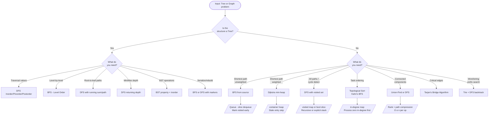

# Trees, Graphs & BFS/DFS in Go

> **Why this matters in production:** Tree and graph traversals appear everywhere — file system walks,
> dependency resolution, routing tables, social graphs, compilation pipelines, and database query planners.
> Knowing the idiomatic Go patterns for these structures separates engineers who know the theory from those
> who can ship it.

---

## Table of Contents

1. [Go Data Structures for Trees and Graphs](#1-go-data-structures-for-trees-and-graphs)
2. [BFS Template (Go)](#2-bfs-template-go)
3. [DFS Templates (Go)](#3-dfs-templates-go)
4. [Binary Tree Problems (Q1–Q8)](#4-binary-tree-problems)
5. [Binary Search Tree (Q9–Q12)](#5-binary-search-tree)
6. [Graph Traversal (Q13–Q17)](#6-graph-traversal)
7. [Advanced Graph (Q18–Q21)](#7-advanced-graph)
8. [Trie (Q22–Q23)](#8-trie)
9. [Union-Find (Q24–Q25)](#9-union-find)
10. [Pattern Summary — Decision Flowchart](#10-pattern-summary)

---

## 1. Go Data Structures for Trees and Graphs

### Why Go's approach differs from Java

In Java you think in terms of classes with methods. In Go you define plain structs and write functions that
operate on them. Pointer receivers give you mutation; value receivers give you copies. For tree nodes,
pointers are idiomatic because `nil` naturally represents an absent child.

```go
// TreeNode — the standard LeetCode definition, also used in production AST libraries.
type TreeNode struct {
    Val   int
    Left  *TreeNode
    Right *TreeNode
}

// Constructing a small tree:  1 -> (2, 3)
root := &TreeNode{Val: 1}
root.Left  = &TreeNode{Val: 2}
root.Right = &TreeNode{Val: 3}
```

```go
// Graph — adjacency list representation using a map.
// Using map[int][]int instead of [][]int gives sparse graphs O(V) space
// and lets vertices be non-contiguous integers.
type Graph struct {
    vertices int
    adj      map[int][]int
}

func NewGraph(v int) *Graph {
    return &Graph{
        vertices: v,
        adj:      make(map[int][]int),
    }
}

func (g *Graph) AddEdge(u, v int) {
    g.adj[u] = append(g.adj[u], v)
    g.adj[v] = append(g.adj[v], u) // omit for directed graph
}
```

```go
// GraphNode — used when nodes carry extra data (e.g. Clone Graph problem).
type GraphNode struct {
    Val       int
    Neighbors []*GraphNode
}
```

**Idiomatic Go notes:**
- Exported types (`TreeNode`) in library code; unexported (`treeNode`) for internal use.
- Never use `new(TreeNode)` — prefer `&TreeNode{}` composite literal (more readable, zero-valued fields).
- A slice `[]int` is the idiomatic Go queue/stack — no linked-list overhead, good cache locality.
- `nil` checks on pointer receivers are legal; `(*TreeNode)(nil).Val` panics but `node == nil` is safe.

---

## 2. BFS Template (Go)

BFS visits all nodes at distance `k` before any node at distance `k+1`.
Use it when you need: **shortest path**, **level-order traversal**, or **spreading state** (islands, word ladder).

```go
// bfsTemplate performs a breadth-first traversal starting from `start`.
// adjacency: func(node int) []int returns neighbors of node.
// returns: map[int]int of node → shortest distance from start.
func bfsTemplate(start int, adjacency func(int) []int) map[int]int {
    dist := make(map[int]int)
    dist[start] = 0

    queue := []int{start} // idiomatic Go queue: plain slice

    for len(queue) > 0 {
        // Dequeue from the front — O(n) pop; acceptable for most interview problems.
        // For high-throughput production code, use a ring buffer or container/list.
        node := queue[0]
        queue = queue[1:]

        for _, neighbor := range adjacency(node) {
            if _, visited := dist[neighbor]; !visited {
                dist[neighbor] = dist[node] + 1
                queue = append(queue, neighbor)
            }
        }
    }
    return dist
}
```

**Level-aware BFS (when you need the level number):**

```go
func bfsLevels(root *TreeNode) [][]int {
    if root == nil {
        return nil
    }
    result := [][]int{}
    queue := []*TreeNode{root}

    for len(queue) > 0 {
        levelSize := len(queue) // snapshot: how many nodes are on this level
        level := make([]int, 0, levelSize)

        for i := 0; i < levelSize; i++ {
            node := queue[0]
            queue = queue[1:]
            level = append(level, node.Val)
            if node.Left != nil {
                queue = append(queue, node.Left)
            }
            if node.Right != nil {
                queue = append(queue, node.Right)
            }
        }
        result = append(result, level)
    }
    return result
}
```

---

## 3. DFS Templates (Go)

DFS explores as deep as possible before backtracking.
Use it when you need: **all paths**, **cycle detection**, **topological sort**, **connected components**.

### Recursive DFS

```go
// dfsRecursive visits every node reachable from `node` exactly once.
// visited: map used as a set — idiomatic for sparse graphs.
func dfsRecursive(node int, adj map[int][]int, visited map[int]bool) {
    if visited[node] {
        return
    }
    visited[node] = true

    // Pre-order work on `node` goes here (e.g. append to result).

    for _, neighbor := range adj[node] {
        dfsRecursive(neighbor, adj, visited)
    }

    // Post-order work goes here (e.g. topological sort push).
}
```

### Iterative DFS (explicit stack)

```go
// dfsIterative uses an explicit stack — avoids stack-overflow on deep graphs,
// important in Go where the default goroutine stack is 8 KB (grows, but slowly).
func dfsIterative(start int, adj map[int][]int) []int {
    visited := make(map[int]bool)
    stack := []int{start}
    order := []int{}

    for len(stack) > 0 {
        // Pop from the end — O(1) with a slice.
        n := len(stack) - 1
        node := stack[n]
        stack = stack[:n]

        if visited[node] {
            continue
        }
        visited[node] = true
        order = append(order, node)

        // Push neighbors in reverse so leftmost is processed first.
        neighbors := adj[node]
        for i := len(neighbors) - 1; i >= 0; i-- {
            if !visited[neighbors[i]] {
                stack = append(stack, neighbors[i])
            }
        }
    }
    return order
}
```

---

## 4. Binary Tree Problems

---

### Q1: Binary Tree Inorder Traversal (Recursive + Iterative)

**Problem:** Return the inorder (left → root → right) traversal of a binary tree's values.

**Approach:**
- Recursive: standard pre/in/post differ only in where you append `node.Val`.
- Iterative: simulate the call stack explicitly; push left spine onto stack, then pop and go right.

```go
// Recursive — 8 lines including the signature.
func inorderRecursive(root *TreeNode) []int {
    result := []int{}
    var dfs func(*TreeNode)
    dfs = func(node *TreeNode) {
        if node == nil {
            return
        }
        dfs(node.Left)
        result = append(result, node.Val)
        dfs(node.Right)
    }
    dfs(root)
    return result
}

// Iterative — mirrors Morris traversal concept without modifying the tree.
func inorderIterative(root *TreeNode) []int {
    result := []int{}
    stack := []*TreeNode{}
    current := root

    for current != nil || len(stack) > 0 {
        // Push all left children.
        for current != nil {
            stack = append(stack, current)
            current = current.Left
        }
        // Pop, visit, then move to right subtree.
        current = stack[len(stack)-1]
        stack = stack[:len(stack)-1]
        result = append(result, current.Val)
        current = current.Right
    }
    return result
}
```

**Complexity:** Time O(n), Space O(h) where h = tree height.

**Go-specific note:** The closure `var dfs func(*TreeNode)` pattern is idiomatic for recursive lambdas in Go.
You must declare the variable before the assignment so the closure can reference itself.

---

### Q2: Maximum Depth of Binary Tree

**Problem:** Return the maximum depth (number of nodes along the longest root-to-leaf path).

**Approach:** Recursively the depth is `1 + max(depth(left), depth(right))`.

```go
func maxDepth(root *TreeNode) int {
    if root == nil {
        return 0
    }
    leftDepth  := maxDepth(root.Left)
    rightDepth := maxDepth(root.Right)
    if leftDepth > rightDepth {
        return leftDepth + 1
    }
    return rightDepth + 1
}
```

**Complexity:** Time O(n), Space O(h).

**Go-specific note:** Go has no built-in `max` for integers before Go 1.21. Use a simple if-else or define
`func max(a, b int) int { if a > b { return a }; return b }`. Go 1.21+ has `max` as a builtin.

---

### Q3: Symmetric Tree

**Problem:** Check whether a binary tree is a mirror image of itself.

**Approach:** Two pointers (`left`, `right`) walk the tree simultaneously — one going left-right, the other
right-left. They must always be equal.

```go
func isSymmetric(root *TreeNode) bool {
    if root == nil {
        return true
    }
    return isMirror(root.Left, root.Right)
}

func isMirror(left, right *TreeNode) bool {
    if left == nil && right == nil {
        return true
    }
    if left == nil || right == nil {
        return false
    }
    return left.Val == right.Val &&
        isMirror(left.Left, right.Right) &&
        isMirror(left.Right, right.Left)
}
```

**Complexity:** Time O(n), Space O(h).

**Go-specific note:** Short-circuit `&&` evaluation means the recursive calls only happen when both nodes
are non-nil and equal — clean and no redundant nil checks needed beyond the first two guards.

---

### Q4: Path Sum (Root to Leaf)

**Problem:** Given a tree and `targetSum`, return true if any root-to-leaf path sums to `targetSum`.

**Approach:** Subtract current node's value as you recurse; at a leaf, check if remainder is zero.

```go
func hasPathSum(root *TreeNode, targetSum int) bool {
    if root == nil {
        return false
    }
    // Leaf node check.
    if root.Left == nil && root.Right == nil {
        return root.Val == targetSum
    }
    remaining := targetSum - root.Val
    return hasPathSum(root.Left, remaining) || hasPathSum(root.Right, remaining)
}
```

**Complexity:** Time O(n), Space O(h).

**Go-specific note:** Checking for a leaf (`left == nil && right == nil`) before recursing is cleaner than
passing a path slice — avoids allocations in the hot path.

---

### Q5: Binary Tree Level Order Traversal

**Problem:** Return each level's values as a slice of slices: `[[3],[9,20],[15,7]]`.

**Approach:** BFS with level-size snapshotting (see BFS template above).

```go
func levelOrder(root *TreeNode) [][]int {
    if root == nil {
        return nil
    }
    result := [][]int{}
    queue := []*TreeNode{root}

    for len(queue) > 0 {
        size := len(queue)
        level := make([]int, 0, size)

        for i := 0; i < size; i++ {
            node := queue[0]
            queue = queue[1:]
            level = append(level, node.Val)
            if node.Left != nil {
                queue = append(queue, node.Left)
            }
            if node.Right != nil {
                queue = append(queue, node.Right)
            }
        }
        result = append(result, level)
    }
    return result
}
```

**Complexity:** Time O(n), Space O(n) (queue holds at most one full level = n/2 nodes).

**Go-specific note:** `make([]int, 0, size)` pre-allocates the backing array with the exact capacity needed
for each level, eliminating reallocation within the inner loop. This is a common Go performance pattern.

---

### Q6: Construct Binary Tree from Preorder and Inorder

**Problem:** Given `preorder` and `inorder` traversal arrays, reconstruct the tree.

**Approach:**
- `preorder[0]` is always the root.
- Find root's position in `inorder` → elements to its left are the left subtree, right are the right subtree.
- Use a map for O(1) inorder index lookups.

```go
func buildTree(preorder []int, inorder []int) *TreeNode {
    // Build index map once — O(n) setup, O(1) lookup per call.
    inorderIdx := make(map[int]int, len(inorder))
    for i, v := range inorder {
        inorderIdx[v] = i
    }

    var build func(preL, preR, inL, inR int) *TreeNode
    build = func(preL, preR, inL, inR int) *TreeNode {
        if preL > preR {
            return nil
        }
        rootVal := preorder[preL]
        root := &TreeNode{Val: rootVal}

        mid := inorderIdx[rootVal]
        leftSize := mid - inL

        root.Left  = build(preL+1, preL+leftSize, inL, mid-1)
        root.Right = build(preL+leftSize+1, preR, mid+1, inR)
        return root
    }

    return build(0, len(preorder)-1, 0, len(inorder)-1)
}
```

**Complexity:** Time O(n), Space O(n) for the index map.

**Go-specific note:** Passing index bounds instead of sub-slices avoids O(n) allocations per recursive call.
This is a critical Go optimization — slice operations create new slice headers but *share* the backing array,
yet repeated `preorder[1:]` calls in a hot loop still create garbage.

---

### Q7: Binary Tree Maximum Path Sum

**Problem:** A path goes through any nodes (not necessarily root-to-leaf). Return the maximum sum.

**Approach:** At each node, compute the max "gain" you can get going left or right (take 0 if negative).
The candidate answer at each node = `node.Val + leftGain + rightGain`. Track global max.

```go
func maxPathSum(root *TreeNode) int {
    maxSum := root.Val // can be negative, so don't use math.MinInt32 here

    var dfs func(*TreeNode) int
    dfs = func(node *TreeNode) int {
        if node == nil {
            return 0
        }
        // Only extend if positive contribution.
        leftGain  := max(dfs(node.Left), 0)
        rightGain := max(dfs(node.Right), 0)

        // Path through this node (may include both children).
        pathThroughNode := node.Val + leftGain + rightGain
        if pathThroughNode > maxSum {
            maxSum = pathThroughNode
        }

        // Return the best single-branch extension to the parent.
        if leftGain > rightGain {
            return node.Val + leftGain
        }
        return node.Val + rightGain
    }

    dfs(root)
    return maxSum
}

func max(a, b int) int {
    if a > b {
        return a
    }
    return b
}
```

**Complexity:** Time O(n), Space O(h).

**Go-specific note:** Initializing `maxSum = root.Val` (not `math.MinInt`) handles single-node trees with
negative values without needing to import `math`. A common interview bug is using `0` as the initial max.

---

### Q8: Serialize and Deserialize Binary Tree

**Problem:** Design an algorithm to convert a tree to a string and back. No constraints on format.

**Approach:** BFS serialization using level-order; `null` for absent nodes. Format: `1,2,3,null,null,4,5`.

```go
import (
    "strconv"
    "strings"
)

// Codec uses BFS (level-order) serialization.
type Codec struct{}

func (c *Codec) serialize(root *TreeNode) string {
    if root == nil {
        return ""
    }
    parts := []string{}
    queue := []*TreeNode{root}

    for len(queue) > 0 {
        node := queue[0]
        queue = queue[1:]
        if node == nil {
            parts = append(parts, "null")
        } else {
            parts = append(parts, strconv.Itoa(node.Val))
            queue = append(queue, node.Left)
            queue = append(queue, node.Right)
        }
    }
    return strings.Join(parts, ",")
}

func (c *Codec) deserialize(data string) *TreeNode {
    if data == "" {
        return nil
    }
    parts := strings.Split(data, ",")
    root := &TreeNode{Val: mustAtoi(parts[0])}
    queue := []*TreeNode{root}
    i := 1

    for len(queue) > 0 && i < len(parts) {
        node := queue[0]
        queue = queue[1:]

        if i < len(parts) && parts[i] != "null" {
            node.Left = &TreeNode{Val: mustAtoi(parts[i])}
            queue = append(queue, node.Left)
        }
        i++
        if i < len(parts) && parts[i] != "null" {
            node.Right = &TreeNode{Val: mustAtoi(parts[i])}
            queue = append(queue, node.Right)
        }
        i++
    }
    return root
}

func mustAtoi(s string) int {
    n, _ := strconv.Atoi(s)
    return n
}
```

**Complexity:** Time O(n), Space O(n).

**Go-specific note:** `strings.Builder` would be faster for building large strings, but `strings.Join` on a
pre-built slice is clear and idiomatic for moderate-size trees. Use `strings.Builder` in production if
serializing millions of nodes.

---

## 5. Binary Search Tree

---

### Q9: Validate BST

**Problem:** Given a binary tree, check if it is a valid BST.

**Approach:** Track valid `(min, max)` bounds as you recurse. Every node must satisfy `min < val < max`.
Use `math.MinInt64` and `math.MaxInt64` as the initial unconstrained bounds.

```go
import "math"

func isValidBST(root *TreeNode) bool {
    return validate(root, math.MinInt64, math.MaxInt64)
}

func validate(node *TreeNode, min, max int) bool {
    if node == nil {
        return true
    }
    if node.Val <= min || node.Val >= max {
        return false
    }
    return validate(node.Left, min, node.Val) &&
        validate(node.Right, node.Val, max)
}
```

**Complexity:** Time O(n), Space O(h).

**Go-specific note:** A common wrong answer is comparing only with the immediate parent. The bounds-passing
approach correctly enforces the BST property across all ancestors. Use `int64` bounds to handle `math.MinInt`
and `math.MaxInt` as actual node values.

---

### Q10: Kth Smallest in BST

**Problem:** Return the kth (1-indexed) smallest element in a BST.

**Approach:** Inorder traversal of a BST visits nodes in sorted order. Stop early at the kth visit.

```go
func kthSmallest(root *TreeNode, k int) int {
    stack := []*TreeNode{}
    current := root
    count := 0

    for current != nil || len(stack) > 0 {
        for current != nil {
            stack = append(stack, current)
            current = current.Left
        }
        current = stack[len(stack)-1]
        stack = stack[:len(stack)-1]

        count++
        if count == k {
            return current.Val
        }
        current = current.Right
    }
    return -1 // unreachable if k is valid
}
```

**Complexity:** Time O(H + k) where H is tree height, Space O(H).

**Go-specific note:** The iterative approach is preferable over recursive here because it can short-circuit
as soon as `count == k` without recursing into the rest of the tree. In Go, early returns from closures
require sentinel patterns (panic/recover or a boolean flag) — iterative is cleaner.

---

### Q11: Lowest Common Ancestor of a BST

**Problem:** Find the LCA of two nodes `p` and `q` in a BST. LCA = the deepest node that is an ancestor of both.

**Approach:** BST property tells you which subtree to recurse into:
- Both values less than current → LCA is in left subtree.
- Both values greater → LCA is in right subtree.
- Otherwise current node is the LCA (one is in each subtree, or one equals current).

```go
func lowestCommonAncestorBST(root, p, q *TreeNode) *TreeNode {
    node := root
    for node != nil {
        if p.Val < node.Val && q.Val < node.Val {
            node = node.Left
        } else if p.Val > node.Val && q.Val > node.Val {
            node = node.Right
        } else {
            return node
        }
    }
    return nil
}
```

**Complexity:** Time O(h), Space O(1) iterative — much better than O(h) stack space in recursive version.

**Go-specific note:** The iterative version is preferred in Go for BST problems because the BST allows
directional decisions. No closures, no recursion overhead, cache-friendly.

---

### Q12: BST Iterator (using stack)

**Problem:** Implement an iterator that returns BST elements in sorted order using O(h) space.
- `Next()` → next smallest value
- `HasNext()` → true if more elements exist

**Approach:** Lazily push nodes onto a stack (only the left spine). When `Next()` is called, pop the top,
return its value, then push the right child's left spine.

```go
type BSTIterator struct {
    stack []*TreeNode
}

func NewBSTIterator(root *TreeNode) *BSTIterator {
    it := &BSTIterator{}
    it.pushLeft(root)
    return it
}

// pushLeft pushes the left spine of the subtree rooted at node.
func (it *BSTIterator) pushLeft(node *TreeNode) {
    for node != nil {
        it.stack = append(it.stack, node)
        node = node.Left
    }
}

func (it *BSTIterator) Next() int {
    top := it.stack[len(it.stack)-1]
    it.stack = it.stack[:len(it.stack)-1]
    it.pushLeft(top.Right) // expand right child's left spine
    return top.Val
}

func (it *BSTIterator) HasNext() bool {
    return len(it.stack) > 0
}
```

**Complexity:** `Next()` amortized O(1), `HasNext()` O(1), Space O(h).

**Go-specific note:** Go structs are value types, so `BSTIterator` is returned as a pointer (`*BSTIterator`)
so that `pushLeft` mutations to `it.stack` are visible to the caller. Forgetting the pointer here is a
classic Go bug where the stack grows inside a method but the caller sees the original empty slice.

---

## 6. Graph Traversal

---

### Q13: Number of Islands (BFS)

**Problem:** Given a 2D grid of `'1'` (land) and `'0'` (water), count the number of islands.
An island is surrounded by water and is formed by connecting adjacent land cells horizontally or vertically.

**Approach:** Iterate the grid. When you find an unvisited `'1'`, BFS to mark the entire island as visited,
then increment the count.

```go
func numIslands(grid [][]byte) int {
    if len(grid) == 0 {
        return 0
    }
    rows, cols := len(grid), len(grid[0])
    count := 0
    dirs := [][2]int{{1, 0}, {-1, 0}, {0, 1}, {0, -1}}

    bfs := func(r, c int) {
        queue := [][2]int{{r, c}}
        grid[r][c] = '0' // mark visited by overwriting — O(1), no extra visited set

        for len(queue) > 0 {
            curr := queue[0]
            queue = queue[1:]

            for _, d := range dirs {
                nr, nc := curr[0]+d[0], curr[1]+d[1]
                if nr >= 0 && nr < rows && nc >= 0 && nc < cols && grid[nr][nc] == '1' {
                    grid[nr][nc] = '0'
                    queue = append(queue, [2]int{nr, nc})
                }
            }
        }
    }

    for r := 0; r < rows; r++ {
        for c := 0; c < cols; c++ {
            if grid[r][c] == '1' {
                bfs(r, c)
                count++
            }
        }
    }
    return count
}
```

**Complexity:** Time O(m×n), Space O(min(m,n)) for the BFS queue in the worst case.

**Go-specific note:** Using `[2]int` as queue elements instead of a struct avoids a type declaration.
Both are valid; `[2]int` is lighter for throwaway code. In production, a named struct (`type Point struct{R, C int}`)
is more readable.

---

### Q14: Clone Graph

**Problem:** Given a reference to a node in a connected undirected graph, return a deep copy of the graph.

**Approach:** BFS from the start node. Use a map from original node pointer to cloned node pointer to avoid
cycles and duplicates.

```go
func cloneGraph(node *GraphNode) *GraphNode {
    if node == nil {
        return nil
    }
    visited := make(map[*GraphNode]*GraphNode)

    var dfs func(*GraphNode) *GraphNode
    dfs = func(n *GraphNode) *GraphNode {
        if clone, ok := visited[n]; ok {
            return clone
        }
        clone := &GraphNode{Val: n.Val}
        visited[n] = clone // register BEFORE recursing to handle cycles

        for _, neighbor := range n.Neighbors {
            clone.Neighbors = append(clone.Neighbors, dfs(neighbor))
        }
        return clone
    }

    return dfs(node)
}
```

**Complexity:** Time O(V+E), Space O(V).

**Go-specific note:** Registering `visited[n] = clone` *before* recursing into neighbors is essential for
cycle correctness. This is analogous to the "grey/white/black" DFS coloring — Go maps let you do it with a
single map and the pointer as key.

---

### Q15: Course Schedule — Topological Sort (Kahn's Algorithm)

**Problem:** `n` courses, `prerequisites[i] = [a, b]` means you must take `b` before `a`.
Return true if you can finish all courses (i.e., no cycle exists).

**Approach:** Kahn's BFS-based topological sort. Count in-degrees; repeatedly enqueue nodes with in-degree 0
and reduce neighbors' in-degrees. If all nodes are processed, no cycle exists.

```go
func canFinish(numCourses int, prerequisites [][]int) bool {
    inDegree := make([]int, numCourses)
    adj := make([][]int, numCourses)

    for _, pre := range prerequisites {
        course, prereq := pre[0], pre[1]
        adj[prereq] = append(adj[prereq], course)
        inDegree[course]++
    }

    // Enqueue all courses with no prerequisites.
    queue := []int{}
    for i := 0; i < numCourses; i++ {
        if inDegree[i] == 0 {
            queue = append(queue, i)
        }
    }

    processed := 0
    for len(queue) > 0 {
        node := queue[0]
        queue = queue[1:]
        processed++

        for _, next := range adj[node] {
            inDegree[next]--
            if inDegree[next] == 0 {
                queue = append(queue, next)
            }
        }
    }

    return processed == numCourses
}
```

**Complexity:** Time O(V+E), Space O(V+E).

**Go-specific note:** `[][]int` (slice of slices) for adjacency list is idiomatic when vertices are contiguous
integers. For non-contiguous IDs use `map[int][]int`. Pre-allocating `adj := make([][]int, numCourses)` zeroes
all inner slices — `append` on a nil slice is valid in Go.

---

### Q16: Word Ladder

**Problem:** Transform `beginWord` to `endWord` by changing one letter at a time; each intermediate word
must be in `wordList`. Return the minimum number of transformations.

**Approach:** BFS from `beginWord`. At each step, try all single-character mutations. If the mutation is in
the word set, enqueue it. Use the word set as the "visited" structure by removing words as they are enqueued.

```go
func ladderLength(beginWord string, endWord string, wordList []string) int {
    wordSet := make(map[string]bool, len(wordList))
    for _, w := range wordList {
        wordSet[w] = true
    }
    if !wordSet[endWord] {
        return 0
    }

    queue := []string{beginWord}
    steps := 1

    for len(queue) > 0 {
        size := len(queue)
        for i := 0; i < size; i++ {
            word := queue[i]
            if word == endWord {
                return steps
            }
            // Try all single-character substitutions.
            wordBytes := []byte(word)
            for j := 0; j < len(wordBytes); j++ {
                original := wordBytes[j]
                for c := byte('a'); c <= byte('z'); c++ {
                    if c == original {
                        continue
                    }
                    wordBytes[j] = c
                    next := string(wordBytes)
                    if wordSet[next] {
                        queue = append(queue, next)
                        delete(wordSet, next) // mark visited
                    }
                }
                wordBytes[j] = original // restore
            }
        }
        queue = queue[size:]
        steps++
    }
    return 0
}
```

**Complexity:** Time O(M² × N) where M = word length, N = number of words. Space O(M × N).

**Go-specific note:** Mutating a `[]byte` in-place and restoring avoids N string allocations per character
position. Converting string → `[]byte` once per word and working on the byte slice is a standard Go
performance pattern since `string` is immutable.

---

### Q17: Surrounded Regions

**Problem:** Given an `m×n` board of `'X'` and `'O'`, capture all regions of `'O'` not connected to the border.
Replace captured `'O'` cells with `'X'`.

**Approach:** Any `'O'` connected to a border `'O'` cannot be captured. BFS/DFS from all border `'O'`s,
marking them safe (`'S'`). Then flip: `'O'` → `'X'`, `'S'` → `'O'`.

```go
func solve(board [][]byte) {
    if len(board) == 0 {
        return
    }
    rows, cols := len(board), len(board[0])
    dirs := [][2]int{{1, 0}, {-1, 0}, {0, 1}, {0, -1}}

    var bfs func(r, c int)
    bfs = func(r, c int) {
        queue := [][2]int{{r, c}}
        board[r][c] = 'S'
        for len(queue) > 0 {
            curr := queue[0]
            queue = queue[1:]
            for _, d := range dirs {
                nr, nc := curr[0]+d[0], curr[1]+d[1]
                if nr >= 0 && nr < rows && nc >= 0 && nc < cols && board[nr][nc] == 'O' {
                    board[nr][nc] = 'S'
                    queue = append(queue, [2]int{nr, nc})
                }
            }
        }
    }

    // Mark all border-connected 'O's as safe.
    for r := 0; r < rows; r++ {
        if board[r][0] == 'O' {
            bfs(r, 0)
        }
        if board[r][cols-1] == 'O' {
            bfs(r, cols-1)
        }
    }
    for c := 0; c < cols; c++ {
        if board[0][c] == 'O' {
            bfs(0, c)
        }
        if board[rows-1][c] == 'O' {
            bfs(rows-1, c)
        }
    }

    // Flip: 'O' → 'X', 'S' → 'O'.
    for r := 0; r < rows; r++ {
        for c := 0; c < cols; c++ {
            if board[r][c] == 'O' {
                board[r][c] = 'X'
            } else if board[r][c] == 'S' {
                board[r][c] = 'O'
            }
        }
    }
}
```

**Complexity:** Time O(m×n), Space O(m×n) for the BFS queue.

**Go-specific note:** Using a byte marker `'S'` (safe) instead of a separate visited set is a common
in-place marking technique. The `byte` type in Go is an alias for `uint8`, so byte comparisons and
assignments are idiomatic for grid problems using character boards.

---

## 7. Advanced Graph

---

### Q18: Shortest Path in Binary Matrix (BFS)

**Problem:** In an `n×n` binary matrix, find the shortest clear path from top-left `(0,0)` to
bottom-right `(n-1,n-1)`. Clear path: all cells are `0`, 8-directional movement. Return -1 if no path.

**Approach:** BFS with 8 directions. Distance is guaranteed minimum because BFS explores level by level.

```go
func shortestPathBinaryMatrix(grid [][]int) int {
    n := len(grid)
    if grid[0][0] == 1 || grid[n-1][n-1] == 1 {
        return -1
    }
    if n == 1 {
        return 1
    }

    dirs := [][2]int{
        {-1, -1}, {-1, 0}, {-1, 1},
        {0, -1},           {0, 1},
        {1, -1},  {1, 0},  {1, 1},
    }

    type State struct{ r, c, dist int }
    queue := []State{{0, 0, 1}}
    grid[0][0] = 1 // mark visited by setting to 1

    for len(queue) > 0 {
        curr := queue[0]
        queue = queue[1:]

        for _, d := range dirs {
            nr, nc := curr.r+d[0], curr.c+d[1]
            if nr < 0 || nr >= n || nc < 0 || nc >= n || grid[nr][nc] != 0 {
                continue
            }
            if nr == n-1 && nc == n-1 {
                return curr.dist + 1
            }
            grid[nr][nc] = 1
            queue = append(queue, State{nr, nc, curr.dist + 1})
        }
    }
    return -1
}
```

**Complexity:** Time O(n²), Space O(n²).

**Go-specific note:** Defining a local `type State struct` inside the function is valid Go and keeps the
type scoped. Alternatively use `[3]int{r, c, dist}` — the struct version is more readable and self-documenting.

---

### Q19: Network Delay Time (Dijkstra's Algorithm)

**Problem:** `n` nodes labeled `1..n`. Given weighted directed edges `[u, v, w]` and source `k`,
return the time for all nodes to receive the signal, or -1 if any node is unreachable.

**Approach:** Dijkstra's algorithm with a min-heap (priority queue).

```go
import "container/heap"

type Item struct {
    node, dist int
}
type MinHeap []Item

func (h MinHeap) Len() int            { return len(h) }
func (h MinHeap) Less(i, j int) bool  { return h[i].dist < h[j].dist }
func (h MinHeap) Swap(i, j int)       { h[i], h[j] = h[j], h[i] }
func (h *MinHeap) Push(x interface{}) { *h = append(*h, x.(Item)) }
func (h *MinHeap) Pop() interface{} {
    old := *h
    n := len(old)
    x := old[n-1]
    *h = old[:n-1]
    return x
}

func networkDelayTime(times [][]int, n int, k int) int {
    adj := make(map[int][]Item)
    for _, t := range times {
        u, v, w := t[0], t[1], t[2]
        adj[u] = append(adj[u], Item{v, w})
    }

    dist := make([]int, n+1)
    for i := range dist {
        dist[i] = 1<<31 - 1 // MaxInt32 as infinity
    }
    dist[k] = 0

    pq := &MinHeap{{k, 0}}
    heap.Init(pq)

    for pq.Len() > 0 {
        curr := heap.Pop(pq).(Item)
        if curr.dist > dist[curr.node] {
            continue // stale entry
        }
        for _, next := range adj[curr.node] {
            newDist := dist[curr.node] + next.dist
            if newDist < dist[next.node] {
                dist[next.node] = newDist
                heap.Push(pq, Item{next.node, newDist})
            }
        }
    }

    maxDist := 0
    for i := 1; i <= n; i++ {
        if dist[i] == 1<<31-1 {
            return -1
        }
        if dist[i] > maxDist {
            maxDist = dist[i]
        }
    }
    return maxDist
}
```

**Complexity:** Time O((V+E) log V), Space O(V+E).

**Go-specific note:** Go's `container/heap` requires implementing the `heap.Interface` (5 methods). This is
more verbose than Python's `heapq` but gives full control over the element type. The `interface{}` (or `any`
in Go 1.18+) cast in `Push`/`Pop` is the standard pattern. In Go 1.18+ you can use generics to avoid the cast.

---

### Q20: Find Critical Connections (Bridges — Tarjan's Algorithm)

**Problem:** In a connected undirected graph, find all edges whose removal disconnects the graph (bridges).

**Approach:** Tarjan's bridge-finding DFS. Track `disc` (discovery time) and `low` (lowest disc reachable
via DFS subtree). An edge `(u,v)` is a bridge if `low[v] > disc[u]`.

```go
func criticalConnections(n int, connections [][]int) [][]int {
    adj := make([][]int, n)
    for _, c := range connections {
        u, v := c[0], c[1]
        adj[u] = append(adj[u], v)
        adj[v] = append(adj[v], u)
    }

    disc := make([]int, n)
    low  := make([]int, n)
    for i := range disc {
        disc[i] = -1 // -1 means unvisited
    }

    timer := 0
    result := [][]int{}

    var dfs func(u, parent int)
    dfs = func(u, parent int) {
        disc[u] = timer
        low[u] = timer
        timer++

        for _, v := range adj[u] {
            if v == parent {
                continue // skip the edge we came from
            }
            if disc[v] == -1 {
                dfs(v, u)
                if low[v] < low[u] {
                    low[u] = low[v]
                }
                if low[v] > disc[u] {
                    result = append(result, []int{u, v})
                }
            } else {
                if disc[v] < low[u] {
                    low[u] = disc[v]
                }
            }
        }
    }

    dfs(0, -1)
    return result
}
```

**Complexity:** Time O(V+E), Space O(V+E).

**Go-specific note:** `timer` is captured by the closure `dfs` — mutations inside `dfs` are reflected in
the enclosing scope because closures in Go capture variables by reference. This is the idiomatic way to
share mutable counter state without passing a pointer argument.

---

### Q21: Alien Dictionary (Topological Sort with BFS)

**Problem:** Given a sorted list of words in an alien language, derive the order of characters.

**Approach:** Compare adjacent words to build a directed character graph (`c1 → c2` means `c1` comes before
`c2`). Apply Kahn's topological sort. If a cycle exists, return `""`.

```go
func alienOrder(words []string) string {
    // Initialize in-degree for all characters that appear.
    inDegree := make(map[byte]int)
    adj      := make(map[byte][]byte)
    for _, w := range words {
        for i := 0; i < len(w); i++ {
            if _, ok := inDegree[w[i]]; !ok {
                inDegree[w[i]] = 0
            }
        }
    }

    // Build edges from adjacent word comparisons.
    for i := 0; i < len(words)-1; i++ {
        w1, w2 := words[i], words[i+1]
        minLen := len(w1)
        if len(w2) < minLen {
            minLen = len(w2)
        }
        if len(w1) > len(w2) && w1[:minLen] == w2[:minLen] {
            return "" // invalid: longer word is a prefix of shorter
        }
        for j := 0; j < minLen; j++ {
            if w1[j] != w2[j] {
                adj[w1[j]] = append(adj[w1[j]], w2[j])
                inDegree[w2[j]]++
                break
            }
        }
    }

    // Kahn's BFS.
    queue := []byte{}
    for ch, deg := range inDegree {
        if deg == 0 {
            queue = append(queue, ch)
        }
    }

    result := []byte{}
    for len(queue) > 0 {
        ch := queue[0]
        queue = queue[1:]
        result = append(result, ch)
        for _, next := range adj[ch] {
            inDegree[next]--
            if inDegree[next] == 0 {
                queue = append(queue, next)
            }
        }
    }

    if len(result) != len(inDegree) {
        return "" // cycle detected
    }
    return string(result)
}
```

**Complexity:** Time O(C) where C = total length of all words, Space O(1) since at most 26 unique characters.

**Go-specific note:** Using `byte` as the map key is idiomatic for single-byte character sets. For Unicode
support, use `rune`. `string(result)` converts `[]byte` to `string` without any extra allocation in Go's
runtime — the compiler optimizes this conversion.

---

## 8. Trie

---

### Q22: Implement Trie (Prefix Tree)

**Problem:** Implement `Insert`, `Search`, and `StartsWith` for a Trie.

**Approach:** Each node stores 26 child pointers (for lowercase letters) and an `isEnd` flag.

```go
type TrieNode struct {
    children [26]*TrieNode
    isEnd    bool
}

type Trie struct {
    root *TrieNode
}

func NewTrie() *Trie {
    return &Trie{root: &TrieNode{}}
}

func (t *Trie) Insert(word string) {
    node := t.root
    for i := 0; i < len(word); i++ {
        idx := word[i] - 'a'
        if node.children[idx] == nil {
            node.children[idx] = &TrieNode{}
        }
        node = node.children[idx]
    }
    node.isEnd = true
}

func (t *Trie) Search(word string) bool {
    node := t.find(word)
    return node != nil && node.isEnd
}

func (t *Trie) StartsWith(prefix string) bool {
    return t.find(prefix) != nil
}

// find returns the node at the end of the given string, or nil if not present.
func (t *Trie) find(s string) *TrieNode {
    node := t.root
    for i := 0; i < len(s); i++ {
        idx := s[i] - 'a'
        if node.children[idx] == nil {
            return nil
        }
        node = node.children[idx]
    }
    return node
}
```

**Complexity:** Insert/Search/StartsWith all O(m) where m = word length. Space O(m × n) for n words.

**Go-specific note:** Using `[26]*TrieNode` (fixed-size array of pointers) is more cache-friendly than
`map[byte]*TrieNode` for the lowercase-only constraint. Array indexing via `word[i] - 'a'` is O(1) and
branch-free. For Unicode tries, use `map[rune]*TrieNode`.

---

### Q23: Word Search II (Trie + Backtracking)

**Problem:** Given an `m×n` board and a list of words, return all words that can be formed by sequentially
adjacent (horizontal/vertical) cells. Each cell may only be used once per word.

**Approach:** Build a Trie of all words. DFS/backtracking from each cell. At each step, check if the current
character path leads to a Trie node — prune early if not. Mark cells as visited by temporarily overwriting
with `'#'`.

```go
func findWords(board [][]byte, words []string) []string {
    trie := NewTrie()
    for _, w := range words {
        trie.Insert(w)
    }

    rows, cols := len(board), len(board[0])
    resultSet := make(map[string]bool)
    dirs := [][2]int{{1, 0}, {-1, 0}, {0, 1}, {0, -1}}

    var dfs func(node *TrieNode, r, c int, path []byte)
    dfs = func(node *TrieNode, r, c int, path []byte) {
        if r < 0 || r >= rows || c < 0 || c >= cols || board[r][c] == '#' {
            return
        }
        ch := board[r][c]
        idx := ch - 'a'
        nextNode := node.children[idx]
        if nextNode == nil {
            return // prune: no word with this prefix in trie
        }

        path = append(path, ch)
        if nextNode.isEnd {
            resultSet[string(path)] = true
        }

        board[r][c] = '#' // mark visited
        for _, d := range dirs {
            dfs(nextNode, r+d[0], c+d[1], path)
        }
        board[r][c] = ch // restore (backtrack)
    }

    for r := 0; r < rows; r++ {
        for c := 0; c < cols; c++ {
            dfs(trie.root, r, c, []byte{})
        }
    }

    result := make([]string, 0, len(resultSet))
    for w := range resultSet {
        result = append(result, w)
    }
    return result
}
```

**Complexity:** Time O(M × 4 × 3^(L-1)) where M = board cells, L = max word length. Space O(N × L) for trie.

**Go-specific note:** Using `map[string]bool` as a result set handles duplicate findings (same word found
via different paths). `path []byte` is passed by value so each call gets its own slice header but shares the
backing array until `append` triggers a realloc — for correctness, `string(path)` is called at the point of
recording, capturing the current path state immutably.

---

## 9. Union-Find

---

### Q24: Union-Find with Rank and Path Compression

**Problem:** Implement a Disjoint Set Union (DSU/Union-Find) data structure supporting:
- `Find(x)` → root of x's component
- `Union(x, y)` → merge components
- `Connected(x, y)` → true if in same component

```go
// UnionFind with path compression and union by rank.
// Both optimizations together give amortized O(α(n)) ≈ O(1) per operation.
type UnionFind struct {
    parent []int
    rank   []int
    count  int // number of distinct components
}

func NewUnionFind(n int) *UnionFind {
    parent := make([]int, n)
    rank   := make([]int, n)
    for i := range parent {
        parent[i] = i // each element is its own root
    }
    return &UnionFind{parent: parent, rank: rank, count: n}
}

// Find returns the root of x with path compression.
// Path compression makes every node on the path point directly to the root,
// flattening the tree for future queries.
func (uf *UnionFind) Find(x int) int {
    if uf.parent[x] != x {
        uf.parent[x] = uf.Find(uf.parent[x]) // recursive path compression
    }
    return uf.parent[x]
}

// Union merges the components containing x and y.
// Union by rank keeps the tree shallow by attaching smaller rank under larger rank.
func (uf *UnionFind) Union(x, y int) bool {
    rootX := uf.Find(x)
    rootY := uf.Find(y)
    if rootX == rootY {
        return false // already connected
    }
    switch {
    case uf.rank[rootX] < uf.rank[rootY]:
        uf.parent[rootX] = rootY
    case uf.rank[rootX] > uf.rank[rootY]:
        uf.parent[rootY] = rootX
    default:
        uf.parent[rootY] = rootX
        uf.rank[rootX]++
    }
    uf.count--
    return true
}

func (uf *UnionFind) Connected(x, y int) bool {
    return uf.Find(x) == uf.Find(y)
}

func (uf *UnionFind) ComponentCount() int {
    return uf.count
}
```

**Complexity:** O(α(n)) amortized per operation — effectively O(1) for all practical n.

**Go-specific note:** The recursive `Find` with path compression is concise but risks a stack overflow for
very deep initial trees (before any compression). For extremely large n, use iterative path compression:

```go
func (uf *UnionFind) FindIterative(x int) int {
    root := x
    for uf.parent[root] != root {
        root = uf.parent[root]
    }
    // Second pass: point all nodes on path directly to root.
    for uf.parent[x] != root {
        next := uf.parent[x]
        uf.parent[x] = root
        x = next
    }
    return root
}
```

---

### Q25: Number of Connected Components in an Undirected Graph

**Problem:** Given `n` nodes and a list of undirected edges, return the number of connected components.

**Approach:** Union-Find — union each edge, return final component count. Alternatively, DFS/BFS counting
unvisited nodes. Union-Find is O(n + E × α(n)) ≈ O(n + E).

```go
func countComponents(n int, edges [][]int) int {
    uf := NewUnionFind(n)
    for _, edge := range edges {
        uf.Union(edge[0], edge[1])
    }
    return uf.ComponentCount()
}

// DFS alternative — useful when you also need component membership.
func countComponentsDFS(n int, edges [][]int) int {
    adj := make([][]int, n)
    for _, e := range edges {
        u, v := e[0], e[1]
        adj[u] = append(adj[u], v)
        adj[v] = append(adj[v], u)
    }

    visited := make([]bool, n)
    count := 0

    var dfs func(node int)
    dfs = func(node int) {
        visited[node] = true
        for _, neighbor := range adj[node] {
            if !visited[neighbor] {
                dfs(neighbor)
            }
        }
    }

    for i := 0; i < n; i++ {
        if !visited[i] {
            dfs(i)
            count++
        }
    }
    return count
}
```

**Complexity:** Union-Find: O((n+E)α(n)). DFS: O(n+E). Space O(n+E) for both.

**Go-specific note:** `NewUnionFind` reuses the struct defined in Q24 — in a real codebase this would be in
a shared `dsu` package. Go modules make it trivial to import internal packages; avoid copy-pasting DSU into
every solution file.

---

## 10. Pattern Summary

Use the following decision flowchart to pick the right algorithm for any tree/graph problem:



---

## Quick Reference: Go Idioms for Trees & Graphs

| Pattern | Go Idiom | Why |
|---|---|---|
| Queue (BFS) | `queue = queue[1:]` | No container/list needed; slice reslice is O(1) header op |
| Stack (DFS) | `stack = stack[:n-1]` | Same — pop from end for O(1) |
| Visited set | `map[int]bool` or `[]bool` | Map for sparse; slice for 0..n-1 node IDs |
| Path compression | Recursive or iterative | Iterative avoids stack overflow for large n |
| Infinity | `1<<31 - 1` or `math.MaxInt` | Avoid `math.MaxInt32` overflow when adding weights |
| Nil check | `if node == nil` | Always safe on pointer types; never `node.Val == 0` |
| Closure DFS | `var dfs func(...); dfs = func(...) {}` | Declare before assign so closure can self-reference |
| Grid directions | `dirs := [][2]int{...}` | Fixed array inside slice; no struct needed for coords |
| In-place visited | Overwrite cell value | Saves O(m×n) visited array; restore on backtrack |

---

## Complexity Cheat Sheet

| Algorithm | Time | Space | Use when |
|---|---|---|---|
| BFS (unweighted) | O(V+E) | O(V) | Shortest path, level order |
| DFS | O(V+E) | O(V) | All paths, cycle detection, components |
| Dijkstra | O((V+E) log V) | O(V) | Weighted shortest path (no neg edges) |
| Kahn's Topo Sort | O(V+E) | O(V) | Task scheduling, dependency order |
| Tarjan's Bridges | O(V+E) | O(V) | Find critical edges |
| Union-Find | O(α(n)) amortized | O(n) | Dynamic connectivity, components |
| Trie Insert/Search | O(m) | O(m×n) | Prefix search, autocomplete |
| Binary Tree DFS | O(n) | O(h) | Any tree traversal |
| BST search | O(h) | O(1) | Ordered data, k-th element |
