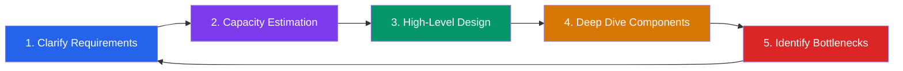
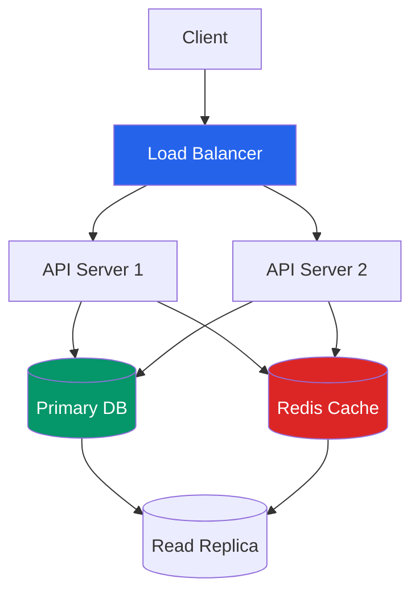
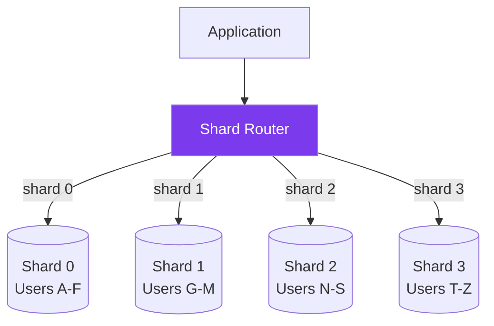
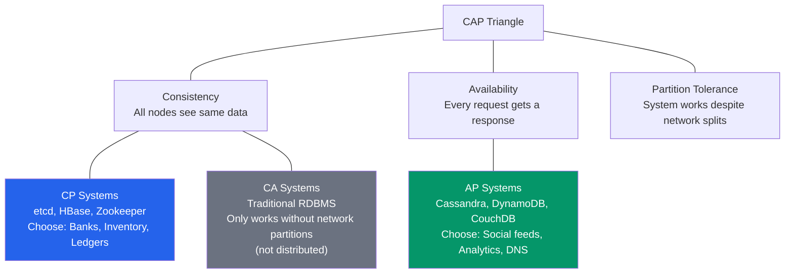
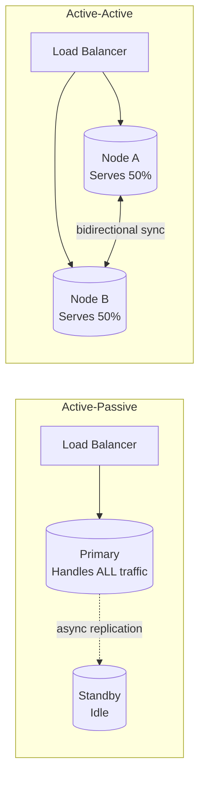
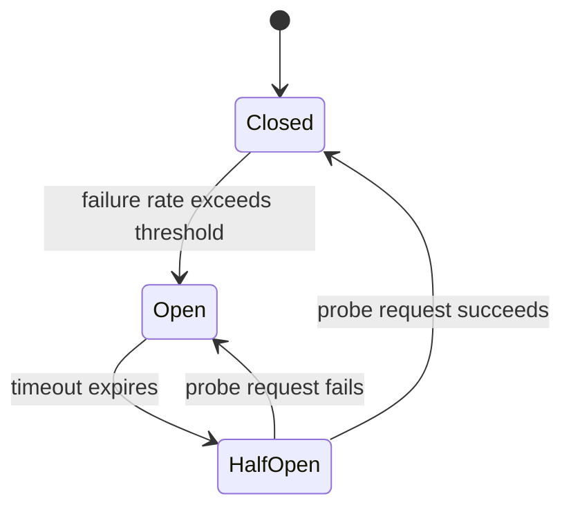
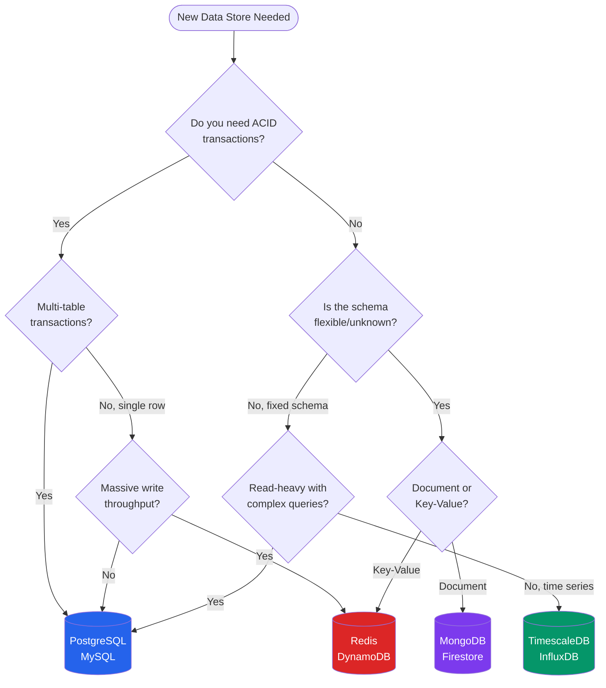
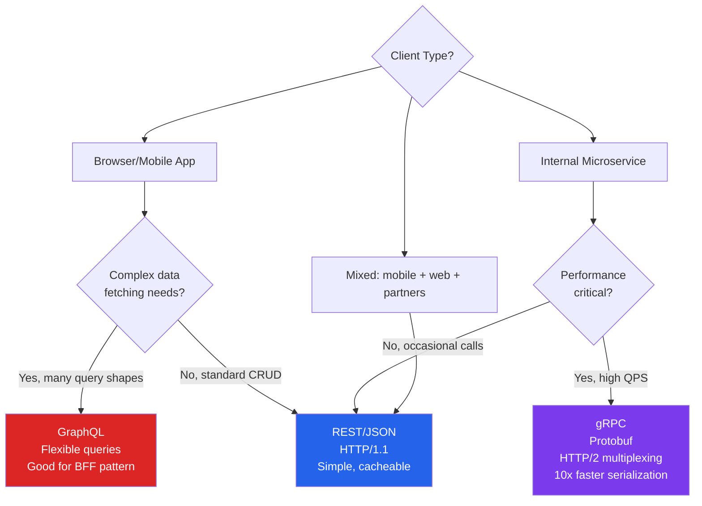

# System Design Fundamentals for Go Developers

## Why System Design Matters More in Go

Go was designed by Google engineers to solve Google-scale problems: high concurrency, distributed coordination, low-latency microservices. This origin story shapes who hires Go developers and what those roles demand. When a company chooses Go over Python or Node.js, they are not looking for someone to write glue scripts or build CRUD APIs — they are solving problems at scale where individual machines are no longer sufficient. That context means Go engineers are expected to reason about distributed systems, network partitions, data consistency trade-offs, and service topology from day one. At companies like Razorpay, Dream11, Zepto, Swiggy, and Ola, Go developers work on payment pipelines, real-time logistics engines, and inventory systems where a wrong sharding decision or missing cache layer costs millions of rupees per minute of downtime. Unlike Java or Python roles where a junior can hide behind frameworks and ORMs for a year, Go roles expose you to the system level immediately.

The second reason is structural: Go's ecosystem encourages writing services rather than monoliths. A Python Django developer can spend two years never thinking about inter-service communication. A Go developer in their first quarter will likely touch gRPC, write a Redis client, and debug a goroutine leak under load. The language attracts companies building the infrastructure layer — not the application layer — of their stack. System design is therefore not an interview filter you clear once; it is the daily vocabulary of the job. Salary bands reflect this: Go roles in India start system design conversations at 8 LPA, and roles above 18 LPA treat it as the dominant interview signal. This guide gives you the vocabulary, the code patterns, and the interview scripts to participate confidently in those conversations.

---

## The 5-Step Framework

Every system design interview — regardless of the company, the question, or the time limit — follows the same underlying shape. The five steps below are a consistent skeleton. Your job is to move through them with the right balance of speed and depth, signaling that you have done this before.



---

### Step 1: Clarify Requirements (3-5 minutes)

**What to say:** Open with functional requirements (what the system does), then non-functional requirements (how well it does it). Do not start drawing until you have asked at least three clarifying questions.

**What to draw:** Nothing yet. Write a bullet list on the whiteboard or paper.

**Common mistakes:**
- Jumping straight to architecture before understanding scale
- Asking too many questions (more than 6 signals indecision)
- Forgetting to ask about SLA, consistency vs availability trade-off

**2-minute script:**

> "Before I jump in — let me clarify requirements so I design the right thing. Functionally: users should be able to [restate the problem]. Is that correct? Now non-functionally: what scale are we targeting — DAU, QPS, data volume? What's the acceptable latency for reads? Writes? Is this more read-heavy or write-heavy? Any regulatory constraints on data residency? And finally — do we need strong consistency, or is eventual consistency acceptable?"

Then write on the board:

```
Functional:
  - POST /url    → create short URL
  - GET /:code   → redirect to original

Non-Functional:
  - 100M DAU, 10:1 read:write
  - Read P99 < 10ms
  - 99.99% availability
  - Strong consistency on writes, eventual on reads OK
```

---

### Step 2: Capacity Estimation (3-5 minutes)

**What to say:** Estimate write QPS, read QPS, storage per day, bandwidth. Round aggressively — the interviewer wants to see your math, not a precise answer.

**What to draw:** A simple arithmetic table.

**Common mistakes:**
- Getting paralyzed by uncertainty — just state your assumptions
- Skipping bandwidth and storage — these drive infrastructure decisions
- Not connecting estimates back to design choices ("so we need 3 DB replicas because...")

**2-minute script:**

> "Let me estimate capacity. 100M DAU, assume 1 write per user per day = 100M writes/day = roughly 1,200 writes/second. Reads at 10:1 ratio = 12,000 reads/second. For storage: each URL record is about 500 bytes, 100M records/day = 50GB/day = ~18TB/year — so we need a database that handles multi-TB with fast key lookups. Bandwidth: 12,000 reads/second at 1KB average response = ~12MB/s. These numbers tell me we need a read cache — hitting the DB at 12K RPS is expensive."

---

### Step 3: High-Level Design (10-15 minutes)

**What to say:** Draw the boxes and arrows. Name every component. Explain data flow for the two most critical paths (usually a write path and a read path).

**What to draw:**



**Common mistakes:**
- Drawing one big box labeled "Backend"
- Forgetting the cache layer
- Not labeling protocols (HTTP/gRPC/TCP)

---

### Step 4: Deep Dive Components (10-15 minutes)

**What to say:** The interviewer will pick one or two components. Go deep on those. For each: data schema, API contract, failure modes, scaling strategy.

**Common mistakes:**
- Staying at the surface level when asked to "go deeper"
- Not knowing the internals of your chosen database (e.g., how Redis handles expiry)
- Ignoring failure modes — always ask "what happens when X fails?"

**2-minute script for database deep dive:**

> "For the URL store, I'd use a key-value model. The short code is the primary key — 6 alphanumeric characters = 62^6 = 56 billion possible codes, more than enough. I'd shard by the first two characters of the code — gives 3,844 buckets, distributes evenly. Each shard is a Postgres instance with one sync replica. For expiry, I'd store a TTL column and run a background Go goroutine to batch-delete expired rows every 5 minutes, avoiding hot-deletion patterns."

---

### Step 5: Identify Bottlenecks (5 minutes)

**What to say:** Walk through each component and ask: "where does this break under 10x load?" Then propose mitigations.

**Common mistakes:**
- Only mentioning the database — interviewers want to hear about network, DNS, cache stampede, etc.
- Proposing solutions without admitting trade-offs

**2-minute script:**

> "Main bottlenecks I see: First, the cache. At 10x load that's 120K reads/second — Redis single node tops out around 100K ops/second, so I'd shard Redis or use Redis Cluster. Second, the DB write path — 12K writes/second is fine for Postgres with connection pooling via PgBouncer. Third, the redirect service itself — stateless Go servers scale horizontally behind the load balancer, so that's not the bottleneck. The real risk is a cache stampede on cold start — I'd add a probabilistic early expiry or a Singleflight pattern in Go to prevent thundering herd."

---

## Scalability Fundamentals

### Horizontal vs Vertical Scaling

**Vertical scaling** means giving one machine more CPU, RAM, or disk. It is simple — no code changes needed — but has a hard ceiling and creates a single point of failure. Use it for: databases that are hard to shard (legacy PostgreSQL), stateful services where partitioning is complex, and when you need a quick win before a traffic spike.

**Horizontal scaling** means adding more machines and distributing load. This is Go's natural habitat. Go HTTP servers are stateless by design — the standard `net/http` server handles each request in its own goroutine and shares no mutable state between requests (if written correctly). This makes horizontal scaling as simple as spinning up another container.

**Go-specific goroutine capacity math:**

A Java thread typically uses 512KB–1MB of stack memory. A Go goroutine starts at 2KB and grows dynamically up to 1GB. On an 8GB RAM machine:

```
Java threads:   8GB / 512KB  =  16,384 threads max
Go goroutines:  8GB / 2KB    = 4,194,304 goroutines theoretical max
```

In practice, goroutines are I/O-bound and yield the OS thread while waiting. The Go scheduler multiplexes M goroutines onto N OS threads (N = GOMAXPROCS = number of CPU cores). This means a Go service can handle 50,000 concurrent connections on hardware that would buckle a Java service at 5,000.

**Scaling a Go HTTP server horizontally:**

```go
package main

import (
    "fmt"
    "log"
    "net/http"
    "os"
    "runtime"
)

func healthHandler(w http.ResponseWriter, r *http.Request) {
    hostname, _ := os.Hostname()
    fmt.Fprintf(w, `{"status":"ok","host":"%s","goroutines":%d}`,
        hostname, runtime.NumGoroutine())
}

func main() {
    port := os.Getenv("PORT")
    if port == "" {
        port = "8080"
    }

    mux := http.NewServeMux()
    mux.HandleFunc("/health", healthHandler)
    mux.HandleFunc("/", func(w http.ResponseWriter, r *http.Request) {
        w.Write([]byte("Hello from " + os.Getenv("INSTANCE_ID")))
    })

    srv := &http.Server{
        Addr:    ":" + port,
        Handler: mux,
        // Production tuning: explicit timeouts prevent goroutine leaks
        ReadTimeout:  5 * time.Second,
        WriteTimeout: 10 * time.Second,
        IdleTimeout:  120 * time.Second,
    }

    log.Printf("Starting server on :%s (GOMAXPROCS=%d)", port, runtime.GOMAXPROCS(0))
    if err := srv.ListenAndServe(); err != nil {
        log.Fatal(err)
    }
}
```

Deploy 10 identical containers behind a load balancer. Each handles 10K req/s. Total: 100K req/s. Adding capacity requires no code changes — only a new container.

---

### Load Balancing

Load balancers distribute incoming requests across multiple backend servers. Three algorithms matter most:

**Round Robin** — requests go to servers in rotation: 1, 2, 3, 1, 2, 3. Simple and fair when all servers are identical and requests take similar time. Breaks down when requests have variable cost (one server gets all the slow database queries).

**Least Connections** — routes to the server with the fewest active connections. Better for variable-cost workloads. Requires the load balancer to track connection state. Used in nginx (with `least_conn` directive) and HAProxy.

**Consistent Hashing** — maps requests to servers using a hash of a stable key (user ID, session ID, URL). The same key always routes to the same server unless servers are added or removed. Minimizes cache invalidation when scaling. Critical for stateful services and distributed caches.

**When to use each:**
- Stateless read APIs → Round Robin
- Long-lived WebSocket connections → Least Connections
- Distributed cache or session affinity → Consistent Hashing

**Go implementation of consistent hashing (with virtual nodes):**

```go
package consistenthash

import (
    "crypto/sha256"
    "encoding/binary"
    "fmt"
    "sort"
    "sync"
)

// Ring is a consistent hash ring.
type Ring struct {
    mu       sync.RWMutex
    replicas int            // virtual nodes per real node
    ring     map[uint32]string
    sorted   []uint32
}

func New(replicas int) *Ring {
    return &Ring{
        replicas: replicas,
        ring:     make(map[uint32]string),
    }
}

func (r *Ring) hash(key string) uint32 {
    h := sha256.Sum256([]byte(key))
    return binary.BigEndian.Uint32(h[:4])
}

// Add adds servers to the ring.
func (r *Ring) Add(servers ...string) {
    r.mu.Lock()
    defer r.mu.Unlock()
    for _, server := range servers {
        for i := 0; i < r.replicas; i++ {
            vnode := fmt.Sprintf("%s#%d", server, i)
            h := r.hash(vnode)
            r.ring[h] = server
            r.sorted = append(r.sorted, h)
        }
    }
    sort.Slice(r.sorted, func(i, j int) bool {
        return r.sorted[i] < r.sorted[j]
    })
}

// Remove removes a server from the ring.
func (r *Ring) Remove(server string) {
    r.mu.Lock()
    defer r.mu.Unlock()
    for i := 0; i < r.replicas; i++ {
        vnode := fmt.Sprintf("%s#%d", server, i)
        h := r.hash(vnode)
        delete(r.ring, h)
    }
    // Rebuild sorted slice without removed hashes
    newSorted := r.sorted[:0]
    for _, h := range r.sorted {
        if _, ok := r.ring[h]; ok {
            newSorted = append(newSorted, h)
        }
    }
    r.sorted = newSorted
}

// Get returns the server responsible for the given key.
func (r *Ring) Get(key string) string {
    if len(r.ring) == 0 {
        return ""
    }
    r.mu.RLock()
    defer r.mu.RUnlock()
    h := r.hash(key)
    // Binary search for the first virtual node >= h (wrap around)
    idx := sort.Search(len(r.sorted), func(i int) bool {
        return r.sorted[i] >= h
    })
    if idx == len(r.sorted) {
        idx = 0 // wrap around
    }
    return r.ring[r.sorted[idx]]
}
```

**Usage:**
```go
ring := consistenthash.New(150) // 150 virtual nodes per server
ring.Add("cache-1:6379", "cache-2:6379", "cache-3:6379")

server := ring.Get("user:42") // always same server for user 42
```

Virtual nodes (150 per server) solve the hot spot problem. Without them, adding server 4 would only redistribute 25% of keys. With 150 vnodes, the redistribution is approximately even.

---

### Caching Strategies

Caching sits between your application and your database. Four patterns cover most production scenarios.

#### Cache-Aside (Lazy Loading)

The application is responsible for loading data into cache. On a miss, the app reads from DB and writes to cache. Most common in Go services.

```go
package cache

import (
    "context"
    "encoding/json"
    "errors"
    "time"

    "github.com/redis/go-redis/v9"
)

type UserService struct {
    redis *redis.Client
    db    UserRepository
}

func (s *UserService) GetUser(ctx context.Context, id string) (*User, error) {
    // 1. Try cache first
    cached, err := s.redis.Get(ctx, "user:"+id).Bytes()
    if err == nil {
        var user User
        if jsonErr := json.Unmarshal(cached, &user); jsonErr == nil {
            return &user, nil // cache hit
        }
    }
    if !errors.Is(err, redis.Nil) {
        // Redis error — log but don't fail; fall through to DB
        // In prod: record metric, alert if sustained
    }

    // 2. Cache miss — load from DB
    user, err := s.db.FindByID(ctx, id)
    if err != nil {
        return nil, err
    }

    // 3. Write to cache asynchronously (don't block the response)
    go func() {
        data, _ := json.Marshal(user)
        s.redis.Set(context.Background(), "user:"+id, data, 10*time.Minute)
    }()

    return user, nil
}
```

**When it breaks:** Cache stampede. If 10,000 requests arrive simultaneously for an expired key, all miss the cache and hit the DB. Fix with the Singleflight pattern (covered in Circuit Breaker section).

#### Write-Through

Every write goes to cache AND database synchronously. Cache is always warm. Writes are slower. Good for write-light, read-heavy data.

```go
func (s *UserService) UpdateUser(ctx context.Context, user *User) error {
    // Write to DB first
    if err := s.db.Update(ctx, user); err != nil {
        return fmt.Errorf("db update: %w", err)
    }

    // Write to cache synchronously — if this fails, invalidate
    data, _ := json.Marshal(user)
    if err := s.redis.Set(ctx, "user:"+user.ID, data, 10*time.Minute).Err(); err != nil {
        // Cache write failed — delete stale entry so next read misses to DB
        s.redis.Del(ctx, "user:"+user.ID)
        // Don't return error — DB write succeeded, cache is eventually consistent
    }
    return nil
}
```

**When it breaks:** Writes pollute cache with data that is rarely read. Use a TTL to evict cold entries.

#### Write-Behind (Write-Back)

Writes go to cache immediately; a background worker flushes to the database asynchronously. Fastest writes. Risk: data loss if cache crashes before flush.

```go
type WriteBehindCache struct {
    redis     *redis.Client
    db        UserRepository
    flushCh   chan string // keys to flush
}

func NewWriteBehindCache(redis *redis.Client, db UserRepository) *WriteBehindCache {
    c := &WriteBehindCache{
        redis:   redis,
        db:      db,
        flushCh: make(chan string, 10000),
    }
    go c.flushWorker()
    return c
}

func (c *WriteBehindCache) Set(ctx context.Context, user *User) error {
    data, _ := json.Marshal(user)
    if err := c.redis.Set(ctx, "user:"+user.ID, data, 30*time.Minute).Err(); err != nil {
        return err
    }
    // Queue for async DB flush
    select {
    case c.flushCh <- user.ID:
    default:
        // Channel full — flush synchronously as fallback
        return c.db.Update(ctx, user)
    }
    return nil
}

func (c *WriteBehindCache) flushWorker() {
    ticker := time.NewTicker(500 * time.Millisecond)
    batch := make([]string, 0, 100)
    for {
        select {
        case key := <-c.flushCh:
            batch = append(batch, key)
            if len(batch) >= 100 {
                c.flushBatch(batch)
                batch = batch[:0]
            }
        case <-ticker.C:
            if len(batch) > 0 {
                c.flushBatch(batch)
                batch = batch[:0]
            }
        }
    }
}
```

**When it breaks:** Cache node failure before flush = data loss. Use Redis persistence (AOF) or accept the loss (analytics data, view counts).

#### Read-Through

Cache sits in front of DB; the cache layer itself fetches from DB on a miss. Application talks only to the cache. Useful when using a smart cache proxy (like GroupCache or Memcached with a loader).

```go
// Read-through using golang.org/x/sync/singleflight to prevent stampede
import "golang.org/x/sync/singleflight"

type ReadThroughCache struct {
    redis *redis.Client
    db    UserRepository
    group singleflight.Group // coalesces concurrent identical requests
}

func (c *ReadThroughCache) Get(ctx context.Context, id string) (*User, error) {
    key := "user:" + id

    // singleflight ensures only ONE goroutine fetches from DB
    // even if 1000 goroutines call Get(id) simultaneously on a miss
    val, err, _ := c.group.Do(key, func() (interface{}, error) {
        cached, err := c.redis.Get(ctx, key).Bytes()
        if err == nil {
            var u User
            json.Unmarshal(cached, &u)
            return &u, nil
        }
        // DB load
        user, err := c.db.FindByID(ctx, id)
        if err != nil {
            return nil, err
        }
        data, _ := json.Marshal(user)
        c.redis.Set(ctx, key, data, 10*time.Minute)
        return user, nil
    })
    if err != nil {
        return nil, err
    }
    return val.(*User), nil
}
```

---

### Database Sharding

Sharding distributes data across multiple database instances. Each shard holds a subset of rows. This solves the problem of a single database bottlenecking writes at high scale.



**Range-based sharding:** Partition by range of a key (A-F → shard 0, G-M → shard 1). Simple to understand. Hotspot risk: if all new users have usernames starting with A, shard 0 overloads.

**Hash-based sharding:** `shard = hash(key) % numShards`. Distributes evenly. Resharding when adding shards requires moving data — use consistent hashing to minimize this.

**Go shard router implementation:**

```go
package sharding

import (
    "database/sql"
    "fmt"
    "hash/fnv"
)

type ShardRouter struct {
    shards    []*sql.DB
    numShards int
}

func NewShardRouter(dsns []string) (*ShardRouter, error) {
    shards := make([]*sql.DB, len(dsns))
    for i, dsn := range dsns {
        db, err := sql.Open("postgres", dsn)
        if err != nil {
            return nil, fmt.Errorf("shard %d: %w", i, err)
        }
        db.SetMaxOpenConns(25)
        db.SetMaxIdleConns(5)
        shards[i] = db
    }
    return &ShardRouter{shards: shards, numShards: len(shards)}, nil
}

// ShardFor returns the DB shard for a given user ID.
func (r *ShardRouter) ShardFor(userID string) *sql.DB {
    h := fnv.New32a()
    h.Write([]byte(userID))
    idx := int(h.Sum32()) % r.numShards
    return r.shards[idx]
}

// ShardIndex returns just the index (useful for logging/debugging).
func (r *ShardRouter) ShardIndex(userID string) int {
    h := fnv.New32a()
    h.Write([]byte(userID))
    return int(h.Sum32()) % r.numShards
}

func (r *ShardRouter) GetUser(userID string) (*User, error) {
    db := r.ShardFor(userID)
    row := db.QueryRow("SELECT id, name, email FROM users WHERE id = $1", userID)
    var u User
    if err := row.Scan(&u.ID, &u.Name, &u.Email); err != nil {
        return nil, err
    }
    return &u, nil
}
```

**Hotspot problem:** If one user (a celebrity) generates 10% of all reads, their shard overloads. Solutions:

1. **Read replicas per shard** — 1 write + 3 read replicas per shard
2. **Application-level caching** — cache the hot user's data in Redis; shard never sees those reads
3. **Virtual shards** — assign 3 virtual shards to the hot user; reads are distributed across 3 physical shards

---

## CAP Theorem

The CAP theorem states that a distributed system can guarantee at most **two** of three properties simultaneously:

- **C**onsistency: Every read receives the most recent write (or an error)
- **A**vailability: Every request receives a (non-error) response — no guarantee it's the latest data
- **P**artition tolerance: The system continues operating even if network partitions split nodes

In practice, network partitions are inevitable (networks fail). So the real trade-off is **CP vs AP**:



**Real examples in Go ecosystem:**

| System | Choice | Reason |
|--------|--------|--------|
| etcd | CP | Kubernetes cluster state — must be consistent; a stale view of node status causes split-brain |
| Cassandra | AP | Social timelines — a user seeing a post 2 seconds late is acceptable; never losing availability isn't |
| Consul | CP | Service discovery — stale routing data sends traffic to dead nodes |
| CockroachDB | CP | Financial transactions — two nodes must agree before a transfer commits |
| Redis Cluster | AP (by default) | Cache — stale data is tolerable; availability matters more |

**Practice question:** "Which consistency model would you choose for an inventory system during a flash sale, and why?"

**Answer sketch:** CP. During a sale, two customers must not both see "1 item in stock" and both be allowed to purchase. An incorrect availability response (telling a customer an item is available when it's not) is worse than a brief outage. I'd use etcd or Postgres with serializable isolation for the final deduction step, accepting that a 200ms write lock is preferable to overselling. For the read path (browsing the catalog), AP is fine — stale stock counts for display purposes don't cause harm.

---

## Consistency Models

Distributed systems offer a spectrum of consistency guarantees. From strongest to weakest:


### Strong Consistency

Every read returns the most recent write. Achieved with distributed locking (etcd), two-phase commit, or Raft consensus. Expensive: every write must be acknowledged by a quorum before returning.

**Go code showing strong consistency via distributed lock with etcd:**

```go
import (
    clientv3 "go.etcd.io/etcd/client/v3"
    "go.etcd.io/etcd/client/v3/concurrency"
)

func transferFunds(client *clientv3.Client, fromID, toID string, amount int64) error {
    session, _ := concurrency.NewSession(client)
    defer session.Close()

    // Distributed mutex — only one node can execute this at a time
    mu := concurrency.NewMutex(session, "/transfer/"+fromID)
    ctx := context.Background()

    if err := mu.Lock(ctx); err != nil {
        return fmt.Errorf("acquire lock: %w", err)
    }
    defer mu.Unlock(ctx)

    // Now safe to read-modify-write
    return executeTransfer(fromID, toID, amount)
}
```

### Eventual Consistency with Conflict Resolution

In AP systems, two nodes may accept conflicting writes. When they reconcile, you need a conflict resolution strategy.

```go
// Last-Write-Wins using vector clocks (simplified)
type VersionedValue struct {
    Data      []byte
    Timestamp int64  // Unix nanoseconds
    NodeID    string // which node wrote this
}

func resolveConflict(a, b VersionedValue) VersionedValue {
    // LWW: higher timestamp wins
    if a.Timestamp > b.Timestamp {
        return a
    }
    if b.Timestamp > a.Timestamp {
        return b
    }
    // Tie-break deterministically by node ID (alphabetic)
    if a.NodeID > b.NodeID {
        return a
    }
    return b
}

// CRDT-style counter: merge by taking max of each node's contribution
type GCounter struct {
    mu     sync.RWMutex
    counts map[string]int64 // nodeID → count
}

func (c *GCounter) Increment(nodeID string) {
    c.mu.Lock()
    c.counts[nodeID]++
    c.mu.Unlock()
}

func (c *GCounter) Value() int64 {
    c.mu.RLock()
    defer c.mu.RUnlock()
    var total int64
    for _, v := range c.counts {
        total += v
    }
    return total
}

// Merge two GCounters: always safe, always convergent
func (c *GCounter) Merge(other *GCounter) {
    c.mu.Lock()
    other.mu.RLock()
    defer c.mu.Unlock()
    defer other.mu.RUnlock()
    for nodeID, count := range other.counts {
        if count > c.counts[nodeID] {
            c.counts[nodeID] = count
        }
    }
}
```

### Interview Q&A — Consistency Models

**Q1: What is the difference between strong consistency and linearizability?**

A: They are effectively the same thing. Linearizability (Herlihy & Wing, 1990) is the formal definition: every operation appears to take effect instantaneously at some point between its start and end, and all operations appear in a total global order. Strong consistency is the informal term for the same guarantee. When interviewers say "strong consistency," they mean linearizability.

**Q2: Why does read-your-writes matter for user experience?**

A: If a user updates their profile photo and immediately reloads the page, they should see the new photo — not the old one. In a system with multiple replicas, the write may have gone to replica A but the subsequent read goes to replica B (which hasn't synced yet). Fix: route a user's reads to the same replica that received their writes (sticky sessions), or add a version token to the response and pass it on reads to verify freshness.

**Q3: When is eventual consistency acceptable?**

A: When stale data causes no business harm. Examples: like counts on a post (showing 4,521 vs 4,523 is fine), product view counts, recommendation scores, DNS records (converge in minutes), shopping cart in a browse session (conflicts resolved at checkout).

**Q4: What is causal consistency and when does it matter?**

A: Causal consistency ensures that causally related operations are seen in order. If user A posts a message and user B replies to it, all users should see A's message before B's reply. Without causal consistency, B's reply can appear before A's original message — confusing. MongoDB's sessions provide causal consistency within a session.

**Q5: How do you implement read-your-writes without sticky sessions?**

A: Pass a "read-at-least-version" token. When a write completes, return the replication log sequence number (LSN) to the client. On the next read, the client sends that LSN in a header. The read replica checks if it has applied at least that LSN; if not, it either waits or redirects to the primary. PostgreSQL logical replication and CockroachDB both support this pattern.

---

## Availability Patterns

### Failover

**Active-Passive (Hot Standby):** One node handles all traffic. A standby node receives replication but serves no traffic. On failure, the standby is promoted. Downtime during promotion (typically 30-60 seconds). Used by most Postgres deployments.

**Active-Active:** Multiple nodes serve traffic simultaneously. On failure of one node, the load balancer routes its traffic to surviving nodes — zero downtime. Requires all nodes to accept writes, which means conflict resolution (more complex). Used by DynamoDB, Cassandra, and multi-region databases.



### Replication

**Synchronous replication:** Write is acknowledged only after all replicas confirm. Zero data loss. Higher write latency. Use for financial data.

**Asynchronous replication:** Write is acknowledged after the primary writes. Replicas catch up later. Lower write latency. RPO (recovery point objective) > 0 — some data may be lost if primary fails. Use for read scaling where stale data is acceptable.

---

### Circuit Breaker Pattern (Full Implementation)

The circuit breaker prevents cascading failures. When a downstream service is failing, the circuit "opens" and subsequent calls fail fast instead of queuing up and consuming goroutines.



```go
package circuitbreaker

import (
    "errors"
    "sync"
    "time"
)

// State represents the circuit breaker state.
type State int

const (
    StateClosed   State = iota // normal operation
    StateOpen                  // failing fast
    StateHalfOpen              // testing if service recovered
)

var ErrCircuitOpen = errors.New("circuit breaker is open")

// Config holds circuit breaker thresholds.
type Config struct {
    MaxFailures  int           // failures to open the circuit
    Timeout      time.Duration // how long to wait in Open before trying HalfOpen
    MaxRequests  int           // max requests allowed in HalfOpen state
}

// Counts tracks successes and failures.
type Counts struct {
    Requests             int
    TotalSuccesses       int
    TotalFailures        int
    ConsecutiveSuccesses int
    ConsecutiveFailures  int
}

// CircuitBreaker is a thread-safe circuit breaker.
type CircuitBreaker struct {
    mu           sync.Mutex
    config       Config
    state        State
    counts       Counts
    openedAt     time.Time
    halfOpenReqs int
}

func New(cfg Config) *CircuitBreaker {
    return &CircuitBreaker{config: cfg, state: StateClosed}
}

func (cb *CircuitBreaker) State() State {
    cb.mu.Lock()
    defer cb.mu.Unlock()
    return cb.currentState()
}

// currentState evaluates whether the circuit should transition.
// Must be called with cb.mu held.
func (cb *CircuitBreaker) currentState() State {
    switch cb.state {
    case StateOpen:
        if time.Since(cb.openedAt) > cb.config.Timeout {
            cb.state = StateHalfOpen
            cb.halfOpenReqs = 0
            cb.counts = Counts{}
        }
    }
    return cb.state
}

// Execute runs fn through the circuit breaker.
func (cb *CircuitBreaker) Execute(fn func() error) error {
    cb.mu.Lock()
    state := cb.currentState()

    if state == StateOpen {
        cb.mu.Unlock()
        return ErrCircuitOpen
    }

    if state == StateHalfOpen {
        if cb.halfOpenReqs >= cb.config.MaxRequests {
            cb.mu.Unlock()
            return ErrCircuitOpen
        }
        cb.halfOpenReqs++
    }
    cb.counts.Requests++
    cb.mu.Unlock()

    err := fn() // execute outside the lock

    cb.mu.Lock()
    defer cb.mu.Unlock()
    cb.recordResult(err)
    return err
}

// recordResult updates counters and transitions state.
// Must be called with cb.mu held.
func (cb *CircuitBreaker) recordResult(err error) {
    if err == nil {
        cb.counts.TotalSuccesses++
        cb.counts.ConsecutiveSuccesses++
        cb.counts.ConsecutiveFailures = 0

        if cb.state == StateHalfOpen && cb.counts.ConsecutiveSuccesses >= cb.config.MaxRequests {
            cb.state = StateClosed
            cb.counts = Counts{}
        }
        return
    }

    cb.counts.TotalFailures++
    cb.counts.ConsecutiveFailures++
    cb.counts.ConsecutiveSuccesses = 0

    if cb.counts.ConsecutiveFailures >= cb.config.MaxFailures {
        cb.state = StateOpen
        cb.openedAt = time.Now()
    }
}
```

**Usage in a Go service:**

```go
cb := circuitbreaker.New(circuitbreaker.Config{
    MaxFailures: 5,
    Timeout:     10 * time.Second,
    MaxRequests: 3,
})

func callPaymentService(order Order) error {
    return cb.Execute(func() error {
        return paymentClient.Charge(order)
    })
}
```

---

## Latency and Throughput

### Latency Numbers Every Engineer Should Know

These numbers (approximate, circa 2024 hardware) are the foundation of capacity estimation. Memorize the orders of magnitude.

| Operation | Latency | Notes |
|-----------|---------|-------|
| L1 cache reference | 1 ns | 4 cycles on 4GHz CPU |
| L2 cache reference | 4 ns | |
| L3 cache reference | 40 ns | |
| Main memory (RAM) read | 100 ns | 25x slower than L1 |
| Compress 1KB with Snappy | 3 μs | |
| Read 4KB from SSD | 150 μs | 1,500x slower than RAM |
| Redis GET (same datacenter) | 200-500 μs | Network + parsing |
| Read 1MB sequentially from SSD | 1 ms | |
| DB query (indexed, same DC) | 1-5 ms | |
| Network round trip (same region) | 0.5-2 ms | Same AZ < 1ms |
| Send 1MB over 1Gbps network | 10 ms | |
| DB query (no index, 1M rows) | 100-500 ms | Full table scan |
| Network round trip (cross-region) | 30-100 ms | India to US: ~150ms |
| Read 1GB from SSD | 1 s | |
| HDD seek | 10 ms | 20x slower than SSD |

**Key takeaways for interviews:**
- Memory is 1,000x faster than SSD. Always cache hot data in memory.
- Redis (in-memory) is 10-100x faster than a DB query.
- Cross-region calls add 100ms+ — avoid them in the hot path.
- An indexed DB query and a Redis GET are in the same order of magnitude (1-5ms). Redis wins mainly on higher throughput under load.

---

### Throughput Calculation for Go Services

Throughput is requests per second (RPS) the system can sustain. For a Go HTTP service:

```
Throughput = (Number of goroutines processing requests) / (Average request latency)
```

If your handler takes 50ms on average and you have 500 concurrent goroutines:

```
Throughput = 500 / 0.05s = 10,000 RPS
```

If you add 5 more servers (6 total), each with 500 goroutines:

```
Throughput = 6 × 10,000 = 60,000 RPS
```

Go code to measure handler latency and goroutine count:

```go
import (
    "expvar"
    "time"
)

var (
    requestDuration = expvar.NewFloat("request_duration_avg_ms")
    activeRequests  = expvar.NewInt("active_requests")
)

func instrumentedHandler(next http.Handler) http.Handler {
    return http.HandlerFunc(func(w http.ResponseWriter, r *http.Request) {
        activeRequests.Add(1)
        defer activeRequests.Add(-1)

        start := time.Now()
        next.ServeHTTP(w, r)
        elapsed := float64(time.Since(start).Milliseconds())

        // Exponential moving average
        prev := requestDuration.Value()
        requestDuration.Set(prev*0.9 + elapsed*0.1)
    })
}
```

---

### Little's Law Applied to Go Goroutine Pools

Little's Law: **L = λ × W**

- L = average number of items in the system (goroutines in flight)
- λ = average arrival rate (requests/second)
- W = average time an item spends in the system (request latency)

**Example:** Your Go service receives 5,000 req/s. Average handler time is 20ms.

```
L = 5,000 req/s × 0.020s = 100 goroutines in flight
```

On a machine with 4 CPU cores and a goroutine pool of 1,000, you have headroom for 10x traffic spikes before goroutine exhaustion.

If you add a slow external API call that increases W from 20ms to 200ms:

```
L = 5,000 × 0.200 = 1,000 goroutines in flight
```

Now a sudden 2x traffic spike = 2,000 goroutines. You're near your pool limit. This is why timeouts on outbound calls matter enormously.

```go
// Always set timeouts on outbound HTTP clients
client := &http.Client{
    Timeout: 500 * time.Millisecond, // fail fast; preserve goroutines
}

// Or per-request context timeout
ctx, cancel := context.WithTimeout(r.Context(), 200*time.Millisecond)
defer cancel()
req, _ := http.NewRequestWithContext(ctx, "GET", upstreamURL, nil)
resp, err := client.Do(req)
```

---

### How to Estimate Throughput in an Interview

Script:
> "To estimate throughput I'll use Little's Law. We have N servers, each handling M concurrent requests, with average latency L. So throughput = N × M / L. Let me plug in numbers: 10 servers, 500 concurrent goroutines each, 50ms average latency = 10 × 500 / 0.05 = 100,000 RPS. That's more than our estimated 12,000 RPS, so compute is not the bottleneck — the bottleneck is probably the database."

---

## Data Modeling Decisions

### SQL vs NoSQL Decision Flowchart



### When to Denormalize

Normalization (3NF) eliminates data duplication. Denormalization intentionally reintroduces duplication to speed up reads.

**Denormalize when:**
- A read query joins 4+ tables and runs > 1,000 times/second
- You are building a read-heavy analytics view (OLAP pattern)
- The joins are across shards (cross-shard joins are extremely expensive)
- You need a consistent snapshot of related data at a point in time (event sourcing projections)

**Denormalization example in Go:**

```go
// Normalized: join users + orders + products at read time
// Denormalized: store order summary with user info embedded

type OrderSummary struct {
    OrderID     string    `json:"order_id"`
    UserID      string    `json:"user_id"`
    UserName    string    `json:"user_name"`    // denormalized from users table
    UserEmail   string    `json:"user_email"`   // denormalized
    ProductName string    `json:"product_name"` // denormalized from products
    Amount      int64     `json:"amount_paise"`
    CreatedAt   time.Time `json:"created_at"`
}

// On user name change: update users table AND backfill order_summaries
// Trade-off: write complexity for read speed
func updateUserName(ctx context.Context, db *sql.DB, userID, newName string) error {
    tx, err := db.BeginTx(ctx, nil)
    if err != nil {
        return err
    }
    defer tx.Rollback()

    if _, err := tx.ExecContext(ctx,
        "UPDATE users SET name = $1 WHERE id = $2", newName, userID); err != nil {
        return err
    }
    // Backfill denormalized column
    if _, err := tx.ExecContext(ctx,
        "UPDATE order_summaries SET user_name = $1 WHERE user_id = $2", newName, userID); err != nil {
        return err
    }
    return tx.Commit()
}
```

### Indexing Strategy for Common Go Service Patterns

| Pattern | Index Type | Example |
|---------|-----------|---------|
| Lookup by primary key | B-tree primary | `WHERE id = $1` |
| Range query on timestamp | B-tree on created_at | `WHERE created_at > $1` |
| Full-text search | GIN index (Postgres) | `WHERE description @@ to_tsquery($1)` |
| Case-insensitive lookup | B-tree on `LOWER(email)` | `WHERE LOWER(email) = $1` |
| Composite: user + status | Composite B-tree | `WHERE user_id = $1 AND status = $2` |
| JSON field lookup | GIN on jsonb column | `WHERE metadata @> '{"country":"IN"}'` |
| Geospatial | GiST (PostGIS) | `WHERE ST_DWithin(location, $1, $2)` |

**Go: always check your indexes are being used:**

```go
// Log slow queries in development
db.SetConnMaxLifetime(time.Hour)

// Use EXPLAIN ANALYZE to verify index use
rows, err := db.QueryContext(ctx,
    "EXPLAIN ANALYZE SELECT * FROM orders WHERE user_id = $1 AND status = $2",
    userID, "pending")
// Parse and log the query plan — if you see "Seq Scan" on a large table, add an index
```

---

## API Design

### REST vs gRPC vs GraphQL



**Go developers choose gRPC for:**
- Internal service-to-service communication (10,000+ calls/second between services)
- Streaming data (server-sent events, bidirectional streams)
- Strong typing enforced by Protobuf schema
- Generated client/server code eliminates boilerplate

**Go developers choose REST for:**
- Public APIs consumed by third-party developers
- Simple CRUD services where HTTP caching matters
- Services that need to be callable from browsers without a special client

---

### Rate Limiting with Token Bucket (Full Go Implementation)

```go
package ratelimit

import (
    "context"
    "sync"
    "time"
)

// TokenBucket implements the token bucket algorithm.
// Tokens refill at a steady rate; each request consumes one token.
type TokenBucket struct {
    mu          sync.Mutex
    capacity    float64   // max tokens
    tokens      float64   // current tokens
    refillRate  float64   // tokens per second
    lastRefill  time.Time
}

func NewTokenBucket(capacity int, refillPerSecond float64) *TokenBucket {
    return &TokenBucket{
        capacity:   float64(capacity),
        tokens:     float64(capacity),
        refillRate: refillPerSecond,
        lastRefill: time.Now(),
    }
}

// Allow returns true if the request is permitted.
func (tb *TokenBucket) Allow() bool {
    tb.mu.Lock()
    defer tb.mu.Unlock()

    now := time.Now()
    elapsed := now.Sub(tb.lastRefill).Seconds()
    tb.lastRefill = now

    // Refill tokens based on elapsed time
    tb.tokens += elapsed * tb.refillRate
    if tb.tokens > tb.capacity {
        tb.tokens = tb.capacity
    }

    if tb.tokens < 1.0 {
        return false // not enough tokens
    }
    tb.tokens--
    return true
}

// AllowN returns true if n tokens are available (for burst requests).
func (tb *TokenBucket) AllowN(n float64) bool {
    tb.mu.Lock()
    defer tb.mu.Unlock()

    now := time.Now()
    elapsed := now.Sub(tb.lastRefill).Seconds()
    tb.lastRefill = now

    tb.tokens += elapsed * tb.refillRate
    if tb.tokens > tb.capacity {
        tb.tokens = tb.capacity
    }

    if tb.tokens < n {
        return false
    }
    tb.tokens -= n
    return true
}

// RateLimitMiddleware creates an HTTP middleware using per-user token buckets.
type RateLimiter struct {
    mu      sync.Mutex
    buckets map[string]*TokenBucket
    cap     int
    rate    float64
}

func NewRateLimiter(capacity int, ratePerSecond float64) *RateLimiter {
    return &RateLimiter{
        buckets: make(map[string]*TokenBucket),
        cap:     capacity,
        rate:    ratePerSecond,
    }
}

func (rl *RateLimiter) getBucket(key string) *TokenBucket {
    rl.mu.Lock()
    defer rl.mu.Unlock()
    if b, ok := rl.buckets[key]; ok {
        return b
    }
    b := NewTokenBucket(rl.cap, rl.rate)
    rl.buckets[key] = b
    return b
}

func (rl *RateLimiter) Middleware(next http.Handler) http.Handler {
    return http.HandlerFunc(func(w http.ResponseWriter, r *http.Request) {
        userID := r.Header.Get("X-User-ID")
        if userID == "" {
            userID = r.RemoteAddr // fallback: IP-based limiting
        }

        bucket := rl.getBucket(userID)
        if !bucket.Allow() {
            w.Header().Set("Retry-After", "1")
            http.Error(w, `{"error":"rate limit exceeded"}`, http.StatusTooManyRequests)
            return
        }
        next.ServeHTTP(w, r)
    })
}
```

**Usage:**

```go
limiter := ratelimit.NewRateLimiter(
    100,  // 100 burst capacity
    10.0, // 10 requests/second sustained
)

mux.Handle("/api/", limiter.Middleware(apiHandler))
```

---

### API Versioning Strategies

| Strategy | Example | Pros | Cons |
|----------|---------|------|------|
| URL path versioning | `/api/v1/users` | Clear, cacheable, easy routing | URL proliferation |
| Header versioning | `Accept: application/vnd.api+json;version=2` | Clean URLs | Harder to test in browser |
| Query param | `/api/users?version=2` | Easy to test | Often treated as a code smell |
| Content negotiation | `Accept: application/json;version=2` | Standards-compliant | Complex to implement |

**Go URL versioning with routing:**

```go
v1 := mux.NewServeMux()
v1.HandleFunc("/users", v1UserHandler)

v2 := mux.NewServeMux()
v2.HandleFunc("/users", v2UserHandler) // breaking change: response shape changed

mux := http.NewServeMux()
mux.Handle("/api/v1/", http.StripPrefix("/api/v1", v1))
mux.Handle("/api/v2/", http.StripPrefix("/api/v2", v2))
```

---

## Interview Practice

20 system design questions at beginner-intermediate level. For each: read the question, sketch your own answer (5 minutes), then compare with the answer sketch below.

---

**Q1: Design a URL shortener (bit.ly)**

- Generate a 6-char base62 code per URL: `hash(longURL) → code` or auto-increment ID encoded in base62
- Store `code → longURL` in Redis (hot) + PostgreSQL (durable)
- Read path: Redis GET (cache hit) → return 301 redirect; cache miss → DB lookup → populate cache
- Write path: generate code → write to DB → write to Redis
- Scale: read-heavy (1000:1), so Redis handles 99% of reads; DB only for cache misses and writes

---

**Q2: Design a rate limiter service**

- Token bucket per user, stored in Redis with INCR + TTL (sliding window alternative)
- Go middleware intercepts every request, calls Redis INCR on key `ratelimit:{userID}:{windowSecond}`
- Return 429 if count exceeds threshold
- Distributed: all API servers share the same Redis, so limits are globally enforced
- Edge case: Redis down → fail open (allow traffic) or fail closed (deny traffic) — document the choice

---

**Q3: Design a notification service (push, email, SMS)**

- API: `POST /notify` with payload `{userID, channel, template, data}`
- Write to a message queue (Kafka topic per channel: `email`, `sms`, `push`)
- Consumer workers per channel: Go goroutines reading from Kafka, calling SendGrid/Twilio/FCM
- Deduplication: store `{notificationID}` in Redis SET with 24h TTL; skip if already sent
- Retry: on transient failure, re-enqueue with exponential backoff (max 3 retries)
- Observability: emit Prometheus counter per channel + status (sent, failed, duplicate)

---

**Q4: Design a leaderboard for a gaming platform**

- Redis Sorted Set: `ZADD leaderboard:weekly {score} {userID}`, `ZREVRANK` for position
- Write: on every game completion, call `ZINCRBY leaderboard:weekly {delta} {userID}`
- Read: `ZREVRANGE leaderboard:weekly 0 99 WITHSCORES` for top 100 in O(log N + 100)
- User's own rank: `ZREVRANK leaderboard:weekly {userID}` in O(log N)
- Reset: use time-bucketed keys (`leaderboard:2026-W23`); expire old keys automatically
- Scale: one Redis node handles 100K ops/second; Redis Cluster for multi-region

---

**Q5: Design a file upload service (like S3)**

- Client uploads to API server via multipart form; API server streams to object store
- Use presigned URLs: API generates a presigned S3 URL, client uploads directly to S3 (bypasses your servers)
- Metadata (filename, size, owner, S3 key) stored in PostgreSQL
- File deduplication: content-addressed storage using SHA-256 hash of file content as S3 key
- CDN (CloudFront/Cloudflare) in front of S3 for cached reads
- Large files: multipart upload in 5MB chunks; track progress in Redis

---

**Q6: Design a search autocomplete system**

- Prefix trie in memory (for a single server) or Redis Sorted Set (for distributed)
- Redis approach: for each prefix of a popular query, store top-10 results as JSON in a key
- Build the index offline from query logs (top-N queries per prefix by frequency)
- Refresh hourly via a Go background job that reads query logs, computes top-N, writes to Redis
- API: `GET /autocomplete?q=go+lang` → Redis GET on key `suggest:go lang` → return JSON array
- Fallback: if key missing, return empty array (never block on index build)

---

**Q7: Design a distributed job queue**

- Jobs stored in PostgreSQL with status (pending, processing, done, failed), claimed_by, claimed_at
- Workers poll: `UPDATE jobs SET status='processing', claimed_by=$1, claimed_at=now() WHERE id=(SELECT id FROM jobs WHERE status='pending' ORDER BY created_at FOR UPDATE SKIP LOCKED LIMIT 1) RETURNING *`
- `SKIP LOCKED` prevents multiple workers from claiming the same job
- Heartbeat: worker updates `heartbeat_at` every 10s; if heartbeat_at + 30s < now, requeue
- Dead letter queue: after 3 failures, move to jobs_dead table for manual inspection
- Scale: one DB can handle ~1,000 job completions/second; for higher throughput, use Kafka or NATS

---

**Q8: Design Instagram's feed**

- Write path (fanout on write): when user A posts, push to followers' feed tables in DB
- Feed table: `{userID, postID, createdAt, authorID}` — pre-computed per user
- Read path: SELECT top 20 from feed table for logged-in user — single query, no joins
- Celebrity problem (fanout on read for high-follower accounts): Beyoncé's 200M followers → don't push; when a follower loads their feed, merge pre-computed feed with recent celebrity posts
- Hybrid: fanout on write for users with < 10K followers; fanout on read for verified users with > 1M followers
- Cache: top 20 posts per user in Redis, invalidated when new post arrives

---

**Q9: Design a real-time collaborative document editor (Google Docs)**

- Operational Transform (OT) or CRDTs for conflict-free concurrent edits
- WebSocket connection per client to an editor server
- Each edit = operation (insert char at position X, delete chars Y-Z)
- Operations sent to server, server applies OT to resolve conflicts against concurrent ops
- Transformed operation broadcast to all other clients on the document
- Persistence: operations stored in append-only log in PostgreSQL; document state = replay of log
- Scale: partition documents across servers; all clients for document D connect to the same server (consistent hashing on docID)

---

**Q10: Design a payment processing system**

- Idempotency key: client generates UUID per payment attempt; server deduplicates on this key
- State machine: `created → processing → success/failed/refunded`
- Two-phase: (1) reserve funds (hold), (2) confirm transfer (capture) — allows reversal if step 2 fails
- Use Postgres with serializable transactions for the ledger; no NoSQL
- Outbox pattern: write payment event to `outbox` table in the same transaction; separate worker publishes to Kafka
- Reconciliation: nightly job compares your ledger against payment gateway records; flag discrepancies

---

**Q11: Design a log aggregation system (Splunk/ELK)**

- Log shippers (Filebeat/Fluentd) on each server tail log files and publish to Kafka
- Kafka topics partitioned by service name; high throughput, buffering, replay
- Consumer workers (Go, 1 per Kafka partition) parse and index logs into Elasticsearch
- Query layer: Kibana or custom Go service queries Elasticsearch
- Retention: Elasticsearch ILM policy — keep hot data 7 days on SSD, roll to warm tier (HDD) for 30 days, delete after 90 days
- Scale: Kafka handles millions of events/second; Elasticsearch scales horizontally with sharding

---

**Q12: Design a distributed counter (like YouTube view count)**

- Don't update a single DB row per view — that's a write hotspot
- Approach 1 (approximate, fast): each API server keeps an in-memory counter, flushes to Redis every 1 second using INCR
- Redis INCR is atomic; multiple servers can safely increment the same key
- Persist to PostgreSQL asynchronously: background job reads Redis counter every 5 minutes, adds delta to DB
- Approach 2 (exact, for billing): write each view event to Kafka; stream processor (Flink or Go consumer) counts and materializes
- Display: serve from Redis (sub-millisecond); DB is source of truth for billing

---

**Q13: Design an e-commerce cart service**

- Cart = ephemeral, session-scoped → Redis hash: `HSET cart:{sessionID} {productID} {quantity}`
- TTL 30 days on the cart key (abandoned carts expire automatically)
- Authenticated users: persist cart to PostgreSQL on login; merge guest cart with stored cart
- Checkout: move cart items to order in a single PostgreSQL transaction; decrement inventory atomically
- Edge case: item goes out of stock between "add to cart" and "checkout" — check inventory at checkout, not at add-to-cart; show "no longer available" error at checkout

---

**Q14: Design a feature flag system**

- Data model: `{flagID, name, enabled, rollout_percentage, user_segments, created_at}`
- Flag evaluation: SDK (Go library) loaded in every service; evaluates flags locally using a local cache
- Cache refresh: SDK polls config service every 30 seconds; serves from local map for speed
- Rollout: `hash(userID + flagName) % 100 < rollout_percentage` → enabled for this user (deterministic, no DB per request)
- Admin UI writes to PostgreSQL; SSE or WebSocket pushes changes to SDK cache (sub-second propagation for urgent rollbacks)
- Kill switch: operator sets `enabled=false`; within 30 seconds all instances serve the old code path

---

**Q15: Design Twitter's trending topics**

- Count hashtag occurrences in a 1-hour sliding window
- Approach: Kafka stream of tweets → Go consumer counts hashtags with a count-min sketch (probabilistic, O(1) space per hashtag)
- Every 5 minutes, top-K hashtags extracted and written to Redis sorted set `trending:global`
- API: `GET /trending` → Redis ZREVRANGE → return top 20
- Personalization: trending per country using geo-tagged tweets; separate sorted set per country code
- Refresh on client: push trending list via WebSocket when the sorted set changes

---

**Q16: Design a hotel booking system**

- Availability check: `SELECT rooms WHERE hotel_id=$1 AND NOT EXISTS (bookings WHERE checkin < $2 AND checkout > $3)` — indexed by hotel_id + dates
- Booking: use SELECT FOR UPDATE to lock the room row; verify still available; insert booking in same transaction
- Overbooking prevention: unique constraint on (room_id, date) in a room_availability table; booking decrements availability; if availability = 0, reject
- Payment: idempotent, two-phase (hold on card, capture on check-in)
- Search: ElasticSearch for geo + amenity search; PostgreSQL for transactional operations (availability, booking)
- Scale: read-heavy (browsing); write contention on popular hotels during peak (use optimistic locking + retry)

---

**Q17: Design a content delivery network (CDN)**

- Edge nodes distributed globally (PoPs — Points of Presence)
- On miss at edge: pull from origin server, cache response by URL + Vary headers
- Cache key: `{scheme}://{host}{path}?{sorted_query_params}` (normalize to avoid cache fragmentation)
- TTL: set via `Cache-Control: max-age=3600` from origin; CDN respects it
- Invalidation: origin sends purge request to CDN API when content changes
- Dynamic content (user-specific): bypass CDN (no-cache or private header); only static assets benefit
- Anycast routing: CDN advertises same IP globally; BGP routes each user to the nearest PoP

---

**Q18: Design a message queue from scratch**

- Producer writes message to append-only log file (segment) on disk; returns offset
- Consumer reads from offset, processes, commits offset to a separate offset store
- Multiple consumer groups: each has its own committed offset; same log is read independently
- Replication: leader receives writes, replicates to N-1 followers synchronously; ACK after majority confirm
- Partition: split the log by key hash; each partition is an independent append-only log; consumers are assigned partitions
- Retention: delete segments older than 7 days OR when total size > 1TB (whichever comes first)

---

**Q19: Design an authentication service (OAuth2 + JWT)**

- Login: validate credentials → generate short-lived access token (JWT, 15 min) + refresh token (opaque, 7 days stored in DB)
- JWT payload: `{sub: userID, exp: timestamp, roles: [...]}` — signed with RS256 (private key on auth service, public key distributed to all services)
- Authorization: each service validates JWT signature using the public key; no network call required on each request
- Refresh: client sends refresh token → auth service validates against DB → issues new access token
- Revocation: blacklist compromised refresh tokens in Redis (since JWTs are stateless, access tokens can't be revoked until expiry — keep them short)
- Security: rotate signing keys every 90 days; distribute new public key 24 hours before rotating

---

**Q20: Design a ride-sharing location tracking system (Uber)**

- Driver publishes location every 3 seconds via WebSocket to location service
- Location service writes to Redis GeoAdd: `GEOADD drivers:active {lon} {lat} {driverID}`
- Rider requests ride → `GEORADIUS drivers:active {lon} {lat} 5 km` → nearest 10 drivers
- Dispatch: send ride request to nearest driver; driver accepts/rejects
- Trip tracking: once trip starts, persist location history to Cassandra (time-series, write-heavy)
- Scale: 1M active drivers × 1 location update/3s = 333K writes/second → Redis Cluster with 10 nodes; each handles 33K/s (within Redis limits)
- Driver offline detection: if no location update for 30s, remove from active set with TTL

---

## Summary: Key Principles to Internalize

| Principle | Rule of Thumb |
|-----------|---------------|
| Start with requirements | Never draw an architecture until you know the scale and consistency needs |
| Cache everything hot | If a piece of data is read > 100x per write, it belongs in Redis |
| Fail fast | Set timeouts on every outbound call; use circuit breakers for downstream dependencies |
| Stateless services | Store session/user state in Redis, not in your Go process — enables horizontal scaling |
| Idempotency | Every mutation endpoint should accept an idempotency key; re-running it twice = same result |
| Async by default | High-throughput writes should go to a queue first; process synchronously only when necessary |
| Observe everything | Latency histogram, error rate, and saturation metric for every service boundary |
| Design for failure | Every component will fail. Ask "what happens when X is down?" for every box in your diagram |

---

*This document covers the foundational layer of system design. Next: `02-distributed-patterns.md` — Consensus, Leader Election, Distributed Transactions, and Saga Pattern.*
