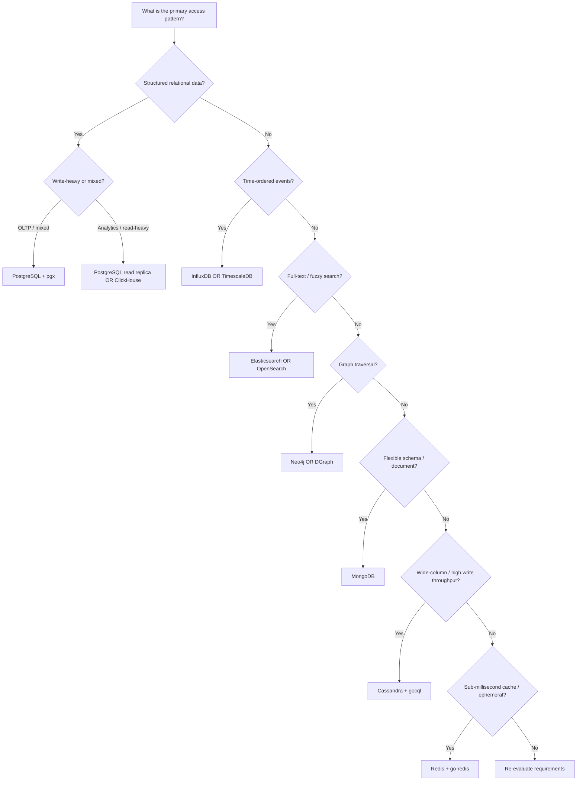
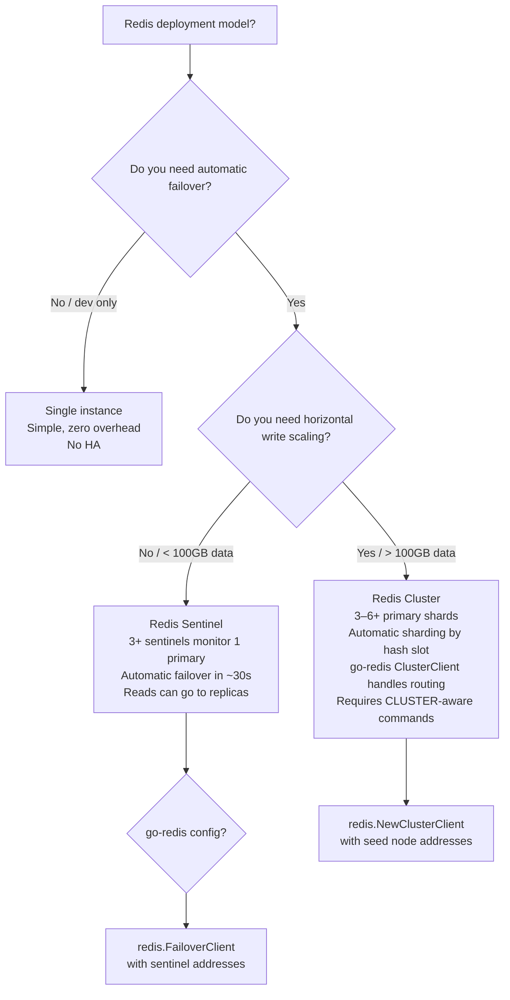
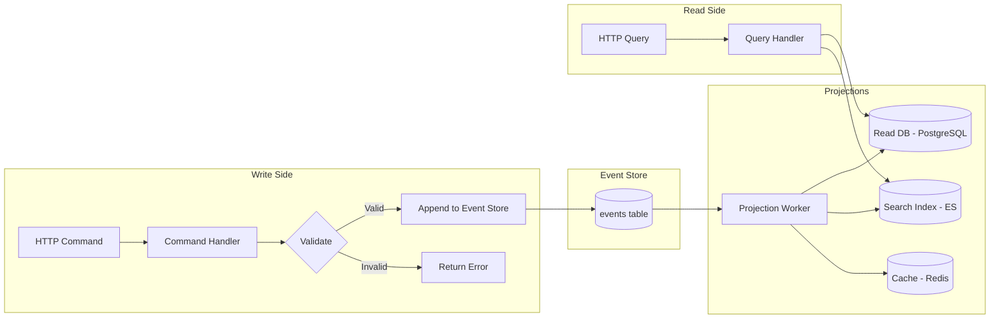
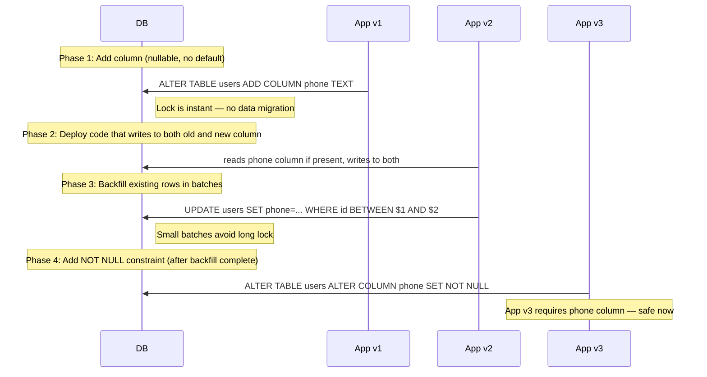

# Database and Storage Design for Go Developers

## Why This Matters

Every production Go service eventually hits the same wall: the database becomes the bottleneck. An API that does 50,000 requests/second with in-memory state will do 500 if every request blocks on a poorly-sized connection pool or a missing index. The difference between a Go service that handles 1M users and one that falls over at 50K is almost never the Go code — it is the database design decisions made six months before the load arrived.

This guide covers how Go teams at companies like Uber, Cloudflare, and Square design persistence layers that scale: which database to pick and why, how to configure PostgreSQL connection pools correctly, how Redis patterns prevent stampedes, how consistent hashing routes queries across shards, and how CQRS keeps read and write models independent as systems grow.

---

## Database Selection Framework

Picking the wrong database early is expensive. The following flowchart and table give Go engineers a systematic way to make the decision once, with justification that survives the architecture review.



| Use Case | Recommended DB | Go Driver / Client | Why Go Teams Choose It |
|---|---|---|---|
| OLTP — transactional reads/writes | PostgreSQL | `pgx` / `pgxpool` | ACID guarantees, mature ecosystem, `pgx` is 2–3x faster than `database/sql` drivers due to binary protocol support |
| Analytics / OLAP | ClickHouse or PostgreSQL with read replica | `clickhouse-go` | Columnar storage, vectorized query execution, handles billions of rows without index tuning |
| Time-series (metrics, IoT, finance) | InfluxDB or TimescaleDB | `influxdb-client-go` / `pgx` | Native time-based compression, continuous aggregates, retention policies built-in |
| Ephemeral cache / session store | Redis | `go-redis/v9` | Sub-millisecond reads, 20+ data structure types, atomic Lua scripts for complex operations |
| Full-text search | Elasticsearch or OpenSearch | `olivere/elastic` | Inverted index, relevance scoring, aggregations; works alongside the primary DB |
| Graph traversal | Neo4j or DGraph | `neo4j-go-driver` / `dgraph-go-client` | Native graph storage avoids recursive SQL JOINs that kill query planners |
| Document / flexible schema | MongoDB | `mongo-go-driver` | Schema-flexible, horizontal sharding built-in via Atlas, aggregation pipeline |
| Wide-column / high ingest | Cassandra or ScyllaDB | `gocql` / `gocql` | Linear write scalability, tunable consistency, ideal for event logs and time-partitioned data |
| Distributed KV / config | etcd | `etcd/client/v3` | Strong consistency via Raft, used in Kubernetes for all cluster state |

---

## PostgreSQL Deep Dive

PostgreSQL is the default choice for Go services that need relational guarantees. This section covers everything from connection pool math to transaction isolation bugs that only surface at scale.

### Connection Pool Design with pgxpool

The connection pool is the most important tuning surface in a Go service. Get it wrong and you either exhaust the database's `max_connections` (every new app instance starves existing ones) or leave throughput on the floor with a pool too small to saturate the available CPU.

**Pool sizing formula:**

```
max_connections_per_instance = (total_db_max_connections - reserved_connections) / num_app_instances
min_connections = max(2, max_connections_per_instance / 4)
```

PostgreSQL defaults to `max_connections = 100`. Reserve 3–5 for superuser and monitoring. If you run 4 app instances, each gets at most `(100 - 5) / 4 = 23` connections.

```go
package database

import (
    "context"
    "fmt"
    "time"

    "github.com/jackc/pgx/v5"
    "github.com/jackc/pgx/v5/pgxpool"
)

// Config holds pool configuration derived from environment variables.
type Config struct {
    DSN             string
    MaxConns        int32
    MinConns        int32
    MaxConnLifetime time.Duration
    MaxConnIdleTime time.Duration
    HealthCheckPeriod time.Duration
}

// NewPool creates a production-ready pgxpool with health checks and
// statement caching enabled. Call once at startup; reuse everywhere.
func NewPool(ctx context.Context, cfg Config) (*pgxpool.Pool, error) {
    poolCfg, err := pgxpool.ParseConfig(cfg.DSN)
    if err != nil {
        return nil, fmt.Errorf("parse pool config: %w", err)
    }

    // Pool sizing — tune based on formula above.
    poolCfg.MaxConns = cfg.MaxConns
    poolCfg.MinConns = cfg.MinConns

    // Rotate connections to avoid hitting PostgreSQL's per-connection memory overhead.
    poolCfg.MaxConnLifetime = cfg.MaxConnLifetime       // e.g. 30 * time.Minute
    poolCfg.MaxConnIdleTime = cfg.MaxConnIdleTime       // e.g. 5 * time.Minute
    poolCfg.HealthCheckPeriod = cfg.HealthCheckPeriod   // e.g. 1 * time.Minute

    // Statement cache: pgx caches prepared statements per connection.
    // "describe" mode sends a Parse+Describe but not Execute, verifying
    // the query plan without committing to it. Use "cache_describe" in pgxpool.
    poolCfg.ConnConfig.DefaultQueryExecMode = pgx.QueryExecModeCacheDescribe

    // Connection timeout: fail fast if the DB is unreachable, so the
    // readiness probe fails before traffic is sent to this instance.
    poolCfg.ConnConfig.ConnectConfig.ConnectTimeout = 5 * time.Second

    // AfterConnect hook: run SET statements that must be on every connection.
    poolCfg.AfterConnect = func(ctx context.Context, conn *pgx.Conn) error {
        // Example: set application_name so pg_stat_activity is readable.
        _, err := conn.Exec(ctx, "SET application_name = 'myservice'")
        return err
    }

    // BeforeAcquire hook: discard connections that have been idle long
    // enough that the server may have timed them out.
    poolCfg.BeforeAcquire = func(ctx context.Context, conn *pgx.Conn) bool {
        return conn.Ping(ctx) == nil
    }

    pool, err := pgxpool.NewWithConfig(ctx, poolCfg)
    if err != nil {
        return nil, fmt.Errorf("create pool: %w", err)
    }

    // Verify connectivity at startup so misconfiguration fails loudly.
    if err := pool.Ping(ctx); err != nil {
        pool.Close()
        return nil, fmt.Errorf("ping database: %w", err)
    }

    return pool, nil
}

// PoolStats wraps pgxpool.Stat for Prometheus or logging.
type PoolStats struct {
    TotalConns    int32
    IdleConns     int32
    AcquiredConns int32
    MaxConns      int32
}

func Stats(pool *pgxpool.Pool) PoolStats {
    s := pool.Stat()
    return PoolStats{
        TotalConns:    s.TotalConns(),
        IdleConns:     s.IdleConns(),
        AcquiredConns: s.AcquiredConns(),
        MaxConns:      s.MaxConns(),
    }
}
```

### Query Optimization

#### Reading EXPLAIN ANALYZE Output

Before indexing, run `EXPLAIN (ANALYZE, BUFFERS, FORMAT TEXT)` on slow queries. The key numbers:

| Field | What It Means | Red Flag |
|---|---|---|
| `Seq Scan` | Full table scan | On tables > 10K rows in an OLTP query |
| `rows=X (actual rows=Y)` | Planner estimate vs actual | When X >> Y by 10x, statistics are stale — run `ANALYZE` |
| `Buffers: hit=X read=Y` | Pages from cache vs disk | High `read` means working set exceeds `shared_buffers` |
| `Planning Time` | Time to plan the query | > 5ms suggests complex join or missing statistics |
| `Execution Time` | Total wall time | Baseline for before/after index comparison |

#### Index Types — When to Use Each

| Index Type | Use Case | Go ORM / pgx Example |
|---|---|---|
| B-tree (default) | Equality, range, ORDER BY, LIKE prefix | All standard queries |
| GIN | `jsonb` containment, full-text search, array overlap | `WHERE tags @> ARRAY['go']` |
| GiST | Geometric/geospatial, range type overlap | PostGIS geometry columns |
| BRIN | Append-only tables with natural sort order (logs, events) | `created_at` on a logs table with billions of rows — uses 1/1000th the space of B-tree |
| Hash | Exact equality only, faster than B-tree for that | Rarely used; B-tree is almost always better |

```go
// Partial index example: index only active users.
// This index is ~10% the size of a full index on user_id for most apps.
//
// SQL: CREATE INDEX idx_orders_active_user
//      ON orders (user_id, created_at DESC)
//      WHERE status = 'active';
//
// pgx query that benefits from the partial index:
func GetActiveOrdersByUser(ctx context.Context, pool *pgxpool.Pool, userID int64) ([]Order, error) {
    const query = `
        SELECT id, user_id, amount, status, created_at
        FROM orders
        WHERE user_id = $1
          AND status = 'active'
        ORDER BY created_at DESC
        LIMIT 50`

    rows, err := pool.Query(ctx, query, userID)
    if err != nil {
        return nil, fmt.Errorf("query active orders: %w", err)
    }
    defer rows.Close()

    var orders []Order
    for rows.Next() {
        var o Order
        if err := rows.Scan(&o.ID, &o.UserID, &o.Amount, &o.Status, &o.CreatedAt); err != nil {
            return nil, fmt.Errorf("scan order: %w", err)
        }
        orders = append(orders, o)
    }
    return orders, rows.Err()
}
```

#### Solving the N+1 Problem in Go

The N+1 problem: you load N records, then issue one query per record to load a related resource. 100 orders → 101 queries. This is the most common performance bug in Go services that use thin database/sql wrappers.

```go
// BAD: N+1 — one query per order to get its items.
func GetOrdersWithItemsBad(ctx context.Context, pool *pgxpool.Pool, userID int64) ([]OrderWithItems, error) {
    orders, err := getOrders(ctx, pool, userID) // 1 query
    if err != nil {
        return nil, err
    }

    result := make([]OrderWithItems, len(orders))
    for i, o := range orders {
        items, err := getOrderItems(ctx, pool, o.ID) // N queries — BAD
        if err != nil {
            return nil, err
        }
        result[i] = OrderWithItems{Order: o, Items: items}
    }
    return result, nil
}

// GOOD: single JOIN query, manual grouping in Go.
func GetOrdersWithItemsGood(ctx context.Context, pool *pgxpool.Pool, userID int64) ([]OrderWithItems, error) {
    const query = `
        SELECT
            o.id,
            o.user_id,
            o.amount,
            o.created_at,
            i.id        AS item_id,
            i.product   AS item_product,
            i.quantity  AS item_quantity
        FROM orders o
        LEFT JOIN order_items i ON i.order_id = o.id
        WHERE o.user_id = $1
        ORDER BY o.id, i.id`

    rows, err := pool.Query(ctx, query, userID)
    if err != nil {
        return nil, fmt.Errorf("query orders with items: %w", err)
    }
    defer rows.Close()

    // Use a map to group items under their parent order.
    orderMap := make(map[int64]*OrderWithItems)
    var orderIDs []int64 // preserve insertion order

    for rows.Next() {
        var (
            o      Order
            itemID    *int64  // nullable because LEFT JOIN
            itemProduct *string
            itemQty    *int
        )
        if err := rows.Scan(
            &o.ID, &o.UserID, &o.Amount, &o.CreatedAt,
            &itemID, &itemProduct, &itemQty,
        ); err != nil {
            return nil, fmt.Errorf("scan row: %w", err)
        }

        if _, exists := orderMap[o.ID]; !exists {
            orderMap[o.ID] = &OrderWithItems{Order: o}
            orderIDs = append(orderIDs, o.ID)
        }

        if itemID != nil {
            orderMap[o.ID].Items = append(orderMap[o.ID].Items, OrderItem{
                ID:       *itemID,
                Product:  *itemProduct,
                Quantity: *itemQty,
            })
        }
    }
    if err := rows.Err(); err != nil {
        return nil, fmt.Errorf("rows error: %w", err)
    }

    // Return in stable order.
    result := make([]OrderWithItems, len(orderIDs))
    for i, id := range orderIDs {
        result[i] = *orderMap[id]
    }
    return result, nil
}

// ALTERNATIVE GOOD: two queries + IN clause (better for large result sets).
// Load orders, collect IDs, load all items where order_id = ANY($1).
func GetOrdersWithItemsTwoQuery(ctx context.Context, pool *pgxpool.Pool, userID int64) ([]OrderWithItems, error) {
    orders, err := getOrders(ctx, pool, userID)
    if err != nil {
        return nil, err
    }
    if len(orders) == 0 {
        return nil, nil
    }

    ids := make([]int64, len(orders))
    for i, o := range orders {
        ids[i] = o.ID
    }

    // pgx supports ANY($1::bigint[]) with a native int64 slice.
    const itemQuery = `
        SELECT order_id, id, product, quantity
        FROM order_items
        WHERE order_id = ANY($1)
        ORDER BY order_id, id`

    rows, err := pool.Query(ctx, itemQuery, ids)
    if err != nil {
        return nil, fmt.Errorf("query items: %w", err)
    }
    defer rows.Close()

    itemsByOrder := make(map[int64][]OrderItem)
    for rows.Next() {
        var (
            orderID int64
            item    OrderItem
        )
        if err := rows.Scan(&orderID, &item.ID, &item.Product, &item.Quantity); err != nil {
            return nil, fmt.Errorf("scan item: %w", err)
        }
        itemsByOrder[orderID] = append(itemsByOrder[orderID], item)
    }
    if err := rows.Err(); err != nil {
        return nil, fmt.Errorf("items rows error: %w", err)
    }

    result := make([]OrderWithItems, len(orders))
    for i, o := range orders {
        result[i] = OrderWithItems{Order: o, Items: itemsByOrder[o.ID]}
    }
    return result, nil
}
```

### Transactions in Go

Transactions in Go require explicit rollback on error paths. The standard idiom using `defer` ensures rollback is always called, even on panics.

```go
package database

import (
    "context"
    "errors"
    "fmt"
    "time"

    "github.com/jackc/pgx/v5"
    "github.com/jackc/pgx/v5/pgxpool"
)

// TransferFunds moves money between accounts atomically.
// Demonstrates: begin, rollback on error, savepoints, commit.
func TransferFunds(ctx context.Context, pool *pgxpool.Pool, fromID, toID int64, amount float64) error {
    tx, err := pool.BeginTx(ctx, pgx.TxOptions{
        // READ COMMITTED is the default. Use REPEATABLE READ or SERIALIZABLE
        // for balance checks that must see a consistent snapshot.
        IsoLevel:   pgx.RepeatableRead,
        AccessMode: pgx.ReadWrite,
    })
    if err != nil {
        return fmt.Errorf("begin transaction: %w", err)
    }
    // This defer is the safety net. If Commit() succeeds below, Rollback()
    // is a no-op. If any error causes an early return, Rollback() fires.
    defer tx.Rollback(ctx) //nolint:errcheck

    // Lock both rows in a deterministic order to prevent deadlocks.
    // Always lock the lower ID first when touching multiple rows.
    minID, maxID := fromID, toID
    if minID > maxID {
        minID, maxID = maxID, minID
    }

    var fromBalance, toBalance float64
    lockQuery := `SELECT id, balance FROM accounts WHERE id = ANY($1) ORDER BY id FOR UPDATE`
    rows, err := tx.Query(ctx, lockQuery, []int64{minID, maxID})
    if err != nil {
        return fmt.Errorf("lock accounts: %w", err)
    }

    balances := make(map[int64]float64)
    for rows.Next() {
        var id int64
        var bal float64
        if err := rows.Scan(&id, &bal); err != nil {
            rows.Close()
            return fmt.Errorf("scan balance: %w", err)
        }
        balances[id] = bal
    }
    rows.Close()
    if err := rows.Err(); err != nil {
        return fmt.Errorf("lock rows: %w", err)
    }

    fromBalance = balances[fromID]
    toBalance = balances[toID]

    if fromBalance < amount {
        return fmt.Errorf("insufficient funds: have %.2f, need %.2f", fromBalance, amount)
    }

    // Use a savepoint before risky operations so you can roll back to here
    // without aborting the entire transaction.
    _, err = tx.Exec(ctx, "SAVEPOINT before_debit")
    if err != nil {
        return fmt.Errorf("create savepoint: %w", err)
    }

    _, err = tx.Exec(ctx,
        "UPDATE accounts SET balance = $1, updated_at = $2 WHERE id = $3",
        fromBalance-amount, time.Now(), fromID,
    )
    if err != nil {
        // Roll back to savepoint, not the whole transaction.
        tx.Exec(ctx, "ROLLBACK TO SAVEPOINT before_debit") //nolint:errcheck
        return fmt.Errorf("debit account: %w", err)
    }

    _, err = tx.Exec(ctx,
        "UPDATE accounts SET balance = $1, updated_at = $2 WHERE id = $3",
        toBalance+amount, time.Now(), toID,
    )
    if err != nil {
        return fmt.Errorf("credit account: %w", err)
    }

    // Record the transfer for audit.
    _, err = tx.Exec(ctx,
        "INSERT INTO transfers (from_id, to_id, amount, created_at) VALUES ($1, $2, $3, $4)",
        fromID, toID, amount, time.Now(),
    )
    if err != nil {
        return fmt.Errorf("record transfer: %w", err)
    }

    // Commit only after all operations succeed.
    if err := tx.Commit(ctx); err != nil {
        return fmt.Errorf("commit transaction: %w", err)
    }
    return nil
}

// WithTransaction is a helper that wraps any function in a transaction,
// handling begin/rollback/commit boilerplate. Use for simple CRUD operations.
func WithTransaction(ctx context.Context, pool *pgxpool.Pool, fn func(pgx.Tx) error) error {
    tx, err := pool.Begin(ctx)
    if err != nil {
        return fmt.Errorf("begin: %w", err)
    }
    defer tx.Rollback(ctx) //nolint:errcheck

    if err := fn(tx); err != nil {
        return err
    }

    return tx.Commit(ctx)
}

// OptimisticUpdate uses a version column to detect concurrent writes
// without locking rows. The caller retries on version conflict.
type ErrVersionConflict struct {
    EntityID int64
}

func (e ErrVersionConflict) Error() string {
    return fmt.Sprintf("version conflict on entity %d — retry", e.EntityID)
}

func UpdateProductPrice(ctx context.Context, pool *pgxpool.Pool, productID int64, newPrice float64, currentVersion int) error {
    const query = `
        UPDATE products
        SET price = $1,
            version = version + 1,
            updated_at = NOW()
        WHERE id = $2
          AND version = $3`

    tag, err := pool.Exec(ctx, query, newPrice, productID, currentVersion)
    if err != nil {
        return fmt.Errorf("update product price: %w", err)
    }

    if tag.RowsAffected() == 0 {
        // Either the product does not exist or another writer incremented
        // the version between our read and this write.
        return ErrVersionConflict{EntityID: productID}
    }
    return nil
}

// RetryOnConflict wraps a function and retries on optimistic lock conflicts.
func RetryOnConflict(maxAttempts int, fn func() error) error {
    var lastErr error
    for i := 0; i < maxAttempts; i++ {
        lastErr = fn()
        if lastErr == nil {
            return nil
        }
        var conflict ErrVersionConflict
        if !errors.As(lastErr, &conflict) {
            return lastErr // non-retriable error
        }
        // Small backoff; in production use exponential + jitter.
        time.Sleep(time.Duration(i+1) * 10 * time.Millisecond)
    }
    return fmt.Errorf("max retries exceeded: %w", lastErr)
}
```

---

## Redis Deep Dive

Redis is not a cache that happens to support multiple data structures. It is a data structure server that happens to be fast enough to use as a cache. Treating it as "just memcached" leaves most of its capabilities on the table.

### Data Structures, Use Cases, and Complexity

| Structure | Best Use Case | Key Go Command | Read | Write |
|---|---|---|---|---|
| String | Session tokens, counters, feature flags | `Get`, `Set`, `Incr` | O(1) | O(1) |
| List | Job queues, activity feeds, undo buffers | `LPush`, `RPop`, `BRPop` (blocking) | O(N) range | O(1) push/pop |
| Set | Unique visitor tracking, friend lists, deduplication | `SAdd`, `SIsMember`, `SInter` | O(1) member | O(1) add |
| Sorted Set | Leaderboards, rate limiting, priority queues | `ZAdd`, `ZRangeByScore` | O(log N) | O(log N) |
| Hash | User profiles, product catalogs (field-level access) | `HSet`, `HGetAll`, `HIncrBy` | O(1) field | O(1) field |
| HyperLogLog | Approximate unique count at massive scale | `PFAdd`, `PFCount` | O(1) | O(1) |
| Stream | Event log with consumer groups (like Kafka-lite) | `XAdd`, `XReadGroup` | O(N range) | O(1) |
| Geo | Nearby search, geofencing | `GeoAdd`, `GeoSearch` | O(N+log M) | O(log N) |

### Go Redis Patterns

#### Pattern 1: Distributed Lock (Redlock Implementation)

A distributed lock prevents multiple instances of a Go service from executing the same critical section concurrently — e.g., running a scheduled job exactly once.

```go
package redislock

import (
    "context"
    "crypto/rand"
    "encoding/hex"
    "errors"
    "fmt"
    "time"

    "github.com/redis/go-redis/v9"
)

var ErrLockNotAcquired = errors.New("lock not acquired")

type Lock struct {
    client *redis.Client
    key    string
    token  string // unique per lock acquisition; prevents releasing someone else's lock
    ttl    time.Duration
}

// Acquire tries to set the lock key with NX (only if not exists) and a TTL.
// Returns ErrLockNotAcquired if another caller holds the lock.
func Acquire(ctx context.Context, client *redis.Client, key string, ttl time.Duration) (*Lock, error) {
    // Generate a unique token so we can safely release only our own lock.
    b := make([]byte, 16)
    if _, err := rand.Read(b); err != nil {
        return nil, fmt.Errorf("generate token: %w", err)
    }
    token := hex.EncodeToString(b)

    ok, err := client.SetNX(ctx, key, token, ttl).Result()
    if err != nil {
        return nil, fmt.Errorf("redis setnx: %w", err)
    }
    if !ok {
        return nil, ErrLockNotAcquired
    }

    return &Lock{client: client, key: key, token: token, ttl: ttl}, nil
}

// Release deletes the lock key only if the stored token matches ours.
// Uses a Lua script for atomicity — check-then-delete must be atomic.
func (l *Lock) Release(ctx context.Context) error {
    const script = `
        if redis.call("GET", KEYS[1]) == ARGV[1] then
            return redis.call("DEL", KEYS[1])
        else
            return 0
        end`

    result, err := l.client.Eval(ctx, script, []string{l.key}, l.token).Int()
    if err != nil {
        return fmt.Errorf("release lock: %w", err)
    }
    if result == 0 {
        return fmt.Errorf("lock already expired or taken by another caller")
    }
    return nil
}

// Extend refreshes the TTL on the lock, used by long-running operations.
func (l *Lock) Extend(ctx context.Context, newTTL time.Duration) error {
    const script = `
        if redis.call("GET", KEYS[1]) == ARGV[1] then
            return redis.call("PEXPIRE", KEYS[1], ARGV[2])
        else
            return 0
        end`

    ms := int64(newTTL / time.Millisecond)
    result, err := l.client.Eval(ctx, script, []string{l.key}, l.token, ms).Int()
    if err != nil {
        return fmt.Errorf("extend lock: %w", err)
    }
    if result == 0 {
        return fmt.Errorf("lock expired before extend")
    }
    return nil
}

// Example usage in a scheduled job runner.
func RunOnce(ctx context.Context, client *redis.Client, jobName string, fn func(context.Context) error) error {
    lock, err := Acquire(ctx, client, "lock:"+jobName, 30*time.Second)
    if errors.Is(err, ErrLockNotAcquired) {
        return nil // Another instance is running the job; skip.
    }
    if err != nil {
        return fmt.Errorf("acquire lock: %w", err)
    }
    defer lock.Release(ctx) //nolint:errcheck

    return fn(ctx)
}
```

#### Pattern 2: Rate Limiter with Sliding Window

A sliding window counter is more accurate than a fixed window (no burst at window boundaries) and cheaper than a full token bucket.

```go
package ratelimit

import (
    "context"
    "fmt"
    "time"

    "github.com/redis/go-redis/v9"
)

// SlidingWindowLimiter counts requests in a rolling time window using
// a sorted set where each member's score is its Unix timestamp in ms.
type SlidingWindowLimiter struct {
    client  *redis.Client
    limit   int           // max requests per window
    window  time.Duration // window size
}

func NewSlidingWindowLimiter(client *redis.Client, limit int, window time.Duration) *SlidingWindowLimiter {
    return &SlidingWindowLimiter{client: client, limit: limit, window: window}
}

// Allow returns true if the request is within the rate limit.
// key should identify the subject being rate-limited (e.g. "rate:user:42").
func (l *SlidingWindowLimiter) Allow(ctx context.Context, key string) (bool, int, error) {
    now := time.Now()
    windowStart := now.Add(-l.window)

    pipe := l.client.Pipeline()

    // Remove entries older than the window.
    pipe.ZRemRangeByScore(ctx, key,
        "0",
        fmt.Sprintf("%d", windowStart.UnixMilli()),
    )

    // Add this request with the current timestamp as score.
    // Use a unique member (timestamp + nonce) to allow multiple requests
    // at the same millisecond.
    member := fmt.Sprintf("%d-%d", now.UnixNano(), now.UnixNano()%1000)
    pipe.ZAdd(ctx, key, redis.Z{Score: float64(now.UnixMilli()), Member: member})

    // Count entries in the window.
    countCmd := pipe.ZCard(ctx, key)

    // Expire the key slightly longer than the window to allow cleanup.
    pipe.Expire(ctx, key, l.window+time.Second)

    _, err := pipe.Exec(ctx)
    if err != nil {
        return false, 0, fmt.Errorf("rate limit pipeline: %w", err)
    }

    count := int(countCmd.Val())
    if count > l.limit {
        return false, 0, nil
    }
    return true, l.limit - count, nil
}

// AllowN checks if n requests can be accepted atomically using a Lua script.
// Use this for bulk operations where you consume multiple tokens at once.
func (l *SlidingWindowLimiter) AllowN(ctx context.Context, key string, n int) (bool, error) {
    const script = `
        local now = tonumber(ARGV[1])
        local window_start = now - tonumber(ARGV[2])
        local limit = tonumber(ARGV[3])
        local n = tonumber(ARGV[4])

        redis.call("ZREMRANGEBYSCORE", KEYS[1], "0", window_start)
        local count = redis.call("ZCARD", KEYS[1])

        if count + n > limit then
            return 0
        end

        for i = 1, n do
            redis.call("ZADD", KEYS[1], now, now .. "-" .. i)
        end
        redis.call("EXPIRE", KEYS[1], ARGV[5])
        return 1`

    windowMs := l.window.Milliseconds()
    result, err := l.client.Eval(ctx, script,
        []string{key},
        time.Now().UnixMilli(),
        windowMs,
        l.limit,
        n,
        int(l.window.Seconds())+1,
    ).Int()
    if err != nil {
        return false, fmt.Errorf("rate limit script: %w", err)
    }
    return result == 1, nil
}
```

#### Pattern 3: Leaderboard with Sorted Set

```go
package leaderboard

import (
    "context"
    "fmt"

    "github.com/redis/go-redis/v9"
)

const leaderboardKey = "leaderboard:global"

// AddScore atomically updates a player's score.
// ZAdd with XX only updates existing members; remove XX to also add new members.
func AddScore(ctx context.Context, client *redis.Client, playerID string, delta float64) error {
    err := client.ZIncrBy(ctx, leaderboardKey, delta, playerID).Err()
    return fmt.Errorf("add score: %w", err)
}

type Entry struct {
    PlayerID string
    Score    float64
    Rank     int64 // 1-based
}

// TopN returns the top n players sorted by score descending.
func TopN(ctx context.Context, client *redis.Client, n int) ([]Entry, error) {
    // ZREVRANGE returns members from highest to lowest score.
    results, err := client.ZRevRangeWithScores(ctx, leaderboardKey, 0, int64(n-1)).Result()
    if err != nil {
        return nil, fmt.Errorf("top n: %w", err)
    }

    entries := make([]Entry, len(results))
    for i, r := range results {
        entries[i] = Entry{
            PlayerID: r.Member.(string),
            Score:    r.Score,
            Rank:     int64(i + 1),
        }
    }
    return entries, nil
}

// PlayerRank returns a player's rank and score. Rank is 1-based.
func PlayerRank(ctx context.Context, client *redis.Client, playerID string) (Entry, error) {
    pipe := client.Pipeline()
    rankCmd := pipe.ZRevRank(ctx, leaderboardKey, playerID)   // 0-based rank from the top
    scoreCmd := pipe.ZScore(ctx, leaderboardKey, playerID)
    if _, err := pipe.Exec(ctx); err != nil {
        return Entry{}, fmt.Errorf("player rank: %w", err)
    }
    return Entry{
        PlayerID: playerID,
        Score:    scoreCmd.Val(),
        Rank:     rankCmd.Val() + 1,
    }, nil
}

// AroundPlayer returns n players above and below the given player.
// Useful for the "you and your neighbors" view in games.
func AroundPlayer(ctx context.Context, client *redis.Client, playerID string, n int) ([]Entry, error) {
    rank, err := client.ZRevRank(ctx, leaderboardKey, playerID).Result()
    if err != nil {
        return nil, fmt.Errorf("get rank: %w", err)
    }

    start := rank - int64(n)
    if start < 0 {
        start = 0
    }
    end := rank + int64(n)

    results, err := client.ZRevRangeWithScores(ctx, leaderboardKey, start, end).Result()
    if err != nil {
        return nil, fmt.Errorf("around player: %w", err)
    }

    entries := make([]Entry, len(results))
    for i, r := range results {
        entries[i] = Entry{
            PlayerID: r.Member.(string),
            Score:    r.Score,
            Rank:     start + int64(i) + 1,
        }
    }
    return entries, nil
}
```

#### Pattern 4: Session Store

```go
package session

import (
    "context"
    "encoding/json"
    "fmt"
    "time"

    "github.com/redis/go-redis/v9"
)

type SessionData struct {
    UserID    int64             `json:"user_id"`
    Email     string            `json:"email"`
    Roles     []string          `json:"roles"`
    CreatedAt time.Time         `json:"created_at"`
    Metadata  map[string]string `json:"metadata,omitempty"`
}

type Store struct {
    client *redis.Client
    ttl    time.Duration
    prefix string
}

func NewStore(client *redis.Client, ttl time.Duration) *Store {
    return &Store{client: client, ttl: ttl, prefix: "session:"}
}

func (s *Store) key(sessionID string) string {
    return s.prefix + sessionID
}

// Set stores a session, serialized as JSON.
func (s *Store) Set(ctx context.Context, sessionID string, data SessionData) error {
    b, err := json.Marshal(data)
    if err != nil {
        return fmt.Errorf("marshal session: %w", err)
    }
    return s.client.Set(ctx, s.key(sessionID), b, s.ttl).Err()
}

// Get retrieves and deserializes a session. Returns redis.Nil if not found.
func (s *Store) Get(ctx context.Context, sessionID string) (SessionData, error) {
    b, err := s.client.Get(ctx, s.key(sessionID)).Bytes()
    if err != nil {
        return SessionData{}, fmt.Errorf("get session: %w", err)
    }
    var data SessionData
    if err := json.Unmarshal(b, &data); err != nil {
        return SessionData{}, fmt.Errorf("unmarshal session: %w", err)
    }
    return data, nil
}

// Refresh resets the TTL without changing the data. Call on every authenticated request.
func (s *Store) Refresh(ctx context.Context, sessionID string) error {
    ok, err := s.client.Expire(ctx, s.key(sessionID), s.ttl).Result()
    if err != nil {
        return fmt.Errorf("refresh session: %w", err)
    }
    if !ok {
        return fmt.Errorf("session not found: %s", sessionID)
    }
    return nil
}

// Delete invalidates a session (logout).
func (s *Store) Delete(ctx context.Context, sessionID string) error {
    return s.client.Del(ctx, s.key(sessionID)).Err()
}
```

#### Pattern 5: Pub/Sub for Real-Time Events

```go
package pubsub

import (
    "context"
    "encoding/json"
    "fmt"
    "log"

    "github.com/redis/go-redis/v9"
)

type Event struct {
    Type    string          `json:"type"`
    Payload json.RawMessage `json:"payload"`
}

// Publisher sends events to a channel.
type Publisher struct {
    client *redis.Client
}

func NewPublisher(client *redis.Client) *Publisher {
    return &Publisher{client: client}
}

func (p *Publisher) Publish(ctx context.Context, channel string, event Event) error {
    b, err := json.Marshal(event)
    if err != nil {
        return fmt.Errorf("marshal event: %w", err)
    }
    return p.client.Publish(ctx, channel, b).Err()
}

// Subscribe listens on one or more channels and calls handler for each message.
// Blocks until ctx is cancelled.
func Subscribe(ctx context.Context, client *redis.Client, handler func(Event), channels ...string) error {
    sub := client.Subscribe(ctx, channels...)
    defer sub.Close()

    ch := sub.Channel()
    for {
        select {
        case <-ctx.Done():
            return ctx.Err()
        case msg, ok := <-ch:
            if !ok {
                return fmt.Errorf("subscription channel closed")
            }
            var event Event
            if err := json.Unmarshal([]byte(msg.Payload), &event); err != nil {
                log.Printf("malformed event on channel %s: %v", msg.Channel, err)
                continue
            }
            handler(event)
        }
    }
}
```

### Redis Cluster vs Sentinel vs Single



| Feature | Single | Sentinel | Cluster |
|---|---|---|---|
| Setup complexity | Low | Medium | High |
| Max data size | RAM of one node | RAM of one node | RAM x num shards |
| Write throughput | One primary | One primary | N primaries in parallel |
| Failover time | Manual | ~30 seconds automatic | ~10 seconds automatic |
| Multi-key commands | All supported | All supported | Only on same hash slot |
| go-redis client | `redis.NewClient` | `redis.NewFailoverClient` | `redis.NewClusterClient` |
| When to use | Dev, small services | Most production services | > 50GB data or > 500K ops/s |

---

## Database Sharding in Go

Sharding distributes data across multiple database instances (shards) to scale beyond what a single machine can handle. The application layer is responsible for routing each query to the correct shard.

### Consistent Hashing Implementation

Consistent hashing minimizes key remapping when shards are added or removed. It places shards on a virtual ring and maps keys to the nearest clockwise shard. Virtual nodes (vnodes) improve distribution evenness.

```go
package sharding

import (
    "crypto/sha256"
    "encoding/binary"
    "fmt"
    "sort"
    "sync"
)

// Ring is a consistent hash ring with virtual node support.
// Safe for concurrent reads; writes require the mutex.
type Ring struct {
    mu       sync.RWMutex
    vnodes   int             // virtual nodes per physical node
    ring     map[uint64]string // hash -> node name
    sorted   []uint64          // sorted hashes for binary search
}

// NewRing creates an empty ring. vnodes should be 100–200 for good distribution.
func NewRing(vnodes int) *Ring {
    return &Ring{
        vnodes: vnodes,
        ring:   make(map[uint64]string),
    }
}

// hash computes a stable uint64 hash for a string.
func hash(key string) uint64 {
    h := sha256.Sum256([]byte(key))
    return binary.BigEndian.Uint64(h[:8])
}

// AddNode adds a physical node and its virtual nodes to the ring.
func (r *Ring) AddNode(node string) {
    r.mu.Lock()
    defer r.mu.Unlock()

    for i := 0; i < r.vnodes; i++ {
        vkey := fmt.Sprintf("%s#vnode%d", node, i)
        h := hash(vkey)
        r.ring[h] = node
        r.sorted = append(r.sorted, h)
    }
    sort.Slice(r.sorted, func(i, j int) bool { return r.sorted[i] < r.sorted[j] })
}

// RemoveNode removes a node and all its virtual nodes from the ring.
func (r *Ring) RemoveNode(node string) {
    r.mu.Lock()
    defer r.mu.Unlock()

    toRemove := make(map[uint64]struct{})
    for i := 0; i < r.vnodes; i++ {
        vkey := fmt.Sprintf("%s#vnode%d", node, i)
        toRemove[hash(vkey)] = struct{}{}
    }

    for h := range toRemove {
        delete(r.ring, h)
    }

    // Rebuild sorted slice without removed hashes.
    newSorted := r.sorted[:0]
    for _, h := range r.sorted {
        if _, removed := toRemove[h]; !removed {
            newSorted = append(newSorted, h)
        }
    }
    r.sorted = newSorted
}

// GetNode returns the node responsible for the given key.
// Uses binary search on the sorted hash ring — O(log N).
func (r *Ring) GetNode(key string) (string, bool) {
    r.mu.RLock()
    defer r.mu.RUnlock()

    if len(r.sorted) == 0 {
        return "", false
    }

    h := hash(key)
    // Find the first vnode hash >= h (wrap around to 0 if past the end).
    idx := sort.Search(len(r.sorted), func(i int) bool {
        return r.sorted[i] >= h
    })
    if idx == len(r.sorted) {
        idx = 0 // wrap around
    }

    return r.ring[r.sorted[idx]], true
}

// GetN returns the N closest distinct nodes for a key (for replication).
func (r *Ring) GetN(key string, n int) []string {
    r.mu.RLock()
    defer r.mu.RUnlock()

    if len(r.sorted) == 0 {
        return nil
    }

    h := hash(key)
    idx := sort.Search(len(r.sorted), func(i int) bool {
        return r.sorted[i] >= h
    })
    if idx == len(r.sorted) {
        idx = 0
    }

    seen := make(map[string]struct{})
    var result []string
    for len(result) < n && len(seen) < len(r.ring) {
        node := r.ring[r.sorted[idx%len(r.sorted)]]
        if _, ok := seen[node]; !ok {
            seen[node] = struct{}{}
            result = append(result, node)
        }
        idx++
    }
    return result
}
```

### Application-Level Sharding with pgxpool

```go
package sharding

import (
    "context"
    "fmt"

    "github.com/jackc/pgx/v5/pgxpool"
)

// ShardedPool routes queries to the correct PostgreSQL shard.
type ShardedPool struct {
    ring  *Ring
    pools map[string]*pgxpool.Pool // node name -> pool
}

func NewShardedPool(nodes map[string]*pgxpool.Pool, vnodes int) *ShardedPool {
    ring := NewRing(vnodes)
    for name := range nodes {
        ring.AddNode(name)
    }
    return &ShardedPool{ring: ring, pools: nodes}
}

// PoolForKey returns the pool for the shard that owns the given key.
func (s *ShardedPool) PoolForKey(key string) (*pgxpool.Pool, error) {
    node, ok := s.ring.GetNode(key)
    if !ok {
        return nil, fmt.Errorf("no shards available")
    }
    pool, ok := s.pools[node]
    if !ok {
        return nil, fmt.Errorf("pool not found for node %s", node)
    }
    return pool, nil
}

// Example: Get a user by ID, routing to the correct shard.
func GetUser(ctx context.Context, sp *ShardedPool, userID int64) (*User, error) {
    // Shard key: user ID as string. In practice, use a consistent tenant/user key.
    shardKey := fmt.Sprintf("user:%d", userID)

    pool, err := sp.PoolForKey(shardKey)
    if err != nil {
        return nil, err
    }

    var u User
    err = pool.QueryRow(ctx,
        "SELECT id, name, email FROM users WHERE id = $1",
        userID,
    ).Scan(&u.ID, &u.Name, &u.Email)
    if err != nil {
        return nil, fmt.Errorf("get user %d: %w", userID, err)
    }
    return &u, nil
}

// FanOut executes a query on all shards and merges results.
// Use for admin queries that must scan all data.
func FanOut[T any](ctx context.Context, sp *ShardedPool, query string, scan func(*pgxpool.Pool) ([]T, error)) ([]T, error) {
    type result struct {
        items []T
        err   error
    }

    ch := make(chan result, len(sp.pools))
    for _, pool := range sp.pools {
        p := pool
        go func() {
            items, err := scan(p)
            ch <- result{items, err}
        }()
    }

    var all []T
    for range sp.pools {
        r := <-ch
        if r.err != nil {
            return nil, r.err
        }
        all = append(all, r.items...)
    }
    return all, nil
}
```

---

## Event Sourcing and CQRS

### What It Is and When Go Teams Use It

**Event sourcing** stores the history of state changes (events) as the system of record, not the current state. The current state is always derived by replaying events. **CQRS** (Command Query Responsibility Segregation) separates the write path (commands → events) from the read path (projections → query models).

Go teams adopt this pattern when:
- Audit trails are mandatory (fintech, healthcare, legal)
- The domain is complex enough that different views need different schemas
- Event replay is valuable for debugging or backfilling new analytics
- The write load and read load have fundamentally different scaling needs



### Full Go Implementation

```go
package eventsourcing

import (
    "context"
    "encoding/json"
    "fmt"
    "time"

    "github.com/jackc/pgx/v5/pgxpool"
)

// --- Domain types ---

type EventType string

const (
    OrderPlaced    EventType = "order.placed"
    OrderCancelled EventType = "order.cancelled"
    OrderShipped   EventType = "order.shipped"
)

// Event is an immutable record of something that happened.
type Event struct {
    ID          int64           `json:"id"`
    AggregateID string          `json:"aggregate_id"`
    Type        EventType       `json:"type"`
    Version     int             `json:"version"`
    Payload     json.RawMessage `json:"payload"`
    OccurredAt  time.Time       `json:"occurred_at"`
}

// OrderPlacedPayload is the data for an order.placed event.
type OrderPlacedPayload struct {
    UserID    int64   `json:"user_id"`
    ProductID int64   `json:"product_id"`
    Amount    float64 `json:"amount"`
}

// --- Command side: Event Store ---

// EventStore appends events and loads aggregate histories.
// The events table uses optimistic locking via the version column
// to prevent two processes writing conflicting events for the same aggregate.
//
// DDL:
//   CREATE TABLE events (
//     id           BIGSERIAL PRIMARY KEY,
//     aggregate_id TEXT NOT NULL,
//     type         TEXT NOT NULL,
//     version      INT  NOT NULL,
//     payload      JSONB NOT NULL,
//     occurred_at  TIMESTAMPTZ NOT NULL DEFAULT NOW(),
//     UNIQUE (aggregate_id, version)  -- optimistic lock constraint
//   );
type EventStore struct {
    pool *pgxpool.Pool
}

func NewEventStore(pool *pgxpool.Pool) *EventStore {
    return &EventStore{pool: pool}
}

// Append writes events for an aggregate, failing if expectedVersion is stale.
// expectedVersion should be the last known version (0 if no events yet).
func (es *EventStore) Append(ctx context.Context, aggregateID string, expectedVersion int, events []Event) error {
    tx, err := es.pool.Begin(ctx)
    if err != nil {
        return fmt.Errorf("begin: %w", err)
    }
    defer tx.Rollback(ctx) //nolint:errcheck

    // Verify optimistic version: no other writer should have appended since we read.
    var currentVersion int
    err = tx.QueryRow(ctx,
        "SELECT COALESCE(MAX(version), 0) FROM events WHERE aggregate_id = $1",
        aggregateID,
    ).Scan(&currentVersion)
    if err != nil {
        return fmt.Errorf("check version: %w", err)
    }
    if currentVersion != expectedVersion {
        return fmt.Errorf("version conflict: expected %d, got %d", expectedVersion, currentVersion)
    }

    for i, event := range events {
        version := expectedVersion + i + 1
        _, err = tx.Exec(ctx,
            `INSERT INTO events (aggregate_id, type, version, payload, occurred_at)
             VALUES ($1, $2, $3, $4, $5)`,
            aggregateID, event.Type, version, event.Payload, event.OccurredAt,
        )
        if err != nil {
            return fmt.Errorf("insert event %d: %w", i, err)
        }
    }

    return tx.Commit(ctx)
}

// Load returns all events for an aggregate in version order.
func (es *EventStore) Load(ctx context.Context, aggregateID string) ([]Event, error) {
    rows, err := es.pool.Query(ctx,
        `SELECT id, aggregate_id, type, version, payload, occurred_at
         FROM events
         WHERE aggregate_id = $1
         ORDER BY version ASC`,
        aggregateID,
    )
    if err != nil {
        return nil, fmt.Errorf("load events: %w", err)
    }
    defer rows.Close()

    var events []Event
    for rows.Next() {
        var e Event
        if err := rows.Scan(&e.ID, &e.AggregateID, &e.Type, &e.Version, &e.Payload, &e.OccurredAt); err != nil {
            return nil, fmt.Errorf("scan event: %w", err)
        }
        events = append(events, e)
    }
    return events, rows.Err()
}

// --- Command Handler ---

type PlaceOrderCommand struct {
    OrderID   string
    UserID    int64
    ProductID int64
    Amount    float64
}

func PlaceOrder(ctx context.Context, store *EventStore, cmd PlaceOrderCommand) error {
    payload, err := json.Marshal(OrderPlacedPayload{
        UserID:    cmd.UserID,
        ProductID: cmd.ProductID,
        Amount:    cmd.Amount,
    })
    if err != nil {
        return fmt.Errorf("marshal payload: %w", err)
    }

    event := Event{
        AggregateID: cmd.OrderID,
        Type:        OrderPlaced,
        Payload:     payload,
        OccurredAt:  time.Now(),
    }

    // 0 = no events exist yet for this aggregate.
    return store.Append(ctx, cmd.OrderID, 0, []Event{event})
}

// --- Projection (Read Side) ---

// OrderView is the denormalized read model for the orders query endpoint.
type OrderView struct {
    OrderID   string    `db:"order_id"`
    UserID    int64     `db:"user_id"`
    ProductID int64     `db:"product_id"`
    Amount    float64   `db:"amount"`
    Status    string    `db:"status"`
    UpdatedAt time.Time `db:"updated_at"`
}

// ProjectionWorker reads new events and updates the read model.
// In production, run this as a separate goroutine or service.
// Uses a cursor (last_processed_id) stored in a table to resume on restart.
func ProjectionWorker(ctx context.Context, eventPool, readPool *pgxpool.Pool) error {
    for {
        select {
        case <-ctx.Done():
            return ctx.Err()
        default:
        }

        var lastID int64
        err := readPool.QueryRow(ctx,
            "SELECT COALESCE(MAX(last_event_id), 0) FROM projection_cursors WHERE name = 'order_view'",
        ).Scan(&lastID)
        if err != nil {
            return fmt.Errorf("read cursor: %w", err)
        }

        rows, err := eventPool.Query(ctx,
            `SELECT id, aggregate_id, type, payload
             FROM events
             WHERE id > $1
             ORDER BY id ASC
             LIMIT 100`,
            lastID,
        )
        if err != nil {
            return fmt.Errorf("fetch events: %w", err)
        }

        var processed int
        for rows.Next() {
            var e Event
            if err := rows.Scan(&e.ID, &e.AggregateID, &e.Type, &e.Payload); err != nil {
                rows.Close()
                return fmt.Errorf("scan: %w", err)
            }

            if err := applyEvent(ctx, readPool, e); err != nil {
                rows.Close()
                return fmt.Errorf("apply event %d: %w", e.ID, err)
            }
            lastID = e.ID
            processed++
        }
        rows.Close()
        if err := rows.Err(); err != nil {
            return err
        }

        if processed > 0 {
            _, err = readPool.Exec(ctx,
                `INSERT INTO projection_cursors (name, last_event_id)
                 VALUES ('order_view', $1)
                 ON CONFLICT (name) DO UPDATE SET last_event_id = $1`,
                lastID,
            )
            if err != nil {
                return fmt.Errorf("update cursor: %w", err)
            }
        } else {
            time.Sleep(500 * time.Millisecond)
        }
    }
}

func applyEvent(ctx context.Context, pool *pgxpool.Pool, e Event) error {
    switch e.Type {
    case OrderPlaced:
        var p OrderPlacedPayload
        if err := json.Unmarshal(e.Payload, &p); err != nil {
            return err
        }
        _, err := pool.Exec(ctx,
            `INSERT INTO order_views (order_id, user_id, product_id, amount, status, updated_at)
             VALUES ($1, $2, $3, $4, 'placed', NOW())
             ON CONFLICT (order_id) DO NOTHING`,
            e.AggregateID, p.UserID, p.ProductID, p.Amount,
        )
        return err
    case OrderCancelled:
        _, err := pool.Exec(ctx,
            `UPDATE order_views SET status = 'cancelled', updated_at = NOW() WHERE order_id = $1`,
            e.AggregateID,
        )
        return err
    case OrderShipped:
        _, err := pool.Exec(ctx,
            `UPDATE order_views SET status = 'shipped', updated_at = NOW() WHERE order_id = $1`,
            e.AggregateID,
        )
        return err
    }
    return nil
}
```

---

## Database Migration Strategy

### golang-migrate Full Example

golang-migrate is the standard migration tool for Go services. Migrations live in the repo as versioned SQL files and are applied at deploy time by the application itself or a migration init container.

```go
package migrate

import (
    "errors"
    "fmt"
    "log"

    "github.com/golang-migrate/migrate/v4"
    _ "github.com/golang-migrate/migrate/v4/database/postgres"
    _ "github.com/golang-migrate/migrate/v4/source/file"
    _ "github.com/golang-migrate/migrate/v4/source/iofs"
    "embed"
)

//go:embed migrations/*.sql
var migrationsFS embed.FS

// RunMigrations applies all pending up-migrations on startup.
// Use embed.FS so migrations are compiled into the binary — no separate file deployment.
func RunMigrations(databaseURL string) error {
    // iofs driver reads from an embedded filesystem.
    src, err := iofs.New(migrationsFS, "migrations")
    if err != nil {
        return fmt.Errorf("create migration source: %w", err)
    }

    m, err := migrate.NewWithSourceInstance("iofs", src, databaseURL)
    if err != nil {
        return fmt.Errorf("create migrator: %w", err)
    }
    defer m.Close()

    if err := m.Up(); err != nil && !errors.Is(err, migrate.ErrNoChange) {
        return fmt.Errorf("run migrations: %w", err)
    }

    version, dirty, err := m.Version()
    if err != nil && !errors.Is(err, migrate.ErrNilVersion) {
        return fmt.Errorf("get version: %w", err)
    }
    if dirty {
        return fmt.Errorf("migration version %d is dirty — manual intervention required", version)
    }

    log.Printf("migrations: at version %d", version)
    return nil
}

// RollbackOne rolls back the most recent migration. Use for emergency rollback,
// not for routine operations.
func RollbackOne(databaseURL string) error {
    m, err := migrate.New("file://migrations", databaseURL)
    if err != nil {
        return fmt.Errorf("create migrator: %w", err)
    }
    defer m.Close()

    if err := m.Steps(-1); err != nil {
        return fmt.Errorf("rollback: %w", err)
    }
    return nil
}
```

Migration file naming convention (`migrations/` directory):

```
000001_create_users.up.sql
000001_create_users.down.sql
000002_add_orders_table.up.sql
000002_add_orders_table.down.sql
000003_add_index_orders_user_id.up.sql
000003_add_index_orders_user_id.down.sql
```

Example migration pair:

```sql
-- 000002_add_orders_table.up.sql
CREATE TABLE orders (
    id          BIGSERIAL PRIMARY KEY,
    user_id     BIGINT      NOT NULL REFERENCES users(id),
    amount      NUMERIC(12,2) NOT NULL CHECK (amount > 0),
    status      TEXT        NOT NULL DEFAULT 'pending',
    version     INT         NOT NULL DEFAULT 1,
    created_at  TIMESTAMPTZ NOT NULL DEFAULT NOW(),
    updated_at  TIMESTAMPTZ NOT NULL DEFAULT NOW()
);

CREATE INDEX idx_orders_user_id_status ON orders (user_id, status)
    WHERE status IN ('pending', 'active');

-- 000002_add_orders_table.down.sql
DROP TABLE orders;
```

### Zero-Downtime Migration Patterns

Running `ALTER TABLE` directly on a live table with millions of rows will lock the table for seconds to minutes, causing downtime. The safe pattern is to decouple schema changes from code changes across three deployments.



Go batch backfill implementation:

```go
package migration

import (
    "context"
    "fmt"
    "log"
    "time"

    "github.com/jackc/pgx/v5/pgxpool"
)

// BackfillColumn updates a column in batches to avoid locking the table.
// batchSize of 1000–5000 rows with a short pause between batches is typical.
func BackfillColumn(ctx context.Context, pool *pgxpool.Pool) error {
    const batchSize = 2000
    var lastID int64

    for {
        var maxID int64
        err := pool.QueryRow(ctx,
            `SELECT COALESCE(MAX(id), 0)
             FROM users
             WHERE id > $1 AND phone IS NULL
             LIMIT $2`,
            lastID, batchSize,
        ).Scan(&maxID)
        if err != nil {
            return fmt.Errorf("find max id: %w", err)
        }
        if maxID == 0 {
            break // backfill complete
        }

        tag, err := pool.Exec(ctx,
            `UPDATE users
             SET phone = ''
             WHERE id > $1 AND id <= $2 AND phone IS NULL`,
            lastID, maxID,
        )
        if err != nil {
            return fmt.Errorf("backfill batch (%d, %d]: %w", lastID, maxID, err)
        }

        log.Printf("backfill: updated %d rows up to id %d", tag.RowsAffected(), maxID)
        lastID = maxID

        // Brief pause to let the replica catch up and avoid replication lag.
        time.Sleep(50 * time.Millisecond)
    }

    log.Println("backfill complete")
    return nil
}
```

---

## Interview Questions: Database Design for Go Developers

### Foundational — Cleared in Phone Screens

**Q1: What is the N+1 problem and how do you detect it in a Go service?**

The N+1 problem occurs when code loads N rows and then issues one additional query per row. Detection: enable `pgx` query logging in staging and look for the same query template executing in a tight loop. Fix: use a JOIN or a single `WHERE id = ANY($1)` query with collected IDs.

**Q2: Why is `sql.DB` a connection pool, not a single connection? What happens if you open it per request?**

`sql.DB` manages a pool because establishing a new TCP connection + TLS handshake + PostgreSQL auth takes 5–50ms. A per-request open causes latency spikes and quickly exhausts the OS's file descriptor limit (default 1024 on Linux). Open `sql.DB` once at startup and inject it.

**Q3: What does `defer rows.Close()` protect against?**

Rows hold a live cursor on the server. If the caller returns early (e.g., after scanning the first result and returning an error), an unclosed rows object leaks the connection — it is never returned to the pool. `defer rows.Close()` is safe to call even if `rows.Next()` never ran.

**Q4: Explain the difference between optimistic and pessimistic locking.**

Pessimistic locking: issue `SELECT ... FOR UPDATE` to lock the row before reading. No concurrent writer can modify it until your transaction ends. Use when conflicts are frequent and the cost of rollback is high.

Optimistic locking: read the row with a version column, update with `WHERE version = $known` and check `rows affected`. If zero, another writer incremented the version — retry. Use when conflicts are rare and the cost of a retry is low (most web applications).

**Q5: What is the difference between `TRUNCATE` and `DELETE FROM` in PostgreSQL?**

`DELETE FROM` logs every row deletion individually (WAL entries), fires triggers, and respects foreign key constraints. `TRUNCATE` is DDL-level, acquires an ACCESS EXCLUSIVE lock, and does not log individual rows — it is much faster for emptying a table. `TRUNCATE` cannot be in a transaction that will be rolled back on some storage engines (but CAN in PostgreSQL). Never `TRUNCATE` a table referenced by a foreign key without `CASCADE`.

### Intermediate — Mid-Level Loops

**Q6: How would you design a PostgreSQL schema for a multi-tenant SaaS application?**

Three models exist with different trade-offs:

1. **Shared schema, tenant_id column**: All tenants in the same table, every query has `WHERE tenant_id = $1`. Simple to operate, but a missing tenant filter is a data leak. Use Row Level Security (RLS) in PostgreSQL to enforce it at the DB level. Works up to ~100K tenants.

2. **Separate schema per tenant**: Each tenant gets their own PostgreSQL schema. Migrations run per-schema. Strong isolation, but `pg_catalog` bloat at tens of thousands of schemas. Works for < 10K tenants.

3. **Separate database per tenant**: Strongest isolation, independent connection pools, can move to different hardware. Operationally complex. Use for high-value enterprise tenants only.

In Go: the shared schema approach with RLS is most common. Set `SET app.current_tenant_id = $1` in the `AfterConnect` pool hook.

**Q7: How do you handle database migrations in a Kubernetes rolling deployment?**

The key constraint: during a rolling deployment, both old and new app versions are running simultaneously. This means:

- Never rename or drop a column in the same deployment that removes the code using it.
- Use the expand-contract pattern: add the new column in migration N, deploy code that uses both old and new, remove the old column in migration N+1 after the old code is fully retired.
- Run migrations in a Kubernetes Job or init container that completes before the new pods start — use `migrate.Up()` with idempotency.
- golang-migrate's `schema_migrations` table prevents double-applying.

**Q8: When would you use a composite index vs multiple single-column indexes?**

Use a composite index when queries consistently filter or sort on the same combination of columns in the same order — the leading column(s) must match the WHERE clause prefix. PostgreSQL can use a composite index `(user_id, status, created_at)` for queries that filter on `user_id` only, `user_id AND status`, or all three — but not for `status` alone. Multiple single-column indexes are better when different queries need different column combinations, because the planner can use bitmap index scans to merge them.

**Q9: What is connection pool exhaustion and how do you prevent it in Go?**

Pool exhaustion occurs when every connection is in use and new requests queue (or fail). Causes: slow queries holding connections, missing `defer rows.Close()`, transaction leaks, undersized pool.

Prevention:
- Set `MaxConns` to a calculated value, not the default unlimited.
- Set `MaxConnLifetime` to recycle stale connections.
- Always use `QueryContext` with a deadline so runaway queries time out and release connections.
- Monitor `pgxpool.Stat().AcquiredConns()` and alert at 80% utilization.
- Use `pgxpool.AcquireFunc` to ensure the connection is always released even on panic.

**Q10: Explain PostgreSQL MVCC and how it affects Go application design.**

MVCC (Multi-Version Concurrency Control): PostgreSQL stores old row versions ("dead tuples") so readers never block writers. Each transaction sees a snapshot of the database as it was at transaction start. Implications:

- Long-running transactions hold back the oldest transaction ID, bloating the table with dead tuples that autovacuum cannot collect.
- In Go: never open a transaction for user-facing work that spans a network call or long computation. Do the network call, then open the transaction and commit in < 100ms.
- `VACUUM` removes dead tuples. `ANALYZE` updates statistics. Both are critical — schedule them and monitor `pg_stat_user_tables.n_dead_tup`.

### Advanced — Senior / Staff Loops

**Q11: How would you scale a PostgreSQL database to 10 million users?**

Step 1 — Vertical scaling + connection pooling (0–500K users): Increase RAM (more `shared_buffers`), add PgBouncer in transaction mode to reduce connection overhead. A single PostgreSQL instance with 64 cores and 256GB RAM handles most workloads to 1M users.

Step 2 — Read replicas (500K–3M users): Streaming replication. Route all SELECT queries that tolerate stale reads to replicas. In Go, maintain two pools: `writePool` (primary) and `readPool` (replica). Writes always go to `writePool`; reads default to `readPool`. Handle replication lag by reading from primary if the query must see data written in the same request (use a session-level flag or check `pg_replication_lag`).

Step 3 — Functional partitioning (3M–10M users): Split tables by domain. The `users` service owns the users DB; the `orders` service owns the orders DB. Each team sizes and scales their DB independently.

Step 4 — Sharding (> 10M users with hotspots): Application-level consistent hashing across N PostgreSQL instances. The application routes each query by shard key (user ID, tenant ID). Cross-shard JOINs become application-level merges — redesign queries to avoid them.

Step 5 — Table partitioning (for time-series in PostgreSQL): Declarative partitioning on `created_at` by month. Old partitions are moved to cheaper storage or dropped. Query planner prunes partitions automatically.

**Q12: Explain the difference between read replicas and sharding. When does each fail?**

Read replicas solve read scalability: one primary handles all writes, N replicas handle reads. Fails when: write volume exceeds primary capacity, data set exceeds one machine's RAM (full table scans become disk-bound), a single hot user account's writes overwhelm the primary.

Sharding solves write scalability and data volume: distribute rows across N primaries. Fails when: transactions span multiple shards (must use distributed transactions or sagas), queries need to JOIN across shards (must fan out and merge in application), the shard key is poorly chosen (hot shard gets 90% of traffic).

The sequencing matters: exhaust read replicas first; they are operationally simple. Only shard when write throughput or data size requires it.

**Q13: When would you choose Redis over PostgreSQL for storing user sessions?**

Choose Redis when:
- Sessions must expire automatically (Redis TTL is native; PostgreSQL requires a background job to delete expired rows).
- Read latency must be sub-millisecond (Redis reads a session in < 0.5ms; PostgreSQL rarely beats 1–2ms even with indexes).
- Sessions are ephemeral — losing all sessions on Redis restart is acceptable (users re-authenticate).
- Session storage is high-throughput (> 10K reads/s on one node without index contention).

Choose PostgreSQL when:
- Sessions contain data you need to query relationally (e.g., "show all active sessions for this user" with JOIN to user table).
- You need durable sessions that survive a Redis restart without re-authentication.
- You are early in the project and want to reduce operational complexity (one fewer service).

In practice: use Redis for session tokens and PostgreSQL for the user records the session points to.

**Q14: What is a phantom read, and which PostgreSQL isolation level prevents it?**

A phantom read: transaction A reads a set of rows matching a condition (e.g., `WHERE amount > 1000`). Transaction B inserts a new row matching that condition and commits. Transaction A reads again and sees the new row — a "phantom." This breaks the assumption that a range query returns a stable result within a transaction.

Prevention: `SERIALIZABLE` isolation level. PostgreSQL implements SSI (Serializable Snapshot Isolation) which detects write-read conflicts and aborts one transaction rather than using predicate locks. `REPEATABLE READ` prevents non-repeatable reads but not phantoms in most databases; PostgreSQL's REPEATABLE READ actually also prevents phantoms in practice due to its snapshot implementation, but the spec does not guarantee it — use SERIALIZABLE when it matters.

In Go: `pgx.TxOptions{IsoLevel: pgx.Serializable}`. Retry on `40001` (serialization failure) error code.

**Q15: How does consistent hashing minimize resharding cost?**

Without consistent hashing, adding a shard requires remapping `total_keys / new_shard_count` keys — all keys if going from 1 to 2 shards. With consistent hashing, adding one shard remaps only `total_keys / new_shard_count` keys — the keys that were mapped to the clockwise-nearest shard that the new node "takes over." Virtual nodes (100–200 per physical node) distribute that load across all existing nodes instead of concentrating the remapping on one node's dataset. The tradeoff: more virtual nodes = better balance at startup + more memory for the ring structure.

**Q16: What is a covering index and when does it help in Go applications?**

A covering index includes all columns a query needs so PostgreSQL can satisfy the entire query from the index without touching the heap (the table itself). This eliminates a second disk access per row, which matters for large tables.

Example: for the query `SELECT id, status FROM orders WHERE user_id = $1 AND status = 'active'`, an index on `(user_id, status, id)` includes all three columns. PostgreSQL returns the result from the index scan alone — "index-only scan." In Go, when the same query is executed thousands of times per second, the savings compound.

Caveat: covering indexes increase write overhead (each INSERT/UPDATE must update the index too). Only add them for frequently-run, latency-sensitive queries.

**Q17: How would you implement a global counter (e.g., view count) that does not create a write bottleneck?**

Direct approach: `UPDATE posts SET view_count = view_count + 1 WHERE id = $1`. At high traffic, thousands of concurrent updates to the same row cause lock contention and throughput drops to ~1K/s.

Scalable approach:
1. Buffer increments in Redis: `INCR view_count:post:42` is O(1) atomic and handles > 100K ops/s.
2. Periodically flush to PostgreSQL: a background goroutine every 30 seconds calls `UPDATE posts SET view_count = view_count + $delta WHERE id = $id` for each key, then deletes the Redis key.
3. Read view counts from Redis (current window) + PostgreSQL (baseline). Or accept that counts are slightly stale and read only from PostgreSQL.

This pattern (write-behind / lazy write) is standard for non-critical counters in high-traffic Go services.

**Q18: Describe the CAP theorem and its practical relevance for Go service database choice.**

CAP: a distributed data store can guarantee at most two of: Consistency (every read sees the most recent write), Availability (every request gets a response), Partition tolerance (the system works despite network splits).

Practical relevance for Go:

- PostgreSQL (with synchronous replication): CP — it will refuse writes if the replica is unreachable to maintain consistency. Use for financial data.
- PostgreSQL (with asynchronous replication): AP — reads from replicas may be stale, but the service remains available. Acceptable for most CRUD apps.
- Redis (Cluster): AP by default (eventual consistency between nodes during partition).
- etcd: CP — Raft consensus means no writes succeed without a quorum. Use for distributed coordination.
- Cassandra: tunable; with `QUORUM` consistency it leans CP; with `ONE` it leans AP.

The question is not "which is better" but "what does this data require on a split?"

**Q19: How do you implement a job queue in PostgreSQL without a separate message broker?**

Use `SELECT ... FOR UPDATE SKIP LOCKED` — this is the standard pattern. `SKIP LOCKED` skips rows that another worker has locked, enabling multiple workers to dequeue without blocking each other.

```go
// Dequeue claims one job from the queue atomically.
// Works correctly with multiple concurrent workers.
func Dequeue(ctx context.Context, pool *pgxpool.Pool, workerID string) (*Job, error) {
    var job Job
    err := pool.QueryRow(ctx, `
        UPDATE jobs
        SET status = 'processing',
            worker_id = $1,
            started_at = NOW()
        WHERE id = (
            SELECT id FROM jobs
            WHERE status = 'pending'
              AND scheduled_at <= NOW()
            ORDER BY scheduled_at ASC
            LIMIT 1
            FOR UPDATE SKIP LOCKED
        )
        RETURNING id, type, payload, attempt`,
        workerID,
    ).Scan(&job.ID, &job.Type, &job.Payload, &job.Attempt)
    if err != nil {
        return nil, err // pgx.ErrNoRows means queue is empty
    }
    return &job, nil
}
```

This pattern replaces RabbitMQ or SQS for services where the volume is < 1K jobs/s, and the benefit of keeping everything in one database (atomic job creation with related DB writes, exact-once processing via transactions) outweighs the throughput advantage of a dedicated broker.

**Q20: What is a deadlock, and how do you prevent it in Go transactions?**

A deadlock occurs when transaction A holds lock on row X and waits for row Y, while transaction B holds row Y and waits for row X. PostgreSQL detects deadlocks automatically (after `deadlock_timeout`, default 1s) and aborts one transaction with error code `40P01`.

Prevention:
1. Always acquire locks in the same order across all transactions. For multi-row locks, sort IDs before locking: `SELECT ... FOR UPDATE ORDER BY id ASC`.
2. Keep transactions short — the longer they hold locks, the higher the probability of deadlock.
3. Use `SELECT ... FOR UPDATE NOWAIT` to fail immediately instead of waiting, then retry with backoff in the Go caller.
4. In Go: detect `pgerrcode.DeadlockDetected` ("40P01") and implement retry logic with exponential backoff.

**Q21: Explain write amplification and how it affects index design.**

Write amplification: a single logical write (one INSERT or UPDATE) causes multiple physical writes — one to the heap page and one to each index page. A table with 8 indexes causes 9 physical writes per INSERT. On SSDs, write amplification accelerates wear. On HDDs, it adds seek time.

Impact on index design: do not add indexes speculatively. Each index you add costs write throughput. The rule: add an index only when you have a measured slow query that the index provably fixes. Remove indexes that are not used (`pg_stat_user_indexes.idx_scan = 0` after a month of traffic).

**Q22: How does TimescaleDB differ from raw PostgreSQL for time-series data, and how do Go services use it?**

TimescaleDB is a PostgreSQL extension that adds:
- **Hypertables**: automatically partition a table by time, without changing the SQL API.
- **Chunk exclusion**: queries with a time filter only scan relevant chunks — O(chunks_in_range) not O(total_rows).
- **Continuous aggregates**: materialized time-bucketed summaries that auto-refresh, replacing expensive periodic `GROUP BY time_bucket(...)` queries.
- **Columnar compression**: compress old chunks, reducing storage 10–20x for time-series.

From a Go service, TimescaleDB looks identical to PostgreSQL — use `pgx` and write standard SQL. The extension handles partitioning transparently. The only Go-specific change: use `time_bucket('1 hour', created_at)` in queries instead of `DATE_TRUNC`.

**Q23: What is connection multiplexing with PgBouncer and when does it matter for Go services?**

PgBouncer sits between your Go service and PostgreSQL, maintaining a smaller pool of real PostgreSQL connections and multiplexing many application connections onto them. In **transaction mode** (most common): a PostgreSQL connection is only held for the duration of a transaction, then returned to PgBouncer's pool. Between transactions, the Go connection is queued.

Matters when: you have many Go service instances each with a pool of 20 connections. 50 instances × 20 = 1000 PostgreSQL connections. PostgreSQL cannot handle 1000 connections efficiently (each costs ~5MB RAM for the backend process). PgBouncer reduces this to 50–100 real connections.

Limitation: PgBouncer transaction mode is incompatible with PostgreSQL session-level features: `SET`, prepared statements, advisory locks, `LISTEN/NOTIFY`. If you use these, use session mode or route those queries directly to PostgreSQL.

**Q24: How do you test Go code that depends on a database without mocking the database interface?**

The two approaches:

1. **testcontainers-go**: start a real PostgreSQL Docker container in `TestMain`, run all migrations, run tests against it, tear down. This tests real SQL, real index behavior, real transaction semantics. Slow to start (~3s) but catches real bugs. Standard at companies like Square and Cloudflare.

```go
func TestMain(m *testing.M) {
    ctx := context.Background()
    pgContainer, err := testcontainers.GenericContainer(ctx,
        testcontainers.GenericContainerRequest{
            ContainerRequest: testcontainers.ContainerRequest{
                Image:        "postgres:16",
                ExposedPorts: []string{"5432/tcp"},
                Env: map[string]string{
                    "POSTGRES_PASSWORD": "test",
                    "POSTGRES_DB":       "testdb",
                },
                WaitingFor: wait.ForListeningPort("5432/tcp"),
            },
            Started: true,
        },
    )
    // ... connect, migrate, run m.Run(), teardown
}
```

2. **sqlmock / pgxmock**: intercepts database calls and returns predefined results without a real database. Fast, but only tests that your Go code sends the right SQL — not that the SQL is correct.

Recommendation: use testcontainers for integration tests of repository layers; use mocks only for unit tests of service logic that depends on a repository interface.

**Q25: What is logical replication and how can a Go service use it for change data capture?**

Logical replication decodes PostgreSQL WAL (write-ahead log) into a stream of row-level change events (INSERT/UPDATE/DELETE) in human-readable form. Unlike streaming replication (physical, byte-level copy), logical replication can be consumed by applications that need to react to database changes.

Use cases in Go:
- **Cache invalidation**: listen for UPDATE on the `products` table, evict the relevant Redis key.
- **Search index sync**: listen for INSERT/UPDATE/DELETE and push changes to Elasticsearch.
- **Audit log**: stream all changes to an append-only store (S3, BigQuery) without touching application code.

Go implementation: use the `pglogrepl` library with `pgx`'s replication connection mode. Set up a replication slot in PostgreSQL, then consume the slot's decoded messages in a long-running goroutine. This is exactly how tools like Debezium work, but you can implement it natively in Go for simpler use cases without the Kafka dependency.

---

## Summary: Decision Principles

1. Start with PostgreSQL. Reach for a specialized database only after you have measured that PostgreSQL cannot meet the requirement — not before.
2. Size the connection pool before going to production. The default (unlimited) is a ticking clock.
3. Index for actual query patterns, not hypothetical ones. Every unused index costs write throughput.
4. Run migrations at deploy time from the binary. Never apply schema changes by hand in production.
5. Use Redis as a data structure server, not just a cache. Sorted sets, streams, and atomic Lua scripts solve problems that would otherwise require a separate service.
6. Shard only when you have exhausted vertical scaling and read replicas. The operational cost of sharding is real and permanent.
7. Event sourcing is not the default. Use it when audit history or complex projections justify the operational overhead.
8. Test against a real database (testcontainers). SQL bugs do not show up in mocks.
